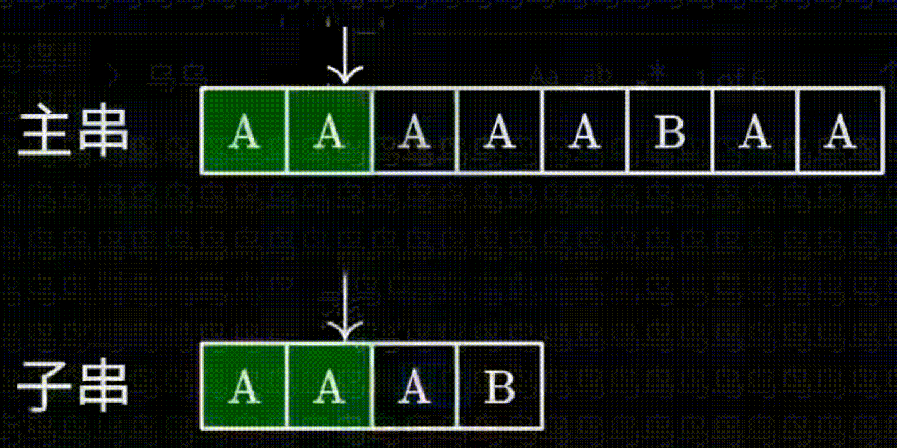
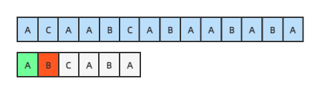
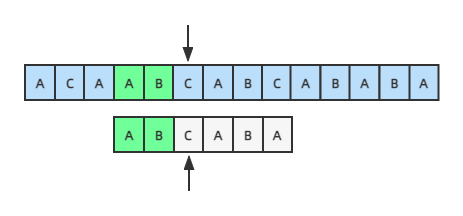
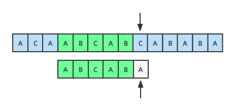
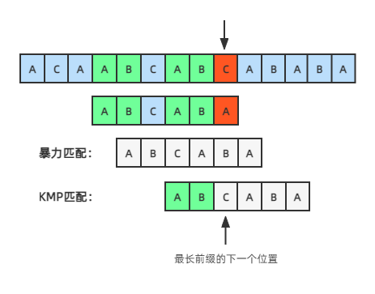
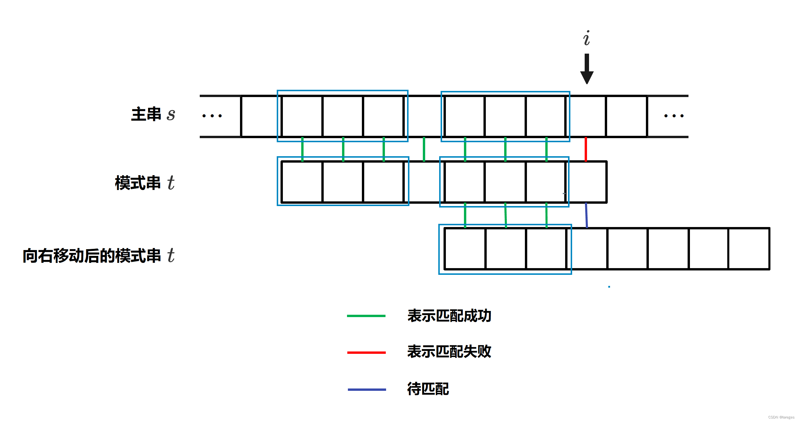
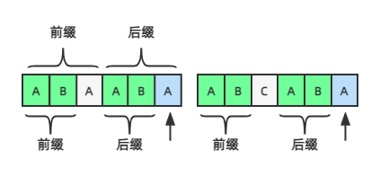
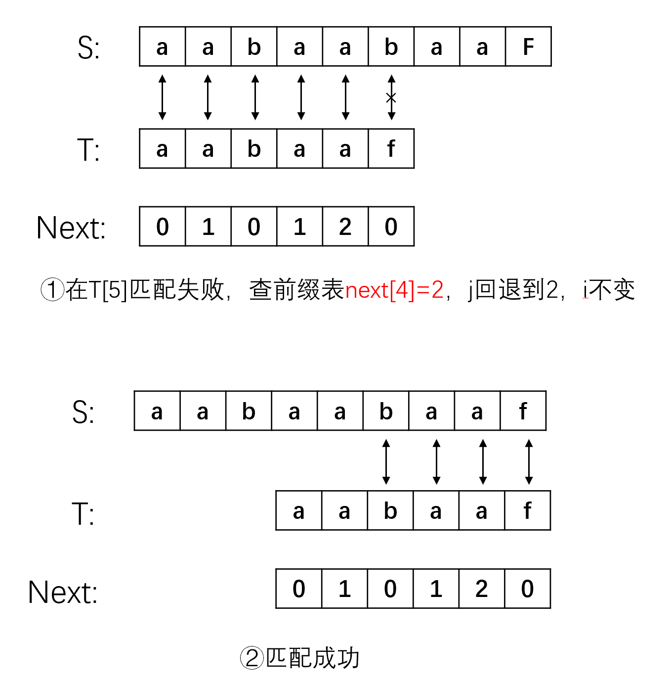

# KMP 算法


​	KMP 算法由 D.E.Knuth，J.H.Morris 和 V.R.Pratt 三位大神在1977年提出，它的核心算法是利用匹配失败后的信息，减少模式串与主串的匹配次数，以达到快速匹配的目的。


## 描述

字符串匹配又称模式匹配（pattern matching）。该问题可以概括为「 给定字符串 $s$  和 $t$ ，在主串 $s$  中寻找子串 $t$  」。字符串 $t$ 称为模式串 (pattern)。模式匹配成功是指在 $s$  中找到了 $t$ （可能存在多个），不成功是指 $s$  中不存在  $t$ 。

模式匹配的算法有很多种，这里主要讨论BF算法和KMP算法


## BF 算法

​	BF（Brute-Force）算法为暴力解法。设主串 $s=s_0s_1\cdots s_{n-1}$，模式串 $t=t_0t_1\cdots t_{m-1}$，分别用 $i,j$ 遍历 $s$ 和 $t$（初始均为 0），其基本过程如下：

- 第一趟匹配：$i=0,j=0$，从 $s_0,t_0$ 开始比较。若对应的字符相同，则继续比较各自的下一个字符。如果对应的字符全部相同且 $t$ 的字符比较完，说明模式匹配成功。在比较的过程中只要有一次不相同，说明第一趟匹配失败；
- 第二趟匹配：$i=1,j=0$，从 $s_1,t_0$ 开始比较。若对应的字符相同，则继续比较各自的下一个字符。如果对应的字符全部相同且 $t$ 的字符比较完，说明模式匹配成功。在比较的过程中只要有一次不相同，说明第二趟匹配失败；
- 以此类推，只要有一趟匹配成功，就说明 $t$ 是 $s$ 的子串，返回  $t$ 在  $s$ 中的起始下标。如果 $i$ 超界都没有匹配成功，说明 $t$ 不是 $s$  的子串，返回  $−1$ 。
  

```c
int bf(const string &s, const string &t) {
    int i = 0, j = 0;
    while (i < s.size() && j < t.size()) {
        if (s[i] == t[j]) i++, j++;
        else i = i - j + 1, j = 0;
    }
    if (j == t.size()) return i - j;
    else return -1;
}
```



​	BF 算法采用了穷举的思路，所以效率不高。该算法在最好的情况下时间复杂度为 $O(m)$ ，即主串的前 $m$ 个字符正好等于模式串的 $m$ 个字符。在最坏情况下的时间复杂度和平均时间复杂度均为 $O(nm)$ 。空间复杂度为 $O(1)$ 。


## KMP 算法


### 字符串基础

**子串**： 字符串 $s$ 的子串 ，$s[i..j]，i ≤ j$，表示 $s$ 串中从 $i$ 到 $j$ 这一段，也就是顺次排列 $s[i],s[i+1],\cdots,s[j]$ 形成的字符串。有时也会用 $s[i..j]，i > j$  来表示空串

**子序列**： 字符串 $s$ 的子序列是从 $s$ 中将若干元素提取出来并不改变相对位置形成的序列，即 $s[p_1],s[p_2],\cdots,s[p_k]，0\le p_1< p_2<\cdots< p_k\le|s|-1$ 

**后缀**： 是指从某个位置 $i$  开始到整个串末尾结束的一个特殊子串。字符串 $s$ 的从 $i$ 开头的后缀表示为 $s[i..|s|-1]$ 

**真后缀**： 指除了 $s$ 本身的 $s$ 的后缀

**前缀**： 是指从串首开始到某个位置 $i$ 结束的一个特殊子串。字符串  $s$  的以 $i$ 结尾的前缀表示为 $s[0..i]$ 

**真前缀**： 指除了 $s$  本身的 $s$ 的前缀

例如，对于字符串 `ababab`，其真前缀有 `a`，`ab`，`aba`，`abab`，`ababa`，真后缀有 `b`，`ab`，`bab`，`abab`，`babab`。公共（相等）的真前后缀有 `ab`，`abab`，最长公共真前后缀为 `abab`。再例如，对于字符串 `aaaabaaaaa`，最长公共真前后缀为 `aaaa`。


### Demonstrations

假设有如下图所示两个字符串，第一个字符`A`相同，第二个开始不同：



按暴力匹配的方法，此时应该从主串的第二个字符C开始重新匹配，但观察发现，主串后面的几个字符里根本就没有模式串的前两个字符AB，直到第四个开始才有AB这两个字符，**移动模式串**，把主串和模式串的两个字符AB对齐，AB这两个字符已经相同，不用比较，应该从AB 的下一个字符开始对比，这样才比较高效：


KMP算法的一个核心思路：**如果某个位置匹配失败，应该把模式串移动到哪个位置继续匹配才最高效**。假设匹配到如下位置，匹配失败：



前面已经匹配成功的字符串为`ABCAB`（绿色的部分），移动模式串的位置，为了让模式串中的前 $n$ 个字符和已经匹配完成的这几个字符的后面 $n$ 个字符对齐，其实就是绿色的这部分自己和自己对比计算。

可以发现 黑色指针 是不进行后退（回溯）操作的



字符串`ABCAB`的前缀集合为：`{A,AB,ABC,ABCA}`，后缀集合为：`{B,AB,CAB,BCAB}`。它的最长前缀为`AB`，长度为2，往后移动2个位置，让前后缀`AB`对齐后，应该从下一个位置（即下标为2）开始匹配。

KMP的核心思想是：**某个位置匹配失败时，移动到这个位置之前的字符串的最长前缀的下一个字符继续匹配。**如果公共真前后缀根本就不存在，需要将模式串不断右移直至模式串的第一个元素与指针 $i$ 所指向的元素对齐，这相当于让模式串右移 $j$  位，从而可知此时 $next[j]=0$ 




$next$ 数组只与模式串有关，且长度和模式串的长度相同。设模式串为 $t$，$next$ 数组的完整定义如下：

$\text{next}[i] = \begin{cases} 
-1 & i=0 \\
\max_{0 \lt k \lt i} \left\{ k : t[0..k - 1] = t[i - k..i - 1] \right\} & \text{公共真前后缀集合非空} \\
0 & 其他
\end{cases}$


### Next 数组

​	下图左边部分，箭头所指蓝色位置之前的字符串的最长前缀是AB，长度是 2，对比这个最长前缀的下一个字符 A 和蓝色位置 A 相同，那么整个字符串的前后缀就变成了 ABA，长度为 `2+1=3` 
​	蓝色的A之前是最长后缀，白色的A之前是最长前缀，而这个最长前后缀是相同的，都是AB，那么如果第三个字符也相同，长度就是2+1=3！也就是说，如果要计算到某个位置字符串的最长前缀长度，只需要将这个字符和它之前字符串的最长前缀的下一个字符对比，如果相同，则它的最长前缀长度就是前面字符串的最长前缀长度 `+1` 。



​	上图右边部分，蓝色的A不等于最长前缀的下一个字符C，应该往前回溯，字符C前面的字符串AB的最长前缀长度是 0（即后面代码里的 `k = next[k]` ），用这个前缀的下一个字符，即第1个字符A和当前字符比较，如果相同，则整个字符串的最长前缀长度为 0+1，如果不同，则继续往前回溯，直到第一个字符。也就是，不断往前回溯，用前面字符串的最长前缀的下一个字符和当前字符对比。

注意：next 数组保存的不是最长前缀的长度，而是对应的下标，也就是长度-1，如果长度是0，则保存 -1
举一个例子来具体说明一下
设字符串T=“aabaaf”，求一下 $T$ 的前缀表

- 第一个子串是t0=“a”，易知该子串没有前缀也没有后缀，故next[0]=0
- 第二个子串是t1=“aa”，该子串的前缀为"a"，后缀也为"a"，故next[1]=1
- 第三个子串是t2=“aab”，该子串的后缀中一定会有"b"，前缀中一定不含有"b"，则其没有相等的前后缀，故next[2]=0
- 第四个子串是t3=“aaba”，该子串的最大相等前后缀为"a"，长度为1，故next[3]=1
- 第五个子串是t4=“aabaa”，该子串的最大相等前后缀为"aa"，长度为2，故next[4]=2
- 第六个子串是t5=“aabaaf”，该子串的后缀中一定会有"f"，前缀中一定不含有"f"，则其没有相等的前后缀，故next[5]=0

得到字符串 $T$ 的前缀表为：

| j    | 0    | 1    | 2    | 3    | 4    | 5    |
| ---- | ---- | ---- | ---- | ---- | ---- | ---- |
| T    | a    | a    | b    | a    | a    | f    |
| next | 0    | 1    | 0    | 1    | 2    | 0    |

​	前缀表决定了**子串指针 $j$ 在匹配失败时回溯到的位置**

​	Next 数组保存的是模式串各个位置的字符匹配失败时应该往前回溯的位置，其值等于到该位置字符串的最长前缀的长度-1，应该从它的下一个位置（即这个值+1）开始匹配。




```java
public class KMP {

	public static void main(String[] args) {
		
		String t = "ACAABCABCABABA";
		String p = "ABCABA";
		
		int[] next = getNext(p);
		
		for (int i = 0; i < next.length; i++) {
			System.out.print(next[i] + ",");
		}
		
		System.out.println();
		System.out.println(getKMP(t, p));
	}
	
	public static int getKMP(String t, String p) {
		int index = -1;
		int pLength = p.length();
		int tLength = t.length();
		
		// 模式串的长度 小于 等于主串长度
		if (pLength <= tLength) {
		
			int[] next = getNext(p);
			int k = -1;
			for (int i = 0; i < tLength; i++) {
				
				// 当前字符和最长前缀下一个字符不同，则往前回溯
				while (k > -1 && t.charAt(i) != p.charAt(k + 1)) {
					// 已经比较了位置k+1的字符不同，往前回溯的话应该往k位置，k位置的最长前缀的位置k=next[k]
					k = next[k];
				}

			//	System.out.print(t.charAt(i) + " " + p.charAt(k + 1));
				
				if (t.charAt(i) == p.charAt(k + 1)) {
					// 这个k+1,其实就是模式串的下一个字符下标
					k = k + 1;
				//	System.out.print(" " + k + "\n");
					if (k == pLength - 1) {
						index = i - pLength + 1;
						break;
					}
				}
			}
		}
		
		return index;
	}
	
	
	public static int[] getNext(String p) {
		int[] next = new int[p.length()];
		next[0] = -1;
		int k = -1;
		for (int i = 1; i < p.length(); i++) {
			// 当前字符和最长前缀下一个字符不同，则往前回溯
			while (k > -1 && p.charAt(i) != p.charAt(k + 1)) {
				// 已经比较了位置k+1的字符不同，往前回溯的话应该往k位置，k位置的最长前缀的位置k=next[k]
				k = next[k];
			}
			// 当前字符和当前字符前面字符串的最长前缀的下一个字符相同，则k+1
			if (p.charAt(i) == p.charAt(k + 1)) {
				k = k + 1;
			}
			next[i] = k;
		}
		return next;
	}
}
```


```C++
#include <iostream>
#include <string>

using namespace std;

const int N = 1e5 + 10;

int nxt[N];

int kmp(const string &s, const string &t) {
    int i = 0, j = 0, k = -1;
    nxt[0] = -1;
    while (i < t.size() - 1) {
        if (k == -1 || t[k] == t[i]) nxt[++i] = ++k;
        else k = nxt[k];
    }

    i = 0;
    while (i < s.size() && j < (int) t.size()) {
        if (j == -1 || s[i] == t[j]) i++, j++;
        else j = nxt[j];
    }

    if (j == t.size()) return i - j;
    else return -1;
}

int main() {
    string s, t;
    cin >> s >> t;
    cout << kmp(s, t) << endl;
    return 0;
}
```

KMP 算法的最好时间复杂度为 $O(m)$，平均时间复杂度为 $O(n+m)$，最坏时间复杂度仍为 $O(nm)$。空间复杂度为 $O(m)$。


```C++
#include<iostream>
#include<string>
using namespace std;

const int N = 100010, M = 1000010;

int n, m;
int ne[N];
string s, p;

void get_Next(string s, int ne[])		//这个函数对字符串s进行预处理得到next数组
{
	int j = 0;
	ne[0] = 0;	//初始化
	for (int i = 1; i < s.size(); i++) {	//i指针指向的是后缀末尾，j指针指向的是前缀末尾
		while (j > 0 && s[i] != s[j])	j = ne[j - 1];	//前后缀不相同，去找j前一位的最长相等前后缀
		if (s[i] == s[j])	j++;	//前后缀相同，j指针后移
		ne[i] = j;	//更新next数组
	}
}

int main()
{
	cin >> n >> p >> m >> s;

	get_Next(p, ne);

	for (int i = 0, j = 0; i < m; i++) {	
		while (j > 0 && s[i] != p[j])	j = ne[j - 1];
		if (s[i] == p[j])	j++;
		if (j == n) {
			cout << i - n + 1 << " ";
			j = ne[j - 1];	
		}
	}

	return 0;
}
```


