# 第1章 Flink 概述

## **1.1 Flink是什么**


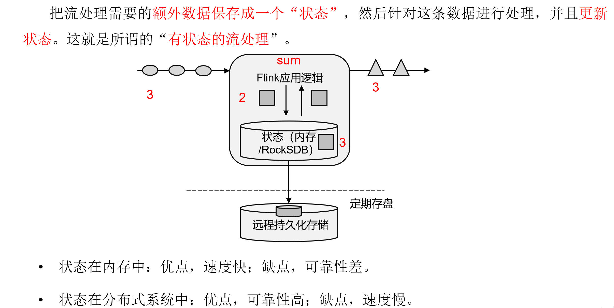

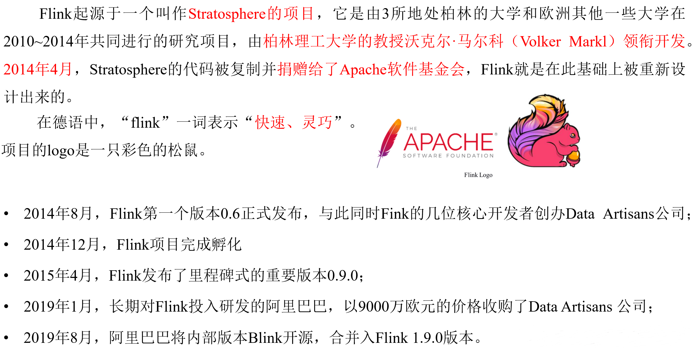


## **1.2 Flink 特点**


## **1.3 Flink vs SparkStreaming**


<div style="text-align: center;">表 Flink 和 Streaming 对比</div>

|                          | Flink                              | Streaming                                            |
| :----------------------- | :--------------------------------- | ---------------------------------------------------- |
| **时间语义**             | **事件时间、处理时间**             | **处理时间**                                         |
| **窗口**    **时间语义** | 多、灵活    **事件时间、处理时间** | 少、不灵活（窗口必须是批次的整数倍）    **处理时间** |
| **状态**    **窗口**     | 有    多、灵活                     | 没有    少、不灵活（窗口必须是批次的整数倍）         |
| **流式SQL**    **状态**  | 有    有                           | 没有    没有                                         |
| **流式SQL**              | 有                                 | 没有                                                 |

## **1.4 Flink 的应用场景**


## **1.5 Flink 分层 API**


# 第2章 Flink 快速上手

## **2.1 创建项目**

​	在准备好所有的开发环境之后，就可以开始开发自己的第一个Flink程序了。首先要做的，就是在IDEA中搭建一个Flink项目的骨架。会使用Java项目中常见的Maven来进行依赖管理。

**1）创建工程**

（1）打开IntelliJ IDEA，创建一个Maven工程

{width="4.037398293963254in"
height="3.794407261592301in"}

（2）将这个Maven工程命名为FlinkTutorial

{width="5.763888888888889in"
height="3.670138888888889in"}

（3）选定这个Maven工程所在存储路径，并点击Finish，Maven工程即创建成功

{width="5.763888888888889in"
height="3.670138888888889in"}

**2）添加项目依赖**

在项目的pom文件中，添加Flink的依赖，包括flink-java、flink-streaming-java，以及flink-clients（客户端，也可以省略）

```xml
<properties>
        <flink.version>1.17.0</flink.version>
</properties>

<dependencies>
  <dependency>
      <groupId>org.apache.flink</groupId>
      <artifactId>flink-streaming-java</artifactId>
      <version>${flink.version}</version>
  </dependency>

  <dependency>
        <groupId>org.apache.flink</groupId>
        <artifactId>flink-clients</artifactId>
        <version>${flink.version}</version>
  </dependency>
</dependencies>
```


## **2.2 WordCount代码编写**

需求：统计一段文字中，每个单词出现的频次。

环境准备：在src/main/java目录下，新建一个包，命名为com.gardenia.wc。

### **2.2.1 批处理**

批处理基本思路：先逐行读入文件数据，然后将每一行文字拆分成单词；接着按照单词分组，统计每组数据的个数，就是对应单词的频次。

**1）数据准备**

（1）在工程根目录下新建一个input文件夹，并在下面创建文本文件words.txt

（2）在words.txt中输入一些文字，例如：

```txt
hello flink
hello world
hello java
```


**2）代码编写**

（1）在com.gardenia.wc包下新建Java类BatchWordCount，在静态main方法中编写代码。具体代码实现如下：

```java
import org.apache.flink.api.common.typeinfo.Types;
import org.apache.flink.api.java.ExecutionEnvironment;
import org.apache.flink.api.java.operators.AggregateOperator;
import org.apache.flink.api.java.operators.DataSource;
import org.apache.flink.api.java.operators.FlatMapOperator;
import org.apache.flink.api.java.operators.UnsortedGrouping;
import org.apache.flink.api.java.tuple.Tuple2;
import org.apache.flink.util.Collector;

public class BatchWordCount {

    public static void main(String[] args) throws Exception {

        // 1. 创建执行环境
        ExecutionEnvironment env = ExecutionEnvironment.getExecutionEnvironment();
        
        // 2. 从文件读取数据  按行读取(存储的元素就是每行的文本)
        DataSource<String> lineDS = env.readTextFile("input/words.txt");
        
        // 3. 转换数据格式
        FlatMapOperator<String, Tuple2<String, Long>> wordAndOne = lineDS.flatMap(new FlatMapFunction<String, Tuple2<String, Long>>() {

            @Override
            public void flatMap(String line, Collector<Tuple2<String, Long>> out) throws Exception {

                String[] words = line.split(" ");

                for (String word : words) {
                    out.collect(Tuple2.of(word,1L));
                }
            }
        });

        // 4. 按照 word 进行分组
        UnsortedGrouping<Tuple2<String, Long>> wordAndOneUG = wordAndOne.groupBy(0);
        
        // 5. 分组内聚合统计
        AggregateOperator<Tuple2<String, Long>> sum = wordAndOneUG.sum(1);

        // 6. 打印结果
        sum.print();
    }
}
```

（2）输出

```txt
(flink,1)
(world,1)
(hello,3)
(java,1)
```

​	需要注意的是，这种代码的实现方式，是基于DataSet API的，也就是对数据的处理转换，是看作数据集来进行操作的。事实上Flink本身是流批统一的处理架构，批量的数据集本质上也是流，没有必要用两套不同的API来实现。所以从 Flink 1.12开始，官方推荐的做法是直接使用DataStream API，在提交任务时通过将执行模式设为BATCH来进行批处理：

```bash
bin/flink run -Dexecution.runtime-mode=BATCH BatchWordCount.jar
```

这样，DataSet API就没什么用了，在实际应用中只要维护一套DataStream API就可以。这里只是为了方便大家理解，依然用DataSet API做了批处理的实现。

### **2.2.2 流处理**

​	对于Flink而言，流才是整个处理逻辑的底层核心，所以流批统一之后的DataStream API更加强大，可以直接处理批处理和流处理的所有场景。

​	下面就针对不同类型的输入数据源，用具体的代码来实现流处理。

**1）读取文件**

​	同样试图读取文档words.txt中的数据，并统计每个单词出现的频次。整体思路与之前的批处理非常类似，代码模式也基本一致。

​	在com.gardenia.wc包下新建Java类StreamWordCount，在静态main方法中编写代码。具体代码实现如下：

```java
import org.apache.flink.api.common.typeinfo.Types;
import org.apache.flink.api.java.tuple.Tuple2;
import org.apache.flink.streaming.api.datastream.DataStreamSource;
import org.apache.flink.streaming.api.datastream.SingleOutputStreamOperator;
import org.apache.flink.streaming.api.environment.StreamExecutionEnvironment;
import org.apache.flink.util.Collector;

import java.util.Arrays;

public class StreamWordCount {

    public static void main(String[] args) throws Exception {
    
        // 1. 创建流式执行环境
        StreamExecutionEnvironment env = StreamExecutionEnvironment.getExecutionEnvironment();
        
        // 2. 读取文件
        DataStreamSource<String> lineStream = env.readTextFile("input/words.txt");
        
        // 3. 转换、分组、求和，得到统计结果
        SingleOutputStreamOperator<Tuple2<String, Long>> sum = lineStream.flatMap(new FlatMapFunction<String, Tuple2<String, Long>>() {
            @Override
            public void flatMap(String line, Collector<Tuple2<String, Long>> out) throws Exception {

                String[] words = line.split(" ");

                for (String word : words) {
                    out.collect(Tuple2.of(word, 1L));
                }
            }
        }).keyBy(data -> data.f0)
           .sum(1);

        // 4. 打印
        sum.print();
        
        // 5. 执行
        env.execute();
    }
}
```


输出：

```txt
3\> (java,1)
5\> (hello,1)
5\> (hello,2)
5\> (hello,3)
13\> (flink,1)
9\> (world,1)
```

主要观察与批处理程序BatchWordCount的不同：

-   创建执行环境的不同，流处理程序使用的是StreamExecutionEnvironment。

-   转换处理之后，得到的数据对象类型不同。

-   分组操作调用的是keyBy方法，可以传入一个匿名函数作为键选择器（KeySelector），指定当前分组的key是什么。

-   代码末尾需要调用env的execute方法，开始执行任务。

**2）读取socket文本流**

在实际的生产环境中，真正的数据流其实是无界的，有开始却没有结束，这就要求需要持续地处理捕获的数据。为了模拟这种场景，可以监听socket端口，然后向该端口不断的发送数据。

（1）将StreamWordCount代码中读取文件数据的readTextFile方法，替换成读取socket文本流的方法socketTextStream。具体代码实现如下：

```java
import org.apache.flink.api.common.typeinfo.Types;
import org.apache.flink.api.java.tuple.Tuple2;
import org.apache.flink.streaming.api.datastream.DataStreamSource;
import org.apache.flink.streaming.api.datastream.SingleOutputStreamOperator;
import org.apache.flink.streaming.api.environment.StreamExecutionEnvironment;
import org.apache.flink.util.Collector;

import java.util.Arrays;

public class SocketStreamWordCount {

    public static void main(String[] args) throws Exception {

        // 1. 创建流式执行环境
        StreamExecutionEnvironment env = StreamExecutionEnvironment.getExecutionEnvironment();
        
        // 2. 读取文本流：hadoop102表示发送端主机名、7777表示端口号
        DataStreamSource<String> lineStream = env.socketTextStream("hadoop102", 7777);
        
        // 3. 转换、分组、求和，得到统计结果
        SingleOutputStreamOperator<Tuple2<String, Long>> sum = lineStream.flatMap((String line, Collector<Tuple2<String, Long>> out) -> {
            String[] words = line.split(" ");

            for (String word : words) {
                out.collect(Tuple2.of(word, 1L));
            }
        }).returns(Types.TUPLE(Types.STRING, Types.LONG))
                .keyBy(data -> data.f0)
                .sum(1);

        // 4. 打印
        sum.print();
        
        // 5. 执行
        env.execute();
    }
}
```

（2）在Linux环境的主机hadoop102上，执行下列命令，发送数据进行测试

```bash
nc -lk 7777
```

注意：要先启动端口，后启动StreamWordCount程序，否则会报超时连接异常。

（3）启动StreamWordCount程序

​	发现程序启动之后没有任何输出、也不会退出。这是正常的，因为Flink的流处理是事件驱动的，当前程序会一直处于监听状态，只有接收到数据才会执行任务、输出统计结果。

（4）从hadoop102发送数据

​	① 在hadoop102主机中，输入"hello flink"，输出如下内容

```txtx
13\> (flink,1)
5\> (hello,1)
```

​	②再输入"hello world"，输出如下内容

```txt
2\> (world,1)
5\> (hello,2)
```

说明：

​	Flink还具有一个类型提取系统，可以分析函数的输入和返回类型，自动获取类型信息，从而获得对应的序列化器和反序列化器。但是，由于Java中**泛型擦除**的存在，在某些特殊情况下（比如Lambda表达式中），自动提取的信息是不够精细的------只告诉Flink当前的元素由"船头、船身、船尾"构成，根本无法重建出"大船"的模样；这时就需要显式地提供类型信息，才能使应用程序正常工作或提高其性能。

​	因为对于flatMap里传入的Lambda表达式，系统只能推断出返回的是Tuple2类型，而无法得到Tuple2\<String,
Long\>。只有显式地告诉系统当前的返回类型，才能正确地解析出完整数据。

# 第3章 Flink部署

## **3.1 集群角色**


## **3.2 Flink 集群搭建**

### **3.2.1 集群启动**

**0）集群规划**

<div style="text-align: center;">表 3-1 集群角色分配</div>

| **节点服务器** | **hadoop102**              | **hadoop103** | **hadoop104** |
| -------------- | -------------------------- | ------------- | ------------- |
| **角色**       | JobManager</br>TaskManager | TaskManager   | TaskManager   |

具体安装部署步骤如下：

**1）下载并解压安装包**

（1）下载安装包 `flink-1.17.0-bin-scala_2.12.tgz` ，将该jar包上传到hadoop102节点服务器的 `/opt/software` 路径上

（2）在/opt/software路径上解压 `flink-1.17.0-bin-scala_2.12.tgz` 到 `/opt/module` 路径上

```bash
tar -zxvf flink-1.17.0-bin-scala_2.12.tgz -C /opt/module/
```

**2）修改集群配置**

（1）进入conf路径，修改flink-conf.yaml文件，指定hadoop102节点服务器为JobManager

```bash
vim flink-conf.yaml
```

修改如下内容：

```yaml
# JobManager节点地址.
jobmanager.rpc.address: hadoop102
jobmanager.bind-host: 0.0.0.0
rest.address: hadoop102
rest.bind-address: 0.0.0.0
# TaskManager节点地址.需要配置为当前机器名
taskmanager.bind-host: 0.0.0.0
taskmanager.host: hadoop102
```

（2）修改 workers文件，指定 `hadoop102` 、hadoop103 和 hadoop104 为 TaskManager

```bash
vim workers
```

修改如下内容：

```txt
vim workers
```

（3）修改 masters 文件

```bash
vim masters
# 修改如下内容：
hadoop102:8081
```

（4）另外，在flink-conf.yaml文件中还可以对集群中的JobManager和TaskManager组件进行优化配置，主要配置项如下：

-   jobmanager.memory.process.size：对JobManager进程可使用到的全部内存进行配置，包括JVM元空间和其他开销，默认为1600M，可以根据集群规模进行适当调整。

-   taskmanager.memory.process.size：对TaskManager进程可使用到的全部内存进行配置，包括JVM元空间和其他开销，默认为1728M，可以根据集群规模进行适当调整。

-   taskmanager.numberOfTaskSlots：对每个TaskManager能够分配的Slot数量进行配置，默认为1，可根据TaskManager所在的机器能够提供给Flink的CPU数量决定。所谓Slot就是TaskManager中具体运行一个任务所分配的计算资源。

-   parallelism.default：Flink任务执行的并行度，默认为1。优先级低于代码中进行的并行度配置和任务提交时使用参数指定的并行度数量。

**3）分发安装目录**

（1）配置修改完毕后，将Flink安装目录发给另外两个节点服务器

```bash
xsync flink-1.17.0/
```

（2）修改 hadoop103 的  `taskmanager.host` 

```bash
vim flink-conf.yaml

# 修改如下内容：
# TaskManager节点地址.需要配置为当前机器名
taskmanager.host: hadoop103
```

（3）修改hadoop104的 taskmanager.host

```bash
vim flink-conf.yaml

# 修改如下内容：
# TaskManager节点地址.需要配置为当前机器名
taskmanager.host: hadoop104
```

**4）启动集群**

（1）在hadoop102节点服务器上执行start-cluster.sh启动Flink集群：

```bash
bin/start-cluster.sh
```

（2）查看进程情况：

```bash
jpsall 

=============== hadoop102 ===============
4453 StandaloneSessionClusterEntrypoint
4458 TaskManagerRunner
4533 Jps
=============== hadoop103 ===============
2872 TaskManagerRunner
2941 Jps
=============== hadoop104 ===============
2948 Jps
2876 TaskManagerRunner
```

**5）访问 Web UI**

启动成功后，同样可以访问<http://hadoop102:8081>对 flink 集群和任务进行监控管理

{width="5.90625in"
height="2.7555555555555555in"}

这里可以明显看到，当前集群的TaskManager数量为3；由于默认每个TaskManager的Slot数量为1，所以总Slot数和可用Slot数都为3

### **3.2.2 向集群提交作业**

​	在上一章中，已经编写读取socket发送的单词并统计单词的个数程序案例。本节将以该程序为例，演示如何将任务提交到集群中进行执行。具体步骤如下。

**1）环境准备**

在hadoop102中执行以下命令启动 netcat

```bash
nc -lk 7777
```

**2）程序打包**

（1）在编写的Flink入门程序的pom.xml文件中添加打包插件的配置，具体如下：

```xml
<build>
    <plugins>
        <plugin>
            <groupId>org.apache.maven.plugins</groupId>
            <artifactId>maven-shade-plugin</artifactId>
            <version>3.2.4</version>
            <executions>
                <execution>
                    <phase>package</phase>
                    <goals>
                        <goal>shade</goal>
                    </goals>
                    <configuration>
                        <artifactSet>
                            <excludes>
                                <exclude>com.google.code.findbugs:jsr305</exclude>
                                <exclude>org.slf4j:*</exclude>
                                <exclude>log4j:*</exclude>
                            </excludes>
                        </artifactSet>
                        <filters>
                            <filter>
                                <!-- Do not copy the signatures in the META-INF folder.
                                Otherwise, this might cause SecurityExceptions when using the JAR. -->
                                <artifact>*:*</artifact>
                                <excludes>
                                    <exclude>META-INF/*.SF</exclude>
                                    <exclude>META-INF/*.DSA</exclude>
                                    <exclude>META-INF/*.RSA</exclude>
                                </excludes>
                            </filter>
                        </filters>
                        <transformers combine.children="append">
                            <transformer
                                    implementation="org.apache.maven.plugins.shade.resource.ServicesResourceTransformer">
                            </transformer>
                        </transformers>
                    </configuration>
                </execution>
            </executions>
        </plugin>
    </plugins>
</build>
```

（2）插件配置完毕后，可以使用IDEA的Maven工具执行package命令，出现如下提示即表示打包成功

​	打包完成后，在target目录下即可找到所需JAR包，JAR包会有两个，`FlinkTutorial-1.0-SNAPSHOT.jar` 和 `FlinkTutorial-1.0-SNAPSHOT-jar-with-dependencies.jar` ，因为集群中已经具备任务运行所需的所有依赖，所以建议使用 `FlinkTutorial-1.0-SNAPSHOT.jar` 

**3）在Web UI上提交作业**

（1）任务打包完成后，打开Flink的WEB UI页面，在右侧导航栏点击"Submit
New Job"，然后点击按钮"+ Add New"，选择要上传运行的JAR包，如下图所示

{width="5.90625in"
height="1.6388888888888888in"}

JAR包上传完成，如下图所示：

{width="5.90625in"
height="1.6145833333333333in"}

（2）点击该JAR包，出现任务配置页面，进行相应配置

​	主要配置程序入口主类的全类名，任务运行的并行度，任务运行所需的配置参数和保存点路径等，如下图所示，配置完成后，即可点击按钮"Submit"，将任务提交到集群运行。

{width="5.90625in"
height="1.6270833333333334in"}

（3）任务提交成功之后，可点击左侧导航栏的"Running
		Jobs"查看程序运行列表情况

{width="5.90625in" height="1.261111111111111in"}

（4）测试

①在 socket 端口中输入 hello

```bash
nc -lk 7777
hello
```

②先点击Task Manager，然后点击右侧的192.168.10.104服务器节点

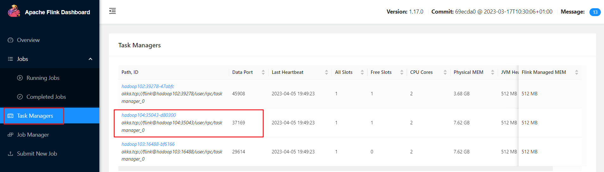{width="5.90625in"
height="1.6861111111111111in"}

③点击Stdout，就可以看到hello单词的统计

{width="5.90625in"
height="1.7604166666666667in"}

注意：如果hadoop104节点没有统计单词数据，可以去其他TaskManager节点查看。

（4）点击该任务，可以查看任务运行的具体情况，也可以通过点击"Cancel
Job"结束任务运行。

{width="5.90625in"
height="2.6506944444444445in"}

**4）命令行提交作业**

除了通过WEB
UI界面提交任务之外，也可以直接通过命令行来提交任务。这里为方便起见，可以先把jar包直接上传到目录flink-1.17.0下

（1）首先需要启动集群。

```bash
bin/start-cluster.sh
```

（2）在hadoop102中执行以下命令启动netcat。

```bash
nc -lk 7777
```

（3）将flink程序运行jar包上传到/opt/module/flink-1.17.0路径。

（4）进入到flink的安装路径下，在命令行使用flink run命令提交作业。

```bahs
bin/flink run -m hadoop102:8081 -c com.gardenia.wc.SocketStreamWordCount ./FlinkTutorial-1.0-SNAPSHOT.jar
```

这里的参数 -m指定了提交到的JobManager，-c指定了入口类。

（5）在浏览器中打开Web UI，[http://hadoop102:8081查看应用执行情况](http://hadoop102:8081查看应用执行情况，)。

用netcat输入数据，可以在TaskManager的标准输出（Stdout）看到对应的统计结果。

{width="5.90625in"
height="1.9881944444444444in"}

（6）在 `/opt/module/flink-1.17.0/log` 路径中，可以查看TaskManager节点。

```bash
cat flink-gardenia-standalonesession-0-hadoop102.out
(hello,1)
(hello,2)
(flink,1)
(hello,3)
(scala,1)
```

## **3.3 部署模式**

​	在一些应用场景中，对于集群资源分配和占用的方式，可能会有特定的需求。Flink为各种场景提供了不同的部署模式，主要有以下三种：会话模式（Session Mode）、单作业模式（Per-Job Mode）、应用模式（Application Mode）。

​	它们的区别主要在于：集群的生命周期以及资源的分配方式；以及应用的main方法到底在哪里执行------客户端（Client）还是JobManager。

### **3.3.1 会话模式（Session Mode）**

会话模式比较适合于单个规模小、执行时间短的大量作业。


### **3.3.2 单作业模式（Per-Job Mode）**

​	作业完成后，集群就会关闭，所有资源也会释放

​	这些特性使得单作业模式在生产环境运行更加稳定，所以是实际应用的**首选模式**

​	需要注意的是，Flink本身无法直接这样运行，所以单作业模式一般需要借助一些资源管理框架来启动集群，比如YARN、Kubernetes
K8S） 


### **3.3.3 应用模式（Application Mode）**


​	这里所讲到的部署模式，相对是比较抽象的概念。实际应用时，一般需要和资源管理平台结合起来，选择特定的模式来分配资源、部署应用。接下来，就针对不同的资源提供者的场景，具体介绍Flink的部署方式。

## **3.4 Standalone运行模式（了解）**

独立模式是独立运行的，不依赖任何外部的资源管理平台；当然独立也是有代价的：如果资源不足，或者出现故障，没有自动扩展或重分配资源的保证，必须手动处理。所以独立模式一般只用在开发测试或作业非常少的场景下。

### **3.4.1 会话模式部署**

在第3.2节用的就是Standalone集群的会话模式部署。

提前启动集群，并通过Web页面客户端提交任务（可以多个任务，但是集群资源固定）

{width="2.797846675415573in"
height="0.9879943132108486in"}

### **3.4.2 单作业模式部署**

Flink的Standalone集群并不支持单作业模式部署。因为单作业模式需要借助一些资源管理平台。

### **3.4.3 应用模式部署**

应用模式下不会提前创建集群，所以不能调用start-cluster.sh脚本。可以使用同样在bin目录下的standalone-job.sh来创建一个JobManager。

{width="4.140764435695538in"
height="0.7880085301837271in"}

具体步骤如下：

（0）环境准备。在hadoop102中执行以下命令启动netcat

```bash
 nc -lk 7777
```

（1）进入到Flink的安装路径下，将应用程序的jar包放到lib/目录下

```bash
mv FlinkTutorial-1.0-SNAPSHOT.jar lib/
```

（2）执行以下命令，启动JobManager

```bash
bin/standalone-job.sh start --job-classname com.gardenia.wc.SocketStreamWordCount
```

这里直接指定作业入口类，脚本会到lib目录扫描所有的jar包。

（3）同样是使用bin目录下的脚本，启动TaskManager

```bash
bin/taskmanager.sh start
```

（4）在hadoop102上模拟发送单词数据

```bash
nc -lk 7777

hello
```

（5）在hadoop102:8081地址中观察输出数据

{width="5.90625in" height="2.071527777777778in"}

（6）如果希望停掉集群，同样可以使用脚本，命令如下。

```bash
bin/taskmanager.sh stop
```

```bash
bin/standalone-job.sh stop
```

## **3.5 YARN运行模式（重点）**

​	YARN上部署的过程是：客户端把Flink应用提交给Yarn的ResourceManager，Yarn的ResourceManager会向Yarn的NodeManager申请容器。在这些容器上，Flink会部署JobManager和TaskManager的实例，从而启动集群。Flink会根据运行在JobManger上的作业所需要的Slot数量动态分配TaskManager资源。

### **3.5.1 相关准备和配置**

​	在将Flink任务部署至YARN集群之前，需要确认集群是否安装有Hadoop，保证Hadoop版本至少在2.2以上，并且集群中安装有HDFS服务。

具体配置步骤如下：

（1）配置环境变量，增加环境变量配置如下：

```bash
sudo vim /etc/profile.d/my_env.sh

HADOOP_HOME=/opt/module/hadoop-3.3.4
export PATH=$PATH:$HADOOP_HOME/bin:$HADOOP_HOME/sbin
export HADOOP_CONF_DIR=${HADOOP_HOME}/etc/hadoop
export HADOOP_CLASSPATH=`hadoop classpath`
```

（2）启动Hadoop集群，包括HDFS和YARN。

```bash
start-dfs.sh

 start-yarn.sh
```

（3）在hadoop102中执行以下命令启动netcat。

```bash
nc -lk 7777
```

### **3.5.2 会话模式部署**

​	YARN的会话模式与独立集群略有不同，需要首先申请一个YARN会话（YARN Session）来启动Flink集群。具体步骤如下：

**1）启动集群**

（1）启动Hadoop集群（HDFS、YARN）。

（2）执行脚本命令向YARN集群申请资源，开启一个YARN会话，启动Flink集群。

```bash
bin/yarn-session.sh -nm test
```

可用参数解读：

-   -d：分离模式，如果你不想让Flink
    YARN客户端一直前台运行，可以使用这个参数，即使关掉当前对话窗口，YARN
    session也可以后台运行。

-   -jm（\--jobManagerMemory）：配置JobManager所需内存，默认单位MB。

-   -nm（\--name）：配置在YARN UI界面上显示的任务名。

-   -qu（\--queue）：指定YARN队列名。

-   -tm（\--taskManager）：配置每个TaskManager所使用内存。

​	注意：Flink1.11.0版本不再使用-n参数和-s参数分别指定TaskManager数量和slot数量，YARN会按照需求动态分配TaskManager和slot。所以从这个意义上讲，YARN的会话模式也不会把集群资源固定，同样是动态分配的。

​	YARN Session启动之后会给出一个Web UI地址以及一个YARN application ID，如下所示，用户可以通过Web UI或者命令行两种方式提交作业。

```bash
2022-11-17 15:20:52,711 INFO org.apache.flink.yarn.YarnClusterDescriptor \[\] - Found Web Interface hadoop104:40825 of application
\'application_1668668287070_0005\'.

JobManager Web Interface: http://hadoop104:40825
```

**2）提交作业**

（1）通过Web UI提交作业

这种方式比较简单，与上文所述Standalone部署模式基本相同。

{width="5.90625in"
height="1.6388888888888888in"}

（2）通过命令行提交作业

① 将FlinkTutorial-1.0-SNAPSHOT.jar任务上传至集群。

② 执行以下命令将该任务提交到已经开启的Yarn-Session中运行。

```bash
bin/flink run -c com.gardenia.wc.SocketStreamWordCount FlinkTutorial-1.0-SNAPSHOT.jar
```

​	客户端可以自行确定JobManager的地址，也可以通过-m或者-jobmanager参数指定JobManager的地址，JobManager的地址在YARN Session的启动页面中可以找到。

③ 任务提交成功后，可在YARN的Web UI界面查看运行情况。hadoop103:8088。

{width="5.826719160104987in"
height="1.760346675415573in"}

从上图中可以看到创建的Yarn-Session实际上是一个Yarn的Application，并且有唯一的Application ID

④也可以通过Flink的Web UI页面查看提交任务的运行情况，如下图所示

{width="5.90625in" height="1.261111111111111in"}

### **3.5.3 单作业模式部署**

在YARN环境中，由于有了外部平台做资源调度，所以也可以直接向YARN提交一个单独的作业，从而启动一个Flink集群。

（1）执行命令提交作业。

```bash
bin/flink run -d -t yarn-per-job -c com.gardenia.wc.SocketStreamWordCount FlinkTutorial-1.0-SNAPSHOT.jar
```

注意：如果启动过程中报如下异常

```bash
Exception in thread "Thread-5" java.lang.IllegalStateException: Trying
to access closed classloader. Please check if you store classloaders
directly or indirectly in static fields. If the stacktrace suggests that
the leak occurs in a third party library and cannot be fixed
immediately, you can disable this check with the configuration
'classloader.check-leaked-classloader'.
at org.apache.flink.runtime.execution.librarycache.FlinkUserCodeClassLoaders
```

解决办法：在flink的 `/opt/module/flink-1.17.0/conf/flink-conf.yaml` 配置文件中设置

```bash
vim flink-conf.yaml

classloader.check-leaked-classloader: false
```

（2）在YARN的ResourceManager界面查看执行情况。

{width="5.848102580927384in"
height="0.8529308836395451in"}

点击可以打开Flink Web UI页面进行监控，如下图所示：

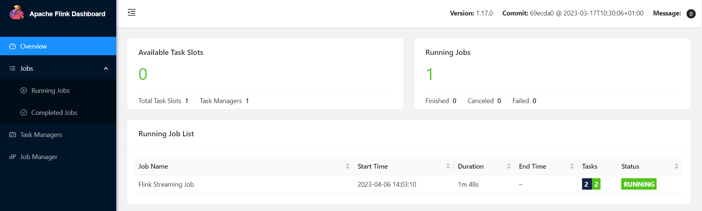{width="5.90625in"
height="1.7791666666666666in"}

（3）可以使用命令行查看或取消作业，命令如下。

```bash
bin/flink list -t yarn-per-job -Dyarn.application.id=application_XXXX_YY
```

```bash
bin/flink cancel -t yarn-per-job -Dyarn.application.id=application_XXXX_YY \<jobId\>
```

这里的application_XXXX_YY是当前应用的ID，\<jobId\>是作业的ID。注意如果取消作业，整个Flink集群也会停掉

### **3.5.4 应用模式部署**

应用模式同样非常简单，与单作业模式类似，直接执行flink run-application命令即可。

**1）命令行提交**

（1）执行命令提交作业

```bash
bin/flink run-application -t yarn-application -c com.gardenia.wc.SocketStreamWordCount FlinkTutorial-1.0-SNAPSHOT.jar
```

（2）在命令行中查看或取消作业

```bash
bin/flink list -t yarn-application -Dyarn.application.id=application_XXXX_YY
```

```bash
bin/flink cancel -t yarn-application -Dyarn.application.id=application_XXXX_YY <jobId>
```

**2）上传HDFS提交**

可以通过yarn.provided.lib.dirs配置选项指定位置，将flink的依赖上传到远程。

（1）上传flink的lib和plugins到HDFS上

\[gardenia@hadoop102 flink-1.17.0\]\$ hadoop fs -mkdir /flink-dist

\[gardenia@hadoop102 flink-1.17.0\]\$ hadoop fs -put lib/ /flink-dist

\[gardenia@hadoop102 flink-1.17.0\]\$ hadoop fs -put plugins/ /flink-dist

（2）上传自己的jar包到HDFS

\[gardenia@hadoop102 flink-1.17.0\]\$ hadoop fs -mkdir /flink-jars

\[gardenia@hadoop102 flink-1.17.0\]\$ hadoop fs -put
FlinkTutorial-1.0-SNAPSHOT.jar /flink-jars

（3）提交作业

\[gardenia@hadoop102 flink-1.17.0\]\$ bin/flink run-application -t
yarn-application
-Dyarn.provided.lib.dirs=\"hdfs://hadoop102:8020/flink-dist\" -c
com.gardenia.wc.SocketStreamWordCount
hdfs://hadoop102:8020/flink-jars/FlinkTutorial-1.0-SNAPSHOT.jar

这种方式下，flink本身的依赖和用户jar可以预先上传到HDFS，而不需要单独发送到集群，这就使得作业提交更加轻量了。

## **3.6 K8S 运行模式（了解）**

容器化部署是如今业界流行的一项技术，基于Docker镜像运行能够让用户更加方便地对应用进行管理和运维。容器管理工具中最为流行的就是Kubernetes（k8s），而Flink也在最近的版本中支持了k8s部署模式。基本原理与YARN是类似的，具体配置可以参见官网说明，这里就不做过多讲解了。

## **3.7 历史服务器**

运行 Flink job 的集群一旦停止，只能去 yarn
或本地磁盘上查看日志，不再可以查看作业挂掉之前的运行的 Web
UI，很难清楚知道作业在挂的那一刻到底发生了什么。如果还没有 Metrics
监控的话，那么完全就只能通过日志去分析和定位问题了，所以如果能还原之前的
Web UI，可以通过 UI 发现和定位一些问题。

Flink提供了历史服务器，用来在相应的 Flink
集群关闭后查询已完成作业的统计信息。都知道只有当作业处于运行中的状态，才能够查看到相关的WebUI统计信息。通过
History Server
才能查询这些已完成作业的统计信息，无论是正常退出还是异常退出。

此外，它对外提供了 REST API，它接受 HTTP 请求并使用 JSON
数据进行响应。Flink 任务停止后，JobManager
会将已经完成任务的统计信息进行存档，History Server
进程则在任务停止后可以对任务统计信息进行查询。比如：最后一次的
Checkpoint、任务运行时的相关配置。

**1）创建存储目录**

hadoop fs -mkdir -p /logs/flink-job

**2）在 flink-config.yaml中添加如下配置**

jobmanager.archive.fs.dir: hdfs://hadoop102:8020/logs/flink-job

historyserver.web.address: hadoop102

historyserver.web.port: 8082

historyserver.archive.fs.dir: hdfs://hadoop102:8020/logs/flink-job

historyserver.archive.fs.refresh-interval: 5000

**3）启动历史服务器**

bin/historyserver.sh start

**4）停止历史服务器**

bin/historyserver.sh stop

**5）在浏览器地址栏输入：<http://hadoop102:8082> 查看已经停止的 job
的统计信息**

# 第4章 Flink运行时架构

## **4.1 系统架构**


**1）作业管理器（JobManager）**

JobManager是一个Flink集群中任务管理和调度的核心，是控制应用执行的主进程。也就是说，每个应用都应该被唯一的JobManager所控制执行。

JobManger又包含3个不同的组件。

**（1）JobMaster**

JobMaster是JobManager中最核心的组件，负责处理单独的作业（Job）。所以JobMaster和具体的Job是一一对应的，多个Job可以同时运行在一个Flink集群中,
每个Job都有一个自己的JobMaster。需要注意在早期版本的Flink中，没有JobMaster的概念；而JobManager的概念范围较小，实际指的就是现在所说的JobMaster。

在作业提交时，JobMaster会先接收到要执行的应用。JobMaster会把JobGraph转换成一个物理层面的数据流图，这个图被叫作"执行图"（ExecutionGraph），它包含了所有可以并发执行的任务。JobMaster会向资源管理器（ResourceManager）发出请求，申请执行任务必要的资源。一旦它获取到了足够的资源，就会将执行图分发到真正运行它们的TaskManager上。

而在运行过程中，JobMaster会负责所有需要中央协调的操作，比如说检查点（checkpoints）的协调。

**（2）资源管理器（ResourceManager）**

ResourceManager主要负责资源的分配和管理，在Flink
集群中只有一个。所谓"资源"，主要是指TaskManager的任务槽（task
slots）。任务槽就是Flink集群中的资源调配单元，包含了机器用来执行计算的一组CPU和内存资源。每一个任务（Task）都需要分配到一个slot上执行。

这里注意要把Flink内置的ResourceManager和其他资源管理平台（比如YARN）的ResourceManager区分开。

**（3）分发器（Dispatcher）**

Dispatcher主要负责提供一个REST接口，用来提交应用，并且负责为每一个新提交的作业启动一个新的JobMaster
组件。Dispatcher也会启动一个Web
UI，用来方便地展示和监控作业执行的信息。Dispatcher在架构中并不是必需的，在不同的部署模式下可能会被忽略掉。

**2）任务管理器（TaskManager）**

TaskManager是Flink中的工作进程，数据流的具体计算就是它来做的。Flink集群中必须至少有一个TaskManager；每一个TaskManager都包含了一定数量的任务槽（task
slots）。Slot是资源调度的最小单位，slot的数量限制了TaskManager能够并行处理的任务数量。

启动之后，TaskManager会向资源管理器注册它的slots；收到资源管理器的指令后，TaskManager就会将一个或者多个槽位提供给JobMaster调用，JobMaster就可以分配任务来执行了。

在执行过程中，TaskManager可以缓冲数据，还可以跟其他运行同一应用的TaskManager交换数据。

## **4.2 核心概念**

### **4.2.1 并行度（Parallelism）**

**1）并行子任务和并行度**

当要处理的数据量非常大时，可以把一个算子操作，"复制"多份到多个节点，数据来了之后就可以到其中任意一个执行。这样一来，一个算子任务就被拆分成了多个并行的"子任务"（subtasks），再将它们分发到不同节点，就真正实现了并行计算。

在Flink执行过程中，每一个算子（operator）可以包含一个或多个子任务（operator subtask），这些子任务在不同的线程、不同的物理机或不同的容器中完全独立地执行。


​	一个特定算子的子任务（subtask）的个数被称之为其并行度（parallelism）。这样，包含并行子任务的数据流，就是并行数据流，它需要多个分区（stream partition）来分配并行任务。一般情况下，一个流程序的并行度，可以认为就是其所有算子中最大的并行度。一个程序中，不同的算子可能具有不同的并行度。

​	例如：如上图所示，当前数据流中有source、map、window、sink四个算子，其中sink算子的并行度为1，其他算子的并行度都为2。所以这段流处理程序的并行度就是2。

**2）并行度的设置**

在Flink中，可以用不同的方法来设置并行度，它们的有效范围和优先级别也是不同的。

**（1）代码中设置**

在代码中，可以很简单地在算子后跟着调用setParallelism()方法，来设置当前算子的并行度：

> stream.map(word -\> Tuple2.of(word, 1L)).setParallelism(2);

这种方式设置的并行度，只针对当前算子有效。

另外，也可以直接调用执行环境的setParallelism()方法，全局设定并行度：

> env.setParallelism(2);

这样代码中所有算子，默认的并行度就都为2了。一般不会在程序中设置全局并行度，因为如果在程序中对全局并行度进行硬编码，会导致无法动态扩容。

这里要注意的是，由于keyBy不是算子，所以无法对keyBy设置并行度。

**（2）提交应用时设置**

在使用flink
run命令提交应用时，可以增加-p参数来指定当前应用程序执行的并行度，它的作用类似于执行环境的全局设置：

> bin/flink run --p 2 --c com.gardenia.wc.SocketStreamWordCount
>
> ./FlinkTutorial-1.0-SNAPSHOT.jar

如果直接在Web UI上提交作业，也可以在对应输入框中直接添加并行度。

{width="5.90625in"
height="1.6270833333333334in"}

**（3）配置文件中设置**

还可以直接在集群的配置文件flink-conf.yaml中直接更改默认并行度：

> parallelism.default: 2

这个设置对于整个集群上提交的所有作业有效，初始值为1。无论在代码中设置、还是提交时的-p参数，都不是必须的；所以在没有指定并行度的时候，就会采用配置文件中的集群默认并行度。在开发环境中，没有配置文件，默认并行度就是当前机器的CPU核心数。

### **4.2.2 算子链（Operator Chain）**

**1）算子间的数据传输**


一个数据流在算子之间传输数据的形式可以是一对一（one-to-one）的直通（forwarding）模式，也可以是打乱的重分区（redistributing）模式，具体是哪一种形式，取决于算子的种类。

**（1）一对一（One-to-one，forwarding）**

这种模式下，数据流维护着分区以及元素的顺序。比如图中的source和map算子，source算子读取数据之后，可以直接发送给map算子做处理，它们之间不需要重新分区，也不需要调整数据的顺序。这就意味着map
算子的子任务，看到的元素个数和顺序跟source
算子的子任务产生的完全一样，保证着"一对一"的关系。map、filter、flatMap等算子都是这种one-to-one的对应关系。这种关系类似于Spark中的窄依赖。

**（2）重分区（Redistributing）**

在这种模式下，数据流的分区会发生改变。比如图中的map和后面的keyBy/window算子之间，以及keyBy/window算子和Sink算子之间，都是这样的关系。

每一个算子的子任务，会根据数据传输的策略，把数据发送到不同的下游目标任务。这些传输方式都会引起重分区的过程，这一过程类似于Spark中的shuffle。

**2）合并算子链**

在Flink中，并行度相同的一对一（one to
one）算子操作，可以直接链接在一起形成一个"大"的任务（task），这样原来的算子就成为了真正任务里的一部分，如下图所示。每个task会被一个线程执行。这样的技术被称为"算子链"（Operator
Chain）。


上图中Source和map之间满足了算子链的要求，所以可以直接合并在一起，形成了一个任务；因为并行度为2，所以合并后的任务也有两个并行子任务。这样，这个数据流图所表示的作业最终会有5个任务，由5个线程并行执行。

将算子链接成task是非常有效的优化：可以减少线程之间的切换和基于缓存区的数据交换，在减少时延的同时提升吞吐量。

Flink默认会按照算子链的原则进行链接合并，如果想要禁止合并或者自行定义，也可以在代码中对算子做一些特定的设置：

**// 禁用算子链**

.map(word -\> Tuple2.of(word, 1L)).disableChaining();

**// 从当前算子开始新链**

.map(word -\> Tuple2.of(word, 1L)).startNewChain()

### **4.2.3 任务槽（Task Slots）**

**1）任务槽（Task Slots）**

Flink中每一个TaskManager都是一个JVM进程，它可以启动多个独立的线程，来并行执行多个子任务（subtask）。

很显然，TaskManager的计算资源是有限的，并行的任务越多，每个线程的资源就会越少。那一个TaskManager到底能并行处理多少个任务呢？为了控制并发量，需要在TaskManager上对每个任务运行所占用的资源做出明确的划分，这就是所谓的任务槽（task
slots）。

每个任务槽（task
slot）其实表示了TaskManager拥有计算资源的一个固定大小的子集。这些资源就是用来独立执行一个子任务的。


**2）任务槽数量的设置**

在Flink的/opt/module/flink-1.17.0/conf/flink-conf.yaml配置文件中，可以设置TaskManager的slot数量，默认是1个slot。

taskmanager.numberOfTaskSlots: 8

需要注意的是，slot目前仅仅用来隔离内存，不会涉及CPU的隔离。在具体应用时，可以将slot数量配置为机器的CPU核心数，尽量避免不同任务之间对CPU的竞争。这也是开发环境默认并行度设为机器CPU数量的原因。

**3）任务对任务槽的共享**


默认情况下，Flink是允许子任务共享slot的。如果保持sink任务并行度为1不变，而作业提交时设置全局并行度为6，那么前两个任务节点就会各自有6个并行子任务，整个流处理程序则有13个子任务。如上图所示，只要属于同一个作业，那么对于不同任务节点（算子）的并行子任务，就可以放到同一个slot上执行。所以对于第一个任务节点source→map，它的6个并行子任务必须分到不同的slot上，而第二个任务节点keyBy/window/apply的并行子任务却可以和第一个任务节点共享slot。

当将资源密集型和非密集型的任务同时放到一个slot中，它们就可以自行分配对资源占用的比例，从而保证最重的活平均分配给所有的TaskManager。

slot共享另一个好处就是允许保存完整的作业管道。这样一来，即使某个TaskManager出现故障宕机，其他节点也可以完全不受影响，作业的任务可以继续执行。

当然，Flink默认是允许slot共享的，如果希望某个算子对应的任务完全独占一个slot，或者只有某一部分算子共享slot，也可以通过设置"slot共享组"手动指定：

.map(word -\> Tuple2.of(word, 1L)).slotSharingGroup(\"1\");

这样，只有属于同一个slot共享组的子任务，才会开启slot共享；不同组之间的任务是完全隔离的，必须分配到不同的slot上。在这种场景下，总共需要的slot数量，就是各个slot共享组最大并行度的总和。

### **4.2.4 任务槽和并行度的关系**

任务槽和并行度都跟程序的并行执行有关，但两者是完全不同的概念。简单来说任务槽是静态的概念，是指TaskManager具有的并发执行能力，可以通过参数taskmanager.numberOfTaskSlots进行配置；而并行度是动态概念，也就是TaskManager运行程序时实际使用的并发能力，可以通过参数parallelism.default进行配置。

**举例说明：**假设一共有3个TaskManager，每一个TaskManager中的slot数量设置为3个，那么一共有9个task
slot，表示集群最多能并行执行9个同一算子的子任务。

而定义word count程序的处理操作是四个转换算子：

source→ flatmap→ reduce→ sink

当所有算子并行度相同时，容易看出source和flatmap可以合并算子链，于是最终有三个任务节点。


通过这个例子也可以明确地看到，整个流处理程序的并行度，就应该是所有算子并行度中最大的那个，这代表了运行程序需要的slot数量。

## **4.3 作业提交流程**

### **4.3.1 Standalone会话模式作业提交流程**


### **4.3.2 逻辑流图/作业图/执行图/物理流图**

已经彻底了解了由代码生成任务的过程，现在来做个梳理总结。

逻辑流图（StreamGraph）→ 作业图（JobGraph）→ 执行图（ExecutionGraph）→ 物理图（Physical Graph）


**1）逻辑流图（StreamGraph）**

这是根据用户通过 DataStream
API编写的代码生成的最初的DAG图，用来表示程序的拓扑结构。这一步一般在客户端完成。

**2）作业图（JobGraph）**

StreamGraph经过优化后生成的就是作业图（JobGraph），这是提交给 JobManager
的数据结构，确定了当前作业中所有任务的划分。主要的优化为：将多个符合条件的节点链接在一起合并成一个任务节点，形成算子链，这样可以减少数据交换的消耗。JobGraph一般也是在客户端生成的，在作业提交时传递给JobMaster。

提交作业之后，打开Flink自带的Web UI，点击作业就能看到对应的作业图。

{width="5.8491283902012245in"
height="1.957150043744532in"}

**3）执行图（ExecutionGraph）**

​	JobMaster收到JobGraph后，会根据它来生成执行图（ExecutionGraph）。ExecutionGraph是JobGraph的并行化版本，是调度层最核心的数据结构。与JobGraph最大的区别就是按照并行度对并行子任务进行了拆分，并明确了任务间数据传输的方式。

**4）物理图（Physical Graph）**

​	JobMaster生成执行图后，会将它分发给TaskManager；各个TaskManager会根据执行图部署任务，最终的物理执行过程也会形成一张"图"，一般就叫作物理图（Physical Graph）。这只是具体执行层面的图，并不是一个具体的数据结构。

​	物理图主要就是在执行图的基础上，进一步确定数据存放的位置和收发的具体方式。有了物理图，TaskManager就可以对传递来的数据进行处理计算了。

### **4.3.3 Yarn 应用模式作业提交流程**


# 第5章 DataStream API

DataStream
API是Flink的核心层API。一个Flink程序，其实就是对DataStream的各种转换。具体来说，代码基本上都由以下几部分构成：

{width="5.90625in"
height="1.4743055555555555in"}

## **5.1 执行环境（Execution Environment）**

​	Flink程序可以在各种上下文环境中运行：可以在本地JVM中执行程序，也可以提交到远程集群上运行。

​	不同的环境，代码的提交运行的过程会有所不同。这就要求在提交作业执行计算时，首先必须获取当前Flink的运行环境，从而建立起与Flink框架之间的联系。

### **5.1.1 创建执行环境**

​	要获取的执行环境，是StreamExecutionEnvironment类的对象，这是所有Flink程序的基础。在代码中创建执行环境的方式，就是调用这个类的静态方法，具体有以下三种。

**1）getExecutionEnvironment**

​	最简单的方式，就是直接调用getExecutionEnvironment方法。它会根据当前运行的上下文直接得到正确的结果：如果程序是独立运行的，就返回一个本地执行环境；如果是创建了jar包，然后从命令行调用它并提交到集群执行，那么就返回集群的执行环境。也就是说，这个方法会根据当前运行的方式，自行决定该返回什么样的运行环境。

StreamExecutionEnvironment env = StreamExecutionEnvironment.getExecutionEnvironment();

这种方式，用起来简单高效，是最常用的一种创建执行环境的方式。

**2）createLocalEnvironment**

这个方法返回一个本地执行环境。可以在调用时传入一个参数，指定默认的并行度；如果不传入，则默认并行度就是本地的CPU核心数。

StreamExecutionEnvironment localEnv = StreamExecutionEnvironment.createLocalEnvironment();

**3）createRemoteEnvironment**

这个方法返回集群执行环境。需要在调用时指定JobManager的主机名和端口号，并指定要在集群中运行的Jar包。

StreamExecutionEnvironment remoteEnv = StreamExecutionEnvironment

.createRemoteEnvironment(

\"host\", // JobManager主机名

1234, // JobManager进程端口号

\"path/to/jarFile.jar\" // 提交给JobManager的JAR包

);

在获取到程序执行环境后，还可以对执行环境进行灵活的设置。比如可以全局设置程序的并行度、禁用算子链，还可以定义程序的时间语义、配置容错机制。

### **5.1.2 执行模式（Execution Mode）**

从Flink 1.12开始，官方推荐的做法是直接使用DataStream
API，在提交任务时通过将执行模式设为BATCH来进行批处理。不建议使用DataSet
API。

**// 流处理环境**

StreamExecutionEnvironment env =
StreamExecutionEnvironment.getExecutionEnvironment();

DataStream API执行模式包括：流执行模式、批执行模式和自动模式。

-   流执行模式（Streaming）

这是DataStream
API最经典的模式，一般用于需要持续实时处理的无界数据流。默认情况下，程序使用的就是Streaming执行模式。

-   批执行模式（Batch）

专门用于批处理的执行模式。

-   自动模式（AutoMatic）

在这种模式下，将由程序根据输入数据源是否有界，来自动选择执行模式。

批执行模式的使用。主要有两种方式：

**（1）通过命令行配置**

bin/flink run -Dexecution.runtime-mode=BATCH \...

在提交作业时，增加execution.runtime-mode参数，指定值为BATCH。

**（2）通过代码配置**

StreamExecutionEnvironment env =
StreamExecutionEnvironment.getExecutionEnvironment();

env.setRuntimeMode(RuntimeExecutionMode.BATCH);

在代码中，直接基于执行环境调用setRuntimeMode方法，传入BATCH模式。

实际应用中一般不会在代码中配置，而是使用命令行，这样更加灵活。

### **5.1.3 触发程序执行**

需要注意的是，写完输出（sink）操作并不代表程序已经结束。因为当main()方法被调用时，其实只是定义了作业的每个执行操作，然后添加到数据流图中；这时并没有真正处理数据------因为数据可能还没来。Flink是由事件驱动的，只有等到数据到来，才会触发真正的计算，这也被称为"延迟执行"或"懒执行"。

所以需要显式地调用执行环境的execute()方法，来触发程序执行。execute()方法将一直等待作业完成，然后返回一个执行结果（JobExecutionResult）。

env.execute();

## **5.2 源算子（Source）**

Flink可以从各种来源获取数据，然后构建DataStream进行转换处理。一般将数据的输入来源称为数据源（data
source），而读取数据的算子就是源算子（source
operator）。所以，source就是整个处理程序的输入端。

{width="5.90625in"
height="0.6005708661417323in"}

在Flink1.12以前，旧的添加source的方式，是调用执行环境的addSource()方法：

DataStream\<String\> stream = env.addSource(\...);

方法传入的参数是一个"源函数"（source
function），需要实现SourceFunction接口。

从Flink1.12开始，主要使用流批统一的新Source架构：

DataStreamSource\<String\> stream = env.fromSource(...)

Flink直接提供了很多预实现的接口，此外还有很多外部连接工具也帮实现了对应的Source，通常情况下足以应对的实际需求。

### **5.2.1 准备工作**

为了方便练习，这里使用WaterSensor作为数据模型。

| **字段名** | **数据类型** | **说明**         |
| ---------- | ------------ | ---------------- |
| **id**     | String       | 水位传感器类型   |
| **ts**     | Long         | 传感器记录时间戳 |
| **vc**     | Integer      | 水位记录         |

具体代码如下：

```java
public class WaterSensor {
    public String id;
    public Long ts;
    public Integer vc;

    public WaterSensor() {
    }

    public WaterSensor(String id, Long ts, Integer vc) {
        this.id = id;
        this.ts = ts;
        this.vc = vc;
    }

    public String getId() {
        return id;
    }

    public void setId(String id) {
        this.id = id;
    }

    public Long getTs() {
        return ts;
    }

    public void setTs(Long ts) {
        this.ts = ts;
    }

    public Integer getVc() {
        return vc;
    }

    public void setVc(Integer vc) {
        this.vc = vc;
    }

    @Override
    public String toString() {
        return "WaterSensor{" +
                "id='" + id + '\'' +
                ", ts=" + ts +
                ", vc=" + vc +
                '}';
    }

    @Override
    public boolean equals(Object o) {
        if (this == o) {
            return true;
        }
        if (o == null || getClass() != o.getClass()) {
            return false;
        }
        WaterSensor that = (WaterSensor) o;
        return Objects.equals(id, that.id) &&
                Objects.equals(ts, that.ts) &&
                Objects.equals(vc, that.vc);
    }

    @Override
    public int hashCode() {

        return Objects.hash(id, ts, vc);
    }
}
```

这里需要注意，定义的WaterSensor，有这样几个特点：

-   类是公有（public）的

-   有一个无参的构造方法

-   所有属性都是公有（public）的

-   所有属性的类型都是可以序列化的

​	Flink会把这样的类作为一种特殊的POJO（Plain Ordinary Java Object简单的Java对象，实际就是普通JavaBeans）数据类型来对待，方便数据的解析和序列化。另外在类中还重写了toString方法，主要是为了测试输出显示更清晰。

​	这里自定义的POJO类会在后面的代码中频繁使用，所以在后面的代码中碰到，把这里的POJO类导入就好了。

### **5.2.2 从集合中读取数据**

​	最简单的读取数据的方式，就是在代码中直接创建一个Java集合，然后调用执行环境的fromCollection方法进行读取。这相当于将数据临时存储到内存中，形成特殊的数据结构后，作为数据源使用，一般用于测试。

public static void main(String\[\] args) throws Exception {

StreamExecutionEnvironment env =
StreamExecutionEnvironment.getExecutionEnvironment();

List\<Integer\> data = Arrays.asList(1, 22, 3);

DataStreamSource\<Integer\> ds = env.fromCollection(data);

stream.print();

env.execute();

}

### **5.2.3 从文件读取数据**

真正的实际应用中，自然不会直接将数据写在代码中。通常情况下，会从存储介质中获取数据，一个比较常见的方式就是读取日志文件。这也是批处理中最常见的读取方式。

读取文件，需要添加文件连接器依赖:

\<dependency\>

\<groupId\>org.apache.flink\</groupId\>

\<artifactId\>flink-connector-files\</artifactId\>

\<version\>\${flink.version}\</version\>

\</dependency\>

示例如下:

public static void main(String\[\] args) throws Exception {

StreamExecutionEnvironment env =
StreamExecutionEnvironment.getExecutionEnvironment();

FileSource\<String\> fileSource = FileSource.forRecordStreamFormat(new
TextLineInputFormat(), new Path(\"input/word.txt\")).build();

env.fromSource(fileSource,WatermarkStrategy.noWatermarks(),\"file\")

.print();

env.execute();

}

说明：

-   参数可以是目录，也可以是文件；还可以从HDFS目录下读取，使用路径hdfs://\...；

-   路径可以是相对路径，也可以是绝对路径；

-   相对路径是从系统属性user.dir获取路径：idea下是project的根目录，standalone模式下是集群节点根目录；

### **5.2.4 从Socket读取数据**

不论从集合还是文件，读取的其实都是有界数据。在流处理的场景中，数据往往是无界的。

之前用到的读取socket文本流，就是流处理场景。但是这种方式由于吞吐量小、稳定性较差，一般也是用于测试。

DataStream\<String\> stream = env.socketTextStream(\"localhost\", 7777);

### **5.2.5 从Kafka读取数据**

Flink官方提供了连接工具flink-connector-kafka，直接帮实现了一个消费者FlinkKafkaConsumer，它就是用来读取Kafka数据的SourceFunction。

所以想要以Kafka作为数据源获取数据，只需要引入Kafka连接器的依赖。Flink官方提供的是一个通用的Kafka连接器，它会自动跟踪最新版本的Kafka客户端。目前最新版本只支持0.10.0版本以上的Kafka。这里需要导入的依赖如下。

```xml
<dependency\>
<groupId\>org.apache.flink\</groupId\>
<artifactId\>flink-connector-kafka\</artifactId\>
<version\>\${flink.version}\</version\>
</dependency\>
```


代码如下：

public class SourceKafka {

public static void main(String\[\] args) throws Exception {

StreamExecutionEnvironment env =
StreamExecutionEnvironment.getExecutionEnvironment();

KafkaSource\<String\> kafkaSource = KafkaSource.\<String\>builder()

.setBootstrapServers(\"hadoop102:9092\")

.setTopics(\"topic_1\")

.setGroupId(\"gardenia\")

.setStartingOffsets(OffsetsInitializer.latest())

.setValueOnlyDeserializer(new SimpleStringSchema())

.build();

DataStreamSource\<String\> stream = env.fromSource(kafkaSource,
WatermarkStrategy.noWatermarks(), \"kafka-source\");

stream.print(\"Kafka\");

env.execute();

}

}

### **5.2.6 从数据生成器读取数据**

Flink从1.11开始提供了一个内置的DataGen
连接器，主要是用于生成一些随机数，用于在没有数据源的时候，进行流任务的测试以及性能测试等。1.17提供了新的Source写法，需要导入依赖：

\<dependency\>

\<groupId\>org.apache.flink\</groupId\>

\<artifactId\>flink-connector-datagen\</artifactId\>

\<version\>\${flink.version}\</version\>

\</dependency\>

代码如下：

public class DataGeneratorDemo {

public static void main(String\[\] args) throws Exception {

StreamExecutionEnvironment env =
StreamExecutionEnvironment.getExecutionEnvironment();

env.setParallelism(1);

DataGeneratorSource\<String\> dataGeneratorSource =

new DataGeneratorSource\<\>(

new GeneratorFunction\<Long, String\>() {

\@Override

public String map(Long value) throws Exception {

return \"Number:\"+value;

}

},

Long.MAX_VALUE,

RateLimiterStrategy.perSecond(10),

Types.STRING

);

env

.fromSource(dataGeneratorSource, WatermarkStrategy.noWatermarks(),
\"datagenerator\")

.print();

env.execute();

}

}

### **5.2.7 Flink支持的数据类型**

**1）Flink的类型系统**

Flink使用"类型信息"（TypeInformation）来统一表示数据类型。TypeInformation类是Flink中所有类型描述符的基类。它涵盖了类型的一些基本属性，并为每个数据类型生成特定的序列化器、反序列化器和比较器。

**2）Flink支持的数据类型**

对于常见的Java和Scala数据类型，Flink都是支持的。Flink在内部，Flink对支持不同的类型进行了划分，这些类型可以在Types工具类中找到：

（1）基本类型

所有Java基本类型及其包装类，再加上Void、String、Date、BigDecimal和BigInteger。

（2）数组类型

包括基本类型数组（PRIMITIVE_ARRAY）和对象数组（OBJECT_ARRAY）。

（3）复合数据类型

-   Java元组类型（TUPLE）：这是Flink内置的元组类型，是Java
    API的一部分。最多25个字段，也就是从Tuple0\~Tuple25，不支持空字段。

-   Scala 样例类及Scala元组：不支持空字段。

-   行类型（ROW）：可以认为是具有任意个字段的元组，并支持空字段。

-   POJO：Flink自定义的类似于Java bean模式的类。

（4）辅助类型

Option、Either、List、Map等。

（5）泛型类型（GENERIC）

Flink支持所有的Java类和Scala类。不过如果没有按照上面POJO类型的要求来定义，就会被Flink当作泛型类来处理。Flink会把泛型类型当作黑盒，无法获取它们内部的属性；它们也不是由Flink本身序列化的，而是由Kryo序列化的。

在这些类型中，元组类型和POJO类型最为灵活，因为它们支持创建复杂类型。而相比之下，POJO还支持在键（key）的定义中直接使用字段名，这会让的代码可读性大大增加。所以，在项目实践中，往往会将流处理程序中的元素类型定为Flink的POJO类型。

Flink对POJO类型的要求如下：

-   类是公有（public）的

-   有一个无参的构造方法

-   所有属性都是公有（public）的

-   所有属性的类型都是可以序列化的

**3）类型提示（Type Hints）**

Flink还具有一个类型提取系统，可以分析函数的输入和返回类型，自动获取类型信息，从而获得对应的序列化器和反序列化器。但是，由于Java中泛型擦除的存在，在某些特殊情况下（比如Lambda表达式中），自动提取的信息是不够精细的------只告诉Flink当前的元素由"船头、船身、船尾"构成，根本无法重建出"大船"的模样；这时就需要显式地提供类型信息，才能使应用程序正常工作或提高其性能。

为了解决这类问题，Java API提供了专门的"类型提示"（type hints）。

回忆一下之前的word
count流处理程序，在将String类型的每个词转换成（word，
count）二元组后，就明确地用returns指定了返回的类型。因为对于map里传入的Lambda表达式，系统只能推断出返回的是Tuple2类型，而无法得到Tuple2\<String,
Long\>。只有显式地告诉系统当前的返回类型，才能正确地解析出完整数据。

.map(word -\> Tuple2.of(word, 1L))

.returns(Types.TUPLE(Types.STRING, Types.LONG));

Flink还专门提供了TypeHint类，它可以捕获泛型的类型信息，并且一直记录下来，为运行时提供足够的信息。同样可以通过.returns()方法，明确地指定转换之后的DataStream里元素的类型。

returns(new TypeHint\<Tuple2\<Integer, SomeType\>\>(){})

## **5.3 转换算子（Transformation）**

数据源读入数据之后，就可以使用各种转换算子，将一个或多个DataStream转换为新的DataStream。

{width="5.90625in"
height="0.6548611111111111in"}

### **5.3.1 基本转换算子（map/ filter/ flatMap）**

#### 5.3.1.1 映射（map）

map是大家非常熟悉的大数据操作算子，主要用于将数据流中的数据进行转换，形成新的数据流。简单来说，就是一个"一一映射"，消费一个元素就产出一个元素。

{width="4.278951224846894in"
height="0.9561023622047244in"}

只需要基于DataStream调用map()方法就可以进行转换处理。方法需要传入的参数是接口MapFunction的实现；返回值类型还是DataStream，不过泛型（流中的元素类型）可能改变。

下面的代码用不同的方式，实现了提取WaterSensor中的id字段的功能。

public class TransMap {

public static void main(String\[\] args) throws Exception {

StreamExecutionEnvironment env =
StreamExecutionEnvironment.getExecutionEnvironment();

DataStreamSource\<WaterSensor\> stream = env.fromElements(

new WaterSensor(\"sensor_1\", 1, 1),

new WaterSensor(\"sensor_2\", 2, 2)

);

// 方式一：传入匿名类，实现MapFunction

stream.map(new MapFunction\<WaterSensor, String\>() {

\@Override

public String map(WaterSensor e) throws Exception {

return e.id;

}

}).print();

// 方式二：传入MapFunction的实现类

// stream.map(new UserMap()).print();

env.execute();

}

public static class UserMap implements MapFunction\<WaterSensor,
String\> {

\@Override

public String map(WaterSensor e) throws Exception {

return e.id;

}

}

}

上面代码中，MapFunction实现类的泛型类型，与输入数据类型和输出数据的类型有关。在实现MapFunction接口的时候，需要指定两个泛型，分别是输入事件和输出事件的类型，还需要重写一个map()方法，定义从一个输入事件转换为另一个输出事件的具体逻辑。

#### 5.3.1.2 过滤（filter）

filter转换操作，顾名思义是对数据流执行一个过滤，通过一个布尔条件表达式设置过滤条件，对于每一个流内元素进行判断，若为true则元素正常输出，若为false则元素被过滤掉。

{width="4.642139107611548in"
height="0.9493252405949256in"}

进行filter转换之后的新数据流的数据类型与原数据流是相同的。filter转换需要传入的参数需要实现FilterFunction接口，而FilterFunction内要实现filter()方法，就相当于一个返回布尔类型的条件表达式。

**案例需求：**下面的代码会将数据流中传感器id为sensor_1的数据过滤出来。

public class TransFilter {

public static void main(String\[\] args) throws Exception {

StreamExecutionEnvironment env =
StreamExecutionEnvironment.getExecutionEnvironment();

DataStreamSource\<WaterSensor\> stream = env.fromElements(

new WaterSensor(\"sensor_1\", 1, 1),

new WaterSensor(\"sensor_1\", 2, 2),

new WaterSensor(\"sensor_2\", 2, 2),

new WaterSensor(\"sensor_3\", 3, 3)

);

// 方式一：传入匿名类实现FilterFunction

stream.filter(new FilterFunction\<WaterSensor\>() {

\@Override

public boolean filter(WaterSensor e) throws Exception {

return e.id.equals(\"sensor_1\");

}

}).print();

// 方式二：传入FilterFunction实现类

// stream.filter(new UserFilter()).print();

env.execute();

}

public static class UserFilter implements FilterFunction\<WaterSensor\>
{

\@Override

public boolean filter(WaterSensor e) throws Exception {

return e.id.equals(\"sensor_1\");

}

}

}

#### 5.3.1.3 扁平映射（flatMap）

flatMap操作又称为扁平映射，主要是将数据流中的整体（一般是集合类型）拆分成一个一个的个体使用。消费一个元素，可以产生0到多个元素。flatMap可以认为是"扁平化"（flatten）和"映射"（map）两步操作的结合，也就是先按照某种规则对数据进行打散拆分，再对拆分后的元素做转换处理。

{width="3.5240452755905514in"
height="0.9834547244094488in"}

同map一样，flatMap也可以使用Lambda表达式或者FlatMapFunction接口实现类的方式来进行传参，返回值类型取决于所传参数的具体逻辑，可以与原数据流相同，也可以不同。

**案例需求：**如果输入的数据是sensor_1，只打印vc；如果输入的数据是sensor_2，既打印ts又打印vc。

实现代码如下：

public class TransFlatmap {

public static void main(String\[\] args) throws Exception {

StreamExecutionEnvironment env =
StreamExecutionEnvironment.getExecutionEnvironment();

DataStreamSource\<WaterSensor\> stream = env.fromElements(

new WaterSensor(\"sensor_1\", 1, 1),

new WaterSensor(\"sensor_1\", 2, 2),

new WaterSensor(\"sensor_2\", 2, 2),

new WaterSensor(\"sensor_3\", 3, 3)

);

stream.flatMap(new MyFlatMap()).print();

env.execute();

}

public static class MyFlatMap implements FlatMapFunction\<WaterSensor,
String\> {

\@Override

public void flatMap(WaterSensor value, Collector\<String\> out) throws
Exception {

if (value.id.equals(\"sensor_1\")) {

out.collect(String.valueOf(value.vc));

} else if (value.id.equals(\"sensor_2\")) {

out.collect(String.valueOf(value.ts));

out.collect(String.valueOf(value.vc));

}

}

}

}

### **5.3.2 聚合算子（Aggregation）**

计算的结果不仅依赖当前数据，还跟之前的数据有关，相当于要把所有数据聚在一起进行汇总合并------这就是所谓的"聚合"（Aggregation），类似于MapReduce中的reduce操作。

#### 5.3.2.1 按键分区（keyBy）

对于Flink而言，DataStream是没有直接进行聚合的API的。因为对海量数据做聚合肯定要进行分区并行处理，这样才能提高效率。所以在Flink中，要做聚合，需要先进行分区；这个操作就是通过keyBy来完成的。

keyBy是聚合前必须要用到的一个算子。keyBy通过指定键（key），可以将一条流从逻辑上划分成不同的分区（partitions）。这里所说的分区，其实就是并行处理的子任务。

基于不同的key，流中的数据将被分配到不同的分区中去；这样一来，所有具有相同的key的数据，都将被发往同一个分区。

{width="4.5797758092738405in"
height="1.0010444006999124in"}

在内部，是通过计算key的哈希值（hash
code），对分区数进行取模运算来实现的。所以这里key如果是POJO的话，必须要重写hashCode()方法。

keyBy()方法需要传入一个参数，这个参数指定了一个或一组key。有很多不同的方法来指定key：比如对于Tuple数据类型，可以指定字段的位置或者多个位置的组合；对于POJO类型，可以指定字段的名称（String）；另外，还可以传入Lambda表达式或者实现一个键选择器（KeySelector），用于说明从数据中提取key的逻辑。

可以以id作为key做一个分区操作，代码实现如下：

public class TransKeyBy {

public static void main(String\[\] args) throws Exception {

StreamExecutionEnvironment env =
StreamExecutionEnvironment.getExecutionEnvironment();

DataStreamSource\<WaterSensor\> stream = env.fromElements(

new WaterSensor(\"sensor_1\", 1, 1),

new WaterSensor(\"sensor_1\", 2, 2),

new WaterSensor(\"sensor_2\", 2, 2),

new WaterSensor(\"sensor_3\", 3, 3)

);

// 方式一：使用Lambda表达式

KeyedStream\<WaterSensor, String\> keyedStream = stream.keyBy(e -\>
e.id);

// 方式二：使用匿名类实现KeySelector

KeyedStream\<WaterSensor, String\> keyedStream1 = stream.keyBy(new
KeySelector\<WaterSensor, String\>() {

\@Override

public String getKey(WaterSensor e) throws Exception {

return e.id;

}

});

env.execute();

}

}

需要注意的是，keyBy得到的结果将不再是DataStream，而是会将DataStream转换为KeyedStream。KeyedStream可以认为是"分区流"或者"键控流"，它是对DataStream按照key的一个逻辑分区，所以泛型有两个类型：除去当前流中的元素类型外，还需要指定key的类型。

KeyedStream也继承自DataStream，所以基于它的操作也都归属于DataStream
API。但它跟之前的转换操作得到的SingleOutputStreamOperator不同，只是一个流的分区操作，并不是一个转换算子。KeyedStream是一个非常重要的数据结构，只有基于它才可以做后续的聚合操作（比如sum，reduce）。

#### 5.3.2.2 简单聚合（sum/min/max/minBy/maxBy）

有了按键分区的数据流KeyedStream，就可以基于它进行聚合操作了。Flink为内置实现了一些最基本、最简单的聚合API，主要有以下几种：

-   sum()：在输入流上，对指定的字段做叠加求和的操作。

-   min()：在输入流上，对指定的字段求最小值。

-   max()：在输入流上，对指定的字段求最大值。

-   minBy()：与min()类似，在输入流上针对指定字段求最小值。不同的是，min()只计算指定字段的最小值，其他字段会保留最初第一个数据的值；而minBy()则会返回包含字段最小值的整条数据。

-   maxBy()：与max()类似，在输入流上针对指定字段求最大值。两者区别与min()/minBy()完全一致。

简单聚合算子使用非常方便，语义也非常明确。这些聚合方法调用时，也需要传入参数；但并不像基本转换算子那样需要实现自定义函数，只要说明聚合指定的字段就可以了。指定字段的方式有两种：指定位置，和指定名称。

对于元组类型的数据，可以使用这两种方式来指定字段。需要注意的是，元组中字段的名称，是以f0、f1、f2、...来命名的。

如果数据流的类型是POJO类，那么就只能通过字段名称来指定，不能通过位置来指定了。

public class TransAggregation {

public static void main(String\[\] args) throws Exception {

StreamExecutionEnvironment env =
StreamExecutionEnvironment.getExecutionEnvironment();

DataStreamSource\<WaterSensor\> stream = env.fromElements(

new WaterSensor(\"sensor_1\", 1, 1),

new WaterSensor(\"sensor_1\", 2, 2),

new WaterSensor(\"sensor_2\", 2, 2),

new WaterSensor(\"sensor_3\", 3, 3)

);

stream.keyBy(e -\> e.id).max(\"vc\"); // 指定字段名称

env.execute();

}

}

简单聚合算子返回的，同样是一个SingleOutputStreamOperator，也就是从KeyedStream又转换成了常规的DataStream。所以可以这样理解：keyBy和聚合是成对出现的，先分区、后聚合，得到的依然是一个DataStream。而且经过简单聚合之后的数据流，元素的数据类型保持不变。

一个聚合算子，会为每一个key保存一个聚合的值，在Flink中把它叫作"状态"（state）。所以每当有一个新的数据输入，算子就会更新保存的聚合结果，并发送一个带有更新后聚合值的事件到下游算子。对于无界流来说，这些状态是永远不会被清除的，所以使用聚合算子，应该只用在含有有限个key的数据流上。

#### 5.3.2.3 归约聚合（reduce）

reduce可以对已有的数据进行归约处理，把每一个新输入的数据和当前已经归约出来的值，再做一个聚合计算。

reduce操作也会将KeyedStream转换为DataStream。它不会改变流的元素数据类型，所以输出类型和输入类型是一样的。

调用KeyedStream的reduce方法时，需要传入一个参数，实现ReduceFunction接口。接口在源码中的定义如下：

public interface ReduceFunction\<T\> extends Function, Serializable {

    T reduce(T value1, T value2) throws Exception;

}

ReduceFunction接口里需要实现reduce()方法，这个方法接收两个输入事件，经过转换处理之后输出一个相同类型的事件。在流处理的底层实现过程中，实际上是将中间"合并的结果"作为任务的一个状态保存起来的；之后每来一个新的数据，就和之前的聚合状态进一步做归约。

可以单独定义一个函数类实现ReduceFunction接口，也可以直接传入一个匿名类。当然，同样也可以通过传入Lambda表达式实现类似的功能。

为了方便后续使用，定义一个WaterSensorMapFunction：

public class WaterSensorMapFunction implements
MapFunction\<String,WaterSensor\> {

\@Override

public WaterSensor map(String value) throws Exception {

String\[\] datas = value.split(\",\");

return new WaterSensor(datas\[0\],Long.valueOf(datas\[1\])
,Integer.valueOf(datas\[2\]) );

}

}

案例：使用reduce实现max和maxBy的功能。

StreamExecutionEnvironment env =
StreamExecutionEnvironment.getExecutionEnvironment();

env

.socketTextStream(\"hadoop102\", 7777)

.map(new WaterSensorMapFunction())

.keyBy(WaterSensor::getId)

.reduce(new ReduceFunction\<WaterSensor\>()

{

\@Override

public WaterSensor reduce(WaterSensor value1, WaterSensor value2) throws
Exception {

System.out.println(\"Demo7_Reduce.reduce\");

int maxVc = Math.max(value1.getVc(), value2.getVc());

//实现max(vc)的效果 取最大值，其他字段以当前组的第一个为主

//value1.setVc(maxVc);

//实现maxBy(vc)的效果 取当前最大值的所有字段

if (value1.getVc() \> value2.getVc()){

value1.setVc(maxVc);

return value1;

}else {

value2.setVc(maxVc);

return value2;

}

}

})

.print();

env.execute();

reduce同简单聚合算子一样，也要针对每一个key保存状态。因为状态不会清空，所以需要将reduce算子作用在一个有限key的流上。

### **5.3.3 用户自定义函数（UDF）**

用户自定义函数（user-defined
function，UDF），即用户可以根据自身需求，重新实现算子的逻辑。

用户自定义函数分为：函数类、匿名函数、富函数类。

#### 5.3.3.1 函数类（Function Classes）

Flink暴露了所有UDF函数的接口，具体实现方式为接口或者抽象类，例如MapFunction、FilterFunction、ReduceFunction等。所以用户可以自定义一个函数类，实现对应的接口。

**需求：**用来从用户的点击数据中筛选包含"sensor_1"的内容：

**方式一：**实现FilterFunction接口

public class TransFunctionUDF {

public static void main(String\[\] args) throws Exception {

StreamExecutionEnvironment env =
StreamExecutionEnvironment.getExecutionEnvironment();

DataStreamSource\<WaterSensor\> stream = env.fromElements(

new WaterSensor(\"sensor_1\", 1, 1),

new WaterSensor(\"sensor_1\", 2, 2),

new WaterSensor(\"sensor_2\", 2, 2),

new WaterSensor(\"sensor_3\", 3, 3)

);

DataStream\<String\> filter = stream.filter(new UserFilter());

filter.print();

env.execute();

}

public static class UserFilter implements FilterFunction\<WaterSensor\>
{

\@Override

public boolean filter(WaterSensor e) throws Exception {

return e.id.equals(\"sensor_1\");

}

}

}

**方式二：**通过匿名类来实现FilterFunction接口：

DataStream\<String\> stream = stream.filter(new FilterFunction\<
WaterSensor\>() {

\@Override

public boolean filter(WaterSensor e) throws Exception {

return e.id.equals(\"sensor_1\");

}

});

**方式二的优化：**为了类可以更加通用，还可以将用于过滤的关键字\"home\"抽象出来作为类的属性，调用构造方法时传进去。

DataStreamSource\<WaterSensor\> stream = env.fromElements(

new WaterSensor(\"sensor_1\", 1, 1),

new WaterSensor(\"sensor_1\", 2, 2),

new WaterSensor(\"sensor_2\", 2, 2),

new WaterSensor(\"sensor_3\", 3, 3)

);

DataStream\<String\> stream = stream.filter(new
FilterFunctionImpl(\"sensor_1\"));

public static class FilterFunctionImpl implements
FilterFunction\<WaterSensor\> {

private String id;

FilterFunctionImpl(String id) { this.id=id; }

\@Override

public boolean filter(WaterSensor value) throws Exception {

return thid.id.equals(value.id);

}

}

**方式三：**采用匿名函数（Lambda）

public class TransFunctionUDF {

public static void main(String\[\] args) throws Exception {

StreamExecutionEnvironment env =
StreamExecutionEnvironment.getExecutionEnvironment();

DataStreamSource\<WaterSensor\> stream = env.fromElements(

new WaterSensor(\"sensor_1\", 1, 1),

new WaterSensor(\"sensor_1\", 2, 2),

new WaterSensor(\"sensor_2\", 2, 2),

new WaterSensor(\"sensor_3\", 3, 3)

);

//map函数使用Lambda表达式，不需要进行类型声明

SingleOutputStreamOperator\<String\> filter = stream.filter(sensor -\>
\"sensor_1\".equals(sensor.id));

filter.print();

env.execute();

}

}

#### 5.3.3.2 富函数类（Rich Function Classes）

"富函数类"也是DataStream
API提供的一个函数类的接口，所有的Flink函数类都有其Rich版本。富函数类一般是以抽象类的形式出现的。例如：RichMapFunction、RichFilterFunction、RichReduceFunction等。

与常规函数类的不同主要在于，富函数类可以获取运行环境的上下文，并拥有一些生命周期方法，所以可以实现更复杂的功能。

Rich Function有生命周期的概念。典型的生命周期方法有：

-   open()方法，是Rich
    Function的初始化方法，也就是会开启一个算子的生命周期。当一个算子的实际工作方法例如map()或者filter()方法被调用之前，open()会首先被调用。

-   close()方法，是生命周期中的最后一个调用的方法，类似于结束方法。一般用来做一些清理工作。

需要注意的是，这里的生命周期方法，对于一个并行子任务来说只会调用一次；而对应的，实际工作方法，例如RichMapFunction中的map()，在每条数据到来后都会触发一次调用。

来看一个例子说明：

public class RichFunctionExample {

public static void main(String\[\] args) throws Exception {

StreamExecutionEnvironment env =
StreamExecutionEnvironment.getExecutionEnvironment();

env.setParallelism(2);

env

.fromElements(1,2,3,4)

.map(new RichMapFunction\<Integer, Integer\>() {

\@Override

public void open(Configuration parameters) throws Exception {

super.open(parameters);

System.out.println(\"索引是：\" +
getRuntimeContext().getIndexOfThisSubtask() + \"
的任务的生命周期开始\");

}

\@Override

public Integer map(Integer integer) throws Exception {

return integer + 1;

}

\@Override

public void close() throws Exception {

super.close();

System.out.println(\"索引是：\" +
getRuntimeContext().getIndexOfThisSubtask() + \"
的任务的生命周期结束\");

}

})

.print();

env.execute();

}

}

### **5.3.4 物理分区算子（Physical Partitioning）**

常见的物理分区策略有：随机分配（Random）、轮询分配（Round-Robin）、重缩放（Rescale）和广播（Broadcast）。

#### 5.3.4.1 随机分区（shuffle）

最简单的重分区方式就是直接"洗牌"。通过调用DataStream的.shuffle()方法，将数据随机地分配到下游算子的并行任务中去。

随机分区服从均匀分布（uniform
distribution），所以可以把流中的数据随机打乱，均匀地传递到下游任务分区。因为是完全随机的，所以对于同样的输入数据,
每次执行得到的结果也不会相同。

{width="3.6834405074365706in"
height="0.9383300524934384in"}

经过随机分区之后，得到的依然是一个DataStream。

可以做个简单测试：将数据读入之后直接打印到控制台，将输出的并行度设置为2，中间经历一次shuffle。执行多次，观察结果是否相同。

public class ShuffleExample {

public static void main(String\[\] args) throws Exception {

StreamExecutionEnvironment env =
StreamExecutionEnvironment.getExecutionEnvironment();

env.setParallelism(2);

DataStreamSource\<Integer\> stream = env.socketTextStream(\"hadoop102\",
7777);;

stream.shuffle().print()

env.execute();

}

}

#### 5.3.4.2 轮询分区（Round-Robin）

轮询，简单来说就是"发牌"，按照先后顺序将数据做依次分发。通过调用DataStream的.rebalance()方法，就可以实现轮询重分区。rebalance使用的是Round-Robin负载均衡算法，可以将输入流数据平均分配到下游的并行任务中去。

{width="4.591549650043745in"
height="1.3556003937007874in"}

stream.rebalance()

#### 5.3.4.3 重缩放分区（rescale）

重缩放分区和轮询分区非常相似。当调用rescale()方法时，其实底层也是使用Round-Robin算法进行轮询，但是只会将数据轮询发送到下游并行任务的一部分中。rescale的做法是分成小团体，发牌人只给自己团体内的所有人轮流发牌。

{width="4.3143394575678045in"
height="1.706943350831146in"}

stream.rescale()

#### 5.3.4.4 广播（broadcast）

这种方式其实不应该叫做"重分区"，因为经过广播之后，数据会在不同的分区都保留一份，可能进行重复处理。可以通过调用DataStream的broadcast()方法，将输入数据复制并发送到下游算子的所有并行任务中去。

stream.broadcast()

#### 5.3.4.5 全局分区（global）

全局分区也是一种特殊的分区方式。这种做法非常极端，通过调用.global()方法，会将所有的输入流数据都发送到下游算子的第一个并行子任务中去。这就相当于强行让下游任务并行度变成了1，所以使用这个操作需要非常谨慎，可能对程序造成很大的压力。

stream.global()

#### 5.3.4.6 自定义分区（Custom）

当Flink提供的所有分区策略都不能满足用户的需求时，可以通过使用partitionCustom()方法来自定义分区策略。

**1）自定义分区器**

public class MyPartitioner implements Partitioner\<String\> {

\@Override

public int partition(String key, int numPartitions) {

return Integer.parseInt(key) % numPartitions;

}

}

**2）使用自定义分区**

public class PartitionCustomDemo {

public static void main(String\[\] args) throws Exception {

// StreamExecutionEnvironment env =
StreamExecutionEnvironment.getExecutionEnvironment();

StreamExecutionEnvironment env =
StreamExecutionEnvironment.createLocalEnvironmentWithWebUI(new
Configuration());

env.setParallelism(2);

DataStreamSource\<String\> socketDS =
env.socketTextStream(\"hadoop102\", 7777);

DataStream\<String\> myDS = socketDS

.partitionCustom(

new MyPartitioner(),

value -\> value);

myDS.print();

env.execute();

}

}

### **5.3.5 分流**

所谓"分流"，就是将一条数据流拆分成完全独立的两条、甚至多条流。也就是基于一个DataStream，定义一些筛选条件，将符合条件的数据拣选出来放到对应的流里。

{width="2.69083552055993in"
height="1.5130577427821523in"}

#### 5.3.5.1 简单实现

其实根据条件筛选数据的需求，本身非常容易实现：只要针对同一条流多次独立调用.filter()方法进行筛选，就可以得到拆分之后的流了。

**案例需求：**读取一个整数数字流，将数据流划分为奇数流和偶数流。

**代码实现：**

public class SplitStreamByFilter {

public static void main(String\[\] args) throws Exception {

StreamExecutionEnvironment env =
StreamExecutionEnvironment.getExecutionEnvironment();

SingleOutputStreamOperator\<Integer\> ds =
env.socketTextStream(\"hadoop102\", 7777)

.map(Integer::valueOf);

//将ds 分为两个流 ，一个是奇数流，一个是偶数流

//使用filter 过滤两次

SingleOutputStreamOperator\<Integer\> ds1 = ds.filter(x -\> x % 2 == 0);

SingleOutputStreamOperator\<Integer\> ds2 = ds.filter(x -\> x % 2 == 1);

ds1.print(\"偶数\");

ds2.print(\"奇数\");

env.execute();

}

}

这种实现非常简单，但代码显得有些冗余------的处理逻辑对拆分出的三条流其实是一样的，却重复写了三次。而且这段代码背后的含义，是将原始数据流stream复制三份，然后对每一份分别做筛选；这明显是不够高效的。自然想到，能不能不用复制流，直接用一个算子就把它们都拆分开呢？

#### 5.3.5.2 使用侧输出流

关于处理函数中侧输出流的用法，已经在7.5节做了详细介绍。简单来说，只需要调用上下文ctx的.output()方法，就可以输出任意类型的数据了。而侧输出流的标记和提取，都离不开一个"输出标签"（OutputTag），指定了侧输出流的id和类型。

**代码实现：**将WaterSensor按照Id类型进行分流。

public class SplitStreamByOutputTag {

public static void main(String\[\] args) throws Exception {

StreamExecutionEnvironment env =
StreamExecutionEnvironment.getExecutionEnvironment();

SingleOutputStreamOperator\<WaterSensor\> ds =
env.socketTextStream(\"hadoop102\", 7777)

.map(new WaterSensorMapFunction());

OutputTag\<WaterSensor\> s1 = new OutputTag\<\>(\"s1\",
Types.POJO(WaterSensor.class)){};

OutputTag\<WaterSensor\> s2 = new OutputTag\<\>(\"s2\",
Types.POJO(WaterSensor.class)){};

//返回的都是主流

SingleOutputStreamOperator\<WaterSensor\> ds1 = ds.process(new
ProcessFunction\<WaterSensor, WaterSensor\>()

{

\@Override

public void processElement(WaterSensor value, Context ctx,
Collector\<WaterSensor\> out) throws Exception {

if (\"s1\".equals(value.getId())) {

ctx.output(s1, value);

} else if (\"s2\".equals(value.getId())) {

ctx.output(s2, value);

} else {

//主流

out.collect(value);

}

}

});

ds1.print(\"主流，非s1,s2的传感器\");

SideOutputDataStream\<WaterSensor\> s1DS = ds1.getSideOutput(s1);

SideOutputDataStream\<WaterSensor\> s2DS = ds1.getSideOutput(s2);

s1DS.printToErr(\"s1\");

s2DS.printToErr(\"s2\");

env.execute();

}

}

### **5.3.6 基本合流操作**

在实际应用中，经常会遇到来源不同的多条流，需要将它们的数据进行联合处理。所以Flink中合流的操作会更加普遍，对应的API也更加丰富。

#### 5.3.6.1 联合（Union）

最简单的合流操作，就是直接将多条流合在一起，叫作流的"联合"（union）。联合操作要求必须流中的数据类型必须相同，合并之后的新流会包括所有流中的元素，数据类型不变。

{width="2.763980752405949in"
height="1.456917104111986in"}

在代码中，只要基于DataStream直接调用.union()方法，传入其他DataStream作为参数，就可以实现流的联合了；得到的依然是一个DataStream：

stream1.union(stream2, stream3, \...)

注意：union()的参数可以是多个DataStream，所以联合操作可以实现多条流的合并。

**代码实现：**可以用下面的代码做一个简单测试：

public class UnionExample {

public static void main(String\[\] args) throws Exception {

StreamExecutionEnvironment env =
StreamExecutionEnvironment.getExecutionEnvironment();

env.setParallelism(1);

DataStreamSource\<Integer\> ds1 = env.fromElements(1, 2, 3);

DataStreamSource\<Integer\> ds2 = env.fromElements(2, 2, 3);

DataStreamSource\<String\> ds3 = env.fromElements(\"2\", \"2\", \"3\");

ds1.union(ds2,ds3.map(Integer::valueOf))

.print();

env.execute();

}

}

#### 5.3.6.2 连接（Connect）

流的联合虽然简单，不过受限于数据类型不能改变，灵活性大打折扣，所以实际应用较少出现。除了联合（union），Flink还提供了另外一种方便的合流操作------连接（connect）。

**1）连接流（ConnectedStreams）**


**代码实现：**需要分为两步：首先基于一条DataStream调用.connect()方法，传入另外一条DataStream作为参数，将两条流连接起来，得到一个ConnectedStreams；然后再调用同处理方法得到DataStream。这里可以的调用的同处理方法有.map()/.flatMap()，以及.process()方法。

public class ConnectDemo {

public static void main(String\[\] args) throws Exception {

StreamExecutionEnvironment env =
StreamExecutionEnvironment.getExecutionEnvironment();

env.setParallelism(1);

// DataStreamSource\<Integer\> source1 = env.fromElements(1, 2, 3);

// DataStreamSource\<String\> source2 = env.fromElements(\"a\", \"b\",
\"c\");

SingleOutputStreamOperator\<Integer\> source1 = env

.socketTextStream(\"hadoop102\", 7777)

.map(i -\> Integer.parseInt(i));

DataStreamSource\<String\> source2 = env.socketTextStream(\"hadoop102\",
8888);

/\*\*

\* TODO 使用 connect 合流

\* 1、一次只能连接 2条流

\* 2、流的数据类型可以不一样

\* 3、 连接后可以调用 map、flatmap、process来处理，但是各处理各的

\*/

ConnectedStreams\<Integer, String\> connect = source1.connect(source2);

SingleOutputStreamOperator\<String\> result = connect.map(new
CoMapFunction\<Integer, String, String\>() {

\@Override

public String map1(Integer value) throws Exception {

return \"来源于数字流:\" + value.toString();

}

\@Override

public String map2(String value) throws Exception {

return \"来源于字母流:\" + value;

}

});

result.print();

env.execute(); }

}

上面的代码中，ConnectedStreams有两个类型参数，分别表示内部包含的两条流各自的数据类型；由于需要"一国两制"，因此调用.map()方法时传入的不再是一个简单的MapFunction，而是一个CoMapFunction，表示分别对两条流中的数据执行map操作。这个接口有三个类型参数，依次表示第一条流、第二条流，以及合并后的流中的数据类型。需要实现的方法也非常直白：.map1()就是对第一条流中数据的map操作，.map2()则是针对第二条流。

**2）CoProcessFunction**

与CoMapFunction类似，如果是调用.map()就需要传入一个CoMapFunction，需要实现map1()、map2()两个方法；而调用.process()时，传入的则是一个CoProcessFunction。它也是"处理函数"家族中的一员，用法非常相似。它需要实现的就是processElement1()、processElement2()两个方法，在每个数据到来时，会根据来源的流调用其中的一个方法进行处理。

值得一提的是，ConnectedStreams也可以直接调用.keyBy()进行按键分区的操作，得到的还是一个ConnectedStreams：

connectedStreams.keyBy(keySelector1, keySelector2);

这里传入两个参数keySelector1和keySelector2，是两条流中各自的键选择器；当然也可以直接传入键的位置值（keyPosition），或者键的字段名（field），这与普通的keyBy用法完全一致。ConnectedStreams进行keyBy操作，其实就是把两条流中key相同的数据放到了一起，然后针对来源的流再做各自处理，这在一些场景下非常有用。

**案例需求：**连接两条流，输出能根据id匹配上的数据（类似inner join效果）

public class ConnectKeybyDemo {

public static void main(String\[\] args) throws Exception {

StreamExecutionEnvironment env =
StreamExecutionEnvironment.getExecutionEnvironment();

env.setParallelism(2);

DataStreamSource\<Tuple2\<Integer, String\>\> source1 =
env.fromElements(

Tuple2.of(1, \"a1\"),

Tuple2.of(1, \"a2\"),

Tuple2.of(2, \"b\"),

Tuple2.of(3, \"c\")

);

DataStreamSource\<Tuple3\<Integer, String, Integer\>\> source2 =
env.fromElements(

Tuple3.of(1, \"aa1\", 1),

Tuple3.of(1, \"aa2\", 2),

Tuple3.of(2, \"bb\", 1),

Tuple3.of(3, \"cc\", 1)

);

ConnectedStreams\<Tuple2\<Integer, String\>, Tuple3\<Integer, String,
Integer\>\> connect = source1.connect(source2);

// 多并行度下，需要根据 关联条件
进行keyby，才能保证key相同的数据到一起去，才能匹配上

ConnectedStreams\<Tuple2\<Integer, String\>, Tuple3\<Integer, String,
Integer\>\> connectKey = connect.keyBy(s1 -\> s1.f0, s2 -\> s2.f0);

SingleOutputStreamOperator\<String\> result = connectKey.process(

new CoProcessFunction\<Tuple2\<Integer, String\>, Tuple3\<Integer,
String, Integer\>, String\>() {

// 定义 HashMap，缓存来过的数据，key=id，value=list\<数据\>

Map\<Integer, List\<Tuple2\<Integer, String\>\>\> s1Cache = new
HashMap\<\>();

Map\<Integer, List\<Tuple3\<Integer, String, Integer\>\>\> s2Cache = new
HashMap\<\>();

\@Override

public void processElement1(Tuple2\<Integer, String\> value, Context
ctx, Collector\<String\> out) throws Exception {

Integer id = value.f0;

// TODO 1.来过的s1数据，都存起来

if (!s1Cache.containsKey(id)) {

// 1.1 第一条数据，初始化 value的list，放入 hashmap

List\<Tuple2\<Integer, String\>\> s1Values = new ArrayList\<\>();

s1Values.add(value);

s1Cache.put(id, s1Values);

} else {

// 1.2 不是第一条，直接添加到 list中

s1Cache.get(id).add(value);

}

//TODO 2.根据id，查找s2的数据，只输出 匹配上 的数据

if (s2Cache.containsKey(id)) {

for (Tuple3\<Integer, String, Integer\> s2Element : s2Cache.get(id)) {

out.collect(\"s1:\" + value + \"\<\-\-\-\-\-\-\-\--\>s2:\" + s2Element);

}

}

}

\@Override

public void processElement2(Tuple3\<Integer, String, Integer\> value,
Context ctx, Collector\<String\> out) throws Exception {

Integer id = value.f0;

// TODO 1.来过的s2数据，都存起来

if (!s2Cache.containsKey(id)) {

// 1.1 第一条数据，初始化 value的list，放入 hashmap

List\<Tuple3\<Integer, String, Integer\>\> s2Values = new
ArrayList\<\>();

s2Values.add(value);

s2Cache.put(id, s2Values);

} else {

// 1.2 不是第一条，直接添加到 list中

s2Cache.get(id).add(value);

}

//TODO 2.根据id，查找s1的数据，只输出 匹配上 的数据

if (s1Cache.containsKey(id)) {

for (Tuple2\<Integer, String\> s1Element : s1Cache.get(id)) {

out.collect(\"s1:\" + s1Element + \"\<\-\-\-\-\-\-\-\--\>s2:\" + value);

}

}

}

});

result.print();

env.execute();

}

}

## **5.4 输出算子（Sink）**

Flink作为数据处理框架，最终还是要把计算处理的结果写入外部存储，为外部应用提供支持。

{width="5.90625in"
height="0.5742727471566055in"}

### **5.4.1 连接到外部系统**

Flink的DataStream
API专门提供了向外部写入数据的方法：addSink。与addSource类似，addSink方法对应着一个"Sink"算子，主要就是用来实现与外部系统连接、并将数据提交写入的；Flink程序中所有对外的输出操作，一般都是利用Sink算子完成的。

Flink1.12以前，Sink算子的创建是通过调用DataStream的.addSink()方法实现的。

stream.addSink(new SinkFunction(...));

addSink方法同样需要传入一个参数，实现的是SinkFunction接口。在这个接口中只需要重写一个方法invoke()，用来将指定的值写入到外部系统中。这个方法在每条数据记录到来时都会调用。

Flink1.12开始，同样重构了Sink架构，

stream.sinkTo(...)

当然，Sink多数情况下同样并不需要自己实现。之前一直在使用的print方法其实就是一种Sink，它表示将数据流写入标准控制台打印输出。Flink官方为提供了一部分的框架的Sink连接器。如下图所示，列出了Flink官方目前支持的第三方系统连接器：

{width="5.90625in" height="3.071527777777778in"}

可以看到，像Kafka之类流式系统，Flink提供了完美对接，source/sink两端都能连接，可读可写；而对于Elasticsearch、JDBC等数据存储系统，则只提供了输出写入的sink连接器。

除Flink官方之外，Apache
Bahir框架，也实现了一些其他第三方系统与Flink的连接器。

{width="5.90625in" height="3.147222222222222in"}

除此以外，就需要用户自定义实现sink连接器了。

### **5.4.2 输出到文件**

Flink专门提供了一个流式文件系统的连接器：FileSink，为批处理和流处理提供了一个统一的Sink，它可以将分区文件写入Flink支持的文件系统。

FileSink支持行编码（Row-encoded）和批量编码（Bulk-encoded）格式。这两种不同的方式都有各自的构建器（builder），可以直接调用FileSink的静态方法：

-   行编码： FileSink.forRowFormat（basePath，rowEncoder）。

-   批量编码： FileSink.forBulkFormat（basePath，bulkWriterFactory）。

示例:

public class SinkFile {

public static void main(String\[\] args) throws Exception {

StreamExecutionEnvironment env =
StreamExecutionEnvironment.getExecutionEnvironment();

// 每个目录中，都有 并行度个数的 文件在写入

env.setParallelism(2);

// 必须开启checkpoint，否则一直都是 .inprogress

env.enableCheckpointing(2000, CheckpointingMode.EXACTLY_ONCE);

DataGeneratorSource\<String\> dataGeneratorSource = new
DataGeneratorSource\<\>(

new GeneratorFunction\<Long, String\>() {

\@Override

public String map(Long value) throws Exception {

return \"Number:\" + value;

}

},

Long.MAX_VALUE,

RateLimiterStrategy.perSecond(1000),

Types.STRING

);

DataStreamSource\<String\> dataGen = env.fromSource(dataGeneratorSource,
WatermarkStrategy.noWatermarks(), \"data-generator\");

// 输出到文件系统

FileSink\<String\> fieSink = FileSink

// 输出行式存储的文件，指定路径、指定编码

.\<String\>forRowFormat(new Path(\"f:/tmp\"), new
SimpleStringEncoder\<\>(\"UTF-8\"))

// 输出文件的一些配置： 文件名的前缀、后缀

.withOutputFileConfig(

OutputFileConfig.builder()

.withPartPrefix(\"gardenia-\")

.withPartSuffix(\".log\")

.build()

)

// 按照目录分桶：如下，就是每个小时一个目录

.withBucketAssigner(new DateTimeBucketAssigner\<\>(\"yyyy-MM-dd HH\",
ZoneId.systemDefault()))

// 文件滚动策略: 1分钟 或 1m

.withRollingPolicy(

DefaultRollingPolicy.builder()

.withRolloverInterval(Duration.ofMinutes(1))

.withMaxPartSize(new MemorySize(1024\*1024))

.build()

)

.build();

dataGen.sinkTo(fieSink);

env.execute();

}

}

### **5.4.3 输出到Kafka**

（1）添加Kafka 连接器依赖

由于已经测试过从Kafka数据源读取数据，连接器相关依赖已经引入，这里就不重复介绍了。

（2）启动Kafka集群

（3）编写输出到Kafka的示例代码

输出无key的record:

public class SinkKafka {

public static void main(String\[\] args) throws Exception {

StreamExecutionEnvironment env =
StreamExecutionEnvironment.getExecutionEnvironment();

env.setParallelism(1);

// 如果是精准一次，必须开启checkpoint（后续章节介绍）

env.enableCheckpointing(2000, CheckpointingMode.EXACTLY_ONCE);

SingleOutputStreamOperator\<String\> sensorDS = env

.socketTextStream(\"hadoop102\", 7777);

/\*\*

\* Kafka Sink:

\* TODO 注意：如果要使用 精准一次 写入Kafka，需要满足以下条件，缺一不可

\* 1、开启checkpoint（后续介绍）

\* 2、设置事务前缀

\* 3、设置事务超时时间： checkpoint间隔 \< 事务超时时间 \< max的15分钟

\*/

KafkaSink\<String\> kafkaSink = KafkaSink.\<String\>builder()

// 指定 kafka 的地址和端口

.setBootstrapServers(\"hadoop102:9092,hadoop103:9092,hadoop104:9092\")

// 指定序列化器：指定Topic名称、具体的序列化

.setRecordSerializer(

KafkaRecordSerializationSchema.\<String\>builder()

.setTopic(\"ws\")

.setValueSerializationSchema(new SimpleStringSchema())

.build()

)

// 写到kafka的一致性级别： 精准一次、至少一次

.setDeliveryGuarantee(DeliveryGuarantee.EXACTLY_ONCE)

// 如果是精准一次，必须设置 事务的前缀

.setTransactionalIdPrefix(\"gardenia-\")

// 如果是精准一次，必须设置 事务超时时间: 大于checkpoint间隔，小于 max
15分钟

.setProperty(ProducerConfig.TRANSACTION_TIMEOUT_CONFIG,
10\*60\*1000+\"\")

.build();

sensorDS.sinkTo(kafkaSink);

env.execute();

}

}

自定义序列化器，实现带key的record:

public class SinkKafkaWithKey {

public static void main(String\[\] args) throws Exception {

StreamExecutionEnvironment env =
StreamExecutionEnvironment.getExecutionEnvironment();

env.setParallelism(1);

env.enableCheckpointing(2000, CheckpointingMode.EXACTLY_ONCE);

env.setRestartStrategy(RestartStrategies.noRestart());

SingleOutputStreamOperator\<String\> sensorDS = env

.socketTextStream(\"hadoop102\", 7777);

/\*\*

\* 如果要指定写入kafka的key，可以自定义序列化器：

\* 1、实现 一个接口，重写 序列化 方法

\* 2、指定key，转成 字节数组

\* 3、指定value，转成 字节数组

\* 4、返回一个 ProducerRecord对象，把key、value放进去

\*/

KafkaSink\<String\> kafkaSink = KafkaSink.\<String\>builder()

.setBootstrapServers(\"hadoop102:9092,hadoop103:9092,hadoop104:9092\")

.setRecordSerializer(

new KafkaRecordSerializationSchema\<String\>() {

\@Nullable

\@Override

public ProducerRecord\<byte\[\], byte\[\]\> serialize(String element,
KafkaSinkContext context, Long timestamp) {

String\[\] datas = element.split(\",\");

byte\[\] key = datas\[0\].getBytes(StandardCharsets.UTF_8);

byte\[\] value = element.getBytes(StandardCharsets.UTF_8);

return new ProducerRecord\<\>(\"ws\", key, value);

}

}

)

.setDeliveryGuarantee(DeliveryGuarantee.EXACTLY_ONCE)

.setTransactionalIdPrefix(\"gardenia-\")

.setProperty(ProducerConfig.TRANSACTION_TIMEOUT_CONFIG, 10 \* 60 \*
1000 + \"\")

.build();

sensorDS.sinkTo(kafkaSink);

env.execute();

}

}

（4）运行代码，在Linux主机启动一个消费者，查看是否收到数据

\[gardenia@hadoop102 \~\]\$

bin/kafka-console-consumer.sh \--bootstrap-server hadoop102:9092
\--topic ws

### **5.4.4 输出到MySQL（JDBC）**

写入数据的MySQL的测试步骤如下。

（1）添加依赖

添加MySQL驱动：

\<dependency\>

\<groupId\>mysql\</groupId\>

\<artifactId\>mysql-connector-java\</artifactId\>

\<version\>8.0.27\</version\>

\</dependency\>

官方还未提供flink-connector-jdbc的1.17.0的正式依赖，暂时从apache
snapshot仓库下载，pom文件中指定仓库路径：

\<repositories\>

\<repository\>

\<id\>apache-snapshots\</id\>

\<name\>apache snapshots\</name\>

\<url\>https://repository.apache.org/content/repositories/snapshots/\</url\>

\</repository\>

\</repositories\>

添加依赖：

\<dependency\>

\<groupId\>org.apache.flink\</groupId\>

\<artifactId\>flink-connector-jdbc\</artifactId\>

\<version\>1.17-SNAPSHOT\</version\>

\</dependency\>

如果不生效，还需要修改本地maven的配置文件，mirrorOf中添加如下标红内容：

\<mirror\>

\<id\>aliyunmaven\</id\>

\<mirrorOf\>\*,!apache-snapshots\</mirrorOf\>

\<name\>阿里云公共仓库\</name\>

\<url\>https://maven.aliyun.com/repository/public\</url\>

\</mirror\>

（2）启动MySQL，在test库下建表ws

mysql\>

CREATE TABLE \`ws\` (

\`id\` varchar(100) NOT NULL,

\`ts\` bigint(20) DEFAULT NULL,

\`vc\` int(11) DEFAULT NULL,

PRIMARY KEY (\`id\`)

) ENGINE=InnoDB DEFAULT CHARSET=utf8

（3）编写输出到MySQL的示例代码

public class SinkMySQL {

public static void main(String\[\] args) throws Exception {

StreamExecutionEnvironment env =
StreamExecutionEnvironment.getExecutionEnvironment();

env.setParallelism(1);

SingleOutputStreamOperator\<WaterSensor\> sensorDS = env

.socketTextStream(\"hadoop102\", 7777)

.map(new WaterSensorMapFunction());

/\*\*

\* TODO 写入mysql

\* 1、只能用老的sink写法： addsink

\* 2、JDBCSink的4个参数:

\* 第一个参数： 执行的sql，一般就是 insert into

\* 第二个参数： 预编译sql， 对占位符填充值

\* 第三个参数： 执行选项 \-\--》 攒批、重试

\* 第四个参数： 连接选项 \-\--》 url、用户名、密码

\*/

SinkFunction\<WaterSensor\> jdbcSink = JdbcSink.sink(

\"insert into ws values(?,?,?)\",

new JdbcStatementBuilder\<WaterSensor\>() {

\@Override

public void accept(PreparedStatement preparedStatement, WaterSensor
waterSensor) throws SQLException {

//每收到一条WaterSensor，如何去填充占位符

preparedStatement.setString(1, waterSensor.getId());

preparedStatement.setLong(2, waterSensor.getTs());

preparedStatement.setInt(3, waterSensor.getVc());

}

},

JdbcExecutionOptions.builder()

.withMaxRetries(3) // 重试次数

.withBatchSize(100) // 批次的大小：条数

.withBatchIntervalMs(3000) // 批次的时间

.build(),

new JdbcConnectionOptions.JdbcConnectionOptionsBuilder()

.withUrl(\"jdbc:mysql://hadoop102:3306/test?serverTimezone=Asia/Shanghai&useUnicode=true&characterEncoding=UTF-8\")

.withUsername(\"root\")

.withPassword(\"000000\")

.withConnectionCheckTimeoutSeconds(60) // 重试的超时时间

.build()

);

sensorDS.addSink(jdbcSink);

env.execute();

}

}

4.  运行代码，用客户端连接MySQL，查看是否成功写入数据。

### **5.4.5 自定义Sink输出**

如果想将数据存储到自己的存储设备中，而Flink并没有提供可以直接使用的连接器，就只能自定义Sink进行输出了。与Source类似，Flink为提供了通用的SinkFunction接口和对应的RichSinkDunction抽象类，只要实现它，通过简单地调用DataStream的.addSink()方法就可以自定义写入任何外部存储。

stream.addSink(new MySinkFunction\<String\>());

在实现SinkFunction的时候，需要重写的一个关键方法invoke()，在这个方法中就可以实现将流里的数据发送出去的逻辑。

这种方式比较通用，对于任何外部存储系统都有效；不过自定义Sink想要实现状态一致性并不容易，所以一般只在没有其它选择时使用。实际项目中用到的外部连接器Flink官方基本都已实现，而且在不断地扩充，因此自定义的场景并不常见。

# 第6章 Flink中的时间和窗口

在批处理统计中，可以等待一批数据都到齐后，统一处理。但是在实时处理统计中，是来一条就得处理一条，那么怎么统计最近一段时间内的数据呢？引入"窗口"。

所谓的"窗口"，一般就是划定的一段时间范围，也就是"时间窗"；对在这范围内的数据进行处理，就是所谓的窗口计算。所以窗口和时间往往是分不开的。接下来就深入了解一下Flink中的时间语义和窗口的应用。

## **6.1 窗口（Window）**

### **6.1.1 窗口的概念**

Flink是一种流式计算引擎，主要是来处理无界数据流的，数据源源不断、无穷无尽。想要更加方便高效地处理无界流，一种方式就是将无限数据切割成有限的"数据块"进行处理，这就是所谓的"窗口"（Window）。


​	**注意：**Flink中窗口并不是静态准备好的，而是动态创建------当有落在这个窗口区间范围的数据达到时，才创建对应的窗口。另外，这里认为到达窗口结束时间时，窗口就触发计算并关闭，事实上"触发计算"和"窗口关闭"两个行为也可以分开，这部分内容会在后面详述。

### **6.1.2 窗口的分类**

在上一节举的例子，其实是最为简单的一种时间窗口。在Flink中，窗口的应用非常灵活，可以使用各种不同类型的窗口来实现需求。接下来就从不同的角度，对Flink中内置的窗口做一个分类说明。

**1）按照驱动类型分**

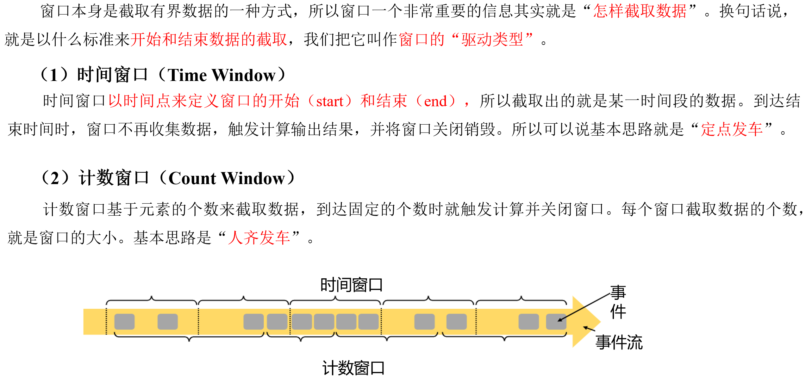

**2）按照窗口分配数据的规则分类**

根据分配数据的规则，窗口的具体实现可以分为4类：滚动窗口（Tumbling Window）、滑动窗口（Sliding Window）、会话窗口（Session Window），以及全局窗口（Global Window）。


滚动窗口应用非常广泛，它可以对每个时间段做聚合统计，很多BI分析指标都可以用它来实现。


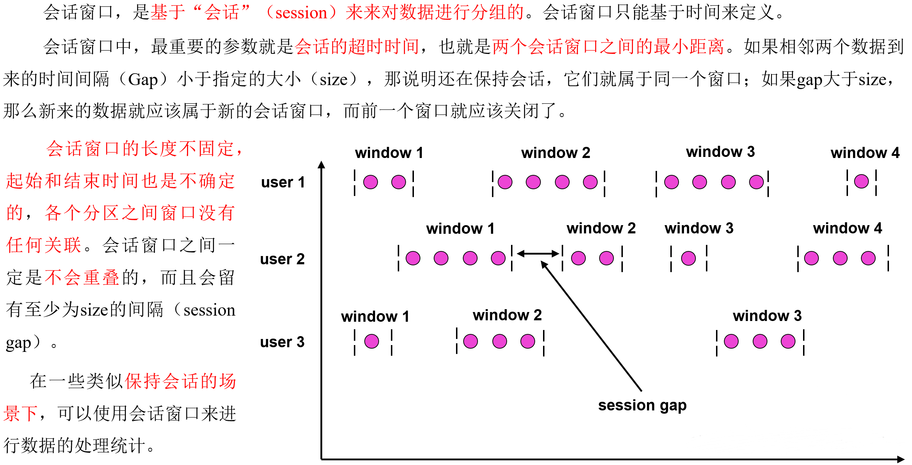


### **6.1.3 窗口API概览**

**1）按键分区（Keyed）和非按键分区（Non-Keyed）**

在定义窗口操作之前，首先需要确定，到底是基于按键分区（Keyed）的数据流KeyedStream来开窗，还是直接在没有按键分区的DataStream上开窗。也就是说，在调用窗口算子之前，是否有keyBy操作。

（1）按键分区窗口（Keyed Windows）

经过按键分区keyBy操作后，数据流会按照key被分为多条逻辑流（logical
streams），这就是KeyedStream。基于KeyedStream进行窗口操作时，窗口计算会在多个并行子任务上同时执行。相同key的数据会被发送到同一个并行子任务，而窗口操作会基于每个key进行单独的处理。所以可以认为，每个key上都定义了一组窗口，各自独立地进行统计计算。

在代码实现上，需要先对DataStream调用.keyBy()进行按键分区，然后再调用.window()定义窗口。

stream.keyBy(\...)

.window(\...)

（2）非按键分区（Non-Keyed Windows）

如果没有进行keyBy，那么原始的DataStream就不会分成多条逻辑流。这时窗口逻辑只能在一个任务（task）上执行，就相当于并行度变成了1。

在代码中，直接基于DataStream调用.windowAll()定义窗口。

stream.windowAll(\...)

注意：对于非按键分区的窗口操作，手动调大窗口算子的并行度也是无效的，windowAll本身就是一个非并行的操作。

**2）代码中窗口API的调用**

窗口操作主要有两个部分：窗口分配器（Window Assigners）和窗口函数（Window
Functions）。

stream.keyBy(\<key selector\>)

.window(\<window assigner\>)

.aggregate(\<window function\>)

其中.window()方法需要传入一个窗口分配器，它指明了窗口的类型；而后面的.aggregate()方法传入一个窗口函数作为参数，它用来定义窗口具体的处理逻辑。窗口分配器有各种形式，而窗口函数的调用方法也不只.aggregate()一种，接下来就详细展开讲解。

### **6.1.4 窗口分配器**

定义窗口分配器（Window
Assigners）是构建窗口算子的第一步，它的作用就是定义数据应该被"分配"到哪个窗口。所以可以说，窗口分配器其实就是在指定窗口的类型。

窗口分配器最通用的定义方式，就是调用.window()方法。这个方法需要传入一个WindowAssigner作为参数，返回WindowedStream。如果是非按键分区窗口，那么直接调用.windowAll()方法，同样传入一个WindowAssigner，返回的是AllWindowedStream。

窗口按照驱动类型可以分成时间窗口和计数窗口，而按照具体的分配规则，又有滚动窗口、滑动窗口、会话窗口、全局窗口四种。除去需要自定义的全局窗口外，其他常用的类型Flink中都给出了内置的分配器实现，可以方便地调用实现各种需求。

#### 6.1.4.1 时间窗口

时间窗口是最常用的窗口类型，又可以细分为滚动、滑动和会话三种。

**（1）滚动处理时间窗口**

窗口分配器由类TumblingProcessingTimeWindows提供，需要调用它的静态方法.of()。

stream.keyBy(\...)

.window(TumblingProcessingTimeWindows.of(Time.seconds(5)))

.aggregate(\...)

这里.of()方法需要传入一个Time类型的参数size，表示滚动窗口的大小，这里创建了一个长度为5秒的滚动窗口。

另外，.of()还有一个重载方法，可以传入两个Time类型的参数：size和offset。第一个参数当然还是窗口大小，第二个参数则表示窗口起始点的偏移量。

**（2）滑动处理时间窗口**

窗口分配器由类SlidingProcessingTimeWindows提供，同样需要调用它的静态方法.of()。

stream.keyBy(\...)

.window(SlidingProcessingTimeWindows.of(Time.seconds(10)，Time.seconds(5)))

.aggregate(\...)

这里.of()方法需要传入两个Time类型的参数：size和slide，前者表示滑动窗口的大小，后者表示滑动窗口的滑动步长。这里创建了一个长度为10秒、滑动步长为5秒的滑动窗口。

滑动窗口同样可以追加第三个参数，用于指定窗口起始点的偏移量，用法与滚动窗口完全一致。

**（3）处理时间会话窗口**

窗口分配器由类ProcessingTimeSessionWindows提供，需要调用它的静态方法.withGap()或者.withDynamicGap()。

stream.keyBy(\...)

.window(ProcessingTimeSessionWindows.withGap(Time.seconds(10)))

.aggregate(\...)

这里.withGap()方法需要传入一个Time类型的参数size，表示会话的超时时间，也就是最小间隔session
gap。这里创建了静态会话超时时间为10秒的会话窗口。

另外，还可以调用withDynamicGap()方法定义session gap的动态提取逻辑。

**（4）滚动事件时间窗口**

窗口分配器由类TumblingEventTimeWindows提供，用法与滚动处理事件窗口完全一致。

stream.keyBy(\...)

.window(TumblingEventTimeWindows.of(Time.seconds(5)))

.aggregate(\...)

**（5）滑动事件时间窗口**

窗口分配器由类SlidingEventTimeWindows提供，用法与滑动处理事件窗口完全一致。

stream.keyBy(\...)

.window(SlidingEventTimeWindows.of(Time.seconds(10)，Time.seconds(5)))

.aggregate(\...)

**（6）事件时间会话窗口**

窗口分配器由类EventTimeSessionWindows提供，用法与处理事件会话窗口完全一致。

stream.keyBy(\...)

.window(EventTimeSessionWindows.withGap(Time.seconds(10)))

.aggregate(\...)

#### 6.1.4.2 计数窗口

计数窗口概念非常简单，本身底层是基于全局窗口（Global
Window）实现的。Flink为提供了非常方便的接口：直接调用.countWindow()方法。根据分配规则的不同，又可以分为滚动计数窗口和滑动计数窗口两类，下面就来看它们的具体实现。

**（1）滚动计数窗口**

滚动计数窗口只需要传入一个长整型的参数size，表示窗口的大小。

stream.keyBy(\...)

.countWindow(10)

定义了一个长度为10的滚动计数窗口，当窗口中元素数量达到10的时候，就会触发计算执行并关闭窗口。

**（2）滑动计数窗口**

与滚动计数窗口类似，不过需要在.countWindow()调用时传入两个参数：size和slide，前者表示窗口大小，后者表示滑动步长。

stream.keyBy(\...)

.countWindow(10，3)

定义了一个长度为10、滑动步长为3的滑动计数窗口。每个窗口统计10个数据，每隔3个数据就统计输出一次结果。

3）全局窗口

全局窗口是计数窗口的底层实现，一般在需要自定义窗口时使用。它的定义同样是直接调用.window()，分配器由GlobalWindows类提供。

stream.keyBy(\...)

.window(GlobalWindows.create());

需要注意使用全局窗口，必须自行定义触发器才能实现窗口计算，否则起不到任何作用。

### **6.1.5 窗口函数**

​	定义窗口分配器，只是知道了数据属于哪个窗口，可以将数据收集起来，至于收集起来到底要做什么，其实还完全没有头绪。所以在窗口分配器之后，必须再接上一个定义窗口如何进行计算的操作，这就是所谓的“窗口函数”( window functions） 。


窗口函数定义了要对窗口中收集的数据做的计算操作，根据处理的方式可以分为两类：增量聚合函数和全窗口函数。下面来进行分别讲解。

#### 6.1.5.1 增量聚合函数（ReduceFunction / AggregateFunction）

窗口将数据收集起来，最基本的处理操作当然就是进行聚合。可以每来一个数据就在之前结果上聚合一次，这就是"增量聚合"。

典型的增量聚合函数有两个：ReduceFunction和AggregateFunction。

**1）归约函数（ReduceFunction）**

代码示例：

public class WindowReduceDemo {

public static void main(String\[\] args) throws Exception {

StreamExecutionEnvironment env =
StreamExecutionEnvironment.getExecutionEnvironment();

env.setParallelism(1);

env

.socketTextStream(\"hadoop102\", 7777)

.map(new WaterSensorMapFunction())

.keyBy(r -\> r.getId())

// 设置滚动事件时间窗口

.window(TumblingProcessingTimeWindows.of(Time.seconds(10)))

.reduce(new ReduceFunction\<WaterSensor\>() {

\@Override

public WaterSensor reduce(WaterSensor value1, WaterSensor value2) throws
Exception {

System.out.println(\"调用reduce方法，之前的结果:\"+value1 +
\",现在来的数据:\"+value2);

return new WaterSensor(value1.getId(),
System.currentTimeMillis(),value1.getVc()+value2.getVc());

}

})

.print();

env.execute();

}

}

**2）聚合函数（AggregateFunction）**

ReduceFunction可以解决大多数归约聚合的问题，但是这个接口有一个限制，就是聚合状态的类型、输出结果的类型都必须和输入数据类型一样。

Flink Window
API中的aggregate就突破了这个限制，可以定义更加灵活的窗口聚合操作。这个方法需要传入一个AggregateFunction的实现类作为参数。

AggregateFunction可以看作是ReduceFunction的通用版本，这里有三种类型：输入类型（IN）、累加器类型（ACC）和输出类型（OUT）。输入类型IN就是输入流中元素的数据类型；累加器类型ACC则是进行聚合的中间状态类型；而输出类型当然就是最终计算结果的类型了。

接口中有四个方法：

-   createAccumulator()：创建一个累加器，这就是为聚合创建了一个初始状态，每个聚合任务只会调用一次。

-   add()：将输入的元素添加到累加器中。

-   getResult()：从累加器中提取聚合的输出结果。

-   merge()：合并两个累加器，并将合并后的状态作为一个累加器返回。

所以可以看到，AggregateFunction的工作原理是：首先调用createAccumulator()为任务初始化一个状态（累加器）；而后每来一个数据就调用一次add()方法，对数据进行聚合，得到的结果保存在状态中；等到了窗口需要输出时，再调用getResult()方法得到计算结果。很明显，与ReduceFunction相同，AggregateFunction也是增量式的聚合；而由于输入、中间状态、输出的类型可以不同，使得应用更加灵活方便。

代码实现如下：

public class WindowAggregateDemo {

public static void main(String\[\] args) throws Exception {

StreamExecutionEnvironment env =
StreamExecutionEnvironment.getExecutionEnvironment();

env.setParallelism(1);

SingleOutputStreamOperator\<WaterSensor\> sensorDS = env

.socketTextStream(\"hadoop102\", 7777)

.map(new WaterSensorMapFunction());

KeyedStream\<WaterSensor, String\> sensorKS = sensorDS.keyBy(sensor -\>
sensor.getId());

// 1. 窗口分配器

WindowedStream\<WaterSensor, String, TimeWindow\> sensorWS =
sensorKS.window(TumblingProcessingTimeWindows.of(Time.seconds(10)));

SingleOutputStreamOperator\<String\> aggregate = sensorWS

.aggregate(

new AggregateFunction\<WaterSensor, Integer, String\>() {

\@Override

public Integer createAccumulator() {

System.out.println(\"创建累加器\");

return 0;

}

\@Override

public Integer add(WaterSensor value, Integer accumulator) {

System.out.println(\"调用add方法,value=\"+value);

return accumulator + value.getVc();

}

\@Override

public String getResult(Integer accumulator) {

System.out.println(\"调用getResult方法\");

return accumulator.toString();

}

\@Override

public Integer merge(Integer a, Integer b) {

System.out.println(\"调用merge方法\");

return null;

}

}

);

aggregate.print();

env.execute();

}

}

另外，Flink也为窗口的聚合提供了一系列预定义的简单聚合方法，可以直接基于WindowedStream调用。主要包括.sum()/max()/maxBy()/min()/minBy()，与KeyedStream的简单聚合非常相似。它们的底层，其实都是通过AggregateFunction来实现的。

#### 6.1.5.2 全窗口函数（full window functions）

有些场景下，要做的计算必须基于全部的数据才有效，这时做增量聚合就没什么意义了；另外，输出的结果有可能要包含上下文中的一些信息（比如窗口的起始时间），这是增量聚合函数做不到的。

所以，还需要有更丰富的窗口计算方式。窗口操作中的另一大类就是全窗口函数。与增量聚合函数不同，全窗口函数需要先收集窗口中的数据，并在内部缓存起来，等到窗口要输出结果的时候再取出数据进行计算。

在Flink中，全窗口函数也有两种：WindowFunction和ProcessWindowFunction。

**1）窗口函数（WindowFunction）**

WindowFunction字面上就是"窗口函数"，它其实是老版本的通用窗口函数接口。可以基于WindowedStream调用.apply()方法，传入一个WindowFunction的实现类。

stream

.keyBy(\<key selector\>)

.window(\<window assigner\>)

.apply(new MyWindowFunction());

这个类中可以获取到包含窗口所有数据的可迭代集合（Iterable），还可以拿到窗口（Window）本身的信息。

不过WindowFunction能提供的上下文信息较少，也没有更高级的功能。事实上，它的作用可以被ProcessWindowFunction全覆盖，所以之后可能会逐渐弃用。

**2）处理窗口函数（ProcessWindowFunction）**

ProcessWindowFunction是Window
API中最底层的通用窗口函数接口。之所以说它"最底层"，是因为除了可以拿到窗口中的所有数据之外，ProcessWindowFunction还可以获取到一个"上下文对象"（Context）。这个上下文对象非常强大，不仅能够获取窗口信息，还可以访问当前的时间和状态信息。这里的时间就包括了处理时间（processing
time）和事件时间水位线（event time
watermark）。这就使得ProcessWindowFunction更加灵活、功能更加丰富，其实就是一个增强版的WindowFunction。

事实上，ProcessWindowFunction是Flink底层API------处理函数（process
function）中的一员，关于处理函数会在后续章节展开讲解。

代码实现如下：

public class WindowProcessDemo {

public static void main(String\[\] args) throws Exception {

StreamExecutionEnvironment env =
StreamExecutionEnvironment.getExecutionEnvironment();

env.setParallelism(1);

SingleOutputStreamOperator\<WaterSensor\> sensorDS = env

.socketTextStream(\"hadoop102\", 7777)

.map(new WaterSensorMapFunction());

KeyedStream\<WaterSensor, String\> sensorKS = sensorDS.keyBy(sensor -\>
sensor.getId());

// 1. 窗口分配器

WindowedStream\<WaterSensor, String, TimeWindow\> sensorWS =
sensorKS.window(TumblingProcessingTimeWindows.of(Time.seconds(10)));

SingleOutputStreamOperator\<String\> process = sensorWS

.process(

new ProcessWindowFunction\<WaterSensor, String, String, TimeWindow\>() {

\@Override

public void process(String s, Context context, Iterable\<WaterSensor\>
elements, Collector\<String\> out) throws Exception {

long count = elements.spliterator().estimateSize();

long windowStartTs = context.window().getStart();

long windowEndTs = context.window().getEnd();

String windowStart = DateFormatUtils.format(windowStartTs, \"yyyy-MM-dd
HH:mm:ss.SSS\");

String windowEnd = DateFormatUtils.format(windowEndTs, \"yyyy-MM-dd
HH:mm:ss.SSS\");

out.collect(\"key=\" + s + \"的窗口\[\" + windowStart + \",\" +
windowEnd + \")包含\" + count + \"条数据===\>\" + elements.toString());

}

}

);

process.print();

env.execute();

}

}

#### 6.1.5.3 增量聚合和全窗口函数的结合使用

在实际应用中，往往希望兼具这两者的优点，把它们结合在一起使用。Flink的Window
API就给实现了这样的用法。

之前在调用WindowedStream的.reduce()和.aggregate()方法时，只是简单地直接传入了一个ReduceFunction或AggregateFunction进行增量聚合。除此之外，其实还可以传入第二个参数：一个全窗口函数，可以是WindowFunction或者ProcessWindowFunction。

**// ReduceFunction与WindowFunction结合**

public \<R\> SingleOutputStreamOperator\<R\> reduce(

ReduceFunction\<T\> reduceFunction，WindowFunction\<T，R，K，W\>
function)

**// ReduceFunction与ProcessWindowFunction结合**

public \<R\> SingleOutputStreamOperator\<R\> reduce(

ReduceFunction\<T\> reduceFunction，ProcessWindowFunction\<T，R，K，W\>
function)

**// AggregateFunction与WindowFunction结合**

public \<ACC，V，R\> SingleOutputStreamOperator\<R\> aggregate(

AggregateFunction\<T，ACC，V\> aggFunction，WindowFunction\<V，R，K，W\>
windowFunction)

**// AggregateFunction与ProcessWindowFunction结合**

public \<ACC，V，R\> SingleOutputStreamOperator\<R\> aggregate(

AggregateFunction\<T，ACC，V\> aggFunction,

ProcessWindowFunction\<V，R，K，W\> windowFunction)

这样调用的处理机制是：基于第一个参数（增量聚合函数）来处理窗口数据，每来一个数据就做一次聚合；等到窗口需要触发计算时，则调用第二个参数（全窗口函数）的处理逻辑输出结果。需要注意的是，这里的全窗口函数就不再缓存所有数据了，而是直接将增量聚合函数的结果拿来当作了Iterable类型的输入。

具体实现代码如下：

public class WindowAggregateAndProcessDemo {

public static void main(String\[\] args) throws Exception {

StreamExecutionEnvironment env =
StreamExecutionEnvironment.getExecutionEnvironment();

env.setParallelism(1);

SingleOutputStreamOperator\<WaterSensor\> sensorDS = env

.socketTextStream(\"hadoop102\", 7777)

.map(new WaterSensorMapFunction());

KeyedStream\<WaterSensor, String\> sensorKS = sensorDS.keyBy(sensor -\>
sensor.getId());

// 1. 窗口分配器

WindowedStream\<WaterSensor, String, TimeWindow\> sensorWS =
sensorKS.window(TumblingProcessingTimeWindows.of(Time.seconds(10)));

// 2. 窗口函数：

/\*\*

\* 增量聚合 Aggregate + 全窗口 process

\* 1、增量聚合函数处理数据： 来一条计算一条

\* 2、窗口触发时， 增量聚合的结果（只有一条） 传递给 全窗口函数

\* 3、经过全窗口函数的处理包装后，输出

\*

\* 结合两者的优点：

\* 1、增量聚合： 来一条计算一条，存储中间的计算结果，占用的空间少

\* 2、全窗口函数： 可以通过 上下文 实现灵活的功能

\*/

// sensorWS.reduce() //也可以传两个

SingleOutputStreamOperator\<String\> result = sensorWS.aggregate(

new MyAgg(),

new MyProcess()

);

result.print();

env.execute();

}

public static class MyAgg implements AggregateFunction\<WaterSensor,
Integer, String\>{

\@Override

public Integer createAccumulator() {

System.out.println(\"创建累加器\");

return 0;

}

\@Override

public Integer add(WaterSensor value, Integer accumulator) {

System.out.println(\"调用add方法,value=\"+value);

return accumulator + value.getVc();

}

\@Override

public String getResult(Integer accumulator) {

System.out.println(\"调用getResult方法\");

return accumulator.toString();

}

\@Override

public Integer merge(Integer a, Integer b) {

System.out.println(\"调用merge方法\");

return null;

}

}

// 全窗口函数的输入类型 = 增量聚合函数的输出类型

public static class MyProcess extends
ProcessWindowFunction\<String,String,String,TimeWindow\>{

\@Override

public void process(String s, Context context, Iterable\<String\>
elements, Collector\<String\> out) throws Exception {

long startTs = context.window().getStart();

long endTs = context.window().getEnd();

String windowStart = DateFormatUtils.format(startTs, \"yyyy-MM-dd
HH:mm:ss.SSS\");

String windowEnd = DateFormatUtils.format(endTs, \"yyyy-MM-dd
HH:mm:ss.SSS\");

long count = elements.spliterator().estimateSize();

out.collect(\"key=\" + s + \"的窗口\[\" + windowStart + \",\" +
windowEnd + \")包含\" + count + \"条数据===\>\" + elements.toString());

}

}

}

这里为了方便处理，单独定义了一个POJO类UrlViewCount来表示聚合输出结果的数据类型，包含了url、浏览量以及窗口的起始结束时间。用一个AggregateFunction来实现增量聚合，每来一个数据就计数加一；得到的结果交给ProcessWindowFunction，结合窗口信息包装成想要的UrlViewCount，最终输出统计结果。

### **6.1.6 其他API**

对于一个窗口算子而言，窗口分配器和窗口函数是必不可少的。除此之外，Flink还提供了其他一些可选的API，让可以更加灵活地控制窗口行为。

#### 6.1.6.1 触发器（Trigger）

触发器主要是用来控制窗口什么时候触发计算。所谓的"触发计算"，本质上就是执行窗口函数，所以可以认为是计算得到结果并输出的过程。

基于WindowedStream调用.trigger()方法，就可以传入一个自定义的窗口触发器（Trigger）。

stream.keyBy(\...)

.window(\...)

.trigger(new MyTrigger())

#### 6.1.6.2 移除器（Evictor）

移除器主要用来定义移除某些数据的逻辑。基于WindowedStream调用.evictor()方法，就可以传入一个自定义的移除器（Evictor）。Evictor是一个接口，不同的窗口类型都有各自预实现的移除器。

stream.keyBy(\...)

.window(\...)

.evictor(new MyEvictor())

## **6.2 时间语义**

### **6.2.1 Flink 中的时间语义**


### **6.2.2 哪种时间语义更重要**

**1）从《星球大战》说起**

为了更加清晰地说明两种语义的区别，来举一个非常经典的例子：电影《星球大战》。

{width="5.177351268591426in"
height="2.2982053805774276in"}

如上图所示，会发现，看电影其实就是处理影片中数据的过程，所以影片的上映时间就相当于"处理时间"；而影片的数据就是所描述的故事，它所发生的背景时间就相当于"事件时间"。两种时间语义都有各自的用途，适用于不同的场景。

**2）数据处理系统中的时间语义**

在实际应用中，事件时间语义会更为常见。一般情况下，业务日志数据中都会记录数据生成的时间戳（timestamp），它就可以作为事件时间的判断基础。

在Flink中，由于处理时间比较简单，早期版本默认的时间语义是处理时间；而考虑到事件时间在实际应用中更为广泛，从Flink1.12版本开始，Flink已经将事件时间作为默认的时间语义了。

## **6.3 水位线（Watermark）**

### **6.3.1 事件时间和窗口**


### **6.3.2 什么是水位线**

在Flink中，用来衡量事件时间进展的标记，就被称作"水位线"（Watermark）。

具体实现上，水位线可以看作一条特殊的数据记录，它是插入到数据流中的一个标记点，主要内容就是一个时间戳，用来指示当前的事件时间。而它插入流中的位置，就应该是在某个数据到来之后；这样就可以从这个数据中提取时间戳，作为当前水位线的时间戳了。


​	现在可以知道，水位线就代表了当前的事件时间时钟，而且可以在数据的时间戳基础上加一些延迟来保证不丢数据，这一点对于乱序流的正确处理非常重要。

### **6.3.3 水位线和窗口的工作原理**


**注意：**Flink中窗口并不是静态准备好的，而是动态创建------当有落在这个窗口区间范围的数据达到时，才创建对应的窗口。另外，这里认为到达窗口结束时间时，窗口就触发计算并关闭，事实上"触发计算"和"窗口关闭"两个行为也可以分开，这部分内容会在后面详述。

### **6.3.4 生成水位线**

#### 6.3.4.1 生成水位线的总体原则

完美的水位线是"绝对正确"的，也就是一个水位线一旦出现，就表示这个时间之前的数据已经全部到齐、之后再也不会出现了。不过如果要保证绝对正确，就必须等足够长的时间，这会带来更高的延迟。

如果希望处理得更快、实时性更强，那么可以将水位线延迟设得低一些。这种情况下，可能很多迟到数据会在水位线之后才到达，就会导致窗口遗漏数据，计算结果不准确。当然，如果对准确性完全不考虑、一味地追求处理速度，可以直接使用处理时间语义，这在理论上可以得到最低的延迟。

所以Flink中的水位线，其实是流处理中对低延迟和结果正确性的一个权衡机制，而且把控制的权力交给了程序员，可以在代码中定义水位线的生成策略。

#### 6.3.4.2 水位线生成策略

在Flink的DataStream
API中，有一个单独用于生成水位线的方法：.assignTimestampsAndWatermarks()，它主要用来为流中的数据分配时间戳，并生成水位线来指示事件时间。具体使用如下：

DataStream\<Event\> stream = env.addSource(new ClickSource());

DataStream\<Event\> withTimestampsAndWatermarks = stream.assignTimestampsAndWatermarks(\<watermark strategy\>);

说明：WatermarkStrategy作为参数，这就是所谓的"水位线生成策略"。WatermarkStrategy是一个接口，该接口中包含了一个"时间戳分配器"TimestampAssigner和一个"水位线生成器"WatermarkGenerator。

public interface WatermarkStrategy\<T\>

extends TimestampAssignerSupplier\<T\>,

WatermarkGeneratorSupplier\<T\>{

**//
负责从流中数据元素的某个字段中提取时间戳，并分配给元素。时间戳的分配是生成水位线的基础。**

\@Override

TimestampAssigner\<T\>
createTimestampAssigner(TimestampAssignerSupplier.Context context);

**// 主要负责按照既定的方式，基于时间戳生成水位线**

\@Override

WatermarkGenerator\<T\>
createWatermarkGenerator(WatermarkGeneratorSupplier.Context context);

}

#### 6.3.4.3 Flink内置水位线

**1）有序流中内置水位线设置**

对于有序流，主要特点就是时间戳单调增长，所以永远不会出现迟到数据的问题。这是周期性生成水位线的最简单的场景，直接调用WatermarkStrategy.forMonotonousTimestamps()方法就可以实现。

public class WatermarkMonoDemo {

public static void main(String\[\] args) throws Exception {

StreamExecutionEnvironment env =
StreamExecutionEnvironment.getExecutionEnvironment();

env.setParallelism(1);

SingleOutputStreamOperator\<WaterSensor\> sensorDS = env

.socketTextStream(\"hadoop102\", 7777)

.map(new WaterSensorMapFunction());

// TODO 1.定义Watermark策略

WatermarkStrategy\<WaterSensor\> watermarkStrategy = WatermarkStrategy

// 1.1 指定watermark生成：升序的watermark，没有等待时间

.\<WaterSensor\>forMonotonousTimestamps()

// 1.2 指定 时间戳分配器，从数据中提取

.withTimestampAssigner(new
SerializableTimestampAssigner\<WaterSensor\>() {

\@Override

public long extractTimestamp(WaterSensor element, long recordTimestamp)
{

// 返回的时间戳，要 毫秒

System.out.println(\"数据=\" + element + \",recordTs=\" +
recordTimestamp);

return element.getTs() \* 1000L;

}

});

// TODO 2. 指定 watermark策略

SingleOutputStreamOperator\<WaterSensor\> sensorDSwithWatermark =
sensorDS.assignTimestampsAndWatermarks(watermarkStrategy);

sensorDSwithWatermark.keyBy(sensor -\> sensor.getId())

// TODO 3.使用 事件时间语义 的窗口

.window(TumblingEventTimeWindows.of(Time.seconds(10)))

.process(

new ProcessWindowFunction\<WaterSensor, String, String, TimeWindow\>() {

\@Override

public void process(String s, Context context, Iterable\<WaterSensor\>
elements, Collector\<String\> out) throws Exception {

long startTs = context.window().getStart();

long endTs = context.window().getEnd();

String windowStart = DateFormatUtils.format(startTs, \"yyyy-MM-dd
HH:mm:ss.SSS\");

String windowEnd = DateFormatUtils.format(endTs, \"yyyy-MM-dd
HH:mm:ss.SSS\");

long count = elements.spliterator().estimateSize();

out.collect(\"key=\" + s + \"的窗口\[\" + windowStart + \",\" +
windowEnd + \")包含\" + count + \"条数据===\>\" + elements.toString());

}

}

)

.print();

env.execute();

}

}

**2）乱序流中内置水位线设置**

由于乱序流中需要等待迟到数据到齐，所以必须设置一个固定量的延迟时间。这时生成水位线的时间戳，就是当前数据流中最大的时间戳减去延迟的结果，相当于把表调慢，当前时钟会滞后于数据的最大时间戳。调用WatermarkStrategy.
forBoundedOutOfOrderness()方法就可以实现。这个方法需要传入一个maxOutOfOrderness参数，表示"最大乱序程度"，它表示数据流中乱序数据时间戳的最大差值；如果能确定乱序程度，那么设置对应时间长度的延迟，就可以等到所有的乱序数据了。

public class WatermarkOutOfOrdernessDemo {

public static void main(String\[\] args) throws Exception {

StreamExecutionEnvironment env =
StreamExecutionEnvironment.getExecutionEnvironment();

env.setParallelism(1);

SingleOutputStreamOperator\<WaterSensor\> sensorDS = env

.socketTextStream(\"hadoop102\", 7777)

.map(new WaterSensorMapFunction());

// TODO 1.定义Watermark策略

WatermarkStrategy\<WaterSensor\> watermarkStrategy = WatermarkStrategy

// 1.1 指定watermark生成：乱序的，等待3s

.\<WaterSensor\>forBoundedOutOfOrderness(Duration.ofSeconds(3))

// 1.2 指定 时间戳分配器，从数据中提取

.withTimestampAssigner(

(element, recordTimestamp) -\> {

// 返回的时间戳，要 毫秒

System.out.println(\"数据=\" + element + \",recordTs=\" +
recordTimestamp);

return element.getTs() \* 1000L;

});

// TODO 2. 指定 watermark策略

SingleOutputStreamOperator\<WaterSensor\> sensorDSwithWatermark =
sensorDS.assignTimestampsAndWatermarks(watermarkStrategy);

sensorDSwithWatermark.keyBy(sensor -\> sensor.getId())

// TODO 3.使用 事件时间语义 的窗口

.window(TumblingEventTimeWindows.of(Time.seconds(10)))

.process(

new ProcessWindowFunction\<WaterSensor, String, String, TimeWindow\>() {

\@Override

public void process(String s, Context context, Iterable\<WaterSensor\>
elements, Collector\<String\> out) throws Exception {

long startTs = context.window().getStart();

long endTs = context.window().getEnd();

String windowStart = DateFormatUtils.format(startTs, \"yyyy-MM-dd
HH:mm:ss.SSS\");

String windowEnd = DateFormatUtils.format(endTs, \"yyyy-MM-dd
HH:mm:ss.SSS\");

long count = elements.spliterator().estimateSize();

out.collect(\"key=\" + s + \"的窗口\[\" + windowStart + \",\" +
windowEnd + \")包含\" + count + \"条数据===\>\" + elements.toString());

}

}

)

.print();

env.execute();

}

}

#### 6.3.4.4 自定义水位线生成器

**1）周期性水位线生成器（Periodic Generator）**

周期性生成器一般是通过onEvent()观察判断输入的事件，而在onPeriodicEmit()里发出水位线。

下面是一段自定义周期性生成水位线的代码：

import com.gardenia.bean.Event;

import org.apache.flink.api.common.eventtime.\*;

import
org.apache.flink.streaming.api.environment.StreamExecutionEnvironment;

// 自定义水位线的产生

public class CustomPeriodicWatermarkExample {

public static void main(String\[\] args) throws Exception {

StreamExecutionEnvironment env =
StreamExecutionEnvironment.getExecutionEnvironment();

env

.addSource(new ClickSource())

.assignTimestampsAndWatermarks(new CustomWatermarkStrategy())

.print();

env.execute();

}

public static class CustomWatermarkStrategy implements
WatermarkStrategy\<Event\> {

\@Override

public TimestampAssigner\<Event\>
createTimestampAssigner(TimestampAssignerSupplier.Context context) {

return new SerializableTimestampAssigner\<Event\>() {

\@Override

public long extractTimestamp(Event element，long recordTimestamp) {

return element.timestamp; // 告诉程序数据源里的时间戳是哪一个字段

}

};

}

\@Override

public WatermarkGenerator\<Event\>
createWatermarkGenerator(WatermarkGeneratorSupplier.Context context) {

return new CustomBoundedOutOfOrdernessGenerator();

}

}

public static class CustomBoundedOutOfOrdernessGenerator implements
WatermarkGenerator\<Event\> {

private Long delayTime = 5000L; // 延迟时间

private Long maxTs = -Long.MAX_VALUE + delayTime + 1L; //
观察到的最大时间戳

\@Override

public void onEvent(Event event，long eventTimestamp，WatermarkOutput
output) {

// 每来一条数据就调用一次

maxTs = Math.max(event.timestamp，maxTs); // 更新最大时间戳

}

\@Override

public void onPeriodicEmit(WatermarkOutput output) {

// 发射水位线，默认200ms调用一次

output.emitWatermark(new Watermark(maxTs - delayTime - 1L));

}

}

}

在onPeriodicEmit()里调用output.emitWatermark()，就可以发出水位线了；这个方法由系统框架周期性地调用，默认200ms一次。

如果想修改默认周期时间，可以通过下面方法修改。例如：修改为400ms

env.getConfig().setAutoWatermarkInterval(400L);

**2）断点式水位线生成器（Punctuated Generator）**

断点式生成器会不停地检测onEvent()中的事件，当发现带有水位线信息的事件时，就立即发出水位线。把发射水位线的逻辑写在onEvent方法当中即可。

**3）在数据源中发送水位线**

也可以在自定义的数据源中抽取事件时间，然后发送水位线。这里要注意的是，在自定义数据源中发送了水位线以后，就不能再在程序中使用assignTimestampsAndWatermarks方法来生成水位线了。在自定义数据源中生成水位线和在程序中使用assignTimestampsAndWatermarks方法生成水位线二者只能取其一。示例程序如下：

env.fromSource(

kafkaSource,
WatermarkStrategy.forBoundedOutOfOrderness(Duration.ofSeconds(3)),
\"kafkasource\"

)

### **6.3.5 水位线的传递**


在流处理中，上游任务处理完水位线、时钟改变之后，要把当前的水位线再次发出，广播给所有的下游子任务。而当一个任务接收到多个上游并行任务传递来的水位线时，应该以最小的那个作为当前任务的事件时钟。

水位线在上下游任务之间的传递，非常巧妙地避免了分布式系统中没有统一时钟的问题，每个任务都以"处理完之前所有数据"为标准来确定自己的时钟。

案例：6.3.4.3 中乱序流的watermark，将并行度设为2，观察现象。

在多个上游并行任务中，如果有其中一个没有数据，由于当前Task是以最小的那个作为当前任务的事件时钟，就会导致当前Task的水位线无法推进，就可能导致窗口无法触发。这时候可以设置空闲等待。

用5.3.4.6中的自定义分区器，只输入奇数来模拟部分subtask无数据，代码如下：

public class WatermarkIdlenessDemo {

public static void main(String\[\] args) throws Exception {

StreamExecutionEnvironment env =
StreamExecutionEnvironment.getExecutionEnvironment();

env.setParallelism(2);

// 自定义分区器：数据%分区数，只输入奇数，都只会去往map的一个子任务

SingleOutputStreamOperator\<Integer\> socketDS = env

.socketTextStream(\"hadoop102\", 7777)

.partitionCustom(new MyPartitioner(), r -\> r)

.map(r -\> Integer.parseInt(r))

.assignTimestampsAndWatermarks(

WatermarkStrategy

.\<Integer\>forMonotonousTimestamps()

.withTimestampAssigner((r, ts) -\> r \* 1000L)

.withIdleness(Duration.ofSeconds(5)) //空闲等待5s

);

// 分成两组： 奇数一组，偶数一组 ， 开10s的事件时间滚动窗口

socketDS

.keyBy(r -\> r % 2)

.window(TumblingEventTimeWindows.of(Time.seconds(10)))

.process(new ProcessWindowFunction\<Integer, String, Integer,
TimeWindow\>() {

\@Override

public void process(Integer integer, Context context,
Iterable\<Integer\> elements, Collector\<String\> out) throws Exception
{

long startTs = context.window().getStart();

long endTs = context.window().getEnd();

String windowStart = DateFormatUtils.format(startTs, \"yyyy-MM-dd
HH:mm:ss.SSS\");

String windowEnd = DateFormatUtils.format(endTs, \"yyyy-MM-dd
HH:mm:ss.SSS\");

long count = elements.spliterator().estimateSize();

out.collect(\"key=\" + integer + \"的窗口\[\" + windowStart + \",\" +
windowEnd + \")包含\" + count + \"条数据===\>\" + elements.toString());

}

})

.print();

env.execute();

}

}

### **6.3.6 迟到数据的处理** 

#### 6.3.6.1 推迟水印推进

在水印产生时，设置一个乱序容忍度，推迟系统时间的推进，保证窗口计算被延迟执行，为乱序的数据争取更多的时间进入窗口。

WatermarkStrategy.forBoundedOutOfOrderness(Duration.ofSeconds(10));

#### 6.3.6.2 设置窗口延迟关闭

Flink的窗口，也允许迟到数据。当触发了窗口计算后，会先计算当前的结果，但是此时并不会关闭窗口。

以后每来一条迟到数据，就触发一次这条数据所在窗口计算(增量计算)。直到wartermark
超过了窗口结束时间+推迟时间，此时窗口会真正关闭。

.window(TumblingEventTimeWindows.of(Time.seconds(5)))\
.allowedLateness(Time.seconds(3))

注意:

允许迟到只能运用在event time上

#### 6.3.6.3 使用侧流接收迟到的数据

.windowAll(TumblingEventTimeWindows.of(Time.seconds(5)))

.allowedLateness(Time.seconds(3))

.sideOutputLateData(lateWS)

完整案例代码如下：

public class WatermarkLateDemo {

public static void main(String\[\] args) throws Exception {

StreamExecutionEnvironment env =
StreamExecutionEnvironment.getExecutionEnvironment();

env.setParallelism(1);

SingleOutputStreamOperator\<WaterSensor\> sensorDS = env

.socketTextStream(\"hadoop102\", 7777)

.map(new WaterSensorMapFunction());

WatermarkStrategy\<WaterSensor\> watermarkStrategy = WatermarkStrategy

.\<WaterSensor\>forBoundedOutOfOrderness(Duration.ofSeconds(3))

.withTimestampAssigner((element, recordTimestamp) -\> element.getTs() \*
1000L);

SingleOutputStreamOperator\<WaterSensor\> sensorDSwithWatermark =
sensorDS.assignTimestampsAndWatermarks(watermarkStrategy);

OutputTag\<WaterSensor\> lateTag = new OutputTag\<\>(\"late-data\",
Types.POJO(WaterSensor.class));

SingleOutputStreamOperator\<String\> process =
sensorDSwithWatermark.keyBy(sensor -\> sensor.getId())

.window(TumblingEventTimeWindows.of(Time.seconds(10)))

.allowedLateness(Time.seconds(2)) // 推迟2s关窗

.sideOutputLateData(lateTag) // 关窗后的迟到数据，放入侧输出流

.process(

new ProcessWindowFunction\<WaterSensor, String, String, TimeWindow\>() {

\@Override

public void process(String s, Context context, Iterable\<WaterSensor\>
elements, Collector\<String\> out) throws Exception {

long startTs = context.window().getStart();

long endTs = context.window().getEnd();

String windowStart = DateFormatUtils.format(startTs, \"yyyy-MM-dd
HH:mm:ss.SSS\");

String windowEnd = DateFormatUtils.format(endTs, \"yyyy-MM-dd
HH:mm:ss.SSS\");

long count = elements.spliterator().estimateSize();

out.collect(\"key=\" + s + \"的窗口\[\" + windowStart + \",\" +
windowEnd + \")包含\" + count + \"条数据===\>\" + elements.toString());

}

}

);

process.print();

// 从主流获取侧输出流，打印

process.getSideOutput(lateTag).printToErr(\"关窗后的迟到数据\");

env.execute();

}

}

## **6.4 基于时间的合流------双流联结（Join）**

可以发现，根据某个key合并两条流，与关系型数据库中表的join操作非常相近。事实上，Flink中两条流的connect操作，就可以通过keyBy指定键进行分组后合并，实现了类似于SQL中的join操作；另外connect支持处理函数，可以使用自定义实现各种需求，其实已经能够处理双流join的大多数场景。

不过处理函数是底层接口，所以尽管connect能做的事情多，但在一些具体应用场景下还是显得太过抽象了。比如，如果希望统计固定时间内两条流数据的匹配情况，那就需要自定义来实现------其实这完全可以用窗口（window）来表示。为了更方便地实现基于时间的合流操作，Flink的DataStrema
API提供了内置的join算子。

### **6.4.1 窗口联结（Window Join）**

Flink为基于一段时间的双流合并专门提供了一个窗口联结算子，可以定义时间窗口，并将两条流中共享一个公共键（key）的数据放在窗口中进行配对处理。

**1）窗口联结的调用**

窗口联结在代码中的实现，首先需要调用DataStream的.join()方法来合并两条流，得到一个JoinedStreams；接着通过.where()和.equalTo()方法指定两条流中联结的key；然后通过.window()开窗口，并调用.apply()传入联结窗口函数进行处理计算。通用调用形式如下：

stream1.join(stream2)

.where(\<KeySelector\>)

.equalTo(\<KeySelector\>)

.window(\<WindowAssigner\>)

.apply(\<JoinFunction\>)

上面代码中.where()的参数是键选择器（KeySelector），用来指定第一条流中的key；而.equalTo()传入的KeySelector则指定了第二条流中的key。两者相同的元素，如果在同一窗口中，就可以匹配起来，并通过一个"联结函数"（JoinFunction）进行处理了。

这里.window()传入的就是窗口分配器，之前讲到的三种时间窗口都可以用在这里：滚动窗口（tumbling
window）、滑动窗口（sliding window）和会话窗口（session window）。

而后面调用.apply()可以看作实现了一个特殊的窗口函数。注意这里只能调用.apply()，没有其他替代的方法。

传入的JoinFunction也是一个函数类接口，使用时需要实现内部的.join()方法。这个方法有两个参数，分别表示两条流中成对匹配的数据。

其实仔细观察可以发现，窗口join的调用语法和熟悉的SQL中表的join非常相似：

SELECT \* FROM table1 t1, table2 t2 WHERE t1.id = t2.id;

这句SQL中where子句的表达，等价于inner join \...
on，所以本身表示的是两张表基于id的"内连接"（inner
join）。而Flink中的window join，同样类似于inner
join。也就是说，最后处理输出的，只有两条流中数据按key配对成功的那些；如果某个窗口中一条流的数据没有任何另一条流的数据匹配，那么就不会调用JoinFunction的.join()方法，也就没有任何输出了。

**2）窗口联结实例**

代码实现：

public class WindowJoinDemo {

public static void main(String\[\] args) throws Exception {

StreamExecutionEnvironment env =
StreamExecutionEnvironment.getExecutionEnvironment();

env.setParallelism(1);

SingleOutputStreamOperator\<Tuple2\<String, Integer\>\> ds1 = env

.fromElements(

Tuple2.of(\"a\", 1),

Tuple2.of(\"a\", 2),

Tuple2.of(\"b\", 3),

Tuple2.of(\"c\", 4)

)

.assignTimestampsAndWatermarks(

WatermarkStrategy

.\<Tuple2\<String, Integer\>\>forMonotonousTimestamps()

.withTimestampAssigner((value, ts) -\> value.f1 \* 1000L)

);

SingleOutputStreamOperator\<Tuple3\<String, Integer,Integer\>\> ds2 =
env

.fromElements(

Tuple3.of(\"a\", 1,1),

Tuple3.of(\"a\", 11,1),

Tuple3.of(\"b\", 2,1),

Tuple3.of(\"b\", 12,1),

Tuple3.of(\"c\", 14,1),

Tuple3.of(\"d\", 15,1)

)

.assignTimestampsAndWatermarks(

WatermarkStrategy

.\<Tuple3\<String, Integer,Integer\>\>forMonotonousTimestamps()

.withTimestampAssigner((value, ts) -\> value.f1 \* 1000L)

);

// TODO window join

// 1. 落在同一个时间窗口范围内才能匹配

// 2. 根据keyby的key，来进行匹配关联

// 3. 只能拿到匹配上的数据，类似有固定时间范围的inner join

DataStream\<String\> join = ds1.join(ds2)

.where(r1 -\> r1.f0) // ds1的keyby

.equalTo(r2 -\> r2.f0) // ds2的keyby

.window(TumblingEventTimeWindows.of(Time.seconds(10)))

.apply(new JoinFunction\<Tuple2\<String, Integer\>, Tuple3\<String,
Integer, Integer\>, String\>() {

/\*\*

\* 关联上的数据，调用join方法

\* \@param first ds1的数据

\* \@param second ds2的数据

\* \@return

\* \@throws Exception

\*/

\@Override

public String join(Tuple2\<String, Integer\> first, Tuple3\<String,
Integer, Integer\> second) throws Exception {

return first + \"\<\-\-\-\--\>\" + second;

}

});

join.print();

env.execute();

}

}

### **6.4.2 间隔联结（Interval Join）**

在有些场景下，要处理的时间间隔可能并不是固定的。这时显然不应该用滚动窗口或滑动窗口来处理------因为匹配的两个数据有可能刚好"卡在"窗口边缘两侧，于是窗口内就都没有匹配了；会话窗口虽然时间不固定，但也明显不适合这个场景。基于时间的窗口联结已经无能为力了。

为了应对这样的需求，Flink提供了一种叫作"间隔联结"（interval
join）的合流操作。顾名思义，间隔联结的思路就是针对一条流的每个数据，开辟出其时间戳前后的一段时间间隔，看这期间是否有来自另一条流的数据匹配。

**1）间隔联结的原理**

间隔联结具体的定义方式是，给定两个时间点，分别叫作间隔的"上界"（upperBound）和"下界"（lowerBound）；于是对于一条流（不妨叫作A）中的任意一个数据元素a，就可以开辟一段时间间隔：\[a.timestamp +
lowerBound, a.timestamp +
upperBound\],即以a的时间戳为中心，下至下界点、上至上界点的一个闭区间：就把这段时间作为可以匹配另一条流数据的"窗口"范围。所以对于另一条流（不妨叫B）中的数据元素b，如果它的时间戳落在了这个区间范围内，a和b就可以成功配对，进而进行计算输出结果。所以匹配的条件为：

a.timestamp + lowerBound \<= b.timestamp \<= a.timestamp + upperBound

这里需要注意，做间隔联结的两条流A和B，也必须基于相同的key；下界lowerBound应该小于等于上界upperBound，两者都可正可负；间隔联结目前只支持事件时间语义。

如下图所示，可以清楚地看到间隔联结的方式：

{width="5.90625in"
height="1.6694444444444445in"}

下方的流A去间隔联结上方的流B，所以基于A的每个数据元素，都可以开辟一个间隔区间。这里设置下界为-2毫秒，上界为1毫秒。于是对于时间戳为2的A中元素，它的可匹配区间就是\[0,
3\],流B中有时间戳为0、1的两个元素落在这个范围内，所以就可以得到匹配数据对（2,
0）和（2, 1）。同样地，A中时间戳为3的元素，可匹配区间为\[1,
4\]，B中只有时间戳为1的一个数据可以匹配，于是得到匹配数据对（3, 1）。

所以可以看到，间隔联结同样是一种内连接（inner
join）。与窗口联结不同的是，interval
join做匹配的时间段是基于流中数据的，所以并不确定；而且流B中的数据可以不只在一个区间内被匹配。

**2）间隔联结的调用**

间隔联结在代码中，是基于KeyedStream的联结（join）操作。DataStream在keyBy得到KeyedStream之后，可以调用.intervalJoin()来合并两条流，传入的参数同样是一个KeyedStream，两者的key类型应该一致；得到的是一个IntervalJoin类型。后续的操作同样是完全固定的：先通过.between()方法指定间隔的上下界，再调用.process()方法，定义对匹配数据对的处理操作。调用.process()需要传入一个处理函数，这是处理函数家族的最后一员："处理联结函数"ProcessJoinFunction。

通用调用形式如下：

stream1

.keyBy(\<KeySelector\>)

.intervalJoin(stream2.keyBy(\<KeySelector\>))

.between(Time.milliseconds(-2), Time.milliseconds(1))

.process (new ProcessJoinFunction\<Integer, Integer, String(){

\@Override

public void processElement(Integer left, Integer right, Context ctx,
Collector\<String\> out) {

out.collect(left + \",\" + right);

}

});

可以看到，抽象类ProcessJoinFunction就像是ProcessFunction和JoinFunction的结合，内部同样有一个抽象方法.processElement()。与其他处理函数不同的是，它多了一个参数，这自然是因为有来自两条流的数据。参数中left指的就是第一条流中的数据，right则是第二条流中与它匹配的数据。每当检测到一组匹配，就会调用这里的.processElement()方法，经处理转换之后输出结果。

**3）间隔联结实例**

**案例需求：**在电商网站中，某些用户行为往往会有短时间内的强关联。这里举一个例子，有两条流，一条是下订单的流，一条是浏览数据的流。可以针对同一个用户，来做这样一个联结。也就是使用一个用户的下订单的事件和这个用户的最近十分钟的浏览数据进行一个联结查询。

（1）代码实现：正常使用

public class IntervalJoinDemo {

public static void main(String\[\] args) throws Exception {

StreamExecutionEnvironment env =
StreamExecutionEnvironment.getExecutionEnvironment();

env.setParallelism(1);

SingleOutputStreamOperator\<Tuple2\<String, Integer\>\> ds1 = env

.fromElements(

Tuple2.of(\"a\", 1),

Tuple2.of(\"a\", 2),

Tuple2.of(\"b\", 3),

Tuple2.of(\"c\", 4)

)

.assignTimestampsAndWatermarks(

WatermarkStrategy

.\<Tuple2\<String, Integer\>\>forMonotonousTimestamps()

.withTimestampAssigner((value, ts) -\> value.f1 \* 1000L)

);

SingleOutputStreamOperator\<Tuple3\<String, Integer, Integer\>\> ds2 =
env

.fromElements(

Tuple3.of(\"a\", 1, 1),

Tuple3.of(\"a\", 11, 1),

Tuple3.of(\"b\", 2, 1),

Tuple3.of(\"b\", 12, 1),

Tuple3.of(\"c\", 14, 1),

Tuple3.of(\"d\", 15, 1)

)

.assignTimestampsAndWatermarks(

WatermarkStrategy

.\<Tuple3\<String, Integer, Integer\>\>forMonotonousTimestamps()

.withTimestampAssigner((value, ts) -\> value.f1 \* 1000L)

);

// TODO interval join

//1. 分别做keyby，key其实就是关联条件

KeyedStream\<Tuple2\<String, Integer\>, String\> ks1 = ds1.keyBy(r1 -\>
r1.f0);

KeyedStream\<Tuple3\<String, Integer, Integer\>, String\> ks2 =
ds2.keyBy(r2 -\> r2.f0);

//2. 调用 interval join

ks1.intervalJoin(ks2)

.between(Time.seconds(-2), Time.seconds(2))

.process(

new ProcessJoinFunction\<Tuple2\<String, Integer\>, Tuple3\<String,
Integer, Integer\>, String\>() {

/\*\*

\* 两条流的数据匹配上，才会调用这个方法

\* \@param left ks1的数据

\* \@param right ks2的数据

\* \@param ctx 上下文

\* \@param out 采集器

\* \@throws Exception

\*/

\@Override

public void processElement(Tuple2\<String, Integer\> left,
Tuple3\<String, Integer, Integer\> right, Context ctx,
Collector\<String\> out) throws Exception {

// 进入这个方法，是关联上的数据

out.collect(left + \"\<\-\-\-\-\--\>\" + right);

}

})

.print();

env.execute();

}

}

（2）代码实现：处理迟到数据

public class IntervalJoinWithLateDemo {

public static void main(String\[\] args) throws Exception {

StreamExecutionEnvironment env =
StreamExecutionEnvironment.getExecutionEnvironment();

env.setParallelism(1);

SingleOutputStreamOperator\<Tuple2\<String, Integer\>\> ds1 = env

.socketTextStream(\"hadoop102\", 7777)

.map(new MapFunction\<String, Tuple2\<String, Integer\>\>() {

\@Override

public Tuple2\<String, Integer\> map(String value) throws Exception {

String\[\] datas = value.split(\",\");

return Tuple2.of(datas\[0\], Integer.valueOf(datas\[1\]));

}

})

.assignTimestampsAndWatermarks(

WatermarkStrategy

.\<Tuple2\<String,
Integer\>\>forBoundedOutOfOrderness(Duration.ofSeconds(3))

.withTimestampAssigner((value, ts) -\> value.f1 \* 1000L)

);

SingleOutputStreamOperator\<Tuple3\<String, Integer, Integer\>\> ds2 =
env

.socketTextStream(\"hadoop102\", 8888)

.map(new MapFunction\<String, Tuple3\<String, Integer, Integer\>\>() {

\@Override

public Tuple3\<String, Integer, Integer\> map(String value) throws
Exception {

String\[\] datas = value.split(\",\");

return Tuple3.of(datas\[0\], Integer.valueOf(datas\[1\]),
Integer.valueOf(datas\[2\]));

}

})

.assignTimestampsAndWatermarks(

WatermarkStrategy

.\<Tuple3\<String, Integer,
Integer\>\>forBoundedOutOfOrderness(Duration.ofSeconds(3))

.withTimestampAssigner((value, ts) -\> value.f1 \* 1000L)

);

/\*\*

\* TODO Interval join

\* 1、只支持事件时间

\* 2、指定上界、下界的偏移，负号代表时间往前，正号代表时间往后

\* 3、process中，只能处理 join上的数据

\* 4、两条流关联后的watermark，以两条流中最小的为准

\* 5、如果 当前数据的事件时间 \< 当前的watermark，就是迟到数据，
主流的process不处理

\* =\> between后，可以指定将 左流 或 右流 的迟到数据 放入侧输出流

\*/

//1. 分别做keyby，key其实就是关联条件

KeyedStream\<Tuple2\<String, Integer\>, String\> ks1 = ds1.keyBy(r1 -\>
r1.f0);

KeyedStream\<Tuple3\<String, Integer, Integer\>, String\> ks2 =
ds2.keyBy(r2 -\> r2.f0);

//2. 调用 interval join

OutputTag\<Tuple2\<String, Integer\>\> ks1LateTag = new
OutputTag\<\>(\"ks1-late\", Types.TUPLE(Types.STRING, Types.INT));

OutputTag\<Tuple3\<String, Integer, Integer\>\> ks2LateTag = new
OutputTag\<\>(\"ks2-late\", Types.TUPLE(Types.STRING, Types.INT,
Types.INT));

SingleOutputStreamOperator\<String\> process = ks1.intervalJoin(ks2)

.between(Time.seconds(-2), Time.seconds(2))

.sideOutputLeftLateData(ks1LateTag) // 将 ks1的迟到数据，放入侧输出流

.sideOutputRightLateData(ks2LateTag) // 将 ks2的迟到数据，放入侧输出流

.process(

new ProcessJoinFunction\<Tuple2\<String, Integer\>, Tuple3\<String,
Integer, Integer\>, String\>() {

/\*\*

\* 两条流的数据匹配上，才会调用这个方法

\* \@param left ks1的数据

\* \@param right ks2的数据

\* \@param ctx 上下文

\* \@param out 采集器

\* \@throws Exception

\*/

\@Override

public void processElement(Tuple2\<String, Integer\> left,
Tuple3\<String, Integer, Integer\> right, Context ctx,
Collector\<String\> out) throws Exception {

// 进入这个方法，是关联上的数据

out.collect(left + \"\<\-\-\-\-\--\>\" + right);

}

});

process.print(\"主流\");

process.getSideOutput(ks1LateTag).printToErr(\"ks1迟到数据\");

process.getSideOutput(ks2LateTag).printToErr(\"ks2迟到数据\");

env.execute();

}

}

# 第7章 处理函数

之前所介绍的流处理API，无论是基本的转换、聚合，还是更为复杂的窗口操作，其实都是基于DataStream进行转换的，所以可以统称为DataStream
API。

在Flink更底层，可以不定义任何具体的算子（比如map，filter，或者window），而只是提炼出一个统一的"处理"（process）操作------它是所有转换算子的一个概括性的表达，可以自定义处理逻辑，所以这一层接口就被叫作"处理函数"（process
function）。

{width="4.062148950131234in"
height="1.7916426071741032in"}

## **7.1 基本处理函数（ProcessFunction）**

### **7.1.1 处理函数的功能和使用**

之前学习的转换算子，一般只是针对某种具体操作来定义的，能够拿到的信息比较有限。如果想要访问事件的时间戳，或者当前的水位线信息，都是完全做不到的。跟时间相关的操作，目前只会用窗口来处理。而在很多应用需求中，要求对时间有更精细的控制，需要能够获取水位线，甚至要"把控时间"、定义什么时候做什么事，这就不是基本的时间窗口能够实现的了。

这时就需要使用底层的处理函数。处理函数提供了一个"定时服务"（TimerService），可以通过它访问流中的事件（event）、时间戳（timestamp）、水位线（watermark），甚至可以注册"定时事件"。而且处理函数继承了AbstractRichFunction抽象类，所以拥有富函数类的所有特性，同样可以访问状态（state）和其他运行时信息。此外，处理函数还可以直接将数据输出到侧输出流（side
output）中。所以，处理函数是最为灵活的处理方法，可以实现各种自定义的业务逻辑。

处理函数的使用与基本的转换操作类似，只需要直接基于DataStream调用.process()方法就可以了。方法需要传入一个ProcessFunction作为参数，用来定义处理逻辑。

> stream.process(new MyProcessFunction())

这里ProcessFunction不是接口，而是一个抽象类，继承了AbstractRichFunction；MyProcessFunction是它的一个具体实现。所以所有的处理函数，都是富函数（RichFunction），富函数可以调用的东西这里同样都可以调用。

### **7.1.2 ProcessFunction解析**

在源码中可以看到，抽象类ProcessFunction继承了AbstractRichFunction，有两个泛型类型参数：I表示Input，也就是输入的数据类型；O表示Output，也就是处理完成之后输出的数据类型。

内部单独定义了两个方法：一个是必须要实现的抽象方法.processElement()；另一个是非抽象方法.onTimer()。

public abstract class ProcessFunction\<I, O\> extends
AbstractRichFunction {

\...

public abstract void processElement(I value, Context ctx, Collector\<O\>
out) throws Exception;

public void onTimer(long timestamp, OnTimerContext ctx, Collector\<O\>
out) throws Exception {}

\...

}

**1）抽象方法.processElement()**

用于"处理元素"，定义了处理的核心逻辑。这个方法对于流中的每个元素都会调用一次，参数包括三个：输入数据值value，上下文ctx，以及"收集器"（Collector）out。方法没有返回值，处理之后的输出数据是通过收集器out来定义的。

-   value：当前流中的输入元素，也就是正在处理的数据，类型与流中数据类型一致。

-   ctx：类型是ProcessFunction中定义的内部抽象类Context，表示当前运行的上下文，可以获取到当前的时间戳，并提供了用于查询时间和注册定时器的"定时服务"（TimerService），以及可以将数据发送到"侧输出流"（side
    output）的方法.output()。

-   out："收集器"（类型为Collector），用于返回输出数据。使用方式与flatMap算子中的收集器完全一样，直接调用out.collect()方法就可以向下游发出一个数据。这个方法可以多次调用，也可以不调用。

通过几个参数的分析不难发现，ProcessFunction可以轻松实现flatMap、map、filter这样的基本转换功能；而通过富函数提供的获取上下文方法.getRuntimeContext()，也可以自定义状态（state）进行处理，这也就能实现聚合操作的功能了。

**2）非抽象方法.onTimer()**

这个方法只有在注册好的定时器触发的时候才会调用，而定时器是通过"定时服务"TimerService来注册的。打个比方，注册定时器（timer）就是设了一个闹钟，到了设定时间就会响；而.onTimer()中定义的，就是闹钟响的时候要做的事。所以它本质上是一个基于时间的"回调"（callback）方法，通过时间的进展来触发；在事件时间语义下就是由水位线（watermark）来触发了。

定时方法.onTimer()也有三个参数：时间戳（timestamp），上下文（ctx），以及收集器（out）。这里的timestamp是指设定好的触发时间，事件时间语义下当然就是水位线了。另外这里同样有上下文和收集器，所以也可以调用定时服务（TimerService），以及任意输出处理之后的数据。

既然有.onTimer()方法做定时触发，用ProcessFunction也可以自定义数据按照时间分组、定时触发计算输出结果；这其实就实现了窗口（window）的功能。所以说ProcessFunction其实可以实现一切功能。

注意：在Flink中，只有"按键分区流"KeyedStream才支持设置定时器的操作。

### **7.1.3 处理函数的分类**

知道，DataStream在调用一些转换方法之后，有可能生成新的流类型；例如调用.keyBy()之后得到KeyedStream，进而再调用.window()之后得到WindowedStream。对于不同类型的流，其实都可以直接调用.process()方法进行自定义处理，这时传入的参数就都叫作处理函数。当然，它们尽管本质相同，都是可以访问状态和时间信息的底层API，可彼此之间也会有所差异。

Flink提供了8个不同的处理函数：

（1）ProcessFunction

最基本的处理函数，基于DataStream直接调用.process()时作为参数传入。

（2）KeyedProcessFunction

对流按键分区后的处理函数，基于KeyedStream调用.process()时作为参数传入。要想使用定时器，比如基于KeyedStream。

（3）ProcessWindowFunction

开窗之后的处理函数，也是全窗口函数的代表。基于WindowedStream调用.process()时作为参数传入。

（4）ProcessAllWindowFunction

同样是开窗之后的处理函数，基于AllWindowedStream调用.process()时作为参数传入。

（5）CoProcessFunction

合并（connect）两条流之后的处理函数，基于ConnectedStreams调用.process()时作为参数传入。关于流的连接合并操作，会在后续章节详细介绍。

（6）ProcessJoinFunction

间隔连接（interval
join）两条流之后的处理函数，基于IntervalJoined调用.process()时作为参数传入。

（7）BroadcastProcessFunction

广播连接流处理函数，基于BroadcastConnectedStream调用.process()时作为参数传入。这里的"广播连接流"BroadcastConnectedStream，是一个未keyBy的普通DataStream与一个广播流（BroadcastStream）做连接（conncet）之后的产物。关于广播流的相关操作，会在后续章节详细介绍。

（8）KeyedBroadcastProcessFunction

按键分区的广播连接流处理函数，同样是基于BroadcastConnectedStream调用.process()时作为参数传入。与BroadcastProcessFunction不同的是，这时的广播连接流，是一个KeyedStream与广播流（BroadcastStream）做连接之后的产物。

## **7.2 按键分区处理函数（KeyedProcessFunction）**

在上节中提到，只有在KeyedStream中才支持使用TimerService设置定时器的操作。所以一般情况下，都是先做了keyBy分区之后，再去定义处理操作；代码中更加常见的处理函数是KeyedProcessFunction。

### **7.2.1 定时器（Timer）和定时服务（TimerService）**

在.onTimer()方法中可以实现定时处理的逻辑，而它能触发的前提，就是之前曾经注册过定时器、并且现在已经到了触发时间。注册定时器的功能，是通过上下文中提供的"定时服务"来实现的。

定时服务与当前运行的环境有关。前面已经介绍过，ProcessFunction的上下文（Context）中提供了.timerService()方法，可以直接返回一个TimerService对象。TimerService是Flink关于时间和定时器的基础服务接口，包含以下六个方法：

// 获取当前的处理时间

long currentProcessingTime();

// 获取当前的水位线（事件时间）

long currentWatermark();

// 注册处理时间定时器，当处理时间超过time时触发

void registerProcessingTimeTimer(long time);

// 注册事件时间定时器，当水位线超过time时触发

void registerEventTimeTimer(long time);

// 删除触发时间为time的处理时间定时器

void deleteProcessingTimeTimer(long time);

// 删除触发时间为time的处理时间定时器

void deleteEventTimeTimer(long time);

六个方法可以分成两大类：基于处理时间和基于事件时间。而对应的操作主要有三个：获取当前时间，注册定时器，以及删除定时器。需要注意，尽管处理函数中都可以直接访问TimerService，不过只有基于KeyedStream的处理函数，才能去调用注册和删除定时器的方法；未作按键分区的DataStream不支持定时器操作，只能获取当前时间。

TimerService会以键（key）和时间戳为标准，对定时器进行去重；也就是说对于每个key和时间戳，最多只有一个定时器，如果注册了多次，onTimer()方法也将只被调用一次。

### **7.2.2 KeyedProcessFunction案例**

基于keyBy之后的KeyedStream，直接调用.process()方法，这时需要传入的参数就是KeyedProcessFunction的实现类。

stream.keyBy( t -\> t.f0 )

.process(new MyKeyedProcessFunction())

类似地，KeyedProcessFunction也是继承自AbstractRichFunction的一个抽象类，与ProcessFunction的定义几乎完全一样，区别只是在于类型参数多了一个K，这是当前按键分区的key的类型。同样地，必须实现一个.processElement()抽象方法，用来处理流中的每一个数据；另外还有一个非抽象方法.onTimer()，用来定义定时器触发时的回调操作。

代码如下：

public class KeyedProcessTimerDemo {

public static void main(String\[\] args) throws Exception {

StreamExecutionEnvironment env =
StreamExecutionEnvironment.getExecutionEnvironment();

env.setParallelism(1);

SingleOutputStreamOperator\<WaterSensor\> sensorDS = env

.socketTextStream(\"hadoop102\", 7777)

.map(new WaterSensorMapFunction())

.assignTimestampsAndWatermarks(

WatermarkStrategy

.\<WaterSensor\>forBoundedOutOfOrderness(Duration.ofSeconds(3))

.withTimestampAssigner((element, ts) -\> element.getTs() \* 1000L)

);

KeyedStream\<WaterSensor, String\> sensorKS = sensorDS.keyBy(sensor -\>
sensor.getId());

// TODO Process:keyed

SingleOutputStreamOperator\<String\> process = sensorKS.process(

new KeyedProcessFunction\<String, WaterSensor, String\>() {

/\*\*

\* 来一条数据调用一次

\* \@param value

\* \@param ctx

\* \@param out

\* \@throws Exception

\*/

\@Override

public void processElement(WaterSensor value, Context ctx,
Collector\<String\> out) throws Exception {

//获取当前数据的key

String currentKey = ctx.getCurrentKey();

// TODO 1.定时器注册

TimerService timerService = ctx.timerService();

// 1、事件时间的案例

Long currentEventTime = ctx.timestamp(); // 数据中提取出来的事件时间

timerService.registerEventTimeTimer(5000L);

System.out.println(\"当前key=\" + currentKey + \",当前时间=\" +
currentEventTime + \",注册了一个5s的定时器\");

// 2、处理时间的案例

// long currentTs = timerService.currentProcessingTime();

// timerService.registerProcessingTimeTimer(currentTs + 5000L);

// System.out.println(\"当前key=\" + currentKey + \",当前时间=\" +
currentTs + \",注册了一个5s后的定时器\");

// 3、获取 process的 当前watermark

// long currentWatermark = timerService.currentWatermark();

// System.out.println(\"当前数据=\" + value + \",当前watermark=\" +
currentWatermark);

// 注册定时器： 处理时间、事件时间

// timerService.registerProcessingTimeTimer();

// timerService.registerEventTimeTimer();

// 删除定时器： 处理时间、事件时间

// timerService.deleteEventTimeTimer();

// timerService.deleteProcessingTimeTimer();

// 获取当前时间进展： 处理时间-当前系统时间， 事件时间-当前watermark

// long currentTs = timerService.currentProcessingTime();

// long wm = timerService.currentWatermark();

}

/\*\*

\* TODO 2.时间进展到定时器注册的时间，调用该方法

\* \@param timestamp 当前时间进展，就是定时器被触发时的时间

\* \@param ctx 上下文

\* \@param out 采集器

\* \@throws Exception

\*/

\@Override

public void onTimer(long timestamp, OnTimerContext ctx,
Collector\<String\> out) throws Exception {

super.onTimer(timestamp, ctx, out);

String currentKey = ctx.getCurrentKey();

System.out.println(\"key=\" + currentKey + \"现在时间是\" + timestamp +
\"定时器触发\");

}

}

);

process.print();

env.execute();

}

}

## **7.3 窗口处理函数**

除了KeyedProcessFunction，另外一大类常用的处理函数，就是基于窗口的ProcessWindowFunction和ProcessAllWindowFunction了。在第六章窗口函数的介绍中，之前已经简单地使用过窗口处理函数了。

### **7.3.1 窗口处理函数的使用**

进行窗口计算，可以直接调用现成的简单聚合方法（sum/max/min），也可以通过调用.reduce()或.aggregate()来自定义一般的增量聚合函数（ReduceFunction/AggregateFucntion）；而对于更加复杂、需要窗口信息和额外状态的一些场景，还可以直接使用全窗口函数、把数据全部收集保存在窗口内，等到触发窗口计算时再统一处理。窗口处理函数就是一种典型的全窗口函数。

窗口处理函数ProcessWindowFunction的使用与其他窗口函数类似，也是基于WindowedStream直接调用方法就可以，只不过这时调用的是.process()。

stream.keyBy( t -\> t.f0 )

.window( TumblingEventTimeWindows.of(Time.seconds(10)) )

.process(new MyProcessWindowFunction())

### **7.3.2 ProcessWindowFunction解析**

ProcessWindowFunction既是处理函数又是全窗口函数。从名字上也可以推测出，它的本质似乎更倾向于"窗口函数"一些。事实上它的用法也确实跟其他处理函数有很大不同。可以从源码中的定义看到这一点：

public abstract class ProcessWindowFunction\<IN, OUT, KEY, W extends
Window\> extends AbstractRichFunction {

\...

public abstract void process(

KEY key, Context context, Iterable\<IN\> elements, Collector\<OUT\> out)
throws Exception;

public void clear(Context context) throws Exception {}

public abstract class Context implements java.io.Serializable {\...}

}

ProcessWindowFunction依然是一个继承了AbstractRichFunction的抽象类，它有四个类型参数：

-   IN：input，数据流中窗口任务的输入数据类型。

-   OUT：output，窗口任务进行计算之后的输出数据类型。

-   KEY：数据中键key的类型。

-   W：窗口的类型，是Window的子类型。一般情况下定义时间窗口，W就是TimeWindow。

ProcessWindowFunction里面处理数据的核心方法.process()。方法包含四个参数。

-   key：窗口做统计计算基于的键，也就是之前keyBy用来分区的字段。

-   context：当前窗口进行计算的上下文，它的类型就是ProcessWindowFunction内部定义的抽象类Context。

-   elements：窗口收集到用来计算的所有数据，这是一个可迭代的集合类型。

-   out：用来发送数据输出计算结果的收集器，类型为Collector。

可以明显看出，这里的参数不再是一个输入数据，而是窗口中所有数据的集合。而上下文context所包含的内容也跟其他处理函数有所差别：

public abstract class Context implements java.io.Serializable {

public abstract W window();

public abstract long currentProcessingTime();

public abstract long currentWatermark();

public abstract KeyedStateStore windowState();

public abstract KeyedStateStore globalState();

public abstract \<X\> void output(OutputTag\<X\> outputTag, X value);

}

除了可以通过.output()方法定义侧输出流不变外，其他部分都有所变化。这里不再持有TimerService对象，只能通过currentProcessingTime()和currentWatermark()来获取当前时间，所以失去了设置定时器的功能；另外由于当前不是只处理一个数据，所以也不再提供.timestamp()方法。与此同时，也增加了一些获取其他信息的方法：比如可以通过.window()直接获取到当前的窗口对象，也可以通过.windowState()和.globalState()获取到当前自定义的窗口状态和全局状态。注意这里的"窗口状态"是自定义的，不包括窗口本身已经有的状态，针对当前key、当前窗口有效；而"全局状态"同样是自定义的状态，针对当前key的所有窗口有效。

所以会发现，ProcessWindowFunction中除了.process()方法外，并没有.onTimer()方法，而是多出了一个.clear()方法。从名字就可以看出，这主要是方便进行窗口的清理工作。如果自定义了窗口状态，那么必须在.clear()方法中进行显式地清除，避免内存溢出。

至于另一种窗口处理函数ProcessAllWindowFunction，它的用法非常类似。区别在于它基于的是AllWindowedStream，相当于对没有keyBy的数据流直接开窗并调用.process()方法：

stream.windowAll( TumblingEventTimeWindows.of(Time.seconds(10)) )

.process(new MyProcessAllWindowFunction())

## **7.4 应用案例------Top N**

**案例需求：**实时统计一段时间内的出现次数最多的水位。例如，统计最近10秒钟内出现次数最多的两个水位，并且每5秒钟更新一次。知道，这可以用一个滑动窗口来实现。于是就需要开滑动窗口收集传感器的数据，按照不同的水位进行统计，而后汇总排序并最终输出前两名。这其实就是著名的"Top
N"问题。

### **7.4.1 使用ProcessAllWindowFunction**

**思路一：**一种最简单的想法是，干脆不区分不同水位，而是将所有访问数据都收集起来，统一进行统计计算。所以可以不做keyBy，直接基于DataStream开窗，然后使用全窗口函数ProcessAllWindowFunction来进行处理。

在窗口中可以用一个HashMap来保存每个水位的出现次数，只要遍历窗口中的所有数据，自然就能得到所有水位的出现次数。最后把HashMap转成一个列表ArrayList，然后进行排序、取出前两名输出就可以了。

代码具体实现如下：

public class ProcessAllWindowTopNDemo {

public static void main(String\[\] args) throws Exception {

StreamExecutionEnvironment env =
StreamExecutionEnvironment.getExecutionEnvironment();

env.setParallelism(1);

SingleOutputStreamOperator\<WaterSensor\> sensorDS = env

.socketTextStream(\"hadoop102\", 7777)

.map(new WaterSensorMapFunction())

.assignTimestampsAndWatermarks(

WatermarkStrategy

.\<WaterSensor\>forBoundedOutOfOrderness(Duration.ofSeconds(3))

.withTimestampAssigner((element, ts) -\> element.getTs() \* 1000L)

);

// 最近10秒= 窗口长度， 每5秒输出 = 滑动步长

// TODO 思路一： 所有数据到一起， 用hashmap存， key=vc，value=count值

sensorDS.windowAll(SlidingEventTimeWindows.of(Time.seconds(10),
Time.seconds(5)))

.process(new MyTopNPAWF())

.print();

env.execute();

}

public static class MyTopNPAWF extends
ProcessAllWindowFunction\<WaterSensor, String, TimeWindow\> {

\@Override

public void process(Context context, Iterable\<WaterSensor\> elements,
Collector\<String\> out) throws Exception {

// 定义一个hashmap用来存，key=vc，value=count值

Map\<Integer, Integer\> vcCountMap = new HashMap\<\>();

// 1.遍历数据, 统计 各个vc出现的次数

for (WaterSensor element : elements) {

Integer vc = element.getVc();

if (vcCountMap.containsKey(vc)) {

// 1.1 key存在，不是这个key的第一条数据，直接累加

vcCountMap.put(vc, vcCountMap.get(vc) + 1);

} else {

// 1.2 key不存在，初始化

vcCountMap.put(vc, 1);

}

}

// 2.对 count值进行排序: 利用List来实现排序

List\<Tuple2\<Integer, Integer\>\> datas = new ArrayList\<\>();

for (Integer vc : vcCountMap.keySet()) {

datas.add(Tuple2.of(vc, vcCountMap.get(vc)));

}

// 对List进行排序，根据count值 降序

datas.sort(new Comparator\<Tuple2\<Integer, Integer\>\>() {

\@Override

public int compare(Tuple2\<Integer, Integer\> o1, Tuple2\<Integer,
Integer\> o2) {

// 降序， 后 减 前

return o2.f1 - o1.f1;

}

});

// 3.取出 count最大的2个 vc

StringBuilder outStr = new StringBuilder();

outStr.append(\"================================\\n\");

// 遍历 排序后的 List，取出前2个， 考虑可能List不够2个的情况 ==》
List中元素的个数 和 2 取最小值

for (int i = 0; i \< Math.min(2, datas.size()); i++) {

Tuple2\<Integer, Integer\> vcCount = datas.get(i);

outStr.append(\"Top\" + (i + 1) + \"\\n\");

outStr.append(\"vc=\" + vcCount.f0 + \"\\n\");

outStr.append(\"count=\" + vcCount.f1 + \"\\n\");

outStr.append(\"窗口结束时间=\" +
DateFormatUtils.format(context.window().getEnd(), \"yyyy-MM-dd
HH:mm:ss.SSS\") + \"\\n\");

outStr.append(\"================================\\n\");

}

out.collect(outStr.toString());

}

}

}

### **7.4.2 使用****KeyedProcessFunction** 

**思路二：**在上一小节的实现过程中，没有进行按键分区，直接将所有数据放在一个分区上进行了开窗操作。这相当于将并行度强行设置为1，在实际应用中是要尽量避免的，所以Flink官方也并不推荐使用AllWindowedStream进行处理。另外，在全窗口函数中定义了HashMap来统计vc的出现次数，计算过程是要先收集齐所有数据、然后再逐一遍历更新HashMap，这显然不够高效。

基于这样的想法，可以从两个方面去做优化：一是对数据进行按键分区，分别统计vc的出现次数；二是进行增量聚合，得到结果最后再做排序输出。所以，可以使用增量聚合函数AggregateFunction进行浏览量的统计，然后结合ProcessWindowFunction排序输出来实现Top
N的需求。

具体实现可以分成两步：先对每个vc统计出现次数，然后再将统计结果收集起来，排序输出最终结果。由于最后的排序还是基于每个时间窗口的，输出的统计结果中要包含窗口信息，可以输出包含了vc、出现次数（count）以及窗口结束时间的Tuple3。之后先按窗口结束时间分区，然后用KeyedProcessFunction来实现。

用KeyedProcessFunction来收集数据做排序，这时面对的是窗口聚合之后的数据流，而窗口已经不存在了；需要确保能够收集齐所有数据，所以应该在窗口结束时间基础上再"多等一会儿"。具体实现上，可以采用一个延迟触发的事件时间定时器。基于窗口的结束时间来设定延迟，其实并不需要等太久------因为是靠水位线的推进来触发定时器，而水位线的含义就是"之前的数据都到齐了"。所以只需要设置1毫秒的延迟，就一定可以保证这一点。

而在等待过程中，之前已经到达的数据应该缓存起来，这里用一个自定义的HashMap来进行存储，key为窗口的标记，value为List。之后每来一条数据，就把它添加到当前的HashMap中，并注册一个触发时间为窗口结束时间加1毫秒（windowEnd +
1）的定时器。待到水位线到达这个时间，定时器触发，可以保证当前窗口所有vc的统计结果Tuple3都到齐了；于是从HashMap中取出进行排序输出。

具体代码实现如下：

public class KeyedProcessFunctionTopNDemo {

public static void main(String\[\] args) throws Exception {

StreamExecutionEnvironment env =
StreamExecutionEnvironment.getExecutionEnvironment();

env.setParallelism(1);

SingleOutputStreamOperator\<WaterSensor\> sensorDS = env

.socketTextStream(\"hadoop102\", 7777)

.map(new WaterSensorMapFunction())

.assignTimestampsAndWatermarks(

WatermarkStrategy

.\<WaterSensor\>forBoundedOutOfOrderness(Duration.ofSeconds(3))

.withTimestampAssigner((element, ts) -\> element.getTs() \* 1000L)

);

// 最近10秒= 窗口长度， 每5秒输出 = 滑动步长

/\*\*

\* TODO 思路二： 使用 KeyedProcessFunction实现

\* 1、按照vc做keyby，开窗，分别count

\* ==》 增量聚合，计算 count

\* ==》 全窗口，对计算结果 count值封装 ， 带上 窗口结束时间的 标签

\* ==》 为了让同一个窗口时间范围的计算结果到一起去

\*

\* 2、对同一个窗口范围的count值进行处理： 排序、取前N个

\* =》 按照 windowEnd做keyby

\* =》 使用process，
来一条调用一次，需要先存，分开存，用HashMap,key=windowEnd,value=List

\* =》 使用定时器，对 存起来的结果 进行 排序、取前N个

\*/

// 1. 按照 vc 分组、开窗、聚合（增量计算+全量打标签）

// 开窗聚合后，就是普通的流，没有了窗口信息，需要自己打上窗口的标记
windowEnd

SingleOutputStreamOperator\<Tuple3\<Integer, Integer, Long\>\> windowAgg
= sensorDS.keyBy(sensor -\> sensor.getVc())

.window(SlidingEventTimeWindows.of(Time.seconds(10), Time.seconds(5)))

.aggregate(

new VcCountAgg(),

new WindowResult()

);

// 2.
按照窗口标签（窗口结束时间）keyby，保证同一个窗口时间范围的结果，到一起去。排序、取TopN

windowAgg.keyBy(r -\> r.f2)

.process(new TopN(2))

.print();

env.execute();

}

public static class VcCountAgg implements
AggregateFunction\<WaterSensor, Integer, Integer\> {

\@Override

public Integer createAccumulator() {

return 0;

}

\@Override

public Integer add(WaterSensor value, Integer accumulator) {

return accumulator + 1;

}

\@Override

public Integer getResult(Integer accumulator) {

return accumulator;

}

\@Override

public Integer merge(Integer a, Integer b) {

return null;

}

}

/\*\*

\* 泛型如下：

\* 第一个：输入类型 = 增量函数的输出 count值，Integer

\* 第二个：输出类型 = Tuple3(vc，count，windowEnd) ,带上 窗口结束时间
的标签

\* 第三个：key类型 ， vc，Integer

\* 第四个：窗口类型

\*/

public static class WindowResult extends ProcessWindowFunction\<Integer,
Tuple3\<Integer, Integer, Long\>, Integer, TimeWindow\> {

\@Override

public void process(Integer key, Context context, Iterable\<Integer\>
elements, Collector\<Tuple3\<Integer, Integer, Long\>\> out) throws
Exception {

// 迭代器里面只有一条数据，next一次即可

Integer count = elements.iterator().next();

long windowEnd = context.window().getEnd();

out.collect(Tuple3.of(key, count, windowEnd));

}

}

public static class TopN extends KeyedProcessFunction\<Long,
Tuple3\<Integer, Integer, Long\>, String\> {

// 存不同窗口的 统计结果，key=windowEnd，value=list数据

private Map\<Long, List\<Tuple3\<Integer, Integer, Long\>\>\>
dataListMap;

// 要取的Top数量

private int threshold;

public TopN(int threshold) {

this.threshold = threshold;

dataListMap = new HashMap\<\>();

}

\@Override

public void processElement(Tuple3\<Integer, Integer, Long\> value,
Context ctx, Collector\<String\> out) throws Exception {

// 进入这个方法，只是一条数据，要排序，得到齐才行 ===》
存起来，不同窗口分开存

// 1. 存到HashMap中

Long windowEnd = value.f2;

if (dataListMap.containsKey(windowEnd)) {

// 1.1 包含vc，不是该vc的第一条，直接添加到List中

List\<Tuple3\<Integer, Integer, Long\>\> dataList =
dataListMap.get(windowEnd);

dataList.add(value);

} else {

// 1.1 不包含vc，是该vc的第一条，需要初始化list

List\<Tuple3\<Integer, Integer, Long\>\> dataList = new ArrayList\<\>();

dataList.add(value);

dataListMap.put(windowEnd, dataList);

}

// 2. 注册一个定时器， windowEnd+1ms即可（

//
同一个窗口范围，应该同时输出，只不过是一条一条调用processElement方法，只需要延迟1ms即可

ctx.timerService().registerEventTimeTimer(windowEnd + 1);

}

\@Override

public void onTimer(long timestamp, OnTimerContext ctx,
Collector\<String\> out) throws Exception {

super.onTimer(timestamp, ctx, out);

// 定时器触发，同一个窗口范围的计算结果攒齐了，开始 排序、取TopN

Long windowEnd = ctx.getCurrentKey();

// 1. 排序

List\<Tuple3\<Integer, Integer, Long\>\> dataList =
dataListMap.get(windowEnd);

dataList.sort(new Comparator\<Tuple3\<Integer, Integer, Long\>\>() {

\@Override

public int compare(Tuple3\<Integer, Integer, Long\> o1, Tuple3\<Integer,
Integer, Long\> o2) {

// 降序， 后 减 前

return o2.f1 - o1.f1;

}

});

// 2. 取TopN

StringBuilder outStr = new StringBuilder();

outStr.append(\"================================\\n\");

// 遍历 排序后的 List，取出前 threshold 个， 考虑可能List不够2个的情况
==》 List中元素的个数 和 2 取最小值

for (int i = 0; i \< Math.min(threshold, dataList.size()); i++) {

Tuple3\<Integer, Integer, Long\> vcCount = dataList.get(i);

outStr.append(\"Top\" + (i + 1) + \"\\n\");

outStr.append(\"vc=\" + vcCount.f0 + \"\\n\");

outStr.append(\"count=\" + vcCount.f1 + \"\\n\");

outStr.append(\"窗口结束时间=\" + vcCount.f2 + \"\\n\");

outStr.append(\"================================\\n\");

}

// 用完的List，及时清理，节省资源

dataList.clear();

out.collect(outStr.toString());

}

}

}

## **7.5 侧输出流（Side Output）**

处理函数还有另外一个特有功能，就是将自定义的数据放入"侧输出流"（side
output）输出。这个概念并不陌生，之前在讲到窗口处理迟到数据时，最后一招就是输出到侧输出流。而这种处理方式的本质，其实就是处理函数的侧输出流功能。

之前讲到的绝大多数转换算子，输出的都是单一流，流里的数据类型只能有一种。而侧输出流可以认为是"主流"上分叉出的"支流"，所以可以由一条流产生出多条流，而且这些流中的数据类型还可以不一样。利用这个功能可以很容易地实现"分流"操作。

具体应用时，只要在处理函数的.processElement()或者.onTimer()方法中，调用上下文的.output()方法就可以了。

DataStream\<Integer\> stream = env.fromSource(\...);

OutputTag\<String\> outputTag = new OutputTag\<String\>(\"side-output\")
{};

SingleOutputStreamOperator\<Long\> longStream = stream.process(new
ProcessFunction\<Integer, Long\>() {

\@Override

public void processElement( Integer value, Context ctx,
Collector\<Integer\> out) throws Exception {

// 转换成Long，输出到主流中

out.collect(Long.valueOf(value));

// 转换成String，输出到侧输出流中

ctx.output(outputTag, \"side-output: \" + String.valueOf(value));

}

});

这里output()方法需要传入两个参数，第一个是一个"输出标签"OutputTag，用来标识侧输出流，一般会在外部统一声明；第二个就是要输出的数据。

可以在外部先将OutputTag声明出来：

OutputTag\<String\> outputTag = new OutputTag\<String\>(\"side-output\")
{};

如果想要获取这个侧输出流，可以基于处理之后的DataStream直接调用.getSideOutput()方法，传入对应的OutputTag，这个方式与窗口API中获取侧输出流是完全一样的。

DataStream\<String\> stringStream = longStream.getSideOutput(outputTag);

**案例需求：**对每个传感器，水位超过10的输出告警信息

代码如下：

```java
public class SideOutputDemo {
    public static void main(String[] args) throws Exception {
        StreamExecutionEnvironment env = StreamExecutionEnvironment.getExecutionEnvironment();
        env.setParallelism(1);


        SingleOutputStreamOperator<WaterSensor> sensorDS = env
                .socketTextStream("hadoop102", 7777)
                .map(new WaterSensorMapFunction())
                .assignTimestampsAndWatermarks(
                        WatermarkStrategy
                                .<WaterSensor>forBoundedOutOfOrderness(Duration.ofSeconds(3))
                                .withTimestampAssigner((element, ts) -> element.getTs() * 1000L)
                );

        OutputTag<String> warnTag = new OutputTag<>("warn", Types.STRING);
        SingleOutputStreamOperator<WaterSensor> process = sensorDS.keyBy(sensor -> sensor.getId())
                .process(
                        new KeyedProcessFunction<String, WaterSensor, WaterSensor>() {
                            @Override
                            public void processElement(WaterSensor value, Context ctx, Collector<WaterSensor> out) throws Exception {
                                // 使用侧输出流告警
                                if (value.getVc() > 10) {
                                    ctx.output(warnTag, "当前水位=" + value.getVc() + ",大于阈值10！！！");
                                }
                                // 主流正常 发送数据
                                out.collect(value);
                            }
                        }
                );

        process.print("主流");
        process.getSideOutput(warnTag).printToErr("warn");


        env.execute();
    }
}
```


# 第8章 状态管理

## **8.1 Flink中的状态**

### **8.1.1 概述**


### **8.1.2 状态的分类**

**1）托管状态（Managed State）和原始状态（Raw State）**

Flink的状态有两种：托管状态（Managed State）和原始状态（Raw
State）。托管状态就是由Flink统一管理的，状态的存储访问、故障恢复和重组等一系列问题都由Flink实现，只要调接口就可以；而原始状态则是自定义的，相当于就是开辟了一块内存，需要自己管理，实现状态的序列化和故障恢复。

通常采用Flink托管状态来实现需求。

**2）算子状态（Operator State）和按键分区状态（Keyed State）**

接下来的重点就是托管状态（Managed State）。

知道在Flink中，一个算子任务会按照并行度分为多个并行子任务执行，而不同的子任务会占据不同的任务槽（task
slot）。由于不同的slot在计算资源上是物理隔离的，所以Flink能管理的状态在并行任务间是无法共享的，每个状态只能针对当前子任务的实例有效。

而很多有状态的操作（比如聚合、窗口）都是要先做keyBy进行按键分区的。按键分区之后，任务所进行的所有计算都应该只针对当前key有效，所以状态也应该按照key彼此隔离。在这种情况下，状态的访问方式又会有所不同。

基于这样的想法，又可以将托管状态分为两类：算子状态和按键分区状态。


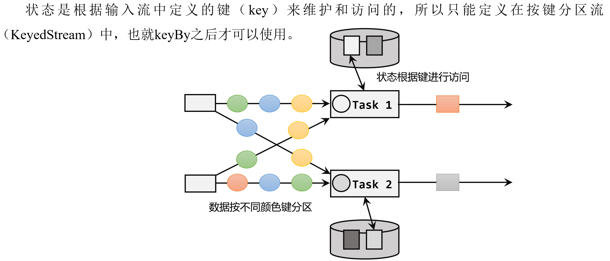

​	按键分区状态应用非常广泛。之前讲到的聚合算子必须在 keyBy 之后才能使用，就是因为聚合的结果是以Keyed State的形式保存的。

​	另外，也可以通过富函数类（Rich Function）来自定义Keyed State，所以只要提供了富函数类接口的算子，也都可以使用Keyed
State。所以即使是map、filter这样无状态的基本转换算子，也可以通过富函数类给它们"追加"Keyed State。比如RichMapFunction、RichFilterFunction。在富函数中，可以调用.getRuntimeContext()获取当前的运行时上下文（RuntimeContext），进而获取到访问状态的句柄；这种富函数中自定义的状态也是Keyed State。从这个角度讲，Flink中所有的算子都可以是有状态的。

​	无论是Keyed State还是Operator State，它们都是在本地实例上维护的，也就是说每个并行子任务维护着对应的状态，算子的子任务之间状态不共享。

## **8.2 按键分区状态（Keyed State）**

按键分区状态（Keyed State）顾名思义，是任务按照键（key）来访问和维护的状态。它的特点非常鲜明，就是以key为作用范围进行隔离。

需要注意，使用Keyed State必须基于KeyedStream。没有进行keyBy分区的DataStream，即使转换算子实现了对应的富函数类，也不能通过运行时上下文访问Keyed State。

### **8.2.1 值状态（ValueState）**

顾名思义，状态中只保存一个"值"（value）。ValueState\<T\>本身是一个接口，源码中定义如下：

public interface ValueState\<T\> extends State {

T value() throws IOException;

void update(T value) throws IOException;

}

这里的T是泛型，表示状态的数据内容可以是任何具体的数据类型。如果想要保存一个长整型值作为状态，那么类型就是ValueState\<Long\>。

可以在代码中读写值状态，实现对于状态的访问和更新。

-   T value()：获取当前状态的值；

-   update(T value)：对状态进行更新，传入的参数value就是要覆写的状态值。

在具体使用时，为了让运行时上下文清楚到底是哪个状态，还需要创建一个"状态描述器"（StateDescriptor）来提供状态的基本信息。例如源码中，ValueState的状态描述器构造方法如下：

public ValueStateDescriptor(String name, Class\<T\> typeClass) {

super(name, typeClass, null);

}

这里需要传入状态的名称和类型------这跟声明一个变量时做的事情完全一样。

**案例需求：**检测每种传感器的水位值，如果连续的两个水位值超过10，就输出报警。

public class KeyedValueStateDemo {

public static void main(String\[\] args) throws Exception {

StreamExecutionEnvironment env =
StreamExecutionEnvironment.getExecutionEnvironment();

env.setParallelism(1);

SingleOutputStreamOperator\<WaterSensor\> sensorDS = env

.socketTextStream(\"hadoop102\", 7777)

.map(new WaterSensorMapFunction())

.assignTimestampsAndWatermarks(

WatermarkStrategy

.\<WaterSensor\>forBoundedOutOfOrderness(Duration.ofSeconds(3))

.withTimestampAssigner((element, ts) -\> element.getTs() \* 1000L)

);

sensorDS.keyBy(r -\> r.getId())

.process(

new KeyedProcessFunction\<String, WaterSensor, String\>() {

// TODO 1.定义状态

ValueState\<Integer\> lastVcState;

\@Override

public void open(Configuration parameters) throws Exception {

super.open(parameters);

// TODO 2.在open方法中，初始化状态

//
状态描述器两个参数：第一个参数，起个名字，不重复；第二个参数，存储的类型

lastVcState = getRuntimeContext().getState(new
ValueStateDescriptor\<Integer\>(\"lastVcState\", Types.INT));

}

\@Override

public void processElement(WaterSensor value, Context ctx,
Collector\<String\> out) throws Exception {

// lastVcState.value(); // 取出 本组 值状态 的数据

// lastVcState.update(); // 更新 本组 值状态 的数据

// lastVcState.clear(); // 清除 本组 值状态 的数据

// 1. 取出上一条数据的水位值(Integer默认值是null，判断)

int lastVc = lastVcState.value() == null ? 0 : lastVcState.value();

// 2. 求差值的绝对值，判断是否超过10

Integer vc = value.getVc();

if (Math.abs(vc - lastVc) \> 10) {

out.collect(\"传感器=\" + value.getId() + \"==\>当前水位值=\" + vc +
\",与上一条水位值=\" + lastVc + \",相差超过10！！！！\");

}

// 3. 更新状态里的水位值

lastVcState.update(vc);

}

}

)

.print();

env.execute();

}

}

### **8.2.2 列表状态（ListState）**

将需要保存的数据，以列表（List）的形式组织起来。在ListState\<T\>接口中同样有一个类型参数T，表示列表中数据的类型。ListState也提供了一系列的方法来操作状态，使用方式与一般的List非常相似。

-   Iterable\<T\>
    get()：获取当前的列表状态，返回的是一个可迭代类型Iterable\<T\>；

-   update(List\<T\> values)：传入一个列表values，直接对状态进行覆盖；

-   add(T value)：在状态列表中添加一个元素value；

-   addAll(List\<T\>
    values)：向列表中添加多个元素，以列表values形式传入。

类似地，ListState的状态描述器就叫作ListStateDescriptor，用法跟ValueStateDescriptor完全一致。

**案例**:针对每种传感器输出最高的3个水位值

public class KeyedListStateDemo {

public static void main(String\[\] args) throws Exception {

StreamExecutionEnvironment env =
StreamExecutionEnvironment.getExecutionEnvironment();

env.setParallelism(1);

SingleOutputStreamOperator\<WaterSensor\> sensorDS = env

.socketTextStream(\"hadoop102\", 7777)

.map(new WaterSensorMapFunction())

.assignTimestampsAndWatermarks(

WatermarkStrategy

.\<WaterSensor\>forBoundedOutOfOrderness(Duration.ofSeconds(3))

.withTimestampAssigner((element, ts) -\> element.getTs() \* 1000L)

);

sensorDS.keyBy(r -\> r.getId())

.process(

new KeyedProcessFunction\<String, WaterSensor, String\>() {

ListState\<Integer\> vcListState;

\@Override

public void open(Configuration parameters) throws Exception {

super.open(parameters);

vcListState = getRuntimeContext().getListState(new
ListStateDescriptor\<Integer\>(\"vcListState\", Types.INT));

}

\@Override

public void processElement(WaterSensor value, Context ctx,
Collector\<String\> out) throws Exception {

// 1.来一条，存到list状态里

vcListState.add(value.getVc());

// 2.从list状态拿出来(Iterable)， 拷贝到一个List中，排序， 只留3个最大的

Iterable\<Integer\> vcListIt = vcListState.get();

// 2.1 拷贝到List中

List\<Integer\> vcList = new ArrayList\<\>();

for (Integer vc : vcListIt) {

vcList.add(vc);

}

// 2.2 对List进行降序排序

vcList.sort((o1, o2) -\> o2 - o1);

// 2.3
只保留最大的3个(list中的个数一定是连续变大，一超过3就立即清理即可)

if (vcList.size() \> 3) {

// 将最后一个元素清除（第4个）

vcList.remove(3);

}

out.collect(\"传感器id为\" + value.getId() + \",最大的3个水位值=\" +
vcList.toString());

// 3.更新list状态

vcListState.update(vcList);

// vcListState.get(); //取出 list状态 本组的数据，是一个Iterable

// vcListState.add(); // 向 list状态 本组 添加一个元素

// vcListState.addAll(); // 向 list状态 本组 添加多个元素

// vcListState.update(); // 更新 list状态 本组数据（覆盖）

// vcListState.clear(); // 清空List状态 本组数据

}

}

)

.print();

env.execute();

}

}

### **8.2.3 Map状态（MapState）**

把一些键值对（key-value）作为状态整体保存起来，可以认为就是一组key-value映射的列表。对应的MapState\<UK,
UV\>接口中，就会有UK、UV两个泛型，分别表示保存的key和value的类型。同样，MapState提供了操作映射状态的方法，与Map的使用非常类似。

-   UV get(UK key)：传入一个key作为参数，查询对应的value值；

-   put(UK key, UV value)：传入一个键值对，更新key对应的value值；

-   putAll(Map\<UK, UV\>
    map)：将传入的映射map中所有的键值对，全部添加到映射状态中；

-   remove(UK key)：将指定key对应的键值对删除；

-   boolean contains(UK key)：判断是否存在指定的key，返回一个boolean值。

另外，MapState也提供了获取整个映射相关信息的方法；

-   Iterable\<Map.Entry\<UK, UV\>\>
    entries()：获取映射状态中所有的键值对；

-   Iterable\<UK\>
    keys()：获取映射状态中所有的键（key），返回一个可迭代Iterable类型；

-   Iterable\<UV\>
    values()：获取映射状态中所有的值（value），返回一个可迭代Iterable类型；

-   boolean isEmpty()：判断映射是否为空，返回一个boolean值。

> **案例需求：**统计每种传感器每种水位值出现的次数。

public class KeyedMapStateDemo {

public static void main(String\[\] args) throws Exception {

StreamExecutionEnvironment env =
StreamExecutionEnvironment.getExecutionEnvironment();

env.setParallelism(1);

SingleOutputStreamOperator\<WaterSensor\> sensorDS = env

.socketTextStream(\"hadoop102\", 7777)

.map(new WaterSensorMapFunction())

.assignTimestampsAndWatermarks(

WatermarkStrategy

.\<WaterSensor\>forBoundedOutOfOrderness(Duration.ofSeconds(3))

.withTimestampAssigner((element, ts) -\> element.getTs() \* 1000L)

);

sensorDS.keyBy(r -\> r.getId())

.process(

new KeyedProcessFunction\<String, WaterSensor, String\>() {

MapState\<Integer, Integer\> vcCountMapState;

\@Override

public void open(Configuration parameters) throws Exception {

super.open(parameters);

vcCountMapState = getRuntimeContext().getMapState(new
MapStateDescriptor\<Integer, Integer\>(\"vcCountMapState\", Types.INT,
Types.INT));

}

\@Override

public void processElement(WaterSensor value, Context ctx,
Collector\<String\> out) throws Exception {

// 1.判断是否存在vc对应的key

Integer vc = value.getVc();

if (vcCountMapState.contains(vc)) {

// 1.1 如果包含这个vc的key，直接对value+1

Integer count = vcCountMapState.get(vc);

vcCountMapState.put(vc, ++count);

} else {

// 1.2 如果不包含这个vc的key，初始化put进去

vcCountMapState.put(vc, 1);

}

// 2.遍历Map状态，输出每个k-v的值

StringBuilder outStr = new StringBuilder();

outStr.append(\"======================================\\n\");

outStr.append(\"传感器id为\" + value.getId() + \"\\n\");

for (Map.Entry\<Integer, Integer\> vcCount : vcCountMapState.entries())
{

outStr.append(vcCount.toString() + \"\\n\");

}

outStr.append(\"======================================\\n\");

out.collect(outStr.toString());

// vcCountMapState.get(); // 对本组的Map状态，根据key，获取value

// vcCountMapState.contains(); // 对本组的Map状态，判断key是否存在

// vcCountMapState.put(, ); // 对本组的Map状态，添加一个 键值对

// vcCountMapState.putAll(); // 对本组的Map状态，添加多个 键值对

// vcCountMapState.entries(); // 对本组的Map状态，获取所有键值对

// vcCountMapState.keys(); // 对本组的Map状态，获取所有键

// vcCountMapState.values(); // 对本组的Map状态，获取所有值

// vcCountMapState.remove(); // 对本组的Map状态，根据指定key，移除键值对

// vcCountMapState.isEmpty(); // 对本组的Map状态，判断是否为空

// vcCountMapState.iterator(); // 对本组的Map状态，获取迭代器

// vcCountMapState.clear(); // 对本组的Map状态，清空

}

}

)

.print();

env.execute();

}

}

### **8.2.4 归约状态（ReducingState）**

类似于值状态（Value），不过需要对添加进来的所有数据进行归约，将归约聚合之后的值作为状态保存下来。ReducingState\<T\>这个接口调用的方法类似于ListState，只不过它保存的只是一个聚合值，所以调用.add()方法时，不是在状态列表里添加元素，而是直接把新数据和之前的状态进行归约，并用得到的结果更新状态。

归约逻辑的定义，是在归约状态描述器（ReducingStateDescriptor）中，通过传入一个归约函数（ReduceFunction）来实现的。这里的归约函数，就是之前介绍reduce聚合算子时讲到的ReduceFunction，所以状态类型跟输入的数据类型是一样的。

public ReducingStateDescriptor(

String name, ReduceFunction\<T\> reduceFunction, Class\<T\> typeClass)
{\...}

这里的描述器有三个参数，其中第二个参数就是定义了归约聚合逻辑的ReduceFunction，另外两个参数则是状态的名称和类型。

**案例：**计算每种传感器的水位和

\...\...

.process(new KeyedProcessFunction\<String， WaterSensor， Integer\>() {\
private ReducingState\<Integer\> sumVcState;\
\@Override\
public void open(Configuration parameters) throws Exception {\
sumVcState = this\
.getRuntimeContext()\
.getReducingState(new
ReducingStateDescriptor\<Integer\>(\"sumVcState\"，Integer::sum，Integer.class));\
}\
\
\@Override\
public void processElement(WaterSensor value， Context ctx，
Collector\<Integer\> out) throws Exception {\
sumVcState.add(value.getVc());\
out.collect(sumVcState.get());\
}\
})

### **8.2.5 聚合状态（AggregatingState）**

与归约状态非常类似，聚合状态也是一个值，用来保存添加进来的所有数据的聚合结果。与ReducingState不同的是，它的聚合逻辑是由在描述器中传入一个更加一般化的聚合函数（AggregateFunction）来定义的；这也就是之前讲过的AggregateFunction，里面通过一个累加器（Accumulator）来表示状态，所以聚合的状态类型可以跟添加进来的数据类型完全不同，使用更加灵活。

同样地，AggregatingState接口调用方法也与ReducingState相同，调用.add()方法添加元素时，会直接使用指定的AggregateFunction进行聚合并更新状态。

**案例需求：**计算每种传感器的平均水位

public class KeyedAggregatingStateDemo {

public static void main(String\[\] args) throws Exception {

StreamExecutionEnvironment env =
StreamExecutionEnvironment.getExecutionEnvironment();

env.setParallelism(1);

SingleOutputStreamOperator\<WaterSensor\> sensorDS = env

.socketTextStream(\"hadoop102\", 7777)

.map(new WaterSensorMapFunction())

.assignTimestampsAndWatermarks(

WatermarkStrategy

.\<WaterSensor\>forBoundedOutOfOrderness(Duration.ofSeconds(3))

.withTimestampAssigner((element, ts) -\> element.getTs() \* 1000L)

);

sensorDS.keyBy(r -\> r.getId())

.process(

new KeyedProcessFunction\<String, WaterSensor, String\>() {

AggregatingState\<Integer, Double\> vcAvgAggregatingState;

\@Override

public void open(Configuration parameters) throws Exception {

super.open(parameters);

vcAvgAggregatingState = getRuntimeContext()

.getAggregatingState(

new AggregatingStateDescriptor\<Integer, Tuple2\<Integer, Integer\>,
Double\>(

\"vcAvgAggregatingState\",

new AggregateFunction\<Integer, Tuple2\<Integer, Integer\>, Double\>() {

\@Override

public Tuple2\<Integer, Integer\> createAccumulator() {

return Tuple2.of(0, 0);

}

\@Override

public Tuple2\<Integer, Integer\> add(Integer value, Tuple2\<Integer,
Integer\> accumulator) {

return Tuple2.of(accumulator.f0 + value, accumulator.f1 + 1);

}

\@Override

public Double getResult(Tuple2\<Integer, Integer\> accumulator) {

return accumulator.f0 \* 1D / accumulator.f1;

}

\@Override

public Tuple2\<Integer, Integer\> merge(Tuple2\<Integer, Integer\> a,
Tuple2\<Integer, Integer\> b) {

// return Tuple2.of(a.f0 + b.f0, a.f1 + b.f1);

return null;

}

},

Types.TUPLE(Types.INT, Types.INT))

);

}

\@Override

public void processElement(WaterSensor value, Context ctx,
Collector\<String\> out) throws Exception {

// 将 水位值 添加到 聚合状态中

vcAvgAggregatingState.add(value.getVc());

// 从 聚合状态中 获取结果

Double vcAvg = vcAvgAggregatingState.get();

out.collect(\"传感器id为\" + value.getId() + \",平均水位值=\" + vcAvg);

// vcAvgAggregatingState.get(); // 对 本组的聚合状态 获取结果

// vcAvgAggregatingState.add(); // 对 本组的聚合状态
添加数据，会自动进行聚合

// vcAvgAggregatingState.clear(); // 对 本组的聚合状态 清空数据

}

}

)

.print();

env.execute();

}

}

### **8.2.6 状态生存时间（TTL）**

在实际应用中，很多状态会随着时间的推移逐渐增长，如果不加以限制，最终就会导致存储空间的耗尽。一个优化的思路是直接在代码中调用.clear()方法去清除状态，但是有时候的逻辑要求不能直接清除。这时就需要配置一个状态的"生存时间"（time-to-live，TTL），当状态在内存中存在的时间超出这个值时，就将它清除。

具体实现上，如果用一个进程不停地扫描所有状态看是否过期，显然会占用大量资源做无用功。状态的失效其实不需要立即删除，所以可以给状态附加一个属性，也就是状态的"失效时间"。状态创建的时候，设置
失效时间 = 当前时间 +
TTL；之后如果有对状态的访问和修改，可以再对失效时间进行更新；当设置的清除条件被触发时（比如，状态被访问的时候，或者每隔一段时间扫描一次失效状态），就可以判断状态是否失效、从而进行清除了。

配置状态的TTL时，需要创建一个StateTtlConfig配置对象，然后调用状态描述器的.enableTimeToLive()方法启动TTL功能。

StateTtlConfig ttlConfig = StateTtlConfig

.newBuilder(Time.seconds(10))

.setUpdateType(StateTtlConfig.UpdateType.OnCreateAndWrite)

.setStateVisibility(StateTtlConfig.StateVisibility.NeverReturnExpired)

.build();

ValueStateDescriptor\<String\> stateDescriptor = new
ValueStateDescriptor\<\>(\"my state\", String.class);

stateDescriptor.enableTimeToLive(ttlConfig);

这里用到了几个配置项：

-   .newBuilder()

状态TTL配置的构造器方法，必须调用，返回一个Builder之后再调用.build()方法就可以得到StateTtlConfig了。方法需要传入一个Time作为参数，这就是设定的状态生存时间。

-   .setUpdateType()

设置更新类型。更新类型指定了什么时候更新状态失效时间，这里的OnCreateAndWrite表示只有创建状态和更改状态（写操作）时更新失效时间。另一种类型OnReadAndWrite则表示无论读写操作都会更新失效时间，也就是只要对状态进行了访问，就表明它是活跃的，从而延长生存时间。这个配置默认为OnCreateAndWrite。

-   .setStateVisibility()

设置状态的可见性。所谓的"状态可见性"，是指因为清除操作并不是实时的，所以当状态过期之后还有可能继续存在，这时如果对它进行访问，能否正常读取到就是一个问题了。这里设置的NeverReturnExpired是默认行为，表示从不返回过期值，也就是只要过期就认为它已经被清除了，应用不能继续读取；这在处理会话或者隐私数据时比较重要。对应的另一种配置是ReturnExpireDefNotCleanedUp，就是如果过期状态还存在，就返回它的值。

除此之外，TTL配置还可以设置在保存检查点（checkpoint）时触发清除操作，或者配置增量的清理（incremental
cleanup），还可以针对RocksDB状态后端使用压缩过滤器（compaction
filter）进行后台清理。这里需要注意，目前的TTL设置只支持处理时间。

public class StateTTLDemo {

public static void main(String\[\] args) throws Exception {

StreamExecutionEnvironment env =
StreamExecutionEnvironment.getExecutionEnvironment();

env.setParallelism(1);

SingleOutputStreamOperator\<WaterSensor\> sensorDS = env

.socketTextStream(\"hadoop102\", 7777)

.map(new WaterSensorMapFunction())

.assignTimestampsAndWatermarks(

WatermarkStrategy

.\<WaterSensor\>forBoundedOutOfOrderness(Duration.ofSeconds(3))

.withTimestampAssigner((element, ts) -\> element.getTs() \* 1000L)

);

sensorDS.keyBy(r -\> r.getId())

.process(

new KeyedProcessFunction\<String, WaterSensor, String\>() {

ValueState\<Integer\> lastVcState;

\@Override

public void open(Configuration parameters) throws Exception {

super.open(parameters);

// TODO 1.创建 StateTtlConfig

StateTtlConfig stateTtlConfig = StateTtlConfig

.newBuilder(Time.seconds(5)) // 过期时间5s

// .setUpdateType(StateTtlConfig.UpdateType.OnCreateAndWrite) // 状态
创建和写入（更新） 更新 过期时间

.setUpdateType(StateTtlConfig.UpdateType.OnReadAndWrite) // 状态
读取、创建和写入（更新） 更新 过期时间

.setStateVisibility(StateTtlConfig.StateVisibility.NeverReturnExpired)
// 不返回过期的状态值

.build();

// TODO 2.状态描述器 启用 TTL

ValueStateDescriptor\<Integer\> stateDescriptor = new
ValueStateDescriptor\<\>(\"lastVcState\", Types.INT);

stateDescriptor.enableTimeToLive(stateTtlConfig);

this.lastVcState = getRuntimeContext().getState(stateDescriptor);

}

\@Override

public void processElement(WaterSensor value, Context ctx,
Collector\<String\> out) throws Exception {

// 先获取状态值，打印 ==》 读取状态

Integer lastVc = lastVcState.value();

out.collect(\"key=\" + value.getId() + \",状态值=\" + lastVc);

// 如果水位大于10，更新状态值 ===》 写入状态

if (value.getVc() \> 10) {

lastVcState.update(value.getVc());

}

}

}

)

.print();

env.execute();

}

}

## **8.3 算子状态（Operator State）**

算子状态（Operator
State）就是一个算子并行实例上定义的状态，作用范围被限定为当前算子任务。算子状态跟数据的key无关，所以不同key的数据只要被分发到同一个并行子任务，就会访问到同一个Operator
State。

算子状态的实际应用场景不如Keyed
State多，一般用在Source或Sink等与外部系统连接的算子上，或者完全没有key定义的场景。比如Flink的Kafka连接器中，就用到了算子状态。

当算子的并行度发生变化时，算子状态也支持在并行的算子任务实例之间做重组分配。根据状态的类型不同，重组分配的方案也会不同。

算子状态也支持不同的结构类型，主要有三种：ListState、UnionListState和BroadcastState。

### **8.3.1 列表状态（ListState）**

与Keyed State中的ListState一样，将状态表示为一组数据的列表。

与Keyed
State中的列表状态的区别是：在算子状态的上下文中，不会按键（key）分别处理状态，所以每一个并行子任务上只会保留一个"列表"（list），也就是当前并行子任务上所有状态项的集合。列表中的状态项就是可以重新分配的最细粒度，彼此之间完全独立。

当算子并行度进行缩放调整时，算子的列表状态中的所有元素项会被统一收集起来，相当于把多个分区的列表合并成了一个"大列表"，然后再均匀地分配给所有并行任务。这种"均匀分配"的具体方法就是"轮询"（round-robin），与之前介绍的rebanlance数据传输方式类似，是通过逐一"发牌"的方式将状态项平均分配的。这种方式也叫作"平均分割重组"（even-split
redistribution）。

算子状态中不会存在"键组"（key
group）这样的结构，所以为了方便重组分配，就把它直接定义成了"列表"（list）。这也就解释了，为什么算子状态中没有最简单的值状态（ValueState）。

**案例实操：**在map算子中计算数据的个数。

public class OperatorListStateDemo {

public static void main(String\[\] args) throws Exception {

StreamExecutionEnvironment env =
StreamExecutionEnvironment.getExecutionEnvironment();

env.setParallelism(2);

env

.socketTextStream(\"hadoop102\", 7777)

.map(new MyCountMapFunction())

.print();

env.execute();

}

// TODO 1.实现 CheckpointedFunction 接口

public static class MyCountMapFunction implements MapFunction\<String,
Long\>, CheckpointedFunction {

private Long count = 0L;

private ListState\<Long\> state;

\@Override

public Long map(String value) throws Exception {

return ++count;

}

/\*\*

\* TODO 2.本地变量持久化：将 本地变量 拷贝到
算子状态中,开启checkpoint时才会调用

\*

\* \@param context

\* \@throws Exception

\*/

\@Override

public void snapshotState(FunctionSnapshotContext context) throws
Exception {

System.out.println(\"snapshotState\...\");

// 2.1 清空算子状态

state.clear();

// 2.2 将 本地变量 添加到 算子状态 中

state.add(count);

}

/\*\*

\* TODO 3.初始化本地变量：程序启动和恢复时， 从状态中 把数据添加到
本地变量，每个子任务调用一次

\*

\* \@param context

\* \@throws Exception

\*/

\@Override

public void initializeState(FunctionInitializationContext context)
throws Exception {

System.out.println(\"initializeState\...\");

// 3.1 从 上下文 初始化 算子状态

state = context

.getOperatorStateStore()

.getListState(new ListStateDescriptor\<Long\>(\"state\", Types.LONG));

// 3.2 从 算子状态中 把数据 拷贝到 本地变量

if (context.isRestored()) {

for (Long c : state.get()) {

count += c;

}

}

}

}

}

### **8.3.2 联合列表状态（UnionListState）**

与ListState类似，联合列表状态也会将状态表示为一个列表。它与常规列表状态的区别在于，算子并行度进行缩放调整时对于状态的分配方式不同。

UnionListState的重点就在于"联合"（union）。在并行度调整时，常规列表状态是轮询分配状态项，而联合列表状态的算子则会直接广播状态的完整列表。这样，并行度缩放之后的并行子任务就获取到了联合后完整的"大列表"，可以自行选择要使用的状态项和要丢弃的状态项。这种分配也叫作"联合重组"（union
redistribution）。如果列表中状态项数量太多，为资源和效率考虑一般不建议使用联合重组的方式。

使用方式同ListState，区别在如下标红部分：

state = context

.getOperatorStateStore()

.getUnionListState(new ListStateDescriptor\<Long\>(\"union-state\",
Types.LONG));

### **8.3.3 广播状态（BroadcastState）**

有时希望算子并行子任务都保持同一份"全局"状态，用来做统一的配置和规则设定。这时所有分区的所有数据都会访问到同一个状态，状态就像被"广播"到所有分区一样，这种特殊的算子状态，就叫作广播状态（BroadcastState）。

因为广播状态在每个并行子任务上的实例都一样，所以在并行度调整的时候就比较简单，只要复制一份到新的并行任务就可以实现扩展；而对于并行度缩小的情况，可以将多余的并行子任务连同状态直接砍掉------因为状态都是复制出来的，并不会丢失。

**案例实操：**水位超过指定的阈值发送告警，阈值可以动态修改。

public class OperatorBroadcastStateDemo {

public static void main(String\[\] args) throws Exception {

StreamExecutionEnvironment env =
StreamExecutionEnvironment.getExecutionEnvironment();

env.setParallelism(2);

// 数据流

SingleOutputStreamOperator\<WaterSensor\> sensorDS = env

.socketTextStream(\"hadoop102\", 7777)

.map(new WaterSensorMapFunction());

// 配置流（用来广播配置）

DataStreamSource\<String\> configDS =
env.socketTextStream(\"hadoop102\", 8888);

// TODO 1. 将 配置流 广播

MapStateDescriptor\<String, Integer\> broadcastMapState = new
MapStateDescriptor\<\>(\"broadcast-state\", Types.STRING, Types.INT);

BroadcastStream\<String\> configBS =
configDS.broadcast(broadcastMapState);

// TODO 2.把 数据流 和 广播后的配置流 connect

BroadcastConnectedStream\<WaterSensor, String\> sensorBCS =
sensorDS.connect(configBS);

// TODO 3.调用 process

sensorBCS

.process(

new BroadcastProcessFunction\<WaterSensor, String, String\>() {

/\*\*

\* 数据流的处理方法： 数据流 只能 读取 广播状态，不能修改

\* \@param value

\* \@param ctx

\* \@param out

\* \@throws Exception

\*/

\@Override

public void processElement(WaterSensor value, ReadOnlyContext ctx,
Collector\<String\> out) throws Exception {

// TODO 5.通过上下文获取广播状态，取出里面的值（只读，不能修改）

ReadOnlyBroadcastState\<String, Integer\> broadcastState =
ctx.getBroadcastState(broadcastMapState);

Integer threshold = broadcastState.get(\"threshold\");

// 判断广播状态里是否有数据，因为刚启动时，可能是数据流的第一条数据先来

threshold = (threshold == null ? 0 : threshold);

if (value.getVc() \> threshold) {

out.collect(value + \",水位超过指定的阈值：\" + threshold + \"!!!\");

}

}

/\*\*

\* 广播后的配置流的处理方法: 只有广播流才能修改 广播状态

\* \@param value

\* \@param ctx

\* \@param out

\* \@throws Exception

\*/

\@Override

public void processBroadcastElement(String value, Context ctx,
Collector\<String\> out) throws Exception {

// TODO 4. 通过上下文获取广播状态，往里面写数据

BroadcastState\<String, Integer\> broadcastState =
ctx.getBroadcastState(broadcastMapState);

broadcastState.put(\"threshold\", Integer.valueOf(value));

}

}

)

.print();

env.execute();

}

}

## **8.4 状态后端（State Backends）**

在Flink中，状态的存储、访问以及维护，都是由一个可插拔的组件决定的，这个组件就叫作状态后端（state
backend）。状态后端主要负责管理本地状态的存储方式和位置。

### **8.4.1 状态后端的分类（HashMapStateBackend/RocksDB）**

状态后端是一个"开箱即用"的组件，可以在不改变应用程序逻辑的情况下独立配置。Flink中提供了两类不同的状态后端，一种是"哈希表状态后端"（HashMapStateBackend），另一种是"内嵌RocksDB状态后端"（EmbeddedRocksDBStateBackend）。如果没有特别配置，系统默认的状态后端是HashMapStateBackend。

（1）哈希表状态后端（HashMapStateBackend）

HashMapStateBackend是把状态存放在内存里。具体实现上，哈希表状态后端在内部会直接把状态当作对象（objects），保存在Taskmanager的JVM堆上。普通的状态，以及窗口中收集的数据和触发器，都会以键值对的形式存储起来，所以底层是一个哈希表（HashMap），这种状态后端也因此得名。

（2）内嵌RocksDB状态后端（EmbeddedRocksDBStateBackend）

RocksDB是一种内嵌的key-value存储介质，可以把数据持久化到本地硬盘。配置EmbeddedRocksDBStateBackend后，会将处理中的数据全部放入RocksDB数据库中，RocksDB默认存储在TaskManager的本地数据目录里。

RocksDB的状态数据被存储为序列化的字节数组，读写操作需要序列化/反序列化，因此状态的访问性能要差一些。另外，因为做了序列化，key的比较也会按照字节进行，而不是直接调用.hashCode()和.equals()方法。

EmbeddedRocksDBStateBackend始终执行的是异步快照，所以不会因为保存检查点而阻塞数据的处理；而且它还提供了增量式保存检查点的机制，这在很多情况下可以大大提升保存效率。

### **8.4.2 如何选择正确的状态后端**

HashMap和RocksDB两种状态后端最大的区别，就在于本地状态存放在哪里。

HashMapStateBackend是内存计算，读写速度非常快；但是，状态的大小会受到集群可用内存的限制，如果应用的状态随着时间不停地增长，就会耗尽内存资源。

而RocksDB是硬盘存储，所以可以根据可用的磁盘空间进行扩展，所以它非常适合于超级海量状态的存储。不过由于每个状态的读写都需要做序列化/反序列化，而且可能需要直接从磁盘读取数据，这就会导致性能的降低，平均读写性能要比HashMapStateBackend慢一个数量级。

### **8.4.3 状态后端的配置**

在不做配置的时候，应用程序使用的默认状态后端是由集群配置文件flink-conf.yaml中指定的，配置的键名称为state.backend。这个默认配置对集群上运行的所有作业都有效，可以通过更改配置值来改变默认的状态后端。另外，还可以在代码中为当前作业单独配置状态后端，这个配置会覆盖掉集群配置文件的默认值。

（1）配置默认的状态后端

在flink-conf.yaml中，可以使用state.backend来配置默认状态后端。

配置项的可能值为hashmap，这样配置的就是HashMapStateBackend；如果配置项的值是rocksdb，这样配置的就是EmbeddedRocksDBStateBackend。

下面是一个配置HashMapStateBackend的例子：

\# 默认状态后端

state.backend: hashmap

\# 存放检查点的文件路径

state.checkpoints.dir: hdfs://hadoop102:8020/flink/checkpoints

这里的state.checkpoints.dir配置项，定义了检查点和元数据写入的目录。

（2）为每个作业（Per-job/Application）单独配置状态后端

通过执行环境设置，HashMapStateBackend。

StreamExecutionEnvironment env =
StreamExecutionEnvironment.getExecutionEnvironment();

env.setStateBackend(new HashMapStateBackend());

通过执行环境设置，EmbeddedRocksDBStateBackend。

StreamExecutionEnvironment env =
StreamExecutionEnvironment.getExecutionEnvironment();

env.setStateBackend(new EmbeddedRocksDBStateBackend());

需要注意，如果想在IDE中使用EmbeddedRocksDBStateBackend，需要为Flink项目添加依赖：

\<dependency\>

\<groupId\>org.apache.flink\</groupId\>

\<artifactId\>flink-statebackend-rocksdb\</artifactId\>

\<version\>\${flink.version}\</version\>

\</dependency\>

而由于Flink发行版中默认就包含了RocksDB(服务器上解压的Flink)，所以只要的代码中没有使用RocksDB的相关内容，就不需要引入这个依赖。

# 第9章 容错机制

在Flink中，有一套完整的容错机制来保证故障后的恢复，其中最重要的就是检查点。

## **9.1 检查点（Checkpoint）**

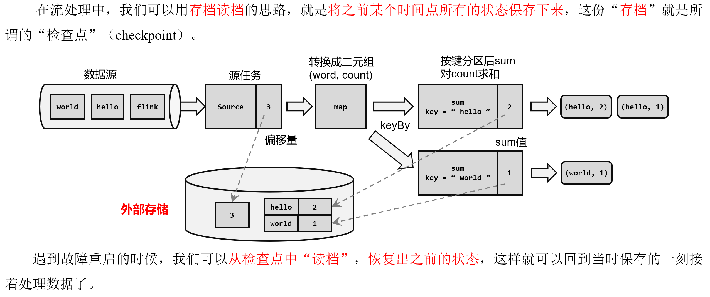

​	这里所谓的“检查”，其实是针对故障恢复的结果而言的：故障恢复之后继续处理的结果，应该与发生故障前完全一致，我们需要“检查”结果的正确性。所以，有时又会把 checkpoint 叫做 **一致性检查点**

### **9.1.1 检查点的保存**

**1）周期性的触发保存**

"随时存档"确实恢复起来方便，可是需要不停地做存档操作。如果每处理一条数据就进行检查点的保存，当大量数据同时到来时，就会耗费很多资源来频繁做检查点，数据处理的速度就会受到影响。所以在Flink中，检查点的保存是周期性触发的，间隔时间可以进行设置。

**2）保存的时间点**

应该在所有任务（算子）都恰好处理完一个相同的输入数据的时候，将它们的状态保存下来。

这样做可以实现一个数据被所有任务（算子）完整地处理完，状态得到了保存。

如果出现故障，恢复到之前保存的状态，故障时正在处理的所有数据都需要重新处理；只需要让源（source）任务向数据源重新提交偏移量、请求重放数据就可以了。当然这需要源任务可以把偏移量作为算子状态保存下来，而且外部数据源能够重置偏移量；kafka就是满足这些要求的一个最好的例子。

**3）保存的具体流程**

检查点的保存，最关键的就是要等所有任务将"同一个数据"处理完毕。下面通过一个具体的例子，来详细描述一下检查点具体的保存过程。

回忆一下最初实现的统计词频的程序------word
count。这里为了方便，直接从数据源读入已经分开的一个个单词，例如这里输入的是：

"hello"，"world"，"hello"，"flink"，"hello"，"world"，"hello"，"flink"...

所需要的就是每个任务都处理完"hello"之后保存自己的状态。

### **9.1.2 从检查点恢复状态**


​	这里Source任务已经处理完毕，所以偏移量为5
​	Map任务也处理完成了。而Sum任务在处理中发生了故障，此时状态并未保存。


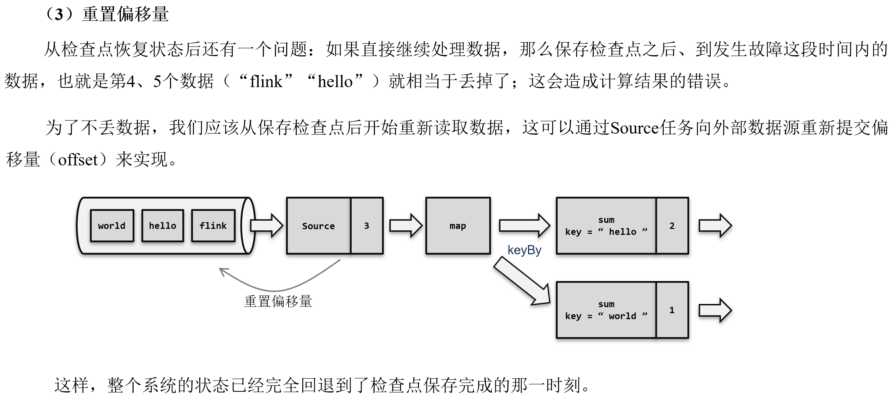


### **9.1.3 检查点算法**

在Flink中，采用了基于Chandy-Lamport算法的分布式快照，可以在不暂停整体流处理的前提下，将状态备份保存到检查点。

#### 9.1.3.1 检查点分界线（Barrier）

借鉴水位线的设计，在数据流中插入一个特殊的数据结构，专门用来表示触发检查点保存的时间点。收到保存检查点的指令后，Source任务可以在当前数据流中插入这个结构；之后的所有任务只要遇到它就开始对状态做持久化快照保存。由于数据流是保持顺序依次处理的，因此遇到这个标识就代表之前的数据都处理完了，可以保存一个检查点；而在它之后的数据，引起的状态改变就不会体现在这个检查点中，而需要保存到下一个检查点。

这种特殊的数据形式，把一条流上的数据按照不同的检查点分隔开，所以就叫做检查点的"分界线"（Checkpoint
Barrier）。


#### 9.1.3.2 分布式快照算法（Barrier对齐的精准一次）

watermark指示的是"之前的数据全部到齐了"，而barrier指示的是"之前所有数据的状态更改保存入当前检查点"：它们都是一个"截止时间"的标志。所以在处理多个分区的传递时，也要以是否还会有数据到来作为一个判断标准。

具体实现上，Flink使用了Chandy-Lamport算法的一种变体，被称为"异步分界线快照"算法。算法的核心就是两个原则：

当上游任务向多个并行下游任务发送barrier时，需要广播出去；

而当多个上游任务向同一个下游任务传递分界线时，需要在下游任务执行"分界线对齐"操作，也就是需要等到所有并行分区的barrier都到齐，才可以开始状态的保存。

1）场景说明


​	有两个并行的Source任务，会分别读取两个数据流（或者是一个源的不同分区）。这里每条流中的数据都是一个个的单词：第一条流数据是“hello”“hello”“hello”“flink“,"hello”，第二条流是交替出现。此时第一条流的Source任务（为了方便，下文中我们直接叫它“Source 1”，其它任务类似）读取了3个数据，偏移量为3；而第二条流的Source任务（Source2）只读取了一个 “hello” 数据，偏移量为 1

2）检查点保存算法具体过程为：


说明:并行的Source任务保存的状态为3和1，表示当前的1号检查点应该包含:第一条流中截至第三个数据、第二条流中截至第一
个数据的所有状态更改。可以发现Source任务做这些的时候并不影响后面任务的处理，Sum任务已经处理完了第一条流中传来的
(world, 1)，对应的状态也有了更改。


说明:由于Source和Map之间是一对一( forward）的传输关系（这里没有考虑算子链)，所以barricr可以直接传递给对应的Map任
务。之后Source任务就可以继续读取新的数据了。与此同时，Sum 1 已经将第二条流传来的(hello，1)处理完毕，更新了状态。


​	而Sum 1只收到了来自Map 2的Jbarrier，所以这时需要等待分界线对齐。在等待的过程中，如果分界线尚未到达的分区任务Map 1又
传来了数据（hello,1)，说明这是需要保存到检查点的，Sum任务应该正常继续处理数据，状态更新为3;而如果分界线已经到达的分
区任务Map 2又传来数据，这已经是下一个检查点要保存的内容了，就不应立即处理，而是要缓存起来等到状态保存之后再做处理。


这个过程中，每个任务保存自己的状态都是相对独立的，互不影响。我们可以看到，当Sum将当前状态保存完毕时，Source 1任务
已经读取到第一条流的第五个数据了。

（1）触发检查点：JobManager向Source发送Barrier；

（2）Barrier发送：向下游广播发送；

（3）Barrier对齐：下游需要收到上游所有并行度传递过来的Barrier才做自身状态的保存；

（4）状态保存：有状态的算子将状态保存至持久化。

（5）先处理缓存数据，然后正常继续处理

​	完成检查点保存之后，任务就可以继续正常处理数据了。这时如果有等待分界线对齐时缓存的数据，需要先做处理；然后再按照顺序依次处理新到的数据。当JobManager收到所有任务成功保存状态的信息，就可以确认当前检查点成功保存。之后遇到故障就可以从这里恢复了。

​	（补充）由于分界线对齐要求先到达的分区做缓存等待，一定程度上会影响处理的速度；当出现背压时，下游任务会堆积大量的缓冲数据，检查点可能需要很久才可以保存完毕。

​	为了应对这种场景，Barrier对齐中提供了至少一次语义以及Flink 1.11之后提供了不对齐的检查点保存方式，可以将未处理的缓冲数据也保存进检查点。这样，当遇到一个分区barrier时就不需等待对齐，而是可以直接启动状态的保存了。

#### 9.1.3.3 分布式快照算法（Barrier对齐的至少一次）


说明:并行的Source任务保存的状态为3和1，表示当前的1号检查点应该包含:第一条流中截至第三个数据、第二条流中截至第一
个数据的所有状态更改。可以发现Source任务做这些的时候并不影响后面任务的处理，Sum任务已经处理完了第一条流中传来的(world, 1），对应的状态也有了更改。


说明:由于Source和Map之间是一对一( forward）的传输关系（这里没有考虑算子链），所以barrier可以直接传递给对应的Map任
务。之后Source任务就可以继续读取新的数据了。与此同时，Sum 1已经将第二条流传来的（hello，1)处理完毕，更新了状态。


而Sum 1只收到了来自Map 2的barrier，所以这时需要等待分界线对齐。而如果分界线已经到达的分区任务Map 2又传来数据，直接
计算等到下一个Barrier到达时做状态的保存。重新启动时介于两个Barrier之间分界线已经到达的分区任务Map2传过来的数据会再次计
算（至少一次）。


这个过程中，每个任务保存自己的状态都是相对独立的，互不影响。我们可以看到，当Sum将当前状态保存完毕时，Source 1任务已经读取到第一条流的第五个数据了。

#### 9.1.3.4 分布式快照算法（非Barrier对齐的精准一次）


说明:并行的Source任务保存的状态为3和1，表示当前的1号检查点应该包含:第一条流中截至第三个数据、第二条流中截至第一
个数据的所有状态更改。可以发现Source任务做这些的时候并不影响后面任务的处理，Sum 2已经处理完了第一条流中传来 ( world, 1)，对应的状态也有了更改。


说明:由于Source和Map之间是一对一( forward）的传输关系（这里没有考虑算子链），所以barrier可以直接传递给对应的Map任务，更新了状态。之后Source任务就可以继续读取新的数据了。与此同时，Sum 1已经将第二条流传来的(hello，1)处理完毕，更新状态。


### **9.1.4 检查点配置**

检查点的作用是为了故障恢复，不能因为保存检查点占据了大量时间、导致数据处理性能明显降低。为了兼顾容错性和处理性能，可以在代码中对检查点进行各种配置。

#### 9.1.4.1 启用检查点

默认情况下，Flink程序是禁用检查点的。如果想要为Flink应用开启自动保存快照的功能，需要在代码中显式地调用执行环境的.enableCheckpointing()方法：

StreamExecutionEnvironment env = StreamExecutionEnvironment.getExecutionEnvironment();

// 每隔1秒启动一次检查点保存

env.enableCheckpointing(1000);

这里需要传入一个长整型的毫秒数，表示周期性保存检查点的间隔时间。如果不传参数直接启用检查点，默认的间隔周期为500毫秒，这种方式已经被弃用。

检查点的间隔时间是对处理性能和故障恢复速度的一个权衡。如果希望对性能的影响更小，可以调大间隔时间；而如果希望故障重启后迅速赶上实时的数据处理，就需要将间隔时间设小一些。

#### 9.1.4.2 检查点存储

检查点具体的持久化存储位置，取决于"检查点存储"的设置。默认情况下，检查点存储在JobManager的堆内存中。而对于大状态的持久化保存，Flink也提供了在其他存储位置进行保存的接口。

具体可以通过调用检查点配置的.setCheckpointStorage()来配置，需要传入一个CheckpointStorage的实现类。Flink主要提供了两种CheckpointStorage：作业管理器的堆内存和文件系统。

// 配置存储检查点到JobManager堆内存

env.getCheckpointConfig().setCheckpointStorage(new
JobManagerCheckpointStorage());

// 配置存储检查点到文件系统

env.getCheckpointConfig().setCheckpointStorage(new
FileSystemCheckpointStorage(\"hdfs://namenode:40010/flink/checkpoints\"));

对于实际生产应用，一般会将CheckpointStorage配置为高可用的分布式文件系统（HDFS，S3等）。

#### 9.1.4.3 其它高级配置

检查点还有很多可以配置的选项，可以通过获取检查点配置（CheckpointConfig）来进行设置。

CheckpointConfig checkpointConfig = env.getCheckpointConfig();

**1）常用高级配置**

-   检查点模式（CheckpointingMode）

设置检查点一致性的保证级别，有"精确一次"（exactly-once）和"至少一次"（at-least-once）两个选项。默认级别为exactly-once，而对于大多数低延迟的流处理程序，at-least-once就够用了，而且处理效率会更高。

-   超时时间（checkpointTimeout）

用于指定检查点保存的超时时间，超时没完成就会被丢弃掉。传入一个长整型毫秒数作为参数，表示超时时间。

-   最小间隔时间（minPauseBetweenCheckpoints）

用于指定在上一个检查点完成之后，检查点协调器最快等多久可以出发保存下一个检查点的指令。这就意味着即使已经达到了周期触发的时间点，只要距离上一个检查点完成的间隔不够，就依然不能开启下一次检查点的保存。这就为正常处理数据留下了充足的间隙。当指定这个参数时，实际并发为1。

-   最大并发检查点数量（maxConcurrentCheckpoints）

用于指定运行中的检查点最多可以有多少个。由于每个任务的处理进度不同，完全可能出现后面的任务还没完成前一个检查点的保存、前面任务已经开始保存下一个检查点了。这个参数就是限制同时进行的最大数量。

-   开启外部持久化存储（enableExternalizedCheckpoints）

用于开启检查点的外部持久化，而且默认在作业失败的时候不会自动清理，如果想释放空间需要自己手工清理。里面传入的参数ExternalizedCheckpointCleanup指定了当作业取消的时候外部的检查点该如何清理。

DELETE_ON_CANCELLATION：在作业取消的时候会自动删除外部检查点，但是如果是作业失败退出，则会保留检查点。

RETAIN_ON_CANCELLATION：作业取消的时候也会保留外部检查点。

-   检查点连续失败次数（tolerableCheckpointFailureNumber）

用于指定检查点连续失败的次数，当达到这个次数，作业就失败退出。默认为0，这意味着不能容忍检查点失败，并且作业将在第一次报告检查点失败时失败。

**2）开启非对齐检查点**

-   非对齐检查点（enableUnalignedCheckpoints）

不再执行检查点的分界线对齐操作，启用之后可以大大减少产生背压时的检查点保存时间。这个设置要求检查点模式（CheckpointingMode）必须为exctly-once，并且最大并发的检查点个数为1。

-   对齐检查点超时时间（alignedCheckpointTimeout）

该参数只有在启用非对齐检查点的时候有效。参数默认是0，表示一开始就直接用非对齐检查点。如果设置大于0，一开始会使用对齐的检查点，当对齐时间超过该参数设定的时间，则会自动切换成非对齐检查点。

代码中具体设置如下：

public class CheckpointConfigDemo {

public static void main(String\[\] args) throws Exception {

StreamExecutionEnvironment env =
StreamExecutionEnvironment.createLocalEnvironmentWithWebUI(new
Configuration());

env.setParallelism(1);

// 代码中用到hdfs，需要导入hadoop依赖、指定访问hdfs的用户名

System.setProperty(\"HADOOP_USER_NAME\", \"gardenia\");

// TODO 检查点配置

// 1、启用检查点: 默认是barrier对齐的，周期为5s, 精准一次

env.enableCheckpointing(5000, CheckpointingMode.EXACTLY_ONCE);

CheckpointConfig checkpointConfig = env.getCheckpointConfig();

// 2、指定检查点的存储位置

checkpointConfig.setCheckpointStorage(\"hdfs://hadoop102:8020/chk\");

// 3、checkpoint的超时时间: 默认10分钟

checkpointConfig.setCheckpointTimeout(60000);

// 4、同时运行中的checkpoint的最大数量

checkpointConfig.setMaxConcurrentCheckpoints(1);

// 5、最小等待间隔: 上一轮checkpoint结束 到 下一轮checkpoint开始
之间的间隔，设置了\>0,并发就会变成1

checkpointConfig.setMinPauseBetweenCheckpoints(1000);

// 6、取消作业时，checkpoint的数据 是否保留在外部系统

// DELETE_ON_CANCELLATION:主动cancel时，删除存在外部系统的chk-xx目录
（如果是程序突然挂掉，不会删）

// RETAIN_ON_CANCELLATION:主动cancel时，外部系统的chk-xx目录会保存下来

checkpointConfig.setExternalizedCheckpointCleanup(CheckpointConfig.ExternalizedCheckpointCleanup.RETAIN_ON_CANCELLATION);

// 7、允许 checkpoint
连续失败的次数，默认0\--》表示checkpoint一失败，job就挂掉

checkpointConfig.setTolerableCheckpointFailureNumber(10);

// TODO 开启 非对齐检查点（barrier非对齐）

// 开启的要求： Checkpoint模式必须是精准一次，最大并发必须设为1

checkpointConfig.enableUnalignedCheckpoints();

// 开启非对齐检查点才生效： 默认0，表示一开始就直接用 非对齐的检查点

// 如果大于0， 一开始用 对齐的检查点（barrier对齐），
对齐的时间超过这个参数，自动切换成 非对齐检查点（barrier非对齐）

checkpointConfig.setAlignedCheckpointTimeout(Duration.ofSeconds(1));

env

.socketTextStream(\"hadoop102\", 7777)

.flatMap(

(String value, Collector\<Tuple2\<String, Integer\>\> out) -\> {

String\[\] words = value.split(\" \");

for (String word : words) {

out.collect(Tuple2.of(word, 1));

}

}

)

.returns(Types.TUPLE(Types.STRING, Types.INT))

.keyBy(value -\> value.f0)

.sum(1)

.print();

env.execute();

}

}

#### 9.1.4.4 通用增量 checkpoint (changelog)

在 1.15 之前，只有RocksDB
支持增量快照。不同于产生一个包含所有数据的全量备份，增量快照中只包含自上一次快照完成之后被修改的记录，因此可以显著减少快照完成的耗时。

Rocksdb状态后端启用增量checkpoint：

EmbeddedRocksDBStateBackend backend = new
EmbeddedRocksDBStateBackend(true);

从 1.15 开始，不管hashmap还是rocksdb
状态后端都可以通过开启changelog实现通用的增量checkpoint。

**1）执行过程**

（1）带状态的算子任务将状态更改写入变更日志（记录状态）

{width="5.90625in"
height="2.8402777777777777in"}

（2）状态物化：状态表定期保存，独立于检查点

{width="5.90625in"
height="3.0145833333333334in"}

（3）状态物化完成后，状态变更日志就可以被截断到相应的点

{width="5.90625in"
height="3.0145833333333334in"}

**2）注意事项**

（1）目前标记为实验性功能，开启后可能会造成资源消耗增大：

-   HDFS上保存的文件数变多

-   消耗更多的IO带宽用于上传变更日志

-   更多的CPU用于序列化状态更改

-   TaskManager使用更多内存来缓存状态更改

> （2）使用限制：

-   Checkpoint的最大并发必须为1

-   从 Flink 1.15 开始，只有文件系统的存储类型实现可用（memory测试阶段）

-   不支持 NO_CLAIM 模式

**3）使用方式**

（1）方式一：配置文件指定

state.backend.changelog.enabled: true

state.backend.changelog.storage: filesystem

\# 存储 changelog 数据

dstl.dfs.base-path: hdfs://hadoop102:8020/changelog

execution.checkpointing.max-concurrent-checkpoints: 1

execution.savepoint-restore-mode: CLAIM

（2）方式二：在代码中设置

需要引入依赖：

\<dependency\>

\<groupId\>org.apache.flink\</groupId\>

\<artifactId\>flink-statebackend-changelog\</artifactId\>

\<version\>\${flink.version}\</version\>

\<scope\>runtime\</scope\>

\</dependency\>

开启changelog:

env.enableChangelogStateBackend(true);

#### 9.1.4.5 最终检查点

如果数据源是有界的，就可能出现部分Task已经处理完所有数据，变成finished状态，不继续工作。从
Flink 1.14 开始，这些finished状态的Task，也可以继续执行检查点。自 1.15
起默认启用此功能，并且可以通过功能标志禁用它：

Configuration config = new Configuration();

config.set(ExecutionCheckpointingOptions.ENABLE_CHECKPOINTS_AFTER_TASKS_FINISH,
false);

StreamExecutionEnvironment env =
StreamExecutionEnvironment.getExecutionEnvironment(config);

### **9.1.5 保存点（Savepoint）**

除了检查点外，Flink还提供了另一个非常独特的镜像保存功能------保存点（savepoint）。

从名称就可以看出，这也是一个存盘的备份，它的原理和算法与检查点完全相同，只是多了一些额外的元数据。

#### 9.1.5.1 保存点的用途

保存点与检查点最大的区别，就是触发的时机。检查点是由Flink自动管理的，定期创建，发生故障之后自动读取进行恢复，这是一个"自动存盘"的功能；而保存点不会自动创建，必须由用户明确地手动触发保存操作，所以就是"手动存盘"。

保存点可以当作一个强大的运维工具来使用。可以在需要的时候创建一个保存点，然后停止应用，做一些处理调整之后再从保存点重启。它适用的具体场景有：

-   版本管理和归档存储

-   更新Flink版本

-   更新应用程序

-   调整并行度

-   暂停应用程序

需要注意的是，保存点能够在程序更改的时候依然兼容，前提是状态的拓扑结构和数据类型不变。知道保存点中状态都是以算子ID-状态名称这样的key-value组织起来的，算子ID可以在代码中直接调用SingleOutputStreamOperator的.uid()方法来进行指定：

DataStream\<String\> stream = env

.addSource(new StatefulSource()).uid(\"source-id\")

.map(new StatefulMapper()).uid(\"mapper-id\")

.print();

对于没有设置ID的算子，Flink默认会自动进行设置，所以在重新启动应用后可能会导致ID不同而无法兼容以前的状态。所以为了方便后续的维护，强烈建议在程序中为每一个算子手动指定ID。

#### 9.1.5.2 使用保存点

保存点的使用非常简单，可以使用命令行工具来创建保存点，也可以从保存点恢复作业。

（1）创建保存点

要在命令行中为运行的作业创建一个保存点镜像，只需要执行：

bin/flink savepoint :jobId \[:targetDirectory\]

这里jobId需要填充要做镜像保存的作业ID，目标路径targetDirectory可选，表示保存点存储的路径。

对于保存点的默认路径，可以通过配置文件flink-conf.yaml中的state.savepoints.dir项来设定：

state.savepoints.dir: hdfs:///flink/savepoints

当然对于单独的作业，也可以在程序代码中通过执行环境来设置：

env.setDefaultSavepointDir(\"hdfs:///flink/savepoints\");

由于创建保存点一般都是希望更改环境之后重启，所以创建之后往往紧接着就是停掉作业的操作。除了对运行的作业创建保存点，也可以在停掉一个作业时直接创建保存点：

bin/flink stop \--savepointPath \[:targetDirectory\] :jobId

（2）从保存点重启应用

已经知道，提交启动一个Flink作业，使用的命令是flink
run；现在要从保存点重启一个应用，其实本质是一样的：

bin/flink run -s :savepointPath \[:runArgs\]

这里只要增加一个-s参数，指定保存点的路径就可以了，其它启动时的参数还是完全一样的，如果是基于yarn的运行模式还需要加上
-yid application-id。在第三章使用web
UI进行作业提交时，可以填入的参数除了入口类、并行度和运行参数，还有一个"Savepoint
Path"，这就是从保存点启动应用的配置。

#### 9.1.5.3 使用保存点切换状态后端

使用savepoint恢复状态的时候，也可以更换状态后端。但是有一点需要注意的是，不要在代码中指定状态后端了，
通过配置文件来配置或者-D 参数配置。

打包时，服务器上有的就provided，可能遇到依赖问题，报错：javax.annotation.Nullable找不到，可以导入如下依赖：

\<dependency\>

\<groupId\>com.google.code.findbugs\</groupId\>

\<artifactId\>jsr305\</artifactId\>

\<version\>1.3.9\</version\>

\</dependency\>

（1）提交flink作业

bin/flink run-application -d -t yarn-application -Dstate.backend=hashmap
-c com.gardenia.checkpoint.SavepointDemo FlinkTutorial-1.0-SNAPSHOT.jar

（2）停止flink作业时，触发保存点

方式一：stop优雅停止并触发保存点，要求source实现StoppableFunction接口

bin/flink stop -p savepoint路径 job-id -yid application-id

方式二：cancel立即停止并触发保存点

bin/flink cancel -s savepoint路径 job-id -yid application-id

案例中source是socket，不能用stop

bin/flink cancel -s hdfs://hadoop102:8020/sp
cffca338509ea04f38f03b4b77c8075c -yid application_1681871196375_0001

（3）从savepoint恢复作业，同时修改状态后端

bin/flink run-application -d -t yarn-application -s
hdfs://hadoop102:8020/sp/savepoint-267cc0-47a214b019d5
-Dstate.backend=rocksdb -c com.gardenia.checkpoint.SavepointDemo
FlinkTutorial-1.0-SNAPSHOT.jar

（4）从保存下来的checkpoint恢复作业

bin/flink run-application -d -t yarn-application -Dstate.backend=rocksdb
-s hdfs://hadoop102:8020/chk/532f87ef4146b2a2968a1c137d33d4a6/chk-175 -c
com.gardenia.checkpoint.SavepointDemo ./FlinkTutorial-1.0-SNAPSHOT.jar

如果停止作业时，忘了触发保存点也不用担心，现在版本的flink支持从保留在外部系统的checkpoint恢复作业，但是恢复时不支持切换状态后端。

## **9.2 状态一致性**

### **9.2.1 一致性的概念和级别**

一致性其实就是结果的正确性，一般从数据丢失、数据重复来评估。

流式计算本身就是一个一个来的，所以正常处理的过程中结果肯定是正确的；但在发生故障、需要恢复状态进行回滚时就需要更多的保障机制了。通过检查点的保存来保证状态恢复后结果的正确，所以主要讨论的就是"状态的一致性"。

一般说来，状态一致性有三种级别：

-   **最多一次（At-Most-Once）**

-   **至少一次（At-Least-Once）**

-   **精确一次（Exactly-Once）**

### **9.2.2 端到端的状态一致性**

已经知道检查点可以保证Flink内部状态的一致性，而且可以做到精确一次。那是不是说，只要开启了检查点，发生故障进行恢复，结果就不会有任何问题呢？

没那么简单。在实际应用中，一般要保证从用户的角度看来，最终消费的数据是正确的。而用户或者外部应用不会直接从Flink内部的状态读取数据，往往需要将处理结果写入外部存储中。这就要求不仅要考虑Flink内部数据的处理转换，还涉及到从外部数据源读取，以及写入外部持久化系统，整个应用处理流程从头到尾都应该是正确的。

所以完整的流处理应用，应该包括了数据源、流处理器和外部存储系统三个部分。这个完整应用的一致性，就叫做"端到端（end-to-end）的状态一致性"，它取决于三个组件中最弱的那一环。一般来说，能否达到at-least-once一致性级别，主要看数据源能够重放数据；而能否达到exactly-once级别，流处理器内部、数据源、外部存储都要有相应的保证机制。

## **9.3 端到端精确一次（End-To-End Exactly-Once）**

实际应用中，最难做到、也最希望做到的一致性语义，无疑就是端到端（end-to-end）的"精确一次"。知道，对于Flink内部来说，检查点机制可以保证故障恢复后数据不丢（在能够重放的前提下），并且只处理一次，所以已经可以做到exactly-once的一致性语义了。

所以端到端一致性的关键点，就在于输入的数据源端和输出的外部存储端。


### **9.3.1 输入端保证**

输入端主要指的就是Flink读取的外部数据源。对于一些数据源来说，并不提供数据的缓冲或是持久化保存，数据被消费之后就彻底不存在了，例如socket文本流。对于这样的数据源，故障后即使通过检查点恢复之前的状态，可保存检查点之后到发生故障期间的数据已经不能重发了，这就会导致数据丢失。所以就只能保证at-most-once的一致性语义，相当于没有保证。

想要在故障恢复后不丢数据，外部数据源就必须拥有重放数据的能力。常见的做法就是对数据进行持久化保存，并且可以重设数据的读取位置。一个最经典的应用就是Kafka。在Flink的Source任务中将数据读取的偏移量保存为状态，这样就可以在故障恢复时从检查点中读取出来，对数据源重置偏移量，重新获取数据。

数据源可重放数据，或者说可重置读取数据偏移量，加上Flink的Source算子将偏移量作为状态保存进检查点，就可以保证数据不丢。这是达到at-least-once一致性语义的基本要求，当然也是实现端到端exactly-once的基本要求。

### **9.3.2 输出端保证**

有了Flink的检查点机制，以及可重放数据的外部数据源，已经能做到at-least-once了。但是想要实现exactly-once却有更大的困难：数据有可能重复写入外部系统。

因为检查点保存之后，继续到来的数据也会一一处理，任务的状态也会更新，最终通过Sink任务将计算结果输出到外部系统；只是状态改变还没有存到下一个检查点中。这时如果出现故障，这些数据都会重新来一遍，就计算了两次。知道对Flink内部状态来说，重复计算的动作是没有影响的，因为状态已经回滚，最终改变只会发生一次；但对于外部系统来说，已经写入的结果就是泼出去的水，已经无法收回了，再次执行写入就会把同一个数据写入两次。

所以这时，只保证了端到端的at-least-once语义。

为了实现端到端exactly-once，还需要对外部存储系统、以及Sink连接器有额外的要求。能够保证exactly-once一致性的写入方式有两种：

-   **幂等写入**

-   **事务写入**

需要外部存储系统对这两种写入方式的支持，而Flink也为提供了一些Sink连接器接口。接下来进行展开讲解。

**1）幂等（Idempotent）写入**

所谓"幂等"操作，就是说一个操作可以重复执行很多次，但只导致一次结果更改。也就是说，后面再重复执行就不会对结果起作用了。

这相当于说，并没有真正解决数据重复计算、写入的问题；而是说，重复写入也没关系，结果不会改变。所以这种方式主要的限制在于外部存储系统必须支持这样的幂等写入：比如Redis中键值存储，或者关系型数据库（如MySQL）中满足查询条件的更新操作。

需要注意，对于幂等写入，遇到故障进行恢复时，有可能会出现短暂的不一致。因为保存点完成之后到发生故障之间的数据，其实已经写入了一遍，回滚的时候并不能消除它们。如果有一个外部应用读取写入的数据，可能会看到奇怪的现象：短时间内，结果会突然"跳回"到之前的某个值，然后"重播"一段之前的数据。不过当数据的重放逐渐超过发生故障的点的时候，最终的结果还是一致的。

**2）事务（Transactional）写入**

如果说幂等写入对应用场景限制太多，那么事务写入可以说是更一般化的保证一致性的方式。

输出端最大的问题，就是写入到外部系统的数据难以撤回。而利用事务就可以实现对已写入数据的撤回。

事务是应用程序中一系列严密的操作，所有操作必须成功完成，否则在每个操作中所作的所有更改都会被撤消。事务有四个基本特性：原子性、一致性、隔离性和持久性，这就是著名的ACID。

在Flink流处理的结果写入外部系统时，如果能够构建一个事务，让写入操作可以随着检查点来提交和回滚，那么自然就可以解决重复写入的问题了。所以事务写入的基本思想就是：用一个事务来进行数据向外部系统的写入，这个事务是与检查点绑定在一起的。当Sink任务遇到barrier时，开始保存状态的同时就开启一个事务，接下来所有数据的写入都在这个事务中；待到当前检查点保存完毕时，将事务提交，所有写入的数据就真正可用了。如果中间过程出现故障，状态会回退到上一个检查点，而当前事务没有正常关闭（因为当前检查点没有保存完），所以也会回滚，写入到外部的数据就被撤销了。

具体来说，又有两种实现方式：预写日志（WAL）和两阶段提交（2PC）

**（1）预写日志（write-ahead-log，WAL）**

发现，事务提交是需要外部存储系统支持事务的，否则没有办法真正实现写入的回撤。那对于一般不支持事务的存储系统，能够实现事务写入呢？

预写日志（WAL）就是一种非常简单的方式。具体步骤是：

①先把结果数据作为日志（log）状态保存起来

②进行检查点保存时，也会将这些结果数据一并做持久化存储

③在收到检查点完成的通知时，将所有结果一次性写入外部系统。

④在成功写入所有数据后，在内部再次确认相应的检查点，将确认信息也进行持久化保存。这才代表着检查点的真正完成。

会发现，这种方式类似于检查点完成时做一个批处理，一次性的写入会带来一些性能上的问题；而优点就是比较简单，由于数据提前在状态后端中做了缓存，所以无论什么外部存储系统，理论上都能用这种方式一批搞定。在Flink中DataStream
API提供了一个模板类GenericWriteAheadSink，用来实现这种事务型的写入方式。

需要注意的是，预写日志这种一批写入的方式，有可能会写入失败；所以在执行写入动作之后，必须等待发送成功的返回确认消息。在成功写入所有数据后，在内部再次确认相应的检查点，这才代表着检查点的真正完成。这里需要将确认信息也进行持久化保存，在故障恢复时，只有存在对应的确认信息，才能保证这批数据已经写入，可以恢复到对应的检查点位置。

但这种"再次确认"的方式，也会有一些缺陷。如果的检查点已经成功保存、数据也成功地一批写入到了外部系统，但是最终保存确认信息时出现了故障，Flink最终还是会认为没有成功写入。于是发生故障时，不会使用这个检查点，而是需要回退到上一个；这样就会导致这批数据的重复写入。

**（2）两阶段提交（two-phase-commit，2PC）**

前面提到的各种实现exactly-once的方式，多少都有点缺陷；而更好的方法就是传说中的两阶段提交（2PC）。

顾名思义，它的想法是分成两个阶段：先做"预提交"，等检查点完成之后再正式提交。这种提交方式是真正基于事务的，它需要外部系统提供事务支持。

具体的实现步骤为：

①当第一条数据到来时，或者收到检查点的分界线时，Sink任务都会启动一个事务。

②接下来接收到的所有数据，都通过这个事务写入外部系统；这时由于事务没有提交，所以数据尽管写入了外部系统，但是不可用，是"预提交"的状态。

③当Sink任务收到JobManager发来检查点完成的通知时，正式提交事务，写入的结果就真正可用了。

当中间发生故障时，当前未提交的事务就会回滚，于是所有写入外部系统的数据也就实现了撤回。这种两阶段提交（2PC）的方式充分利用了Flink现有的检查点机制：分界线的到来，就标志着开始一个新事务；而收到来自JobManager的checkpoint成功的消息，就是提交事务的指令。每个结果数据的写入，依然是流式的，不再有预写日志时批处理的性能问题；最终提交时，也只需要额外发送一个确认信息。所以2PC协议不仅真正意义上实现了exactly-once，而且通过搭载Flink的检查点机制来实现事务，只给系统增加了很少的开销。

Flink提供了TwoPhaseCommitSinkFunction接口，方便自定义实现两阶段提交的SinkFunction的实现，提供了真正端到端的exactly-once保证。新的Sink架构，使用的是TwoPhaseCommittingSink接口。

不过两阶段提交虽然精巧，却对外部系统有很高的要求。这里将2PC对外部系统的要求列举如下：

-   外部系统必须提供事务支持，或者Sink任务必须能够模拟外部系统上的事务。

-   在检查点的间隔期间里，必须能够开启一个事务并接受数据写入。

-   在收到检查点完成的通知之前，事务必须是"等待提交"的状态。在故障恢复的情况下，这可能需要一些时间。如果这个时候外部系统关闭事务（例如超时了），那么未提交的数据就会丢失。

-   Sink任务必须能够在进程失败后恢复事务。

-   提交事务必须是幂等操作。也就是说，事务的重复提交应该是无效的。

可见，2PC在实际应用同样会受到比较大的限制。具体在项目中的选型，最终还应该是一致性级别和处理性能的权衡考量。

### **9.3.3 Flink和Kafka连接时的精确一次保证**

在流处理的应用中，最佳的数据源当然就是可重置偏移量的消息队列了；它不仅可以提供数据重放的功能，而且天生就是以流的方式存储和处理数据的。所以作为大数据工具中消息队列的代表，Kafka可以说与Flink是天作之合，实际项目中也经常会看到以Kafka作为数据源和写入的外部系统的应用。在本小节中，就来具体讨论一下Flink和Kafka连接时，怎样保证端到端的exactly-once状态一致性。

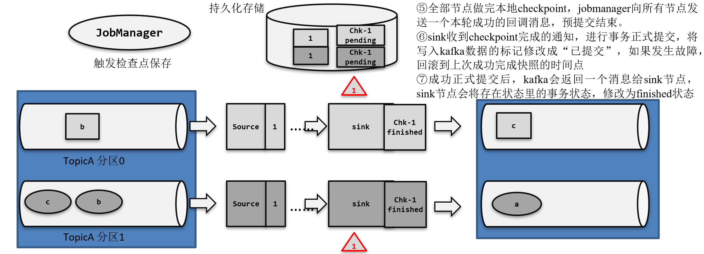

​	① JobManager发送指令，触发检查点的保存：所有Souree节点插入一个id=1的barrier,触发source节点将偏移量保存到远程的持久化存储中
​	②sink节点接收到Flink启动后的第一条数据，负责开启Kafka的第一次事务，预提交开始。同时会将事务的状态保存到状态里
​	③预提交阶段：到达sink的数据会调用kafka producer的send()，数据写入缓冲区，再flush()。此时数据写到kafka中，标记为”未提交”状态。如果任意一个sink节点预提交过程中出现失败，整个预提交会放弃
​	④id=1的barrier到达sink节点，触发barrier节点的本地状态保存到 `hdfs` 本地状态包含自身的状态和事务快照。同时，开启一个新的Kafka事务，用于该barrier后面数据的预提交，如：分区0的b，分区1的b、c。只有第一个事务由第一条数据开启，后面都是由barrier开启事务

**1）整体介绍**

既然是端到端的exactly-once，依然可以从三个组件的角度来进行分析：

（1）Flink内部

Flink内部可以通过检查点机制保证状态和处理结果的exactly-once语义。

（2）输入端

输入数据源端的Kafka可以对数据进行持久化保存，并可以重置偏移量（offset）。所以可以在Source任务（FlinkKafkaConsumer）中将当前读取的偏移量保存为算子状态，写入到检查点中；当发生故障时，从检查点中读取恢复状态，并由连接器FlinkKafkaConsumer向Kafka重新提交偏移量，就可以重新消费数据、保证结果的一致性了。

（3）输出端

输出端保证exactly-once的最佳实现，当然就是两阶段提交（2PC）。作为与Flink天生一对的Kafka，自然需要用最强有力的一致性保证来证明自己。

也就是说，写入Kafka的过程实际上是一个两段式的提交：处理完毕得到结果，写入Kafka时是基于事务的"预提交"；等到检查点保存完毕，才会提交事务进行"正式提交"。如果中间出现故障，事务进行回滚，预提交就会被放弃；恢复状态之后，也只能恢复所有已经确认提交的操作。

**2）需要的配置**

在具体应用中，实现真正的端到端exactly-once，还需要有一些额外的配置：

（1）必须启用检查点

（2）指定KafkaSink的发送级别为DeliveryGuarantee.EXACTLY_ONCE

（3）配置Kafka读取数据的消费者的隔离级别

这里所说的Kafka，是写入的外部系统。预提交阶段数据已经写入，只是被标记为"未提交"（uncommitted），而Kafka中默认的隔离级别isolation.level是read_uncommitted，也就是可以读取未提交的数据。这样一来，外部应用就可以直接消费未提交的数据，对于事务性的保证就失效了。所以应该将隔离级别配置

为read_committed，表示消费者遇到未提交的消息时，会停止从分区中消费数据，直到消息被标记为已提交才会再次恢复消费。当然，这样做的话，外部应用消费数据就会有显著的延迟。

（4）事务超时配置

Flink的Kafka连接器中配置的事务超时时间transaction.timeout.ms默认是1小时，而Kafka集群配置的事务最大超时时间transaction.max.timeout.ms默认是15分钟。所以在检查点保存时间很长时，有可能出现Kafka已经认为事务超时了，丢弃了预提交的数据；而Sink任务认为还可以继续等待。如果接下来检查点保存成功，发生故障后回滚到这个检查点的状态，这部分数据就被真正丢掉了。所以这两个超时时间，前者应该小于等于后者。

public class KafkaEOSDemo {

public static void main(String\[\] args) throws Exception {

StreamExecutionEnvironment env =
StreamExecutionEnvironment.getExecutionEnvironment();

// 代码中用到hdfs，需要导入hadoop依赖、指定访问hdfs的用户名

System.setProperty(\"HADOOP_USER_NAME\", \"gardenia\");

// TODO 1、启用检查点,设置为精准一次

env.enableCheckpointing(5000, CheckpointingMode.EXACTLY_ONCE);

CheckpointConfig checkpointConfig = env.getCheckpointConfig();

checkpointConfig.setCheckpointStorage(\"hdfs://hadoop102:8020/chk\");

checkpointConfig.setExternalizedCheckpointCleanup(CheckpointConfig.ExternalizedCheckpointCleanup.RETAIN_ON_CANCELLATION);

// TODO 2.读取kafka

KafkaSource\<String\> kafkaSource = KafkaSource.\<String\>builder()

.setBootstrapServers(\"hadoop102:9092,hadoop103:9092,hadoop104:9092\")

.setGroupId(\"gardenia\")

.setTopics(\"topic_1\")

.setValueOnlyDeserializer(new SimpleStringSchema())

.setStartingOffsets(OffsetsInitializer.latest())

.build();

DataStreamSource\<String\> kafkasource = env

.fromSource(kafkaSource,
WatermarkStrategy.forBoundedOutOfOrderness(Duration.ofSeconds(3)),
\"kafkasource\");

/\*\*

\* TODO 3.写出到Kafka

\* 精准一次 写入Kafka，需要满足以下条件，缺一不可

\* 1、开启checkpoint

\* 2、sink设置保证级别为 精准一次

\* 3、sink设置事务前缀

\* 4、sink设置事务超时时间： checkpoint间隔 \< 事务超时时间 \<
max的15分钟

\*/

KafkaSink\<String\> kafkaSink = KafkaSink.\<String\>builder()

// 指定 kafka 的地址和端口

.setBootstrapServers(\"hadoop102:9092,hadoop103:9092,hadoop104:9092\")

// 指定序列化器：指定Topic名称、具体的序列化

.setRecordSerializer(

KafkaRecordSerializationSchema.\<String\>builder()

.setTopic(\"ws\")

.setValueSerializationSchema(new SimpleStringSchema())

.build()

)

// TODO 3.1 精准一次,开启 2pc

.setDeliveryGuarantee(DeliveryGuarantee.EXACTLY_ONCE)

// TODO 3.2 精准一次，必须设置 事务的前缀

.setTransactionalIdPrefix(\"gardenia-\")

// TODO 3.3 精准一次，必须设置 事务超时时间: 大于checkpoint间隔，小于
max 15分钟

.setProperty(ProducerConfig.TRANSACTION_TIMEOUT_CONFIG,
10\*60\*1000+\"\")

.build();

kafkasource.sinkTo(kafkaSink);

env.execute();

}

}

后续读取"ws"这个topic的消费者，要设置事务的隔离级别为"读已提交"，如下：

public class KafkaEOSDemo2 {

public static void main(String\[\] args) throws Exception {

StreamExecutionEnvironment env =
StreamExecutionEnvironment.getExecutionEnvironment();

// 消费 在前面使用两阶段提交写入的Topic

KafkaSource\<String\> kafkaSource = KafkaSource.\<String\>builder()

.setBootstrapServers(\"hadoop102:9092,hadoop103:9092,hadoop104:9092\")

.setGroupId(\"gardenia\")

.setTopics(\"ws\")

.setValueOnlyDeserializer(new SimpleStringSchema())

.setStartingOffsets(OffsetsInitializer.latest())

// TODO 作为 下游的消费者，要设置 事务的隔离级别 = 读已提交

.setProperty(ConsumerConfig.ISOLATION_LEVEL_CONFIG, \"read_committed\")

.build();

env

.fromSource(kafkaSource,
WatermarkStrategy.forBoundedOutOfOrderness(Duration.ofSeconds(3)),
\"kafkasource\")

.print();

env.execute();

}

}

# 第10章 Flink SQL

{width="3.7888888888888888in" height="1.95in"}

Table
API和SQL是最上层的API，在Flink中这两种API被集成在一起，SQL执行的对象也是Flink中的表（Table），所以一般会认为它们是一体的。Flink是批流统一的处理框架，无论是批处理（DataSet
API）还是流处理（DataStream API），在上层应用中都可以直接使用Table
API或者SQL来实现；这两种API对于一张表执行相同的查询操作，得到的结果是完全一样的。主要还是以流处理应用为例进行讲解。

需要说明的是，Table API和SQL最初并不完善，在Flink
1.9版本合并阿里巴巴内部版本Blink之后发生了非常大的改变，此后也一直处在快速开发和完善的过程中，直到Flink
1.12版本才基本上做到了功能上的完善。而即使是在目前最新的1.17版本中，Table
API和SQL也依然不算稳定，接口用法还在不停调整和更新。所以这部分希望大家重在理解原理和基本用法，具体的API调用可以随时关注官网的更新变化。

SQL API 是基于 SQL 标准的 Apache Calcite 框架实现的，可通过纯 SQL
来开发和运行一个Flink 任务。

## **10.1 sql-client准备**

为了方便讲解和演示Flink SQL语法，主要使用Flink提供的sql-client进行操作。

### **10.1.1 基于yarn-session模式**

**1）启动Flink**

/opt/module/flink-1.17.0/bin/yarn-session.sh -d

**2）启动Flink的sql-client**

/opt/module/flink-1.17.0/bin/sql-client.sh embedded -s yarn-session

### **10.1.2 常用配置**

**1）结果显示模式**

#默认table，还可以设置为tableau、changelog

SET sql-client.execution.result-mode=tableau;

**3）执行环境**

SET execution.runtime-mode=streaming; #默认streaming，也可以设置batch

**4）默认并行度**

SET parallelism.default=1;

**5）设置状态TTL**

SET table.exec.state.ttl=1000;

**6）通过sql文件初始化**

（1）创建sql文件

vim conf/sql-client-init.sql

SET sql-client.execution.result-mode=tableau;

CREATE DATABASE mydatabase;

（2）启动时，指定sql文件

/opt/module/flink-1.17.0/bin/sql-client.sh embedded -s yarn-session -i
conf/sql-client-init.sql

## **10.2 流处理中的表**

可以将关系型表/SQL与流处理做一个对比，如表所示。

+-------------+---------------------+----------------------------------+
|             | 关系型表/SQL        | 流处理                           |
+=============+=====================+==================================+
| 处理        | 字段元组的有界集合  | 字段元组的无限序列               |
| 的数据对象  |                     |                                  |
+-------------+---------------------+----------------------------------+
| 查          | 可以访              | 无法访问到                       |
| 询（Query） | 问到完整的数据输入  | 所有数据，必须"持续"等待流式输入 |
|             |                     |                                  |
| 对          |                     |                                  |
| 数据的访问  |                     |                                  |
+-------------+---------------------+----------------------------------+
| 查          | 生成固定            | 永不停止，根                     |
| 询终止条件  | 大小的结果集后终止  | 据持续收到的数据不断更新查询结果 |
+-------------+---------------------+----------------------------------+

可以看到，其实关系型表和SQL，主要就是针对批处理设计的，这和流处理有着天生的隔阂。接下来就来深入探讨一下流处理中表的概念。

### **10.2.1 动态表和持续查询**

流处理面对的数据是连续不断的，这导致了流处理中的"表"跟熟悉的关系型数据库中的表完全不同；而基于表执行的查询操作，也就有了新的含义。

**1）动态表（Dynamic Tables）**

当流中有新数据到来，初始的表中会插入一行；而基于这个表定义的SQL查询，就应该在之前的基础上更新结果。这样得到的表就会不断地动态变化，被称为"动态表"（Dynamic
Tables）。

动态表是Flink在Table
API和SQL中的核心概念，它为流数据处理提供了表和SQL支持。所熟悉的表一般用来做批处理，面向的是固定的数据集，可以认为是"静态表"；而动态表则完全不同，它里面的数据会随时间变化。

**2）持续查询（Continuous Query）**

动态表可以像静态的批处理表一样进行查询操作。由于数据在不断变化，因此基于它定义的SQL查询也不可能执行一次就得到最终结果。这样一来，对动态表的查询也就永远不会停止，一直在随着新数据的到来而继续执行。这样的查询就被称作"持续查询"（Continuous
Query）。对动态表定义的查询操作，都是持续查询；而持续查询的结果也会是一个动态表。

由于每次数据到来都会触发查询操作，因此可以认为一次查询面对的数据集，就是当前输入动态表中收到的所有数据。这相当于是对输入动态表做了一个"快照"（snapshot），当作有限数据集进行批处理；流式数据的到来会触发连续不断的快照查询，像动画一样连贯起来，就构成了"持续查询"。

{width="5.070138888888889in" height="0.975in"}

持续查询的步骤如下：

（1）流（stream）被转换为动态表（dynamic table）；

（2）对动态表进行持续查询（continuous query），生成新的动态表；

（3）生成的动态表被转换成流。

这样，只要API将流和动态表的转换封装起来，就可以直接在数据流上执行SQL查询，用处理表的方式来做流处理了。

### **10.2.2 将流转换成动态表**

如果把流看作一张表，那么流中每个数据的到来，都应该看作是对表的一次插入（Insert）操作，会在表的末尾添加一行数据。因为流是连续不断的，而且之前的输出结果无法改变、只能在后面追加；所以其实是通过一个只有插入操作（insert-only）的更新日志（changelog）流，来构建一个表。

例如，当用户点击事件到来时，就对应着动态表中的一次插入（Insert）操作，每条数据就是表中的一行；随着插入更多的点击事件，得到的动态表将不断增长。

{width="5.231944444444444in"
height="2.9819444444444443in"}

### **10.2.3 用SQL持续查询**

**1）更新（Update）查询**

在代码中定义了一个SQL查询。

Table urlCountTable = tableEnv.sqlQuery(\"SELECT user, COUNT(url) as cnt
FROM EventTable GROUP BY user\");

当原始动态表不停地插入新的数据时，查询得到的urlCountTable会持续地进行更改。由于count数量可能会叠加增长，因此这里的更改操作可以是简单的插入（Insert），也可以是对之前数据的更新（Update）。这种持续查询被称为更新查询（Update
Query），更新查询得到的结果表如果想要转换成DataStream，必须调用toChangelogStream()方法。

{width="5.113194444444445in"
height="2.6131944444444444in"}

**2）追加（Append）查询**

上面的例子中，查询过程用到了分组聚合，结果表中就会产生更新操作。如果执行一个简单的条件查询，结果表中就会像原始表EventTable一样，只有插入（Insert）操作了。

Table aliceVisitTable = tableEnv.sqlQuery(\"SELECT url, user FROM
EventTable WHERE user = \'Cary\'\");

这样的持续查询，就被称为追加查询（Append
Query），它定义的结果表的更新日志（changelog）流中只有INSERT操作。

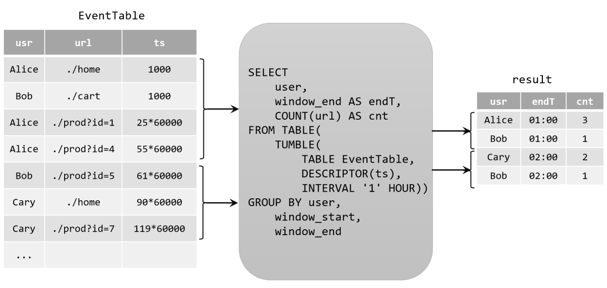{width="5.768055555555556in"
height="2.7465277777777777in"}

由于窗口的统计结果是一次性写入结果表的，所以结果表的更新日志流中只会包含插入INSERT操作，而没有更新UPDATE操作。所以这里的持续查询，依然是一个追加（Append）查询。结果表result如果转换成DataStream，可以直接调用toDataStream()方法。

### **10.2.4 将动态表转换为流**

与关系型数据库中的表一样，动态表也可以通过插入（Insert）、更新（Update）和删除（Delete）操作，进行持续的更改。将动态表转换为流或将其写入外部系统时，就需要对这些更改操作进行编码，通过发送编码消息的方式告诉外部系统要执行的操作。在Flink中，Table
API和SQL支持三种编码方式：

-   仅追加（Append-only）流

仅通过插入（Insert）更改来修改的动态表，可以直接转换为"仅追加"流。这个流中发出的数据，其实就是动态表中新增的每一行。

-   撤回（Retract）流

撤回流是包含两类消息的流，添加（add）消息和撤回（retract）消息。

具体的编码规则是：INSERT插入操作编码为add消息；DELETE删除操作编码为retract消息；而UPDATE更新操作则编码为被更改行的retract消息，和更新后行（新行）的add消息。这样，可以通过编码后的消息指明所有的增删改操作，一个动态表就可以转换为撤回流了。

{width="5.768055555555556in"
height="2.6909722222222223in"}

-   更新插入（Upsert）流

更新插入流中只包含两种类型的消息：更新插入（upsert）消息和删除（delete）消息。

所谓的"upsert"其实是"update"和"insert"的合成词，所以对于更新插入流来说，INSERT插入操作和UPDATE更新操作，统一被编码为upsert消息；而DELETE删除操作则被编码为delete消息。

{width="5.768055555555556in"
height="2.738888888888889in"}

需要注意的是，在代码里将动态表转换为DataStream时，只支持仅追加（append-only）和撤回（retract）流，调用toChangelogStream()得到的其实就是撤回流。而连接到外部系统时，则可以支持不同的编码方法，这取决于外部系统本身的特性。

## **10.3 时间属性**

基于时间的操作（比如时间窗口），需要定义相关的时间语义和时间数据来源的信息。在Table
API和SQL中，会给表单独提供一个逻辑上的时间字段，专门用来在表处理程序中指示时间。

所以所谓的时间属性（time
attributes），其实就是每个表模式结构（schema）的一部分。它可以在创建表的DDL里直接定义为一个字段，也可以在DataStream转换成表时定义。一旦定义了时间属性，它就可以作为一个普通字段引用，并且可以在基于时间的操作中使用。

时间属性的数据类型必须为TIMESTAMP，它的行为类似于常规时间戳，可以直接访问并且进行计算。

按照时间语义的不同，可以把时间属性的定义分成事件时间（event
time）和处理时间（processing time）两种情况。

### **10.3.1 事件时间**

事件时间属性可以在创建表DDL中定义，增加一个字段，通过WATERMARK语句来定义事件时间属性。具体定义方式如下：

CREATE TABLE EventTable(

user STRING,

url STRING,

ts TIMESTAMP(3),

WATERMARK FOR ts AS ts - INTERVAL \'5\' SECOND

) WITH (

\...

);

这里把ts字段定义为事件时间属性，而且基于ts设置了5秒的水位线延迟。

时间戳类型必须是 TIMESTAMP 或者TIMESTAMP_LTZ
类型。但是时间戳一般都是秒或者是毫秒（BIGINT
类型），这种情况可以通过如下方式转换

ts BIGINT,

time_ltz AS TO_TIMESTAMP_LTZ(ts, 3),

### **10.3.2 处理时间**

在定义处理时间属性时，必须要额外声明一个字段，专门用来保存当前的处理时间。

在创建表的DDL（CREATE
TABLE语句）中，可以增加一个额外的字段，通过调用系统内置的PROCTIME()函数来指定当前的处理时间属性。

CREATE TABLE EventTable(

user STRING,

url STRING,

ts AS PROCTIME()

) WITH (

\...

);

## **10.4 DDL（Data Definition Language）数据定义**

### **10.4.1 数据库**

**1）创建数据库**

（1）语法

CREATE DATABASE \[IF NOT EXISTS\] \[catalog_name.\]db_name

\[COMMENT database_comment\]

WITH (key1=val1, key2=val2, \...)

（2）案例

CREATE DATABASE db_flink;

**2）查询数据库**

（1）查询所有数据库

SHOW DATABASES

（2）查询当前数据库

SHOW CURRENT DATABASE

**3）修改数据库**

ALTER DATABASE \[catalog_name.\]db_name SET (key1=val1, key2=val2, \...)

**4）删除数据库**

DROP DATABASE \[IF EXISTS\] \[catalog_name.\]db_name \[ (RESTRICT \|
CASCADE) \]

-   RESTRICT：删除非空数据库会触发异常。默认启用

-   CASCADE：删除非空数据库也会删除所有相关的表和函数。

DROP DATABASE db_flink2;

**5）切换当前数据库**

USE database_name;

### **10.4.2 表**

**1）创建表**

> （1）语法

CREATE TABLE \[IF NOT EXISTS\] \[catalog_name.\]\[db_name.\]table_name

(

{ \<physical_column_definition\> \| \<metadata_column_definition\> \|
\<computed_column_definition\> }\[ , \...n\]

\[ \<watermark_definition\> \]

\[ \<table_constraint\> \]\[ , \...n\]

)

\[COMMENT table_comment\]

\[PARTITIONED BY (partition_column_name1, partition_column_name2,
\...)\]

WITH (key1=val1, key2=val2, \...)

\[ LIKE source_table \[( \<like_options\> )\] \| AS select_query \]

> ① physical_column_definition

物理列是数据库中所说的常规列。其定义了物理介质中存储的数据中字段的名称、类型和顺序。其他类型的列可以在物理列之间声明，但不会影响最终的物理列的读取。

> ② metadata_column_definition

元数据列是 SQL
标准的扩展，允许访问数据源本身具有的一些元数据。元数据列由 METADATA
关键字标识。例如，可以使用元数据列从Kafka记录中读取和写入时间戳，用于基于时间的操作（这个时间戳不是数据中的某个时间戳字段，而是数据写入
Kafka 时，Kafka
引擎给这条数据打上的时间戳标记）。connector和format文档列出了每个组件可用的元数据字段。

CREATE TABLE MyTable (

\`user_id\` BIGINT,

\`name\` STRING,

\`record_time\` TIMESTAMP_LTZ(3) METADATA FROM \'timestamp\'

) WITH (

\'connector\' = \'kafka\'

\...

);

如果自定义的列名称和 Connector 中定义 metadata 字段的名称一样， FROM xxx
子句可省略

CREATE TABLE MyTable (

\`user_id\` BIGINT,

\`name\` STRING,

\`timestamp\` TIMESTAMP_LTZ(3) METADATA

) WITH (

\'connector\' = \'kafka\'

\...

);

如果自定义列的数据类型和 Connector 中定义的 metadata
字段的数据类型不一致，程序运行时会自动
cast强转，但是这要求两种数据类型是可以强转的。

CREATE TABLE MyTable (

\`user_id\` BIGINT,

\`name\` STRING,

\-- 将时间戳强转为 BIGINT

\`timestamp\` BIGINT METADATA

) WITH (

\'connector\' = \'kafka\'

\...

);

默认情况下，Flink SQL planner 认为 metadata
列可以读取和写入。然而，在许多情况下，外部系统提供的只读元数据字段比可写字段多。因此，可以使用VIRTUAL关键字排除元数据列的持久化(表示只读)。

CREATE TABLE MyTable (

\`timestamp\` BIGINT METADATA,

\`offset\` BIGINT METADATA VIRTUAL,

\`user_id\` BIGINT,

\`name\` STRING,

) WITH (

\'connector\' = \'kafka\'

\...

);

③ computed_column_definition

计算列是使用语法column_name AS computed_column_expression生成的虚拟列。

计算列就是拿已有的一些列经过一些自定义的运算生成的新列，在物理上并不存储在表中，只能读不能写。列的数据类型从给定的表达式自动派生，无需手动声明。

CREATE TABLE MyTable (

\`user_id\` BIGINT,

\`price\` DOUBLE,

\`quantity\` DOUBLE,

\`cost\` AS price \* quanitity

) WITH (

\'connector\' = \'kafka\'

\...

);

④ 定义Watermark

Flink SQL 提供了几种 WATERMARK 生产策略：

-   严格升序：WATERMARK FOR rowtime_column AS rowtime_column。

> Flink
> 任务认为时间戳只会越来越大，也不存在相等的情况，只要相等或者小于之前的，就认为是迟到的数据。

-   递增：WATERMARK FOR rowtime_column AS rowtime_column - INTERVAL
    \'0.001\' SECOND 。

> 一般基本不用这种方式。如果设置此类，则允许有相同的时间戳出现。

-   有界无序： WATERMARK FOR rowtime_column AS rowtime_column --
    INTERVAL \'string\' timeUnit 。

> 此类策略就可以用于设置最大乱序时间，假如设置为 WATERMARK FOR
> rowtime_column AS rowtime_column - INTERVAL \'5\' SECOND
> ，则生成的是运行 5s 延迟的Watermark。一般都用这种 Watermark
> 生成策略，此类 Watermark
> 生成策略通常用于有数据乱序的场景中，而对应到实际的场景中，数据都是会存在乱序的，所以基本都使用此类策略。

⑤ PRIMARY KEY

主键约束表明表中的一列或一组列是唯一的，并且它们不包含NULL值。主键唯一地标识表中的一行，只支持
not enforced。

CREATE TABLE MyTable (

\`user_id\` BIGINT,

\`name\` STRING,

PARYMARY KEY(user_id) not enforced

) WITH (

\'connector\' = \'kafka\'

\...

);

⑥ PARTITIONED BY

创建分区表

⑦ with语句

用于创建表的表属性，用于指定外部存储系统的元数据信息。配置属性时，表达式key1=val1的键和值都应该是字符串字面值。如下是Kafka的映射表：

CREATE TABLE KafkaTable (

\`user_id\` BIGINT,

\`name\` STRING,

\`ts\` TIMESTAMP(3) METADATA FROM \'timestamp\'

) WITH (

\'connector\' = \'kafka\',

\'topic\' = \'user_behavior\',

\'properties.bootstrap.servers\' = \'localhost:9092\',

\'properties.group.id\' = \'testGroup\',

\'scan.startup.mode\' = \'earliest-offset\',

\'format\' = \'csv\'

)

一般 with 中的配置项由 Flink SQL 的 Connector（链接外部存储的连接器）
来定义，每种 Connector 提供的with 配置项都是不同的。

⑧ LIKE

用于基于现有表的定义创建表。此外，用户可以扩展原始表或排除表的某些部分。

可以使用该子句重用(可能还会覆盖)某些连接器属性，或者向外部定义的表添加水印。

CREATE TABLE Orders (

\`user\` BIGINT,

product STRING,

order_time TIMESTAMP(3)

) WITH (

\'connector\' = \'kafka\',

\'scan.startup.mode\' = \'earliest-offset\'

);

CREATE TABLE Orders_with_watermark (

\-- Add watermark definition

WATERMARK FOR order_time AS order_time - INTERVAL \'5\' SECOND

) WITH (

\-- Overwrite the startup-mode

\'scan.startup.mode\' = \'latest-offset\'

)

LIKE Orders;

⑨ AS select_statement（CTAS）

在一个create-table-as-select
(CTAS)语句中，还可以通过查询的结果创建和填充表。CTAS是使用单个命令创建数据并向表中插入数据的最简单、最快速的方法。

CREATE TABLE my_ctas_table

WITH (

\'connector\' = \'kafka\',

\...

)

AS SELECT id, name, age FROM source_table WHERE mod(id, 10) = 0;

注意:CTAS有以下限制:

-   暂不支持创建临时表。

-   目前还不支持指定显式列。

-   还不支持指定显式水印。

-   目前还不支持创建分区表。

-   目前还不支持指定主键约束。

> （2）简单建表示例

CREATE TABLE test(

id INT,

ts BIGINT,

vc INT

) WITH (

\'connector\' = \'print\'

);

CREATE TABLE test1 (

\`value\` STRING

)

LIKE test;

**2）查看表**

（1）查看所有表

SHOW TABLES \[ ( FROM \| IN ) \[catalog_name.\]database_name \] \[
\[NOT\] LIKE \<sql_like_pattern\> \]

如果没有指定数据库，则从当前数据库返回表。

LIKE子句中sql pattern的语法与MySQL方言的语法相同:

-   %匹配任意数量的字符，甚至零字符，\\%匹配一个\'%\'字符。

-   \_只匹配一个字符，\\\_只匹配一个\'\_\'字符

（2）查看表信息

{ DESCRIBE \| DESC } \[catalog_name.\]\[db_name.\]table_name

**3）修改表**

（1）修改表名

ALTER TABLE \[catalog_name.\]\[db_name.\]table_name RENAME TO
new_table_name

（2）修改表属性

ALTER TABLE \[catalog_name.\]\[db_name.\]table_name SET (key1=val1,
key2=val2, \...)

**4）删除表**

DROP \[TEMPORARY\] TABLE \[IF EXISTS\]
\[catalog_name.\]\[db_name.\]table_name

## **10.5 查询**

### **10.5.0 DataGen & Print**

**1）创建数据生成器源表**

CREATE TABLE source (

id INT,

ts BIGINT,

vc INT

) WITH (

\'connector\' = \'datagen\',

\'rows-per-second\'=\'1\',

\'fields.id.kind\'=\'random\',

\'fields.id.min\'=\'1\',

\'fields.id.max\'=\'10\',

\'fields.ts.kind\'=\'sequence\',

\'fields.ts.start\'=\'1\',

\'fields.ts.end\'=\'1000000\',

\'fields.vc.kind\'=\'random\',

\'fields.vc.min\'=\'1\',

\'fields.vc.max\'=\'100\'

);

CREATE TABLE sink (

id INT,

ts BIGINT,

vc INT

) WITH (

\'connector\' = \'print\'

);

**2）查询源表**

select \* from source

**3）插入sink表并查询**

INSERT INTO sink select \* from source;

select \* from sink;

### **10.5.1 With子句**

WITH提供了一种编写辅助语句的方法，以便在较大的查询中使用。这些语句通常被称为公共表表达式(Common
Table Expression, CTE)，可以认为它们定义了仅为一个查询而存在的临时视图。

**1）语法**

WITH \<with_item_definition\> \[ , \... \]

SELECT \... FROM \...;

\<with_item_defintion\>:

with_item_name (column_name\[, \...n\]) AS ( \<select_query\> )

**2）案例**

WITH source_with_total AS (

SELECT id, vc+10 AS total

FROM source

)

SELECT id, SUM(total)

FROM source_with_total

GROUP BY id;

### **10.5.2 SELECT & WHERE 子句**

**1）语法**

SELECT select_list FROM table_expression \[ WHERE boolean_expression \]

**2）案例**

SELECT \* FROM source

SELECT id, vc + 10 FROM source

\-- 自定义 Source 的数据

SELECT id, price FROM (VALUES (1, 2.0), (2, 3.1)) AS t (order_id, price)

SELECT vc + 10 FROM source WHERE id \>10

### **10.5.3 SELECT DISTINCT 子句**

用作根据 key 进行数据去重

SELECT DISTINCT vc FROM source

对于流查询，计算查询结果所需的状态可能无限增长。状态大小取决于不同行数。可以设置适当的状态生存时间(TTL)的查询配置，以防止状态过大。但是，这可能会影响查询结果的正确性。如某个
key 的数据过期从状态中删除了，那么下次再来这么一个
key，由于在状态中找不到，就又会输出一遍。

### **10.5.4 分组聚合**

SQL中一般所说的聚合都很熟悉，主要是通过内置的一些聚合函数来实现的，比如SUM()、MAX()、MIN()、AVG()以及COUNT()。它们的特点是对多条输入数据进行计算，得到一个唯一的值，属于"多对一"的转换。比如可以通过下面的代码计算输入数据的个数：

select COUNT(\*) from source;

而更多的情况下，可以通过GROUP
BY子句来指定分组的键（key），从而对数据按照某个字段做一个分组统计。

> SELECT vc, COUNT(\*) as cnt FROM source GROUP BY vc;

这种聚合方式，就叫作"分组聚合"（group
aggregation）。想要将结果表转换成流或输出到外部系统，必须采用撤回流（retract
stream）或更新插入流（upsert
stream）的编码方式；如果在代码中直接转换成DataStream打印输出，需要调用toChangelogStream()。

分组聚合既是SQL原生的聚合查询，也是流处理中的聚合操作，这是实际应用中最常见的聚合方式。当然，使用的聚合函数一般都是系统内置的，如果希望实现特殊需求也可以进行自定义。

**1）group聚合案例**

CREATE TABLE source1 (

dim STRING,

user_id BIGINT,

price BIGINT,

row_time AS cast(CURRENT_TIMESTAMP as timestamp(3)),

WATERMARK FOR row_time AS row_time - INTERVAL \'5\' SECOND

) WITH (

\'connector\' = \'datagen\',

\'rows-per-second\' = \'10\',

\'fields.dim.length\' = \'1\',

\'fields.user_id.min\' = \'1\',

\'fields.user_id.max\' = \'100000\',

\'fields.price.min\' = \'1\',

\'fields.price.max\' = \'100000\'

);

CREATE TABLE sink1 (

dim STRING,

pv BIGINT,

sum_price BIGINT,

max_price BIGINT,

min_price BIGINT,

uv BIGINT,

window_start bigint

) WITH (

\'connector\' = \'print\'

);

insert into sink1

select dim,

count(\*) as pv,

sum(price) as sum_price,

max(price) as max_price,

min(price) as min_price,

\-- 计算 uv 数

count(distinct user_id) as uv,

cast((UNIX_TIMESTAMP(CAST(row_time AS STRING))) / 60 as bigint) as
window_start

from source1

group by

dim,

\-- UNIX_TIMESTAMP得到秒的时间戳，将秒级别时间戳 / 60 转化为 1min，

cast((UNIX_TIMESTAMP(CAST(row_time AS STRING))) / 60 as bigint)

**2）多维分析**

Group 聚合也支持 Grouping sets 、Rollup 、Cube，如下案例是Grouping
sets：

SELECT

supplier_id

, rating

, product_id

, COUNT(\*)

FROM (

VALUES

(\'supplier1\', \'product1\', 4),

(\'supplier1\', \'product2\', 3),

(\'supplier2\', \'product3\', 3),

(\'supplier2\', \'product4\', 4)

)

\-- 供应商id、产品id、评级

AS Products(supplier_id, product_id, rating)

GROUP BY GROUPING SETS(

(supplier_id, product_id, rating),

(supplier_id, product_id),

(supplier_id, rating),

(supplier_id),

(product_id, rating),

(product_id),

(rating),

()

);

### **10.5.5 分组窗口聚合**

从1.13版本开始，分组窗口聚合已经标记为过时，鼓励使用更强大、更有效的窗口TVF聚合，在这里简单做个介绍。

直接把窗口自身作为分组key放在GROUP
BY之后的，所以也叫"分组窗口聚合"。SQL查询的分组窗口是通过 GROUP
BY 子句定义的。类似于使用常规 GROUP BY 语句的查询，窗口分组语句的 GROUP
BY 子句中带有一个窗口函数为每个分组计算出一个结果。

SQL中只支持基于时间的窗口，不支持基于元素个数的窗口。

| 分组窗口函数                       | 描述                                                         |
| ---------------------------------- | ------------------------------------------------------------ |
| TUMBLE(time_attr, interval)        | 定义一个滚动窗口。滚动窗口把行分配到有固定持续时间（ interval ）的不重叠的连续窗口。比如，5 分钟的滚动窗口以 5 分钟为间隔对行进行分组。滚动窗口可以定义在事件时间（批处理、流处理）或处理时间（流处理）上。 |
| HOP(time_attr, interval, interval) | 定义一个跳跃的时间窗口（在 Table API 中称为滑动窗口）。滑动窗口有一个固定的持续时间（ 第二个 interval 参数 ）以及一个滑动的间隔（第一个 interval 参数 ）。若滑动间隔小于窗口的持续时间，滑动窗口则会出现重叠；因此，行将会被分配到多个窗口中。比如，一个大小为 15 分组的滑动窗口，其滑动间隔为 5 分钟，将会把每一行数据分配到 3 个 15 分钟的窗口中。滑动窗口可以定义在事件时间（批处理、流处理）或处理时间（流处理）上。 |
| SESSION(time_attr, interval)       | 定义一个会话时间窗口。会话时间窗口没有一个固定的持续时间，但是它们的边界会根据 interval 所定义的不活跃时间所确定；即一个会话时间窗口在定义的间隔时间内没有时间出现，该窗口会被关闭。例如时间窗口的间隔时间是 30 分钟，当其不活跃的时间达到30分钟后，若观测到新的记录，则会启动一个新的会话时间窗口（否则该行数据会被添加到当前的窗口），且若在 30 分钟内没有观测到新纪录，这个窗口将会被关闭。会话时间窗口可以使用事件时间（批处理、流处理）或处理时间（流处理）。 |

{width="5.768055555555556in"
height="2.959722222222222in"}

1.  **准备数据**

CREATE TABLE ws (

id INT,

vc INT,

pt AS PROCTIME(), \--处理时间

et AS cast(CURRENT_TIMESTAMP as timestamp(3)), \--事件时间

WATERMARK FOR et AS et - INTERVAL \'5\' SECOND \--watermark

) WITH (

\'connector\' = \'datagen\',

\'rows-per-second\' = \'10\',

\'fields.id.min\' = \'1\',

\'fields.id.max\' = \'3\',

\'fields.vc.min\' = \'1\',

\'fields.vc.max\' = \'100\'

);

**2）滚动窗口示例（时间属性字段，窗口长度）**

> select
>
> id,
>
> TUMBLE_START(et, INTERVAL \'5\' SECOND) wstart,
>
> TUMBLE_END(et, INTERVAL \'5\' SECOND) wend,
>
> sum(vc) sumVc
>
> from ws
>
> group by id, TUMBLE(et, INTERVAL \'5\' SECOND);

**3）滑动窗口（时间属性字段，滑动步长，窗口长度）**

> select
>
> id,
>
> HOP_START(pt, INTERVAL \'3\' SECOND,INTERVAL \'5\' SECOND) wstart,
>
> HOP_END(pt, INTERVAL \'3\' SECOND,INTERVAL \'5\' SECOND) wend,
>
> sum(vc) sumVc
>
> from ws
>
> group by id, HOP(et, INTERVAL \'3\' SECOND,INTERVAL \'5\' SECOND);

**4）会话窗口（时间属性字段，会话间隔）**

> select
>
> id,
>
> SESSION_START(et, INTERVAL \'5\' SECOND) wstart,
>
> SESSION_END(et, INTERVAL \'5\' SECOND) wend,
>
> sum(vc) sumVc
>
> from ws
>
> group by id, SESSION(et, INTERVAL \'5\' SECOND);

### **10.5.6 窗口表值函数（TVF）聚合**

对比GroupWindow，TVF窗口更有效和强大。包括：

-   提供更多的性能优化手段

-   支持GroupingSets语法

-   可以在window聚合中使用TopN

-   提供累积窗口

对于窗口表值函数，窗口本身返回的是就是一个表，所以窗口会出现在FROM后面，GROUP
BY后面的则是窗口新增的字段window_start和window_end

FROM TABLE(

窗口类型(TABLE 表名, DESCRIPTOR(时间字段),INTERVAL时间...)

)

GROUP BY \[window_start,\]\[window_end,\] \--可选

**1）滚动窗口**

> SELECT
>
> window_start,
>
> window_end,
>
> id , SUM(vc)
>
> sumVC
>
> FROM TABLE(
>
> TUMBLE(TABLE ws, DESCRIPTOR(et), INTERVAL \'5\' SECONDS))
>
> GROUP BY window_start, window_end, id;

2.  **滑动窗口**

> 要求： 窗口长度=滑动步长的整数倍（底层会优化成多个小滚动窗口）
>
> SELECT window_start, window_end, id , SUM(vc) sumVC
>
> FROM TABLE(
>
> HOP(TABLE ws, DESCRIPTOR(et), INTERVAL \'5\' SECONDS , INTERVAL \'10\'
> SECONDS))
>
> GROUP BY window_start, window_end, id;

**3）累积窗口**

{width="4.433991688538932in"
height="2.790566491688539in"}

累积窗口会在一定的统计周期内进行累积计算。累积窗口中有两个核心的参数：最大窗口长度（max
window
size）和累积步长（step）。所谓的最大窗口长度其实就是所说的"统计周期"，最终目的就是统计这段时间内的数据。

其实就是固定窗口间隔内提前触发的的滚动窗口 ，其实就是 Tumble Window +
early-fire 的一个事件时间的版本。例如，从每日零点到当前这一分钟绘制累积
UV，其中 10:00 时的 UV 表示从 00:00 到 10:00 的 UV 总数。

累积窗口可以认为是首先开一个最大窗口大小的滚动窗口，然后根据用户设置的触发的时间间隔将这个滚动窗口拆分为多个窗口，这些窗口具有相同的窗口起点和不同的窗口终点。

注意： 窗口最大长度 = 累积步长的整数倍

> SELECT
>
> window_start,
>
> window_end,
>
> id ,
>
> SUM(vc) sumVC
>
> FROM TABLE(
>
> CUMULATE(TABLE ws, DESCRIPTOR(et), INTERVAL \'2\' SECONDS , INTERVAL
> \'6\' SECONDS))
>
> GROUP BY window_start, window_end, id;

**4）grouping sets多维分析**

> SELECT
>
> window_start,
>
> window_end,
>
> id ,
>
> SUM(vc) sumVC
>
> FROM TABLE(
>
> TUMBLE(TABLE ws, DESCRIPTOR(et), INTERVAL \'5\' SECONDS))
>
> GROUP BY window_start, window_end,
>
> rollup( (id) )
>
> \-- cube( (id) )
>
> \-- grouping sets( (id),() )
>
> ;

### **10.5.7 Over 聚合**

OVER聚合为一系列有序行的每个输入行计算一个聚合值。与GROUP
BY聚合相比，OVER聚合不会将每个组的结果行数减少为一行。相反，OVER聚合为每个输入行生成一个聚合值。

可以在事件时间或处理时间，以及指定为时间间隔、或行计数的范围内，定义Over
windows。

**1）语法**

> SELECT
>
> agg_func(agg_col) OVER (
>
> \[PARTITION BY col1\[, col2, \...\]\]
>
> ORDER BY time_col
>
> range_definition),
>
> \...
>
> FROM \...

-   ORDER BY：必须是时间戳列（事件时间、处理时间），只能升序

-   PARTITION BY：标识了聚合窗口的聚合粒度

-   range_definition：这个标识聚合窗口的聚合数据范围，在 Flink
    中有两种指定数据范围的方式。第一种为按照行数聚合，第二种为按照时间区间聚合

**2）案例**

（1）按照时间区间聚合

统计每个传感器前10秒到现在收到的水位数据条数。

SELECT

id,

et,

vc,

count(vc) OVER (

PARTITION BY id

ORDER BY et

RANGE BETWEEN INTERVAL \'10\' SECOND PRECEDING AND CURRENT ROW

) AS cnt

FROM ws

也可以用WINDOW子句来在SELECT外部单独定义一个OVER窗口,可以多次使用：

SELECT

id,

et,

vc,

count(vc) OVER w AS cnt,

sum(vc) OVER w AS sumVC

FROM ws

WINDOW w AS (

PARTITION BY id

ORDER BY et

RANGE BETWEEN INTERVAL \'10\' SECOND PRECEDING AND CURRENT ROW

)

（2）按照行数聚合

统计每个传感器前5条到现在数据的平均水位

> SELECT
>
> id,
>
> et,
>
> vc,
>
> avg(vc) OVER (
>
> PARTITION BY id
>
> ORDER BY et
>
> ROWS BETWEEN 5 PRECEDING AND CURRENT ROW
>
> ) AS avgVC
>
> FROM ws

也可以用WINDOW子句来在SELECT外部单独定义一个OVER窗口：

SELECT

id,

et,

vc,

avg(vc) OVER w AS avgVC,

count(vc) OVER w AS cnt

FROM ws

WINDOW w AS (

PARTITION BY id

ORDER BY et

ROWS BETWEEN 5 PRECEDING AND CURRENT ROW

)

### **10.5.8 特殊语法 ------ TOP-N**

目前在Flink
SQL中没有能够直接调用的TOP-N函数，而是提供了稍微复杂些的变通实现方法，是固定写法，特殊支持的over用法。

**1）语法**

SELECT \[column_list\]

FROM (

SELECT \[column_list\],

ROW_NUMBER() OVER (\[PARTITION BY col1\[, col2\...\]\]

ORDER BY col1 \[asc\|desc\]\[, col2 \[asc\|desc\]\...\]) AS rownum

FROM table_name)

WHERE rownum \<= N \[AND conditions\]

-   ROW_NUMBER() ：标识 TopN 排序子句

-   PARTITION BY col1\[, col2\...\] ：标识分区字段，代表按照这个 col
    字段作为分区粒度对数据进行排序取 topN，比如下述案例中的 partition by
    key ，就是根据需求中的搜索关键词（key）做为分区

-   ORDER BY col1 \[asc\|desc\]\[, col2 \[asc\|desc\]\...\] ：标识 TopN
    的排序规则，是按照哪些字段、顺序或逆序进行排序，可以不是时间字段，也可以降序（TopN特殊支持）

-   WHERE rownum \<= N ：这个子句是一定需要的，只有加上了这个子句，Flink
    才能将其识别为一个TopN 的查询，其中 N 代表 TopN 的条目数

-   \[AND conditions\] ：其他的限制条件也可以加上

**2）案例**

取每个传感器最高的3个水位值

select

id,

et,

vc,

rownum

from

(

select

id,

et,

vc,

row_number() over(

partition by id

order by vc desc

) as rownum

from ws

)

where rownum\<=3;

### **10.5.9 特殊语法 ------ Deduplication去重**

去重，也即上文介绍到的TopN 中 row_number = 1
的场景，但是这里有一点不一样在于其排序字段一定是时间属性列，可以降序，不能是其他非时间属性的普通列。

在 row_number = 1 时，如果排序字段是普通列 planner 会翻译成 TopN
算子，如果是时间属性列 planner 会翻译成
Deduplication，这两者最终的执行算子是不一样的，Deduplication 相比 TopN
算子专门做了对应的优化，性能会有很大提升。可以从webui看出是翻译成哪种算子。

{width="2.516570428696413in"
height="2.0114807524059493in"}

如果是按照时间属性字段降序，表示取最新一条，会造成不断的更新保存最新的一条。如果是升序，表示取最早的一条，不用去更新，性能更好。

**1）语法**

SELECT \[column_list\]

FROM (

SELECT \[column_list\],

ROW_NUMBER() OVER (\[PARTITION BY col1\[, col2\...\]\]

ORDER BY time_attr \[asc\|desc\]) AS rownum

FROM table_name)

WHERE rownum = 1

**2）案例**

对每个传感器的水位值去重

select

id,

et,

vc,

rownum

from

(

select

id,

et,

vc,

row_number() over(

partition by id,vc

order by et

) as rownum

from ws

)

where rownum=1;

### **10.5.10 联结（Join）查询**

在标准SQL中，可以将多个表连接合并起来，从中查询出想要的信息；这种操作就是表的联结（Join）。在Flink
SQL中，同样支持各种灵活的联结（Join）查询，操作的对象是动态表。

在流处理中，动态表的Join对应着两条数据流的Join操作。Flink
SQL中的联结查询大体上也可以分为两类：SQL原生的联结查询方式，和流处理中特有的联结查询。

**10.5.10.1 常规联结查询**

常规联结（Regular
Join）是SQL中原生定义的Join方式，是最通用的一类联结操作。它的具体语法与标准SQL的联结完全相同，通过关键字JOIN来联结两个表，后面用关键字ON来指明联结条件。

与标准SQL一致，Flink SQL的常规联结也可以分为内联结（INNER
JOIN）和外联结（OUTER JOIN），区别在于结果中是否包含不符合联结条件的行。

Regular Join 包含以下几种（以 L 作为左流中的数据标识， R
作为右流中的数据标识）：

-   Inner Join（Inner Equal Join）：流任务中，只有两条流 Join
    到才输出，输出 +\[L, R\]

-   Left Join（Outer Equal
    Join）：流任务中，左流数据到达之后，无论有没有 Join
    到右流的数据，都会输出（Join 到输出 +\[L, R\] ，没 Join 到输出 +\[L,
    null\] ），如果右流之后数据到达之后，发现左流之前输出过没有 Join
    到的数据，则会发起回撤流，先输出 -\[L, null\] ，然后输出 +\[L, R\]

-   Right Join（Outer Equal Join）：有 Left Join
    一样，左表和右表的执行逻辑完全相反

-   Full Join（Outer Equal
    Join）：流任务中，左流或者右流的数据到达之后，无论有没有 Join
    到另外一条流的数据，都会输出（对右流来说：Join 到输出 +\[L, R\] ，没
    Join 到输出 +\[null, R\] ；对左流来说：Join 到输出 +\[L, R\] ，没
    Join 到输出 +\[L, null\]
    ）。如果一条流的数据到达之后，发现之前另一条流之前输出过没有 Join
    到的数据，则会发起回撤流（左流数据到达为例：回撤 -\[null, R\]
    ，输出+\[L, R\] ，右流数据到达为例：回撤 -\[L, null\] ，输出 +\[L,
    R\]

> Regular Join 的注意事项：

-   实时 Regular Join 可以不是 等值 join 。等值 join 和 非等值 join
    区别在于， 等值 join数据 shuffle 策略是 Hash，会按照 Join on
    中的等值条件作为 id 发往对应的下游； 非等值 join 数据 shuffle 策略是
    Global，所有数据发往一个并发，按照非等值条件进行关联

-   流的上游是无限的数据，所以要做到关联的话，Flink
    会将两条流的所有数据都存储在 State 中，所以 Flink 任务的 State
    会无限增大，因此你需要为 State 配置合适的 TTL，以防止 State 过大。

> 再准备一张表用于join

CREATE TABLE ws1 (

id INT,

vc INT,

pt AS PROCTIME(), \--处理时间

et AS cast(CURRENT_TIMESTAMP as timestamp(3)), \--事件时间

WATERMARK FOR et AS et - INTERVAL \'0.001\' SECOND \--watermark

) WITH (

\'connector\' = \'datagen\',

\'rows-per-second\' = \'1\',

\'fields.id.min\' = \'3\',

\'fields.id.max\' = \'5\',

\'fields.vc.min\' = \'1\',

\'fields.vc.max\' = \'100\'

);

**1）等值内联结（INNER Equi-JOIN）**

内联结用INNER
JOIN来定义，会返回两表中符合联接条件的所有行的组合，也就是所谓的笛卡尔积（Cartesian
product）。目前仅支持等值联结条件。

SELECT \*

FROM ws

INNER JOIN ws1

ON ws.id = ws1.id

**2）等值外联结（OUTER Equi-JOIN）**

与内联结类似，外联结也会返回符合联结条件的所有行的笛卡尔积；另外，还可以将某一侧表中找不到任何匹配的行也单独返回。Flink
SQL支持左外（LEFT JOIN）、右外（RIGHT JOIN）和全外（FULL OUTER
JOIN），分别表示会将左侧表、右侧表以及双侧表中没有任何匹配的行返回。

具体用法如下：

SELECT \*

FROM ws

LEFT JOIN ws1

ON ws.id = ws1.id

SELECT \*

FROM ws

RIGHT JOIN ws1

ON ws.id = ws1.id

SELECT \*

FROM ws

FULL OUTER JOIN ws1

ON ws.id = ws.id

这部分知识与标准SQL中是完全一样的。

**10.5.10.2 间隔联结查询**

曾经学习过DataStream API中的双流Join，包括窗口联结（window
join）和间隔联结（interval
join）。两条流的Join就对应着SQL中两个表的Join，这是流处理中特有的联结方式。目前Flink
SQL还不支持窗口联结，而间隔联结则已经实现。

间隔联结（Interval
Join）返回的，同样是符合约束条件的两条中数据的笛卡尔积。只不过这里的"约束条件"除了常规的联结条件外，还多了一个时间间隔的限制。具体语法有以下要点：

-   两表的联结

间隔联结不需要用JOIN关键字，直接在FROM后将要联结的两表列出来就可以，用逗号分隔。这与标准SQL中的语法一致，表示一个"交叉联结"（Cross
Join），会返回两表中所有行的笛卡尔积。

-   联结条件

联结条件用WHERE子句来定义，用一个等值表达式描述。交叉联结之后再用WHERE进行条件筛选，效果跟内联结INNER
JOIN \... ON \...非常类似。

-   时间间隔限制

可以在WHERE子句中，联结条件后用AND追加一个时间间隔的限制条件；做法是提取左右两侧表中的时间字段，然后用一个表达式来指明两者需要满足的间隔限制。具体定义方式有下面三种，这里分别用ltime和rtime表示左右表中的时间字段：

（1）ltime = rtime

（2）ltime \>= rtime AND ltime \< rtime + INTERVAL \'10\' MINUTE

（3）ltime BETWEEN rtime - INTERVAL \'10\' SECOND AND rtime + INTERVAL
\'5\' SECOND

{width="1.6882731846019248in"
height="1.2457163167104113in"}

SELECT \*

FROM ws,ws1

WHERE ws.id = ws1. id

AND ws.et BETWEEN ws1.et - INTERVAL \'2\' SECOND AND ws1.et + INTERVAL
\'2\' SECOND

**10.5.10.3 维表联结查询**

Lookup Join 其实就是维表 Join，实时获取外部缓存的 Join，Lookup
的意思就是实时查找。

上面说的这几种 Join 都是流与流之间的 Join，而 Lookup Join 是流与
Redis，Mysql，HBase 这种外部存储介质的 Join。仅支持处理时间字段。

表A

JOIN 维度表名 FOR SYSTEM_TIME AS OF 表A.proc_time AS 别名

ON xx.字段=别名.字段

比如维表在mysql，维表join的写法如下:

CREATE TABLE Customers (

id INT,

name STRING,

country STRING,

zip STRING

) WITH (

\'connector\' = \'jdbc\',

\'url\' = \'jdbc:mysql://hadoop102:3306/customerdb\',

\'table-name\' = \'customers\'

);

\-- order表每来一条数据，都会去mysql的customers表查找维度数据

SELECT o.order_id, o.total, c.country, c.zip

FROM Orders AS o

JOIN Customers FOR SYSTEM_TIME AS OF o.proc_time AS c

ON o.customer_id = c.id;

### **10.5.11 Order by 和 limit**

**1）order by**

支持 Batch\\Streaming，但在实时任务中一般用的非常少。

实时任务中，Order By
子句中必须要有时间属性字段，并且必须写在最前面且为升序。

SELECT \*

FROM ws

ORDER BY et, id desc

**2）limit**

SELECT \*

FROM ws

LIMIT 3

### **10.5.12 SQL Hints**

在执行查询时，可以在表名后面添加SQL
Hints来临时修改表属性，对当前job生效。

select \* from ws1/\*+ OPTIONS(\'rows-per-second\'=\'10\')\*/;

### **10.5.13 集合操作**

**1）UNION 和 UNION ALL**

UNION：将集合合并并且去重

UNION ALL：将集合合并，不做去重。

(SELECT id FROM ws) UNION (SELECT id FROM ws1);

(SELECT id FROM ws) UNION ALL (SELECT id FROM ws1);

**2）Intersect 和 Intersect All**

Intersect：交集并且去重

Intersect ALL：交集不做去重

(SELECT id FROM ws) INTERSECT (SELECT id FROM ws1);

(SELECT id FROM ws) INTERSECT ALL (SELECT id FROM ws1);

**3）Except 和 Except All**

Except：差集并且去重

Except ALL：差集不做去重

(SELECT id FROM ws) EXCEPT (SELECT id FROM ws1);

(SELECT id FROM ws) EXCEPT ALL (SELECT id FROM ws1);

上述 SQL
在流式任务中，如果一条左流数据先来了，没有从右流集合数据中找到对应的数据时会直接输出，当右流对应数据后续来了之后，会下发回撤流将之前的数据給撤回。这也是一个回撤流

**4）In 子查询**

In 子查询的结果集只能有一列

SELECT id, vc

FROM ws

WHERE id IN (

SELECT id FROM ws1

)

上述 SQL 的 In 子句和之前介绍到的 Inner Join 类似。并且 In
子查询也会涉及到大状态问题，要注意设置 State 的 TTL。

### **10.5.14 系统函数**

<https://nightlies.apache.org/flink/flink-docs-release-1.17/docs/dev/table/functions/systemfunctions/>

系统函数（System Functions）也叫内置函数（Built-in
Functions），是在系统中预先实现好的功能模块。可以通过固定的函数名直接调用，实现想要的转换操作。Flink
SQL提供了大量的系统函数，几乎支持所有的标准SQL中的操作，这为使用SQL编写流处理程序提供了极大的方便。

Flink SQL中的系统函数又主要可以分为两大类：标量函数（Scalar
Functions）和聚合函数（Aggregate Functions）。

**1）标量函数（Scalar Functions）**

标量函数指的就是只对输入数据做转换操作、返回一个值的函数。

标量函数是最常见、也最简单的一类系统函数，数量非常庞大，很多在标准SQL中也有定义。所以这里只对一些常见类型列举部分函数，做一个简单概述，具体应用可以查看官网的完整函数列表。

-   比较函数（Comparison Functions）

比较函数其实就是一个比较表达式，用来判断两个值之间的关系，返回一个布尔类型的值。这个比较表达式可以是用
\<、\>、= 等符号连接两个值，也可以是用关键字定义的某种判断。例如：

（1）value1 = value2 判断两个值相等；

（2）value1 \<\> value2 判断两个值不相等

（3）value IS NOT NULL 判断value不为空

-   逻辑函数（Logical Functions）

逻辑函数就是一个逻辑表达式，也就是用与（AND）、或（OR）、非（NOT）将布尔类型的值连接起来，也可以用判断语句（IS、IS
NOT）进行真值判断；返回的还是一个布尔类型的值。例如：

（1）boolean1 OR boolean2 布尔值boolean1与布尔值boolean2取逻辑或

（2）boolean IS FALSE 判断布尔值boolean是否为false

（3）NOT boolean 布尔值boolean取逻辑非

-   算术函数（Arithmetic Functions）

进行算术计算的函数，包括用算术符号连接的运算，和复杂的数学运算。例如：

（1）numeric1 + numeric2 两数相加

（2）POWER(numeric1, numeric2) 幂运算，取数numeric1的numeric2次方

（3）RAND() 返回（0.0, 1.0）区间内的一个double类型的伪随机数

-   字符串函数（String Functions）

进行字符串处理的函数。例如：

（1）string1 \|\| string2 两个字符串的连接

（2）UPPER(string) 将字符串string转为全部大写

（3）CHAR_LENGTH(string) 计算字符串string的长度

-   时间函数（Temporal Functions）

进行与时间相关操作的函数。例如：

（1）DATE string 按格式\"yyyy-MM-dd\"解析字符串string，返回类型为SQL
Date

（2）TIMESTAMP string 按格式\"yyyy-MM-dd
HH:mm:ss\[.SSS\]\"解析，返回类型为SQL timestamp

（3）CURRENT_TIME 返回本地时区的当前时间，类型为SQL
time（与LOCALTIME等价）

（4）INTERVAL string range 返回一个时间间隔。

**2）聚合函数（Aggregate Functions）**

聚合函数是以表中多个行作为输入，提取字段进行聚合操作的函数，会将唯一的聚合值作为结果返回。聚合函数应用非常广泛，不论分组聚合、窗口聚合还是开窗（Over）聚合，对数据的聚合操作都可以用相同的函数来定义。

标准SQL中常见的聚合函数Flink
SQL都是支持的，目前也在不断扩展，为流处理应用提供更强大的功能。例如：

（1）COUNT(\*) 返回所有行的数量，统计个数。

（2）SUM(\[ ALL \| DISTINCT \] expression)
对某个字段进行求和操作。默认情况下省略了关键字ALL，表示对所有行求和；如果指定DISTINCT，则会对数据进行去重，每个值只叠加一次。

（3）RANK() 返回当前值在一组值中的排名。

（4）ROW_NUMBER() 对一组值排序后，返回当前值的行号。

其中，RANK()和ROW_NUMBER()一般用在OVER窗口中。

### **10.5.15 Module操作**

Module 允许 Flink 扩展函数能力。它是可插拔的，Flink
官方本身已经提供了一些 Module，用户也可以编写自己的 Module。

目前 Flink 包含了以下三种 Module：

-   CoreModule：CoreModule 是 Flink 内置的 Module，其包含了目前 Flink
    内置的所有 UDF，Flink 默认开启的 Module 就是
    CoreModule，可以直接使用其中的 UDF

-   HiveModule：HiveModule 可以将 Hive 内置函数作为 Flink
    的系统函数提供给 SQL\\Table API 用户进行使用，比如 get_json_object
    这类 Hive 内置函数（Flink 默认的 CoreModule 是没有的）

-   用户自定义 Module：用户可以实现 Module 接口实现自己的 UDF 扩展
    Module

使用 LOAD 子句去加载 Flink SQL 体系内置的或者用户自定义的 Module，UNLOAD
子句去卸载 Flink SQL 体系内置的或者用户自定义的 Module。

**1）语法**

\-- 加载

LOAD MODULE module_name \[WITH (\'key1\' = \'val1\', \'key2\' =
\'val2\', \...)\]

\-- 卸载

UNLOAD MODULE module_name

\-- 查看

SHOW MODULES;

SHOW FULL MODULES;

在 Flink 中，Module 可以被 加载、启用 、禁用 、卸载 Module，当加载Module
之后，默认就是开启的。同时支持多个 Module 的，并且根据加载 Module
的顺序去按顺序查找和解析 UDF，先查到的先解析使用。

此外，Flink 只会解析已经启用了的 Module。那么当两个 Module
中出现两个同名的函数且都启用时， Flink 会根据加载 Module
的顺序进行解析，结果就是会使用顺序为第一个的 Module 的
UDF，可以使用下面语法更改顺序：

USE MODULE hive,core;

USE是启用module，没有被use的为禁用（禁用不是卸载），除此之外还可以实现调整顺序的效果。上面的语句会将
Hive Module 设为第一个使用及解析的 Module。

**2）案例**

加载官方已经提供的的 Hive Module，将 Hive 已有的内置函数作为 Flink
的内置函数。需要先引入 hive 的 connector。其中包含了 flink
官方提供的一个 HiveModule。

（1）上传jar包到flink的lib中

上传hive connector

cp flink-sql-connector-hive-3.1.3_2.12-1.17.0.jar
/opt/module/flink-1.17.0/lib/

注意：拷贝hadoop的包，解决依赖冲突问题

cp
/opt/module/hadoop-3.3.4/share/hadoop/mapreduce/hadoop-mapreduce-client-core-3.3.4.jar
/opt/module/flink-1.17.0/lib/

（2）重启flink集群和sql-client

（3）加载hive module

\-- hive-connector内置了hive module，提供了hive自带的系统函数

load module hive with (\'hive-version\'=\'3.1.3\');

show modules;

show functions;

\-- 可以调用hive的split函数

select split(\'a,b\', \',\');

## **10.6 常用 Connector 读写**

12.5.0中的DataGen和Print都是一种connector，其他connector参考官网：

<https://nightlies.apache.org/flink/flink-docs-release-1.17/docs/connectors/table/overview/>

### **10.6.1 Kafka**

**1）添加kafka连接器依赖**

（1）将flink-sql-connector-kafka-1.17.0.jar上传到flink的lib目录下

（2）重启yarn-session、sql-client

**2）普通Kafka表**

（1）创建Kafka的映射表

CREATE TABLE t1(

\`event_time\` TIMESTAMP(3) METADATA FROM \'timestamp\',

\--列名和元数据名一致可以省略 FROM \'xxxx\', VIRTUAL表示只读

\`partition\` BIGINT METADATA VIRTUAL,

\`offset\` BIGINT METADATA VIRTUAL,

id int,

ts bigint ,

vc int )

WITH (

\'connector\' = \'kafka\',

\'properties.bootstrap.servers\' = \'hadoop103:9092\',

\'properties.group.id\' = \'gardenia\',

\-- \'earliest-offset\', \'latest-offset\', \'group-offsets\',
\'timestamp\' and \'specific-offsets\'

\'scan.startup.mode\' = \'earliest-offset\',

\-- fixed为flink实现的分区器，一个并行度只写往kafka一个分区

\'sink.partitioner\' = \'fixed\',

\'topic\' = \'ws1\',

\'format\' = \'json\'

)

（2）插入Kafka表

insert into t1(id,ts,vc) select \* from source

（3）查询Kafka表

select \* from t1

**2）upsert-kafka表**

如果当前表存在更新操作，那么普通的kafka连接器将无法满足，此时可以使用Upsert
Kafka连接器。

Upsert Kafka 连接器支持以 upsert 方式从 Kafka topic
中读取数据并将数据写入 Kafka topic。

作为 source，upsert-kafka 连接器生产 changelog
流，其中每条数据记录代表一个更新或删除事件。更准确地说，数据记录中的
value 被解释为同一 key 的最后一个 value 的 UPDATE，如果有这个
key（如果不存在相应的 key，则该更新被视为
INSERT）。用表来类比，changelog 流中的数据记录被解释为 UPSERT，也称为
INSERT/UPDATE，因为任何具有相同 key 的现有行都被覆盖。另外，value
为空的消息将会被视作为 DELETE 消息。

作为 sink，upsert-kafka 连接器可以消费 changelog 流。它会将
INSERT/UPDATE_AFTER 数据作为正常的 Kafka 消息写入，并将 DELETE 数据以
value 为空的 Kafka 消息写入（表示对应 key 的消息被删除）。Flink
将根据主键列的值对数据进行分区，从而保证主键上的消息有序，因此同一主键上的更新/删除消息将落在同一分区中。

（1）创建upsert-kafka的映射表(必须定义主键)

CREATE TABLE t2(

id int ,

sumVC int ,

primary key (id) NOT ENFORCED

)

WITH (

\'connector\' = \'upsert-kafka\',

\'properties.bootstrap.servers\' = \'hadoop102:9092\',

\'topic\' = \'ws2\',

\'key.format\' = \'json\',

\'value.format\' = \'json\'

)

（2）插入upsert-kafka表

insert into t2 select id,sum(vc) sumVC from source group by id

（3）查询upsert-kafka表

upsert-kafka
无法从指定的偏移量读取，只会从主题的源读取。如此，才知道整个数据的更新过程。并且通过
-U，+U，+I 等符号来显示数据的变化过程。

select \* from t2

### **10.6.2 File**

**1）创建FileSystem映射表**

CREATE TABLE t3( id int, ts bigint , vc int )

WITH (

\'connector\' = \'filesystem\',

\'path\' = \'hdfs://hadoop102:8020/data/t3\',

\'format\' = \'csv\'

)

**2）写入**

insert into t3 select \* from source

**3）查询**

select \* from t3 where id = \'1\'

**4）报错问题**

{width="5.90625in" height="0.4375in"}

如上报错是因为之前lib下放了sql-hive的连接器jar包，解决方案有两种：

-   将hive的连接器jar包挪走，重启yarn-session、sql-client

mv flink-sql-connector-hive-3.1.3_2.12-1.17.0.jar
flink-sql-connector-hive-3.1.3_2.12-1.17.0.jar.bak

-   同10.8.3中的操作，替换planner的jar包

### **10.6.3 JDBC（MySQL）**

Flink在将数据写入外部数据库时使用DDL中定义的主键。如果定义了主键，则连接器以upsert模式操作，否则，连接器以追加模式操作。

在upsert模式下，Flink会根据主键插入新行或更新现有行，Flink这样可以保证幂等性。为了保证输出结果符合预期，建议为表定义主键，并确保主键是底层数据库表的唯一键集或主键之一。在追加模式下，Flink将所有记录解释为INSERT消息，如果底层数据库中发生了主键或唯一约束违反，则INSERT操作可能会失败。

**1）mysql的test库中建表**

CREATE TABLE \`ws2\` (

\`id\` int(11) NOT NULL,

\`ts\` bigint(20) DEFAULT NULL,

\`vc\` int(11) DEFAULT NULL,

PRIMARY KEY (\`id\`)

) ENGINE=InnoDB DEFAULT CHARSET=utf8

**2）添加JDBC连接器依赖**

> 由于目前1.17的连接器官方还未提供，从apache snapshot仓库下载：

<https://repository.apache.org/content/repositories/snapshots/org/apache/flink/flink-connector-jdbc/1.17-SNAPSHOT/>

> 上传jdbc连接器的jar包和mysql的连接驱动包到flink/lib下：

-   flink-connector-jdbc-1.17-20230109.003314-120.jar

-   mysql-connector-j-8.0.31.jar

**3）创建JDBC映射表**

CREATE TABLE t4

(

id INT,

ts BIGINT,

vc INT,

PRIMARY KEY (id) NOT ENFORCED

) WITH (

\'connector\'=\'jdbc\',

\'url\' =
\'jdbc:mysql://hadoop102:3306/test?useUnicode=true&characterEncoding=UTF-8\',

\'username\' = \'root\',

\'password\' = \'000000\',

\'connection.max-retry-timeout\' = \'60s\',

\'table-name\' = \'ws2\',

\'sink.buffer-flush.max-rows\' = \'500\',

\'sink.buffer-flush.interval\' = \'5s\',

\'sink.max-retries\' = \'3\',

\'sink.parallelism\' = \'1\'

);

**4）查询**

select \* from t4

**5）写入**

insert into t4 select \* from source

## **10.7 sql-client 中使用 savepoint**

**1）提交一个insert作业，可以给作业设置名称**

INSERT INTO sink select \* from source;

**2）查看job列表**

SHOW JOBS;

**3）停止作业，触发savepoint**

SET state.checkpoints.dir=\'hdfs://hadoop102:8020/chk\';

SET state.savepoints.dir=\'hdfs://hadoop102:8020/sp\';

STOP JOB \'228d70913eab60dda85c5e7f78b5782c\' WITH SAVEPOINT;

**4）从savepoint恢复**

\-- 设置从savepoint恢复的路径

SET
execution.savepoint.path=\'hdfs://hadoop102:8020/sp/savepoint-37f5e6-0013a2874f0a\';

\-- 之后直接提交sql，就会从savepoint恢复

\--允许跳过无法还原的保存点状态

set \'execution.savepoint.ignore-unclaimed-state\' = \'true\';

**5）恢复后重置路径**

指定execution.savepoint.path后，将影响后面执行的所有DML语句，可以使用RESET命令重置这个配置选项。

RESET execution.savepoint.path;

如果出现reset没生效的问题，可能是个bug，可以退出sql-client，再重新进，不需要重启flink的集群。

## **10.8 Catalog**

Catalog
提供了元数据信息，例如数据库、表、分区、视图以及数据库或其他外部系统中存储的函数和信息。

数据处理最关键的方面之一是管理元数据。元数据可以是临时的，例如临时表、UDF。
元数据也可以是持久化的，例如 Hive MetaStore 中的元数据。Catalog
提供了一个统一的API，用于管理元数据，并使其可以从 Table API 和 SQL
查询语句中来访问。

Catalog 允许用户引用其数据存储系统中现有的元数据，并自动将其映射到 Flink
的相应元数据。例如，Flink 可以直接使用 Hive MetaStore
中的表的元数据，不必在Flink中手动重写ddl，也可以将 Flink SQL
中的元数据存储到 Hive MetaStore 中。Catalog 极大地简化了用户开始使用
Flink 的步骤，并极大地提升了用户体验。

### **10.8.1 Catalog类型**

目前 Flink 包含了以下四种 Catalog：

-   GenericInMemoryCatalog：基于内存实现的
    Catalog，所有元数据只在session 的生命周期（即一个 Flink
    任务一次运行生命周期内）内可用。默认自动创建，会有名为"default_catalog"的内存Catalog，这个Catalog默认只有一个名为"default_database"的数据库。

-   JdbcCatalog：JdbcCatalog 使得用户可以将 Flink 通过 JDBC
    协议连接到关系数据库。Postgres Catalog和MySQL
    Catalog是目前仅有的两种JDBC Catalog实现，将元数据存储在数据库中。

-   HiveCatalog：有两个用途，一是单纯作为 Flink
    元数据的持久化存储，二是作为读写现有 Hive 元数据的接口。注意：Hive
    MetaStore 以小写形式存储所有元数据对象名称。Hive
    Metastore以小写形式存储所有元对象名称，而
    GenericInMemoryCatalog会区分大小写。

-   用户自定义 Catalog：用户可以实现 Catalog 接口实现自定义
    Catalog。从Flink1.16开始引入了用户类加载器，通过CatalogFactory.Context#getClassLoader访问，否则会报错ClassNotFoundException。

### **10.8.2 JdbcCatalog（MySQL）**

JdbcCatalog不支持建表，只是打通flink与mysql的连接，可以去读写mysql现有的库表。

**1）上传所需jar包到lib下**

1.17的JDBC连接器还未发布到中央仓库，可以从apache snapshot仓库下载：

<https://repository.apache.org/content/repositories/snapshots/org/apache/flink/flink-connector-jdbc/1.17-SNAPSHOT/>

cp  flink-connector-jdbc-1.17-20230109.003314-120.jar
/opt/module/flink-1.17.0/lib/

cp mysql-connector-j-8.0.31.jar /opt/module/flink-1.17.0/lib/

**2）重启flink集群和sql-client**

**3）创建Catalog**

JdbcCatalog支持以下选项:

-   name:必需，Catalog名称。

-   default-database:必需，连接到的默认数据库。

-   username: 必需，Postgres/MySQL帐户的用户名。

-   password:必需，该帐号的密码。

-   base-url:必需，数据库的jdbc url(不包含数据库名)

> 对于Postgres Catalog，是\"jdbc:postgresql://\<ip\>:\<端口\>\"
>
> 对于MySQL Catalog，是\"jdbc: mysql://\<ip\>:\<端口\>\"

CREATE CATALOG my_jdbc_catalog WITH(

\'type\' = \'jdbc\',

\'default-database\' = \'test\',

\'username\' = \'root\',

\'password\' = \'000000\',

\'base-url\' = \'jdbc:mysql://hadoop102:3306\'

);

**4）查看Catalog**

SHOW CATALOGS;

\--查看当前的CATALOG

SHOW CURRENT CATALOG;

**5）使用指定Catalog**

USE CATALOG my_jdbc_catalog;

\--查看当前的CATALOG

SHOW CURRENT CATALOG;

### **10.8.3 HiveCatalog**

**1）上传所需jar包到lib下**

cp flink-sql-connector-hive-3.1.3_2.12-1.17.0.jar
/opt/module/flink-1.17.0/lib/

cp mysql-connector-j-8.0.31.jar /opt/module/flink-1.17.0/lib/

**2）更换planner依赖**

只有在使用Hive方言或HiveServer2时才需要这样额外的计划器jar移动，但这是Hive集成的推荐设置。

mv /opt/module/flink-1.17.0/opt/flink-table-planner_2.12-1.17.0.jar
/opt/module/flink-1.17.0/lib/flink-table-planner_2.12-1.17.0.jar

mv /opt/module/flink-1.17.0/lib/flink-table-planner-loader-1.17.0.jar
/opt/module/flink-1.17.0/opt/flink-table-planner-loader-1.17.0.jar

**3）重启flink集群和sql-client**

**4）启动外置的hive metastore服务**

Hive
metastore必须作为独立服务运行，也就是hive-site中必须配置hive.metastore.uris

hive \--service metastore &

**4）创建Catalog**

| **配置项**       | **必需** | **默认值** | **类型** | **说明**                                                     |
| ---------------- | -------- | ---------- | -------- | ------------------------------------------------------------ |
| type             | Yes      | (none)     | String   | Catalog类型，创建HiveCatalog时必须设置为'hive'。             |
| name             | Yes      | (none)     | String   | Catalog的唯一名称                                            |
| hive-conf-dir    | No       | (none)     | String   | 包含hive -site.xml的目录,需要Hadoop文件系统支持。如果没指定hdfs协议，则认为是本地文件系统。如果不指定该选项，则在类路径中搜索hive-site.xml。 |
| default-database | No       | default    | String   | Hive Catalog使用的默认数据库                                 |
| hive-version     | No       | (none)     | String   | HiveCatalog能够自动检测正在使用的Hive版本。建议不要指定Hive版本，除非自动检测失败。 |
| hadoop-conf-dir  | No       | (none)     | String   | Hadoop conf目录的路径。只支持本地文件系统路径。设置Hadoop  conf的推荐方法是通过HADOOP_CONF_DIR环境变量。只有当环境变量不适合你时才使用该选项，例如，如果你想分别配置每个HiveCatalog。 |

```sql
CREATE CATALOG myhive WITH (
    'type' = 'hive',
    'default-database' = 'default',
    'hive-conf-dir' = '/opt/module/hive/conf'
);
```

**4）查看Catalog**

SHOW CATALOGS;

\--查看当前的CATALOG

SHOW CURRENT CATALOG;

**5）使用指定Catalog**

USE CATALOG myhive;

\--查看当前的CATALOG

SHOW CURRENT CATALOG;

建表，退出sql-client重进，查看catalog和表还在。

**6）读写Hive表**

SHOW DATABASES; \-- 可以看到hive的数据库

USE test; \-- 可以切换到hive的数据库

SHOW TABLES; \-- 可以看到hive的表

SELECT \* from ws; \--可以读取hive表

INSERT INTO ws VALUES(1,1,1); \-- 可以写入hive表

## **10.9 代码中使用FlinkSQL**

### **10.9.1 需要引入的依赖**

想要在代码中使用Table API，必须引入相关的依赖。

\<dependency\>

\<groupId\>org.apache.flink\</groupId\>

\<artifactId\>flink-table-api-java-bridge\</artifactId\>

\<version\>\${flink.version}\</version\>

\</dependency\>

这里的依赖是一个Java的"桥接器"（bridge），主要就是负责Table
API和下层DataStream API的连接支持，按照不同的语言分为Java版和Scala版。

如果希望在本地的集成开发环境（IDE）里运行Table
API和SQL，还需要引入以下依赖：

\<dependency\>

\<groupId\>org.apache.flink\</groupId\>

\<artifactId\>flink-table-planner-loader\</artifactId\>

\<version\>\${flink.version}\</version\>

\</dependency\>

\<dependency\>

\<groupId\>org.apache.flink\</groupId\>

\<artifactId\>flink-table-runtime\</artifactId\>

\<version\>\${flink.version}\</version\>

\</dependency\>

\<dependency\>

\<groupId\>org.apache.flink\</groupId\>

\<artifactId\>flink-connector-files\</artifactId\>

\<version\>\${flink.version}\</version\>

\</dependency\>

### **10.9.2 创建表环境**

对于Flink这样的流处理框架来说，数据流和表在结构上还是有所区别的。所以使用Table
API和SQL需要一个特别的运行时环境，这就是所谓的"表环境"（TableEnvironment）。它主要负责：

（1）注册Catalog和表；

（2）执行 SQL 查询；

（3）注册用户自定义函数（UDF）；

（4）DataStream 和表之间的转换。

每个表和SQL的执行，都必须绑定在一个表环境（TableEnvironment）中。TableEnvironment是Table
API中提供的基本接口类，可以通过调用静态的create()方法来创建一个表环境实例。方法需要传入一个环境的配置参数EnvironmentSettings，它可以指定当前表环境的执行模式和计划器（planner）。执行模式有批处理和流处理两种选择，默认是流处理模式；计划器默认使用blink
planner。

import org.apache.flink.table.api.EnvironmentSettings;

import org.apache.flink.table.api.TableEnvironment;

EnvironmentSettings settings = EnvironmentSettings

.newInstance()

.inStreamingMode() // 使用流处理模式

.build();

TableEnvironment tableEnv = TableEnvironment.create(setting);

对于流处理场景，其实默认配置就完全够用了。所以也可以用另一种更加简单的方式来创建表环境：

import
org.apache.flink.streaming.api.environment.StreamExecutionEnvironment;

import org.apache.flink.table.api.EnvironmentSettings;

import org.apache.flink.table.api.bridge.java.StreamTableEnvironment;

StreamExecutionEnvironment env =
StreamExecutionEnvironment.getExecutionEnvironment();

StreamTableEnvironment tableEnv = StreamTableEnvironment.create(env);

这里引入了一个"流式表环境"（StreamTableEnvironment），它是继承自TableEnvironment的子接口。调用它的create()方法，只需要直接将当前的流执行环境（StreamExecutionEnvironment）传入，就可以创建出对应的流式表环境了。

### **10.9.3 创建表** 

表（Table）是非常熟悉的一个概念，它是关系型数据库中数据存储的基本形式，也是SQL执行的基本对象。

具体创建表的方式，有通过连接器（connector）和虚拟表（virtual
tables）两种。

**1）连接器表（Connector Tables）**

最直观的创建表的方式，就是通过连接器（connector）连接到一个外部系统，然后定义出对应的表结构。

在代码中，可以调用表环境的executeSql()方法，可以传入一个DDL作为参数执行SQL操作。这里传入一个CREATE语句进行表的创建，并通过WITH关键字指定连接到外部系统的连接器：

tableEnv.executeSql(\"CREATE \[TEMPORARY\] TABLE MyTable \... WITH (
\'connector\' = \... )\");

这里的TEMPORARY关键字可以省略。关于连接器的具体定义，会在11.8节中展开讲解。

**2）虚拟表（Virtual Tables）**

在环境中注册之后，就可以在SQL中直接使用这张表进行查询转换了。

Table newTable = tableEnv.sqlQuery(\"SELECT \... FROM MyTable\... \");

这里调用了表环境的sqlQuery()方法，直接传入一条SQL语句作为参数执行查询，得到的结果是一个Table对象。Table是Table
API中提供的核心接口类，就代表了一个Java中定义的表实例。

由于newTable是一个Table对象，并没有在表环境中注册；所以如果希望直接在SQL中使用，还需要将这个中间结果表注册到环境中：

tableEnv.createTemporaryView(\"NewTable\", newTable);

发现，这里的注册其实是创建了一个"虚拟表"（Virtual
Table）。这个概念与SQL语法中的视图（View）非常类似，所以调用的方法也叫作创建"虚拟视图"（createTemporaryView）。

### **10.9.4 表的查询**

创建好了表，接下来自然就是对表进行查询转换了。对一个表的查询（Query）操作，就对应着流数据的转换（Transform）处理。

Flink为提供了两种查询方式：SQL，和Table API。

**1）执行SQL进行查询**

基于表执行SQL语句，是最为熟悉的查询方式。

在代码中，只要调用表环境的sqlQuery()方法，传入一个字符串形式的SQL查询语句就可以了。执行得到的结果，是一个Table对象。

// 创建表环境

TableEnvironment tableEnv = \...;

// 创建表

tableEnv.executeSql(\"CREATE TABLE EventTable \... WITH ( \'connector\'
= \... )\");

// 查询用户Alice的点击事件，并提取表中前两个字段

Table aliceVisitTable = tableEnv.sqlQuery(

\"SELECT user, url \" +

\"FROM EventTable \" +

\"WHERE user = \'Alice\' \"

);

目前Flink支持标准SQL中的绝大部分用法，并提供了丰富的计算函数。这样就可以把已有的技术迁移过来，像在MySQL、Hive中那样直接通过编写SQL实现自己的处理需求，从而大大降低了Flink上手的难度。

例如，也可以通过GROUP
BY关键字定义分组聚合，调用COUNT()、SUM()这样的函数来进行统计计算：

Table urlCountTable = tableEnv.sqlQuery(

\"SELECT user, COUNT(url) \" +

\"FROM EventTable \" +

\"GROUP BY user \"

);

上面的例子得到的是一个新的Table对象，可以再次将它注册为虚拟表继续在SQL中调用。另外，也可以直接将查询的结果写入到已经注册的表中，这需要调用表环境的executeSql()方法来执行DDL，传入的是一个INSERT语句：

// 注册表

tableEnv.executeSql(\"CREATE TABLE EventTable \... WITH ( \'connector\'
= \... )\");

tableEnv.executeSql(\"CREATE TABLE OutputTable \... WITH ( \'connector\'
= \... )\");

// 将查询结果输出到OutputTable中

tableEnv.executeSql (

\"INSERT INTO OutputTable \" +

\"SELECT user, url \" +

\"FROM EventTable \" +

\"WHERE user = \'Alice\' \"

);

**2）调用Table API进行查询**

另外一种查询方式就是调用Table
API。这是嵌入在Java和Scala语言内的查询API，核心就是Table接口类，通过一步步链式调用Table的方法，就可以定义出所有的查询转换操作。

由于Table
API是基于Table的Java实例进行调用的，因此首先要得到表的Java对象。基于环境中已注册的表，可以通过表环境的from()方法非常容易地得到一个Table对象：

Table eventTable = tableEnv.from(\"EventTable\");

传入的参数就是注册好的表名。注意这里eventTable是一个Table对象，而EventTable是在环境中注册的表名。得到Table对象之后，就可以调用API进行各种转换操作了，得到的是一个新的Table对象：

Table maryClickTable = eventTable

.where(\$(\"user\").isEqual(\"Alice\"))

.select(\$(\"url\"), \$(\"user\"));

这里每个方法的参数都是一个"表达式"（Expression），用方法调用的形式直观地说明了想要表达的内容；"\$"符号用来指定表中的一个字段。上面的代码和直接执行SQL是等效的。

Table
API是嵌入编程语言中的DSL，SQL中的很多特性和功能必须要有对应的实现才可以使用，因此跟直接写SQL比起来肯定就要麻烦一些。目前Table
API支持的功能相对更少，可以预见未来Flink社区也会以扩展SQL为主，为大家提供更加通用的接口方式；所以接下来也会以介绍SQL为主，简略地提及Table
API。

**3）两种API的结合使用**

可以发现，无论是调用Table
API还是执行SQL，得到的结果都是一个Table对象；所以这两种API的查询可以很方便地结合在一起。

（1）无论是那种方式得到的Table对象，都可以继续调用Table
API进行查询转换；

（2）如果想要对一个表执行SQL操作（用FROM关键字引用），必须先在环境中对它进行注册。所以可以通过创建虚拟表的方式实现两者的转换：

tableEnv.createTemporaryView(\"MyTable\", myTable);

两种API殊途同归，实际应用中可以按照自己的习惯任意选择。不过由于结合使用容易引起混淆，而Table
API功能相对较少、通用性较差，所以企业项目中往往会直接选择SQL的方式来实现需求。

### **10.9.5 输出表**

表的创建和查询，就对应着流处理中的读取数据源（Source）和转换（Transform）；而最后一个步骤Sink，也就是将结果数据输出到外部系统，就对应着表的输出操作。

在代码上，输出一张表最直接的方法，就是调用Table的方法executeInsert()方法将一个
Table写入到注册过的表中，方法传入的参数就是注册的表名。

// 注册表，用于输出数据到外部系统

tableEnv.executeSql(\"CREATE TABLE OutputTable \... WITH ( \'connector\'
= \... )\");

// 经过查询转换，得到结果表

Table result = \...

// 将结果表写入已注册的输出表中

result.executeInsert(\"OutputTable\");

在底层，表的输出是通过将数据写入到TableSink来实现的。TableSink是Table
API中提供的一个向外部系统写入数据的通用接口，可以支持不同的文件格式（比如CSV、Parquet）、存储数据库（比如JDBC、Elasticsearch）和消息队列（比如Kafka）。

public class SqlDemo {

public static void main(String\[\] args) {

StreamExecutionEnvironment env =
StreamExecutionEnvironment.getExecutionEnvironment();

// TODO 1.创建表环境

// 1.1 写法一：

// EnvironmentSettings settings = EnvironmentSettings.newInstance()

// .inStreamingMode()

// .build();

// StreamTableEnvironment tableEnv = TableEnvironment.create(settings);

// 1.2 写法二

StreamTableEnvironment tableEnv = StreamTableEnvironment.create(env);

// TODO 2.创建表

tableEnv.executeSql(\"CREATE TABLE source ( \\n\" +

\" id INT, \\n\" +

\" ts BIGINT, \\n\" +

\" vc INT\\n\" +

\") WITH ( \\n\" +

\" \'connector\' = \'datagen\', \\n\" +

\" \'rows-per-second\'=\'1\', \\n\" +

\" \'fields.id.kind\'=\'random\', \\n\" +

\" \'fields.id.min\'=\'1\', \\n\" +

\" \'fields.id.max\'=\'10\', \\n\" +

\" \'fields.ts.kind\'=\'sequence\', \\n\" +

\" \'fields.ts.start\'=\'1\', \\n\" +

\" \'fields.ts.end\'=\'1000000\', \\n\" +

\" \'fields.vc.kind\'=\'random\', \\n\" +

\" \'fields.vc.min\'=\'1\', \\n\" +

\" \'fields.vc.max\'=\'100\'\\n\" +

\");\\n\");

tableEnv.executeSql(\"CREATE TABLE sink (\\n\" +

\" id INT, \\n\" +

\" sumVC INT \\n\" +

\") WITH (\\n\" +

\"\'connector\' = \'print\'\\n\" +

\");\\n\");

// TODO 3.执行查询

// 3.1 使用sql进行查询

// Table table = tableEnv.sqlQuery(\"select id,sum(vc) as sumVC from
source where id\>5 group by id ;\");

// 把table对象，注册成表名

// tableEnv.createTemporaryView(\"tmp\", table);

// tableEnv.sqlQuery(\"select \* from tmp where id \> 7\");

// 3.2 用table api来查询

Table source = tableEnv.from(\"source\");

Table result = source

.where(\$(\"id\").isGreater(5))

.groupBy(\$(\"id\"))

.aggregate(\$(\"vc\").sum().as(\"sumVC\"))

.select(\$(\"id\"), \$(\"sumVC\"));

// TODO 4.输出表

// 4.1 sql用法

// tableEnv.executeSql(\"insert into sink select \* from tmp\");

// 4.2 tableapi用法

result.executeInsert(\"sink\");

}

}

### **10.9.6 表和流的转换**

**1）将流（DataStream）转换成表（Table）**

（1）调用fromDataStream()方法

想要将一个DataStream转换成表很简单，可以通过调用表环境的fromDataStream()方法来实现，返回的就是一个Table对象。

StreamExecutionEnvironment env =
StreamExecutionEnvironment.getExecutionEnvironment();

// 获取表环境

StreamTableEnvironment tableEnv = StreamTableEnvironment.create(env);

// 读取数据源

SingleOutputStreamOperator\<WaterSensor\> sensorDS =
env.fromSource(\...)

// 将数据流转换成表

Table sensorTable = tableEnv.fromDataStream(sensorDS);

由于流中的数据本身就是定义好的POJO类型WaterSensor，所以将流转换成表之后，每一行数据就对应着一个WaterSensor，而表中的列名就对应着WaterSensor中的属性。

另外，还可以在fromDataStream()方法中增加参数，用来指定提取哪些属性作为表中的字段名，并可以任意指定位置：

// 提取Event中的timestamp和url作为表中的列

Table sensorTable = tableEnv.fromDataStream(sensorDS, \$(\"id\"),
\$(\"vc\"));

也可以通过表达式的as()方法对字段进行重命名：

// 将timestamp字段重命名为ts

Table sensorTable = tableEnv.fromDataStream(sensorDS,
\$(\"id\").as(\"sid\"), \$(\"vc\"));

（2）调用createTemporaryView()方法

调用fromDataStream()方法简单直观，可以直接实现DataStream到Table的转换；不过如果希望直接在SQL中引用这张表，就还需要调用表环境的createTemporaryView()方法来创建虚拟视图了。

对于这种场景，也有一种更简洁的调用方式。可以直接调用createTemporaryView()方法创建虚拟表，传入的两个参数，第一个依然是注册的表名，而第二个可以直接就是DataStream。之后仍旧可以传入多个参数，用来指定表中的字段

tableEnv.createTemporaryView(\"sensorTable\",sensorDS,
\$(\"id\"),\$(\"ts\"),\$(\"vc\"));

这样，接下来就可以直接在SQL中引用表sensorTable了。

**2）将表（Table）转换成流（DataStream）**

（1）调用toDataStream()方法

将一个Table对象转换成DataStream非常简单，只要直接调用表环境的方法toDataStream()就可以了。例如，可以将2.4小节经查询转换得到的表aliceClickTable转换成流打印输出：

tableEnv.toDataStream(table).print();

（2）调用toChangelogStream()方法

urlCountTable这个表中进行了分组聚合统计，所以表中的每一行是会"更新"的。对于这样有更新操作的表，不应该直接把它转换成DataStream打印输出，而是记录一下它的"更新日志"（change
log）。这样一来，对于表的所有更新操作，就变成了一条更新日志的流，就可以转换成流打印输出了。

代码中需要调用的是表环境的toChangelogStream()方法：

Table table = tableEnv.sqlQuery(

\"SELECT id, sum(vc) \" +

\"FROM source \" +

\"GROUP BY id \"

);

// 将表转换成更新日志流\
tableEnv.toChangelogStream(table).print();

**3）支持的数据类型**

整体来看，DataStream中支持的数据类型，Table中也是都支持的，只不过在进行转换时需要注意一些细节。

（1）原子类型

在Flink中，基础数据类型（Integer、Double、String）和通用数据类型（也就是不可再拆分的数据类型）统一称作"原子类型"。原子类型的DataStream，转换之后就成了只有一列的Table，列字段（field）的数据类型可以由原子类型推断出。另外，还可以在fromDataStream()方法里增加参数，用来重新命名列字段。

StreamTableEnvironment tableEnv = \...;

DataStream\<Long\> stream = \...;

// 将数据流转换成动态表，动态表只有一个字段，重命名为myLong

Table table = tableEnv.fromDataStream(stream, \$(\"myLong\"));

（2）Tuple类型

当原子类型不做重命名时，默认的字段名就是"f0"，容易想到，这其实就是将原子类型看作了一元组Tuple1的处理结果。

Table支持Flink中定义的元组类型Tuple，对应在表中字段名默认就是元组中元素的属性名f0、f1、f2\...。所有字段都可以被重新排序，也可以提取其中的一部分字段。字段还可以通过调用表达式的as()方法来进行重命名。

StreamTableEnvironment tableEnv = \...;

DataStream\<Tuple2\<Long, Integer\>\> stream = \...;

// 将数据流转换成只包含f1字段的表

Table table = tableEnv.fromDataStream(stream, \$(\"f1\"));

// 将数据流转换成包含f0和f1字段的表，在表中f0和f1位置交换

Table table = tableEnv.fromDataStream(stream, \$(\"f1\"), \$(\"f0\"));

// 将f1字段命名为myInt，f0命名为myLong

Table table = tableEnv.fromDataStream(stream, \$(\"f1\").as(\"myInt\"),
\$(\"f0\").as(\"myLong\"));

（3）POJO 类型

Flink也支持多种数据类型组合成的"复合类型"，最典型的就是简单Java对象（POJO
类型）。由于POJO中已经定义好了可读性强的字段名，这种类型的数据流转换成Table就显得无比顺畅了。

将POJO类型的DataStream转换成Table，如果不指定字段名称，就会直接使用原始
POJO 类型中的字段名称。POJO中的字段同样可以被重新排序、提却和重命名。

StreamTableEnvironment tableEnv = \...;

DataStream\<Event\> stream = \...;

Table table = tableEnv.fromDataStream(stream);

Table table = tableEnv.fromDataStream(stream, \$(\"user\"));

Table table = tableEnv.fromDataStream(stream,
\$(\"user\").as(\"myUser\"), \$(\"url\").as(\"myUrl\"));

（4）Row类型

Flink中还定义了一个在关系型表中更加通用的数据类型------行（Row），它是Table中数据的基本组织形式。

Row类型也是一种复合类型，它的长度固定，而且无法直接推断出每个字段的类型，所以在使用时必须指明具体的类型信息；在创建Table时调用的CREATE语句就会将所有的字段名称和类型指定，这在Flink中被称为表的"模式结构"（Schema）。

**4）综合应用示例**

现在，可以将介绍过的所有API整合起来，写出一段完整的代码。同样还是用户的一组点击事件，可以查询出某个用户（例如Alice）点击的url列表，也可以统计出每个用户累计的点击次数，这可以用两句SQL来分别实现。具体代码如下：

public class TableStreamDemo {

public static void main(String\[\] args) throws Exception {

StreamExecutionEnvironment env =
StreamExecutionEnvironment.getExecutionEnvironment();

DataStreamSource\<WaterSensor\> sensorDS = env.fromElements(

new WaterSensor(\"s1\", 1L, 1),

new WaterSensor(\"s1\", 2L, 2),

new WaterSensor(\"s2\", 2L, 2),

new WaterSensor(\"s3\", 3L, 3),

new WaterSensor(\"s3\", 4L, 4)

);

StreamTableEnvironment tableEnv = StreamTableEnvironment.create(env);

// TODO 1. 流转表

Table sensorTable = tableEnv.fromDataStream(sensorDS);

tableEnv.createTemporaryView(\"sensor\", sensorTable);

Table filterTable = tableEnv.sqlQuery(\"select id,ts,vc from sensor
where ts\>2\");

Table sumTable = tableEnv.sqlQuery(\"select id,sum(vc) from sensor group
by id\");

// TODO 2. 表转流

// 2.1 追加流

tableEnv.toDataStream(filterTable, WaterSensor.class).print(\"filter\");

// 2.2 changelog流(结果需要更新)

tableEnv.toChangelogStream(sumTable ).print(\"sum\");

// 只要代码中调用了 DataStreamAPI，就需要 execute，否则不需要

env.execute();

}

}

### **10.9.7 自定义函数（UDF）**

系统函数尽管庞大，也不可能涵盖所有的功能；如果有系统函数不支持的需求，就需要用自定义函数（User
Defined Functions，UDF）来实现了。

Flink的Table
API和SQL提供了多种自定义函数的接口，以抽象类的形式定义。当前UDF主要有以下几类：

-   标量函数（Scalar Functions）：将输入的标量值转换成一个新的标量值；

-   表函数（Table
    Functions）：将标量值转换成一个或多个新的行数据，也就是扩展成一个表；

-   聚合函数（Aggregate
    Functions）：将多行数据里的标量值转换成一个新的标量值；

-   表聚合函数（Table Aggregate
    Functions）：将多行数据里的标量值转换成一个或多个新的行数据。

**1）整体调用流程**

要想在代码中使用自定义的函数，需要首先自定义对应UDF抽象类的实现，并在表环境中注册这个函数，然后就可以在Table
API和SQL中调用了。

（1）注册函数

注册函数时需要调用表环境的createTemporarySystemFunction()方法，传入注册的函数名以及UDF类的Class对象：

// 注册函数

tableEnv.createTemporarySystemFunction(\"MyFunction\",
MyFunction.class);

自定义的UDF类叫作MyFunction，它应该是上面四种UDF抽象类中某一个的具体实现；在环境中将它注册为名叫MyFunction的函数。

（2）使用Table API调用函数

在Table API中，需要使用call()方法来调用自定义函数：

tableEnv.from(\"MyTable\").select(call(\"MyFunction\",
\$(\"myField\")));

这里call()方法有两个参数，一个是注册好的函数名MyFunction，另一个则是函数调用时本身的参数。这里定义MyFunction在调用时，需要传入的参数是myField字段。

（3）在SQL中调用函数

当将函数注册为系统函数之后，在SQL中的调用就与内置系统函数完全一样了：

tableEnv.sqlQuery(\"SELECT MyFunction(myField) FROM MyTable\");

可见，SQL的调用方式更加方便，后续依然会以SQL为例介绍UDF的用法。

**2）标量函数（Scalar Functions）**

自定义标量函数可以把0个、
1个或多个标量值转换成一个标量值，它对应的输入是一行数据中的字段，输出则是唯一的值。所以从输入和输出表中行数据的对应关系看，标量函数是"一对一"的转换。

想要实现自定义的标量函数，需要自定义一个类来继承抽象类ScalarFunction，并实现叫作eval()
的求值方法。标量函数的行为就取决于求值方法的定义，它必须是公有的（public），而且名字必须是eval。求值方法eval可以重载多次，任何数据类型都可作为求值方法的参数和返回值类型。

这里需要特别说明的是，ScalarFunction抽象类中并没有定义eval()方法，所以不能直接在代码中重写（override）；但Table
API的框架底层又要求了求值方法必须名字为eval()。这是Table
API和SQL目前还显得不够完善的地方，未来的版本应该会有所改进。

下面来看一个具体的例子。实现一个自定义的哈希（hash）函数HashFunction，用来求传入对象的哈希值。

public class MyScalarFunctionDemo {

public static void main(String\[\] args) throws Exception {

StreamExecutionEnvironment env =
StreamExecutionEnvironment.getExecutionEnvironment();

DataStreamSource\<WaterSensor\> sensorDS = env.fromElements(

new WaterSensor(\"s1\", 1L, 1),

new WaterSensor(\"s1\", 2L, 2),

new WaterSensor(\"s2\", 2L, 2),

new WaterSensor(\"s3\", 3L, 3),

new WaterSensor(\"s3\", 4L, 4)

);

StreamTableEnvironment tableEnv = StreamTableEnvironment.create(env);

Table sensorTable = tableEnv.fromDataStream(sensorDS);

tableEnv.createTemporaryView(\"sensor\", sensorTable);

// TODO 2.注册函数

tableEnv.createTemporaryFunction(\"HashFunction\", HashFunction.class);

// TODO 3.调用 自定义函数

// 3.1 sql用法

// tableEnv.sqlQuery(\"select HashFunction(id) from sensor\")

// .execute() // 调用了 sql的execute，就不需要 env.execute()

// .print();

// 3.2 table api用法

sensorTable

.select(call(\"HashFunction\",\$(\"id\")))

.execute()

.print();

}

// TODO 1.定义 自定义函数的实现类

public static class HashFunction extends ScalarFunction{

// 接受任意类型的输入，返回 INT型输出

public int eval(@DataTypeHint(inputGroup = InputGroup.ANY) Object o) {

return o.hashCode();

}

}

}

这里自定义了一个ScalarFunction，实现了eval()求值方法，将任意类型的对象传入，得到一个Int类型的哈希值返回。当然，具体的求哈希操作就省略了，直接调用对象的hashCode()方法即可。

另外注意，由于Table
API在对函数进行解析时需要提取求值方法参数的类型引用，所以用DataTypeHint(inputGroup
=
InputGroup.ANY)对输入参数的类型做了标注，表示eval的参数可以是任意类型。

**3）表函数（Table Functions）**

跟标量函数一样，表函数的输入参数也可以是
0个、1个或多个标量值；不同的是，它可以返回任意多行数据。"多行数据"事实上就构成了一个表，所以"表函数"可以认为就是返回一个表的函数，这是一个"一对多"的转换关系。之前介绍过的窗口TVF，本质上就是表函数。

类似地，要实现自定义的表函数，需要自定义类来继承抽象类TableFunction，内部必须要实现的也是一个名为
eval
的求值方法。与标量函数不同的是，TableFunction类本身是有一个泛型参数T的，这就是表函数返回数据的类型；而eval()方法没有返回类型，内部也没有return语句，是通过调用collect()方法来发送想要输出的行数据的。

在SQL中调用表函数，需要使用LATERAL
TABLE(\<TableFunction\>)来生成扩展的"侧向表"，然后与原始表进行联结（Join）。这里的Join操作可以是直接做交叉联结（cross
join），在FROM后用逗号分隔两个表就可以；也可以是以ON
TRUE为条件的左联结（LEFT JOIN）。

下面是表函数的一个具体示例。实现了一个分隔字符串的函数SplitFunction，可以将一个字符串转换成（字符串，长度）的二元组。

public class MyTableFunctionDemo {

public static void main(String\[\] args) throws Exception {

StreamExecutionEnvironment env =
StreamExecutionEnvironment.getExecutionEnvironment();

DataStreamSource\<String\> strDS = env.fromElements(

\"hello flink\",

\"hello world hi\",

\"hello java\"

);

StreamTableEnvironment tableEnv = StreamTableEnvironment.create(env);

Table sensorTable = tableEnv.fromDataStream(strDS, \$(\"words\"));

tableEnv.createTemporaryView(\"str\", sensorTable);

// TODO 2.注册函数

tableEnv.createTemporaryFunction(\"SplitFunction\",
SplitFunction.class);

// TODO 3.调用 自定义函数

// 3.1 交叉联结

tableEnv

// 3.1 交叉联结

// .sqlQuery(\"select words,word,length from str,lateral
table(SplitFunction(words))\")

// 3.2 带 on true 条件的 左联结

// .sqlQuery(\"select words,word,length from str left join lateral
table(SplitFunction(words)) on true\")

// 重命名侧向表中的字段

.sqlQuery(\"select words,newWord,newLength from str left join lateral
table(SplitFunction(words)) as T(newWord,newLength) on true\")

.execute()

.print();

}

// TODO 1.继承 TableFunction\<返回的类型\>

// 类型标注： Row包含两个字段：word和length

\@FunctionHint(output = \@DataTypeHint(\"ROW\<word STRING,length
INT\>\"))

public static class SplitFunction extends TableFunction\<Row\> {

// 返回是 void，用 collect方法输出

public void eval(String str) {

for (String word : str.split(\" \")) {

collect(Row.of(word, word.length()));

}

}

}

}

这里直接将表函数的输出类型定义成了ROW，这就是得到的侧向表中的数据类型；每行数据转换后也只有一行。分别用交叉联结和左联结两种方式在SQL中进行了调用，还可以对侧向表的中字段进行重命名。

**4）聚合函数（Aggregate Functions）**

用户自定义聚合函数（User Defined AGGregate
function，UDAGG）会把一行或多行数据（也就是一个表）聚合成一个标量值。这是一个标准的"多对一"的转换。

聚合函数的概念之前已经接触过多次，如SUM()、MAX()、MIN()、AVG()、COUNT()都是常见的系统内置聚合函数。而如果有些需求无法直接调用系统函数解决，就必须自定义聚合函数来实现功能了。

自定义聚合函数需要继承抽象类AggregateFunction。AggregateFunction有两个泛型参数\<T,
ACC\>，T表示聚合输出的结果类型，ACC则表示聚合的中间状态类型。

Flink SQL中的聚合函数的工作原理如下：

（1）首先，它需要创建一个累加器（accumulator），用来存储聚合的中间结果。这与DataStream
API中的AggregateFunction非常类似，累加器就可以看作是一个聚合状态。调用createAccumulator()方法可以创建一个空的累加器。

（2）对于输入的每一行数据，都会调用accumulate()方法来更新累加器，这是聚合的核心过程。

（3）当所有的数据都处理完之后，通过调用getValue()方法来计算并返回最终的结果。

所以，每个 AggregateFunction 都必须实现以下几个方法：

-   createAccumulator()

这是创建累加器的方法。没有输入参数，返回类型为累加器类型ACC。

-   accumulate()

这是进行聚合计算的核心方法，每来一行数据都会调用。它的第一个参数是确定的，就是当前的累加器，类型为ACC，表示当前聚合的中间状态；后面的参数则是聚合函数调用时传入的参数，可以有多个，类型也可以不同。这个方法主要是更新聚合状态，所以没有返回类型。需要注意的是，accumulate()与之前的求值方法eval()类似，也是底层架构要求的，必须为public，方法名必须为accumulate，且无法直接override、只能手动实现。

-   getValue()

这是得到最终返回结果的方法。输入参数是ACC类型的累加器，输出类型为T。

在遇到复杂类型时，Flink
的类型推导可能会无法得到正确的结果。所以AggregateFunction也可以专门对累加器和返回结果的类型进行声明，这是通过
getAccumulatorType()和getResultType()两个方法来指定的。

AggregateFunction 的所有方法都必须是
公有的（public），不能是静态的（static），而且名字必须跟上面写的完全一样。createAccumulator、getValue、getResultType
以及 getAccumulatorType 这几个方法是在抽象类 AggregateFunction
中定义的，可以override；而其他则都是底层架构约定的方法。

下面举一个具体的示例，从学生的分数表ScoreTable中计算每个学生的加权平均分。

public class MyAggregateFunctionDemo {

public static void main(String\[\] args) throws Exception {

StreamExecutionEnvironment env =
StreamExecutionEnvironment.getExecutionEnvironment();

// 姓名，分数，权重

DataStreamSource\<Tuple3\<String,Integer, Integer\>\> scoreWeightDS =
env.fromElements(

Tuple3.of(\"zs\",80, 3),

Tuple3.of(\"zs\",90, 4),

Tuple3.of(\"zs\",95, 4),

Tuple3.of(\"ls\",75, 4),

Tuple3.of(\"ls\",65, 4),

Tuple3.of(\"ls\",85, 4)

);

StreamTableEnvironment tableEnv = StreamTableEnvironment.create(env);

Table scoreWeightTable = tableEnv.fromDataStream(scoreWeightDS,
\$(\"f0\").as(\"name\"),\$(\"f1\").as(\"score\"),
\$(\"f2\").as(\"weight\"));

tableEnv.createTemporaryView(\"scores\", scoreWeightTable);

// TODO 2.注册函数

tableEnv.createTemporaryFunction(\"WeightedAvg\", WeightedAvg.class);

// TODO 3.调用 自定义函数

tableEnv

.sqlQuery(\"select name,WeightedAvg(score,weight) from scores group by
name\")

.execute()

.print();

}

// TODO 1.继承 AggregateFunction\<
返回类型，累加器类型\<加权总和，权重总和\> \>

public static class WeightedAvg extends AggregateFunction\<Double,
Tuple2\<Integer, Integer\>\> {

\@Override

public Double getValue(Tuple2\<Integer, Integer\> integerIntegerTuple2)
{

return integerIntegerTuple2.f0 \* 1D / integerIntegerTuple2.f1;

}

\@Override

public Tuple2\<Integer, Integer\> createAccumulator() {

return Tuple2.of(0, 0);

}

/\*\*

\* 累加计算的方法，每来一行数据都会调用一次

\* \@param acc 累加器类型

\* \@param score 第一个参数：分数

\* \@param weight 第二个参数：权重

\*/

public void accumulate(Tuple2\<Integer, Integer\> acc,Integer
score,Integer weight){

acc.f0 += score \* weight; // 加权总和 = 分数1 \* 权重1 + 分数2 \* 权重2
+\....

acc.f1 += weight; // 权重和 = 权重1 + 权重2 +\....

}

}

}

聚合函数的accumulate()方法有三个输入参数。第一个是WeightedAvgAccum类型的累加器；另外两个则是函数调用时输入的字段：要计算的值
ivalue 和 对应的权重
iweight。这里并不考虑其它方法的实现，只要有必须的三个方法就可以了。

**5）表聚合函数（Table Aggregate Functions）**

用户自定义表聚合函数（UDTAGG）可以把一行或多行数据（也就是一个表）聚合成另一张表，结果表中可以有多行多列。很明显，这就像表函数和聚合函数的结合体，是一个"多对多"的转换。

自定义表聚合函数需要继承抽象类TableAggregateFunction。TableAggregateFunction的结构和原理与AggregateFunction非常类似，同样有两个泛型参数\<T,
ACC\>，用一个ACC类型的累加器（accumulator）来存储聚合的中间结果。聚合函数中必须实现的三个方法，在TableAggregateFunction中也必须对应实现：

-   createAccumulator()

创建累加器的方法，与AggregateFunction中用法相同。

-   accumulate()

聚合计算的核心方法，与AggregateFunction中用法相同。

-   emitValue()

所有输入行处理完成后，输出最终计算结果的方法。这个方法对应着AggregateFunction中的getValue()方法；区别在于emitValue没有输出类型，而输入参数有两个：第一个是ACC类型的累加器，第二个则是用于输出数据的"收集器"out，它的类型为Collect\<T\>。另外，emitValue()在抽象类中也没有定义，无法override，必须手动实现。

表聚合函数相对比较复杂，它的一个典型应用场景就是TOP-N查询。比如希望选出一组数据排序后的前两名，这就是最简单的TOP-2查询。没有现成的系统函数，那么就可以自定义一个表聚合函数来实现这个功能。在累加器中应该能够保存当前最大的两个值，每当来一条新数据就在accumulate()方法中进行比较更新，最终在emitValue()中调用两次out.collect()将前两名数据输出。

具体代码如下：

public class MyTableAggregateFunctionDemo {

public static void main(String\[\] args) throws Exception {

StreamExecutionEnvironment env =
StreamExecutionEnvironment.getExecutionEnvironment();

// 姓名，分数，权重

DataStreamSource\<Integer\> numDS = env.fromElements(3, 6, 12, 5, 8, 9,
4);

StreamTableEnvironment tableEnv = StreamTableEnvironment.create(env);

Table numTable = tableEnv.fromDataStream(numDS, \$(\"num\"));

// TODO 2.注册函数

tableEnv.createTemporaryFunction(\"Top2\", Top2.class);

// TODO 3.调用 自定义函数: 只能用 Table API

numTable

.flatAggregate(call(\"Top2\", \$(\"num\")).as(\"value\", \"rank\"))

.select( \$(\"value\"), \$(\"rank\"))

.execute().print();

}

// TODO 1.继承 TableAggregateFunction\<
返回类型，累加器类型\<加权总和，权重总和\> \>

// 返回类型 (数值，排名) =》 (12,1) (9,2)

// 累加器类型 (第一大的数，第二大的数) ===》 （12,9）

public static class Top2 extends
TableAggregateFunction\<Tuple2\<Integer, Integer\>, Tuple2\<Integer,
Integer\>\> {

\@Override

public Tuple2\<Integer, Integer\> createAccumulator() {

return Tuple2.of(0, 0);

}

/\*\*

\* 每来一个数据调用一次，比较大小，更新 最大的前两个数到 acc中

\*

\* \@param acc 累加器

\* \@param num 过来的数据

\*/

public void accumulate(Tuple2\<Integer, Integer\> acc, Integer num) {

if (num \> acc.f0) {

// 新来的变第一，原来的第一变第二

acc.f1 = acc.f0;

acc.f0 = num;

} else if (num \> acc.f1) {

// 新来的变第二，原来的第二不要了

acc.f1 = num;

}

}

/\*\*

\* 输出结果： （数值，排名）两条最大的

\*

\* \@param acc 累加器

\* \@param out 采集器\<返回类型\>

\*/

public void emitValue(Tuple2\<Integer, Integer\> acc,
Collector\<Tuple2\<Integer, Integer\>\> out) {

if (acc.f0 != 0) {

out.collect(Tuple2.of(acc.f0, 1));

}

if (acc.f1 != 0) {

out.collect(Tuple2.of(acc.f1, 2));

}

}

}

}

目前SQL中没有直接使用表聚合函数的方式，所以需要使用Table
API的方式来调用。

这里使用了flatAggregate()方法，它就是专门用来调用表聚合函数的接口。统计num值最大的两个；并将聚合结果的两个字段重命名为value和rank，之后就可以使用select()将它们提取出来了。
