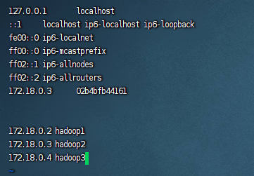

# Hadoop


## Docker Image

```bash
# 通过build Dockfile生成带ssh功能的centos镜像	Dockfile
FROM centos
MAINTAINER gardenia
 
RUN cd /etc/yum.repos.d/
RUN sed -i 's/mirrorlist/#mirrorlist/g' /etc/yum.repos.d/CentOS-*
RUN sed -i 's|#baseurl=http://mirror.centos.org|baseurl=http://vault.centos.org|g' /etc/yum.repos.d/CentOS-*
RUN yum makecache
RUN yum update -y
RUN yum install -y openssh-server sudo
RUN sed -i 's/UsePAM yes/UsePAM no/g' /etc/ssh/sshd_config
RUN yum install -y openssh-clients
RUN yum install -y which
RUN yum -y install net-tools
RUN yum install -y vim
 
RUN echo "root:123" | chpasswd
RUN echo "root   ALL=(ALL)       ALL" >> /etc/sudoers
RUN ssh-keygen -t dsa -f /etc/ssh/ssh_host_dsa_key
RUN ssh-keygen -t rsa -f /etc/ssh/ssh_host_rsa_key

RUN mkdir /var/run/sshd
EXPOSE 22

# COPY jdk /usr/local/jdk
# 拷贝并解压jdk，根据自己的版本修改
ADD jdk-8u381-linux-x64.tar.gz /usr/local/
RUN mv /usr/local/jdk1.8.0_381 /usr/local/jdk
ENV JAVA_HOME /usr/local/jdk1.8
ENV PATH $JAVA_HOME/bin:$PATH

# COPY hadoop /usr/local/hadoop
# 拷贝并解压hadoop，根据自己的版本修改
ADD hadoop-3.3.6.tar.gz /usr/local/
RUN mv /usr/local/hadoop-3.3.6 /usr/local/hadoop
ENV HADOOP_HOME /usr/local/hadoop
ENV PATH $HADOOP_HOME/bin:$PATH

CMD ["/usr/sbin/sshd", "-D"]
```

### 生成基础镜像

```bash
docker build -t="centos-hadoop" .
```

### 创建网桥，分配 IP

```bash
# 创建网桥
docker network create --subnet=192.168.9.0/24 hadoop

docker network ls

### 启动三个容器并指定网桥
docker run --privileged=true -d --network hadoop --hostname hadoop1 --ip 192.168.9.3 --name hadoop1 -p 9870:9870 -p 19888:19888 -p 50070:50070 -p 8088:8088 -p 9001:9001 centos-hadoop /usr/sbin/init

docker run --privileged=true -d --network hadoop --name hadoop2 --hostname hadoop2 --ip 192.168.9.4 centos-hadoop /usr/sbin/init

docker run --privileged=true -d --network hadoop --name hadoop3 --hostname hadoop3 --ip 192.168.9.5 centos-hadoop /usr/sbin/init

# 添加端口(都没用，只能重来)
docker port hadoop1
# 容器停止时，添加端口
docker container update --publish 9001:9001 hadoop1


### 查看网桥使用情况
docker network inspect hadoop

hadoop1 192.168.9.3/24
hadoop2 192.168.9.4/24
hadoop3 192.168.9.5/24

192.168.9.3 hadoop1
192.168.9.4 hadoop2
192.168.9.5 hadoop3
```

### 登录容器，配置信息

```bash
docker exec -it hadoop1 bash
docker exec -it hadoop2 bash
docker exec -it hadoop3 bash

systemctl stop firewalld

systemctl disable firewalld.service

## 在每个 hadoop 服务器中配置 ip 地址映射
vi /etc/hosts
```



```bash
## 给每台 hadoop 服务器中配置 ssh 免密登录
ssh-keygen

ssh-copy-id -f -i /root/.ssh/id_rsa -p 22 root@hadoop1
ssh-copy-id -f -i /root/.ssh/id_rsa -p 22 root@hadoop2
ssh-copy-id -f -i /root/.ssh/id_rsa -p 22 root@hadoop3
```

```bash
### 修改 Hadoop 配置文件	/usr/local/hadoop/etc/hadoop
mkdir /home/hadoop
mkdir /home/hadoop/tmp /home/hadoop/hdfs_name /home/hadoop/hdfs_data

vi hadoop-env.sh

export JAVA_HOME=/usr/local/jdk
export HADOOP_HOME=/usr/local/hadoop
export HADOOP_CONF_DIR=${HADOOP_HOME}/etc/hadoop

vi core-site.xml
<configuration>
    <property>
        <name>fs.defaultFS</name>
        <value>hdfs://hadoop1:9000</value>
    </property>
    <property>
        <name>hadoop.tmp.dir</name>
        <value>file:/home/hadoop/tmp</value>
    </property>
    <property>
        <name>io.file.buffer.size</name>
        <value>131702</value>
    </property>
</configuration>

vi mapred-site.xml
<configuration>
	# 用于执行 MapReduce 作业的运行时框架，可选项是 local、classic、yarn，默认为 local
    <property>
        <name>mapreduce.framework.name</name>
        <value>yarn</value>
    </property>
    # 日志历史服务器地址，默认为 0.0.0.0:10020，可按需修改
    <property>
        <name>mapreduce.jobhistory.address</name>
        <value>hadoop1:10020</value>
    </property>
    # 日志历史网页地址，默认为 0.0.0.0:19888，可按需修改
    <property>
        <name>mapreduce.jobhistory.webapp.address</name>
        <value>hadoop1:19888</value>
    </property>
</configuration>

vi hdfs-site.xml
<configuration>
	# namenode 存储表信息的路径
    <property>
        <name>dfs.namenode.name.dir</name>
        <value>file:/home/hadoop/hdfs_name</value>
    </property>
    # datanode 存储实际文件数据块的路径
    <property>
        <name>dfs.datanode.data.dir</name>
        <value>file:/home/hadoop/hdfs_data</value>
    </property>
    # 文件副本个数，不超过 datanode 的个数
    <property>
        <name>dfs.replication</name>
        <value>2</value>
    </property>
    <property>
        <name>dfs.namenode.http-address</name>
        <value>hadoop1:9001</value>
    </property>
    # secondary namenode 服务网址，端口号默认为 9868，可按需修改
    <property>
        <name>dfs.namenode.secondary.http-address</name>
        <value>hadoop2:9002</value>
    </property>
    <property>
        <name>dfs.webhdfs.enabled</name>
        <value>true</value>
    </property>
</configuration>
## Hadoop的 Web UI 界面访问地址：1、namenode：hadoop1:9001	2、secondary namenode：hadoop2:9002  

vi yarn-site.xml
<configuration>
 	<property>
        <name>yarn.nodemanager.aux-services</name>
        <value>mapreduce_shuffle</value>
    </property>
    <property>
        <name>yarn.nodemanager.auxservices.mapreduce.shuffle.class</name>
        <value>org.apache.hadoop.mapred.ShuffleHandler</value>
    </property>
    # yarn 管理的主机名
    <property>
        <name>yarn.resourcemanager.hostname</name>
        <value>hadoop1</value>
    </property>
    <property>
        <name>yarn.resourcemanager.address</name>
        <value>hadoop1:8032</value>
    </property>
    <property>
        <name>yarn.resourcemanager.scheduler.address</name>
        <value>hadoop1:8030</value>
    </property>
    <property>
        <name>yarn.resourcemanager.resource-tracker.address</name>
        <value>hadoop1:8031</value>
    </property>
    <property>
        <name>yarn.resourcemanager.admin.address</name>
        <value>hadoop1:8033</value>
    </property>
    <property>
        <name>yarn.resourcemanager.webapp.address</name>
        <value>hadoop1:8088</value>
    </property>
    # 是否聚合各子节点的日志信息到主节点，设置为是，不然在 web 上看不到日志
    <property>
        <name>yarn.log-aggregation-enable</name>
        <value>true</value>
    </property>
    # 日志保存时长，单位秒，默认为 -1，不删除，可按需设置
    <property>
        <name>yarn.log-aggregation.retain-seconds</name>
        <value>640800</value>
    </property>
</configuration>

vi workers
# localhost
hadoop2
hadoop3

### 配置环境变量
vi /etc/profile

export JAVA_HOME=/usr/local/jdk
export PATH=$JAVA_HOME/bin:$PATH
export HADOOP_HOME=/usr/local/hadoop
export PATH=$HADOOP_HOME/bin:$PATH
export PATH=$HADOOP_HOME/sbin:$PATH
export HDFS_NAMENODE_USER=root
export HDFS_DATANODE_USER=root
export HDFS_JOURNALNODE_USER=root
export HDFS_SECONDARYNAMENODE_USER=root
export YARN_RESOURCEMANAGER_USER=root
export YARN_NODEMANAGER_USER=root

source /etc/profile
```

### 分发配置信息

```bash
# 拷贝到 hadoop2 和 hadoop3 上
scp -r $HADOOP_HOME/etc/hadoop hadoop2:/usr/local/hadoop/etc/
scp -r $HADOOP_HOME/etc/hadoop hadoop3:/usr/local/hadoop/etc/

scp -r /home/hadoop hadoop2:/home
scp -r /home/hadoop hadoop3:/home

scp -r /etc/profile hadoop2:/etc
scp -r /etc/profile hadoop3:/etc

### 给文件赋权(每台 Hadoop)
chmod -R 777 /usr/local/hadoop
chmod -R 777 /usr/local/jdk
```

### 启动 Hadoop 集群

```bash
### hadoop1
# 格式化 hdfs
hdfs namenode -format

# 一键启动 Hadoop 集群
source /etc/profile
$HADOOP_HOME/sbin/start-all.sh
# 启动历史日志服务 
$HADOOP_HOME/bin/mapred --daemon start historyserver

# 测试 Hadoop 集群(每台 Hadoop)
jps

# hadoop1是名称结点，hadoop2是第二名称节点和数据节点

# 关闭历史任务服务 
$HADOOP_HOME/bin/mapred --daemon stop historyserver
# 关闭服务 
$HADOOP_HOME/sbin/stop-all.sh
```


## Docker Install

```bash
docker pull apache/hadoop:3
```

创建以下两个文件：config and docker-compose.yaml

```yaml
version: "2"
services:
   namenode:
      image: apache/hadoop:3
      hostname: namenode
      command: ["hdfs", "namenode"]
      ports:
        - 9870:9870
      env_file:
        - ./config
      environment:
          ENSURE_NAMENODE_DIR: "/tmp/hadoop-root/dfs/name"
   datanode:
      image: apache/hadoop:3
      command: ["hdfs", "datanode"]
      env_file:
        - ./config      
   resourcemanager:
      image: apache/hadoop:3
      hostname: resourcemanager
      command: ["yarn", "resourcemanager"]
      ports:
         - 8088:8088
      env_file:
        - ./config
      volumes:
        - ./test.sh:/opt/test.sh
   nodemanager:
      image: apache/hadoop:3
      command: ["yarn", "nodemanager"]
      env_file:
        - ./config
```

```bash
CORE-SITE.XML_fs.default.name=hdfs://namenode
CORE-SITE.XML_fs.defaultFS=hdfs://namenode
HDFS-SITE.XML_dfs.namenode.rpc-address=namenode:8020
HDFS-SITE.XML_dfs.replication=1
MAPRED-SITE.XML_mapreduce.framework.name=yarn
MAPRED-SITE.XML_yarn.app.mapreduce.am.env=HADOOP_MAPRED_HOME=$HADOOP_HOME
MAPRED-SITE.XML_mapreduce.map.env=HADOOP_MAPRED_HOME=$HADOOP_HOME
MAPRED-SITE.XML_mapreduce.reduce.env=HADOOP_MAPRED_HOME=$HADOOP_HOME
YARN-SITE.XML_yarn.resourcemanager.hostname=resourcemanager
YARN-SITE.XML_yarn.nodemanager.pmem-check-enabled=false
YARN-SITE.XML_yarn.nodemanager.delete.debug-delay-sec=600
YARN-SITE.XML_yarn.nodemanager.vmem-check-enabled=false
YARN-SITE.XML_yarn.nodemanager.aux-services=mapreduce_shuffle
CAPACITY-SCHEDULER.XML_yarn.scheduler.capacity.maximum-applications=10000
CAPACITY-SCHEDULER.XML_yarn.scheduler.capacity.maximum-am-resource-percent=0.1
CAPACITY-SCHEDULER.XML_yarn.scheduler.capacity.resource-calculator=org.apache.hadoop.yarn.util.resource.DefaultResourceCalculator
CAPACITY-SCHEDULER.XML_yarn.scheduler.capacity.root.queues=default
CAPACITY-SCHEDULER.XML_yarn.scheduler.capacity.root.default.capacity=100
CAPACITY-SCHEDULER.XML_yarn.scheduler.capacity.root.default.user-limit-factor=1
CAPACITY-SCHEDULER.XML_yarn.scheduler.capacity.root.default.maximum-capacity=100
CAPACITY-SCHEDULER.XML_yarn.scheduler.capacity.root.default.state=RUNNING
CAPACITY-SCHEDULER.XML_yarn.scheduler.capacity.root.default.acl_submit_applications=*
CAPACITY-SCHEDULER.XML_yarn.scheduler.capacity.root.default.acl_administer_queue=*
CAPACITY-SCHEDULER.XML_yarn.scheduler.capacity.node-locality-delay=40
CAPACITY-SCHEDULER.XML_yarn.scheduler.capacity.queue-mappings=
CAPACITY-SCHEDULER.XML_yarn.scheduler.capacity.queue-mappings-override.enable=false
```

```bash
docker-compose up -d

docker exec -it docker-3_namenode_1 /bin/bash

docker-compose down
```

> The Namenode UI can be accessed at http://localhost:9870/ and the ResourceManager UI can be accessed at http://localhost:8088/