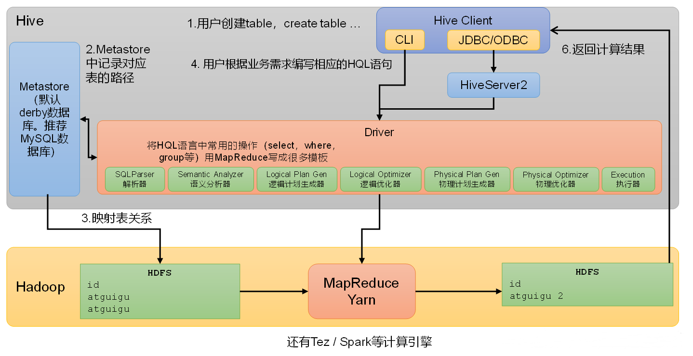
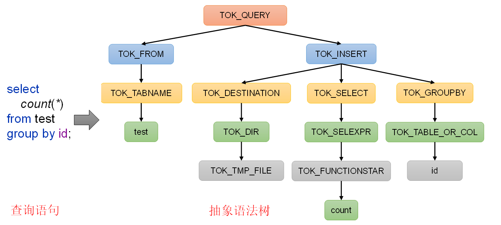
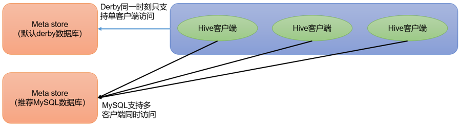
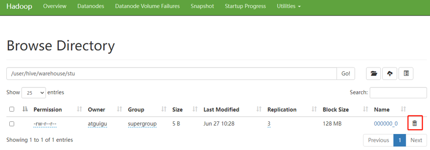
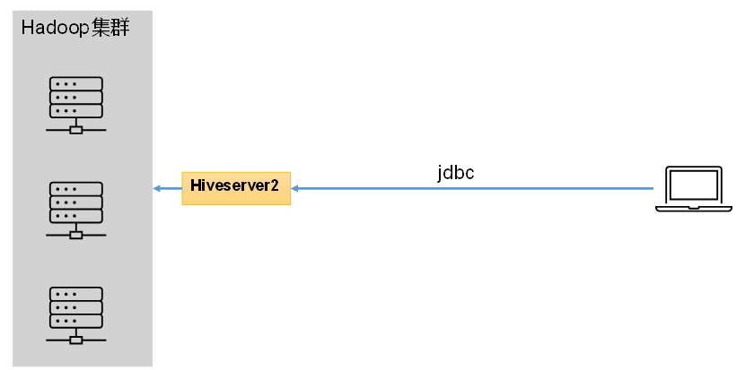
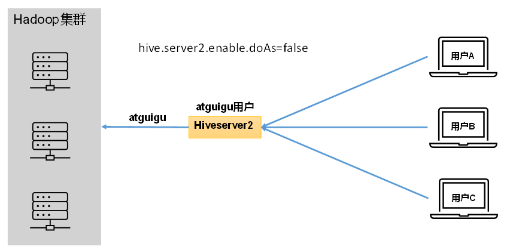
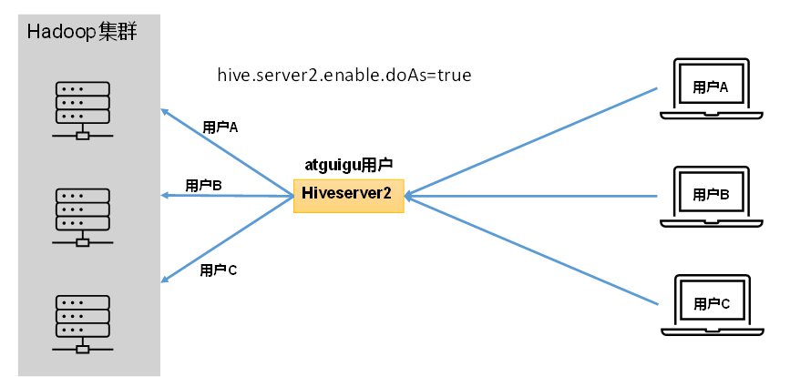

# Hive

Hive是由Facebook开源，基于Hadoop的一个数据仓库工具，可以将结构化的数据文件映射为一张表，并提供类SQL查询功能。


## 核心



**1**）用户接口：Client

CLI（command-line interface）、JDBC/ODBC。

说明：JDBC和ODBC的区别。

（1）JDBC的移植性比ODBC好；（通常情况下，安装完ODBC驱动程序之后，还需要经过确定的配置才能够应用。而不相同的配置在不相同数据库服务器之间不能够通用。所以，安装一次就需要再配置一次。JDBC只需要选取适当的JDBC数据库驱动程序，就不需要额外的配置。在安装过程中，JDBC数据库驱动程序会自己完成有关的配置。）

（2）两者使用的语言不同，JDBC在Java编程时使用，ODBC一般在C/C++编程时使用。

**2**）元数据：Metastore

元数据包括：数据库（默认是default）、表名、表的拥有者、列/分区字段、表的类型（是否是外部表）、表的数据所在目录等。

默认存储在自带的derby数据库中，由于derby数据库只支持单客户端访问，生产环境中为了多人开发，推荐使用MySQL存储Metastore。

**3**）驱动器：Driver

（1）解析器（SQLParser）：将SQL字符串转换成抽象语法树（AST）

（2）语义分析（Semantic Analyzer）：将AST进一步划分为QeuryBlock

（3）逻辑计划生成器（Logical Plan Gen）：将语法树生成逻辑计划

（4）逻辑优化器（Logical Optimizer）：对逻辑计划进行优化

（5）物理计划生成器（Physical Plan Gen）：根据优化后的逻辑计划生成物理计划

（6）物理优化器（Physical Optimizer）：对物理计划进行优化

（7）执行器（Execution）：执行该计划，得到查询结果并返回给客户端




## Install

> **1）Hive官网地址**
>
> http://hive.apache.org/
>
> **2**）**文档查看地址**
>
> https://cwiki.apache.org/confluence/display/Hive/GettingStarted
>
> **3）下载地址**
>
> http://archive.apache.org/dist/hive/
>
> **4）github地址**
>
> https://github.com/apache/hive

### Hive 部署

1、 **把apache-hive-x.x.x-bin.tar.gz上传到Linux的/opt/software目录下**

2、**解压apache-hive-x.x.x-bin.tar.gz到/opt/module/目录下面**

```bash
tar -zxvf /opt/software/apache-hive-3.1.3-bin.tar.gz -C /opt/module/

mv /opt/module/apache-hive-3.1.3-bin/ /opt/module/hive
```

3、**添加环境变量**

```bash
sudo vim /etc/profile.d/my_env.sh

#HIVE_HOME
export HIVE_HOME=/opt/module/hive
export PATH=$PATH:$HIVE_HOME/bin

#HIVE_HOME
export HIVE_HOME=/opt/module/hive
export PATH=$PATH:$HIVE_HOME/bin
```

4、**初始化元数据库（默认是derby数据库）**

```bash
bin/schematool -dbType derby -initSchema
```

5、**启动并使用`Hive`**

```bash
bin/hive

hive> show databases;
hive> show tables;
hive> create table stu(id int, name string);
hive> insert into stu values(1,"ss");
hive> select * from stu;
```

> 观察HDFS的路径/user/hive/warehouse/stu，体会Hive与Hadoop之间的关系
>
> Hive中的表在Hadoop中是目录；Hive中的数据在Hadoop中是文件。

> Hive默认使用的元数据库为**derby**。
>
> **derby数据库的特点是同一时间只允许一个客户端访问。如果多个Hive客户端同时访问，就会报错。**由于在企业开发中，都是多人协作开发，需要多客户端同时访问Hive。



1. **退出hive客户端。然后在Hive的安装目录下将derby.log和metastore_db删除，顺便将HDFS上目录删除**

```bash
hive> quit;

rm -rf derby.log metastore_db
hadoop fs -rm -r /user
```

2. 删除HDFS中`/user/hive/warehouse/stu` 中数据



### 服务部署

1、**`hiveserver2`服务**

Hive的hiveserver2服务的作用是提供jdbc/odbc接口，为用户提供远程访问Hive数据的功能，例如用户期望在个人电脑中访问远程服务中的Hive数据，就需要用到Hiveserver2



> **用户说明**
>
> 在远程访问Hive数据时，客户端并未直接访问Hadoop集群，而是由Hivesever2代理访问。由于Hadoop集群中的数据具备访问权限控制，所以此时需考虑一个问题：那就是访问Hadoop集群的用户身份是谁？是Hiveserver2的启动用户？还是客户端的登录用户？
>
> 答案是都有可能，具体是谁，由Hiveserver2的hive.server2.enable.doAs参数决定，该参数的含义是是否启用Hiveserver2用户模拟的功能。若启用，则Hiveserver2会模拟成客户端的登录用户去访问Hadoop集群的数据，不启用，则Hivesever2会直接使用启动用户访问Hadoop集群数据。模拟用户的功能，默认是开启的。



开启用户模拟功能：



> 生产环境，推荐开启用户模拟功能，因为开启后才能保证各用户之间的权限隔离。

1. Hadoop 端 配置

hivesever2的模拟用户功能，依赖于Hadoop提供的proxy user（代理用户功能），只有Hadoop中的代理用户才能模拟其他用户的身份访问Hadoop集群。因此，需要将hiveserver2的启动用户设置为Hadoop的代理用户，配置方式如下：

修改配置文件core-site.xml，然后分发三台机器

```bash
cd $HADOOP_HOME/etc/hadoop
vim core-site.xml

<!--配置所有节点的 gardenia 用户都可作为代理用户-->
<property>
    <name>hadoop.proxyuser.gardenia.hosts</name>
    <value>*</value>
</property>

<!--配置 gardenia 用户能够代理的用户组为任意组-->
<property>
    <name>hadoop.proxyuser.gardenia.groups</name>
    <value>*</value>
</property>

<!--配置 gardenia 用户能够代理的用户为任意用户-->
<property>
    <name>hadoop.proxyuser.gardenia.users</name>
    <value>*</value>
</property>
```

2. Hive端配置

在hive-site.xml文件中添加如下配置信息

```xml
vim hive-site.xml

<!-- 指定hiveserver2连接的host -->
<property>
	<name>hive.server2.thrift.bind.host</name>
	<value>hadoop102</value>
</property>

<!-- 指定hiveserver2连接的端口号 -->
<property>
	<name>hive.server2.thrift.port</name>
	<value>10000</value>
</property>
```

3. 启动`hiveserver2`

```bash
bin/hive --service hiveserver2

# 使用命令行客户端beeline进行远程访问
bin/beeline -u jdbc:hive2://hadoop102:10000 -n gardenia

# Connecting to jdbc:hive2://hadoop102:10000
# Connected to: Apache Hive (version 3.1.3)
# Driver: Hive JDBC (version 3.1.3)
# Transaction isolation: TRANSACTION_REPEATABLE_READ
# Beeline version 3.1.3 by Apache Hive
# 0: jdbc:hive2://hadoop102:10000>
```

> 可使用`Datagrip`图形化客户端进行远程访问