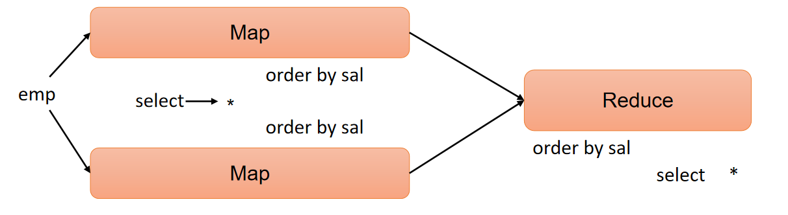
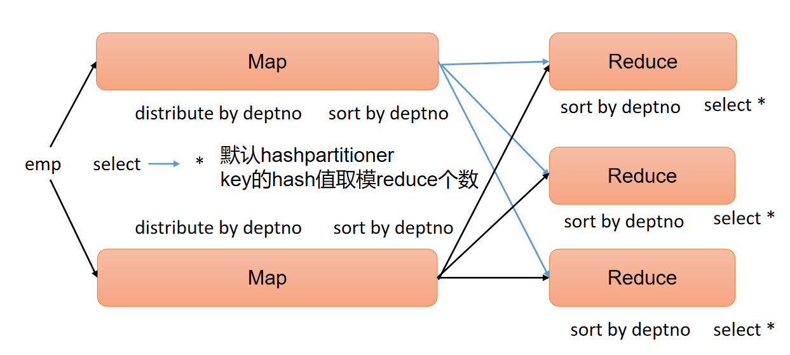

# Hive

Hive 是由 Facebook 开源，基于 Hadoop 的一个数据仓库工具，可以将结构化的数据文件映射为一张表，并提供类 SQL 查询功能

Hive 是一个 Hadoop 客户端，用于将 HQL（Hive SQL）转化成 MapReduce 程序

（1）Hive 中每张表的数据存储在 HDFS

（2）Hive 分析数据底层的实现是 MapReduce（也可配置为 Spark 或者 Tez）

（3）执行程序运行在 Yarn 上


# 一、核心


**1**）用户接口：Client

CLI（command-line interface）、JDBC/ODBC

说明：JDBC和ODBC的区别

（1）JDBC的移植性比ODBC好；（通常情况下，安装完ODBC驱动程序之后，还需要经过确定的配置才能够应用。而不相同的配置在不相同数据库服务器之间不能够通用。所以，安装一次就需要再配置一次。JDBC只需要选取适当的JDBC数据库驱动程序，就不需要额外的配置。在安装过程中，JDBC数据库驱动程序会自己完成有关的配置。）

（2）两者使用的语言不同，JDBC在Java编程时使用，ODBC一般在C/C++编程时使用。

**2**）元数据：Metastore

元数据包括：数据库（默认是default）、表名、表的拥有者、列/分区字段、表的类型（是否是外部表）、表的数据所在目录等。

默认存储在自带的derby数据库中，由于derby数据库只支持单客户端访问，生产环境中为了多人开发，推荐使用MySQL存储Metastore。

**3**）驱动器：Driver

（1）解析器（SQLParser）：将SQL字符串转换成抽象语法树（AST）

（2）语义分析（Semantic Analyzer）：将AST进一步划分为QeuryBlock

（3）逻辑计划生成器（Logical Plan Gen）：将语法树生成逻辑计划

（4）逻辑优化器（Logical Optimizer）：对逻辑计划进行优化

（5）物理计划生成器（Physical Plan Gen）：根据优化后的逻辑计划生成物理计划

（6）物理优化器（Physical Optimizer）：对物理计划进行优化

（7）执行器（Execution）：执行该计划，得到查询结果并返回给客户端


## 1.1 Distinguish

​	Hive 中大多数查询的执行是通过Hadoop 提供的 MapReduce 来实现的，而数据库通常有自己的执行引擎。
​	Hive在查询数据的时候，由于没有索引，需要扫描整个表，因此延迟较高。另外一个导致Hive执行延迟高的因素是MapReduce框架。由于MapReduce本身具有较高的延迟，因此在利用MapReduce 执行 HiVe 时，描拉小。当数据规模大到超过数据库的处理能力较低。当然，这个低是有条件的，即数据规模较小，当数据规模大到超过数据库的处理能力的时候，Hive的并行计算显然能体现出优势。

​	由于Hive建立在集群上并可以利用MapReduce进行并行计算，因此可以支持很大规模的数据。对应的，数据库可以支持的数据规模较小。

# 二、Install

> **1）Hive官网地址**
>
> http://hive.apache.org/
>
> **2**）**文档查看地址**
>
> https://cwiki.apache.org/confluence/display/Hive/GettingStarted
>
> **3）下载地址**
>
> http://archive.apache.org/dist/hive/
>
> **4）github地址**
>
> https://github.com/apache/hive

## 2.1 Hive   安装

需预先启动 Hadoop 集群
如果启动 Hadoop 集群后依然无法启动成功 Hive, 可能是因为 NameNode 处于安全模式,需要退出安全模式才能启动 Hive

1、 **把 `apache-hive-x.x.x-bin.tar.gz` 上传到 Linux 的 `/opt/software` 目录下**

2、**解压apache-hive-x.x.x-bin.tar.gz到 /opt/module/ 目录下**

```bash
tar -zxvf /opt/software/apache-hive-3.1.3-bin.tar.gz -C /opt/module/

mv /opt/module/apache-hive-3.1.3-bin/ /opt/module/hive
```

3、**添加环境变量**

```bash
sudo vim /etc/profile.d/my_env.sh

#HIVE_HOME
export HIVE_HOME=/opt/module/hive
export PATH=$PATH:$HIVE_HOME/bin

#HIVE_HOME
export HIVE_HOME=/opt/module/hive
export PATH=$PATH:$HIVE_HOME/bin
```

4、**初始化元数据库（默认是 derby 数据库）**

```bash
bin/schematool -dbType derby -initSchema
```

5、**启动并使用`Hive`**

```bash
bin/hive

hive> show databases;
hive> show tables;
hive> create table stu(id int, name string);
hive> insert into stu values(1,"ss");
hive> select * from stu;
```

> 观察HDFS的路径 `/user/hive/warehouse/stu` 
>
> Hive 中的表在 Hadoop 中是目录；Hive中的数据在 Hadoop 中是文件

### 2.1.1 配置 MySQL 为元数据库

> Hive默认使用的元数据库为 **derby**
>
> **derby 数据库的特点是同一时间只允许一个客户端访问。如果多个Hive客户端同时访问，就会报错。**由于在企业开发中，都是多人协作开发，需要多客户端同时访问 Hive


1. **退出 Hive 客户端。然后在 Hive 的安装目录下将 derby.log 和 metastore_db 删除，顺便将 HDFS 上目录删除**

```bash
hive> quit;

rm -rf derby.log metastore_db
hadoop fs -rm -r /user
```

2. 新建 Hive 元数据库

   ```bash
   mysql -uroot -p123456
   
   create database metastore;
   quit;
   ```

3. 将 MySQL 的 JDBC 驱动拷贝到 Hive 的 lib 目录下
   ```bash
   cp /opt/software/mysql-connector-java-5.1.37.jar $HIVE_HOME/lib
   ```

4. 在 `$HIVE_HOME/conf` 目录下新建 `hive-site.xml` 文件
   ```xml
   vim $HIVE_HOME/conf/hive-site.xml
   
   <?xml version="1.0"?>
   <?xml-stylesheet type="text/xsl" href="configuration.xsl"?>
   
   <configuration>
     <!-- jdbc连接的URL -->
     <property>
         <name>javax.jdo.option.ConnectionURL</name>
         <value>jdbc:mysql://hadoop102:3306/metastore?useSSL=false</value>
     </property>
   
     <!-- jdbc连接的Driver-->
     <property>
         <name>javax.jdo.option.ConnectionDriverName</name>
         <value>com.mysql.jdbc.Driver</value>
     </property>
   
     <!-- jdbc连接的username-->
     <property>
         <name>javax.jdo.option.ConnectionUserName</name>
         <value>root</value>
     </property>
   
     <!-- jdbc连接的password -->
     <property>
         <name>javax.jdo.option.ConnectionPassword</name>
         <value>123456</value>
     </property>
     <!-- Hive默认在HDFS的工作目录-->
     <property>
       <name>hive.metastore.warehouse.dir</name>
       <value>/user/hive/warehouse</value>
     </property>
   </ configuration>
   ```

5. 初始化 元数据库 Hive
   ```bash
   bin/schematool -dbType mysql -initSchema -verbose
   ```

6. 验证 Hive 配置
   ```bash
   bin/hive
   
   # 多开 Shell
   ```


## 2.2 服务部署

#### 2.2.1  hiveserver2 服务

​	Hive 的 `hiveserver2` 服务的作用是提供 `jdbc/odbc` 接口，为用户提供远程访问Hive数据的功能，例如用户期望在个人电脑中访问远程服务中的 Hive 数据，就需要用到 `Hiveserver2`


> **用户说明**
>	在远程访问 Hive 数据时，客户端并未直接访问Hadoop集群，而是由Hivesever2代理访问。由于Hadoop集群中的数据具备访问权限控制，所以此时需考虑一个问题：那就是访问Hadoop集群的用户身份是谁？是Hiveserver2的启动用户？还是客户端的登录用户？
> 	答案：都有可能，具体是谁，由Hiveserver2的hive.server2.enable.doAs参数决定，该参数的含义是是否启用Hiveserver2用户模拟的功能。若启用，则Hiveserver2会模拟成客户端的登录用户去访问Hadoop集群的数据，不启用，则Hivesever2会直接使用启动用户访问Hadoop集群数据。模拟用户的功能，默认是开启的


开启用户模拟功能：


> 生产环境，推荐开启用户模拟功能，因为开启后才能保证各用户之间的权限隔离

1. **Hadoop 端 配置**

​	`hivesever2` 的模拟用户功能，依赖于Hadoop提供的 `proxy user`（代理用户功能），只有Hadoop中的代理用户才能模拟其他用户的身份访问Hadoop集群。因此，需要将 `hiveserver2` 的启动用户设置为Hadoop的代理用户，配置方式如下：

修改配置文件 `core-site.xml` ，然后分发三台机器

```xml
cd $HADOOP_HOME/etc/hadoop
vim core-site.xml

<!--配置所有节点的 gardenia 用户都可作为代理用户-->
<property>
    <name>hadoop.proxyuser.gardenia.hosts</name>
    <value>*</value>
</property>

<!--配置 gardenia 用户能够代理的用户组为任意组-->
<property>
    <name>hadoop.proxyuser.gardenia.groups</name>
    <value>*</value>
</property>

<!--配置 gardenia 用户能够代理的用户为任意用户-->
<property>
    <name>hadoop.proxyuser.gardenia.users</name>
    <value>*</value>
</property>
```

2. **Hive 端配置**

在 `hive-site.xml` 文件中添加如下配置信息

```xml
vim hive-site.xml

<!-- 指定hiveserver2连接的host -->
<property>
	<name>hive.server2.thrift.bind.host</name>
	<value>hadoop102</value>
</property>

<!-- 指定hiveserver2连接的端口号 -->
<property>
	<name>hive.server2.thrift.port</name>
	<value>10000</value>
</property>
```

**启动`hiveserver2`**

```bash
bin/hive --service hiveserver2

# 使用命令行客户端 beeline 进行远程访问
bin/beeline -u jdbc:hive2://hadoop102:10000 -n gardenia

# Connecting to jdbc:hive2://hadoop102:10000
# Connected to: Apache Hive (version 3.1.3)
# Driver: Hive JDBC (version 3.1.3)
# Transaction isolation: TRANSACTION_REPEATABLE_READ
# Beeline version 3.1.3 by Apache Hive
# 0: jdbc:hive2://hadoop102:10000>
```

> 可使用`Datagrip` 等图形化客户端进行远程访问


#### 2.2.2 metastore 服务

Hive 的 metastore 服务的作用是为 Hive CLI 或者 Hiveserver2 提供元数据访问接口

**1）metastore 运行模式**

metastore 有两种运行模式，分别为嵌入式模式和独立服务模式。下面分别对两种模式进行说明：

（1）嵌入式模式


（2）独立服务模式


生产环境中，不推荐使用嵌入式模式。因为其存在以下两个问题：

（1）嵌入式模式下，每个 Hive CLI 都需要直接连接元数据库，当 HiveCLI 较多时，数据库压力会比较大

（2）每个客户端都需要用户元数据库的读写权限，元数据库的安全得不到很好的保证

**2）metastore部署**

（1）嵌入式模式

嵌入式模式下，只需保证 Hiveserver2 和每个 Hive CLI 的配置文件 `hive-site.xml` 中包含连接元数据库所需要的以下参数即可：

```xml
<!-- jdbc连接的URL -->
<property>
    <name>javax.jdo.option.ConnectionURL</name>
    <value>jdbc:mysql://hadoop102:3306/metastore?useSSL=false</value>
</property>

<!-- jdbc连接的Driver-->
<property>
    <name>javax.jdo.option.ConnectionDriverName</name>
    <value>com.mysql.jdbc.Driver</value>
</property>

<!-- jdbc连接的username-->
<property>
    <name>javax.jdo.option.ConnectionUserName</name>
    <value>root</value>
</property>

<!-- jdbc连接的password -->
<property>
    <name>javax.jdo.option.ConnectionPassword</name>
    <value>123456</value>
</property>
```

（2）独立服务模式

独立服务模式需做以下配置：

首先，保证 metastore 服务的配置文件 `hive-site.xml` 中包含连接元数据库所需的以下参数：

```xml
<!-- jdbc连接的URL -->
<property>
    <name>javax.jdo.option.ConnectionURL</name>
    <value>jdbc:mysql://hadoop102:3306/metastore?useSSL=false</value>
</property>

<!-- jdbc连接的Driver-->
<property>
    <name>javax.jdo.option.ConnectionDriverName</name>
    <value>com.mysql.jdbc.Driver</value>
</property>

<!-- jdbc连接的username-->
<property>
    <name>javax.jdo.option.ConnectionUserName</name>
    <value>root</value>
</property>

<!-- jdbc连接的password -->
<property>
    <name>javax.jdo.option.ConnectionPassword</name>
    <value>123456</value>
</property>
```

其次，保证 Hiveserver2 和每个 Hive CLI 的配置文件  `hive-site.xml` 中包含访问 metastore 服务所需的以下参数：

```xml
<!-- 指定metastore服务的地址 -->
<property>
	<name>hive.metastore.uris</name>
	<value>thrift://hadoop102:9083</value>
</property>
```

注意：主机名需要改为 metastore 服务所在节点，端口号无需修改， metastore 服务的默认端口就是 9083

**3）测试**

此时启动Hive CLI，执行shou databases语句，会出现一下错误提示信息：

```bash
hive (default)> show databases;
FAILED: HiveException java.lang.RuntimeException: Unable to instantiate org.apache.hadoop.hive.ql.metadata.SessionHiveMetaStoreClient
```

这是因为在 Hive CLI的配置文件中配置了hive.metastore.uris参数，此时Hive CLI会去请求执行的metastore服务地址，所以必须启动metastore服务才能正常使用。

metastore服务的启动命令如下：

```bash
hive --service metastore
2022-04-24 16:58:08: Starting Hive Metastore Server
```

注意：启动后该窗口不能再操作，需打开一个新的Xshell窗口来对Hive操作

重新启动 Hive CLI，并执行shou databases语句，就能正常访问了

```bash
bin/hive
```

## 2.3 编写 Hive 服务启动脚本（了解）

**1）前台启动的方式导致需要打开多个Xshell窗口，可以使用如下方式后台方式启动**

-   nohup：放在命令开头，表示不挂起，也就是关闭终端进程也继续保持运行状态

-   /dev/null：是Linux文件系统中的一个文件，被称为黑洞，所有写入该文件的内容都会被自动丢弃

-   2\>&1：表示将错误重定向到标准输出上

-   &：放在命令结尾，表示后台运行


一般会组合使用：`nohup \[xxx命令操作\]\> file 2\>&1 &`，表示将xxx命令运行的结果输出到file中，并保持命令启动的进程在后台运行。

如上命令不要求掌握。

```bash
nohup hive --service metastore 2>&1 &
nohup hive --service hiveserver2 2>&1 &
```

**2）为了方便使用，可以直接编写脚本来管理服务的启动和关闭**

`vim $HIVE_HOME/bin/hiveservices.sh` 

内容如下：此脚本的编写不要求掌握。直接拿来使用即可

```shell
#!/bin/bash

HIVE_LOG_DIR=$HIVE_HOME/logs
if [ ! -d $HIVE_LOG_DIR ]
then
	mkdir -p $HIVE_LOG_DIR
fi

# 检查进程是否运行正常，参数1为进程名，参数2为进程端口
function check_process()
{
    pid=$(ps -ef 2>/dev/null | grep -v grep | grep -i $1 | awk '{print $2}')
    ppid=$(netstat -nltp 2>/dev/null | grep $2 | awk '{print $7}' | cut -d '/' -f 1)
    echo $pid
    [[ "$pid" =~ "$ppid" ]] && [ "$ppid" ] && return 0 || return 1
}

function hive_start()
{
    metapid=$(check_process HiveMetastore 9083)
    cmd="nohup hive --service metastore >$HIVE_LOG_DIR/metastore.log 2>&1 &"
    [ -z "$metapid" ] && eval $cmd || echo "Metastroe服务已启动"
    server2pid=$(check_process HiveServer2 10000)
    cmd="nohup hive --service hiveserver2 >$HIVE_LOG_DIR/hiveServer2.log 2>&1 &"
    [ -z "$server2pid" ] && eval $cmd || echo "HiveServer2服务已启动"
}

function hive_stop()
{
metapid=$(check_process HiveMetastore 9083)
    [ "$metapid" ] && kill $metapid || echo "Metastore服务未启动"
    server2pid=$(check_process HiveServer2 10000)
    [ "$server2pid" ] && kill $server2pid || echo "HiveServer2服务未启动"
}

case $1 in
"start")
    hive_start
    ;;
"stop")
    hive_stop
    ;;
"restart")
    hive_stop
    sleep 2
    hive_start
    ;;
"status")
    check_process HiveMetastore 9083 >/dev/null && echo "Metastore服务运行正常" || echo "Metastore服务运行异常"
    check_process HiveServer2 10000 >/dev/null && echo "HiveServer2服务运行正常" || echo "HiveServer2服务运行异常"
    ;;
*)
    echo Invalid Args!
    echo 'Usage: '$(basename $0)' start|stop|restart|status'
    ;;
esac
```

**3）添加执行权限**

```bash
chmod +x \$HIVE_HOME/bin/hiveservices.sh
```

**4）启动Hive后台服务**

```bash
hiveservices.sh start
```

## 2.4 Hive 使用技巧

### 2.4.1 Hive 常用交互命令

```bash
bin/hive -help
usage: hive
 -d,--define <key=value>          Variable subsitution to apply to hive
                                  commands. e.g. -d A=B or --define A=B
    --database <databasename>     Specify the database to use
 -e <quoted-query-string>         SQL from command line
 -f <filename>                      SQL from files
 -H,--help                        Print help information
    --hiveconf <property=value>   Use value for given property
    --hivevar <key=value>         Variable subsitution to apply to hive
                                  commands. e.g. --hivevar A=B
 -i <filename>                    Initialization SQL file
 -S,--silent                      Silent mode in interactive shell
 -v,--verbose                     Verbose mode (echo executed SQL to the console)
```

**1）在Hive命令行里创建一个表student，并插入1条数据**

```bash
hive (default)> create table student(id int,name string);
OK
Time taken: 1.291 seconds

hive (default)> insert into table student values(1,"zhangsan");
hive (default)> select * from student;
OK
student.id	student.name
1	zhangsan
Time taken: 0.144 seconds, Fetched: 1 row(s)
```

**2** **“-e”不进入hive的交互窗口执行hql语句**

```bash
bin/hive -e "select id from student;"
```

**3）"-f" 执行脚本中的 hql 语句**

（1）在/opt/module/hive/下创建datas目录并在datas目录下创建hivef.sql文件

```bash
mkdir datas
vim hivef.sql
```

（2）文件中写入正确的**hql**语句

`select * from student;`

（3）执行文件中的**hql**语句

```bash
bin/hive -f /opt/module/hive/datas/hivef.sql
```

（4）执行文件中的**hql**语句并将结果写入文件中

```bash
bin/hive -f /opt/module/hive/datas/hivef.sql > /opt/module/hive/datas/hive_result.txt
```

### 2.4.2 Hive 参数配置方式

**1）查看当前所有的配置信息**

`hive> set;`

**2）参数的配置三种方式**

**（1）配置文件方式**

-   默认配置文件：`hive-default.xml`

-   用户自定义配置文件：`hive-site.xml`

注意：用户自定义配置会覆盖默认配置。另外，Hive也会读入Hadoop的配置，因为Hive是作为Hadoop的客户端启动的，Hive的配置会覆盖Hadoop的配置。配置文件的设定对本机启动的所有Hive进程都有效。

**（2）命令行参数方式**

①启动Hive时，可以在命令行添加 `-hiveconf param=value` 来设定参数。例如：

```bash
bin/hive -hiveconf mapreduce.job.reduces=10;
```

<span style="color:red">注意：仅对本次Hive启动有效</span>

②查看参数设置

```bash
set mapreduce.job.reduces;
```

**（3）参数声明方式**

可以在HQL中使用SET关键字设定参数，例如：

```bash
set mapreduce.job.reduces=10;
```

注意：仅对本次Hive启动有效

上述三种设定方式的优先级依次递增。即**配置文件 \< 命令行参数 \< 参数声明**。注意某些系统级的参数，例如log4j相关的设定，必须用前两种方式设定，因为那些参数的读取在会话建立以前已经完成了。

### 2.4.3 Hive 常见属性配置

**1）Hive 客户端显示当前库和表头**

**（1）在 hive-site.xml 中加入如下两个配置:**

```xml
vim hive-site.xml

<property>
    <name>hive.cli.print.header</name>
    <value>true</value>
    <description>Whether to print the names of the columns in query output.</description>
</property>
<property>
    <name>hive.cli.print.current.db</name>
    <value>true</value>
    <description>Whether to include the current database in the Hive prompt.</description>
</property>
```


**（2）hive客户端在运行时可以显示当前使用的库和表头信息**

```bash
hive

hive (default)> select * from stu;
OK
stu.id	stu.name
1	ss
Time taken: 1.874 seconds, Fetched: 1 row(s)
hive (default)>
```

**2）Hive运行日志路径配置**

**（1）Hive的log默认存放在 /tmp/gardenia/hive.log 目录下（当前用户名下）**

```bash
ls
```

**（2）修改Hive的log存放日志到 /opt/module/hive/logs**

① 修改 `$HIVE_HOME/conf/hive-log4j2.properties.template` 文件名称为 hive-log4j2.properties

```bash
pwd
/opt/module/hive/conf

mv hive-log4j2.properties.template hive-log4j2.properties
```

② 在 `hive-log4j2.properties` 文件中修改 log 存放位置

```bash
vim hive-log4j2.properties

property.hive.log.dir=/opt/module/hive/logs
```

**3）Hive 的 JVM 堆内存设置**

​	新版本的Hive启动的时候，默认申请的JVM堆内存大小为256M，JVM堆内存申请的太小，导致后期开启本地模式，执行复杂的SQL时经常会报错：java.lang.OutOfMemoryError: Java heap space，因此最好提前调整一下HADOOP_HEAPSIZE这个参数。

（1）修改 \$HIVE_HOME/conf 下的 hive-env.sh.template 为 hive-env.sh

```bash
pwd
/opt/module/hive/conf

mv hive-env.sh.template hive-env.sh
```

（2）将 `hive-env.sh` 其中的参数 export
HADOOP_HEAPSIZE 修改为2048，重启Hive

```bash
# The heap size of the jvm stared by hive shell script can be controlled via:
export HADOOP_HEAPSIZE=2048
```

**4）关闭 Hadoop 虚拟内存检查**

在 yarn-site.xml 中关闭虚拟内存检查（虚拟内存校验，如果已经关闭了，就不需要配了）

（1）修改前记得先停 Hadoop

```bash
pwd
/opt/module/hadoop-3.1.3/etc/hadoop

vim yarn-site.xml

<property>
    <name>yarn.nodemanager.vmem-check-enabled</name>
    <value>false</value>
</property>

# 修改完后记得分发 yarn-site.xml，并重启 yarn
```

# 三、 DDL（Data Definition Language）数据定义

## 3.1 数据库（database）

### 3.1.1 创建数据库

**1）语法**

```sql
CREATE DATABASE [IF NOT EXISTS] database_name
[COMMENT database_comment]
[LOCATION hdfs_path]
[WITH DBPROPERTIES (property_name=property_value, ...)];
```

**2）案例**

（1）创建一个数据库，不指定路径

```sql
create database db_hive1;
```

注：若不指定路径，其默认路径为 `${hive.metastore.warehouse.dir}/database_name.db` 

（2）创建一个数据库，指定路径

```sql
create database db_hive2 location '/db_hive2';
```

（2）创建一个数据库，带有 dbproperties

```sql
create database db_hive3 with dbproperties('create_date'='2022-11-18');
```

### 3.1.2 查询数据库

**1）展示所有数据库**

**（1）语法**

```sql
SHOW DATABASES [LIKE 'identifier_with_wildcards'];
```

注：like通配表达式说明：\*表示任意个任意字符，\|表示或的关系。

**（2）案例**

```bash
show databases like 'db_hive*';
OK
db_hive_1
db_hive_2
```

**2）查看数据库信息**

**（1）语法**

```sql
DESCRIBE DATABASE [EXTENDED] db_name;
```

**（2）案例**

**查看基本信息**

```sql
desc database db_hive3;
OK
db_hive		hdfs://hadoop102:8020/user/hive/warehouse/db_hive.db	gardenia	USER
```

**查看更多信息**

```sql
desc database extended db_hive3;
OK
db_name	comment	location	owner_name	owner_type	parameters
db_hive3		hdfs://hadoop102:8020/user/hive/warehouse/db_hive3.db	gardenia	USER	{create_date=2022-11-18}
```

### 3.1.3 修改数据库

​	用户可以使用 `alter database` 命令修改数据库某些信息，其中能够修改的信息包括 dbproperties、location、owner、user。需要注意的是：修改数据库 location，不会改变当前已有表的路径信息，而只是改变后续创建的新表的默认的父目录。

**1）语法**

```sql
--修改dbproperties
ALTER DATABASE database_name SET DBPROPERTIES (property_name=property_value, ...);

--修改location
ALTER DATABASE database_name SET LOCATION hdfs_path;

--修改owner user
ALTER DATABASE database_name SET OWNER USER user_name;
```

**2）案例**

**（1）修改 dbproperties**

```sql
ALTER DATABASE db_hive3 SET DBPROPERTIES ('create_date'='2022-11-20');
```

### 3.1.4 删除数据库

**1）语法**

```sql
DROP DATABASE [IF EXISTS] database_name [RESTRICT|CASCADE];
```

注：RESTRICT：严格模式，若数据库不为空，则会删除失败，默认为该模式

CASCADE：级联模式，若数据库不为空，则会将库中的表一并删除。

**2）案例**

**（1）删除空数据库**

```sql
drop database db_hive2;
```

**（2）删除非空数据库**

```sql
drop database db_hive3 cascade;
```

### 3.1.5 切换当前数据库

**1）语法**

```sql
USE database_name;
```

## 3.2 表（table）

### 3.2.1 创建表

3.2.1.1 语法

**1）普通建表**

**（1）完整语法**

```sql
CREATE [TEMPORARY] [EXTERNAL] TABLE [IF NOT EXISTS] [db_name.]table_name   
[(col_name data_type [COMMENT col_comment], ...)]
[COMMENT table_comment]
[PARTITIONED BY (col_name data_type [COMMENT col_comment], ...)]
[CLUSTERED BY (col_name, col_name, ...) 
[SORTED BY (col_name [ASC|DESC], ...)] INTO num_buckets BUCKETS]
[ROW FORMAT row_format] 
[STORED AS file_format]
[LOCATION hdfs_path]
[TBLPROPERTIES (property_name=property_value, ...)]
```

**（2）关键字说明：**

① **TEMPORARY**

​	临时表，该表只在当前会话可见，会话结束，表会被删除。

**② EXTERNAL（重点）**

​	外部表，与之相对应的是内部表（管理表）。管理表意味着Hive会完全接管该表，包括元数据和HDFS中的数据。而外部表则意味着Hive只接管元数据，而不完全接管HDFS中的数据。

③ **data_type（重点）**

​	Hive中的字段类型可分为基本数据类型和复杂数据类型

| **Hive**      | **说明**                                            | 定义          |
| ------------- | --------------------------------------------------- | ------------- |
| **tinyint**   | 1byte有符号整数                                     |               |
| **smallint**  | 2byte有符号整数                                     |               |
| **int**       | 4byte有符号整数                                     |               |
| **bigint**    | 8byte有符号整数                                     |               |
| **boolean**   | 布尔类型，true或者false                             |               |
| **float**     | 单精度浮点数                                        |               |
| **double**    | 双精度浮点数                                        |               |
| **decimal**   | 十进制精准数字类型                                  | decimal(16,2) |
| **varchar**   | 字符序列，需指定最大长度，最大长度的范围是[1,65535] | varchar(32)   |
| **string**    | 字符串，无需指定最大长度                            |               |
| **timestamp** | 时间类型                                            |               |
| **binary**    | 二进制数据                                          |               |

复杂数据类型如下

| 类型   | 说明                                                     | 定义                         | 取值       |
| ------ | -------------------------------------------------------- | ---------------------------- | ---------- |
| array  | 数组是一组相同类型的值的集合                             | array<string>                | arr[0]     |
| map    | map是一组相同类型的键-值对集合                           | map<string, int>             | map['key'] |
| struct | 结构体由多个属性组成，每个属性都有自己的属性名和数据类型 | struct<id:int,  name:string> | struct.id  |

**注：类型转换**

​	Hive 的基本数据类型可以做类型转换，转换的方式包括隐式转换以及显示转换

**方式一：隐式转换**

具体规则如下：

- 任何整数类型都可以隐式地转换为一个范围更广的类型，如tinyint可以转换成int，int可以转换成bigint
- 所有整数类型、float和string类型都可以隐式地转换成double
- tinyint、smallint、int都可以转换为float
- boolean类型不可以转换为任何其它的类型

​	详情可参考Hive官方说明：[Allowed Implicit Conversions](https://cwiki.apache.org/confluence/display/hive/languagemanual+types#LanguageManualTypes-AllowedImplicitConversions)

**方式二：显示转换**

可以借助cast函数完成显示的类型转换

a.语法 `cast(expr as <type>)` 

b.案例

```bash
select '1' + 2, cast('1' as int) + 2;

_c0	   _c1
3.0	    3
```

**④ PARTITIONED BY（重点）**

创建分区表

**⑤ CLUSTERED BY ... SORTED BY...INTO ... BUCKETS（重点）**

创建分桶表

**⑥ ROW FORMAT（重点）**

​	指定SERDE，SERDE 是 Serializer and Deserializer的简写。Hive使用SERDE序列化和反序列化每行数据。详情可参考
[Hive-Serde](https://cwiki.apache.org/confluence/display/Hive/DeveloperGuide#DeveloperGuide-HiveSerDe)。语法说明如下：

​	**语法一：**DELIMITED关键字表示对文件中的每个字段按照特定分割符进行分割，其会使用默认的SERDE对每行数据进行序列化和反序列化。

```sql
ROW FORAMT DELIMITED 
[FIELDS TERMINATED BY char] 
[COLLECTION ITEMS TERMINATED BY char] 
[MAP KEYS TERMINATED BY char] 
[LINES TERMINATED BY char] 
[NULL DEFINED AS char]
```

注：

-   **fields terminated by** ：列分隔符

-   **collection items terminated by** ：
    map、struct和array中每个元素之间的分隔符

-   **map keys terminated by** ：map中的key与value的分隔符

-   **lines terminated by** ：行分隔符

**语法二：**SERDE关键字可用于指定其他内置的SERDE或者用户自定义的SERDE。例如JSON SERDE，可用于处理JSON字符串。

```sql
ROW FORMAT SERDE serde_name [WITH SERDEPROPERTIES (property_name=property_value,property_name=property_value, ...)] 
```

**⑦ STORED AS（重点）**

指定文件格式，常用的文件格式有，textfile（默认值），sequence file，orc file、parquet file等等。

**⑧ LOCATION**

指定表所对应的HDFS路径，若不指定路径，其默认值为

${hive.metastore.warehouse.dir}/db_name.db/table_name

**⑨ TBLPROPERTIES**

用于配置表的一些KV键值对参数

**2）Create Table As Select（CTAS）建表**

该语法允许用户利用select查询语句返回的结果，直接建表，表的结构和查询语句的结构保持一致，且保证包含select查询语句放回的内容。

```sql
CREATE [TEMPORARY] TABLE [IF NOT EXISTS] table_name 
[COMMENT table_comment] 
[ROW FORMAT row_format] 
[STORED AS file_format] 
[LOCATION hdfs_path]
[TBLPROPERTIES (property_name=property_value, ...)]
[AS select_statement]
```

**3）Create Table Like语法**

该语法允许用户复刻一张已经存在的表结构，与上述的CTAS语法不同，该语法创建出来的表中不包含数据。

```sql
CREATE [TEMPORARY] [EXTERNAL] TABLE [IF NOT EXISTS] [db_name.]table_name
[LIKE exist_table_name]
[ROW FORMAT row_format] 
[STORED AS file_format] 
[LOCATION hdfs_path]
[TBLPROPERTIES (property_name=property_value, ...)]
```

3.2.1.2 案例

**1）内部表与外部表**

**（1）内部表**

Hive 中默认创建的表都是的**内部表**，有时也被称为**管理表**。对于内部表，Hive会完全管理表的元数据和数据文件

创建内部表如下：

```sql
create table if not exists student(
    id int, 
    name string
)
row format delimited fields terminated by '\t'
location '/user/hive/warehouse/student';
```

准备其需要的文件如下，注意字段之间的分隔符。

```bash
vim /opt/module/datas/student.txt

1001	student1
1002	student2
1003	student3
1004	student4
1005	student5
1006	student6
1007	student7
1008	student8
1009	student9
1010	student10
1011	student11
1012	student12
1013	student13
1014	student14
1015	student15
1016	student16
```

上传文件到Hive表指定的路径

```bash
hadoop fs -put student.txt

# /user/hive/warehouse/student
```

删除表，观察数据HDFS中的数据文件是否还在

```sql
drop table student;
```

**（2）外部表**

外部表通常可用于处理其他工具上传的数据文件，对于外部表，Hive只负责管理元数据，不负责管理HDFS中的数据文件

创建外部表如下：

```sql
create external table if not exists student(
    id int, 
    name string
)
row format delimited fields terminated by '\t'
location '/user/hive/warehouse/student';
```

上传文件到 Hive 表指定的路径

```bash
hadoop fs -put student.txt

# /user/hive/warehouse/student
```

删除表，观察数据HDFS中的数据文件是否还在

**2）SERDE 和复杂数据类型**

本案例重点练习SERDE和复杂数据类型的使用

若现有如下格式的JSON文件需要由Hive进行分析处理，请考虑如何设计表？

注：以下内容为格式化之后的结果，文件中每行数据为一个完整的JSON字符串。

```json
{
    "name": "dasongsong",
    "friends": [
        "bingbing",
        "lili"
    ],
    "students": {
        "xiaohaihai": 18,
        "xiaoyangyang": 16
    },
    "address": {
        "street": "hui long guan",
        "city": "beijing",
        "postal_code": 10010
    }
}
```

可以考虑使用专门负责JSON文件的JSON Serde，设计表字段时，表的字段与JSON字符串中的一级字段保持一致，对于具有嵌套结构的JSON字符串，考虑使用合适复杂数据类型保存其内容。最终设计出的表结构如下：

```sql
create table teacher
(
    name     string,
    friends  array<string>,
    students map<string,int>,
    address  struct<city:string,street:string,postal_code:int>
)
row format serde 'org.apache.hadoop.hive.serde2.JsonSerDe'
location '/user/hive/warehouse/teacher';
```

创建该表，并准备以下文件。注意，需要确保文件中每行数据都是一个完整的JSON字符串，JSON SERDE才能正确的处理。

```bash
vim /opt/module/datas/teacher.txt

{"name":"dasongsong","friends":["bingbing","lili"],"students":{"xiaohaihai":18,"xiaoyangyang":16},"address":{"street":"hui long guan","city":"beijing","postal_code":10010}}
```

上传文件到Hive表指定的路径

```bash
hadoop fs -put teacher.txt

# /user/hive/warehouse/teacher
```

尝试从复杂数据类型的字段中取值

**3）create table as select和create table like**

**（1）create table as select**

```sql
create table teacher1 as select * from teacher;
```

**（2）create table like**

```sql
create table teacher2 like teacher;
```

### 3.2.2 查看表

**1）展示所有表**

**（1）语法**

```sql
SHOW TABLES [IN database_name] LIKE ['identifier_with_wildcards'];
```

注：like 通配表达式说明：\*表示任意个任意字符，\|表示或的关系。

**（2）案例**

```sql
show tables like 'stu*';
```

**2）查看表信息**

**（1）语法**

```sql
DESCRIBE [EXTENDED | FORMATTED] [db_name.]table_name
```

**注：EXTENDED：展示详细信息**

**FORMATTED：对详细信息进行格式化的展示**

**（2）案例**

​	**查看基本信息**

​		hive\> desc stu;

​	**查看更多信息**

​		hive\> desc formatted stu;

### 3.2.3 修改表

**1）重命名表**

**（1）语法**

```sql
ALTER TABLE table_name RENAME TO new_table_name
```

**（2）案例**

```sql
alter table stu rename to stu1;
```

**2）修改列信息**

**（1）语法**

**增加列**

该语句允许用户增加新的列，新增列的位置位于末尾。

```sql
ALTER TABLE table_name ADD COLUMNS (col_name data_type [COMMENT col_comment], ...)
```

**更新列**

该语句允许用户修改指定列的列名、数据类型、注释信息以及在表中的位置。

```sql
ALTER TABLE table_name CHANGE [COLUMN] col_old_name col_new_name column_type [COMMENT col_comment] [FIRST|AFTER column_name]
```

**替换列**

该语句允许用户用新的列集替换表中原有的全部列。

```sql
ALTER TABLE table_name REPLACE COLUMNS (col_name data_type [COMMENT col_comment], ...)
```

**2）案例**

**（1）查询表结构**

hive (default)\> desc stu;

**（2）添加列**

hive (default)\> alter table stu add columns(age int);

**（3）查询表结构**

hive (default)\> desc stu;

**（4）更新列**

hive (default)\> alter table stu change column age ages double;

**（6）替换列**

hive (default)\> alter table stu replace columns(id int, name string);

### 3.2.4 删除表

**1）语法**

**DROP TABLE** \[**IF EXISTS**\] table_name;

**2）案例**

hive (default)\> drop table stu;

### 3.2.5 清空表

**1）语法**

**TRUNCATE** \[**TABLE**\] table_name

注意：truncate只能清空管理表，不能删除外部表中数据。

**2）案例**

hive (default)\> truncate table student;

# 四、 DML（Data Manipulation Language）数据操作

## 4.1 Load

Load 语句可将文件导入到Hive表中

**1）语法**

```sql
LOAD DATA [LOCAL] INPATH 'filepath' [OVERWRITE] INTO TABLE tablename [PARTITION (partcol1=val1, partcol2=val2 ...)];
```

**关键字说明：**

（1）local：表示从本地加载数据到Hive表；否则从HDFS加载数据到Hive表。

（2）overwrite：表示覆盖表中已有数据，否则表示追加。

（3）partition：表示上传到指定分区，若目标是分区表，需指定分区。

**2）实操案例**

（0）创建一张表

```sql
create table student(
    id int, 
    name string
) 
row format delimited fields terminated by '\t';
```

（1）加载本地文件到 hive

```sql
load data local inpath '/opt/module/datas/student.txt' into table student;
```

（2）加载HDFS文件到hive中

​	①上传文件到 HDFS

```bash
hadoop fs -put /opt/module/datas/student.txt /user/gardenia
```

​	②加载HDFS上数据，导入完成后去HDFS上查看文件是否还存在

```sql
load data inpath '/user/gardenia/student.txt' into table student;
```

（3）加载数据覆盖表中已有的数据

​	①上传文件到HDFS

```sql
dfs -put /opt/module/datas/student.txt /user/gardenia;
```

​	② 加载数据覆盖表中已有的数据

```sql
load data inpath '/user/gardenia/student.txt' overwrite into table student;
```

## 4.2 Insert

### 4.2.1 将查询结果插入表中

**1）语法**

```sql
INSERT (INTO | OVERWRITE) TABLE tablename [PARTITION (partcol1=val1, partcol2=val2 ...)] select_statement;
```

**关键字说明：**

（1）INTO：将结果追加到目标表

（2）OVERWRITE：用结果覆盖原有数据

**2）案例**

（1）**新建一张表**

```sql
create table student1(
    id int, 
    name string
) 
row format delimited fields terminated by '\t';
```

**（2）根据查询结果插入数据**

```sql
insert overwrite table student3 
select 
    id, 
    name 
from student;
```

### 4.2.2 将给定 Values 插入表中

**1）语法**

```sql
INSERT (INTO | OVERWRITE) TABLE tablename [PARTITION (partcol1[=val1], partcol2[=val2] ...)] VALUES values_row [, values_row ...]
```

**2）案例**

```sql
insert into table  student1 values(1,'wangwu'),(2,'zhaoliu');
```

### 4.2.3 将查询结果写入目标路径

**1）语法**

```sql
INSERT OVERWRITE [LOCAL] DIRECTORY directory
  [ROW FORMAT row_format] [STORED AS file_format] select_statement;
```

**2）案例**

```sql
insert overwrite local directory '/opt/module/datas/student' ROW FORMAT SERDE 'org.apache.hadoop.hive.serde2.JsonSerDe'
select id,name from student;
```

## 4.3 Export & Import

Export 导出语句可将表的数据和元数据信息一并到处的HDFS路径，Import 可将Export导出的内容导入Hive，表的数据和元数据信息都会恢复。Export 和 Import 可用于两个Hive实例之间的数据迁移。

**1）语法**

```sql
--导出
EXPORT TABLE tablename TO 'export_target_path'

--导入
IMPORT [EXTERNAL] TABLE new_or_original_tablename FROM 'source_path' [LOCATION 'import_target_path']
```

**2）案例**

```sql
--导出
export table default.student to '/user/hive/warehouse/export/student';

--导入
import table student2 from '/user/hive/warehouse/export/student';
```

<hr>

# 五、 查询

## 5.1 基础语法

**1）官网地址**

<https://cwiki.apache.org/confluence/display/Hive/LanguageManual+Select>

**2）查询语句语法：**

```sql
SELECT [ALL | DISTINCT] select_expr, select_expr, ...
  FROM table_reference       -- 从什么表查
  [WHERE where_condition]    -- 过滤
  [GROUP BY col_list]        -- 分组查询
  [HAVING col_list]          -- 分组后过滤
  [ORDER BY col_list]        -- 排序
  [CLUSTER BY col_list
    | [DISTRIBUTE BY col_list] [SORT BY col_list]
  ]
 [LIMIT number]                -- 限制输出的行数
```

## 5.2 基本查询（Select...From）

### 5.2.1 数据准备

（0）原始数据

① 在 `/opt/module/hive/datas/` 路径上创建 `dept.txt` 文件，并赋值如下内容：

```bash
# 部门编号 部门名称 部门位置id
vim dept.txt

10	行政部	1700
20	财务部	1800
30	教学部	1900
40	销售部	1700
```

②在 `/opt/module/hive/datas/` 路径上创建 `emp.txt` 文件，并赋值如下内容：

```bash
# 员工编号 姓名 岗位    薪资  部门
vim emp.txt

7369	张三	研发	800.00	30
7499	李四	财务	1600.00	20
7521	王五	行政	1250.00	10
7566	赵六	销售	2975.00	40
7654	侯七	研发	1250.00	30
7698	马八	研发	2850.00	30
7782	金九	\N	2450.0	30
7788	银十	行政	3000.00	10
7839	小芳	销售	5000.00	40
7844	小明	销售	1500.00	40
7876	小李	行政	1100.00	10
7900	小元	讲师	950.00	30
7902	小海	行政	3000.00	10
7934	小红明	讲师	1300.00	30
```

（1）创建部门表

```sql
create table if not exists dept(
    deptno int,    -- 部门编号
    dname string,  -- 部门名称
    loc int        -- 部门位置
)
row format delimited fields terminated by '\t';
```

（2）创建员工表

```sql
create table if not exists emp(
    empno int,      -- 员工编号
    ename string,   -- 员工姓名
    job string,     -- 员工岗位（大数据工程师、前端工程师、java 工程师）
    sal double,     -- 员工薪资
    deptno int      -- 部门编号
)
row format delimited fields terminated by '\t';
```

（3）导入数据

```sql
load data local inpath '/opt/module/hive/datas/dept.txt' into table dept;
load data local inpath '/opt/module/hive/datas/emp.txt' into table emp;
```

### 5.2.2 全表和特定列查询

**1）全表查询**

```sql
select * from emp;
```

**2）选择特定列查询**

```sql
select empno, ename from emp;
```

注意：

（1）SQL 语言**大小写不敏感**

（2）SQL 可以写在一行或者多行

（3）关键字不能被缩写也不能分行

（4）各子句一般要分行写

（5）使用缩进提高语句的可读性

### 5.2.3 列别名

**1）重命名一个列**

**2）便于计算**

**3）紧跟列名，也可以在列名和别名之间加入关键字'AS'**

**4）案例实操**

查询名称和部门

```sql
select 
    ename AS name, 
    deptno dn 
from emp;
```

### 5.2.4 Limit 语句

典型的查询会返回多行数据。limit子句用于限制返回的行数。

```sql
select * from emp limit 5; 
select * from emp limit 2,3; -- 表示从第2行开始，向下抓取3行
```

### 5.2.5 Where 语句

**1）使用 where 子句，将不满足条件的行过滤掉**

**2）where子句紧随from子句**

**3）案例实操**

查询出薪水大于1000的所有员工

```sql
select * from emp where sal > 1000;
```

注意：where 子句中不能使用字段别名

### 5.2.6 关系运算函数

**1）基本语法**

 如下操作符主要用于where和having语句中

| **操作符**               | **支持的数据类型** | **描述**                                                     |
| ------------------------ | ------------------ | ------------------------------------------------------------ |
| A=B                      | 基本数据类型       | 如果A等于B则返回true，反之返回false                          |
| A<=>B                    | 基本数据类型       | 如果A和B都为null或者都不为null，则返回true，如果只有一边为null，返回false |
| A<>B, A!=B               | 基本数据类型       | A或者B为null则返回null；如果A不等于B，则返回true，反之返回false |
| A<B                      | 基本数据类型       | A或者B为null，则返回null；如果A小于B，则返回true，反之返回false |
| A<=B                     | 基本数据类型       | A或者B为null，则返回null；如果A小于等于B，则返回true，反之返回false |
| A>B                      | 基本数据类型       | A或者B为null，则返回null；如果A大于B，则返回true，反之返回false |
| A>=B                     | 基本数据类型       | A或者B为null，则返回null；如果A大于等于B，则返回true，反之返回false |
| A [not] between B and  C | 基本数据类型       | 如果A，B或者C任一为null，则结果为null。如果A的值大于等于B而且小于或等于C，则结果为true，反之为false。如果使用not关键字则可达到相反的效果。 |
| A is null                | 所有数据类型       | 如果A等于null，则返回true，反之返回false                     |
| A is not null            | 所有数据类型       | 如果A不等于null，则返回true，反之返回false                   |
| in（数值1，数值2）       | 所有数据类型       | 使用 in运算显示列表中的值                                    |
| A [not] like B           | string 类型        | B是一个SQL下的简单正则表达式，也叫通配符模式，如果A与其匹配的话，则返回true；反之返回false。B的表达式说明如下：‘x%’表示A必须以字母‘x’开头，‘%x’表示A必须以字母‘x’结尾，而‘%x%’表示A包含有字母‘x’,可以位于开头，结尾或者字符串中间。如果使用not关键字则可达到相反的效果。 |
| A rlike B, A regexp  B   | string 类型        | B是基于java的正则表达式，如果A与其匹配，则返回true；反之返回false。匹配使用的是JDK中的正则表达式接口实现的，因为正则也依据其中的规则。例如，正则表达式必须和整个字符串A相匹配，而不是只需与其字符串匹配。 |


### 5.2.7 逻辑运算函数

**1）基本语法（and/or/not）**

| **操作符** | **含义** |
| ---------- | -------- |
| and        | 逻辑并   |
| or         | 逻辑或   |
| not        | 逻辑否   |

**2）案例实操**

（1）查询薪水大于1000，部门是30

```sql
select 
    * 
from emp 
where sal > 1000 and deptno = 30;
```

（2）查询薪水大于1000，或者部门是30

```sql
select 
    * 
from emp 
where sal>1000 or deptno=30;
```

（3）查询除了20部门和30部门以外的员工信息

```sql
select 
    * 
from emp 
where deptno not in(30, 20);
```

### 5.2.8 聚合函数

**1）语法**

​	count(\*)，表示统计所有行数，包含null值

​	count(某列)，表示该列一共有多少行，不包含null值

​	max()，求最大值，不包含null，除非所有值都是null

​	min()，求最小值，不包含null，除非所有值都是null

​	sum()，求和，不包含null

​	avg()，求平均值，不包含null

**2）案例实操**

**（1）求总行数（count）**

```sql
select count(*) cnt from emp;
```

hive sql 执行过程：

{width="5.768055555555556in"
height="1.4493055555555556in"}

**（2）求工资的最大值（max）**

```sql
select max(sal) max_sal from emp;
```

hive sql 执行过程：

{width="5.768055555555556in"
height="1.4916666666666667in"}

**（3）求工资的最小值（min）**

```sql
select min(sal) min_sal from emp;
```

hive sql执行过程：

{width="5.768055555555556in"
height="1.4013888888888888in"}

**（4）求工资的总和（sum）**

```sql
select sum(sal) sum_sal from emp;
```

hive sql执行过程：

{width="5.768055555555556in"
height="1.4527777777777777in"}

**（5）求工资的平均值（avg）**

```sql
select avg(sal) avg_sal from emp;
```

hive sql执行过程：

{width="5.768055555555556in"
height="1.3340277777777778in"}

## 5.3 分组

### 5.3.1 Group By 语句

Group By 语句通常会和聚合函数一起使用，按照一个或者多个列队结果进行分组，然后对每个组执行聚合操作。

**1）案例实操：**

（1）计算 emp 表每个部门的平均工资

```sql
select 
    t.deptno, 
    avg(t.sal) avg_sal 
from emp t 
group by t.deptno;
```

hive sql执行过程：

{width="5.767361111111111in"
height="1.4979166666666666in"}

（2）计算emp每个部门中每个岗位的最高薪水。

```sql
select 
    t.deptno, 
    t.job, 
    max(t.sal) max_sal 
from emp t 
group by t.deptno, t.job;
```

hive sql执行过程：

{width="5.7625in"
height="1.363888888888889in"}

### 5.3.2 Having 语句

**1）having 与 where 不同点**

（1）where 后面不能写分组聚合函数，而having后面可以使用分组聚合函数

（2）having 只用于group by分组统计语句

**2）案例实操**

（1）求每个部门的平均薪水大于2000的部门

​	① 求每个部门的平均工资

```sql
select 
    deptno, 
    avg(sal) 
from emp 
group by deptno;
```

hive sql 执行过程：

{width="5.767361111111111in"
height="1.363167104111986in"}

②求每个部门的平均薪水大于2000的部门

```sql
select 
    deptno, 
    avg(sal) avg_sal 
from emp 
group by deptno  
having avg_sal > 2000;
```

hive sql 执行过程：

{width="5.763888888888889in"
height="1.2277777777777779in"}

## 5.4 Join 语句

### 5.4.1 等值 Join

Hive支持通常的 sql join 语句，但是**只支持等值连接，不支持非等值连接**

**1）案例实操**

（1）根据员工表和部门表中的部门编号相等，查询员工编号、员工名称和部门名称。

```sql
select 
    e.empno, 
    e.ename, 
    d.dname 
from emp e 
join dept d 
on e.deptno = d.deptno;
```

hive sql执行过程：

{width="5.768055555555556in"
height="1.5618055555555554in"}

### 5.4.2 表的别名

**1）好处**

​	（1）使用别名可以简化查询

​	（2）区分字段的来源

**2）案例实操**

合并员工表和部门表

```sql
select 
    e.*,
    d.* 
from emp e 
join dept d 
on e.deptno = d.deptno;
```

### 5.4.3 内连接

内连接：只有进行连接的两个表中都存在与连接条件相匹配的数据才会被保留下来

```sql
select 
    e.*,
    d.* 
from emp e 
join dept d 
on e.deptno = d.deptno;
```

### 5.4.4 左外连接

左外连接：join操作符左边表中符合where子句的所有记录将会被返回

```sql
select 
    e.empno, 
    e.ename, 
    d.deptno
from emp e 
left join dept d 
on e.deptno = d.deptno;
```

### 5.4.5 右外连接

右外连接：join操作符右边表中符合where子句的所有记录将会被返回。

```sql
select 
    e.empno, 
    e.ename, 
    d.deptno 
from emp e 
left join dept d 
on e.deptno = d.deptno;
```

### 5.4.6 满外连接

满外连接：将会返回所有表中符合where语句条件的所有记录。如果任一表的指定字段没有符合条件的值的话，那么就使用null值替代

```sql
select 
    e.empno, 
    e.ename, 
    d.deptno 
from emp e 
full join dept d 
on e.deptno = d.deptno;
```

### 5.4.7 多表连接

注意：连接n个表，至少需要n-1个连接条件。例如：连接三个表，至少需要两个连接条件

数据准备，在 `/opt/module/hive/datas/` 下： `vim location.txt`

部门位置 id 部门位置

```bash
vim location.txt

1700	北京
1800	上海
1900	深圳
```

**1）创建位置表**

```sql
create table if not exists location(
    loc int,           -- 部门位置id
    loc_name string    -- 部门位置
)
row format delimited fields terminated by '\t';
```

**2）导入数据**

```bash
load data local inpath '/opt/module/hive/datas/location.txt' into table location;
```

**3）多表连接查询**

```sql
select 
    e.ename, 
    d.dname, 
    l.loc_name
from emp e 
join dept d
on d.deptno = e.deptno 
join location l
on d.loc = l.loc;
```

大多数情况下，Hive会对每对join连接对象启动一个MapReduce任务。本例中会首先启动一个MapReduce job对表e和表d进行连接操作，然后会再启动一个MapReduce job将第一个MapReduce job的输出和表 `l` 进行连接操作

注意：为什么不是表 `d` 和表 `l` 先进行连接操作呢？这是因为Hive总是按照从左到右的顺序执行的

### 5.4.8 笛卡尔集

**1）笛卡尔集会在下面条件下产生**

​	（1）省略连接条件

​	（2）连接条件无效

​	（3）所有表中的所有行互相连接

**2）案例实操**

```sql
select 
    empno, 
    dname 
from emp, dept;
```

hive sql执行过程：

{width="5.768055555555556in"
height="2.547222222222222in"}

### 5.4.9 联合（union & union all）

**1）union&union all上下拼接**

union 和 union all都是上下拼接sql的结果，这点是和join有区别的，join是左右关联，union和union all是上下拼接。union去重，union all不去重。

union和union all在上下拼接sql结果时有两个要求：

​	（1）两个sql的结果，列的个数必须相同

​	（2）两个sql的结果，上下所对应列的类型必须一致

**2）案例实操**

将员工表30部门的员工信息和40部门的员工信息，利用union进行拼接显示。

```sql
select 
    *
from emp
where deptno=30
union
select 
    *
from emp
where deptno=40;
```

## 5.5 排序

### 5.5.1 全局排序（Order By）

​	Order By：全局排序，只有一个Reduce

**1）使用Order By子句排序**

​	asc（ascend）：升序（默认）

​	desc（descend）：降序

**2）Order By 子句在 select 语句的结尾**

**3）基础案例实操**

（1）查询员工信息按工资升序排列

```sql
select 
    * 
from emp 
order by sal;
```

hive sql 执行过程：

{width="5.756944444444445in"
height="1.5770833333333334in"}

**4）按照别名排序案例实操**

按照员工薪水的2倍排序

```sql
select 
    ename, 
    sal * 2 twosal 
from emp 
order by twosal;
```

hive sql执行过程：

{width="5.7659722222222225in"
height="1.6277777777777778in"}

**5）多个列排序案例实操**

按照部门和工资升序排序

```sql
select 
    ename, 
    deptno, 
    sal 
from emp 
order by deptno, sal;
```

hive sql执行过程：

{width="5.759027777777778in"
height="1.5534722222222221in"}

### 5.5.2 每个 Reduce 内部排序（Sort By）

Sort By：对于大规模的数据集order by的效率非常低。在很多情况下，并不需要全局排序，此时可以使用**Sort by**。

`Sort by` 为每个reduce产生一个排序文件。每个Reduce内部进行排序，对全局结果集来说不是排序。

**1）设置reduce个数**

```bash
set mapreduce.job.reduces=3;
```

**2）查看设置reduce个数**

```bash
set mapreduce.job.reduces;
```

**3）根据部门编号降序查看员工信息**

```sql
select 
    * 
from emp 
sort by deptno desc;
```

hive sql执行过程：

{width="5.758333333333334in"
height="2.4in"}

**4）将查询结果导入到文件中（按照部门编号降序排序）**

```sql
insert overwrite local directory '/opt/module/hive/datas/sortby-result' select * from emp sort by deptno desc;
```

### 5.5.3 分区（Distribute By）

Distribute By：在有些情况下，需要控制某个特定行应该到哪个Reducer，通常是为了进行后续的聚集操作

**distribute by**子句可以做这件事。**distribute by**类似 `MapReduce` 中 partition（自定义分区），进行分区，结合sort by使用

对于distribute by进行测试，一定要分配多reduce进行处理，否则无法看到distribute by的效果

**1）案例实操：**

（1）先按照部门编号分区，再按照员工编号薪资排序

```sql
set mapreduce.job.reduces=3;

insert overwrite local directory 
'/opt/module/hive/datas/distribute-result' 
select 
    * 
from emp 
distribute by deptno 
sort by sal desc;
```

注意：

-   distribute by的分区规则是根据分区字段的hash码与reduce的个数进行相除后，余数相同的分到一个区

-   Hive要求 **distribute by** 语句要写在sort by语句之前

-   演示完以后mapreduce.job.reduces的值要设置回-1，否则下面分区or分桶表load跑MapReduce的时候会报错

hive sql 执行过程：

{width="5.7652777777777775in"
height="2.4490004374453194in"}

### 5.5.4 分区排序（Cluster By）

当 `distribute by` 和 `sort by` 字段相同时，可以使用 `cluster by` 方式

`cluster by` 除了具有distribute by的功能外还兼具sort by的功能。但是排序只能是升序排序，不能指定排序规则为asc或者desc

（1）以下两种写法等价

```sql
select 
    * 
from emp 
cluster by deptno;

select 
    * 
from emp 
distribute by deptno 
sort by deptno;
```

注意：按照部门编号分区，不一定就是固定死的数值，可以是20号和30号部门分到一个分区里面去

hive sql 执行过程：

{width="5.761805555555555in"
height="2.462972440944882in"}

# 六、 函数

## 6.1 函数简介

​	Hive会将常用的逻辑封装成**函数**给用户进行使用，类似于Java中的函数。

​	**好处**：避免用户反复写逻辑，可以直接拿来使用。

​	**重点**：用户需要知道函数叫什么，能做什么。

Hive提供了大量的内置函数，按照其特点可大致分为如下几类：单行函数、聚合函数、炸裂函数、窗口函数。

以下命令可用于查询所有内置函数的相关信息。

**1）查看系统内置函数**

```sql
show functions;
```

**2）查看内置函数用法**

```sql
desc function upper;
```

**3）查看内置函数详细信息**

```sql
desc function extended upper;
```

## 6.2 单行函数

**单行函数的特点是一进一出，即输入一行，输出一行。**

**单行函数按照功能可分为如下几类:日期函数、字符串函数、集合函数、数学函数、流程控制函数等。**

### 6.2.1 算术运算函数

| **运算符** | **描述**       |
| ---------- | -------------- |
| A+B        | A和B 相加      |
| A-B        | A减去B         |
| A*B        | A和B 相乘      |
| A/B        | A除以B         |
| A%B        | A对B取余       |
| A&B        | A和B按位取与   |
| A\|B       | A和B按位取或   |
| A^B        | A和B按位取异或 |
| ~A         | A按位取反      |

案例实操：查询出所有员工的薪水后加1显示。

```sql
select sal + 1 from emp;
```

### 6.2.2 数值函数

**1）round：四舍五入**

hive\> select round(3.3); 3

**2）ceil：向上取整**

hive\> select ceil(3.1) ; 4

**3）floor：向下取整**

hive\> select floor(4.8); 4

### 6.2.3 字符串函数

**1）substring：截取字符串**

​	语法一：substring(string A, int start)

​	返回值：string

​	说明：返回字符串A从start位置到结尾的字符串

​	语法二：substring(string A, int start, int len)

​	返回值：string

​	说明：返回字符串A从start位置开始，长度为len的字符串

案例实操：

​	（1）获取第二个字符以后的所有字符

​		`select substring("gardenia",2);`

​	（2）获取倒数第三个字符以后的所有字符

​		select substring(\"gardenia\",-3);

​	（3）从第3个字符开始，向后获取2个字符

​		select substring(\"gardenia\",3,2);

**2）replace ：替换**

​	语法：replace(string A, string B, string C)

​	返回值：string

​	说明：将字符串A中的子字符串B替换为C。

​	hive\> select replace(\'gardenia\', \'a\', \'A\')

**3）regexp_replace：正则替换**

​	语法：regexp_replace(string A, string B, string C)

​	返回值：string

​	说明：将字符串A中的符合java正则表达式B的部分替换为C。注意，在有些情况下要使用转义字符。

​	案例实操：

​		select regexp_replace(\'100-200\', \'(\\\\d+)\', \'num\')

**4）regexp：正则匹配**

​	语法：字符串 regexp 正则表达式

​	返回值：boolean

​	说明：若字符串符合正则表达式，则返回true，否则返回false。

​	（1）正则匹配成功，输出true

​		select \'dfsaaaa\' regexp \'dfsa+\'

​	（2）正则匹配失败，输出false

​		select \'dfsaaaa\' regexp \'dfsb+\';

**5）repeat：重复字符串**

​	语法：repeat(string A, int n)

​	返回值：string

​	说明：将字符串A重复n遍。

​		select repeat(\'123\', 3);

**6）split ：字符串切割**

​	语法：split(string str, string pat)

​	返回值：array

​	说明：按照正则表达式pat匹配到的内容分割str，分割后的字符串，以数组的形式返回。

​		select split(\'a-b-c-d\',\'-\');

**7）nvl ：替换null值**

​	语法：nvl(A,B)

​	说明：若A的值不为null，则返回A，否则返回B

​		select nvl(null,1);

**8）concat ：拼接字符串**

​	语法：concat(string A, string B, string C, ......)

​	返回：string

​	说明：将A,B,C......等字符拼接为一个字符串

​		select concat(\'beijing\',\'-\',\'shanghai\',\'-\',\'shenzhen\');

**9）concat_ws：以指定分隔符拼接字符串或者字符串数组**

​	语法：concat_ws(string A, string...\| array(string))

​	返回值：string

​	说明：使用分隔符A拼接多个字符串，或者一个数组的所有元素。

​		select concat_ws(\'-\',\'beijing\',\'shanghai\',\'shenzhen\');

​		select concat_ws(\'-\',array(\'beijing\',\'shenzhen\',\'shanghai\'));

**10）get_json_object：解析json字符串**

​	语法：get_json_object(string json_string, string path)

​	返回值：string

​	说明：解析json的字符串json_string，返回path指定的内容。如果输入的json字符串无效，那么返回NULL。

​	案例实操：

​	（1）获取json数组里面的json具体数据

​		select get_json_object(\'\[{\"name\":\"大海海\",\"sex\":\"男\",\"age\":\"25\"},{\"name\":\"小宋宋\",\"sex\":\"男\",\"age\":\"47\"}\]\',\'\$.\[0\].name\');

​	（2）获取json数组里面的数据

​		select get_json_object(\'\[{\"name\":\"大海海\",\"sex\":\"男\",\"age\":\"25\"},{\"name\":\"小宋宋\",\"sex\":\"男\",\"age\":\"47\"}\]\',\'\$.\[0\]\');

### 6.2.4 日期函数

**1）unix_timestamp：返回当前或指定时间的时间戳**

​	语法：unix_timestamp()

​	返回值：bigint

​	案例实操：

​		select unix_timestamp(\'2022/08/08 08-08-08\',\'yyyy/MM/dd HH-mm-ss\');

​	说明：-前面是日期后面是指，日期传进来的具体格式

**2）from_unixtime：转化UNIX时间戳（从 1970-01-01 00:00:00 UTC 到指定时间的秒数）到当前时区的时间格式**

​	语法：from_unixtime(bigint unixtime\[, string format\])

​	返回值：string

​	案例实操：

​		select from_unixtime(1659946088);

**3）current_date：当前日期**

​		select current_date;

**4）current_timestamp：当前的日期加时间，**并且精确的毫秒

​	select current_timestamp;

**5）month：获取日期中的月**

​	语法：month (string date)

​	返回值：int

​	案例实操：

​		select month(\'2022-08-08 08:08:08\');

**6）day：获取日期中的日**

​	语法：day (string date)

​	返回值：int

​	案例实操：

​		select day(\'2022-08-08 08:08:08\')

**7）hour：获取日期中的小时**

​	语法：hour (string date)

​	返回值：int

​	案例实操：

​		select hour(\'2022-08-08 08:08:08\');

**8）datediff：两个日期相差的天数（结束日期减去开始日期的天数）**

​	语法：datediff(string enddate, string startdate)

​	返回值：int

​	案例实操：

​		select datediff(\'2021-08-08\',\'2022-10-09\');

**9）date_add：日期加天数**

​	语法：date_add(string startdate, int days)

​	返回值：string

​	说明：返回开始日期 startdate 增加 days 天后的日期

​	案例实操：

​		select date_add(\'2022-08-08\',2);

**10）date_sub：日期减天数**

​	语法：date_sub (string startdate, int days)

​	返回值：string

​	说明：返回开始日期startdate减少days天后的日期。

​	案例实操：

​		select date_sub(\'2022-08-08\',2);

**11）date_format:将标准日期解析成指定格式字符串**

​		select date_format(\'2022-08-08\',\'yyyy年-MM月-dd日\')

### 6.2.5 流程控制函数

**1）case when：条件判断函数**

​	语法一：case when a then b \[when c then d\]\* \[else e\] end

​	返回值：T

​	说明：如果a为true，则返回b；如果c为true，则返回d；否则返回 e

​		select case when 1=2 then \'tom\' when 2=2 then \'mary\' else 'tim\' end from tabl eName;

​	语法二： case a when b then c \[when d then e\]\* \[else f\] end

​	返回值: T

​	说明：如果a等于b，那么返回c；如果a等于d，那么返回e；否则返回f

​		select case 100 when 50 then \'tom\' when 100 then \'mary\' else 'tim\' end from t ableName;

**2）if: 条件判断，类似于Java中三元运算符**

​	语法：if（boolean testCondition, T valueTrue, T valueFalseOrNull）

​	返回值：T

​	说明：当条件testCondition为true时，返回valueTrue；否则返回valueFalseOrNull

​	（1）条件满足，输出正确

​		select if(10 \> 5,\'正确\',\'错误\');

​	（2）条件满足，输出错误

​		select if(10 \< 5,\'正确\',\'错误\');

### 6.2.6 集合函数

**1）size：集合中元素的个数**

```sql
select size(friends) from test;  
--2/2  每一行数据中的friends集合里的个数
```

**2）map：创建map集合**

​	语法：map (key1, value1, key2, value2, ...)

​	说明：根据输入的key和value对构建map类型

​	案例实操：

​		select map(\'xiaohai\',1,\'dahai\',2);

**3）map_keys： 返回map中的key**

​	select map_keys(map(\'xiaohai\',1,\'dahai\',2));

**4）map_values: 返回 map 中的 value**

​	select map_values(map(\'xiaohai\',1,\'dahai\',2));

**5）array 声明array集合**

​	语法：array(val1, val2, ...)

​	说明：根据输入的参数构建数组array类

​	案例实操：

​		select array(\'1\',\'2\',\'3\',\'4\');

**6）array_contains: 判断array中是否包含某个元素**

​		select array_contains(array(\'a\',\'b\',\'c\',\'d\'),\'a\');

**7）sort_array：将array中的元素排序**

​		select sort_array(array(\'a\',\'d\',\'c\'));

**8）struct 声明 struct 中的各属性**

​	语法：struct(val1, val2, val3, ...)

​	说明：根据输入的参数构建结构体struct类

​	案例实操：

​		select struct(\'name\',\'age\',\'weight\');

**9）named_struct声明struct的属性和值**

​	select named_struct(\'name\',\'xiaosong\',\'age\',18,\'weight\',80);

### 6.2.7 案例演示

**1. 数据准备**

**1）表结构**

| name   | sex    | birthday   | hiredate   | job  | salary | bonus | friends      | children            |
| ------ | ------ | ---------- | ---------- | ---- | ------ | ----- | ------------ | ------------------- |
| 张无忌 | **男** | 1980/02/12 | 2022/08/09 | 销售 | 3000   | 12000 | [阿朱，小昭] | {张小无:8,张小忌:9} |
| 赵敏   | **女** | 1982/05/18 | 2022/09/10 | 行政 | 9000   | 2000  | [阿三，阿四] | {赵小敏:8}          |
| 黄蓉   | **女** | 1982/04/13 | 2022/06/11 | 行政 | 12000  | Null  | [东邪，西毒] | {郭芙:5,郭襄:4}     |

**2）建表语句**

```sql
create  table  employee(
    name string,  --姓名
    sex  string,  --性别
    birthday string, --出生年月
    hiredate string, --入职日期
    job string,   --岗位
    salary double, --薪资
    bonus double,  --奖金
    friends array<string>, --朋友
    children map<string,int> --孩子
)
```

**3）插入数据**

```sql
insert into employee  
  values('张无忌','男','1980/02/12','2022/08/09','销售',3000,12000,array('阿朱','小昭'),map('张小无',8,'张小忌',9)),
        ('赵敏','女','1982/05/18','2022/09/10','行政',9000,2000,array('阿三','阿四'),map('赵小敏',8)),
        ('宋青书','男','1981/03/15','2022/04/09','研发',18000,1000,array('王五','赵六'),map('宋小青',7,'宋小书',5)),
        ('周芷若','女','1981/03/17','2022/04/10','研发',18000,1000,array('王五','赵六'),map('宋小青',7,'宋小书',5)),
        ('郭靖','男','1985/03/11','2022/07/19','销售',2000,13000,array('南帝','北丐'),map('郭芙',5,'郭襄',4)),
        ('黄蓉','女','1982/12/13','2022/06/11','行政',12000,null,array('东邪','西毒'),map('郭芙',5,'郭襄',4)),
        ('杨过','男','1988/01/30','2022/08/13','前台',5000,null,array('郭靖','黄蓉'),map('杨小过',2)),
        ('小龙女','女','1985/02/12','2022/09/24','前台',6000,null,array('张三','李四'),map('杨小过',2))
```

**2. 需求**

**1）统计每个月的入职人数**

**（1）期望结果**

| month | cnt  |
| ----- | ---- |
| **4** | 2    |
| **6** | 1    |
| **7** | 1    |
| **8** | 2    |
| **9** | 2    |

**（2）需求实现**

```sql
select
  month(replace(hiredate,'/','-')) as month,
  count(*) as cn
from
  employee
group by
  month(replace(hiredate,'/','-'))
```

**2）查询每个人的年龄（年 + 月）**

**（1）期望结果**

| name       | age      |
| ---------- | -------- |
| **张无忌** | 42年8月  |
| **赵敏**   | 40年5月  |
| **宋青书** | 41年7月  |
| **周芷若** | 41年7月  |
| **郭靖**   | 37年7月  |
| **黄蓉**   | 39年10月 |
| **杨过**   | 34年9月  |
| **小龙女** | 37年8月  |

**（2）需求实现**

```sql
-- 转换日期
select
  name,
  replace(birthday,'/','-') birthday
from
  employee  t1

-- 求出年和月
select
  name,
  year(current_date())-year(t1.birthday) year,
  month(current_date())-month(t1.birthday) month
from
  (
    select
      name,
      replace(birthday,'/','-') birthday
    from
      employee
)t1 t2

-- 根据月份正负决定年龄
select
  name,
  concat(if(month>=0,year,year-1),'年',if(month>=0,month,12+month),'月') age
from
  (
    select
      name,
      year(current_date())-year(t1.birthday) year,
      month(current_date())-month(t1.birthday) month
    from
      (
        select
          name,
          replace(birthday,'/','-') birthday
        from
          employee
    )t1
)t2 
```

**3）按照薪资，奖金的和进行倒序排序，如果奖金为null，置位0**

**（1）期望结果**

| name       | sal   |
| ---------- | ----- |
| **周芷若** | 19000 |
| **宋青书** | 19000 |
| **郭靖**   | 15000 |
| **张无忌** | 15000 |
| **黄蓉**   | 12000 |
| **赵敏**   | 11000 |
| **小龙女** | 6000  |
| **杨过**   | 5000  |

**（2）需求实现**

```sql
select
  name,
  salary + nvl(bonus,0) sal
from
  employee
order by
   sal desc
```

**4）查询每个人有多少个朋友**

**（1）期望结果**

| name       | cnt  |
| ---------- | ---- |
| **张无忌** | 2    |
| **赵敏**   | 2    |
| **宋青书** | 2    |
| **周芷若** | 2    |
| **郭靖**   | 2    |
| **黄蓉**   | 2    |
| **杨过**   | 2    |
| **小龙女** | 2    |

**（2）需求实现**

```sql
select 
  name,
  size(friends) cnt
from 
  employee; 
```

**5）查询每个人的孩子的姓名**

**（1）期望结果**

| name       | ch_name             |
| ---------- | ------------------- |
| **张无忌** | ["张小无","张小忌"] |
| **赵敏**   | ["赵小敏"]          |
| **宋青书** | ["宋小青","宋小书"] |
| **周芷若** | ["宋小青","宋小书"] |
| **郭靖**   | ["郭芙","郭襄"]     |
| **黄蓉**   | ["郭芙","郭襄"]     |
| **杨过**   | ["杨小过"]          |
| **小龙女** | ["杨小过"]          |

**（2）需求实现**

```sql
select 
  name,
  map_keys(children) ch_name
from 
  employee; 
```

**6）查询每个岗位男女各多少人**

**（1）期望结果**

| job      | male | female |
| -------- | ---- | ------ |
| **前台** | 1    | 1      |
| **研发** | 1    | 1      |
| **行政** | 0    | 2      |
| **销售** | 2    | 0      |

**（2）需求实现**

```sql
select
  job,
  sum(if(sex='男',1,0)) male,
  sum(if(sex='女',1,0)) female
from
  employee
group by 
  job
```

## 6.3 高级聚合函数

​	多进一出 （多行传入，一个行输出）

**1）普通聚合 count/sum\.... 见第6章 6.2.4**

**2）collect_list 收集并形成 list 集合，结果不去重**

```sql
select 
  sex,
  collect_list(job)
from
  employee
group by 
  sex
```

**3）collect_set 收集并形成set集合，结果去重**

```sql
select 
  sex,
  collect_set(job)
from
  employee
group by 
  sex
```

### 6.3.1 案例演示

**1）每个月的入职人数以及姓名**

```sql
select
  month(replace(hiredate,'/','-')) as month,
  count(*) as cn,
  Collect_list(name) as name_list
from
  employee
group by
  month(replace(hiredate,'/','-'))
```

## 6.4 炸裂函数

### 6.4.1 概述


### 6.4.2 案例演示

**1.数据准备**

**1）表结构**

| **movie**      | **category**                 |
| -------------- | ---------------------------- |
| 《疑犯追踪》   | 悬疑，动作，科幻，剧情       |
| 《Lie to  me》 | 悬疑，警匪，动作，心理，剧情 |
| 《战狼2》      | 战争，动作，灾难             |

**2）建表语句**

```sql
create table movie_info (
    movie string,     --电影名称
    category string   --电影分类
) 
row format delimited fields terminated by "\t";
```

**3）装载语句**

```sql
insert overwrite table movie_info
values ("《疑犯追踪》", "悬疑,动作,科幻,剧情"),
       ("《Lie to me》", "悬疑,警匪,动作,心理,剧情"),
       ("《战狼2》", "战争,动作,灾难");
```

**2. 需求**

**1）需求说明**

**根据上述电影信息表，统计各分类的电影数量，期望结果如下：**

| 剧情 | 2    |
| ---- | ---- |
| 动作 | 3    |
| 心理 | 1    |
| 悬疑 | 2    |
| 战争 | 1    |
| 灾难 | 1    |
| 科幻 | 1    |
| 警匪 | 1    |

**2）答案**

```sql
select
    cate,
    count(*)
from
(
    select
        movie,
        cate
    from
    (
        select
            movie,
            split(category,',') cates
        from movie_info
    ) t1 lateral view explode(cates) tmp as cate
) t2
group by cate;
```


## 6.5 窗口函数（开窗函数）

### 6.5.1 概述

定义: 窗口函数，能为每行数据划分一个窗口，然后对窗口范围内的数据进行计算，最后将计算结果返回给该行数据。


### 6.5.2 常用窗口函数

按照功能，常用窗口可划分为如下几类：聚合函数、跨行取值函数、排名函数。

**1）聚合函数**
	max：最大值
	min：最小值
	sum：求和
	avg：平均值
	count：计数

**2）跨行取值函数**

**（1）lead 和 lag**


**注：lag 和 lead 函数不支持自定义窗口**

**（2）first_value 和 last_value**


**3）排名函数**


注：**rank、dense_rank、row_number 不支持自定义窗口。**

### 6.5.3 案例演示

**1.数据准备**

**1）表结构**

| order_id | user_id | user_name | order_date | order_amount |
| -------- | ------- | --------- | ---------- | ------------ |
| **1**    | 1001    | 小元      | 2022-01-01 | 10           |
| **2**    | 1002    | 小海      | 2022-01-02 | 15           |
| **3**    | 1001    | 小元      | 2022-02-03 | 23           |
| **4**    | 1002    | 小海      | 2022-01-04 | 29           |
| **5**    | 1001    | 小元      | 2022-01-05 | 46           |

**2）建表语句**

```sql
create table order_info
(
    order_id     string, -- 订单id
    user_id      string, -- 用户id
    user_name    string, -- 用户姓名
    order_date   string, -- 下单日期
    order_amount int     -- 订单金额
);
```

**3）装载语句**

```sql
insert overwrite table order_info
values ('1', '1001', '小元', '2022-01-01', '10'),
       ('2', '1002', '小海', '2022-01-02', '15'),
       ('3', '1001', '小元', '2022-02-03', '23'),
       ('4', '1002', '小海', '2022-01-04', '29'),
       ('5', '1001', '小元', '2022-01-05', '46'),
       ('6', '1001', '小元', '2022-04-06', '42'),
       ('7', '1002', '小海', '2022-01-07', '50'),
       ('8', '1001', '小元', '2022-01-08', '50'),
       ('9', '1003', '小辉', '2022-04-08', '62'),
       ('10', '1003', '小辉', '2022-04-09', '62'),
       ('11', '1004', '小猛', '2022-05-10', '12'),
       ('12', '1003', '小辉', '2022-04-11', '75'),
       ('13', '1004', '小猛', '2022-06-12', '80'),
       ('14', '1003', '小辉', '2022-04-13', '94');
```

**2. 需求**

**1）统计每个用户截至每次下单的累积下单总额**

**（1）期望结果**

| order_id | user_id | user_name | order_date | order_amount | sum_so_far |
| -------- | ------- | --------- | ---------- | ------------ | ---------- |
| **1**    | 1001    | 小元      | 2022-01-01 | 10           | 10         |
| **5**    | 1001    | 小元      | 2022-01-05 | 46           | 56         |
| **8**    | 1001    | 小元      | 2022-01-08 | 50           | 106        |
| **3**    | 1001    | 小元      | 2022-02-03 | 23           | 129        |
| **6**    | 1001    | 小元      | 2022-04-06 | 42           | 171        |
| **2**    | 1002    | 小海      | 2022-01-02 | 15           | 15         |
| **4**    | 1002    | 小海      | 2022-01-04 | 29           | 44         |
| **7**    | 1002    | 小海      | 2022-01-07 | 50           | 94         |
| **9**    | 1003    | 小辉      | 2022-04-08 | 62           | 62         |
| **10**   | 1003    | 小辉      | 2022-04-09 | 62           | 124        |
| **12**   | 1003    | 小辉      | 2022-04-11 | 75           | 199        |
| **14**   | 1003    | 小辉      | 2022-04-13 | 94           | 293        |
| **11**   | 1004    | 小猛      | 2022-05-10 | 12           | 12         |
| **13**   | 1004    | 小猛      | 2022-06-12 | 80           | 92         |

**（2）需求实现**

```sql
select
    order_id,
    user_id,
    user_name,
    order_date,
    order_amount,
    sum(order_amount) over(partition by user_id order by order_date rows between unbounded preceding and current row) sum_so_far
from order_info;
```

**2）统计每个用户截至每次下单的当月累积下单总额**

**（1）期望结果**

| order_id | user_id | user_name | order_date | order_amount | sum_so_far |
| -------- | ------- | --------- | ---------- | ------------ | ---------- |
| **1**    | 1001    | 小元      | 2022-01-01 | 10           | 10         |
| **5**    | 1001    | 小元      | 2022-01-05 | 46           | 56         |
| **8**    | 1001    | 小元      | 2022-01-08 | 50           | 106        |
| **3**    | 1001    | 小元      | 2022-02-03 | 23           | 23         |
| **6**    | 1001    | 小元      | 2022-04-06 | 42           | 42         |
| **2**    | 1002    | 小海      | 2022-01-02 | 15           | 15         |
| **4**    | 1002    | 小海      | 2022-01-04 | 29           | 44         |
| **7**    | 1002    | 小海      | 2022-01-07 | 50           | 94         |
| **9**    | 1003    | 小辉      | 2022-04-08 | 62           | 62         |
| **10**   | 1003    | 小辉      | 2022-04-09 | 62           | 124        |
| **12**   | 1003    | 小辉      | 2022-04-11 | 75           | 199        |
| **14**   | 1003    | 小辉      | 2022-04-13 | 94           | 293        |
| **11**   | 1004    | 小猛      | 2022-05-10 | 12           | 12         |
| **13**   | 1004    | 小猛      | 2022-06-12 | 80           | 80         |

**（2）需求实现**

```sql
select
    order_id,
    user_id,
    user_name,
    order_date,
    order_amount,
    sum(order_amount) over(partition by user_id,substring(order_date,1,7) order by order_date rows between unbounded preceding and current row) sum_so_far
from order_info;
```

**3）统计每个用户每次下单距离上次下单相隔的天数（首次下单按0天算）**

**（1）期望结果**

| order_id | user_id | user_name | order_date | order_amount | diff |
| -------- | ------- | --------- | ---------- | ------------ | ---- |
| **1**    | 1001    | 小元      | 2022-01-01 | 10           | 0    |
| **5**    | 1001    | 小元      | 2022-01-05 | 46           | 4    |
| **8**    | 1001    | 小元      | 2022-01-08 | 50           | 3    |
| **3**    | 1001    | 小元      | 2022-02-03 | 23           | 26   |
| **6**    | 1001    | 小元      | 2022-04-06 | 42           | 62   |
| **2**    | 1002    | 小海      | 2022-01-02 | 15           | 0    |
| **4**    | 1002    | 小海      | 2022-01-04 | 29           | 2    |
| **7**    | 1002    | 小海      | 2022-01-07 | 50           | 3    |
| **9**    | 1003    | 小辉      | 2022-04-08 | 62           | 0    |
| **10**   | 1003    | 小辉      | 2022-04-09 | 62           | 1    |
| **12**   | 1003    | 小辉      | 2022-04-11 | 75           | 2    |
| **14**   | 1003    | 小辉      | 2022-04-13 | 94           | 2    |
| **11**   | 1004    | 小猛      | 2022-05-10 | 12           | 0    |
| **13**   | 1004    | 小猛      | 2022-06-12 | 80           | 33   |

**（2）需求实现**

```sql
select
    order_id,
    user_id,
    user_name,
    order_date,
    order_amount,
    nvl(datediff(order_date,last_order_date),0) diff
from
(
    select
        order_id,
        user_id,
        user_name,
        order_date,
        order_amount,
        lag(order_date,1,null) over(partition by user_id order by order_date) last_order_date
    from order_info
)t1
```

**4）查询所有下单记录以及每个用户的每个下单记录所在月份的首/末次下单日期**

**（1）期望结果**

| order_id | user_id | user_name | order_date | order_amount | first_date | last_date  |
| -------- | ------- | --------- | ---------- | ------------ | ---------- | ---------- |
| **1**    | 1001    | 小元      | 2022-01-01 | 10           | 2022-01-01 | 2022-01-08 |
| **5**    | 1001    | 小元      | 2022-01-05 | 46           | 2022-01-01 | 2022-01-08 |
| **8**    | 1001    | 小元      | 2022-01-08 | 50           | 2022-01-01 | 2022-01-08 |
| **3**    | 1001    | 小元      | 2022-02-03 | 23           | 2022-02-03 | 2022-02-03 |
| **6**    | 1001    | 小元      | 2022-04-06 | 42           | 2022-04-06 | 2022-04-06 |
| **2**    | 1002    | 小海      | 2022-01-02 | 15           | 2022-01-02 | 2022-01-07 |
| **4**    | 1002    | 小海      | 2022-01-04 | 29           | 2022-01-02 | 2022-01-07 |
| **7**    | 1002    | 小海      | 2022-01-07 | 50           | 2022-01-02 | 2022-01-07 |
| **9**    | 1003    | 小辉      | 2022-04-08 | 62           | 2022-04-08 | 2022-04-13 |
| **10**   | 1003    | 小辉      | 2022-04-09 | 62           | 2022-04-08 | 2022-04-13 |
| **12**   | 1003    | 小辉      | 2022-04-11 | 75           | 2022-04-08 | 2022-04-13 |
| **14**   | 1003    | 小辉      | 2022-04-13 | 94           | 2022-04-08 | 2022-04-13 |
| **11**   | 1004    | 小猛      | 2022-05-10 | 12           | 2022-05-10 | 2022-05-10 |
| **13**   | 1004    | 小猛      | 2022-06-12 | 80           | 2022-06-12 | 2022-06-12 |

**（2）需求实现**

```sql
select
    order_id,
    user_id,
    user_name,
    order_date,
    order_amount,
    first_value(order_date) over(partition by user_id,substring(order_date,1,7) order by order_date) first_date,
    last_value(order_date) over(partition by user_id,substring(order_date,1,7) order by order_date rows between unbounded preceding and unbounded following) last_date
from order_info;
```

**5）为每个用户的所有下单记录按照订单金额进行排名**

**（1）期望结果**

| order_id | user_id | user_name | order_date | order_amount | rk   | drk  | rn   |
| -------- | ------- | --------- | ---------- | ------------ | ---- | ---- | ---- |
| **8**    | 1001    | 小元      | 2022-01-08 | 50           | 1    | 1    | 1    |
| **5**    | 1001    | 小元      | 2022-01-05 | 46           | 2    | 2    | 2    |
| **6**    | 1001    | 小元      | 2022-04-06 | 42           | 3    | 3    | 3    |
| **3**    | 1001    | 小元      | 2022-02-03 | 23           | 4    | 4    | 4    |
| **1**    | 1001    | 小元      | 2022-01-01 | 10           | 5    | 5    | 5    |
| **7**    | 1002    | 小海      | 2022-01-07 | 50           | 1    | 1    | 1    |
| **4**    | 1002    | 小海      | 2022-01-04 | 29           | 2    | 2    | 2    |
| **2**    | 1002    | 小海      | 2022-01-02 | 15           | 3    | 3    | 3    |
| **14**   | 1003    | 小辉      | 2022-04-13 | 94           | 1    | 1    | 1    |
| **12**   | 1003    | 小辉      | 2022-04-11 | 75           | 2    | 2    | 2    |
| **9**    | 1003    | 小辉      | 2022-04-08 | 62           | 3    | 3    | 3    |
| **10**   | 1003    | 小辉      | 2022-04-09 | 62           | 3    | 3    | 4    |
| **13**   | 1004    | 小猛      | 2022-06-12 | 80           | 1    | 1    | 1    |
| **11**   | 1004    | 小猛      | 2022-05-10 | 12           | 2    | 2    | 2    |

**（2）需求实现**

```sql
select
    order_id,
    user_id,
    user_name,
    order_date,
    order_amount,
    rank() over(partition by user_id order by order_amount desc) rk,
    dense_rank() over(partition by user_id order by order_amount desc) drk,
    row_number() over(partition by user_id order by order_amount desc) rn
from order_info;
```


## 6.6 自定义函数

**1）Hive 自带了一些函数，比如：max/min 等，但是数量有限，自己可以通过自定义UDF来方便的扩展**

**2）当 Hive 提供的内置函数无法满足你的业务处理需要时，此时就可以考虑使用用户自定义函数（UDF：user-defined function）**

**3）根据用户自定义函数类别分为以下三种：**

（1）UDF（User-Defined-Function）

​		一进一出

（2）UDAF（User-Defined Aggregation Function）

​		用户自定义聚合函数，多进一出

​		类似于：count/max/min

（3）UDTF（User-Defined Table-Generating Functions）

​		用户自定义表生成函数，一进多出

​		如 `lateral view explode()` 

**4）官方文档地址**

https://cwiki.apache.org/confluence/display/Hive/HivePlugins

**5）编程步骤**

（1）继承 Hive 提供的类

> org.apache.hadoop.hive.ql.udf.generic.GenericUDF
>
> org.apache.hadoop.hive.ql.udf.generic.GenericUDTF;

（2）实现类中的抽象方法

（3）在 Hive 的命令行窗口创建函数

```sql
add jar linux_jar_path
```

```sql
create [temporary] function [dbname.]function_name AS class_name;
```

（4）在 Hive 的命令行窗口删除函数

```sql
drop [temporary] function [if exists] [dbname.]function_name;
```

## 6.7 自定义 UDF 函数

**0）需求**

​	自定义一个 UDF 实现计算给定基本数据类型的长度，例如：

```sql
select my_len("abcd");
```

**1）创建一个 Maven 工程 Hive **

**2）导入依赖**

```xml
<dependencies>
	<dependency>
		<groupId>org.apache.hive</groupId>
		<artifactId>hive-exec</artifactId>
		<version>3.1.3</version>
	</dependency>
</dependencies>
```

**3）创建一个类**

```java
package com.gardenia.hive.udf;

import org.apache.hadoop.hive.ql.exec.UDFArgumentException;
import org.apache.hadoop.hive.ql.exec.UDFArgumentLengthException;
import org.apache.hadoop.hive.ql.exec.UDFArgumentTypeException;
import org.apache.hadoop.hive.ql.metadata.HiveException;
import org.apache.hadoop.hive.ql.udf.generic.GenericUDF;
import org.apache.hadoop.hive.serde2.objectinspector.ObjectInspector;
import org.apache.hadoop.hive.serde2.objectinspector.primitive.PrimitiveObjectInspectorFactory;

/**
 * 需计算一个要给定基本数据类型的长度
 */
public class MyUDF extends GenericUDF {
    /**
     * 判断传进来的参数的类型和长度
     * 约定返回的数据类型
     */
    @Override
    public ObjectInspector initialize(ObjectInspector[] arguments) throws UDFArgumentException {

        if (arguments.length !=1) {
            throw  new UDFArgumentLengthException("Please give me only one arg ~");
        }

        if (!arguments[0].getCategory().equals(ObjectInspector.Category.PRIMITIVE)){
            throw  new UDFArgumentTypeException(1, "I need primitive type arg !");
        }
			 // 返回值类型
        return PrimitiveObjectInspectorFactory.javaIntObjectInspector;
    }

    /**
     * 解决具体逻辑 处理每一行的数据
     */
    @Override
    public Object evaluate(DeferredObject[] arguments) throws HiveException {

        Object o = arguments[0].get();
        if(o == null){
            return 0;
        }
		
        return o.toString().length();
    }

    @Override
    // 用于获取解释的字符串
    public String getDisplayString(String[] children) {
        return "";
    }
}
```

**4）创建临时函数**

（1）打成 jar 包上传到服务器 `/opt/module/hive/datas/myudf.jar` 

（2）将 jar 包添加到 Hive 的 classpath，临时生效

```sql
add jar /opt/module/hive/datas/myudf.jar;
```

（3）创建临时函数与开发好的 `java class` 关联

```sql
create temporary function my_len as "com.gardenia.hive.udf.MyUDF";
```

（4）即可在 `hql` 中使用自定义的临时函数

```sql
select 
    ename,
    my_len(ename) ename_len 
from emp;
```

（5）删除临时函数

```sql
drop temporary function my_len;
```

注意：临时函数只跟会话有关系，跟库没有关系。只要创建临时函数的会话不断，在当前会话下，任意一个库都可以使用，其他会话全都不能使用。

**5) 创建永久函数**

（1）创建永久函数

注意：因为 add jar 本身也是临时生效，所以在创建永久函数的时候，需要制定路径（并且因为元数据的原因，这个路径还得是HDFS上的路径）

```sql
create function my_len2 as "com.gardenia.hive.udf.MyUDF" using jar "hdfs://hadoop102:8020/udf/myudf.jar";
```

（2）即可在 hql 中使用自定义的永久函数 

（3）删除永久函数 

```sql
drop function my_len2;
```

注意：永久函数跟会话没有关系，创建函数的会话断了以后，其他会话也可以使用。

永久函数创建的时候，在函数名之前需要自己加上库名，如果不指定库名的话，会默认把当前库的库名给加上。

永久函数使用的时候，需要在指定的库里面操作，或者在其他库里面使用的话加上，**库名.函数名。**

## 6.8 常用函数大全（附录）

> https://www.yuque.com/yuzhi-vmblo/showt2/ggu7np

# 七、 分区表和分桶表

## 7.1 分区表

​	 Hive 中的分区就是把一张大表的数据按照业务需要分散的存储到多个目录，每个目录就称为该表的一个分区。在查询时通过 where子句中的表达式选择查询所需要的分区，这样的查询效率会提高很多。

### 7.1.1 分区表基本语法

**1. 创建分区表**

```sql
create table dept_partition
(
    deptno int,    --部门编号
    dname  string, --部门名称
    loc    string  --部门位置
)
    partitioned by (day string)
    row format delimited fields terminated by '\t';
```

**2. 分区表读写数据**

**1）写数据**

**（1）load**

​	**① 数据准备**

​		在 `/opt/module/hive/datas/` 路径上创建文件 `dept_20220401.log` ，并输入如下内容

```sql
vim dept_20220401.log

10	行政部	1700
20	财务部	1800
```

​	**② 装载语句**

```sql
load data local inpath '/opt/module/hive/datas/dept_20220401.log' 
into table dept_partition 
partition(day='20220401');
```

**（2）insert**

​	将**day=\'20220401\'**分区的数据插入到**day=\'20220402\'**分区，可执行如下装载语句

```sql
insert overwrite table dept_partition partition (day = '20220402')
select deptno, dname, loc
from dept_partition
where day = '2020-04-01';
```

**2）读数据**

查询分区表数据时，可以将分区字段看作表的**伪列**，可像使用其他字段一样使用分区字段

```sql
select deptno, dname, loc ,day
from dept_partition
where day = '2020-04-01';
```

**3. 分区表基本操作**

**1）查看所有分区信息**

```sql
show partitions dept_partition;
```

**2）增加分区**

**（1）创建单个分区**

```sql
alter table dept_partition add partition(day='20220403');
```

**（2）同时创建多个分区（分区之间不能有逗号）**

```sql
alter table dept_partition 
add partition(day='20220404') partition(day='20220405');
```

**3）删除分区**

**（1）删除单个分区**

```sql
alter table dept_partition drop partition (day='20220403');
```

**（2）同时删除多个分区（分区之间必须有逗号）**

```sql
alter table dept_partition 
drop partition (day='20220404'), partition(day='20220405');
```

**4）修复分区**

​	Hive 将分区表的所有分区信息都保存在了元数据中，只有元数据与HDFS上的分区路径一致时，分区表才能正常读写数据。若用户手动创建 / 删除分区路径，Hive 都是感知不到的，这样就会导致 Hive 的元数据和HDFS的分区路径不一致。再比如，若分区表为外部表，用户执行 `drop partition` 命令后，分区元数据会被删除，而HDFS的分区路径不会被删除，同样会导致 Hive 的元数据和HDFS的分区路径不一致。

若出现元数据和HDFS路径不一致的情况，可通过如下几种手段进行修复

**（1）add partition**

若手动创建HDFS的分区路径，Hive无法识别，可通过`add partition` 命令增加分区元数据信息，从而使元数据和分区路径保持一致

**（2）drop partition**

若手动删除HDFS的分区路径，Hive无法识别，可通过 `drop partition` 命令删除分区元数据信息，从而使元数据和分区路径保持一致

**（3）msck**

若分区元数据和HDFS的分区路径不一致，还可使用msck命令进行修复，以下是该命令的用法说明

```sql
msck repair table table_name [add/drop/sync partitions];
```

​	说明：

- msck repair table table_name add partitions：该命令会增加HDFS路径存在但元数据缺失的分区信息
- msck repair table table_name drop partitions：该命令会删除HDFS路径已经删除但元数据仍然存在的分区信息
- msck repair table table_name sync partitions：该命令会同步HDFS路径和元数据分区信息，相当于同时执行上述的两个命令
- msck repair table table_name：等价于 msck repair table table_name add partitions 命令

### 7.1.2 二级分区表

思考：如果一天内的日志数据量也很大，如何再将数据拆分 ?
答案是二级分区表，例如可以在按天分区的基础上，再对每天的数据按小时进行分区

**1）二级分区表建表语句**

```sql
create table dept_partition2(
    deptno int,    -- 部门编号
    dname string,  -- 部门名称
    loc string     -- 部门位置
)
partitioned by (day string, hour string)
row format delimited fields terminated by '\t';
```

**2）数据装载语句**

```sql
load data local inpath '/opt/module/hive/datas/dept_20220401.log' 
into table dept_partition2 
partition(day='20220401', hour='12');
```

**3）查询分区数据**

```sql
select 
    * 
from dept_partition2 
where day='20220401' and hour='12';
```

### 7.1.3 动态分区

​	动态分区是指向分区表 insert 数据时，被写往的分区不由用户指定，而是由每行数据的最后一个字段的值来动态的决定。使用动态分区，可只用一个insert语句将数据写入多个分区。

**1）动态分区相关参数**

（1）动态分区功能总开关（默认 true，开启）

```sql
set hive.exec.dynamic.partition=true
```

（2）严格模式和非严格模式

​	动态分区的模式，默认strict（严格模式），要求必须指定至少一个分区为静态分区，nonstrict（非严格模式）允许所有的分区字段都使用动态分区。

```sql
set hive.exec.dynamic.partition.mode=nonstrict
```

（3）一条insert语句可同时创建的最大的分区个数，默认为1000

```sql
set hive.exec.max.dynamic.partitions=1000
```

（4）单个Mapper或者Reducer可同时创建的最大的分区个数，默认为100

```sql
set hive.exec.max.dynamic.partitions.pernode=100
```

（5）一条insert语句可以创建的最大的文件个数，默认100000

```sql
hive.exec.max.created.files=100000
```

（6）当查询结果为空时且进行动态分区时，是否抛出异常，默认false

```sql
hive.error.on.empty.partition=false
```

**2）案例实操**

需求：将dept表中的数据按照地区（loc字段），插入到目标表 `dept_partition_dynamic` 的相应分区中

（1）创建目标分区表

```sql
create table dept_partition_dynamic(
    id int, 
    name string
) 
partitioned by (loc int) 
row format delimited fields terminated by '\t';
```

（2）设置动态分区

```sql
set hive.exec.dynamic.partition.mode = nonstrict;

insert into table dept_partition_dynamic 
partition(loc) 
select 
    deptno, 
    dname, 
    loc 
from dept;
```

（3）查看目标分区表的分区情况

```sql
show partitions dept_partition_dynamic;
```

## 7.2 分桶表

​	分区提供一个隔离数据和优化查询的便利方式。不过，并非所有的数据集都可形成合理的分区。对于一张表或者分区，Hive 可以进一步组织成桶，也就是更为细粒度的数据范围划分，分区针对的是数据的存储路径，分桶针对的是数据文件。

​	分桶表的基本原理是，首先为每行数据计算一个指定字段的数据的hash值，然后模以一个指定的分桶数，最后将取模运算结果相同的行，写入同一个文件中，这个文件就称为一个分桶（bucket）。

### 7.2.1 分桶表基本语法

**1）建表语句**

```sql
create table stu_buck(
    id int, 
    name string
)
clustered by(id) 
into 4 buckets
row format delimited fields terminated by '\t';
```

**2）数据装载**

（1）数据准备

在 `/opt/module/hive/datas/` 路径上创建 `student.txt` 文件，并输入如下内容

```txt
1001	student1
1002	student2
1003	student3
1004	student4
1005	student5
1006	student6
1007	student7
1008	student8
1009	student9
1010	student10
1011	student11
1012	student12
1013	student13
1014	student14
1015	student15
1016	student16
```

（2）导入数据到分桶表中

说明：Hive 新版本 load 数据可以直接跑MapReduce，老版的Hive需要将数据传到一张表里，再通过查询的方式导入到分桶表里面

```sql
load data local inpath '/opt/module/hive/datas/student.txt' into table stu_buck;
```

（3）查看创建的分桶表中是否分成4个桶

{width="5.768055555555556in"
height="1.7222222222222223in"}

（4）观察每个分桶中的数据

### 7.2.2 分桶排序表

**1）建表语句**

```sql
create table stu_buck_sort(
    id int, 
    name string
)
clustered by(id) sorted by(id)
into 4 buckets
row format delimited fields terminated by '\t';
```

**2）数据装载**

（1）导入数据到分桶表中

```sql
load data local inpath '/opt/module/hive/datas/student.txt' into table stu_buck_sort;
```

（2）查看创建的分桶表中是否分成4个桶

{width="5.768055555555556in"
height="1.7680555555555555in"}

（3）观察每个分桶中的数据

# 八、 文件格式和压缩

## 8.1 Hadoop 压缩概述

| **压缩格式** | **算法** | **文件扩展名** | **是否可切分** |
| ------------ | -------- | -------------- | -------------- |
| DEFLATE      | DEFLATE  | .deflate       | 否             |
| Gzip         | DEFLATE  | .gz            | 否             |
| bzip2        | bzip2    | .bz2           | **是**         |
| LZO          | LZO      | .lzo           | **是**         |
| Snappy       | Snappy   | .snappy        | 否             |

为了支持多种压缩/解压缩算法，Hadoop引入了编码/解码器，如下表所示：

​	Hadoop 查看支持压缩的方式 `hadoop checknative`

​	Hadoop 在 `driver` 端设置压缩

| **压缩格式** | 对应的编码/解码器                          |
| ------------ | ------------------------------------------ |
| DEFLATE      | org.apache.hadoop.io.compress.DefaultCodec |
| gzip         | org.apache.hadoop.io.compress.GzipCodec    |
| bzip2        | org.apache.hadoop.io.compress.BZip2Codec   |
| LZO          | com.hadoop.compression.lzo.LzopCodec       |
| Snappy       | org.apache.hadoop.io.compress.SnappyCodec  |

压缩性能的比较：

| **压缩算法** | **原始文件大小** | **压缩文件大小** | **压缩速度** | **解压速度** |
| ------------ | ---------------- | ---------------- | ------------ | ------------ |
| gzip         | 8.3GB            | 1.8GB            | 17.5MB/s     | 58MB/s       |
| bzip2        | 8.3GB            | 1.1GB            | 2.4MB/s      | 9.5MB/s      |
| LZO          | 8.3GB            | 2.9GB            | 49.3MB/s     | 74.6MB/s     |

<http://google.github.io/snappy/>

On a single core of a Core i7 processor in 64-bit mode, Snappy compresses at about 250 MB/sec or more and decompresses at about 500 MB/sec or more.

## 8.2 Hive 文件格式

​	为 Hive 表中的数据选择一个合适的文件格式，对提高查询性能的提高是十分有益的。Hive 表数据的存储格式，可以选择 text
file、orc、parquet、sequence file 等

### 8.2.1 Text File

​	文本文件是Hive默认使用的文件格式，文本文件中的一行内容，就对应Hive表中的一行记录。

​	可通过以下建表语句指定文件格式为文本文件

```sql
create table textfile_table (column_specs) stored as textfile;
```

### 8.2.2 ORC

**1）文件格式**

​	ORC（Optimized Row Columnar）file format 是 Hive 0.11版里引入的一种**列式存储**的文件格式。ORC 文件能够提高 Hive 读写数据和处理数据的性能。

与列式存储相对的是行式存储，下图是两者的对比：

{width="5.641666666666667in"
height="1.9652777777777777in"}

如图所示左边为逻辑表，右边第一个为行式存储，第二个为列式存储。

**（1）行存储的特点**

​	查询满足条件的一整行数据的时候，列存储则需要去每个聚集的字段找到对应的每个列的值，行存储只需要找到其中一个值，其余的值都在相邻地方，所以此时行存储查询的速度更快。

**（2）列存储的特点**

​	因为每个字段的数据聚集存储，在查询只需要少数几个字段的时候，能大大减少读取的数据量；每个字段的数据类型一定是相同的，列式存储可以针对性的设计更好的设计压缩算法。

前文提到的 `text file` 和 `sequence file` 都是基于行存储的，`orc` 和 `parquet` 是基于列式存储的。

orc 文件的具体结构如下图所示：


每个 Orc 文件由 Header、Body和 `Tail` 三部分组成

​	其中 Header 内容为ORC，用于表示文件类型

​	Body由1个或多个stripe组成，每个stripe一般为HDFS的块大小，每一个stripe包含多条记录，这些记录按照列进行独立存储，每个stripe里有三部分组成，分别是Index Data，Row Data，Stripe Footer

​	**Index Data：**一个轻量级的index，默认是为各列每隔1W行做一个索引。每个索引会记录第n万行的位置，和最近一万行的最大值和最小值等信息。

​	**Row Data：**存的是具体的数据，按列进行存储，并对每个列进行编码，分成多个Stream来存储。

​	**Stripe Footer：**存放的是各个Stream的位置以及各column的编码信息。

​	`Tail` 由`File Footer` 和 `PostScript` 组成。File Footer中保存了各Stripe的其实位置、索引长度、数据长度等信息，各Column的统计信息等；PostScript记录了整个文件的压缩类型以及File Footer的长度信息等。

​	在读取ORC文件时，会先从最后一个字节读取 `PostScript` 长度，进而读取到PostScript，从里面解析到File Footer长度，进而读取FileFooter，从中解析到各个Stripe信息，再读各个 Stripe，即从后往前读。

**3）建表语句**

```sql
create table orc_table
(column_specs)
stored as orc
tblproperties (property_name=property_value, ...);
```

**ORC文件格式支持的参数如下：**

| **参数**             | **默认值** | **说明**                                |
| -------------------- | ---------- | --------------------------------------- |
| orc.compress         | ZLIB       | 压缩格式，可选项：NONE、ZLIB,、SNAPPY   |
| orc.compress.size    | 262,144    | 每个压缩块的大小（ORC文件是分块压缩的） |
| orc.stripe.size      | 67,108,864 | 每个stripe的大小                        |
| orc.row.index.stride | 10,000     | 索引步长（每隔多少行数据建一条索引）    |

### 8.1.3 Parquet

Parquet 文件是 Hadoop 生态中的一个通用的文件格式，它也是一个列式存储的文件格式。

Parquet 文件的格式如下图所示：


上图展示了一个Parquet文件的基本结构，文件的首尾都是该文件的Magic Code，用于校验它是否是一个Parquet文件

​	首尾中间由若干个Row Group和一个Footer（File Meta Data）组成

​	每个 Row Group 包含多个Column Chunk，每个 Column Chunk 包含多个Page。以下是Row Group、Column Chunk和Page三个概念的说明：

​		**行组（Row Group）：**一个行组对应逻辑表中的若干行

​		**列块（Column Chunk）：**一个行组中的一列保存在一个列块中

​		**页（Page）：**一个列块的数据会划分为若干个页

​	Footer（File Meta Data）中存储了每个行组（Row Group）中的每个列快（Column Chunk）的元数据信息，元数据信息包含了该列的数据类型、该列的编码方式、该类的Data Page位置等信息。

**3）建表语句**

```sql
Create table parquet_table
(column_specs)
stored as parquet
tblproperties (property_name=property_value, ...);
```

支持的参数如下：

| **参数**            | **默认值**   | **说明**                                                     |
| ------------------- | ------------ | ------------------------------------------------------------ |
| parquet.compression | uncompressed | 压缩格式，可选项：uncompressed，snappy，gzip，lzo，brotli，lz4 |
| parquet.block.size  | 134217728    | 行组大小，通常与HDFS块大小保持一致                           |
| parquet.page.size   | 1048576      | 页大小                                                       |

## 8.3 压缩

在Hive表中和计算过程中，保持数据的压缩，对磁盘空间的有效利用和提高查询性能都是十分有益的

### 8.2.1 Hive 表数据进行压缩

在Hive中，不同文件类型的表，声明数据压缩的方式是不同的

**1）TextFile**

​	若一张表的文件类型为TextFile，若需要对该表中的数据进行压缩，多数情况下，无需在建表语句做出声明。直接将压缩后的文件导入到该表即可，Hive在查询表中数据时，可自动识别其压缩格式，进行解压。

需要注意的是，在执行往表中导入数据的SQL语句时，用户需设置以下参数，来保证写入表中的数据是被压缩的。

```sql
-- SQL 语句的最终输出结果是否压缩
set hive.exec.compress.output=true;

-- 输出结果的压缩格式（以下示例为snappy）
set mapreduce.output.fileoutputformat.compress.codec=org.apache.hadoop.io.compress.SnappyCodec;
```

**2）ORC**

若一张表的文件类型为ORC，若需要对该表数据进行压缩，需在建表语句中声明压缩格式如下：

```sql
create table orc_table
(column_specs)
stored as orc
tblproperties ("orc.compress"="snappy");
```

**3）Parquet**

若一张表的文件类型为Parquet，若需要对该表数据进行压缩，需在建表语句中声明压缩格式如下：

```sql
create table orc_table
(column_specs)
stored as parquet
tblproperties ("parquet.compression"="snappy");
```

### 8.2.2 计算过程中使用压缩

**1）单个MR的中间结果进行压缩**

​	单个MR的中间结果是指 Mapper 输出的数据，对其进行压缩可降低 shuffle 阶段的网络 IO，可通过以下参数进行配置：

```sql
-- 开启MapReduce中间数据压缩功能
set mapreduce.map.output.compress=true;

-- 设置MapReduce中间数据数据的压缩方式（以下示例为snappy）
set mapreduce.map.output.compress.codec=org.apache.hadoop.io.compress.SnappyCodec;
```

**2）单条SQL语句的中间结果进行压缩**

​	单条SQL语句的中间结果是指，两个MR（一条SQL语句可能需要通过MR进行计算）之间的临时数据，可通过以下参数进行配置：

```sql
-- 是否对两个MR之间的临时数据进行压缩
set hive.exec.compress.intermediate=true;

-- 压缩格式（以下示例为snappy）
set hive.intermediate.compression.codec=org.apache.hadoop.io.compress.SnappyCodec;
```


