> 版本：V3.0

{width="4.164047462817148in"
height="2.2241655730533685in"}

> 作者：尚硅谷大数据研发部

# 第1章 Spark 概述 {#第1章-spark-概述 .unnumbered}

## Spark 是什么

{width="4.613797025371828in"
height="0.8958333333333334in"}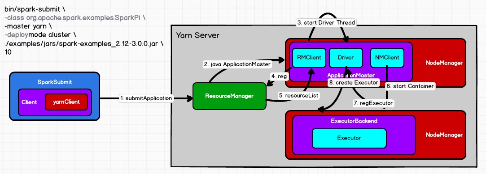{width="5.731242344706912in"
height="0.4739577865266842in"}

> Spark 是一种基于内存的快速、通用、可扩展的大数据分析计算引擎。

## Spark and Hadoop

> 在之前的学习中，Hadoop 的 MapReduce
> 是大家广为熟知的计算框架，那为什么咱们还要学习新的计算框架 Spark
> 呢，这里就不得不提到Spark 和Hadoop 的关系。
>
> 首先从时间节点上来看:

-   Hadoop

    -   2006 年 1 月，Doug Cutting 加入Yahoo，领导Hadoop 的开发

    -   2008 年 1 月，Hadoop 成为 Apache 顶级项目

> ⚫ 2011 年 1.0 正式发布

-   2012 年 3 月稳定版发布

-   2013 年 10 月发布 2.X (Yarn)版本

```{=html}
<!-- -->
```
-   Spark

    -   2009 年，Spark 诞生于伯克利大学的AMPLab 实验室

    -   2010 年，伯克利大学正式开源了 Spark 项目

    -   2013 年 6 月，Spark 成为了 Apache 基金会下的项目

    -   2014 年 2 月，Spark 以飞快的速度成为了 Apache 的顶级项目

    -   2015 年至今，Spark
        变得愈发火爆，大量的国内公司开始重点部署或者使用 Spark

> 然后我们再从功能上来看:

-   Hadoop

    -   Hadoop 是由 java
        语言编写的，在分布式服务器集群上存储海量数据并运行分布式分析应用的开源框架

    -   作为 Hadoop 分布式文件系统，HDFS 处于 Hadoop
        生态圈的最下层，存储着所有的数据， 支持着 Hadoop 的所有服务。
        它的理论基础源于 Google 的TheGoogleFileSystem 这篇论文，它是GFS
        的开源实现。

    -   MapReduce 是一种编程模型，Hadoop 根据 Google 的 MapReduce
        论文将其实现， 作为 Hadoop 的分布式计算模型，是 Hadoop
        的核心。基于这个框架，分布式并行程序的编写变得异常简单。综合了
        HDFS 的分布式存储和 MapReduce 的分布式计算，Hadoop
        在处理海量数据时，性能横向扩展变得非常容易。

    -   HBase 是对 Google 的 Bigtable 的开源实现，但又和 Bigtable
        存在许多不同之处。HBase 是一个基于HDFS
        的分布式数据库，擅长实时地随机读/写超大规模数据集。它也是 Hadoop
        非常重要的组件。

-   Spark

    -   Spark 是一种由 Scala
        语言开发的快速、通用、可扩展的大数据分析引擎

    -   Spark Core 中提供了 Spark 最基础与最核心的功能

    -   Spark SQL 是Spark 用来操作结构化数据的组件。通过 Spark
        SQL，用户可以使用SQL 或者 Apache Hive 版本的 SQL
        方言（HQL）来查询数据。

    -   Spark Streaming 是 Spark
        平台上针对实时数据进行流式计算的组件，提供了丰富的处理数据流的API。

> 由上面的信息可以获知，Spark
> 出现的时间相对较晚，并且主要功能主要是用于数据计算， 所以其实 Spark
> 一直被认为是Hadoop 框架的升级版。

## Spark or Hadoop

> Hadoop 的 MR 框架和Spark
> 框架都是数据处理框架，那么我们在使用时如何选择呢？

-   Hadoop MapReduce
    由于其设计初衷并不是为了满足循环迭代式数据流处理，因此在多并行运行的数据可复用场景（如：机器学习、图挖掘算法、交互式数据挖掘算法）中存在诸多计算效率等问题。所以
    Spark 应运而生，Spark 就是在传统的MapReduce
    计算框架的基础上，利用其计算过程的优化，从而大大加快了数据分析、挖掘的运行和读写速度，并将计算单元缩小到更适合并行计算和重复使用的RDD
    计算模型。

-   机器学习中
    ALS、凸优化梯度下降等。这些都需要基于数据集或者数据集的衍生数据反复查询反复操作。MR
    这种模式不太合适，即使多 MR
    串行处理，性能和时间也是一个问题。数据的共享依赖于磁盘。另外一种是交互式数据挖掘，MR
    显然不擅长。而Spark 所基于的 scala 语言恰恰擅长函数的处理。

-   Spark
    是一个分布式数据快速分析项目。它的核心技术是弹性分布式数据集（Resilient
    Distributed Datasets），提供了比MapReduce
    丰富的模型，可以快速在内存中对数据集进行多次迭代，来支持复杂的数据挖掘算法和图形计算算法。

-   Spark 和Hadoop 的根本差异是多个作业之间的数据通信问题 : Spark
    多个作业之间数据通信是基于内存，而 Hadoop 是基于磁盘。

-   Spark Task 的启动时间快。Spark 采用 fork 线程的方式，而 Hadoop
    采用创建新的进程的方式。

-   Spark 只有在 shuffle 的时候将数据写入磁盘，而 Hadoop 中多个 MR
    作业之间的数据交互都要依赖于磁盘交互

-   Spark 的缓存机制比HDFS 的缓存机制高效。

> 经过上面的比较，我们可以看出在绝大多数的数据计算场景中，Spark 确实会比
> MapReduce 更有优势。但是Spark
> 是基于内存的，所以在实际的生产环境中，由于内存的限制，可能会由于内存资源不够导致
> Job 执行失败，此时，MapReduce 其实是一个更好的选择，所以 Spark
> 并不能完全替代 MR。

## Spark 核心模块

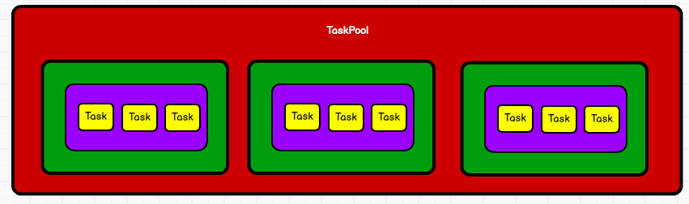{width="5.427083333333333in"
height="2.2395833333333335in"}

#### Spark Core

> Spark Core 中提供了 Spark 最基础与最核心的功能，Spark
> 其他的功能如：Spark SQL， Spark Streaming，GraphX, MLlib 都是在 Spark
> Core 的基础上进行扩展的

#### Spark SQL

> Spark SQL 是Spark 用来操作结构化数据的组件。通过 Spark
> SQL，用户可以使用 SQL
>
> 或者Apache Hive 版本的 SQL 方言（HQL）来查询数据。

#### Spark Streaming

> Spark Streaming 是 Spark
> 平台上针对实时数据进行流式计算的组件，提供了丰富的处理数据流的API。

#### Spark MLlib

> MLlib 是 Spark 提供的一个机器学习算法库。MLlib
> 不仅提供了模型评估、数据导入等额外的功能，还提供了一些更底层的机器学习原语。

#### Spark GraphX

> GraphX 是 Spark 面向图计算提供的框架与算法库。

# 第2章 Spark 快速上手 {#第2章-spark-快速上手 .unnumbered}

> 在大数据早期的课程中我们已经学习了 MapReduce
> 框架的原理及基本使用，并了解了其底层数据处理的实现方式。接下来，就让咱们走进
> Spark 的世界，了解一下它是如何带领我们完成数据处理的。

## 创建 Maven 项目

### 增加 Scala 插件

> 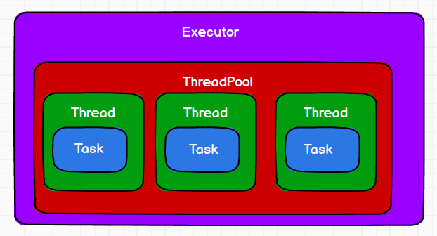{width="2.4208333333333334in"
> height="1.604861111111111in"}Spark 由 Scala
> 语言开发的，所以本课件接下来的开发所使用的语言也为
> Scala，咱们当前使用的 Spark 版本为 3.0.0，默认采用的 Scala 编译版本为
> 2.12，所以后续开发时。我们依然采用这个版本。开发前请保证 IDEA
> 开发工具中含有 Scala 开发插件

### 增加依赖关系

> 修改 Maven 项目中的POM 文件，增加 Spark 框架的依赖关系。本课件基于
> Spark3.0 版本，使用时请注意对应版本。

### WordCount

> 为了能直观地感受 Spark
> 框架的效果，接下来我们实现一个大数据学科中最常见的教学案例WordCount
>
> 执行过程中，会产生大量的执行日志，如果为了能够更好的查看程序的执行结果，可以在项
>
> 目的 resources 目录中创建log4j.properties 文件，并添加日志配置信息：
>
> log4j.rootCategory=ERROR, console

### 异常处理

> 如果本机操作系统是 Windows，在程序中使用了 Hadoop
> 相关的东西，比如写入文件到
>
> HDFS，则会遇到如下异常：

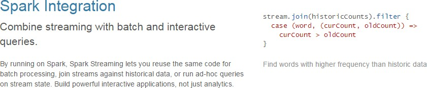

> {width="5.760060148731409in"
> height="0.6302077865266842in"}出现这个问题的原因，并不是程序的错误，而是windows
> 系统用到了 hadoop 相关的服务，解决办法是通过配置关联到 windows
> 的系统依赖就可以了
>
> 在 IDEA 中配置Run Configuration，添加HADOOP_HOME 变量

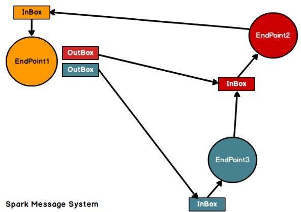{width="5.726536526684164in"
height="0.9817705599300087in"}

> 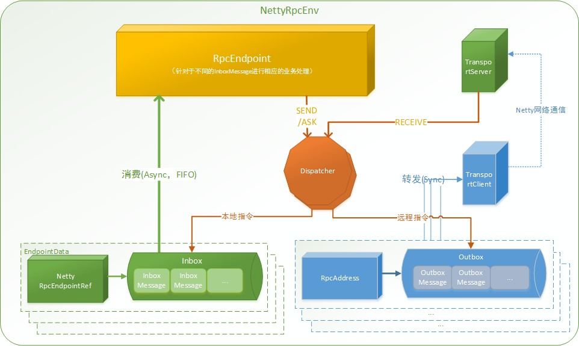{width="5.614017935258093in"
> height="3.8475in"}

# 第3章 Spark 运行环境 {#第3章-spark-运行环境 .unnumbered}

> Spark
> 作为一个数据处理框架和计算引擎，被设计在所有常见的集群环境中运行,
> 在国内工作中主流的环境为Yarn，不过逐渐容器式环境也慢慢流行起来。接下来，我们就分别看看不同环境下Spark
> 的运行
>
> 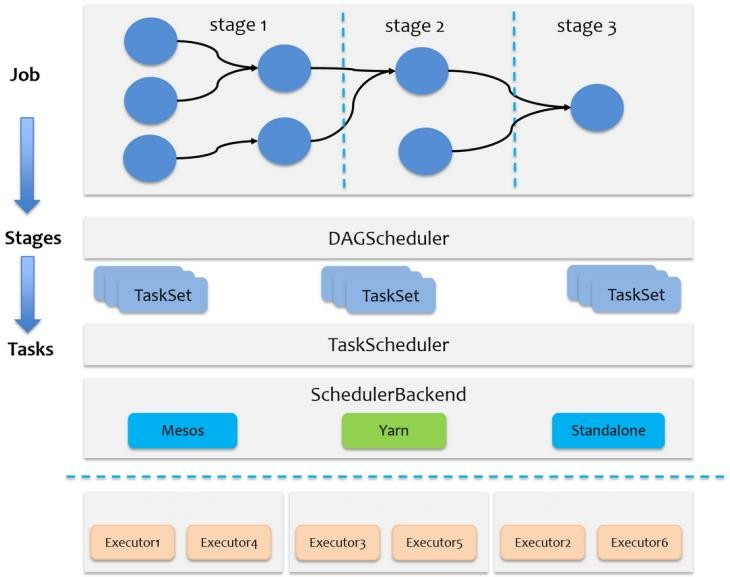{width="3.2720603674540683in"
> height="2.2108333333333334in"}

## Local 模式

> 想啥呢，你之前一直在使用的模式可不是 Local 模式哟。所谓的Local
> 模式，就是不需要其他任何节点资源就可以在本地执行 Spark
> 代码的环境，一般用于教学，调试，演示等， 之前在 IDEA
> 中运行代码的环境我们称之为开发环境，不太一样。

### 解压缩文件

> 将 spark-3.0.0-bin-hadoop3.2.tgz 文件上传到Linux
> 并解压缩，放置在指定位置，路径中不要包含中文或空格，课件后续如果涉及到解压缩操作，不再强调。

### 启动 Local 环境

1)  进入解压缩后的路径，执行如下指令

> 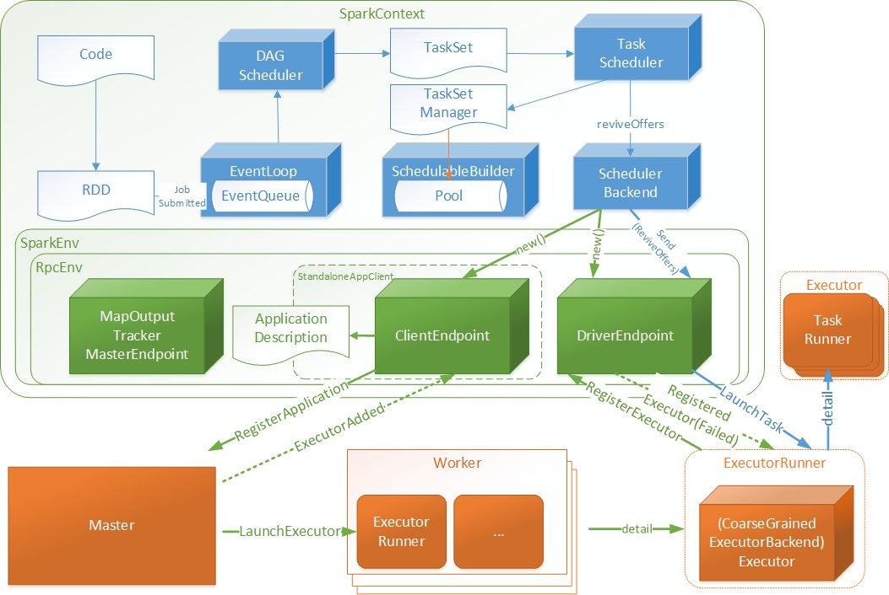{width="5.758833114610674in"
> height="1.405in"}bin/spark-shell

2)  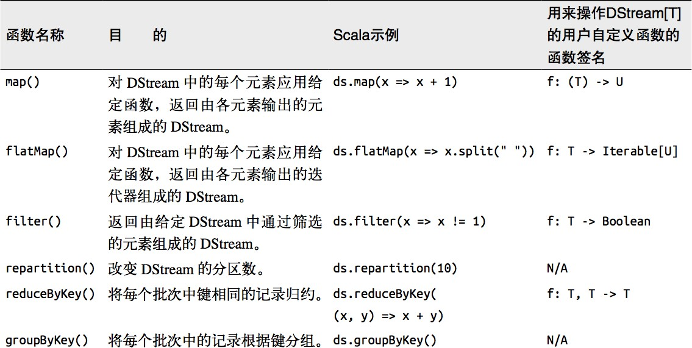启动成功后，可以输入网址进行 Web UI
    监控页面访问

### 命令行工具

> 在解压缩文件夹下的 data 目录中，添加 word.txt
> 文件。在命令行工具中执行如下代码指令（和 IDEA 中代码简化版一致）

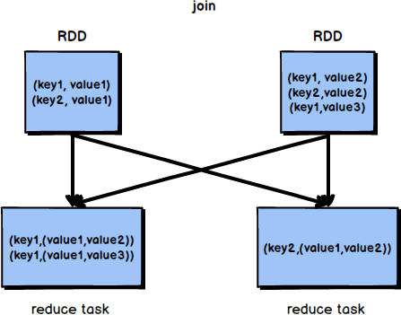{width="5.755534776902887in"
height="0.287082239720035in"}

### 退出本地模式

> 按键Ctrl+C 或输入 Scala 指令
>
> :quit

### 提交应用

1)  \--class 表示要执行程序的主类，此处可以更换为咱们自己写的应用程序

2)  \--master local\[2\] 部署模式，默认为本地模式，数字表示分配的虚拟CPU
    核数量

3)  spark-examples_2.12-3.0.0.jar 运行的应用类所在的 jar
    包，实际使用时，可以设定为咱们自己打的 jar 包

4)  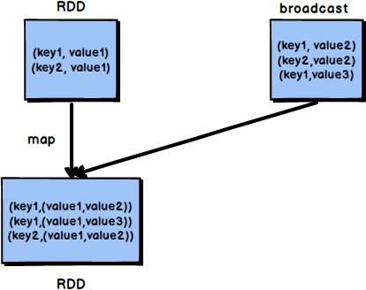{width="5.628500656167979in"
    height="1.845832239720035in"}数字 10
    表示程序的入口参数，用于设定当前应用的任务数量

## Standalone 模式

> local
> 本地模式毕竟只是用来进行练习演示的，真实工作中还是要将应用提交到对应的集群中去执行，这里我们来看看只使用
> Spark
> 自身节点运行的集群模式，也就是我们所谓的独立部署（Standalone）模式。Spark
> 的 Standalone 模式体现了经典的master-slave 模式。集群规划:

### 解压缩文件

> 将 spark-3.0.0-bin-hadoop3.2.tgz 文件上传到Linux 并解压缩在指定位置

### 修改配置文件

1)  进入解压缩后路径的 conf 目录，修改 slaves.template 文件名为 slaves

> mv slaves.template slaves

2)  修改 slaves 文件，添加work 节点

3)  修改 spark-env.sh.template 文件名为 spark-env.sh

> mv spark-env.sh.template spark-env.sh

4)  修改 spark-env.sh 文件，添加 JAVA_HOME 环境变量和集群对应的 master
    节点

> 注意：7077 端口，相当于 hadoop3 内部通信的 8020
> 端口，此处的端口需要确认自己的 Hadoop
>
> 配置

5)  分发 spark-standalone 目录

> xsync spark-standalone

### 启动集群

1)  执行脚本命令：

> sbin/start-all.sh
>
> {width="5.748997156605425in"
> height="0.9609372265966755in"}

2)  查看三台服务器运行进程

3)  查看 Master 资源监控Web UI 界面: [http://linux1:8080]{.underline}

> 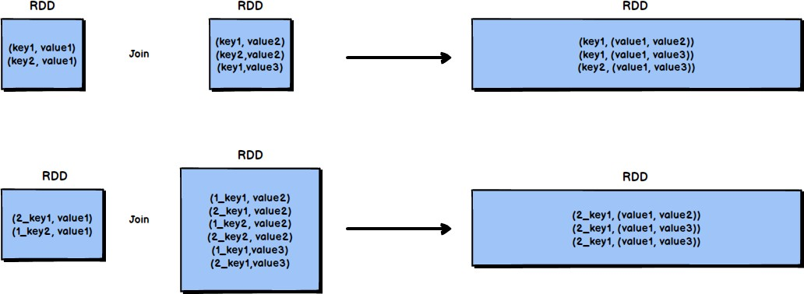

### 提交应用

1)  \--class 表示要执行程序的主类

2)  \--master spark://linux1:7077 独立部署模式，连接到Spark 集群

3)  spark-examples_2.12-3.0.0.jar 运行类所在的 jar 包

4)  数字 10 表示程序的入口参数，用于设定当前应用的任务数量

> 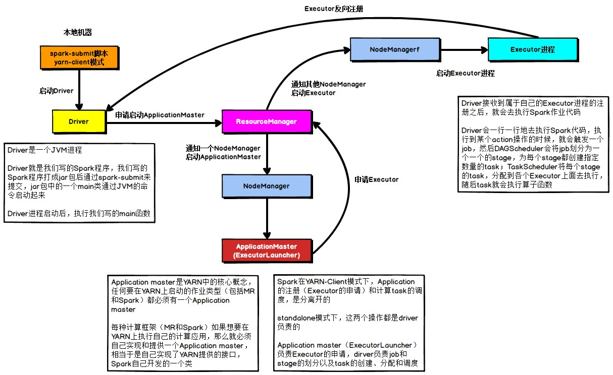{width="5.727754811898513in"
> height="2.003020559930009in"}
>
> 执行任务时，会产生多个 Java 进程

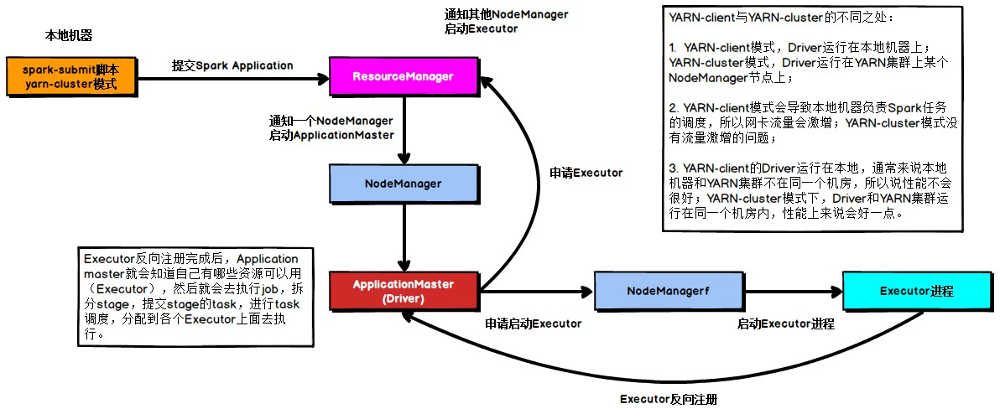{width="5.709777996500438in"
height="1.3794783464566929in"}

> 执行任务时，默认采用服务器集群节点的总核数，每个节点内存 1024M。

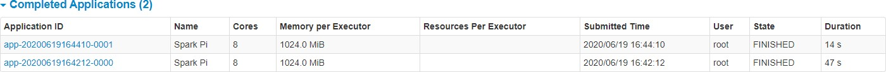{width="5.689511154855643in"
height="0.46718722659667544in"}

### 提交参数说明

> 在提交应用中，一般会同时一些提交参数

+-----------------+-----------------------+----------------------------+
| 参数            | 解释                  | 可选值举例                 |
+=================+=======================+============================+
| \--class        | Spark                 |                            |
|                 | 程序中包含主函数的类  |                            |
+-----------------+-----------------------+----------------------------+
| \--master       | Spark                 | 模式：local\[\             |
|                 | 程序运行的模式(环境)  | *\]、spark://linux1:7077、 |
|                 |                       |                            |
|                 |                       | Yarn                       |
+-----------------+-----------------------+----------------------------+
| \--             | 指定每个 executor     | 符合集群内存配             |
| executor-memory | 可用内存为 1G         | 置即可，具体情况具体分析。 |
| 1G              |                       |                            |
+-----------------+-----------------------+----------------------------+
| \--total        | 指定所有executor      |                            |
| -executor-cores | 使用的cpu 核数        |                            |
| 2               |                       |                            |
|                 | 为 2 个               |                            |
+-----------------+-----------------------+----------------------------+
| \-              | 指定每个executor      |                            |
| -executor-cores | 使用的cpu 核数        |                            |
+-----------------+-----------------------+----------------------------+
| application-jar | 打包好的应用          |                            |
|                 | jar，包含依赖。这     |                            |
|                 |                       |                            |
|                 | 个 URL                |                            |
|                 | 在集群中全局可见。    |                            |
|                 | 比如 hdfs://          |                            |
|                 | 共享存储系统，如果是  |                            |
+-----------------+-----------------------+----------------------------+

+-----------------+-----------------------+----------------------------+
|                 | file:// path，        |                            |
|                 | 那么所有的节点的      |                            |
|                 |                       |                            |
|                 | path 都包含同样的 jar |                            |
+=================+=======================+============================+
| applic          | 传给 main()方法的参数 |                            |
| ation-arguments |                       |                            |
+-----------------+-----------------------+----------------------------+

### 配置历史服务

> 由于 spark-shell 停止掉后，集群监控 linux1:4040
> 页面就看不到历史任务的运行情况，所以开发时都配置历史服务器记录任务运行情况。

1)  修改 spark-defaults.conf.template 文件名为 spark-defaults.conf

2)  修改 spark-default.conf 文件，配置日志存储路径

> 注意：需要启动 hadoop 集群，HDFS 上的directory 目录需要提前存在。

3)  修改 spark-env.sh 文件, 添加日志配置

-   参数 1 含义：WEB UI 访问的端口号为 18080

-   参数 2 含义：指定历史服务器日志存储路径

-   参数 3 含义：指定保存Application
    历史记录的个数，如果超过这个值，旧的应用程序信息将被删除，这个是内存中的应用数，而不是页面上显示的应用数。

4)  分发配置文件

5)  重新启动集群和历史服务

6)  重新执行任务

7)  {width="5.761805555555555in"
    height="1.9236111111111112in"}查看历史服务：http://linux1:18080

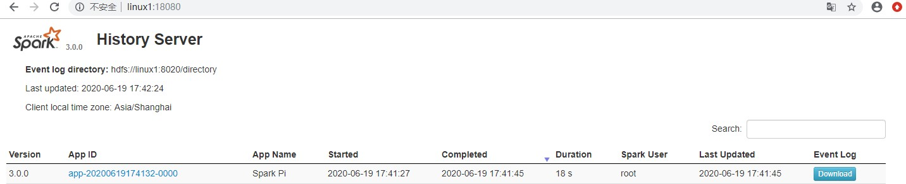

### 配置高可用（ HA）

> 所谓的高可用是因为当前集群中的 Master
> 节点只有一个，所以会存在单点故障问题。所以为了解决单点故障问题，需要在集群中配置多个
> Master 节点，一旦处于活动状态的 Master 发生故障时，由备用 Master
> 提供服务，保证作业可以继续执行。这里的高可用一般采用Zookeeper 设置

#### 集群规划: {#集群规划 .unnumbered}

+-----------+-------------------+-------------------+-----------------+
|           | > Linux1          | > Linux2          | > Linux3        |
+===========+===================+===================+=================+
| Spark     | > Master          | > Master          | > Zookeeper     |
|           | > Zookeeper       | > Zookeeper       | > Worker        |
|           | >                 | >                 |                 |
|           | > Worker          | > Worker          |                 |
+-----------+-------------------+-------------------+-----------------+

1)  停止集群

> sbin/stop-all.sh

2)  启动Zookeeper

> xstart zk

3)  修改 spark-env.sh 文件添加如下配置

4)  分发配置文件

> xsync conf/

5)  启动集群

> sbin/start-all.sh

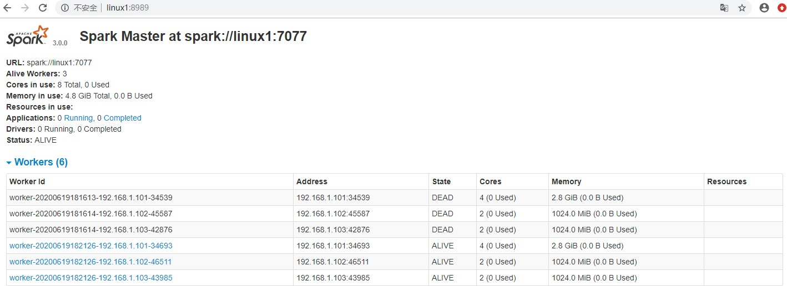

6)  启动 linux2 的单独 Master 节点，此时 linux2 节点 Master
    状态处于备用状态

> \[root@linux2 spark-standalone\]# sbin/start-master.sh

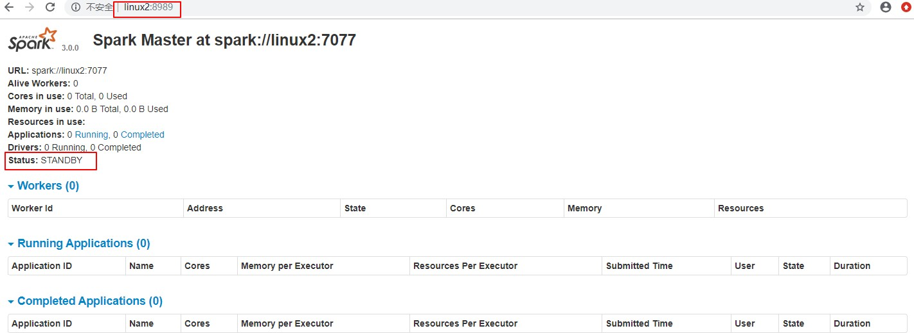{width="5.775803805774278in" height="2.1125in"}

7)  提交应用到高可用集群

8)  停止 linux1 的 Master 资源监控进程

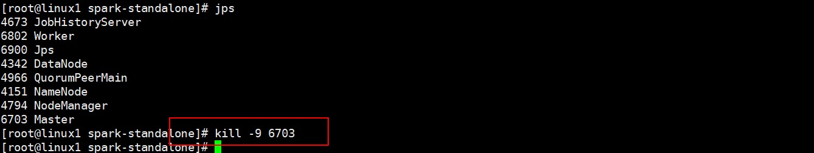{width="5.719795494313211in"
height="1.0805205599300087in"}

9)  {width="5.759722222222222in"
    height="2.4856517935258093in"}查看 linux2 的 Master 资源监控Web
    UI，稍等一段时间后，linux2 节点的 Master 状态提升为活动状态

## Yarn 模式

> 独立部署（Standalone）模式由 Spark
> 自身提供计算资源，无需其他框架提供资源。这种方式降低了和其他第三方资源框架的耦合性，独立性非常强。但是你也要记住，Spark
> 主要是计算框架，而不是资源调度框架，所以本身提供的资源调度并不是它的强项，所以还是和其他专业的资源调度框架集成会更靠谱一些。所以接下来我们来学习在强大的Yarn
> 环境下 Spark 是如何工作的（其实是因为在国内工作中，Yarn
> 使用的非常多）。

### 解压缩文件

> 将 spark-3.0.0-bin-hadoop3.2.tgz 文件上传到 linux
> 并解压缩，放置在指定位置。

### 修改配置文件

1)  修改 hadoop 配置文件/opt/module/hadoop/etc/hadoop/yarn-site.xml,
    并分发

2)  修改 conf/spark-env.sh，添加 JAVA_HOME 和YARN_CONF_DIR 配置

### 启动 HDFS 以及 YARN 集群

> 瞅啥呢，自己启动去！

### 提交应用

> 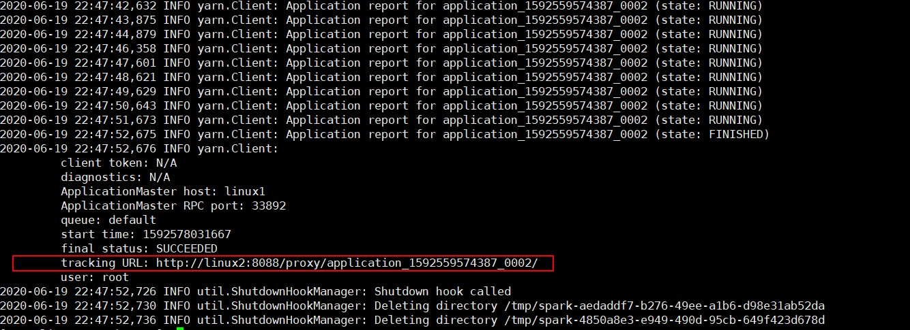{width="5.697424540682415in"
> height="2.071353893263342in"}
>
> 查看 http://linux2:8088 页面，点击History，查看历史页面

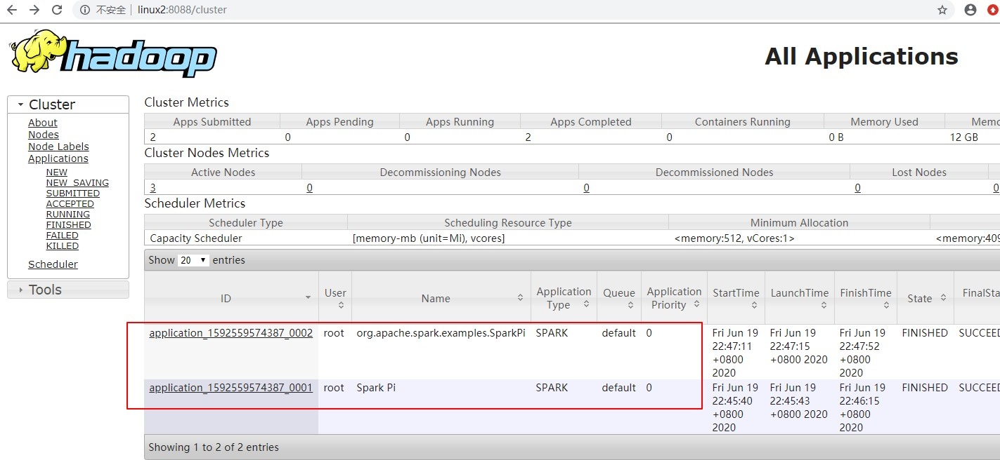{width="5.631973972003499in"
height="2.5966666666666667in"}

> 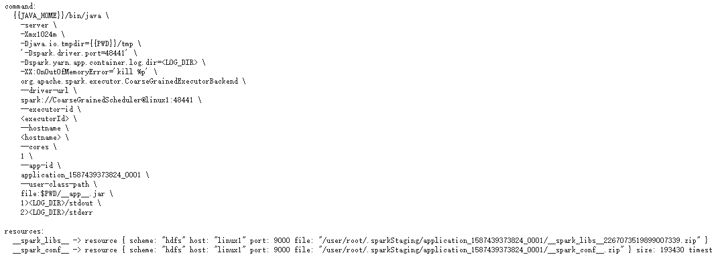

### 配置历史服务器

1)  修改 spark-defaults.conf.template 文件名为 spark-defaults.conf

2)  修改 spark-default.conf 文件，配置日志存储路径

> 注意：需要启动 hadoop 集群，HDFS 上的目录需要提前存在。

3)  修改 spark-env.sh 文件, 添加日志配置

-   参数 1 含义：WEB UI 访问的端口号为 18080

-   参数 2 含义：指定历史服务器日志存储路径

-   参数 3 含义：指定保存Application
    历史记录的个数，如果超过这个值，旧的应用程序信息将被删除，这个是内存中的应用数，而不是页面上显示的应用数。

4)  修改 spark-defaults.conf

5)  启动历史服务

6)  重新提交应用

> 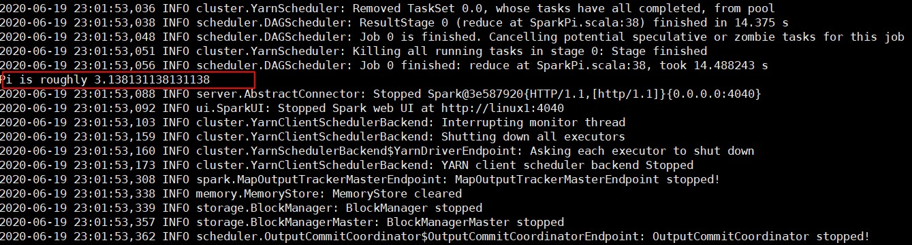{width="5.7195833333333335in"
> height="1.5417705599300087in"}

7)  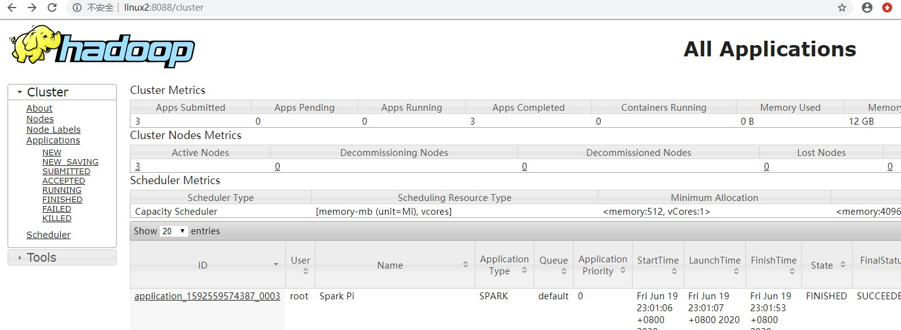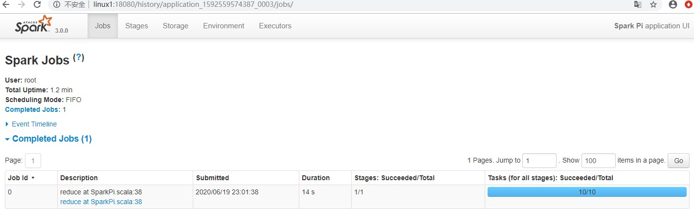Web
    页面查看日志：http://linux2:8088

## K8S & Mesos 模式

> Mesos 是Apache
> 下的开源分布式资源管理框架，它被称为是分布式系统的内核,在Twitter
> 得到广泛使用,管理着 Twitter 超过 30,0000
> 台服务器上的应用部署，但是在国内，依然使用着传统的Hadoop
> 大数据框架，所以国内使用 Mesos
> 框架的并不多，但是原理其实都差不多，这里我们就不做过多讲解了。
>
> 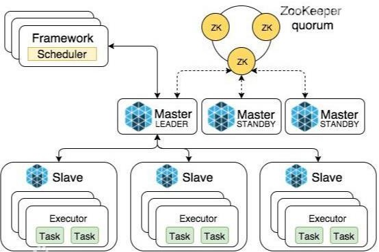{width="2.8854472878390203in"
> height="1.921874453193351in"}
>
> 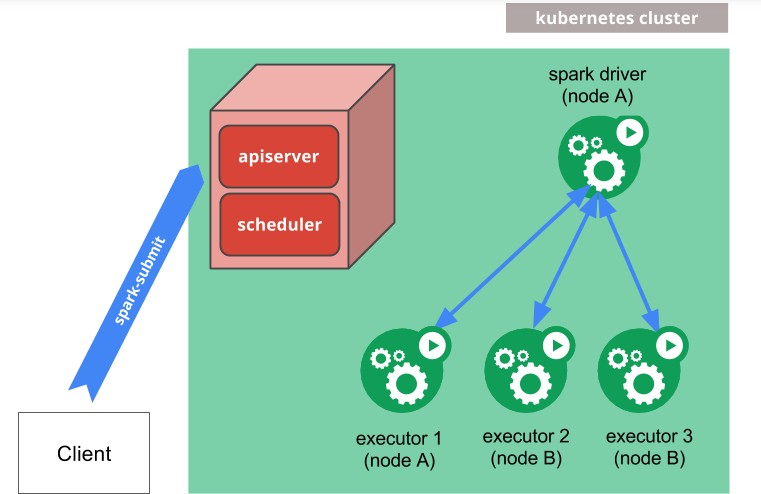容器化部署是目前业界很流行的一项技术，基于Docker
> 镜像运行能够让用户更加方便地对应用进行管理和运维。容器管理工具中最为流行的就是Kubernetes（k8s），而
> Spark 也在最近的版本中支持了k8s
> 部署模式。这里我们也不做过多的讲解。给个链接大家自己感受一下：https://spark.apache.org/docs/latest/running-on-kubernetes.html

## Windows 模式

> {width="0.2000262467191601in"
> height="0.24291666666666667in"}在同学们自己学习时，每次都需要启动虚拟机，启动集群，这是一个比较繁琐的过程，
> 并且会占大量的系统资源，导致系统执行变慢，不仅仅影响学习效果，也影响学习进度，
> Spark 非常暖心地提供了可以在windows
> 系统下启动本地集群的方式，这样，在不使用虚拟机的情况下，也能学习 Spark
> 的基本使用，摸摸哒！
>
> 在后续的教学中，为了能够给同学们更加流畅的教学效果和教学体验，我们一般情况下都会采用windows
> 系统的集群来学习 Spark。

### 解压缩文件

> 将文件 spark-3.0.0-bin-hadoop3.2.tgz 解压缩到无中文无空格的路径中

### 启动本地环境

1)  执行解压缩文件路径下 bin 目录中的 spark-shell.cmd 文件，启动 Spark
    本地环境

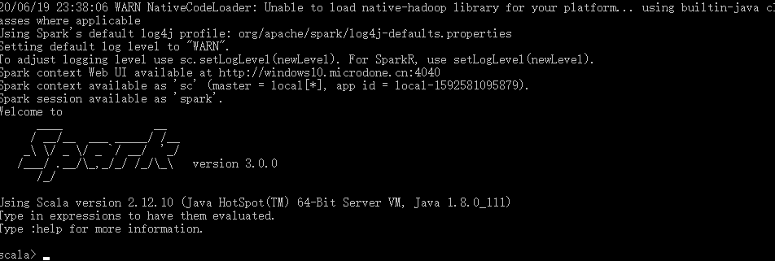{width="5.750891294838145in"
height="1.9393744531933508in"}

2)  在 bin 目录中创建 input 目录，并添加word.txt 文件,
    在命令行中输入脚本代码

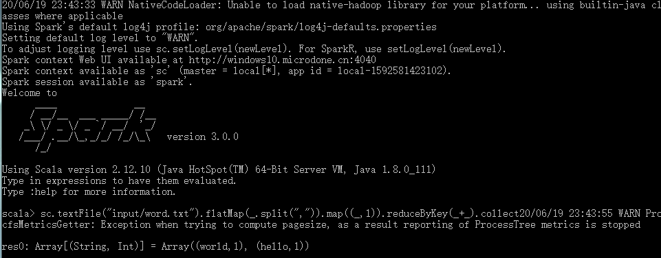{width="5.805369641294838in"
height="2.2716666666666665in"}

### 命令行提交应用

> 在 DOS 命令行窗口中执行提交指令
>
> 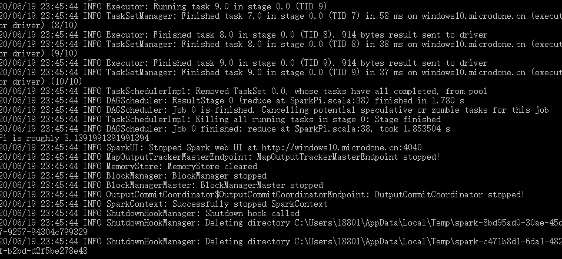{width="5.6703182414698166in"
> height="2.6184372265966753in"}

## 部署模式对比

+-----------+-----------------+--------------+-----------+-----------+
| > 模式    | > Spark         | >            | > 所属者  | >         |
|           | > 安装机器数    | 需启动的进程 |           |  应用场景 |
+===========+=================+==============+===========+===========+
| > Local   | 1               | 无           | > Spark   | > 测试    |
+-----------+-----------------+--------------+-----------+-----------+
| > S       | 3               | > Master 及  | > Spark   | >         |
| tandalone |                 | > Worker     |           |  单独部署 |
+-----------+-----------------+--------------+-----------+-----------+
| > Yarn    | 1               | > Yarn 及    | > Hadoop  | >         |
|           |                 | > HDFS       |           |  混合部署 |
+-----------+-----------------+--------------+-----------+-----------+

1.  **端口号**

-   Spark 查看当前 Spark-shell 运行任务情况端口号：4040（计算）

-   Spark Master 内部通信服务端口号：7077

-   Standalone 模式下，Spark Master Web 端口号：8080（资源）

-   Spark 历史服务器端口号：18080

-   Hadoop YARN 任务运行情况查看端口号：8088

# 第4章 Spark 运行架构 {#第4章-spark-运行架构 .unnumbered}

## 运行架构

> Spark 框架的核心是一个计算引擎，整体来说，它采用了标准 master-slave
> 的结构。如下图所示，它展示了一个 Spark
> 执行时的基本结构。图形中的Driver 表示 master，
>
> 负责管理整个集群中的作业任务调度。图形中的Executor 则是
> slave，负责实际执行任务。

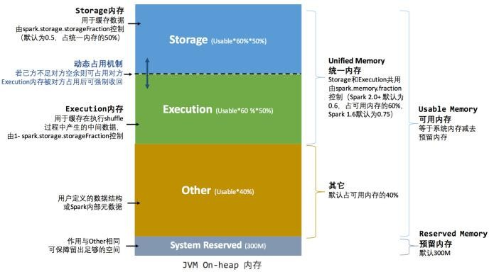{width="3.5199846894138234in" height="1.65in"}

## 核心组件

> 由上图可以看出，对于 Spark 框架有两个核心组件：

### Driver

> Spark 驱动器节点，用于执行 Spark 任务中的 main
> 方法，负责实际代码的执行工作。
>
> Driver 在Spark 作业执行时主要负责：

-   将用户程序转化为作业（job）

-   在 Executor 之间调度任务(task)

-   跟踪Executor 的执行情况

-   通过UI 展示查询运行情况

> 实际上，我们无法准确地描述Driver
> 的定义，因为在整个的编程过程中没有看到任何有关Driver
> 的字眼。所以简单理解，所谓的 Driver
> 就是驱使整个应用运行起来的程序，也称之为Driver 类。

### Executor

> Spark Executor 是集群中工作节点（Worker）中的一个 JVM 进程，负责在
> Spark 作业中运行具体任务（Task），任务彼此之间相互独立。Spark
> 应用启动时，Executor 节点被同
>
> 时启动，并且始终伴随着整个 Spark 应用的生命周期而存在。如果有Executor
> 节点发生了故障或崩溃，Spark
> 应用也可以继续执行，会将出错节点上的任务调度到其他 Executor
> 节点上继续运行。
>
> Executor 有两个核心功能：

-   负责运行组成 Spark 应用的任务，并将结果返回给驱动器进程

-   它们通过自身的块管理器（Block Manager）为用户程序中要求缓存的 RDD
    提供内存式存储。RDD 是直接缓存在 Executor
    进程内的，因此任务可以在运行时充分利用缓存数据加速运算。

### Master & Worker

> Spark
> 集群的独立部署环境中，不需要依赖其他的资源调度框架，自身就实现了资源调度的功能，所以环境中还有其他两个核心组件：Master
> 和 Worker，这里的 Master
> 是一个进程，主要负责资源的调度和分配，并进行集群的监控等职责，类似于
> Yarn 环境中的 RM, 而Worker 呢，也是进程，一个 Worker
> 运行在集群中的一台服务器上，由 Master
> 分配资源对数据进行并行的处理和计算，类似于 Yarn 环境中 NM。

### ApplicationMaster

> Hadoop 用户向 YARN
> 集群提交应用程序时,提交程序中应该包含ApplicationMaster，用于向资源调度器申请执行任务的资源容器
> Container，运行用户自己的程序任务
> job，监控整个任务的执行，跟踪整个任务的状态，处理任务失败等异常情况。
>
> 说的简单点就是，ResourceManager（资源）和Driver（计算）之间的解耦合靠的就是ApplicationMaster。

## 核心概念

### Executor 与 Core

> Spark Executor 是集群中运行在工作节点（Worker）中的一个 JVM
> 进程，是整个集群中的专门用于计算的节点。在提交应用中，可以提供参数指定计算节点的个数，以及对应的资源。这里的资源一般指的是工作节点
> Executor 的内存大小和使用的虚拟 CPU 核（Core）数量。
>
> 应用程序相关启动参数如下：

+----------------------------------+-----------------------------------+
| > 名称                           | > 说明                            |
+==================================+===================================+
| > \--num-executors               | 配置 Executor 的数量              |
+----------------------------------+-----------------------------------+
| > \--executor-memory             | 配置每个 Executor 的内存大小      |
+----------------------------------+-----------------------------------+
| > \--executor-cores              | 配置每个 Executor 的虚拟 CPU core |
|                                  | 数量                              |
+----------------------------------+-----------------------------------+

1.  **并行度（** Parallelism**）**

> 在分布式计算框架中一般都是多个任务同时执行，由于任务分布在不同的计算节点进行计算，所以能够真正地实现多任务并行执行，记住，这里是并行，而不是并发。这里我们将整个集群并行执行任务的数量称之为并行度。那么一个作业到底并行度是多少呢？这个取决于框架的默认配置。应用程序也可以在运行过程中动态修改。

2.  **有向无环图（** DAG**）**

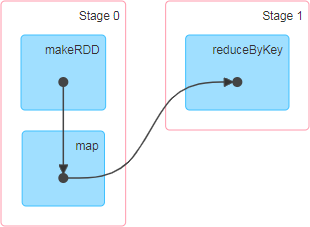{width="2.3543733595800527in"
height="1.7261450131233596in"}

> 大数据计算引擎框架我们根据使用方式的不同一般会分为四类，其中第一类就是Hadoop
> 所承载的 MapReduce,它将计算分为两个阶段，分别为 Map 阶段 和 Reduce
> 阶段。对于上层应用来说，就不得不想方设法去拆分算法，甚至于不得不在上层应用实现多个
> Job 的串联，以完成一个完整的算法，例如迭代计算。
> 由于这样的弊端，催生了支持 DAG 框架的产生。因此，支持 DAG
> 的框架被划分为第二代计算引擎。如 Tez
> 以及更上层的Oozie。这里我们不去细究各种 DAG
> 实现之间的区别，不过对于当时的 Tez 和 Oozie
> 来说，大多还是批处理的任务。接下来就是以 Spark
> 为代表的第三代的计算引擎。第三代计算引擎的特点主要是 Job 内部的 DAG
> 支持（不跨越 Job），以及实时计算。
>
> 这里所谓的有向无环图，并不是真正意义的图形，而是由 Spark
> 程序直接映射成的数据流的高级抽象模型。简单理解就是将整个程序计算的执行过程用图形表示出来,这样更直观，
> 更便于理解，可以用于表示程序的拓扑结构。
>
> DAG（Directed Acyclic
> Graph）有向无环图是由点和线组成的拓扑图形，该图形具有方向，不会闭环。

## 提交流程

> 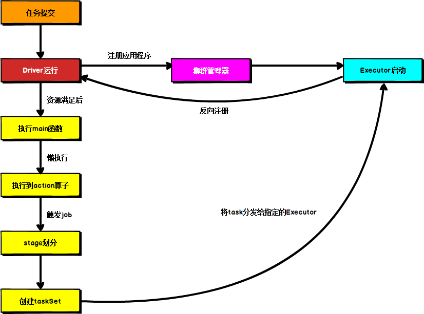{width="4.043707349081365in"
> height="3.0011450131233595in"}所谓的提交流程，其实就是我们开发人员根据需求写的应用程序通过
> Spark 客户端提交给 Spark
> 运行环境执行计算的流程。在不同的部署环境中，这个提交过程基本相同，但是又有细微的区别，我们这里不进行详细的比较，但是因为国内工作中，将
> Spark 引用部署到Yarn 环境中会更多一些，所以本课程中的提交流程是基于
> Yarn 环境的。
>
> Spark 应用程序提交到 Yarn
> 环境中执行的时候，一般会有两种部署执行的方式：Client 和
> Cluster。两种模式主要区别在于：Driver 程序的运行节点位置。

### Yarn Client 模式

> Client 模式将用于监控和调度的Driver 模块在客户端执行，而不是在 Yarn
> 中，所以一般用于测试。

-   Driver 在任务提交的本地机器上运行

-   Driver 启动后会和ResourceManager 通讯申请启动ApplicationMaster

-   ResourceManager 分配 container，在合适的NodeManager
    上启动ApplicationMaster，负责向ResourceManager 申请 Executor 内存

-   ResourceManager 接到 ApplicationMaster 的资源申请后会分配
    container，然后

> ApplicationMaster 在资源分配指定的NodeManager 上启动 Executor 进程

-   Executor 进程启动后会向Driver 反向注册，Executor
    全部注册完成后Driver 开始执行

> main 函数

-   之后执行到 Action 算子时，触发一个 Job，并根据宽依赖开始划分
    stage，每个stage 生成对应的TaskSet，之后将 task 分发到各个Executor
    上执行。

    1.  **Yarn Cluster 模式**

> Cluster 模式将用于监控和调度的 Driver 模块启动在Yarn
> 集群资源中执行。一般应用于实际生产环境。

-   在 YARN Cluster 模式下，任务提交后会和ResourceManager 通讯申请启动

> ApplicationMaster，

-   随后ResourceManager 分配 container，在合适的 NodeManager 上启动
    ApplicationMaster，此时的 ApplicationMaster 就是Driver。

-   Driver 启动后向 ResourceManager 申请Executor 内存，ResourceManager
    接到ApplicationMaster
    的资源申请后会分配container，然后在合适的NodeManager 上启动Executor
    进程

-   Executor 进程启动后会向Driver 反向注册，Executor
    全部注册完成后Driver 开始执行

> main 函数，

-   之后执行到 Action 算子时，触发一个 Job，并根据宽依赖开始划分
    stage，每个stage 生成对应的TaskSet，之后将 task 分发到各个Executor
    上执行。

# 第5章 Spark 核心编程 {#第5章-spark-核心编程 .unnumbered}

> Spark
> 计算框架为了能够进行高并发和高吞吐的数据处理，封装了三大数据结构，用于处理不同的应用场景。三大数据结构分别是：

-   RDD : 弹性分布式数据集

-   累加器：分布式共享只写变量

-   广播变量：分布式共享只读变量

> 接下来我们一起看看这三大数据结构是如何在数据处理中使用的。

## RDD

### 什么是 RDD

> RDD（Resilient Distributed Dataset）叫做弹性分布式数据集，是 Spark
> 中最基本的数据处理模型。代码中是一个抽象类，它代表一个弹性的、不可变、可分区、里面的元素可并行计算的集合。

-   弹性

    -   存储的弹性：内存与磁盘的自动切换；

    -   容错的弹性：数据丢失可以自动恢复；

    -   计算的弹性：计算出错重试机制；

    -   分片的弹性：可根据需要重新分片。

-   分布式：数据存储在大数据集群不同节点上

-   数据集：RDD 封装了计算逻辑，并不保存数据

-   数据抽象：RDD 是一个抽象类，需要子类具体实现

-   不可变：RDD
    封装了计算逻辑，是不可以改变的，想要改变，只能产生新的RDD，在新的RDD
    里面封装计算逻辑

-   可分区、并行计算

### 核心属性

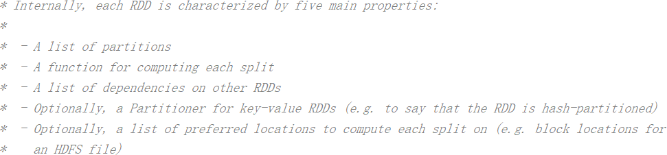

-   分区列表

> 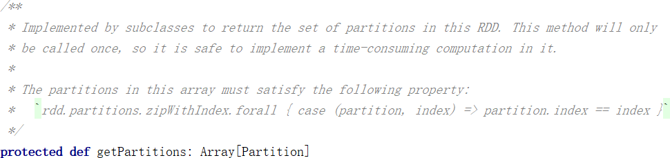RDD
> 数据结构中存在分区列表，用于执行任务时并行计算，是实现分布式计算的重要属性。

-   分区计算函数

> Spark 在计算时，是使用分区函数对每一个分区进行计算

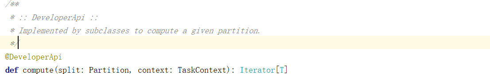

-   RDD 之间的依赖关系

> 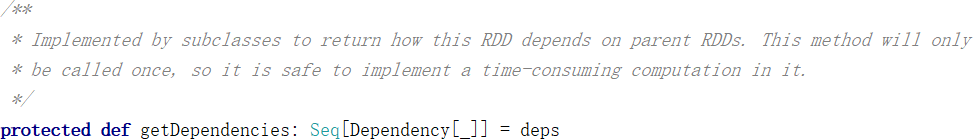RDD
> 是计算模型的封装，当需求中需要将多个计算模型进行组合时，就需要将多个
> RDD 建立依赖关系

-   分区器（可选）

> 当数据为 KV 类型数据时，可以通过设定分区器自定义数据的分区

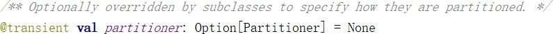

-   首选位置（可选）

> 计算数据时，可以根据计算节点的状态选择不同的节点位置进行计算

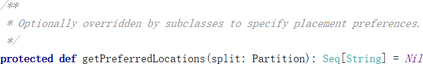

### 执行原理

> 从计算的角度来讲，数据处理过程中需要计算资源（内存 &
> CPU）和计算模型（逻辑）。执行时，需要将计算资源和计算模型进行协调和整合。
>
> Spark
> 框架在执行时，先申请资源，然后将应用程序的数据处理逻辑分解成一个一个的计算任务。然后将任务发到已经分配资源的计算节点上,
> 按照指定的计算模型进行数据计算。最后得到计算结果。
>
> RDD 是 Spark 框架中用于数据处理的核心模型，接下来我们看看，在 Yarn
> 环境中，RDD 的工作原理:

1)  启动 Yarn 集群环境

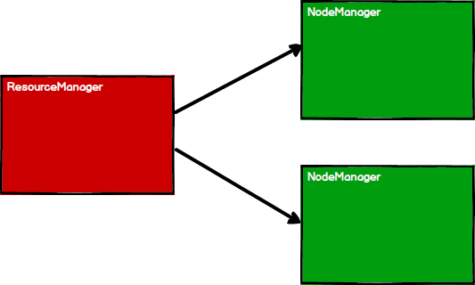{width="3.1088582677165353in"
height="1.8666666666666667in"}

2)  Spark 通过申请资源创建调度节点和计算节点

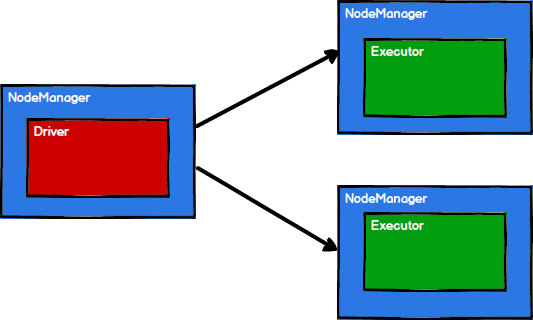{width="3.219783464566929in"
height="1.933332239720035in"}

3)  Spark 框架根据需求将计算逻辑根据分区划分成不同的任务

> 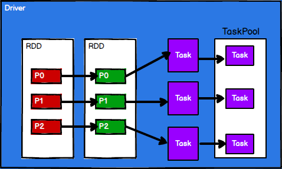{width="3.136933508311461in"
> height="1.8834372265966755in"}

4)  调度节点将任务根据计算节点状态发送到对应的计算节点进行计算

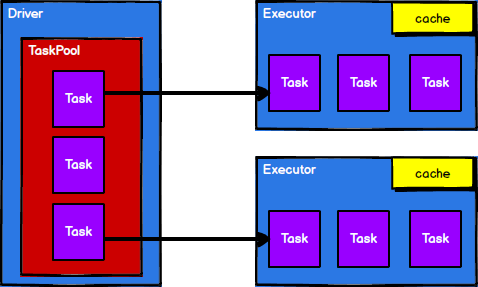{width="3.0372779965004373in"
height="1.8236450131233595in"}

> 从以上流程可以看出 RDD 在整个流程中主要用于将逻辑进行封装，并生成 Task
> 发送给Executor 节点执行计算，接下来我们就一起看看 Spark 框架中RDD
> 是具体是如何进行数据处理的。

### 基础编程

1.  **RDD 创建**

> 在 Spark 中创建RDD 的创建方式可以分为四种：

#### 从集合（内存）中创建 RDD

> 从集合中创建RDD，[Spark](https://www.iteblog.com/archives/tag/spark/)
> 主要提供了两个方法：parallelize 和 makeRDD
>
> 从底层代码实现来讲，makeRDD 方法其实就是parallelize 方法

#### 从外部存储（文件）创建RDD

> 由外部存储系统的数据集创建RDD 包括：本地的文件系统，所有Hadoop
> 支持的数据集， 比如HDFS、HBase 等。

#### 从其他 RDD 创建

> 主要是通过一个RDD 运算完后，再产生新的RDD。详情请参考后续章节

#### 直接创建 RDD（new）

> 使用 new 的方式直接构造RDD，一般由Spark 框架自身使用。

### RDD 并行度与分区

> 默认情况下，Spark 可以将一个作业切分多个任务后，发送给 Executor
> 节点并行计算，而能够并行计算的任务数量我们称之为并行度。这个数量可以在构建RDD
> 时指定。记住，这里的并行执行的任务数量，并不是指的切分任务的数量，不要混淆了。

-   读取内存数据时，数据可以按照并行度的设定进行数据的分区操作，数据分区规则的

> Spark 核心源码如下：
>
> }

-   读取文件数据时，数据是按照Hadoop
    文件读取的规则进行切片分区，而切片规则和数据读取的规则有些差异，具体
    Spark 核心源码如下

### RDD 转换算子

> RDD 根据数据处理方式的不同将算子整体上分为Value 类型、双 Value
> 类型和Key-Value
>
> 类型

-   **Value 类型**

1)  **map**

-   函数签名

> def map\[U: ClassTag\](f: T =\> U): RDD\[U\]

-   函数说明

> 将处理的数据逐条进行映射转换，这里的转换可以是类型的转换，也可以是值的转换。

-   小功能：从服务器日志数据 apache.log 中获取用户请求URL 资源路径

#### mapPartitions

-   函数签名

> def mapPartitions\[U: ClassTag\]( f: Iterator\[T\] =\> Iterator\[U\],
>
> preservesPartitioning: Boolean = false): RDD\[U\]

-   函数说明

> 将待处理的数据以分区为单位发送到计算节点进行处理，这里的处理是指可以进行任意的处理，哪怕是过滤数据。

-   小功能：获取每个数据分区的最大值

> {width="0.2092082239720035in"
> height="0.23663167104111987in"} 思考一个问题：map 和 mapPartitions
> 的区别？

-   数据处理角度

> Map 算子是分区内一个数据一个数据的执行，类似于串行操作。而
> mapPartitions 算子是以分区为单位进行批处理操作。

-   功能的角度

> Map
> 算子主要目的将数据源中的数据进行转换和改变。但是不会减少或增多数据。MapPartitions
> 算子需要传递一个迭代器，返回一个迭代器，没有要求的元素的个数保持不变，
> 所以可以增加或减少数据

-   性能的角度

> Map 算子因为类似于串行操作，所以性能比较低，而是 mapPartitions
> 算子类似于批处
>
> 理，所以性能较高。但是mapPartitions
> 算子会长时间占用内存，那么这样会导致内存可能不够用，出现内存溢出的错误。所以在内存有限的情况下，不推荐使用。使用
> map 操作。
>
> **完成比完美更重要**

2)  **mapPartitionsWithIndex**

-   函数签名

> def mapPartitionsWithIndex\[U: ClassTag\]( f: (Int, Iterator\[T\]) =\>
> Iterator\[U\],
>
> preservesPartitioning: Boolean = false): RDD\[U\]

-   函数说明

> 将待处理的数据以分区为单位发送到计算节点进行处理，这里的处理是指可以进行任意的处理，哪怕是过滤数据，在处理时同时可以获取当前分区索引。

-   小功能：获取第二个数据分区的数据

#### flatMap

-   函数签名

> def flatMap\[U: ClassTag\](f: T =\> TraversableOnce\[U\]): RDD\[U\]

-   函数说明

> 将处理的数据进行扁平化后再进行映射处理，所以算子也称之为扁平映射

-   小功能：将 List(List(1,2),3,List(4,5))进行扁平化操作

#### glom

-   函数签名

> def glom(): RDD\[Array\[T\]\]

-   函数说明

> 将同一个分区的数据直接转换为相同类型的内存数组进行处理，分区不变

-   小功能：计算所有分区最大值求和（分区内取最大值，分区间最大值求和）

#### groupBy

-   函数签名

> def groupBy\[K\](f: T =\> K)(implicit kt: ClassTag\[K\]): RDD\[(K,
> Iterable\[T\])\]

-   函数说明

> 将数据根据指定的规则进行分组,
> 分区默认不变，但是数据会被打乱重新组合，我们将这样的操作称之为shuffle。极限情况下，数据可能被分在同一个分区中
>
> 一个组的数据在一个分区中，但是并不是说一个分区中只有一个组

-   小功能：将 List(\"Hello\", \"hive\", \"hbase\",
    \"Hadoop\")根据单词首写字母进行分组。

-   小功能：从服务器日志数据 apache.log 中获取每个时间段访问量。

-   小功能：WordCount。

#### filter

-   函数签名

> def filter(f: T =\> Boolean): RDD\[T\]

-   函数说明

> 将数据根据指定的规则进行筛选过滤，符合规则的数据保留，不符合规则的数据丢弃。
>
> 当数据进行筛选过滤后，分区不变，但是分区内的数据可能不均衡，生产环境下，可能会出现数据倾斜。

-   小功能：从服务器日志数据 apache.log 中获取 2015 年 5 月 17
    日的请求路径

#### sample

-   函数签名

> def sample( withReplacement: Boolean, fraction: Double,
>
> seed: Long = Utils.random.nextLong): RDD\[T\]

-   函数说明

> 根据指定的规则从数据集中抽取数据
>
> {width="0.2092082239720035in"
> height="0.23663167104111987in"}思考一个问题：有啥用，抽奖吗？

#### distinct

-   函数签名

> def distinct()(implicit ord: Ordering\[T\] = null): RDD\[T\]
>
> def distinct(numPartitions: Int)(implicit ord: Ordering\[T\] = null):
> RDD\[T\]

-   函数说明

> 将数据集中重复的数据去重
>
> {width="0.2092082239720035in"
> height="0.23663167104111987in"}思考一个问题：如果不用该算子，你有什么办法实现数据去重？

#### coalesce

-   函数签名

> def coalesce(numPartitions: Int, shuffle: Boolean = false,
>
> partitionCoalescer: Option\[PartitionCoalescer\] = Option.empty)
> (implicit ord: Ordering\[T\] = null)
>
> : RDD\[T\]

-   函数说明

> 根据数据量缩减分区，用于大数据集过滤后，提高小数据集的执行效率
>
> 当 spark 程序中，存在过多的小任务的时候，可以通过 coalesce
> 方法，收缩合并分区，减少分区的个数，减小任务调度成本
>
> {width="0.2092082239720035in"
> height="0.23663167104111987in"} 思考一个问题：我想要扩大分区，怎么办？

#### repartition

-   函数签名

> def repartition(numPartitions: Int)(implicit ord: Ordering\[T\] =
> null): RDD\[T\]

-   函数说明

> 该操作内部其实执行的是 coalesce 操作，参数 shuffle 的默认值为
> true。无论是将分区数多的RDD 转换为分区数少的RDD，还是将分区数少的 RDD
> 转换为分区数多的RDD，repartition 操作都可以完成，因为无论如何都会经
> shuffle 过程。
>
> {width="0.2092082239720035in"
> height="0.23663167104111987in"} 思考一个问题：coalesce 和 repartition
> 区别？

#### sortBy

-   函数签名def sortBy\[K\]( f: (T) =\> K,

> ascending: Boolean = true, numPartitions: Int =
> this.partitions.length)
>
> (implicit ord: Ordering\[K\], ctag: ClassTag\[K\]): RDD\[T\]

-   函数说明

> 该操作用于排序数据。在排序之前，可以将数据通过 f
> 函数进行处理，之后按照 f
> 函数处理的结果进行排序，默认为升序排列。排序后新产生的 RDD
> 的分区数与原RDD 的分区数一致。中间存在 shuffle 的过程

-   **双 Value 类型**

3)  **intersection**

-   函数签名

> def intersection(other: RDD\[T\]): RDD\[T\]

-   函数说明

> 对源RDD 和参数RDD 求交集后返回一个新的RDD
>
> {width="0.2092082239720035in"
> height="0.23663167104111987in"}思考一个问题：如果两个RDD
> 数据类型不一致怎么办？

#### union

-   函数签名

> def union(other: RDD\[T\]): RDD\[T\]

-   函数说明

> 对源RDD 和参数RDD 求并集后返回一个新的RDD
>
> {width="0.2092082239720035in"
> height="0.23663167104111987in"}思考一个问题：如果两个RDD
> 数据类型不一致怎么办？

#### subtract

-   函数签名

> def subtract(other: RDD\[T\]): RDD\[T\]

-   函数说明

> 以一个 RDD 元素为主，去除两个 RDD
> 中重复元素，将其他元素保留下来。求差集
>
> {width="0.2092082239720035in"
> height="0.23663167104111987in"}思考一个问题：如果两个RDD
> 数据类型不一致怎么办？

#### zip

-   函数签名

> def zip\[U: ClassTag\](other: RDD\[U\]): RDD\[(T, U)\]

-   函数说明

> 将两个 RDD 中的元素，以键值对的形式进行合并。其中，键值对中的Key 为第
> 1 个 RDD
>
> 中的元素，Value 为第 2 个 RDD 中的相同位置的元素。
>
> {width="0.2092082239720035in"
> height="0.23663167104111987in"}思考一个问题：如果两个RDD
> 数据类型不一致怎么办？
> {width="0.2092082239720035in"
> height="0.23663167104111987in"} 思考一个问题：如果两个RDD
> 数据分区不一致怎么办？
>
> {width="0.2092082239720035in"
> height="0.23663167104111987in"} 思考一个问题：如果两个RDD
> 分区数据数量不一致怎么办？
>
> ⚫ **Key - Value 类型**

4)  **partitionBy**

-   函数签名

> def partitionBy(partitioner: Partitioner): RDD\[(K, V)\]

-   函数说明

> 将数据按照指定Partitioner 重新进行分区。Spark
> 默认的分区器是HashPartitioner
>
> {width="0.2092082239720035in"
> height="0.23663167104111987in"}思考一个问题：如果重分区的分区器和当前RDD
> 的分区器一样怎么办？
> {width="0.2092082239720035in"
> height="0.23663167104111987in"} 思考一个问题：Spark 还有其他分区器吗？
>
> {width="0.2092082239720035in"
> height="0.23663167104111987in"}
> 思考一个问题：如果想按照自己的方法进行数据分区怎么办？
>
> {width="0.2092082239720035in"
> height="0.23663167104111987in"} 思考一个问题：哪那么多问题？

#### reduceByKey

-   函数签名

> def reduceByKey(func: (V, V) =\> V): RDD\[(K, V)\]
>
> def reduceByKey(func: (V, V) =\> V, numPartitions: Int): RDD\[(K, V)\]

-   函数说明

> 可以将数据按照相同的Key 对Value 进行聚合

-   小功能：WordCount

#### groupByKey

-   函数签名

> def groupByKey(): RDD\[(K, Iterable\[V\])\]
>
> def groupByKey(numPartitions: Int): RDD\[(K, Iterable\[V\])\]
>
> def groupByKey(partitioner: Partitioner): RDD\[(K, Iterable\[V\])\]

-   函数说明

> 将数据源的数据根据 key 对 value 进行分组
>
> {width="0.2092082239720035in"
> height="0.23663167104111987in"}思考一个问题：reduceByKey 和 groupByKey
> 的区别？
>
> **从 shuffle 的角度**：reduceByKey 和 groupByKey 都存在 shuffle
> 的操作，但是reduceByKey 可以在 shuffle 前对分区内相同 key
> 的数据进行预聚合（combine）功能，这样会减少落盘的数据量，而groupByKey
> 只是进行分组，不存在数据量减少的问题，reduceByKey 性能比较高。
>
> **从功能的角度**：reduceByKey 其实包含分组和聚合的功能。GroupByKey
> 只能分组，不能聚合，所以在分组聚合的场合下，推荐使用
> reduceByKey，如果仅仅是分组而不需要聚合。那么还是只能使用groupByKey

-   小功能：WordCount

#### aggregateByKey

-   函数签名

> def aggregateByKey\[U: ClassTag\](zeroValue: U)(seqOp: (U, V) =\> U,
> combOp: (U, U) =\> U): RDD\[(K, U)\]

-   函数说明

> 将数据根据不同的规则进行分区内计算和分区间计算

-   取出每个分区内相同 key 的最大值然后分区间相加

> {width="0.2092082239720035in"
> height="0.23663167104111987in"}思考一个问题：分区内计算规则和分区间计算规则相同怎么办？（WordCount）

#### foldByKey

-   函数签名

> def foldByKey(zeroValue: V)(func: (V, V) =\> V): RDD\[(K, V)\]

-   函数说明

> 当分区内计算规则和分区间计算规则相同时，aggregateByKey
> 就可以简化为foldByKey

#### combineByKey

-   函数签名

> def combineByKey\[C\]( createCombiner: V =\> C, mergeValue: (C, V) =\>
> C,
>
> mergeCombiners: (C, C) =\> C): RDD\[(K, C)\]

-   函数说明

> 最通用的对key-value 型 rdd 进行聚集操作的聚集函数（aggregation
> function）。类似于aggregate()，combineByKey()允许用户返回值的类型与输入不一致。
>
> 小练习：将数据List((\"a\", 88), (\"b\", 95), (\"a\", 91), (\"b\", 93),
> (\"a\", 95), (\"b\", 98))求每个 key 的平均值
>
> {width="0.2092082239720035in"
> height="0.23663167104111987in"}思考一个问题：reduceByKey、foldByKey、aggregateByKey、combineByKey
> 的区别？
>
> reduceByKey: 相同 key
> 的第一个数据不进行任何计算，分区内和分区间计算规则相同FoldByKey: 相同
> key 的第一个数据和初始值进行分区内计算，分区内和分区间计算规则相同
>
> AggregateByKey：相同 key
> 的第一个数据和初始值进行分区内计算，分区内和分区间计算规则可以不相同
>
> CombineByKey:当计算时，发现数据结构不满足要求时，可以让第一个数据转换结构。分区内和分区间计算规则不相同。

#### sortByKey

-   函数签名

> def sortByKey(ascending: Boolean = true, numPartitions: Int =
> self.partitions.length)
>
> : RDD\[(K, V)\]

-   函数说明

> 在一个(K,V)的 RDD 上调用，K 必须实现 Ordered 接口(特质)，返回一个按照
> key 进行排序的

-   小功能：设置 key 为自定义类User

#### join

-   函数签名

> def join\[W\](other: RDD\[(K, W)\]): RDD\[(K, (V, W))\]

-   函数说明

> 在类型为(K,V)和(K,W)的RDD 上调用，返回一个相同 key
> 对应的所有元素连接在一起的
>
> (K,(V,W))的RDD
>
> {width="0.2092082239720035in"
> height="0.23663167104111987in"}思考一个问题：如果 key 存在不相等呢？

#### leftOuterJoin

-   函数签名

> def leftOuterJoin\[W\](other: RDD\[(K, W)\]): RDD\[(K, (V,
> Option\[W\]))\]

-   函数说明

> 类似于 SQL 语句的左外连接

#### cogroup

-   函数签名

> def cogroup\[W\](other: RDD\[(K, W)\]): RDD\[(K, (Iterable\[V\],
> Iterable\[W\]))\]

-   函数说明

> 在类型为(K,V)和(K,W)的RDD
> 上调用，返回一个(K,(Iterable\<V\>,Iterable\<W\>))类型的 RDD

### 案例实操

1)  数据准备

> agent.log：时间戳，省份，城市，用户，广告，中间字段使用空格分隔。

2)  需求描述

> 统计出每一个省份**每个广告被点击数量**排行的 Top3

3)  需求分析

4)  功能实现

### RDD 行动算子

#### reduce

-   函数签名

> def reduce(f: (T, T) =\> T): T

-   函数说明

> 聚集RDD 中的所有元素，先聚合分区内数据，再聚合分区间数据

#### collect

-   函数签名

> def collect(): Array\[T\]

-   函数说明

> 在驱动程序中，以数组Array 的形式返回数据集的所有元素

#### count

-   函数签名

> def count(): Long

-   函数说明

> 返回RDD 中元素的个数

#### first

-   函数签名

> def first(): T

-   函数说明

> 返回RDD 中的第一个元素

#### take

-   函数签名

> def take(num: Int): Array\[T\]

-   函数说明

> 返回一个由RDD 的前 n 个元素组成的数组

#### takeOrdered

-   函数签名

> def takeOrdered(num: Int)(implicit ord: Ordering\[T\]): Array\[T\]

-   函数说明

> 返回该 RDD 排序后的前 n 个元素组成的数组

#### aggregate

-   函数签名

> def aggregate\[U: ClassTag\](zeroValue: U)(seqOp: (U, T) =\> U,
> combOp: (U, U) =\> U): U

-   函数说明

> 分区的数据通过初始值和分区内的数据进行聚合，然后再和初始值进行分区间的数据聚合

#### fold

-   函数签名

> def fold(zeroValue: T)(op: (T, T) =\> T): T

-   函数说明

> 折叠操作，aggregate 的简化版操作

#### countByKey

-   函数签名

> def countByKey(): Map\[K, Long\]

-   函数说明

> 统计每种 key 的个数

#### save 相关算子

-   函数签名

> def saveAsTextFile(path: String): Unit def saveAsObjectFile(path:
> String): Unit def saveAsSequenceFile(
>
> path: String,
>
> codec: Option\[Class\[\_ \<: CompressionCodec\]\] = None): Unit

-   函数说明

> 将数据保存到不同格式的文件中

#### foreach

-   函数签名

> def foreach(f: T =\> Unit): Unit = withScope { val cleanF =
> sc.clean(f)
>
> sc.runJob(this, (iter: Iterator\[T\]) =\> iter.foreach(cleanF))
>
> }

-   函数说明

> 分布式遍历RDD 中的每一个元素，调用指定函数

### RDD 序列化

1)  闭包检查

> 从计算的角度, 算子以外的代码都是在Driver 端执行, 算子里面的代码都是在
> Executor 端执行。那么在 scala
> 的函数式编程中，就会导致算子内经常会用到算子外的数据，这样就形成了闭包的效果，如果使用的算子外的数据无法序列化，就意味着无法传值给Executor
> 端执行，就会发生错误，所以需要在执行任务计算前，检测闭包内的对象是否可以进行序列化，这个操作我们称之为闭包检测。Scala2.12
> 版本后闭包编译方式发生了改变

2)  序列化方法和属性

> 从计算的角度, 算子以外的代码都是在Driver 端执行, 算子里面的代码都是在
> Executor
>
> 端执行，看如下代码：

3)  Kryo 序列化框架

> 参考地址: https://github.com/EsotericSoftware/kryo
>
> Java
> 的序列化能够序列化任何的类。但是比较重（字节多），序列化后，对象的提交也比较大。Spark
> 出于性能的考虑，Spark2.0 开始支持另外一种Kryo 序列化机制。Kryo 速度是
> Serializable 的 10 倍。当 RDD 在 Shuffle
> 数据的时候，简单数据类型、数组和字符串类型已经在 Spark 内部使用 Kryo
> 来序列化。
>
> 注意：即使使用Kryo 序列化，也要继承Serializable 接口。

### RDD 依赖关系

#### RDD 血缘关系

> RDD 只支持粗粒度转换，即在大量记录上执行的单个操作。将创建 RDD
> 的一系列Lineage
>
> （血统）记录下来，以便恢复丢失的分区。RDD 的Lineage 会记录RDD
> 的元数据信息和转换行为，当该RDD
> 的部分分区数据丢失时，它可以根据这些信息来重新运算和恢复丢失的数据分区。

#### RDD 依赖关系

> 这里所谓的依赖关系，其实就是两个相邻 RDD 之间的关系

#### RDD 窄依赖

> 窄依赖表示每一个父(上游)RDD 的 Partition 最多被子（下游）RDD 的一个
> Partition 使用， 窄依赖我们形象的比喻为独生子女。
>
> class OneToOneDependency\[T\](rdd: RDD\[T\]) extends
> NarrowDependency\[T\](rdd)

#### RDD 宽依赖

> 宽依赖表示同一个父（上游）RDD 的 Partition 被多个子（下游）RDD 的
> Partition 依赖，会引起 Shuffle，总结：宽依赖我们形象的比喻为多生。

#### RDD 阶段划分

> DAG（Directed Acyclic
> Graph）有向无环图是由点和线组成的拓扑图形，该图形具有方向，
> 不会闭环。例如，DAG 记录了RDD 的转换过程和任务的阶段。
>
>  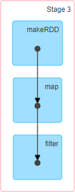
> 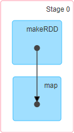

#### RDD 阶段划分源码

1)  **RDD 任务划分**

> RDD 任务切分中间分为：Application、Job、Stage 和 Task

-   Application：初始化一个 SparkContext 即生成一个Application；

-   Job：一个Action 算子就会生成一个Job；

-   Stage：Stage 等于宽依赖(ShuffleDependency)的个数加 1；

-   Task：一个 Stage 阶段中，最后一个RDD 的分区个数就是Task
    的个数。注意：Application-\>Job-\>Stage-\>Task 每一层都是 1 对 n
    的关系。

> 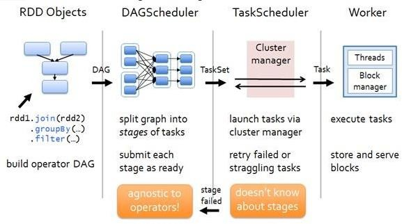{width="5.105469160104987in"
> height="2.8510411198600174in"}

#### RDD 任务划分源码

> val tasks: Seq\[Task\[\_\]\] = try { stage match {
>
> case stage: ShuffleMapStage =\> partitionsToCompute.map { id =\>
>
> val locs = taskIdToLocations(id) val part = stage.rdd.partitions(id)
>
> new ShuffleMapTask(stage.id, stage.latestInfo.attemptId,
>
> taskBinary, part, locs, stage.latestInfo.taskMetrics, properties,
> Option(jobId),
>
> Option(sc.applicationId), sc.applicationAttemptId)
>
> }
>
> case stage: ResultStage =\> partitionsToCompute.map { id =\>
>
> val p: Int = stage.partitions(id) val part = stage.rdd.partitions(p)
> val locs = taskIdToLocations(id)
>
> new ResultTask(stage.id, stage.latestInfo.attemptId,
>
> taskBinary, part, locs, id, properties, stage.latestInfo.taskMetrics,
> Option(jobId), Option(sc.applicationId), sc.applicationAttemptId)
>
> }
>
> }
>
> ......
>
> val partitionsToCompute: Seq\[Int\] = stage.findMissingPartitions()
>
> ......
>
> override def findMissingPartitions(): Seq\[Int\] = {
> mapOutputTrackerMaster
>
> .findMissingPartitions(shuffleDep.shuffleId)
>
> .getOrElse(0 until numPartitions)
>
> }

### RDD 持久化

#### RDD Cache 缓存

> RDD 通过Cache 或者 Persist
> 方法将前面的计算结果缓存，默认情况下会把数据以缓存在 JVM
> 的堆内存中。但是并不是这两个方法被调用时立即缓存，而是触发后面的
> action 算子时，该RDD 将会被缓存在计算节点的内存中，并供后面重用。
>
> 存储级别
>
> 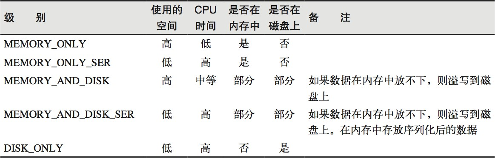{width="5.694059492563429in"
> height="1.8261450131233596in"}
>
> 缓存有可能丢失，或者存储于内存的数据由于内存不足而被删除，RDD
> 的缓存容错机制保证了即使缓存丢失也能保证计算的正确执行。通过基于RDD
> 的一系列转换，丢失的数据会被重算，由于RDD 的各个 Partition
> 是相对独立的，因此只需要计算丢失的部分即可，
> 并不需要重算全部Partition。
>
> Spark 会自动对一些 Shuffle
> 操作的中间数据做持久化操作(比如：reduceByKey)。这样做的目的是为了当一个节点
> Shuffle
> 失败了避免重新计算整个输入。但是，在实际使用的时候，如果想重用数据，仍然建议调用
> persist 或 cache。

#### RDD CheckPoint 检查点

> 所谓的检查点其实就是通过将RDD 中间结果写入磁盘
>
> 由于血缘依赖过长会造成容错成本过高，这样就不如在中间阶段做检查点容错，如果检查点之后有节点出现问题，可以从检查点开始重做血缘，减少了开销。
>
> 对 RDD 进行 checkpoint 操作并不会马上被执行，必须执行 Action
> 操作才能触发。

#### 缓存和检查点区别

1.  Cache 缓存只是将数据保存起来，不切断血缘依赖。Checkpoint
    检查点切断血缘依赖。

2.  Cache 缓存的数据通常存储在磁盘、内存等地方，可靠性低。Checkpoint
    的数据通常存储在HDFS 等容错、高可用的文件系统，可靠性高。

3.  建议对checkpoint()的RDD 使用Cache 缓存，这样 checkpoint 的 job
    只需从 Cache 缓存中读取数据即可，否则需要再从头计算一次RDD。

### RDD 分区器

> Spark 目前支持Hash 分区和 Range 分区，和用户自定义分区。Hash
> 分区为当前的默认分区。分区器直接决定了RDD 中分区的个数、RDD
> 中每条数据经过Shuffle 后进入哪个分区，进而决定了Reduce 的个数。

-   只有Key-Value 类型的RDD 才有分区器，非 Key-Value 类型的RDD
    分区的值是 None

-   每个RDD 的分区 ID 范围：0 \~ (numPartitions -
    1)，决定这个值是属于那个分区的。

1)  **Hash 分区**：对于给定的 key，计算其hashCode,并除以分区个数取余

2)  **Range
    分区**：将一定范围内的数据映射到一个分区中，尽量保证每个分区数据均匀，而且分区间有序

### RDD 文件读取与保存

> Spark
> 的数据读取及数据保存可以从两个维度来作区分：文件格式以及文件系统。文件格式分为：text
> 文件、csv 文件、sequence 文件以及Object 文件；
>
> 文件系统分为：本地文件系统、HDFS、HBASE 以及数据库。

#### text 文件

-   **sequence 文件**

> SequenceFile 文件是[Hadoop](http://lib.csdn.net/base/hadoop)
> 用来存储二进制形式的key-value 对而设计的一种平面文件(Flat File)。在
> SparkContext 中，可以调用sequenceFile\[keyClass, valueClass\](path)。

#### object 对象文件

> 对象文件是将对象序列化后保存的文件，采用 Java
> 的序列化机制。可以通过objectFile\[T:
> ClassTag\](path)函数接收一个路径，读取对象文件，返回对应的
> RDD，也可以通过调用saveAsObjectFile()实现对对象文件的输出。因为是序列化所以要指定类型。

## 累加器

### 实现原理

> 累加器用来把Executor 端变量信息聚合到Driver 端。在Driver
> 程序中定义的变量，在Executor 端的每个Task
> 都会得到这个变量的一份新的副本，每个 task 更新这些副本的值后，
> 传回Driver 端进行 merge。

### 基础编程

1.  **系统累加器**

2.  **自定义累加器**

## 广播变量

### 实现原理

> 广播变量用来高效分发较大的对象。向所有工作节点发送一个较大的只读值，以供一个或多个
> Spark
> 操作使用。比如，如果你的应用需要向所有节点发送一个较大的只读查询表，
> 广播变量用起来都很顺手。在多个并行操作中使用同一个变量，但是 Spark
> 会为每个任务分别发送。

### 基础编程

> **第6章 Spark 案例实操**
>
> 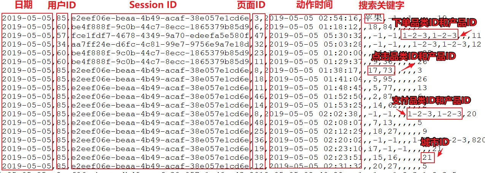在之前的学习中，我们已经学习了 Spark
> 的基础编程方式，接下来，我们看看在实际的工作中如何使用这些 API
> 实现具体的需求。这些需求是电商网站的真实需求，所以在实现功能前，咱们必须先将数据准备好。
>
> 上面的数据图是从数据文件中截取的一部分内容，表示为电商网站的用户行为数据，主要包含用户的
> 4 种行为：搜索，点击，下单，支付。数据规则如下：

-   数据文件中每行数据采用下划线分隔数据

-   每一行数据表示用户的一次行为，这个行为只能是 4 种行为的一种

-   如果搜索关键字为 null,表示数据不是搜索数据

-   如果点击的品类 ID 和产品 ID 为-1，表示数据不是点击数据

-   针对于下单行为，一次可以下单多个商品，所以品类 ID 和产品 ID
    可以是多个，id 之间采用逗号分隔，如果本次不是下单行为，则数据采用
    null 表示

-   支付行为和下单行为类似详细字段说明：

+------+-----------------+----------+----------------------------------+
| 7    | cl              | > Long   | > 某一个商品品类的 ID            |
|      | ick_category_id |          |                                  |
+======+=================+==========+==================================+
| 8    | c               | > Long   | > 某一个商品的 ID                |
|      | lick_product_id |          |                                  |
+------+-----------------+----------+----------------------------------+
| 9    | ord             | > String | > 一次订单中所有品类的 ID 集合   |
|      | er_category_ids |          |                                  |
+------+-----------------+----------+----------------------------------+
| 10   | or              | > String | > 一次订单中所有商品的 ID 集合   |
|      | der_product_ids |          |                                  |
+------+-----------------+----------+----------------------------------+
| 11   | p               | > String | > 一次支付中所有品类的 ID 集合   |
|      | ay_category_ids |          |                                  |
+------+-----------------+----------+----------------------------------+
| 12   | pay_product_ids | > String | > 一次支付中所有商品的 ID 集合   |
+------+-----------------+----------+----------------------------------+
| 13   | city_id         | > Long   | > 城市 id                        |
+------+-----------------+----------+----------------------------------+

> 样例类：

### 需求 1：Top10 热门品类

{width="5.782657480314961in"
height="1.5640616797900262in"}

1.  **需求说明**

> 品类是指产品的分类，大型电商网站品类分多级，咱们的项目中品类只有一级，不同的公司可能对热门的定义不一样。我们按照每个品类的点击、下单、支付的量来统计热门品类。
>
> 鞋 点击数 下单数 支付数
>
> 衣服 点击数 下单数 支付数
>
> 电脑 点击数 下单数 支付数
>
> 例如，综合排名 = 点击数\*20%+下单数\*30%+支付数\*50%
>
> 本项目需求优化为：先按照点击数排名，靠前的就排名高；如果点击数相同，再比较下单数；下单数再相同，就比较支付数。

### 实现方案一

#### 需求分析

> 分别统计每个品类点击的次数，下单的次数和支付的次数：
>
> （品类，点击总数）（品类，下单总数）（品类，支付总数）

1.  **需求实现**

### 实现方案二

#### 需求分析

> 一次性统计每个品类点击的次数，下单的次数和支付的次数：
>
> （品类，（点击总数，下单总数，支付总数））

2.  **需求实现**

### 实现方案三

#### 需求分析

> 使用累加器的方式聚合数据

3.  **需求实现**

### 需求 2：Top10 热门品类中每个品类的 Top10 活跃 Session 统计

1.  **需求说明**

> 在需求一的基础上，增加每个品类用户 session 的点击统计

### 需求分析

2.  **功能实现**

### 需求 3：页面单跳转换率统计

3.  **需求说明**

```{=html}
<!-- -->
```
1.  页面单跳转化率

> 计算页面单跳转化率，什么是页面单跳转换率，比如一个用户在一次 Session
> 过程中访问的页面路径 3,5,7,9,10,21，那么页面 3 跳到页面 5
> 叫一次单跳，7-9 也叫一次单跳，
> 那么单跳转化率就是要统计页面点击的概率。
>
> 比如：计算 3-5 的单跳转化率，先获取符合条件的 Session 对于页面 3
> 的访问次数（PV） 为 A，然后获取符合条件的 Session 中访问了页面 3
> 又紧接着访问了页面 5 的次数为 B，那么 B/A 就是 3-5 的页面单跳转化率。
>
> {width="5.915106080489939in"
> height="0.7333333333333333in"}

2.  统计页面单跳转化率意义

> 产品经理和运营总监，可以根据这个指标，去尝试分析，整个网站，产品，各个页面的表现怎么样，是不是需要去优化产品的布局；吸引用户最终可以进入最后的支付页面。
>
> 数据分析师，可以此数据做更深一步的计算和分析。
>
> 企业管理层，可以看到整个公司的网站，各个页面的之间的跳转的表现如何，可以适当调整公司的经营战略或策略。

### 需求分析

1.  **功能实现**
