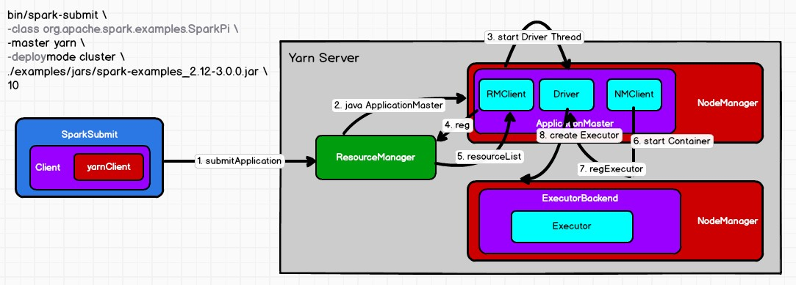
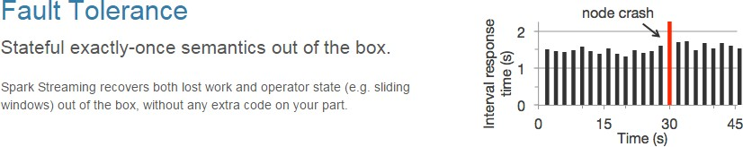
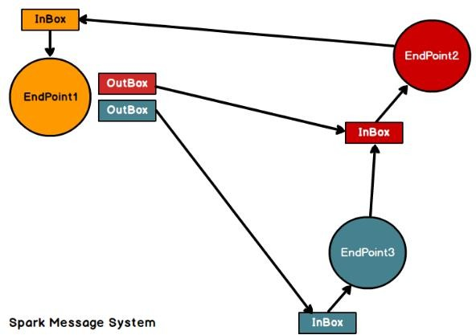
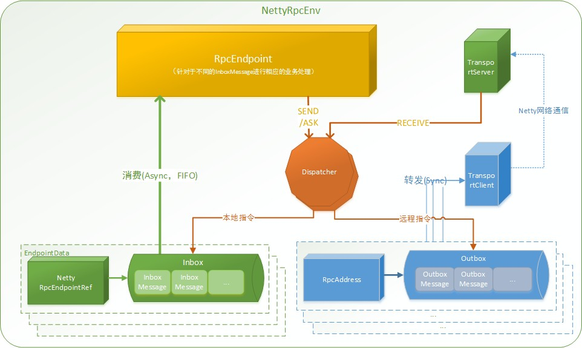
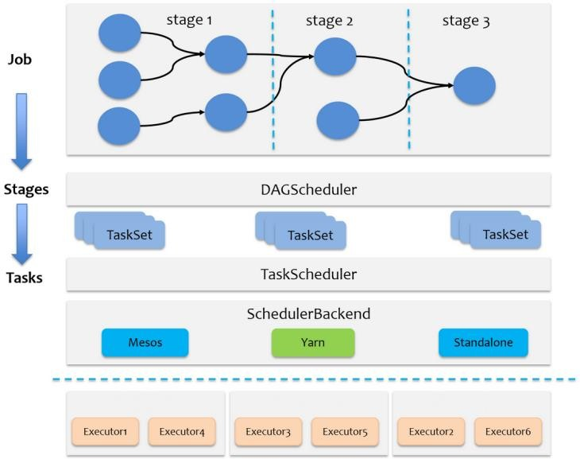
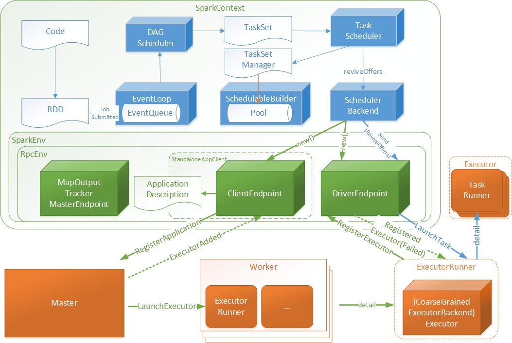
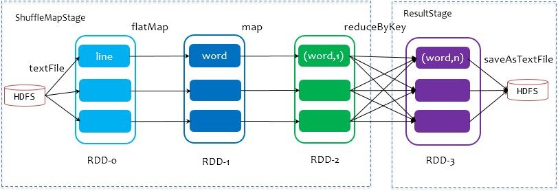
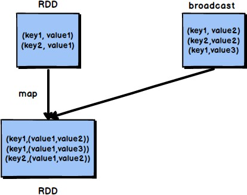
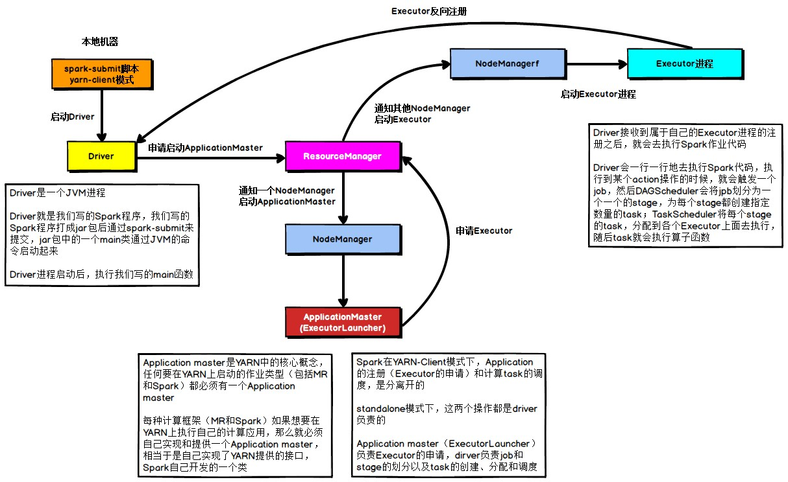
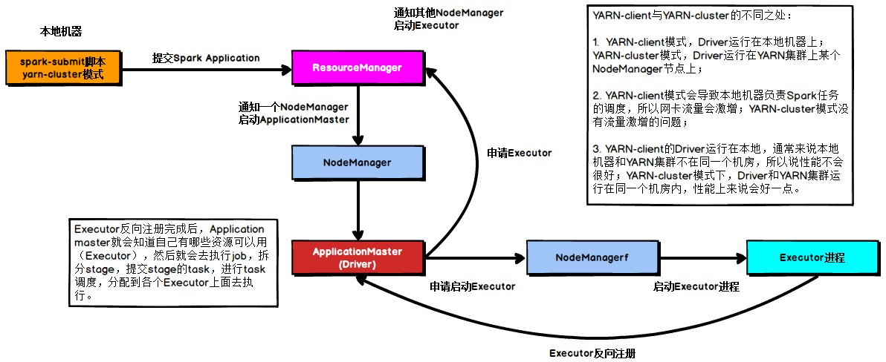

> 尚硅谷大数据技术之 SparkSQL
>
> 版本：V3.0

{width="5.5in" height="2.1666666666666665in"}

> 作者：尚硅谷大数据研发部
>
> **第1章 SparkSQL 概述**

1.  **SparkSQL 是什么**

{width="3.062498906386702in"
height="1.0416666666666667in"}{width="5.7385728346456695in"
height="0.4739577865266842in"}

> Spark SQL 是Spark 用于结构化数据(structured data)处理的 Spark 模块。

2.  **Hive and SparkSQL**

> SparkSQL 的前身是 Shark，给熟悉RDBMS 但又不理解 MapReduce
> 的技术人员提供快速上手的工具。
>
> Hive 是早期唯一运行在Hadoop 上的SQL-on-Hadoop 工具。但是 MapReduce
> 计算过程中大量的中间磁盘落地过程消耗了大量的
> I/O，降低的运行效率，为了提高 SQL-on-Hadoop
> 的效率，大量的SQL-on-Hadoop 工具开始产生，其中表现较为突出的是：

-   Drill

-   Impala

-   Shark

> {width="4.633701881014873in"
> height="1.6358967629046368in"}其中 Shark 是伯克利实验室 Spark
> 生态环境的组件之一，是基于Hive
> 所开发的工具，它修改了下图所示的右下角的内存管理、物理计划、执行三个模块，并使之能运行在
> Spark 引擎上。
>
> Shark 的出现，使得SQL-on-Hadoop 的性能比Hive 有了 10-100 倍的提高。
>
> {width="2.928578302712161in"
> height="1.9825in"}
>
> 但是，随着Spark 的发展，对于野心勃勃的Spark 团队来说，Shark 对于 Hive
> 的太多依赖（如采用 Hive 的语法解析器、查询优化器等等），制约了 Spark
> 的One Stack Rule Them All 的既定方针，制约了 Spark
> 各个组件的相互集成，所以提出了 SparkSQL 项目。SparkSQL 抛弃原有 Shark
> 的代码，汲取了 Shark 的一些优点，如内存列存储（In-Memory Columnar
>
> Storage）、Hive 兼容性等，重新开发了SparkSQL 代码；由于摆脱了对Hive
> 的依赖性，SparkSQL无论在数据兼容、性能优化、组件扩展方面都得到了极大的方便，真可谓"退一步，海阔天空"。

-   数据兼容方面 SparkSQL 不但兼容Hive，还可以从RDD、parquet 文件、JSON
    文件中获取数据，未来版本甚至支持获取RDBMS 数据以及 cassandra 等NOSQL
    数据；

-   性能优化方面 除了采取 In-Memory Columnar Storage、byte-code
    generation 等优化技术外、将会引进Cost Model
    对查询进行动态评估、获取最佳物理计划等等；

-   {width="2.691839457567804in"
    height="1.8711450131233596in"}组件扩展方面 无论是 SQL
    的语法解析器、分析器还是优化器都可以重新定义，进行扩展。

> 2014 年 6 月 1 日 Shark 项目和 SparkSQL 项目的主持人Reynold Xin
> 宣布：停止对 Shark 的
>
> 开发，团队将所有资源放SparkSQL 项目上，至此，Shark
> 的发展画上了句话，但也因此发展出两个支线：SparkSQL 和 Hive on Spark。
>
> 
>
> 其中 SparkSQL 作为 Spark 生态的一员继续发展，而不再受限于
> Hive，只是兼容 Hive；而Hive on Spark 是一个Hive 的发展计划，该计划将
> Spark 作为Hive 的底层引擎之一，也就是说，Hive
> 将不再受限于一个引擎，可以采用 Map-Reduce、Tez、Spark 等引擎。
>
> 对于开发人员来讲，SparkSQL 可以简化RDD
> 的开发，提高开发效率，且执行效率非常快，所以实际工作中，基本上采用的就是
> SparkSQL。Spark SQL 为了简化RDD 的开发， 提高开发效率，提供了 2
> 个编程抽象，类似Spark Core 中的RDD

-   DataFrame

-   DataSet

    1.  **SparkSQL 特点**

        1.  **易整合**

> 无缝的整合了 SQL 查询和 Spark 编程

{width="5.661613079615048in" height="0.97625in"}

2.  **统一的数据访问**

> 使用相同的方式连接不同的数据源
>
> {width="5.237631233595801in"
> height="1.1412489063867017in"}

3.  **兼容 Hive**

> 在已有的仓库上直接运行 SQL 或者 HiveQL

{width="5.591018153980753in"
height="1.1399989063867018in"}

4.  **标准数据连接**

> 通过 JDBC 或者 ODBC 来连接

{width="5.630435258092739in" height="1.045in"}

4.  **DataFrame 是什么**

> 在 Spark 中，DataFrame 是一种以 RDD
> 为基础的分布式数据集，类似于传统数据库中的二维表格。DataFrame 与 RDD
> 的主要区别在于，前者带有 schema 元信息，即 DataFrame
> 所表示的二维表数据集的每一列都带有名称和类型。这使得 Spark SQL
> 得以洞察更多的结构信息，从而对藏于 DataFrame 背后的数据源以及作用于
> DataFrame
> 之上的变换进行了针对性的优化，最终达到大幅提升运行时效率的目标。反观
> RDD，由于无从得知所存数据元素的具体内部结构，Spark Core 只能在 stage
> 层面进行简单、通用的流水线优化。
>
> 同时，与Hive 类似，DataFrame 也支持嵌套数据类型（struct、array 和
> map）。从 API 易用性的角度上看，DataFrame API
> 提供的是一套高层的关系操作，比函数式的 RDD API 要更加友好，门槛更低。
>
> {width="3.687361111111111in"
> height="1.939721128608924in"}上图直观地体现了DataFrame 和 RDD 的区别。
>
> 左侧的 RDD\[Person\]虽然以 Person 为类型参数，但 Spark
> 框架本身不了解Person 类的内部结构。而右侧的DataFrame
> 却提供了详细的结构信息，使得 Spark SQL
> 可以清楚地知道该数据集中包含哪些列，每列的名称和类型各是什么。
>
> DataFrame 是为数据提供了 Schema
> 的视图。可以把它当做数据库中的一张表来对待
>
> {width="3.8180544619422574in"
> height="0.339582239720035in"}DataFrame 也是懒执行的，但性能上比 RDD
> 要高，主要原因：优化的执行计划，即查询计划通过 Spark catalyst
> optimiser 进行优化。比如下面一个例子:

{width="4.261185476815398in"
height="1.2769783464566928in"}

> 为了说明查询优化，我们来看上图展示的人口数据分析的示例。图中构造了两个
>
> DataFrame，将它们 join 之后又做了一次filter
> 操作。如果原封不动地执行这个执行计划，最终的执行效率是不高的。因为
> join
> 是一个代价较大的操作，也可能会产生一个较大的数据集。如果我们能将filter
> 下推到 join 下方，先对DataFrame 进行过滤，再 join
> 过滤后的较小的结果集，便可以有效缩短执行时间。而 Spark SQL
> 的查询优化器正是这样做的。简而言之，
> 逻辑查询计划优化就是一个利用基于关系代数的等价变换，将高成本的操作替换为低成本操作的过程。
>
> {width="5.3927504374453195in"
> height="2.754583333333333in"}

5.  **DataSet 是什么**

> DataSet 是分布式数据集合。DataSet 是Spark 1.6
> 中添加的一个新抽象，是DataFrame
>
> 的一个扩展。它提供了RDD 的优势（强类型，使用强大的 lambda
> 函数的能力）以及Spark
>
> SQL 优化执行引擎的优点。DataSet 也可以使用功能性的转换（操作
> map，flatMap，filter
>
> 等等）。

-   DataSet 是DataFrame API 的一个扩展，是SparkSQL 最新的数据抽象

-   用户友好的 API 风格，既具有类型安全检查也具有DataFrame
    的查询优化特性；

-   用样例类来对DataSet
    中定义数据的结构信息，样例类中每个属性的名称直接映射到

> DataSet 中的字段名称；

-   DataSet 是强类型的。比如可以有 DataSet\[Car\]，DataSet\[Person\]。

-   DataFrame 是DataSet 的特列，DataFrame=DataSet\[Row\] ，所以可以通过
    as 方法将

> DataFrame 转换为DataSet。Row 是一个类型，跟 Car、Person
> 这些的类型一样，所有的表结构信息都用 Row
> 来表示。获取数据时需要指定顺序
>
> **第2章 SparkSQL 核心编程**
>
> 本课件重点学习如何使用 Spark SQL 所提供的 DataFrame 和DataSet
> 模型进行编程.， 以及了解它们之间的关系和转换，关于具体的SQL
> 书写不是我们的重点。

1.  **新的起点**

> Spark Core 中，如果想要执行应用程序，需要首先构建上下文环境对象
> SparkContext， Spark SQL 其实可以理解为对 Spark Core
> 的一种封装，不仅仅在模型上进行了封装，上下文环境对象也进行了封装。
>
> 在老的版本中，SparkSQL 提供两种 SQL 查询起始点：一个叫
> SQLContext，用于 Spark
>
> 自己提供的SQL 查询；一个叫HiveContext，用于连接 Hive 的查询。
>
> {width="5.776798993875765in"
> height="1.3110411198600176in"}SparkSession 是 Spark 最新的 SQL
> 查询起始点，实质上是 SQLContext 和HiveContext 的组合，所以在 SQLContex
> 和HiveContext 上可用的API 在 SparkSession
> 上同样是可以使用的。SparkSession 内部封装了
> SparkContext，所以计算实际上是由 sparkContext 完成的。当我们使用
> spark-shell 的时候, spark 框架会自动的创建一个名称叫做 spark
> 的SparkSession 对象, 就像我们以前可以自动获取到一个 sc 来表示
> SparkContext 对象一样

2.  **DataFrame**

> Spark SQL 的DataFrame API 允许我们使用 DataFrame
> 而不用必须去注册临时表或者生成 SQL 表达式。DataFrame API 既有
> transformation 操作也有 action 操作。

1.  **创建 DataFrame**

> 在 Spark SQL 中 SparkSession 是创建DataFrame 和执行 SQL 的入口，创建
> DataFrame
>
> 有三种方式：通过Spark 的数据源进行创建；从一个存在的RDD
> 进行转换；还可以从Hive
>
> Table 进行查询返回。

1)  从 Spark 数据源进行创建

-   查看 Spark 支持创建文件的数据源格式

> scala\> spark.read.

-   在 spark 的 bin/data 目录中创建 user.json 文件

> {\"username\":\"zhangsan\",\"age\":20}

-   读取 json 文件创建DataFrame

> 注意：如果从内存中获取数据，spark
> 可以知道数据类型具体是什么。如果是数字，默认作为 Int
> 处理；但是从文件中读取的数字，不能确定是什么类型，所以用 bigint
> 接收，可以和
>
> Long 类型转换，但是和 Int 不能进行转换

-   展示结果

2)  从 RDD 进行转换在后续章节中讨论

3)  从 Hive Table 进行查询返回在后续章节中讨论

    1.  **SQL 语法**

> SQL 语法风格是指我们查询数据的时候使用 SQL
> 语句来查询，这种风格的查询必须要有临时视图或者全局视图来辅助

1)  读取 JSON 文件创建DataFrame

2)  对 DataFrame 创建一个临时表

> scala\> df.createOrReplaceTempView(\"people\")

3)  通过 SQL 语句实现查询全表

4)  结果展示

> 注意：普通临时表是 Session
> 范围内的，如果想应用范围内有效，可以使用全局临时表。使用全局临时表时需要全路径访问，如：global_temp.people

5)  对于DataFrame 创建一个全局表

> scala\> df.createGlobalTempView(\"people\")

6)  通过 SQL 语句实现查询全表

    1.  **DSL 语法**

> DataFrame 提供一个特定领域语言(domain-specific language,
> DSL)去管理结构化的数据。可以在 Scala, Java, Python 和 R 中使用
> DSL，使用 DSL 语法风格不必去创建临时视图了

1)  创建一个DataFrame

2)  查看DataFrame 的 Schema 信息

3)  只查看\"username\"列数据，

4)  查看\"username\"列数据以及\"age+1\"数据

> 注意:涉及到运算的时候, 每列都必须使用\$,
> 或者采用引号表达式：单引号+字段名

5)  查看\"age\"大于\"30\"的数据

6)  按照\"age\"分组，查看数据条数

    1.  **RDD 转换为 DataFrame**

> 在 IDEA 中开发程序时，如果需要RDD 与DF 或者DS
> 之间互相操作，那么需要引入
>
> import spark.implicits.\_
>
> 这里的 spark 不是Scala 中的包名，而是创建的 sparkSession
> 对象的变量名称，所以必须先创建 SparkSession 对象再导入。这里的 spark
> 对象不能使用var 声明，因为 Scala 只支持
>
> val 修饰的对象的引入。
>
> spark-shell 中无需导入，自动完成此操作。
>
> 实际开发中，一般通过样例类将 RDD 转换为 DataFrame

2.  **DataFrame 转换为 RDD**

> DataFrame 其实就是对RDD 的封装，所以可以直接获取内部的RDD
>
> 注意：此时得到的RDD 存储类型为Row

3.  **DataSet**

> DataSet 是具有强类型的数据集合，需要提供对应的类型信息。

1.  **创建 DataSet**

```{=html}
<!-- -->
```
1.  使用样例类序列创建 DataSet

2.  使用基本类型的序列创建DataSet

> 注意：在实际使用的时候，很少用到把序列转换成DataSet，更多的是通过RDD
> 来得到DataSet

1.  **RDD 转换为 DataSet**

> SparkSQL 能够自动将包含有 case 类的RDD 转换成DataSet，case 类定义了
> table 的结构，case 类属性通过反射变成了表的列名。Case 类可以包含诸如
> Seq 或者 Array 等复杂的结构。

2.  **DataSet 转换为 RDD**

> DataSet 其实也是对 RDD 的封装，所以可以直接获取内部的RDD

3.  **DataFrame 和 DataSet 转换**

> DataFrame 其实是DataSet 的特例，所以它们之间是可以互相转换的。

-   DataFrame 转换为DataSet

-   DataSet 转换为DataFrame

    3.  **RDD、DataFrame、DataSet 三者的关系**

> 在 SparkSQL 中 Spark 为我们提供了两个新的抽象，分别是 DataFrame 和
> DataSet。他们和 RDD 有什么区别呢？首先从版本的产生上来看：

-   Spark1.0 =\> RDD

-   Spark1.3 =\> DataFrame

-   Spark1.6 =\> Dataset

> 如果同样的数据都给到这三个数据结构，他们分别计算之后，都会给出相同的结果。不同是的他们的执行效率和执行方式。在后期的
> Spark 版本中，DataSet 有可能会逐步取代RDD和 DataFrame 成为唯一的API
> 接口。

1.  **三者的共性**

-   RDD、DataFrame、DataSet 全都是 spark
    平台下的分布式弹性数据集，为处理超大型数据提供便利;

-   三者都有惰性机制，在进行创建、转换，如 map
    方法时，不会立即执行，只有在遇到

> Action 如 foreach 时，三者才会开始遍历运算;

-   三者有许多共同的函数，如 filter，排序等;

-   在对DataFrame 和Dataset 进行操作许多操作都需要这个包:import
    spark.implicits.\_（在创建好 SparkSession 对象后尽量直接导入）

-   三者都会根据 Spark
    的内存情况自动缓存运算，这样即使数据量很大，也不用担心会内存溢出

-   三者都有 partition 的概念

-   DataFrame 和DataSet 均可使用模式匹配获取各个字段的值和类型

    1.  **三者的区别**

1)  RDD

    -   RDD 一般和 spark mllib 同时使用

    -   RDD 不支持 sparksql 操作

2)  DataFrame

    -   与 RDD 和 Dataset 不同，DataFrame
        每一行的类型固定为Row，每一列的值没法直接访问，只有通过解析才能获取各个字段的值

    -   DataFrame 与DataSet 一般不与 spark mllib 同时使用

    -   DataFrame 与DataSet 均支持 SparkSQL 的操作，比如 select，groupby
        之类，还能注册临时表/视窗，进行 sql 语句操作

    -   DataFrame 与DataSet 支持一些特别方便的保存方式，比如保存成
        csv，可以带上表头，这样每一列的字段名一目了然(后面专门讲解)

3)  DataSet

    -   Dataset 和DataFrame
        拥有完全相同的成员函数，区别只是每一行的数据类型不同。

> DataFrame 其实就是DataSet 的一个特例 type DataFrame = Dataset\[Row\]

-   DataFrame 也可以叫Dataset\[Row\],每一行的类型是
    Row，不解析，每一行究竟有哪些字段，各个字段又是什么类型都无从得知，只能用上面提到的
    getAS 方法或者共性中的第七条提到的模式匹配拿出特定字段。而Dataset
    中，每一行是什么类型是不一定的，在自定义了 case class
    之后可以很自由的获得每一行的信息

    1.  **三者的互相转换**

{width="5.454022309711286in"
height="3.1968744531933506in"}

6.  **IDEA 开发SparkSQL**

> 实际开发中，都是使用 IDEA 进行开发的。

1.  **添加依赖**

2.  **代码实现**

> object SparkSQL01_Demo {
>
> def main(args: Array\[String\]): Unit = {
>
> //创建上下文环境配置对象
>
> val conf: SparkConf = new
> SparkConf().setMaster(\"local\[\*\]\").setAppName(\"SparkSQL01_Demo\")
>
> //创建 SparkSession 对象
>
> val spark: SparkSession =
> SparkSession.builder().config(conf).getOrCreate()
>
> //RDD=\>DataFrame=\>DataSet 转换需要引入隐式转换规则，否则无法转换
>
> //spark 不是包名，是上下文环境对象名
>
> import spark.implicits.\_
>
> //读取 json 文件 创建 DataFrame {\"username\": \"lisi\",\"age\": 18}
> val df: DataFrame = spark.read.json(\"input/test.json\")
>
> //df.show()
>
> //SQL 风格语法
>
> df.createOrReplaceTempView(\"user\")
>
> //spark.sql(\"select avg(age) from user\").show
>
> //DSL 风格语法
>
> //df.select(\"username\",\"age\").show()
>
> //\*\*\*\*\*RDD=\>DataFrame=\>DataSet\*\*\*\*\*
>
> //RDD
>
> val rdd1: RDD\[(Int, String, Int)\] =
> spark.sparkContext.makeRDD(List((1,\"zhangsan\",30),(2,\"lisi\",28),(3,\"wangwu\",
> 20)))
>
> //DataFrame
>
> val df1: DataFrame = rdd1.toDF(\"id\",\"name\",\"age\")
>
> //df1.show()
>
> //DateSet
>
> val ds1: Dataset\[User\] = df1.as\[User\]
>
> //ds1.show()
>
> //\*\*\*\*\*DataSet=\>DataFrame=\>RDD\*\*\*\*\*
>
> //DataFrame
>
> val df2: DataFrame = ds1.toDF()
>
> //RDD 返回的 RDD 类型为 Row，里面提供的 getXXX
> 方法可以获取字段值，类似 jdbc 处理结果集， 但是索引从 0 开始
>
> val rdd2: RDD\[Row\] = df2.rdd
>
> //rdd2.foreach(a=\>println(a.getString(1)))
>
> //\*\*\*\*\*RDD=\>DataSet\*\*\*\*\* rdd1.map{

# 用户自定义函数

> 用户可以通过 spark.udf 功能添加自定义函数，实现自定义功能。

3.  **UDF**

```{=html}
<!-- -->
```
1)  创建DataFrame

2)  注册UDF

3)  创建临时表

> scala\> df.createOrReplaceTempView(\"people\")

4)  应用UDF

> scala\> spark.sql(\"Select addName(name),age from people\").show()

1.  **UDAF**

> 强类型的Dataset 和弱类型的 DataFrame 都提供了相关的聚合函数， 如
> count()，
>
> countDistinct()，avg()，max()，min()。除此之外，用户可以设定自己的自定义聚合函数。通过继承
> UserDefinedAggregateFunction
> 来实现用户自定义弱类型聚合函数。从Spark3.0
> 版本后，UserDefinedAggregateFunction
> 已经不推荐使用了。可以统一采用强类型聚合函数Aggregator
>
> **需求：计算平均工资**
>
> 一个需求可以采用很多种不同的方法实现需求

1)  **实现方式 - RDD**

2)  **实现方式 - 累加器**

3)  **实现方式 - UDAF - 弱类型**

> **---------------------------------------------------------------------------------------**

4)  **实现方式 - UDAF - 强类型**

> **---------------------------------------------------------------------------------------**
>
> Spark3.0 版本可以采用强类型的 Aggregator 方式代替
> UserDefinedAggregateFunction

6.  **数据的加载和保存**

    1.  **通用的加载和保存方式**

> SparkSQL
> 提供了通用的保存数据和数据加载的方式。这里的通用指的是使用相同的API，根据不同的参数读取和保存不同格式的数据，SparkSQL
> 默认读取和保存的文件格式为 parquet

1)  **加载数据**

> spark.read.load 是加载数据的通用方法

+----+-----+-----------+-----+------+-------+----+-------+----------+
| s  |     |           |     |      |       |    |       |          |
| ca |     |           |     |      |       |    |       |          |
| la |     |           |     |      |       |    |       |          |
| \> |     |           |     |      |       |    |       |          |
| s  |     |           |     |      |       |    |       |          |
| pa |     |           |     |      |       |    |       |          |
| rk |     |           |     |      |       |    |       |          |
| .r |     |           |     |      |       |    |       |          |
| ea |     |           |     |      |       |    |       |          |
| d. |     |           |     |      |       |    |       |          |
+====+=====+===========+=====+======+=======+====+=======+==========+
| c  | for | > jdbc    | > l | > op | > op  | >  | > pa  | > schema |
| sv | mat | > json    | oad | tion | tions |  o | rquet |          |
|    |     | >         |     |      |       | rc |       |          |
| t  | > t | >         |     |      |       |    |       |          |
| ab | ext |  textFile |     |      |       |    |       |          |
| le |     |           |     |      |       |    |       |          |
+----+-----+-----------+-----+------+-------+----+-------+----------+

> 如果读取不同格式的数据，可以对不同的数据格式进行设定
>
> scala\> spark.read.format(\"...\")\[.option(\"...\")\].load(\"...\")

-   format(\"...\")：指定加载的数据类型，包括\"csv\"、\"jdbc\"、\"json\"、\"orc\"、\"parquet\"和

> \"textFile\"。

-   load(\"...\")：在\"csv\"、\"jdbc\"、\"json\"、\"orc\"、\"parquet\"和\"textFile\"格式下需要传入加载数据的路径。

-   option(\"...\")：在\"jdbc\"格式下需要传入 JDBC
    相应参数，url、user、password 和 dbtable

> 我们前面都是使用read API 先把文件加载到 DataFrame
> 然后再查询，其实，我们也可以直接在文件上进行查询:
> **文件格式.\`文件路径\`**
>
> scala\>spark.sql(\"select \* from
> json.\`/opt/module/data/user.json\`\").show

2)  **保存数据**

> df.write.save 是保存数据的通用方法
>
> 如果保存不同格式的数据，可以对不同的数据格式进行设定
>
> scala\>df.write.format(\"...\")\[.option(\"...\")\].save(\"...\")

-   format(\"...\")：指定保存的数据类型，包括\"csv\"、\"jdbc\"、\"json\"、\"orc\"、\"parquet\"和

> \"textFile\"。

-   save
    (\"...\")：在\"csv\"、\"orc\"、\"parquet\"和\"textFile\"格式下需要传入保存数据的路径。

-   option(\"...\")：在\"jdbc\"格式下需要传入 JDBC
    相应参数，url、user、password 和 dbtable

> 保存操作可以使用 SaveMode, 用来指明如何处理数据，使用
> mode()方法来设置。有一点很重要: 这些 SaveMode 都是没有加锁的,
> 也不是原子操作。
>
> SaveMode 是一个枚举类，其中的常量包括：

  -----------------------------------------------------------------------------------
  Scala/Java                        Any Language         Meaning
  --------------------------------- -------------------- ----------------------------
  SaveMode.ErrorIfExists(default)   \"error\"(default)   如果文件已经存在则抛出异常

  SaveMode.Append                   \"append\"           如果文件已经存在则追加

  SaveMode.Overwrite                \"overwrite\"        如果文件已经存在则覆盖

  SaveMode.Ignore                   \"ignore\"           如果文件已经存在则忽略
  -----------------------------------------------------------------------------------

> df.write.mode(\"append\").json(\"/opt/module/data/output\")

## Parquet

> Spark SQL 的默认数据源为 Parquet 格式。Parquet
> 是一种能够有效存储嵌套数据的列式存储格式。
>
> 数据源为 Parquet 文件时，Spark SQL
> 可以方便的执行所有的操作，不需要使用
> format。修改配置项spark.sql.sources.default，可修改默认数据源格式。

1)  **加载数据**

2)  **保存数据**

    1.  **JSON**

> Spark SQL 能够自动推测 JSON
> 数据集的结构，并将它加载为一个Dataset\[Row\]. 可以通过
> SparkSession.read.json()去加载 JSON 文件。
>
> 注意：Spark 读取的 JSON 文件不是传统的JSON 文件，每一行都应该是一个
> JSON 串。格式如下：

1.  导入隐式转换

> import spark.implicits.\_

2.  加载 JSON 文件

3.  创建临时表

> peopleDF.createOrReplaceTempView(\"people\")

4.  数据查询

  ----------------------------------------------------------------------------------------
  val teenagerNamesDF =                name   FROM   people   WHERE   age   BETWEEN   13
  spark.sql(\"SELECT                                                                  
  ------------------------------------ ------ ------ -------- ------- ----- --------- ----
  AND 19\")                                                                           

  teenagerNamesDF.show()                                                              

  +\-\-\-\-\--+                                                                       

  \| name\|                                                                           

  +\-\-\-\-\--+                                                                       

  \|Justin\|                                                                          

  +\-\-\-\-\--+                                                                       
  ----------------------------------------------------------------------------------------

1.  **CSV**

> Spark SQL 可以配置 CSV 文件的列表信息，读取CSV 文件,CSV
> 文件的第一行设置为数据列

2.  **MySQL**

> Spark SQL 可以通过 JDBC
> 从关系型数据库中读取数据的方式创建DataFrame，通过对
>
> DataFrame 一系列的计算后，还可以将数据再写回关系型数据库中。如果使用
> spark-shell 操作，可在启动shell
> 时指定相关的数据库驱动路径或者将相关的数据库驱动放到 spark
> 的类路径下。
>
> 我们这里只演示在Idea 中通过 JDBC 对 Mysql 进行操作

1.  导入依赖

2.  读取数据

3.  写入数据

    1.  **Hive**

> Apache Hive 是 Hadoop 上的 SQL 引擎，Spark SQL 编译时可以包含 Hive
> 支持，也可以不包含。包含 Hive 支持的 Spark SQL 可以支持 Hive
> 表访问、UDF (用户自定义函数)
>
> 以及 Hive 查询语言(HiveQL/HQL)等。需要强调的一点是，如果要在 Spark SQL
> 中包含
>
> Hive 的库，并不需要事先安装 Hive。一般来说，最好还是在编译 Spark SQL
> 时引入 Hive 支持，这样就可以使用这些特性了。如果你下载的是二进制版本的
> Spark，它应该已经在编译时添加了 Hive 支持。
>
> 若要把 Spark SQL 连接到一个部署好的 Hive 上，你必须把 hive-site.xml
> 复制到
>
> Spark 的配置文件目录中(\$SPARK_HOME/conf)。即使没有部署好 Hive，Spark
> SQL 也可以运行。 需要注意的是，如果你没有部署好 Hive，Spark SQL
> 会在当前的工作目录中创建出自己的 Hive 元数据仓库，叫作
> metastore_db。此外，如果你尝试使用 HiveQL 中的CREATE TABLE (并非
> CREATE EXTERNAL TABLE)语句来创建表，这些表会被放在你默认的文件系统中的
> /user/hive/warehouse 目录中(如果你的 classpath 中有配好的
>
> hdfs-site.xml，默认的文件系统就是 HDFS，否则就是本地文件系统)。
>
> spark-shell 默认是Hive
> 支持的；代码中是默认不支持的，需要手动指定（加一个参数即可）。

1.  **内嵌的 HIVE**

> 如果使用 Spark 内嵌的 Hive, 则什么都不用做, 直接使用即可.
>
> Hive 的元数据存储在 derby 中,
> 默认仓库地址:\$SPARK_HOME/spark-warehouse
>
> 向表加载本地数据
>
> 在实际使用中, 几乎没有任何人会使用内置的 Hive

2.  **外部的 HIVE**

> 如果想连接外部已经部署好的Hive，需要通过以下几个步骤：

-   Spark 要接管 Hive 需要把hive-site.xml 拷贝到conf/目录下

-   把 Mysql 的驱动 copy 到 jars/目录下

-   如果访问不到 hdfs，则需要把 core-site.xml 和 hdfs-site.xml 拷贝到
    conf/目录下

-   重启 spark-shell

3.  **运行 Spark SQL CLI**

> Spark SQL CLI 可以很方便的在本地运行Hive
> 元数据服务以及从命令行执行查询任务。在
>
> Spark 目录下执行如下命令启动 Spark SQL CLI，直接执行 SQL
> 语句，类似一Hive 窗口bin/spark-sql **4）运行 Spark beeline**
>
> Spark Thrift Server 是Spark 社区基于HiveServer2 实现的一个Thrift
> 服务。旨在无缝兼容
>
> HiveServer2。因为 Spark Thrift Server 的接口和协议都和HiveServer2
> 完全一致，因此我们部署好 Spark Thrift Server 后，可以直接使用hive 的
> beeline 访问Spark Thrift Server 执行相关语句。Spark Thrift Server
> 的目的也只是取代HiveServer2，因此它依旧可以和 Hive Metastore
> 进行交互，获取到hive 的元数据。
>
> 如果想连接Thrift Server，需要通过以下几个步骤：

-   Spark 要接管 Hive 需要把hive-site.xml 拷贝到conf/目录下

-   把 Mysql 的驱动 copy 到 jars/目录下

-   如果访问不到 hdfs，则需要把 core-site.xml 和 hdfs-site.xml 拷贝到
    conf/目录下

-   启动Thrift Server

> sbin/start-thriftserver.sh

-   使用 beeline 连接 Thrift Server

> {width="5.738366141732284in"
> height="0.8926038932633421in"}bin/beeline -u jdbc:hive2://linux1:10000
> -n root
>
> **5）代码操作 Hive**

1.  导入依赖

2.  将hive-site.xml 文件拷贝到项目的 resources 目录中，代码实现

> 注意：在开发工具中创建数据库默认是在本地仓库，通过参数修改数据库仓库的地址:
> config(\"spark.sql.warehouse.dir\",
> \"hdfs://linux1:8020/user/hive/warehouse\")
>
> 如果在执行操作时，出现如下错误：


> 可以代码最前面增加如下代码解决：
>
> System.setProperty(\"HADOOP_USER_NAME\", \"root\")
>
> 此处的 root 改为你们自己的 hadoop 用户名称
>
> **第3章 SparkSQL 项目实战**

1.  **数据准备**

> 我们这次 Spark-sql 操作中所有的数据均来自 Hive，首先在 Hive
> 中创建表,，并导入数据。一共有 3 张表： 1 张用户行为表，1 张城市表，1
> 张产品表

2.  **需求：各区域热门商品 Top3**

    1.  **需求简介**

> 这里的热门商品是从点击量的维度来看的，计算各个区域前三大热门商品，并备注上每个商品在主要城市中的分布比例，超过两个城市用其他显示。
>
> 例如：

+----------+------------+------------+--------------------------------+
| **地区** | **         | **         | > **城市备注**                 |
|          | 商品名称** | 点击次数** |                                |
+==========+============+============+================================+
| **华北** | 商品 A     | 100000     | > 北京 21.2%，天津 13.2%，其他 |
|          |            |            | > 65.6%                        |
+----------+------------+------------+--------------------------------+
| **华北** | 商品 P     | 80200      | > 北京 63.0%，太原 10%，其他   |
|          |            |            | > 27.0%                        |
+----------+------------+------------+--------------------------------+
| **华北** | 商品 M     | 40000      | > 北京 63.0%，太原 10%，其他   |
|          |            |            | > 27.0%                        |
+----------+------------+------------+--------------------------------+
| **东北** | 商品 J     | 92000      | > 大连 28%，辽宁 17.0%，其他   |
|          |            |            | > 55.0%                        |
+----------+------------+------------+--------------------------------+

2.  **需求分析**

-   查询出来所有的点击记录，并与 city_info
    表连接，得到每个城市所在的地区，与

> Product_info 表连接得到产品名称

-   按照地区和商品 id 分组，统计出每个商品在每个地区的总点击次数

-   每个地区内按照点击次数降序排列

-   只取前三名

-   城市备注需要自定义 UDAF 函数

    1.  **功能实现**

-   连接三张表的数据，获取完整的数据（只有点击）

-   将数据根据地区，商品名称分组

-   统计商品点击次数总和,取Top3

-   实现自定义聚合函数显示备注
