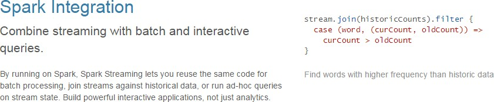
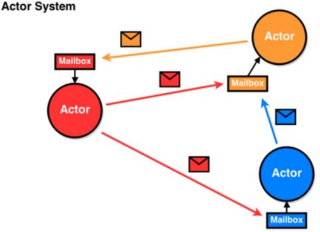

> 版本：V3.0

{width="5.080985345581802in"
height="1.2395833333333333in"}

> 作者：尚硅谷大数据研发部

# 第1章 SparkStreaming 概述 {#第1章-sparkstreaming-概述 .unnumbered}

## Spark Streaming 是什么

{width="4.270833333333333in"
height="1.0416666666666667in"}{width="5.469424759405074in"
height="0.6458333333333334in"}

> Spark 流使得构建可扩展的容错流应用程序变得更加容易。
>
> Spark Streaming 用于流式数据的处理。Spark Streaming
> 支持的数据输入源很多，例如：Kafka、 Flume、Twitter、ZeroMQ 和简单的
> TCP 套接字等等。数据输入后可以用 Spark
> 的高度抽象原语如：map、reduce、join、window
> 等进行运算。而结果也能保存在很多地方，如 HDFS，数据库等。

{width="5.2678849518810145in"
height="1.4785411198600176in"}

> 和 Spark 基于 RDD 的概念很相似，Spark Streaming
> 使用离散化流(discretized stream)作为抽象表示，叫作DStream。DStream
> 是随时间推移而收到的数据的序列。在内部，每个时间区间收到的数据都作为
> RDD 存在，而 DStream 是由这些RDD
> 所组成的序列(因此得名"离散化")。所以简单来将，DStream 就是对 RDD
> 在实时数据处理场景的一种封装。

## Spark Streaming 的特点

-   **易用**

-   {width="5.365972222222222in"
    height="0.8687489063867017in"}**容错**

{width="5.597843394575678in"
height="1.1104166666666666in"}

-   **易整合到 Spark 体系**

{width="5.6891163604549435in"
height="1.1781244531933508in"}

## Spark Streaming 架构

### 架构图

-   **整体架构图**

{width="4.614413823272091in"
height="2.22in"}

-   **SparkStreaming 架构图**

### {width="4.341666666666667in" height="2.2263888888888888in"}背压机制

> Spark 1.5 以前版本，用户如果要限制 Receiver
> 的数据接收速率，可以通过设置静态配制参数"spark.streaming.receiver.maxRate"的值来实现，此举虽然可以通过限制接收速率，来适配当前的处理能力，防止内存溢出，但也会引入其它问题。比如：producer
> 数据生产高于 maxRate，当前集群处理能力也高于
> maxRate，这就会造成资源利用率下降等问题。
>
> 为了更好的协调数据接收速率与资源处理能力，1.5 版本开始 Spark Streaming
> 可以动态控制数据接收速率来适配集群数据处理能力。背压机制（即 Spark
> Streaming Backpressure）: 根据JobScheduler
> 反馈作业的执行信息来动态调整Receiver 数据接收率。
>
> 通过属性"spark.streaming.backpressure.enabled"来控制是否启用
> backpressure 机制，默认值
>
> false，即不启用。

# 第 2 章 Dstream 入门 {#第-2-章-dstream-入门 .unnumbered}

## WordCount 案例实操

-   需求：使用 netcat 工具向 9999 端口不断的发送数据，通过
    SparkStreaming 读取端口数据并统计不同单词出现的次数

1)  添加依赖

2)  编写代码

3)  启动程序并通过netcat 发送数据：

## WordCount 解析

> Discretized Stream 是 Spark Streaming
> 的基础抽象，代表持续性的数据流和经过各种 Spark 原
>
> 语操作后的结果数据流。在内部实现上，DStream 是一系列连续的 RDD
> 来表示。每个RDD 含有一段时间间隔内的数据。

{width="5.373856080489939in"
height="0.6215616797900263in"}

> 对数据的操作也是按照RDD 为单位来进行的

{width="5.377400481189851in"
height="1.413124453193351in"}

> 计算过程由 Spark Engine 来完成

{width="5.17953302712161in"
height="0.7331244531933508in"}

# 第 3 章 DStream 创建 {#第-3-章-dstream-创建 .unnumbered}

## RDD 队列

1.  **用法及说明**

> 测试过程中，可以通过使用 ssc.queueStream(queueOfRDDs)来创建
> DStream，每一个推送到这个队列中的RDD，都会作为一个DStream 处理。

## 案例实操

-   需求：循环创建几个 RDD，将RDD 放入队列。通过 SparkStream 创建
    Dstream，计算

> WordCount

1)  编写代码

2)  结果展示

## 自定义数据源

### 用法及说明

> 需要继承Receiver，并实现 onStart、onStop 方法来自定义数据源采集。

### 案例实操

> 需求：自定义数据源，实现监控某个端口号，获取该端口号内容。

1)  自定义数据源

2)  使用自定义的数据源采集数据

## --------------------------------------------------------------------------------------- {#section .unnumbered}

1.  **Kafka 数据源（面试、开发重点）**

### 版本选型

> ReceiverAPI：需要一个专门的Executor 去接收数据，然后发送给其他的
> Executor 做计算。存在的问题，接收数据的Executor 和计算的Executor
> 速度会有所不同，特别在接收数据的Executor 速度大于计算的Executor
> 速度，会导致计算数据的节点内存溢出。早期版本中提供此方式，当前版本不适用
>
> DirectAPI：是由计算的Executor 来主动消费Kafka 的数据，速度由自身控制。

### Kafka 0-8 Receiver 模式（当前版本不适用）

1.  需求：通过 SparkStreaming 从 Kafka
    读取数据，并将读取过来的数据做简单计算，最终打印到控制台。

2.  导入依赖

3.  编写代码

## --------------------------------------------------------------------------------------- {#section-1 .unnumbered}

### Kafka 0-8 Direct 模式（当前版本不适用）

1.  需求：通过 SparkStreaming 从Kafka
    读取数据，并将读取过来的数据做简单计算，最终打印到控制台。

2.  导入依赖

3.  编写代码（自动维护offset）

## --------------------------------------------------------------------------------------- {#section-2 .unnumbered}

4.  编写代码（手动维护offset）

    1.  **Kafka 0-10 Direct 模式**

```{=html}
<!-- -->
```
1.  需求：通过 SparkStreaming 从Kafka
    读取数据，并将读取过来的数据做简单计算，最终打印到控制台。

2.  导入依赖

> \</dependency\>

3.  编写代码

> import org.apache.kafka.clients.consumer.{ConsumerConfig,
> ConsumerRecord} import org.apache.spark.SparkConf
>
> import org.apache.spark.streaming.dstream.{DStream, InputDStream}
>
> import org.apache.spark.streaming.kafka010.{ConsumerStrategies,
> KafkaUtils, LocationStrategies}
>
> import org.apache.spark.streaming.{Seconds, StreamingContext}
>
> object DirectAPI {
>
> def main(args: Array\[String\]): Unit = {
>
> //1.创建 SparkConf
>
> val sparkConf: SparkConf = new
> SparkConf().setAppName(\"ReceiverWordCount\").setMaster(\"local\[\*\]\")
>
> //2.创建 StreamingContext
>
> val ssc = new StreamingContext(sparkConf, Seconds(3))
>
> //3.定义 Kafka 参数
>
> val kafkaPara: Map\[String, Object\] = Map\[String, Object\](
> ConsumerConfig.BOOTSTRAP_SERVERS_CONFIG -\>
>
> \"linux1:9092,linux2:9092,linux3:9092\",
> ConsumerConfig.GROUP_ID_CONFIG -\> \"atguigu\", \"key.deserializer\"
> -\>
>
> \"org.apache.kafka.common.serialization.StringDeserializer\",
> \"value.deserializer\" -\>
>
> \"org.apache.kafka.common.serialization.StringDeserializer\"
>
> )
>
> //4.读取 Kafka 数据创建 DStream
>
> val kafkaDStream: InputDStream\[ConsumerRecord\[String, String\]\] =
> KafkaUtils.createDirectStream\[String, String\](ssc,
>
> LocationStrategies.PreferConsistent,
> ConsumerStrategies.Subscribe\[String, String\](Set(\"atguigu\"),
> kafkaPara))
>
> //5.将每条消息的 KV 取出
>
> val valueDStream: DStream\[String\] = kafkaDStream.map(record =\>
> record.value())
>
> //6. 计 算 WordCount valueDStream.flatMap(\_.split(\" \"))
>
> .map((\_, 1))
>
> .reduceByKey(\_ + \_)
>
> .print()
>
> //7. 开 启 任 务 ssc.start() ssc.awaitTermination()
>
> }
>
> }
>
> 查看Kafka 消费进度

# 第 4 章 DStream 转换 {#第-4-章-dstream-转换 .unnumbered}

> DStream 上的操作与 RDD 的类似，分为Transformations（转换）和Output
> Operations（输
>
> 出）两种，此外转换操作中还有一些比较特殊的原语，如：updateStateByKey()、transform()以及各种Window
> 相关的原语。

1.  **无状态转化操作**

> 无状态转化操作就是把简单的RDD
> 转化操作应用到每个批次上，也就是转化DStream
> 中的每一个RDD。部分无状态转化操作列在了下表中。注意，针对键值对的DStream
> 转化操作(比如reduceByKey())要添加 import StreamingContext.\_才能在
> Scala 中使用。
>
> {width="5.882365485564304in"
> height="2.973957786526684in"}
>
> 需要记住的是，尽管这些函数看起来像作用在整个流上一样，但事实上每个DStream
> 在内部是由许多RDD（批次）组成，且无状态转化操作是分别应用到每个 RDD
> 上的。
>
> 例如：reduceByKey()会归约每个时间区间中的数据，但不会归约不同区间之间的数据。

## Transform

> Transform 允许 DStream 上执行任意的RDD-to-RDD
> 函数。即使这些函数并没有在DStream 的 API
> 中暴露出来，通过该函数可以方便的扩展 Spark
> API。该函数每一批次调度一次。其实也就是对 DStream 中的 RDD 应用转换。

1.  **join**

> 两个流之间的join
> 需要两个流的批次大小一致，这样才能做到同时触发计算。计算过程就是对当前批次的两个流中各自的RDD
> 进行 join，与两个 RDD 的 join 效果相同。

## --------------------------------------------------------------------------------------- {#section-3 .unnumbered}

2.  **有状态转化操作**

### UpdateStateByKey

> UpdateStateByKey 原语用于记录历史记录，有时，我们需要在 DStream
> 中跨批次维护状态(例如流计算中累加wordcount)。针对这种情况，updateStateByKey()为我们提供了对一个状态变量的访问，用于键值对形式的
> DStream。给定一个由(键，事件)对构成的
> DStream，并传递一个指定如何根据新的事件更新每个键对应状态的函数，它可以构建出一个新的
> DStream，其内部数据为(键，状态) 对。
>
> updateStateByKey() 的结果会是一个新的DStream，其内部的RDD
> 序列是由每个时间区间对应的(键，状态)对组成的。
>
> updateStateByKey
> 操作使得我们可以在用新信息进行更新时保持任意的状态。为使用这个功能，需要做下面两步：

1.  定义状态，状态可以是一个任意的数据类型。

2.  定义状态更新函数，用此函数阐明如何使用之前的状态和来自输入流的新值对状态进行更新。

> 使用 updateStateByKey
> 需要对检查点目录进行配置，会使用检查点来保存状态。更新版的wordcount

1)  编写代码

2)  启动程序并向 9999 端口发送数据

3)  结果展示

+-------------------------------------+--------------------------------+
| Time: 1504685175000 ms              |                                |
+-------------------------------------+--------------------------------+
|                                     |                                |
+-------------------------------------+--------------------------------+
| Time: 1504685181000 ms              |                                |
+-------------------------------------+--------------------------------+
| (shi,1)                             |                                |
|                                     |                                |
| (shui,1)                            |                                |
|                                     |                                |
| (ni,1)                              |                                |
+-------------------------------------+--------------------------------+
| Time: 1504685187000 ms              |                                |
+-------------------------------------+--------------------------------+
| (shi,1)                             |                                |
|                                     |                                |
| (ma,1)                              |                                |
|                                     |                                |
| (hao,1)                             |                                |
|                                     |                                |
| (shui,1)                            |                                |
+-------------------------------------+--------------------------------+

### WindowOperations

> Window Operations
> 可以设置窗口的大小和滑动窗口的间隔来动态的获取当前Steaming
> 的允许状态。所有基于窗口的操作都需要两个参数，分别为窗口时长以及滑动步长。

-   窗口时长：计算内容的时间范围；

-   滑动步长：隔多久触发一次计算。

> 注意：这两者都必须为采集周期大小的整数倍。
>
> WordCount 第三版：3 秒一个批次，窗口 12 秒，滑步 6 秒。
>
> 关于Window 的操作还有如下方法：

1.  window(windowLength, slideInterval): 基于对源DStream
    窗化的批次进行计算返回一个新的Dstream；

2.  countByWindow(windowLength, slideInterval):
    返回一个滑动窗口计数流中的元素个数；

3.  reduceByWindow(func, windowLength, slideInterval):
    通过使用自定义函数整合滑动区间流元素来创建一个新的单元素流；

4.  reduceByKeyAndWindow(func, windowLength, slideInterval,
    \[numTasks\]): 当在一个(K,V) 对的DStream
    上调用此函数，会返回一个新(K,V)对的
    DStream，此处通过对滑动窗口中批次数据使用 reduce 函数来整合每个 key
    的 value 值。

5.  reduceByKeyAndWindow(func, invFunc, windowLength, slideInterval,
    \[numTasks\]): 这个函数是上述函数的变化版本，每个窗口的 reduce
    值都是通过用前一个窗的 reduce 值来递增计算。通过 reduce
    进入到滑动窗口数据并"反向
    reduce"离开窗口的旧数据来实现这个操作。一个例子是随着窗口滑动对keys
    的"加""减"计数。通过前边介绍可以想到，这个函数只适用于"

> {width="5.788667979002625in"
> height="3.2872911198600177in"}可逆的 reduce 函数"，也就是这些 reduce
> 函数有相应的"反 reduce"函数(以参数 invFunc
> 形式传入)。如前述函数，reduce 任务的数量通过可选参数来配置。

+-----------------------------------------------------------------------+
| val ipDStream = accessLogsDStream.map(logEntry =\>                    |
| (logEntry.getIpAddress(), 1))                                         |
+=======================================================================+
| val ipCountDStream = ipDStream.reduceByKeyAndWindow(                  |
+-----------------------------------------------------------------------+
| > {(x, y) =\> x + y},                                                 |
+-----------------------------------------------------------------------+
| > {(x, y) =\> x - y},                                                 |
+-----------------------------------------------------------------------+
| > Seconds(30),                                                        |
+-----------------------------------------------------------------------+
| > Seconds(10))                                                        |
| >                                                                     |
| > //加上新进入窗口的批次中的元素 //移除离开窗口的老批次中的元素       |
| > //窗口时长// 滑动步长                                               |
+-----------------------------------------------------------------------+

> countByWindow()和countByValueAndWindow()作为对数据进行计数操作的简写。countByWindow()返回一个表示每个窗口中元素个数的
> DStream，而 countByValueAndWindow() 返回的 DStream
> 则包含窗口中每个值的个数。

# 第 5 章 DStream 输出 {#第-5-章-dstream-输出 .unnumbered}

> 输出操作指定了对流数据经转化操作得到的数据所要执行的操作(例如把结果推入外部数据库或输出到屏幕上)。与RDD
> 中的惰性求值类似，如果一个 DStream 及其派生出的DStream
> 都没有被执行输出操作，那么这些DStream 就都不会被求值。如果
> StreamingContext 中没有设定输出操作，整个context 就都不会启动。
>
> 输出操作如下：

-   print()：在运行流程序的驱动结点上打印DStream 中每一批次数据的最开始
    10 个元素。这用于开发和调试。在 Python API 中，同样的操作叫
    print()。

-   saveAsTextFiles(prefix, \[suffix\])：以 text 文件形式存储这个
    DStream 的内容。每一批次的存储文件名基于参数中的 prefix 和
    suffix。"prefix-Time_IN_MS\[.suffix\]"。

-   saveAsObjectFiles(prefix, \[suffix\])：以 Java 对象序列化的方式将
    Stream 中的数据保存为SequenceFiles .
    每一批次的存储文件名基于参数中的为\"prefix-TIME_IN_MS\[.suffix\]\".
    Python 中目前不可用。

-   saveAsHadoopFiles(prefix, \[suffix\])：将 Stream 中的数据保存为
    Hadoop files.
    每一批次的存储文件名基于参数中的为\"prefix-TIME_IN_MS\[.suffix\]\"。Python
    API 中目前不可用。

-   foreachRDD(func)：这是最通用的输出操作，即将函数 func 用于产生于
    stream 的每一个RDD。其中参数传入的函数 func 应该实现将每一个RDD
    中数据推送到外部系统，如将RDD 存入文件或者通过网络将其写入数据库。

> 通用的输出操作foreachRDD()，它用来对DStream 中的 RDD
> 运行任意计算。这和 transform() 有些类似，都可以让我们访问任意RDD。在
> foreachRDD()中，可以重用我们在 Spark
> 中实现的所有行动操作。比如，常见的用例之一是把数据写到诸如 MySQL
> 的外部数据库中。
>
> 注意：

1)  连接不能写在 driver 层面（序列化）

2)  如果写在 foreach 则每个 RDD 中的每一条数据都创建，得不偿失；

3)  增加 foreachPartition，在分区创建（获取）。

# 第 6 章 优雅关闭 {#第-6-章-优雅关闭 .unnumbered}

> 流式任务需要 7\*24
> 小时执行，但是有时涉及到升级代码需要主动停止程序，但是分布式程序，没办法做到一个个进程去杀死，所有配置优雅的关闭就显得至关重要了。
>
> 使用外部文件系统来控制内部程序关闭。

-   MonitorStop

-   SparkTest

# 第 7 章 SparkStreaming 案例实操 {#第-7-章-sparkstreaming-案例实操 .unnumbered}

## 环境准备

### pom 文件

1.  **工具类**

-   PropertiesUtil

## 实时数据生成模块

-   config.properties

-   CityInfo

-   RandomOptions

-   MockerRealTime

> import java.util.{Properties, Random}
>
> import com.atguigu.bean.CityInfo
>
> import com.atguigu.utils.{PropertiesUtil, RanOpt, RandomOptions}
>
> import org.apache.kafka.clients.producer.{KafkaProducer,
> ProducerConfig, ProducerRecord}
>
> import scala.collection.mutable.ArrayBuffer
>
> object MockerRealTime {
>
> /\*\*

-   模拟的数据

> \*

-   格式 ：timestamp area city userid adid

-   某个时间点 某个地区 某个城市 某个用户 某个广告

> \*/
>
> def generateMockData(): Array\[String\] = {
>
> val array: ArrayBuffer\[String\] = ArrayBuffer\[String\]()
>
> val CityRandomOpt = RandomOptions(RanOpt(CityInfo(1, \"北京\",
> \"华北\"), 30), RanOpt(CityInfo(2, \"上海\", \"华东\"), 30),
>
> RanOpt(CityInfo(3, \"广州\", \"华南\"), 10),
>
> RanOpt(CityInfo(4, \"深圳\", \"华南\"), 20),
>
> RanOpt(CityInfo(5, \"天津\", \"华北\"), 10))
>
> val random = new Random()
>
> // 模拟实时数据：
>
> // timestamp province city userid adid for (i \<- 0 to 50) {
>
> val timestamp: Long = System.currentTimeMillis() val cityInfo:
> CityInfo = CityRandomOpt.getRandomOpt val city: String =
> cityInfo.city_name
>
> val area: String = cityInfo.area
>
> val adid: Int = 1 + random.nextInt(6) val userid: Int = 1 +
> random.nextInt(6)
>
> // 拼接实时数据
>
> array += timestamp + \" \" + area + \" \" + city + \" \" + userid + \"
> \" + adid
>
> }
>
> array.toArray
>
> }
>
> def createKafkaProducer(broker: String): KafkaProducer\[String,
> String\] = {
>
> // 创建配置对象
>
> val prop = new Properties()
>
> // 添加配置prop.put(ProducerConfig.BOOTSTRAP_SERVERS_CONFIG, broker)
> prop.put(ProducerConfig.KEY_SERIALIZER_CLASS_CONFIG,

\"org.apache.kafka.common.serialization.StringSerializer\")
prop.put(ProducerConfig.VALUE_SERIALIZER_CLASS_CONFIG,
\"org.apache.kafka.common.serialization.StringSerializer\")

> // 根据配置创建 Kafka 生产者
>
> new KafkaProducer\[String, String\](prop)
>
> }

## 需求一：广告黑名单

> 实现实时的动态黑名单机制：将每天对某个广告点击超过 100
> 次的用户拉黑。注：黑名单保存到MySQL 中。

1.  **思路分析**

```{=html}
<!-- -->
```
1.  读取Kafka 数据之后，并对 MySQL 中存储的黑名单数据做校验；

2.  校验通过则对给用户点击广告次数累加一并存入MySQL；

3.  在存入MySQL 之后对数据做校验，如果单日超过 100
    次则将该用户加入黑名单。

### MySQL 建表

> 创建库 spark2020

1.  存放黑名单用户的表

> CREATE TABLE black_list (userid CHAR(1) PRIMARY KEY);

2.  存放单日各用户点击每个广告的次数

### 环境准备

> 接下来开始实时需求的分析，需要用到 SparkStreaming
> 来做实时数据的处理，在生产环境中，
>
> 绝大部分时候都是对接的Kafka 数据源，创建一个SparkStreaming 读取 Kafka
> 数据的工具类。

-   MyKafkaUtil

> import java.util.Properties
>
> import org.apache.kafka.clients.consumer.ConsumerRecord
>
> import org.apache.kafka.common.serialization.StringDeserializer import
> org.apache.spark.streaming.StreamingContext
>
> import org.apache.spark.streaming.dstream.InputDStream
>
> import org.apache.spark.streaming.kafka010.{ConsumerStrategies,
> KafkaUtils, LocationStrategies}
>
> object MyKafkaUtil {
>
> //1.创建配置信息对象
>
> private val properties: Properties =
> PropertiesUtil.load(\"config.properties\")
>
> //2.用于初始化链接到集群的地址
>
> val broker_list: String =
> properties.getProperty(\"kafka.broker.list\")
>
> //3.kafka 消费者配置
>
> val kafkaParam = Map(
>
> \"bootstrap.servers\" -\> broker_list, \"key.deserializer\" -\>
> classOf\[StringDeserializer\], \"value.deserializer\" -\>
> classOf\[StringDeserializer\],
>
> //消费者组
>
> \"group.id\" -\> \"commerce-consumer-group\",
>
> //如果没有初始化偏移量或者当前的偏移量不存在任何服务器上，可以使用这个配置属性
>
> //可以使用这个配置，latest 自动重置偏移量为最新的偏移量
>
> \"auto.offset.reset\" -\> \"latest\",
>
> //如果是 true，则这个消费者的偏移量会在后台自动提交,但是 kafka
> 宕机容易丢失数据
>
> //如果是 false，会需要手动维护 kafka 偏移量
>
> \"enable.auto.commit\" -\> (true: java.lang.Boolean)
>
> )
>
> // 创建 DStream，返回接收到的输入数据
>
> // LocationStrategies：根据给定的主题和集群地址创建 consumer
>
> // LocationStrategies.PreferConsistent：持续的在所有 Executor
> 之间分配分区
>
> // ConsumerStrategies：选择如何在 Driver 和 Executor 上创建和配置
> Kafka Consumer
>
> // ConsumerStrategies.Subscribe：订阅一系列主题
>
> def getKafkaStream(topic: String, ssc: StreamingContext):
> InputDStream\[ConsumerRecord\[String, String\]\] = {
>
> val dStream: InputDStream\[ConsumerRecord\[String, String\]\] =
> KafkaUtils.createDirectStream\[String, String\](ssc,
> LocationStrategies.PreferConsistent,
> ConsumerStrategies.Subscribe\[String, String\](Array(topic),
> kafkaParam))
>
> dStream
>
> }
>
> }

-   JdbcUtil

> object JdbcUtil {
>
> //初始化连接池
>
> var dataSource: DataSource = init()
>
> //初始化连接池方法
>
> def init(): DataSource = {
>
> val properties = new Properties()
>
> val config: Properties = PropertiesUtil.load(\"config.properties\")
> properties.setProperty(\"driverClassName\", \"com.mysql.jdbc.Driver\")
> properties.setProperty(\"url\", config.getProperty(\"jdbc.url\"))
> properties.setProperty(\"username\",
> config.getProperty(\"jdbc.user\"))
> properties.setProperty(\"password\",
> config.getProperty(\"jdbc.password\"))
> properties.setProperty(\"maxActive\",
>
> config.getProperty(\"jdbc.datasource.size\"))
> DruidDataSourceFactory.createDataSource(properties)
>
> }
>
> //获取 MySQL 连接
>
> def getConnection: Connection = { dataSource.getConnection
>
> }
>
> //执行 SQL 语句,单条数据插入
>
> def executeUpdate(connection: Connection, sql: String, params:
> Array\[Any\]): Int
>
> = {
>
> var rtn = 0
>
> var pstmt: PreparedStatement = null try {
>
> connection.setAutoCommit(false)
>
> pstmt = connection.prepareStatement(sql)
>
> if (params != null && params.length \> 0) { for (i \<- params.indices)
> {
>
> pstmt.setObject(i + 1, params(i))
>
> }
>
> }
>
> rtn = pstmt.executeUpdate() connection.commit() pstmt.close()
>
> } catch {
>
> case e: Exception =\> e.printStackTrace()
>
> }
>
> rtn
>
> }
>
> //执行 SQL 语句,批量数据插入
>
> def executeBatchUpdate(connection: Connection, sql: String,
> paramsList: Iterable\[Array\[Any\]\]): Array\[Int\] = {
>
> var rtn: Array\[Int\] = null
>
> var pstmt: PreparedStatement = null try {
>
> connection.setAutoCommit(false)
>
> pstmt = connection.prepareStatement(sql) for (params \<- paramsList) {
>
> if (params != null && params.length \> 0) { for (i \<- params.indices)
> {
>
> pstmt.setObject(i + 1, params(i))
>
> }
>
> pstmt.addBatch()
>
> }
>
> }

## --------------------------------------------------------------------------------------- {#section-4 .unnumbered}

### 代码实现

-   Ads_log

-   BlackListHandler

> import java.sql.Connection
>
> import java.text.SimpleDateFormat import java.util.Date
>
> import com.atguigu.bean.Ads_log import com.atguigu.utils.JdbcUtil
>
> import org.apache.spark.streaming.dstream.DStream
>
> object BlackListHandler {
>
> //时间格式化对象
>
> private val sdf = new SimpleDateFormat(\"yyyy-MM-dd\")
>
> def addBlackList(filterAdsLogDSteam: DStream\[Ads_log\]): Unit = {
>
> //统计当前批次中单日每个用户点击每个广告的总次数
>
> //1.将数据接转换结构 ads_log=\>((date,user,adid),1)
>
> val dateUserAdToOne: DStream\[((String, String, String), Long)\] =
> filterAdsLogDSteam.map(adsLog =\> {
>
> //a.将时间戳转换为日期字符串
>
> val date: String = sdf.format(new Date(adsLog.timestamp))
>
> //b.返回值
>
> ((date, adsLog.userid, adsLog.adid), 1L)
>
> })
>
> //2.统计单日每个用户点击每个广告的总次数((date,user,adid),1)=\>((date,user,adid),count)
>
> val dateUserAdToCount: DStream\[((String, String, String), Long)\] =
> dateUserAdToOne.reduceByKey(\_ + \_)
>
> dateUserAdToCount.foreachRDD(rdd =\> { rdd.foreachPartition(iter =\> {
>
> val connection: Connection = JdbcUtil.getConnection
>
> iter.foreach { case ((dt, user, ad), count) =\>
> JdbcUtil.executeUpdate(connection,
>
> \"\"\"
>
> \|INSERT INTO user_ad_count (dt,userid,adid,count)
>
> \|VALUES (?,?,?,?)
>
> \|ON DUPLICATE KEY
>
> \|UPDATE count=count+?
>
> \"\"\".stripMargin, Array(dt, user, ad, count, count))
>
> val ct: Long = JdbcUtil.getDataFromMysql(connection, \"select count
> from user_ad_count where dt=? and userid=? and adid =?\", Array(dt,
> user, ad))
>
> if (ct \>= 30) {
>
> JdbcUtil.executeUpdate(connection, \"INSERT INTO black_list (userid)
> VALUES (?) ON DUPLICATE KEY update userid=?\", Array(user, user))
>
> }
>
> }
>
> connection.close()
>
> })
>
> })
>
> }
>
> def filterByBlackList(adsLogDStream: DStream\[Ads_log\]):
> DStream\[Ads_log\] = { adsLogDStream.transform(rdd =\> {
>
> rdd.filter(adsLog =\> {

-   RealtimeApp

## 需求二：广告点击量实时统计

> 描述：实时统计每天各地区各城市各广告的点击总流量，并将其存入MySQL。

1.  **思路分析**

```{=html}
<!-- -->
```
1.  单个批次内对数据进行按照天维度的聚合统计;

2.  结合 MySQL 数据跟当前批次数据更新原有的数据。

### MySQL 建表

1.  **代码实现**

-   DateAreaCityAdCountHandler

-   RealTimeApp

> import java.sql.Connection
>
> import com.atguigu.bean.Ads_log
>
> import com.atguigu.handler.{BlackListHandler,
> DateAreaCityAdCountHandler, LastHourAdCountHandler}
>
> import com.atguigu.utils.{JdbcUtil, MyKafkaUtil, PropertiesUtil}
> import org.apache.kafka.clients.consumer.ConsumerRecord
>
> import org.apache.spark.SparkConf
>
> import org.apache.spark.streaming.dstream.{DStream, InputDStream}
> import org.apache.spark.streaming.{Seconds, StreamingContext}
>
> object RealTimeApp {
>
> def main(args: Array\[String\]): Unit = {
>
> //1.创建 SparkConf
>
> val sparkConf: SparkConf = new
> SparkConf().setMaster(\"local\[\*\]\").setAppName(\"RealTimeApp\")
>
> //2.创建 StreamingContext
>
> val ssc = new StreamingContext(sparkConf, Seconds(3))
>
> //3.读取 Kafka 数据 1583288137305 华南 深圳 4 3 val topic: String =
>
> PropertiesUtil.load(\"config.properties\").getProperty(\"kafka.topic\")
> val kafkaDStream: InputDStream\[ConsumerRecord\[String, String\]\] =
>
> MyKafkaUtil.getKafkaStream(topic, ssc)
>
> //4.将每一行数据转换为样例类对象
>
> val adsLogDStream: DStream\[Ads_log\] = kafkaDStream.map(record =\> {
>
> //a.取出 value 并按照\" \"切分
>
> val arr: Array\[String\] = record.value().split(\" \")
>
> //b.封装为样例类对象

## --------------------------------------------------------------------------------------- {#section-5 .unnumbered}

1.  **需求三：最近一小时广告点击量**

> 结果展示：

1.  **思路分析**

```{=html}
<!-- -->
```
1.  开窗确定时间范围；

2.  在窗口内将数据转换数据结构为((adid,hm),count); 3）按照广告 id
    进行分组处理，组内按照时分排序。

### 代码实现

-   LastHourAdCountHandler

## --------------------------------------------------------------------------------------- {#section-6 .unnumbered}

-   RealTimeApp

## --------------------------------------------------------------------------------------- {#section-7 .unnumbered}

> //1.创建 SparkConf
>
> val sparkConf: SparkConf = new
> SparkConf().setMaster(\"local\[\*\]\").setAppName(\"RealTimeApp\")
>
> //2.创建 StreamingContext
>
> val ssc = new StreamingContext(sparkConf, Seconds(3))
>
> //3.读取 Kafka 数据 1583288137305 华南 深圳 4 3 val topic: String =
>
> PropertiesUtil.load(\"config.properties\").getProperty(\"kafka.topic\")
> val kafkaDStream: InputDStream\[ConsumerRecord\[String, String\]\] =
>
> MyKafkaUtil.getKafkaStream(topic, ssc)
>
> //4.将每一行数据转换为样例类对象
>
> val adsLogDStream: DStream\[Ads_log\] = kafkaDStream.map(record =\> {
>
> //a.取出 value 并按照\" \"切分
>
> val arr: Array\[String\] = record.value().split(\" \")
>
> //b.封装为样例类对象
>
> Ads_log(arr(0).toLong, arr(1), arr(2), arr(3), arr(4))
>
> })
>
> //5.根据 MySQL 中的黑名单表进行数据过滤
>
> val filterAdsLogDStream: DStream\[Ads_log\] =
> adsLogDStream.filter(adsLog =\> {
>
> //查询 MySQL,查看当前用户是否存在。
>
> val connection: Connection = JdbcUtil.getConnection
>
> val bool: Boolean = JdbcUtil.isExist(connection, \"select \* from
> black_list where userid=?\", Array(adsLog.userid))
>
> connection.close()
>
> !bool
>
> })
>
> filterAdsLogDStream.cache()
>
> //6.对没有被加入黑名单的用户统计当前批次单日各个用户对各个广告点击的总次数,
>
> // 并更新至 MySQL
>
> // 之后查询更新之后的数据,判断是否超过 100 次。
>
> // 如果超过则将给用户加入黑名单
>
> BlackListHandler.saveBlackListToMysql(filterAdsLogDStream)
>
> //7.统计每天各大区各个城市广告点击总数并保存至 MySQL 中
>
> DateAreaCityAdCountHandler.saveDateAreaCityAdCountToMysql(filterAdsLogDStream)
>
> //8.统计最近一小时(2 分钟)广告分时点击总数
>
> val adToHmCountListDStream: DStream\[(String, List\[(String,
> Long)\])\] =
> LastHourAdCountHandler.getAdHourMintToCount(filterAdsLogDStream)
>
> //9.打印adToHmCountListDStream.print()
>
> //10.开启任务ssc.start() ssc.awaitTermination()
>
> }
>
> }
