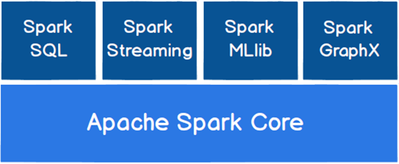
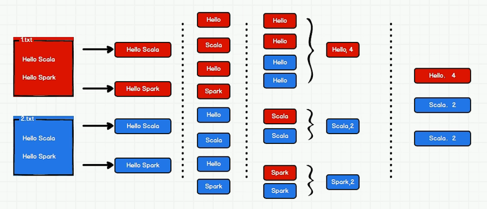

# Spark

Spark 是一种基于内存的快速、通用、可扩展的大数据分析计算引擎。

⚫  Spark 是一种由 Scala 语言开发的快速、通用、可扩展的大数据分析引擎

⚫  Spark Core 中提供了 Spark 最基础与最核心的功能

⚫  Spark SQL 是Spark 用来操作结构化数据的组件。通过 Spark SQL，用户可以使用SQL 或者 Apache Hive 版本的 SQL 方言（HQL）来查询数据。

⚫  Spark Streaming 是 Spark 平台上针对实时数据进行流式计算的组件，提供了丰富的处理数据流的API。

- Hadoop MapReduce 由于其设计初衷并不是为了满足循环迭代式数据流处理，因此在多并行运行的数据可复用场景（如：机器学习、图挖掘算法、交互式数据挖掘算法）中存在诸多计算效率等问题。

- 所以 Spark 应运而生，Spark 就是在传统的MapReduce 计算框架的基础上，利用其计算过程的优化，从而大大加快了数据分析、挖掘的运行和读写速度，并将计算单元缩小到更适合并行计算和重复使用的RDD 计算模型。

- 机器学习中 ALS、凸优化梯度下降等。这些都需要基于数据集或者数据集的衍生数据反复查询反复操作。MR 这种模式不太合适，即使多 MR 串行处理，性能和时间也是一个问题。数据的共享依赖于磁盘。另外一种是交互式数据挖掘，MR 显然不擅长。而Spark 所基于的 scala 语言恰恰擅长函数的处理。

- Spark 是一个分布式数据快速分析项目。它的核心技术是弹性分布式数据集`（Resilient Distributed Datasets）`，提供了比MapReduce 丰富的模型，可以快速在内存中对数据集进行多次迭代，来支持复杂的数据挖掘算法和图形计算算法。

- Spark 和 Hadoop 的根本差异是多个作业之间的数据通信问题 : Spark 多个作业之间数据通信是基于内存，而 Hadoop 是基于磁盘。

- Spark Task 的启动时间快。Spark 采用 fork 线程的方式，而 Hadoop 采用创建新的进程的方式。

- Spark 只有在 shuffle 的时候将数据写入磁盘，而 Hadoop 中多个 MR 作业之间的数据交互都要依赖于磁盘交互

- Spark 的缓存机制比HDFS 的缓存机制高效。

## 核心模块

**Ø Spark Core**

Spark Core 中提供了 Spark 最基础与最核心的功能，Spark 其他的功能如：Spark SQL， Spark Streaming，GraphX, MLlib 都是在 Spark Core 的基础上进行扩展的

**Ø Spark SQL**

Spark SQL 是Spark 用来操作结构化数据的组件。通过 Spark SQL，用户可以使用 SQL或者Apache Hive 版本的 SQL 方言（HQL）来查询数据。

**Ø Spark Streaming**

Spark Streaming 是 Spark 平台上针对实时数据进行流式计算的组件，提供了丰富的处理数据流的API。

**Ø Spark MLlib**

MLlib 是 Spark 提供的一个机器学习算法库。MLlib 不仅提供了模型评估、数据导入等额外的功能，还提供了一些更底层的机器学习原语。

**Ø Spark GraphX**

GraphX 是 Spark 面向图计算提供的框架与算法库。

