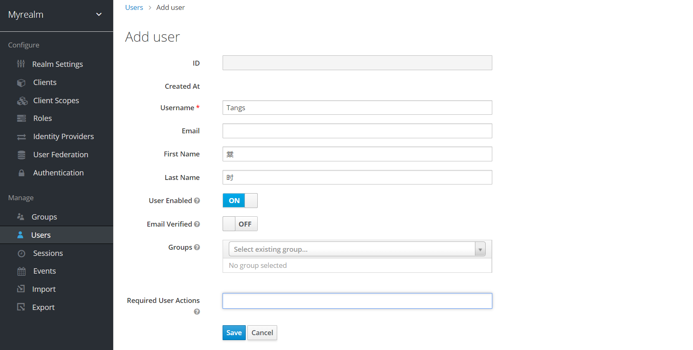
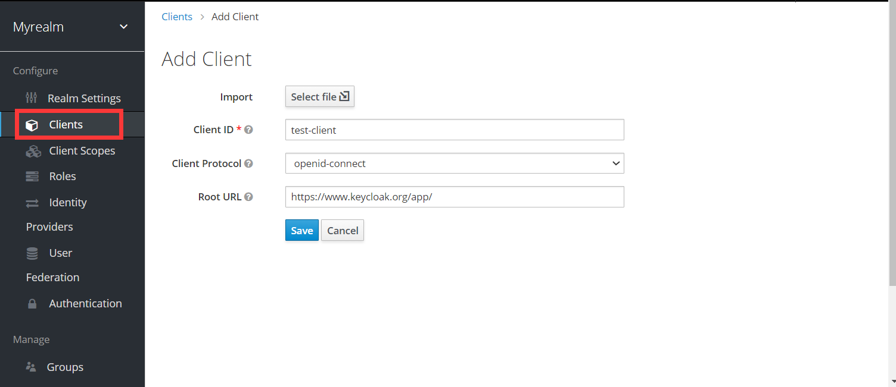

# 多阶段 构建

在一个 Dockerfile 中声明多个 FROM，选择性地将一个阶段生成的文件拷贝到另外一个阶段中
从而实现最终的镜像只保留需要的环境和文件

```dockerfile
FROM golang:1.13 AS Builder
WORKDIR /go/src/github.com/wilhelmguo/multi-stage-demo
COPY main.go .
RUN CGO_ENABLED=0 GOOS=linux go build -o http-server .

FROM alpine:latest
WORKDIR /root/
COPY --from=0或者Builder /go/src/github.com/wilhelmguo/multi-stage-demo/http-server .
CMD ["./http-server"]
```

```bash
docker build --no-cache -t http-server-with-multi-stage:latest .

# 在编译阶段调试 Dockerfile 文件
docker build --target Builder -t http-server:latest .

# 想要拷贝 nginx 官方镜像的配置文件到自己的镜像中
COPY --from=nginx:latest /etc/nginx/nginx.conf /etc/local/nginx.conf

docker images ls http-server
```


# 一、Nginx

```shell
# nginx 
docker pull nginx:1.21.1-alpine

# 内部配置文件启动
docker run --name nginx -p 8080:80 -d nginx:1.21.1-alpine

# 拷贝配置文件
docker cp nginx:/etc/nginx/nginx.conf /root/nginx/conf/nginx.conf
docker cp nginx:/etc/nginx/conf.d /root/nginx/conf.d

# 注意 nginx.conf 结尾：include /etc/nginx/conf.d/*.conf;
# 所以, nginx 配置 server 需要在 conf.d 文件夹下配置
# docker run --name nginx --net host

docker run --name nginx -p 3309:80 \
  -v /home/docker/nginx/conf/nginx.conf:/etc/nginx/nginx.conf:ro \
  -v /home/docker/nginx/conf.d:/etc/nginx/conf.d \
  -v /home/docker/nginx/web:/web \
  -d nginx

# 挂载配置文件
-v /host/path/nginx.conf:/etc/nginx/nginx.conf:ro
-v /mnt:/mnt

# 
-v /some/content:/usr/share/nginx/html:ro
```

## 1.1 部署 Front Project

```bash
# Dockerfile
FROM nginx
# 将dist目录复制到 nginx 的默认静态文件目录下
COPY ./dist /usr/share/nginx/html
# 暴露 80 端口
EXPOSE 80

docker build -t soybean-admin .

docker run -d -p 8081:80 soybean-admin
```

## 1.2 部署临时网盘

```bash
user root;
worker_processes auto;
error_log  /var/log/nginx/error.log warn;
pid        /var/run/nginx.pid;

worker_rlimit_nofile 65535;

events {
    worker_connections 65535;
}
http {
    default_type  application/octet-stream;
    sendfile        on;
    keepalive_timeout  65000;
    
    server {
        listen       80;
        server_name gardenia.com;
        error_page 500  502 504 503  /50x.html;

        location /download {
              alias  /mnt;
              sendfile on;
              autoindex on;  # 开启目录文件列表
              autoindex_exact_size on;  # 显示出文件的确切大小，单位是bytes
              autoindex_localtime on;  # 显示的文件时间为文件的服务器时间
              charset utf-8,gbk;  # 避免中文乱码
              client_max_body_size 10000M;
        }
    }
}
```


# 二、Mysql

```shell
# mysql8
docker pull mysql:8.0.26

# 内部配置文件启动
docker run --name mysql8 -e MYSQL_ROOT_PASSWORD=333 \
-p 3309:3306 \
-d mysql:8.0.26

# 拷贝配置文件
# 配置文件可以拷贝 /etc/mysql/conf.d
docker cp mysql8:/etc/mysql/my.cnf /root/mysql8/conf/my.cnf

# 以外部配置文件启动
docker run --name mysql_jeecg -e MYSQL_ROOT_PASSWORD=333666 -p 3309:3306 \
  -v /home/docker/mysql/conf:/etc/mysql/my.cnf \
  -v /home/docker/mysql/logs:/logs \
  -v /home/docker/mysql/data:/var/lib/mysql \
  -d mysql

# 此命令中仅使用自定义配置文件的目录路径
docker run -p 3309:3306 \
	--name mysql_jeecg \
  -v /home/docker/mysql/conf:/etc/mysql/my.cnf \
  -v /home/docker/mysql/logs:/logs \
  -v /home/docker/mysql/data:/var/lib/mysql \
  -e MYSQL_ROOT_PASSWORD=333666 \
  -d mysql
```


# 三、Keycloak 部署

## 1. 使用自带的H2数据库部署

```shell
docker run --name keycloak -p 8000:8080 -e KEYCLOAK_USER=Ringo -e KEYCLOAK_PASSWORD=123 -d jboss/keycloak:latest
```


## 2. 使用MySQL数据库部署

```shell
# 创建 docker 网络
docker network create keycloak-network

# 安装mysql（需要提前创建好数据库 默认数据库名keycloak）
docker run -d -p 3306:3306 --name mysql \
-v /root/mysql/conf:/etc/mysql/conf.d \
-v /root/mysql/log:/logs \
-v /root/mysql/data:/var/lib/mysql \
--net keycloak-network \
-e MYSQL_ROOT_PASSWORD=333 \
mysql:5.7

# 安装 keycloak
docker run --name keycloak -d -p 8000:8080 --net keycloak-network \
-e DB_DATABASE=keycloak -e JDBC_PARAMS='useSSL=false&serverTimezone=Asia/Shanghai' \
-e KEYCLOAK_USER=Ringo -e KEYCLOAK_PASSWORD=123 \
-e DB_USER=root -e DB_PASSWORD=333 jboss/keycloak:latest
```

**解决HTTPS require问题**

```shell
# 进入到容器
docker exec -it [keycloak containerId] /bin/bash

cd keycloak/bin

# 输入创建的用户名和密码(注意这里的--user Ringo是启动容器时配置的！)
./kcadm.sh config credentials --server http://localhost:8080/auth --realm master --user Ringo

# 禁用 ssl 即可
./kcadm.sh update realms/master -s sslRequired=NONE
```

流程图如下所示：


**Getting Start**

1. 创建realm(领域)

> 在 `keycloak` 中一个 `realm` 和 `tanant`  （租客）是等价的。它允许创建独立的应用程序和用户组。在 `keycloak` 中默认有一个 `realm` 称为 `master`。它用于管理整个 `keycloak`，而不是用于自己的应用程序。

创建自己的 `realm`：

- 打开 `keycloak admin console`。
- 鼠标移动到左上角 `Master` 旁边的箭头，然后点击 `Add realm` 按钮
- 在输入框中添加你准备的 `realm` 名字，然后点击 `Create` 按钮


2. 创建User(用户)

新的`realm`领域初始化之后，并没有用户。下面来创建用户：

- 打开 `keycloak admin console`。
- 点击 `users` （左侧下方菜单）。然后点击 `Add user` 按钮。
  - 添加`username、FirstName、LastName`。（带 `*` 号是必填字段）。
- 最后点击 `save` 按钮即可。




创建的用户需要初始化密码才能登录：

- 点击页面上的 `credentials` 选项卡。
- 输入密码并确认密码。
- `Temporary ` 启用（ON），在首次登录时需要修改密码。我们不启用。


3. 登录到账户控制台

登录到账户控制台来验证用户配置是否正确：

- 访问 `/auth/realms/myrealm/account` 路径。这里的  `myrealm` 是我们自己创建的 `realm` 名字。
- 登录之前创建的账号。点击 `Personal Info` 选项即可完善用户信息。

4. keycloak保护应用

使用 `keycloak` 保护应用，第一步就是在 `keycloak instance`（实例）上注册你的 `application`（应用）。

- 打开控制台 。访问路径`/auth/admin`。
- 点击 `Clients` 选项。点击 `Create` 按钮。
- 添加以下测试字段。
  - Client ID: `test-client`。
  - Client Protocol：openid-connect。
  - Root URL: `https://www.keycloak.org/app/`。
- 点击 `save`。




为了测试方便 Keycloak 官网上提供了一个SPA测试应用。打开[测试网站](https://www.keycloak.org/app/)，修改配置，点击 `save` 保存。


现在您可以单击`Sign in`以使用您之前启动的 Keycloak 服务器对该应用程序进行身份验证。

```
http://39.97.3%2C60:8080/auth/realms/test-realm/protocol/openid-connect/auth?client_id=myclient&redirect_uri=https%3A%2F%2Fwww.keycloak.org%2Fapp%2F%23url%3Dhttp%3A%2F%2F39.97.3%2C60%3A8080%2Fauth%26realm%3Dtest-realm%26client%3Dmyclient&state=442da6db-f580-458d-8fd5-5068cf432586&response_mode=fragment&response_type=code&scope=openid&nonce=ed47aaeb-04eb-4c96-825b-58d1bfd9c7c2
```

# 四、Kafka

[参考](https://zhuanlan.zhihu.com/p/109480358)

## zookeeper

```shell

docker pull zookeeper:3.7.0
docker run --name zookeeper -p 2181:2181 -d zookeeper:3.7.0
```

```shell
global:
  scrape_interval: 15s
  evaluation_interval: 15s

scrape_configs:
  - job_name: 'prometheus'
    static_configs:
      - targets: ['localhost:9090']

  - job_name: 'redis'
    static_configs:
      - targets: ['redis:6379']

  - job_name: 'kafka'
    metrics_path: /metrics
    static_configs:
      - targets: ['kafka1:9081', 'kafka2:9082', 'kafka3:9083']
      labels:
        instance: kafka
```

```yaml
version: '3.9'

services:
  redis:
    image: redis:latest
    container_name: redis
    restart: always
    ports:
      - "6379:6379"
    networks:
      - backend

  zookeeper:
    image: bitnami/zookeeper:latest
    container_name: zookeeper
    ports:
      - '2181:2181'
    restart: always
    environment:
      ZOOKEEPER_CLIENT_PORT: 2181
      ZOOKEEPER_TICK_TIME: 2000
      ALLOW_ANONYMOUS_LOGIN: yes
    networks:
      - backend

  kafka1:
    image: bitnami/kafka
    container_name: kafka1
    hostname: kafka1
    restart: always
    depends_on:
      - zookeeper
    ports:
      - "9081:9092"
    environment:
      KAFKA_BROKER_ID: 1
      KAFKA_OFFSETS_TOPIC_REPLICATION_FACTOR: 1
      KAFKA_ZOOKEEPER_CONNECT: zookeeper:2181
      ALLOW_PLAINTEXT_LISTENER: yes
      KAFKA_LISTENERS: CLIENT://:9092,EXTERNAL://:9081
      KAFKA_CFG_LISTENERS: CLIENT://:9092,EXTERNAL://:9081
      KAFKA_INTER_BROKER_LISTENER_NAME: CLIENT
      KAFKA_LISTENER_SECURITY_PROTOCOL_MAP: CLIENT:PLAINTEXT,EXTERNAL:PLAINTEXT
      KAFKA_ADVERTISED_LISTENERS: CLIENT://kafka1:9092,EXTERNAL://localhost:9081
    networks:
      - backend

  kafka2:
    image: bitnami/kafka
    container_name: kafka2
    hostname: kafka2
    restart: always
    depends_on:
      - zookeeper
    ports:
      - "9082:9092"
    environment:
      KAFKA_OFFSETS_TOPIC_REPLICATION_FACTOR: 1
      ALLOW_PLAINTEXT_LISTENER: yes
      KAFKA_ZOOKEEPER_CONNECT: zookeeper:2181
      KAFKA_BROKER_ID: 2
    networks:
      - backend
  kafka3:
    image: bitnami/kafka
    container_name: kafka3
    hostname: kafka3
    restart: always
    depends_on:
      - zookeeper
    ports:
      - "9083:9092"
    environment:
      KAFKA_OFFSETS_TOPIC_REPLICATION_FACTOR: 1
      ALLOW_PLAINTEXT_LISTENER: yes
      KAFKA_ZOOKEEPER_CONNECT: zookeeper:2181
      KAFKA_BROKER_ID: 3
    networks:
      - backend

  kafka-ui:
    image: provectuslabs/kafka-ui:latest
    container_name:  kafka-ui
    restart: always
    depends_on:
      - kafka1
      - kafka2
      - kafka3
    ports:
      - "8080:8080"
    environment:
      KAFKA_CLUSTERS_0_NAME: kafka1
      KAFKA_CLUSTERS_1_NAME: kafka2
      KAFKA_CLUSTERS_2_NAME: kafka3
      KAFKA_CLUSTERS_0_BOOTSTRAPSERVERS: kafka1:9092
      KAFKA_CLUSTERS_1_BOOTSTRAPSERVERS: kafka2:9092
      KAFKA_CLUSTERS_2_BOOTSTRAPSERVERS: kafka3:9092
    networks:
      - backend
	
  kafka-eagle:
    image: nickzurich/efak:latest
    container_name: kafka-eagle
    ports:
      - "9048:8048"
    depends_on:
      - zookeeper
    environment:
      EFAK_CLUSTER_ZK_LIST: zookeeper:2181
      EFAK_LOGIN_USERNAME: "admin"
      EFAK_LOGIN_PASSWORD: "151613"
    restart: always
    networks:
      - backend

  prometheus:
    image: prom/prometheus:latest
    container_name: prometheus
    restart: always
    volumes:
      - ./prometheus.yml:/etc/prometheus/prometheus.yml
    ports:
      - "9090:9090"
    networks:
      - backend

  grafana:
    image: grafana/grafana:latest
    container_name: grafana
    restart: always
    depends_on:
      - prometheus
    ports:
      - "3000:3000"
    networks:
      - backend

networks:
  backend:
    name: backend
```


```bash
docker compose -f docker-compose.yml up -d

docker compose -f kafka_env.yml up -d --no-deps --force-recreate kafka1 kafka2 kafka3
```

> https://redis.io/insight/#insight-form


# 五、如何将镜像推送到阿里云容器镜像服务

## 前言

​	原来我都是将镜像推送到Dockerhub中的，因为Dockerhub是国外的软件，所以经常会各种超时的问题，这阵子研究了一下阿里云容器镜像服务，发现可以把一些常用的镜像推送到自己的容器镜像仓库里，然后就可以快速的进行拉取了~，所以我也打算将博客的镜像也推送到阿里云，提高后面镜像拉取的速度。

## 阿里云容器镜像服务

首先我们需要开通 [阿里云容器镜像服务](https://cr.console.aliyun.com/cn-qingdao/instances/repositories) ，然后创建命名空间

这里我已经创建了一个 `mogublog`，创建完成后，我们需要到访问凭证设置我们的密码，然后复制 登录脚本

然后在我们的服务器登录docker进行测试

```bash
# 登录阿里云容器镜像服务
docker login --username=moxi****@163.com registry.cn-shenzhen.aliyuncs.com
```

## 提交镜像

登录后，首先可以查看目前已经存在的镜像有哪些

我们就可以开始给镜像打tag了 【针对已经制作好的镜像打TAG】

```bash
# 格式
docker tag [ImageId] registry.cn-shenzhen.aliyuncs.com/mogublog/mogu_admin:[镜像版本号]
# 样例代码【如下】
docker tag 5f96da15eb94  registry.cn-shenzhen.aliyuncs.com/mogublog/mogu_blog_nacos:latest
```

如果你的镜像没有制作好，可以先制作镜像

```bash
# 查看容器ID
docker ps -a
# 提交镜像
docker commit -m "制作镜像" 容器ID registry.cn-shenzhen.aliyuncs.com/mogublog/mogu_blog_nacos:latest
```

打完tag后，我们就能够看到我们的镜像的tag了

```bash
docker images;
```

下面我们就可以提交到我们的阿里云仓库

```bash
docker push registry.cn-shenzhen.aliyuncs.com/mogublog/mogu_blog_nacos:latest
```

推送完成后，我们到阿里云容器服务仓库，即可看到我们刚刚提交的了


# 六、使用 GithubAction 构建博客镜像提交 DockerHub

## 前言

​	这阵子使用DockerCompose部署博客， 但是还存在一些问题，就是每次我们需要下载 [博客](https://gitee.com/moxi159753/mogu_blog_v2) 源码，然后进行编译，打包，部署。而因为博客还是前后端分离项目，因此为了完成这一系列的操作，就需要在环境中安装maven、node、git 等环境。但是因为这些环境只是在我们项目的构建阶段才会使用，而构建项目完成后，就不需要使用了，因此就打算使用Github Actions在代码提交的后，我们提前把博客的镜像给构建完成，然后上传到DockerHub上，最后在其它人需要使用的时候，就不需要自己重新构建镜像了，而是直接拉取线上的镜像，完成项目的部署。

如果你想了解Github Actions的使用，参考：[使用Github Action完成博客持续集成](http://www.moguit.cn/#/info?blogUid=0762bfb392c2cf0a94c8a7934fe46f8f)

如果你想知道更多的官方Actions，参考：[Build and push Docker images](https://github.com/marketplace/actions/build-and-push-docker-images)

如果想了解博客镜像构建和部署，参考： [使用DockerCompose制作博客YAML镜像文件](http://www.moguit.cn/#/info?blogOid=567)

如果想快速一键部署博客，参考：[DockerCompose一键部署博客(Nacos版)](http://www.moguit.cn/#/info?blogOid=565)

## 环境准备

因为我们需要在Actions中进行镜像构建，首先我们需要创建一个Github Actions的任务，首先定义我们的 actions name，以及触发的条件【触发条件这里有两种，一种是根据tag操作触发，一种是push操作触发】

```bash
name: Master-Build-Docker-Images
# 根据tag操作触发
on:
  push:
    # 每次 push tag 时进行构建，不需要每次 push 都构建。
    # 使用通配符匹配每次 tag 的提交，记得 tag 名一定要以 v 开头
    tags:
      - v*
      
# 根据push操作触发
on:
  push:
    branches:
      - Nacos

```

然后我们就需要在里面引入我们的环境依赖，因此我们引入以下环境

- git拉取代码
- java环境
- docker环境

```bash
jobs:
  push:
    # 如果需要在构建前进行测试的话需要取消下面的注释和上面对应的 test 动作的注释。
    # needs: test

    runs-on: ubuntu-latest
    steps:
      - uses: actions/checkout@v2
      - uses: actions/setup-java@v1
        with:
          java-version: 1.8
      - uses: docker/setup-buildx-action@v1
```

## 构建镜像

在我们完成基础环境的搭建后，我们就可以开始使用maven命令 构建我们的镜像了，其实就是运行以下的脚本

```bash
# 安装依赖
mvn clean install
# 打包
mvn docker:build
```

但是在我们进行打包操作的时候，我们需要在 pom文件中添加docker打包插件，以及Dockerfile文件

```bash
<!--docker镜像build插件-->
<plugin>
    <groupId>com.spotify</groupId>
    <artifactId>docker-maven-plugin</artifactId>
    <version>1.2.0</version>
    <configuration>
        <!-- 注意imageName一定要是符合正则[a-z0-9-_.]的，否则构建不会成功 -->
        <imageName>moxi/${project.artifactId}</imageName>
        <dockerDirectory>${project.basedir}/src/main/resources</dockerDirectory>
        <rm>true</rm>
        <resources>
            <resource>
                <targetPath>/</targetPath>
                <directory>${project.build.directory}</directory>
                <include>${project.build.finalName}.jar</include>
            </resource>
        </resources>
    </configuration>
</plugin>
```

在pom文件中，我们指定了Dockerfile文件路径，以及最后打包的镜像名称


同时在Dockerfile文件中，主要定义的就是一些镜像相关的信息，主要包括依赖的java环境，启动时的JVM参数

```bash
FROM java:alpine
VOLUME /tmp
ADD mogu_admin-0.0.1-SNAPSHOT.jar app.jar
ENTRYPOINT ["java","-Xms256m","-Xmx256m","-jar","/app.jar"]
```

完整的镜像构建过程如下：

```bash
        # 构建镜像，指定镜像名
      - name: Build Docker Images
        run: |
          echo '=====开始mvn clean====='
          mvn clean

          echo '=====开始mvn install&&package====='
          mvn install -DskipTests=true && mvn package -DskipTests=true

          echo '=====开始构建镜像====='
          echo '=====开始构建mogu_admin====='
          cd mogu_admin
          mvn docker:build
          cd ..

          echo '=====开始构建mogu_gateway====='
          cd mogu_gateway
          mvn docker:build
          cd ..

          echo '=====开始构建mogu_monitor====='
          cd mogu_monitor
          mvn docker:build
          cd ..

          echo '=====开始构建mogu_picture====='
          cd mogu_picture
          mvn docker:build
          cd ..

          echo '=====开始构建mogu_search====='
          cd mogu_search
          mvn docker:build
          cd ..

          echo '=====开始构建mogu_sms====='
          cd mogu_sms
          mvn docker:build
          cd ..

          echo '=====开始构建mogu_spider====='
          cd mogu_spider
          mvn docker:build
          cd ..

          echo '=====开始构建mogu_web====='
          cd mogu_web
          mvn docker:build
          cd ..

          echo '=====镜像构建结束====='
```

## 登录镜像网站

### 登录DockerHub

登录DockerHub，将我们构建成功的镜像上传

```bash
# 登录到 dockerhub，使用 GitHub secrets 传入账号密码，密码被加密存储在 GitHub 服务器
- name: Login to DockerHub
    uses: docker/login-action@v1
    with:
      username: ${{ secrets.DOCKER_HUB_USER_NAME }}
      password: ${{ secrets.DOCKER_HUB_PASSWORD }}
```

上面的一部分，使用到了Github的加密方式 Secrets，将我们项目中的敏感信息储存在secrets中，然后通过`${{ secrets.XX }}` 的方式获取，Secrets的存储在下图所示


我们通过 new repository secret，给我们的项目添加密钥，这里主要是对DockerHub的用户名和密码加密，防止直接泄漏在我们的仓库中

### 提交阿里云

如果我们要提交到 [Aliyun容器镜像服务](https://cr.console.aliyun.com/) ，那么就应该这样写 【这里主要以提交DockerHub为重心】

```yaml
      # 登录到 阿里云镜像服务，使用 GitHub secrets 传入账号密码，密码被加密存储在 GitHub 服务器
      - name: Login to Aliyun
        uses: docker/login-action@v1
        with:
          registry: registry.cn-shenzhen.aliyuncs.com
          username: ${{ secrets.ALIYUN_USER_NAME }}
          password: ${{ secrets.ALIYUN_PASSWORD }}
```

同时要求我们的镜像前缀为 `registry.cn-shenzhen.aliyuncs.com/mogublog` ，其中 mogublog 为我们阿里云容器镜像服务的命名空间


最后我们在 maven打包的pom文件中，就需要修改我们的前缀了

```pom
<!--docker镜像build插件-->
<plugin>
    <groupId>com.spotify</groupId>
    <artifactId>docker-maven-plugin</artifactId>
    <version>1.2.0</version>
    <configuration>
        <!-- 注意imageName一定要是符合正则[a-z0-9-_.]的，否则构建不会成功 -->
        <imageName>registry.cn-shenzhen.aliyuncs.com/mogublog/${project.artifactId}</imageName>
        <dockerDirectory>${project.basedir}/src/main/resources</dockerDirectory>
        <rm>true</rm>
        <resources>
            <resource>
                <targetPath>/</targetPath>
                <directory>${project.build.directory}</directory>
                <include>${project.build.finalName}.jar</include>
            </resource>
        </resources>
    </configuration>
</plugin>
```

并且vue打包的时候，也需要使用对应的前缀

```bash
# 打包镜像
docker build -t registry.cn-shenzhen.aliyuncs.com/mogublog/vue_mogu_web .
# 提交镜像
docker push registry.cn-shenzhen.aliyuncs.com/mogublog/vue_mogu_web
```

在我们完成DockerHub的登录后，我们就可以使用 `docker push 镜像名`   提交我们的镜像了

脚本如下

```bash
      - name: Push Docker Image
        run: |
          echo '=====开始上传镜像====='
          echo '=====开始上传mogu_admin====='
          docker push moxi/mogu_admin

          echo '=====开始上传mogu_gateway====='
          docker push moxi/mogu_gateway

          echo '=====开始上传mogu_monitor====='
          docker push moxi/mogu_monitor

          echo '=====开始上传mogu_picture====='
          docker push moxi/mogu_picture

          echo '=====开始上传mogu_search====='
          docker push moxi/mogu_search

          echo '=====开始上传mogu_sms====='
          docker push moxi/mogu_sms

          echo '=====开始上传mogu_spider====='
          docker push moxi/mogu_spider

          echo '=====开始上传mogu_web====='
          docker push moxi/mogu_web
```

## 完整脚本

### DockerHub

上传至DockerHub的完整的脚本，如下所示： `actions_master_build_image.yml` 

```bash
name: Master-Build-Docker-Images

#on:
#  push:
#    # 每次 push tag 时进行构建，不需要每次 push 都构建。使用通配符匹配每次 tag 的提交，记得 tag 名一定要以 v 开头
#    tags:
#      - v*

on:
  push:
    branches:
      - Nacos

jobs:
  push:
    # 如果需要在构建前进行测试的话需要取消下面的注释和上面对应的 test 动作的注释。
    # needs: test

    runs-on: ubuntu-latest
    steps:
      - uses: actions/checkout@v2
      - uses: actions/setup-java@v1
        with:
          java-version: 1.8
      - uses: docker/setup-buildx-action@v1
        # 构建镜像，指定镜像名
      - name: Build Docker Images
        run: |
          echo '=====开始mvn clean====='
          mvn clean

          echo '=====开始mvn install&&package====='
          mvn install -DskipTests=true && mvn package -DskipTests=true

          echo '=====开始构建镜像====='
          echo '=====开始构建mogu_admin====='
          cd mogu_admin
          mvn docker:build
          cd ..

          echo '=====开始构建mogu_gateway====='
          cd mogu_gateway
          mvn docker:build
          cd ..

          echo '=====开始构建mogu_monitor====='
          cd mogu_monitor
          mvn docker:build
          cd ..

          echo '=====开始构建mogu_picture====='
          cd mogu_picture
          mvn docker:build
          cd ..

          echo '=====开始构建mogu_search====='
          cd mogu_search
          mvn docker:build
          cd ..

          echo '=====开始构建mogu_sms====='
          cd mogu_sms
          mvn docker:build
          cd ..

          echo '=====开始构建mogu_spider====='
          cd mogu_spider
          mvn docker:build
          cd ..

          echo '=====开始构建mogu_web====='
          cd mogu_web
          mvn docker:build
          cd ..

          echo '=====镜像构建结束====='

      # 登录到 dockerhub，使用 GitHub secrets 传入账号密码，密码被加密存储在 GitHub 服务器
      - name: Login to DockerHub
        uses: docker/login-action@v1
        with:
          username: ${{ secrets.DOCKER_HUB_USER_NAME }}
          password: ${{ secrets.DOCKER_HUB_PASSWORD }}

      - name: Push Docker Image
        run: |
          echo '=====开始上传镜像====='
          echo '=====开始上传mogu_admin====='
          docker push moxi/mogu_admin

          echo '=====开始上传mogu_gateway====='
          docker push moxi/mogu_gateway

          echo '=====开始上传mogu_monitor====='
          docker push moxi/mogu_monitor

          echo '=====开始上传mogu_picture====='
          docker push moxi/mogu_picture

          echo '=====开始上传mogu_search====='
          docker push moxi/mogu_search

          echo '=====开始上传mogu_sms====='
          docker push moxi/mogu_sms

          echo '=====开始上传mogu_spider====='
          docker push moxi/mogu_spider

          echo '=====开始上传mogu_web====='
          docker push moxi/mogu_web

          echo '=====镜像上传结束====='

```

执行完脚本后，进入到 [DockerHub](https://registry.hub.docker.com/) 中，发现已经成功提交到仓库了


### 阿里云容器镜像服务

上传至阿里云容器镜像服务的完整的脚本，如下所示

```yaml
name: Master-Build-Docker-Images

#on:
#  push:
#    # 每次 push tag 时进行构建，不需要每次 push 都构建。使用通配符匹配每次 tag 的提交，记得 tag 名一定要以 v 开头
#    tags:
#      - v*

on:
  push:
    branches:
      - Nacos

jobs:
  push:
    # 如果需要在构建前进行测试的话需要取消下面的注释和上面对应的 test 动作的注释。
    # needs: test

    runs-on: ubuntu-latest
    steps:
      - uses: actions/checkout@v2
      - uses: actions/setup-java@v1
        with:
          java-version: 1.8
      - uses: docker/setup-buildx-action@v1
      - uses: actions/setup-node@v1
        with:
          node-version: 12.x
      # 安装maven依赖
      - name: Maven Clean Install
        run: |
          echo '=====开始mvn clean====='
          mvn clean

          echo '=====开始mvn install&&package====='
          mvn install -DskipTests=true && mvn package -DskipTests=true

      - name: Build vue_mogu_admin and vue_mogu_web
        run: |
          echo '=====开始安装Vue_mogu_admin依赖====='
          cd ./vue_mogu_admin
          npm install
          npm run build
          cd ..

          echo '=====开始安装Vue_mogu_web依赖====='
          cd ./vue_mogu_web
          npm install
          npm run build
          cd ..

        # 构建镜像，指定镜像名
      - name: Build Java Docker Images
        run: |

          echo '=====开始构建镜像====='
          echo '=====开始构建mogu_admin====='
          cd mogu_admin
          mvn docker:build
          cd ..

          echo '=====开始构建mogu_gateway====='
          cd mogu_gateway
          mvn docker:build
          cd ..

          echo '=====开始构建mogu_monitor====='
          cd mogu_monitor
          mvn docker:build
          cd ..

          echo '=====开始构建mogu_picture====='
          cd mogu_picture
          mvn docker:build
          cd ..

          echo '=====开始构建mogu_search====='
          cd mogu_search
          mvn docker:build
          cd ..

          echo '=====开始构建mogu_sms====='
          cd mogu_sms
          mvn docker:build
          cd ..

          echo '=====开始构建mogu_spider====='
          cd mogu_spider
          mvn docker:build
          cd ..

          echo '=====开始构建mogu_web====='
          cd mogu_web
          mvn docker:build
          cd ..

          echo '=====镜像构建结束====='

      # 构建镜像，指定镜像名
      - name: Build Vue Docker Images
        run: |

          echo '=====开始构建镜像====='
          echo '=====开始构建vue_mogu_admin====='
          cd vue_mogu_admin
          docker build -t registry.cn-shenzhen.aliyuncs.com/mogublog/vue_mogu_admin .
          cd ..

          cd vue_mogu_web
          docker build -t registry.cn-shenzhen.aliyuncs.com/mogublog/vue_mogu_web .
          cd ..

          echo '=====镜像构建结束====='

      # 登录到 阿里云镜像服务，使用 GitHub secrets 传入账号密码，密码被加密存储在 GitHub 服务器
      - name: Login to Aliyun
        uses: docker/login-action@v1
        with:
          registry: registry.cn-shenzhen.aliyuncs.com
          username: ${{ secrets.ALIYUN_USER_NAME }}
          password: ${{ secrets.ALIYUN_PASSWORD }}

      - name: Push Docker Image
        run: |
          echo '=====开始上传镜像====='
          echo '=====开始上传mogu_admin====='
          docker push registry.cn-shenzhen.aliyuncs.com/mogublog/mogu_admin

          echo '=====开始上传mogu_gateway====='
          docker push registry.cn-shenzhen.aliyuncs.com/mogublog/mogu_gateway

          echo '=====开始上传mogu_monitor====='
          docker push registry.cn-shenzhen.aliyuncs.com/mogublog/mogu_monitor

          echo '=====开始上传mogu_picture====='
          docker push registry.cn-shenzhen.aliyuncs.com/mogublog/mogu_picture

          echo '=====开始上传mogu_search====='
          docker push registry.cn-shenzhen.aliyuncs.com/mogublog/mogu_search

          echo '=====开始上传mogu_sms====='
          docker push registry.cn-shenzhen.aliyuncs.com/mogublog/mogu_sms

          echo '=====开始上传mogu_spider====='
          docker push registry.cn-shenzhen.aliyuncs.com/mogublog/mogu_spider

          echo '=====开始上传mogu_web====='
          docker push registry.cn-shenzhen.aliyuncs.com/mogublog/mogu_web

          echo '=====开始上传vue_mogu_admin====='
          docker push registry.cn-shenzhen.aliyuncs.com/mogublog/vue_mogu_admin

          echo '=====开始上传vue_mogu_web====='
          docker push registry.cn-shenzhen.aliyuncs.com/mogublog/vue_mogu_web

          echo '=====镜像上传结束====='
```

执行完上述脚本后，我们发现已经成功提交到  [阿里云容器镜像服务](https://cr.console.aliyun.com/)


到目前为止，自动化镜像制作已经完成了~


# 七、PostgreSQL

```bash
docker run -d --name some-postgres \
	-v "/etc/postgres/my-postgres.conf":/etc/postgresql/postgresql.conf \
	-e POSTGRES_PASSWORD=151613 \
  -e PGDATA=/var/lib/postgresql/data/pgdata \
	-v /var/lib/postgresql/data:/var/lib/postgresql/data \
	-p 9009:5432 \
	postgres
#	-c 'config_file=/etc/postgresql/postgresql.conf'
```


# 八、Hive

```bash
export HIVE_VERSION=4.0.0

docker run -d -p 10000:10000 -p 10002:10002 --env SERVICE_NAME=hiveserver2 \
  --env SERVICE_OPTS="-Dhive.metastore.uris=thrift://metastore:9083" \
  --mount source=warehouse,target=/opt/hive/data/warehouse \
  --env IS_RESUME="true" \
  --name hiveserver2 apache/hive:${HIVE_VERSION}


docker run -d -p 9083:9083 --env SERVICE_NAME=metastore --env DB_DRIVER=postgres \
 --env SERVICE_OPTS="-Djavax.jdo.option.ConnectionDriverName=org.postgresql.Driver -Djavax.jdo.option.ConnectionURL=jdbc:postgresql://postgres:5432/metastore_db -Djavax.jdo.option.ConnectionUserName=hive -Djavax.jdo.option.ConnectionPassword=password" \
	-v /opt/hive/conf:/hive_custom_conf --env HIVE_CUSTOM_CONF_DIR=/hive_custom_conf \
  --mount source=warehouse,target=/opt/hive/data/warehouse \
  --name metastore-standalone apache/hive:${HIVE_VERSION}
```


```bash
docker network create hadoop-network
```


```bash
version: '3.9'

services:


networks:
  hadoop-network:
    external: true
```


# 九、ENV

```bash
sudo yum install -y yum-utils

sudo yum-config-manager \
    --add-repo \
    https://download.docker.com/linux/centos/docker-ce.repo

sudo yum install docker-ce docker-ce-cli containerd.io docker-buildx-plugin docker-compose-plugin

sudo systemctl enable docker --now

#测试工作
docker ps
#  批量安装所有软件
docker compose  
```


# 十、GitLab

```bash
docker run -d \
  -hostname localhost \
  -p 8080:80 -p 2222:22 \
  --name gitlab \
  --restart always \
  --volume /tmp/gitlab/config:/etc/gitlab \
  --volume /tmp/gitlab/logs:/var/log/gitlab \
  --volume /tmp/gitlab/data:/var/opt/gitlab \
  gitlab/gitlab-ce:13.3.8-ce.0
```


# 十一、Jenkins

```bash
docker run -d --name=jenkins \
  -p 8888:8080 \
  -u root \
  --restart always \
  -v /var/run/docker.sock:/var/run/docker.sock \
  -v /usr/bin/docker:/usr/bin/docker \
  -v /tmp/jenkins_home:/var/jenkins_home \
  jenkins/jenkins:lts
  
docker logs -f jenkins
```


# 十二、Redis

```bash
docker run -p 6379:6379 \
  --name redis_jeecg \
  -v /home/docker/redis/redis.conf:/etc/redis/redis.conf \
  -v /home/docker/redis/data:/data \
  -d redis redis-server /etc/redis/redis.conf \
  --appendonly yes --requirepass Zdk@2024
```


