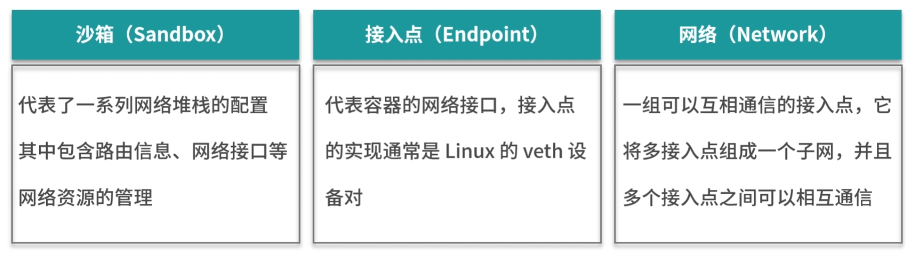
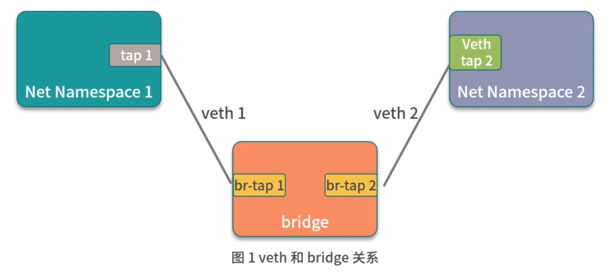
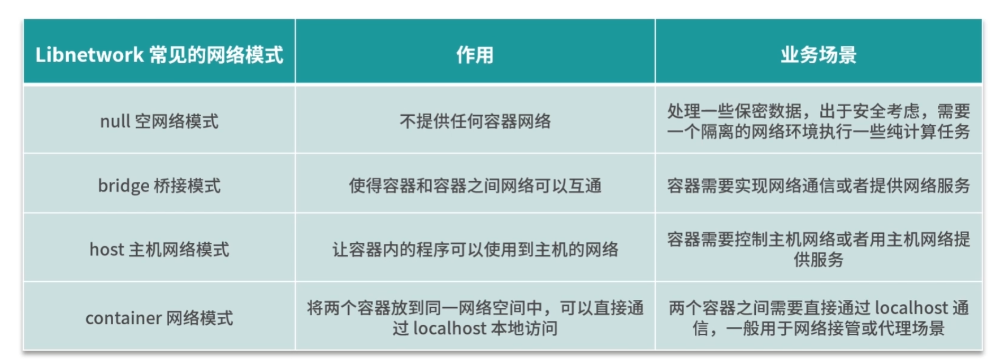
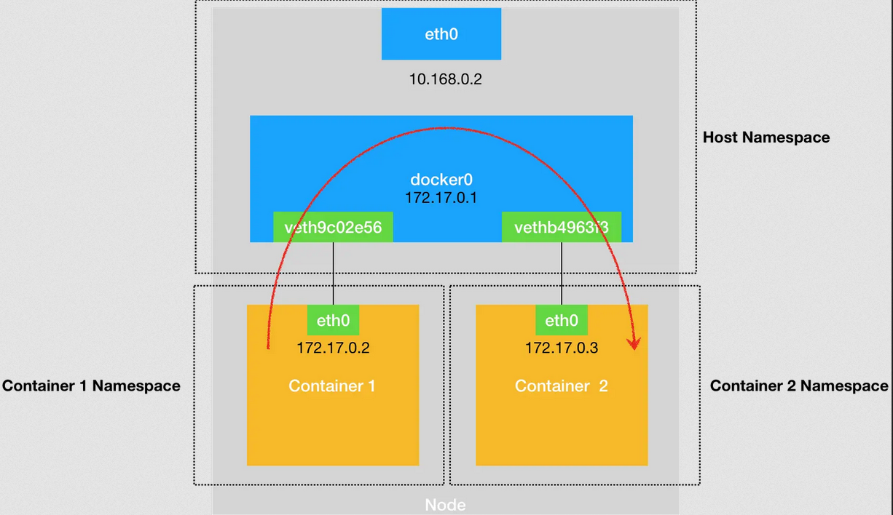
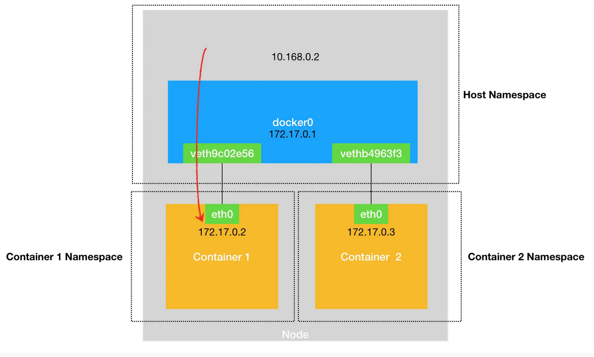
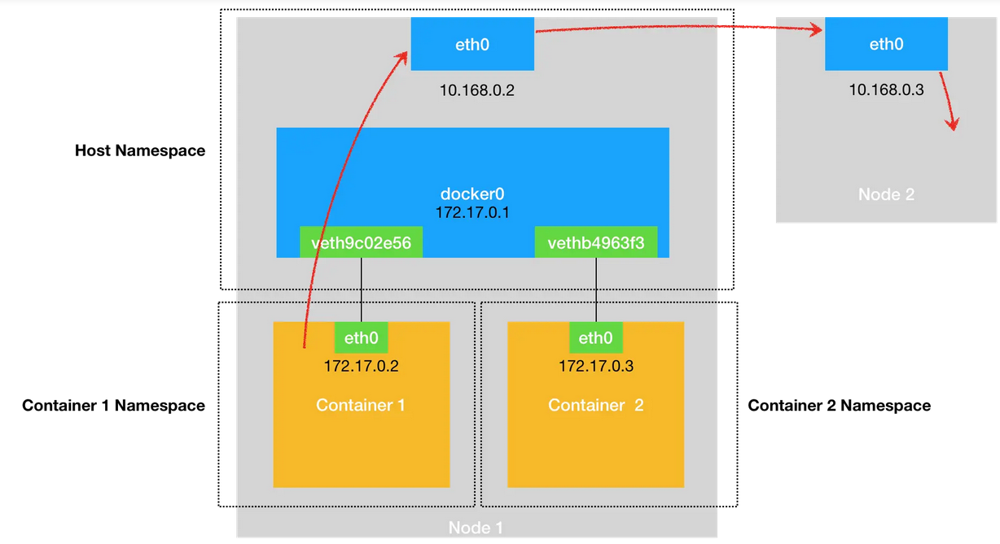
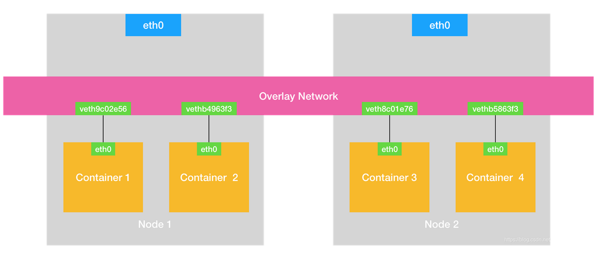
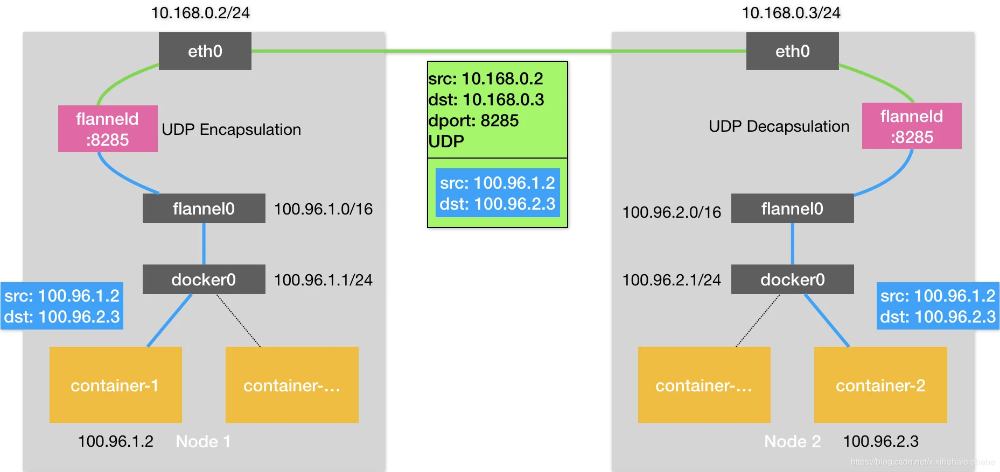
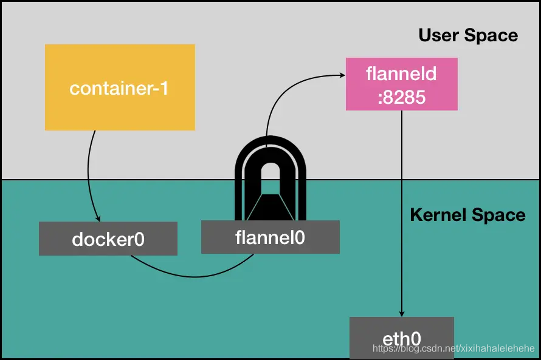
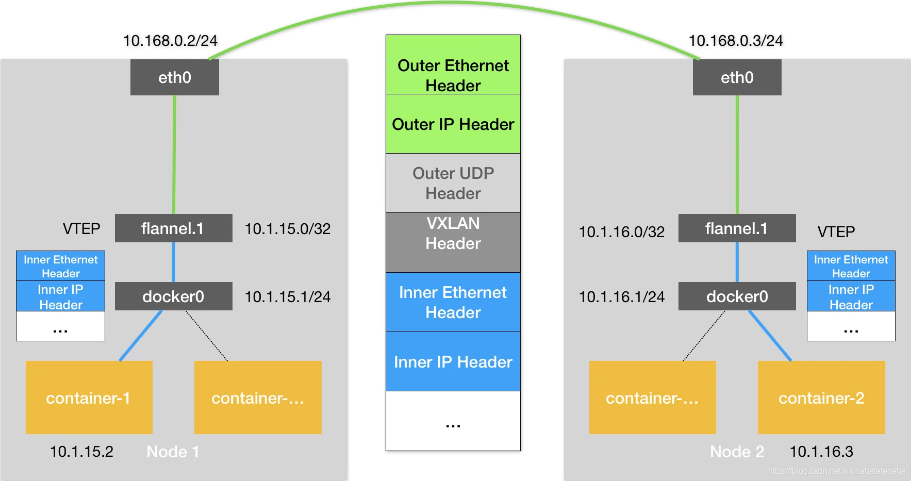

# Docker Network


从 1.7 版本开始，把网络和存储从 Docker 中以插件的形式剥离开来，并分别为其定义了标准
<p style="color:orange;text-align:center">Docker 定义的网络模型标准称之为 CNM (ContainerNetwork Model)</p>

CNM(ContainerNetwork Model)是 Docker发布的容器网络标准，只要满足 CNM 接口的网络方案都可以接入到 Docker容器网络




## Libnetwork 

Libnetwork 通过<span style="color:orange">插件</span>的形式为 Docker 提供网络功能
Libnetwork 是开源的，使用 Golang 编写，完全遵循 CNM 网络规范，是 CNM 的官方实现


### Libnetwork 的工作流程

第一步：Docker 通过调用 `libnetwork.New` 函数来创建 NetworkController 实例
```go
type NetworkControllerinterface {
  // 创建一个新的网络。 options参数用于指定特性类型的网络选项
  NewNetwork(networkType, name string, id string, options ..NetworkOption) (Network, error)
  //.此次省略部分接口
}
```

第二步：通过调用 NewNetwork 函数创建指定名称和类型的 Network
```go
type Network interface {
  //为该网络创建一个具有唯一指定名称的接入点(Endpoint)
  CreateEndpoint(name string, options ..EndpointOption)(Endpoint, error)
  //删除网络
  Delete() error
  //…此次省略部分接口
}
```

第三步：通过调用 CreateEndpoint 来创建接入点(Endpoint)
```go
// Endpoint 表示网络和沙箱之间的逻辑连接
type Endpoint interface {
  //将沙箱连接到接入点，并将为接入点分配的网络资源填充到沙箱中
  //the network resources allocated for the endpoint.
  Join(sandbox Sandbox,options ...EndpointOption) error
  //删除接入点
  Delete(force bool) error
  //.此次省略部分接口
}
```

第四步：调用 NewSandbox来创建容器沙箱，主要是初始化 Namespace 相关的资源
第五步：调用 Endpoint的 Join 函数将沙箱和网络接入点关联起来

### Libnetwork 常见网络模式

- null 空网络模式
  构建一个没有网络接入的容器环境
- host 主机网络模式
  可以让容器内的进程共享主机网络
  从而监听或修改主机网络
- container 网络模式
  可以将两个容器放在同一个网络命名空间内
- bridge 桥接模式
  可以打通容器与容器间网络通信的需求

1. **空网络模式**

使用 Docker 创建 null 空网络模式的容器时，容器拥有自己独立的 Net Namespace
在这种模式下，Docker除了为容器创建了 Net Namespace 外，没有创建任何网卡接口、IP 地址、路由等网络配置

```bash
# 使用 docker run 命令启动时，添加 --net=none 参数启动一个空网络模式的容器
docker run --net=none -it busybox

ifconfig
route -n
```

2. **桥接模式**

使用 bridge 网络可以实现容器与容器的互通，可以从一个容器直接通过容器 IP 访问到另外一个容器
使用 bridge 网络可以实现主机与容器的互通，在容器内启动的业务，可以从主机直接请求

```bash
```

> **Linux veth**
> veth 是 Linux 中的虚拟设备接口，都是成对出现的，可以用来连接虚拟网络设备
> 例如 veth 可以用来连通两个 Net Namespace，从而使得两个Net Namespace 之间可以互相访问
>
> **Linux bridge**
> Linux bridge 是一个虚拟设备，是用来连接网络的设备，可以用来转发两个Net Namespace 内的流量
>
> 
>
> Docker启动时，libnetwork 会在主机上创建 docker0 网桥，而 Docker 创建出的 brige 模式的容器都会连接 docker0 上

3. **网络模式**

container 网络模式允许一个容器共享另一个容器的网络命名空间
当两个容器需要共享网络，但其他资源仍然需要隔离时就可以使用 container 网络模式

```bash
# 启动一个 busybox1 容器
docker run -d --name=busybox1 busybox sleep 3600
docker exec -it busybox1 sh
# ifconfig

# busybox2 容器，通过 container 网络模式连接到 busybox1 的网络
docker run -it --net=container:busybox1 --name=busybox2 busybox sh
```


4. 主机网络模式
   - Libnetwork 不会为容器创建新的网络配置和 Net Namespace
   - Docker 容器中的进程直接共享主机的网络配置，可以直接使用主机的网络信息
   - 除了**网络共享主机的网络**外，其他的包括进程、文件系统、主机名等都是与主机隔离的

```bash
# 一个主机网络模式的 busybox 镜像
docker run -it --net=host busybox

ip a
```




## NetWork

网络栈”，就包括：网卡（Network Interface）、回环设备（Loopback Device）、路由表（Routing Table）和 iptables 规则

作为一个容器，它可以声明直接使用宿主机的网络栈（–net=host），即：不开启 Network Namespace，比如：

```bash
docker run –d –net=host --name nginx-host nginx
```

​	像这样直接使用宿主机网络栈的方式，虽然可以为容器提供良好的网络性能，但也会不可避免地引入共享网络资源的问题，比如端口冲突。所以，在大多数情况下，都希望容器进程能使用自己 Network Namespace 里的网络栈，即：拥有属于自己的 IP 地址和端口。

​	这时候，一个显而易见的问题就是：这个被隔离的容器进程，该如何跟其他 Network Namespace 里的容器进程进行交互呢？

​	为了理解这个问题，其实可以把每一个容器看做一台主机，它们都有一套独立的“网络栈”。如果想要实现两台主机之间的通信，最直接的办法，就是把它们用一根网线连接起来；而如果想要实现多台主机之间的通信，那就需要用网线，把它们连接在一台交换机上。

​	在 Linux 中，能够起到虚拟交换机作用的网络设备，是网桥（Bridge）。它是一个工作在数据链路层（Data Link）的设备，主要功能是根据 MAC 地址学习来将数据包转发到网桥的不同端口（Port）上。

​	为了实现上述目的，Docker 项目会默认在宿主机上创建一个名叫 docker0 的网桥，凡是连接在 docker0 网桥上的容器，就可以通过它来进行通信。可是，又该如何把这些容器“连接”到 docker0 网桥上呢？这时候，就需要使用一种名叫 Veth Pair 的虚拟设备了。

​	Veth Pair 设备的特点是：它被创建出来后，总是以两张虚拟网卡（Veth Peer）的形式成对出现的。并且，从其中一个“网卡”发出的数据包，可以直接出现在与它对应的另一张“网卡”上，哪怕这两个“网卡”在不同的 Network Namespace 里。

​	这就使得 Veth Pair 常常被用作连接不同 Network Namespace 的“网线”。比如，现在启动了一个叫作 nginx-1 的容器：

```yaml
$ docker run –d --name nginx-1 nginx

# 在宿主机上
$ docker exec -it nginx-1 /bin/bash
# 在容器里
root@2b3c181aecf1:/# ifconfig
eth0: flags=4163<UP,BROADCAST,RUNNING,MULTICAST>  mtu 1500
        inet 172.17.0.2  netmask 255.255.0.0  broadcast 0.0.0.0
        
...
        
$ route
Kernel IP routing table
Destination     Gateway         Genmask         Flags Metric Ref    Use Iface
default         172.17.0.1      0.0.0.0         UG    0      0        0 eth0
172.17.0.0      0.0.0.0         255.255.0.0     U     0      0        0 eth0
```

可以看到，这个容器里有一张叫作 eth0 的网卡，它正是一个 Veth Pair 设备在容器里的这一端。通过 route 命令查看 nginx-1 容器的[路由表](https://so.csdn.net/so/search?q=路由表&spm=1001.2101.3001.7020)，可以看到，这个 eth0 网卡是这个容器里的默认路由设备；所有对 172.17.0.0/16 网段的请求，也会被交给 eth0 来处理（第二条 172.17.0.0 路由规则）。

而这个 Veth Pair 设备的另一端，则在宿主机上。可以通过查看宿主机的网络设备看到它，如下所示：

```yaml
# 在宿主机上
$ ifconfig
...
docker0   Link encap:Ethernet  HWaddr 02:42:d8:e4:df:c1  
          inet addr:172.17.0.1  Bcast:0.0.0.0  Mask:255.255.0.0
...
          
$ brctl show
bridge name bridge id  STP enabled interfaces
docker0  8000.0242d8e4dfc1 no  veth9c02e56
```

通过 ifconfig 命令的输出，可以看到，nginx-1 容器对应的 Veth Pair 设备，在宿主机上是一张虚拟网卡。它的名字叫作 veth9c02e56。并且，通过 brctl show 的输出，可以看到这张网卡被“插”在了 docker0 上。

这时候，如果再在这台宿主机上启动另一个 Docker 容器，比如 nginx-2：

```yaml
$ docker run –d --name nginx-2 nginx
$ brctl show
bridge name bridge id  STP enabled interfaces
docker0  8000.0242d8e4dfc1 no  veth9c02e56
       vethb4963f3
```

​	就会发现一个新的、名叫 vethb4963f3 的虚拟网卡，也被“插”在了 docker0 网桥上。这时候，如果在 nginx-1 容器里 ping 一下 nginx-2 容器的 IP 地址（172.17.0.3），就会发现同一宿主机上的两个容器默认就是相互连通的。

​	当在 nginx-1 容器里访问 nginx-2 容器的 IP 地址（比如 ping 172.17.0.3）的时候，这个目的 IP 地址会匹配到 nginx-1 容器里的第二条路由规则。可以看到，这条路由规则的网关（Gateway）是 0.0.0.0，这就意味着这是一条直连规则，即：凡是匹配到这条规则的 IP 包，应该经过本机的 eth0 网卡，通过二层网络直接发往目的主机。

​	而要通过二层网络到达 nginx-2 容器，就需要有 172.17.0.3 这个 IP 地址对应的 MAC 地址。所以 nginx-1 容器的网络协议栈，就需要通过 eth0 网卡发送一个 ARP 广播，来通过 IP 地址查找对应的 MAC 地址。

​	前面提到过，这个 eth0 网卡，是一个 Veth Pair，它的一端在这个 nginx-1 容器的 Network Namespace 里，而另一端则位于宿主机上（Host Namespace），并且被“插”在了宿主机的 docker0 网桥上。

​	一旦一张虚拟网卡被“插”在网桥上，它就会变成该网桥的“从设备”。从设备会被“剥夺”调用网络协议栈处理数据包的资格，从而“降级”成为网桥上的一个端口。而这个端口唯一的作用，就是接收流入的数据包，然后把这些数据包的“生杀大权”（比如转发或者丢弃），全部交给对应的网桥。

​	所以，在收到这些 ARP 请求之后，docker0 网桥就会扮演二层交换机的角色，把 ARP 广播转发到其他被“插”在 docker0 上的虚拟网卡上。这样，同样连接在 docker0 上的 nginx-2 容器的网络协议栈就会收到这个 ARP 请求，从而将 172.17.0.3 所对应的 MAC 地址回复给 nginx-1 容器。

​	有了这个目的 MAC 地址，nginx-1 容器的 eth0 网卡就可以将数据包发出去。而根据 Veth Pair 设备的原理，这个数据包会立刻出现在宿主机上的 veth9c02e56 虚拟网卡上。不过，此时这个 veth9c02e56 网卡的网络协议栈的资格已经被“剥夺”，所以这个数据包就直接流入到了 docker0 网桥里。

​	docker0 处理转发的过程，则继续扮演二层交换机的角色。此时，docker0 网桥根据数据包的目的 MAC 地址（也就是 nginx-2 容器的 MAC 地址），在它的 CAM 表（即交换机通过 MAC 地址学习维护的端口和 MAC 地址的对应表）里查到对应的端口（Port）为：vethb4963f3，然后把数据包发往这个端口。

​	而这个端口，正是 nginx-2 容器“插”在 docker0 网桥上的另一块虚拟网卡，当然，它也是一个 Veth Pair 设备。这样，数据包就进入到了 nginx-2 容器的 Network Namespace 里。

​	所以，nginx-2 容器看到的情况是，它自己的 eth0 网卡上出现了流入的数据包。这样，nginx-2 的网络协议栈就会对请求进行处理，最后将响应（Pong）返回到 nginx-1。以上，就是同一个宿主机上的不同容器通过 docker0 网桥进行通信的流程了。我把这个流程总结成了一幅示意图，如下所示：


------

​	与之类似地，当在一台宿主机上，访问该宿主机上的容器的 IP 地址时，这个请求的数据包，也是先根据路由规则到达 docker0 网桥，然后被转发到对应的 Veth Pair 设备，最后出现在容器里。这个过程的示意图，如下所示：


​	同样地，当一个容器试图连接到另外一个宿主机时，比如：ping 10.168.0.3，它发出的请求数据包，首先经过 docker0 网桥出现在宿主机上。然后根据宿主机的路由表里的直连路由规则（10.168.0.0/24 via eth0)），对 10.168.0.3 的访问请求就会交给宿主机的 eth0 处理。

​	所以接下来，这个数据包就会经宿主机的 eth0 网卡转发到宿主机网络上，最终到达 10.168.0.3 对应的宿主机上。当然，这个过程的实现要求这两台宿主机本身是连通的。这个过程的示意图，如下所示：


​	所以说，当遇到容器连不通“外网”的时候，都应该先试试 docker0 网桥能不能 ping 通，然后查看一下跟 docker0 和 Veth Pair 设备相关的 iptables 规则是不是有异常，往往就能够找到问题的答案了。

​	不过，在最后一个“Docker 容器连接其他宿主机”的例子里，可能已经联想到了这样一个问题：如果在另外一台宿主机（比如：10.168.0.3）上，也有一个 Docker 容器。那么，的 nginx-1 容器又该如何访问它呢？这个问题，其实就是容器的“跨主通信”问题。

​	在 Docker 的默认配置下，一台宿主机上的 docker0 网桥，和其他宿主机上的 docker0 网桥，没有任何关联，它们互相之间也没办法连通。所以，连接在这些网桥上的容器，自然也没办法进行通信了。不过，万变不离其宗。如果通过软件的方式，创建一个整个集群“公用”的网桥，然后把集群里的所有容器都连接到这个网桥上，不就可以相互通信了吗？说得没错。这样一来，整个集群里的容器网络就会类似于下图所示的样子：


​	可以看到，构建这种容器网络的核心在于：需要在已有的宿主机网络上，再通过软件构建一个覆盖在已有宿主机网络之上的、可以把所有容器连通在一起的虚拟网络。所以，这种技术就被称为：Overlay Network（覆盖网络）。

------

**跨主机网络**

要理解容器“跨主通信”的原理，就一定要先从 Flannel 这个项目说起。

Flannel 项目是 CoreOS 公司主推的容器网络方案。事实上，Flannel 项目本身只是一个框架，真正为提供容器网络功能的，是 Flannel 的后端实现。目前，Flannel 支持三种后端实现，分别是：

```
VXLAN；
host-gw；
UDP。
123
```

这三种不同的后端实现，正代表了三种容器跨主网络的主流实现方法，而 UDP 模式，是 Flannel 项目最早支持的一种方式，却也是性能最差的一种方式。所以，这个模式目前已经被弃用。不过，Flannel 之所以最先选择 UDP 模式，就是因为这种模式是最直接、也是最容易理解的容器跨主网络实现。

所以我会先从 UDP 模式开始，来为讲解容器“跨主网络”的实现原理。

两台宿主机：

```
主机 Node 1 上有一个容器 container-1，它的 IP 地址是 100.96.1.2，对应的 docker0网桥的地址是：100.96.1.1/24。
宿主机 Node 2 上有一个容器 container-2，它的 IP 地址是 100.96.2.3，对应的 docker0 网桥的地址是：100.96.2.1/24。
12
```

现在的任务，就是让 container-1 访问 container-2。

这种情况下，container-1 容器里的进程发起的 IP 包，其源地址就是 100.96.1.2，目的地址就是 100.96.2.3。由于目的地址 100.96.2.3 并不在 Node 1 的 docker0 网桥的网段里，所以这个 IP 包会被交给默认路由规则，通过容器的网关进入 docker0 网桥（如果是同一台宿主机上的容器间通信，走的是直连规则），从而出现在宿主机上。

这时候，这个 IP 包的下一个目的地，就取决于宿主机上的路由规则了。此时，Flannel 已经在宿主机上创建出了一系列的路由规则，以 Node 1 为例，如下所示：

```yaml
# 在Node 1上
$ ip route
default via 10.168.0.1 dev eth0
100.96.0.0/16 dev flannel0  proto kernel  scope link  src 100.96.1.0
100.96.1.0/24 dev docker0  proto kernel  scope link  src 100.96.1.1
10.168.0.0/24 dev eth0  proto kernel  scope link  src 10.168.0.2
```

可以看到，由于的 IP 包的目的地址是 100.96.2.3，它匹配不到本机 docker0 网桥对应的 100.96.1.0/24 网段，只能匹配到第二条、也就是 100.96.0.0/16 对应的这条路由规则，从而进入到一个叫作 flannel0 的设备中。

而这个 flannel0 设备的类型就比较有意思了：它是一个 TUN 设备（Tunnel 设备）。

在 Linux 中，TUN 设备是一种工作在三层（Network Layer）的虚拟网络设备。TUN 设备的功能非常简单，即：在操作系统内核和用户应用程序之间传递 IP 包。

以 flannel0 设备为例：像上面提到的情况，当操作系统将一个 IP 包发送给 flannel0 设备之后，flannel0 就会把这个 IP 包，交给创建这个设备的应用程序，也就是 Flannel 进程。这是一个从内核态（Linux 操作系统）向用户态（Flannel 进程）的流动方向。

反之，如果 Flannel 进程向 flannel0 设备发送了一个 IP 包，那么这个 IP 包就会出现在宿主机网络栈中，然后根据宿主机的路由表进行下一步处理。这是一个从用户态向内核态的流动方向。

所以，当 IP 包从容器经过 docker0 出现在宿主机，然后又根据路由表进入 flannel0 设备后，宿主机上的 flanneld 进程（Flannel 项目在每个宿主机上的主进程），就会收到这个 IP 包。然后，flanneld 看到了这个 IP 包的目的地址，是 100.96.2.3，就把它发送给了 Node 2 宿主机。

等一下，flanneld 又是如何知道这个 IP 地址对应的容器，是运行在 Node 2 上的呢？

这里，就用到了 Flannel 项目里一个非常重要的概念：子网（Subnet）。

事实上，在由 Flannel 管理的容器网络里，一台宿主机上的所有容器，都属于该宿主机被分配的一个“子网”。在的例子中，Node 1 的子网是 100.96.1.0/24，container-1 的 IP 地址是 100.96.1.2。Node 2 的子网是 100.96.2.0/24，container-2 的 IP 地址是 100.96.2.3。

而这些子网与宿主机的对应关系，正是保存在 Etcd 当中，如下所示：

```yaml
$ etcdctl ls /coreos.com/network/subnets
/coreos.com/network/subnets/100.96.1.0-24
/coreos.com/network/subnets/100.96.2.0-24
/coreos.com/network/subnets/100.96.3.0-24
```

所以，flanneld 进程在处理由 flannel0 传入的 IP 包时，就可以根据目的 IP 的地址（比如 100.96.2.3），匹配到对应的子网（比如 100.96.2.0/24），从 Etcd 中找到这个子网对应的宿主机的 IP 地址是 10.168.0.3，如下所示：

```yaml
$ etcdctl get /coreos.com/network/subnets/100.96.2.0-24
{"PublicIP":"10.168.0.3"}
```

而对于 flanneld 来说，只要 Node 1 和 Node 2 是互通的，那么 flanneld 作为 Node 1 上的一个普通进程，就一定可以通过上述 IP 地址（10.168.0.3）访问到 Node 2，这没有任何问题。

所以说，flanneld 在收到 container-1 发给 container-2 的 IP 包之后，就会把这个 IP 包直接封装在一个 UDP 包里，然后发送给 Node 2。不难理解，这个 UDP 包的源地址，就是 flanneld 所在的 Node 1 的地址，而目的地址，则是 container-2 所在的宿主机 Node 2 的地址。

当然，这个请求得以完成的原因是，每台宿主机上的 flanneld，都监听着一个 8285 端口，所以 flanneld 只要把 UDP 包发往 Node 2 的 8285 端口即可。

通过这样一个普通的、宿主机之间的 UDP 通信，一个 UDP 包就从 Node 1 到达了 Node 2。而 Node 2 上监听 8285 端口的进程也是 flanneld，所以这时候，flanneld 就可以从这个 UDP 包里解析出封装在里面的、container-1 发来的原 IP 包。

而接下来 flanneld 的工作就非常简单了：flanneld 会直接把这个 IP 包发送给它所管理的 TUN 设备，即 flannel0 设备。

根据我前面讲解的 TUN 设备的原理，这正是一个从用户态向内核态的流动方向（Flannel 进程向 TUN 设备发送数据包），所以 Linux 内核网络栈就会负责处理这个 IP 包，具体的处理方法，就是通过本机的路由表来寻找这个 IP 包的下一步流向。

而 Node 2 上的路由表，跟 Node 1 非常类似，如下所示：

```yaml
# 在Node 2上
$ ip route
default via 10.168.0.1 dev eth0
100.96.0.0/16 dev flannel0  proto kernel  scope link  src 100.96.2.0
100.96.2.0/24 dev docker0  proto kernel  scope link  src 100.96.2.1
10.168.0.0/24 dev eth0  proto kernel  scope link  src 10.168.0.3
```

由于这个 IP 包的目的地址是 100.96.2.3，它跟第三条、也就是 100.96.2.0/24 网段对应的路由规则匹配更加精确。所以，Linux 内核就会按照这条路由规则，把这个 IP 包转发给 docker0 网桥。docker0 网桥会扮演二层交换机的角色，将数据包发送给正确的端口，进而通过 Veth Pair 设备进入到 container-2 的 Network Namespace 里。

而 container-2 返回给 container-1 的数据包，则会经过与上述过程完全相反的路径回到 container-1 中。需要注意的是，上述流程要正确工作还有一个重要的前提，那就是 docker0 网桥的地址范围必须是 Flannel 为宿主机分配的子网。这个很容易实现，以 Node 1 为例，只需要给它上面的 Docker Daemon 启动时配置如下所示的 bip 参数即可：

```yaml
$ FLANNEL_SUBNET=100.96.1.1/24
$ dockerd --bip=$FLANNEL_SUBNET ...
```

以上，就是基于 Flannel UDP 模式的跨主通信的基本原理了。我把它总结成了一幅原理图，如下所示。


可以看到，Flannel UDP 模式提供的其实是一个三层的 Overlay 网络，即：它首先对发出端的 IP 包进行 UDP 封装，然后在接收端进行解封装拿到原始的 IP 包，进而把这个 IP 包转发给目标容器。这就好比，Flannel 在不同宿主机上的两个容器之间打通了一条“隧道”，使得这两个容器可以直接使用 IP 地址进行通信，而无需关心容器和宿主机的分布情况。

我前面曾经提到，上述 UDP 模式有严重的性能问题，所以已经被废弃了。通过我上面的讲述，有没有发现性能问题出现在了哪里呢？

实际上，相比于两台宿主机之间的直接通信，基于 Flannel UDP 模式的容器通信多了一个额外的步骤，即 flanneld 的处理过程。而这个过程，由于使用到了 flannel0 这个 TUN 设备，仅在发出 IP 包的过程中，就需要经过三次用户态与内核态之间的数据拷贝，如下所示：



可以看到：

```
第一次，用户态的容器进程发出的 IP 包经过 docker0 网桥进入内核态；
第二次，IP 包根据路由表进入 TUN（flannel0）设备，从而回到用户态的 flanneld 进程；
第三次，flanneld 进行 UDP 封包之后重新进入内核态，将 UDP 包通过宿主机的 eth0 发出去。
```

此外，还可以看到，Flannel 进行 UDP 封装（Encapsulation）和解封装（Decapsulation）的过程，也都是在用户态完成的。在 Linux 操作系统中，上述这些上下文切换和用户态操作的代价其实是比较高的，这也正是造成 Flannel UDP 模式性能不好的主要原因。

所以说，在进行系统级编程的时候，有一个非常重要的优化原则，就是要减少用户态到内核态的切换次数，并且把核心的处理逻辑都放在内核态进行。这也是为什么，Flannel 后来支持的VXLAN 模式，逐渐成为了主流的容器网络方案的原因。

------

VXLAN，即 Virtual Extensible LAN（虚拟可扩展局域网），是 Linux 内核本身就支持的一种网络虚似化技术。所以说，VXLAN 可以完全在内核态实现上述封装和解封装的工作，从而通过与前面相似的“隧道”机制，构建出覆盖网络（Overlay Network）。

VXLAN 的覆盖网络的设计思想是：在现有的三层网络之上，“覆盖”一层虚拟的、由内核 VXLAN 模块负责维护的二层网络，使得连接在这个 VXLAN 二层网络上的“主机”（虚拟机或者容器都可以）之间，可以像在同一个局域网（LAN）里那样自由通信。当然，实际上，这些“主机”可能分布在不同的宿主机上，甚至是分布在不同的物理机房里。

而为了能够在二层网络上打通“隧道”，VXLAN 会在宿主机上设置一个特殊的网络设备作为“隧道”的两端。这个设备就叫作 VTEP，即：VXLAN Tunnel End Point（虚拟隧道端点）。

VTEP 设备的作用，其实跟前面的 flanneld 进程非常相似。只不过，它进行封装和解封装的对象，是二层数据帧（Ethernet frame）；而且这个工作的执行流程，全部是在内核里完成的（因为 VXLAN 本身就是 Linux 内核中的一个模块）。

上述基于 VTEP 设备进行“隧道”通信的流程，我也为总结成了一幅图，如下所示：


可以看到，图中每台宿主机上名叫 flannel.1 的设备，就是 VXLAN 所需的 VTEP 设备，它既有 IP 地址，也有 MAC 地址。

现在，的 container-1 的 IP 地址是 10.1.15.2，要访问的 container-2 的 IP 地址是 10.1.16.3。

那么，与前面 UDP 模式的流程类似，当 container-1 发出请求之后，这个目的地址是 10.1.16.3 的 IP 包，会先出现在 docker0 网桥，然后被路由到本机 flannel.1 设备进行处理。也就是说，来到了“隧道”的入口。为了方便叙述，我接下来会把这个 IP 包称为“原始 IP 包”。

为了能够将“原始 IP 包”封装并且发送到正确的宿主机，VXLAN 就需要找到这条“隧道”的出口，即：目的宿主机的 VTEP 设备。而这个设备的信息，正是每台宿主机上的 flanneld 进程负责维护的。比如，当 Node 2 启动并加入 Flannel 网络之后，在 Node 1（以及所有其他节点）上，flanneld 就会添加一条如下所示的路由规则：

```yaml
$ route -n
Kernel IP routing table
Destination     Gateway         Genmask         Flags Metric Ref    Use Iface
...
10.1.16.0       10.1.16.0       255.255.255.0   UG    0      0        0 flannel.1
```

这条规则的意思是：凡是发往 10.1.16.0/24 网段的 IP 包，都需要经过 flannel.1 设备发出，并且，它最后被发往的网关地址是：10.1.16.0。

从图的 Flannel VXLAN 模式的流程图中可以看到，10.1.16.0 正是 Node 2 上的 VTEP 设备（也就是 flannel.1 设备）的 IP 地址。为了方便叙述，接下来我会把 Node 1 和 Node 2 上的 flannel.1 设备分别称为“源 VTEP 设备”和“目的 VTEP 设备”。而这些 VTEP 设备之间，就需要想办法组成一个虚拟的二层网络，即：通过二层数据帧进行通信。

所以在的例子中，“源 VTEP 设备”收到“原始 IP 包”后，就要想办法把“原始 IP 包”加上一个目的 MAC 地址，封装成一个二层数据帧，然后发送给“目的 VTEP 设备”（当然，这么做还是因为这个 IP 包的目的地址不是本机）。

这里需要解决的问题就是：“目的 VTEP 设备”的 MAC 地址是什么？

此时，根据前面的路由记录，**已经知道了“目的 VTEP 设备”的 IP 地址。而要根据三层 IP 地址查询对应的二层 MAC 地址，这正是 ARP（Address Resolution Protocol ）表的功能。**而这里要用到的 ARP 记录，也是 flanneld 进程在 Node 2 节点启动时，自动添加在 Node 1 上的。可以通过 ip 命令看到它，如下所示：

```yaml
# 在Node 1上
$ ip neigh show dev flannel.1
10.1.16.0 lladdr 5e:f8:4f:00:e3:37 PERMANENT
```

这条记录的意思非常明确，即：IP 地址 10.1.16.0，对应的 MAC 地址是 5e:f8:4f:00:e3:37。可以看到，最新版本的 Flannel 并不依赖 L3 MISS 事件和 ARP 学习，而会在每台节点启动时把它的 VTEP 设备对应的 ARP 记录，直接下放到其他每台宿主机上。

有了这个“目的 VTEP 设备”的 MAC 地址，Linux 内核就可以开始二层封包工作了。这个二层帧的格式，如下所示：


可以看到，Linux 内核会把“目的 VTEP 设备”的 MAC 地址，填写在图中的 Inner Ethernet Header 字段，得到一个二层数据帧。需要注意的是，上述封包过程只是加一个二层头，不会改变“原始 IP 包”的内容。所以图中的 Inner IP Header 字段，依然是 container-2 的 IP 地址，即 10.1.16.3。

但是，上面提到的这些 VTEP 设备的 MAC 地址，对于宿主机网络来说并没有什么实际意义。所以上面封装出来的这个数据帧，并不能在的宿主机二层网络里传输。为了方便叙述，把它称为“内部数据帧”（Inner Ethernet Frame）。所以接下来，Linux 内核还需要再把“内部数据帧”进一步封装成为宿主机网络里的一个普通的数据帧，好让它“载着”“内部数据帧”，通过宿主机的 eth0 网卡进行传输。

把这次要封装出来的、宿主机对应的数据帧称为“外部数据帧”（Outer Ethernet Frame）。

为了实现这个“搭便车”的机制，Linux 内核会在“内部数据帧”前面，加上一个特殊的 VXLAN 头，用来表示这个“乘客”实际上是一个 VXLAN 要使用的数据帧。

而这个 VXLAN 头里有一个重要的标志叫作 VNI，它是 VTEP 设备识别某个数据帧是不是应该归自己处理的重要标识。而在 Flannel 中，VNI 的默认值是 1，这也是为何，宿主机上的 VTEP 设备都叫作 flannel.1 的原因，这里的“1”，其实就是 VNI 的值。

然后，Linux 内核会把这个数据帧封装进一个 UDP 包里发出去。

所以，跟 UDP 模式类似，在宿主机看来，它会以为自己的 flannel.1 设备只是在向另外一台宿主机的 flannel.1 设备，发起了一次普通的 UDP 链接。它哪里会知道，这个 UDP 包里面，其实是一个完整的二层数据帧。这是不是跟特洛伊木马的故事非常像呢？不过，不要忘了，一个 flannel.1 设备只知道另一端的 flannel.1 设备的 MAC 地址，却不知道对应的宿主机地址是什么。也就是说，这个 UDP 包该发给哪台宿主机呢？

在这种场景下，flannel.1 设备实际上要扮演一个“网桥”的角色，在二层网络进行 UDP 包的转发。而在 Linux 内核里面，“网桥”设备进行转发的依据，来自于一个叫作 FDB（Forwarding Database）的转发数据库。

不难想到，这个 flannel.1“网桥”对应的 FDB 信息，也是 flanneld 进程负责维护的。它的内容可以通过 bridge fdb 命令查看到，如下所示：

```yaml
# 在Node 1上，使用“目的VTEP设备”的MAC地址进行查询
$ bridge fdb show flannel.1 | grep 5e:f8:4f:00:e3:37
5e:f8:4f:00:e3:37 dev flannel.1 dst 10.168.0.3 self permanent
```

可以看到，在上面这条 FDB 记录里，指定了这样一条规则，即：发往前面提到的“目的 VTEP 设备”（MAC 地址是 5e:f8:4f:00:e3:37）的二层数据帧，应该通过 flannel.1 设备，发往 IP 地址为 10.168.0.3 的主机。显然，这台主机正是 Node 2，UDP 包要发往的目的地就找到了。

所以接下来的流程，就是一个正常的、宿主机网络上的封包工作。

知道，UDP 包是一个四层数据包，所以 Linux 内核会在它前面加上一个 IP 头，即原理图中的 Outer IP Header，组成一个 IP 包。并且，在这个 IP 头里，会填上前面通过 FDB 查询出来的目的主机的 IP 地址，即 Node 2 的 IP 地址 10.168.0.3。

然后，Linux 内核再在这个 IP 包前面加上二层数据帧头，即原理图中的 Outer Ethernet Header，并把 Node 2 的 MAC 地址填进去。这个 MAC 地址本身，是 Node 1 的 ARP 表要学习的内容，无需 Flannel 维护。这时候，封装出来的“外部数据帧”的格式，如下所示：


这样，封包工作就宣告完成了。接下来，Node 1 上的 flannel.1 设备就可以把这个数据帧从 Node 1 的 eth0 网卡发出去。显然，这个帧会经过宿主机网络来到 Node 2 的 eth0 网卡。

这时候，Node 2 的内核网络栈会发现这个数据帧里有 VXLAN Header，并且 VNI=1。所以 Linux 内核会对它进行拆包，拿到里面的内部数据帧，然后根据 VNI 的值，把它交给 Node 2 上的 flannel.1 设备。而 flannel.1 设备则会进一步拆包，取出“原始 IP 包”。接下来就回到了我在上一篇文章中分享的单机容器网络的处理流程。最终，IP 包就进入到了 container-2 容器的 Network Namespace 里。以上，就是 Flannel VXLAN 模式的具体工作原理了。

### Reference

- https://lion-wu.blog.csdn.net/article/details/124754827