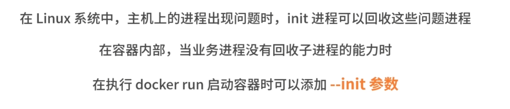

# Docker Docs


Docker 是基于 Linux Kernel的 Namespace 和 Cgroups 技术实现的


## 容器技术原理 -- Chroot

是在 Unix 和 Linux 系统的一个操作，针对正在运作的软件行程和它的子进程，改变它外显的根目录。一个运行在这个环境下，经由 chroot 设置根目录的程序,它不能够对这个指定根目录之外的文件进行访问动作，不能读取也不能更改它的内容

```Shell
mkdir rootfs

cd rootfs
docker export $(docker create busybox) -o busybox.tar

tar -xf busybox.tar


# 启动一个 sh 进程，并且把 /root/dockerTmp/rootfs 作为 sh 进程的根目录
chroot /root/dockerTmp/rootfs /bin/sh
pwd
```


## Docker 组件


### Docker Init



```Shell
docker run -it busybox sh
ps auX

docker run -it --init busybox sh
ps auX
```


### Docker Proxy


```Shell
docker run --name=nginx -d -p 8080:80 nginx

docker inspect --format '{{.NetworkSettings.IPAddress}}' nginx

sudo ps aux | grep docker-proxy

sudo iptables -L -nv -t nat
```


## Containerd


- 镜像的管理
- 接收 dockerd 的请求，通过适当的参数调用 runc 启动容器
- 管理网络相关资源
- 管理存储相关资源


## Runc

容器运行时组件

```Shell
cd /home/centos
# 创建 runc 运行根目录

mkdir runc

# 导入 rootfs 镜像文件
mkdir rootfs && docker export $(docker create busybox) | tar -C rootfs -xvf -

# 使用 runc spec 命令根据文件系统生成对应的 config.json 文件
runc spec

runc run busybox
cd /home/centos/runc

runc list
```


## Namespace

Namespace 对内核资源进行隔离，使得容器中的进程都可以在单独的命名空间中运行，并且只可以访问当前容器命名空间的资源

Namespace 可以隔离**进程 ID、主机名、用户ID、文件名、网络访问和进程间通信**等相关资源


`readlink /proc/$$/ns/uts` 去查看当前 bash 进程所属的 uts namespace 的 `inode number`，这个 inode number 就是区分不同的 namespace 的 id

`pstree`

### Mount Namespace


```Shell
readlink /proc/$$/ns/mnt
# 创建一个 bash 进程并且新建一个 Mount Namespace
sudo unshare --mount --fork /bin/bash

mkdir /tmp/tmpfs

mount -t tmpfs -o size=20m tmpfs /tmp/tmpfs

df -h
# 新打开一个命令行窗口，执行 df 命令查看主机的挂载信息
ls -l /proc/self/ns/
```


### PID NameSpace


```Shell
readlink /proc/$$/ns/pid
# 创建一个 bash 进程，并且新建一个 PID Namespace
sudo unshare --pid --fork --mount-proc /bin/bash

ps aux
```

### UTS NameSpace


```Shell
readlink /proc/$$/ns/uts

# 使用 unshare 命令创建一个 UTS Namespace
sudo unshare --uts --fork /bin/bash


# 使用 hostname 命令(hostname 用来查看主机名称)设置主机
hostname -b gardenia
hostname
```

### IPC NameSpace


```Shell
# 使用 unshare 命令创建一个IPCNamespace
sudo unshare --ipc --fork /bin/bash

ipcs -q

ipcmk -Q
```


### User NameSpace


```Shell
# 以普通用户的身份创建一个UserNamespace
unshare --user -r /bin bash

id

reboot
```

> 报错的, 修改一下/proc/sys/user/max*user*namespaces 的数值，不能为0

### Net NameSpace


```Shell
ip a

# 创建一个 Net Namespace
sudo unshare --net --fork /bin/bash

ip a
```


## Cgroups

cgroups 是 control groups 的缩写，linux的分组有很多，比如进程的分组，用户的分组，而 cgroups 用来统一将进程进行分组，并在分组的基础上对进程进行监控和资源控制管理等，它是linux 内核提供的一个物理资源隔离机制。

可以实现限制进程或者进程组的资源(如 CPU、内存、磁盘 IO等)

> **资源限制**
> 限制资源的使用量
>
> **审计**
> 计算控制组的资源使用情况
>
> **优先级控制**
> 不同的组可以有不同的资源，使用优先级
>
> **控制**
> 控制进程的挂起或恢复

### 核心概念


**子系统：是一个内核的组件，一个子系统代表一类资源调度控制器**
	可以理解为一个资源调度控制器(Resource Controller)，可以把这个控制器关联到 cgroup 进行资源限制，比如 CPU 子系统可以控制 CPU 时间分配，内存子系统可以限制 cgroup 内存使用量，当 cgroup 关联了哪些 subsystem ，那这个 cgroup 目录下就会有对应 subsystem 的参数配置文件，可以通过这些文件对对应的资源进行限制。可以使用 `lssubsys -a` 查看内核支持的 subsystem。
	`yum install -y libcgroup libcgroup-tools`
	查看 cgroups 的层次结构 `systemd-cgls`
	查看所有可用的 cgroup 子系统 `cat /proc/cgroups`

**控制组**：(cgroup) 表示一组进程和一组带有参数的子系统的关联关系
	Cgroups 中的资源控制都以cgroup 为单位实现的。cgroup 表示按照某种资源控制标准划分而成的任务组，一个进程可以加入某个cgroup，也可以从某个cgroup 迁移到另外一个cgroup。

**层级树** (hierarchy)：是由一系列的控制组按照树状结构排列组成的，子控制组默认拥有父控制组的属性
	可以简单理解为一个 cgroup 树，树上的每个节点都是 cgroup，而这些 cgroup 节点可以包含零或多个子节点，子节点继承父节点的属性。整个系统可以有多个 hierarchy，可以直接在这 cgroup 树上绑定特定的 subsystem 来对特定的资源进行限制。一些系统默认为每个subsystem 创建了一个 hierarchy，可以使用 `mount | grep cgroup` 这个命令查看。

```Shell
sudo mount -t cgroup

# 以 cpu 子系统为例，演示 cgroups 如何限制进程的 cpu 使用时间
# 以下命令的执行默认都是使用 root 用户

# 在cpu子系统下创建测试文件夹
mkdir /sys/fs/cgroup/cpu/mydocker

ls -l /sys/fs/cgroup/cpu/mydocker

# 将 shell 进程加入 cgroup 中
cd /sys/fs/cgroup/cpu/mydocker
echo $$> tasks

cat tasks

# 执行 CPU 耗时任务，验证 cgroup 是否可以限制 cpu 使用时间
# 制造一个死循环，提升 cpu 使用率
while true;do echo;done;

top -p <port>

# 修改 cpu 限制时间为 0.5 核
cd /sys/fs/cgroup/cpu/mydocker
echo 50000 > cpu.cfs_quota_us


# memroy 子系统
# 在 memory 子系统下创建 cgroup
mkdir /sys/fs/cgroup/memory/mydocker
ls /sys/fs/cgroup/memory/mydocker

# 对内存使用限制为 1G
cd /sys/fs/cgroup/memory/mydocker
echo 1073741824 > memory.limit_in_bytes

#  创建进程，加入 cgroup
cd /sys/fs/cgroup/memory/mydocker
echo $$>tasks

# 执行内存测试工具，申请内存
memtester 1500M 1

# 删除内存下的 mydocker 目录
rmdir /sys/fs/cgroup/memory/mydocker
```

### Docker 是如何使用 cproups 的

```bash
docker run -it -m=1g nginx
# 使用 ls 命令查看 cgroups 内存子系统的目录下的内容
ls -l /sys/fs/cgroup/memory

cd /sys/fs/cgroup/memory/docker
ls -l

cd cb5c5391177b44ad87636bf3840ecdda83529e51b76a6406d6742f56a2535d5e
cat memory.limit_in_bytes
1073741824
```

**注意:cgroups 虽然可以实现资源的限制，但是不能保证资源的使用**


## 联合文件系统

<span style="color:orange">联合文件系统(Union File System，Unionfs)</span> 是一种分层的轻量级文件系统，它可以把多个目录内容联合挂载到同一目录下，从而形成一个单一的文件系统

联合文件系统是 Docker 镜像和容器的基础，可以使 Docker 可以把镜像做成分层的结构，从而使得镜像的每一层可以被共享

Docker 中最常用的联合文件系统

- AUFS：多用于 Ubuntu 和 Debian 系统中
- Devicemapper
- OverlayFS

### AUFS

```bash
# 查看系统是否支持 AUFS
grep aufs /proc/filesystems
nodev aufs

# 配置 Docker 的 AUFS 模式
## 在 /etc/docker 下新建 daemon.json 文件，并写入以下内容
{"storage-driver": "aufs"}
sudo systemctl restart docker
sudo docker info
```

每一个目录在 AUFS 中都叫作<span style="color:orange">分支</span>，在 Docker 中称之为 <span style="color:red">层 `(layer)`</span>
最终呈现给用户的则是一个普通单层的文件系统，把<span style="color:blue">多层以单一层的方式呈现出来的过程</span>叫作联合挂载


**AUFS 存储文件**

1. 当镜像未生成容器时
   - diff 文件夹：存储镜像内容，每一层都存储在以镜像层 ID 命名的子文件夹中
   - layers 文件夹：存储镜像层关系的元数据，文件的内容为该层镜像的父级镜像的 ID
   - mnt 文件夹：联合挂载点目录，未生成容器时，该目录为空

2. 当镜像已经生成容器时
   - diff 文件夹：当容器运行时，会在 diff 目录下生成容器层
   - layers 文件夹：增加容器层相关的元数据
   - mnt 文件夹：容器的联合挂载点，这和容器中看到的文件内容一致

第一次修改文件：AUFS 会触发写时复制操作，AUFS 首先从镜像层复制文件到容器层，然后再执行对应的修改操作

删除文件或目录：AUFS 会创建一个特殊的文件或文件夹，这种特殊的文件或文件夹会阻止容器的访问

```bash
# 在 /tmp 目录下创建 aufs 目录
cd /tmp && mkdir aufs && cd aufs && mkdir mnt
mkdir container1
# 目录下准备一个文件
echo Hello, Container layer! > container1/container1.txt
mkdir image1 && mkdir image2
echo Hello, lmage layer1! > image1/image1.txt
echo Hello, lmage layer2! > image2/image2.txt

# 使用 mount 命令可以创建 AUFS 类型的文件系统
sudo mount -t aufs -o dirs=./container1:./image2:.image1 none ./mnt
# 注意：dirs 参数第一个冒号默认为读写权限，后面的目录均为只读权限 与 Docker 容器使用 AUFS 的模式一致

mount -t aufs

# ID 在 /sys/fs/aufs/ 会创建对应的目录，在这个ID 的目录下可以查看文件挂载的权限
cat /sys/fs/aufs/si4174b83d649ffb7c/*
# 使用 ls 命令查看 mnt 目录
ls -l mnt/
```

在第一次修改镜像内某个文件时，AUFS 会复制这个文件到容器层，然后在容器层对该文件进行修改操作


### Devicemapper

在 CentOS 系统中，通常使用 Devicemapper 作为 Docker 的联合文件系统

Devicemapper 从 Linux 内核 2.6.9 版本开始引入，是一种<span style="color:orange">映射块设备的技术框架</span>
提供了一种将<span style="color:orange">物理块设备映射到虚拟块设备</span>的机制
目前 Linux 下比较流行的 LVM 和软件磁盘阵列都是基于 Devicemapper 机制实现的

- 用户空间：负责配置具体的设备映射策略，与相关的内核空间控制逻辑
- 内核空间：内核空间负责用户空间配置的关联关系实现

1. 映射设备 `(mapped device)`：即对外提供的逻辑设备，是由 Devicemapper 模拟的一个虚拟设备
2. 目标设备 `(target device)`：是映射设备对应的物理设备或者物理设备的某一个逻辑分段
3. 映射表 `(map table)`：记录了映射设备在目标设备的起始地址、范围和目标设备的类型等变量


Devicemapper 在内核中通过很多模块化的映射驱动 `(target driver)` 插件，实现了<span style="color:red">对真正 IO 请求的拦截、过滤和转发工作</span>，比如 Raid、软件加密、瘦供给 `(Thin Provisioning)` 等

> **瘦供给**的意思是动态分配，是需要多少磁盘空间，存储驱动就分配多少磁盘空间

<span style="color:orange">全球网络存储工业协会 SNIA (StorageNetworkingIndustryAssociation)</span> 对快照 (Snapshot) 的定义:
	关于指定数据集合的一个完全可用拷贝，该拷贝包括相应数据在某个时间点 (拷贝开始的时间点) 的映像。快照可以是其所表示的数据的一个副本，也可以是数据的一个复制品

当 Docker 使用 Devicemapper 作为文件存储驱动时，Docker 将镜像和容器的文件存储在瘦供给池 `(thin pool)`中，并将这些内容挂载在 `/var/lib/docker/devicemapper/` 目录下

- `devicemapper` 目录：`/var/lib/docker/devicemapper/devicemapper/` 存储镜像和容器实际内容，该目录由一个或多个块设备构成
- `metadata` 目录：`/var/lib/docker/devicemapper/metadata/` 包含 Devicemapper 本身配置的元数据信息，以 json 的形式配置
  这些元数据记录了镜像层和容器层之间的关联信息
- `mnt` 目录：`/var/lib/docker/devicemapper/mnt/` 是容器的联合挂载点目录，未生成容器时，该目录为空
  容器存在时，该目录下的内容跟容器中一致

Devicemapper 的镜像分层依赖**快照**来是实现的

- 相同的镜像层，仅在磁盘上存储一次
- 快照是写时复制策略的实现
- 可以实现**同时修改和读写层**中的多个块设备

需要读取数据时，如果数据在**底层快照**中，则向底层快照查询数据并读取
需要写数据时，向**瘦供给池动态申请存储空间生成读写层**，然后把数据复制到读写层进行修改，每次新生成的读写层的大小都是 64K 或者 64K 的倍数


在 Docker 中配置 Devicemapper

- `direct-lvm` 模式：推荐在生产环境中使用
- `loop-lvm` 模式：主要用来开发和测试使用

```bash
# loop-lvm
sudo systemctl stop docker
# 编辑 /etc/docker/daemon.json 文件
{"storage-driver":"devicemapper'}
sudo systemctl start docker

docker info

# direct-lvm
vim /etc/docker/daemon.json
{
	"storage-driver": "devicemapper'
  'storage-opts":[
    "dm.directlvm_device=/dev/xdf",
    "dm.thinp_percent=95",
    "dm.thinp_metapercent=1",
    "dm.thinp_autoextend_threshold=80",
    "dm.thinp_autoextend_percent=20",
    "dm.directlvm_device_force=false"
  ]
 }


```

Devicemapper 使用块设备来存储文件，运行速度会比直接操作文件系统更快，Devicemapper 一直作为 Docker 默认的联合文件系统驱动，为 Docker 在 Red Hat 或 CentOS 稳定运行提供强有力的保障


### OverlayFS

`overlay2` 将所有目录称之为层 `(layer)` ，把这些层统一展现到同一的目录下的过程称为<span style="color:orange">联合挂载 `(union mount)`</span>
把目录的下一层叫作 `lowerdir` ，上一层叫作 `upperdir`，联合挂载后的结果叫作 `merged`

最好搭配 xfs 文件系统使用，并且使用 xfs 作为底层文件系统时，`d_type` 必须开启

```bash
# 验证 d_type 是否开启
xfs_info /var/lib/docker | grep ftype
# 如果输出结果为 ftype=0  需要重新格式化磁盘目录
sudo mkfs.xfs -f -n ftype=1 /path/to/disk
```

- 在生产环境中，推荐挂载 `/var/lib/docker` 目录到单独的磁盘或者磁盘分区
- 挂载配置中推荐开启 `pquota`，写入到 `/etc/fstab` 中的内容 `UUID /var/lib/docker xfs defaults,pquota 0 0`
- 如果无法满足上面的任何一个条件，推荐使用 AUFS 或者 Devicemapper 作为 Docker 文件系统驱动

```bash
# 使用 lsblk (Linux 查看磁盘和块设备信息命令) 命令查看本机磁盘信息
lsblk

# 使用 mkfs 命令格式化磁盘 vdb1
sudo mkfs.xfs -f-n ftype=1 /dev/vdb1

# 将挂载信息写入到 /etc/fstab，保证机器重启挂载目录不丢失
sudo echo "/dev/vdb1 /var/lib/docker xfs defaults,pquota 0 0" >> /etc/fstab
sudo mount -a
lsblk

# 备份 /var/lib/docker 目录
sudo cp -au /var/lib/docker /var/lib/docker.back
vim /etc/docker/daemon.json
{
  "storage-driver": "overlay2"
  'storage-opts":[
    "overlay2.size=20G",
    "overlay2.override_kernel_check=true"
  ]
}
sudo systemctl start docker

docker info

# 镜像存储位置
sudo ls -l /var/lib/docker/overlay2

# 查看 镜像之间的层级关系
docker image inspect ubuntu:16.04

```

Overlay2 将镜像层和容器层都放在单独的目录，并且有唯一ID，每一层仅存储发生变化的文件，最终使用联合挂载技术将容器层和镜像层的所有文件统一挂载到容器中，使得容器中看到完整的系统文件

第一次修改文件：Overlay2 会触发写时复制操作，首先从镜像层复制文件到容器层，然后在容器层执行对应的文件修改操作

删除文件或目录：Overlay2 会创建一个特殊的文件或目录，这种特殊的文件或目录会阻止容器的访问


## Gocker


```bash
cd /tmp && wget https://studygolang.com/dl/golang/go1.15.2.linux-amd64.tar.gz && sudo tar -C /usr/local -xzf go1.15.2.linux-amd64 tar.gz

export PATH=$PATH:/usr/local/go/bin
sudo mkdir /go/src
sudo mkdir /go/pkg
sudo mkdir /go/bin

export GOPATH=/go
export PATH=$PATH:$GОPATH/bin
export GOPROXY="https://goproxy.io,direct'
go env

mkdir -p /go/src/github.com/wilhelmguo
cd /go/src/github.com/wilhelmguo && git clone https://github.com/wilhelmguo/gocker.git
cd gocker
git checkout lesson-17

go install
gocker run -it -rootfs=/tmp/busybox /bin/sh

/bin/ps -ef

while true;do echo;done;
```


- **RunCommand**：当执行 gocker run 命令时调用的函数，是实现gocker run 的入口
- **InitCommand**：当执行 gocker run 时自动调用 gockerinit 来初始化容器的一些环境
  - pivotRoot 主要功能是改变当前进程的根目录，它可以把当前进程的根目录移动到传递的 rootfs 目录下
  - syscall.Exec 可以实现执行指定的命令，在当前的进程空间执行，替换掉正在执行的进程，复用同一个进程号

​	

1. 创建容器 `gocker run -it -rootfs=/tmp/busybox /bin/sh`
2. RunCommand 解析请求的参数 `(-it -rootfs=/tmp/busybox)` 和主进程启动命令 `(/bin/sh)` 
3. 创建 namespace 隔离的容器进程
4. 启动容器进程
5. 容器内的进程执行 `/proc/self/exe` 调用自己实现容器的初始化，修改当前进程运行的根目录，挂载
   proc 文件系统，修改主机名，使用 `sh` 进程替换当前容器的进程


