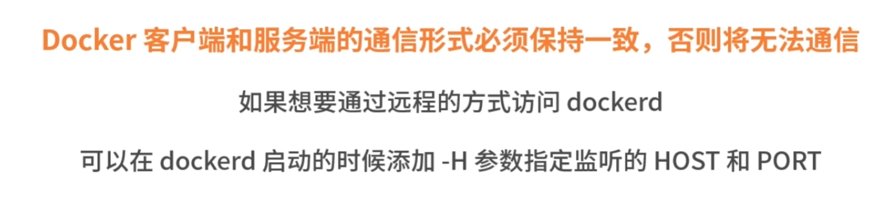

# Docker Docs


Docker 是基于 Linux Kernel的 Namespace 和 Cgroups 技术实现的


## 容器技术原理--chroot

是在 Unix 和 Linux 系统的一个操作，针对正在运作的软件行程和它的子进程，改变它外显的根目录。一个运行在这个环境下，经由 chroot 设置根目录的程序,它不能够对这个指定根目录之外的文件进行访问动作，不能读取也不能更改它的内容

```Shell
mkdir rootfs

cd rootfs
docker export $(docker create busybox) -o busybox.tar

tar -xf busybox.tar


# 启动一个 sh 进程，并且把 /root/dockerTmp/rootfs 作为 sh 进程的根目录
chroot /root/dockerTmp/rootfs /bin/sh
pwd
```


## Docker 组件





### Docker Init


```Shell
docker run -it busybox sh
ps auX

docker run -it --init busybox sh
ps auX
```


### Docker Proxy


```Shell
docker run --name=nginx -d -p 8080:80 nginx

docker inspect --format '{{.NetworkSettings.IPAddress}}' nginx

sudo ps aux | grep docker-proxy

sudo iptables -L -nv -t nat
```


## Containerd


- 镜像的管理
- 接收 dockerd 的请求，通过适当的参数调用 runc 启动容器
- 管理网络相关资源
- 管理存储相关资源


## Runc

容器运行时组件

```Shell
cd /home/centos
# 创建 runc 运行根目录

mkdir runc

# 导入 rootfs 镜像文件
mkdir rootfs && docker export $(docker create busybox) | tar -C rootfs -xvf -

# 使用 runc spec 命令根据文件系统生成对应的 config.json 文件
runc spec

runc run busybox
cd /home/centos/runc

runc list
```


## Namespace

Namespace 对内核资源进行隔离，使得容器中的进程都可以在单独的命名空间中运行，并且只可以访问当前容器命名空间的资源

Namespace 可以隔离**进程 ID、主机名、用户ID、文件名、网络访问和进程间通信**等相关资源


### Mount Namespace


```Shell
# 创建一个 bash 进程并且新建一个 Mount Namespace
sudo unshare --mount --fork /bin/bash

mkdir /tmp/tmpfs

mount -t tmpfs -o size=20m tmpfs /tmp/tmpfs

df -h
# 新打开一个命令行窗口，执行 df命令查看主机的挂载信息
ls -l /proc/self/ns/
```


### PID NameSpace


```Shell
# 创建一个 bash 进程，并且新建一个 PID Namespace
sudo unshare --pid --fork --mount-proc /bin/bash

ps aux
```

### UTS NameSpace


```Shell
# 使用 unshare 命令创建一个 UTS Namespace
sudo unshare --uts --fork /bin/bash


# 使用 hostname命令(hostname用来查看主机名称)设置主机
hostname -b gardenia
hostname
```

### IPC NameSpace


```Shell
# 使用 unshare 命令创建一个IPCNamespace
sudo unshare --ipc --fork /bin/bash

ipcs -q

ipcmk -Q
```


### User NameSpace


```Shell
# 以普通用户的身份创建一个UserNamespace
unshare --user -r /bin bash

id

reboot
```

> 报错的, 修改一下/proc/sys/user/max*user*namespaces 的数值，不能为0

### Net NameSpace


```Shell
ip a

# 创建一个 Net Namespace
sudo unshare --net --fork /bin/bash

ip a
```


## Cgroups

(全称:control groups)是Linux内核的一个功能

可以实现限制进程或者进程组的资源(如 CPU、内存、磁盘 IO等)

**资源限制**
限制资源的使用量

**审计**
计算控制组的资源使用情况

**优先级控制**
不同的组可以有不同的资源，使用优先级

**控制**
控制进程的挂起或恢复

### 核心概念


**子系统：是一个内核的组件，一个子系统代表一类资源调度控制器**

控制组：(cgroup)表示一组进程和一组带有参数的子系统的关联关系

层级树 (hierarchy)：是由一系列的控制组按照树状结构排列组成的，子控制组默认拥有父控制组的属性

```Shell
sudo mount -t cgroup

# 以 cpu 子系统为例，演示 cgroups 如何限制进程的 cpu 使用时间
# 以下命令的执行默认都是使用 root 用户

# 在cpu子系统下创建测试文件夹
mkdir /sys/fs/cgroup/cpu/mydocker

ls -l /sys/fs/cgroup/cpu/mydocker

# 将 shell 进程加入 cgroup 中
cd /sys/fs/cgroup/cpu/mydocker
echo $$> tasks

cat tasks

# 执行 CPU 耗时任务，验证 cgroup 是否可以限制 cpu 使用时间
# 制造一个死循环，提升 cpu 使用率
while true;do echo;done;

top -p <port>

# 修改 cpu 限制时间为 0.5 核
cd /sys/fs/cgroup/cpu/mydocker
echo 50000 > cpu.cfs_quota_us


# memroy 子系统
# 在 memory 子系统下创建 cgroup
mkdir /sys/fs/cgroup/memory/mydocker
ls /sys/fs/cgroup/memory/mydocker

# 对内存使用限制为 1G
cd /sys/fs/cgroup/memory/mydocker
echo 1073741824 > memory.limit_in_bytes

#  创建进程，加入 cgroup
cd /sys/fs/cgroup/memory/mydocker
echo $$>tasks

# 执行内存测试工具，申请内存
memtester 1500M 1

# 删除内存下的 mydocker 目录
rmdir /sys/fs/cgroup/memory/mydocker
```

### Docker 是如何使用 cproups 的

```
docker run -it -m=1g nginx
# 使用 ls 命令查看 cgroups 内存子系统的目录下的内容
ls -l /sys/fs/cgroup/memory

cd /sys/fs/cgroup/memory/docker
ls -l

cd cb5c5391177b44ad87636bf3840ecdda83529e51b76a6406d6742f56a2535d5e
cat memory.limit_in_bytes
1073741824
```

**注意:cgroups 虽然可以实现资源的限制，但是不能保证资源的使用**