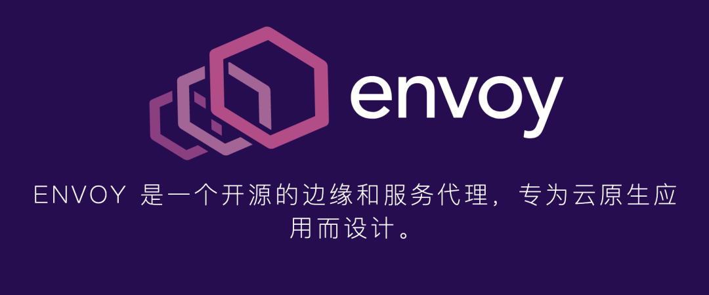
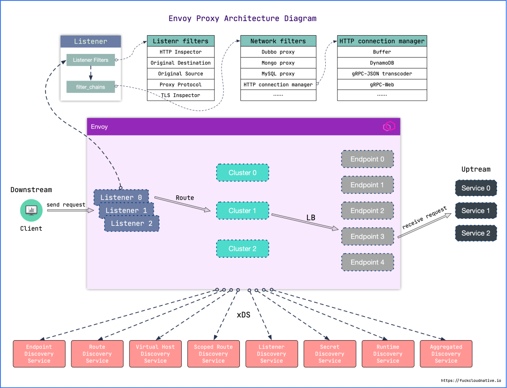
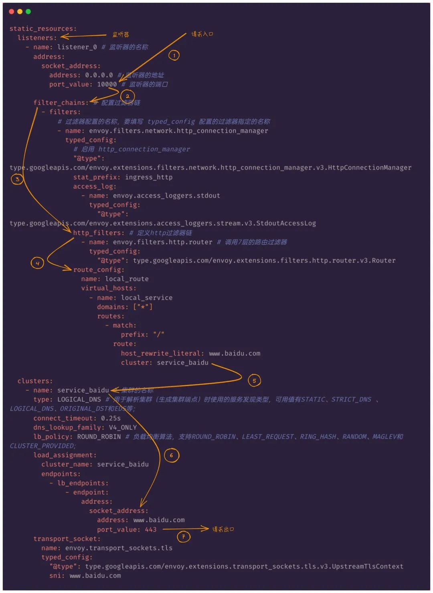
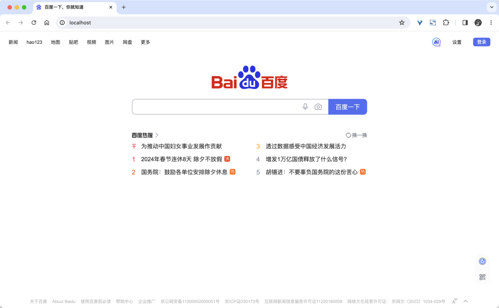
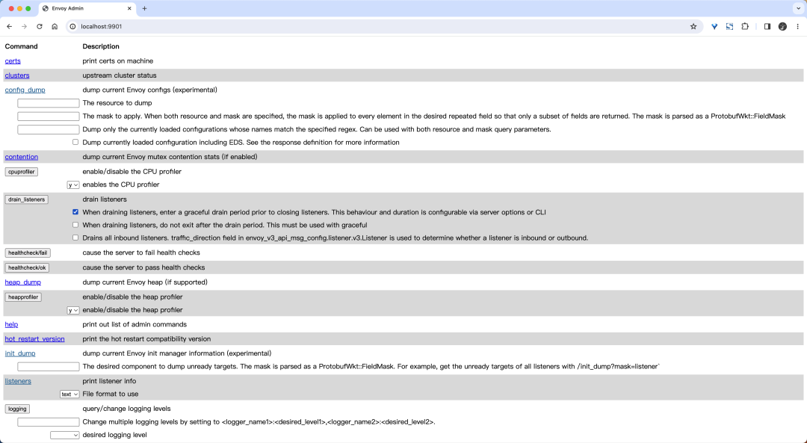
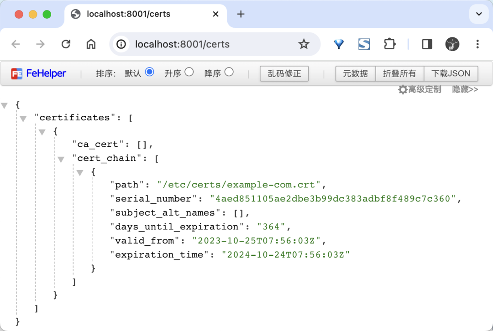

# Envoy


Envoy 是一个用 C++ 开发的高性能代理，Envoy 是一种 L7 代理和通信总线，专为大型的现代面向服务的架构而设计。



## 核心能力

Envoy 的诞生源于以下理念：

**网络对于应用程序来说应该是透明的，当网络和应用程序出现问题时，应该很容易确定问题的源头。**

当然要实现上述目标是非常困难的。Envoy 试图通过提供以下高级功能来实现这一目标：

**非侵入架构:** Envoy 是一个独立的进程，设计为伴随每个应用程序服务一起运行。所有 Envoy 实例形成一个透明的通信网格，每个应用程序通过 `localhost` 发送和接收消息，不需要知道网络拓扑。对服务的实现语言也完全无感知，这种模式也被称为 `Sidecar` 模式。


**L3/L4 过滤器架构:** Envoy 的核心是一个 L3/L4 层的网络代理。可插拔的过滤器链机制允许编写不同的 TCP/UDP 代理任务的过滤器，并将其插入到主服务器中。而且已经内置支持了各种任务的过滤器，例如原始 TCP 代理、UDP 代理、HTTP 代理、TLS 客户端证书身份验证、Redis、MongoDB、Postgres 等。

**HTTP L7 过滤器架构:** HTTP 是现代应用程序架构的关键组件，因此 Envoy 支持了一个额外的 HTTP L7 过滤器层。HTTP 过滤器可以被插入到 HTTP 连接管理子系统中，执行不同的任务，如缓存、速率限制、路由/转发、嗅探 Amazon 的 DynamoDB 等。

**顶级的 HTTP/2 支持:** 在 HTTP 模式下运行时，Envoy 同时支持 HTTP/1.1 和 HTTP/2。Envoy 可以作为透明的 HTTP/1.1 到 HTTP/2 双向代理运行。这意味着可以连接任何组合的 HTTP/1.1 和 HTTP/2 客户端与目标服务器。推荐的服务到服务配置在所有 Envoy 之间使用 HTTP/2 创建持久连接网格，请求和响应可以在该连接上进行多路复用。

**HTTP/3 支持（目前处于 alpha 版）:** 从 Envoy 1.19.0 版本开始，Envoy 现在支持上游和下游的 HTTP/3，而且可以在任何方向上进行 HTTP/1.1、HTTP/2 和 HTTP/3 之间的转换。

**HTTP L7 路由:** 在 HTTP 模式下运行时，Envoy 支持路由子系统，该子系统能够根据路径、权限、内容类型、运行时值等路由和重定向请求。在使用 Envoy 作为前端/边缘代理时，此功能非常有用，但在构建服务到服务的网格时也可以利用它。

**gRPC 支持:** gRPC 是 Google 的一个 RPC 框架，使用 HTTP/2 或更高版本作为底层多路复用传输。Envoy 支持用作 gRPC 请求和响应的路由和负载均衡基础所需的所有 HTTP/2 功能，这两个系统非常互补。

**服务发现和动态配置:** Envoy 可以选择使用一组分层的动态配置 API 来进行集中管理。这些层向 Envoy 提供了关于后端集群中的主机、后端集群自身、HTTP 路由、监听套接字和加密材料的动态更新。对于更简单的部署，可以通过 DNS 解析（甚至完全跳过）来完成后端主机发现，并且进一步的层可以由静态配置文件替代。

**健康检查:** 构建 Envoy 网格的推荐方法是将服务发现视为最终一致的过程。Envoy 包含一个健康检查子系统，可以选择对上游服务集群执行主动健康检查。然后，Envoy 使用服务发现和健康检查信息的结合来确定健康的负载均衡目标。Envoy 还通过异常值检测子系统支持被动健康检查。

**高级负载均衡:** 分布式系统中不同组件之间的负载均衡是一个复杂的问题。由于 Envoy 是一个独立的代理而不是库，因此可以独立实现高级负载均衡以供任何应用程序访问。目前 Envoy 支持自动重试、熔断、通过外部速率限制服务进行全局速率限制、异常检测等。

**前端/边缘代理支持:** 在边缘使用相同的软件有很大的好处（可观察性、管理、相同的服务发现和负载均衡算法等）。Envoy 的功能集使其非常适合作为大多数现代 Web 应用程序用例的边缘代理。这包括 TLS 终止、HTTP/1.1、HTTP/2 和 HTTP/3 支持以及 HTTP L7 路由。

**最佳的可观测性:** 如上所述，Envoy 的主要目标是使网络透明化。但是，问题在网络层面和应用层面都可能会出现。Envoy 为所有子系统提供了强大的统计支持。目前支持的统计数据输出端是 `statsd`（以及兼容的提供程序），但是接入其他不同的统计数据输出端并不困难。统计数据也可以通过管理端口进行查看，Envoy 还支持通过第三方提供者进行分布式跟踪。

## 常用术语

在介绍 Envoy 架构之前，有必要先介绍一些常用的术语定义，因为这些术语贯穿整个 Envoy 的架构设计。

- **Host(主机):** 能够进行网络通信的实体（手机、服务器等上的应用程序）。在 Envoy 中主机是逻辑网络应用程序。一个物理硬件可能运行多个主机，只要每个主机可以独立进行寻址。
- **Downstream(下游):** 下游主机连接到 Envoy，发送请求并接收响应。
- **Upstream(上游):** 上游主机接收来自 Envoy 的连接和请求并返回响应。
- **Listener(侦听器):** 侦听器是一个带有名称的网络位置（例如端口、unix domain socket 等），下游客户端可以连接到该位置。Envoy 暴露一个或多个监听器，供下游主机连接。
- **Cluster(集群):** 一个集群是一组逻辑上相似的上游主机，Envoy 连接到这些主机。Envoy 通过服务发现来发现集群的成员。它还可以通过主动健康检查来确定集群成员的健康状况。Envoy 根据负载均衡策略确定将请求路由到哪个集群成员。
- **Mesh(网格):** 一组主机协同工作，提供一致的网络拓扑结构。在这里 `Envoy Mesh` 是指一组 Envoy 代理，它们构成了由多种不同服务和应用程序平台组成的分布式系统的消息传递基础。
- **Runtime configuration(运行时配置):** 与 Envoy 一起部署的实时配置系统。可以更改配置设置，影响操作而无需重新启动 Envoy 或更改主要配置。

## 架构设计

Envoy 采用单进程多线程架构。

一个独立的 `primary` 线程负责控制各种零散的协调任务，而一些 `worker` 线程则负责执行监听、过滤和转发任务。

一旦侦听器接受连接，该连接就会将其生命周期绑定到一个单独的 `worker` 线程。这使得 Envoy 的大部分工作基本上是单线程来处理的，只有少量更复杂的代码处理工作线程之间的协调。

通常情况下 Envoy 实现了 100% 非阻塞。对于大多数工作负载，建议将 `worker` 线程的数量配置为机器上的硬件线程数量。

Envoy 整体架构如下图所示：



Envoy 进程中运行着一系列 Inbound/Outbound 监听器（Listener），Inbound 代理入站流量，Outbound 代理出站流量。Listener 的核心就是过滤器链（FilterChain），**链中每个过滤器都能够控制流量的处理流程**。

Envoy 接收到请求后，会先走 `FilterChain`，通过各种 L3/L4/L7 Filter 对请求进行处理，然后再路由到指定的集群，并通过负载均衡获取一个目标地址，最后再转发出去。

其中每一个环节可以静态配置，也可以动态服务发现，也就是所谓的 `xDS`，这里的 `x` 是一个代词，是 `lds`、`rds`、`cds`、`eds`、`sds` 的总称，即服务发现，后 2 个字母 `ds` 就是 `discovery service`。

## 第一个 Envoy 代理

下面通过一个简单的示例来介绍 Envoy 的基本使用。

### 配置

Envoy 使用 YAML 文件来控制代理的行为，整体配置结构如下：

```
listen -- 监听器
    1.我监听的地址
    2.过滤链
        filter1
            路由: 转发到哪里
                virtual_hosts
                    只转发什么
                    转发到哪里 --> 由后面的 cluster 来定义
        filter2
        filter3
        # envoyproxy.io/docs/envoy/v1.28.0/api-v3/config/filter/filter
cluster
    转发规则
    endpoints
        --指定了我的后端地址
```

接下来创建一个简单的 Envoy 代理，它监听 10000 端口，将请求转发到 `www.baidu.com` 的 80 端口。在下面的步骤中，将使用静态配置接口来构建配置，也意味着所有设置都是预定义在配置文件中的。此外 Envoy 也支持动态配置，这样可以通过外部一些源来自动发现进行设置。

> Envoy 代理使用开源 xDS API 来交换信息，目前 xDS v2 已被废弃，最新版本的 Envoy 不再支持 xDS v2，建议使用 xDS v3。

创建一个名为 `envoy-1.yaml` 的文件，在 Envoy 配置的第一行定义正在使用的接口配置，在这里将配置静态 API，因此第一行应为 `static_resources`：

```
static_resources:
```

然后需要在静态配置下面定义 Envoy 的监听器（Listener），监听器是 Envoy 监听请求的网络配置，例如 IP 地址和端口。这里设置监听 IP 地址为 `0.0.0.0`，并在端口 10000 上进行监听。对应的监听器的配置为

```
static_resources:
  listeners:
    - name: listener_0 # 监听器的名称
      address:
        socket_address:
          address: 0.0.0.0 # 监听器的地址
          port_value: 10000 # 监听器的端口
```

通过 Envoy 监听传入的流量，下一步是定义如何处理这些请求。**每个监听器都有一组过滤器，并且不同的监听器可以具有一组不同的过滤器**。

在这个示例中，将所有流量代理到 `baidu.com`，配置完成后应该能够通过请求 Envoy 的端点就可以直接看到百度的主页了，而无需更改 URL 地址。

过滤器是通过 `filter_chains` 来定义的，每个过滤器的目的是找到传入请求的匹配项，以使其与目标地址进行匹配。Filter 过滤器的写法如下所示：

```
name: 指定使用哪个过滤器
typed_config:
  "@type": type.googleapis.com/envoy.过滤器的具体值
  参数1：值1
  参数2：值2
  。。。

这里选择什么参数，要看name里选择的什么参数要根据所选择的过滤器来判定

和 http 相关的，一般选择 HTTP connection manager。

在 https://www.envoyproxy.io/docs/envoy/latest/api-v3/config/filter/filter 里找参数

name 的位置应该写 envoy.filters.network.http_connection_manager

@type 的值到文档里找具体的值
```

比如这里的配置如下所示：

```
static_resources:
  listeners:
    - name: listener_0 # 监听器的名称
      address:
        socket_address:
          address: 0.0.0.0 # 监听器的地址
          port_value: 10000 # 监听器的端口

      filter_chains: # 配置过滤器链
        # 在此地址收到的任何请求都会通过这一系列过滤链发送。
        - filters:
            # 指定要使用哪个过滤器，下面是envoy内置的网络过滤器，如果请求是 HTTP 它将通过此 HTTP 过滤器
            # 该过滤器将原始字节转换为HTTP级别的消息和事件（例如接收到的header、接收到的正文数据等）
            # 它还处理所有HTTP连接和请求中常见的功能，例如访问日志记录、请求ID生成和跟踪、请求/响应头操作、路由表管理和统计信息。
            - name: envoy.filters.network.http_connection_manager
              typed_config:
                # 需要配置下面的类型，启用 http_connection_manager
                "@type": type.googleapis.com/envoy.extensions.filters.network.http_connection_manager.v3.HttpConnectionManager
                stat_prefix: ingress_http
                access_log: # 连接管理器发出的 HTTP 访问日志的配置
                  - name: envoy.access_loggers.stdout # 输出到stdout
                    typed_config:
                      "@type": type.googleapis.com/envoy.extensions.access_loggers.stream.v3.StdoutAccessLog
                http_filters: # 定义http过滤器链
                  - name: envoy.filters.http.router # 调用7层的路由过滤器
                    typed_config:
                      "@type": type.googleapis.com/envoy.extensions.filters.http.router.v3.Router
                route_config:
                  name: local_route
                  virtual_hosts:
                    - name: local_service
                      domains: ["*"] # 要匹配的主机名列表，*表示匹配所有主机
                      routes:
                        - match:
                            prefix: "/" # 要匹配的 URL 前缀
                          route: # 路由规则，发送请求到 service_baidu 集群
                            host_rewrite_literal: www.baidu.com # 更改 HTTP 请求的入站 Host 头信息
                            cluster: service_baidu # 将要处理请求的集群名称，下面会有相应的实现
```

这里使用的过滤器使用了 `envoy.filters.network.http_connection_manager`，这是为 HTTP 连接设计的一个内置过滤器，该过滤器将原始字节转换为 HTTP 级别的消息和事件（例如接收到的 header、接收到的正文数据等），它还处理所有 HTTP 连接和请求中常见的功能，例如访问日志记录、请求 ID 生成和跟踪、请求/响应头操作、路由表管理和统计信息。

- `stat_prefix`：为连接管理器发出统计信息时使用的一个前缀。
- `route_config`：路由配置，如果虚拟主机匹配上了则检查路由。在这里的配置中，无论请求的主机域名是什么，`route_config` 都匹配所有传入的 HTTP 请求。
- `routes`：如果 URL 前缀匹配，则一组路由规则定义了下一步将发生的状况。/ 表示匹配根路由。
- `host_rewrite_literal`：更改 HTTP 请求的入站 Host 头信息。
- `cluster`: 将要处理请求的集群名称，下面会有相应的实现。
- `http_filters`: 该过滤器允许 Envoy 在处理请求时去适应和修改请求。

当请求于过滤器匹配时，该请求将会传递到集群。下面的配置就是将主机定义为访问 HTTPS 的 `baidu.com` 域名，如果定义了多个主机，则 Envoy 将执行轮询（Round Robin）策略。配置如下所示：

```
clusters:
  - name: service_baidu # 集群的名称，与上面的 router 中的 cluster 对应
    type: LOGICAL_DNS # 用于解析集群（生成集群端点）时使用的服务发现类型，可用值有STATIC、STRICT_DNS 、LOGICAL_DNS、ORIGINAL_DST和EDS等；
    connect_timeout: 0.25s
    dns_lookup_family: V4_ONLY
    lb_policy: ROUND_ROBIN # 负载均衡算法，支持ROUND_ROBIN、LEAST_REQUEST、RING_HASH、RANDOM、MAGLEV和CLUSTER_PROVIDED；
    load_assignment: # 以前的 v2 版本的 hosts 字段废弃了，现在使用 load_assignment 来定义集群的成员，指定 STATIC、STRICT_DNS 或 LOGICAL_DNS 集群的成员需要设置此项。
      cluster_name: service_baidu # 集群的名称
      endpoints: # 需要进行负载均衡的端点列表
        - lb_endpoints:
            - endpoint:
                address:
                  socket_address:
                    address: www.baidu.com
                    port_value: 443
    transport_socket: # 用于与上游集群通信的传输层配置
      name: envoy.transport_sockets.tls # tls 传输层
      typed_config:
        "@type": type.googleapis.com/envoy.extensions.transport_sockets.tls.v3.UpstreamTlsContext
        sni: www.baidu.com
```

最后，还需要配置一个管理模块：

```
admin:
  access_log_path: /tmp/admin_access.log
  address:
    socket_address:
      address: 0.0.0.0
      port_value: 9901
```

上面的配置定义了 Envoy 的静态配置模板，监听器定义了 Envoy 的端口和 IP 地址，监听器具有一组过滤器来匹配传入的请求，匹配请求后，将请求转发到集群，完整的配置如下所示：

```
# envoy-1.yaml
admin:
  access_log_path: /tmp/admin_access.log
  address:
    socket_address:
      address: 0.0.0.0
      port_value: 9901

static_resources:
  listeners:
    - name: listener_0 # 监听器的名称
      address:
        socket_address:
          address: 0.0.0.0 # 监听器的地址
          port_value: 10000 # 监听器的端口

      filter_chains: # 配置过滤器链
        - filters:
            # 过滤器配置的名称，要填写 typed_config 配置的过滤器指定的名称
            - name: envoy.filters.network.http_connection_manager
              typed_config:
                # 启用 http_connection_manager
                "@type": type.googleapis.com/envoy.extensions.filters.network.http_connection_manager.v3.HttpConnectionManager
                stat_prefix: ingress_http
                access_log:
                  - name: envoy.access_loggers.stdout
                    typed_config:
                      "@type": type.googleapis.com/envoy.extensions.access_loggers.stream.v3.StdoutAccessLog
                http_filters: # 定义http过滤器链
                  - name: envoy.filters.http.router # 调用7层的路由过滤器
                    typed_config:
                      "@type": type.googleapis.com/envoy.extensions.filters.http.router.v3.Router
                route_config:
                  name: local_route
                  virtual_hosts:
                    - name: local_service
                      domains: ["*"]
                      routes:
                        - match:
                            prefix: "/"
                          route:
                            host_rewrite_literal: www.baidu.com
                            cluster: service_baidu

  clusters:
    - name: service_baidu # 集群的名称
      type: LOGICAL_DNS # 用于解析集群（生成集群端点）时使用的服务发现类型，可用值有STATIC、STRICT_DNS 、LOGICAL_DNS、ORIGINAL_DST和EDS等；
      connect_timeout: 0.25s
      dns_lookup_family: V4_ONLY
      lb_policy: ROUND_ROBIN # 负载均衡算法，支持ROUND_ROBIN、LEAST_REQUEST、RING_HASH、RANDOM、MAGLEV和CLUSTER_PROVIDED；
      load_assignment:
        cluster_name: service_baidu
        endpoints:
          - lb_endpoints:
              - endpoint:
                  address:
                    socket_address:
                      address: www.baidu.com
                      port_value: 443
      transport_socket:
        name: envoy.transport_sockets.tls
        typed_config:
          "@type": type.googleapis.com/envoy.extensions.transport_sockets.tls.v3.UpstreamTlsContext
          sni: www.baidu.com
```

第一次使用 Envoy，可能会觉得它的配置太复杂了，让人眼花缭乱。其实只要理解了网络代理程序的流程就不难配置了，比如作为一个代理，首先要能获取请求流量，通常是采用监听端口的方式实现；其次拿到请求数据后需要对其做微处理，例如附加 `Header` 或校验某个 `Header` 字段的内容等，这里针对来源数据的层次不同，可以分为 L3/L4/L7，然后将请求转发出去；转发这里又可以衍生出如果后端是一个集群，需要从中挑选一台机器，如何挑选又涉及到负载均衡等。

脑补完大致流程后，再来看 Envoy 是如何组织配置信息的，再来解释一下其中的关键字段。

- `listener`: Envoy 的监听地址，就是真正干活的。Envoy 会暴露一个或多个 Listener 来监听客户端的请求。
- `filter`: 过滤器，在 Envoy 中指的是一些**可插拔**和可组合的逻辑处理层，是 Envoy 核心逻辑处理单元。
- `route_config`: 路由规则配置，即将请求路由到后端的哪个集群。
- `cluster`: 服务提供方集群，Envoy 通过服务发现定位集群成员并获取服务，具体路由到哪个集群成员由负载均衡策略决定。

结合关键字段和上面的脑补流程，可以看出 Envoy 的大致处理流程如下：

Envoy 配置流程

Envoy 内部对请求的处理流程其实跟上面脑补的流程大致相同，即对请求的处理流程基本是不变的，而对于变化的部分，即对请求数据的微处理，全部抽象为 Filter，例如对请求的读写是 `ReadFilter`、`WriteFilter`，对 HTTP 请求数据的编解码是 `StreamEncoderFilter`、`StreamDecoderFilter`，对 TCP 的处理是 `TcpProxyFilter`，其继承自 `ReadFilter`，对 HTTP 的处理是 `ConnectionManager`，其也是继承自 `ReadFilter` 等等，各个 Filter 最终会组织成一个 `FilterChain`，在收到请求后首先走 `FilterChain`，其次路由到指定集群并做负载均衡获取一个目标地址，然后转发出去。

### 启动 Envoy

配置完成后，就可以去启动 Envoy 了，首先当然需要去安装 Envoy 了，因为 Envoy 是 C++ 开发的，编译起来非常麻烦，如果是 Mac 用户可以使用 `brew install envoy` 来一键安装，但是最简单的方式还是使用 Docker 来启动 Envoy。

这里也通过 Docker 容器来启动 Envoy，将上面的配置文件通过 Volume 挂载到容器中的 `/etc/envoy/envoy.yaml` 去。

然后使用以下命令启动绑定到端口 80 的 Envoy 容器：

```
$ docker run --name=envoy -d \
  -p 80:10000 \
  -v $(pwd)/manifests/2.Envoy/envoy-1.yaml:/etc/envoy/envoy.yaml \
  envoyproxy/envoy:v1.28.0
```

启动后，可以在本地的 80 端口上去访问应用 `curl localhost` 来测试代理是否成功。同样也可以通过在本地浏览器中访问 localhost 来查看：

localhost

可以看到请求被代理到了 `baidu.com`，而且应该也可以看到 URL 地址没有变化，还是 `localhost`，查看 Envoy 日志可以看到如下信息：

```
[2023-10-25T06:53:50.003Z] "GET / HTTP/1.1" 200 - 0 103079 399 235 "-" "Mozilla/5.0 (Macintosh; Intel Mac OS X 10_15_7) AppleWebKit/537.36 (KHTML, like Gecko) Chrome/117.0.0.0 Safari/537.36" "e081fa5b-31a4-4285-92d9-b8a8c896f2d4" "www.baidu.com" "110.242.68.3:443"
[2023-10-25T06:53:50.819Z] "GET /sugrec?&prod=pc_his&from=pc_web&json=1&sid=&hisdata=%5B%7B%22time%22%3A1698206660%2C%22kw%22%3A%22envovy%20typed_config%22%2C%22fq%22%3A2%7D%5D&_t=1698216830777&req=2&csor=0 HTTP/1.1" 200 - 0 155 57 57 "-" "Mozilla/5.0 (Macintosh; Intel Mac OS X 10_15_7) AppleWebKit/537.36 (KHTML, like Gecko) Chrome/117.0.0.0 Safari/537.36" "9a9351e7-e7ef-4fa8-9aec-fba96600e4df" "www.baidu.com" "110.242.68.3:443"
```

此外 Envoy 还提供了一个管理视图，可以让去查看配置、统计信息、日志以及其他 Envoy 内部的一些数据。上面定义的管理视图的端口为 `9901`，当然也可以通过 Docker 容器将管理端口暴露给外部用户。

```
docker run --name=envoy -d \
  -p 9901:9901 \
  -p 80:10000 \
  -v $(pwd)/manifests/2.Envoy/envoy-1.yaml:/etc/envoy/envoy.yaml \
  envoyproxy/envoy:v1.28.0
```

上面的配置就会将管理页面暴露给外部用户，当然这里仅仅用于演示是可以的，如果你是用于线上环境还需要做好一些安全保护措施。运行成功后，现在可以在浏览器里面输入 `localhost:9901` 来访问 Envoy 的管理页面：

envoy admin

需要注意的是当前的管理页面不仅允许执行一些破坏性的操作（比如，关闭服务），而且还可能暴露一些私有信息（比如统计信息、集群名称、证书信息等）。所以应该只允许通过安全网络去访问管理页面。

## 迁移 NGINX 到 Envoy

因为现阶段大部分的应用可能还是使用的比较传统的 Nginx 来做服务代理，为了对比 Envoy 和 Nginx 的区别，这里将来尝试将 Nginx 的配置迁移到 Envoy 上来，这样也有助于去了解 Envoy 的配置。

首先使用 Nginx 官方 Wiki 的完整示例来进行说明，完整的 `nginx.conf` 配置如下所示：

```
user  www www;
pid /var/run/nginx.pid;
worker_processes  2;

events {
  worker_connections   2000;
}

http {
  gzip on;
  gzip_min_length  1100;
  gzip_buffers     4 8k;
  gzip_types       text/plain;

  log_format main      '$remote_addr - $remote_user [$time_local]  '
    '"$request" $status $bytes_sent '
    '"$http_referer" "$http_user_agent" '
    '"$gzip_ratio"';

  log_format download  '$remote_addr - $remote_user [$time_local]  '
    '"$request" $status $bytes_sent '
    '"$http_referer" "$http_user_agent" '
    '"$http_range" "$sent_http_content_range"';

  upstream targetCluster {
    192.168.215.3:80;
    192.168.215.4:80;
  }

  server {
    listen        8080;
    server_name   one.example.com  www.one.example.com;

    access_log   /var/log/nginx.access_log  main;
    error_log  /var/log/nginx.error_log  info;

    location / {
      proxy_pass         http://targetCluster/;
      proxy_redirect     off;

      proxy_set_header   Host             $host;
      proxy_set_header   X-Real-IP        $remote_addr;
    }
  }
}
```

上面的 Nginx 配置有 3 个核心配置：

- 配置 Nginx 服务、日志结构和 Gzip 功能
- 配置 Nginx 在端口 8080 上接受对 `one.example.com` 域名的请求
- 根据不同的路径配置将流量转发给目标服务

并不是所有的 Nginx 的配置都适用于 Envoy，有些方面的配置可以不用。Envoy 代理主要有 4 中主要的配置类型，它们是支持 Nginx 提供的核心基础结构的：

- Listeners（监听器）：他们定义 Envoy 代理如何接收传入的网络请求，建立连接后，它会传递到一组过滤器进行处理
- Filters（过滤器）：过滤器是处理传入和传出请求的管道结构的一部分，比如可以开启类似于 Gzip 之类的过滤器，该过滤器就会在将数据发送到客户端之前进行压缩
- Routers（路由器）：这些路由器负责将流量转发到定义的目的集群去
- Clusters（集群）：集群定义了流量的目标端点和相关配置。

将使用这 4 个组件来创建 Envoy 代理配置，去匹配 Nginx 中的配置。Envoy 的重点一直是在 API 和动态配置上，但是这里仍然使用静态配置。

Nginx 配置的核心是 HTTP 配置配置，里面包含了：

- 定义支持哪些 MIME 类型
- 默认的超时时间
- Gzip 配置

可以通过 Envoy 代理中的过滤器来配置这些内容。在 HTTP 配置部分，Nginx 配置指定了监听的端口 8080，并响应域名 `one.example.com` 和 `www.one.example.com` 的传入请求：

```
server {
    listen        8080;
    server_name   one.example.com  www.one.example.com;
    ......
}
```

在 Envoy 中，这部分就是监听器来管理的。开始一个 Envoy 代理最重要的方面就是定义监听器，需要创建一个配置文件来描述如何去运行 Envoy 实例。

这里定义一个 `static_resources` 配置，它是 Envoy 配置的根节点，它包含了所有的静态配置，包括监听器、集群、路由等。将创建一个新的监听器并将其绑定到 8080 端口上，该配置指示了 Envoy 代理用于接收网络请求的端口，如下所示：

```
static_resources:
  listeners:
    - name: listener_0 # 监听器的名称
      address:
        socket_address:
          address: 0.0.0.0 # 监听器的地址
          port_value: 8080 # 监听器的端口
```

需要注意的是没有在监听器部分定义 `server_name`，这需要在过滤器部分进行处理。

当请求进入 Nginx 时，`location` 部分定义了如何处理流量以及在什么地方转发流量。在下面的配置中，站点的所有传入流量都将被代理到一个名为 `targetCluster` 的上游（upstream）集群，上游集群定义了处理请求的节点。

```
location / {
    proxy_pass         http://targetCluster/;
    proxy_redirect     off;

    proxy_set_header   Host             $host;
    proxy_set_header   X-Real-IP        $remote_addr;
}
```

在 Envoy 中，这部分将由过滤器来进行配置管理。在静态配置中，过滤器定义了如何处理传入的请求，在这里，将配置一个过滤器去匹配上一步中的 `server_names`，当接收到与定义的域名和路由匹配的传入请求时，流量将转发到集群，集群和 Nginx 配置中的 `upstream` 是一致的。

```
filter_chains:
  - filters:
      - name: envoy.filters.network.http_connection_manager
        typed_config:
          "@type": type.googleapis.com/envoy.extensions.filters.network.http_connection_manager.v3.HttpConnectionManager
          stat_prefix: ingress_http
          http_filters: # 定义http过滤器链
            - name: envoy.filters.http.router # 调用7层的路由过滤器
              typed_config:
                "@type": type.googleapis.com/envoy.extensions.filters.http.router.v3.Router
          route_config:
            name: local_route
            virtual_hosts:
              - name: backend
                domains:
                  - "one.example.com"
                  - "www.one.example.com"
                routes:
                  - match:
                      prefix: "/"
                    route:
                      cluster: targetCluster
```

其中 `envoy.filters.network.http_connection_manager` 是 Envoy 内置的一个过滤器，用于处理 HTTP 连接的，除此之外，还有其他的一些内置的过滤器，比如 Redis、Mongo、TCP。

在 Nginx 中，upstream（上游）配置定义了处理请求的目标服务器集群，在这里的示例中，分配了两个集群。

```
upstream targetCluster {
  192.168.215.3:80;
  192.168.215.4:80;
}
```

在 Envoy 代理中，这部分是通过 `clusters` 进行配置管理的。`upstream` 等同与 Envoy 中的 `clusters` 定义，这里通过集群定义了主机被访问的方式，还可以配置超时和负载均衡等方面更精细的控制。

```
clusters:
  - name: targetCluster
    connect_timeout: 0.25s
    type: STRICT_DNS
    dns_lookup_family: V4_ONLY
    lb_policy: ROUND_ROBIN
    load_assignment:
      cluster_name: targetCluster
      endpoints:
        - lb_endpoints:
            - endpoint:
                address:
                  socket_address:
                    address: 192.168.215.3
                    port_value: 80
            - endpoint:
                address:
                  socket_address:
                    address: 192.168.215.4
                    port_value: 80
```

上面配置了 `STRICT_DNS` 类型的服务发现，Envoy 会持续异步地解析指定的 DNS 目标。DNS 解析结果返回的每个 IP 地址都将被视为上游集群的主机。所以如果返回两个 IP 地址，则 Envoy 将认为集群有两个主机，并且两个主机都应进行负载均衡，如果从结果中删除了一个主机，则 Envoy 会从现有的连接池中将其剔出掉。

最后需要配置的日志部分，Envoy 采用云原生的方式，将应用程序日志都输出到 `stdout` 和 `stderr`，而不是将错误日志输出到磁盘。

当用户发起一个请求时，访问日志默认是被禁用的，可以手动开启。要为 HTTP 请求开启访问日志，需要在 HTTP 连接管理器中包含一个 `access_log` 的配置，该路径可以是设备，比如 stdout，也可以是磁盘上的某个文件，这依赖于自己的实际情况。

下面过滤器中的配置就会将所有访问日志通过管理传输到 `stdout`：

```
- name: envoy.filters.network.http_connection_manager
  typed_config:
    # 启用 http_connection_manager
    "@type": type.googleapis.com/envoy.extensions.filters.network.http_connection_manager.v3.HttpConnectionManager
    stat_prefix: ingress_http
    access_log:
      - name: envoy.access_loggers.stdout
        typed_config:
          "@type": type.googleapis.com/envoy.extensions.access_loggers.stream.v3.StdoutAccessLog
    http_filters: # 定义http过滤器链
      - name: envoy.filters.http.router # 调用7层的路由过滤器
        typed_config:
          "@type": type.googleapis.com/envoy.extensions.filters.http.router.v3.Router
    route_config:
    # ......
```

默认情况下，Envoy 访问日志格式包含整个 HTTP 请求的详细信息：

```
[%START_TIME%] "%REQ(:METHOD)% %REQ(X-ENVOY-ORIGINAL-PATH?:PATH)% %PROTOCOL%"
%RESPONSE_CODE% %RESPONSE_FLAGS% %BYTES_RECEIVED% %BYTES_SENT% %DURATION%
%RESP(X-ENVOY-UPSTREAM-SERVICE-TIME)% "%REQ(X-FORWARDED-FOR)%" "%REQ(USER-AGENT)%"
"%REQ(X-REQUEST-ID)%" "%REQ(:AUTHORITY)%" "%UPSTREAM_HOST%"\n
```

输出结果格式化后如下所示：

```
[2023-10-25T07:25:09.826Z] "GET / HTTP/1.1" 200 - 0 102931 361 210 "-" "Mozilla/5.0 (Macintosh; Intel Mac OS X 10_15_7) AppleWebKit/537.36 (KHTML, like Gecko) Chrome/117.0.0.0 Safari/537.36" "6e19ddda-e0a1-41f9-9355-ea5db8d23bcc" "one.example.com" "192.168.215.4:80"
```

也可以通过设置 `format` 字段来自定义输出日志的格式，例如：

```
access_log:
  - name: envoy.access_loggers.stdout
    typed_config:
      "@type": type.googleapis.com/envoy.extensions.access_loggers.stream.v3.StdoutAccessLog
      log_format:
        text_format: "[%START_TIME%] %REQ(:METHOD)% %REQ(X-ENVOY-ORIGINAL-PATH?:PATH)% %PROTOCOL% %RESPONSE_CODE% %RESP(X-ENVOY-UPSTREAM-SERVICE-TIME)% %REQ(X-REQUEST-ID)% %REQ(:AUTHORITY)% %UPSTREAM_HOST%\n"
```

此外也可以通过设置 `json_format` 字段来将日志作为 JSON 格式输出，例如：

```
access_log:
  - name: envoy.access_loggers.stdout
    typed_config:
      "@type": type.googleapis.com/envoy.extensions.access_loggers.stream.v3.StdoutAccessLog
      log_format:
        json_format:
          {
            "protocol": "%PROTOCOL%",
            "duration": "%DURATION%",
            "request_method": "%REQ(:METHOD)%",
          }
```

要注意的是，访问日志会在未设置、或者空值的位置加入一个字符：`-`。不同类型的访问日志（例如 HTTP 和 TCP）共用同样的格式字符串。不同类型的日志中，某些字段可能会有不同的含义。有关 Envoy 日志的更多信息，可以查看官方文档对应的说明。当然日志并不是 Envoy 代理获得请求可见性的唯一方法，Envoy 还内置了高级跟踪和指标功能。

最后完整的 Envoy 配置如下所示：

```
# envoy-2.yaml
static_resources:
  listeners:
    - name: listener_0 # 监听器的名称
      address:
        socket_address:
          address: 0.0.0.0 # 监听器的地址
          port_value: 8080 # 监听器的端口

      filter_chains:
        - filters:
            - name: envoy.filters.network.http_connection_manager
              typed_config:
                "@type": type.googleapis.com/envoy.extensions.filters.network.http_connection_manager.v3.HttpConnectionManager
                stat_prefix: ingress_http
                access_log:
                  - name: envoy.access_loggers.stdout
                    typed_config:
                      "@type": type.googleapis.com/envoy.extensions.access_loggers.stream.v3.StdoutAccessLog
                http_filters: # 定义http过滤器链
                  - name: envoy.filters.http.router # 调用7层的路由过滤器
                    typed_config:
                      "@type": type.googleapis.com/envoy.extensions.filters.http.router.v3.Router
                route_config:
                  name: local_route
                  virtual_hosts:
                    - name: backend
                      domains:
                        - "one.example.com"
                        - "www.one.example.com"
                      routes:
                        - match:
                            prefix: "/"
                          route:
                            cluster: targetCluster

  clusters:
    - name: targetCluster
      connect_timeout: 0.25s
      type: STRICT_DNS
      dns_lookup_family: V4_ONLY
      lb_policy: ROUND_ROBIN
      load_assignment:
        cluster_name: targetCluster
        endpoints:
          - lb_endpoints:
              - endpoint:
                  address:
                    socket_address:
                      address: 192.168.215.3
                      port_value: 80
              - endpoint:
                  address:
                    socket_address:
                      address: 192.168.215.4
                      port_value: 80
```

现在已经将 Nginx 配置转换为了 Envoy 代理，接下来可以来启动 Envoy 代理进行测试验证。

在 Nginx 配置的顶部，有一行配置 `user www www;`，表示用非 root 用户来运行 Nginx 以提高安全性。而 Envoy 代理采用云原生的方法来管理使用这，通过容器启动 Envoy 代理的时候，可以指定一个低特权的用户。

下面的命令将通过 Docker 容器来启动一个 Envoy 实例，该命令使 Envoy 可以监听 80 端口上的流量请求，但是在 Envoy 的监听器配置中指定的是 8080 端口，所以用一个低特权用户身份来运行：

```
$ docker run --name proxy1 -p 80:8080 --user 1000:1000 -v $(pwd)/manifests/2.Envoy/envoy-2.yaml:/etc/envoy/envoy.yaml envoyproxy/envoy:v1.28.0
```

启动代理后，就可以开始测试了，下面用 `curl` 命令使用代理配置的 host 头发起一个网络请求：

```
$ curl -H "Host: one.example.com" localhost -i
HTTP/1.1 503 Service Unavailable
content-length: 91
content-type: text/plain
date: Wed, 25 Oct 2023 07:37:55 GMT
server: envoy

upstream connect error or disconnect/reset before headers. reset reason: connection timeout%
```

可以看到会出现 503 错误，这是因为配置的上游集群主机根本就没有运行，所以 Envoy 代理请求到不可用的主机上去了，就出现了这样的错误。可以使用下面的命令启动两个 HTTP 服务，用来表示上游主机：

```
$ docker run -d cnych/docker-http-server; docker run -d cnych/docker-http-server;
$ docker ps
CONTAINER ID   IMAGE                      COMMAND                  CREATED         STATUS         PORTS                                              NAMES
3ecf1125bd0c   cnych/docker-http-server   "/app"                   2 minutes ago   Up 2 minutes   80/tcp                                             loving_babbage
0195f14ec57a   cnych/docker-http-server   "/app"                   2 minutes ago   Up 2 minutes   80/tcp                                             heuristic_torvalds
a55f6175c5c7   envoyproxy/envoy:v1.28.0   "/docker-entrypoint.…"   3 minutes ago   Up 3 minutes   10000/tcp, 0.0.0.0:80->8080/tcp, :::80->8080/tcp   proxy1
```

当上面两个服务启动成功后，现在再通过 Envoy 去访问目标服务就正常了：

```
$ curl -H "Host: one.example.com" localhost -i
HTTP/1.1 200 OK
date: Wed, 25 Oct 2023 07:42:51 GMT
content-length: 58
content-type: text/html; charset=utf-8
x-envoy-upstream-service-time: 1
server: envoy

<h1>This request was processed by host: 3ecf1125bd0c</h1>
$ curl -H "Host: one.example.com" localhost -i
HTTP/1.1 200 OK
date: Wed, 25 Oct 2023 07:42:53 GMT
content-length: 58
content-type: text/html; charset=utf-8
x-envoy-upstream-service-time: 8
server: envoy

<h1>This request was processed by host: 0195f14ec57a</h1>
```

当访问请求的时候，可以看到是哪个容器处理了请求，在 Envoy 代理容器中，也可以看到请求的日志输出：

```
[2023-10-25T07:42:51.297Z] "GET / HTTP/1.1" 200 - 0 58 3 1 "-" "curl/7.87.0" "ff1e1009-d5a3-4a71-87ef-479e234c9858" "one.example.com" "192.168.215.4:80"
[2023-10-25T07:42:53.153Z] "GET / HTTP/1.1" 200 - 0 58 9 8 "-" "curl/7.87.0" "d0ebdd10-a1d2-406e-8c6e-6fd8451aded3" "one.example.com" "192.168.215.3:80"
```

到这里就完成了将 Nginx 配置迁移到 Envoy 的过程，可以看到 Envoy 的配置和 Nginx 的配置还是有很大的区别的，但是可以看到 Envoy 的配置更加的灵活，而且 Envoy 代理的配置是可以动态更新的，这样就可以实现无缝的服务升级。

## 使用 SSL/TLS 保护流量

接下来将来了解下如何使用 Envoy 保护 HTTP 网络请求。确保 HTTP 流量安全对于保护用户隐私和数据是至关重要的。下面来了解下如何在 Envoy 中配置 SSL 证书。

**SSL 证书**

这里将为 `example.com` 域名生成一个自签名的证书，当然如果在生产环境时候，需要使用正规 CA 机构购买的证书，或者使用 `Let's Encrypt` 的免费证书服务。

下面的命令会在目录 `certs/` 中创建一个新的证书和密钥：

```
$ mkdir certs; cd certs;
$ openssl req -nodes -new -x509 \
  -keyout example-com.key -out example-com.crt \
  -days 365 \
  -subj '/CN=example.com/O=youdianzhishi.com/C=CN';
  Generating a RSA private key
....+..+....+..+.......+.....+...+....+++++++++++++++++++++++++++++++++++++++*....+...+................+......+........+...+...+.+...+......+.....+......+.+.....+++++++++++++++++++++++++++++++++++++++*............+.....+................+....................+......+....+..............+.+..+...+...............+.......+............+...+...+......+.....+....+..+....+.........+....................+.+......+..+...+.........+.+..+..........+...............+..+...+.+......+...+..+......+.......+............+......+..+......+......++++++
.....+............+.+..+....+.....+.+.........+.....+++++++++++++++++++++++++++++++++++++++*...+...+............+.....+.+...........+...+...+...............+...+......+.........+.+.....+...+.+......+...+...+++++++++++++++++++++++++++++++++++++++*........+..........+...+...+......+.........++++++
-----
$ cd -
```

**流量保护**

在 Envoy 中保护 HTTP 流量，需要通过添加 `transport_socket` 过滤器，该过滤器提供了为 Envoy 代理中配置的域名指定证书的功能，请求 HTTPS 请求时候，就使用匹配的证书。这里直接使用上一步中生成的自签名证书即可。

这里的 Envoy 配置文件中包含了所需的 HTTPS 支持的配置，添加了两个监听器，一个监听器在 8080 端口上用于 HTTP 通信，另外一个监听器在 8443 端口上用于 HTTPS 通信。

在 HTTPS 监听器中定义了 HTTP 连接管理器，该代理将代理 `/service/1` 和 `/service/2` 这两个端点的传入请求，这里需要通过 `envoy.transport_sockets.tls` 配置相关证书，如下所示：

```envoy
transport_socket:
  name: envoy.transport_sockets.tls
  typed_config:
    # 一个监听传输套接字，用于使用 TLS 接受下游连接（客户端）
    "@type": type.googleapis.com/envoy.extensions.transport_sockets.tls.v3.DownstreamTlsContext
    common_tls_context:
      tls_certificates:
        - certificate_chain:
            filename: "/etc/certs/example-com.crt"
          private_key:
            filename: "/etc/certs/example-com.key"
```

在 TLS 上下文中定义了生成的证书和密钥，如果有多个域名，每个域名都有自己的证书，则需要通过 `tls_certificates` 定义多个证书链。

**自动跳转**

定义了 TLS 上下文后，该站点将能够通过 HTTPS 提供流量了，但是如果用户是通过 HTTP 来访问的服务，为了确保安全，可以将其重定向到 HTTPS 版本服务上去。

在 HTTP 配置中，将 `https_redirect: true` 的标志添加到过滤器的配置中即可实现跳转功能。

```
route_config:
  virtual_hosts:
    - name: backend
      domains:
        - "example.com"
      routes:
        - match:
            prefix: "/"
          redirect:
            path_redirect: "/"
            https_redirect: true
```

当用户访问网站的 HTTP 版本时，Envoy 代理将根据过滤器配置来匹配域名和路径，匹配到过后将请求重定向到站点的 HTTPS 版本去。完整的 Envoy 配置如下所示：

```
# envoy-3.yaml
admin:
  access_log_path: /tmp/admin_access.log
  address:
    socket_address:
      address: 0.0.0.0
      port_value: 8001

static_resources:
  listeners:
    - name: listener_http # 监听器的名称
      address:
        socket_address:
          address: 0.0.0.0 # 监听器的地址
          port_value: 8080 # 监听器的端口

      filter_chains:
        - filters:
            - name: envoy.filters.network.http_connection_manager
              typed_config:
                "@type": type.googleapis.com/envoy.extensions.filters.network.http_connection_manager.v3.HttpConnectionManager
                stat_prefix: ingress_http
                access_log:
                  - name: envoy.access_loggers.stdout
                    typed_config:
                      "@type": type.googleapis.com/envoy.extensions.access_loggers.stream.v3.StdoutAccessLog
                http_filters: # 定义http过滤器链
                  - name: envoy.filters.http.router # 调用7层的路由过滤器
                    typed_config:
                      "@type": type.googleapis.com/envoy.extensions.filters.http.router.v3.Router
                route_config:
                  name: local_route
                  virtual_hosts:
                    - name: backend
                      domains:
                        - "example.com"
                      routes:
                        - match:
                            prefix: "/"
                          redirect:
                            path_redirect: "/"
                            https_redirect: true

    - name: listener_https # 监听器的名称
      address:
        socket_address:
          address: 0.0.0.0 # 监听器的地址
          port_value: 8443 # 监听器的端口

      filter_chains:
        - transport_socket:
            name: envoy.transport_sockets.tls
            typed_config:
              # 一个监听传输套接字，用于使用 TLS 接受下游连接（客户端）。
              "@type": type.googleapis.com/envoy.extensions.transport_sockets.tls.v3.DownstreamTlsContext
              common_tls_context:
                tls_certificates:
                  - certificate_chain:
                      filename: "/etc/certs/example-com.crt"
                    private_key:
                      filename: "/etc/certs/example-com.key"
          filters:
            - name: envoy.filters.network.http_connection_manager
              typed_config:
                "@type": type.googleapis.com/envoy.extensions.filters.network.http_connection_manager.v3.HttpConnectionManager
                stat_prefix: ingress_http
                access_log:
                  - name: envoy.access_loggers.stdout
                    typed_config:
                      "@type": type.googleapis.com/envoy.extensions.access_loggers.stream.v3.StdoutAccessLog
                http_filters: # 定义http过滤器链
                  - name: envoy.filters.http.router # 调用7层的路由过滤器
                    typed_config:
                      "@type": type.googleapis.com/envoy.extensions.filters.http.router.v3.Router
                route_config:
                  name: local_route
                  virtual_hosts:
                    - name: backend
                      domains:
                        - "example.com"
                      routes:
                        - match:
                            prefix: "/service/1"
                          route:
                            cluster: service1
                        - match:
                            prefix: "/service/2"
                          route:
                            cluster: service2

  clusters:
    - name: service1
      connect_timeout: 0.25s
      type: STRICT_DNS
      dns_lookup_family: V4_ONLY
      lb_policy: ROUND_ROBIN
      load_assignment:
        cluster_name: service1
        endpoints:
          - lb_endpoints:
              - endpoint:
                  address:
                    socket_address:
                      address: 192.168.215.3
                      port_value: 80
    - name: service2
      connect_timeout: 0.25s
      type: STRICT_DNS
      dns_lookup_family: V4_ONLY
      lb_policy: ROUND_ROBIN
      load_assignment:
        cluster_name: service2
        endpoints:
          - lb_endpoints:
              - endpoint:
                  address:
                    socket_address:
                      address: 192.168.215.4
                      port_value: 80
```

**测试**

现在配置已经完成了，就可以启动 Envoy 实例来进行测试了。在这个示例中，Envoy 暴露 80 端口来处理 HTTP 请求，暴露 443 端口来处理 HTTPS 请求，此外还在 8001 端口上暴露了管理页面，可以通过管理页面查看有关证书的信息。

使用如下命令启动 Envoy 代理：

```
$ docker run -it --name tls-proxy -p 80:8080 -p 443:8443 -p 8001:8001 -v $(pwd)/manifests/2.Envoy/certs:/etc/certs/ -v $(pwd)/manifests/2.Envoy/envoy-3.yaml:/etc/envoy/envoy.yaml envoyproxy/envoy:v1.28.0
```

启动完成后所有的 HTTPS 和 TLS 校验都是通过 Envoy 来进行处理的，所以不需要去修改应该程序。同样启动两个 HTTP 服务来处理传入的请求：

```
$ docker run -d cnych/docker-http-server; docker run -d cnych/docker-http-server;
$ docker ps
CONTAINER ID   IMAGE                      COMMAND                  CREATED          STATUS          PORTS                                                                                                                                  NAMES
1690f6562870   cnych/docker-http-server   "/app"                   32 seconds ago   Up 32 seconds   80/tcp                                                                                                                                 distracted_ride
f86925657e62   cnych/docker-http-server   "/app"                   32 seconds ago   Up 32 seconds   80/tcp                                                                                                                                 festive_almeida
d02e37b26b22   envoyproxy/envoy:v1.28.0   "/docker-entrypoint.…"   3 minutes ago    Up 3 minutes    0.0.0.0:8001->8001/tcp, :::8001->8001/tcp, 10000/tcp, 0.0.0.0:80->8080/tcp, :::80->8080/tcp, 0.0.0.0:443->8443/tcp, :::443->8443/tcp   tls-proxy
```

上面的几个容器启动完成后，就可以进行测试了，首先请求 HTTP 的服务，由于配置了自动跳转，所以应该会被重定向到 HTTPS 的版本上去：

```
$ curl -H "Host: example.com" http://localhost -i
HTTP/1.1 301 Moved Permanently
location: https://example.com/
date: Wed, 25 Oct 2023 08:30:48 GMT
server: envoy
content-length: 0
```

可以看到上面有 `HTTP/1.1 301 Moved Permanently` 这样的重定向响应信息。然后尝试直接请求 HTTPS 的服务：

```
$ curl -k -H "Host: example.com" https://localhost/service/1 -i
HTTP/1.1 200 OK
date: Wed, 25 Oct 2023 08:31:17 GMT
content-length: 58
content-type: text/html; charset=utf-8
x-envoy-upstream-service-time: 24
server: envoy

<h1>This request was processed by host: f86925657e62</h1>

$ curl -k -H "Host: example.com" https://localhost/service/2 -i
HTTP/1.1 200 OK
date: Wed, 25 Oct 2023 08:31:28 GMT
content-length: 58
content-type: text/html; charset=utf-8
x-envoy-upstream-service-time: 22
server: envoy

<h1>This request was processed by host: 1690f6562870</h1>
```

可以看到通过 HTTPS 进行访问可以正常得到对应的响应，需要注意的是由于这里使用的是自签名的证书，所以需要加上 `-k` 参数来忽略证书校验，如果没有这个参数则在请求的时候会报错：

```
$ curl -H "Host: example.com" https://localhost/service/2 -i
curl: (60) SSL certificate problem: self signed certificate
More details here: https://curl.se/docs/sslcerts.html

curl failed to verify the legitimacy of the server and therefore could not
establish a secure connection to it. To learn more about this situation and
how to fix it, please visit the web page mentioned above.
```

也可以通过管理页面去查看证书相关的信息，上面启动容器的时候绑定了宿主机的 8001 端口，所以可以通过访问 `http://localhost:8001/certs` 来获取到证书相关的信息：



到这里就基本了解了 Envoy 的静态配置方式，接下来的 `xDS` 才是 Envoy 中的精华部分。


Reference：https://mp.weixin.qq.com/s/qx0MxAdKn2OnQmoAkJuG_w