# Git与GitLab的企业实战

# 第1章 Git概述

Git是一个免费的、开源的分布式版本控制系统，可以快速高效地处理从小型到大型的各种项目。

Git易于学习，占地面积小，性能极快。 它具有廉价的本地库，方便的暂存区域和多个工作流分支等特性。其性能优于Subversion(svn)、CVS、Perforce和ClearCase等版本控制工具。

## 1. 何为版本控制

版本控制是一种记录文件内容变化，以便将来查阅特定版本修订情况的系统。

版本控制其实最重要的是可以记录文件修改历史记录，从而让用户能够查看历史版本，方便版本切换。

 


## 2. 为什么需要版本控制

 

## 3. 版本控制工具

* **集中式版本控制工具**

CVS、SVN(Subversion)、VSS……

集中化的版本控制系统诸如 CVS、SVN等，都有一个单一的集中管理的服务器，保存所有文件的修订版本，而协同工作的人们都通过客户端连到这台服务器，取出最新的文件或者提交更新。多年以来，这已成为版本控制系统的标准做法。

这种做法带来了许多好处，每个人都可以在一定程度上看到项目中的其他人正在做些什么。而管理员也可以轻松掌控每个开发者的权限，并且管理一个集中化的版本控制系统，要远比在各个客户端上维护本地数据库来得轻松容易。

事分两面，有好有坏。这么做显而易见的缺点是中央服务器的单点故障。如果服务器宕机一小时，那么在这一小时内，谁都无法提交更新，也就无法协同工作。

 

* **分布式版本控制工具**

Git、Mercurial、Bazaar、Darcs……

像 Git这种分布式版本控制工具，客户端提取的不是最新版本的文件快照，而是把代码仓库完整地镜像下来（本地库）。这样任何一处协同工作用的文件发生故障，事后都可以用其他客户端的本地仓库进行恢复。因为每个客户端的每一次文件提取操作，实际上都是一次对整个文件仓库的完整备份。

分布式的版本控制系统出现之后,解决了集中式版本控制系统的缺陷:

1. 服务器断网的情况下也可以进行开发（因为版本控制是在本地进行的）

2. 每个客户端保存的也都是整个完整的项目（包含历史记录，更加安全）

 


## 4. Git简史

 


## 5 Git工作机制

 


## 6 Git和代码托管中心

代码托管中心是基于网络服务器的远程代码仓库，一般我们简单称为远程库。

* **局域网**

GitLab

* **互联网**

GitHub（外网）

Gitee码云（国内网站）

 

# 第2章 Git安装

​		官网地址： https://git-scm.com/或https://github.com/git-for-windows/git/releases 

​		查看GNU协议，可以直接点击下一步。

 

选择Git安装位置，要求是非中文并且没有空格的目录，然后下一步。

 

Git选项配置，推荐默认设置，然后下一步。

 

Git安装目录名，不用修改，直接点击下一步。

 

Git的默认编辑器，建议使用默认的Vim编辑器，然后点击下一步。

 

默认分支名设置，选择让Git决定，分支名默认为master，下一步。 

 

修改Git的环境变量，选第一个，不修改环境变量，只在Git Bash里使用Git。 

 

选择后台客户端连接协议，选默认值OpenSSL，然后下一步。 

 

配置Git文件的行末换行符，Windows使用CRLF，Linux使用LF，选择第一个自动转换，然后继续下一步。 

 

选择Git终端类型，选择默认的Git Bash终端，然后继续下一步。

 

选择Git pull合并的模式，选择默认，然后下一步。

 

选择Git的凭据管理器，选择默认的跨平台的凭据管理器，然后下一步。

 

其他配置，选择默认设置，然后下一步。

 

实验室功能，技术还不成熟，有已知的bug，不要勾选，然后点击右下角的Install按钮，开始安装Git。

 

点击Finsh按钮，Git安装成功！

 

右键任意位置，在右键菜单里选择Git Bash Here即可打开Git Bash命令行终端。

 

在Git Bash终端里输入git --version查看git版本，如图所示，说明Git安装成功。

 

 

# 第3章 Git常用命令

| **命令名称**                         | **作用**       |
| ------------------------------------ | -------------- |
| git config --global user.name 用户名 | 设置用户签名   |
| git config --global user.email 邮箱  | 设置用户邮箱   |
| git init                             | 初始化本地库   |
| git status                           | 查看本地库状态 |
| git add 文件名                       | 添加到暂存区   |
| git commit -m "日志信息" 文件名      | 提交到本地库   |
| git reflog                           | 查看历史记录   |
| git reset --hard 版本号              | 版本穿梭       |

## 1 设置用户签名

### 1.1 基本语法

git config --global user.name 用户名

git config --global user.email 邮箱

### 1.2 案例实操

全局范围的签名设置：

```shell
git config --global user.name yhm
git config --global user.email yaohm7788@163.com
git config --list # 查看全局配置
cat ~/.gitconfig  # cat linux中查看文本的命令  ~ 家 [你当前用户的家]/ .gitconfig
```

说明：

签名的作用是区分不同操作者身份。用户的签名信息在每一个版本的提交信息中能够看到，以此确认本次提交是谁做的。Git首次安装必须设置一下用户签名，否则无法提交代码。

※注意：这里设置用户签名和将来登录GitHub（或其他代码托管中心）的账号没有任何关系。


## **2** **初始化本地库** 

### 2.1 基本语法

**git init**

### 2.2 案例实操


结果查看

 

 

## **3** **查看本地库状态**

### 3.1 基本语法

**git status**


### 3.2 案例实操

#### （1）首次查看（工作区没有文件）


#### （2）新增文件


####  （3）再次查看（检测到未追踪文件）


## 4 添加暂存区

### 4.1 将工作区的文件添加到暂存区

#### （1）基本语法

**git** **add** **文件名**

#### （2）案例实操


### 4.2 查看状态（检测到暂存区有新文件）


## 5 提交本地库

### 5.1 暂存区文件提交到本地库

#### （1）基本语法

**git commit -m "日志信息" 文件名**

#### （2）案例实操


### 5.2 查看状态（没有文件需要提交）


## 6 修改文件（hello.txt）

### 6.1 查看状态（检测到工作区有文件被修改）


### 6.2 将修改的文件再次添加暂存区


### 6.3 查看状态（工作区的修改添加到了暂存区）


 

### 6.4 将暂存区文件提交到本地库


 

## 7 历史版本

### 7.1 查看历史版本

#### （1）基本语法

**git reflog**  **查看版本信息**

git reflog -n 数量

**git log**  **查看版本详细信息**

#### （2）案例实操


### 7.2 版本穿梭

#### （1）基本语法

**git reset --hard** **版本号**

#### （2）案例实操

--首先查看当前的历史记录，可以看到当前是在48f4e22这个版本


 

--切换到之前版本，8ca80d7版本，也就是我们第一次提交的版本


 

--切换完毕之后再查看历史记录，当前成功切换到了8ca80d7版本


 

--然后查看文件hello.txt，发现文件内容已经变化


 Git切换版本，底层其实是移动的HEAD指针。

# 第4章 Git客户端便捷操作

## 1. 安装部署

使用命令行操作git相对而言是非常不方便的，查看内容也不是很直观，所有官方推荐使用Git的GUI 客户端来完成页面化操作。

https://git-scm.com/downloads/guis


​    推荐下载使用GitHub Desktop。下载安装之后，选择不登录先进入页面。


## 2. 基础操作

### 2.1 设置个人信息


### 2.2 创建新的Git仓库


### 2.3 提交不同版本


新创建文件1.txt，并写入信息。之后可以在GitGui上面进行提交。


多次提交的版本可以直接在History页面查看区别，不需要再使用reset命令。


## 3. 连接GitHub远程仓库

登录自己注册的账号


点击Publish可以将当前项目创建到GitHub上面。


之后修改本地文件，就可以先推送到本地git之后再远程同步到GitHub仓库中。

（1）选择对应的分支


（2）点击推送


（3）也可以先在GitHub上面创建远程仓库，之后再拉取到本地保持统一。


（4）拉取远程仓库到本地


点击克隆即可，连接完成远程仓库和本地Git之后，在本地修改文件提交Git之后再push推送即可完成同步。


## 3. Gitee替代GitHub

GitHub的网站有时候会连接不上，无法登录。可以使用阿里提供的Git远程仓库网站Gitee来代替。


登录账号之后创建新的仓库


同步远程Gitee仓库的方式和同步GitHub仓库方法完全一致。


## 4. idea兼容使用Git（JAVA代码）

（1）首先在idea中创建一个空的项目


（2）编写基础的JAVA代码Hello world


（3）此时会产生IDEA中的特定文件


（4） 配置Git忽略文件

- **文件名称：xxxx.ignore**（前缀名随便起，建议是git.ignore）

- 这个文件的存放位置原则上在哪里都可以，为了便于让~/.gitconfig文件引用，建议也放在用户家目录下

- git.ignore文件模版内容如下

  ```text
  # Compiled class file
  *.class
  
  # Log file
  *.log
  
  # BlueJ files
  *.ctxt
  
  # Mobile Tools for Java (J2ME)
  .mtj.tmp/
  
  # Package Files #
  *.jar
  *.war
  *.nar
  *.ear
  *.zip
  *.tar.gz
  *.rar
  
  # virtual machine crash logs, see http://www.java.com/en/download/help/error_hotspot.xml
  hs_err_pid*
  
  .classpath
  .project
  .settings
  target
  .idea
  *.iml
  ```

（5）在.gitconfig文件中引用

  （此文件在Windows的家目录中）

  ```
[user]
	name = yhm
	email = yaohm7788@163.com
[core]
	excludesfile = C:/Users/merge/git.ignore
  ```

  注意：这里要使用正斜线（/），不要使用反斜线（\）

（6） 定位Git程序


（7）初始化本地库


（8）提交到本地库

右键点击项目选择Git -> Add将项目添加到暂存区。


 

（9）切换版本

查看历史版本

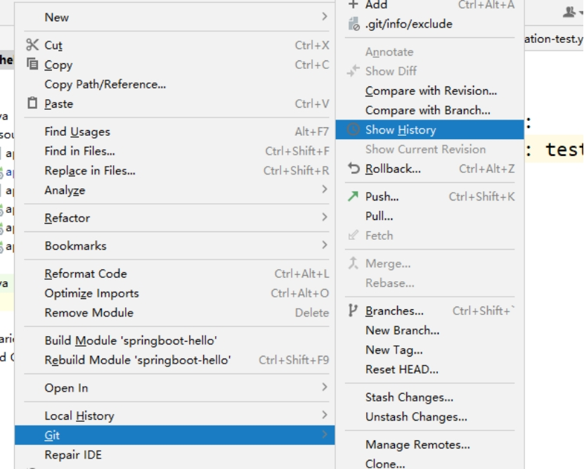 

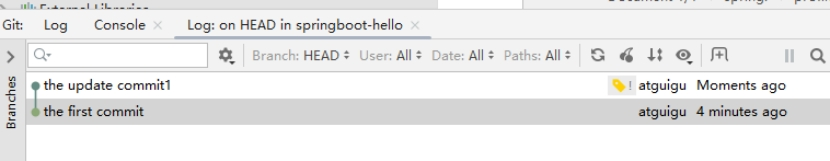 

右键选择要切换的版本，然后在菜单里点击get。


# 第5章 GitLab的部署与使用    

## 1.为什么使用GitLab-开发运维一体化

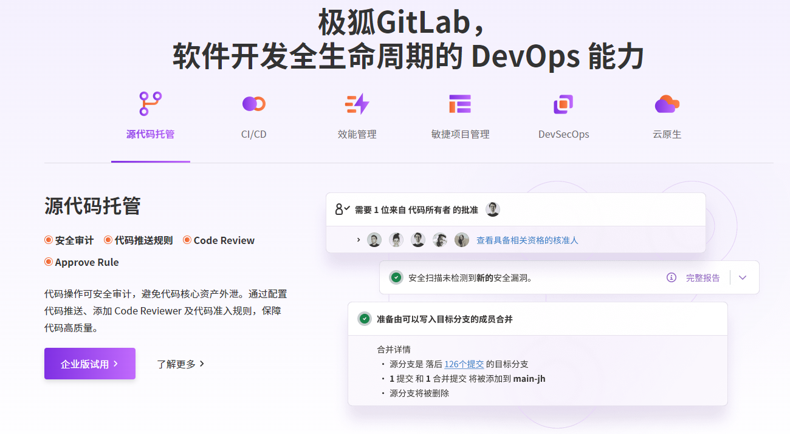

## 2. 部署安装GitLab

使用git，还需要一个远程代码仓库。常见的github、gitee这种远程代码仓库，公司中一般不会使用，因为他们是使用外网的，不够安全。一般企业都会搭建一个仅内网使用的远程代码仓库，最常见就是 GitLab。

### **2.1** **安装部署**

GitLab一般由公司的运维人员安装部署，开发人员只需要申请账号和相应权限即可，在这里我们在hadoop104上自己安装GitLab社区版体验一下。

#### **2.1.1** **安装准备**

**1）需要开启ssh：（已开启可跳过）**

```shell
sudo systemctl status sshd
sudo systemctl enable sshd
sudo systemctl start sshd
```

**2）防火墙开放http、https服务：（已关闭防火墙可跳过）**

```shell
sudo systemctl status firewalld
sudo firewall-cmd --permanent --add-service=http
sudo firewall-cmd --permanent --add-service=https
sudo systemctl reload firewalld
```

#### **2.1.2** **rpm** **包安装**

**1）上传安装包**

下载地址：<https://packages.gitlab.cn/#browse/search/>

安装包较大，建议下载好手动上传服务器。这里上传到/opt/software

**2）编写安装脚本**

```
cd ~/bin
vim gitlab-install.sh
```

脚本内容如下：

```
sudo yum install -y curl policycoreutils-python openssh-server perl
curl -fsSL https://packages.gitlab.cn/repository/raw/scripts/setup.sh | /bin/bash
sudo rpm -ivh gitlab-jh-16.6.1-jh.0.el7.x86_64.rpm
sudo yum install -y postfix
sudo systemctl enable postfix
sudo systemctl start postfix
```

**3）修改脚本执行权限并执行**

```
chmod +x gitlab-install.sh
sh gitlab-install.sh
```

**4）**修改external_url

编辑gitlab.rb

```
[atguigu@hadoop104 ~]$ sudo vim /etc/gitlab/gitlab.rb
```

在文件中找到external_url，修改为如下内容

```
external_url 'http://hadoop104'
```

保存退出

**5）**修改host

编辑gitlab.yml

```shell
[atguigu@hadoop104 ~]$ sudo vim /opt/gitlab/embedded/service/gitlab-rails/config/gitlab.yml.example
```

找到gitlab.host修改为如下内容

```
  gitlab:

    \## Web server settings (**note:** host is the FQDN, do not include http://)

    host: hadoop104

    port: 80

    https: false
```

保存退出

修改文件名称

```
[atguigu@hadoop104 ~]$ sudo mv /opt/gitlab/embedded/service/gitlab-rails/config/gitlab.yml.example /opt/gitlab/embedded/service/gitlab-rails/config/gitlab.yml
```

**6**）重装需要彻底卸载

1 卸载gitlab

```
[atguigu@hadoop104 opt]$ sudo rpm -e gitlab-jh-16.6.1
```

2 删除gitlab文件

```
[atguigu@hadoop104 opt]$ sudo rm -rf /etc/gitlab
[atguigu@hadoop104 opt]$ sudo rm -rf /var/opt/gitlab
[atguigu@hadoop104 opt]$ sudo rm -rf /opt/gitlab
```

3 重装如果卡在sudo gitlab-ctl reconfigure配置命令上，可以使用另外一个窗口执行

```
sudo systemctl restart gitlab-runsvdir
```

#### **2.1.3** **执行初始化**

执行过程大概需要3分钟：

```
sudo gitlab-ctl reconfigure
```

#### **2.1.4** **启停命令**

**1**）启动命令

```
sudo gitlab-ctl start
```

**2）停止命令**

```
sudo gitlab-ctl stop
```

#### **2.1.5** **修改 root** **密码**

**1**）访问Web页面

默认使用80端口，直接浏览器输入安装服务器的hostname或ip：hadoop104


2）查看root密码

账号root，密码将随机生成并在 /etc/gitlab/initial_root_password 中保存24 小时：

```
sudo cat /etc/gitlab/initial_root_password

zOyGe6aBQbkfYf6rOZP2qaWQOAo59K0HMrq9Rs7Yi2w=
```

修改密码：

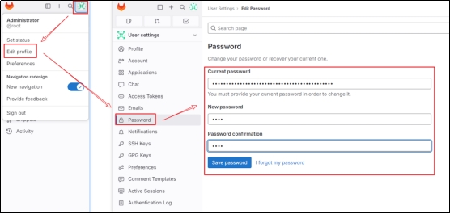 

#### **2.1.6** **设置简体中文**

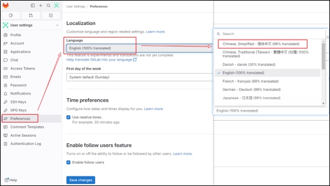 

回到首页，可以看到变成中文：

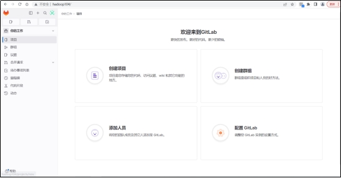 

## 3. 使用GitLab完成团队管理

去到一家公司，应该是已经有了GitLab平台，运维人员拥有root管理员账号。而作为一名普通的开发人员，你的leader和同事都拥有各自的GitLab账号和不同权限。入职后，你只需要申请开通GitLab账号和对应权限，不需要你来操作。

### **3.1** **创建用户**

为了更符合公司实际，我们假设数据组的leader账号为tutou，你是atguigu。

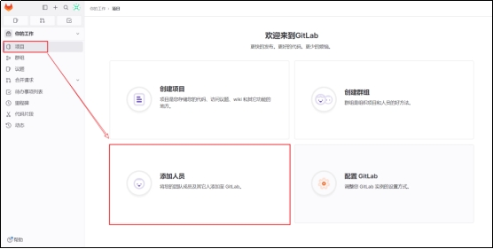 

创建一个leader的账号：

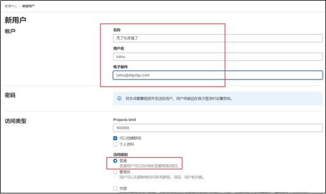 

再申请一个atguigu账号

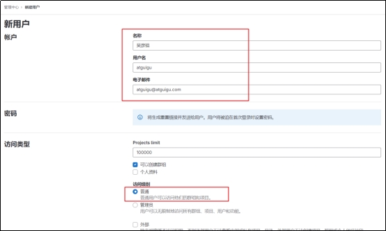 

用户会收到重置密码的邮件，也可以由管理员设置：

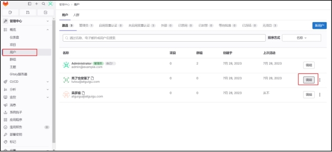 

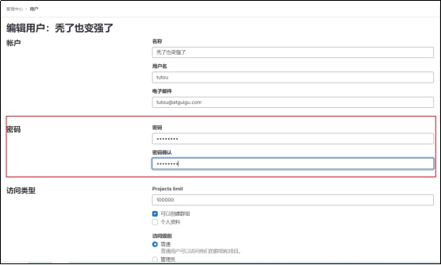 

### **3.2** **创建群组**

在gitlab里，可以创建出组、组下的子组。在小公司里可以看见gitlab里边会创建出后端，大数据等等一系列组。尽量不要使用中文创建组名, 可以在组信息中的备注编写中文描述以及中文组名, 组内人员名称也尽量用全拼命名。

对于人员权限以及角色的控制也比较简单，有如下五种：

Ø Owner：最高权限，谁去创建组，这个组就被谁拥有，它可以开除管理员，但管理员无法操作owner的角色。

Ø Maintainer：（管理员-只是具备sudo权限的用户）管理员一般是给小组的组长，或者是给产品线的总监设定。

Ø Developer：是干活的人，就是写代码的程序员，可以进行代码的上传以及代码的下载，不能下载其他的组内的代码，只能下载它们组的代码。

Ø Repoter：比如现在有需求，其他组的大牛到我们组过来指导工作，要审视我们的代码，人家就提出需要一个权限，我不能给它developer因为它会改你代码，其他组的人不能改我们组的代码，所以就给一个repoter权限，他只能看，只读权限。

Ø guest：不用看，匿名，直接去掉。一般出现在从ldap中把离职人员的信息删掉，再去gitlab查这个人的时候，它就是一个guest用户（匿名）需要再到gitlab把它删掉（不删也没事）。

下面，我们假设研发部群组是rdc，下属后端组、前端组、大数据组等子群组：

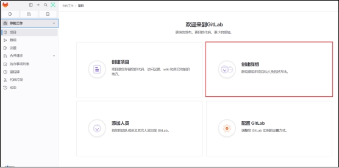 

**1）创建研发中心群组rdc**

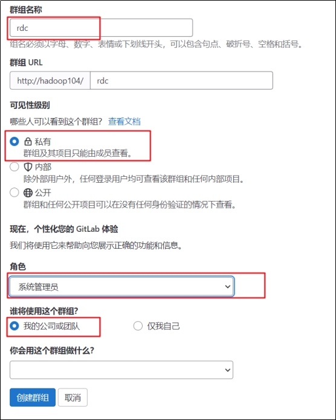 

**2**）创建大数据组

在研发中心组下，再创建一个大数据组（当然，其他还会有后端组、前端组等）：

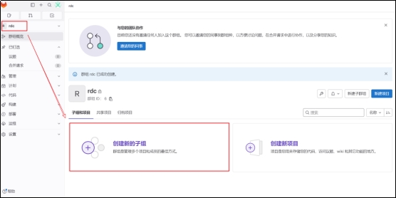 

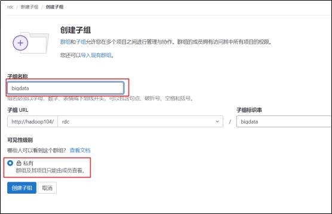 

当然，根据公司情况还可以进一步在数据组下面细分子组（比如：离线、实时、湖等），这里我们就不再细分。

将数据组的leader设为bigdata的负责人：

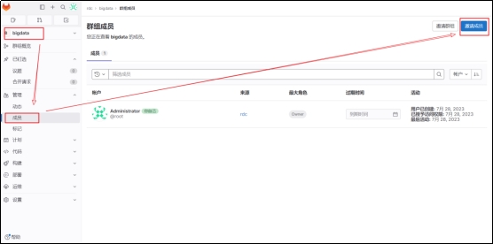 

将atguigu添加为普通的开发人员：

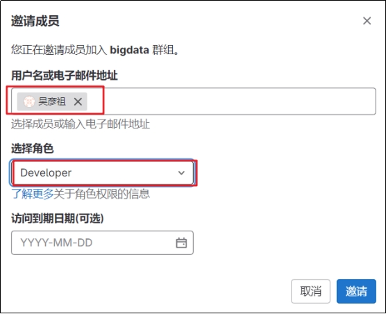 

现在我们就有一个顶级群组rdc，其下有一个子群组bigdata，组内有管理员tutou，开发人员atguigu。

## 4.使用IDEA兼容GitLab

**1）**安装 GitLab 插件

 

**2）** **配置 SSH 免密登录**

```
ssh-keygen -t rsa -C ergou@atguigu.com
```


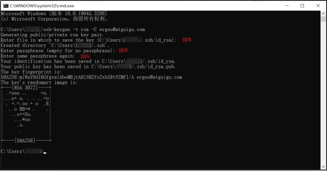 

到用户目录下.ssh查看id_rsa.pub文件

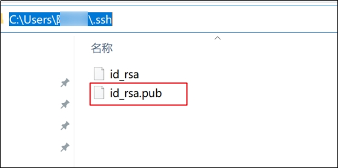 

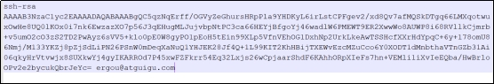 

添加到GitLab中：

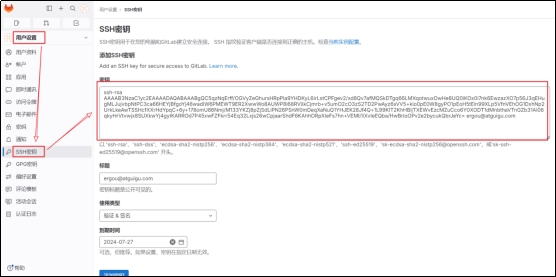 

**3）**获取 GitLab 个人令牌

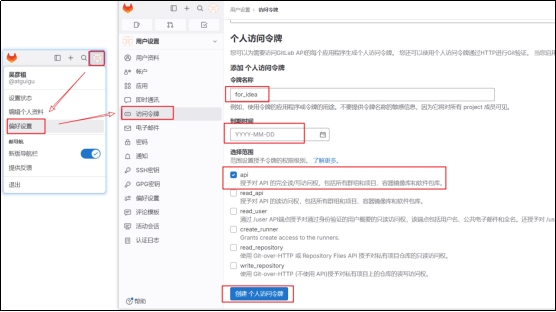 

创建后，可以查看和复制生成的token：

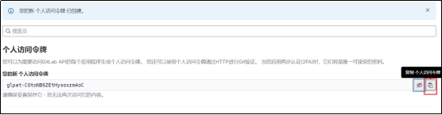 

**4）**添加 GitLab 服务

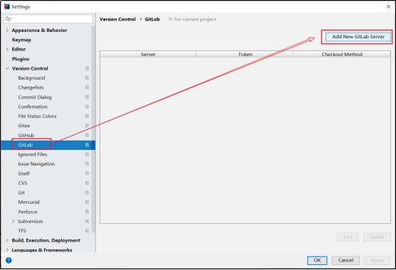 

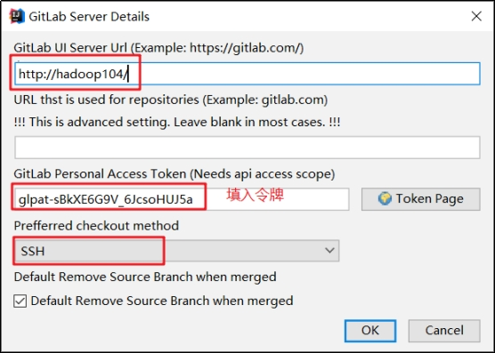 

**5）**修改默认分支的保护策略

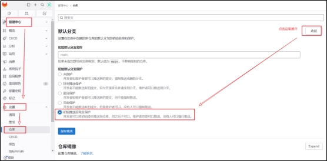 

# 第6章 企业项目构建与开发分支

## 1. GitFlow工作流介绍

在项目开发过程中使用 Git 的方式常见的有：

### **1.1 集中式工作流**

所有修改都提交到 Master 这个分支。比较适合极小团队或单人维护的项目，不建议使用这种方式。

 

### **1.2 功能开发工作流**

功能开发应该在一个专门的分支，而不是在 master 分支上。适用于小团队开发。

 

### **1.3 GitFlow工作流**

公司中最常用于管理大型项目。为功能开发、发布准备和维护设立了独立的分支，让发布迭代过程更流畅。

 

### **1.4 Forking工作流**

在 GitFlow 基础上，充分利用了 Git 的 Fork 和 pull request 的功能以达到代码审核的目的。一般用于跨团队协作、网上开源项目。

 

## 2. 各分支功能介绍


### 2.1 主干分支 master

主要负责管理正在运行的生产环境代码，永远保持与正在运行的生产环境完全一致。为了保持稳定性一般不会直接在这个分支上修改代码，都是通过其他分支合并过来的。

### 2.2 开发分支 develop

主要负责管理正在开发过程中的代码。一般情况下应该是最新的代码。

### 2.3 功能分支 feature

为了不影响较短周期的开发工作，一般把中长期开发模块，会从开发分支中独立出来。 开发完成后会合并到开发分支。

### 2.4 准生产分支（预发布分支） release

较大的版本上线前，会从开发分支中分出准生产分支，进行最后阶段的集成测试。该版本上线后，会合并到主干分支。生产环境运行一段阶段较稳定后可以视情况删除。

### 2.5 bug 修理分支 hotfix

主要负责管理生产环境下出现的紧急修复的代码。 从主干分支分出，修复完毕并测试上线后，并回主干分支和开发分支。并回后，视情况可以删除该分支。

## 3. 创建项目与分支管理

首先在Gitlab上面按照项目规格创建远程仓库。


### 3.1 idea与远程仓库连接


### 3.2 不同分支的提交与合并

（1）新建分支和切换分支


（2）不同分支提交代码与合并

首先在feature分支编写第一个模块的模拟代码，并提交

```java
package com.atguigu;


public class module1 {
    public static void main(String[] args) {
        System.out.println("完成第一个模块的开发");
    }
}
```

（3）合并feature到develop分支


审查测试通过之后，完成合并


# 第7章 冲突提交

实际单个模块的开发往往不是单独一个人来进行操作，当多个人协同开发相同的一个项目时，就会涉及到提交冲突的问题。

## 1. 不同人修改不同文件

（1）在远程仓库添加gitLab.txt

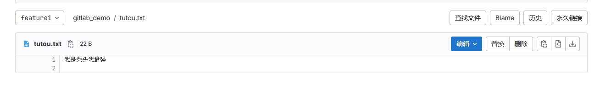

（2）在本地IDEA中添加代码，继续进行第二个模块的开发

```java
public class Module2 {
    public static void main(String[] args) {
        System.out.println("开始进行模块2的开发");
    }
}
```

（3）提交代码到远程仓库，此时会有报错信息


Git会智能识别，采用merge合并命令，拉取远端文件到本地进行合并。

（4）查看Git提交的全部历史记录，可以看到中间有拉取Gitee日志的部分


## 2. 不同人修改同文件的不同区域

（1）远程仓库修改module1代码

```java
public class Module1 {
    public static void main(String[] args) {
        System.out.println("没完成模块1的开发");
    }
}
```

（2）本地IDEA继续添加代码

```java

//添加注释
public class Module1 {
    public static void main(String[] args) {
        System.out.println("完成模块1的开发");
    }
}
```

（3）提交代码，之后push到远程仓库


同样可以采用merge命令，git会自动合并不同的区域代码。


## 3. 不同人修改同文件的相同区域

（1）远程仓库添加模块开发顺利


（2）本地IDEA添加模块开发遇到了bug

```java
public class module1 {
    public static void main(String[] args) {
        System.out.println("完成第一个模块的开发");
        System.out.println("继续进行第一个模块的二次开发");
        System.out.println("模块开发继续!!!");
        System.out.println("模块开发遇到了bug!");
    }
}
```


无法直接采用merge命令，需要人为判断哪些作为最终的结果来保留

（3）之后需要重新提交到远程仓库


## 4. 同时变更文件名和文件内容

（1）本地IDEA修改原先的文件名称为Module1plus，之后重新开发实现功能

```java
//添加注释
public class Module1plus {
    public static void main(String[] args) {
        System.out.println("没完成模块1的开发");
        System.out.println("模块1的开发遇到了bug");
        System.out.println("完成了模块1的开发");
        System.out.println("进一步完成了模块1的拓展开发");
    }
}
```

（3）提交代码修改到远程仓库


可以直接提交成功。

## 5. 不同人把同一文件改成不同的文件名

（1）远程仓库把文件名称改为module1

（2）本地IDEA修改文件名称为module3

（3）提交到远程仓库


（4）需要手动宣传使用哪一个


push会导致报错，之后需要用户自己解决保留哪些文件。

（5）使用命令解决最终的冲突

```
C:\mybigdata\project\gitlab_demo>git status
#删除掉报红找不到的文件
C:\mybigdata\project\gitlab_demo>git rm src/main/java/com/atguigu/Module1Plus.java
```

（6）最后重新选择正确的代码提交到仓库


# 第8章 GitLab功能拓展

## 1. 使用GitLab完成code review


## 2. CICD部署程序

使用gitLab的自动部署功能，可以快速实现自动部署，完成运行。


## 3. 安装gitLab-runner

上传安装包之后执行

```
sudo rpm -ivh gitlab-runner-16.6.1-1.x86_64.rpm
```

之后运行注册命令

```
sudo gitlab-runner register
#输入地址
http://hadoop104
#输入token 
nqaTgGDeJyFsA5fzg8ck
#输入描述
[hadoop104]: ci
#输入标签
ci
#输入记录标签

WARNING: Support for registration tokens and runner parameters in the 'register' command has been deprecated in GitLab Runner 15.6 and will be replaced with support for authentication tokens. For more information, see https://docs.gitlab.com/ee/ci/runners/new_creation_workflow 
Registering runner... succeeded                     runner=nqaTgGDe
#选择运行模式 -> 使用最简单的shell
shell
```

token的位置

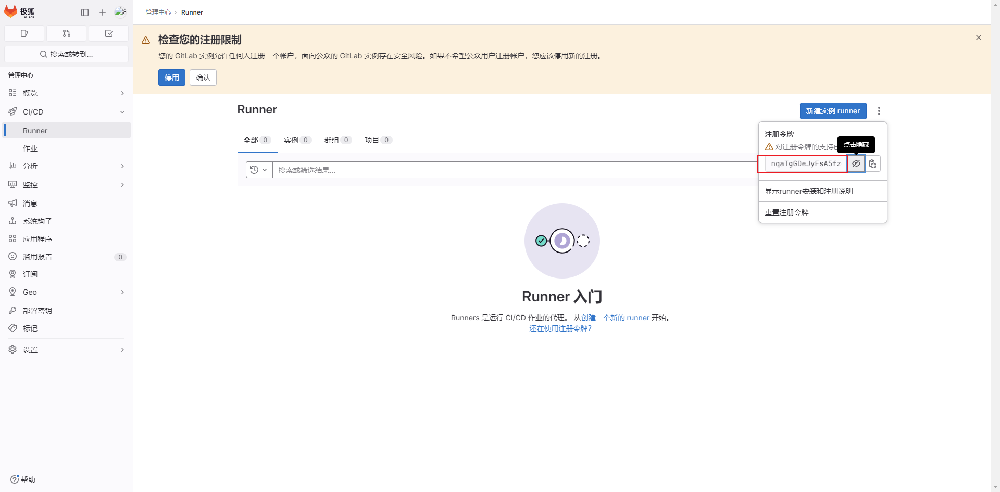

注册完成之后，runner就已经上线了。

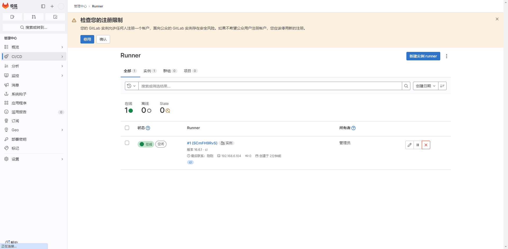


 
