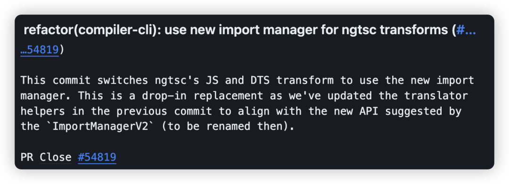
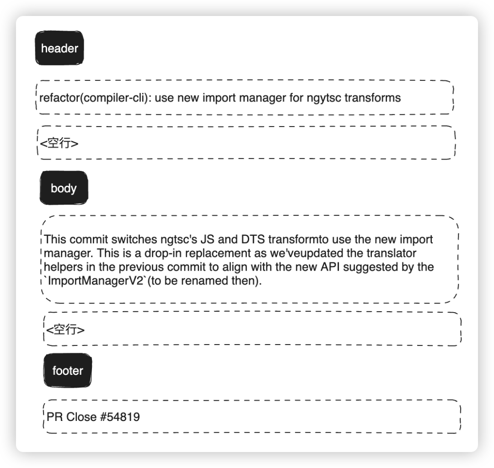

# Git Commit 规范


Commit 组成：

```bash
<header>
<空一行>
<body>
<空一行>
<footer>
```



对应如下：



其中

- **header** 是必要的
- **body** 也是必要的，除了类型为 docs 之外，body 的内容必须大于 20 个字符
- **footer** 是可选的，比如放置引用的 issue

header 由三部分组成：

```bash
<类型>(<作用域>): <主题>
  │       │        │
  │       │        └─⫸ 简短总结，现在时态，不需要首字母大写，末尾不用加句号
  │       │
  │       └─⫸ Commit 作用域: animations|bazel|benchpress|common|compiler|compiler-cli|core|
  │                          elements|forms|http|language-service|localize|platform-browser|
  │                          platform-browser-dynamic|platform-server|router|service-worker|
  │                          upgrade|zone.js|packaging|changelog|docs-infra|migrations|
  │                          devtools
  │
  └─⫸ Commit 类型: build|ci|docs|feat|fix|perf|refactor|test
```

**类型**一共有 8 种：

|     类型 | 描述                                                         |
| -------: | :----------------------------------------------------------- |
|    build | 影响构建系统或外部依赖的更改 (示例范围：gulp, broccoli, npm) |
|       ci | 对 CI 配置文件和脚本的更改 (示例：CircleCi, SauceLabs, GitHub Workflow) |
|     docs | 仅文档更改                                                   |
|     feat | 新功能                                                       |
|      fix | 错误修复                                                     |
|     perf | 改善性能的代码更改                                           |
| refactor | 既不修复错误也不添加功能的代码更改                           |
|     test | 添加缺失测试或更正现有测试                                   |

> https://github.com/angular/angular/blob/main/CONTRIBUTING.md#scope

**主题**要简单总结，如果团队使用英语，语法上需符合：

- **祈使句**，并且是现在时态，比如 “change”，而不是 “changed” 或者 “changes”
- 首字母**不需要大写**
- 结尾**不需要逗号或者句号**

```bash
docs(server): add javadoc comments on methods
feat(core): add new command 'Upload' to UI
fix: update GET headers (#142)
```


# Cherry-pick


## 描述

给定一个或多个现有提交，应用每个提交引入的更改，为每个提交记录一个新的提交。这需要工作树清洁（没有从头提交的修改）

将已经提交的 commit，复制出新的 commit 应用到分支里

## **应用场景**

应用场景1：有时候版本的一些优化需求开发到一半，可能其中某一个开发完的需求要临时上，或者某些原因导致待开发的需求卡住了已开发完成的需求上线。这时候就需要把 commit 抽出来，单独处理。

应用场景2：有时候开发分支中的代码记录被污染了，导致开发分支合到线上分支有问题，这时就需要拉一条干净的开发分支，再从旧的开发分支中，把 commit 复制到新分支。

### **复制单个**

现在有一条 `feature` 分支，commit 记录如下：

需要把 b 复制到另一个分支，首先把 commitHash 复制下来，然后切到 master 分支。

当前 master 最新的记录是 a，使用cherry-pick把 b 应用到当前分支。

完成后看下最新的 log，b 已经应用到 master，作为最新的 commit 了。可以看到 commitHash 和之前的不一样，但是提交时间还是保留之前的。

### **复制多个**

以上是单个 commit 的复制，下面再来看看 cherry-pick 多个 commit 要如何操作。

一次转移多个提交：

```bash
git cherry-pick commit1 commit2
```

上面的命令将 commit1 和 commit2 两个提交应用到当前分支。

多个连续的 commit，也可区间复制：

```bash
git cherry-pick commit1^..commit2
```

上面的命令将 commit1 到 commit2 这个区间的 commit 都应用到当前分支（包含commit1、commit2），commit1 是最早的提交。

**放弃 cherry-pick**

```bash
git cherry-pick --abort
```

**退出 cherry-pick**

```bash
git cherry-pick --quit
```


# Reflog

## **描述**

此命令管理重录中记录的信息。

如果说reset --soft是后悔药，那 reflog 就是强力后悔药。它记录了所有的 commit 操作记录，便于错误操作后找回记录。

## **应用场景**

​	应用场景：某天你眼花，发现自己在其他人分支提交了代码还推到远程分支，这时因为分支只有你的最新提交，就想着使用`reset --hard` ，结果紧张不小心记错了 commitHash，reset 过头，把同事的 commit 搞没了。没办法，`reset --hard` 是强制回退的，找不到 commitHash 了，只能让同事从本地分支再推一次（同事瞬间拳头就硬了，怎么又是你）。于是，你的技术形象又一落千丈。


## **命令使用**

用 `git reflog` 查看历史记录，把错误提交的那次 commitHash 记下

```bash
git reflog
```


# **Reset**


## **描述**

完全不接触索引文件或工作树（但会像所有模式一样，将头部重置为）。这使所有更改的文件更改为“要提交的更改”

回退你已提交的 commit，并将 commit 的修改内容放回到暂存区。

一般在使用 reset 命令时，`git reset --hard` 会被提及的比较多，它能让 commit 记录强制回溯到某一个节点。而 `git reset --soft` 的作用正如其名，`--soft` (柔软的) 除了回溯节点外，还会保留节点的修改内容


## **命令使用**

```bash
# 恢复最近一次 commit
git reset --soft HEAD^
```

`reset --soft` 相当于后悔药，给重新改过的机会。对于上面的场景，就可以再次修改重新提交，保持干净的 commit 记录。

以上说的是还未 push 的 commit。对于已经 push 的 commit，也可以使用该命令，不过再次 push 时，由于远程分支和本地分支有差异，需要强制推送 `git push -f` 来覆盖被 reset 的 commit

还有一点需要注意，在 `reset --soft` 指定 commit 号时，会将该 commit 到最近一次 commit 的所有修改内容全部恢复，而不是只针对该 commit

举个例子：

commit 记录有 c、b、a

```bash
git reset --soft 1a900ac29eba73ce817bf959f82ffcb0bfa38f75
```

此时的 HEAD 到了 a，而 b、c 的修改内容都回到了暂存区。


# Revert

## **描述**

给定一个或多个现有提交，恢复相关提交引入的更改，并记录一些这些更改的新提交。这就要求工作树是干净的（没有来自头部的修改）

将现有的提交还原，恢复提交的内容，并生成一条还原记录。

## **应用场景**

应用场景：有一天测试突然跟你说，开发上线的功能有问题，需要马上撤回，否则会影响到系统使用。这时可能会想到用 reset 回退，可是看了看分支上最新的提交还有其他同事的代码，用 reset 会把这部分代码也撤回了。由于情况紧急，又想不到好方法，还是任性的使用 reset，然后再让同事把他的代码合一遍（同事听到想打人），于是你的技术形象在同事眼里一落千丈

## **命令使用**

### **revert 普通提交**

学会 revert 之后，立马就可以拯救这种尴尬的情况。

现在 master 记录如下：

```bash
git revert 21dcd937fe555f58841b17466a99118deb489212
```

revert 掉自己提交的 commit

### **revert 合并提交**

在 git 的 commit 记录里，还有一种类型是合并提交，想要 revert 合并提交，使用上会有些不一样。

官方：通常无法 revert 合并，因为您不知道合并的哪一侧应被视为主线。此选项指定主线的父编号（从1开始），并允许 revert 反转相对于指定父编号的更改

合并提交是两条分支的交集节点，而 git 不知道需要撤销的哪一条分支，需要添加参数 -m 指定主线分支，保留主线分支的代码，另一条则被撤销。


-m 后面要跟一个 parent number 标识出"主线"，一般使用 1 保留主分支代码。

```bash
git revert -m 1 <commitHash>
```

### **revert 合并提交后，再次合并分支会失效**

还是上面的场景，在 master 分支 revert 合并提交后，然后切到 feature 分支修复好 bug，再合并到 master 分支时，会发现之前被 revert 的修改内容没有重新合并进来。

因为使用 revert 后， feature 分支的 commit 还是会保留在 master 分支的记录中，当再次合并进去时，git 判断有相同的 commitHash，就忽略了相关 commit 修改的内容。

这时就需要 revert 掉之前 revert 的合并提交，有点拗口


# Stash

## **描述**

官方解释：当想记录工作目录和索引的当前状态，但又想返回一个干净的工作目录时，请使用 `git stash` 。该命令将保存本地修改，并恢复工作目录以匹配头部提交。

stash 命令能够将还未 commit 的代码存起来，让工作目录变得干净。

## **命令使用**

`git stash` 

当修复完线上问题，切回 `feature` 分支，想恢复代码也只需要：

```bash
git stash apply
```

相关命令

```bash
# 保存当前未commit的代码
git stash

# 保存当前未commit的代码并添加备注
git stash save "备注的内容"

# 列出stash的所有记录
git stash list

# 删除stash的所有记录
git stash clear

# 应用最近一次的stash
git stash apply

# 应用最近一次的stash，随后删除该记录
git stash pop

# 删除最近的一次stash
git stash drop
```

当有多条 stash，可以指定操作stash，首先使用 `stash list`  列出所有记录：

```bash
$ git stash list
stash@{0}: WIP on ...
stash@{1}: WIP on ...
stash@{2}: On ...

# 应用第二条记录	pop，drop 同理
$ git stash apply stash@{1}
```


