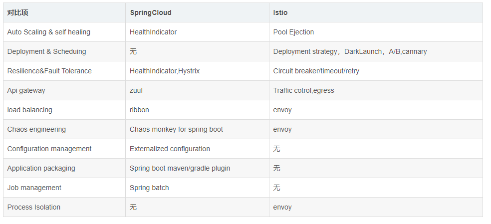

# istio

[An open platform to connect, secure, control and observe services.](https://istio.io/)

## 一、简介

- 连接（Connect）：智能控制服务之间的调用流量，能够实现灰度升级、AB 测试和红黑部署等功能
- 安全加固（Secure）：自动为服务之间的调用提供认证、授权和加密
- 控制（Control）：应用用户定义的 `policy` ，保证资源在消费者中公平分配
- 观察（Observe）：查看服务运行期间的各种数据，比如日志、监控和 `tracing` ，了解服务的运行情况


`istio`  就是上述提到的 service mesh 架构的一种实现，服务之间的通信（比如这里的 Service A 访问 Service B）会通过代理（默认是 envoy）来进行，而且中间的网络协议支持 HTTP/1.1，HTTP/2，gRPC 或者 TCP，可以说覆盖了主流的通信协议。控制中心做了进一步的细分，分成了 Pilot、Mixer、和 Citadel，它们的各自功能如下：

- `Pilot` ：为 envoy 提供了服务发现，流量管理和智能路由（AB测试、金丝雀发布等），以及错误处理（超时、重试、熔断）功能。用户通过 pilot 的 API 管理网络相关的资源对象，pilot 会根据用户的配置和服务的信息把网络流量管理变成 envoy 能识别的格式分发到各个 sidecar 代理中。
- `Mixer` ：为整个集群执行访问控制（哪些用户可以访问哪些服务）和 policy 管理（`rate limit` ，`quota` 等），并且收集代理观察到的服务之间的流量统计数据
- `Citadel` ：为服务之间提供认证和证书管理，可以让服务自动升级成 TLS 协议

代理会和控制中心通信，一方面可以获取需要的服务之间的信息，另一方面也可以汇报服务调用的 metrics 数据。知道 istio 的核心架构，再来看看它的功能描述就非常容易理解了。

- 连接：控制中心可以从集群中获取所有服务的信息，并分发给代理，这样代理就能根据用户的期望来完成服务之间的通信（自动地服务发现、负载均衡、流量控制等）
- 安全加固：因为所有的流量都是通过代理的，那么代理接收到不加密的网络流量之后，可以自动做一次封装，把它升级成安全的加密流量
- 控制：用户可以配置各种规则（比如 RBAC 授权、白名单、`rate limit` 或者 `quota` 等），当代理发现服务之间的访问不符合这些规则，就直接拒绝掉
- 观察：所有的流量都经过代理，因此代理对整个集群的访问情况知道得一清二楚，它把这些数据上报到控制中心，那么管理员就能观察到整个集群的流量情况了

An Istio service mesh is logically split into a **data plane** and a **control plane**.

- The **data plane** is composed of a set of intelligent proxies ([Envoy](https://www.envoyproxy.io/)) deployed as sidecars. These proxies mediate and control all network communication between microservices. They also collect and report telemetry on all mesh traffic.
- The **control plane** manages and configures the proxies to route traffic.

The following diagram shows the different components that make up each plane:


### 架构与组件


1）数据平面

- 由一组 proxy 组成，这些 Proxy 负责所有微服务网络通信，实现高效转发和策略

- 使用 envoy 实现，envoy是一个基于C++实现的 `L4/L7 Proxy` 转发器，是 `Istio` 在数据平面唯一的组件

2）控制平面

> 1.5版本之后弃用了 mixer，将原有多个组件整合为 istiod

使用全新的部署模式：istiod，这个组件负责处理 `Sidecar` 注入、证书分发、配置管理等功能，替代原有组件，降低复杂度，提高易用性

• Galley：配置验证、提取、处理和分发组件，实现原理是通过 k8s 提供的 ValidatingWebhook 对配置进行验证

• Pilot： 策略配置组件，Istio 的主要控制组件，下发指令控制客户端。在整个系统中，Pilot 完成以下任务：

- 从 Kubernetes 或者其他平台的注册中心获取服务信息，完成服务发现过程
- 读取 Istio 的各项控制配置，在进行转换之后，将其发给数据面进行实施
- 将配置内容下发给数据面的 Envoy，Envoy 根据 Pilot 指令，将路由、服务、监听、集群等定义信息转换为本地配置，完成控制行为的落地


• Citadel： Istio 的核心安全组件，提供了自动生成、分发、轮换与撤销密钥和证书功能。`Citadel` 一直监听 `Kube- apiserver` ，以 `Secret` 的形式为每个服务都生成证书密钥，并在 Pod 创建时挂载到 Pod 上，代理容器使用这些文件来做服务身份认证，进而代理两端服务实现双向TLS认证、通道加密、访问授权等安全功能。


• Ingressgateway
	Ingressgateway 就是入口处的 Gateway，从网格外访问网格内的服务就是通过这个 Gateway 进行的。istio-ingressgateway 是一个 Loadbalancer 类型的 Service，不同于其他服务组件只有一两个端口，istio-ingressgateway 开放了一组端口，这些就是网格内服务的外部访问端口。如下图所示，网格入口网关 istio-ingressgateway 的负载和网格内的 Sidecar 是同样的执行流程，也和网格内的其他 Sidecar 一样从 Pilot 处接收流量规则并执行。

• Sidecar-injector
	Sidecar-injector 是负责自动注入的组件，只要开启了自动注 入，在 Pod 创建时就会自动调用 istio-sidecar-injector 向 Pod 中注入 Sidecar 容器。
	在 Kubernetes 环境下，根据自动注入配置，Kube-apiserver 在拦截到 Pod 创建的请求时，会调用自动注入服务 istio-sidecar-injector 生成 Sidecar 容器的描述并将其插入原 Pod 的定义中，这样，在创建的 Pod 内除了包括业务容器，还包括 Sidecar 容器，这个注入过程对用户透明。

### **SpringCloud 和 Istio**




<hr>


## 二、Usage

第一步，自然是在测试环境搭建一套 istio 的集群，理解所有的核心概念和组件。了解 istio 提供的接口和资源，知道它们的用处，思考如何应用到自己的场景中，然后是熟悉 istio 的源代码，跟进社区的 issues，了解目前还存在的 issues 和 bug，思考如何规避或者修复。这一步是基础，需要积累到 istio 安装部署、核心概念、功能和缺陷相关的知识，为后面做好准备。

第二步，可以考虑接入 istio 的观察性功能，包括 logging、tracing、metrics 数据。应用部署到集群中，选择性地（一般是流量比较小，影响范围不大的应用）为一些应用开启 istio 自动注入功能，接管应用的流量，并安装 prometheus 和 zipkin 等监控组件，收集系统所有的监控数据。

> 这一步可以试探性地了解 istio 对应用的性能影响，同时建立服务的性能测试基准，发现服务的性能瓶颈，帮助快速定位应用可能出现的问题。此时，这些功能可以是对应用开发者透明的，只需要集群管理员感知，这样可以减少可能带来的风险。

第三步，为应用配置 timeout 超时参数、自动重试、熔断和降级等功能，增加服务的容错性。这样可以避免某些应用错误进行这些配置导致问题的出现，这一步完成后需要通知所有的应用开发者删除掉在应用代码中对应的处理逻辑。这一步需要开发者和集群管理员同时参与。

第四步，和 ingress、helm、应用上架等相关组件和流程对接，使用 istio 接管应用的升级发布流程。让开发者可以配置应用灰度发布升级的策略，支持应用的蓝绿发布、金丝雀发布以及 AB 测试。

第五步，接入安全功能。配置应用的 TLS 互信，添加 RBAC 授权，设置应用的流量限制，提升整个集群的安全性。因为安全的问题配置比较繁琐，而且优先级一般会比功能性相关的特性要低，所以这里放在了最后。

### 安装

#### Install with Istioctl

```bash
# https://github.com/istio/istio/releases

# Or
curl -L https://istio.io/downloadIstio | ISTIO_VERSION=1.19.3 sh -
curl -L https://raw.githubusercontent.com/istio/istio/master/release/downloadIstioCandidate.sh | ISTIO_VERSION=1.19.3 TARGET_ARCH=x86_64 TARGET_OS=Linux sh -.

# Configuration
tar -zxf /opt/module/istio-1.19.3-linux-amd64.tar.gz --transform 's/istio-1.19.3/istio/'
# ln -s /opt/module/istio/bin/istioctl /usr/local/bin/istioctl
alias is="istioctl"
is version

### Istio Path
cat << EOF >> /etc/profile
### Istio Path
ISTIO_HOME=/opt/module/istio
export PATH=\$PATH:\$ISTIO_HOME/bin
EOF
source /etc/profile

# Install
istioctl manifest apply --set profile=demo
# istioctl install --set profile=demo -y

## 给命名空间添加标签，指示 Istio 在部署应用的时候，自动注入 Envoy 边车代理
kubectl label namespace default istio-injection=enabled

kubectl get pod -n istio-system
kubectl get all -n istio-system -o wide
kubectl get ns --show-labels
```

#### Install with Helm

```bash
# https://istio.io/latest/docs/setup/install/helm/
helm repo add istio https://istio-release.storage.googleapis.com/charts
helm repo update
```


```bash
kubectl get svc -n istio-system
kubectl edit svc istio-ingressgateway -n istio-system
spec:
  externalIPs:
  - 172.29.3.100

kubectl create ns istio
kubectl label ns istio istio-injection=enabled

# 卸载 Istio
istioctl manifest generate --set profile=demo | kubectl delete -f -

# Reference:https://blog.csdn.net/bxg_kyjgs/article/details/125599452
```

### 验证

```bash
# Istio 安装目录
kubectl apply -f samples/bookinfo/platform/kube/bookinfo.yaml
```

如果在安装过程中禁用了 Sidecar 自动注入功能而选择手动注入 Sidecar，请在部署应用之前使用 `istioctl kube-inject` 命令修改 `bookinfo.yaml` 文件
```bash
kubectl apply -f <(istioctl kube-inject -f samples/bookinfo/platform/kube/bookinfo.yaml)
```

上面的命令会启动全部的四个服务，其中也包括了 `reviews` 服务的三个版本（v1、v2 以及 v3）

```bash
kubectl get services
```

要确认 `Bookinfo` 应用是否正在运行，请在某个 Pod 中用 `curl` 命令对应用发送请求，例如 `ratings`：
```bash
kubectl exec -it $(kubectl get pod -l app=ratings -o jsonpath='{.items[0].metadata.name}') -c ratings -- curl productpage:9080/productpage | grep -o "<title>.*</title>"
```

**Istio Gateway**

```bash
# 为应用程序定义 Ingress 网关
kubectl apply -f samples/bookinfo/networking/bookinfo-gateway.yaml

# 确认网关创建完成
kubectl get gateway

# 设置访问网关的 INGRESS_HOST 和 INGRESS_PORT 变量
# 设置 ingress 端口
export INGRESS_PORT=$(kubectl -n istio-system get service istio-ingressgateway -o jsonpath='{.spec.ports[?(@.name=="http2")].nodePort}')
export SECURE_INGRESS_PORT=$(kubectl -n istio-system get service istio-ingressgateway -o jsonpath='{.spec.ports[?(@.name=="https")].nodePort}')
# 设置 ingress IP
export INGRESS_HOST=$(kubectl get po -l istio=ingressgateway -n istio-system -o jsonpath='{.items[0].status.hostIP}')

# 设置 GATEWAY_URL
export GATEWAY_URL=$INGRESS_HOST:$INGRESS_PORT
```

浏览器打开网址 `http://$GATEWAY_URL/productpage`，来浏览应用的 Web 页面

**控制版本路由**

```bash
# 给各个服务创建 DestinationRule	默认目标规则
### 设置
kubectl apply -f samples/bookinfo/networking/destination-rule-all.yaml
### 查询
kubectl get destinationrules -o yaml

# 添加虚拟服务（VirtualService）
# 例：将所有流量都路由到各个微服务的 v1 版本
kubectl apply -f samples/bookinfo/networking/virtual-service-all-v1.yaml

# 更改路由配置
## 启用基于用户的路由
kubectl apply -f samples/bookinfo/networking/virtual-service-reviews-test-v2.yaml
kubectl get virtualservice reviews -o yaml

# 在 Bookinfo 应用程序的 /productpage 上，以用户 jason 身份登录
# 除了 Jason 之外，所有用户的流量都被路由到 reviews:v1
```

**流量转移**

将`reviews`的部分流量转移到v3版本，基于此可以实现灰度发布、A/B测试 etc...

```bash
# 将所有流量都路由到每个服务的 v1 版本
kubectl apply -f samples/bookinfo/networking/virtual-service-all-v1.yaml

# 将 reviews 服务 50%的流量转移到 v3
kubectl apply -f samples/bookinfo/networking/virtual-service-reviews-50-v3.yaml
```

​	刷新浏览器中的 /productpage 页面，大约有 50% 的几率会看到页面中出带 红色 星级的评价内容。这是因为 v3 版本的 reviews 访问了带星级评级的 ratings 服务，但 v1 版本却没有。

​	如果认为 `reviews:v3` 微服务已经稳定，可以通过应用此 `virtual service` 规则将 100% 的流量路由到 `reviews:v3` ：
```bash
# 将 reviews 服务的全部流量都切换到 v3 版本
kubectl apply -f samples/bookinfo/networking/virtual-service-reviews-v3.yaml

# 删除所有服务的虚拟网络
kubectl delete -f samples/bookinfo/networking/virtual-service-all-v1.yaml
```

**超时与重试**

`http` 请求的超时可以用[路由规则](https://istio.io/v1.6/zh/docs/reference/config/networking/virtual-service/#HTTPRoute)的 *timeout* 字段来指定。 默认情况下，超时是禁用的

将请求路由到 `reviews` 服务的 v2 版本，它会去调用 `ratings` 服务，首先在 `ratings` 服务上人为的引入 `2s` 的延迟（故障注入），再对 `reviews` 服务配置超时`timeout`

```bash
# 在 istio/samples/bookinfo/networking 目录下创建配置文件
vim virtual-service-reviews-v2-timeout.yaml
apiVersion: networking.istio.io/v1alpha3
kind: VirtualService
metadata:
  name: ratings
spec:
  hosts:
  - ratings
  http:
  - fault:
      delay:
        percent: 100
        fixedDelay: 2s
    route:
    - destination:
        host: ratings
        subset: v1
---
apiVersion: networking.istio.io/v1alpha3
kind: VirtualService
metadata:
  name: reviews
spec:
  hosts:
  - reviews
  http:
  - route:
    - destination:
        host: reviews
        subset: v2
    #timeout: 0.5s

kubectl apply -f virtual-service-reviews-v2-timeout.yaml
# 每次刷新页面，都会有 2 秒的延迟
```

重新编辑该文件，放开对 `reviews` 服务的调用增加一个半秒的请求超时（去掉 *timeout* 的注释）
```bash
kubectl apply -f virtual-service-reviews-v2-timeout.yaml
kubectl get virtualservice -o yaml
```

 1 秒钟就会返回，而不是之前的 2 秒钟，但 `reviews` 是不可用的（页面没有 `reviews` 的数据）

> 即使超时配置为半秒，响应仍需要 1 秒，是因为 `productpage` 服务中存在硬编码重试，因此它在返回之前调用 `reviews` 服务超时两次（重试）

Reference：https://istio.io/v1.6/zh/docs/reference/config/networking/virtual-service/#HTTPRoute

​		    https://istio.io/v1.6/zh/docs/reference/config/networking/virtual-service/#HTTPRetry
**熔断**
​	在熔断器中，设置一个对服务中的单个主机调用的限制，例如并发连接的数量或对该主机调用失败的次数。一旦限制被触发，熔断器就会“跳闸”并停止连接到该主机，使用熔断模式可以快速失败而不必让客户端尝试连接到过载或有故障的主机。

```bash
# 部署 httpbin	测试 HTTP 请求和响应
kubectl apply -f samples/httpbin/httpbin.yaml
```

```bash
# 创建一个目标熔断规则（DestinationRule）
kubectl apply -f - <<EOF
apiVersion: networking.istio.io/v1alpha3
kind: DestinationRule
metadata:
  name: httpbin
spec:
  host: httpbin
  trafficPolicy:
    connectionPool:
      tcp:
        maxConnections: 1  #最大连接数
      http:
        http1MaxPendingRequests: 1  #http请求pending状态的最大请求数
        maxRequestsPerConnection: 1  #在一定时间内限制对后端服务发起的最大请求数
    outlierDetection:  #熔断设置
      consecutiveErrors: 1  #从连接池开始拒绝连接，已经连接失败的次数，当通过HTTP访问时，返回代码是502、503或504则视为错误。
      interval: 1s  #拒绝访问扫描的时间间隔，即在interval（1s）内连续发生1个consecutiveErrors错误，则触发服务熔断，格式是1h/1m/1s/1ms，但必须大于等于1ms。即分析是否需要剔除的频率，多久分析一次，默认10秒。
      baseEjectionTime: 3m  #最短拒绝访问时长。这个时间主机将保持拒绝访问，且如果决绝访问达到一定的次数。格式:1h/1m/1s/1ms，但必须大于等于1ms。实例被剔除后，至少多久不得返回负载均衡池，默认是30秒。
      maxEjectionPercent: 100  #服务在负载均衡池中被拒绝访问（被移除）的最大百分比，负载均衡池中最多有多大比例被剔除，默认是10%。
EOF
kubectl get destinationrule httpbin -o yaml
```

​	创建客户端程序以发送流量到 httpbin 服务。这是一个名为 Fortio 的负载测试客户的，可以控制连接数、并发数及发送 HTTP 请求的延迟。通过 Fortio 能够有效的触发前面 在 DestinationRule 中设置的熔断策略
```bash
# 向客户端注入 Istio Sidecar 代理，以便 Istio 对其网络交互进行管理
kubectl apply -f <(istioctl kube-inject -f samples/httpbin/sample-client/fortio-deploy.yaml)

# 登入客户端 Pod 并使用 Fortio 工具调用 httpbin 服务。-curl 参数表明发送一次调用
FORTIO_POD=$(kubectl get pod | grep fortio | awk '{ print $1 }')
kubectl exec -it $FORTIO_POD  -c fortio -- /usr/bin/fortio load -curl  http://httpbin:8000/get
```

**触发熔断器**
在 DestinationRule 配置中，定义了 `maxConnections: 1` 和 `http1MaxPendingRequests: 1`。 这些规则意味着，如果并发的连接和请求数超过一个，在 `istio-proxy` 进行进一步的请求和连接时，后续请求或连接将被阻止

```bash
# 发送并发数为 2 的连接（-c 2），请求 20 次（-n 20）
kubectl exec -it $FORTIO_POD  -c fortio -- /usr/bin/fortio load -c 2 -qps 0 -n 20 -loglevel Warning http://httpbin:8000/get

# 将并发连接数提高到 3 个
kubectl exec -it $FORTIO_POD  -c fortio -- /usr/bin/fortio load -c 3 -qps 0 -n 30 -loglevel Warning http://httpbin:8000/get

# 查询 istio-proxy 状态以了解更多熔断详情
kubectl exec $FORTIO_POD -c istio-proxy -- pilot-agent request GET stats | grep httpbin | grep pending
```

```bash
# 清理规则
kubectl delete destinationrule httpbin

# 下线 httpbin 服务和客户端
kubectl delete deploy httpbin fortio-deploy
kubectl delete svc httpbin
```


至此，Istio 完成了全部的接管 ~


## 三、Virtual Services

​	实现服务请求路由规则的功能，虚拟服务来定义路由规则和描述满足条件的请求去哪里，而目标规则则是定义子集和策略，描述到达目标的请求该怎么处理

```yaml
apiVersion: networking.istio.io/v1alpha3
kind: VirtualService
metadata:
  name: reviews
spec:
  hosts:
    - reviews
  http:
  - route:
    - destination:
        host: reviews
        subset: v3
```


## 四、Destination rules

​	实现目标服务的负载均衡、服务发现、故障处理和故障注入的功能。

　　在虚拟服务中使用`Hosts` 配置默认绑定的路由地址，用 `http.route` 字段，设置 `http` 进入的路由地址，可以看到，导入到了目标规则为 `reviews` 的 `v3` 子集

```yml
apiVersion: networking.istio.io/v1alpha3
kind: DestinationRule
metadata:
  name: reviews
spec:
  host: reviews
  trafficPolicy:
    loadBalancer:
      simple: RANDOM
  subsets:
  - name: v1
    labels:
      version: v1
  - name: v2
    labels:
      version: v2
  - name: v3
    labels:
      version: v3
```


## 五、Gateway

​	让服务网格内的服务，可以被全世界看到

　　一个运行在网格边缘的负载均衡器，主要工作是接受外部请求，转发到内部的服务，还可以配置对外的端口、协议与内部服务的映射关系

```yml
apiVersion: networking.istio.io/v1alpha3
kind: Gateway
metadata:
  name: my-gateway
spec:
  selector:
    app: my-gateway-controller
  servers:
  - port:
      number: 80
      name: http
      protocol: HTTP
    hosts:
    - "*"
    
# 一个监听80端口的入口网关，它会将80端口的http流量导入到集群内
apiVersion: networking.istio.io/v1alpha3
kind: VirtualService
metadata:
  name: reviews
spec:
  hosts:
  - reviews
  gateway: 
  - my-gateway
  http:
  - route:
    - destination:
        host: reviews
        subset: v3
```


## 六、Service entries

​	允许管理网格外的服务的流量

​	在生产环境中会控制内部服务对外界的访问，ServiceEntry 就是用来做这个的，可以先把内部服务对外部的访问给干掉

```bash
kubectl get configmap istio -n istio-system -o yaml | sed 's/mode: ALLOW_ANY/mode: REGISTRY_ONLY/g'
```

​	再 `exec` 到 `pod` 中会发现无法 `curl www.baidu.com` 了
　　现在配置一下对应的 `ServiceEntry` 

```yml
apiVersion: networking.istio.io/v1alpha3
kind: ServiceEntry
metabase: 
    name: http-baidu
spec: 
    hosts: 
    - www.baidu.com
    ports:
    - number:80
      name: http
      protocol: HTTP
    resolution: DNS
    location: MESH_EXTERNAL
```

再去 `curl www.baidu.com` 会发现可以访问到，这是因为已经通过 `ServiceEntry` 来注册 www.baidu.com 在服务中了


## 七、Sidecars


## 八、Network resilience


## 九、网格可视化

​	`Istio` 网格以可视化的方式呈现，基于 Web 的图形用户界面来查看网格和 Istio 配置对象的服务图，使操作更方便（摆脱命令的困扰！！！）

​	使用`Kiali`进行可视化的管理服务网格。Kiali官网：https://www.kiali.io
```bash
kubectl apply -f ${ISTIO_HOME}/samples/addons/kiali.yaml

kubectl -n istio-system get svc kiali
istioctl dashboard kiali --address 192.168.3.4
# Or
kubectl port-forward svc/kiali 20001:20001 -n istio-system

# To uninstall
kubectl delete -f ${ISTIO_HOME}/samples/addons/kiali.yaml --ignore-not-found
```


