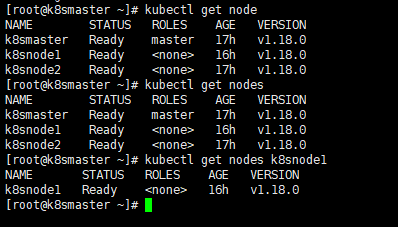

# Kubernetes 集群管理工具 kubectl

## 概述

`kubectl` 是 `Kubernetes` 集群的命令行工具，通过 `kubectl` 能够对集群本身进行管理，并能够在集群上进行容器化应用的安装和部署

参考：https://github.com/kubernetes/kubectl

## 命令格式

命令格式如下

```bash
kubectl [command] [type] [name] [flags]
```

参数

- `command`：指定要对资源执行的操作，例如create、get、describe、delete
-  `type`：指定资源类型，资源类型是大小写敏感的，开发者能够以单数 、复数 和 缩略的形式

例如：

```bash
kubectl get pod pod1
kubectl get pods pod1
kubectl get po pod1
```



-  `name` ：指定资源的名称，名称也是大小写敏感的，如果省略名称，则会显示所有的资源，例如

```bash
kubectl get pods
```

- `flags` ：指定可选的参数，例如，可用 -s 或者 -server参数指定 `Kubernetes API server` 的地址和端口

## 常见命令

### kubectl help 获取更多信息

通过 help 命令，能够获取帮助信息

```bash
# 获取 kubectl 的命令
kubectl --help

# 获取某个命令的介绍和使用
kubectl get --help
```

### 基础命令

常见的基础命令

|  命令   |                      介绍                      |
| :-----: | :--------------------------------------------: |
| create  |          通过文件名或标准输入创建资源          |
| expose  |        将一个资源公开为一个新的 Service        |
|   run   |           在集群中运行一个特定的镜像           |
|   set   |             在对象上设置特定的功能             |
|   get   |               显示一个或多个资源               |
| explain |                  文档参考资料                  |
|  edit   |          使用默认的编辑器编辑一个资源          |
| delete  | 通过文件名，标准输入，资源名称或标签来删除资源 |

```bash
kubectl expose (-f FILENAME | TYPE NAME | TYPE/NAME) [–port=port] [–protocol=TCP|UDP] [–target-port=number-or-name] [–name=name] [–externalip=external-ip-of-service] [–type=type] [flags]

kubectl explain [–recursive=false] [flags]
```


### 部署命令

|      命令      |                          介绍                          |
| :------------: | :----------------------------------------------------: |
|    rollout     |                     管理资源的发布                     |
| rolling-update |               对给定的复制控制器滚动更新               |
|     scale      | 扩容或缩容 Pod 数量，Deployment、ReplicaSet、RC 或 Job |
|   autoscale    |       创建一个自动选择扩容或缩容并设置 Pod 数量        |

```bash
kubectl scale (-f FILENAME | TYPE NAME | TYPE/NAME) --replicas=COUNT [–resource-version=version] [–current-replicas=count] [flags]

kubectl autoscale (-f FILENAME | TYPE NAME | TYPE/NAME) [–min=MINPODS] --max=MAXPODS [–cpu-percent=CPU] [flags]
```

### 集群管理命令

|     命令     |              介绍              |
| :----------: | :----------------------------: |
| certificate  |          修改证书资源          |
| cluster-info |     显示集群信息、端点信息     |
|     top      |        显示资源 (CPU/M)        |
|    cordon    |        标记节点不可调度        |
|   uncordon   |        标记节点可被调度        |
|    drain     | 驱逐节点上的应用，准备下线维护 |
|    taint     |       修改节点taint标记        |

```bash
kubectl cluster-info [flags]
```


### 故障和调试命令

|     命令     |                             介绍                             |
| :----------: | :----------------------------------------------------------: |
|   describe   |                显示特定资源或资源组的详细信息                |
|     logs     | 在一个 Pod 中打印一个容器日志，如果 Pod 只有一个容器，容器名称是可选的 |
|    attach    |                     附加到一个运行的容器                     |
|     exec     |                        执行命令到容器                        |
| port-forward |                   转发一个或多个 本地端口                    |
|    proxy     |         运行一个 `proxy` 到 `Kubernetes API Server`          |
|      cp      |                    拷贝文件或目录到容器中                    |
|     auth     |                           检查授权                           |

```bash
kubectl logs POD [-c CONTAINER] [–follow] [flags]

kubectl exec POD-name [-c CONTAINER-name] [-i] [-t] [flags] [-- COMMAND [args…]]

# 将一个或多个本地端口转发到 Pod
kubectl port-forward POD [LOCAL_PORT:]REMOTE_PORT […[LOCAL_PORT_N:]REMOTE_PORT_N] [flags]

kubectl proxy [–port=PORT] [–www=static-dir] [–www-prefix=prefix] [–apiprefix=prefix] [flags]
```


### 其它命令

|     命令     |                          介绍                          |
| :----------: | :----------------------------------------------------: |
|    apply     |           通过文件名或标准输入对资源应用配置           |
|    patch     |              使用补丁修改、更新资源的字段              |
|   replace    |            通过文件名或标准输入替换一个资源            |
|   convert    |            不同的 API 版本之间转换配置文件             |
|    label     |                    更新资源上的标签                    |
|   annotate   |                    更新资源上的注释                    |
|  completion  |            用于实现 `kubectl` 工具自动补全             |
| api-versions |                 打印受支持的 API 版本                  |
|    config    | 修改 kubeconfig 文件（用于访问 API，比如配置认证信息） |
|     help     |                      所有命令帮助                      |
|    plugin    |                   运行一个命令行插件                   |
|   version    |                打印客户端和服务版本信息                |

```bash
# 更新资源的一个或多个字段
kubectl patch (-f FILENAME | TYPE NAME | TYPE/NAME) --patch PATCH [flags]

kubectl label (-f FILENAME | TYPE NAME | TYPE/NAME) KEY_1=VAL_1 … KEY_N=VAL_N [–overwrite] [–all] [–resource-version=version] [flags]

kubectl config SUBCOMMAND [flags]

# 设置 默认命名空间
kubectl config set-context --current --namespace=garmysql
```

#### apply

在使用默认参数执行 apply 时，触发的是 client-side apply。
首先解析用户提交的数据（YAML/JSON）为一个对象 A；然后调用 Get 接口从 K8s 中查询这个资源对象

- 如果查询结果不存在，kubectl 将本次用户提交的数据记录到对象 A 的 annotation 中（key 为 kubectl.kubernetes.io/last-applied-configuration），最后将对象 A提交给 K8s 创建
- 如果查询到 K8s 中已有这个资源，假设为对象 B：
  1. kubectl 尝试从对象 B 的 annotation 中取出 kubectl.kubernetes.io/last-applied-configuration 的值（对应了上一次 apply 提交的内容）
  2. kubectl 根据前一次 apply 的内容和本次 apply 的内容计算出 diff（默认为 strategic merge patch 格式，如果非原生资源则采用 merge patch）
  3. 将 diff 中添加本次的 kubectl.kubernetes.io/last-applied-configuration annotation，最后用 patch 请求提交给 K8s 做更新

#### edit

​	在用户执行命令之后，kubectl 从 K8s 中查到当前的资源对象，并打开一个命令行编辑器（默认用 vi）为用户提供编辑界面
​	当用户修改完成、保存退出时，kubectl 并非直接把修改后的对象提交 update（避免 Conflict，如果用户修改的过程中资源对象又被更新），而是会把修改后的对象和初始拿到的对象计算 diff，最后将 diff 内容用 patch 请求提交给 K8s


### 常用命令

```bash
# 创建一个nginx镜像
kubectl create deployment nginx --image=nginx
kubectl run nginx-pod --image=nginx --port=80

# 对外暴露端口
kubectl expose deployment nginx --port=80 --type=NodePort

# 查看资源
kubectl get pod, svc

kubectl api-resources
```


## Node 节点使用 Kubectl

​	`kubectl` 的运行是需要进行配置的，它的配置文件是 `$HOME/.kube` ，如果想要在 Node 节点运行此命令，需要将 `master` 上的 `.kube` 文件复制到 Node 节点上，即在 Master 节点上执行下面操作

```bash
# 方式一
scp -r ~/.kube node1:~/

# 方式二
scp  -r  HOME/.kube   node1: HOME/
```

