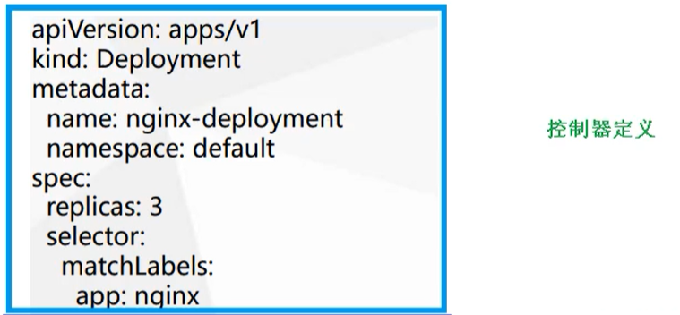

# Kubernetes 集群 YAML 文件详解

## 概述

​	k8s 集群中对资源管理和资源对象编排部署都可以通过声明样式（YAML）文件来解决，也就是可以把需要对资源对象操作编辑到YAML 格式文件中，这种文件叫做资源清单文件，通过kubectl 命令直接使用资源清单文件就可以实现对大量的资源对象进行编排部署了。一般在开发的时候，都是通过配置YAML文件来部署集群的

YAML文件：就是资源清单文件，用于资源编排

## YAML 文件介绍

### YAML 概述

YAML ：仍是一种标记语言。为了强调这种语言以数据做为中心，而不是以标记语言为重点。

YAML 是一个可读性高，用来表达数据序列的格式。

### YAML 基本语法

* 使用空格做为缩进
* 缩进的空格数目不重要，只要相同层级的元素左侧对齐即可
* 低版本缩进时不允许使用 Tab 键，只允许使用空格
* 使用 `#` 标识注释，从这个字符一直到行尾，都会被解释器忽略
* 使用 `---` 表示新的 `yaml` 文件开始

### YAML 支持的数据结构

#### **纯量**

单个的、不可再分的值，也就是指的一个简单的值，字符串、布尔值、整数、浮点数、Null、时间、日期。

```yml
boolean: 
    - TRUE  # “true”、“True”、“TRUE”、“yes”、“Yes” 和 “YES” 皆为真
    - FALSE  # “false”、“False”、“FALSE”、“no”、“No” 和 “NO” 皆为假
float:
    - 3.14
    - 6.8523015e+5  # 可以使用科学计数法
int:
    - 123
    - 0b1010_0111_0100_1010_1110    # 0b 前缀，二进制表示
    - 010    											# 0  前缀，八进制
    - 0x10   											# 0x 前缀，十六进制
nulls:
  - 
  - null
  - Null
  - NULL
  - ~
strings:
  - Hello without quote        # 不用引号包裹
  - Hello
    world                      # 拆成多行后会自动在中间添加空格
  - 'Hello with single quotes' # 单引号包裹
  - "Hello with double quotes" # 双引号包裹
  - "I am fine. \u263A"        # 使用双引号包裹时支持 Unicode 编码
  - "\x0d\x0a is \r\n"         # 使用双引号包裹时还支持 Hex 编码
  - 'He said: "Hello!"'        # 单双引号支持嵌套"
  - \n \r             
  - '\n \r'                    
  - "\n \r"
date:
    - 2018-02-17     # 日期必须使用ISO 8601格式，即yyyy-MM-dd
datetime: 
    - 2018-02-17T15:02:31+08:00    # 时间使用ISO 8601格式，时间和日期之间使用 T 连接，最后使用 + 代表时区
    - 2020-05-20 13:14:00.820  		 # 不加时区默认本初子母线的时间
    - 2020-05-20 13:14:00.820+8
```

#### 对象

键值对的集合，又称为映射 (mapping) / 哈希（hashes） / 字典（dictionary）

```yaml
# 对象类型：对象的一组键值对，使用冒号结构表示
paopao:
  name: Gardenia
  address: ShangHai

# yaml 也允许另一种写法，将所有键值对写成一个行内对象
hash: {name: Tom, age: 18}
```

#### 数组

```bash
# 数组类型：一组连词线开头的行，构成一个数组
People
- Tom
- Jack

# 数组也可以采用行内表示法
People: [Tom, Jack]
```

### 类型转换

YAML 支持使用严格类型标签!!（双感叹号+目标类型）来强制转换类型，下面是内置类型

```yaml
!!int ：整数类型
!!float ：浮点类型
!!bool：布尔类型
!!str：字符串类型
!!binary：也是字符串类型
!!timestamp ：日期时间类型
!!null：空值
!!set：集合
!!omap,!!pairs ：键值列表或对象列表
!!seq：序列，也是列表
!!map：键值表

a: !!float '666' 	 # !! 为严格类型标签
b: '666' 					# 其实双引号也算是类型转换符
c: !!str 666 			# 整数转为字符串
d: !!str 666.66 	# 浮点数转为字符串
e: !!str true 		# 布尔值转为字符串
f: !!str yes 			# 布尔值转为字符串
```

### Newlines

**保留换行(Newlines preserved)**

​	使用**竖线符“ | ”**来表示该语法，每行的缩进和行尾空白都会被去掉，而额外的缩进会被保留

```yaml
lines: |
  我是第一行
  我是第二行
    我是gardenia
      我是第四行
  我是第五行
```

```json
{'lines': '我是第一行\n我是第二行\n 我是gardenia\n 我是第四行\n我是第五行'}
```

**折叠换行(Newlines folded)**

​	使用**右尖括号“ > ”**来表示该语法，只有空白行才会被识别为换行，原来的换行符都会被转换成空格

```yaml
lines: >
  我是第一行
  我也是第一行
  我仍是第一行
  我依旧是第一行

  我是第二行
  这么巧我也是第二行
```

```json
{'lines': '我是第一行 我也是第一行 我仍是第一行 我依旧是第一行\n我是第二行 这么巧我也是第二行'}
```

可以用 `+` 和 `-` 来选择是否保留文字块末尾的换行符

```yaml
s1: |
  Foo
s2: |+
  Foo
s3: |-
  Foo
```

```JSON
{'s1': 'Foo\n', 's2': 'Foo\n', 's3': 'Foo'}
```

### 数据重用与合并

YAML 提供了由锚点标签“&”和引用标签“*”组成的语法，利用这套语法可以快速引用相同的一些数据…

```yaml
a: &anchor # 设置锚点
  one: 1
  two: 2
  three: 3
b: *anchor # 引用锚点
```

配合合并标签“<<”使用可以与任意数据进行合并

```yaml
human: &base # 添加名为 base 的锚点
    body: 1
    hair: 999
singer:
    <<: *base # 引用 base 锚点，实例化时会自动展开
    skill: sing # 添加额外的属性
programer:
    <<: *base # 引用 base 锚点，实例化时会自动展开
    hair: 6 # 覆写 base 中的属性
    skill: code # 添加额外的属性
```

```JSON
{ 
human: { body: 1, hair: 999 },
singer: { body: 1, hair: 999, skill: 'sing' },
programer: { body: 1, hair: 6, skill: 'code' }
}
```


## YAML 文件组成部分

主要分为了两部分，一个是 **控制器的定义** 和 **被控制的对象**

```yaml
apiVersion: v1
kind: Pod
metadate: 
  name: string
  namespace: string
  labels:
    - name: string
  annotations:
    - name: string
spce:
  containers:
  - name: string
    image: string
    imagePullPolicy: [Always | Never | IfNotPresent]
    command: [string]
    args: [string]
    workingDir: string
    vilumnMounts:
    - name: string
      mountsPath: string
      readOnly: boolean
    ports:
    - name: string
      containerPort: int
      hostPort: int
      protocol: string
    env:
    - name: string
      value: string
    resource:
      limits:
        cpu: string
        memory: string
      requests:
        cpu: string
        memory: string
    livenessProbe:
      exec:
        command: [string]
      httpGet:
        path: string
        port: string
        host: string
        scheme: string
        httpHeaders:
        - name: string
          values: string
      tcpSocket:
        port: number
      initialDelaySeconds: 0
      timeoutSeconds: 0
      successThreshold: 0
      failureThreshold: 0
    securityContext:
      privileged: false
  restartPolicy: [Always | Never | OnFailure]
  nodeSelector: object
  imagePullSecrets:
  - name: string
  hostNetwork: false
  Volumes:
  - name: string
    emptyDir: {}
    hostPath:
      path: string
    secret:
      secretName: string
      items:
      - key:string
        path: string
    configMap:
      name: string
      items:
      - key: string
        path: string
```

**控制器的定义**



**被控制的对象**

包含一些 **镜像，版本、端口** 等


### 属性说明

| 属性名称             | 取值类型 | 是否必选 | 取值说明                                                    | 备注                                                    |
| -------------------- | -------- | -------- | ----------------------------------------------------------- | ------------------------------------------------------- |
| apiVersion           | string   | Required | 版本号                                                      |                                                         |
| kind                 | string   | Required | 资源类型                                                    |                                                         |
| meatdate             | object   | Required | 元数据                                                      |                                                         |
| m.namespace          | string   | Required | pod 所属命名空间                                            | 默认为 default                                          |
| m.labels             | list     |          | 自定义标签列表                                              |                                                         |
| m.annotations        | list     |          | 自定义注解列表                                              |                                                         |
| spec                 | object   | Required | pod 中容器的详细定义                                        |                                                         |
| s.containers         | list     | Required | pod 中的容器列表                                            |                                                         |
| s.c.name             | string   | Required | 容器名称                                                    |                                                         |
| s.c.image            | string   | Required | 容器镜像                                                    |                                                         |
| s.c.imagePullPolicy  | string   |          | 容器拉取策略                                                | Always(默认) \| IfNotPresent \| Never                   |
| s.c.command          | list     |          | 容器启动命令列表                                            | 如果不指定，则使用镜像打包时设定的启动命令              |
| s.c.args             | list     |          | 容器启动命令参数列表                                        |                                                         |
| s.c.workingDir       | string   |          | 容器的工作目录                                              |                                                         |
| s.c.volumeMounts     | list     |          | 挂载到容器内部的存储卷配置                                  |                                                         |
| s.c.v.name           | string   |          | 引用 pod 定义的共享存储卷名称                               |                                                         |
| s.c.v.mountPath      | string   |          | 存储卷在容器内挂载的绝对路径                                |                                                         |
| s.c.v.readOnly       | boolean  |          | 是否为只读模式                                              | 默认为读写模式                                          |
| s.c.ports            | list     |          | 容器的端口号列表                                            |                                                         |
| s.c.p.name           | string   |          | 端口的名称                                                  |                                                         |
| s.c.p.containerPort  | string   |          | 容器需要监听的端口号                                        |                                                         |
| s.c.p.hostPost       | string   |          | 容器所在的主机需要监听的端口号                              | 设置该项，同一台宿主机将无法启动该容器的第二份副本      |
| s.c.p.protocol       | string   |          | 端口协议，支持 TCP 和 UDP，默认使用 TCP                     |                                                         |
| s.c.env              | list     |          | 容器运行前虚设置的环境变量列表                              |                                                         |
| s.c.e.name           | string   |          | 环境变量的名称                                              |                                                         |
| s.c.e.value          | string   |          | 环境变量的值                                                |                                                         |
| s.c.resources        | object   |          | 资源限制和资源请求的设置                                    |                                                         |
| s.c.r.limits         | object   |          | 资源限制的设置                                              |                                                         |
| s.c.r.l.cpu          | string   |          | CPU 限制，单位为 core 核数                                  |                                                         |
| s.c.r.l.memory       | string   |          | 内存限制，单位可以为 MiB，GiB 等                            |                                                         |
| s.c.r.requests       | object   |          | 资源请求的设置                                              |                                                         |
| s.c.r.r.cpu          | string   |          | CPU 请求                                                    |                                                         |
| s.c.r.r.memory       | string   |          | 内存请求                                                    |                                                         |
| s.volumes            | list     |          | 在该 pod 上定义的共享存储列表                               |                                                         |
| s.v.name             | string   |          | 共享存储卷的名称                                            |                                                         |
| s.v.emptyDir         | object   |          | 类型为 emptyDir 的存储卷                                    |                                                         |
| s.v.hostPath         | object   |          | 类型为 hostPath 的存储卷                                    |                                                         |
| s.v.h.path           | string   |          | Pod 容器挂载的宿主机目录                                    |                                                         |
| s.v.secret           | object   |          | 类型为 secret 的存储卷                                      | 表示挂载集群预定义的 Secret 到容器内部                  |
| s.v.configMap        | object   |          | 类型为 configMap 的存储卷                                   | 表示挂载集群预定义的 ConfigMap 到容器内部               |
| s.livenessProbe      | object   |          | 对 Pod 内各容器健康检查的设置                               | 当探测几次无反应后，将依据重启策略干活                  |
| s.l.exec             | object   |          | 对 Pod 内各容器健康检查的设置，exec 方式                    |                                                         |
| s.l.e.command        | string   |          | exec 方式需要制定的命令或脚本                               |                                                         |
| s.l.httpGet          | object   |          | 对 Pod 内各容器健康检查的设置，httpGet 方式                 |                                                         |
| s.l.tcpSocket        | object   |          | 对 Pod 内各容器健康检查的设置，tcpSocket 方式               |                                                         |
| s.l.initDelaySeconds | number   |          | 容器启动完成后首次探测的时间                                |                                                         |
| s.l.timeoutSeconds   | number   |          | 对容器健康检查的探测等待超时时间，默认为1s                  |                                                         |
| s.l.periodSeconds    | number   |          | 对容器健康的定期探测时间设置，默认 10 s 一次                |                                                         |
| s.restartPolicy      | string   |          | Pod 的重启方式                                              | Always \| Never \| OnFailure，默认为 Always             |
| s.nodeSelector       | object   |          | 设置 node 的 label，pod 将被指定到具有这些 Label 的 node 上 |                                                         |
| s.imagePullSecrets   | object   |          | pull 推送镜像时使用的 Secret 名称                           |                                                         |
| s.hostNetwork        | boolean  |          | 是否使用主机网络模式，默认为false                           | 使用主机网络模式，该 Pod 将无法在宿主机上启动第二个副本 |

```bash
#   kubectl explain 资源类型         查看某种资源可以配置的一级属性
#   kubectl explain 资源类型.属性     查看属性的子属性
kubectl explain pod
```

## 快速编写 YAML 文件

一般来说，很少自己手写YAML文件，因为这里面涉及到了很多内容，一般都会借助工具来创建

### kubectl create 命令

这种方式一般用于资源没有部署的时候，可以直接创建一个 YAML 配置文件

```bash
# 尝试运行, 并不会真正的创建镜像
kubectl create deployment web --image=nginx -o yaml --dry-run
```

或者可以输出到一个文件中

```bash
kubectl create deployment web --image=nginx -o yaml --dry-run > hello.yaml
```

### kubectl get 命令导出 yaml 文件

可以首先查看一个目前已经部署的镜像

```bash
kubectl get deploy
```


然后导出 Pod 配置

```bash
kubectl get deploy nginx -o=yaml --export > nginx.yaml
```

然后会生成一个 `nginx.yaml` 的配置文件


<hr>

## 命令式对象配置

命令配合配置文件一起来操作 kubernetes 资源

```yml
apiVersion: v1
kind: Namespace
metadata:
  name: paopao
---
apiVersion: v1
kind: Pod
metadata:
  name: nginx
  namespace: paopao
spec:
  containers:
  - name: nginx-containers
    image: nginx:latest
```

```bash
kubectl create -f nginx.yml
kubectl get -f nginx.yml
kubectl delete -f nginx.yml
```

## 声明式对象配置

```bash
for i in {1..3}; do kubectl apply -f nginx.yaml; done

for i in $(seq 1 3); do kubectl apply -f nginx.yaml; done

for i in $(seq 1 1 3); do kubectl apply -f nginx.yaml; done
```

声明式对象配置就是使用apply描述一个资源最终的状态（在 `yaml` 中定义状态）

- 使用 apply 操作资源：如果资源不存在，就创建，相当于 `kubectl create`
- 如果资源已存在，就更新，相当于 `kubectl patch`


## 资源配额及标签

```bash
# 切换命名空间	kubectl get pods 不指定默认为切换的命名空间
kubectl config set-context --current --namespace=kube-system

# 查看哪些资源属于命名空间级别
kubectl api-resources --namespaced=true
```


### Namespace 资源限额

namespace 作为命名空间，有很多资源，那么可以对命名空间资源做限制，防止该命名空间部署的资源超过限制。

```yml
apiVersion: v1 
kind: ResourceQuota
metadata:
  name: mem-cpu-quota
  namespace: test
spec:
  hard:
    requests.cpu: "2"
    requests.memory: 2Gi
    limits.cpu: "4"
    limits.memory: 4Gi
```

创建的 `ResourceQuota` 对象将在 `test` 名字空间中添加以下限制：

- 每个容器必须设置内存请求（memory request），内存限额（memory limit），cpu 请求（cpu request）和 cpu 限额（cpu limit）
- 所有容器的内存请求总额不得超过 2 GiB
- 所有容器的内存限额总额不得超过 4 GiB
- 所有容器的 CPU 请求总额不得超过 2 CPU
- 所有容器的 CPU 限额总额不得超过 4 CPU

```bash
kubectl describe ns test

# 创建 pod 时候必须设置资源限额，否则创建失败
apiVersion: v1 
kind: Pod 
metadata: 
  name: pod-test 
  namespace: test 
  labels: 
    app: tomcat-pod-test 
spec: 
  containers: 
  - name: tomcat-test
    ports: 
    - containerPort: 8080 
    image: tomcat
    imagePullPolicy: IfNotPresent 
    resources: 
      requests: 
        memory: "100Mi" 
        cpu: "500m" 
      limits: 
        memory: "2Gi" 
        cpu: "2" 
```


### 标签

​	标签其实就一对 `key/value` ，被关联到对象上，比如 Pod，标签的使用倾向于能够表示对象的特殊特点

​	标签可以用来划分特定的对象（比如版本，服务类型等），标签可以在创建一个对象的时候直接定义，也可以在后期随时修改，每一个对象可以拥有多个标签，但是，`key` 值必须是唯一的。创建标签之后也可以方便对资源进行分组管理。如果对 Pod 打标签，之后就可以使用标签来查看、删除指定的 Pod。在 k8s 中，大部分资源都可以打标签。

```bash
# 对已经存在的 pod 打标签  表示这个 Pod版本是 v1
kubectl label pods pod-first release=v1

# 查看标签是否打成功 查看指定的 Pod
kubectl get pods pod-first --show-labels

# 查看资源标签
kubectl get pods --show-labels

# 列出默认名称空间下标签 key 是 release 的 pod，不显示标签
kubectl get pods -l release

# 列出默认名称空间下标签 key 是 release、值是 v1 的 pod，不显示标签
kubectl get pods -l release=v1

# 列出默认名称空间下标签 key 是 release 的所有 pod，并打印对应的标签值 key 作为一列 value 在这一列显示出来
kubectl get pods -L release

# 查看所有名称空间下的所有 pod 的标签
kubectl get pods --all-namespaces --show-labels

# 把具有 release 标签的 Pod 显示出来并且显示对应的 key 和 value
kubectl get pods -l release=v1 -L release
```


