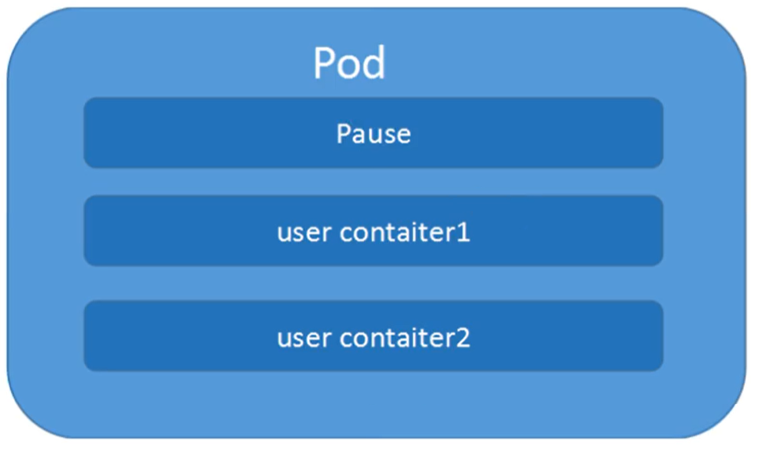
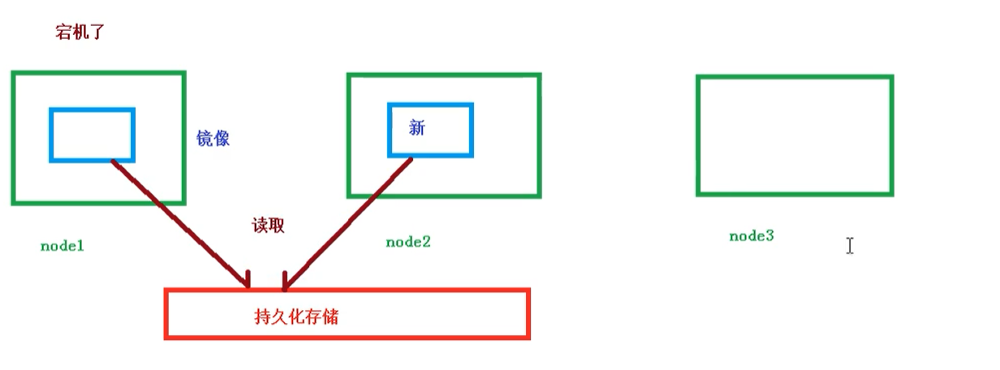
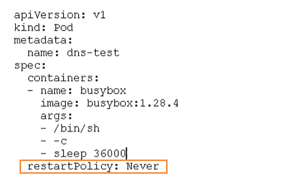
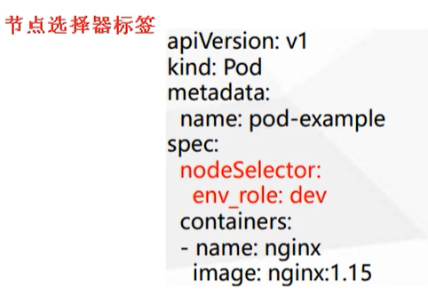
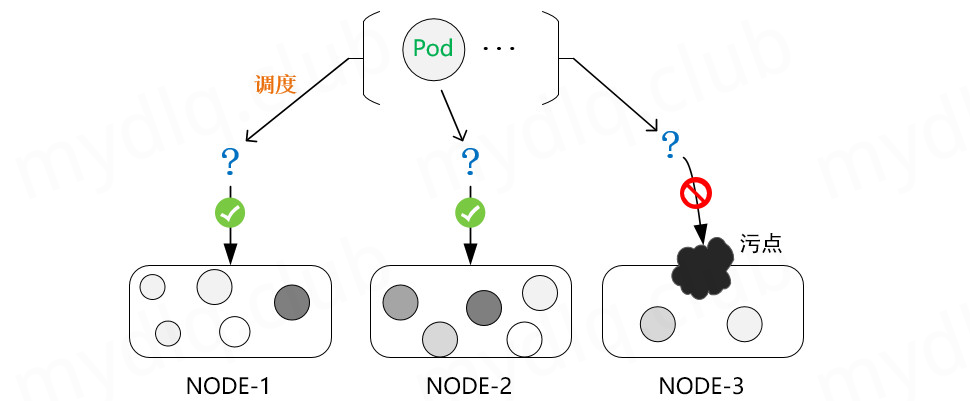
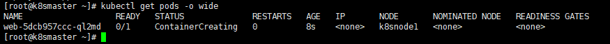
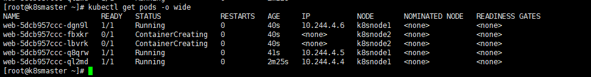
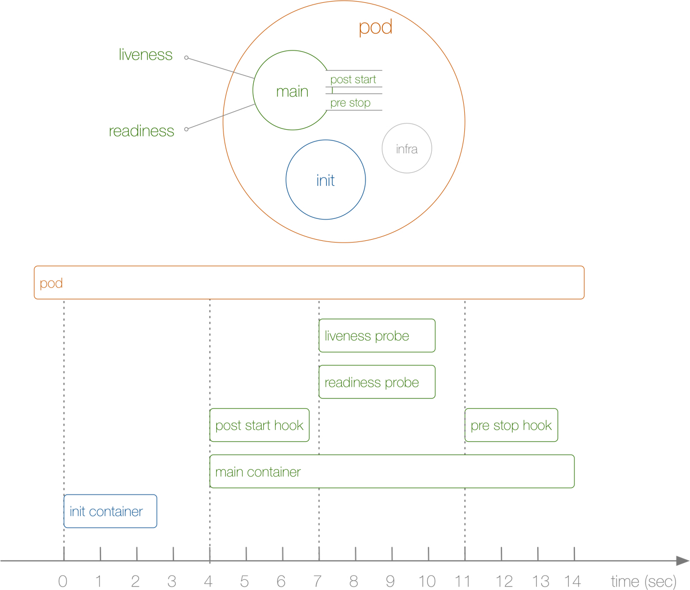

# Kubernetes 核心技术 Pod

## Pod 概述

​	Pod 是 K8S 系统中可以创建和管理的最小单元，是资源对象模型中由用户创建或部署的最小资源对象模型，也是在 K8S 上运行容器化应用的资源对象，其它的资源对象都是用来支撑或者扩展 Pod 对象功能的，比如控制器对象是用来管控Pod对象的，Service 或者 Ingress 资源对象是用来暴露 Pod 引用对象的，PersistentVolume 资源对象是用来为 Pod 提供存储等等，K8S 不会直接处理容器，而是Pod，Pod 是由一个或多个 Container 组成。

​	Pod 是 Kubernetes 的最重要概念，每一个 Pod 都有一个特殊的被称为 “根容器”的 Pause 容器。Pause 容器对应的镜像属于Kubernetes 平台的一部分，除了 Pause 容器，每个 Pod 还包含一个或多个紧密相关的用户业务容器。



### Pod 基本概念

- 最小部署的单元
- Pod 里面是由一个或多个容器组成【一组容器的集合】
- 一个 Pod 中的容器是共享网络命名空间
- Pod 是短暂的
- 每个 Pod 包含一个或多个紧密相关的用户业务容器

### Pod 存在的意义

- 创建容器使用 Docker，一个 Docker 对应一个容器，一个容器运行一个应用进程
- Pod 是多进程设计，运用多个应用程序，也就是一个 Pod 里面有多个容器，而一个容器里面运行一个应用程序


- Pod 的存在是为了亲密性应用
  - 两个应用之间进行交互
  - 网络之间的调用【通过127.0.0.1 或 socket】
  - 两个应用之间需要频繁调用

​	Pod 是在 K8S 集群中运行部署应用或服务的最小单元，它是可以支持多容器的。Pod 的设计理念是支持多个容器在一个Pod中共享网络地址和文件系统，可以通过进程间通信和文件共享这种简单高效的方式组合完成服务。同时 Pod 对多容器的支持是 K8S 中最基础的设计理念。在生产环境中，通常是由不同的团队各自开发构建自己的容器镜像，在部署的时候组合成一个微服务对外提供服务。

​	Pod 是 K8S 集群中所有业务类型的基础，可以把 Pod 看作运行在 K8S 集群上的小机器人，不同类型的业务就需要不同类型的小机器人去执行。目前 K8S 的业务主要可以分为以下几种

- 长期伺服型：`long-running`
- 批处理型：`batch`
- 节点后台支撑型：`node-daemon`
- 有状态应用型：`stateful application`

上述的几种类型，分别对应的小机器人控制器为：Deployment、Job、DaemonSet 和 StatefulSet  (后面将介绍控制器)

### Pod 常见的状态和重启策略

**常见的 Pod 状态**
	Pod 的 status 定义在 PodStatus 对象中，其中有一个 phase 字段。它简单描述了 Pod 在其生命周期的阶段。熟悉 Pod 的各种状态对理解如何设置 Pod 的调度策略、重启策略是很有必要的。

​	下面是 phase 可能的值，也就是 Pod 常见的状态：
挂起（Pending）： 在请求创建 pod 时，条件不满足，调度没有完成，没有任何一个节点能满足调度条件，已经创建了 pod 但是没有适合它运行的节点叫做挂起，调度没有完成，处于 pending的状态会持续一段时间：包括调度 Pod 的时间和通过网络下载镜像的时间。

- 运行中（`Running`）： Pod 已经绑定到了一个节点上，Pod 中所有的容器都已被创建。至少有一个容器正在运行，或者正处于启动或重启状态
- 成功（`Succeeded`）： Pod 中的所有容器都被成功终止，并且不会再重启
- 失败（`Failed`）： Pod 中的所有容器都已终止了，并且至少有一个容器是因为失败终止。也就是说，容器以非 0 状态退出或者被系统终止
- 未知（`Unknown`）： 未知状态，所谓 pod 是什么状态是 apiserver 和运行在 pod 节点的 kubelet 进行通信获取状态信息的，如果节点之上的 kubelet 本身出故障，那么 apiserver 就连不上kubelet，得不到信息了，就会 Unknown
- `Evicted` 状态： 出现这种情况，多见于系统内存或硬盘资源不足，可 df-h 查看 docker 存储所在目录的资源使用情况，如果百分比大于 85%，就要及时清理下资源，尤其是一些大文件、docker 镜像
- `CrashLoopBackOff`： 容器曾经启动了，但可能又异常退出了 看日志解决
- `Error` 状态： Pod 启动过程中发生了错误

**Pod 重启策略**
	Pod 的重启策略（RestartPolicy）应用于 Pod 内的所有容器，并且仅在 Pod 所处的 Node 上由 `kubelet` 进行判断和重启操作。当某个容器异常退出或者健康检查失败时，`kubelet` 将根据 `RestartPolicy` 的设置来进行相应的操作。通过 kubelet 重新启动的退出容器将以指数增加延迟（10s，20s，40s…）重新启动，上限为 5 分钟，并在成功执行 10 分钟后重置。

Pod 的重启策略包括 Always、OnFailure 和 Never，默认值为 Always

- Always：当容器失败时，由 kubelet 自动重启该容器
- OnFailure：当容器终止运行且退出码不为 0 时，由 kubelet 自动重启该容器
- Never：不论容器运行状态如何，kubelet 都不会重启该容器

不同类型的的控制器可以控制 Pod 的重启策略：

- `Job`：适用于一次性任务如批量计算，任务结束后 Pod 会被此类控制器清除。Job 的重启策略只能是`"OnFailure"`或者`"Never"`
- `Replication Controller, ReplicaSet, or Deployment`：此类控制器希望 Pod 一直运行下去，它们的重启策略只能是`"Always"`
- `DaemonSet`：每个节点上启动一个 Pod，很明显此类控制器的重启策略也应该是`"Always"`

## Pod 实现机制

​	当前，创建 Pod 时其主机名取自 Pod 的 `metadata.name` 值，Pod 规约中包含一个可选的 `hostname` 字段，可以用来指定 Pod 的主机名。 当这个字段被设置时，它将优先于 Pod 的名字成为该 Pod 的主机名。 

​	Pod 规约还有一个可选的 subdomain 字段，可以用来指定 Pod 的子域名。 举个例子，某 Pod 的 hostname 设置为 “gardenia”，subdomain 设置为 `bar` ， 在名字空间 `my-namespace` 中对应的完全限定域名（FQDN）为 `gardenia.bar.my-namespace.svc.cluster-domain.example`

```yaml
apiVersion: v1
kind: Service
metadata:
  name: default-subdomain
spec:
  selector:
    name: busybox
  clusterIP: None
  ports:
  - name: foo
    port: 999
    targetPort: 999
---
apiVersion: v1
kind: Pod
metadata:
  name: busybox1
  labels:
    name: busybox
spec:
  hostname: busybox-1
  subdomain: default-subdomain
  containers:
  - image: busybox:1.28
    command:
      - sleep
      - "3600"
    name: busybox
```

​	如果某无头 Service 与某 Pod 在同一个名字空间中，且它们具有相同的子域名， 集群的 DNS 服务器也会为该 Pod 的全限定主机名返回 A 记录或 AAAA 记录。 例如，在同一个名字空间中，给定一个主机名为 “busybox-1”、 子域名设置为 “default-subdomain” 的 Pod，和一个名称为 “default-subdomain” 的无头 Service，Pod 将看到自己的 FQDN 为 `busybox-1.default-subdomain.my-namespace.svc.cluster-domain.example` 。 DNS 会为此名字提供一个 A 记录或 AAAA 记录，指向该 Pod 的 IP。

> Endpoints 对象可以为任何端点地址及其 IP 指定 hostname

​	说明： 由于不是为 Pod 名称创建 A 或 AAAA 记录的，因此 Pod 的 A 或 AAAA 需要 hostname。 没有设置 hostname 但设置了 subdomain 的 Pod 只会为 无头 Service 创建 A 或 AAAA 记录（default-subdomain.my-namespace.svc.cluster-domain.example） 指向 Pod 的 IP 地址。 另外，除非在服务上设置了 publishNotReadyAddresses=True，否则只有 Pod 进入就绪状态 才会有与之对应的记录

<hr>

​	当 Pod 配置为具有全限定域名 (FQDN) 时，其主机名是短主机名。 例如，如果有一个具有完全限定域名 busybox-1.default-subdomain.my-namespace.svc.cluster-domain.example 的 Pod， 则默认情况下，该 Pod 内的 hostname 命令返回 busybox-1，而 hostname --fqdn 命令返回 FQDN

​	当在 Pod 规约中设置了 `setHostnameAsFQDN: true` 时，kubelet 会将 Pod 的全限定域名（FQDN）作为该 Pod 的主机名记录到 Pod 所在名字空间。 在这种情况下，hostname 和 hostname --fqdn 都会返回 Pod 的全限定域名

> 说明：
>
> 在 Linux 中，内核的主机名字段（struct utsname 的 nodename 字段）限定 最多 64 个字符
>
> 如果 Pod 启用这一特性，而其 FQDN 超出 64 字符，Pod 的启动会失败。 Pod 会一直出于 Pending 状态（通过 kubectl 所看到的 ContainerCreating）， 并产生错误事件，例如 “Failed to construct FQDN from Pod hostname and cluster domain, FQDN long-FQDN is too long (64 characters is the max, 70 characters requested).” （无法基于 Pod 主机名和集群域名构造 FQDN，FQDN long-FQDN 过长，至多 64 字符，请求字符数为 70）。 对于这种场景而言，改善用户体验的一种方式是创建一个 [准入 Webhook 控制器](https://kubernetes.io/zh-cn/docs/reference/access-authn-authz/extensible-admission-controllers/#admission-webhooks)， 在用户创建顶层对象（如 Deployment）的时候控制 FQDN 的长度
>

### 共享网络

​	容器本身之间相互隔离的，一般是通过 **namespace** 和 **group** 进行隔离，通信首先需要容器都在同一个 **namespace** 之间

​	关于 Pod 实现原理，首先会在 Pod 会创建一个根容器： `pause 容器`，然后在创建业务容器 【nginx，redis 等】，在创建业务容器的时候，会把它添加到 `info 容器` 中

​	而在 `info 容器` 中会独立出  `ip` 地址，`mac` 地址，`port` 等信息，然后实现网络的共享


完整步骤如下

- 通过 Pause 容器，把其它业务容器加入到 `Pause` 容器里，让所有业务容器在同一个名称空间中，可以实现网络共享

### 共享存储

​	创建 Pod 的时候可以指定挂载的存储卷。 POD 中的所有容器都可以访问共享卷，允许这些容器共享数据。 Pod 只要挂载持久化数据卷，Pod 重启之后数据还是会存在的。

​	Pod 持久化数据，专门存储到某个地方中，因为在故障转移的过程中如果数据没有了，那么损失是非常严重的。



使用 Volumn 数据卷进行共享存储，案例如下所示


### 自主式 Pod

直接定义一个 Pod 资源

```bash
vim pod-tomcat.yaml 
apiVersion: v1
kind: Pod
metadata:
  name: tomcat-test
  namespace: default
  labels:
    app:  tomcat
spec:
  containers:
  - name:  tomcat-java
    image: tomcat
    imagePullPolicy: IfNotPresent
    ports:
    - containerPort: 8080
    
kubectl apply -f pod-tomcat.yaml
kubectl get pods -o wide -l app=tomcat

# 自主式 Pod 存在一个问题，删除了 pod
kubectl delete pods tomcat-test
kubectl get pods -l app=tomcat
# 结果是空，说明 pod 已经被删除了 
```

​	通过上面可以看到，如果直接定义一个 Pod 资源，那 Pod 被删除，就彻底被删除了，不会再创建一个新的 Pod，这在生产环境还是具有非常大风险的，所以今后接触的 Pod 都是控制器管理的。如果是不重要的可以重新更新资源清单（yaml 文件保存好）。

### 控制器管理的 Pod

常见的管理 Pod 的控制器：Replicaset、Deployment、Job、CronJob、Daemonset、Statefulset
控制器管理的 Pod 可以确保 Pod 始终维持在指定的副本数运行。 比如通过 Deployment 管理 Pod

```bash
vim nginx-deploy.yaml
apiVersion: apps/v1
kind: Deployment
metadata:
  name: nginx-test
  labels:
    app: nginx-deploy
spec:
  selector:
    matchLabels:
      app: nginx
  replicas: 2
  template:
    metadata:
      labels:
        app: nginx
    spec:
      containers:
      - name: my-nginx
        image: nginx
        imagePullPolicy: IfNotPresent
        ports:
        - containerPort: 80

# 更新资源清单文件 
kubectl apply -f nginx-deploy.yaml
 
# 查看 Deployment 
kubectl get deploy -l app=nginx-deploy
 
# 查看 pod 
kubectl get pods -o wide -l app=nginx    
 
# 删除 nginx-test-84b997bfc5-6dkxx 这个 pod
kubectl delete pods nginx-test-84b997bfc5-6dkxx

kubectl get pods -o wide -l app=nginx    
# 发现重新创建一个新的 pod 是 nginx-test-84b997bfc5-6vccl
```

通过 `deployment` 管理的 pod，可以确保 pod 始终维持在指定副本数量，而且两个 `pod` 访问哪个结果都是一样的！

<hr>

## Pod 镜像拉取策略

以具体实例来说，拉取策略就是 `imagePullPolicy`


拉取策略主要分为了以下几种

- `IfNotPresent`：默认值，镜像在宿主机上不存在才拉取
- `Always`：每次创建 Pod 都会重新拉取一次镜像
- `Never`：Pod 永远不会主动拉取这个镜像

## Pod 资源限制

​	Pod 在进行调度的时候，可以对调度的资源进行限制，例如限制 Pod 调度是使用的资源是 2C 4G，那么在调度对应的 Node 节点时，只会占用对应的资源，对于不满足资源的节点，将不会进行调度


### 示例🌰

在下面的地方进行资源的限制


这里分了两个部分

- `request`：表示调度所需的资源
- `limits`：表示最大所占用的资源

## Pod 重启机制

因为 Pod 中包含了很多个容器，假设某个容器出现问题了，那么就会触发 Pod 重启机制



重启策略主要分为以下三种

- `Always`：当容器终止退出后，总是重启容器，默认策略 【nginx 等，需要不断提供服务】
- `OnFailure`：当容器异常退出（退出状态码非0）时，才重启容器
- `Never`：当容器终止退出，从不重启容器 【批量任务】

## Pod 健康检查

​	在 Pod 的整个生命周期中，能影响到 Pod 的就只剩下健康检查这一部分了。在 Kubernetes 集群当中，可以通过配置`liveness probe（存活探针`）和`readiness probe（可读性探针）`来影响容器的生命周期：

- kubelet 通过使用 `liveness probe` 来确定你的应用程序是否正在运行，通俗点将就是**是否还活着**。一般来说，如果你的程序一旦崩溃了， Kubernetes 就会立刻知道这个程序已经终止了，然后就会重启这个程序。而的 liveness probe 的目的就是来捕获到当前应用程序还没有终止，还没有崩溃，如果出现了这些情况，那么就重启处于该状态下的容器，使应用程序在存在 bug 的情况下依然能够继续运行下去。
- kubelet 使用 `readiness probe` 来确定容器是否已经就绪可以接收流量过来了。这个探针通俗点讲就是说**是否准备好了**，现在可以开始工作了。只有当 Pod 中的容器都处于就绪状态的时候 kubelet 才会认定该 Pod 处于就绪状态，因为一个 Pod 下面可能会有多个容器。当然 Pod 如果处于非就绪状态，那么就会从 Service 的 Endpoints 列表中移除出来，这样的流量就不会被路由到这个 Pod 里面来了。

和钩子函数一样的，这两个探针的支持下面几种配置方式：

- `exec`：执行一段命令，执行 Shell 命令返回状态码是 0 为成功
- `http`：检测某个 http 请求，发送 HTTP 请求，返回 200 - 400 范围状态码为成功
- `tcpSocket`：使用此配置，kubelet 将尝试在指定端口上打开容器的套接字。如果可以建立连接，容器被认为是健康的，如果不能就认为是失败的。实际上就是检查端口。

但是有的时候，程序可能出现了 **Java** 堆内存溢出，程序还在运行，但是不能对外提供服务了，这个时候就不能通过 容器检查来判断服务是否可用了，这个时候就可以使用应用层面的检查

```bash
# 存活检查，如果检查失败，将杀死容器，根据 Pod 的 restartPolicy【重启策略】来操作
livenessProbe

# 就绪检查，如果检查失败，Kubernetes 会把 Pod 从 Service endpoints 中剔除
readinessProbe
```

```yml
apiVersion: v1
kind: Pod
metadata:
  name: liveness-exec
spec:
  containers:
  - name: liveness
    image: busybox
    args:
    - /bin/sh
    - -c
    - touch /tmp/healthy; sleep 30; rm -rf /tmp/healthy; sleep 600
    livenessProbe:
      exec:
        command:
        - cat
        - /tmp/healthy
      initialDelaySeconds: 5
      periodSeconds: 5
```

`liveness-exec.yaml`

新的属性：`livenessProbe`，下面通过 exec 执行一段命令:

- `periodSeconds`：表示让 kubelet 每隔5秒执行一次存活探针，也就是每5秒执行一次上面的`cat /tmp/healthy`命令，如果命令执行成功了，将返回0，那么 kubelet 就会认为当前这个容器是存活的，如果返回的是非0值，那么 kubelet 就会把该容器杀掉然后重启它。默认是10秒，最小1秒。
- `initialDelaySeconds`：表示在第一次执行探针的时候要等待5秒，这样能够确保的容器能够有足够的时间启动起来。大家可以想象下，如果你的第一次执行探针等候的时间太短，是不是很有可能容器还没正常启动起来，所以存活探针很可能始终都是失败的，这样就会无休止的重启下去了

容器启动的时候，执行了如下命令：

```bash
$ /bin/sh -c "touch /tmp/healthy; sleep 30; rm -rf /tmp/healthy; sleep 600"
```

​	在容器最开始的30秒内创建了一个`/tmp/healthy`文件，在这30秒内执行`cat /tmp/healthy`命令都会返回一个成功的返回码。30 秒后，删除这个文件，现在执行`cat /tmp/healthy`是不是就会失败了（默认检测失败3次才认为失败），所以这个时候就会重启容器了。创建下该 Pod，然后在 30 秒内，查看 Pod 的 Event

```bash
kubectl apply -f liveness-exec.yaml
kubectl describe pod liveness-exec
```

观察到容器是正常启动的，在隔一会儿，比如 40s 后，再查看下 Pod 的 Event，在最下面有一条信息显示 liveness probe 失败了，容器将要重启。然后可以查看到 Pod 的 `RESTARTS` 值加 1 了：

```bash
kubectl get pods
```

同样的，还可以使用`HTTP GET`请求来配置的存活探针，这里使用一个 liveness 镜像来验证演示下

```yaml
vim liveness-http.yaml
apiVersion: v1
kind: Pod
metadata:
  name: liveness-http
spec:
  containers:
  - name: liveness
    image: cnych/liveness
    args:
    - /server
    livenessProbe:
      httpGet:
        path: /healthz
        port: 8080
        httpHeaders:
        - name: X-Custom-Header
          value: Awesome
      initialDelaySeconds: 3
      periodSeconds: 3
```

​	根据 `periodSeconds` 属性可以知道  `kubelet` 需要每隔3秒执行一次 `liveness Probe`，该探针将向容器中的 server 的 8080 端口发送一个 HTTP GET 请求。如果 server 的 `/healthz` 路径的 handler 返回一个成功的返回码， `kubelet`  就会认定该容器是活着的并且很健康，如果返回失败的返回码， `kubelet` 将杀掉该容器并重启它。`initialDelaySeconds` 指定 `kubelet` 在该执行第一次探测之前需要等待 3 秒钟。

​	通常来说，任何大于`200`小于`400`的状态码都会认定是成功的返回码。其他返回码都会被认为是失败的返回码。

​	探针里面有一个`initialDelaySeconds`的属性，可以来配置第一次执行探针的等待时间，对于启动非常慢的应用这个参数非常有用，比如 `Jenkins`、`Gitlab` 这类应用，但是如何设置一个合适的初始延迟时间呢？这个就和应用具体的环境有关系了，所以这个值往往不是通用的，这样的话可能就会导致一个问题，资源清单在别的环境下可能就会健康检查失败了，为解决这个问题，在 Kubernetes v1.16 版本官方特地新增了一个 `startupProbe（启动探针）`，该探针将推迟所有其他探针，直到 Pod 完成启动为止，使用方法和存活探针一样：

```yml
startupProbe:
  httpGet:
    path: /healthz
    port: 8080
  failureThreshold: 30  # 尽量设置大点
  periodSeconds: 10
```

表示慢速容器最多可以有 5 分钟（30个检查 * 10秒= 300s）来完成启动

​	有的时候，应用程序可能暂时无法对外提供服务，例如，应用程序可能需要在启动期间加载大量数据或配置文件。在这种情况下，您不想杀死应用程序，也不想对外提供服务。那么这个时候我们就可以使用`readiness probe`来检测和减轻这些情况。 Pod 中的容器可以报告自己还没有准备，不能处理 Kubernetes 服务发送过来的流量。`readiness probe`的配置跟`liveness probe`基本上一致的。唯一的不同是使用`readinessProbe`而不是`livenessProbe`。两者如果同时使用的话就可以确保流量不会到达还未准备好的容器，准备好过后，如果应用程序出现了错误，则会重新启动容器。

另外除了上面的`initialDelaySeconds`和`periodSeconds`属性外，探针还可以配置如下几个参数：

- `timeoutSeconds`：探测超时时间，默认1秒，最小1秒
- `successThreshold`：探测失败后，最少连续探测成功多少次才被认定为成功。默认是 1，但是如果是`liveness`则必须是 1。最小值是 1
- `failureThreshold`：探测成功后，最少连续探测失败多少次才被认定为失败。默认是 3，最小值是 1

## Pod 调度策略

​	Pod 是 Kubernetes 中最基本的部署调度单元，可以包含 Container，逻辑上表示某种应用的一个实例

### 创建 Pod 流程

- 首先创建一个pod，然后创建一个 API Server 和 Etcd【把创建出来的信息存储在 etcd 中】
- 然后创建 Scheduler，监控 API Server 是否有新的 Pod，如果有的话，会通过调度算法，把 Pod 调度某个 Node 上
- 在 Node 节点，会通过 `kubelet -- apiserver ` 读取 etcd 拿到分配在当前 Node 节点上的 Pod，然后创建容器


> apiserver 又通过 watch 机制，调用 kubelet，指定 pod 信息，调用 Docker API 创建并启动 pod 内的容器
>
> 创建完成之后反馈给 kubelet，kubelet 又将 pod 的状态信息给 apiserver, apiserver 又将 pod 的状态信息写入 etcd
>
> Master 节点：kubectl -> kube-api -> kubelet -> CRI 容器环境初始化

### 影响 Pod 调度的属性

Pod 资源限制对 Pod 的调度会有影响

**根据 request 找到足够 node 节点进行调度**


**节点选择器标签影响 Pod 调度**



关于节点选择器，其实就是有两个环境，然后环境之间所用的资源配置不同


可以通过以下命令，给的节点新增标签，然后节点选择器就会进行调度了

```bash
kubectl label node node1 env_role=prod
```


### 节点亲和性

#### Pod 节点亲和性

Pod 自身的**亲和性调度**有两种表示形式

- `podaffinity` ：Pod 和 Pod 更倾向腻在一起，把相近的 Pod 结合到相近的位置，比如同一区域，同一机架，这样的话 Pod 和 Pod 之间更好通信，比方说有两个机房，这两个机房部署的集群有 1000 台主机，那么希望把 nginx 和 tomcat 都部署同一个地方的 node 节点上，可以提高通信效率。
- `podunaffinity`：Pod 和 Pod 更倾向不腻在一起，如果部署两套程序，那么这两套程序更倾向于反亲和性，这样相互之间不会有影响。

​	第一个 Pod 随机选则一个节点，做为评判后续的 Pod 能否到达这个 Pod 所在的节点上的运行方式，这就称为 Pod 亲和性；怎么判定哪些节点是相同位置的，哪些节点是不同位置的。在定义 Pod 亲和性时需要有一个前提，以节点名称为标准，这个节点名称相同的表示是同一个位置，节点名称不相同的表示不是一个位置，或者其他方式。

```bash
kubectl explain pods.spec.affinity.podAffinity
FIELDS:
   preferredDuringSchedulingIgnoredDuringExecution	<[]Object>			# 软亲和性
   requiredDuringSchedulingIgnoredDuringExecution	<[]Object>				# 硬亲和性

kubectl explain pods.spec.affinity.podAffinity.requiredDuringSchedulingIgnoredDuringExecution
FIELDS:
   labelSelector	<Object>	# 要判断 pod 跟别的 pod 亲和，跟哪个 pod 亲和，需要靠 labelSelector，通过 labelSelector选则一组能作为亲和对象的 pod 资源
   namespaces	<[]string>	# labelSelector 需要选则一组资源，那么这组资源是在哪个名称空间中呢，通过 namespace 指定，如果不指定 namespaces，那么就是当前创建 pod 的名称空间
   topologyKey	<string> -required-				# 位置拓扑的键，这个是必须字段 

kubectl explain pods.spec.affinity.podAffinity.requiredDuringSchedulingIgnoredDuringExecution.labelSelector
FIELDS:
   matchExpressions	<[]Object>
   matchLabels	<map[string]string>

例 :	定义两个 pod，第一个 pod 做为基准，第二个 pod 跟着它走 
vim pod-required-affinity-demo.yaml
apiVersion: v1
kind: Pod
metadata:
  name: pod-first
  labels:
    app2: Gardenia2
    tier: frontend
spec:
    containers:
    - name: myapp
      image: nginx
---
apiVersion: v1
kind: Pod
metadata:
  name: pod-second
  labels:
    app: backend
    tier: db
spec:
    containers:
    - name: busybox
      image: busybox:latest
      imagePullPolicy: IfNotPresent
      command: ["sh","-c","sleep 3600"]				
    affinity:
      podAffinity:
         requiredDuringSchedulingIgnoredDuringExecution:
         - labelSelector:
              matchExpressions:
              - {key: app2, operator: In, values: ["Gardenia2"]}
           topologyKey: kubernetes.io/hostname
# key 意思是选择 app2=Gardenia2 的标签做亲和性
# 最后一行直接用 nodes 里的已有标签来位置拓扑的键         kubectl get nodes --show-labels
# 创建的 pod 必须与拥有 app2=Gardenia2 标签的 pod 在一个节点上 
kubectl apply -f pod-required-affinity-demo.yaml
kubectl get pods -o wide
kubectl delete -f pod-required-affinity-demo.yaml
```

#### Pod 节点反亲和性

```bash
# 定义两个 pod，第一个 pod 做为基准，第二个 pod 跟它调度节点相反 同样基于 node 名字作为基准
vim pod-required-anti-affinity-demo.yaml
apiVersion: v1
kind: Pod
metadata:
  name: pod-first
  labels:
    app1: Gardenia1
    tier: frontend
spec:
    containers:
    - name: myapp
      image: nginx
---
apiVersion: v1
kind: Pod
metadata:
  name: pod-second
  labels:
    app: backend
    tier: db
spec:
    containers:
    - name: busybox
      image: busybox
      imagePullPolicy: IfNotPresent
      command: ["sh","-c","sleep 3600"]
    affinity:
      podAntiAffinity:
         requiredDuringSchedulingIgnoredDuringExecution:
         - labelSelector:
              matchExpressions:
              - {key: app1, operator: In, values: ["Gardenia1"]}
           topologyKey: kubernetes.io/hostname

kubectl apply -f pod-required-anti-affinity-demo.yaml
kubectl get pods -o wide
kubectl delete -f pod-required-anti-affinity-demo.yaml
```

```bash
kubectl label nodes k8snode zone=foo --overwrite
kubectl label nodes k8snode2 zone=foo --overwrite
kubectl delete -f .
vim pod-first-required-anti-affinity-demo-1.yaml
apiVersion: v1
kind: Pod
metadata:
  name: pod-first
  labels:
    app3: Gardenia3
    tier: frontend
spec:
    containers:
    - name: myapp
      image: nginx

vim pod-second-required-anti-affinity-demo-1.yaml
apiVersion: v1
kind: Pod
metadata:
  name: pod-second
  labels:
    app: backend
    tier: db
spec:
    containers:
    - name: busybox
      image: busybox
      imagePullPolicy: IfNotPresent
      command: ["sh","-c","sleep 3600"]
    affinity:
      podAffinity:
         requiredDuringSchedulingIgnoredDuringExecution:
         - labelSelector:
              matchExpressions:
              - {key: app3, operator: In, values: ["Gardenia3"]}
           topologyKey: zone

kubectl apply -f pod-first-required-anti-affinity-demo-1.yaml
kubectl apply -f pod-second-required-anti-affinity-demo-1.yaml
kubectl get pods -o wide
```

> ​	第二个节点是 pending，因为两个节点是同一个位置（因为配置了一样的 zone 标签，如果 Pod1 调度到有 zone 标签的 Node 上，那么第二个 Pod 就永远不会调度到有 zon e标签的 Node 上，因为要求的是反亲和性）现在没有不是同一个位置的了，所以就会处于 pending 状态，如果在反亲和性这个位置把 required 改成 preferred，那么也会运行。
>
> `podaffinity`：Pod 节点亲和性，Pod 倾向于哪个 Pod 
> `nodeaffinity`：Node 节点亲和性，Pod 倾向于哪个 Node

#### Node 节点亲和性

节点亲和性 **nodeAffinity** 和 之前 NodeSelector 基本一样的，根据节点上标签约束来决定 Pod 调度到哪些节点上

- 硬亲和性：约束条件必须满足
- 软亲和性：尝试满足，不保证


支持常用操作符：`in、NotIn、Exists、Gt、Lt、DoesNotExists`

反亲和性：就是和亲和性刚刚相反，如 `NotIn`、`DoesNotExists` 等

```bash
# 节点亲和性调度：nodeAffinity
kubectl explain pods.spec.affinity

kubectl explain pods.spec.affinity.nodeAffinity
## prefered 表示有节点尽量满足这个位置定义的亲和性，这不是一个必须的条件，软亲和性
## require 表示必须有节点满足这个位置定义的亲和性，这是个硬性条件，硬亲和性

kubectl explain pods.spec.affinity.nodeAffinity.requiredDuringSchedulingIgnoredDuringExecution

kubectl explain pods.spec.affinity.nodeAffinity.requiredDuringSchedulingIgnoredDuringExecution.nodeSe

kubectl explain pods.spec.affinity.nodeAffinity.requiredDuringSchedulingIgnoredDuringExecution.nodeSelectorTerms.matchExpressions
## operator：做等值选则还是不等值选则
## values：给定值
```

##### 栗子🌰

```bash
# requiredDuringSchedulingIgnoredDuringExecution 硬亲和性
apiVersion: v1
kind: Pod
metadata:
        name: pod-node-affinity-demo
        namespace: default
        labels:
            app: myapp
            tier: frontend
spec:
    containers:
    - name: myapp
      image: nginx
    affinity:
         nodeAffinity:
            requiredDuringSchedulingIgnoredDuringExecution:
                   nodeSelectorTerms:
                   - matchExpressions:
                     - key: zone
                       operator: In
                       values:
                       - foo
                       - bar
### 当前节点中有任意一个节点拥有 zone 标签的值是 foo 或者 bar，就可以把 pod 调度到这个 node 节点的 foo 或者 bar 标签上的节点上

kubectl get pods -o wide | grep pod-node 
pod-node-affinity-demo        0/1     Pending   0          11s    <none>        <none>     <none>

kubectl label nodes k8snode zone=foo
pod-node-affinity-demo        1/1     Running   0          4m4s   10.244.2.19   k8snode    <none>

# preferredDuringSchedulingIgnoredDuringExecution 软亲和性
apiVersion: v1
kind: Pod
metadata:
        name: pod-node-affinity-demo-2
        namespace: default
        labels:
            app: myapp
            tier: frontend
spec:
    containers:
    - name: myapp
      image: nginx
    affinity:
        nodeAffinity:
            preferredDuringSchedulingIgnoredDuringExecution:
            - preference:
               matchExpressions:
               - key: zone1
                 operator: In
                 values:
                 - foo1
                 - bar1
              weight: 60
### 所有的工作节点都没有这个标签，pod 还是会调度
kubectl get pods -o wide |grep demo-2
pod-node-affinity-demo-2      1/1     Running   0          29s     10.244.1.20   k8snode2   <none>

# Node 节点亲和性针对的是 pod 和 node 的关系，Pod 调度到 node 节点的时候匹配的条件
```


### Node 节点选择器

​	将 Pod 调度到制定的一些 Node 上，可以通过 Node 的标签和 Pod 的 nodeSelector 属性相匹配

```bash
# 打标签
kubelet labels nodes <node-name> <label-key>=<label-value>

# 支持打多个标签，用逗号隔开
# 如果要更新标签，加上 --overwrite         如果要删除标签
kubelet labels nodes <node-name> <label-key>-

# 如果是查看标签
kubectl get node --show-labels=true

# Kubernetes 预定义标签
kubernetes.io/hostname
beta.kubernetes.io/os（到 1.18 版本删除）
beta.kubernetes.io/arch（到1.18 版本删除）
kubernetes.io/arch
kubernetes.io/os
```

#### NodeName

```yml
apiVersion: v1 
kind: Pod 
metadata: 
  name: demo-pod
  namespace: default 
  labels: 
    app: myapp 
    env: dev 
spec: 
  nodeName: k8snode
  containers: 
  - name: tomcat-pod-java 
    ports: 
    - containerPort: 8080 
    image: tomcat
    imagePullPolicy: IfNotPresent 
  - name: busybox 
    image: busybox:latest 
    command: 
    - "/bin/sh"
    - "-c"
    - "sleep 3600"
```

#### NodeSelector

```yml
apiversion: v1
kind: deployment
metadate:
  name: nginx
  labels:
    name: nginx
spec:
  replicas: 1
  selector:
    name: nginx
  template:
    metadate:
      labels:
        name: nginx
    spec:
      containers:
      - name: master
        image: nginx
        ports: 
        - containerPorts: 80
      nodeSelector:
        zone: gardenia
```


## 污点 & 污点容忍

### 概述

​	在 Kubernetes 中，节点亲和性 NodeAffinity 是 Pod 上定义的一种属性，能够使 Pod 按我们的要求调度到某个节点上，Taints(污点) 则恰恰相反，它是 Node 上的一个属性，可以让 Pod 不能调度到带污点的节点上，甚至会对带污点节点上已有的 Pod 进行驱逐。当然，对应的 Kubernetes 可以给 Pod 设置 Tolerations(容忍) 属性来让 Pod 能够容忍节点上设置的污点，这样在调度时就会忽略节点上设置的污点，将 Pod 调度到该节点。一般时候 Taints 通常与 Tolerations 配合使用。

​	污点容忍度：节点选择的主动权，给节点打一个污点，不容忍的 Pod 就运行不上来，污点就是定义在节点上的键值属性数据，可以定决定拒绝那些 Pod 



- `taints` 是键值数据，用在节点上，定义污点，节点属性
- `tolerations` 是键值数据，用在 Pod 上，定义容忍度，能容忍哪些污点
- Pod  亲和性是 Pod 属性；但是污点是节点的属性，污点定义在 NodeSelector 上
- `nodeSelector` 和 `NodeAffinity`，都是 Pod 调度到某些节点上，属于 Pod 的属性，在调度的时候实现

```bash
kubectl describe nodes k8smaster
Taints:             node-role.kubernetes.io/master:NoSchedule
# 所以创建的 pod 都不会调度到 master 上，因为创建的 pod 没有容忍度

kubectl explain node.spec.taints
FIELDS:
   effect	<string> -required-
     Required. The effect of the taint on pods that do not tolerate the taint.
     Valid effects are NoSchedule, PreferNoSchedule and NoExecute.

   key	<string> -required-
     Required. The taint key to be applied to a node.

   timeAdded	<string>
     TimeAdded represents the time at which the taint was added. It is only
     written for NoExecute taints.

   value	<string>
     The taint value corresponding to the taint key.
 
# taints 的 effect 用来定义对 pod 对象的排斥等级（效果） 
```

### 污点

1. `NoSchedule`
   	设置污点并不允许 Pod 调度到该节点，仅影响 Pod 调度过程，当 Pod 能容忍这个节点污点，就可以调度到当前节点，后来这个节点的污点改了，加了一个新的污点，使得之前调度的 Pod 不能容忍了，那这个 Pod 会怎么处理，对现存的 Pod 对象不产生影响

2. `NoExecute`
   	设置污点，不允许普通 Pod 调度到该节点，且将该节点上已经存在的 Pod 进行驱逐，既影响调度过程，又影响现存的 Pod 对象，如果现存的 Pod 不能容忍节点后来加的污点，这个 Pod 就会被驱逐

3. `PreferNoSchedule`
   	设置污点尽量阻止污点调度到该节点，最好不，也可以，是 NoSchedule 的柔性版本，如果没有定义容忍度会到这里

   > 在 Pod 对象定义容忍度的时候支持两种操作：
   >
   > 1. 等值密钥：key 和 value 上完全匹配
   > 2. 存在性判断：key 和 effect 必须同时匹配，value 可以是空
   >
   > 在 Pod 上定义的容忍度可能不止一个，在节点上定义的污点可能多个，需要琢个检查容忍度和污点能否匹配，每一个污点都能被容忍，才能完成调度，如果不能容忍，就需要看 pod 的容忍度了

```bash
kubectl describe pods kube-apiserver-k8smaster -n  kube-system
# 容忍度是 NoExecute，则可以调度到 master1 上 

kubectl taint --help
# 把 node2 当成是生产环境专用的，其他 node 是测试的 
kubectl taint node k8snode2 nodetype=production:NoSchedule

# 给 node2 打污点，Pod 如果不能容忍就不会调度过来
vim pod-taint.yaml
apiVersion: v1
kind: Pod
metadata:
  name: taint-pod
  namespace: default
  labels:
    tomcat:  tomcat-pod
spec:
  containers:
  - name:  taint-pod
    ports:
    - containerPort: 8080
    image: tomcat
    imagePullPolicy: IfNotPresent 
# 没有写污点容忍，所以调度不过去	都被调度到 node1 上了
kubectl apply -f pod-taint.yaml
kubectl delete -f pod-taint.yaml

# node1 也打上污点
kubectl taint node k8snode1 node-type=dev:NoExecute
kubectl get pods -o wide
# 已经存在的 pod 节点都被撵走了

vim pod-demo-1.yaml
apiVersion: v1
kind: Pod 
metadata: 
  name: myapp-deploy
  namespace: default
  labels:
    app: myapp
    release: canary
spec: 
      containers:
      - name: myapp
        image: nginx                
        ports:
        - name: http
          containerPort: 80
      tolerations:
      - key: "node-type"
        operator: "Equal"
        value: "production"
        effect: "NoSchedule"

kubectl apply -f pod-demo-1.yaml
kubectl get pods -o wide
# 调度到 node2 上了

# 再次修改  
tolerations: 
- key: "node-type" 
operator: "Exists" 
value: "" 
effect: "NoSchedule"

kubectl delete -f pod-demo-1.yaml
kubectl apply -f pod-demo-1.yaml
kubectl get pods -o wide
# 调度到 node2 上

# 再次修改 
tolerations: 
- key: "node-type" 
operator: "Exists" 
value: ""
effect: ""

kubectl delete -f pod-demo-1.yaml
kubectl apply -f pod-demo-1.yaml
kubectl get pods -o wide
# 调度到 node2 & node 上

# 删除污点
kubectl taint nodes node1 node-type:NoExecute-
kubectl taint nodes node2 node-type-
```

- 专用节点【限制 `ip`】
- 配置特定硬件的节点【固态硬盘】
- 基于 `Taint` 驱逐【在 Node1 不放，在 Node2 放】

#### 查看污点情况

```bash
kubectl describe node k8smaster | grep Taint
```

#### 未节点添加污点

```bash
kubectl taint node [node] key=value:污点的三个值
```

举例：

```bash
kubectl taint node k8snode1 env_role=yes:NoSchedule
```

#### 删除污点

```bash
kubectl taint node k8snode1 env_role:NoSchedule-
# 也可以根据 key 直接将该 key 的所有 [effect] 都删除
kubectl taint node gardenia key-
```

### 演示

现在创建多个 Pod，查看最后分配到 Node 上的情况

首先创建一个 nginx 的  Pod 

```bash
kubectl create deployment web --image=nginx
```

然后使用命令查看

```bash
kubectl get pods -o wide
```



可以非常明显的看到，这个 Pod 已经被分配到 k8snode1 节点上了

下面把 Pod 复制5份，在查看情况 Pod 情况

```bash
kubectl scale deployment web --replicas=5
```

可以发现，因为 master 节点存在污点的情况，所以节点都被分配到了 node1 和 node2 节点上



可以使用下面命令，把刚刚创建的 Pod 都删除

```bash
kubectl delete deployment web
```

现在给了更好的演示污点的用法，现在给 node1 节点打上污点

```bash
kubectl taint node k8snode1 env_role=yes:NoSchedule
```

然后查看污点是否成功添加

```bash
kubectl describe node k8snode1 | grep Taint
```


然后在创建一个  Pod 

```bash
# 创建nginx pod
kubectl create deployment web --image=nginx
# 复制五次
kubectl scale deployment web --replicas=5
```

然后在进行查看

```bash
kubectl get pods -o wide
```

能够看到现在所有的 Pod 都被分配到了 k8snode2 上，因为刚刚给 node1 节点设置了污点


最后可以删除刚刚添加的污点

```bash
kubectl taint node k8snode1 env_role:NoSchedule-
```

### 污点容忍

​	为了使某些 `Pod` 禁止调度到某些特定节点上，就可以对节点设置污点 `taints`。当然，如果希望有些 `Pod` 能够忽略节点的污点，继续能够调度到该节点，就可以对 `Pod` 设置容忍，让 `Pod` 能够容忍节点上设置的污点

```yaml
# 容忍的 key、value 和对应 effect 也必须和污点 taints 保持一致
......
tolerations:
- key: "key"
  operator: "Equal"
  value: "value"
  effect: "NoSchedule"
# 容忍 tolerations 的 key 和要污点 taints 的 key 一致，且设置的 effect 也相同，不需要设置 value
......
tolerations:
- key: "key"
  operator: "Exists"
  effect: "NoSchedule"

# 如果不指定 operator，则 operator 默认为 equal
# 空的 key 配合 Exist 操作符可以匹配所有的键值对
# 空的 effect 匹配所有的 effect
```

🌰

```yaml
apiVersion: apps/vl
kind: Deployment
metadata:
  name: example
spec:
  replicas: 5
  template:
    spec:
      ......
      tolerations:
      - key: "key"
        operator: "Equal"
        value: "value"
        effect: "NoSchedule"
```

`Operator` 默认是 `Equal`，可设置为 `Equal` 与 `Exists` 两种

- **容忍任何污点**

  一个空的 key，将匹配所有的 key、value、effect

  ```yaml
  tolerations:
  - operator: "Exists"
  ```

- **容忍某 key 值的污点**

  一个空的 effect，并且 key 不为空，那么将匹配所有与 key 相同的 effect

  ```yaml
  tolerations:
  - key: "key"
    operator: "Exists"
  ```

- **Node 上有一个污点**

  Node 和 Pod 的 key 为 key1、value1 与 effect 相同则能调度

  ```yaml
  # 污点
  key1=value1:NoSchedule
  
  # Pod 设置
  tolerations:
  - key: "key1"
    operator: "Equal"
    value: "value1"
    effect: "NoSchedule"
  ```

- **Node 上有多个污点**

  Node 的污点的 key、value、effect 和 Pod 容忍都相同则能调度

  ```yaml
  # 设置污点
  key1=value1:NoSchedule
  key2=value2:NoExecute
  
  # Pod 设置容忍
  tolerations:
  - key: "key1"
    operator: "Equal"
    value: "value1"
    effect: "NoSchedule"
  - key: "key2"
    operator: "Equal"
    value: "value2"
    effect: "NoExecute"
  ```

- Node 的污点和 Pod 的大部分都相同，不同的是 Node 污点 effect 为 PreferNoSchedule 的，可能会调度

  ```yaml
  # 污点
  key1=value1:NoSchedule
  key2=value2:NoExecute
  key3=value3:PreferNoSchedule
  
  # Pod 设置容忍
  tolerations:
  - key: "key1"
    operator: "Equal"
    value: "value1"
    effect: "NoSchedule"
  - key: "key2"
    operator: "Equal"
    value: "value2"
    effect: "NoExecute"
  ```

- Node 的污点和 Pod 的大部分都相同，不同的是 Node 污点 effect 为 NoSchedule 和 NoExecute 的，不会被调度

  ```yaml
  # 污点
  key1=value1:NoSchedule
  key2=value2:NoExecute
  key3=value3:PreferNoSchedule
  
  # Pod 设置容忍
  tolerations:
  - key: "key1"
    operator: "Equal"
    value: "value1"
    effect: "NoSchedule"
  - key: "key3"
    operator: "Equal"
    value: "value3"
    effect: "PreferNoSchedule"
  ```

### 节点自污染

当某些条件为 true 时，节点控制器会自动污染节点。内置以下污点：

| Key                                            | 注释                                                         |
| ---------------------------------------------- | ------------------------------------------------------------ |
| node.kubernetes.io/not-ready                   | 节点尚未准备好。这对应于 NodeCondition Ready 为 false        |
| node.kubernetes.io/unreachable                 | 无法从节点控制器访问节点。这对应于 NodeCondition Ready 为 Unknown |
| node.kubernetes.io/out-of-disk                 | 节点磁盘不足                                                 |
| node.kubernetes.io/memory-pressure             | 节点有内存压力                                               |
| node.kubernetes.io/disk-pressure               | 节点有磁盘压力                                               |
| node.kubernetes.io/network-unavailable         | 节点的网络不可用                                             |
| node.kubernetes.io/unschedulable               | 节点不可调度                                                 |
| node.cloudprovider.kubernetes.io/uninitialized | 当 kubelet 从 “外部” 云提供程序开始时，此污点在节点上设置为将其标记为不可用。来自 cloud-controller-manager 的控制器初始化此节点后，kubelet 删除此污点 |

当一个节点宕机时，kubernetes 集群会给它打上什么样的污点呢 ？

```bash
# 一个 Ready 状态的节点
kubectl get node gardenia -o go-template={{.spec.taints}}

# 一个 NotReady 状态的节点
$ kubectl get node gardenia -o go-template={{.spec.taints}}
[map[effect:NoSchedule key:node.kubernetes.io/unreachable timeAdded:2022-07-0423T13:49:58Z] 
map[effect:NoExecute key:node.kubernetes.io/unreachable timeAdded:2021-07-04T13:50:03Z]]

# 处于 NotReady 状态的节点被打上了下面两个污点
Taints:             node.kubernetes.io/unreachable:NoExecute
                    node.kubernetes.io/unreachable:NoSchedule
```


```bash
kubectl get po mysql-fdd58cd88-pk65q -o yaml
  tolerations:
  - effect: NoExecute
    key: node.kubernetes.io/not-ready
    operator: Exists
    tolerationSeconds: 300
  - effect: NoExecute
    key: node.kubernetes.io/unreachable
    operator: Exists
    tolerationSeconds: 300
```

​	当 Node 节点处于 NotReady 状态或者 unreachable 状态时，Pod 会容忍它 5 分钟，然后被驱逐。而这 5 分钟内就算 Pod 处于 running 状态，也是无法正常提供服务的。因此，可以在 yaml 清单中 手动指明 0 容忍

```yaml
apiVersion: apps/v1
kind: Deployment
metadata:
  labels:
    app: nginx
  name: nginx
spec:
  replicas: 4
  selector:
    matchLabels:
      app: nginx
  template:
    metadata:
      labels:
        app: nginx
    spec:
      tolerations:
      - effect: NoExecute
        key: node.kubernetes.io/not-ready
        operator: Exists
        tolerationSeconds: 0
      - effect: NoExecute
        key: node.kubernetes.io/unreachable
        operator: Exists
        tolerationSeconds: 0
      containers:
      - image: nginx:alpine
        name: nginx
```

​	在 Node 节点转为 NotReady 状态后，Pod 立刻进行了转移。这是通过 在 yaml 清单文件中明确指定 容忍时间。还可以直接修改 apiserver 配置来修改默认容忍时间

```bash
vim /etc/kubernetes/manifests/kube-apiserver.yaml
spec:
  containers:
  - command:
    - kube-apiserver
    - --advertise-address=192.168.1.11
    - --default-not-ready-toleration-seconds=1    # 新增行
    - --default-unreachable-toleration-seconds=1  # 新增行

# 修改保存后， kube-apiserver-k8s-masterpod 会自动重载最新配置
```

 

**设置容忍时间**

​	正常情况下， 如果一个污点带有 effect=NoExecute 被添加到了这个 Node。那么不能容忍这个污点的所有 Pod 就会立即被踢掉。而带有容忍标签的 Pod 就不会踢掉。然而，一个带有 effect=Noexecute 的容忍可以指定一个 tolerationSeconds 来指定当这个污点被添加的时候在多长时间内不被踢掉

```yaml
tolerations:
- key: "key"
  operator: "Equal"
  value: "value"
  effect: "Noexecute"
  tolerationSeconds: 3600
```

​	如果这个 Pod 已经在这个带污点且 effect 为 NoExecute 的 node 上。这个 pod 可以一直运行到 3600s 后再被踢掉。如果这时候 Node 的污点被移除了，这个 Pod 就不会被踢掉


## 生命周期与容器钩子



**创建过程**
1、用户通过 `kubectl` 或其他 `api` 客户端提交需要创建的 `pod` 信息给`apiServer`
2、`apiServer`开始生成`pod`对象的信息，并将信息存入 `etcd`，然后返回确认信息至客户端
3、`apiServer`开始反映 `etcd` 中的 `pod` 对象的变化，其它组件使用 `watch` 机制来跟踪检查`apiServer`上的变动
4、`scheduler` 发现有新的`pod`对象要创建，开始为`pod`分配主机并将结果信息更新至`apiServer`
5、`node` 节点上的kubelet发现有`pod`调度过来，尝试调用 `docker` 启动容器，并将结果回送至`apiServer`
6、`apiServer` 将接收到的`pod`状态信息存入etcd中

**终止过程**

1、用户向`apiServer`发送删除 `pod` 对象的命令
2、`apiServer`中的`pod`信息会随着时间的推移而更新，在宽限期内（默认30s），`pod`被视为 dead
3、将`pod`标记为 `terminating` 状态
4、`kubelet` 在监控到`pod`对象转为 `terminating` 状态的同时启动pod关闭过程
5、端点控制器监控到`pod`对象的关闭行为时将其从所有匹配到此端点的 `service` 资源的端点列表中移除
6、如果当前`pod`对象定义了 `preStop` 钩子处理器，则在其标记为 `terminating` 后即会以同步的方式启动执行
7、`pod`对象中的容器进程收到停止信号
8、宽限期结束后，若`pod`中还存在仍在运行的进程，那么`pod`对象会收到立即终止的信号
9、`kubelet` 请求`apiServer`将此`pod`资源的宽限期设置为0从而完成删除操作，此时`pod`对于用户已不可见

### Pod 状态

​	首先先了解下 Pod 的状态值，可以通过 `kubectl explain pod.status` 命令来了解关于 Pod 状态的一些信息，Pod 的状态定义在 `PodStatus` 对象中，其中有一个 `phase` 字段，下面是 `phase` 的可能取值：

- 挂起（Pending）：Pod 信息已经提交给了集群，但是还没有被调度器调度到合适的节点或者 Pod 里的镜像正在下载
- 运行中（Running）：该 Pod 已经绑定到了一个节点上，Pod 中所有的容器都已被创建。至少有一个容器正在运行，或者正处于启动或重启状态
- 成功（Succeeded）：Pod 中的所有容器都被成功终止，并且不会再重启
- 失败（Failed）：Pod 中的所有容器都已终止了，并且至少有一个容器是因为失败终止。也就是说，容器以非`0`状态退出或者被系统终止
- 未知（Unknown）：因为某些原因无法取得 Pod 的状态，通常是因为与 Pod 所在主机通信失败导致的

除此之外，`PodStatus` 对象中还包含一个 `PodCondition` 的数组，里面包含的属性有：

- lastProbeTime：最后一次探测 Pod Condition 的时间戳。
- lastTransitionTime：上次 Condition 从一种状态转换到另一种状态的时间。
- message：上次 Condition 状态转换的详细描述。
- reason：Condition 最后一次转换的原因。
- status：Condition 状态类型，可以为 “True”, “False”, and “Unknown”
- type：Condition 类型，包括以下方面：
  - PodScheduled（Pod 已经被调度到其他 node 里）
  - Ready（Pod 能够提供服务请求，可以被添加到所有可匹配服务的负载平衡池中）
  - Initialized（所有的`init containers`已经启动成功）
  - Unschedulable（调度程序现在无法调度 Pod，例如由于缺乏资源或其他限制）
  - ContainersReady（Pod 里的所有容器都是 ready 状态）

### 初始化容器

​	了解了 Pod 状态后，首先来了解下 Pod 中最新启动的 `Init Container`，也就是平时常说的**初始化容器**。`Init Container`就是用来做初始化工作的容器，可以是一个或者多个，如果有多个的话，这些容器会按定义的顺序依次执行。知道一个 Pod 里面的所有容器是共享数据卷和Network Namespace 的，所以`Init Container`里面产生的数据可以被主容器使用到。从上面的 Pod 生命周期的图中可以看出初始化容器是独立与主容器之外的，只有所有的`初始化容器执行完之后，主容器才会被启动。那么初始化容器有哪些应用场景呢：

- 等待其他模块 Ready：这个可以用来解决服务之间的依赖问题，比如有一个 Web 服务，该服务又依赖于另外一个数据库服务，但是在启动这个 Web 服务的时候并不能保证依赖的这个数据库服务就已经启动起来了，所以可能会出现一段时间内 Web 服务连接数据库异常。要解决这个问题的话就可以在 Web 服务的 Pod 中使用一个 `InitContainer`，在这个初始化容器中去检查数据库是否已经准备好了，准备好了过后初始化容器就结束退出，然后主容器的 Web 服务才被启动起来，这个时候去连接数据库就不会有问题了
- 做初始化配置：比如集群里检测所有已经存在的成员节点，为主容器准备好集群的配置信息，这样主容器起来后就能用这个配置信息加入集群
- 其它场景：如将 Pod 注册到一个中央数据库、配置中心等

比如现在来实现一个功能，在 Nginx Pod 启动之前去重新初始化首页内容，如下所示的资源清单

```bash
vim init-pod.yaml
apiVersion: v1
kind: Pod
metadata:
  name: init-demo
spec:
  volumes:
  - name: workdir
    emptyDir: {}
  initContainers:
  - name: install
    image: busybox
    command:
    - wget
    - "-O"
    - "/work-dir/index.html"
    - http://www.baidu.com
    volumeMounts:
    - name: workdir
      mountPath: "/work-dir"
  containers:
  - name: nginx
    image: nginx
    ports:
    - containerPort: 80
    volumeMounts:
    - name: workdir
      mountPath: /usr/share/nginx/html

apiVersion: v1
kind: Pod
metadata:
  name: pod-initcontainer
  namespace: dev
spec:
  containers:
  - name: main-container
    image: nginx:1.17.1
    ports: 
    - name: nginx-port
      containerPort: 80
  initContainers:
  - name: test-mysql
    image: busybox:1.30
    command: ['sh', '-c', 'until ping 192.168.90.14 -c 1 ; do echo waiting for mysql...; sleep 2; done;']
  - name: test-redis
    image: busybox:1.30
    command: ['sh', '-c', 'until ping 192.168.90.15 -c 1 ; do echo waiting for reids...; sleep 2; done;']
```

​	上面的资源清单中首先在 Pod 顶层声明了一个名为 workdir 的 `Volume`，前面用了 hostPath 的模式，这里使用的是 `emptyDir{}`，这个是一个临时的目录，数据会保存在 kubelet 的工作目录下面，生命周期等同于 Pod 的生命周期。

​	然后定义了一个初始化容器，该容器会下载一个 html 文件到 `/work-dir` 目录下面，但是由于又将该目录声明挂载到了全局的 Volume，同样的主容器 nginx 也将目录 `/usr/share/nginx/html` 声明挂载到了全局的 Volume，所以在主容器的该目录下面会同步初始化容器中创建的 `index.html` 文件。

```bash
kubectl apply -f init-pod.yaml
kubectl get pods -o wide
#  Pod 现在的状态处于 Init:0/1 状态，意思就是现在第一个初始化容器还在执行过程中，此时可以查看 Pod 的详细信息
kubectl describe pod init-demo
kubectl get pods -o wide
```

​	从上面的描述信息里面可以看到初始化容器已经启动了，现在处于 `Running` 状态，所以还需要稍等，到初始化容器执行完成后退出初始化容器会变成 `Completed` 状态，然后才会启动主容器。待到主容器也启动完成后，Pod 就会变成`Running` 状态，然后去访问下 Pod 主页，验证下是否有初始化容器中下载的页面信息


### Pod Hook

​	知道 Pod 是 Kubernetes 集群中的最小单元，而 Pod 是由容器组成的，所以在讨论 Pod 的生命周期的时候可以先来讨论下容器的生命周期。实际上 Kubernetes 为容器提供了生命周期的钩子，就是说的`Pod Hook`，Pod Hook 是由 kubelet 发起的，当容器中的进程启动前或者容器中的进程终止之前运行，这是包含在容器的生命周期之中。可以同时为 Pod 中的所有容器都配置 hook

Kubernetes 为提供了两种钩子函数：

- `PostStart`：这个钩子在容器创建后立即执行。但是，并不能保证钩子将在容器 ENTRYPOINT 之前运行，因为没有参数传递给处理程序。主要用于资源部署、环境准备等。不过需要注意的是如果钩子花费太长时间以至于不能运行或者挂起，容器将不能达到 running 状态
- `PreStop`：这个钩子在容器终止之前立即被调用。它是阻塞的，意味着它是同步的，所以它必须在删除容器的调用发出之前完成。主要用于优雅关闭应用程序、通知其他系统等。如果钩子在执行期间挂起，Pod 阶段将停留在 running 状态并且永不会达到 failed 状态

​	如果 PostStart 或者 PreStop 钩子失败， 它会杀死容器。所以应该让钩子函数尽可能的轻量。当然有些情况下，长时间运行命令是合理的， 比如在停止容器之前预先保存状态

另外有两种方式来实现上面的钩子函数：

- `Exec` - 用于执行一段特定的命令，不过要注意的是该命令消耗的资源会被计入容器

- `HTTP` - 对容器上的特定的端点执行 HTTP 请求

  - `TCPSocket`

    ```yaml
    lifecycle:
      postStart:
        tcpSocket:
          port: 8080
    ```

  - HTTPGet

    ```yaml
    lifecycle:
      postStart:
        httpGet:
          path: / 					  # URI地址
          port: 80 					  # 端口号
          host: 192.168.5.3 	 # 主机地址
          scheme: HTTP 				# 支持的协议，http或者https
    ```


以下示例中，定义了一个 Nginx Pod，其中设置了 PostStart 钩子函数，即在容器创建成功后，写入一句话到 `/usr/share/message` 文件中

```bash
vim pod-poststart.yaml
apiVersion: v1
kind: Pod
metadata:
  name: hook-demo1
spec:
  containers:
  - name: hook-demo1
    image: nginx
    lifecycle:
      postStart:
        exec:
          command: ["/bin/sh", "-c", "echo Hello from the postStart handler > /usr/share/message"]

kubectl apply -f pod-poststart.yaml
kubectl get pods -o wide

kubectl exec -it hook-demo1 cat /usr/share/message
```

​	当用户请求删除含有 Pod 的资源对象时（如 Deployment 等），K8S 为了让应用程序优雅关闭（即让应用程序完成正在处理的请求后，再关闭软件），K8S 提供两种信息通知：

- 默认：K8S 通知 Node 执行`docker stop`命令，docker 会先向容器中 PID 为 1 的进程发送系统信号`SIGTERM`，然后等待容器中的应用程序终止执行，如果等待时间达到设定的超时时间，或者默认超时时间（30s），会继续发送`SIGKILL`的系统信号强行 `kill` 掉进程
- 使用 Pod 生命周期（利用`PreStop`回调函数），它在发送终止信号之前执行

​	默认所有的优雅退出时间都在30秒内。kubectl delete 命令支持 `--grace-period=<seconds>`选项，这个选项允许用户用他们自己指定的值覆盖默认值。值'0'代表强制删除 Pod 。 在 kubectl 1.5 及以上的版本里，执行强制删除时必须同时指定 `--force --grace-period=0`

​	强制删除一个 Pod  是从集群状态还有 etcd 里立刻删除这个 Pod ，只是当 Pod 被强制删除时， APIServer 不会等待来自 Pod 所在节点上的 kubelet 的确认信息：Pod 已经被终止。在 API 里 Pod 会被立刻删除，在节点上， Pods 被设置成立刻终止后，在强行杀掉前还会有一个很小的宽限期

以下示例中，定义了一个 Nginx Pod，其中设置了`PreStop`钩子函数，即在容器退出之前，优雅的关闭 Nginx

```bash
vim pod-prestop.yaml
apiVersion: v1
kind: Pod
metadata:
  name: hook-demo2
spec:
  containers:
  - name: hook-demo2
    image: nginx
    lifecycle:
      preStop:
        exec:
          command: ["/usr/sbin/nginx","-s","quit"]  # 优雅退出

---
apiVersion: v1
kind: Pod
metadata:
  name: hook-demo3
spec:
  volumes:
  - name: message
    hostPath:
      path: /tmp
  containers:
  - name: hook-demo2
    image: nginx
    ports:
    - containerPort: 80
    volumeMounts:
    - name: message
      mountPath: /usr/share/
    lifecycle:
      preStop:
        exec:
          command: ['/bin/sh', '-c', 'echo Hello from the preStop Handler > /usr/share/message']
# 上面定义的两个 Pod，一个是利用 preStop 来进行优雅删除，另外一个是利用 preStop 来做一些信息记录的事情，同样直接创建上面的 Pod

kubectl apply -f pod-prestop.yaml
```

​	创建完成后，可以直接删除 hook-demo2 这个 Pod，在容器删除之前会执行 preStop 里面的优雅关闭命令，这个用法在后面的滚动更新的时候用来保证的应用零宕机非常有用。第二个 Pod 声明了一个 hostPath 类型的 Volume，在容器里面声明挂载到了这个 Volume，所以当删除 Pod，退出容器之前，在容器里面输出的信息也会同样的保存到宿主机（一定要是 Pod 被调度到的目标节点）的 `/tmp` 目录下面，可以查看 hook-demo3 这个 Pod 被调度的节点：

```bash
kubectl describe pod hook-demo3
```

可以看到这个 Pod 被调度到了 `ydzs-node1` 这个节点上，可以先到该节点上查看 `/tmp` 目录下面目前没有任何内容：

```bash
ls /tmp/
```

现在来删除 hook-demo3 这个 Pod，安装的设定在容器退出之前会执行 `preStop` 里面的命令，也就是会往 message 文件中输出一些信息：

```bash
kubectl delete pod hook-demo3
cat /tmp/message
```

​	另外 Hook 调用的日志没有暴露个给 Pod，所以只能通过 describe 命令来获取，如果有错误将可以看到 `FailedPostStartHook` 或 `FailedPreStopHook` 这样的 `event`


## Pod 信息

### 可供使用的 Pod 信息

1）可供 feildRef 设置的元数据如下：

```yaml
metadate.name					 				 # Pod 名称
metadate.namespace					   # Pod 所在的命名空间
metadate.uid									# Pod 的 UID
metadate.labels								# Pod 的 label
metadate.labels['key']				# Pod 的某个 Label
metadate.annotations					# Pod 的 annotation
metadate.annotations['key']		# Pod 的某个 annotation
```

2）可以通过 resourceFieldRef 设置的数据如下：

```yaml
Container 级别的 CPU Limit
Container 级别的 CPU Request
Container 级别的 Memory Limit
Container 级别的 Memory Request
Container 级别的 临时存储空间 Limit
Container 级别的 临时存储空间 Request
```

3）可供 feildRef 设置的其他数据如下：

```yaml
status.podIP
spec.serviceAccountName	 # Pod 使用的 ServiceAccount 名称
spec.nodeName						# Pod 所在的 Node 的名称
status.hostIP						# Pod 所在的 Node 的 IP 地址
```

### 环境变量方式

将 pod 信息设置为容器内的环境变量

```yaml
apiVersion: v1
kind: pod
metadate:
  name: depi-envvars-fieldref
spec:
  containers:
  - name: test-container
    image: busybox
    command: [ "sh", "-c" ]
    args:
    - while true; do
	    echo -en '\n';
	    printenv MY_NODE_NAME MY_POD_NAME MY_POD_IP;
	    sleep 10;
	  done;
	env:
	  - name: MY_NODE_NAME
	    valueFrom:
	      fieldRef:
	        fieldPath: spec.nodeName
	  - name: MY_POD_NAME
	    valueFrom:
	      fieldRef:
	        fieldPath: metadate.name
	  - name: MY_POD_IP
	    valueFrom:
	      feildRef:
	        fieldPath: status.podIP
	restartPolicy: Never
```

> 注意：env 不直接设置 value，而是使用 valueFrom 对 Pod 的元数据进行引用

将 Container 信息设置为容器内环境变量
```yaml
apiVersion: v1
kind: pod
metadate:
  name: depi-envvars-resourcefieldref
spec:
  containers:
  - name: test-container
    image: busybox
    command: [ "sh", "-c" ]
    args:
    - while true; do
	    echo -en '\n';
	    printenv MY_CPU_REQUEST MY_MEMORY_LIMIT;
	    sleep 10;
	  done;
	resources:
	  requests:
	    memory: "1Gi"
	    cpu: "250m"
	  limits:
	    memory: "2Gi"
	    cpu: "500mi"
	env:
	  - name: MY_CPU_REQUEST 
	    valueFrom:
	      resourceFieldRef:
	        containerName: test-container
	        resource: requests.cpu
	  - name: MY_MEMORY_LIMIT
	    valueFrom:
	      resourceFieldRef:
	        containerName: test-container
	        resource: limits.memory
	restartPolicy: Never
```


## InitContainers

​	InitContainers 与应用容器在本质上是一样的，但是它们仅是运行一次就结束的任务，并且必须在成功运行完成后，系统才能继续执行下一个容器
​	InitContainers 的重启策略建议设置为 OnFailure

通过初始化容器 busybox 为 Nginx 创建一个 index.html 主页文件，这里为 busybox 和Nginx 设置了一个共享的 Volume，以供 Nginx 访问 init container 设置的 index.html

```yaml
apiVersion: v1
kind: Pod
meatdate:
  name: nginx
spec:
  initContainers:
  - name: busybox
    image: busybox:latest
    command:
    - wget
    - "-o"
    - "/work-dir/index.html"
    - http://kubernetes.io
    volumeMounts:
    - name: workdir
      mountPath: "/work-dir"
  containers:
  - name: nginx
    image: nginx
    ports:
    - containerPort: 80
    volumeMounts:
    - name: workdir
      mountPath: "/usr/share/nginx/html"
  dnsPolicy: Default
  volumes:
  - name: workdir
    emptyDir: {}
```

InitContainers 与普通应用容器
1） InitContainers 必须先于应用容器执行完成，当设置了多个 InitContainers 时，将按照顺序逐个执行，并且只有前一个 InitContainers 执行成功了才能运行下一个
2）在 InitContainers 的定义中也可以设置资源限制、Volume 的使用和安全策略等
3） InitContainers 不能设置 readinessProbe 探针

InitContainers 中的资源请求 / 限制
1）如果多个 InitContainers 都设置了资源请求/限制，则以最大的为准
2）如果上一条存在，则 Pod 中的最大资源请求 / 限制为：所有普通容器资源请求 / 限制之和和上面的大的为准
3）依据上两条，所以 InitContainers 可以为初始化操作预留系统资源，即使后续容器无需使用这些资源
4）Pod 的有效 QoS 等级适用于 InitContainers 和 应用容器
