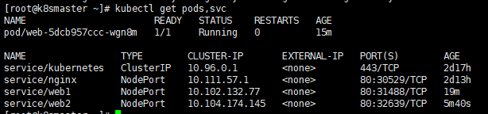
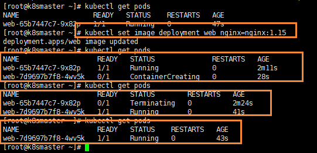

# Kubernetes 核心技术 Controller

## 概述

​	在实际使用的时候并不会直接使用 Pod，而是会使用各种控制器来满足需求，Kubernetes 中运行了一系列控制器来确保集群的当前状态与期望状态保持一致，它们就是 Kubernetes 的大脑。例如，ReplicaSet 控制器负责维护集群中运行的 Pod 数量；Node 控制器负责监控节点的状态，并在节点出现故障时及时做出响应。总而言之，在 Kubernetes 中，每个控制器只负责某种类型的特定资源。

Controller 是在集群上管理和运行容器的对象，Controller 是实际存在的，Pod 是虚拟机的

## Pod 和 Controller 的关系

​	Pod 是通过 Controller 实现应用的运维，比如弹性伸缩，滚动升级等

​	Pod 和 Controller 之间是通过 `label` 标签来建立关系，同时 Controller 又被称为控制器工作负载。Kubernetes 控制器会监听资源的 `创建/更新/删除` 事件，并触发 `Reconcile` 函数作为响应。整个调整过程被称作 `“Reconcile Loop”（调谐循环）` 或者 `“Sync Loop”（同步循环）`。


​	Reconcile 是一个使用资源对象的命名空间和资源对象名称来调用的函数，使得资源对象的实际状态与 资源清单中定义的状态保持一致。调用完成后，Reconcile 会将资源对象的状态更新为当前实际状态。用下面的一段伪代码来表示这个过程：

```go
for {
    desired := getDesiredState()  // 期望的状态
    current := getCurrentState()  // 当前实际状态
    if current == desired {  // 如果状态一致则什么都不做
        // nothing to do
    } else {  // 如果状态不一致则调整编排，到一致为止
        // change current to desired status
    }
}
```

这个编排模型就是 Kubernetes 项目中的一个通用编排模式，即：`控制循环（control loop）`

## ReplicaSet

​	`ReplicaSet（RS）` 的主要作用就是维持一组 Pod 副本的运行，保证一定数量的 Pod 在集群中正常运行，ReplicaSet 控制器会持续监听它说控制的这些 Pod 的运行状态，在 Pod 发送故障数量减少或者增加时会触发调谐过程，始终保持副本数量一定。

​	`Replica Set` 检查 RS，也就是副本集。RS 是新一代的 RC，提供同样高可用能力，区别主要在于 RS 后来居上，能够支持更多种类的匹配模式。副本集对象一般不单独使用，而是作为 Deployment 的理想状态参数来使用

```bash
vim nginx-rs.yaml
apiVersion: apps/v1
kind: ReplicaSet
metadata:
  name:  nginx-rs
  namespace: default
spec:
  replicas: 3  # 期望的 Pod 副本数量，默认值为 1
  selector:  # Label Selector，必须匹配 Pod 模板中的标签
    matchLabels:
      app: nginx
  template:  # Pod 模板
    metadata:
      labels:
        app: nginx
    spec:
      containers:
      - name: nginx
        image: nginx
        ports:
        - containerPort: 80
```

- `replias`：表示期望的 Pod 的副本数量
- `selector`：Label Selector，用来匹配要控制的 Pod 标签，需要和下面的 Pod 模板中的标签一致
- `template`：Pod 模板，实际上就是定义的 Pod 内容，相当于把一个 Pod 的描述以模板的形式嵌入到了 ReplicaSet 中来

ReplicaSet 控制器会通过定义的 Label Selector 标签去查找集群中的 Pod 对象：


```bash
kubectl apply -f nginx-rs.yaml
kubectl get rs nginx-rs
```

​	通过查看 RS 可以看到当前资源对象的描述信息，包括`DESIRED`、`CURRENT`、`READY`的状态值，创建完成后，可以利用如下命令查看下 Pod 列表：

```bash
kubectl get pods -l app=nginx
```

​	在 YAML 文件中声明了 3 个副本，然后删除了一个副本，就变成了两个，这个时候 ReplicaSet 控制器监控到控制的 Pod 数量和期望的 3 不一致，所以就需要启动一个新的 Pod 来保持 3 个副本，这个过程就是`调谐`的过程。同样可以查看 RS 的描述信息来查看到相关的事件信息：

```bash
kubectl describe rs nginx-rs
```

如果这个时候把 RS 资源对象的 Pod 副本更改为 2 `spec.replicas=2`，这个时候来更新下资源对象：

```bash
kubectl edit -f rs.yaml
# spec.replicas=2
kubectl apply -f rs.yaml
kubectl get rs nginx-rs
```

​	可以看到 Replicaset 控制器在发现资源声明中副本数变更为 2 后，就主动去删除了一个 Pod，这样副本数就和期望的始终保持一致了

​	被 ReplicaSet 持有的 Pod 有一个 `metadata.ownerReferences` 指针指向当前的 ReplicaSet，表示当前 Pod 的所有者，这个引用主要会被集群中的**垃圾收集器**使用以清理失去所有者的 Pod 对象。可以通过将 Pod 资源描述信息导出查看：

```bash
kubectl get pod nginx-rs-xsb59 -o yaml
```

 Pod 中有一个 `metadata.ownerReferences` 的字段指向了 ReplicaSet 资源对象。如果要彻底删除 Pod，只能删除 RS 对象

```bash
kubectl delete rs nginx-rs
# Or
kubectl delete -f nginx-rs.yaml
```

## Replication Controller

​	Replication Controller 简称 **RC**，实际上 RC 和 RS 的功能几乎一致，RS 算是对 RC 的改进，目前唯一的一个区别就是 RC 只支持基于等式的 `selector`（env=dev 或 environment!=qa），但 RS 还支持基于集合的 selector（version in (v1.0, v2.0)），这对复杂的运维管理就非常方便了。

​	即使在指定数目为 1 的情况下，通过 RC 运行 Pod 也比直接运行 Pod 更明智，因为 RC 也可以发挥它高可用的能力，保证永远有一个 Pod 在运行。RC 是 K8S 中较早期的技术概念，只适用于长期伺服型的业务类型，比如控制 Pod 提供高可用的 Web 服务

使用 RC 的话，对应的 selector 是这样的：

```yml
selector: 
  app: nginx
```

RC 只支持单个 Label 的等式，而 RS 中的 Label Selector 支持 `matchLabels` 和 `matchExpressions` 两种形式：

```yml
selector:  
  matchLabels:
    app: nginx

---
selector:
  matchExpressions:  # 该选择器要求 Pod 包含名为 app 的标签
  - key: app
    operator: In
    values:  # 并且标签的值必须是 nginx
    - nginx 
```

​	总的来说 RS 是新一代的 RC，所以不使用 RC，直接使用 RS 即可，他们的功能都是一致的，但是实际上在实际使用中也不会直接使用 RS，而是使用更上层的类似于 Deployment 这样的资源对象。

## Deployment 控制器

- Deployment 控制器可以部署无状态应用
- 管理 Pod 和 ReplicaSet
- 部署，滚动升级等功能


​	Deployment 表示用户对K8S集群的一次更新操作。Deployment 是一个比 RS( Replica Set, RS) 应用模型更广的 API 对象，可以是创建一个新的服务，更新一个新的服务，也可以是滚动升级一个服务。滚动升级一个服务，实际是创建一个新的RS，然后逐渐将新 RS 中副本数增加到理想状态，将旧 RS 中的副本数减少到 0 的复合操作。

​	这样一个复合操作用一个 RS 是不好描述的，所以用一个更通用的 Deployment 来描述。以K8S的发展方向，未来对所有长期伺服型的业务的管理，都会通过 Deployment 来管理。

### Deployment 部署应用

```bash
kubectrl create deployment web --image=nginx
```

但是上述代码不是很好的进行复用，因为每次都需要重新输入代码，所以都是通过 YAML 进行配置

但是可以尝试使用上面的代码创建一个镜像【只是尝试，不会创建】

```bash
kubectl create deployment web --image=nginx --dry-run -o yaml > nginx.yaml
```

然后输出一个 yaml 配置文件 `nginx.yml` ，配置文件如下所示

```bash
apiVersion: apps/v1
kind: Deployment
metadata:
  creationTimestamp: null
  labels:
    app: web
  name: web
spec:
  replicas: 1
  selector:
    matchLabels:
      app: web
  strategy: {}
  template:
    metadata:
      creationTimestamp: null
      labels:
        app: web
    spec:
      containers:
      - image: nginx
        name: nginx
        resources: {}
status: {}
```

selector 和 label 就是 Pod 和 Controller 之间建立关系的桥梁


### 使用 YAML 创建 Pod

通过刚刚的代码，已经生成了YAML文件，下面就可以使用该配置文件快速创建 Pod 镜像了

```bash
kubectl apply -f nginx.yaml
```


但是因为这个方式创建的，只能在集群内部进行访问，所以还需要对外暴露端口

```bash
kubectl expose deployment web --port=80 --type=NodePort --target-port=80 --name=web1
```

关于上述命令，有几个参数

- --port：就是内部的端口号
- --target-port：就是暴露外面访问的端口号
- --name：名称
- --type：类型

同理，一样可以导出对应的配置文件

```bash
kubectl expose deployment web --port=80 --type=NodePort --target-port=80 --name=web1 -o yaml > web1.yaml
```

得到的web1.yaml如下所示

```bash
apiVersion: v1
kind: Service
metadata:
  creationTimestamp: "2020-11-16T02:26:53Z"
  labels:
    app: web
  managedFields:
  - apiVersion: v1
    fieldsType: FieldsV1
    fieldsV1:
      f:metadata:
        f:labels:
          .: {}
          f:app: {}
      f:spec:
        f:externalTrafficPolicy: {}
        f:ports:
          .: {}
          k:{"port":80,"protocol":"TCP"}:
            .: {}
            f:port: {}
            f:protocol: {}
            f:targetPort: {}
        f:selector:
          .: {}
          f:app: {}
        f:sessionAffinity: {}
        f:type: {}
    manager: kubectl
    operation: Update
    time: "2020-11-16T02:26:53Z"
  name: web2
  namespace: default
  resourceVersion: "113693"
  selfLink: /api/v1/namespaces/default/services/web2
  uid: d570437d-a6b4-4456-8dfb-950f09534516
spec:
  clusterIP: 10.104.174.145
  externalTrafficPolicy: Cluster
  ports:
  - nodePort: 32639
    port: 80
    protocol: TCP
    targetPort: 80
  selector:
    app: web
  sessionAffinity: None
  type: NodePort
status:
  loadBalancer: {}
```

然后可以通过下面的命令来查看对外暴露的服务

```bash
kubectl get pods,svc
```



然后访问对应的url，即可看到 nginx了 `http://192.168.177.130:32639/`


​	注意 ReplicaSet 的名称始终被格式化为 `[Deployment名称]-[随机字符串]`。 其中的随机字符串是使用 pod-template-hash 作为种子随机生成的。

​	Deployment 控制器将 pod-template-hash 标签添加到 Deployment 所创建或收留的 每个 ReplicaSet 。此标签可确保 Deployment 的子 ReplicaSets 不重叠。 标签是通过对 ReplicaSet 的 PodTemplate 进行哈希处理。 所生成的哈希值被添加到 ReplicaSet 选择算符、Pod 模板标签，并存在于在 ReplicaSet 可能拥有的任何现有 Pod 中。
​	`kubectl get pods --show-labels`

​	当 Deployment 创建或者接管 ReplicaSet 时，Deployment controller 会自动为 Pod 添加 pod-template-hash label。这样做的目的是防止 Deployment 的子 ReplicaSet 的 pod 名字重复。通过将 ReplicaSet 的 PodTemplate 进行哈希散列，使用生成的哈希值作为 label 的值，并添加到 ReplicaSet selector 里、 pod template label 和 ReplicaSet 管理中的 Pod 上。


### 升级回滚和弹性伸缩

​	仅当 Deployment Pod 模板（即 `.spec.template`）发生改变时，才会触发Deployment 上线。 其他更新（如对 Deployment 执行扩缩容的操作）不会触发上线动作。

​	如：`kubectl set image deployment/nginx-deployment nginx=nginx:1.16.1 --record`
​		`kubectl edit deployment.v1.apps/nginx-deployment`

​	Deployment 可确保在更新时仅关闭一定数量的 Pod。默认情况下，它确保至少所需 Pods 75% 处于运行状态（最大不可用比例为 25%）。Deployment 还确保仅所创建 Pod 数量只可能比期望 Pods 数高一点点。 默认情况下，它可确保启动的 Pod 个数比期望个数最多多出 25%（最大峰值 25%）。


​	当第一次创建 Deployment 时，它创建了一个 ReplicaSet 并将其直接扩容至 3 个副本。更新 Deployment 时，它创建了一个新的 ReplicaSet ，并将其扩容为 1，然后将旧 ReplicaSet 缩容到 2， 以便至少有 2 个 Pod 可用且最多创建 4 个 Pod。 然后，它使用相同的滚动更新策略继续对新的 ReplicaSet 扩容并对旧的 ReplicaSet 缩容。 最后，你将有 3 个可用的副本在新的 ReplicaSet 中，旧 ReplicaSet 将缩容到 0

​	每当 Deployment controller 观测到有新的 deployment 被创建时，如果没有已存在的 ReplicaSet 来创建期望个数的 Pod 的话，就会创建出一个新的 ReplicaSet 来做这件事。已存在的 ReplicaSet 控制 label 与 .spec.selector 匹配但是 template 跟 .spec.template 不匹配的 Pod 缩容。最终，新的 ReplicaSet 将会扩容出 .spec.replicas 指定数目的 Pod，旧的 ReplicaSet 会缩容到 0

​	如果您更新了一个的已存在并正在进行中的 Deployment，每次更新 Deployment 都会创建一个新的 ReplicaSet 并扩容它，同时回滚之前扩容的 ReplicaSet —— 将它添加到旧的 ReplicaSet 列表中，开始缩容


- 升级：  假设从版本为1.14 升级到 1.15 ，这就叫应用的升级【升级可以保证服务不中断】
- 回滚：从版本1.15 变成 1.14，这就叫应用的回滚
- 弹性伸缩：根据不同的业务场景，来改变Pod的数量对外提供服务，这就是弹性伸缩

#### 应用升级

首先先创建一个 1.14版本的Pod

```yaml
apiVersion: apps/v1
kind: Deployment
metadata:
  creationTimestamp: null
  labels:
    app: web
  name: web
spec:
  replicas: 1
  selector:
    matchLabels:
      app: web
  strategy: {}
  template:
    metadata:
      creationTimestamp: null
      labels:
        app: web
    spec:
      containers:
      - image: nginx:1.14
        name: nginx
        resources: {}
status: {}
```

先指定版本为1.14，然后开始创建的Pod

```bash
kubectl apply -f nginx.yaml
```

同时，使用docker images命令，就能看到成功拉取到了一个 1.14版本的镜像


使用下面的命令，可以将nginx从 1.14 升级到 1.15

```bash
kubectl set image deployment web nginx=nginx:1.15
```

在执行完命令后，能看到升级的过程



- 首先是开始的nginx 1.14版本的Pod在运行，然后 1.15版本的在创建
- 然后在1.15版本创建完成后，就会暂停1.14版本
- 最后把1.14版本的Pod移除，完成的升级

在下载 1.15版本，容器就处于ContainerCreating状态，然后下载完成后，就用 1.15版本去替换1.14版本了，这么做的好处就是：升级可以保证服务不中断


到的node2节点上，查看的 docker images;


能够看到，已经成功拉取到了 1.15版本的nginx了

**查看升级状态**

下面可以，查看升级状态

```bash
kubectl rollout status deployment web
```


**查看历史版本**

还可以查看历史版本

```bash
kubectl rollout history deployment web
```

#### 回滚

可以使用下面命令，完成回滚操作，也就是回滚到上一个版本

```bash
kubectl rollout undo deployment web
```

然后就可以查看状态

```bash
kubectl rollout status deployment web
```


同时还可以回滚到指定版本

```bash
kubectl rollout undo deployment web --to-revision=2
```

```bash
# 例如错误的更新到了一个xxx版本
kubectl set image deploy nginx nginx=nginx:xxx --record

# 查看 kubectl 更新的历史命令
kubectl rollout history deploy nginx

REVISION  CHANGE-CAUSE
1         <none>
2         kubectl set image deploy nginx nginx=nginx:1.15.3 --record=true
3         kubectl set image deploy nginx nginx=nginx:xxx --record=true

# 回滚到上一个版本
kubectl rollout undo deploy nginx
```


#### 弹性伸缩

弹性伸缩，也就是通过命令一下创建多个副本

```bash
kubectl scale deployment web --replicas=10
```

能够清晰看到，一下创建了10个副本


## Statefulset

Statefulset主要是用来部署有状态应用

对于StatefulSet中的Pod，每个Pod挂载自己独立的存储，如果一个Pod出现故障，从其他节点启动一个同样名字的Pod，要挂载上原来Pod的存储继续以它的状态提供服务。

### 无状态应用

原来使用 deployment，部署的都是无状态的应用，那什么是无状态应用？

- 认为Pod都是一样的
- 没有顺序要求
- 不考虑应用在哪个node上运行
- 能够进行随意伸缩和扩展

### 有状态应用

上述的因素都需要考虑到

- 让每个Pod独立的
- 让每个Pod独立的，保持Pod启动顺序和唯一性
- 唯一的网络标识符，持久存储
- 有序，比如mysql中的主从

适合StatefulSet的业务包括数据库服务MySQL 和 PostgreSQL，集群化管理服务Zookeeper、etcd等有状态服务

StatefulSet的另一种典型应用场景是作为一种比普通容器更稳定可靠的模拟虚拟机的机制。传统的虚拟机正是一种有状态的宠物，运维人员需要不断地维护它，容器刚开始流行时，用容器来模拟虚拟机使用，所有状态都保存在容器里，而这已被证明是非常不安全、不可靠的。

使用StatefulSet，Pod仍然可以通过漂移到不同节点提供高可用，而存储也可以通过外挂的存储来提供
高可靠性，StatefulSet做的只是将确定的Pod与确定的存储关联起来保证状态的连续性。

### 部署有状态应用

无头service， ClusterIp：none

这里就需要使用 StatefulSet部署有状态应用


然后通过查看pod，能否发现每个pod都有唯一的名称


然后在查看service，发现是无头的service


这里有状态的约定，肯定不是简简单单通过名称来进行约定，而是更加复杂的操作

- deployment：是有身份的，有唯一标识
- statefulset：根据主机名 + 按照一定规则生成域名

每个pod有唯一的主机名，并且有唯一的域名

- 格式：主机名称.service名称.名称空间.svc.cluster.local
- 举例：nginx-statefulset-0.default.svc.cluster.local

## DaemonSet

DaemonSet 即后台支撑型服务，主要是用来部署守护进程

长期伺服型和批处理型的核心在业务应用，可能有些节点运行多个同类业务的Pod，有些节点上又没有这类的Pod运行；而后台支撑型服务的核心关注点在K8S集群中的节点(物理机或虚拟机)，要保证每个节点上都有一个此类Pod运行。节点可能是所有集群节点，也可能是通过 nodeSelector选定的一些特定节点。典型的后台支撑型服务包括：存储、日志和监控等。在每个节点上支撑K8S集群运行的服务。

守护进程在每个节点上，运行的是同一个pod，新加入的节点也同样运行在同一个pod里面

- 例子：在每个node节点安装数据采集工具


这里是不是一个FileBeat镜像，主要是为了做日志采集工作


进入某个 Pod里面，进入

```bash
kubectl exec -it ds-test-cbk6v bash
```

通过该命令后，就能看到内部收集的日志信息了


## Job 和 CronJob

一次性任务 和 定时任务

- 一次性任务：一次性执行完就结束
- 定时任务：周期性执行

Job是K8S中用来控制批处理型任务的API对象。批处理业务与长期伺服业务的主要区别就是批处理业务的运行有头有尾，而长期伺服业务在用户不停止的情况下永远运行。Job管理的Pod根据用户的设置把任务成功完成就自动退出了。成功完成的标志根据不同的 spec.completions 策略而不同：单Pod型任务有一个Pod成功就标志完成；定数成功行任务保证有N个任务全部成功；工作队列性任务根据应用确定的全局成功而标志成功。

### Job

Job也即一次性任务


使用下面命令，能够看到目前已经存在的Job

```bash
kubectl get jobs
```


在计算完成后，通过命令查看，能够发现该任务已经完成


可以通过查看日志，查看到一次性任务的结果

```bash
kubectl logs pi-qpqff
```


### CronJob

定时任务，cronjob.yaml如下所示


这里面的命令就是每个一段时间，这里是通过 cron 表达式配置的，通过 schedule字段

然后下面命令就是每个一段时间输出 

首先用上述的配置文件，创建一个定时任务

```bash
kubectl apply -f cronjob.yaml
```

创建完成后，就可以通过下面命令查看定时任务

```bash
kubectl get cronjobs
```


可以通过日志进行查看

```bash
kubectl logs hello-1599100140-wkn79
```


然后每次执行，就会多出一个 pod


**删除 `svc` 和 `statefulset`**

使用下面命令，可以删除添加的svc 和 statefulset

```bash
kubectl delete svc web

kubectl delete statefulset --all
```


