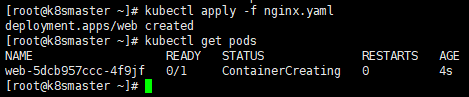
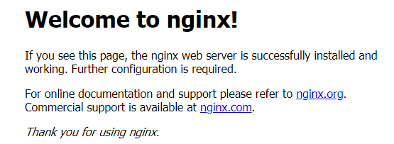

# Kubernetes 核心技术 Controller

## 概述

​	在实际使用的时候并不会直接使用 Pod，而是会使用各种控制器来满足需求，Kubernetes 中运行了一系列控制器来确保集群的当前状态与期望状态保持一致，它们就是 Kubernetes 的大脑。例如，ReplicaSet 控制器负责维护集群中运行的 Pod 数量；Node 控制器负责监控节点的状态，并在节点出现故障时及时做出响应。总而言之，在 Kubernetes 中，每个控制器只负责某种类型的特定资源。

​	Controller 是在集群上管理和运行容器的对象，Controller 是实际存在的，Pod 是虚拟机的

## Pod 和 Controller 的关系

​	Pod 是通过 Controller 实现应用的运维，比如弹性伸缩，滚动升级等

​	Pod 和 Controller 之间是通过 `label` 标签来建立关系，同时 Controller 又被称为控制器工作负载。Kubernetes 控制器会监听资源的 `创建/更新/删除` 事件，并触发 `Reconcile` 函数作为响应。整个调整过程被称作 `“Reconcile Loop”（调谐循环）` 或者 `“Sync Loop”（同步循环）`。


​	Reconcile 是一个使用资源对象的命名空间和资源对象名称来调用的函数，使得资源对象的实际状态与 资源清单中定义的状态保持一致。调用完成后，Reconcile 会将资源对象的状态更新为当前实际状态。用下面的一段伪代码来表示这个过程：

```go
for {
    desired := getDesiredState()  // 期望的状态
    current := getCurrentState()  // 当前实际状态
    if current == desired {  // 如果状态一致则什么都不做
        // nothing to do
    } else {  // 如果状态不一致则调整编排，到一致为止
        // change current to desired status
    }
}
```

这个编排模型就是 Kubernetes 项目中的一个通用编排模式，即：`控制循环（control loop）`

## ReplicaSet

​	`ReplicaSet（RS）` 的主要作用就是维持一组 Pod 副本的运行，保证一定数量的 Pod 在集群中正常运行，ReplicaSet 控制器会持续监听它说控制的这些 Pod 的运行状态，在 Pod 发送故障数量减少或者增加时会触发调谐过程，始终保持副本数量一定。

​	`Replica Set` 检查 RS，也就是副本集。RS 是新一代的 RC，提供同样高可用能力，区别主要在于 RS 后来居上，能够支持更多种类的匹配模式。副本集对象一般不单独使用，而是作为 Deployment 的理想状态参数来使用

```bash
vim nginx-rs.yaml
apiVersion: apps/v1
kind: ReplicaSet
metadata:
  name:  nginx-rs
  namespace: default
spec:
  replicas: 3  # 期望的 Pod 副本数量，默认值为 1
  selector:  # Label Selector，必须匹配 Pod 模板中的标签
    matchLabels:
      app: nginx
  template:  # Pod 模板
    metadata:
      labels:
        app: nginx
    spec:
      containers:
      - name: nginx
        image: nginx
        ports:
        - containerPort: 80
```

- `replias`：表示期望的 Pod 的副本数量
- `selector`：Label Selector，用来匹配要控制的 Pod 标签，需要和下面的 Pod 模板中的标签一致
- `template`：Pod 模板，实际上就是定义的 Pod 内容，相当于把一个 Pod 的描述以模板的形式嵌入到了 ReplicaSet 中来

ReplicaSet 控制器会通过定义的 Label Selector 标签去查找集群中的 Pod 对象：


```bash
kubectl apply -f nginx-rs.yaml
kubectl get rs nginx-rs
```

​	通过查看 RS 可以看到当前资源对象的描述信息，包括`DESIRED`、`CURRENT`、`READY`的状态值，创建完成后，可以利用如下命令查看下 Pod 列表：

```bash
kubectl get pods -l app=nginx
```

​	在 YAML 文件中声明了 3 个副本，然后删除了一个副本，就变成了两个，这个时候 ReplicaSet 控制器监控到控制的 Pod 数量和期望的 3 不一致，所以就需要启动一个新的 Pod 来保持 3 个副本，这个过程就是`调谐`的过程。同样可以查看 RS 的描述信息来查看到相关的事件信息：

```bash
kubectl describe rs nginx-rs
```

如果这个时候把 RS 资源对象的 Pod 副本更改为 2 `spec.replicas=2`，这个时候来更新下资源对象：

```bash
kubectl edit -f rs.yaml
# spec.replicas=2
kubectl apply -f rs.yaml
kubectl get rs nginx-rs
```

​	可以看到 Replicaset 控制器在发现资源声明中副本数变更为 2 后，就主动去删除了一个 Pod，这样副本数就和期望的始终保持一致了

​	被 ReplicaSet 持有的 Pod 有一个 `metadata.ownerReferences` 指针指向当前的 ReplicaSet，表示当前 Pod 的所有者，这个引用主要会被集群中的**垃圾收集器**使用以清理失去所有者的 Pod 对象。可以通过将 Pod 资源描述信息导出查看：

```bash
kubectl get pod nginx-rs-xsb59 -o yaml
```

 Pod 中有一个 `metadata.ownerReferences` 的字段指向了 ReplicaSet 资源对象。如果要彻底删除 Pod，只能删除 RS 对象

```bash
kubectl delete rs nginx-rs
# Or
kubectl delete -f nginx-rs.yaml
```

## Replication Controller

​	Replication Controller 简称 **RC**，实际上 RC 和 RS 的功能几乎一致，RS 算是对 RC 的改进，目前唯一的一个区别就是 RC 只支持基于等式的 `selector`（env=dev 或 environment!=qa），但 RS 还支持基于集合的 selector（version in (v1.0, v2.0)），这对复杂的运维管理就非常方便了。

​	即使在指定数目为 1 的情况下，通过 RC 运行 Pod 也比直接运行 Pod 更明智，因为 RC 也可以发挥它高可用的能力，保证永远有一个 Pod 在运行。RC 是 K8S 中较早期的技术概念，只适用于长期伺服型的业务类型，比如控制 Pod 提供高可用的 Web 服务

使用 RC 的话，对应的 selector 是这样的：

```yml
selector: 
  app: nginx
```

RC 只支持单个 Label 的等式，而 RS 中的 Label Selector 支持 `matchLabels` 和 `matchExpressions` 两种形式：

```yml
selector:  
  matchLabels:
    app: nginx

---
selector:
  matchExpressions:  # 该选择器要求 Pod 包含名为 app 的标签
  - key: app
    operator: In
    values:  # 并且标签的值必须是 nginx
    - nginx 
```

​	总的来说 RS 是新一代的 RC，所以不使用 RC，直接使用 RS 即可，他们的功能都是一致的，但是实际上在实际使用中也不会直接使用 RS，而是使用更上层的类似于 Deployment 这样的资源对象。

## Deployment 控制器

- Deployment 控制器可以部署无状态应用
- 管理 Pod 和 ReplicaSet
- 部署，滚动升级等功能


​	Deployment 表示用户对K8S集群的一次更新操作。Deployment 是一个比 RS( Replica Set, RS) 应用模型更广的 API 对象，可以是创建一个新的服务，更新一个新的服务，也可以是滚动升级一个服务。滚动升级一个服务，实际是创建一个新的RS，然后逐渐将新 RS 中副本数增加到理想状态，将旧 RS 中的副本数减少到 0 的复合操作。

​	所有的 Deployment 对象都是由 Kubernetes 集群中的 DeploymentController 进行管理，DeploymentController 会在启动时通过 Informer 监听三种不同资源的通知，Pod、ReplicaSet 和 Deployment，这三种资源的变动都会触发 DeploymentController 中的回调。


​	这样一个复合操作用一个 RS 是不好描述的，所以用一个更通用的 Deployment 来描述。以K8S的发展方向，未来对所有长期伺服型的业务的管理，都会通过 Deployment 来管理。

不同的事件最终都会在被过滤后进入控制器持有的队列，等待工作进程的消费，下面的这些事件都会触发

- Deployment 的同步
- Deployment 的变动
- Deployment 相关的 ReplicaSet 变动
- Deployment 相关的 Pod 数量为 0 时，Pod 的删除事件

​	DeploymentController 会在调用 Run 方法时启动多个工作进程，这些工作进程会运行 worker 方法从队列中读取最新的 Deployment 对象进行同步

### Deployment 控制器实现流程


1、Deployment 控制器从 Etcd 中获取到所有携带了“app: nginx”标签的 Pod，然后统计它们的数量，这就是实际状态
2、Deployment 对象的 Replicas 字段的值就是期望状态
3、Deployment 控制器将两个状态做比较，然后根据比较结果，确定是创建 Pod，还是删除已有的 Pod

​	一个 Kubernetes 对象的主要编排逻辑，实际上是在第三步的“对比”阶段完成的。这个操作，通常被叫作调谐（Reconcile）。这个调谐的过程，则被称作“Reconcile Loop”（调谐循环）或者“Sync Loop”（同步循环）

在具体实现中，实际状态往往来自于 Kubernetes 集群本身。比如，

- kubelet 通过心跳汇报的容器状态和节点状态；
- 监控系统中保存的应用监控数据；
- 控制器主动收集的它自己感兴趣的信息。

​	这些都是常见的实际状态的来源。而期望状态，一般来自于用户提交的 YAML 文件。比如，Deployment 对象中 Replicas 字段的值。很明显，这些信息往往都保存在 Etcd 中

​	Deployment 定义的 template 字段，在 Kubernetes 项目中有一个专有的名字，叫作 PodTemplate（Pod 模板）。大多数控制器都会使用 PodTemplate 来统一定义它所要管理的 Pod，其他类型的对象模板，比如 Volume 的模板

​	类似 Deployment 这样的一个控制器，实际上都是由上半部分的控制器定义（包括期望状态），加上下半部分的被控制对象的模板组成的


### Deployment 部署应用

```bash
kubectrl create deployment web --image=nginx
```

但是上述代码不是很好的进行复用，因为每次都需要重新输入代码，所以都是通过 YAML 进行配置

但是可以尝试使用上面的代码创建一个镜像【只是尝试，不会创建】

```bash
kubectl create deployment web --image=nginx --dry-run -o yaml > nginx.yaml
```

然后输出一个 yaml 配置文件 `nginx.yml` ，配置文件如下所示

```yaml
apiVersion: apps/v1
kind: Deployment
metadata:
  creationTimestamp: null
  labels:
    app: web
  name: web
spec:
  replicas: 1
  selector:
    matchLabels:
      app: web
  strategy: {}
  template:
    metadata:
      creationTimestamp: null
      labels:
        app: web
    spec:
      containers:
      - image: nginx
        name: nginx
        resources: {}
status: {}
```

selector 和 label 就是 Pod 和 Controller 之间建立关系的桥梁


### 使用 YAML 创建 Pod

通过刚刚的代码，已经生成了YAML文件，下面就可以使用该配置文件快速创建 Pod 镜像了

```bash
kubectl apply -f nginx.yaml
```



但是因为这个方式创建的，只能在集群内部进行访问，所以还需要对外暴露端口

```bash
kubectl expose deployment web --port=80 --type=NodePort --target-port=80 --name=web1
```

关于上述命令，有几个参数

- --port：就是内部的端口号
- --target-port：就是暴露外面访问的端口号
- --name：名称
- --type：类型

同理，一样可以导出对应的配置文件

```bash
kubectl expose deployment web --port=80 --type=NodePort --target-port=80 --name=web1 -o yaml > web1.yaml
```

得到的web1.yaml如下所示

```bash
apiVersion: v1
kind: Service
metadata:
  creationTimestamp: "2020-11-16T02:26:53Z"
  labels:
    app: web
  managedFields:
  - apiVersion: v1
    fieldsType: FieldsV1
    fieldsV1:
      f:metadata:
        f:labels:
          .: {}
          f:app: {}
      f:spec:
        f:externalTrafficPolicy: {}
        f:ports:
          .: {}
          k:{"port":80,"protocol":"TCP"}:
            .: {}
            f:port: {}
            f:protocol: {}
            f:targetPort: {}
        f:selector:
          .: {}
          f:app: {}
        f:sessionAffinity: {}
        f:type: {}
    manager: kubectl
    operation: Update
    time: "2020-11-16T02:26:53Z"
  name: web2
  namespace: default
  resourceVersion: "113693"
  selfLink: /api/v1/namespaces/default/services/web2
  uid: d570437d-a6b4-4456-8dfb-950f09534516
spec:
  clusterIP: 10.104.174.145
  externalTrafficPolicy: Cluster
  ports:
  - nodePort: 32639
    port: 80
    protocol: TCP
    targetPort: 80
  selector:
    app: web
  sessionAffinity: None
  type: NodePort
status:
  loadBalancer: {}
```

然后可以通过下面的命令来查看对外暴露的服务

```bash
kubectl get pods,svc
```


然后访问对应的url，即可看到 nginx了 `http://192.168.177.130:32639/`



​	注意 ReplicaSet 的名称始终被格式化为 `[Deployment名称]-[随机字符串]`。 其中的随机字符串是使用 pod-template-hash 作为种子随机生成的。

​	Deployment 控制器将 pod-template-hash 标签添加到 Deployment 所创建或收留的 每个 ReplicaSet 。此标签可确保 Deployment 的子 ReplicaSets 不重叠。 标签是通过对 ReplicaSet 的 PodTemplate 进行哈希处理。 所生成的哈希值被添加到 ReplicaSet 选择算符、Pod 模板标签，并存在于在 ReplicaSet 可能拥有的任何现有 Pod 中。
​	`kubectl get pods --show-labels`

​	当 Deployment 创建或者接管 ReplicaSet 时，Deployment controller 会自动为 Pod 添加 pod-template-hash label。这样做的目的是防止 Deployment 的子 ReplicaSet 的 pod 名字重复。通过将 ReplicaSet 的 PodTemplate 进行哈希散列，使用生成的哈希值作为 label 的值，并添加到 ReplicaSet selector 里、 pod template label 和 ReplicaSet 管理中的 Pod 上。


### 升级回滚和弹性伸缩

​	仅当 Deployment Pod 模板（即 `.spec.template`）发生改变时，才会触发Deployment 上线。 其他更新（如对 Deployment 执行扩缩容的操作）不会触发上线动作。

​	如：`kubectl set image deployment/nginx-deployment nginx=nginx:1.16.1 --record`
​		`kubectl edit deployment.v1.apps/nginx-deployment`

​	Deployment 可确保在更新时仅关闭一定数量的 Pod。默认情况下，它确保至少所需 Pods 75% 处于运行状态（最大不可用比例为 25%）。Deployment 还确保仅所创建 Pod 数量只可能比期望 Pods 数高一点点。 默认情况下，它可确保启动的 Pod 个数比期望个数最多多出 25%（最大峰值 25%）。


​	当第一次创建 Deployment 时，它创建了一个 ReplicaSet 并将其直接扩容至 3 个副本。更新 Deployment 时，它创建了一个新的 ReplicaSet ，并将其扩容为 1，然后将旧 ReplicaSet 缩容到 2， 以便至少有 2 个 Pod 可用且最多创建 4 个 Pod。 然后，它使用相同的滚动更新策略继续对新的 ReplicaSet 扩容并对旧的 ReplicaSet 缩容。 最后，你将有 3 个可用的副本在新的 ReplicaSet 中，旧 ReplicaSet 将缩容到 0

​	每当 Deployment controller 观测到有新的 deployment 被创建时，如果没有已存在的 ReplicaSet 来创建期望个数的 Pod 的话，就会创建出一个新的 ReplicaSet 来做这件事。已存在的 ReplicaSet 控制 label 与 .spec.selector 匹配但是 template 跟 .spec.template 不匹配的 Pod 缩容。最终，新的 ReplicaSet 将会扩容出 .spec.replicas 指定数目的 Pod，旧的 ReplicaSet 会缩容到 0

​	如果您更新了一个的已存在并正在进行中的 Deployment，每次更新 Deployment 都会创建一个新的 ReplicaSet 并扩容它，同时回滚之前扩容的 ReplicaSet —— 将它添加到旧的 ReplicaSet 列表中，开始缩容


- 升级：  假设从版本为1.14 升级到 1.15 ，这就叫应用的升级【升级可以保证服务不中断】
- 回滚：从版本1.15 变成 1.14，这就叫应用的回滚
- 弹性伸缩：根据不同的业务场景，来改变Pod的数量对外提供服务，这就是弹性伸缩

#### 应用升级

首先先创建一个 1.14 版本的 Pod

```yaml
apiVersion: apps/v1
kind: Deployment
metadata:
  creationTimestamp: null
  labels:
    app: web
  name: web
spec:
  replicas: 1
  selector:
    matchLabels:
      app: web
  strategy: {}
  template:
    metadata:
      creationTimestamp: null
      labels:
        app: web
    spec:
      containers:
      - image: nginx:1.14
        name: nginx
        resources: {}
status: {}
```

先指定版本为1.14，然后开始创建的Pod

```bash
kubectl apply -f nginx.yaml
```

同时，使用docker images命令，就能看到成功拉取到了一个 1.14版本的镜像


使用下面的命令，可以将nginx从 1.14 升级到 1.15

```bash
kubectl set image deployment web nginx=nginx:1.15
```

在执行完命令后，能看到升级的过程


- 首先是开始的nginx 1.14版本的Pod在运行，然后 1.15 版本的在创建
- 然后在1.15版本创建完成后，就会暂停1.14版本
- 最后把1.14版本的Pod移除，完成的升级

​	在下载 1.15版本，容器就处于ContainerCreating状态，然后下载完成后，就用 1.15版本去替换1.14版本了，这么做的好处就是：升级可以保证服务不中断


到的node2节点上，查看的 docker images;


**查看升级状态**

下面可以，查看升级状态

```bash
kubectl rollout status deployment web
```


**查看历史版本**

还可以查看历史版本

```bash
kubectl rollout history deployment web
```

#### 回滚

可以使用下面命令，完成回滚操作，也就是回滚到上一个版本

```bash
kubectl rollout undo deployment web
```

然后就可以查看状态

```bash
kubectl rollout status deployment web
```


同时还可以回滚到指定版本

```bash
kubectl rollout undo deployment web --to-revision=2
```

```bash
# 例如错误的更新到了一个xxx版本
kubectl set image deploy nginx nginx=nginx:xxx --record

# 查看 kubectl 更新的历史命令
kubectl rollout history deploy nginx

REVISION  CHANGE-CAUSE
1         <none>
2         kubectl set image deploy nginx nginx=nginx:1.15.3 --record=true
3         kubectl set image deploy nginx nginx=nginx:xxx --record=true

# 回滚到上一个版本
kubectl rollout undo deploy nginx

# 查看指定版本的详细信息 ---看revision对应的数字即可
kubectl rollout history deploy nginx --revision=6
```

#### Update 机制

​	K8s 要求用户 update 请求中提交的对象必须带有 resourceVersion，也就是提交 update 的数据必须先来源于 K8s 中已经存在的对象。因此，一次完整的 update 操作流程是：

1. 首先，从 K8s 中拿到一个已经存在的对象（可以选择直接从 K8s 中查询；如果在客户端做了 list watch，推荐从本地 informer 中获取）
2. 然后，基于这个取出来的对象做一些修改，比如将 Deployment 中的 replicas 做增减，或是将 image 字段修改为一个新版本的镜像
3. 最后，将修改后的对象通过 update 请求提交给 K8s
4. 此时，kube-apiserver 会校验用户 update 请求提交对象中的 resourceVersion 一定要和当前 K8s 中这个对象最新的 resourceVersion 一致，才能接受本次 update。否则，K8s 会拒绝请求，并告诉用户发生了版本冲突（Conflict）
   

#### Patch 机制

​	当用户对某个资源对象提交一个 patch 请求时，kube-apiserver 不会考虑版本问题，而是“无脑”地接受用户的请求（只要请求发送的 patch 内容合法），也就是将 patch 打到对象上、同时更新版本号
​	K8s 提供了 4 种 patch 策略：json patch、merge patch、strategic merge patch、apply patch（从 K8s 1.14 支持 server-side apply 开始）。通过 kubectl patch -h 命也可以看到这个策略选项（默认采用 strategic）

**json patch**

```bash
kubectl patch deployment/foo --type='json' -p 
  '[{"op":"add","path":"/spec/template/spec/containers/1","value":{"name":"nginx","image":"nginx:alpine"}}]'

kubectl patch deployment/foo --type='json' -p 
  '[{"op":"replace","path":"/spec/template/spec/containers/0/image","value":"app-image:v2"}]'
```

​	在 json patch 中指定操作类型，比如 add 新增还是 replace 替换，另外在修改 containers 列表时要通过元素序号来指定容器
​	如果 patch 之前这个对象已经被其他人修改了，那么 patch 有可能产生非预期的后果。比如在执行 app 容器镜像更新时，指定的序号是 0，但此时 containers 列表中第一个位置被插入了另一个容器，则更新的镜像就被错误地插入到这个非预期的容器中

**merge patch**

​	无法单独更新一个列表中的某个元素，因此不管是要在 containers 里新增容器、还是修改已有容器的 image、env 等字段，都要用整个 containers 列表来提交 patch

```bash
kubectl patch deployment/foo --type='merge' -p 
  '{"spec":{"template":{"spec":{"containers":[{"name":"app","image":"app-image:v2"},{"name":"nginx","image":"nginx:alpline"}]}}}}'
```

​	这个策略并不适合对一些列表深层的字段做更新，更适用于大片段的覆盖更新
​	对于 labels/annotations 这些 map 类型的元素更新，merge patch 是可以单独指定 key-value 操作的

```bash
kubectl patch deployment/foo --type='merge' -p '{"metadata":{"labels":{"test-key":"foo"}}}'
```

**strategic merge patch**

​	这种 patch 策略并没有一个通用的 RFC 标准，而是 K8s 独有的，不过相比前两种而言却更为强大的。在 K8s 原生资源的数据结构定义中额外定义了一些的策略注解。比如以下这个截取了 podSpec 中针对 containers 列表的定义，参考 Github：
```bash
// ...
// +patchMergeKey=name
// +patchStrategy=merge
Containers []Container `json:"containers" patchStrategy:"merge" patchMergeKey:"name" protobuf:"bytes,2,rep,name=containers"`
```

​	在 patch 更新 containers 不再需要指定下标序号了，而是指定 name 来修改，K8s 会把 name 作为 key 来计算 merge。比如针对以下的 patch 操作：
```bash
kubectl patch deployment/foo -p 
  '{"spec":{"template":{"spec":{"containers":[{"name":"nginx","image":"nginx:mainline"}]}}}}'
```

​	如果 K8s 发现当前 containers 中已经有名字为 nginx 的容器，则只会把 image 更新上去；而如果当前 containers 中没有 nginx 容器，K8s 会把这个容器插入 containers 列表。

​	此外还要说明的是，目前 strategic 策略只能用于原生 K8s 资源以及 Aggregated API 方式的自定义资源，对于 CRD 定义的资源对象，是无法使用的。这很好理解，因为 kube-apiserver 无法得知 CRD 资源的结构和 merge 策略。如果用 kubectl patch 命令更新一个 CR，则默认会采用 merge patch 的策略来操作。


#### 弹性伸缩

弹性伸缩，通过命令一下创建多个副本

```bash
# 手动缩放（扩容和缩容都是 scale，区别只在副本数量）
kubectl scale deployment web --replicas=10

# 自动缩放
kubectl autoscale deployment.v1.apps/nginx-deployment --min=2 --max=10 --cpu-percent=80
```

能够清晰看到，一下创建了10个副本


### 暂停、恢复 Deployment

​	在触发一个或多个更新之前暂停 Deployment，然后再恢复其执行。 这样做使得你能够在暂停和恢复执行之间应用多个修补程序，而不会触发不必要的上线操作

```bash
kubectl rollout pause deployment.v1.apps/pc-deployment -n w

# 更新 Deployment 镜像
kubectl set image deployment.v1.apps/pc-deployment -n w nginx=nginx:1.16.1

# 没有新的上线被触发
kubectl rollout history deployment.v1.apps/pc-deployment -n w

# 获取上线状态确保 Deployment 更新已经成功：
kubectl get rs

# 可以根据需要执行很多更新操作，例如，可以要使用的资源：
kubectl set resources deployment.v1.apps/nginx-deployment -c=nginx --limits=cpu=200m,memory=512Mi
```

​	暂停 Deployment 之前的初始状态将继续发挥作用，但新的更新在 Deployment 被 暂停期间不会产生任何效果

​	在 kubectl rollout resume 指令执行之前，在 kubectl rollout pause 指令之后的这段时间里，对 Deployment 进行的所有修改，最后只会触发一次“滚动更新”

​	最终，恢复 Deployment 执行并观察新的 ReplicaSet 的创建过程，其中包含了所应用的所有更新
```bash
kubectl rollout resume deployment.v1.apps/nginx-deployment

# 观察上线的状态
kubectl get rs -n w -w
```

> Deployment 对象有一个字段 spec.revisionHistoryLimit，就是 Kubernetes 为 Deployment 保留的“历史版本”个数
> 设置为 0，就不能做回滚操作了

### 编排 Deployment

```yaml
apiVersion: apps/v1
kind: Deployment
metadata:
  name: nginx-deployment
  labels:
    app: nginx
spec:
  replicas: 3
  selector:
    matchLabels:
      app: nginx
  template:
    metadata:
      labels:
        app: nginx
    spec:
      containers:
      - name: nginx
        image: nginx:1.14.2
        ports:
        - containerPort: 80
```

#### **Pod template**

- .spec 中只有 .spec.template 和 .spec.selector 是必需的字段
- .spec.template 是一个 Pod 模板。它和 Pod 的语法规则完全相同。 只是这里它是嵌套的，因此不需要 apiVersion 或 kind。
- 除了 Pod 的必填字段外，Deployment 中的 Pod 模板必须指定适当的标签和适当的重新启动策略。对于标签，请确保不要与其他控制器重叠。

#### **Replicas**

- .spec.replicas 是指定所需 Pod 的可选字段。它的默认值是1

#### **spec.selector**

- .spec.selector 是指定本 Deployment 的 Pod标签选择算符的必需字段。
- .spec.selector 必须匹配 .spec.template.metadata.labels，否则请求会被 API 拒绝。
- 在 API apps/v1版本中，.spec.selector 和 .metadata.labels 如果没有设置的话，不会被默认设置为 .spec.template.metadata.labels，所以需要明确进行设置。 同时在apps/v1版本中，Deployment 创建后 .spec.selector 是不可变的

#### **strategy**

​	.spec.strategy 策略指定用于用新 Pods 替换旧 Pods 的策略。 .spec.strategy.type 可以是 “Recreate” 或 “RollingUpdate”。“RollingUpdate” 是默认值。
​	在 Kubernetes 中有几种不同的方式发布应用，所以为了让应用在升级期间依然平稳提供服务，选择一个正确的发布策略就非常重要了

- 重建(recreate)：停止旧版本部署新版本
- 滚动更新(rolling-update)：一个接一个地以滚动更新方式发布新版本
- 蓝绿(blue/green)：新版本与旧版本一起存在，然后切换流量
- 金丝雀(canary)：将新版本面向一部分用户发布，然后继续全量发布
- A/B测(a/b testing)：以精确的方式（HTTP 头、cookie、权重等）向部分用户发布新版本。A/B测实际上是一种基于数据统计做出业务决策的技术。在 Kubernetes 中并不原生支持，需要额外的一些高级组件来完成改设置（比如 Istio、Linkerd、Traefik、或者自定义 Nginx/Haproxy 等）

##### 重建 (Recreate) - 最好在开发环境

​	策略定义为 Recreate 的Deployment，会终止所有正在运行的实例，然后用较新的版本来重新创建它们


​	重新创建策略是一个虚拟部署，包括关闭版本 A，然后在关闭版本 A 后部署版本 B
​	此技术意味着服务的停机时间取决于应用程序的关闭和启动持续时间

```yaml
apiVersion: v1
kind: Service
metadata:
  name: my-app
  labels:
    app: my-app
spec:
  type: NodePort
  ports:
  - name: http
    port: 80
    targetPort: http
  selector:
    app: my-app
---
apiVersion: apps/v1
kind: Deployment
metadata:
  name: my-app
  labels:
    app: my-app
spec:
  replicas: 3
  selector:
    matchLabels:
      app: my-app
  strategy:
    type: Recreate
  selector:
    matchLabels:
      app: my-app
  template:
    metadata:
      labels:
        app: my-app
        version: v1.0.0
      annotations:
        prometheus.io/scrape: "true"
        prometheus.io/port: "9101"
    spec:
      containers:
      - name: my-app
        image: containersol/k8s-deployment-strategies
        ports:
        - name: http
          containerPort: 8080
        - name: probe
          containerPort: 8086
        env:
        - name: VERSION
          value: v1.0.0
        livenessProbe:
          httpGet:
            path: /live
            port: probe
          initialDelaySeconds: 5
          periodSeconds: 5
        readinessProbe:
          httpGet:
            path: /ready
            port: probe
          periodSeconds: 5
```

定义的环境变量 VERSION 值不同，接下来按照下面的步骤来验证 Recreate策略
```bash
kubectl apply -f app-v1.yaml

kubectl get pods -l app=my-app
kubectl get svc my-app
curl http://127.0.0.1:32532
watch kubectl get po -l app=my-app

kubectl apply -f app-v2.yaml

while sleep 0.1; do curl http://127.0.0.1:32532; done

kubectl delete all -l app=my-app
```

​	观察上面新开的终端中的 Pod 列表的变化，可以看到之前的3个 Pod 都会先处于 Terminating 状态，并且 3 个 Pod 都被删除后才开始创建新的 Pod
​	可以看到最开始的阶段服务都是处于不可访问的状态，然后到第二个版本的应用部署成功后才正常访问，可以看到现在访问的数据是版本 2 了

##### 滚动更新 (rolling-update)

​	滚动更新通过逐个替换实例来逐步部署新版本的应用，直到所有实例都被替换完成为止。它通常遵循以下过程：在负载均衡器后面使用版本 A 的实例池，然后部署版本 B 的一个实例，当服务准备好接收流量时(Readiness Probe 正常)，将该实例添加到实例池中，然后从实例池中删除一个版本 A 的实例并关闭，如下图所示


滚动更新过程应用接收流量的示意图

**滚动更新的关键参数**

```yaml
spec:
  replicas: 3
  strategy:
    type: RollingUpdate
    rollingUpdate:
      maxSurge: 2        # 一次可以添加多少个Pod	指定可以创建的超出 期望 Pod 个数的 Pod 数量
      maxUnavailable: 1  # 滚动更新期间最大多少个 Pod 不可用
# maxUnavailable 设置为 0 可以完全确保在滚动更新期间服务不受影响，还可以使用百分比的值来进行设置
# 百分比值会通过向上取整转换为绝对数。 此字段的默认值为 25%
```

> 例如，当此值为 30% 时，启动滚动更新后，会立即对新的 ReplicaSet 扩容，同时保证新旧 Pod 的总数不超过所需 Pod 总数的 130%。一旦旧 Pods 被杀死，新的 ReplicaSet 可以进一步扩容， 同时确保更新期间的任何时候运行中的 Pods 总数最多为所需 Pods 总数的 130%

```bash
# 在滚动更新过程中发现新版本应用有问题，可以通过下面的命令来进行一键回滚
kubectl rollout undo deploy my-app

# 保持两个版本的应用都存在，那么也可以执行 pause 命令来暂停更新
kubectl rollout pause deploy my-app

# 如果新版本应用程序没问题了，也可以继续恢复更新
kubectl rollout resume deploy my-app

kubectl delete all -l app=my-app
```

##### 蓝/绿 (blue/green) - 最好用来验证 API 版本问题

​	蓝/绿发布是版本 2 与版本 1 一起发布，然后流量切换到版本 2，也称为红/黑部署。蓝/绿发布与滚动更新不同，版本 2(绿) 与版本1(蓝)一起部署，在测试新版本满足要求后，然后更新 Kubernetes 中扮演负载均衡器角色的 Service 对象，通过替换 label selector 中的版本标签来将流量发送到新版本，如下图所示：


蓝绿发布策略下应用方法的示例图

​	在 Kubernetes 中，可以用两种方法来实现蓝绿发布，通过单个 Service 对象或者 Ingress 控制器来实现蓝绿发布，实际操作都是类似的，都是通过 label 标签去控制
​	实现蓝绿发布的关键点就在于 Service 对象中 label selector 标签的匹配方法，比如重新定义版本1 的资源清单文件 app-v1-single-svc.yaml，文件内容如下

````yaml
apiVersion: v1
kind: Service
metadata:
  name: my-app
  labels:
    app: my-app
spec:
  type: NodePort
  ports:
  - name: http
    port: 80
    targetPort: http
  # 注意这里匹配 app 和 version 标签，当要切换流量的时候，更新 version 标签的值，比如：v2.0.0
  selector:
    app: my-app
    version: v1.0.0
---
apiVersion: apps/v1
kind: Deployment
metadata:
  name: my-app-v1
  labels:
    app: my-app
spec:
  replicas: 3
  selector:
    matchLabels:
      app: my-app
      version: v1.0.0
  template:
    metadata:
      labels:
        app: my-app
        version: v1.0.0
      annotations:
        prometheus.io/scrape: "true"
        prometheus.io/port: "9101"
    spec:
      containers:
      - name: my-app
        image: containersol/k8s-deployment-strategies
        ports:
        - name: http
          containerPort: 8080
        - name: probe
          containerPort: 8086
        env:
        - name: VERSION
          value: v1.0.0
        livenessProbe:
          httpGet:
            path: /live
            port: probe
          initialDelaySeconds: 5
          periodSeconds: 5
        readinessProbe:
          httpGet:
            path: /ready
            port: probe
          periodSeconds: 5
````

```bash
kubectl apply -f app-v1-single-svc.yaml
kubectl get pods -l app=my-app
kubectl get svc -l app=my-app
curl http://127.0.0.1:31539

watch kubectl get pod -l app=my-app

kubectl apply -f app-v2-single-svc.yaml
while sleep 0.1; do curl http://127.0.0.1:31539; done
```

​	发现访问到的都是版本1 的应用，和刚刚部署的版本2 没有任何关系，这是因为 Service 对象中通过 label selector 匹配的是version=v1.0.0这个标签，可以通过修改 Service 对象的匹配标签，将流量路由到标签version=v2.0.0的 Pod 去
```bash
kubectl patch service my-app -p '{"spec":{"selector":{"version":"v2.0.0"}}}'
while sleep 0.1; do curl http://127.0.0.1:31539; done

kubectl delete deploy my-app-v1
kubectl delete all -l app=my-app
```

##### 金丝雀(Canary) - 让部分用户参与测试

​	金丝雀部署是让部分用户访问到新版本应用，在 Kubernetes 中，可以使用两个具有相同 Pod 标签的 Deployment 来实现金丝雀部署。新版本的副本和旧版本的一起发布。在一段时间后如果没有检测到错误，则可以扩展新版本的副本数量并删除旧版本的应用

​	如果需要按照具体的百分比来进行金丝雀发布，需要尽可能的启动多的 Pod 副本，这样计算流量百分比的时候才方便，比如，如果你想将 1% 的流量发送到版本 B，那么就需要有一个运行版本 B 的 Pod 和 99 个运行版本 A 的 Pod，当然如果你对具体的控制策略不在意的话也就无所谓了，如果你需要更精确的控制策略，建议使用服务网格（如 **Istio**），它们可以更好地控制流量
金丝雀发布的应用请求示意图

> 10 个副本的版本 1 应用提供服务
> 版本 2 应用部署 1 个副本（意味着小于10%的流量）
> 等待足够的时间来确认版本2
> 应用足够稳定没有任何错误信息
> 将版本 2 应用扩容到 10 个副本
> 等待所有实例完成
> 关闭版本 1 应用

```bash
kubectl apply -f app-v1-canary.yaml
kubectl get svc -l app=my-app
curl http://127.0.0.1:30760

watch kubectl get po
kubectl apply -f app-v2-canary.yaml
```

​	在 watch 终端页面可以看到多了一个 Pod，现在一共 11 个 Pod，其中只有1 个 Pod 运行新版本应用，然后同样可以循环访问该应用，查看是否会有版本 2 的应用信息

```bash
while sleep 0.1; do curl http://127.0.0.1:30760; done
```

​	正常情况下可以看到大部分都是返回的版本1 的应用信息，偶尔会出现版本2 的应用信息，这就证明金丝雀发布成功了，待确认了版本2 的这个应用没有任何问题后，可以将版本2 应用扩容到10 个副本
```bash
kubectl scale --replicas=10 deploy my-app-v2

kubectl delete deploy my-app-v1
kubectl delete all -l app=my-app
```

##### A/B测试 (A/B testing) - 最适合部分用户的功能测试

​	A/B 测试实际上是一种基于统计信息而非部署策略来制定业务决策的技术，与业务结合非常紧密。但是它们也是相关的，也可以使用金丝雀发布来实现。
​	除了基于权重在版本之间进行流量控制之外，A/B 测试还可以基于一些其他参数（比如 Cookie、User Agent、地区等等）来精确定位给定的用户群，该技术广泛用于测试一些功能特性的效果，然后按照效果来进行确定。

> 要使用这些细粒度的控制，仍然还是建议使用 Istio，可以根据权重或 HTTP 头等来动态请求路由控制流量转发


使用 Istio 进行规则设置的示例，因为 Istio 还不太稳定，以下示例规则将来可能会更改\

```yaml
route:
- tags:
  version: v1.0.0
  weight: 90
- tags:
  version: v2.0.0
  weight: 10
```


#### **进度期限秒数**
​	.spec.progressDeadlineSeconds 是一个可选字段，用于指定系统在报告 Deployment 进展失败 之前等待 Deployment 取得进展的秒数。 这类报告会在资源状态中体现为 Type=Progressing、Status=False、 Reason=ProgressDeadlineExceeded。Deployment 控制器将持续重试 Deployment。 将来，一旦实现了自动回滚，Deployment 控制器将在探测到这样的条件时立即回滚 Deployment。如果指定，则此字段值需要大于 .spec.minReadySeconds 取值

#### **最短就绪时间**
​	.spec.minReadySeconds 是一个可选字段，用于指定新创建的 Pod 在没有任意容器崩溃情况下的最小就绪时间， 只有超出这个时间 Pod 才被视为可用。默认值为 0（Pod 在准备就绪后立即将被视为可用）

#### **Rollback To**
​	.spec.rollbackTo 是一个可以选配置项，用来配置 Deployment 回退的配置。设置该参数将触发回退操作，每次回退完成后，该值就会被清除

#### **Revision**
​	.spec.rollbackTo.revision 是一个可选配置项，用来指定回退到的 revision。默认是 0，意味着回退到上一个 revision

#### **修订历史限制**
​	Deployment 的修订历史记录存储在它所控制的 ReplicaSets 中

​	.spec.revisionHistoryLimit 是一个可选字段，用来设定出于会滚目的所要保留的旧 ReplicaSet 数量。 这些旧 ReplicaSet 会消耗 etcd 中的资源，并占用 kubectl get rs 的输出。 每个 Deployment 修订版本的配置都存储在其 ReplicaSets 中；因此，一旦删除了旧的 ReplicaSet， 将失去回滚到 Deployment 的对应修订版本的能力。 默认情况下，系统保留 10 个旧 ReplicaSet，但其理想值取决于新 Deployment 的频率和稳定性

​	更具体地说，将此字段设置为 0 意味着将清理所有具有 0 个副本的旧 ReplicaSet。 在这种情况下，无法撤消新的 Deployment 上线，因为它的修订历史被清除了

#### **paused（暂停的）**
​	.spec.paused 是用于暂停和恢复 Deployment 的可选布尔字段。 暂停的 Deployment 和未暂停的 Deployment 的唯一区别是，Deployment 处于暂停状态时， PodTemplateSpec 的任何修改都不会触发新的上线。 Deployment 在创建时是默认不会处于暂停状态


## Statefulset

​	Statefulset 主要是用来部署有状态应用，对于 StatefulSet 中的Pod，每个Pod挂载自己独立的存储，如果一个Pod出现故障，从其他节点启动一个同样名字的Pod，要挂载上原来Pod的存储继续以它的状态提供服务

```yaml
apiVersion: apps/v1
kind: ReplicaSet
metadata:
  name: nginx-set
  labels:
    app: nginx
spec:
  replicas: 3
  selector:
    matchLabels:
      app: nginx
  template:
    metadata:
      labels:
        app: nginx
    spec:
      containers:
      - name: nginx
        image: nginx:1.7.9
```

一个 ReplicaSet 对象，其实就是由副本数目的定义和一个 Pod 模板组成的。它的定义其实是 Deployment 的一个子集
Deployment 控制器实际操纵的，正是这样的 ReplicaSet 对象，而不是 Pod 对象


一个定义了 replicas=3 的 Deployment，与它的 ReplicaSet，以及 Pod 的关系，实际上是一种“层层控制”的关系

​	其中，ReplicaSet 负责通过“控制器模式”，保证系统中 Pod 的个数永远等于指定的个数（比如，3 个）。这也正是 Deployment 只允许容器的 restartPolicy=Always 的主要原因：只有在容器能保证自己始终是 Running 状态的前提下，ReplicaSet 调整 Pod 的个数才有意义。

​	而在此基础上，Deployment 同样通过“控制器模式”，来操作 ReplicaSet 的个数和属性，进而实现“水平扩展 / 收缩”和“滚动更新”这两个编排动作。其中，“水平扩展 / 收缩”非常容易实现，Deployment Controller 只需要修改它所控制的 ReplicaSet 的 Pod 副本个数就可以了。


### 无状态应用

- 没有顺序要求
- 不考虑应用在哪个 node 上运行
- 能够进行随意伸缩和扩展

### 有状态应用

- 每个Pod独立的，保持Pod启动顺序和唯一性
- 唯一的网络标识符，持久存储
- 有序，比如 mysql 中的主从

​	适合 StatefulSet 的业务包括数据库服务 MySQL 和 PostgreSQL，集群化管理服务 Zookeeper、etcd 等有状态服务

​	 StatefulSet 的另一种典型应用场景是作为一种比普通容器更稳定可靠的模拟虚拟机的机制。传统的虚拟机正是一种有状态的宠物，运维人员需要不断地维护它，容器刚开始流行时，用容器来模拟虚拟机使用，所有状态都保存在容器里，而这已被证明是非常不安全、不可靠的

​	使用 StatefulSet ，Pod 仍然可以通过漂移到不同节点提供高可用，而存储也可以通过外挂的存储来提供高可靠性， StatefulSet 做的只是将确定的 Pod 与确定的存储关联起来保证状态的连续性

### 部署有状态应用

无头 service， ClusterIp：none
```yaml
apiversion : v1
kind: service
metadata:
  name: nginx
  labels:
    app: nginx
spec :
  ports:
  - port : 80
    name: web
  clusterIP: None
  selector:
    app: nginx
```

```yaml
apiversion: apps/v1
kind: statefulSet
metadata :
  name: nginx-statefulset
  namespace: default
spec :
  serviceName: nginx
  replicas : 3
  selector:
    matchLabels:
      app: nginx
  template:
    metadata:
      labels:
        app: nginx
    spec:
      containers:
      - name: nginx
        image: nginx:latest
        ports:
        - containerPort : 80
```

然后通过查看pod，能否发现每个pod都有唯一的名称


然后在查看 service，发现是无头的 service


- deployment：是有身份的，有唯一标识
- statefulset：根据主机名 + 按照一定规则生成域名

每个pod有唯一的主机名，并且有唯一的域名

- 格式：主机名称.service名称.名称空间.svc.cluster.local
- 举例：nginx-statefulset-0.default.svc.cluster.local

## DaemonSet

​	DaemonSet 即后台支撑型服务，主要是用来部署守护进程

​	长期伺服型和批处理型的核心在业务应用，可能有些节点运行多个同类业务的Pod，有些节点上又没有这类的Pod运行；而后台支撑型服务的核心关注点在K8S集群中的节点(物理机或虚拟机)，要保证每个节点上都有一个此类Pod运行。节点可能是所有集群节点，也可能是通过 nodeSelector选定的一些特定节点。典型的后台支撑型服务包括：存储、日志和监控等。在每个节点上支撑K8S集群运行的服务。

​	守护进程在每个节点上，运行的是同一个pod，新加入的节点也同样运行在同一个pod里面

- 例子：在每个node节点安装数据采集工具


这里是不是一个FileBeat镜像，主要是为了做日志采集工作


进入某个 Pod里面，进入

```bash
kubectl exec -it ds-test-cbk6v bash
```

通过该命令后，就能看到内部收集的日志信息了


## Job 和 CronJob

一次性任务 和 定时任务

- 一次性任务：一次性执行完就结束
- 定时任务：周期性执行

Job是K8S中用来控制批处理型任务的API对象。批处理业务与长期伺服业务的主要区别就是批处理业务的运行有头有尾，而长期伺服业务在用户不停止的情况下永远运行。Job管理的Pod根据用户的设置把任务成功完成就自动退出了。成功完成的标志根据不同的 spec.completions 策略而不同：单Pod型任务有一个Pod成功就标志完成；定数成功行任务保证有N个任务全部成功；工作队列性任务根据应用确定的全局成功而标志成功。

### Job

Job也即一次性任务


使用下面命令，能够看到目前已经存在的Job

```bash
kubectl get jobs
```


在计算完成后，通过命令查看，能够发现该任务已经完成


可以通过查看日志，查看到一次性任务的结果

```bash
kubectl logs pi-qpqff
```


### CronJob

定时任务，cronjob.yaml如下所示


这里面的命令就是每个一段时间，这里是通过 cron 表达式配置的，通过 schedule字段

然后下面命令就是每个一段时间输出 

首先用上述的配置文件，创建一个定时任务

```bash
kubectl apply -f cronjob.yaml
```

创建完成后，就可以通过下面命令查看定时任务

```bash
kubectl get cronjobs
```


可以通过日志进行查看

```bash
kubectl logs hello-1599100140-wkn79
```


然后每次执行，就会多出一个 pod


**删除 `svc` 和 `statefulset`**

使用下面命令，可以删除添加的svc 和 statefulset

```bash
kubectl delete svc web

kubectl delete statefulset --all
```


