# 持久化存储

​	容器的生命周期可能很短，会被频繁的创建和销毁。那么容器在销毁的时候，保存在容器中的数据也会被清除。这种结果对用户来说，在某些情况下是不乐意看到的。为了持久化保存容器中的数据，kubernetes 引入了 Volume 的概念

## 前言

​	之前有提到数据卷：`emptydir` ，是本地存储，pod重启，数据就不存在了，需要对数据持久化存储

​	Volume 是Pod中能够被多个容器访问的共享目录，它被定义在 Pod 上，然后被一个Pod里面的多个容器挂载到具体的文件目录下，kubernetes 通过 Volume 实现同一个Pod中不同容器之间的数据共享以及数据的持久化存储。Volume 的生命周期不和Pod中的单个容器的生命周期有关，当容器终止或者重启的时候，Volume 中的数据也不会丢失

​	Kubernetes 的 Volume 支持多种类型，比较常见的有下面的几个：
​		○ 简单存储：EmptyDir、HostPath、NFS
​		○ 高级存储：PV、PVC
​		○ 配置存储：ConfigMap、Secret


## EmptyDir

​	EmptyDir 是最基础的 Volume 类型，一个EmptyDir 就是 Host 上的一个空目录

​	EmptyDir 是在 Pod 被分配到Node时创建的，它的初始内容为空，并且无须指定宿主机上对应的目录文件，因为 Kubernetes 会自动分配一个目录，当 Pod 销毁时， EmptyDir 中的数据也会被永久删除。 EmptyDir 用途如下：

- 临时空间，例如用于某些应用程序运行时所需的临时目录，且无须永久保留
- 一个容器需要从另一个容器中获取数据的目录（多容器共享目录）

```yaml
apiVersion: v1
kind: Pod
metadata:
  name: volume-emptydir
  namespace: dev
spec:
  containers:
  - name: nginx
    image: nginx:1.17.1
    ports:
    - containerPort: 80
    volumeMounts:  # 将 logs-volume 挂在到 nginx 容器中，对应的目录为 /var/log/nginx
    - name: logs-volume
      mountPath: /var/log/nginx
  - name: busybox
    image: busybox:1.30
    command: ["/bin/sh","-c","tail -f /logs/access.log"] # 初始命令，动态读取指定文件中内容
    volumeMounts:  # 将logs-volume 挂在到busybox容器中，对应的目录为 /logs
    - name: logs-volume
      mountPath: /logs
  volumes: # 声明 volume， name 为 logs-volume，类型为 emptyDir
  - name: logs-volume
    emptyDir: {}
```

## HostPath

​	EmptyDir 中数据不会被持久化，它会随着 Pod 的结束而销毁，如果想简单的将数据持久化到主机中，可以选择 HostPath

​	HostPath 就是将 Node 主机中一个实际目录挂在到 Pod 中，以供容器使用，这样的设计就可以保证 Pod 销毁了，但是数据依据可以存在于 Node 主机上

```yaml
apiVersion: v1
kind: Pod
metadata:
  name: volume-hostpath
  namespace: dev
spec:
  containers:
  - name: nginx
    image: nginx:1.17.1
    ports:
    - containerPort: 80
    volumeMounts:
    - name: logs-volume
      mountPath: /var/log/nginx
  - name: busybox
    image: busybox:1.30
    command: ["/bin/sh","-c","tail -f /logs/access.log"]
    volumeMounts:
    - name: logs-volume
      mountPath: /logs
  volumes:
  - name: logs-volume
    hostPath: 
      path: /root/logs
      type: DirectoryOrCreate  # 目录存在就使用，不存在就先创建后使用
```

## NFS

​	HostPath 可以解决数据持久化的问题，但是一旦 Node 节点故障了，Pod 如果转移到了别的节点，又会出现问题了，此时需要准备单独的网络存储系统，比较常用的用 NFS、CIFS

​	NFS 是一个网络文件存储系统，可以搭建一台 NFS 服务器，然后将 Pod 中的存储直接连接到NFS系统上，这样的话，无论 Pod 在节点上怎么转移，只要 Node 跟 NFS 的对接没问题，数据就可以成功访问。

### 持久化服务器

- 找一台新的服务器 NFS 服务端，安装 NFS （K8s 集群所有 node 节点上安装 NFS ）
- 设置挂载路径

```bash
yum install -y nfs-utils

# 创建 共享目录
mkdir -pv /root/data/{pv_gar,pv_mysql,pv_gardenia}

# 将共享目录以读写权限暴露给 192.168.5.0/24 网段中的所有主机
vim /etc/exports
more /etc/exports
/data/nfs/mysql     192.168.5.0/24(rw,no_root_squash)
/data/nfs *(rw,no_root_squash)

# 启动 nfs 服务
systemctl start nfs
# 或者使用以下命令进行启动
service nfs-server start
```


### 集群部署应用

最后在 K8s 集群上部署应用，使用 NFS 持久化存储

```bash
# 创建一个 pv 文件
mkdir pv
# 进入
cd pv
```

然后创建一个yaml文件  `nfs-nginx.yaml`

```yaml
apiVersion: v1
kind: Pod
metadata:
  name: volume-nfs
  namespace: dev
spec:
  containers:
  - name: nginx
    image: nginx:1.17.1
    ports:
    - containerPort: 80
    volumeMounts:
    - name: logs-volume
      mountPath: /var/log/nginx
  - name: busybox
    image: busybox:1.30
    command: ["/bin/sh","-c","tail -f /logs/access.log"] 
    volumeMounts:
    - name: logs-volume
      mountPath: /logs
  volumes:
  - name: logs-volume
    nfs:
      server: 192.168.5.6  # nfs 服务器地址
      path: /root/data/nfs # 共享文件路径
```

通过这个方式，就挂载到了刚刚的 NFS 数据节点下的 /data/nfs 目录

最后就变成了：  /usr/share/nginx/html    ->  192.168.44.134/data/nfs   内容是对应的

通过这个 yaml 文件，创建一个 pod

```bash
kubectl apply -f nfs-nginx.yaml
```

创建完成后，也可以查看日志

```bash
kubectl describe pod nginx-dep1
```

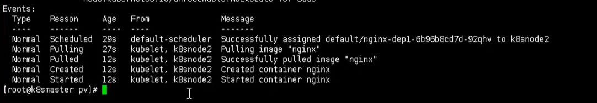

可以看到 pod 已经成功创建出来了，同时下图也是出于Running状态


下面就可以进行测试了，比如现在 NFS 服务节点上添加数据，然后在看数据是否存在 pod 中

```bash
# 进入pod中查看
kubectl exec -it nginx-dep1 bash
```


## PV 和 PVC

​	PV（Persistent Volume）是持久化卷的意思，是对底层的共享存储的一种抽象。一般情况下 PV 由 Kubernetes 管理员进行创建和配置，它与底层具体的共享存储技术有关，并通过插件完成与共享存储的对接，对外提供可以调用的地方【生产者】

​	PVC（Persistent Volume Claim）是持久卷声明的意思，是用户对于存储需求的一种声明。换句话说，PVC其实就是用户向 Kubernetes 系统发出的一种资源需求申请，不需要关心内部实现细节【消费者】

​	PV 和 PVC 使得 K8S 集群具备了存储的逻辑抽象能力。使得在配置Pod的逻辑里可以忽略对实际后台存储技术的配置，而把这项配置的工作交给 PV 的配置者，即集群的管理者。存储的 PV 和 PVC 的这种关系，跟计算的 Node 和 Pod 的关系是非常类似的； PV 和 Node 是资源的提供者，根据集群的基础设施变化而变化，由 K8s 集群管理员配置；而 PVC 和Pod是资源的使用者，根据业务服务的需求变化而变化，由 K8s 集群的使用者即服务的管理员来配置

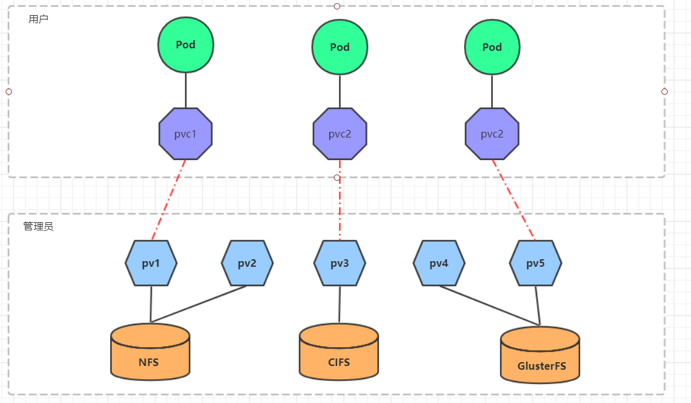

### PV

​	作为存储资源，主要包括存储能力、访问模式、存储类型、回收策略、后端存储类型等关键信息的设置

- 静态制备
  集群管理员创建若干 PV 卷。这些卷对象带有真实存储的细节信息， 并且对集群用户可用（可见）。PV 卷对象存在于 Kubernetes API 中，可供用户消费（使用）
- 动态制备
  如果管理员所创建的所有静态 PV 卷都无法与用户的 PersistentVolumeClaim 匹配， 集群可以尝试为该 PVC 申领动态制备一个存储卷。 这一制备操作是基于 StorageClass 来实现的：PVC 申领必须请求某个 存储类， 同时集群管理员必须已经创建并配置了该类，这样动态制备卷的动作才会发生。 如果 PVC 申领指定存储类为 “”，则相当于为自身禁止使用动态制备的卷

```yaml
apiVersion: v1
kind: PersistentVolume
metadata:
  name: pv_gar
  labels:
    type: local
spec:
  nfs: # 存储类型，和底层的存储对应
    path: /root/data/pv_gar
    server: 192.168.5.9
  # hostPath:
  #   path: "/data/mysql"
  capacity: # 存储能力，目前只支持存储空间的设置
    storage: 2Gi
  accessModes: # 访问模式
    - ReadWriteMany
  storageClassName: manual	# 存储类别
  persistentVolumeReclaimPolicy: Retain	# 回收策略
```

- 访问模式（accessModes）

  - 用于描述用户应用对存储资源的访问权限，访问权限包括下面几种方式
    - ReadWriteOnce（RWO）：读写权限，但是只能被单个节点挂载
    - ReadOnlyMany（ROX）： 只读权限，可以被多个节点挂载
    - ReadWriteMany（RWX）：读写权限，可以被多个节点挂载
    - ReadWriteOncePod（RWOP）：卷可以被单个 Pod 以读写方式挂载。 如果想确保整个集群中只有一个 Pod 可以读取或写入该 PVC， 请使用 ReadWriteOncePod 访问模式。这只支持 CSI 卷以及需要 Kubernetes 1.22 以上版本

- 回收策略（persistentVolumeReclaimPolicy）

  当用户不再使用其存储卷时，可以从 API 中将 PVC 对象删除， 从而允许该资源被回收再利用。PersistentVolume 对象的回收策略告诉集群， 当其被从申领中释放时如何处理该数据卷。 目前，数据卷可以被 Retained（保留）、Recycled（回收）或 Deleted（删除）

  - Retain （保留） 保留数据，需要管理员手工清理数据，当 PersistentVolumeClaim 对象被删除时，PersistentVolume 卷仍然存在，对应的数据卷被视为"已释放（released）"

    - 删除 PersistentVolume 对象。与之相关的、位于外部基础设施中的存储资产 （例如 AWS EBS、GCE PD、Azure Disk 或 Cinder 卷）在 PV 删除之后仍然存在

    - 根据情况，手动清除所关联的存储资产上的数据
    - 手动删除所关联的存储资产
      如果希望重用该存储资产，可以基于存储资产的定义创建新的 PersistentVolume 卷对象

  - Recycle（回收） 清除 PV 中的数据，效果相当于执行 rm -rf /thevolume/*

    > 警告： 回收策略 Recycle 已被废弃。取而代之的建议方案是使用动态供应（制备）

  - Delete （删除） 

    对于支持 Delete 回收策略的卷插件，删除动作会将 PersistentVolume 对象从 Kubernetes 中移除，同时也会从外部基础设施（如 AWS EBS、GCE PD、Azure Disk 或 Cinder 卷）中移除所关联的存储资产。 动态制备的卷会继承其 StorageClass 中设置的回收策略， 该策略默认为 Delete。管理员需要根据用户的期望来配置 StorageClass； 否则 PV 卷被创建之后必须要被编辑或者修补

- 状态（status）

  某个 PV 在生命周期中可能处于以下4个阶段（Phaes）之一

  ​	◎ Available：可用状态，还未与某个PVC绑定
  ​	◎ Bound：已与某个 PVC 绑定
  ​	◎ Released：绑定的 PVC 已经删除，资源已释放，但没有被集群回收
  ​	◎ Failed：自动资源回收失败
  
- finalizer

  可以在 PersistentVolume 上添加终结器（Finalizer）， 以确保只有在删除对应的存储后才删除具有 Delete 回收策略的 PersistentVolume

  新引入的 kubernetes.io/pv-controller 和 external-provisioner.volume.kubernetes.io/finalizer 终结器仅会被添加到动态制备的卷上

  ```bash
  kubectl describe pv pvc-74a498d6-3929-47e8-8c02-078c1ece4d78
  Name:            pvc-74a498d6-3929-47e8-8c02-078c1ece4d78
  Labels:          <none>
  Annotations:     kubernetes.io/createdby: vsphere-volume-dynamic-provisioner
                   pv.kubernetes.io/bound-by-controller: yes
                   pv.kubernetes.io/provisioned-by: kubernetes.io/vsphere-volume
  Finalizers:      [kubernetes.io/pv-protection kubernetes.io/pv-controller]
  StorageClass:    vcp-sc
  Status:          Bound
  Claim:           default/vcp-pvc-1
  Reclaim Policy:  Delete
  Access Modes:    RWO
  VolumeMode:      Filesystem
  Capacity:        1Gi
  Node Affinity:   <none>
  ...
  ```

​	每个 PV 对象都包含 spec 部分和 status 部分，分别对应卷的规约和状态。 PersistentVolume 对象的名称必须是合法的 DNS 子域名

​	针对 PV 持久卷，Kubernetes 支持两种卷模式（volumeModes）：Filesystem（文件系统） 和 Block（块）。 volumeMode 是一个可选的 API 参数。 如果该参数被省略，默认的卷模式是 Filesystem。 volumeMode 属性设置为 Filesystem 的卷会被 Pod 挂载（Mount） 到某个目录。 如果卷的存储来自某块设备而该设备目前为空，Kuberneretes 会在第一次挂载卷之前在设备上创建文件系统

​	将 volumeMode 设置为 Block，以便将卷作为原始块设备来使用。 这类卷以块设备的方式交给 Pod 使用，其上没有任何文件系统。 这种模式对于为 Pod 提供一种使用最快可能方式来访问卷而言很有帮助， Pod 和卷之间不存在文件系统层。另外，Pod 中运行的应用必须知道如何处理原始块设备

**访问控制**

​	使用组 ID（GID）配置的存储仅允许 Pod 使用相同的 GID 进行写入。 GID 不匹配或缺失将会导致无权访问错误。 为了减少与用户的协调，管理员可以对 PersistentVolume 添加 GID 注解。 这样 GID 就能自动添加到使用 PersistentVolume 的任何 Pod 中
```yaml
apiVersion: v1
kind: PersistentVolume
metadata:
  name: pv_gardenia
  annotations:
    pv.beta.kubernetes.io/gid: "gardenia"
```

​	当 Pod 使用带有 GID 注解的 PersistentVolume 时，注解的 GID 会被应用于 Pod 中的所有容器， 应用的方法与 Pod 的安全上下文中指定的 GID 相同。 每个 GID，无论是来自 PersistentVolume 注解还是来自 Pod 规约，都会被应用于每个容器中运行的第一个进程

说明： 当 Pod 使用 PersistentVolume 时，与 PersistentVolume 关联的 GID 不会在 Pod 资源本身的对象上出现


### PVC

​	资源的申请，用来声明对存储空间、访问模式、存储类别需求信息

```yaml
apiVersion: v1
kind: PersistentVolumeClaim
metadata:
  name: pvc_gar
  namespace: dev
spec:
  selector:
    matchLabels:
      release: "stable"
    matchExpressions:
      - {key: environment, operator: In, values: [dev]}
  accessModes: # 访问模式
    - ReadWriteOnce
  storageClassName: slow # 存储类别
  resources: # 请求空间
    requests:
      storage: 9Gi
```

> 这里申请的大小需要注意，申请的存储卷大小需要等于或小于当前系统中空闲的存储卷大小，以本文为例，前面创建了 1G/2G/3G 三个 PV 实例，都还没用，都是空闲的。但是这里申请的存储空间大小为 8 G，所以是无法被匹配的

#### **预留 PersistentVolume**

​	控制平面可以在集群中将 PersistentVolumeClaims 绑定到匹配的 PersistentVolumes。 但是，如果希望 PVC 绑定到特定 PV，则需要预先绑定它们

​	通过在 PersistentVolumeClaim 中指定 PersistentVolume，可以声明该特定 PV 与 PVC 之间的绑定关系。如果该 PersistentVolume 存在且未被通过其 claimRef 字段预留给 PersistentVolumeClaim，则该 PersistentVolume 会和该 PersistentVolumeClaim 绑定到一起

​	绑定操作不会考虑某些卷匹配条件是否满足，包括节点亲和性等等。 控制面仍然会检查存储类、 访问模式和所请求的存储尺寸都是合法的
```yaml
apiVersion: v1
kind: PersistentVolumeClaim
metadata:
  name: gardenia-pvc
  namespace: gardenia
spec:
  storageClassName: ""	# 此处须显式设置空字符串，否则会被设置为默认的 StorageClass
  volumeName: gardenia-pv
  ...
```

​	此方法无法对 PersistentVolume 的绑定特权做出任何形式的保证。 如果有其他 PersistentVolumeClaim 可以使用所指定的 PV， 则应该首先预留该存储卷。可以将 PV 的 claimRef 字段设置为相关的 PersistentVolumeClaim 以确保其他 PVC 不会绑定到该 PV 卷
```yaml
apiVersion: v1
kind: PersistentVolume
metadata:
  name: gardenia-pv
spec:
  storageClassName: ""
  claimRef:
    name: gardenia-pvc
    namespace: gardenia
  ...
```

如果想要使用 claimPolicy 属性设置为 Retain 的 PersistentVolume 卷时， 包括希望复用现有的 PV 卷时，这点是很有用的


### 挂载

#### 🌰

```yaml
apiVersion: v1
kind: Pod
metadata:
  name: pod1
  namespace: dev
spec:
  containers:
  - name: busybox
    image: busybox:1.30
    command: ["/bin/sh","-c","while true;do echo pod1 >> /root/out.txt; sleep 10; done;"]
    volumeMounts:
    - name: volume
      mountPath: /root/
  volumes:
    - name: volume
      persistentVolumeClaim:
        claimName: pvc_gar
        readOnly: false
```

​	PVC 和 PV 都受限于Namespace， PVC 在选择 PV 时受到Namespace的限制，只有相同Namespace中的 PV 才可能与 PVC 绑定。Pod 在引用 PVC 时同样受Namespace的限制，只有相同Namespace中的 PVC 才能挂载到 Pod 内

​	当 Selector 和 Class 都进行了设置时，系统将选择两个条件同时满足的 PV 与之匹配另外，如果资源供应使用的是动态模式，即管理员没有预先定义 PV ，仅通过 StorageClass 交给系统自动完成 PV 的动态创建，那么 PVC 再设定 Selector 时，系统将无法为其供应任何存储资源

​	在启用动态供应模式的情况下，一旦用户删除了 PVC ，与之绑定的 PV 也将根据其默认的回收策略“Delete”被删除。如果需要保留 PV （用户数据），则在动态绑定成功后，用户需要将系统自动生成 PV 的回收策略从“Delete”改成“Retain”

​	可以通过下面命令，查看的 pv  和 pvc之间的绑定关系

```bash
kubectl get pv, pvc
```

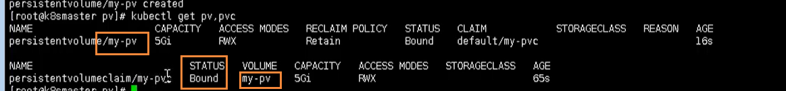

到这里为止，就完成了 pv 和 pvc 的绑定操作，通过之前的方式，进入 pod 中查看内容

```bash
kubect exec -it nginx-dep1 bash
```

然后查看  /usr/share/nginx.html

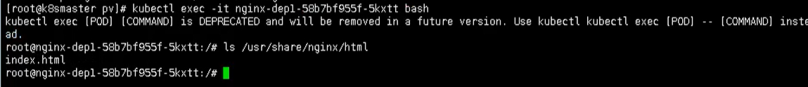

也同样能看到刚刚的内容，其实这种操作和之前的 nfs 是一样的，只是多了一层 pvc 绑定 pv 的操作

#### 🌰

```yaml
apiVersion: v1
kind: Pod
metadata:
  name: test
spec:
  containers:
    - name: test
      image: nginx
      volumeMounts:
        # 网站数据挂载
        - name: config
          mountPath: /usr/share/nginx/html
          subPath: html
        # Nginx 配置挂载
        - name: config
          mountPath: /etc/nginx/nginx.conf
          subPath: nginx.conf
  volumes:
    - name: config
      persistentVolumeClaim:
        claimName: test-nfs-claim
```


### 生命周期

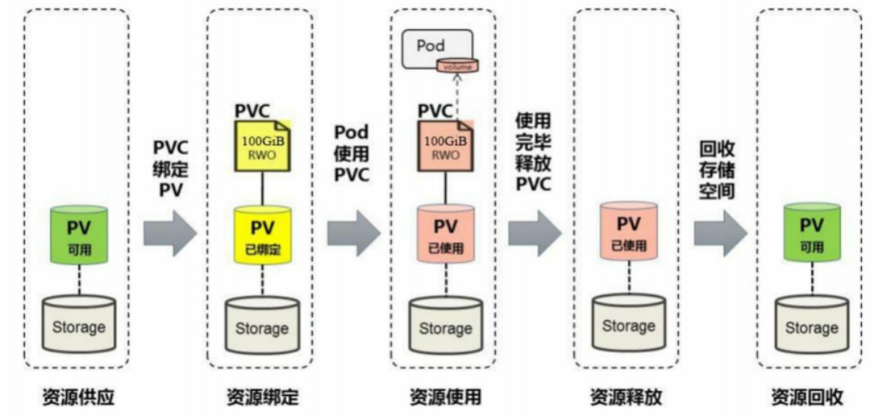

Kubernetes 支持两种资源的供应模式：静态模式（Static）和动态模式（Dynamic） 资源供应的结果就是创建好的 PV
	◎ 静态模式：集群管理员手工创建许多PV，在定义PV时需要将后端存储的特性进行设置
	◎ 动态模式：集群管理员无须手工创建PV，而是通过StorageClass的设置对后端存储进行描述，标记为某种类型

​	此时要求PVC对存储的类型进行声明，系统将自动完成PV的创建及与PVC的绑定。PVC可以声明Class为""，说明该PVC禁止使用动态模式

静态资源供应模式下的 PV 和 PVC 原理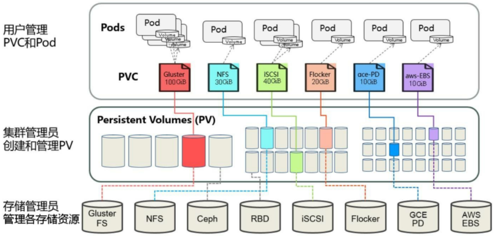

动态资源供应模式下，通过 StorageClass 和 PVC 完成资源动态绑定（系统自动生成PV），并供Pod使用的存储管理机制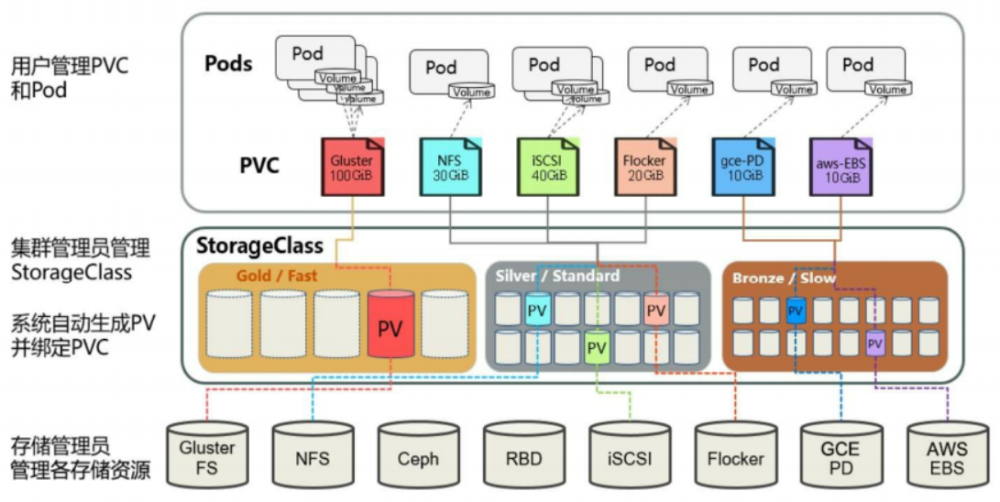

​	在 Kubernetes 中，实际上存在着一个专门处理持久化存储的控制器，叫作 Volume Controller。这个 Volume Controller 维护着多个控制循环，其中有一个循环，扮演的就是撮合 PV 和 PVC 的“红娘”的角色。它的名字叫作 PersistentVolumeController

​	PersistentVolumeController 会不断地查看当前每一个 PVC，是不是已经处于 Bound（已绑定）状态。如果不是，那它就会遍历所有的、可用的 PV，并尝试将其与这个“单身”的 PVC 进行绑定。这样，Kubernetes 就可以保证用户提交的每一个 PVC，只要有合适的 PV 出现，它就能够很快进入绑定状态，从而结束“单身”之旅。而所谓将一个 PV 与 PVC 进行“绑定”，其实就是将这个 PV 对象的名字，填在了 PVC 对象的 spec.volumeName 字段上。所以，接下来 Kubernetes 只要获取到这个 PVC 对象，就一定能够找到它所绑定的 PV

​	保护使用中的存储对象（Storage Object in Use Protection） 这一功能特性的目的是确保仍被 Pod 使用的 PersistentVolumeClaim（PVC） 对象及其所绑定的 PersistentVolume（PV）对象在系统中不会被删除，因为这样做可能会引起数据丢失

​	说明： 当使用某 PVC 的 Pod 对象仍然存在时，认为该 PVC 仍被此 Pod 使用
​	如果用户删除被某 Pod 使用的 PVC 对象，该 PVC 申领不会被立即移除。 PVC 对象的移除会被推迟，直至其不再被任何 Pod 使用。 此外，如果管理员删除已绑定到某 PVC 申领的 PV 卷，该 PV 卷也不会被立即移除。 PV 对象的移除也要推迟到该 PV 不再绑定到 PVC

### 回


<hr>


## Secret

​	在 Kubernetes 中，还存在一种和 ConfigMap 非常类似的对象，称为 Secret 对象。它主要用于存储敏感信息，例如密码、秘钥、证书等等。这样的信息可能会被放在 Pod 规约中或者镜像中。 用户可以创建 Secret，同时系统也创建了一些 Secret

​	Secret 的主要作用就是加密数据，然后存在 etcd 里面，让 Pod 容器以挂载 Volume 方式进行访问

​	Secret 三种使用方式
​		◎ 作为挂载到一个或多个容器上的 卷 中的文件
​		◎ 作为容器的环境变量
​		◎ 由 kubelet 在为 Pod 拉取镜像时使用

一般场景的是对某个字符串进行 base64 编码 进行加密

```bash
echo -n 'admin' | base64
# 解码
echo 'MWYyZDFlMmU2N2Rm' | base64 --decode
```

### Kubectl 创建 Secret

```bash
# 创建本例中要使用的文件
echo -n 'gardenia' > ./username.txt
echo -n '1f2d1e2e67df' > ./password.txt

# 第一种
# kubectl create secret 命令将这些文件打包到一个 Secret 中并在 API server 中创建了一个对象。 Secret 对象的名称必须是合法的 DNS 子域名
kubectl create secret generic db-user-pass --from-file=./username.txt --from-file=./password.txt

# 默认的键名是文件名	也可以使用 [--from-file=[key=]source] 参数来设置键名
# 第二种
kubectl create secret generic db-user-pass \
  --from-file=username=./username.txt \
  --from-file=password=./password.txt

# 第三种
kubectl create secret generic dev-db-secret \
  --from-literal=username=devuser \
  --from-literal=password='S!B\*d$zDsb='

kubectl get secrets
kubectl describe secrets/db-user-pass
```

> 特殊字符（例如 $、\、*、= 和 !）可能会被 Shell 解析，因此需要转义。 在大多数 Shell 中，对密码进行转义的最简单方式是使用单引号（’）将其扩起来。
> 无需对文件中保存（–from-file）的密码中的特殊字符执行转义操作

### StringData

此字段允许您将非 base64 编码的字符串直接放入 Secret 中， 并且在创建或更新 Secret 时将为您编码该字符串

```yaml
apiVersion: v1
kind: Secret
metadata:
  name: mysecret
type: Opaque
stringData:
  config.yaml: |-
    apiUrl: "https://api.gardenia.com/api/v1"
    username: {{username}}
    password: {{password}}
```

```bash
kubectl get secret mysecret -o yaml
```

> 如果在 data 和 stringData 中都指定了某一字段，则使用 stringData 中的值
> data 和 stringData 的键必须由字母数字字符 ‘-’, ‘_’ 或者 ‘.’ 组成

> **从生成器创建 Secret**
> 	Kubectl 从 1.14 版本开始支持使用 Kustomize 管理对象。 Kustomize 提供资源生成器创建 Secret 和 ConfigMaps。 Kustomize 生成器要在当前目录内的 kustomization.yaml 中指定。 生成 Secret 之后，使用 kubectl apply 在 API 服务器上创建对象。

### 从文件生成 Secret

```bash
cat <EOF > ./kustomization.yaml
secretGenerator:
- name: db-user-pass
  files:
  - username.txt
  - password.txt
EOF
```

```bash
kubectl apply -k .
kubectl get secrets
```

### 基于字符串值创建 Secret

```bash
cat << EOF > kustomization.yaml
secretGenerator:
- name: db-user-pass
  literals:
  - username=gardenia
  - password=151613
EOF
```

```bash
kubectl apply -k .
kubectl get secret mysecret -o yaml
```

### 变量形式挂载到 Pod

```yaml
apiVersion: v1
kind: Pod
metadata:
  name: mypod
spec:
  containers:
  - name: mypod
    image: redis
    volumeMounts:
    - name: gardenia
      mountPath: "/etc/gardenia"
      readOnly: true
  volumes:
  - name: gardenia
    secret:
      secretName: mysecret
      items:
      - key: username
        path: my-group/my-username
```


```bash
kubectl create -f secret.yaml
# 进入到的容器内部
kubectl exec -it mypod bash

# 输出用户
echo $SECRET_USERNAME
# 输出密码
echo $SECRET_PASSWORD

kubectl delete -f secret-val.yaml
```

### 数据卷形式挂载

```yaml
apiVersion: v1
kind: Pod
metadata:
  name: gardeniaPod
spec:
  containers:
  - name: nginx
    image: nginx
    volumeMounts:
    - name: foo
      mountPath: "/etc/foo"
      readOnly: true
  volumes:
  - name: foo
    secret:
      secretName: mysecret
```

```bash
# 根据配置创建容器
kubectl apply -f secret-val.yaml
# 进入容器
kubectl exec -it mypod bash
# 查看
ls /etc/foo
```

### 环境变量形式 挂载

将 Secret 作为 Pod 中的环境变量使用

1. 创建一个 Secret 或者使用一个已存在的 Secret         多个 Pod 可以引用同一个 Secret
2. 修改 Pod 定义，为每个要使用 Secret 的容器添加对应 Secret 键的环境变量
   使用 Secret 键的环境变量应在 `env[x].valueFrom.secretKeyRef` 中指定 要包含的 Secret 名称和键名
3. 更改镜像并／或者命令行，以便程序在指定的环境变量中查找值

```yaml
apiVersion: v1
kind: Pod
metadata:
  name: secret-env-pod
spec:
  containers:
  - name: mycontainer
    image: redis
    env:
      - name: SECRET_USERNAME
        valueFrom:
          secretKeyRef:
            name: mysecret
            key: username
      - name: SECRET_PASSWORD
        valueFrom:
          secretKeyRef:
            name: mysecret
            key: password
  restartPolicy: Never
```

```bash
echo $SECRET_USERNAME
```


### Secret 文件权限

指定 Secret 将拥有的权限模式位。如果不指定，默认使用 0644

```yaml
apiVersion: v1
kind: Pod
metadata:
  name: mypod
spec:
  containers:
  - name: mypod
    image: redis
    volumeMounts:
    - name: foo
      mountPath: "/etc/foo"
  volumes:
  - name: foo
    secret:
      secretName: mysecret
      defaultMode: 256
---
      items:
      - key: username
        path: my-group/my-username
        mode: 511
```

> Secret 将被挂载到 /etc/foo 目录，而所有通过该 Secret 卷挂载 所创建的文件的权限都是 0400
>
> 256的八进制表示是0400
> 0400 = 0 (其他用户没有任何权限) + 4 (文件所属组有读权限) + 0 (文件所有者没有任何权限) + 0 (特殊权限位)
>
> 位于 /etc/foo/my-group/my-username 的文件的权限值为 0777。 由于 JSON 限制，必须以十进制格式指定模式，即 511

### 挂载的 Secret 自动更新

​	当已经存储于卷中被使用的 Secret 被更新时，被映射的键也将终将被更新。 组件 kubelet 在周期性同步时检查被挂载的 Secret 是不是最新的。 但是，它会使用其本地缓存的数值作为 Secret 的当前值

​	通过将 Secret 标记为不可变来关闭 kube-apiserver 对其的监视，从而显著降低 kube-apiserver 的负载，提升集群性能。
使用这个特性需要启用 ImmutableEmphemeralVolumes 特性开关 并将 Secret 或 ConfigMap 的 immutable 字段设置为 true

```yaml
apiVersion: v1
kind: Secret
metadata:
  ...
data:
  ...
immutable: true
```

​	一旦一个 Secret 或 ConfigMap 被标记为不可变，撤销此操作或者更改 data 字段的内容都是 不可能的。 只能删除并重新创建这个 Secret。现有的 Pod 将维持对已删除 Secret 的挂载点 - 建议重新创建这些 Pod

<hr>

## ConfigMap

​	ConfigMap 作用是存储不加密的数据到 etcd 中，让 Pod 以变量或数据卷 Volume 挂载到容器中，一个或多个 `key/value` 的形式保存在 k8s 中，内部可以管理变量也可以管理完整的配置文件内容

### 🌷 例

配置文件 `redis.properties`

```bash
redis.port=127.0.0.1
redis.port=6379
redis.password=123456
```

**创建 ConfigMap**

```bash
kubectl create configmap redis-config --from-file=redis.properties
```

```yaml
# Or
apiVersion: v1
kind: ConfigMap
metadata:
  name: redis-config
  namespace: dev
data:
  info: |
    redis.port=127.0.0.1
    redis.port=6379
    redis.password=123456
```

```bash
kubectl describe cm redis-config
```

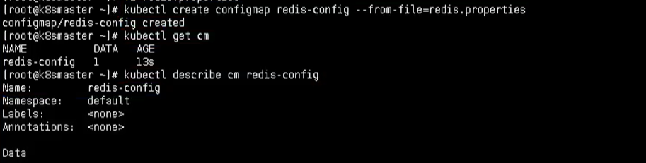

### **Volume 数据卷形式挂载**

```yaml
apiversion: vl
kind: Pod
metadata :
  name: pod-configmap
spec:
  containers :
  - name: busybox
    image: busybox
    command: ["/bin/sh", "-c", "cat /etc/config/redis.properties"]
    volumeMounts :
    - name: config-volume
      mountPath: /etc/config
  volumes :
  - name: config-volume
    configMap:
      name: redis-config
      items:
      - key: key-serverxml
        path: server.xml
      - key: key-loggingproperties
        path: logging.properties
  restartPolicy: Never
```

```bash
# 创建
kubectl apply -f busybox.yaml
# 查看
kubectl get pods
```

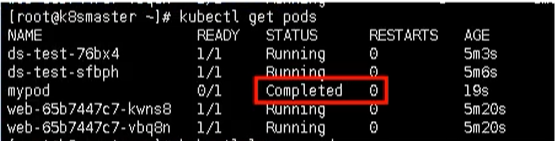

最后通过命令就可以查看结果输出了

```bash
kubectl logs mypod
```

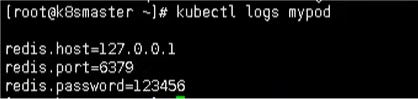

### **变量的形式挂载 Pod**

```yaml
apiversion: v1
kind: ConfigMap
metadata:
  name: myconfig
  namespace: default
data:
  special.level: info
  special.type: gardenia
```

```bash
# 创建pod
kubectl apply -f myconfig.yaml
# 获取
kubectl get cm
```

使用配置信息

```yaml
apiversion: v1
kind: Pod
metadata:
  name: mypod
spec:
  containers:
  - name: busybox
    image: busybox
    command: ["/bin/sh", "-c", "echo $(LEVEL) $(TYPE)"]
    env:
    - name: LEVEL
      valueFrom:
        configMapKeyRef:
          name: myconfig
          key: special.level
    - name: TYPE
      valueFrom:
        configMapKeyRef:
          name: myconfig
          key: special.type
  restartPolicy: Never
```

```bash
kubectl logs mypod
```

### envFrom

​	Kubernetes 从 1.6 版本开始引入了一个新字段：envFrom，实现了在 Pod 环境中将 ConfigMap（Secret 也可以） 中所有定义的 key=value 自动生成环境变量

```yaml
apiVersion: v1
kind: Pod
metadate:
  name: cm-test-pod
spec:
  containers:
  - name: cm-test
    image: busybox
    command: [ "/bin/sh", "-c", "env | grep APP" ]
    envFrom:
    - configMapRef:
      name: cm-appvars	# 根据 cm-appvars 中的 key=value 自动生成环境变量
```

​	环境变量的命名受 POSIX 命名规范约束，不能以数字开头。如果包含非法字符，系统将跳过该条件变量的创建，并记录一个 event 来提示环境变量无法生成，但不阻止 Pod 的启动


## **StorageClass**

​	尽管 PersistentVolumeClaim 允许用户消耗抽象的存储资源， 常见的情况是针对不同的问题用户需要的是具有不同属性（如，性能）的 PersistentVolume 卷。 集群管理员需要能够提供不同性质的 PersistentVolume， 并且这些 PV 卷之间的差别不仅限于卷大小和访问模式，同时又不能将卷是如何实现的这些细节暴露给用户。 为了满足这类需求，就有了 存储类（StorageClass） 资源

​	StorageClass 为管理员提供了描述存储 “类” 的方法。 不同的类型可能会映射到不同的服务质量等级或备份策略，或是由集群管理员制定的任意策略。 Kubernetes 本身并不清楚各种类代表的什么。这个类的概念在其他存储系统中有时被称为 “配置文件”

```yaml
apiVersion: storage.k8s.io/v1
kind: StorageClass
metadata:
  name: standard
provisioner: kubernetes.io/aws-ebs
parameters:
  type: gp2
reclaimPolicy: Retain
allowVolumeExpansion: true
mountOptions:
  - debug
volumeBindingMode: Immediate
```

​	每个 StorageClass 都包含 provisioner、parameters 和 reclaimPolicy 字段， 这些字段会在 StorageClass 需要动态分配 PersistentVolume 时会使用到。

​	StorageClass 对象的命名很重要，用户使用这个命名来请求生成一个特定的类。 当创建 StorageClass 对象时，管理员设置 StorageClass 对象的命名和其他参数，一旦创建了对象就不能再对其更新。

​	管理员可以为没有申请绑定到特定 StorageClass 的 PVC 指定一个默认的存储类。

​	由 StorageClass 动态创建的 PersistentVolume 会在类的 reclaimPolicy 字段中指定回收策略，可以是 Delete 或者 Retain。如果 StorageClass 对象被创建时没有指定 reclaimPolicy，它将默认为 Delete。

​	由 StorageClass 动态创建的 PersistentVolume 将使用类中 mountOptions 字段指定的挂载选项。

​	如果卷插件不支持挂载选项，却指定了挂载选项，则制备操作会失败。 挂载选项在 StorageClass 和 PV 上都不会做验证，如果其中一个挂载选项无效，那么这个 PV 挂载操作就会失败。

​	volumeBindingMode 字段控制了卷绑定和动态制备应该发生在什么时候。

​	默认情况下，Immediate 模式表示一旦创建了 PersistentVolumeClaim 也就完成了卷绑定和动态制备。 对于由于拓扑限制而非集群所有节点可达的存储后端，PersistentVolume 会在不知道 Pod 调度要求的情况下绑定或者制备。

​	集群管理员可以通过指定 WaitForFirstConsumer 模式来解决此问题。 该模式将延迟 PersistentVolume 的绑定和制备，直到使用该 PersistentVolumeClaim 的 Pod 被创建。 PersistentVolume 会根据 Pod 调度约束指定的拓扑来选择或制备。 这些包括但不限于资源需求、 节点筛选器、 Pod 亲和性和互斥性、 以及污点和容忍度。

​	如果选择使用 WaitForFirstConsumer，请不要在 Pod 规约中使用 nodeName 来指定节点亲和性。 如果在这种情况下使用 nodeName，Pod 将会绕过调度程序，PVC 将停留在 pending 状态。

​	在这种情况下，可以使用节点选择器作为主机名

```yaml
apiVersion: v1
kind: Pod
metadata:
  name: task-pv-pod
spec:
  nodeSelector:
    kubernetes.io/hostname: kube-01
  volumes:
    - name: task-pv-storage
      persistentVolumeClaim:
        claimName: task-pv-claim
  containers:
    - name: task-pv-container
      image: nginx
      ports:
        - containerPort: 80
          name: "http-server"
      volumeMounts:
        - mountPath: "/usr/share/nginx/html"
          name: task-pv-storage
```


### 配置默认存储类

通过下面命令，查看Kubernetes集群中的默认存储类

```bash
kubectl get storageclass
```

发现空空如也，所以问题应该就出现在这里了~，下面给 k8s 集群安装上默认的存储类

### 安装 nfs

使用的是 `nfs` 来作为 `k8s` 的存储类

首先找一台新的服务器，作为nfs服务端，然后进行 nfs的安装 【服务器：192.168.177.141】

然后使用命令安装nfs

```bash
yum install -y nfs-utils
```

首先创建存放数据的目录

```bash
mkdir -p /data/k8s
```

设置挂载路径

```bash
# 打开文件
vim /etc/exports
# 添加如下内容
/data/k8s *(rw,no_root_squash)
```

### Node 节点上安装

然后需要在k8s集群node节点上安装nfs，这里需要在 node1 和 node2节点上安装

```bash
yum install -y nfs-utils
```

执行完成后，会自动帮挂载上

### 启动 NFS

在node节点上配置完成后，就接着到刚刚nfs服务器，启动的nfs

```bahs
systemctl start nfs
```

### 配置 StorageClass

要使用StorageClass，就得安装对应的自动配置程序，比如上面使用的是nfs，那么就需要使用到一个 nfs-client 的自动配置程序，也叫它 Provisioner，这个程序使用已经配置的nfs服务器，来自动创建持久卷，也就是自动帮创建PV

```bash
自动创建的 PV 以${namespace}-${pvcName}-${pvName}这样的命名格式创建在 NFS 服务器上的共享数据目录中
而当这个 PV 被回收后会以archieved-${namespace}-${pvcName}-${pvName}这样的命名格式存在 NFS 服务器上。
```

当然在部署nfs-client之前，需要先成功安装上 nfs 服务器，上面已经安装好了，服务地址是192.168.177.141，共享数据目录是/data/k8s/，然后接下来部署 nfs-client 即可，也可以直接参考 [nfs-client 文档](https://github.com/kubernetes-incubator/external-storage/tree/master/nfs-client)，进行安装即可。

### 配置 Deployment

首先配置 Deployment，将里面的对应的参数替换成自己的 nfs 配置（nfs-client.yaml）

```yaml
kind: Deployment
apiVersion: apps/v1
metadata:
  name: nfs-client-provisioner
spec:
  replicas: 1
  selector:
    matchLabels:
      app: nfs-client-provisioner
  strategy:
    type: Recreate
  template:
    metadata:
      labels:
        app: nfs-client-provisioner
    spec:
      serviceAccountName: nfs-client-provisioner
      containers:
        - name: nfs-client-provisioner
          image: quay.io/external_storage/nfs-client-provisioner:latest
          volumeMounts:
            - name: nfs-client-root
              mountPath: /persistentvolumes
          env:
            - name: PROVISIONER_NAME
              value: fuseim.pri/ifs
            - name: NFS_SERVER
              value: 192.168.177.141
            - name: NFS_PATH
              value: /data/k8s
      volumes:
        - name: nfs-client-root
          nfs:
            server: 192.168.177.141
            path: /data/k8s
```

### 替换配置

将环境变量 NFS_SERVER 和 NFS_PATH 替换，当然也包括下面的 nfs 配置，可以看到这里使用了一个名为 nfs-client-provisioner 的serviceAccount，所以也需要创建一个 sa，然后绑定上对应的权限：（nfs-client-sa.yaml）

```bash
apiVersion: v1
kind: ServiceAccount
metadata:
  name: nfs-client-provisioner

---
kind: ClusterRole
apiVersion: rbac.authorization.k8s.io/v1
metadata:
  name: nfs-client-provisioner-runner
rules:
  - apiGroups: [""]
    resources: ["persistentvolumes"]
    verbs: ["get", "list", "watch", "create", "delete"]
  - apiGroups: [""]
    resources: ["persistentvolumeclaims"]
    verbs: ["get", "list", "watch", "update"]
  - apiGroups: ["storage.k8s.io"]
    resources: ["storageclasses"]
    verbs: ["get", "list", "watch"]
  - apiGroups: [""]
    resources: ["events"]
    verbs: ["list", "watch", "create", "update", "patch"]
  - apiGroups: [""]
    resources: ["endpoints"]
    verbs: ["create", "delete", "get", "list", "watch", "patch", "update"]

---
kind: ClusterRoleBinding
apiVersion: rbac.authorization.k8s.io/v1
metadata:
  name: run-nfs-client-provisioner
subjects:
  - kind: ServiceAccount
    name: nfs-client-provisioner
    namespace: default
roleRef:
  kind: ClusterRole
  name: nfs-client-provisioner-runner
  apiGroup: rbac.authorization.k8s.io
```

这里新建的一个名为 nfs-client-provisioner 的ServiceAccount，然后绑定了一个名为 nfs-client-provisioner-runner 的ClusterRole，而该ClusterRole声明了一些权限，其中就包括对persistentvolumes的增、删、改、查等权限，所以可以利用该ServiceAccount来自动创建 PV。

### 创建 StorageClass 对象

nfs-client 的 Deployment 声明完成后，就可以来创建一个StorageClass对象了：（nfs-client-class.yaml）

```yaml
apiVersion: storage.k8s.io/v1
kind: StorageClass
metadata:
  name: course-nfs-storage
provisioner: fuseim.pri/ifs # or choose another name, must match deployment's env PROVISIONER_NAME'
```

声明了一个名为 course-nfs-storage 的StorageClass对象，注意下面的provisioner对应的值一定要和上面的Deployment下面的 PROVISIONER_NAME 这个环境变量的值一样

```yaml
apiVersion: storage.k8s.io/v1
kind: StorageClass
metadata:
  name: course-nfs-storage
provisioner: fuseim.pri/ifs # or choose another name, must match deployment's env PROVISIONER_NAME'
```

### 创建资源对象

在准备好上述的配置文件后，就可以开始创建的资源对象了

```bash
kubectl create -f nfs-client.yaml
kubectl create -f nfs-client-sa.yaml
kubectl create -f nfs-client-class.yaml
```

创建完成后，使用下面命令来查看资源状态

```bash
kubectl get pods
# 查看存储类
kubectl get storageclass
```

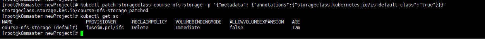

可以设置这个 course-nfs-storage 的 StorageClass 为 Kubernetes 的默认存储后端，可以用 kubectl patch 命令来更新

```bash
kubectl patch storageclass course-nfs-storage -p '{"metadata": {"annotations":{"storageclass.kubernetes.io/is-default-class":"true"}}}'
```

执行完命令后，默认存储类就配置成功了 ~

