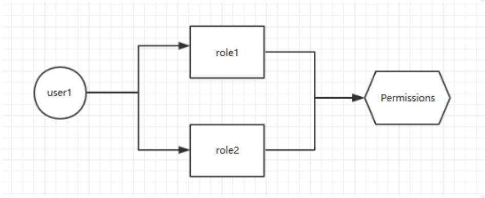
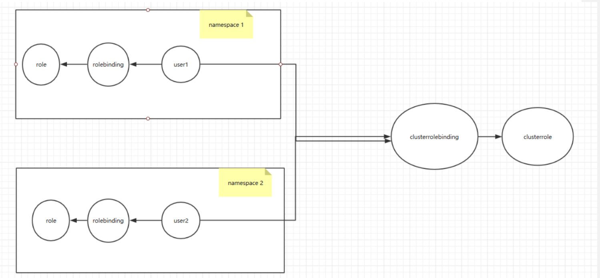
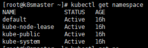
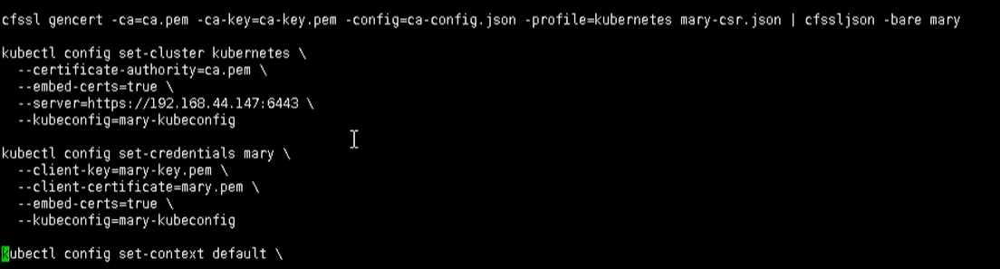

# Kubernetes 集群安全机制

## 概述

访问K8S集群时，需要经过三个步骤完成具体操作

- 认证
- 鉴权【授权】
- 准入控制

进行访问的时候，都需要经过 apiserver， apiserver 做统一协调，如门卫

- 访问过程中，需要证书、token、或者用户名和密码
- 访问 pod 需要 serviceAccount


### 认证

对外不暴露 8080 端口，只能内部访问，对外使用的端口 6443

客户端身份认证常用方式

- https 证书认证，基于ca证书
- http token认证，通过token来识别用户
- http基本认证，用户名 + 密码认证

### 鉴权

基于RBAC进行鉴权操作

基于角色访问控制


## Kube Config 

在 K8S 集群当中，每一个用户对资源的访问都是需要通过 apiserver 进行通信认证才能进行访问的，那么在此机制当中，对资源的访问可以是 token，也可以是通过配置文件的方式进行保存和使用认证信息，可以通过 kubectl config 进行查看配置，如下：

```bash
kubectl config view

apiVersion: v1
clusters:
- cluster:
    certificate-authority-data: DATA+OMITTED
    server: https://192.168.11.139:6443	#apiserver 的地址
  name: kubernetes						#集群的名字
contexts:
- context:
    cluster: kubernetes
    user: kubernetes-admin
  name: kubernetes-admin@kubernetes		#上下文的名字
current-context: kubernetes-admin@kubernetes	#当前上下文的名字
kind: Config
preferences: {}
users:
- name: kubernetes-admin
  user:
    client-certificate-data: REDACTED
    client-key-data: REDACTED
```

​	在上面的配置文件当中，定义了集群、上下文以及用户。其中 Config 也是 K8S 的标准资源之一，在该配置文件当中定义了一个集群列表，指定的集群可以有多个；用户列表也可以有多个，指明集群。而在上下文列表当中，是进行定义可以使用哪个用户对哪个集群进行访问，以及当前使用的上下文是什么

### 授权

​	如果用户通过认证，什么权限都没有，需要一些后续的授权操作，如对资源的增删该查等， kubernetes1.6 之后开始有 RBAC（基于角色的访问控制机制）授权检查机制。 Kubernetes 的授权是基于插件形成的，其常用的授权插件有以下几种：

1）Node（节点认证）

2）ABAC(基于属性的访问控制)

3）RBAC（基于角色的访问控制）

4）Webhook（基于 Http 回调机制的访问控制）

### 准入控制

​	授权检查完成之后的后续的其他安全检查操作，进一步补充了授权机制，由多个插件组合实行，一般而言在创建，删除，修改或者做代理时做补充

​	Kubernetes 的 Admission Control 实际上是一个准入控制器 (Admission Controller)插件列表，发送到 APIServer 的请求都需要经过这个列表中的每个准入控制器插件的检查，如果某一个控制器插件准入失败，就准入失败

**控制器插件**如下：

- AlwaysAdmit：允许所有请求通过
- AlwaysPullImages：在启动容器之前总是去下载镜像，相当于每当容器启动前做一次用于是否有权使用该容器镜像的检查
- AlwaysDeny：禁止所有请求通过，用于测试
- DenyEscalatingExec：拒绝 exec 和 attach 命令到有升级特权的 Pod 的终端用户访问。如果集中包含升级特权的容器，而要限制终端用户在这些容器中执行命令的能力，推荐使用此插件
- ImagePolicyWebhook ServiceAccount：这个插件实现了 serviceAccounts 等等自动化，如果使用 ServiceAccount 对象，强烈推荐使用这个插件
- SecurityContextDeny：将 Pod 定义中定义了的 SecurityContext 选项全部失效
- SecurityContext 包含在容器中定义了操作系统级别的安全选型如 fsGroup，selinux 等选项
- ResourceQuota：用于 namespace 上的配额管理，它会观察进入的请求，确保在 namespace 上的配额不超标。推荐将这个插件放到准入控制器列表的最后一个。ResourceQuota 准入控制器既可以限制某个 namespace 中创建资源的数量，又可以限制某个 namespace 中被 Pod 请求的资源总量。ResourceQuota 准入控制器和 ResourceQuota 资源对象一起可以实现资源配额管理
- LimitRanger：用于 Pod 和容器上的配额管理，它会观察进入的请求，确保 Pod 和容器上的配额不会超标。准入控制器 LimitRanger 和资源对象 LimitRange 一起实现资源限制管理
- NamespaceLifecycle：当一个请求是在一个不存在的 namespace 下创建资源对象时，该请求会被拒绝。当删除一个 namespace 时，将会删除该 namespace 下的所有资源对象


## RBAC 介绍

基于角色的访问控制，角色拥有权限，从而让用户拥有这样的权限，随后在 授权机制当中，只需要将权限授予某个角色，此时用户将获取对应角色的权限，从而实现角色的访问 控制。如图：




​	在 Kubernetes 的授权机制当中，采用 RBAC 的方式进行授权，其工作逻辑是，把对对象的操作权限定义到 一个角色当中，再将用户绑定到该角色，从而使用户得到对应角色的权限。如果通过 rolebinding 绑定 role，只能对 rolebingding 所在的名称空间的资源有权限，上图 user1 这个用户绑定到 role1 上，只对 role1 这个名称空间的资源有权限，对其他名称空间资源没有权限，属于名称空间级别

​	另外， Kubernetes 为此还有一种集群级别的授权机制，就是定义一个集群角色（ClusterRole），对集群内的所有资源都有可操作的权限，从而将 User2 通过 ClusterRoleBinding 到 ClusterRole，从而使 User2 拥有集群的操作权限

Kubernetes 中有默认的几个角色

- role：特定命名空间访问权限
- ClusterRole：所有命名空间的访问权限

角色绑定

- roleBinding：角色绑定到主体
- ClusterRoleBinding：集群角色绑定到主体

主体

- user：用户
- group：用户组
- serviceAccount：服务账号

Role、RoleBinding、ClusterRole 和 ClusterRoleBinding 的关系如下图：




通过上图可以看到，可以通过 rolebinding 绑定 role，rolebinding 绑定 clusterrole， clusterrolebinding 绑定 clusterrole。

上面我们说了两个角色绑定：

（1）用户通过 rolebinding 绑定 role

（2）用户通过 clusterrolebinding 绑定 clusterrole

（3）rolebinding 绑定 clusterrole

> rolebinding 绑定 clusterrole 的好处：
> 假如有 6 个名称空间，每个名称空间的用户都需要对自己的名称空间有管理员权限，那么需要定义6个 role 和 rolebinding，然后依次绑定，如果名称空间更多，需要定义更多的 role，这个是很麻烦的，所以引入 clusterrole，定义一个 clusterrole，对 clusterrole 授予所有权限，然后用户通过 rolebinding 绑定到 clusterrole，就会拥有自己名称空间的管理员权限了
>
> RoleBinding 仅对当前名称空间有对应的权限


## RBAC 实现鉴权


### 创建命名空间

可以首先查看已经存在的命名空间

```bash
kubectl get namespace
```



然后创建一个自己的命名空间  roledemo

```bash
kubectl create ns roledemo
```

### 命名空间创建 Pod

为什么要创建命名空间？因为如果不创建命名空间的话，默认是在 default 下

```bash
kubectl run nginx --image=nginx -n roledemo
```

### 创建角色

通过 rbac-role.yaml 进行创建

```yaml
kind: Role
apiversion : rbac.authorization.k8s.io/v1
metadata:
  namespace: ctnrs
  name: pod-reader
rules :
- apiGroups: [""]
  resources: ["pods"]
  verbs: ["get", "watch", "list"]
```

tip：这个角色只对 pod 有 get、list 权限

然后通过 yaml 创建的 role

```bash
# 创建
kubectl apply -f rbac-role.yaml
# 查看
kubectl get role -n roledemo
```


### 创建角色绑定

还是通过 role-rolebinding.yaml 的方式，来创建 角色绑定

```yaml
kind : RoleBinding
apiversion : rbac.authorization.k8s.io/v1
metadata :
  name: read-pods
  namespace: roletest
subjects :
- kind : User
  nane: lucy
  apiGroup: rbac.authorization.k8s.io
roleRef:
  kind: Role
  name: pod-reader
  apiGroup: rbac.authorization.k8s.io
```


然后创建 角色绑定

```bash
# 创建角色绑定
kubectl apply -f rbac-rolebinding.yaml
# 查看角色绑定
kubectl get role, rolebinding -n roledemo
```


### 证书识别身份

 rbac-user.sh 证书脚本

```bash
cat > mary-csr.json << EOF
{
    "CN":"mary",
    "hosts" :[],
    "key" : {
        "algo" : "rsa",
        "size" : 2048
    },
    "names":[
        {
        	"C": "CN",
            "L": "Bei]ing",
            "ST": "BeiJing"
        }
    ]
}
EOF
```




这里包含了很多证书文件，在 TSL 目录下，复制过来

通过下面命令执行的脚本

```bash
./rbac-user.sh
```

最后进行测试

```bash
# 用get命令查看 pod 【有权限】
kubectl get pods -n roledemo
# 用get命令查看svc 【没权限】
kubectl get svc -n roledmeo
```

