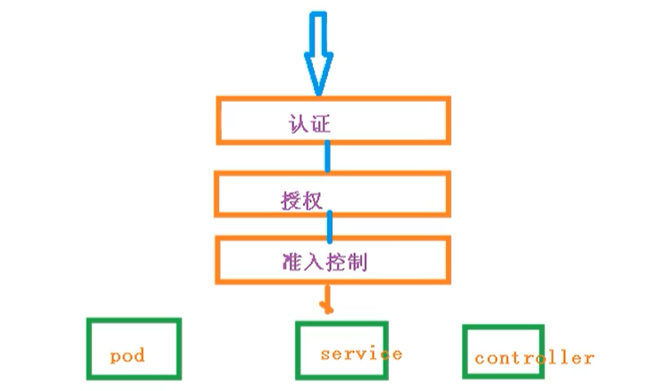

# Kubernetes 集群安全机制

## 概述

访问K8S集群时，需要经过三个步骤完成具体操作

- 认证
- 鉴权【授权】
- 准入控制

进行访问的时候，都需要经过 apiserver， apiserver 做统一协调，如门卫

- 访问过程中，需要证书、token、或者用户名和密码
- 访问 pod 需要 serviceAccount



### 认证

对外不暴露 8080 端口，只能内部访问，对外使用的端口 6443

客户端身份认证常用方式

- https 证书认证，基于ca证书
- http token认证，通过token来识别用户
- http基本认证，用户名 + 密码认证

### 鉴权

基于RBAC进行鉴权操作

基于角色访问控制


## Kube Config 

在 K8S 集群当中，每一个用户对资源的访问都是需要通过 apiserver 进行通信认证才能进行访问的，那么在此机制当中，对资源的访问可以是 token，也可以是通过配置文件的方式进行保存和使用认证信息，可以通过 kubectl config 进行查看配置，如下：

```yaml
kubectl config view

apiVersion: v1
clusters:
- cluster:
    certificate-authority-data: DATA+OMITTED
    server: https://192.168.11.139:6443	#apiserver 的地址
  name: kubernetes						#集群的名字
contexts:
- context:
    cluster: kubernetes
    user: kubernetes-admin
  name: kubernetes-admin@kubernetes		#上下文的名字
current-context: kubernetes-admin@kubernetes	#当前上下文的名字
kind: Config
preferences: {}
users:
- name: kubernetes-admin
  user:
    client-certificate-data: REDACTED
    client-key-data: REDACTED
```

​	在上面的配置文件当中，定义了集群、上下文以及用户。其中 Config 也是 K8S 的标准资源之一，在该配置文件当中定义了一个集群列表，指定的集群可以有多个；用户列表也可以有多个，指明集群。而在上下文列表当中，是进行定义可以使用哪个用户对哪个集群进行访问，以及当前使用的上下文是什么

### 授权

​	如果用户通过认证，什么权限都没有，需要一些后续的授权操作，如对资源的增删该查等， kubernetes1.6 之后开始有 RBAC（基于角色的访问控制机制）授权检查机制。 Kubernetes 的授权是基于插件形成的，其常用的授权插件有以下几种：

1）Node（节点认证）

2）ABAC(基于属性的访问控制)

3）RBAC（基于角色的访问控制）

4）Webhook（基于 Http 回调机制的访问控制）

### 准入控制

​	授权检查完成之后的后续的其他安全检查操作，进一步补充了授权机制，由多个插件组合实行，一般而言在创建，删除，修改或者做代理时做补充

​	Kubernetes 的 Admission Control 实际上是一个准入控制器 (Admission Controller)插件列表，发送到 APIServer 的请求都需要经过这个列表中的每个准入控制器插件的检查，如果某一个控制器插件准入失败，就准入失败

**控制器插件**如下：

- AlwaysAdmit：允许所有请求通过
- AlwaysPullImages：在启动容器之前总是去下载镜像，相当于每当容器启动前做一次用于是否有权使用该容器镜像的检查
- AlwaysDeny：禁止所有请求通过，用于测试
- DenyEscalatingExec：拒绝 exec 和 attach 命令到有升级特权的 Pod 的终端用户访问。如果集中包含升级特权的容器，而要限制终端用户在这些容器中执行命令的能力，推荐使用此插件
- ImagePolicyWebhook ServiceAccount：这个插件实现了 serviceAccounts 等等自动化，如果使用 ServiceAccount 对象，强烈推荐使用这个插件
- SecurityContextDeny：将 Pod 定义中定义了的 SecurityContext 选项全部失效
- SecurityContext 包含在容器中定义了操作系统级别的安全选型如 fsGroup，selinux 等选项
- ResourceQuota：用于 namespace 上的配额管理，它会观察进入的请求，确保在 namespace 上的配额不超标。推荐将这个插件放到准入控制器列表的最后一个。ResourceQuota 准入控制器既可以限制某个 namespace 中创建资源的数量，又可以限制某个 namespace 中被 Pod 请求的资源总量。ResourceQuota 准入控制器和 ResourceQuota 资源对象一起可以实现资源配额管理
- LimitRanger：用于 Pod 和容器上的配额管理，它会观察进入的请求，确保 Pod 和容器上的配额不会超标。准入控制器 LimitRanger 和资源对象 LimitRange 一起实现资源限制管理
- NamespaceLifecycle：当一个请求是在一个不存在的 namespace 下创建资源对象时，该请求会被拒绝。当删除一个 namespace 时，将会删除该 namespace 下的所有资源对象


## RBAC 介绍

基于角色的访问控制，角色拥有权限，从而让用户拥有这样的权限，随后在 授权机制当中，只需要将权限授予某个角色，此时用户将获取对应角色的权限，从而实现角色的访问 控制。如图：


​	在 Kubernetes 的授权机制当中，采用 RBAC 的方式进行授权，其工作逻辑是，把对对象的操作权限定义到 一个角色当中，再将用户绑定到该角色，从而使用户得到对应角色的权限。如果通过 rolebinding 绑定 role，只能对 rolebingding 所在的名称空间的资源有权限，上图 user1 这个用户绑定到 role1 上，只对 role1 这个名称空间的资源有权限，对其他名称空间资源没有权限，属于名称空间级别

​	另外， Kubernetes 为此还有一种集群级别的授权机制，就是定义一个集群角色（ClusterRole），对集群内的所有资源都有可操作的权限，从而将 User2 通过 ClusterRoleBinding 到 ClusterRole，从而使 User2 拥有集群的操作权限

Kubernetes 中有默认的几个角色

- role：特定命名空间访问权限
- ClusterRole：所有命名空间的访问权限

角色绑定

- roleBinding：角色绑定到主体
- ClusterRoleBinding：集群角色绑定到主体

主体

- user：用户
- group：用户组
- serviceAccount：服务账号

Role、RoleBinding、ClusterRole 和 ClusterRoleBinding 的关系如下图：


通过上图可以看到，可以通过 rolebinding 绑定 role，rolebinding 绑定 clusterrole， clusterrolebinding 绑定 clusterrole

上面我们说了两个角色绑定：

（1）用户通过 rolebinding 绑定 role

（2）用户通过 clusterrolebinding 绑定 clusterrole

（3）rolebinding 绑定 clusterrole

> rolebinding 绑定 clusterrole 的好处：
> 假如有 6 个名称空间，每个名称空间的用户都需要对自己的名称空间有管理员权限，那么需要定义6个 role 和 rolebinding，然后依次绑定，如果名称空间更多，需要定义更多的 role，这个是很麻烦的，所以引入 clusterrole，定义一个 clusterrole，对 clusterrole 授予所有权限，然后用户通过 rolebinding 绑定到 clusterrole，就会拥有自己名称空间的管理员权限了
>
> RoleBinding 仅对当前名称空间有对应的权限


### 认证授权策略

​	在 Kubernetes 中，所有资源对象都是通过 API 进行操作，他们保存在 etcd 里。而对 etcd 的操作我们需要通过访问 kube-apiserver 来实现，上面的 Service Account 其实就是 APIServer 的认证过程，而授权的机制是通过 RBAC：基于角色的访问控制实现。
​	RBAC 有四个资源对象，分别是 Role、ClusterRole、RoleBinding、ClusterRoleBinding

#### Role：角色

​	一组权限的集合，在一个命名空间中，可以用其来定义一个角色，只能对命名空间内的资源进行授权。如果是集群级别的资源，则需要使用 ClusterRole。 

例如：定义一个角色用来读取 Pod 的权限

```yaml
apiVersion: rbac.authorization.k8s.io/v1		# 认证相关的 api
kind: Role
metadata:
  namespace: rbac 								# 只能对 rbac 这个名称空间才有权限
  name: pod-read
rules:											# 策略
  - apiGroups: [""]								# k8s 所有的 apiversion 都支持 kubectl api-versions 查看
    resources: ["pods"] 						# 资源名字
    resourceNames: []							# 如果需要具体的 pod 就写具体的 不写就是所有的
    verbs: ["get","watch","list"]				# 具体的步骤，获取，查看，以列表形式
```

rules 中的参数说明：
1、apiGroups：支持的 API 组列表，例如："apiVersion: batch/v1" 等
2、resources：支持的资源对象列表，例如 pods、deplayments、jobs 等
3、resourceNames：指定 resource 的名称
4、verbs：对资源对象的操作方法列表


#### ClusterRole：集群角色

​	具有和角色一致的命名空间资源的管理能力，还可用于以下特殊元素的授权

1、集群范围的资源，例如 Node 

2、非资源型的路径，例如：/healthz 

3、包含全部命名空间的资源，例如 Pods

例如：定义一个集群角色可让用户访问任意 secrets

```yaml
apiVersion: rbac.authorization.k8s.io/v1
kind: ClusterRole
metadata:
  name: secrets-clusterrole
rules:
  - apiGroups: [""]
    resources: ["secrets"]			# 对所有名称空间下的 secrets 都有查看的权限
    verbs: ["get","watch","list"]
```

#### RoleBinding & ClusterRolebinding

​	角色绑定和集群角色绑定用于把一个角色绑定在一个目标上，可以是 User，Group，Service Account，使用 RoleBinding 为某个命名空间授权，使用 ClusterRoleBinding 为集群范围内授权

例如：将在 rbac 命名空间中把 pod-read 角色授予用户 es

```yaml
apiVersion: rbac.authorization.k8s.io/v1
kind: RoleBinding
metadata:
  name: pod-read-bind
  namespace: rbac
subjects:									# 主体
- kind: User							
  name: es									# 要对 es 这个用户
  apiGroup: rbac.authorization.k8s.io
roleRef:									# 通过 pod-read-bind 绑定到 roleref 上
- kind: Role
  name: pod-read							# 角色名字
  apiGroup: rbac.authorizatioin.k8s.io
```

> 用户 es 在 rbac 这个命名空间下具有 role 设置的权限，比如资源查看

​	RoleBinding 也可以引用 ClusterRole，对属于同一命名空间内的 ClusterRole 定义的资源主体进行授权

例如：es 能获取到集群中所有的资源信息 

```yaml
apiVersion: rbac.authorization.k8s.io/v1
kind: RoleBinding
metadata:
  name: es-allresource
  namespace: rbac
subjects:
- kind: User
  name: es								# 通过 RoleBinding 绑定到 cluster-admin 这个 ClusterRole 上 管理员的角色
  apiGroup: rbac.authorization.k8s.io
roleRef:
  apiGroup: rbac.authorization.k8s.io
  kind: ClusterRole
  name: cluster-admin
```

​	集群角色绑定的角色只能是集群角色，用于进行集群级别或对所有命名空间都生效的授权

例如：允许 manager 组的用户读取所有 namaspace 的 secrets

```yaml
apiVersion: rabc.authorization.k8s.io/v1
kind: ClusterRoleBinding
metadata:
  name: read-secret-global
subjects:
- kind: Group
  name: manager							# 通过 ClusterRoleBinding 绑定到 secret-read 这个 ClusterRole
  apiGroup: rabc.authorization.k8s.io
ruleRef:
- kind: ClusterRole
  name: secret-read						# 读的权限
  apiGroup: rabc.authorization.k8s.io
```


## 资源的引用方式

多数资源可以用其名称的字符串表示，也就是 Endpoint 中的 URL 相对路径

例如 pod 中的日志是 `GET /api/v1/namaspaces/{namespace}/pods/{podname}/log` 

如果需要在一个 RBAC 对象中体现上下级资源，就需要使用“/”分割资源和下级资源

例如：若想授权让某个主体同时能够读取 Pod 和 Pod log，则可以配置 resources 为一个数组

```yaml
apiVersion: rbac.authorization.k8s.io/v1
kind: Role
metadata:
  name: logs-reader
  namespace: default
rules:
- apiGroups: [""]
  resources: ["pods","pods/log"]				# pods和podslog下的资源可以读取
  verbs: ["get","list"]
```

资源还可以通过名称（ResourceName）进行引用，在指定 ResourceName 后，使用 get、delete、update、patch 请求，就会被限制在这个资源实例范围内
例如，下面的声明让一个主体只能对名为 my-configmap 的 Configmap 进行 get 和 update 操作：

```yaml
apiVersion: rbac.authorization.k8s.io/v1
kind: Role
metadata:
  namaspace: default
  name: configmap-update
rules:
- apiGroups: [""]
  resources: ["configmap"]
  resourceNames: ["my-configmap"]				# 只能对这个名字 my-configmap 进行 get 和更新操作
  verbs: ["get","update"]
```


## Service Account 授权管理

​	Service Account 也是一种账号，是给运行在 Pod 里的进程提供了必要的身份证明。需要在 Pod 定义中指明引用的 Service Account，这样就可以对 Pod 进行赋权操作。

​	例如：pod 内可获取 rbac 命名空间的所有 Pod 资源，pod-reader-sc 的 Service Account 是绑定了名为 pod-read 的 Role
```yaml
apiVersion: v1
kind: Pod
metadata:
  name: nginx
  namespace: rbac
spec:
  serviceAccountName: pod-reader-sc		# 指定的 sc 绑定到 rbac 命名空间下 可以读取 pods
  containers:
  - name: nginx
    image: nginx
    imagePullPolicy: IfNotPresent
    ports:
    - containerPort: 80
```

默认的 RBAC 策略为控制平台组件、节点和控制器授予有限范围的权限，但是除 kube-system 外的 Service Account 是没有任何权限的

1. 为一个应用专属的 Service Account 赋权
   此应用需要在 Pod 的 spec 中指定一个 serviceAccountName，用于API，Application，Manifest，kubectl create serviceaccount 等创建 Service Account 的命令

   例如为 my-namespace 中的 my-sa Service Account 授予只读权限
   `kubectl create rolebinding my-sa-view --clusterrole=view --serviceaccount=my-namespace:my-sa --namespace=my-namespace` 

   kubectl 创建 rolebinding rbd 的名字 --service是my-namespace这个命名空间下通过rolebinding绑定到clusterrole上，view是安装k8s的时候默认的角色只读权限

2. 为一个命名空间中名为 default 的 Service Account 授权
   如果一个应用没有指定 serviceAccountName，则会使用名为 default 的 Service Account

   > 注意，赋予 Service Account “default”的权限会让所有没有指定 serviceAccountName 的 Pod 都具有这些权限 

   例如，在 my-namespace 命名空间中为 Service Account “default” 授予只读权限
   `kubectl create rolebinding default-view --clusterrole=view --serviceaccount=my-namespace:default --namespace=my-namespace`

   > 另外，许多系统级 Add-Ons（附加组件）都需要在 kube-system 命名空间中运行，要让这些 Add-Ons 能够使用超级用户权限，则可以把 cluster-admin 权限赋予 kube-system 命名空间中名为 default 的 Service Account，这一操作意味着 kube-system 命名空间包含了通向 API 超级用户的捷径

   `kubectl create clusterrolebinding add-ons-add-admin --clusterrole=cluster-admin --serviceaccount=kube-system:default`

3. 为命名空间中所有 Service Account 都授予一个角色
   如果希望在一个命名空间中，任何 Service Account 应用都具有一个角色，则可以为这一命名空间的 Service Account 群组进行授权
   `kubectl create rolebinding serviceaccounts-view --clusterrole=view --group=system:serviceaccounts:my-namespace --namespace=my-namespace`

4. 为集群范围内所有 Service Account 都授予一个低权限角色
   如果不想为每个命名空间管理授权，则可以把一个集群级别的角色赋给所有 Service Account
   `kubectl create clusterrolebinding serviceaccounts-view --clusterrole=view --group=system:serviceaccounts`
   让所有 sa 都具有查看的权限，创建 pod 时用任何一个 sa 就只有查看的权限

5. 为所有 Service Account 授予超级用户权限
   `kubectl create clusterrolebinding serviceaccounts-view --clusterrole=cluster-admin --group=system:serviceaccounts`


## RBAC 实现鉴权

### 创建命名空间

可以首先查看已经存在的命名空间

```bash
kubectl get namespace
```

然后创建一个自己的命名空间  roledemo

```bash
kubectl create ns roledemo
```

### 命名空间创建 Pod

为什么要创建命名空间？因为如果不创建命名空间的话，默认是在 default 下

```bash
kubectl run nginx --image=nginx -n roledemo
```

### 创建角色

通过 rbac-role.yaml 进行创建

```yaml
kind: Role
apiversion : rbac.authorization.k8s.io/v1
metadata:
  namespace: ctnrs
  name: pod-reader
rules :
- apiGroups: [""]
  resources: ["pods"]
  verbs: ["get", "watch", "list"]
```

tip：这个角色只对 pod 有 get、list 权限

然后通过 yaml 创建的 role

```bash
# 创建
kubectl apply -f rbac-role.yaml
# 查看
kubectl get role -n roledemo
```


### 创建角色绑定

还是通过 role-rolebinding.yaml 的方式，来创建 角色绑定

```yaml
kind : RoleBinding
apiversion : rbac.authorization.k8s.io/v1
metadata :
  name: read-pods
  namespace: roletest
subjects :
- kind : User
  nane: lucy
  apiGroup: rbac.authorization.k8s.io
roleRef:
  kind: Role
  name: pod-reader
  apiGroup: rbac.authorization.k8s.io
```


然后创建 角色绑定

```bash
# 创建角色绑定
kubectl apply -f rbac-rolebinding.yaml
# 查看角色绑定
kubectl get role, rolebinding -n roledemo
```


### 证书识别身份

 rbac-user.sh 证书脚本

```bash
cat > mary-csr.json << EOF
{
    "CN":"mary",
    "hosts" :[],
    "key" : {
        "algo" : "rsa",
        "size" : 2048
    },
    "names":[
        {
        	"C": "CN",
            "L": "Bei]ing",
            "ST": "BeiJing"
        }
    ]
}
EOF
```


这里包含了很多证书文件，在 TSL 目录下，复制过来

通过下面命令执行的脚本

```bash
./rbac-user.sh
```

最后进行测试

```bash
# 用 get 命令查看 pod 【有权限】
kubectl get pods -n roledemo
# 用 get 命令查看 svc 【没权限】
kubectl get svc -n roledmeo
```


## 常见角色示例

（1）允许读取核心 API 组的 Pod 资源

```yaml 
rules:
- apiGroups: [""]					# 读取所有apiversion的pods的资源可以查看信息等
  resources: ["pods"]
  verbs: ["get","list","watch"]
```

（2）允许读写 extensions 和 apps 两个 API 组中的 deployment 资源 rules

```yaml
- apiGroups: ["extensions","apps"]									#组名，apiversion下也能看到组
  resources: ["deployments"]										#对上面两个组下的deplo资源有下面的权限
  verbs: ["get","list","watch","create","update","patch","delete"]  #查看 更新 删除等
```

（3）允许读取 Pod 以及读写 job 信息

```yaml
rules:
- apiGroups: [""]														#所有核心api
  resources: ["pods"]													#读取pods资源
  verbs: ["get","list","watch"]、
- apiVersion: ["batch","extensions"]									#能对这两个组的jobs资源删除更新等
  resources: ["jobs"]	
  verbs: ["get","list","watch","create","update","patch","delete"]
```

（4）允许读取一个名为 my-config 的 ConfigMap（必须绑定到一个 RoleBinding 来限制到一个 Namespace 下的 ConfigMap）

```yaml
rules:
- apiGroups: [""]					# 所有 api
  resources: ["configmap"]			# 获取 configmap 资源
  resourceNames: ["my-configmap"]	# 为资源取得名字，configmap 可能很多，只能查看 my-configmap 这个 configmap
  verbs: ["get"]
```

（5）读取核心组的 Node 资源（Node 属于集群级的资源，所以必须存在于 ClusterRole 中，并使用 ClusterRoleBinding 进行绑定）

```yaml
rules:
- apiGroups: [""]
  resources: ["nodes"]
  verbs: ["get","list","watch"]
```

（6）允许对非资源端点 `“/healthz”` 及其所有子路径进行 GET 和 POST 操作（必须使用 ClusterRole 和 ClusterRoleBinding）

```yaml
rules:
- nonResourceURLs: ["/healthz","/healthz/*"]	# 定义两个具体路径
  verbs: ["get","post"]
```


## 常见的角色绑定示例

（1）用户名 gardenia

```yaml
subjects:
- kind: User
  name: gardenia
  apiGroup: rbac.authorization.k8s.io
```

（2）组名 gardenia

```yaml
subjects:
- kind: Group
  name: gardenia
  apiGroup: rbac.authorization.k8s.io
```

（3）kube-system 命名空间中默认 Service Account

```yaml
subjects:
- kind: ServiceAccount
  name: default
  namespace: kube-system
```

（4）mysql 命名空间中的所有 Service Account：

```yaml
subjects:
- kind: Group
  name: system:serviceaccounts:mysql			# mysql 名称空间下所有的 sa 资源
  apiGroup: rbac.authorization.k8s.io
```

（5）所有 Service Account

```yaml
subjects:
- kind: Group
  name: system:serviceaccounts				# 所有的 sa
  apiGroup: rbac.authorization.k8s.io
```

（6）所有认证用户

```yaml
subjects:
- kind: Group
  name: system:authenticated
  apiGroup: rbac.authorization.k8s.io
```

（7）所有未认证用户

```yaml
subjects:
- kind: Group
  name: system:unauthenticated
  apiGroup: rbac.authorization.k8s.io	
```

（8）全部用户

```yaml
subjects:
- kind: Group
  name: system:authenticated
  apiGroup: rbac.authorization.k8s.io
- kind: Group
  name: system:unauthenticated
  apiGroup: rbac.authorization.k8s.io
```


## kubectl 命令行工具创建资源对象

（1）在命名空间 rbac 中为用户 es 授权 admin ClusterRole

```yaml
kubectl create rolebinding bob-admin-binding --clusterrole=admin --user=es --namespace=rbac
```

>  对于mes这个用户，他对rbac这个命名空间具有admin权限，通过rolebinding绑定到admin这个ClusterRole上

（2）在命名空间 rbac 中为名为 myapp 的 Service Account 授予 view ClusterRole

```yaml
kubctl create rolebinding myapp-role-binding --clusterrole=view --serviceaccount=rbac:myapp --namespace=rbac
```

> 对于myapp这个sa用户，他对rbac这个命名空间就只有查看的权限，通过rolebinding绑定到admin这个ClusterRole上

（3）在全集群范围内为用户 root 授予 cluster-admin ClusterRole

```yaml
kubectl create clusterrolebinding cluster-binding --clusterrole=cluster-admin --user=root
```

>对于root这个用户，对所有的名称空间都具有管理员权限，通过clusterrolebinding绑定到admin这个ClusterRole上

（4）在全集群范围内为名为 myapp 的 Service Account 授予 view ClusterRole

```yaml
kubectl create clusterrolebinding service-account-binding --clusterrole=view --serviceaccount=myapp
```

> 对于myapp这个sa用户，对所有的名称空间都具有查看的权限，通过clusterrolebinding绑定到view这个ClusterRole上

> https://kubernetes.io/zh/docs/reference/access-authn-authz/rbac


## 限制用户操作

1. 生成一个私钥

   ```bash
   cd /etc/kubernetes/pki/
   
   # 生成 认证证书
   (umask 077; openssl genrsa -out gardenia.key 2048) 
   
   # 证书请求
   openssl req -new -key gardenia.key -out gardenia.csr -subj "/CN=gardenia" 
   openssl x509 -req -in gardenia.csr -CA ca.crt -CAkey ca.key -CAcreateserial -out gardenia.crt -days 3650
   ## 用ca这个机构颁发证书，gardenia.crt这个证书是被 ca.crt 这个 apiservion 信任的
   ```

2. 增加 新用户

   ```bash
   # 把 gardenia 这个用户添加到 kubernetes 集群中，可以用来认证 apiserver 的连接
   kubectl config set-credentials gardenia --client-certificate=./gardenia.crt --client-key=./gardenia.key --embed-certs=true
   
   # 确认已创建
   vim /root/.kube/config
   ```

3. 绑定 clusterrole

   ```bash
   kubectl config use-context gardenia@kubernetes
   kubectl get pods
   # 没有权限！
   
   #  集群用户，有所有权限
   kubectl config use-context kubernetes-admin@kubernetes
   
   # 把 user 这个用户通过 rolebinding 绑定到 clusterrole 上,授予权限,权限只是在 gardenia 这个名称空间有效
   kubectl create ns gardenia
   
   kubectl create rolebinding gardenia -n gardenia --clusterrole=cluster-admin --user=gardenia
   
   # 测试是否有权限
   kubectl config use-context gardenia@kubernetes
   ## 没有权限操作其他名称空间 
   kubectl get pods					
   ## 有权限操作这个名称空间 
   kubectl get pods -n gardenia			
   
   # 添加一个 gardenia 的普通用户
   useradd gardenia
   cp /root/.kube/config /root/testconfig
   
   vim /root/testconfig
   ## 删除以下内容
   - context:
       cluster: kubernetes
       user: kubernetes-admin
     name: kubernetes-admin@kubernetes
   
   - name: kubernetes-admin
     user:
       client-certificate-data: 
   ## 下面的两大行密钥也删除
   
   cp -ar /root/.kube/ /home/gardenia/ 
   cp -ar /root/testconfig /home/gardenia/.kube/config 
   
   rm -f /home/gardenia/.kube/testconfig 
   chown -R gardenia.gardenia /home/gardenia/ 
   su - gardenia
   
   kubectl get pods -n gardenia
   ## 只能查看 paopao 这个命名空间
   ```

   


