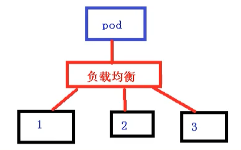
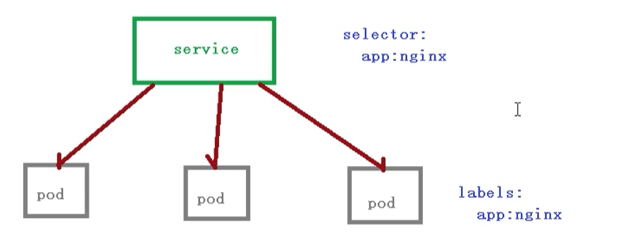

# Kubernetes 核心技术 Service

## 前言

​	前面了解到 Deployment 只是保证了支撑服务的微服务Pod的数量，但是没有解决如何访问这些服务的问题。一个Pod只是一个运行服务的实例，随时可能在一个节点上停止，在另一个节点以一个新的IP启动一个新的Pod，因此不能以确定的IP和端口号提供服务。

​	要稳定地提供服务需要服务发现和负载均衡能力。服务发现完成的工作，是针对客户端访问的服务，找到对应的后端服务实例。在K8S集群中，客户端需要访问的服务就是Service对象。每个Service会对应一个集群内部有效的虚拟IP，集群内部通过虚拟IP访问一个服务。

​	在 K8S 集群中，微服务的负载均衡是由 `kube-proxy` 实现的。`kube-proxy` 是 `k8s` 集群内部的负载均衡器。它是一个分布式代理服务器，在 K8S 的每个节点上都有一个；这一设计体现了它的伸缩性优势，需要访问服务的节点越多，提供负载均衡能力的 `kube-proxy` 就越多，高可用节点也随之增多。与之相比，平时在服务器端使用反向代理作负载均衡，还要进一步解决反向代理的高可用问题。

## Service 存在的意义

### 防止 Pod 失联【服务发现】

​	因为Pod每次创建都对应一个IP地址，而这个IP地址是短暂的，每次随着Pod的更新都会变化，假设当的前端页面有多个Pod时候，同时后端也多个Pod，这个时候，他们之间的相互访问，就需要通过注册中心，拿到Pod的IP地址，然后去访问对应的Pod


### 定义 Pod 访问策略【负载均衡】

页面前端的Pod访问到后端的Pod，中间会通过Service一层，而Service在这里还能做负载均衡，负载均衡的策略有很多种实现策略，例如：

- 随机
- 轮询
- 响应比




## Service 定义

|        name         |  type  | required |                            backup                            |
| :-----------------: | :----: | :------: | :----------------------------------------------------------: |
|       version       | string |    1     |                                                              |
|        kind         | string |    1     |                           Service                            |
|      metadate       | object |    1     |                                                              |
|       m.name        | string |    1     |                 Service 名称，可配置用于访问                 |
|     m.namespace     | string |    1     |              和上面那个，详见我的 CoreDNS 博文               |
|     m.labels[]      |  list  |          |                                                              |
|    m.annotation     |  list  |          |                                                              |
|        spec         | object |    1     |                           详细数据                           |
|    s.selector[]     |  list  |    1     |         将选择具有指定 label 标签的 Pod 作为管理范围         |
|       s.type        | string |    1     | Service 的类型，指定 Service 的访问方式。默认值为 ClusterIP。见下方注释 1 |
|     s.clusterIP     | string |          | 当 service.type == ClusterIP 时，用以配置对应 IP；如果不指定，将由系统自动生成；如果是无头 Service，将此项设置为 None。Headless Service 后文再说 |
|  s.sessionAffinity  | string |          | 是否支持 Session。可选值为 ClientIP，默认值为 None。ClientIP 表示将同一个客户端IP来的访问请求全都转发到同一个后端 Pod |
|      s.ports[]      |  list  |          |                       Service 端口列表                       |
|      s.p.name       | string |          |                           端口名称                           |
|    s.p.protocol     | string |          |              端口协议，支持 TCP/UDP，默认是 TCP              |
|      s.p.port       |  int   |          |                       服务监听的端口号                       |
|   s.p.targetPort    |  int   |          |                 需要转发到后端 Pod 的端口号                  |
|    s.p.nodePort     |  int   |          |    当 spec.type == NodePort 时，指定映射到宿主机的端口号     |
|       status        | object |          |  当 spec.type == LoadBalancer 时，设置外部负载均衡器的地址   |
| status.loadBalancer | object |          |                        外部负载均衡器                        |
|  status.l.ingress   | object |          |                        外部负载均衡器                        |
|    status.l.i.ip    | string |          |                                                              |
| status.l.i.hostname | string |          |                                                              |


## Pod 和 Service 的关系

这里Pod 和 Service 之间还是根据 label 和 selector 建立关联的 【和Controller一样】



在访问service的时候，其实也是需要有一个ip地址，这个ip肯定不是pod的ip地址，而是 虚拟IP `vip` 

## Service 常用类型

- ClusterIp：虚拟服务 IP 地址，该地址用于 kubernetes 集群内部的 Pod 访问，在 Node 上 kube-proxy 通过设置的 iptables 规则进行转发
- NodePort：使用宿主机的端口，使能够访问各 Node 的外部客户端通过 Node 的 IP 地址和端口号就能访问服务
- LoadBalancer：使用外接负载均衡器完成到服务的负载均衡分发，需要在 spec.status.loadBalance 字段指定外部负载均衡器的地址，公有云

### 举例

可以导出一个文件 包含service的配置信息

```bash
kubectl expose deployment web --port=80 --target-port=80 --dry-run -o yaml > service.yaml
```

service.yaml 如下所示

```yaml
apiVersion: v1
kind: Service
metadata:
  creationTimestamp: null
  labels:
    app: web
  name: web
spec:
  ports:
  - port: 80
    protocol: TCP
    targetPort: 80
  selector:
    app: web
status:
  loadBalancer: {}
```

如果没有做设置的话，默认使用的是第一种方式 ClusterIp，也就是只能在集群内部使用，可以添加一个type字段，用来设置的service类型

```yaml
apiVersion: v1
kind: Service
metadata:
  creationTimestamp: null
  labels:
    app: web
  name: web
spec:
  ports:
  - port: 80
    protocol: TCP
    targetPort: 80
  selector:
    app: web
  type: NodePort
status:
  loadBalancer: {}
```

修改完命令后，使用创建一个pod

```bash
kubectl apply -f service.yaml
```

然后能够看到，已经成功修改为 NodePort类型了，最后剩下的一种方式就是LoadBalanced：对外访问应用使用公有云

node一般是在内网进行部署，而外网一般是不能访问到的，那么如何访问的呢？

- 找到一台可以通过外网访问机器，安装nginx，反向代理
- 手动把可以访问的节点添加到nginx中

如果使用LoadBalancer，就会有负载均衡的控制器，类似于nginx的功能，就不需要自己添加到nginx上


## 负载分发策略

​	对 Service 的访问被分发到了后端的 Pod 上去，目前 Kubernetes 提供了两种负载分发策略

​	如果不定义，默认使用 `kube-proxy` 的策略，比如随机、轮询等

​	基于客户端地址的会话保持模式，即来自同一个客户端发起的所有请求都会转发到固定的一个 Pod 上，这对于传统基于 Session 的认证项目来说很友好，此模式可以在 spec 中添加 `sessionAffinity: ClusterIP` 选项

```yaml
apiVersion: apps/v1
kind: Deployment      
metadata:
  name: pc-deployment
  namespace: dev
spec:
  replicas: 3
  selector:
    matchLabels:
      app: nginx-pod
  template:
    metadata:
      labels:
        app: nginx-pod
    spec:
      containers:
      - name: nginx
        image: nginx:1.17.1
        ports:
        - containerPort: 80
```

```bash
kubectl get pods -n w -o wide --show-labels

kubectl exec -it pc-deployment-6696798b78-2jpf4 -n w /bin/sh
echo "10.244.102.155" > /usr/share/nginx/html/index.html

curl 10.244.102.154
```

```yaml
apiVersion: v1
kind: Service
metadata:
  name: service-clusterip
  namespace: w
spec:
  selector:
    app: nginx-pod
  clusterIP: 10.97.97.97	# service 的 ip 地址，如果不写，默认会生成一个
  type: ClusterIP
  ports:
   - port: 80  			# Service 端口
    targetPort: 80 	# pod 端口
```

```bash
kubectl describe svc service-clusterip -n w

# 查看 ipvs 的映射规则 【rr 轮询】
TCP  10.97.97.97:80 rr
 -> 10.244.102.154:80           Masq    1      0          0        
 -> 10.244.102.155:80           Masq    1      0          0        
 -> 10.244.102.156:80           Masq    1      0          0   

```

**修改分发策略**

```yaml
apiVersion: v1
kind: Service
metadata:
  name: service-clusterip
  namespace: dev
spec:
  selector:
    app: nginx-pod
  clusterIP: 10.97.97.97	# service 的 IP 地址，如果不写，默认会生成一个
  type: ClusterIP
  sessionAffinity: ClientIP	# 修改分发策略为基于客户端地址的会话保持模式
  ports:
    - port: 80 			# Service 的端口
      targetPort: 80 	# Pod 的端口
```


## 无头 Service

​	开发人员可能不想使用 Service 提供的负载均衡功能，而希望自己来控制负载均衡策略，针对这种情况，Kubernetes 提供了HeadLiness Service，这类 Service 不会分配 Cluster IP，如果想要访问 Service，只能通过 Service 的域名进行查询

```yaml
apiVersion: v1
kind: Service
metadata:
  name: service-headliness
  namespace: dev
spec:
  selector:
  app: nginx-pod
  clusterIP: None	# 将 clusterIP 设置为 None，即可创建 headliness Service
  type: ClusterIP
  ports:
    port: 80
    targetPort: 80
```

```bash
kubectl exec -it pc-deployment-6696798b78-2jpf4 -n w bash

cat /etc/resolv.conf

dig @10.96.0.10 service-headliness.w.svc.cluster.local
```


