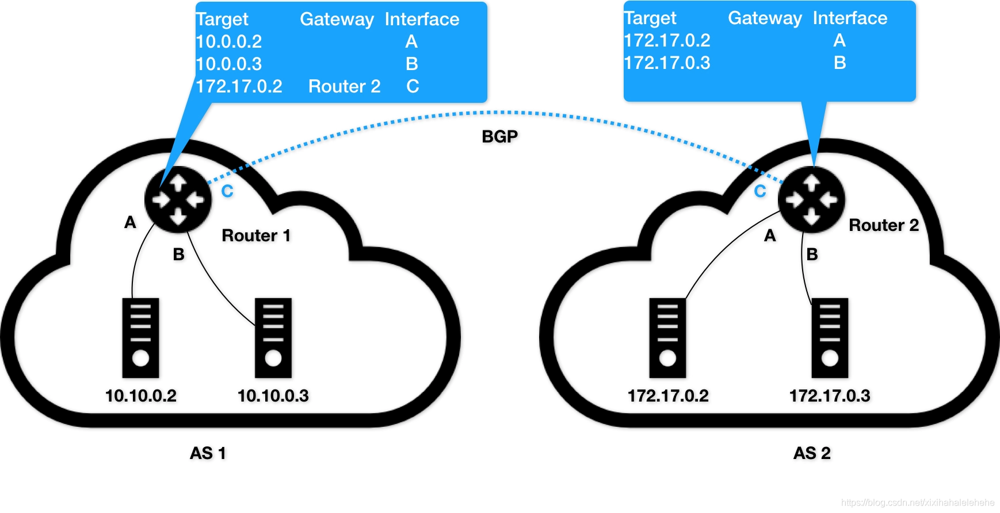
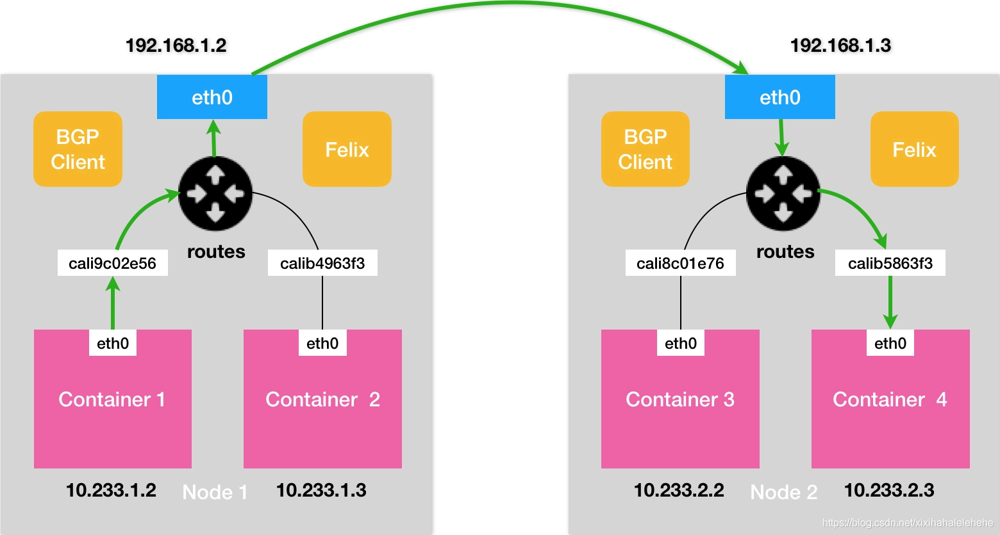
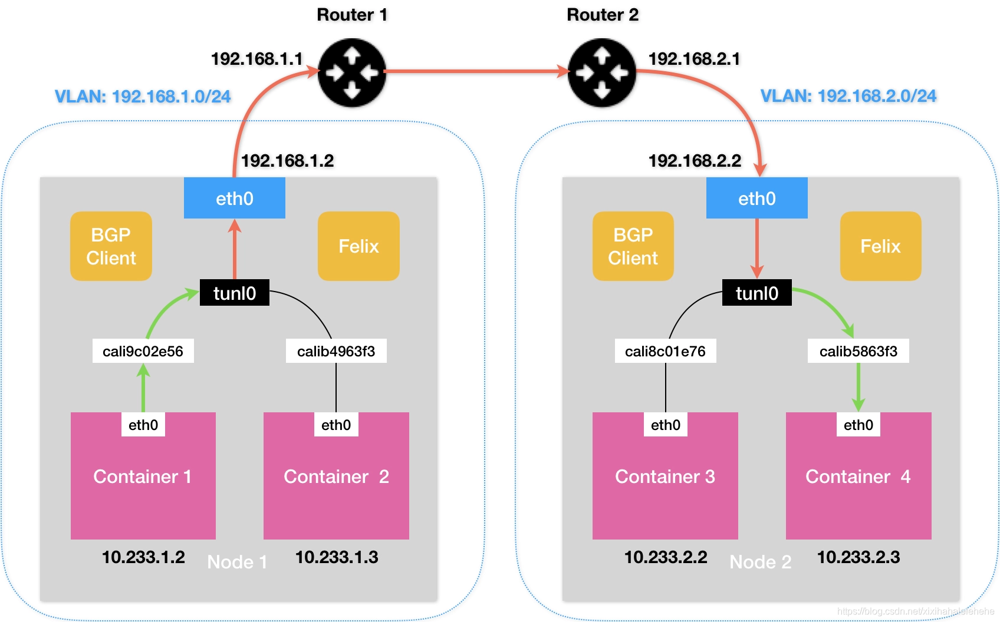
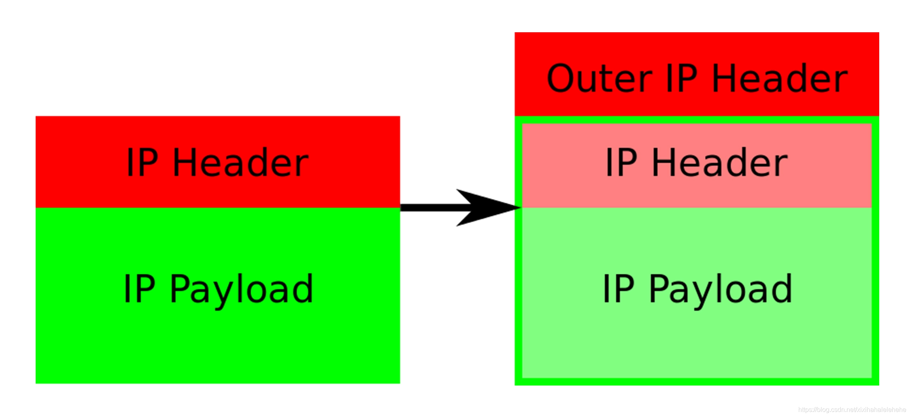

# K8S 网络原理


## CNI 网络原理

​	不难看到，这些例子有一个共性，那就是用户的容器都连接在 docker0 网桥上。而网络插件则在宿主机上创建了一个特殊的设备（UDP 模式创建的是 TUN 设备，VXLAN 模式创建的则是 VTEP 设备），docker0 与这个设备之间，通过 IP 转发（路由表）进行协作。

​	然后，网络插件真正要做的事情，则是通过某种方法，把不同宿主机上的特殊设备连通，从而达到容器跨主机通信的目的。

​	实际上，上面这个流程，也正是 Kubernetes 对容器网络的主要处理方法。只不过，Kubernetes 是通过一个叫作 CNI 的接口，维护了一个单独的网桥来代替 docker0。这个网桥的名字就叫作：CNI 网桥，它在宿主机上的设备名称默认是：cni0。

​	以 Flannel 的 VXLAN 模式为例，在 Kubernetes 环境里，它的工作方式跟在前面讲解的没有任何不同。只不过，docker0 网桥被替换成了 CNI 网桥而已，如下所示：


在这里，Kubernetes 为 Flannel 分配的子网范围是 10.244.0.0/16。这个参数可以在部署的时候指定，比如：

```yaml
$ kubeadm init --pod-network-cidr=10.244.0.0/16
1
```

也可以在部署完成后，通过修改 kube-controller-manager 的配置文件来指定。

这时候，假设 Infra-container-1 要访问 Infra-container-2（也就是 Pod-1 要访问 Pod-2），这个 IP 包的源地址就是 10.244.0.2，目的 IP 地址是 10.244.1.3。而此时，Infra-container-1 里的 eth0 设备，同样是以 Veth Pair 的方式连接在 Node 1 的 cni0 网桥上。所以这个 IP 包就会经过 cni0 网桥出现在宿主机上。

此时，Node 1 上的路由表，如下所示：
在Node 1上

```yaml
$ route -n
Kernel IP routing table
Destination     Gateway         Genmask         Flags Metric Ref    Use Iface
...
10.244.0.0      0.0.0.0         255.255.255.0   U     0      0        0 cni0
10.244.1.0      10.244.1.0      255.255.255.0   UG    0      0        0 flannel.1
172.17.0.0      0.0.0.0         255.255.0.0     U     0      0        0 docker0
1234567
```

因为的 IP 包的目的 IP 地址是 10.244.1.3，所以它只能匹配到第二条规则，也就是 10.244.1.0 对应的这条路由规则。

可以看到，这条规则指定了本机的 flannel.1 设备进行处理。并且，flannel.1 在处理完后，要将 IP 包转发到的网关（Gateway），正是“隧道”另一端的 VTEP 设备，也就是 Node 2 的 flannel.1 设备。所以，接下来的流程，就跟上一篇文章中介绍过的 Flannel VXLAN 模式完全一样了。

需要注意的是，CNI 网桥只是接管所有 CNI 插件负责的、即 Kubernetes 创建的容器（Pod）。而此时，如果你用 docker run 单独启动一个容器，那么 Docker 项目还是会把这个容器连接到 docker0 网桥上。所以这个容器的 IP 地址，一定是属于 docker0 网桥的 172.17.0.0/16 网段。

Kubernetes 之所以要设置这样一个与 docker0 网桥功能几乎一样的 CNI 网桥，主要原因包括两个方面：

```
一方面，Kubernetes 项目并没有使用 Docker 的网络模型（CNM），所以它并不希望、也不具备配置 docker0网桥的能力；
另一方面，这还与 Kubernetes 如何配置 Pod，也就是 Infra 容器的 Network Namespace 密切相关。
12
```

知道，Kubernetes 创建一个 Pod 的第一步，就是创建并启动一个 Infra 容器，用来“hold”住这个 Pod 的 Network Namespace，所以，CNI 的设计思想，就是：Kubernetes 在启动 Infra 容器之后，就可以直接调用 CNI 网络插件，为这个 Infra 容器的 Network Namespace，配置符合预期的网络栈。一个 Network Namespace 的网络栈包括：网卡（Network Interface）、回环设备（Loopback Device）、路由表（Routing Table）和 iptables 规则。

那么，这个网络栈的配置工作又是如何完成的呢？
为了回答这个问题，就需要从 CNI 插件的部署和实现方式谈起了。

在部署 Kubernetes 的时候，有一个步骤是安装 kubernetes-cni 包，它的目的就是在宿主机上安装 CNI 插件所需的基础可执行文件。

在安装完成后，你可以在宿主机的 /opt/cni/bin 目录下看到它们，如下所示：

```yaml
$ ls -al /opt/cni/bin/
total 73088
-rwxr-xr-x 1 root root  3890407 Aug 17  2017 bridge
-rwxr-xr-x 1 root root  9921982 Aug 17  2017 dhcp
-rwxr-xr-x 1 root root  2814104 Aug 17  2017 flannel
-rwxr-xr-x 1 root root  2991965 Aug 17  2017 host-local
-rwxr-xr-x 1 root root  3475802 Aug 17  2017 ipvlan
-rwxr-xr-x 1 root root  3026388 Aug 17  2017 loopback
-rwxr-xr-x 1 root root  3520724 Aug 17  2017 macvlan
-rwxr-xr-x 1 root root  3470464 Aug 17  2017 portmap
-rwxr-xr-x 1 root root  3877986 Aug 17  2017 ptp
-rwxr-xr-x 1 root root  2605279 Aug 17  2017 sample
-rwxr-xr-x 1 root root  2808402 Aug 17  2017 tuning
-rwxr-xr-x 1 root root  3475750 Aug 17  2017 vlan
1234567891011121314
```

这些 CNI 的基础可执行文件，按照功能可以分为三类：

```
第一类，叫作 Main 插件，它是用来创建具体网络设备的二进制文件。比如，bridge（网桥设备）、ipvlan、loopback（lo设备）、macvlan、ptp（Veth Pair 设备），以及 vlan。
第二类，叫作 IPAM（IP Address Management）插件，它是负责分配 IP 地址的二进制文件。比如，dhcp，这个文件会向 DHCP 服务器发起请求；host-local，则会使用预先配置的 IP 地址段来进行分配。
第三类，是由 CNI 社区维护的内置 CNI 插件。比如：flannel，就是专门为 Flannel 项目提供的 CNI 插件；tuning，是一个通过 sysctl 调整网络设备参数的二进制文件；portmap，是一个通过 iptables 配置端口映射的二进制文件；bandwidth，是一个使用 Token Bucket Filter (TBF) 来进行限流的二进制文件。
123
```

从这些二进制文件中，可以看到，如果要实现一个给 Kubernetes 用的容器网络方案，其实需要做两部分工作，以 Flannel 项目为例：

```
首先，实现这个网络方案本身。这一部分需要编写的，其实就是 flanneld 进程里的主要逻辑。比如，创建和配置 flannel.1设备、配置宿主机路由、配置 ARP 和 FDB 表里的信息等等。
然后，实现该网络方案对应的 CNI 插件。这一部分主要需要做的，就是配置 Infra 容器里面的网络栈，并把它连接在 CNI 网桥上。
12
```

由于 Flannel 项目对应的 CNI 插件已经被内置了，所以它无需再单独安装。而对于 Weave、Calico 等其他项目来说，就必须在安装插件的时候，把对应的 CNI 插件的可执行文件放在 /opt/cni/bin/ 目录下。实际上，对于 Weave、Calico 这样的网络方案来说，它们的 DaemonSet 只需要挂载宿主机的 /opt/cni/bin/，就可以实现插件可执行文件的安装了。

接下来，你就需要在宿主机上安装 flanneld（网络方案本身）。而在这个过程中，flanneld 启动后会在每台宿主机上生成它对应的 CNI 配置文件（它其实是一个 ConfigMap），从而告诉 Kubernetes，这个集群要使用 Flannel 作为容器网络方案。

这个 CNI 配置文件的内容如下所示：

```yaml
$ cat /etc/cni/net.d/10-flannel.conflist 
{
  "name": "cbr0",
  "plugins": [
    {
      "type": "flannel",
      "delegate": {
        "hairpinMode": true,
        "isDefaultGateway": true
      }
    },
    {
      "type": "portmap",
      "capabilities": {
        "portMappings": true
      }
    }
  ]
}
12345678910111213141516171819
```

需要注意的是，在 Kubernetes 中，处理容器网络相关的逻辑并不会在 kubelet 主干代码里执行，而是会在具体的 CRI（Container Runtime Interface，容器运行时接口）实现里完成。对于 Docker 项目来说，它的 CRI 实现叫作 dockershim，你可以在 kubelet 的代码里找到它。

所以，接下来 dockershim 会加载上述的 CNI 配置文件。需要注意，Kubernetes 目前不支持多个 CNI 插件混用。如果你在 CNI 配置目录（/etc/cni/net.d）里放置了多个 CNI 配置文件的话，dockershim 只会加载按字母顺序排序的第一个插件。

但另一方面，CNI 允许你在一个 CNI 配置文件里，通过 plugins 字段，定义多个插件进行协作。比如，在上面这个例子里，Flannel 项目就指定了 flannel 和 portmap 这两个插件。这时候，dockershim 会把这个 CNI 配置文件加载起来，并且把列表里的第一个插件、也就是 flannel 插件，设置为默认插件。而在后面的执行过程中，flannel 和 portmap 插件会按照定义顺序被调用，从而依次完成“配置容器网络”和“配置端口映射”这两步操作。

接下来，就来为你讲解一下这样一个 CNI 插件的工作原理。

当 kubelet 组件需要创建 Pod 的时候，它第一个创建的一定是 Infra 容器。所以在这一步，dockershim 就会先调用 Docker API 创建并启动 Infra 容器，紧接着执行一个叫作 SetUpPod 的方法。这个方法的作用就是：为 CNI 插件准备参数，然后调用 CNI 插件为 Infra 容器配置网络。

这里要调用的 CNI 插件，就是 /opt/cni/bin/flannel；而调用它所需要的参数，分为两部分。

```
第一部分，是由 dockershim 设置的一组 CNI 环境变量。其中，最重要的环境变量参数叫作：CNI_COMMAND。它的取值只有两种：ADD 和 DEL。这个 ADD 和 DEL 操作，就是 CNI 插件唯一需要实现的两个方法。其中 ADD 操作的含义是：把容器添加到 CNI 网络里；DEL 操作的含义则是：把容器从 CNI 网络里移除掉。
1
```

而对于网桥类型的 CNI 插件来说，这两个操作意味着把容器以 Veth Pair 的方式“插”到 CNI 网桥上，或者从网桥上“拔”掉。接下来，以 ADD 操作为重点进行讲解。

CNI 的 ADD 操作需要的参数包括：容器里网卡的名字 eth0（CNI_IFNAME）、Pod 的 Network Namespace 文件的路径（CNI_NETNS）、容器的 ID（CNI_CONTAINERID）等。这些参数都属于上述环境变量里的内容。其中，Pod（Infra 容器）的 Network Namespace 文件的路径，在前面讲解容器基础的时候提到过，即：/proc/< 容器进程的 PID>/ns/net。

除此之外，在 CNI 环境变量里，还有一个叫作 CNI_ARGS 的参数。通过这个参数，CRI 实现（比如 dockershim）就可以以 Key-Value 的格式，传递自定义信息给网络插件。这是用户将来自定义 CNI 协议的一个重要方法。

```
第二部分，则是 dockershim 从 CNI 配置文件里加载到的、默认插件的配置信息。
1
```

这个配置信息在 CNI 中被叫作 Network Configuration，它的完整定义你可以参考这个文档。dockershim 会把 Network Configuration 以 JSON 数据的格式，通过标准输入（stdin）的方式传递给 Flannel CNI 插件。

而有了这两部分参数，Flannel CNI 插件实现 ADD 操作的过程就非常简单了。不过，需要注意的是，Flannel 的 CNI 配置文件（ /etc/cni/net.d/10-flannel.conflist）里有这么一个字段，叫作 delegate：

```yaml
...
     "delegate": {
        "hairpinMode": true,
        "isDefaultGateway": true
      }
12345
```

Delegate 字段的意思是，这个 CNI 插件并不会自己做事儿，而是会调用 Delegate 指定的某种 CNI 内置插件来完成。对于 Flannel 来说，它调用的 Delegate 插件，就是前面介绍到的 CNI bridge 插件。

所以说，dockershim 对 Flannel CNI 插件的调用，其实就是走了个过场。Flannel CNI 插件唯一需要做的，就是对 dockershim 传来的 Network Configuration 进行补充。比如，将 Delegate 的 Type 字段设置为 bridge，将 Delegate 的 IPAM 字段设置为 host-local 等。

经过 Flannel CNI 插件补充后的、完整的 Delegate 字段如下所示：

```yaml
{
    "hairpinMode":true,
    "ipMasq":false,
    "ipam":{
        "routes":[
            {
                "dst":"10.244.0.0/16"
            }
        ],
        "subnet":"10.244.1.0/24",
        "type":"host-local"
    },
    "isDefaultGateway":true,
    "isGateway":true,
    "mtu":1410,
    "name":"cbr0",
    "type":"bridge"
}
123456789101112131415161718
```

其中，ipam 字段里的信息，比如 10.244.1.0/24，读取自 Flannel 在宿主机上生成的 Flannel 配置文件，即：宿主机上的 /run/flannel/subnet.env 文件。

接下来，Flannel CNI 插件就会调用 CNI bridge 插件，也就是执行：/opt/cni/bin/bridge 二进制文件。

这一次，调用 CNI bridge 插件需要的两部分参数的第一部分、也就是 CNI 环境变量，并没有变化。所以，它里面的 CNI_COMMAND 参数的值还是“ADD”。

而第二部分 Network Configration，正是上面补充好的 Delegate 字段。Flannel CNI 插件会把 Delegate 字段的内容以标准输入（stdin）的方式传递给 CNI bridge 插件。此外，Flannel CNI 插件还会把 Delegate 字段以 JSON 文件的方式，保存在 /var/lib/cni/flannel 目录下。这是为了给后面删除容器调用 DEL 操作时使用的。

有了这两部分参数，接下来 CNI bridge 插件就可以“代表”Flannel，进行“将容器加入到 CNI 网络里”这一步操作了。而这一部分内容，与容器 Network Namespace 密切相关，所以要为你详细讲解一下。

```yaml
# 在宿主机上
$ ip link add cni0 type bridge
$ ip link set cni0 up
123
```

接下来，CNI bridge 插件会通过 Infra 容器的 Network Namespace 文件，进入到这个 Network Namespace 里面，然后创建一对 Veth Pair 设备。
紧接着，它会把这个 Veth Pair 的其中一端，“移动”到宿主机上。这相当于在容器里执行如下所示的命令：

```yaml
#在容器里

# 创建一对Veth Pair设备。其中一个叫作eth0，另一个叫作vethb4963f3
$ ip link add eth0 type veth peer name vethb4963f3

# 启动eth0设备
$ ip link set eth0 up 

# 将Veth Pair设备的另一端（也就是vethb4963f3设备）放到宿主机（也就是Host Namespace）里
$ ip link set vethb4963f3 netns $HOST_NS

# 通过Host Namespace，启动宿主机上的vethb4963f3设备
$ ip netns exec $HOST_NS ip link set vethb4963f3 up 
12345678910111213
```

这样，vethb4963f3 就出现在了宿主机上，而且这个 Veth Pair 设备的另一端，就是容器里面的 eth0。当然，你可能已经想到，上述创建 Veth Pair 设备的操作，其实也可以先在宿主机上执行，然后再把该设备的一端放到容器的 Network Namespace 里，这个原理是一样的。不过，CNI 插件之所以要“反着”来，是因为 CNI 里对 Namespace 操作函数的设计就是如此，如下所示：

```yaml
err := containerNS.Do(func(hostNS ns.NetNS) error {
  ...
  return nil
})
1234
```

这个设计其实很容易理解。在编程时，容器的 Namespace 是可以直接通过 Namespace 文件拿到的；而 Host Namespace，则是一个隐含在上下文的参数。所以，像上面这样，先通过容器 Namespace 进入容器里面，然后再反向操作 Host Namespace，对于编程来说要更加方便。接下来，CNI bridge 插件就可以把 vethb4963f3 设备连接在 CNI 网桥上。这相当于在宿主机上执行：

```yaml
# 在宿主机上
$ ip link set vethb4963f3 master cni0
12
```

在将 vethb4963f3 设备连接在 CNI 网桥之后，CNI bridge 插件还会为它设置 Hairpin Mode（发夹模式）。这是因为，在默认情况下，网桥设备是不允许一个数据包从一个端口进来后，再从这个端口发出去的。但是，它允许你为这个端口开启 Hairpin Mode，从而取消这个限制。

这个特性，主要用在容器需要通过NAT（即：端口映射）的方式，“自己访问自己”的场景下。举个例子，比如执行 docker run -p 8080:80，就是在宿主机上通过 iptables 设置了一条DNAT（目的地址转换）转发规则。这条规则的作用是，当宿主机上的进程访问“< 宿主机的 IP 地址 >:8080”时，iptables 会把该请求直接转发到“< 容器的 IP 地址 >:80”上。也就是说，这个请求最终会经过 docker0 网桥进入容器里面。

但如果你是在容器里面访问宿主机的 8080 端口，那么这个容器里发出的 IP 包会经过 vethb4963f3 设备（端口）和 docker0 网桥，来到宿主机上。此时，根据上述 DNAT 规则，这个 IP 包又需要回到 docker0 网桥，并且还是通过 vethb4963f3 端口进入到容器里。所以，这种情况下，就需要开启 vethb4963f3 端口的 Hairpin Mode 了。

所以说，Flannel 插件要在 CNI 配置文件里声明 hairpinMode=true。这样，将来这个集群里的 Pod 才可以通过它自己的 Service 访问到自己。

接下来，CNI bridge 插件会调用 CNI ipam 插件，从 ipam.subnet 字段规定的网段里为容器分配一个可用的 IP 地址。然后，CNI bridge 插件就会把这个 IP 地址添加在容器的 eth0 网卡上，同时为容器设置默认路由。这相当于在容器里执行：

```yaml
# 在容器里
$ ip addr add 10.244.0.2/24 dev eth0
$ ip route add default via 10.244.0.1 dev eth0
123
```

最后，CNI bridge 插件会为 CNI 网桥添加 IP 地址。这相当于在宿主机上执行：

```yaml
# 在宿主机上
$ ip addr add 10.244.0.1/24 dev cni0
12
```

在执行完上述操作之后，CNI 插件会把容器的 IP 地址等信息返回给 dockershim，然后被 kubelet 添加到 Pod 的 Status 字段。至此，CNI 插件的 ADD 方法就宣告结束了。接下来的流程，就跟上一篇文章中容器跨主机通信的过程完全一致了。

------

#### 总结

Kubernetes 网络模型：

```
所有容器都可以直接使用 IP 地址与其他容器通信，而无需使用 NAT。
所有宿主机都可以直接使用 IP 地址与所有容器通信，而无需使用 NAT。反之亦然。
容器自己“看到”的自己的 IP 地址，和别人（宿主机或者容器）看到的地址是完全一样的。
123
```

可以看到，这个网络模型，其实可以用一个字总结，那就是“通”。容器与容器之间要“通”，容器与宿主机之间也要“通”。并且，Kubernetes 要求这个“通”，还必须是直接基于容器和宿主机的 IP 地址来进行的。当然，考虑到不同用户之间的隔离性，在很多场合下，还要求容器之间的网络“不通”。这个问题，会在后面的文章中会为你解决。


<hr>

## Kubernetes 三层网络方案

以网桥类型的 Flannel 插件为例，为你讲解了 Kubernetes 里容器网络和 CNI 插件的主要工作原理。不过，除了这种模式之外，还有一种纯三层（Pure Layer 3）网络方案非常值得你注意。其中的典型例子，莫过于 Flannel 的 host-gw 模式和 Calico 项目了。先来看一下 Flannel 的 host-gw 模式。


假设现在，Node 1 上的 Infra-container-1，要访问 Node 2 上的 Infra-container-2。当你设置 Flannel 使用 host-gw 模式之后，flanneld 会在宿主机上创建这样一条规则，以 Node 1 为例：

```yaml
$ ip route
...
10.244.1.0/24 via 10.168.0.3 dev eth0
123
```

这条路由规则的含义是：目的 IP 地址属于 10.244.1.0/24 网段的 IP 包，应该经过本机的 eth0 设备发出去（即：dev eth0）；并且，它下一跳地址（next-hop）是 10.168.0.3（即：via 10.168.0.3）。

所谓下一跳地址就是：如果 IP 包从主机 A 发到主机 B，需要经过路由设备 X 的中转。那么 X 的 IP 地址就应该配置为主机 A 的下一跳地址。

而从 host-gw 示意图中可以看到，这个下一跳地址对应的，正是的目的宿主机 Node 2。

一旦配置了下一跳地址，那么接下来，当 IP 包从网络层进入链路层封装成帧的时候，eth0 设备就会使用下一跳地址对应的 MAC 地址，作为该数据帧的目的 MAC 地址。显然，这个 MAC 地址，正是 Node 2 的 MAC 地址。这样，这个数据帧就会从 Node 1 通过宿主机的二层网络顺利到达 Node 2 上。

而 Node 2 的内核网络栈从二层数据帧里拿到 IP 包后，会“看到”这个 IP 包的目的 IP 地址是 10.244.1.3，即 Infra-container-2 的 IP 地址。这时候，根据 Node 2 上的路由表，该目的地址会匹配到第二条路由规则（也就是 10.244.1.0 对应的路由规则），从而进入 cni0 网桥，进而进入到 Infra-container-2 当中。

可以看到，host-gw 模式的工作原理，其实就是将每个 Flannel 子网（Flannel Subnet，比如：10.244.1.0/24）的“下一跳”，设置成了该子网对应的宿主机的 IP 地址。也就是说，这台“主机”（Host）会充当这条容器通信路径里的“网关”（Gateway）。这也正是“host-gw”的含义。

当然，Flannel 子网和主机的信息，都是保存在 Etcd 当中的。flanneld 只需要 WACTH 这些数据的变化，然后实时更新路由表即可。

```
注意：在 Kubernetes v1.7 之后，类似 Flannel、Calico 的 CNI 网络插件都是可以直接连接
Kubernetes 的 APIServer 来访问 Etcd 的，无需额外部署 Etcd 给它们使用。
12
```

而在这种模式下，容器通信的过程就免除了额外的封包和解包带来的性能损耗。根据实际的测试，host-gw 的性能损失大约在 10% 左右，而其他所有基于 VXLAN“隧道”机制的网络方案，性能损失都在 20%~30% 左右。

当然，通过上面的叙述，你也应该看到，host-gw 模式能够正常工作的核心，就在于 IP 包在封装成帧发送出去的时候，会使用路由表里的“下一跳”来设置目的 MAC 地址。这样，它就会经过二层网络到达目的宿主机。

所以说，Flannel host-gw 模式必须要求集群宿主机之间是二层连通的。

需要注意的是，宿主机之间二层不连通的情况也是广泛存在的。比如，宿主机分布在了不同的子网（VLAN）里。但是，在一个 Kubernetes 集群里，宿主机之间必须可以通过 IP 地址进行通信，也就是说至少是三层可达的。否则的话，你的集群将不满足上一篇文章中提到的宿主机之间 IP 互通的假设（Kubernetes 网络模型）。当然，“三层可达”也可以通过为几个子网设置三层转发来实现。

而在容器生态中，要说到像 Flannel host-gw 这样的三层网络方案，就不得不提到这个领域里的“龙头老大”Calico 项目了。

------

实际上，Calico 项目提供的网络解决方案，与 Flannel 的 host-gw 模式，几乎是完全一样的。也就是说，Calico 也会在每台宿主机上，添加一个格式如下所示的路由规则：

```yaml
<目的容器IP地址段> via <网关的IP地址> dev eth0
1
```

其中，网关的 IP 地址，正是目的容器所在宿主机的 IP 地址。而正如前所述，这个三层网络方案得以正常工作的核心，是为每个容器的 IP 地址，找到它所对应的、“下一跳”的网关。

不过，不同于 Flannel 通过 Etcd 和宿主机上的 flanneld 来维护路由信息的做法，Calico 项目使用了一个“重型武器”来自动地在整个集群中分发路由信息。这个“重型武器”，就是 BGP。

BGP 的全称是 Border Gateway Protocol，即：边界网关协议。它是一个 Linux 内核原生就支持的、专门用在大规模数据中心里维护不同的“自治系统”之间路由信息的、无中心的路由协议。这个概念可能听起来有点儿“吓人”，但实际上，可以用一个非常简单的例子来为你讲清楚。


在这个图中，有两个自治系统（Autonomous System，简称为 AS）：AS 1 和 AS 2。而所谓的一个自治系统，指的是一个组织管辖下的所有 IP 网络和路由器的全体。你可以把它想象成一个小公司里的所有主机和路由器。在正常情况下，自治系统之间不会有任何“来往”。

但是，如果这样两个自治系统里的主机，要通过 IP 地址直接进行通信，就必须使用路由器把这两个自治系统连接起来。

比如，AS 1 里面的主机 10.10.0.2，要访问 AS 2 里面的主机 172.17.0.3 的话。它发出的 IP 包，就会先到达自治系统 AS 1 上的路由器 Router 1。

而在此时，Router 1 的路由表里，有这样一条规则，即：目的地址是 172.17.0.2 包，应该经过 Router 1 的 C 接口，发往网关 Router 2（即：自治系统 AS 2 上的路由器）。所以 IP 包就会到达 Router 2 上，然后经过 Router 2 的路由表，从 B 接口出来到达目的主机 172.17.0.3。

但是反过来，如果主机 172.17.0.3 要访问 10.10.0.2，那么这个 IP 包，在到达 Router 2 之后，就不知道该去哪儿了。因为在 Router 2 的路由表里，并没有关于 AS 1 自治系统的任何路由规则。

所以这时候，网络管理员就应该给 Router 2 也添加一条路由规则，比如：目标地址是 10.10.0.2 的 IP 包，应该经过 Router 2 的 C 接口，发往网关 Router 1。

像上面这样负责把自治系统连接在一起的路由器，就把它形象地称为：边界网关。它跟普通路由器的不同之处在于，它的路由表里拥有其他自治系统里的主机路由信息。

上面的这部分原理，相信你理解起来应该很容易。毕竟，路由器这个设备本身的主要作用，就是连通不同的网络。但是，你可以想象一下，假设现在的网络拓扑结构非常复杂，每个自治系统都有成千上万个主机、无数个路由器，甚至是由多个公司、多个网络提供商、多个自治系统组成的复合自治系统呢？这时候，如果还要依靠人工来对边界网关的路由表进行配置和维护，那是绝对不现实的。而这种情况下，BGP 大显身手的时刻就到了。

在使用了 BGP 之后，你可以认为，在每个边界网关上都会运行着一个小程序，它们会将各自的路由表信息，通过 TCP 传输给其他的边界网关。而其他边界网关上的这个小程序，则会对收到的这些数据进行分析，然后将需要的信息添加到自己的路由表里。这样，Router 2 的路由表里，就会自动出现 10.10.0.2 和 10.10.0.3 对应的路由规则了。

所以说，所谓 BGP，就是在大规模网络中实现节点路由信息共享的一种协议。

而 BGP 的这个能力，正好可以取代 Flannel 维护主机上路由表的功能。而且，BGP 这种原生就是为大规模网络环境而实现的协议，其可靠性和可扩展性，远非 Flannel 自己的方案可比。

```
需要注意的是，BGP 协议实际上是最复杂的一种路由协议。在这里的讲述和所举的例子，仅是为了能够帮助你建立对 BGP 的感性认识，并不代表BGP 真正的实现方式。
1
```

接下来，还是回到 Calico 项目上来。在了解了 BGP 之后，Calico 项目的架构就非常容易理解了。它由三个部分组成：

```
Calico 的 CNI 插件。这是 Calico 与 Kubernetes 对接的部分；
Felix。它是一个 DaemonSet，负责在宿主机上插入路由规则（即：写入 Linux 内核的 FIB 转发信息库），以及维护 Calico 所需的网络设备等工作；
BIRD。它就是 BGP 的客户端，专门负责在集群里分发路由规则信息。
123
```

除了对路由信息的维护方式之外，Calico 项目与 Flannel 的 host-gw 模式的另一个不同之处，就是它不会在宿主机上创建任何网桥设备。这时候，Calico 的工作方式，可以用一幅示意图来描述，如下所示（在接下来的讲述中，会统一用“BGP 示意图”来指代它）：


其中的绿色实线标出的路径，就是一个 IP 包从 Node 1 上的 Container 1，到达 Node 2 上的 Container 4 的完整路径。

可以看到，Calico 的 CNI 插件会为每个容器设置一个 Veth Pair 设备，然后把其中的一端放置在宿主机上（它的名字以 cali 前缀开头）。

此外，由于 Calico 没有使用 CNI 的网桥模式，Calico 的 CNI 插件还需要在宿主机上为每个容器的 Veth Pair 设备配置一条路由规则，用于接收传入的 IP 包。比如，宿主机 Node 2 上的 Container 4 对应的路由规则，如下所示：

```yaml
10.233.2.3 dev cali5863f3 scope link
1
```

即：发往 10.233.2.3 的 IP 包，应该进入 cali5863f3 设备。

基于上述原因，Calico 项目在宿主机上设置的路由规则，肯定要比 Flannel 项目多得多。不过，Flannel host-gw 模式使用 CNI 网桥的主要原因，其实是为了跟 VXLAN 模式保持一致。否则的话，Flannel 就需要维护两套 CNI 插件了。

有了这样的 Veth Pair 设备之后，容器发出的 IP 包就会经过 Veth Pair 设备出现在宿主机上。然后，宿主机网络栈就会根据路由规则的下一跳 IP 地址，把它们转发给正确的网关。接下来的流程就跟 Flannel host-gw 模式完全一致了。其中，这里最核心的“下一跳”路由规则，就是由 Calico 的 Felix 进程负责维护的。这些路由规则信息，则是通过 BGP Client 也就是 BIRD 组件，使用 BGP 协议传输而来的。

而这些通过 BGP 协议传输的消息，你可以简单地理解为如下格式：

```yaml
[BGP消息]
是宿主机192.168.1.3
10.233.2.0/24网段的容器都在这里
这些容器的下一跳地址是
1234
```

不难发现，Calico 项目实际上将集群里的所有节点，都当作是边界路由器来处理，它们一起组成了一个全连通的网络，互相之间通过 BGP 协议交换路由规则。这些节点，称为 BGP Peer。

需要注意的是，Calico 维护的网络在默认配置下，是一个被称为“Node-to-Node Mesh”的模式.这时候，每台宿主机上的 BGP Client 都需要跟其他所有节点的 BGP Client 进行通信以便交换路由信息。但是，随着节点数量 N 的增加，这些连接的数量就会以 N²的规模快速增长，从而给集群本身的网络带来巨大的压力。

所以，Node-to-Node Mesh 模式一般推荐用在少于 100 个节点的集群里。而在更大规模的集群中，你需要用到的是一个叫作 Route Reflector 的模式

在这种模式下，Calico 会指定一个或者几个专门的节点，来负责跟所有节点建立 BGP 连接从而学习到全局的路由规则。而其他节点，只需要跟这几个专门的节点交换路由信息，就可以获得整个集群的路由规则信息了。

这些专门的节点，就是所谓的 Route Reflector 节点，它们实际上扮演了“中间代理”的角色，从而把 BGP 连接的规模控制在 N 的数量级上。

此外，在前面提到过，Flannel host-gw 模式最主要的限制，就是要求集群宿主机之间是二层连通的。而这个限制对于 Calico 来说，也同样存在。

举个例子，假如有两台处于不同子网的宿主机 Node 1 和 Node 2，对应的 IP 地址分别是 192.168.1.2 和 192.168.2.2。需要注意的是，这两台机器通过路由器实现了三层转发，所以这两个 IP 地址之间是可以相互通信的。而现在的需求，还是 Container 1 要访问 Container 4。按照前面的讲述，Calico 会尝试在 Node 1 上添加如下所示的一条路由规则：

```yaml
10.233.2.0/16 via 192.168.2.2 eth0
1
```

但是，这时候问题就来了。上面这条规则里的下一跳地址是 192.168.2.2，可是它对应的 Node 2 跟 Node 1 却根本不在一个子网里，没办法通过二层网络把 IP 包发送到下一跳地址。

在这种情况下，你就需要为 Calico 打开 IPIP 模式。

把这个模式下容器通信的原理，总结成了一张图片，如下所示（接下来会称之为：IPIP 示意图）：



在 Calico 的 IPIP 模式下，Felix 进程在 Node 1 上添加的路由规则，会稍微不同，如下所示：

```yaml
10.233.2.0/24 via 192.168.2.2 tunl0
1
```

可以看到，尽管这条规则的下一跳地址仍然是 Node 2 的 IP 地址，但这一次，要负责将 IP 包发出去的设备，变成了 tunl0。注意，是 T-U-N-L-0，而不是 Flannel UDP 模式使用的 T-U-N-0（tun0），这两种设备的功能是完全不一样的。

Calico 使用的这个 tunl0 设备，是一个 IP 隧道（IP tunnel）设备。

在上面的例子中，IP 包进入 IP 隧道设备之后，就会被 Linux 内核的 IPIP 驱动接管。IPIP 驱动会将这个 IP 包直接封装在一个宿主机网络的 IP 包中，如下所示：


其中，经过封装后的新的 IP 包的目的地址（图 5 中的 Outer IP Header 部分），正是原 IP 包的下一跳地址，即 Node 2 的 IP 地址：192.168.2.2。

而原 IP 包本身，则会被直接封装成新 IP 包的 Payload。这样，原先从容器到 Node 2 的 IP 包，就被伪装成了一个从 Node 1 到 Node 2 的 IP 包。

由于宿主机之间已经使用路由器配置了三层转发，也就是设置了宿主机之间的“下一跳”。所以这个 IP 包在离开 Node 1 之后，就可以经过路由器，最终“跳”到 Node 2 上。这时，Node 2 的网络内核栈会使用 IPIP 驱动进行解包，从而拿到原始的 IP 包。然后，原始 IP 包就会经过路由规则和 Veth Pair 设备到达目的容器内部。

以上，就是 Calico 项目主要的工作原理了。

不难看到，当 Calico 使用 IPIP 模式的时候，集群的网络性能会因为额外的封包和解包工作而下降。在实际测试中，Calico IPIP 模式与 Flannel VXLAN 模式的性能大致相当。所以，在实际使用时，如非硬性需求，建议你将所有宿主机节点放在一个子网里，避免使用 IPIP。

不过，通过上面对 Calico 工作原理的讲述，你应该能发现这样一个事实：如果 Calico 项目能够让宿主机之间的路由设备（也就是网关），也通过 BGP 协议“学习”到 Calico 网络里的路由规则，那么从容器发出的 IP 包，不就可以通过这些设备路由到目的宿主机了么？

比如，只要在上面“IPIP 示意图”中的 Node 1 上，添加如下所示的一条路由规则：

```yaml
10.233.2.0/24 via 192.168.1.1 eth0
1
```

然后，在 Router 1 上（192.168.1.1），添加如下所示的一条路由规则：

```yaml
10.233.2.0/24 via 192.168.2.1 eth0
1
```

那么 Container 1 发出的 IP 包，就可以通过两次“下一跳”，到达 Router 2（192.168.2.1）了。以此类推，可以继续在 Router 2 上添加“下一条”路由，最终把 IP 包转发到 Node 2 上。遗憾的是，上述流程虽然简单明了，但是在 Kubernetes 被广泛使用的公有云场景里，却完全不可行。

这里的原因在于：公有云环境下，宿主机之间的网关，肯定不会允许用户进行干预和设置。当然，在大多数公有云环境下，宿主机（公有云提供的虚拟机）本身往往就是二层连通的，所以这个需求也不强烈。

不过，在私有部署的环境下，宿主机属于不同子网（VLAN）反而是更加常见的部署状态。这时候，想办法将宿主机网关也加入到 BGP Mesh 里从而避免使用 IPIP，就成了一个非常迫切的需求。而在 Calico 项目中，它已经为你提供了两种将宿主机网关设置成 BGP Peer 的解决方案。

```
第一种方案，就是所有宿主机都跟宿主机网关建立 BGP Peer 关系。
1
```

这种方案下，Node 1 和 Node 2 就需要主动跟宿主机网关 Router 1 和 Router 2 建立 BGP 连接。从而将类似于 10.233.2.0/24 这样的路由信息同步到网关上去。需要注意的是，这种方式下，Calico 要求宿主机网关必须支持一种叫作 Dynamic Neighbors 的 BGP 配置方式。这是因为，在常规的路由器 BGP 配置里，运维人员必须明确给出所有 BGP Peer 的 IP 地址。考虑到 Kubernetes 集群可能会有成百上千个宿主机，而且还会动态地添加和删除节点，这时候再手动管理路由器的 BGP 配置就非常麻烦了。而 Dynamic Neighbors 则允许你给路由器配置一个网段，然后路由器就会自动跟该网段里的主机建立起 BGP Peer 关系。

```
不过，相比之下，更愿意推荐第二种方案。
1
```

这种方案，是使用一个或多个独立组件负责搜集整个集群里的所有路由信息，然后通过 BGP 协议同步给网关。而前面提到，在大规模集群中，Calico 本身就推荐使用 Route Reflector 节点的方式进行组网。所以，这里负责跟宿主机网关进行沟通的独立组件，直接由 Route Reflector 兼任即可。更重要的是，这种情况下网关的 BGP Peer 个数是有限并且固定的。所以就可以直接把这些独立组件配置成路由器的 BGP Peer，而无需 Dynamic Neighbors 的支持。

当然，这些独立组件的工作原理也很简单：它们只需要 WATCH Etcd 里的宿主机和对应网段的变化信息，然后把这些信息通过 BGP 协议分发给网关即可。

------

需要注意的是，在大规模集群里，三层网络方案在宿主机上的路由规则可能会非常多，这会导致错误排查变得困难。此外，在系统故障的时候，路由规则出现重叠冲突的概率也会变大。基于上述原因，如果是在公有云上，由于宿主机网络本身比较“直白”，一般会推荐更加简单的 Flannel host-gw 模式。但不难看到，在私有部署环境里，Calico 项目才能够覆盖更多的场景，并为你提供更加可靠的组网方案和架构思路。


## Reference

- https://lion-wu.blog.csdn.net/article/details/124754827