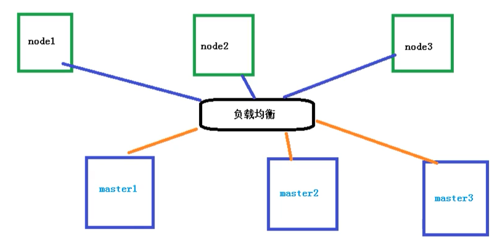
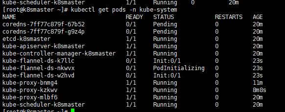

# Creating Cluster

## 搭建 k8s 环境平台规划

### 单 master 集群

单个 `master` 节点，然后管理多个 `node` 节点



### 多 master 集群

多个master节点，管理多个node节点，同时中间多了一个负载均衡的过程


## 服务器硬件配置要求

### 测试环境

master：2核  4G  20G

node：   4核  8G  40G

### 生产环境

master：8核  16G  100G

node：   16核  64G  200G

目前生产部署Kubernetes集群主要有两种方式

### kubeadm

kubeadm 是一个 K8S 部署工具，提供 `kubeadm init` 和 `kubeadm join` ，用于快速部署 `Kubernetes` 集群

官网地址：[点我传送](https://kubernetes.io/zh/docs/setup/production-environment/tools/kubeadm/install-kubeadm/)

### 二进制包

从github下载发行版的二进制包，手动部署每个组件，组成Kubernetes集群。

Kubeadm降低部署门槛，但屏蔽了很多细节，遇到问题很难排查。如果想更容易可控，推荐使用二进制包部署Kubernetes集群，虽然手动部署麻烦点，期间可以学习很多工作原理，也利于后期维护。

## Kubeadm 部署集群

kubeadm 是官方社区推出的一个用于快速部署 kubernetes 集群的工具，这个工具能通过两条指令完成一个kubernetes 集群的部署：

- 创建一个Master 节点 `kubeadm init`
- 将 Node 节点加入到当前集群中 `$ kubeadm join <Master 节点的IP 和端口>` 

## 安装要求

在开始之前，部署 Kubernetes 集群机器需要满足以下几个条件

- 一台或多台机器，操作系统为 Centos7.X
- 硬件配置：2GB或更多GAM，2个CPU或更多CPU，硬盘30G
- 集群中所有机器之间网络互通
- 可以访问外网，需要拉取镜像
- 禁止 `swap` 分区

<hr>

# kubeadm 方式搭建 K8S 集群

kubeadm 是官方社区推出的一个用于快速部署 `kubernetes` 集群的工具。

这个工具能通过两条指令完成一个 `kubernetes` 集群的部署：

```bash
# 创建一个 Master 节点
kubeadm init

# 将一个 Node 节点加入到当前集群中
kubeadm join <Master节点的IP和端口 >
```

## Kubeadm 方式搭建 K8S 集群

使用kubeadm方式搭建K8s集群主要分为以下几步

- 准备三台虚拟机，同时安装操作系统CentOS 7.x
- 对三个安装之后的操作系统进行初始化操作
- 在三个节点安装 docker kubelet kubeadm kubectl
- 在master节点执行kubeadm init命令初始化
- 在node节点上执行 kubeadm join命令，把node节点添加到当前集群
- 配置CNI网络插件，用于节点之间的连通【失败了可以多试几次】
- 通过拉取一个nginx进行测试，能否进行外网测试

## 安装要求

在开始之前，部署Kubernetes集群机器需要满足以下几个条件：

- 一台或多台机器，操作系统 CentOS7.x-86_x64
- 硬件配置：2GB或更多RAM，2个CPU或更多CPU，硬盘30GB或更多【注意master需要两核】
- 可以访问外网，需要拉取镜像，如果服务器不能上网，需要提前下载镜像并导入节点
- 禁止swap分区

## 准备环境

| 角色   | IP              |
| ------ | --------------- |
| master | 192.168.177.130 |
| node1  | 192.168.177.131 |
| node2  | 192.168.177.132 |

然后开始在每台机器上执行下面的命令

```bash
# 关闭防火墙
systemctl stop firewalld
systemctl disable firewalld

# 关闭selinux
# 永久关闭
sed -i 's/enforcing/disabled/' /etc/selinux/config  
# 临时关闭
setenforce 0  

# 关闭swap
# 临时
swapoff -a 
# 永久关闭
sed -ri 's/.*swap.*/#&/' /etc/fstab

# 根据规划设置主机名【master节点上操作】
hostnamectl set-hostname k8smaster
# 根据规划设置主机名【node1节点操作】
hostnamectl set-hostname k8snode1
# 根据规划设置主机名【node2节点操作】
hostnamectl set-hostname k8snode2

# 在master添加hosts
cat >> /etc/hosts << EOF
192.168.177.130 k8smaster
192.168.177.131 k8snode1
192.168.177.132 k8snode2
EOF


# 将桥接的IPv4流量传递到iptables的链
cat > /etc/sysctl.d/k8s.conf << EOF
net.bridge.bridge-nf-call-ip6tables = 1
net.bridge.bridge-nf-call-iptables = 1
EOF
# 生效
sysctl --system  

# 时间同步
yum install ntpdate -y
ntpdate time.windows.com
```

## 安装 Docker/kubeadm/kubelet

所有节点安装Docker/kubeadm/kubelet ，Kubernetes默认CRI（容器运行时）为Docker，因此先安装Docker

### 安装Docker

首先配置一下 Docker 的阿里 yum 源

```bash
cat >/etc/yum.repos.d/docker.repo<<EOF
[docker-ce-edge]
name=Docker CE Edge - \$basearch
baseurl=https://mirrors.aliyun.com/docker-ce/linux/centos/7/\$basearch/edge
enabled=1
gpgcheck=1
gpgkey=https://mirrors.aliyun.com/docker-ce/linux/centos/gpg
EOF
```

然后 yum 方式安装 docker

```bash
# yum安装
yum -y install docker-ce

# 查看docker版本
docker --version  

# 启动docker
systemctl enable docker
systemctl start docker
```

配置 docker 的镜像源

```bash
cat >> /etc/docker/daemon.json << EOF
{
  "registry-mirrors": ["https://b9pmyelo.mirror.aliyuncs.com"]
}
EOF
```

然后重启 docker

```bash
systemctl restart docker
```

### 添加 kubernetes 软件源

然后还需要配置一下 yum 的 `k8s` 软件源

```bash
cat > /etc/yum.repos.d/kubernetes.repo << EOF
[kubernetes]
name=Kubernetes
baseurl=https://mirrors.aliyun.com/kubernetes/yum/repos/kubernetes-el7-x86_64
enabled=1
gpgcheck=0
repo_gpgcheck=0
gpgkey=https://mirrors.aliyun.com/kubernetes/yum/doc/yum-key.gpg https://mirrors.aliyun.com/kubernetes/yum/doc/rpm-package-key.gpg
EOF
```

###  安装 kubeadm，kubelet 和 kubectl

由于版本更新频繁，这里指定版本号部署：

```bash
# 安装kubelet、kubeadm、kubectl，同时指定版本
yum install -y kubelet-1.18.0 kubeadm-1.18.0 kubectl-1.18.0
# 设置开机启动
systemctl enable kubelet
```

## 部署 Kubernetes Master【master节点】

在   192.168.177.130  执行，也就是master节点

```bash
kubeadm init --apiserver-advertise-address=192.168.177.130 --image-repository registry.aliyuncs.com/google_containers --kubernetes-version v1.18.0 --service-cidr=10.96.0.0/12  --pod-network-cidr=10.244.0.0/16
```

由于默认拉取镜像地址k8s.gcr.io国内无法访问，这里指定阿里云镜像仓库地址，【执行上述命令会比较慢，因为后台其实已经在拉取镜像了】， docker images 命令即可查看已经拉取的镜像


当出现下面的情况时，表示kubernetes的镜像已经安装成功


使用 kubectl 工具 【master节点操作】

```bash
mkdir -p $HOME/.kube
sudo cp -i /etc/kubernetes/admin.conf $HOME/.kube/config
sudo chown $(id -u):$(id -g) $HOME/.kube/config
```

执行完成后，使用下面命令，查看正在运行的节点

```bash
kubectl get nodes
```


能够看到，目前有一个master节点已经运行了，但是还处于未准备状态

下面还需要在Node节点执行其它的命令，将node1和node2加入到的master节点上

## 加入Kubernetes Node【Slave节点】

下面需要到 node1 和 node2 服务器，执行下面的代码向集群添加新节点

执行在 `kubeadm init` 输出的 `kubeadm join` 命令：

> 注意，以下的命令是在master初始化完成后，每个人的都不一样！！！需要复制自己生成的

```bash
kubeadm join 192.168.177.130:6443 --token 8j6ui9.gyr4i156u30y80xf \
    --discovery-token-ca-cert-hash sha256:eda1380256a62d8733f4bddf926f148e57cf9d1a3a58fb45dd6e80768af5a500
```

默认token有效期为24小时，当过期之后，该token就不可用了。这时就需要重新创建token，操作如下：

```
kubeadm token create --print-join-command
```

当把两个节点都加入进来后，就可以去Master节点 执行下面命令查看情况

```bash
kubectl get node
```


## 部署 CNI 网络插件

上面的状态还是 NotReady，下面需要网络插件，来进行联网访问

```bash
# 下载网络插件配置
wget https://raw.githubusercontent.com/coreos/flannel/master/Documentation/kube-flannel.yml
```

默认镜像地址无法访问，sed 命令修改为 docker hub 镜像仓库

```bash
# 添加
kubectl apply -f https://raw.githubusercontent.com/coreos/flannel/master/Documentation/kube-flannel.yml

##①首先下载v0.13.1-rc2-amd64 镜像
##参考博客：https://www.cnblogs.com/pyxuexi/p/14288591.html
##② 导入镜像，命令，，特别提示，3个机器都需要导入，3个机器都需要导入，3个机器都需要导入，3个机器都需要导入，重要的事情说3遍。不然抱错。如果没有操作，报错后，需要删除节点，重置，在导入镜像，重新加入才行。本地就是这样操作成功的！
docker load < flanneld-v0.13.1-rc2-amd64.docker
#####下载本地，替换将image: quay.io/coreos/flannel:v0.13.1-rc2 替换为 image: quay.io/coreos/flannel:v0.13.1-rc2-amd64

# 查看状态 【kube-system是k8s中的最小单元】
kubectl get pods -n kube-system
```

运行后的结果



运行完成后，查看状态可以发现，已经变成了Ready状态了


如果上述操作完成后，还存在某个节点处于NotReady状态，可以在Master将该节点删除

```bash
# master节点将该节点删除

##20210223 yan 查阅资料添加###kubectl drain k8snode1 --delete-local-data --force --ignore-daemonsets

kubectl delete node k8snode1
 
# 然后到k8snode1节点进行重置
 kubeadm reset
# 重置完后在加入
kubeadm join 192.168.177.130:6443 --token 8j6ui9.gyr4i156u30y80xf     --discovery-token-ca-cert-hash sha256:eda1380256a62d8733f4bddf926f148e57cf9d1a3a58fb45dd6e80768af5a500
```

## 测试 kubernetes 集群

K8S是容器化技术，它可以联网去下载镜像，用容器的方式进行启动

在 Kubernetes 集群中创建一个pod，验证是否正常运行：

```bash
# 下载nginx 【会联网拉取nginx镜像】
kubectl create deployment nginx --image=nginx
# 查看状态
kubectl get pod
```

如果出现Running状态的时候，表示已经成功运行了


下面就需要将端口暴露出去，让其它外界能够访问

```bash
# 暴露端口
kubectl expose deployment nginx --port=80 --type=NodePort
# 查看一下对外的端口
kubectl get pod,svc
```

能够看到，已经成功暴露了 80 端口  到 30529 上


到的宿主机浏览器上，访问如下地址

```bash
http://192.168.177.130:30529/
```

发现的 `nginx` 已经成功启动了


到这里为止，就搭建了一个单 `master` 的 `k8s` 集群


## 错误汇总

### 错误一

在执行 `Kubernetes  init` 方法的时候，出现这个问题

```bash
error execution phase preflight: [preflight] Some fatal errors occurred:
	[ERROR NumCPU]: the number of available CPUs 1 is less than the required 2
```

是因为 VMware 设置的核数为1，而K8S需要的最低核数应该是2，调整核数重启系统即可

### 错误二

在给 `node1` 节点使用 `kubernetes join` 命令的时候，出现以下错误

```bash
error execution phase preflight: [preflight] Some fatal errors occurred:
	[ERROR Swap]: running with swap on is not supported. Please disable swap
```

错误原因是需要关闭swap

```bash
# 关闭swap
# 临时
swapoff -a 
# 临时
sed -ri 's/.*swap.*/#&/' /etc/fstab
```

### 错误三

在给 `node1` 节点使用 `kubernetes join` 命令的时候，出现以下错误

```bash
The HTTP call equal to 'curl -sSL http://localhost:10248/healthz' failed with error: Get http://localhost:10248/healthz: dial tcp [::1]:10248: connect: connection refused
```

解决方法，首先需要到 master 节点，创建一个文件

```bash
# 创建文件夹
mkdir /etc/systemd/system/kubelet.service.d

# 创建文件
vim /etc/systemd/system/kubelet.service.d/10-kubeadm.conf

# 添加如下内容
Environment="KUBELET_SYSTEM_PODS_ARGS=--pod-manifest-path=/etc/kubernetes/manifests --allow-privileged=true --fail-swap-on=false"

# 重置
kubeadm reset
```

然后删除刚刚创建的配置目录

```bash
rm -rf $HOME/.kube
```

然后 在master重新初始化

```bash
kubeadm init --apiserver-advertise-address=202.193.57.11 --image-repository registry.aliyuncs.com/google_containers --kubernetes-version v1.18.0 --service-cidr=10.96.0.0/12  --pod-network-cidr=10.244.0.0/16
```

初始完成后，再到 node1 节点，执行 `kubeadm join` 命令，加入到master

```bash
kubeadm join 202.193.57.11:6443 --token c7a7ou.z00fzlb01d76r37s \
    --discovery-token-ca-cert-hash sha256:9c3f3cc3f726c6ff8bdff14e46b1a856e3b8a4cbbe30cab185f6c5ee453aeea5
```

添加完成后，使用下面命令，查看节点是否成功添加

```bash
kubectl get nodes
```

### 错误四

再执行查看节点的时候，  kubectl get nodes 会出现问题

```bash
Unable to connect to the server: x509: certificate signed by unknown authority (possibly because of "crypto/rsa: verification error" while trying to verify candidate authority certificate "kubernetes")
```

这是因为之前创建的配置文件还存在，也就是这些配置

```bash
mkdir -p $HOME/.kube
sudo cp -i /etc/kubernetes/admin.conf $HOME/.kube/config
sudo chown $(id -u):$(id -g) $HOME/.kube/config
```

需要做的就是把配置文件删除，然后重新执行一下

```bash
rm -rf $HOME/.kube
```

然后再次创建一下即可

```bash
mkdir -p $HOME/.kube
sudo cp -i /etc/kubernetes/admin.conf $HOME/.kube/config
sudo chown $(id -u):$(id -g) $HOME/.kube/config
```

这个问题主要是因为在执行 kubeadm reset 的时候，没有把 `$HOME/.kube`  给移除掉，再次创建时就会出现问题了

### 错误五

安装的时候，出现以下错误

```bash
Another app is currently holding the yum lock; waiting for it to exit...
```

是因为 `yum` 上锁占用，解决方法

```bash
yum -y install docker-ce
```

### 错误六

在使用下面命令，添加 node 节点到集群上的时候

```bash
kubeadm join 192.168.177.130:6443 --token jkcz0t.3c40t0bqqz5g8wsb  --discovery-token-ca-cert-hash sha256:bc494eeab6b7bac64c0861da16084504626e5a95ba7ede7b9c2dc7571ca4c9e5
```

然后出现了这个错误

```bash
[root@k8smaster ~]# kubeadm join 192.168.177.130:6443 --token jkcz0t.3c40t0bqqz5g8wsb     --discovery-token-ca-cert-hash sha256:bc494eeab6b7bac64c0861da16084504626e5a95ba7ede7b9c2dc7571ca4c9e5
W1117 06:55:11.220907   11230 join.go:346] [preflight] WARNING: JoinControlPane.controlPlane settings will be ignored when control-plane flag is not set.
[preflight] Running pre-flight checks
	[WARNING IsDockerSystemdCheck]: detected "cgroupfs" as the Docker cgroup driver. The recommended driver is "systemd". Please follow the guide at https://kubernetes.io/docs/setup/cri/
error execution phase preflight: [preflight] Some fatal errors occurred:
	[ERROR FileContent--proc-sys-net-ipv4-ip_forward]: /proc/sys/net/ipv4/ip_forward contents are not set to 1
[preflight] If you know what you are doing, you can make a check non-fatal with `--ignore-preflight-errors=...`
To see the stack trace of this error execute with --v=5 or higher
```

出于安全考虑，Linux 系统**默认是禁止数据包转发**的。所谓**转发即当主机拥有多于一块的网卡时，其中一块收到数据包，根据数据包的目的 ip 地址将包发往本机另一网卡，该网卡根据路由表继续发送数据包**。这通常就是路由器所要实现的功能。也就是说  `/proc/sys/net/ipv4/ip_forward`  文件的值不支持转发

- 0：禁止
- 1：转发

所以需要将值修改成 `1` 即可

```bash
echo “1” > /proc/sys/net/ipv4/ip_forward
```

修改完成后，重新执行命令即可


# 二进制方式搭建 K8S 集群

## 准备工作

在开始之前，部署Kubernetes集群机器需要满足以下几个条件

- 一台或多台机器，操作系统CentOS 7.x
- 硬件配置：2GB ，2个CPU，硬盘30GB
- 集群中所有机器之间网络互通
- 可以访问外网，需要拉取镜像，如果服务器不能上网，需要提前下载镜像导入节点
- 禁止swap分区

- 

## 步骤

- 创建多台虚拟机，安装Linux系统
- 操作系统的初始化
- 为etcd 和 apiserver 自签证书
- 部署etcd集群
- 部署master组件【安装docker、kube-apiserver、kube-controller-manager、kube-scheduler、etcd】
- 部署node组件【安装kubelet、kube-proxy、docker、etcd】
- 部署集群网络

## 准备虚拟机

首先我们准备了两台虚拟机，来进行安装测试

| 主机名       | ip              |
| ------------ | --------------- |
| k8s_2_master | 192.168.177.140 |
| k8s_2_node   | 192.168.177.141 |

## 操作系统的初始化

```bash
# 关闭防火墙
systemctl stop firewalld
systemctl disable firewalld

# 关闭selinux
# 永久关闭
sed -i 's/enforcing/disabled/' /etc/selinux/config  
# 临时关闭
setenforce 0  

# 关闭swap
# 临时
swapoff -a 
# 永久关闭
sed -ri 's/.*swap.*/#&/' /etc/fstab

# 根据规划设置主机名【master节点上操作】
hostnamectl set-hostname k8s_2_master
# 根据规划设置主机名【node1节点操作】
hostnamectl set-hostname k8s_2_node1


# 在master添加hosts
cat >> /etc/hosts << EOF
192.168.177.140 k8s_2_master
192.168.177.141 k8s_2_node1
EOF


# 将桥接的IPv4流量传递到iptables的链
cat > /etc/sysctl.d/k8s.conf << EOF
net.bridge.bridge-nf-call-ip6tables = 1
net.bridge.bridge-nf-call-iptables = 1
EOF
# 生效
sysctl --system  

# 时间同步
yum install ntpdate -y
ntpdate time.windows.com
```

## 部署 Etcd 集群

​	`Etcd` 是一个分布式键值存储系统，Kubernetes 使用 `Etcd` 进行数据存储，所以先准备一个 `Etcd` 数据库，为了解决 `Etcd` 单点故障，应采用集群方式部署，这里使用3台组建集群，可容忍一台机器故障，当然也可以使用5台组件集群，可以容忍2台机器故障

### 自签证书

K8S 集群的内部，其实也是有证书的，如果不带证书，那么访问就会受限
同时在集群内部 和 外部的访问，也需要签发证书，使用二进制的方式，那么就需要自己手动签发证书。

**准备 `cfssl` 证书生成工具**
`cfssl` 是一个开源的证书管理工具，使用`json` 文件生成证书，相比 `openssl` 更方便使用。找任意一台服务器操作，这里用Master节点。

```bash
wget https://pkg.cfssl.org/R1.2/cfssl_linux-amd64
wget https://pkg.cfssl.org/R1.2/cfssljson_linux-amd64
wget https://pkg.cfssl.org/R1.2/cfssl-certinfo_linux-amd64
chmod +x cfssl_linux-amd64 cfssljson_linux-amd64 cfssl-certinfo_linux-amd64
mv cfssl_linux-amd64 /usr/local/bin/cfssl
mv cfssljson_linux-amd64 /usr/local/bin/cfssljson
mv cfssl-certinfo_linux-amd64 /usr/bin/cfssl-certinfo
```


<hr>

# Kubeadm 和二进制方式对比

## Kubeadm 方式搭建 K8S 集群

- 安装虚拟机，在虚拟机安装Linux操作系统【3台虚拟机】
- 对操作系统初始化操作
- 所有节点安装Docker、kubeadm、kubelet、kubectl【包含master和slave节点】
  - 安装docker、使用yum，不指定版本默认安装最新的docker版本
  - 修改docker仓库地址，yum源地址，改为阿里云地址
  - 安装kubeadm，kubelet 和 kubectl
    - k8s已经发布最新的1.19版本，可以指定版本安装，不指定安装最新版本
    - `yum install -y kubelet kubeadm kubectl`
- 在master节点执行初始化命令操作
  - `kubeadm init`
  - 默认拉取镜像地址 K8s.gcr.io国内地址，需要使用国内地址

- 安装网络插件(CNI)
  - `kubectl apply -f kube-flannel.yml`
  - 
- 在所有的node节点上，使用join命令，把node添加到master节点上
- 测试kubernetes集群


## 二进制方式搭建K8S集群

- 安装虚拟机和操作系统，对操作系统进行初始化操作
- 生成cfssl 自签证书
  - `ca-key.pem`、`ca.pem`
  - `server-key.pem`、`server.pem`
- 部署Etcd集群
  - 部署的本质，就是把etcd集群交给 systemd 管理
  - 把生成的证书复制过来，启动，设置开机启动
- 为apiserver自签证书，生成过程和etcd类似
- 部署master组件，主要包含以下组件
  - apiserver
  - controller-manager
  - scheduler
  - 交给systemd管理，并设置开机启动
  - 如果要安装最新的1.19版本，下载二进制文件进行安装
- 部署node组件
  - docker
  - kubelet
  - kube-proxy【需要批准kubelet证书申请加入集群】
  - 交给systemd管理组件- 组件启动，设置开机启动
- 批准kubelet证书申请 并加入集群
- 部署CNI网络插件
- 测试Kubernets集群【安装nginx测试】


