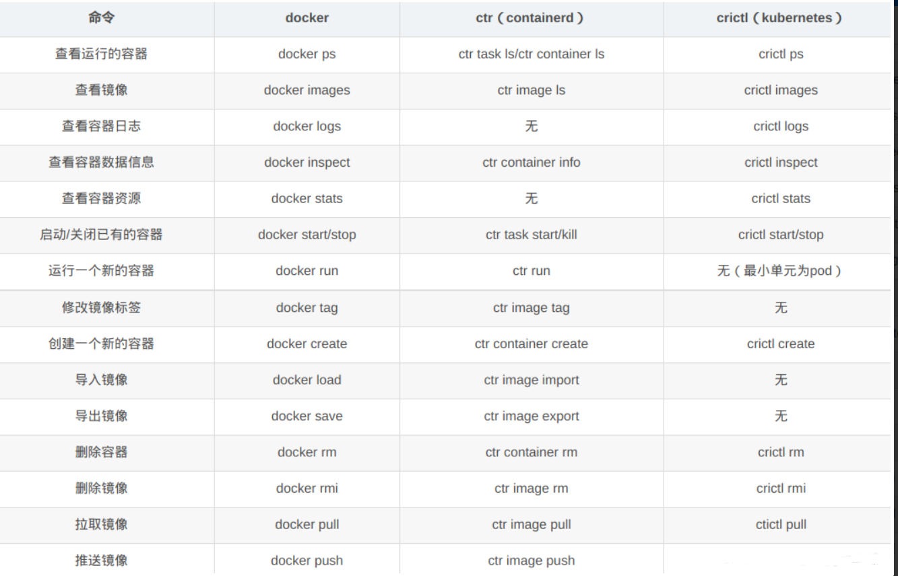

# K8S_Containerd Cluster

[Kubernetes 版本： v1.26](https://v1-26.docs.kubernetes.io/zh-cn/docs/setup/production-environment/tools/kubeadm/install-kubeadm/)

背景介绍
`kubernetes 1.24` 版本正式弃用 docker， 开始使用 `containerd` 作为容器运行时

运行时介绍

- OCI(Open Container Initiative)：2015年Google、docker、Redhat、IBM共同成立，定义了运行标准和镜像标准
- CRI(Container Runtime Interface)：2016 年12月Kubernetes 发布 CRI(容器运行时接口), 可以支持rkt等不同的运行时
- CRI-O：由redhat发起并开源，用于替代docker成为kubernetes的运行时，2016年开发,2019年4月8号进入CNCF孵化

## 1、集群规划与 K8S 安装

| 类型   | 服务器IP      | 主机名   | 配置  |
| ------ | ------------- | -------- | ----- |
| master | 192.168.2.131 | ubuntu01 | 2c/4g |
| node   | 192.168.2.132 | ubuntu02 | 2c/4g |
| node   | 192.168.2.133 | ubuntu03 | 2c/4g |

### 环境准备

```bash
# 设置主机名
hostnamectl set-hostname master
hostnamectl set-hostname node001
hostnamectl set-hostname node002

yum install -y epel-release
yum install -y net-tools
yum install -y vim # 这里报错看 AQS

## 关闭防火墙，关闭防火墙开机自启
systemctl stop firewalld
systemctl disable firewalld.service
 
reboot

# 时间同步
# 启动 chronyd 服务
systemctl start chronyd
# 设置 chronyd 服务开机自启
systemctl enable chronyd
# chronyd 服务启动几秒钟后使用 date 命令验证时间
date
## OR
yum install -y ntpdate
ntpdate ntp.aliyun.com

# Fix Static Ip
vim /etc/sysconfig/network-scripts/ifcfg-ens160
ONBOOT=yes
BOOTPROTO=static
IPADDR=192.168.3.4
PREFIX=24
NETMASK=255.255.255.0
GATEWAY=192.168.3.1
DNS1=8.8.8.8
# systemctl restart network
# systemctl restart NetworkManager
# systemctl status NetworkManager
# nmcli c reload
# nmcli c up $160
# nmcli n on
# 还有种可能是克隆时 MAC 地址冲突	https://www.codenong.com/cs106874096/

# 将 SELinux 设置为 permissive 模式（相当于将其禁用）
sudo setenforce 0
sudo sed -i 's/^SELINUX=enforcing$/SELINUX=permissive/' /etc/selinux/config
# sed -ri 's/SELINUX=enforcing/SELINUX=disabled/' /etc/selinux/config

# 禁用 swap 分区 注释掉 swap 分区一行
# k8s 要求关闭系统的swap。如果不关闭，默认配置下kubelet无法启动。不过可以在启动kubelet时添加命令行参数来解决 --fail-swap-on=false
swapoff -a
sed -i 's/.*swap.*/#&/' /etc/fstab
# 检查关闭swap成功
free -h

# 操作系统内核优化
# 调整内核参数
vim /etc/sysctl.d/k8s.conf
# 桥接网络模式，流量的分发过滤	开启内核路由转发功能
net.bridge.bridge-nf-call-ip6tables = 1
net.bridge.bridge-nf-call-iptables = 1
net.ipv4.ip_forward = 1
vm.max_map_count=262144
kernel.pid_max=4194303
fs.file-max=1000000
net.ipv4.tcp_max_tw_buckets=6000
net.netfilter.nf_conntrack_max=2097152
vm.swappiness=0

sudo sysctl -p /etc/sysctl.d/k8s.conf
sudo sysctl --system
# 检查是否应用成功
sysctl net.bridge.bridge-nf-call-iptables net.bridge.bridge-nf-call-ip6tables net.ipv4.ip_forward

# 执行 kubeadm init 前，要做参数优化
cat <<EOF | sudo tee /etc/modules-load.d/k8s.conf
ip_vs
overlay
br_netfilter
EOF
## 加载模块使其生效
modprobe overlay
modprobe ip_vs
modprobe br_netfilter
## 查看是否加载
lsmod | grep br_netfilter
lsmod | grep overlay

# 对 product_uuid 校验	确保 MAC 地址唯一
sudo cat /sys/class/dmi/id/product_uuid

# 检查端口是否启用 netcat nc
nc 127.0.0.1 6443

# 配置 IPVS
## kube-proxy 中的 IPVS 实现通过减少对 iptables 的使用来增加可扩展性。当 k8s 集群中的负载均衡配置变多的时候，IPVS能实现比 iptables 更高效的转发性能
# 安装ipset和ipvsadm
yum install -y ipset ipvsadm
# 编写配置文件
cat > /etc/sysconfig/modules/ipvs.modules <<EOF
#!/bin/bash
modprobe -- ip_vs
modprobe -- ip_vs_rr
modprobe -- ip_vs_wrr
modprobe -- ip_vs_sh
modprobe -- nf_conntrack
EOF
# 添加权限并执行
chmod +x /etc/sysconfig/modules/ipvs.modules && bash /etc/sysconfig/modules/ipvs.modules 
# 查看对应的模块是否加载成功
lsmod | grep -e ip_vs -e nf_conntrack
```

### Install CNI	&	Clone ISO

```bash
curl -L -k https://github.com/containernetworking/plugins/releases/download/v1.3.0/cni-plugins-linux-amd64-v1.3.0.tgz
mkdir /opt/cni/bin -p
tar xf cni-plugins-linux-amd64-v1.3.0.tgz -C /opt/cni/bin
cat << EOF | tee /etc/cni/net.d/10-containerd-net.conflist
{
 "cniVersion": "1.0.0",
 "name": "containerd-net",
 "plugins": [
   {
     "type": "bridge",
     "bridge": "cni0",
     "isGateway": true,
     "ipMasq": true,
     "promiscMode": true,
     "ipam": {
       "type": "host-local",
       "ranges": [
         [{
           "subnet": "10.88.0.0/16" 
         }],
         [{
           "subnet": "2001:db8:4860::/64"
         }]
       ],
       "routes": [
         { "dst": "0.0.0.0/0" },
         { "dst": "::/0" }
       ]
     }
   },
   {
     "type": "portmap",
     "capabilities": {"portMappings": true},
     "externalSetMarkChain": "KUBE-MARK-MASQ"
   }
 ]
}
EOF

# 至此，可以进行 复制 ISO 系统镜像
# 需要以下步骤：
# 	1. 更改 主机名
# 	2. 更新 Hosts
echo "192.168.3.4 master" >> /etc/hosts
echo "192.168.3.5 node001" >> /etc/hosts
echo "192.168.3.6 node002" >> /etc/hosts
# 	3. 部署密钥	其他节点互信
ssh-keygen
# ssh-copy-id -i id_rsa.pub <hostname>
ssh-copy-id -f -i /root/.ssh/id_rsa -p 22 root@master
ssh-copy-id -f -i /root/.ssh/id_rsa -p 22 root@node001
ssh-copy-id -f -i /root/.ssh/id_rsa -p 22 root@node002
```

### **安装 Crictl**

```bash
# 安装 Crictl
wget https://github.com/kubernetes-sigs/cri-tools/releases/download/v1.26.1/crictl-v1.26.1-linux-amd64.tar.gz
tar -zxvf crictl-v1.26.1-linux-amd64.tar.gz -C /usr/local/bin
systemctl daemon-reload

# Error
mv /etc/containerd/config.toml /etc/containerd/config.bak
containerd config default > /etc/containerd/config.toml
systemctl daemon-reload
systemctl restart containerd

crictl ps
crictl images ps
crictl pull nginx:1.18.0
crictl pods --name etcd
crictl exec -it 1f73f2d81bf98 ls
```

### **安装 Containerd**

```bash
# Containerd
yum install -y yum-utils 
# yum install -y device-mapper-persistent-data lvm2
yum-config-manager --add-repo https://download.docker.com/linux/centos/docker-ce.repo
yum install -y containerd.io

# 以下为二进制方式，上述安装成功 Skip ~ !
# apt-cache madison  containerd # 验证仓库版版本，不建议二进制方式安装
cd /usr/local/src/
https://github.com/containerd/containerd/releases/download/v1.6.6/containerd-1.6.6-linux-amd64.tar.gz #下载地址
tar xvf containerd-1.6.6-linux-amd64.tar.gz
cp bin/* /usr/local/bin/
vim /lib/systemd/system/containerd.service     
# 查看service文件，将以下内容复制到containerd.service文件中，修改执行路径ExecStart 为/usr/local/bin
----------------------------------------------------
# Copyright The containerd Authors.
#
# Licensed under the Apache License, Version 2.0 (the "License");
# you may not use this file except in compliance with the License.
# You may obtain a copy of the License at
#
#     http://www.apache.org/licenses/LICENSE-2.0
#
# Unless required by applicable law or agreed to in writing, software
# distributed under the License is distributed on an "AS IS" BASIS,
# WITHOUT WARRANTIES OR CONDITIONS OF ANY KIND, either express or implied.
# See the License for the specific language governing permissions and
# limitations under the License.

[Unit]
Description=containerd container runtime
Documentation=https://containerd.io
After=network.target local-fs.target

[Service]
ExecStartPre=-/sbin/modprobe overlay
ExecStart=/usr/local/bin/containerd

Type=notify
Delegate=yes
KillMode=process
Restart=always
RestartSec=5
# Having non-zero Limit*s causes performance problems due to accounting overhead
# in the kernel. We recommend using cgroups to do container-local accounting.
LimitNPROC=infinity
LimitCORE=infinity
LimitNOFILE=infinity
# Comment TasksMax if your systemd version does not supports it.
# Only systemd 226 and above support this version.
TasksMax=infinity
OOMScoreAdjust=-999

[Install]
WantedBy=multi-user.target
-----------------------------------------------------
# 默认输出配置文件
mkdir /etc/containerd/
containerd config default > /etc/containerd/config.toml
vim /etc/containerd/config.toml
sandbox_image = "k8s.gcr.io/pause:3.6" 修改为 sandbox_image = "registry.cn-hangzhou.aliyuncs.com/google_containers/pause:3.7"
# 配置镜像加速
[plugins."io.containerd.grpc.v1.cri".registry.mirrors."docker.io"]
  endpoint = ["https://lzpmltr2.mirror.aliyuncs.com"]
  
systemctl restart containerd && systemctl enable containerd # 启动设置开机自启动
```

### **安装工具 kubeadm & kubelet & kubectl**

```bash
cat <<EOF > /etc/yum.repos.d/kubernetes.repo
[kubernetes]
name=Kubernetes
baseurl=http://mirrors.aliyun.com/kubernetes/yum/repos/kubernetes-el7-x86_64
enabled=1
gpgcheck=1
repo_gpgcheck=0
gpgkey=http://mirrors.aliyun.com/kubernetes/yum/doc/yum-key.gpg
        http://mirrors.aliyun.com/kubernetes/yum/doc/rpm-package-key.gpg
EOF

yum makecache

# 安装 kubeadm、kubectl、kubelet 
# 查看可用版本
yum list kubeadm.x86_64 --showduplicates | sort -r
yum list kubelet.x86_64 --showduplicates | sort -r
yum list kubectl.x86_64 --showduplicates | sort -r

# apt-cache madison kubeadm

sudo yum install -y kubelet-1.26.1 kubeadm-1.26.1 kubectl-1.26.1 --disableexcludes=kubernetes --setopt=obsoletes=0
sudo systemctl enable --now kubelet
```

```bash
# config kubelet cgroup
cat << EOF > /etc/sysconfig/kubelet
KUBELET_EXTRA_ARGS="--cgroup-driver=systemd"
EOF

# config CRI
cat > /etc/crictl.yaml << EOF
runtime-endpoint: unix:///run/containerd/containerd.sock
image-endpoint: unix:///run/containerd/containerd.sock
timeout: 10
debug: false
EOF
```

```bash
# 查看安装的信息
rpm -qa | grep kube
```

### 初始化集群

```bash
vim /etc/containerd/config.toml
# [plugins."io.containerd.grpc.v1.cri"] 下的 sandbox_image
# 修改为一个你可以获取到镜像的源地址
sandbox_image="registry.aliyuncs.com/google_containers/pause:3.9"
# 还有需要加上下面
在[plugins."io.containerd.grpc.v1.cri".containerd.runtimes.runc]中加入
  ...
  [plugins."io.containerd.grpc.v1.cri".containerd.runtimes.runc.options]
    SystemdCgroup = true

# Init
kubeadm init \
--apiserver-advertise-address=192.168.3.4 \
--kubernetes-version=v1.26.0 \
--image-repository=registry.aliyuncs.com/google_containers \
--pod-network-cidr=10.244.0.0/16 \
--service-cidr=10.96.0.0/12

# 通过 配置文件 Init
kubeadm config print init-defaults --component-configs KubeletConfiguration > kubeadm.yaml
kubeadm config images pull --config kubeadm.yaml
### 修改 配置文件中 Master 地址 Pod 可用网段 etc...
# 无用镜像较多可以清理一下 删除镜像名称包含 "io" 的镜像
crictl images | grep -E -- 'io' | awk '{print $3}'|xargs -n 1 crictl rmi
```

### Config

```bash
# 配置常规用户使用 kubectl 访问集群
mkdir -p $HOME/.kube
sudo cp -i /etc/kubernetes/admin.conf $HOME/.kube/config
sudo chown $(id -u):$(id -g) $HOME/.kube/config

# 集群的组件状态
kubectl get cs
kubectl get nodes -o wide
# 目前节点属于 宕机状态，配置网络插件
curl -o kube-flannel.yml  https://raw.githubusercontent.com/coreos/flannel/master/Documentation/kube-flannel.yml
sed -i 's/quay.io/quay-mirror.qiniu.com/g' kube-flannel.yml
kubectl apply -f kube-flannel.yml
kubectl delete -f flannel.yaml

systemctl restart kubelet

# kubectl delete --all pods --namespace=kube-flannel --force --grace-period=0
# kubectl delete pod kube-flannel-ds-amd64-6nqsb -n <name-space> --force --grace-period=0
# kubectl delete ns kube-flannel --force --grace-period=0

kubectl get po -n kube-system
kubectl get po -n kube-flannel

kubeadm join 192.168.3.4:6443 --token o4njar.nmsy8d8qodaqthr7 \
        --discovery-token-ca-cert-hash sha256:dd7a8ab62a99e434338b48de40e1f2e3650162f5bd54b8eb8d44b8193d235c84
# 注意该 token 24 小时后会失效，重新获取命令
kubeadm token create --print-join-command
```

### AQS

```bash
1. Error
Failed to set locale, defaulting to C.UTF-8
Last metadata expiration check: 0:01:32 ago on Thu Nov  9 09:13:10 2023.
No match for argument: yum-utils
Error: Unable to find a match: yum-utils
	Solution:
echo "export LC_ALL=en_US.UTF-8" >> /etc/profile
echo "export LC_CTYPE=en_US.UTF-8" >> /etc/profile
source /etc/profile
curl -o /etc/yum.repos.d/CentOS-Stream-BaseOS.repo http://mirrors.aliyun.com/repo/Centos-8.repo
vim /etc/yum.repos.d/CentOS-Stream-BaseOS.repo
# %s/$releasever/$releasever-stream/g
%s/$releasever/8-stream/g


yum clean all
yum check-update  # 清除 yum 缓存
### 执行完成之后 需要刷新 yum 源
yum repolist

# YUM 源
### 谷歌 YUM 源
cat <<EOF > /etc/yum.repos.d/kubernetes.repo
[kubernetes]
name=Kubernetes
baseurl=https://packages.cloud.google.com/yum/repos/kubernetes-el7-x86_64
enabled=1
gpgcheck=1
repo_gpgcheck=1
gpgkey=https://packages.cloud.google.com/yum/doc/yum-key.gpg
        https://packages.cloud.google.com/yum/doc/rpm-package-key.gpg
EOF

### 阿里云	报错：修改 repo_gpgcheck=0 跳过验证
cat <<EOF > /etc/yum.repos.d/kubernetes.repo
[kubernetes]
name=Kubernetes
baseurl=https://mirrors.aliyun.com/kubernetes/yum/repos/kubernetes-el7-x86_64/
enabled=1
gpgcheck=1
repo_gpgcheck=1
gpgkey=https://mirrors.aliyun.com/kubernetes/yum/doc/yum-key.gpg https://mirrors.aliyun.com/kubernetes/yum/doc/rpm-package-key.gpg
EOF

### 华为云：	具体见 https://www.huaweicloud.com/zhishi/Kubernetes.html
cat <<EOF > /etc/yum.repos.d/kubernetes.repo 
[kubernetes] 
name=Kubernetes 
baseurl=https://repo.huaweicloud.com/kubernetes/yum/repos/kubernetes-el7-$basearch 
enabled=1 
gpgcheck=1 
repo_gpgcheck=1 
gpgkey=https://repo.huaweicloud.com/kubernetes/yum/doc/yum-key.gpg https://repo.huaweicloud.com/kubernetes/yum/doc/rpm-package-key.gpg 
EOF
```

#### Nerdctl

```bash
# 参照 Containerd version	安装合适的 nerdctl
wget https://github.com/containerd/nerdctl/releases/download/v0.22.2/nerdctl-0.22.2-linux-amd64.tar.gz
tar -zxvf nerdctl-0.22.2-linux-amd64.tar.gz
mv nerdctl /usr/local/bin

nerdctl pull nginx:1.18.0
nerdctl ps -a
nerdctl images -a
nerdctl run -d -p 8080:80 --name=nginx --restart=always nginx:1.18.0
nerdctl exec -it 70d014105fed bash
nerdctl network ls
nerdctl network inspect bridge
nerdctl rm -f 600f493049b9
```



1. [init]：指定版本进行初始化操作
2. [preflight] ：初始化前的检查和下载所需要的 Docker 镜像文件。这需要一段时间，需要做好镜像加速
3. [kubelet-start]：生成 `kubelet` 的配置文件 `/var/lib/kubelet/config.yaml` ，没有这个文件 kubelet 无法启动，所以初始化之前的 kubelet 实际上启动失败
4. [certificates]：生成 Kubernetes 使用的证书，存放在 `/etc/kubernetes/pki` 目录中
5. [kubeconfig] ：生成 KubeConfig 文件，存放在 `/etc/kubernetes` 目录中，组件之间通信需要使用对应文件
6. [control-plane]：使用 `/etc/kubernetes/manifest` 目录下的 YAML 文件，安装 Master 组件
7. [etcd]：使用 `/etc/kubernetes/manifest/etcd.yaml` 安装 `Etcd` 服务
8. [wait-control-plane]：等待 `control-plan` 部署的 Master 组件启动
9. [apiclient]：检查 Master 组件服务状态
10. [uploadconfig]：更新配置
11. [kubelet]：使用 configMap 配置 `kubelet`
12. [patchnode]：更新 CNI 信息到 Node 上，通过注释的方式记录
13. [mark-control-plane]：为当前节点打标签，打了角色 Master，和不可调度标签，这样默认就不会使用 Master 节点来运行 Pod
14. [bootstrap-token]：生成 `token` 记录下来，后边使用 `kubeadm join` 往集群中添加节点时会用到
15. [addons]：安装附加组件 `CoreDNS` 和 `kube-proxy`


## 2、验证集群可用

在集群中创建一个 `Nginx` 的 `Pod`，验证是否可以访问该 `Nginx` 服务。如下：

```bash
kubectl create deployment nginx --image=nginx
kubectl expose deployment nginx --port=80 --type=NodePort

alias k='kubectl'
k get pod,svc
NAME                         READY   STATUS    RESTARTS   AGE
pod/nginx-748c667d99-jxshw   1/1     Running   0          77s

NAME                 TYPE        CLUSTER-IP     EXTERNAL-IP   PORT(S)        AGE
service/kubernetes   ClusterIP   10.96.0.1      <none>        443/TCP        20h
service/nginx        NodePort    10.111.232.7   <none>        80:32474/TCP   72s
# 可通过 Port：32474 访问
```

### **部署 `Dashboard`**

```bash
# https://github.com/kubernetes/dashboard/releases
kubectl apply -f https://raw.githubusercontent.com/kubernetes/dashboard/v2.7.0/aio/deploy/recommended.yaml

k get po -n kubernetes-dashboard
k get svc -n kubernetes-dashboard
kubectl get ClusterRole -n kubernetes-dashboard
kubectl get ServiceAccount -n kubernetes-dashboard

# 获取 Token
kubectl -n kubernetes-dashboard create token kubernetes-dashboard
kubectl create token --namespace kubernetes-dashboard --duration 2592000s kubernetes-dashboard

# token 只是创建了，但是没有放在 secrets 里
kubectl -n kubernetes-dashboard get serviceaccounts kubernetes-dashboard
# 集群管理员有所有权限
kubectl -n kubernetes-dashboard describe clusterrole cluster-admin
# dashboard 只有看的权限
kubectl -n kubernetes-dashboard describe clusterrole kubernetes-dashboard
# 提权
kubectl create clusterrolebinding kubernetes-dashboard-cluster-admin --clusterrole=cluster-admin --serviceaccount=kubernetes-dashboard:kubernetes-dashboard

kubectl delete clusterrolebinding kubernetes-dashboard-cluster-admin

kubectl -n kubernetes-dashboard get secret|grep admin-user

# 查看集群的权限绑定
kubectl get clusterrolebindings -o wide | grep dash
# Reference：https://blog.csdn.net/qq_41619571/article/details/127217339
# 修改 认证过期时间
kubectl edit deployment kubernetes-dashboard -n  kubernetes-dashboard
args:
- --auto-generate-certificates
- --token-ttl=43200

# 开启外网访问
kubectl patch svc kubernetes-dashboard -p '{"spec":{"type":"NodePort"}}' -n kubernetes-dashboard

kubectl get svc -n kubernetes-dashboard

# # 以下方式 目前版本不可行
# 创建 service account 并绑定默认 cluster-admin 管理员集群角色
vim dashboard-adminuser.yaml
apiVersion: v1
kind: ServiceAccount
metadata:
  name: admin-user
  namespace: kubernetes-dashboard
---
apiVersion: rbac.authorization.k8s.io/v1
kind: ClusterRoleBinding
metadata:
  name: admin-user
roleRef:
  apiGroup: rbac.authorization.k8s.io
  kind: ClusterRole
  name: cluster-admin
subjects:
- kind: ServiceAccount
  name: admin-user
  namespace: kubernetes-dashboard

kubectl apply -f dashboard-adminuser.yaml

kubectl -n kubernetes-dashboard get sa/admin-user -o jsonpath="{.secrets[0].name}"
# 查看 token
kubectl -n kubernetes-dashboard get secret $(kubectl -n kubernetes-dashboard get sa/admin-user -o jsonpath="{.secrets[0].name}") -o go-template="{{.data.token | base64decode}}"
```

这里 Chrome 可能会提示 连接不安全，直接在当前页面用键盘输入 `thisisunsafe`，是由于 chrome 版本移除了关于 `ssl` 配置错误！


## 3、KVM 打包 Image

```bash
tar --exclude=/proc --exclude=/sys  -cPvf nk-base.tar / 
# 此命令将本机运行的操做系统打成一个.tar包，能够使用 --exclude 参数将不须要的目录进行排除，可排除多个目录。文件打包支持的类型只有.tar, .tar.gz, .tgz, .bzip, .tar.xz等几种格式。打包完成后放在/usr目录下

cat nk-base.tar | docker import - nk-base 
# 将制做的 tar 包使用docker import镜像导入, 并命令为:nk-base: 

docker run -i -t nk-base  /bin/bash 使用docker命令启动镜像。
# -i 以交互模式运行容器 
# -t 为容器从新分配一个伪输入终端，一般与 -i 同时使用
# /bin/bash 是指在容器启动后容器内执行的命令
```

