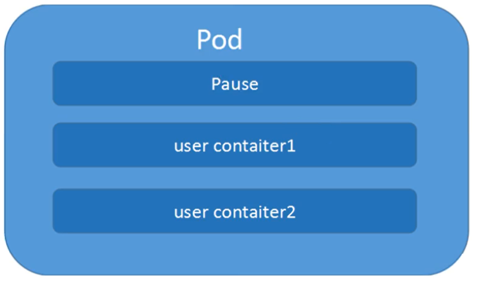

# Kubernetes 核心技术 Pod

## Pod 概述

​	Pod 是 K8S 系统中可以创建和管理的最小单元，是资源对象模型中由用户创建或部署的最小资源对象模型，也是在 K8S 上运行容器化应用的资源对象，其它的资源对象都是用来支撑或者扩展 Pod 对象功能的，比如控制器对象是用来管控Pod对象的，Service 或者 Ingress 资源对象是用来暴露 Pod 引用对象的，PersistentVolume 资源对象是用来为 Pod 提供存储等等，K8S 不会直接处理容器，而是Pod，Pod 是由一个或多个 Container 组成。

​	Pod 是 Kubernetes 的最重要概念，每一个 Pod 都有一个特殊的被称为 “根容器”的 Pause 容器。Pause 容器对应的镜像属于Kubernetes 平台的一部分，除了 Pause 容器，每个 Pod 还包含一个或多个紧密相关的用户业务容器。



### Pod 基本概念

- 最小部署的单元
- Pod 里面是由一个或多个容器组成【一组容器的集合】
- 一个 Pod 中的容器是共享网络命名空间
- Pod 是短暂的
- 每个 Pod 包含一个或多个紧密相关的用户业务容器

### Pod 存在的意义

- 创建容器使用 docker，一个 docker 对应一个容器，一个容器运行一个应用进程
- Pod 是多进程设计，运用多个应用程序，也就是一个 Pod 里面有多个容器，而一个容器里面运行一个应用程序


- Pod 的存在是为了亲密性应用
  - 两个应用之间进行交互
  - 网络之间的调用【通过127.0.0.1 或 socket】
  - 两个应用之间需要频繁调用

​	Pod 是在 K8S 集群中运行部署应用或服务的最小单元，它是可以支持多容器的。Pod 的设计理念是支持多个容器在一个Pod中共享网络地址和文件系统，可以通过进程间通信和文件共享这种简单高效的方式组合完成服务。同时 Pod 对多容器的支持是 K8S 中最基础的设计理念。在生产环境中，通常是由不同的团队各自开发构建自己的容器镜像，在部署的时候组合成一个微服务对外提供服务。

​	Pod 是 K8S 集群中所有业务类型的基础，可以把 Pod 看作运行在 K8S 集群上的小机器人，不同类型的业务就需要不同类型的小机器人去执行。目前 K8S 的业务主要可以分为以下几种

- 长期伺服型：`long-running`
- 批处理型：`batch`
- 节点后台支撑型：`node-daemon`
- 有状态应用型：`stateful application`

上述的几种类型，分别对应的小机器人控制器为：Deployment、Job、DaemonSet 和 StatefulSet  (后面将介绍控制器)

## Pod 实现机制

主要有以下两大机制

- 共享网络
- 共享存储

### 共享网络

容器本身之间相互隔离的，一般是通过 **namespace** 和 **group** 进行隔离，那么 Pod 里面的容器如何实现通信？

- 首先需要满足前提条件，也就是容器都在同一个 **namespace** 之间

​	关于 Pod 实现原理，首先会在 Pod 会创建一个根容器： `pause 容器`，然后在创建业务容器 【nginx，redis 等】，在创建业务容器的时候，会把它添加到 `info 容器` 中

而在 `info 容器` 中会独立出  `ip` 地址，`mac` 地址，`port` 等信息，然后实现网络的共享


完整步骤如下

- 通过 Pause 容器，把其它业务容器加入到 `Pause` 容器里，让所有业务容器在同一个名称空间中，可以实现网络共享

### 共享存储

​	创建 Pod 的时候可以指定挂载的存储卷。 POD 中的所有容器都可以访问共享卷，允许这些容器共享数据。 Pod 只要挂载持久化数据卷，Pod 重启之后数据还是会存在的。

​	Pod 持久化数据，专门存储到某个地方中，因为在故障转移的过程中如果数据没有了，那么损失是非常严重的。


使用 Volumn 数据卷进行共享存储，案例如下所示


### 自主式 Pod

直接定义一个 Pod 资源

```bash
vim pod-tomcat.yaml 
apiVersion: v1
kind: Pod
metadata:
  name: tomcat-test
  namespace: default
  labels:
    app:  tomcat
spec:
  containers:
  - name:  tomcat-java
    image: tomcat
    imagePullPolicy: IfNotPresent
    ports:
    - containerPort: 8080
    
kubectl apply -f pod-tomcat.yaml
kubectl get pods -o wide -l app=tomcat

# 自主式 Pod 存在一个问题，删除了 pod
kubectl delete pods tomcat-test
kubectl get pods -l app=tomcat
# 结果是空，说明 pod 已经被删除了 
```

​	通过上面可以看到，如果直接定义一个 Pod 资源，那 Pod 被删除，就彻底被删除了，不会再创建一个新的 Pod，这在生产环境还是具有非常大风险的，所以今后接触的 Pod 都是控制器管理的。如果是不重要的可以重新更新资源清单（yaml 文件保存好）。

### 控制器管理的 Pod

常见的管理 Pod 的控制器：Replicaset、Deployment、Job、CronJob、Daemonset、Statefulset
控制器管理的 Pod 可以确保 Pod 始终维持在指定的副本数运行。 比如通过 Deployment 管理 Pod

```bash
vim nginx-deploy.yaml
apiVersion: apps/v1
kind: Deployment
metadata:
  name: nginx-test
  labels:
    app: nginx-deploy
spec:
  selector:
    matchLabels:
      app: nginx
  replicas: 2
  template:
    metadata:
      labels:
        app: nginx
    spec:
      containers:
      - name: my-nginx
        image: nginx
        imagePullPolicy: IfNotPresent
        ports:
        - containerPort: 80

# 更新资源清单文件 
kubectl apply -f nginx-deploy.yaml
 
# 查看 Deployment 
kubectl get deploy -l app=nginx-deploy
 
# 查看 pod 
kubectl get pods -o wide -l app=nginx    
 
# 删除 nginx-test-84b997bfc5-6dkxx 这个 pod
kubectl delete pods nginx-test-84b997bfc5-6dkxx

kubectl get pods -o wide -l app=nginx    
# 发现重新创建一个新的 pod 是 nginx-test-84b997bfc5-6vccl
```

通过 `deployment` 管理的 pod，可以确保 pod 始终维持在指定副本数量，而且两个 `pod` 访问哪个结果都是一样的！

<hr>

## Pod 镜像拉取策略

以具体实例来说，拉取策略就是 `imagePullPolicy`


拉取策略主要分为了以下几种

- `IfNotPresent`：默认值，镜像在宿主机上不存在才拉取
- `Always`：每次创建 Pod 都会重新拉取一次镜像
- `Never`：Pod 永远不会主动拉取这个镜像

## Pod 资源限制

​	Pod 在进行调度的时候，可以对调度的资源进行限制，例如限制 Pod 调度是使用的资源是 2C 4G，那么在调度对应的 Node 节点时，只会占用对应的资源，对于不满足资源的节点，将不会进行调度


### 示例

在下面的地方进行资源的限制


这里分了两个部分

- `request`：表示调度所需的资源
- `limits`：表示最大所占用的资源

## Pod 重启机制

因为 Pod 中包含了很多个容器，假设某个容器出现问题了，那么就会触发 Pod 重启机制


重启策略主要分为以下三种

- `Always`：当容器终止退出后，总是重启容器，默认策略 【nginx 等，需要不断提供服务】
- `OnFailure`：当容器异常退出（退出状态码非0）时，才重启容器
- `Never`：当容器终止退出，从不重启容器 【批量任务】

## Pod 健康检查

通过容器检查，原来使用下面的命令来检查

```bash
kubectl get pod
```

但是有的时候，程序可能出现了 **Java** 堆内存溢出，程序还在运行，但是不能对外提供服务了，这个时候就不能通过 容器检查来判断服务是否可用了，这个时候就可以使用应用层面的检查

```bash
# 存活检查，如果检查失败，将杀死容器，根据 Pod 的 restartPolicy【重启策略】来操作
livenessProbe

# 就绪检查，如果检查失败，Kubernetes 会把 Pod 从 Service endpoints 中剔除
readinessProbe
```


Probe 支持以下三种检查方式

- `http Get`：发送 HTTP 请求，返回 200 - 400 范围状态码为成功
- `exec`：执行 Shell 命令返回状态码是 0 为成功
- `tcpSocket`：发起 TCP Socket 建立成功

## Pod 调度策略

​	Pod 是 Kubernetes 中最基本的部署调度单元，可以包含 Container，逻辑上表示某种应用的一个实例。

### 创建 Pod 流程

- 首先创建一个pod，然后创建一个 API Server 和 Etcd【把创建出来的信息存储在 etcd 中】
- 然后创建 Scheduler，监控 API Server 是否有新的 Pod，如果有的话，会通过调度算法，把 Pod 调度某个 Node 上
- 在 Node 节点，会通过 `kubelet -- apiserver ` 读取 etcd 拿到分配在当前 Node 节点上的 Pod，然后创建容器


> apiserver 又通过 watch 机制，调用 kubelet，指定 pod 信息，调用 Docker API 创建并启动 pod 内的容器
>
> 创建完成之后反馈给 kubelet，kubelet 又将 pod 的状态信息给 apiserver, apiserver 又将 pod 的状态信息写入 etcd
>
> Master 节点：kubectl -> kube-api -> kubelet -> CRI 容器环境初始化

### 影响 Pod 调度的属性

Pod 资源限制对 Pod 的调度会有影响

**根据 request 找到足够 node 节点进行调度**


**节点选择器标签影响 Pod 调度**


关于节点选择器，其实就是有两个环境，然后环境之间所用的资源配置不同


可以通过以下命令，给的节点新增标签，然后节点选择器就会进行调度了

```bash
kubectl label node node1 env_role=prod
```


### 节点亲和性

节点亲和性 **nodeAffinity** 和 之前 NodeSelector 基本一样的，根据节点上标签约束来决定 Pod 调度到哪些节点上

- 硬亲和性：约束条件必须满足
- 软亲和性：尝试满足，不保证


支持常用操作符：`in、NotIn、Exists、Gt、Lt、DoesNotExists`

反亲和性：就是和亲和性刚刚相反，如 `NotIn`、`DoesNotExists` 等

```bash
# 节点亲和性调度：nodeAffinity
kubectl explain pods.spec.affinity

kubectl explain pods.spec.affinity.nodeAffinity
## prefered 表示有节点尽量满足这个位置定义的亲和性，这不是一个必须的条件，软亲和性
## require 表示必须有节点满足这个位置定义的亲和性，这是个硬性条件，硬亲和性

kubectl explain pods.spec.affinity.nodeAffinity.requiredDuringSchedulingIgnoredDuringExecution

kubectl explain pods.spec.affinity.nodeAffinity.requiredDuringSchedulingIgnoredDuringExecution.nodeSe

kubectl explain pods.spec.affinity.nodeAffinity.requiredDuringSchedulingIgnoredDuringExecution.nodeSelectorTerms.matchExpressions
## operator：做等值选则还是不等值选则
## values：给定值
```

##### 栗子🌰

```bash
# requiredDuringSchedulingIgnoredDuringExecution 硬亲和性
apiVersion: v1
kind: Pod
metadata:
        name: pod-node-affinity-demo
        namespace: default
        labels:
            app: myapp
            tier: frontend
spec:
    containers:
    - name: myapp
      image: nginx
    affinity:
         nodeAffinity:
            requiredDuringSchedulingIgnoredDuringExecution:
                   nodeSelectorTerms:
                   - matchExpressions:
                     - key: zone
                       operator: In
                       values:
                       - foo
                       - bar
### 当前节点中有任意一个节点拥有 zone 标签的值是 foo 或者 bar，就可以把 pod 调度到这个 node 节点的 foo 或者 bar 标签上的节点上

kubectl get pods -o wide | grep pod-node 
pod-node-affinity-demo        0/1     Pending   0          11s    <none>        <none>     <none>

kubectl label nodes k8snode zone=foo
pod-node-affinity-demo        1/1     Running   0          4m4s   10.244.2.19   k8snode    <none>

# preferredDuringSchedulingIgnoredDuringExecution 软亲和性
apiVersion: v1
kind: Pod
metadata:
        name: pod-node-affinity-demo-2
        namespace: default
        labels:
            app: myapp
            tier: frontend
spec:
    containers:
    - name: myapp
      image: nginx
    affinity:
        nodeAffinity:
            preferredDuringSchedulingIgnoredDuringExecution:
            - preference:
               matchExpressions:
               - key: zone1
                 operator: In
                 values:
                 - foo1
                 - bar1
              weight: 60
### 所有的工作节点都没有这个标签，pod 还是会调度
kubectl get pods -o wide |grep demo-2
pod-node-affinity-demo-2      1/1     Running   0          29s     10.244.1.20   k8snode2   <none>

# Node 节点亲和性针对的是 pod 和 node 的关系，Pod 调度到 node 节点的时候匹配的条件
```


### Node 节点选择器

1. ### nodeName

   ```yml
   apiVersion: v1 
   kind: Pod 
   metadata: 
     name: demo-pod
     namespace: default 
     labels: 
       app: myapp 
       env: dev 
   spec: 
     nodeName: k8snode
     containers: 
     - name: tomcat-pod-java 
       ports: 
       - containerPort: 8080 
       image: tomcat
       imagePullPolicy: IfNotPresent 
     - name: busybox 
       image: busybox:latest 
       command: 
       - "/bin/sh" 
       - "-c" 
       - "sleep 3600" 
   ```

2. ### nodeSelector

   ```yml
   apiVersion: v1 
   kind: Pod 
   metadata: 
     name: demo-pod-1 
     namespace: default 
     labels: 
       app: myapp 
       env: dev 
   spec: 
     nodeSelector:
       disk: ceph
     containers: 
     - name: tomcat-pod-java 
       ports: 
       - containerPort: 8080 
       image: tomcat
       imagePullPolicy: IfNotPresent 
   ```


## 污点和污点容忍

### 概述

`nodeSelector` 和 `NodeAffinity`，都是 Pod 调度到某些节点上，属于 Pod 的属性，是在调度的时候实现的

`Taint` 污点：节点不做普通分配调度，是节点属性

### 场景

- 专用节点【限制 `ip`】
- 配置特定硬件的节点【固态硬盘】
- 基于 `Taint` 驱逐【在 Node1 不放，在 Node2 放】

### 查看污点情况

```bash
kubectl describe node k8smaster | grep Taint
```


污点值有三个

- `NoSchedule`：一定不被调度
- `PreferNoSchedule`：尽量不被调度【也有被调度的几率】
- `NoExecute`：不会调度，并且还会驱逐 Node 已有 Pod

### 未节点添加污点

```bash
kubectl taint node [node] key=value:污点的三个值
```

举例：

```bash
kubectl taint node k8snode1 env_role=yes:NoSchedule
```

### 删除污点

```bash
kubectl taint node k8snode1 env_role:NoSchedule-
```


### 演示

现在创建多个 Pod，查看最后分配到 Node 上的情况

首先创建一个 nginx 的  Pod 

```bash
kubectl create deployment web --image=nginx
```

然后使用命令查看

```bash
kubectl get pods -o wide
```


可以非常明显的看到，这个 Pod 已经被分配到 k8snode1 节点上了

下面把 Pod 复制5份，在查看情况 Pod 情况

```bash
kubectl scale deployment web --replicas=5
```

可以发现，因为 master 节点存在污点的情况，所以节点都被分配到了 node1 和 node2 节点上


可以使用下面命令，把刚刚创建的 Pod 都删除

```bash
kubectl delete deployment web
```

现在给了更好的演示污点的用法，现在给 node1 节点打上污点

```bash
kubectl taint node k8snode1 env_role=yes:NoSchedule
```

然后查看污点是否成功添加

```bash
kubectl describe node k8snode1 | grep Taint
```


然后在创建一个  Pod 

```bash
# 创建nginx pod
kubectl create deployment web --image=nginx
# 复制五次
kubectl scale deployment web --replicas=5
```

然后在进行查看

```bash
kubectl get pods -o wide
```

能够看到现在所有的 Pod 都被分配到了 k8snode2 上，因为刚刚给 node1 节点设置了污点


最后可以删除刚刚添加的污点

```bash
kubectl taint node k8snode1 env_role:NoSchedule-
```

### 污点容忍

污点容忍就是某个节点可能被调度，也可能不被调度

