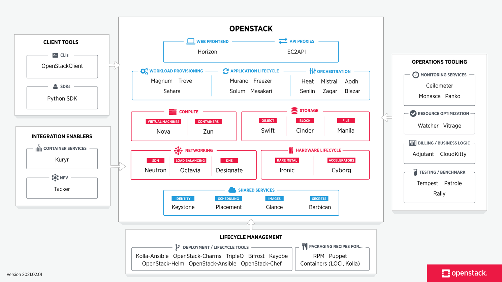

# OpenStack

​	OpenStack是一个开源的云操作系统，或者说是开源的云计算管理平台。OpenStack是对底层资源（计算、存储、网络）进行管理（或者说是对laaS层进行管理），并以服务的方式提供给上层应用或者是用户去使用。

## Commands

### Virsh

>  virsh 虚拟机管理

- `list [--all]` 列出虚拟机
- `start|shutdown|reboot`   虚拟机启动，停止，重启
- `destroy` 强制停止虚拟机

- `definelundefine`   根据xml文件创建/删除虚拟机
- `console`   连接虚拟机的console

- `edit`   修改虚拟机的配置
- `autostart`   设置虚拟机自启动
- `domiflist`   查看虚拟机网卡信息
- `domblklist`      查看虚拟机硬盘信息

> virsh 虚拟网络管理

- `net-list [--all]`    列出虚拟网络
- `net-start`   启动虚拟交换机
- `net-destroy`   强制停止虚拟交换机
- `net-define`   根据xml文件创建虚拟网络
- `net-undefine`    删除一个虚拟网络设备
- `net-edit`   修改虚拟交换机的配置
- `net-autostart`    设置虚拟交换机机自启动

### eip

`eip 20`    192.168.1.xx

### Qemu-img

虚拟机的磁盘管理命令，支持非常多的磁盘格式，例如 raw、**qcow2**、vdi、vmdk 等等
`qemu-img 命令   参数   块文件名称   大小`

- `create`   创建一个磁盘   `-f qcow2 aa.img 50G`
  `-b disk.img -f qcow2 disk1.img`   使用后端模板
- `convert`   转换磁盘格式
- `info`   查看磁盘信息
- `resize`   扩容磁盘空间

## 虚拟化

### KVM

### VMware

