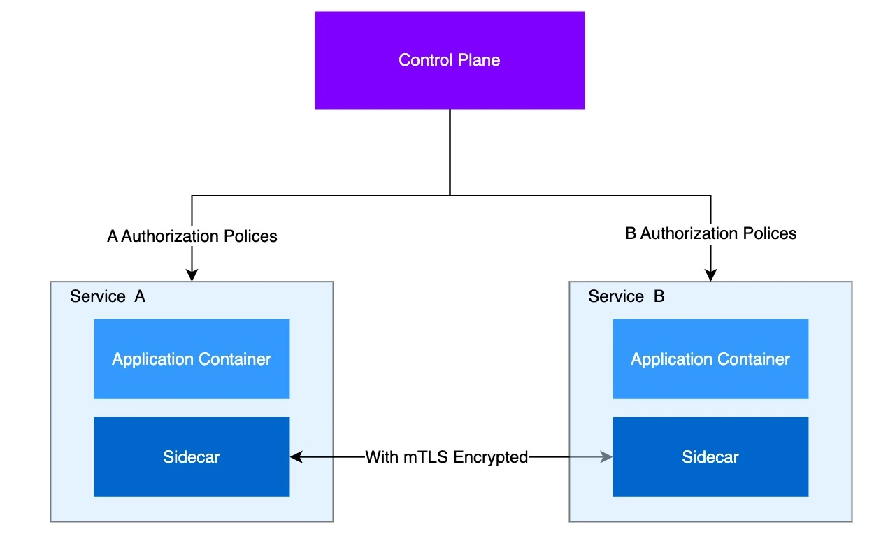
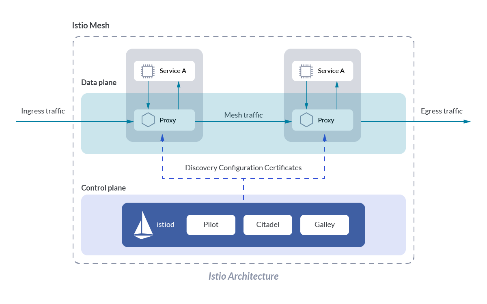

# 云原生

## 云平台核心

### 1、为什么用云平台

- 环境统一：网络和软件统一
- 按需付费 

- 即开即用：随开随用，非常方便
- 稳定性强：有专业的团队

- ......

国内常见云平台：

- [阿里云](https://promotion.aliyun.com/ntms/act/ambassador/sharetouser.html?userCode=50sid5bu&utm_source=50sid5bu)、百度云、[腾讯云](https://curl.qcloud.com/iyFTRSJb)、[华为云](https://activity.huaweicloud.com/discount_area_v5/index.html?fromacct=d1a6f32e-d6d0-4702-9213-eafe022a0708&utm_source=bGVpZmVuZ3lhbmc==&utm_medium=cps&utm_campaign=201905)、青云......

国外常见云平台：

- 亚马逊 AWS、微软 Azure ...

#### 1、公有云

>  购买云服务商提供的公共服务器

公有云是最常见的云计算部署类型。公有云资源（例如服务器和存储空间）由第三方云服务提供商拥有和运营，这些资源通过 Internet 提供。在公有云中，所有硬件、软件和其他支持性基础结构均为云提供商所拥有和管理。Microsoft Azure 是公有云的一个示例。

在公有云中，你与其他组织或云“租户”共享相同的硬件、存储和网络设备，并且你可以使用 Web 浏览器访问服务和管理帐户。公有云部署通常用于提供基于 Web 的电子邮件、网上办公应用、存储以及测试和开发环境。

公有云优势：

- **成本更低**：无需购买硬件或软件，仅对使用的服务付费。
- **无需维护**：维护由服务提供商提供。

- **近乎无限制的缩放性**：提供按需资源，可满足业务需求。
- **高可靠性**：具备众多服务器，确保免受故障影响。

- - 可用性： N个9    全年的故障时间： 365*24*3600*(1-99.9999%)

#### 2、私有云

> 自己搭建云平台，或者购买

私有云由专供一个企业或组织使用的云计算资源构成。私有云可在物理上位于组织的现场数据中心，也可由第三方服务提供商托管。但是，在私有云中，服务和基础结构始终在私有网络上进行维护，硬件和软件专供组织使用。

这样，私有云可使组织更加方便地自定义资源，从而满足特定的 **IT** 需求。私有云的使用对象通常为政府机构、金融机构以及其他具备业务关键性运营且希望对环境拥有更大控制权的中型到大型组织。

私有云优势：

- **灵活性更强**：组织可自定义云环境以满足特定业务需求。
- **控制力更强**：资源不与其他组织共享，因此能获得更高的控制力以及更高的隐私级别。

- **可伸缩性更强**：与本地基础结构相比，私有云通常具有更强的可伸缩性。

**没有一种云计算类型适用于所有人。多种不同的云计算模型、类型和服务已得到发展，可以满足组织快速变化的技术需求。**

**部署云计算资源有三种不同的方法：公共云、私有云和混合云。采用的部署方法取决于业务需求。**

### 2、核心构架

#### 所需软件

[electerm](https://electerm.github.io/electerm/)：  https://electerm.github.io/electerm/

注册云平台：

- 阿里云：aliyun.com 
- 腾讯云： cloud.tencent.com

- 华为云：cloud.huawei.com

- 青云：qingcloud.com
- 百度云： cloud.baidu.com

- ...

### 基础概念

- 云服务器作为应用的最终载体
- VPC为所有云服务器提供网络隔离

- 所有云服务器都是绑定某个私有网络
- 安全组控制每个服务器的防火墙规则

- 公网IP使得资源可访问
- 端口转发的方式访问到具体服务器

### 云平台操作

安全组：防火墙相关的端口设置

如果搭建集群，每个服务器是通过私有ip来进行访问

通过私有ip访问，就不会走公网的流量，也不会有流量的付费；并且私有ip的服务也比公网ip快的多，因为公网流量会有带宽限制

#### VPC

> VPC： virtual private cloud

VPC也被称为 **私有网络**、**专有网络**

VPC里面有一个 **IPv4** 网段，若设置了 **192.168.0.0/16** 表示有下面的可用的 **ip** 地址

其中  **192.168.0.0** 和 **192.168.255.255** 分别是 网络地址 和 广播地址，因此实际可用的地址个数为：**65536** 个。

#### 交换机

在vpc的下面，还可以创建交换机；交换机的也可以理解为子网划分

我们 创建一个交换机：**192.168.0.0/24**

## ServiceMesh

Service Mesh，即服务网格，最早在2016年9月，由开发Linkerd的Buoyant公司提出。

Service Mesh，是一个形象化的词语表达：Service（服务）和Mesh（网格），它描述了服务间的依赖形态，就像下面这张网一样。

其中深色的是我们平时工作中接触最多的业务微服务，旁边蓝色的被称为边车Sidecar服务

Sidecar作为业务微服务的“代理”，处理与其他业务微服务sidecar之间的非功能需求，如网络通信、安全、监控、流量控制等

多个Sidecar之间的连接和交互组成了：网格 mesh

### 作用

微服务的早期先驱，比如：Spring Cloud Netflix 等大型互联网公司，它们通过建立内部库的方式处理这些问题，然后提供给所有服务使用。

但这种方法的问题,在于这些库相对来说是比较“脆弱”的，很难保证它们可以适应所有的技术堆栈选择，且很难把库扩展到成百上千个微服务中。

为了应对上述的问题，Service Mesh出现了， Service Mesh通过独立进程的方式隔离微服务基础组件，对这个独立进程升级。

Service Mesh模式的核心在于将客户端SDK剥离，以 `Proxy` 独立进程运行，目标是将原来存在于SDK中的各种能力下沉，为应用减负，以帮助应用云原生化。

Service Mesh的主要作用是：用于处理服务到服务通信的专用基础架构层。****

### 架构

ServiceMesh一般的架构如下图所示：

Service Mesh架构图从上图可以看到，业务所有的流量都转发到Service Mesh的代理服务Sidecar中。

Sidecar 承担了微服务框架基础的功能，包括服务注册与发现、负载均衡、熔断限流、认证鉴权、日志、监控和缓存加速等。

Sidecar 模式的定义是：将应用程序的组件部署到单独的进程或容器中以提供隔离和封装，这种模式还可以使应用程序由异构组件和技术组成。

在云原生架构下，应用系统可能由数百个微服务组成，微服务一般又是多实例部署，并且每一个实例都可能处于不断变化的状态，因为它们是由 `Kubernetes`之类的资源调度系统动态调度。Kubernetes中的 `Service Mesh` 实现模式被命名为`Sidecar` 

在Sidecar模式中，“边车”与父应用程序（即业务服务）是两个独立的进程，“边车”附加到业务服务，并为应用提供支持功能，如微服务架构中的基本通信。

总体来说，Service Mesh帮助应用程序在复杂的软件架构和网络中建立稳定的通信机制。

### 组件

#### 1. Istio

`Istio` 由Google、IBM 和 Lyft 合作开源，`Istio` 直接使用了 Lyft 公司的 Envoy 作为 Sidecar

`Istio` Service Mesh 的第二代产品，在刚开始发布时还曾计划提供对非Kubernetes的支持，发展到现在基本只支持Kubernetes上的使用，实质性取消了对虚拟机的支持。

`Istio` 功能十分丰富，包括：

- **流量管理：**`Istio` 的基本功能，`Istio` 的流量路由规则使得你可以轻松控制服务之间的流量和API调用。
- **策略控制**：应用策略并确保其得到执行，并且资源在消费者之间公平分配。
- **可观测性：**通过自动链路追踪、监控和服务的日志，可以全面了解受监视服务如何与其他服务以及Istio组件本身进行交互。
- **安全认证：**通过托管的身份验证，授权和服务之间通信的加密自动保护服务。

`Istio` 专为可扩展性而设计，可满足多种部署需求，它通过拦截和配置 Mesh 网络流量来做到这一点，架构图如下所示：

`Istio` 架构图 `Istio` 针对现有的服务网络，提供了一种简单的方式将连接、安全、控制和观测的模块，与应用程序或服务隔离开来，从而使开发人员可以将更多的精力放在核心的业务逻辑上。

另外，`Istio` 直接基于成熟的Envoy代理进行构建，控制面组件则都是使用Go编写，在不侵入应用程序代码的前提下实现可视性与控制能力。

#### 2.Linkerd

Linkerd2016年1月，前Twitter工程师William Morgan和Oliver Gould组建了一个名为Buoyant的公司，同时在GitHub上发布了Linkerd 0.0.7版本。

Linkerd 由 Buoyant 推出，使用 Scala 语言实现，是业界第一个 Service Mesh

Linkerd的架构由两部分组成：数据平面和控制平面

**1.数据平面**

​	数据平面由轻量级代理组成，它们作为Sidecar容器与服务代码的每个实例一起部署。

**2.控制平面**

​	控制平面是一组在专用Kubernetes命名空间中运行的服务（默认情况下）。

这些服务承担聚合遥测数据、提供面向用户的API、向数据平面代理提供控制数据等功能，它们共同驱动着数据平面的行为。

Linkerd作为Service Mesh的先驱开源组件，但是随着Istio的诞生，前景并不是特别乐观。

Linkerd 2的定位是Kubernetes的Service Mesh，其提供了运行时调试、可观察性、可靠性和安全性，使得运行服务变得更容易、更安全，而无须更改代码。

#### 3.Envoy

Envoy2016年9月，Lyft公司开源Envoy，并在GitHub上发布了1.0.0版本。

Envoy由C++实现，性能和资源消耗上表现优秀。

2017年9月，Envoy加入CNCF，成为继Linkerd之后的第二个Service Mesh项目。

Envoy发展平稳，被 `Istio` 收编之后，Envoy 将自身定义为数据平面，Envoy 用于云原生应用。

