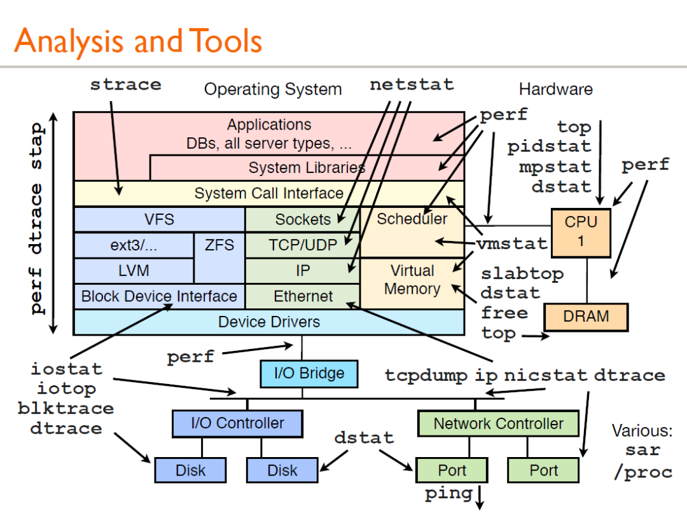
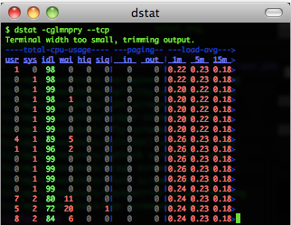
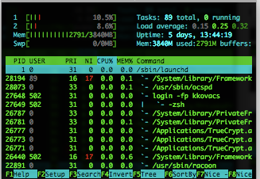

# **性能分析工具**


首先来看一张图：



上图是Brendan Gregg 的一次性能分析的分享，

这里面的所有工具都可以通过 man 来获得它的帮助文档，下面简单介绍介绍一下常规的用法：

### vmstat--虚拟内存统计

vmstat（VirtualMeomoryStatistics，虚拟内存统计）是 Linux 中监控内存的常用工具,可对操作系统的虚拟内存、进程、CPU 等的整体情况进行监视。vmstat 的常规用法：vmstat interval times 即每隔 interval 秒采样一次，共采样 times 次，如果省略 times，则一直采集数据，直到用户手动停止为止。简单举个例子：


可以使用 ctrl+c 停止 vmstat 采集数据。

第一行显示了系统自启动以来的平均值，第二行开始显示现在正在发生的情况，接下来的行会显示每5秒间隔发生了什么，每一列的含义在头部，如下所示：

- procs：r 这一列显示了多少进程在等待cpu，b列显示多少进程正在不可中断的休眠（等待IO）。
- memory：swapd 列显示了多少块被换出了磁盘（页面交换），剩下的列显示了多少块是空闲的（未被使用），多少块正在被用作缓冲区，以及多少正在被用作操作系统的缓存。
- swap：显示交换活动：每秒有多少块正在被换入（从磁盘）和换出（到磁盘）。
- io：显示了多少块从块设备读取（bi）和写出（bo）,通常反映了硬盘I/O。
- system：显示每秒中断(in)和上下文切换（cs）的数量。
- cpu：显示所有的cpu时间花费在各类操作的百分比，包括执行用户代码（非内核），执行系统代码（内核），空闲以及等待IO。

内存不足的表现：free  memory 急剧减少，回收 buffer 和 cache 也无济于事，大量使用交换分区（swpd）,页面交换（swap）频繁，读写磁盘数量（io）增多，缺页中断（in）增多，上下文切换（cs）次数增多，等待IO的进程数（b）增多，大量CPU时间用于等待IO（wa）

### iostat--用于报告中央处理器统计信息

iostat 用于报告中央处理器（CPU）统计信息和整个系统、适配器、tty 设备、磁盘和 CD-ROM 的输入/输出统计信息，默认显示了与 vmstat 相同的 cpu 使用信息，使用以下命令显示扩展的设备统计：


第一行显示的是自系统启动以来的平均值，然后显示增量的平均值，每个设备一行。

常见 linux 的磁盘 IO 指标的缩写习惯：rq 是 request，r 是 read，w 是 write，qu 是 queue，sz 是 size，a 是verage，tm 是 time，svc 是 service。

- rrqm/s 和 wrqm/s：每秒合并的读和写请求，“合并的”意味着操作系统从队列中拿出多个逻辑请求合并为一个请求到实际磁盘。
- r/s和w/s：每秒发送到设备的读和写请求数。
- rsec/s和wsec/s：每秒读和写的扇区数。
- avgrq –sz：请求的扇区数。
- avgqu –sz：在设备队列中等待的请求数。
- await：每个IO请求花费的时间。
- svctm：实际请求（服务）时间。
- %util：至少有一个活跃请求所占时间的百分比。

### dstat--系统监控工具

dstat 显示了 cpu 使用情况，磁盘 io 情况，网络发包情况和换页情况，输出是彩色的，可读性较强，相对于 vmstat 和iostat 的输入更加详细且较为直观。在使用时，直接输入命令即可，当然也可以使用特定参数。

如下：dstat –cdlmnpsy



### iotop--LINUX进程实时监控工具

iotop命令是专门显示硬盘IO的命令，界面风格类似top命令，可以显示IO负载具体是由哪个进程产生的。是一个用来监视磁盘I/O使用状况的top类工具，具有与top相似的UI，其中包括PID、用户、I/O、进程等相关信息。

```
牛逼啊！接私活必备的 N 个开源项目！赶快收藏
```

可以以非交互的方式使用：

```
iotop –bod interval
```

查看每个进程的 I/O，可以使用

```
pidstat，pidstat –d instat
```

### pidstat--监控系统资源情况

pidstat 主要用于监控全部或指定进程占用系统资源的情况,如 CPU,内存、设备 IO、任务切换、线程等。

使用方法：

```
pidstat –d interval
```

pidstat 还可以用以统计CPU使用信息：

```
pidstat –u interval
```

统计内存信息：

```
pidstat –r interval
```

### top

- top 命令的汇总区域显示了五个方面的系统性能信息：
- 负载：时间，登陆用户数，系统平均负载；
- 进程：运行，睡眠，停止，僵尸；
- cpu:用户态，核心态，NICE,空闲，等待IO,中断等；
- 内存：总量，已用，空闲（系统角度），缓冲，缓存；
- 交换分区：总量，已用，空闲

任务区域默认显示：进程 ID，有效用户，进程优先级，NICE 值，进程使用的虚拟内存，物理内存和共享内存，进程状态，CPU 占用率，内存占用率，累计 CPU 时间，进程命令行信息。

### htop

htop 是 Linux 系统中的一个互动的进程查看器,一个文本模式的应用程序(在控制台或者X终端中),需要 ncurses。



Htop 可让用户交互式操作，支持颜色主题，可横向或纵向滚动浏览进程列表，并支持鼠标操作。

与 top 相比，htop 有以下优点：

- 可以横向或者纵向滚动浏览进程列表，以便看到所有的进程和完整的命令行。
- 在启动上，比top更快。
- 杀进程时不需要输入进程号。
- htop支持鼠标操作。


### mpstat

mpstat 是 Multiprocessor Statistics的缩写，是实时系统监控工具。其报告CPU的一些统计信息，这些信息存放在 /proc/stat 文件中。在多 CPUs 系统里，其不但能查看所有 CPU 的平均状况信息，而且能够查看特定 CPU 的信息。常见用法：

```
mpstat –P ALL interval times
```

### netstat

netstat 用于显示与 IP、TCP、UDP和 ICMP 协议相关的统计数据，一般用于检验本机各端口的网络连接情况。

常见用法：

```
netstat –npl   # 可以查看你要打开的端口是否已经打开。
netstat –rn    # 打印路由表信息。
netstat –in    # 提供系统上的接口信息，打印每个接口的MTU,输入分组数，输入错误，输出分组数，输出错误，冲突以及当前的输出队列的长度。
```

### ps--显示当前进程的状态

ps 参数太多，具体使用方法可以参考 man ps

常用的方法：

```
ps  aux       #hsserver
ps –ef |grep   #hundsun
```

杀掉某一程序的方法：

```
ps  aux | grep mysqld | grep –v grep | awk ‘{print $2 }’ xargs kill -9
```

杀掉僵尸进程：

```
ps –eal | awk ‘{if ($2 == “Z”){print $4}}’ | xargs kill -9
```

### strace

跟踪程序执行过程中产生的系统调用及接收到的信号，帮助分析程序或命令执行中遇到的异常情况。

举例：查看 mysqld 在 linux 上加载哪种配置文件，可以通过运行下面的命令：

```
strace –e stat64 mysqld –print –defaults > /dev/null
```

### uptime

能够打印系统总共运行了多长时间和系统的平均负载，uptime 命令最后输出的三个数字的含义分别是 1分钟，5分钟，15分钟内系统的平均负荷。

### lsof

lsof（list open files）是一个列出当前系统打开文件的工具。通过 lsof 工具能够查看这个列表对系统检测及排错，常见的用法：

查看文件系统阻塞

```
lsof /boot
```

查看端口号被哪个进程占用

```
lsof  -i : 3306
```

查看用户打开哪些文件

```
lsof –u username
```

查看进程打开哪些文件

```
lsof –p  4838
```

查看远程已打开的网络链接

```
lsof –i @192.168.34.128
```

### perf

perf 是 Linux kernel 自带的系统性能优化工具。优势在于与 Linux Kernel 的紧密结合，它可以最先应用到加入 Kernel 的new feature，用于查看热点函数，查看 cashe miss 的比率，从而帮助开发者来优化程序性能。

性能调优工具如 perf，Oprofile 等的基本原理都是对被监测对象进行采样，最简单的情形是根据 tick 中断进行采样，即在 tick 中断内触发采样点，在采样点里判断程序当时的上下文。

假如一个程序 90% 的时间都花费在函数 foo() 上，那么 90% 的采样点都应该落在函数 foo() 的上下文中。运气不可捉摸，但我想只要采样频率足够高，采样时间足够长，那么以上推论就比较可靠。因此，通过 tick 触发采样，我们便可以了解程序中哪些地方最耗时间，从而重点分析。

### 汇总

结合以上常用的性能测试命令并联系文初的性能分析工具的图，就可以初步了解到性能分析过程中哪个方面的性能使用哪方面的工具（命令）。

 

**常用的性能测试工具**


熟练并精通了第二部分的性能分析命令工具，引入几个性能测试的工具，介绍之前先简单了解几个性能测试工具：

- perf_events：一款随 Linux 内核代码一同发布和维护的性能诊断工具，由内核社区维护和发展。Perf 不仅可以用于应用程序的性能统计分析，也可以应用于内核代码的性能统计和分析。另外，搜索公众号GitHub猿后台回复“赚钱”，获取一份惊喜礼包。
- eBPF tools：一款使用 bcc 进行的性能追踪的工具，eBPF map可以使用定制的 eBPF 程序被广泛应用于内核调优方面，也可以读取用户级的异步代码。重要的是这个外部的数据可以在用户空间管理。这个 k-v 格式的 map 数据体是通过在用户空间调用 bpf 系统调用创建、添加、删除等操作管理的。
- perf-tools：一款基于 perf_events (perf) 和 ftrace 的Linux性能分析调优工具集。Perf-Tools 依赖库少，使用简单。支持Linux 3.2 及以上内核版本。
- bcc(BPF Compiler Collection):：一款使用 eBP F的 perf 性能分析工具。一个用于创建高效的内核跟踪和操作程序的工具包，包括几个有用的工具和示例。利用扩展的BPF（伯克利数据包过滤器），正式称为eBPF，一个新的功能，首先被添加到Linux 3.15。多用途需要Linux 4.1以上BCC。
- ktap：一种新型的linux脚本动态性能跟踪工具。允许用户跟踪Linux内核动态。ktap是设计给具有互操作性，允许用户调整操作的见解，排除故障和延长内核和应用程序。它类似于Linux和Solaris DTrace SystemTap。
- Flame Graphs：是一款使用 perf，system tap，ktap 可视化的图形软件，允许最频繁的代码路径快速准确地识别，可以是使用 `github.com/brendangregg/flamegraph` 中的开发源代码的程序生成。

### Linux observability tools |Linux 性能观测工具


- 首先学习的Basic Tool有如下：uptime、top(htop)、mpstat、isstat、vmstat、free、ping、nicstat、dstat。
- 高级的命令如下：sar、netstat、pidstat、strace、tcpdump、blktrace、iotop、slabtop、sysctl、/proc。

### Linux benchmarking tools | Linux 性能测评工具


是一款性能测评工具，对于不同模块的性能测试可以使用相应的工具。

### Linux tuning tools | Linux 性能调优工具


是一款性能调优工具，主要是从linux内核源码层进行的调优，想要深入了解，可以参考下文附件文档。

### Linux observability sar | linux性能观测工具


sar（System Activity Reporter系统活动情况报告）是目前LINUX上最为全面的系统性能分析工具之一，可以从多方面对系统的活动进行报告，包括：文件的读写情况、系统调用的使用情况、磁盘I/O、CPU效率、内存使用状况、进程活动及IPC 有关的活动等方面。sar 的常规使用方式：

```
sar  [options] [-A] [-o file]  t [n]
```

其中：t 为采样间隔，n 为采样次数，默认值是1；-o file 表示将命令结果以二进制格式存放在文件中，file 是文件名。
