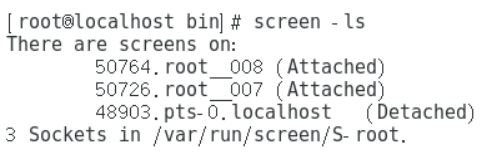

> https://www.yuque.com/yuzhi-vmblo/uge3um/kphfa8


**root  ssh 远程登录**

```bash
sudo passwd root
```

`sudo vim /etc/ssh/sshd_config`	PermitRootLogin 改为 yes	最大连接数的三行注释放开

```bash
services sshd restart Or systemctl restart sshd
sudo apt-get install -y openssh-server

 sudo sed -i 's/#PermitRootLogin prohibit-password/PermitRootLogin yes/' /etc/ssh/sshd_config

sudo service ssh status
sudo service ssh start

# 设置 SSH 服务开机自启动
sudo systemctl enable ssh
```

## Net

静态IP必须和当前动态IP的网段一致，否则可能导致网络无法连接。如果静态IP已经被分配给网络中的其他主机，会造成IP冲突，网络无法连接，直接将当前动态IP配置为静态IP可以避免这一情况。

```bash
# 列出网络配置文件，其在不同Ubuntu版本中可能会有差异，但一定是.yaml文件
ls /etc/netplan/

# 备份现有的配置文件，这样如果配置错误可以恢复
sudo cp  /etc/netplan/01-network-manager-all.yaml \
	/etc/netplan/01-network-manager-all.yaml.bak

vim /etc/netplan/00-installer-config.yaml
# 如果使用xshell方式，请在vi编辑器命令模式下输入(避免复制格式混乱)
:set paste

# 配置文件修改如下：
network:
  ethernets:
    ens33:
      dhcp4: no
      addresses: [192.168.3.10/24]
      optional: true
      gateway4: 192.168.3.1
      nameservers:
        addresses: [8.8.8.8]
  version: 2
# 其中 addresses 是静态 IP 地址，gateway4 是网关地址，nameservers 是 DNS 服务器地址

sudo netplan apply
```


## 源

https://packages.ubuntu.com/


```bash
sudo add-apt-repository universe multiverse

sudo apt update

hwe-support-status --verbose

sudo nano /etc/apt/sources.list
# 添加如下内容
deb http://mirrors.aliyun.com/ubuntu/ jammy main restricted universe multiverse
deb-src http://mirrors.aliyun.com/ubuntu/ jammy main restricted universe multiverse
deb http://mirrors.aliyun.com/ubuntu/ jammy-security main restricted universe multiverse
deb-src http://mirrors.aliyun.com/ubuntu/ jammy-security main restricted universe multiverse
deb http://mirrors.aliyun.com/ubuntu/ jammy-updates main restricted universe multiverse
deb-src http://mirrors.aliyun.com/ubuntu/ jammy-updates main restricted universe multiverse
deb http://mirrors.aliyun.com/ubuntu/ jammy-proposed main restricted universe multiverse
deb-src http://mirrors.aliyun.com/ubuntu/ jammy-proposed main restricted universe multiverse
deb http://mirrors.aliyun.com/ubuntu/ jammy-backports main restricted universe multiverse
deb-src http://mirrors.aliyun.com/ubuntu/ jammy-backports main restricted universe multiverse
deb https://mirrors.ustc.edu.cn/ubuntu/ jammy main restricted universe multiverse
deb-src https://mirrors.ustc.edu.cn/ubuntu/ jammy main restricted universe multiverse
deb https://mirrors.ustc.edu.cn/ubuntu/ jammy-updates main restricted universe multiverse
deb-src https://mirrors.ustc.edu.cn/ubuntu/ jammy-updates main restricted universe multiverse
deb https://mirrors.ustc.edu.cn/ubuntu/ jammy-backports main restricted universe multiverse
deb-src https://mirrors.ustc.edu.cn/ubuntu/ jammy-backports main restricted universe multiverse
deb https://mirrors.ustc.edu.cn/ubuntu/ jammy-security main restricted universe multiverse
deb-src https://mirrors.ustc.edu.cn/ubuntu/ jammy-security main restricted universe multiverse
deb https://mirrors.ustc.edu.cn/ubuntu/ jammy-proposed main restricted universe multiverse
deb-src https://mirrors.ustc.edu.cn/ubuntu/ jammy-proposed main restricted universe multiverse
deb http://mirrors.163.com/ubuntu/ jammy main restricted universe multiverse
deb http://mirrors.163.com/ubuntu/ jammy-security main restricted universe multiverse
deb http://mirrors.163.com/ubuntu/ jammy-updates main restricted universe multiverse
deb http://mirrors.163.com/ubuntu/ jammy-proposed main restricted universe multiverse
deb http://mirrors.163.com/ubuntu/ jammy-backports main restricted universe multiverse
deb-src http://mirrors.163.com/ubuntu/ jammy main restricted universe multiverse
deb-src http://mirrors.163.com/ubuntu/ jammy-security main restricted universe multiverse
deb-src http://mirrors.163.com/ubuntu/ jammy-updates main restricted universe multiverse
deb-src http://mirrors.163.com/ubuntu/ jammy-proposed main restricted universe multiverse
deb-src http://mirrors.163.com/ubuntu/ jammy-backports main restricted universe multiverse

sudo apt update
```


## VMware 虚拟机扩展 磁盘空间

```bash
df -h

fdisk -l
```


# FAQ


```bash
sudo apt-get clean && sudo apt-get update && sudo apt-get upgrade 

dpkg -i --force-overwrite /var/cache/apt/archives/linux-tools-common_5.4.0-176.196_all.deb
```


## Screen

使用：

screen -S sessionname （创建名为sessionname的会话）

screen -ls  （显示已经创建的session）





（其中最后一个session是不用screen -S创建的会话，系统自动添加的名字，Attached表示session未与终端断开，Detached表示session已于终端断开，可用screen -r sessionname 来恢复 或者将sessionname替换为前面的数字）

screeen -x （加入正在连接的session，两个终端连接相同的sesssion，可使两个终端显示相同的效果）

exit （在两个终端的任意终端的命令行输入exit即可退出screen）

screen -x sessionname

同一台设备的不同终端可以直接使用，不同设备的终端需要使用ssh连接设备在使用screen -x sessionname


------------------------------------------------
