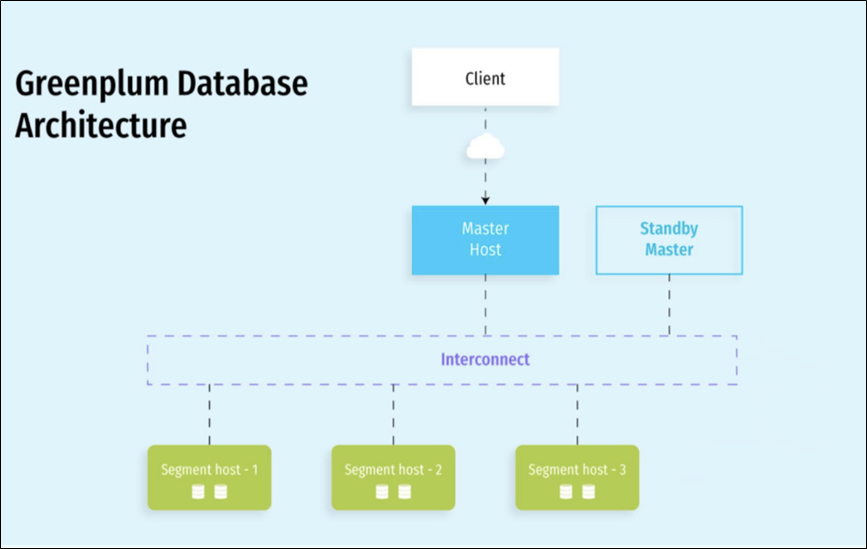

# GreenPlum


# 简介

## 1.1 MPP 架构的由来

MPP（Massively Parallel Processing）架构是一种用于处理大规模数据的计算架构，它通过将任务分配给多个处理单元并行执行，以提高处理速度和性能。MPP 架构的由来可以追溯到对大规模数据处理需求的不断增长，传统的单一处理器或对称多处理器（SMP）架构无法满足这些需求。MPP 架构允许在大规模数据集上实现水平扩展，通过添加更多的处理单元来增加计算和存储能力。

l **分布式存储：** MPP 数据库系统通常使用分布式存储架构，将数据分散存储在多个节点上。每个节点都有自己的存储单元，这样可以提高数据的读取和写入速度。

l **并行处理：** MPP 架构通过将任务分解成小块，并同时在多个处理单元上执行这些任务来实现并行处理。每个处理单元负责处理数据的一个子集，然后将结果合并以生成最终的输出。

l **共享无状态架构：** MPP 系统通常采用共享无状态的架构，即每个节点之间没有共享的状态。这使得系统更容易水平扩展，因为可以简单地添加更多的节点，而不需要共享状态的复杂管理。

l **负载平衡：** MPP 数据库通常具有负载平衡机制，确保任务在各个节点上均匀分布，避免某些节点成为性能瓶颈。

l **高可用性：** 为了提高系统的可用性，MPP 架构通常设计成具有容错和故障恢复机制。如果一个节点出现故障，系统可以继续运行，而不会丢失数据或中断服务。

一些知名的 MPP 数据库系统包括 Teradata、Greenplum、Amazon Redshift 等。这些系统广泛应用于企业数据仓库、商业智能和大数据分析等领域。总体而言，MPP 架构通过将任务分布到多个节点并行执行，以及有效地利用分布式存储和处理的方式，提供了一种高性能、可伸缩的数据处理解决方案，适用于处理大规模数据的场景。


## 1.2 GreenPlum

Greenplum是基于开源 PostgreSQL 的分布式数据库，采用shared-nothing架构，即主机、操作系统、内存、存储都是每台服务器独立自我控制，不存在共享。

Greenplum本质上是一个关系型数据库集群，实际上是由多个独立的数据库服务组合而成的一个逻辑数据库。这种数据库集群采取的是MPP（Massively Parallel Processing）架构，大规模并行处理。



​	GreenPlum数据库是由Master Server、Segment Server和Interconnect三部分组成，Master Server和Segment Server的互联使用Interconnect。

​	Greenplum是一个关系型数据库，是由数个独立的数据服务组合成的逻辑数据库，整个集群由多个数据节点（Segment Host）和控制节点（Master Host）组成。在典型的Shared-Nothing中，每个节点上所有的资源的CPU、内存、磁盘都是独立的，每个节点都只有全部数据的一部分，也只能使用本节点的数据资源。在Greenplum中，需要存储的数据在进入到表时，将先进行数据分布的处理工作，将一个表中的数据平均分布到每个节点上，并为每个表指定一个分布列（Distribute Column）,之后便根据Hash来分布数据，基于Shared-Nothing的原则，Greenplum这样处理可以充分发挥每个节点处IO的处理能力。

- **Master**节点：是整个系统的控制中心和对外的服务接入点，它负责接收用户SQL请求，将SQL生成查询计划并进行并行处理优化，然后将查询计划分配到所有的Segment节点并进行处理，协调组织各个Segment节点按照查询计划一步一步地进行并行处理，最后获取到Segment的计算结果，再返回给客户端。从用户的角度看Greenplum集群，看到的只是Master节点，无需关心集群内部的机制，所有的并行处理都是在Master控制下自动完成的。Master节点一般只有一个或二个。
- **Segment**节点：是Greenplum执行并行任务的并行计算节点，它接收Master的指令进行MPP并行计算，因此所有Segment节点的计算性总和就是整个集群的性能，通过增加Segment节点，可以线性化得增加集群的处理性能和存储容量，Segment节点可以是1~10000个节点。
- **Interconnect**：是Master节点与Segment节点、Segment节点与Segment节点之间进行数据传输的组件，它基于千兆交换机或者万兆交换机实现数据再节点之间的高速传输。

外部数据在加载到Segment时，采用并行数据流进行加载，直接加载到Segment节点，这项独特的技术是Greenplum的专有技术，保证数据在最短时间内加载到数据库中。

**优缺点**

**1）优点**

（1）数据存储

当今是个数据不断膨胀的时代，采取MPP架构的数据库系统可以对海量数据进行管理。

（2）高并发

Greenplum利用强大并行处理能力提供并发支持。

（3）线性扩展

Greenplum线性扩展支持为数据分析系统将来的拓展给予了技术上的保障，用户可根据实施需要进行容量和性能的扩展。

（4）高性价比

Greenplum数据库软件系统节点基于业界各种开放式硬件平台，在普通的x86 Server上就能达到很高的性能，因此性价比很。同样，Greenplum产品的维护成本相比同类厂商也低许多。

（5）反应速度

Greenplum通过准实时、实时的数据加载方式，实现数据仓库的实时更新，进而实现动态数据仓库(ADW)。

（6）高可用性

对于主节点，Greenplum提供Master/Stand by机制进行主节点容错，当主节点发生错误时，可以切换到Stand by节点继续服务。

（7）系统易用

Greenplum产品是基于流行的PostgreSQL之上开发，几乎所有的PostgreSQL客户端工具及PostgreSQL应用都能运行在Greenplum平台上，在Internet上有着丰富的PostgreSQL资源供用户参考。

**2）缺点**

（1）主从双层架构，并非真正的扁平架构，存在性能瓶颈和SPOF单点故障。

（2）无法支持数据压缩态下的DML操作，不易于数据的维护和更新。

（3）单个节点上的数据库没有并行和大内存使用能力，必须通过部署多个实列（segment servers）来充分利用系统资源，造成使用和部署很复杂。


# 安装

## 2.1 GreenPlum 安装地址

**1）GreenPlum官网地址**

https://greenplum.org/

**2）文档查看地址**

https://docs.vmware.com/en/VMware-Tanzu-Greenplum/6/greenplum-database/GUID-landing-index.html

**3）下载地址**

https://network.pivotal.io/products/vmware-tanzu-greenplum


## 2.2 部署

### 2.2.1 环境

1. **安装模板虚拟机，IP地址**192.168.10.101**、主机名称**hadoop101**、内存**8G**、核数4个、**硬盘50G

2. **hadoop100**虚拟机配置要求如下（本文Linux系统全部以CentOS-7.5-x86-1804为例）

   ```bash
   yum install -y epel-release
   yum install -y  vim net-tools psmisc  nc rsync  lrzsz  ntp libzstd openssl-static tree iotop git
   systemctl stop firewalld
   systemctl disable firewalld.service
   
   rpm -qa | grep -i java | xargs -n1 rpm -e --nodeps
   # rpm -qa：查询所安装的所有rpm软件包
   # grep -i：忽略大小写
   # xargs -n1：表示每次只传递一个参数
   # rpm -e –nodeps：强制卸载软件
   ```

3. **模板机hosts映射文件**

   ```bash
   vim /etc/hosts
   192.168.10.100 hadoop100
   192.168.10.101 hadoop101
   192.168.10.102 hadoop102
   192.168.10.103 hadoop103
   192.168.10.104 hadoop104
   192.168.10.105 hadoop105
   192.168.10.106 hadoop106
   192.168.10.107 hadoop107
   192.168.10.108 hadoop108
   reboot
   ```

4. 环境

   **硬件：克隆**3台虚拟机（每台4核、8G内存、50G存储）

   **操作系统：CentOS-7.5-x86-1804**

   **GreenPlum**版本：open-source-greenplum-db-6.25.3-rhel7-x86_64

   **数据库节点安装规划：**1台master节点, 无standby节点，2台segment节点

   主机名配置及节点规划如下：

   | 主机IP             | **主机名** | **节点规划** |
   | ------------------ | ---------- | ------------ |
   | **192.168.10.102** | hadoop102  | master节点   |
   | **192.168.10.103** | hadoop103  | segment1节点 |
   | **192.168.10.104** | hadoop104  | segment2节点 |

5. 安装前配置

   ```bash
   yum install -y apr apr-util bash bzip2 curl krb5 libcurl libevent libxml2 libyaml zlib openldap openssh-client openssl openssl-libs perl readline rsync R sed tar zip krb5-devel
   
   # 关闭 SElinux
   vim /etc/selinux/config
   ```

   **操作系统参数配置**

   `vim /etc/sysctl.conf`

   （1）共享内存（每台节点需要单独计算）

   ​         kernel.shmall = _PHYS_PAGES / 2 ，系统可用的内存页总量的一半，可以用 getconf _PHYS_PAGES 查看系统可用的内存页总量

   ​                  `echo $(expr $(getconf _PHYS_PAGES) / 2)`

   ​         kernel.shmmax = kernel.shmall * PAGE_SIZE ，命令 getconf PAGE_SIZE 或者页大小

   ​                  `echo $(expr $(getconf _PHYS_PAGES) / 2 \* $(getconf PAGE_SIZE))`

   （2）主机内存

   ​         vm.overcommit_memory 系统使用该参数来确定可以为进程分配多少内存。对于GP数据库，此参数应设置为2

   ​         vm.overcommit_ratio 以为进程分配内的百分比，其余部分留给操作系统。默认值为50。建议设置95

   （3）端口设定

   ​         为避免在Greenplum初始化期间与其他应用程序之间的端口冲突，指定的端口范围 net.ipv4.ip_local_port_range。使用gpinitsystem初始化Greenplum时，请不要在该范围内指定Greenplum数据库端口

   （4）系统内存

   ​         系统内存大于64G ,建议以下配置：

   ```yaml
   vm.dirty_background_ratio = 0
   vm.dirty_ratio = 0
   vm.dirty_background_bytes = 1610612736 # 1.5GB
   vm.dirty_bytes = 4294967296 # 4GB
   ```

   ​         系统内存小于等于 64GB，移除vm.dirty_background_bytes 设置，并设置以下参数

   ```bash
   vm.dirty_background_ratio = 3
   vm.dirty_ratio = 10
   ```

   ​         本次系统参数配置如下：

   ```bash
   kernel.shmall = 1019650
   kernel.shmmax = 4176486400
   #设置系统范围内共享内存段的最大数量，默认4096
   kernel.shmmni = 4096
   # See Segment Host Memory           
   # 主机内存
   vm.overcommit_memory = 2
   # See Segment Host Memory
   vm.overcommit_ratio = 95
   # See Port Settings 端口设定
   net.ipv4.ip_local_port_range = 10000 65535
   kernel.sem = 500 2048000 200 40960
   kernel.sysrq = 1
   kernel.core_uses_pid = 1
   kernel.msgmnb = 65536
   kernel.msgmax = 65536
   kernel.msgmni = 2048
   net.ipv4.tcp_syncookies = 1
   net.ipv4.conf.default.accept_source_route = 0
   net.ipv4.tcp_max_syn_backlog = 4096
   net.ipv4.conf.all.arp_filter = 1
   net.core.netdev_max_backlog = 10000
   net.core.rmem_max = 2097152
   net.core.wmem_max = 2097152
   vm.swappiness = 10
   vm.zone_reclaim_mode = 0
   vm.dirty_expire_centisecs = 500
   vm.dirty_writeback_centisecs = 100
   # See System Memory
   # 系统内存
   vm.dirty_background_ratio = 3
   vm.dirty_ratio = 10
   ```

   ​         设置完成后 重载参数

   ```bash
   sysctl -p
   ```

   **系统资源限制**

   ​         修改系统资源限制配置文件(/etc/security/limits.conf)，3台主机同步修改，都添加以下参数：

   ```bash
   *       soft    nofile  65536
   *       hard    nofile  65536
   *       soft    nproc   131072
   *       hard    nproc   131072
   # “*” 星号表示所有用户
   # noproc 是代表最大进程数
   #	nofile 是代表最大文件打开数
   ```

   ​         同时，针对CentOS 7操作系统，还需修改：/etc/security/limits.d/20-nproc.conf 文件

   ```bash
   * soft nofile 65536
   * hard nofile 65536
   * soft nproc 131072
   * hard nproc 131072
   ```

   ​         退出重新登陆，ulimit -u 命令显示每个用户可用的最大进程数max user processes。验证返回值为131072

   **SSH 连接阈值**

   ​         Greenplum数据库管理程序中的gpexpand、 gpinitsystem、gpaddmirrors，使用 SSH连接来执行任务。在规模较大的Greenplum集群中，程序的ssh连接数可能会超出主机的未认证连接的最大阈值。发生这种情况时，会收到以下错误：ssh_exchange_identification: Connection closed by remote host。

   ​         为避免这种情况，可以更新 /etc/ssh/sshd_config 或者 /etc/sshd_config 文件的 MaxStartups 和 MaxSessions 参数。

   ​         root用户登陆所有服务器，编辑配置文件：/etc/ssh/sshd_config，修改完成，重启sshd服务，使参数生效。

   ```bash
   vi /etc/ssh/sshd_config
   MaxSessions 200
   MaxStartups 100:30:1000
   
   systemctl restart sshd
   ```

   **修改字符集**

   ​         检查主机的字符集，字符集必须是 en_US.UTF-8，查看LANG环境变量或者通过 locale 命令

   ​         `echo $LANG` 

   ​         如果不是 en_US.UTF-8字符集，则用root用户进行设置，退出重新登陆后，再进行查询设置是否生效

   ​         `localectl set-locale LANG=en_US.UTF-8`

   **集群时钟同步**

   ​         如果集群时间不一致，每台节点使用如下命令

   ​         `ntpdate cn.pool.ntp.org`

### 2.2.2 安装 GreenPlum

1. 创建 **gpadmin** 组及用户（三个节点都创建 ...）

   ```bash
   groupadd gpadmin
   useradd gpadmin -r -m -g gpadmin
   passwd gpadmin
   ```

2. 给 gpadmin 设置用户具有root权限，方便后期加sudo执行root权限的命令

   ```bash
   vim /etc/sudoers
   
   ## Allow root to run any commands anywhere
   root    ALL=(ALL)     ALL
   gpadmin ALL=(ALL)     NOPASSWD:ALL
   ```

3. 配置节点间的免密登录（三台同样的操作，一下以hadoop102为例...）

   ```bash
   # 生成 SSH 密钥
   ssh-keygen -t rsa
   # 分发 SSH 密钥
   ssh-copy-id hadoop102
   ```

4. 配置GreenPlum的ssh权限互通设置 （在hadoop102节点配置）

   ```bash
   # 在/home/gpadmin 目录下常见一个 conf 目录，用于存放配置文件
   mkdir -p /home/gpadmin/conf
   
   vim /home/gpadmin/conf/hostlist
   hadoop102
   hadoop103
   hadoop104
   
   vim /home/gpadmin/conf/seg_hosts
   hadoop103
   hadoop104
   ```

5. 先上传GreenPlum软件安装包，然后执行rpm安装（三台都需要安装）

   ```bash
   mkdir -p /home/gpadmin/software
   
   sudo yum -y install ./open-source-greenplum-db-6.25.3-rhel7-x86_64.rpm
   
   # 注意：安装完之后，将这个文件在gpadmin用户赋予权限
   sudo chown -R gpadmin:gpadmin
   ```

6. 使用 gpssh-exkeys 打通所有服务器 (Master节点进行操作)

   ```bash
   cd /usr/local/greenplum-db-6.25.3/
   source
   
   cd /home/gpadmin/conf
   gpssh-exkeys -f hostlist
   ```

7. 环境变量配置 `.bashrc` 和 `GPHOME`（所有节点机器 gpadmin 用户操作）

   ```bash
   mkdir -p /home/gpadmin/data/master
   
   cat <<EOF >> /home/gpadmin/.bashrc
   source /usr/local/greenplum-db/greenplum_path.sh
   export PGPORT=5432
   export PGUSER=gpadmin
   export MASTER_DATA_DIRECTORY=/home/gpadmin/data/master/gpseg-1
   export PGDATABASE=gp_sydb
   export LD_PRELOAD=/lib64/libz.so.1 ps
   EOF
   
   source /home/gpadmin/.bashrc
   ```

8. 配置环境变量GPHOME，首先进到文件中直接修改

   ```bash
   vim /usr/local/greenplum-db/greenplum_path.sh
   
   #添加以下路径
   GPHOME=/usr/local/greenplum-db
   ```

9. 创建数据文件夹（Master节点）

   ```bash
   # 创建各个节点的数据文件夹，该步骤之后 hostlist 文件包含机器下都会创建 data 目录，data 目录下都会创建 master、primary、mirror 文件夹
   gpssh -f /home/gpadmin/conf/hostlist
   gpssh -f /home/gpadmin/conf/hostlist
   => mkdir data
   [hadoop102]
   [hadoop103] mkdir: cannot create directory ‘data’: File exists
   [hadoop104] mkdir: cannot create directory ‘data’: File exists
   => cd data
   [hadoop102]
   [hadoop103]
   [hadoop104]
   => mkdir master
   [hadoop102]
   [hadoop103] mkdir: cannot create directory ‘master’: File exists
   [hadoop104] mkdir: cannot create directory ‘master’: File exists
   => mkdir primary
   [hadoop102]
   [hadoop103]
   [hadoop104]
   => mkdir mirror
   [hadoop102]
   [hadoop103]
   [hadoop104]
   => exit
   ```

   > 注意：cannot create directory ‘master’: File exists 不用管

10. 连通性检查（主节点 gpadmin 用户操作）

    ```bash
    gpcheckperf -f /home/gpadmin/conf/hostlist -r N -d /tmp
    ```


### 2.2.3 集群初始化

1）创建初始化配置文件（主节点 gpadmin 用户操作）

> **这里修改初始化文件，首先拷贝一个文件gpinitsystem_config，在修改**

```bash
mkdir /home/gpadmin/gpconfigs

cp /usr/local/greenplum-db/docs/cli_help/gpconfigs/gpinitsystem_config /home/gpadmin/gpconfigs/gpinitsystem_config

vim /home/gpadmin/gpconfigs/gpinitsystem_config
# ------------------------以下为配置内容------------------------
# 该项配置设置主节点数据存储位置，括号里边有几个代表每台主机创建几个postgresql数据库实例，即segment的实例数，上边示例是2个。
declare -a DATA_DIRECTORY=(/home/gpadmin/data/primary /home/gpadmin/data/primary)
# 该项配置设置主节点机器名字
MASTER_HOSTNAME=mdw
# 该项配置设置主节点数据存储位置
MASTER_DIRECTORY=/home/gpadmin/data/master
# 该项配置设置是备节点数据存储位置,规则同DATA_DIRECTORY，括号里边数量和DATA_DIRECTORY保持一致。
# greenplum数据分主节点和备节点，主节点挂掉时候备节点数据会启用。
declare -a MIRROR_DATA_DIRECTORY=(/home/gpadmin/data/primary /home/gpadmin/data/primary)
# 该项配置设置默认数据库名字，和环境变量数据库名字保持一致，不然会失败。
DATABASE_NAME=gp_sydb

# 在/home/gpadmin/gpconfigs新增一个配置文件hostfile_gpinitsystem
cd /home/gpadmin/gpconfigs
vim hostfile_gpinitsystem
# 内容如下:
hadoop103
hadoop104
```

2）初始化

```bash
gpinitsystem -c /home/gpadmin/gpconfigs/gpinitsystem_config -h /home/gpadmin/gpconfigs/hostfile_gpinitsystem
```

集群初始化成功完成，会提示：Greenplum Database instance successfully created

初始化有误，可以使用命令gpdeletesystem进行删除，重新初始化：

`gpdeletesystem -d /home/gpadmin/data/master/gpseg-1 -f` 

> 参数-d 后面跟 MASTER_DATA_DIRECTORY（master 的数据目录），会清除master,segment所有的数据目录
>
> 参数-f force， 终止所有进程，进行强制删除

3）GreenPlum 的一些常用启停命令

```bash
# 关闭 gpstop
# 启动 gpstart
# 状态查看 gpstate
# help 命令查看所有命令
```


## 2.3 GreenPlum 登录连接

### 2.3.1 psql 登录

psql 命令登录gp，psql/ 命令用法可以通过 `psql --help` 查看帮助信息

psql 命令格式为：`psql -h hostname -p port -d database -U user -W password`

- -h 后面接对应的master或者segment主机名，默认是本机
- -p 后面接master或者segment的端口号，默认5432（master节点）
- 如果登陆segment节点，则需要指定segment端口6000
- -d 后面接数据库名，默认gpdw，可将上述参数配置到用户环境变量中
- -U 登陆用户名，默认 gpadmin

直接 `psql` 默认登录就可以

### 2.3.2 远程客户端登录 gp

配置其他用户或者客户端远程登陆 gp，需要配置以下2个文件：

1. 配置 /opt/greenplum/data/master/gpseg-1/pg_hba.conf，新增一条规则，则允许任意ip及密码登陆pg
   ```bash
   echo "host all gpadmin 0.0.0.0/0 trust" >> /home/gpadmin/data/master/gpseg-1/pg_hba.conf
   ```

2. 配置修改完成后，重新加载配置文件
   ```bash
   gpstop -u     # 重新加载配置文件 postgresql.conf 和 pg_hba.conf
   ```

   

# GreenPlum 数据类型

## 3.1 基本数据类型

| **类型**                     | **长度**    | **描述**             | **范围**                                       |
| ---------------------------- | ----------- | -------------------- | ---------------------------------------------- |
| **bigint**                   | 8字节       | 大范围整数           | -9223372036854775808  到  +9223372036854775807 |
| **smallint**                 | 2字节       | 小范围整数           | -32768到+32767                                 |
| **integer(int)**             | 4字节       | 常用整数             | -2147483648 到  +2147483647                    |
| **decimal**                  | 可变长      | 用户指定的精度，精确 | 小数点前 131072 位；小数点后 16383 位          |
| **real**                     | 4字节       | 可变精度，不准确     | 6位十进制数字精度                              |
| **double** **precision**     | 8字节       | 可变精度，不准确     | 15位十进制数字精度                             |
| **smallserial**              | 2字节       | 自增的小范围整数     | 1到32767                                       |
| **serial**                   | 4字节       | 自增整数             | 1到2147483647                                  |
| **bigserial**                | 8字节       | 自增的大范围整数     | 1到9223372036854775807                         |
| **character**                | 别名char    | 定长，不足补空白     |                                                |
| **character varying**        | 别名varchar | 变长，有长度限制     |                                                |
| **text**                     |             | 变长，无长度限制     |                                                |
| **timestamp**                | 8字节       | 日期和时间，无时区   | 4713 BC到294276 AD                             |
| **timestamp with time zone** | 8字节       | 日期和时间，有时区   | 4713 BC到294276 AD                             |
| **date**                     | 4字节       | 只用于日期           | 4713 BC到5874897 AD                            |
| **boolean**                  | 1字节       |                      | true/false                                     |
| **money**                    | 8字节       | 货币金额             | -92233720368547758.08 到 +92233720368547758.07 |

```sql
# 创建一张student表并加入数据
--建表语句
create table student(
id int, 
name text, 
age int, 
eight double precision);
# 这里建表时会提示Table doesn't have 'DISTRIBUTED BY' clause -- Using column named 'id' as the Greenplum Database data distribution key for this table.这是提醒建表时指定分布键和分布策略，默认第一个字段（或逐渐）和hash策略。

--插入数据
insert into test values
(1,'xiaohaihai',18,75.2),
(2,'xiaosongsong',16,80.6),
(3,'xiaohuihui',17,60.3),
(4,'xiaoyangyang',16,65.8);
```

## 3.2 复杂数据类型

### 3.2.1 枚举类型

​	枚举类型是一个包含静态和值的有序集合的数据类型，类似于Java中的enum类型，需要使用create type命令创建

```sql
-- 创建枚举类型
create type weeks as enum('Mon','Tue','Wed','Thu','Fri','Sat','Sun');

-- 建表字段使用枚举类型
create table user_schedule (
    user_name varchar(100),
    available_day weeks
);

-- 插入数据
insert into user_schedule (user_name, available_day) values ('Alice', 'Mon');
insert into user_schedule (user_name, available_day) values ('Bob', 'Fri');
insert into user_schedule (user_name, available_day) values ('Charlie', 'Sun');

-- 查询结果
select * from user_schedule;
```

### 3.2.2 几何类型

​	几何数据类型表示二维的平面物体。下表列出了GreenPlum支持的几何类型。

​	最基本的类型：点。它是其它类型的基础。

| **类型**    | **大小**   | **描述**             | **表现形式**            |
| ----------- | ---------- | -------------------- | ----------------------- |
| **point**   | 16字节     | 平面中的点           | (x,y)                   |
| **line**    | 32字节     | 直线                 | ((x1,y1),(x2,y2))       |
| **lseg**    | 32字节     | 线段                 | ((x1,y1),(x2,y2))       |
| **box**     | 32字节     | 矩形                 | ((x1,y1),(x2,y2))       |
| **path**    | 16+16n字节 | 路径（与多边形相似） | ((x1,y1),...)           |
| **polygon** | 40+16n字节 | 多边形               | ((x1,y1),...)           |
| **circle**  | 24字节     | 圆                   | <(x,y),r>  (圆心和半径) |

```sql
-- 建表 创建一个表 geometric_shapes，它包含点、线和多边形类型的列
create table geometric_shapes (
    id serial primary key,
    point_col point,
    lseg_col lseg,
    polygon_col polygon
);

-- 插入数据
insert into geometric_shapes (point_col, lseg_col, polygon_col)
values
(point(1, 2), lseg '[(0,0),(1,1)]', polygon '((0,0),(1,0),(1,1),(0,1))');

-- 查询数据
--- 查询所有
select * from geometric_shapes;

--- 根据点查询
select * from geometric_shapes where point_col <-> point(1, 2) < 0.0001;

--- 根据线段查询
select * from geometric_shapes where lseg_col = lseg '[(0,0),(1,1)]';

--- 根据多边形查询
select * from geometric_shapes where polygon_col ~= polygon '((0,0),(1,0),(1,1),(0,1))';
```

### 3.2.3 网络地址类型

​	GreenPlum提供用于存储 IPv4、IPv6、MAC 地址的数据类型。用这些数据类型存储网络地址比用纯文本好，因为提供输入错误检查和特殊的操作和功能

| **类型**    | **描述**  | **说明**                 |
| ----------- | --------- | ------------------------ |
| **cidr**    | 7或19字节 | IPv4  或 IPv6 网络       |
| **inet**    | 7或19字节 | IPv4  或 IPv6 主机和网络 |
| **macaddr** | 6字节     | MAC  地址                |

​	在对 inet 或 cidr 数据类型进行排序的时候， IPv4 地址总是排在 IPv6 地址前面

```sql
-- 创建包含网络地址数据类型的表
create table network_addresses (
    id serial primary key,
    ip_address inet,
    network cidr,
    mac_address macaddr
);

-- 插入数据
insert into network_addresses (ip_address, network, mac_address)
values
('192.168.1.1/24', '192.168.1.0/24', '08:00:2b:01:02:03');

-- 查询数据
select * from network_addresses;

-- 查询特定的 IP 地址
select * from network_addresses where ip_address = inet '192.168.1.1';
select * from network_addresses where host(ip_address) = '192.168.1.1';

-- 查询特定的网络
select * from network_addresses where network = cidr '192.168.1.0/24';

-- 查询特定的 MAC 地址
select * from network_addresses where mac_address = macaddr '08:00:2b:01:02:03';

-- 更新数据
update network_addresses set ip_address = inet '192.168.1.2' where id = 1;

-- 删除数据
delete from network_addresses where id = 1;
```

### 3.2.4 JSON 类型

​	JSON 数据类型可以用来存储 JSON（JavaScript Object Notation）数据， 这样的数据也可以存储为 text，但是 json 数据类型更有利于检查每个存储的数值是可用的 JSON 值

​	此外还有相关的函数来处理 json 数据：
```sql
-- 创建一个新表，名为 json_demo，包含一个 json 类型的列
create table json_demo (
    id serial primary key,
    data json
);

-- 向 json_demo 表插入 json 数据，注意 json 数据必须是单引号的字符串
-- 并且遵循 json 格式
insert into json_demo (data) values ('{"name": "张三", "age": 28, "city": "北京"}');

-- 查询 json_demo 表中的 json 数据
select * from json_demo;

-- 使用 ->> 运算符来提取 json 对象中的 name 字段
select data->>'name' as name from json_demo;
```

### 3.2.5 数组类型

​	GreenPlum允许将字段定义成变长的多为数组。数组可以是任何基本类型或用户定义类型，枚举类型或复合类型

```sql
-- 创建一个新表，名为 array_demo，包含一个 int 类型的数组列
create table array_demo (
    id serial primary key,
    numbers int[]  -- int 数组类型列
);

-- 向 array_demo 表插入数组数据
-- 数组使用花括号{}并且元素由逗号分隔
insert into array_demo (numbers) values ('{1,2,3,4,5}');

-- 查询 array_demo 表中的数组数据
select * from array_demo;

-- 使用数组下标来获取数组中的特定元素
-- 注意：Greenplum数组下标从1开始
select numbers[1] as first_element from array_demo;

-- 使用 unnest 函数来展开数组为一系列行
select unnest(numbers) as expanded_numbers from array_demo;
```

### 3.2.6 复合类型

​	复合类型表示一行或者一条记录的结构； 它实际上只是一个字段名和它们的数据类型的列表。GreenPlum允许像简单数据类型那样使用复合类型。比如，一个表的某个字段可以声明为一个复合类型。

​	定义复合类型，语法类似于create table，只是这里可以声明字段名字和类型

```sql
-- 定义一个复合类型，名为 person_type，包含姓名、年龄和城市
create type person_type as (
    name text,
    age int,
    city text
);

-- 创建一个新表，名为 composite_demo，包含一个复合类型的列
create table composite_demo (
    id serial primary key,
    person_info person_type  -- 使用之前定义的复合类型作为列类型
);

-- 向 composite_demo 表插入复合类型数据
-- 复合类型数据使用括号，并且属性值由逗号分隔
insert into composite_demo (person_info) values (ROW('张三', 28, '北京'));
```

<hr>


# DDL（Data Definition Language）数据定义

## 4.1 创建数据库 

```sql
CREATE DATABASE name [ [WITH] [OWNER [=] dbowner]
[TEMPLATE [=] template]
[ENCODING [=] encoding]
[TABLESPAC [=] tablespace]
[CONNECTIONE LIMIT [=] connlimit ] ]

CREATE DATABASE name：

CREATE DATABASE 是 SQL 命令，用于创建一个新的数据库。
name 是你要创建的数据库的名称。这个名称是必须的，并且在同一个数据库服务器上必须是唯一的。

[ [WITH] [OWNER [=] dbowner]：
这是一个可选项。
OWNER 指定了新数据库的所有者。如果未指定，新数据库的所有者默认是执行该命令的用户。
dbowner 是数据库所有者的用户名。

[TEMPLATE [=] template]：
这也是一个可选项。
TEMPLATE 指定了用于创建新数据库的模板。在 PostgreSQL 和 GreenPlum 中，通常有一个名为 template1 的默认模板。如果不指定，就会使用这个默认模板。
template 是模板数据库的名称。

[ENCODING [=] encoding]：
又一个可选项。
ENCODING 指定了新数据库的字符编码。这个设置决定了数据库可以存储哪些字符。
encoding 是字符编码的名称，例如 UTF8。

[TABLESPACE [=] tablespace]：
这是可选的。
TABLESPACE 指定了新数据库的存储位置。表空间是数据库中存储文件的物理位置。
tablespace 是表空间的名称。

[CONNECTION LIMIT [=] connlimit ]：
这也是可选的。
CONNECTION LIMIT 限制了可以同时连接到数据库的最大客户端数量。
connlimit 是允许的最大连接数。如果设置为 -1，则表示没有限制。
 
 
create database my_db1
with owner gpadmin
encoding 'utf-8'
tablespace pg_default
connection limit 10; 
```

**创建 schema**

​	schema 本质上就是一种分组管理工具，它允许您将相关性质或类型的多个表和其他数据库对象（如视图、索引、存储过程等）组织在一起。也可以把 schema 看作是数据库内部的一个“文件夹”或“命名空间”，用于逻辑上组织和隔离数据，以实现更好的数据管理和安全控制。

​	一个 database 下可以有多个 schema。schema 在 gp 中也叫做 namespace

```sql
-- 连接创建完成的数据库
\c EmployeeDB

-- 创建schema
create schema sc_test;
```

## 4.2 查询数据库

### 4.2.1 显示数据库

```sql
-- 仅 greenplum 命令行客户端支持
\l   --查看所有数据库
\dn  --查看所有schema

-- 可视化客户端中使用以下操作
-- 列出 PostgreSQL 实例中所有数据库的名称 
select datname from pg_database;

-- 查询schema 
SELECT schema_name FROM information_schema.schemata;
```

### 4.2.2 切换当前数据库

```sql
-- 仅 greenplum 命令行客户端支持

\c db_gp
```


## 4.3 删除数据库

​	DROP DATABASE 会删除数据库的系统目录项并且删除包含数据的文件目录。

​	如果删除的数据库不存在，最好采用 if exists 判断数据库是否存在。

```sql
drop database if exists db_gp;
```

## 4.4 创建表

```sql
CREATE [EXTERNAL] TABLE table_name(
 column1 datatype [NOT NULL] [DEFAULT] [CHECK] [UNIQUE],
 column2 datatype,
 column3 datatype,
 .....
 columnN datatype,
 [PRIMARY KEY()]
)[ WITH ()]
 [LOCATION()]
 [FORMAT]
 [COMMENT]
 [PARTITION BY]
 [DISTRIBUTE BY ()];
```

> （1）**create table**创建一个指定名字的表。如果相同名字的表已经存在，则抛出异常；
>
> （2）**external**关键字可以让用户创建一个外部表，在建表的同时可以指定一个指向实际数据的路径（location）。
>
> （3）**comment**：为表和列添加注释。
>
> （4）**distributed b****y** 为表添加分布键，其必须为主键的子键。
>
> （5）**format** 存储数据的文本类型。
>
> （6）**check** 为表字段添加检查约束。
>
> （7）**unique** 唯一约束，一个表中唯一和主键只能同时存在一个。
>
> （8）**primary key** 主键设置,可以是一个或多个列。
>
> （9）**location**：指定外部表数据存储位置。
>
> （10）**default**：默认值。
>
> （11）**not null**非空约束。
>
> （12）**with** 可以添加数据追加方式，压缩格式，压缩级别，行列压缩等。
>
> （13）**partiton by** 支持两种分区方式，范围分区（range）和列表分区（list）

**内部表和外部表的介绍**

​	内部表和外部表是两种不同类型的表，它们在数据存储和处理方式上有明显的区别。了解这些区别对于合理地设计和优化 GreenPlum 数据库是非常重要的。

**（1）内部表（Regular Tables）**

**数据存储：**内部表的数据直接存储在 GreenPlum 数据库的数据文件中。这意味着数据被物理存储在数据库服务器上。

**事务管理：**内部表完全支持事务管理。这包括 ACID 属性（原子性、一致性、隔离性和持久性），确保数据完整性和可靠性。

**索引和约束：**你可以在内部表上创建索引和约束，这有助于提高查询性能和维护数据完整性。

**管理和维护：**内部表可以使用数据库的全部管理和维护功能，如备份和恢复。

**适用性：**适用于需要高性能查询和事务完整性的数据。

**（2）外部表（External Tables）**

**数据存储：**外部表的数据存储在数据库外部，如在文件系统、Hadoop HDFS 或任何可通过 SQL/MED（SQL Management of External Data）访问的数据源。外部表仅存储数据的元数据和位置信息。

**事务管理：**外部表不支持事务管理。它们主要用于读取和加载操作，不保证 ACID 属性。

**索引和约束：**由于数据实际存储在外部，你不能在外部表上创建索引或强制执行数据库级别的约束。

**管理和维护：**外部表的管理相对简单，因为它们只是对外部数据源的引用。备份和恢复通常不适用于外部表本身，而是应用于数据源。

**适用性：**适用于 ETL（Extract, Transform, Load）操作，即从外部数据源提取数据，然后可能将其转换和加载到内部表中进行进一步处理。

```sql
一：内部表操作	
-- 创建内部表
CREATE TABLE employees ( employee_id SERIAL PRIMARY KEY, name VARCHAR(100), department VARCHAR(100), hire_date DATE );

-- 插入数据
INSERT INTO employees (name, department, hire_date) VALUES ('John Doe', 'IT', '2020-01-01');
INSERT INTO employees (name, department, hire_date) VALUES ('Jane Smith', 'HR', '2020-02-01');

-- 查询结果
SELECT * FROM employees;


二：外部表操作
# 假设我们有一个 CSV 文件 employee_data.csv，它存储在文件系统中，格式如下：
employee_id,name,department,hire_date
1,John Doe,IT,2020-01-01
2,Jane Smith,HR,2020-02-01

-- 开启一个静态文件服务
gpfdist -d /home/gpadmin/software/datas/ -p 8081 &

-- 创建外部表
CREATE EXTERNAL TABLE ext_employees (
    employee_id varchar(100),
    name VARCHAR(100),
    department VARCHAR(100),
    hire_date varchar(100)
)
LOCATION ('gpfdist://hadoop102:8081/employee_data.csv')
FORMAT 'CSV';


SELECT * FROM ext_employees;

体现内外表区别的操作

内部表：
可以对内部表进行 INSERT, UPDATE, DELETE 等操作，因为数据存储在数据库内部。
支持事务，可以回滚未提交的更改。
可以创建索引以提高查询性能。

外部表：
通常只用于 SELECT 操作，用于读取外部数据源的数据。
不支持事务。
不支持索引创建。

内部表和外部表在操作和用途上的主要区别。内部表适合存储和管理数据库内的数据，而外部表适用于从外部数据源临时读取数据。
```

## 4.5 修改表

1. 重命名表

   ```sql
   ALTER TABLE table_name RENAME TO new_table_name
   ```

2. 增加/修改/替换列信息

   ```sql
   # （1）更新列
   # 修改列明
   ALTER TABLE tab_name RENAME old_name TO new_name;
   # 修改列类型
   ALTER TABLE tab_name ALTER COLUMN column_name TYPE column_type [USING column_name::column_type];
   
   # （2）增加/删除列
   ALTER TABLE table_name ADD|DROP COLUMN col_name [column_type];
   ```

   > 注：ADD是代表新增一个字段，需要添加相应的字段类型，DROP是代表删除一个字段

```sql
（1）查询表结构
\d arr
（2）添加列
alter table arr add column id int;
（3）更新列
alter table arr rename sal to salary;
alter table arr alter column id type double precision;
（4）删除列
alter table arr drop column id;
```

## 4.6 删除表

```sql
drop table arr;
```

## 4.7 清除表

```sql
# 注意：truncate只能删除内部表，不能删除外部表中数据
truncate table arr;
```


# DML（Data Manipulation Language）数据操作

## 5.1 数据导入

1. 向表中装载数据（COPY）

   ```sql
   COPY table_name FROM file_path DELIMITER ‘字段之间的分隔符’;
   ```

   （1）copy：表示加载数据，仅追加。

   （2）delimiter：表示读取的数据字段之间的分隔符。

   ```sql
   # 准备一份文件 在hadoop102的/home/gpadmin/software/datas目录下新建文件
   vim employees1.txt
   John,IT,30
   Jane,HR,25
   # 创建一张表
   CREATE TABLE employees1 (
       name VARCHAR(100),
       department VARCHAR(50),
       age INTEGER
   );
   # 加载文件到表中
   COPY employees1 FROM '/home/gpadmin/software/datas/employees1.txt' delimiter ',';
   ```

2. 通过查询语句向表中插入数据（Insert）

   ```sql
   # 1）创建一张表
   CREATE TABLE employees2 (
       name VARCHAR(100),
       department VARCHAR(50),
       age INTEGER
   );
   # 2）基本模式插入数据
   insert into  employees2  values(‘zhangsan’,'IT',18),(‘lisi’,'HR',20);
   # 3）根据查询结果插入数据
   insert into  employees2 select * from employees1;
   ```

   > 注意：insert不支持覆盖数据，仅追加。

3. 查询语句中创建表并加载数据（As Select）

   ```SQL
   # 根据查询结果创建表（查询的结果会添加到新创建的表中）
   create table employees3 as select * from employees1 ;
   ```


## 5.2 数据更新和删除

1. 数据更新

   ```SQL
   # 修改数据的通用SQL语法：
   UPDATE table_name
   SET column1 = value1, column2 = value2...., columnN = valueN
   WHERE [condition];
   
   # 可以同时更新一个或多个字段，也可以在WHERE子句中指定任何条件。
   update employees3 set name='haihai' where department = 'HR';
   ```

2.  数据删除

   ```SQL
   # 删除指定数据的通用SQL语法：
   DELETE FROM table_name WHERE [condition];
   
   # 如果没有指定 WHERE 子句，GreenPlum对应表中的所有记录将被删除
   # 一般我们需要在 WHERE 子句中指定条件来删除对应的记录，条件语句可以使用 AND 或 OR 运算符来指定一个或多个
   delete from gp_test where id =1 or name = 'cangcang';
   ```

3. 创建外部表时通过Location指定加载数据路径

   ```SQL
   # 1）数据存储在segment节点，不要在master节点
   # 2）创建表，并指定文件位置
   create external table gp_test3 (
   id int, 
   name text
   ) location('file://hadoop103:6000/opt/greenplum/data1/primary/gp_test.txt') 
   format 'text' (delimiter ',');
   
   # 3）查询数据
   select * from gp_test3;
   # 后续只需要文件修改，对应查出的数据即会随着改变
   ```

## 5.3 数据导出

```SQL
# 无法导出外部表的数据

copy employees3 to '/home/gpadmin/software/datas/test.txt';
```

<HR>

# 查询

## 6.1 基础语法及执行顺序

```sql
SELECT [DISTINCT] colum1, column2, ...
FROM table_name               -- 表
[WHERE condition]             -- 过滤
[GROUP BY column_list]        -- 分组查询
[HAVING column_list]          -- 分组后过滤
[ORDER BY column_list]        -- 排序
[LIMIT number]                -- 限制输出的行数
```


看起来核 以前的数据库查询差不多 ~


```sql
（1）求总行数（count）
select count(*) from emp;
（2）求工资的最大值（max）
select max(sal) max_sal from emp;
（3）求工资的最小值（min）
select min(sal) min_sal from emp;
（4）求工资的总和（sum）
select sum(sal) sum_sal from emp;
（5）求工资的平均值（avg）
select avg(sal) avg_sal from emp;
```


# 函数


## 7.1 单行函数

### 7.1.1 算术运算函数

| **运算符** | **描述**       |
| ---------- | -------------- |
| **A+B**    | A和B 相加      |
| **A-B**    | A减去B         |
| **A\*B**   | A和B 相乘      |
| **A/B**    | A除以B         |
| **A%B**    | A对B取余       |
| **A&B**    | A和B按位取与   |
| **A\|B**   | A和B按位取或   |
| **A^B**    | A和B按位取异或 |
| **~A**     | A按位取反      |

### 7.1.2 数学函数

| 函数       | 描述                  |
| ---------- | --------------------- |
| ceil       | 不小于参数的最小整数  |
| floor      | 不大于参数的最大整数  |
| round      | 四舍五入              |
| round(a,b) | 保留b位小数的四舍五入 |
| random     | 0到1之间的随机shu'zhi |

### 7.1.3 字符串函数

1）substr 或 substring：截取字符串

​	语法一：substr(text A, int start) 

​	说明：返回字符串A从start位置到结尾的字符串

​	语法二：substr(text A, int start, int len) 

​	说明：返回字符串A从start位置开始，长度为len的字符串

2）replace ：替换

​	语法：replace(text A, text B, text C) 

​	说明：将字符串A中的子字符串B替换为C

3）repeat：重复字符串

​	语法：repeat(textA, int n)

​	说明：将字符串A重复n遍

4）split_part ：字符串切割

​	语法：split_part(text str, text pat,int field) 

​	说明：按照正则表达式pat匹配到的内容分割str，返回分割后的第field个字符。

5）concat ：拼接字符串

​	语法：concat(text A, text B, text C, ……) 

​	说明：将A,B,C……等字符拼接为一个字符串

6）concat_ws：以指定分隔符拼接字符串

​	语法：concat_ws(text A, text…) 

​	说明：使用分隔符A拼接多个字符串，或者一个数组的所有元素。

### 7.1.4 日期函数

1）current_date：当前日期

​	`select current_date;`

2）current_timestamp：当前的日期加时间，并且精确的毫秒 

​	select current_timestamp;

3）date_part(text,timestamp)：根据输入的text获取对应的年月日时分秒

​	select date_part('hour',current_timestamp);

4）age：两个日期相差的天数（结束日期减去开始日期的天数）

​	age(timestamp enddate, timestamp startdate) ,返回值使用年和月，不只是天数
​	select age(timestamp '2024-03-16', timestamp '2023-02-15');

4）to_char：转换日期格式

​	语法：to_char(timestamp startdate,text ) 
​	select to_char(now(),'yyyymmdd');

6）日期加减

​	对应的日期 + interval text
​	select timestamp '203-02-15' + interval '2 days';

## 7.2 窗口函数

​	窗口函数，能为每行数据划分一个窗口，然后对窗口范围内的数据进行计算，最后将计算结果返回给该行数据


​	按照功能，常用窗口可划分为如下几类：聚合函数、跨行取值函数、排名函数

​	**聚合函数**

​		max：最大值

​		min：最小值

​		sum：求和

​		avg：平均值

​		count：计数

​	**跨行取值函数**

​		**lead 和 lag**

​		

> 注：lag和lead函数不支持自定义窗口

​		**first_value 和 last_value**

​		

​		**排名函数**

​		

> 注：**rank 、dense_rank、row_number不支持自定义窗口**
