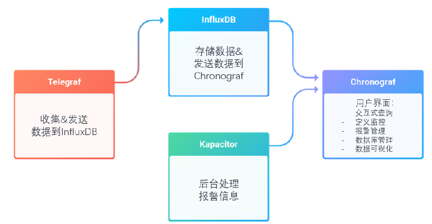

# InfluxDB


​	InfluxDB 是一种时序数据库，时序数据库通常被用在监控场景，比如运维和 IOT（物联网）领域。这类数据库旨在存储时序数据并实时处理它们。比如。我们可以写一个程序将服务器上 CPU 的使用情况每隔 10 秒钟向 InfluxDB 中写入一条数据。接着，我们写一个查询语句，查询过去 30 秒 CPU 的平均使用情况，然后让这个查询语句也每隔 10 秒钟执行一次。最终，我们配置一条报警规则，如果查询语句的执行结果>xxx，就立刻触发报警。

​	关系型数据库也是支持时间戳的，也能够基于时间戳进行查询。但是，从我们的使用场景出发，需要注意数据库的写入性能。通常，关系型数据库会采用 B+树数据结构，在数据写入时，有可能会触发叶裂变，从而产生了对磁盘的随机读写，降低写入速度。
​	当前市面上的时序数据库通常都是采用 LSM Tree 的变种，顺序写磁盘来增强数据的写入能力。网上有不少关于性能测试的文章，同学们可以自己去参考学习，通常时序数据库都会保证在单点每秒数十万的写入能力。

 	InfluxData 在 InfluxDB1.X 的时候推出了 TICK 生态来推出 start 全套的解决方案

​	TICK4 个字母分别对应 4 个组件

- T : Telegraf - 数据采集组件，收集&发送数据到 InfluxDB

- I : InfluxDB - 存储数据&发送数据到 Chronograf
- C : Chronograf - 总的用户界面，起到总的管理功能

- K : Kapacitor - 后台处理报警信息



​	到了 2.x，TICK 进一步融合，ICK 的功能全部融入了 InfluxDB，仅需安装 InfluxDB 就能得到一个管理页面，而且附带了定时任务和报警功能


​	项目参考地址：https://github.com/influxdata/influxdb


​	FLUX 语言支持：自 InfluxDB 1.7 和 InfluxDB 2.0 以来，InfluxDB 推出了一门独立的新的查询语言 FLUX，而且作为一个独立的项目来运作。InfluxData 公司希望 FLUX 语言能够成为一个像 SQL 一样的通用标准，而不仅仅是查询 InfluxDB 的特定语言。而且不管是你是选择 InfluxDB 1.X 还是 2.X 最终都会接触到 FLUX。不过 2.X 对 FLUX 的支持性要更好一些


# 部署 InfluxDB


```bash
wget https://dl.influxdata.com/influxdb/releases/influxdb2-2.7.5_linux_amd64.tar.gz

tar -zxvf influxdb2-2.7.5_linux_amd64.tar.gz -C /opt/module
```

> Go 语言开发的项目一般来说会只打包成单独的二进制可执行文件，也就是解压后目录下的 influxd 文件，这一文件中全是编译后的本地码，可以直接跑在操作系统上，不需要安装额外的运行环境或者依赖

```bash
./influxd
```

​	使用浏览器访问 http://hadoop102:8086

​	如果是安装后的首次使用，InfluxDB 会返回一个初始化的引导界面。按照给定步骤完成操作就好

<hr>


**IP 白名单**

https://docs.influxdata.com/influxdb/v2.4/security/enable-hardening/

**机密管理**
https://docs.influxdata.com/influxdb/v2.4/security/secrets/

**token 管理**
https://docs.influxdata.com/influxdb/v2.4/security/tokens/

**禁用部分开发功能**
https://docs.influxdata.com/influxdb/v2.4/security/disable-devel/

**多份配置切换**

```bash
./influx config create --config-name influx2.conf \
  --host-url http://localhost:8086 \
  --org atguigu \
  --token ZA8uWTSRFflhKhFvNW4TcZwwvd2NHFW1YIVlcj9Am5iJ4ueHawWh49_jszoKybEymHqgR5mAWg4XMv4tb9TP3w== \
  --active

influx config influx.conf
# 删除一个配置
./influx config remove influx2.conf
```

**influx-cli 命令**
详情可以参考：https://docs.influxdata.com/influxdb/v2.4/reference/cli/influx/

