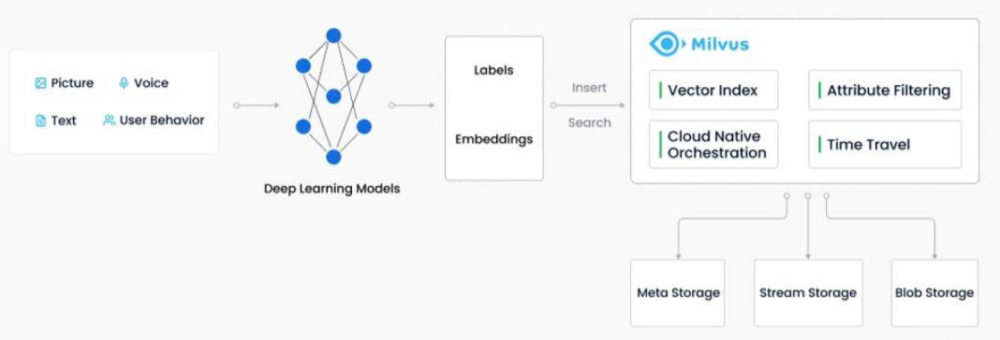

# Milvus

Milvus 是一款全球领先的开源向量数据库，赋能 AI 应用和向量相似度搜索，加速**非结构化数据**检索。

Milvus专注于存储、索引及管理由深度神经网络和其他机器学习（ML）模型生成的海量嵌入向量，能够轻松应对万亿级别的向量索引任务。

> Zilliz是Milvus的主要开发者，Milvus是2019年首次发布的开源向量数据库。根据Milvus网站的说法，该数据库是以现代云的方式开发的，可以提供“万亿向量数据集上的毫秒搜索”。
>
> 客户的问题不是直接提交给ChatGPT（或其他LLM），而是首先路由到向量数据库，该数据库将检索该查询的前10或15个最相关的文档。然后，向量数据库将这些支持文档与用户的原始问题捆绑在一起，将完整的包作为提示提交给LLM，LLM将返回答案。
>
> 国内的向量数据库产品：[**MyScale**](https://myscale.com/)

​		为了实现计算机对非结构化数据的理解和处理，开发者利用嵌入技术将其转换为向量。借助Milvus存储和索引这些向量，解决了AI应用开发中的痛点。通过计算向量之间的相似距离，Milvus可以快速分析两个向量间的关联性，从而判断原始数据源的相似程度，为开发者提供更高效便捷的数据处理手段。



> ​		**嵌入向量**是对非结构化数据（如电子邮件、物联网传感器数据、Instagram照片、蛋白质结构等）的特征抽象。数学上，嵌入向量是一个浮点数或二进制数的数组。现代的嵌入技术被用于将非结构化数据转换为嵌入向量。
>
> ​		**向量相似度搜索**是将向量与数据库进行比较，以找到与查询向量最相似的向量的过程。使用近似最近邻搜索算法加速搜索过程。如果两个嵌入向量非常相似，那么原始数据源也是相似的。


## 安装

> 这里 安装模式为 单机安装，集群安装请参考以下链接
>
> https://www.milvus-io.com/install_cluster-milvusoperator

### 1、安装 Docker 及 Docker Compose

​		这里参考 [语雀 Docker Compose](https://www.yuque.com/yuzhi-vmblo/yys/nn3wo4) 内容！

### 2、获取 YAML

```bash
wget https://github.com/milvus-io/milvus/releases/download/v2.2.12/milvus-standalone-docker-compose.yml -O docker-compose.yml
```

### 3、启动 Milvus

```bash
sudo docker-compose up -d
```


### 9、UI 界面

```bash
docker run -p 8000:3000 -e HOST_URL=http://172.18.0.4:8000 --network=milvus \
    -e MILVUS_URL=172.18.0.4:19530 zilliz/attu:latest
```

