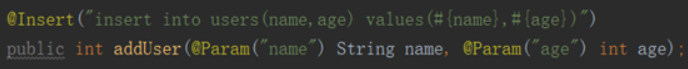
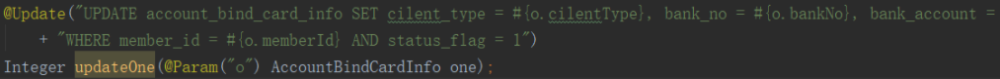

# Mybatis

首先Mybatis是一个对象关系映射（Object Relational Mapping，简称ORM）框架，是为了解决面向对象与关系数据库存在的互不匹配的现象。也就是说Mybatis的关注点在于对象与数据库之间的映射，Mybatis会把从数据库中得到的松散数据进行封装，使开发者直接拿到一个对象。Mybatis其实是对jdbc的操作数据库的过程进行了封装，使开发者只需要关注 SQL 本身，而不需要花费精力去处理例如注册驱动、创建connection、创建statement、手动设置参数、结果集检索等jdbc繁杂的过程代码。

Mybatis需要手写Sql语句，对jdbc的封装程度不如hibernate，但因此也灵活得多。

在使用mybatis时，只需要关注三个部分（1.sql语句 2.输入参数 3.输出参数）

输入参数映射->sql语句中的占位符

#### 1.输入参数可以是基本类型

如果只有一个参数那么可以不使用@Param注解，但如果有多个参数，必须使用@Param注解，用于映射参数->占位符。

#### 2.也可以是pojo类型，但如果是pojo类型，那么pojo中的属性必须与sql语句中的占位符一样

例如上图，那么User类中必须有name和id这两个属性名。否则会报Error querying database. Cause: org.apache.ibatis.reflection.ReflectionException: There is no getter for property named 'name2' in 'class me.gacl.domain.User'的错误。（从异常上也可以看出使用到了反射）

#### 3.还可以这样使用pojo类型

 

输出参数映射->数据库表中的字段

输出参数一般的类型都是pojo或者是list<pojo>类型。（即一对一或者一对多的关系）

一般要求是pojo中的属性名要和数据库表中的字段一样才能完成映射（但是也可以通过别的方式完成映射，具体方法可以参考Mybatis 字段映射问题.note）。

如果查询出来的列名和pojo中的属性名全部不一致，不会创建pojo对象。

只要查询出来的列名和pojo中的属性有一个一致，就会创建pojo对象，但其他属性值为默认值。

**输入映射：**

parameterType：指定输入参数类型可以简单类型、pojo、hashmap。

对于综合查询，建议parameterType使用包装的pojo，有利于系统 扩展。

**输出映射：**

**resultType**：

查询到的列名和resultType指定的pojo的属性名一致，才能映射成功。（使用了反射机制，属性名和列名不一致就无法通过反射找到setter方法）

**reusltMap**：

可以通过resultMap 完成一些高级映射。

如果查询到的列名和映射的pojo的属性名不一致时，通过resultMap设置列名和属性名之间的对应关系（映射关系）。可以完成映射。

**高级映射：**

将关联查询的列映射到一个pojo属性中。（一对一）

将关联查询的列映射到一个List<pojo>中。（一对多）

