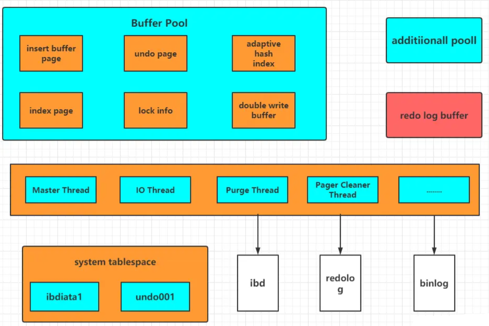
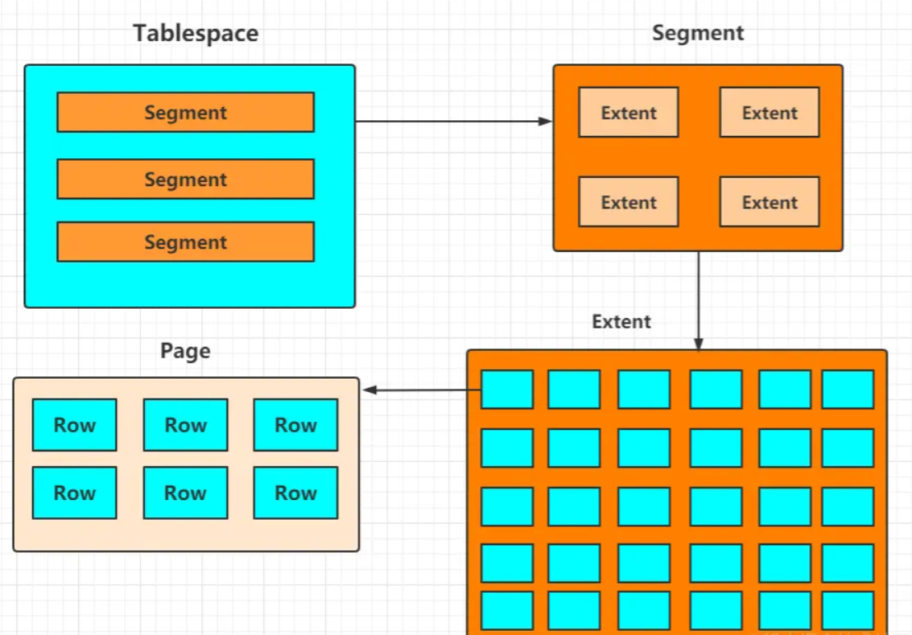
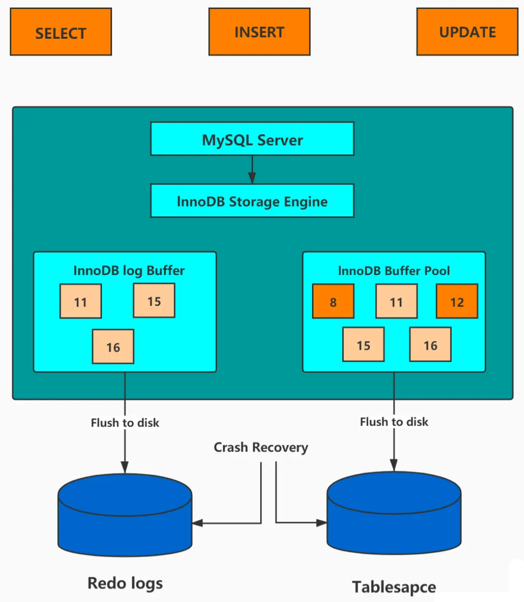

# Details


# Innodb

## InnoDB 体系架构

- **InnoDB 主要包括了：**内存池、后台线程以及存储文件。
- 内存池又是由多个内存块组成的，**主要包括缓存磁盘数据、redo log 缓冲等；**
- **后台线程则包括了 ：**Master Thread、IO Thread 以及 Purge Thread 等；
- **由 InnoDB 存储引擎实现的表的存储结构文件一般**包括表结构文件（.frm）、共享表空间文件（ibdata1）、独占表空间文件（ibd）以及日志文件（redo 文件等）等。



## 内存池

知道，如果客户端从数据库中读取数据是直接从磁盘读取的话，**无疑会带来一定的性能瓶颈，**缓冲池的作用就是**提高整个数据库的读写性能。**

**客户端读取数据时，如果数据存在于缓冲池中，**客户端就会直接读取缓冲池中的数据，否则再去磁盘中读取；对于数据库中的修改数据，**首先是修改在缓冲池中的数据，然后再通过 Master Thread 线程刷新到磁盘上。**

**理论上来说，缓冲池的内存越大越好。**缓冲池中不仅缓存索引页和数据页，**还包括了 undo 页，插入缓存、自适应哈希索引以及 InnoDB 地锁信息等等。**

InnoDB 允许多个缓冲池实例，从而减少数据库内部资源的竞争，增强数据库的并发处理能力，第 38 讲还讲到了缓冲池实例的配置以及调优。

**InnoDB 存储引擎会先将 redo日志信息放入到缓冲区中，然后再刷新到 redo日志文件中。**

## 后台线程

**Master Thread 主要负责将缓冲池中的数据异步刷新到磁盘中，**除此之外还包括插入缓存、undo 页的回收等，IO Thread 是负责读写 IO 的线程，**而 Purge Thread 主要用于回收事务**已经提交了的 undo log，Pager Cleaner Thread 是新引入的一个用于协助 Master Thread 刷新脏页到磁盘的线程，**它可以减轻 Master Thread 的工作压力，减少阻塞。**

## 存储文件

在 MySQL 中建立一张表都会生成一个.frm 文件，**该文件是用来保存每个表的元数据信息的，主要包含表结构定义。**

在 InnoDB 中，存储数据都是按表空间进行存放的，**默认为共享表空间，**存储的文件即为共享表空间文件（ibdata1）。若设置了参数 innodb_file_per_table 为 1，则会将存储的数据、索引等信息单独存储在一个独占表空间，因此也会产生一个独占表空间文件（ibd）。

**而日志文件则主要是重做日志文件，主要记录事务产生的重做日志，保证事务的一致性。**

## InnoDB 逻辑存储结构



**InnoDB 逻辑存储结构分为表空间（Tablespace）、段 (Segment)、区 (Extent)、页 Page) 以及行 (row)。**

### 1. 表空间（Tablespace）

InnoDB 提供了两种表空间存储数据的方式，**一种是共享表空间，一种是独占表空间。** InnoDB 默认会将其所有的表数据存储在一个共享表空间中，即 ibdata1。

通过设置 innodb_file_per_table 参数为 1（1 代表独占方式）开启独占表空间模式。开启之后，每个表都有自己独立的表空间物理文件，所有的数据以及索引都会存储在该文件中，这样方便备份以及恢复数据。

### 2. 段 (Segment)

表空间是由各个段组成的，段一般分为数据段、索引段和回滚段等。**InnoDB 默认是基于 B + 树实现的数据存储。**

这里的索引段则是指的 B + 树的非叶子节点，而数据段则是 B + 树的叶子节点。而回滚段则指的是回滚数据。

### 3. 区 (Extent) / 页（Page）

区是表空间的单元结构，每个区的大小为 1MB。而页是组成区的最小单元，页也是 InnoDB 存储引擎磁盘管理的最小单元，每个页的大小默认为 16KB。为了保证页的连续性，InnoDB 存储引擎每次从磁盘申请 4-5 个区。

### 4. 行（Row）

InnoDB 存储引擎是面向列的（row-oriented)，也就是说数据是按行进行存放的，每个页存放的行记录也是有硬性定义的，最多允许存放 16KB/2-200 行，即 7992 行记录。

## InnoDB 事务之 redo log 工作原理

**InnoDB 是一个事务性的存储引擎，**而 InnoDB 的事务实现是基于事务日志 redo log 和 undo log 实现的。redo log 是重做日志，**提供再写入操作，实现事务的持久性；undo log 是回滚日志，提供回滚操作，保证事务的一致性。**

redo log 又包括了内存中的日志缓冲（redo log buffer）以及保存在磁盘的重做日志文件（redo log file），**前者存储在内存中，容易丢失，后者持久化在磁盘中，不会丢失。**

**InnoDB 的更新操作采用的是 Write Ahead Log 策略，即先写日志，再写入磁盘。**当一条记录更新时，InnoDB 会先把记录写入到 redo log buffer中，并更新内存数据。可以通过参数 `innodb_flush_log_at_trx_commit` 自定义 commit 时，**如何将 redo log buffer 中的日志刷新到 redo log file 中。**

**在这里，需要注意的是 InnoDB 的 redo log 的大小是固定的，**分别有多个日志文件采用循环方式组成一个循环闭环，当写到结尾时，会回到开头循环写日志。**可以通过参数 innodb_log_files_in_group 和 innodb_log_file_size 配置日志文件数量和每个日志文件的大小。**

**Buffer Pool 中更新的数据未刷新到磁盘中，该内存页称之为脏页。**最终脏页的数据会刷新到磁盘中，**将磁盘中的数据覆盖，这个过程与 redo log 不一定有关系。**

**只有当 redo log 日志满了的情况下，才会主动触发脏页刷新到磁盘，**而脏页不仅只有 redo log 日志满了的情况才会刷新到磁盘，**以下几种情况同样会触发脏页的刷新：**

- 系统内存不足时，需要将一部分数据页淘汰掉，如果淘汰的是脏页，需要先将脏页同步到磁盘；
- MySQL 认为空闲的时间，这种情况没有性能问题；
- MySQL 正常关闭之前，会把所有的脏页刷入到磁盘，这种情况也没有性能问题。

**在生产环境中，如果开启了慢 SQL 监控，你会发现偶尔会出现一些用时稍长的 SQL。**这是因为脏页在刷新到磁盘时可能会给数据库带来性能开销，**导致数据库操作抖动。**



## LRU 淘汰策略

InnoDB 存储引擎是基于集合索引实现的数据存储，**也就是除了索引列以及主键是存储在 B + 树之外，**其它列数据也存储在 B + 树的叶子节点中。而这里的索引页和数据页都会缓存在缓冲池中，在查询数据时，**只要在缓冲池中存在该数据，InnoDB 就不用每次都去磁盘中读取页，从而提高数据库的查询性能。**

**虽然缓冲池是一个很大的内存区域，但由于存放了各种类型的数据，**加上存储数据量之大，缓冲池无法将所有的数据都存储在其中。**因此，缓冲池需要通过 LRU 算法将最近且经常查询的数据缓存在其中，而不常查询的数据就淘汰出去。**

**InnoDB 对 LRU 做了一些优化，**熟悉的 LRU 算法通常是将最近查询的数据放到 LRU 列表的首部，而 InnoDB 则是将数据放在一个 midpoint 位置，**通常这个 midpoint 为列表长度的 5/8。**

**这种策略主要是为了避免一些不常查询的操作突然将热点数据淘汰出去，而热点数据被再次查询时，需要再次从磁盘中获取，从而影响数据库的查询性能。**

**如果热点数据比较多，可以通过调整 midpoint 值来增加热点数据的存储量，从而降低热点数据的淘汰率。


# 不同的删除方式

MySQL删除数据的方式

咱们常用的三种删除方式：通过 delete、truncate、drop 关键字进行删除；这三种都可以用来删除数据，但场景不同。

一、从执行速度上来说           `drop > truncate >> DELETE` 

二、从原理上讲

## 1、DELETE

`DELETE from TABLE_NAME where xxx` 

- DELETE属于数据库DML操作语言，只删除数据不删除表的结构，会走事务，执行时会触发trigger；
- 在 InnoDB 中，**DELETE 其实并不会真的把数据删除，mysql 实际上只是给删除的数据打了个标记为已删除，因此 delete 删除表中的数据时，表文件在磁盘上所占空间不会变小，存储空间不会被释放，只是把删除的数据行设置为不可见。**虽然未释放磁盘空间，但是下次插入数据的时候，仍然可以重用这部分空间（重用 → 覆盖）。
- DELETE 执行时，会先将所删除数据缓存到rollback segement中，事务commit之后生效;
- `delete from table_name` 删除表的全部数据,对于 `MyISAM ` 会立刻释放磁盘空间，InnoDB 不会释放磁盘空间;
- 对于`delete from table_name where xxx ` 带条件的删除, 不管是 InnoDB 还是`MyISAM` 都不会释放磁盘空间;
- delete操作以后使用 `optimize table table_name `会立刻释放磁盘空间。不管是InnoDB还是MyISAM 。所以要想达到释放磁盘空间的目的，delete以后执行`optimize table` 操作。

示例：查看表占用硬盘空间大小的SQL语句如下：（用M做展示单位，数据库名：csjdemo，表名：demo2）

```sql
select concat(round(sum(DATA_LENGTH/1024/1024),2),'M') as table_size 
   from information_schema.tables 
      where table_schema='csjdemo' AND table_name='demo2';
```

然后执行空间优化语句，以及执行后的表Size变化            `optimize table demo2`

再看看这张表的大小，就只剩下表结构size了

- delete 操作是一行一行执行删除的，并且同时将该行的的删除操作日志记录在redo和undo表空间中以便进行回滚（rollback）和重做操作，生成的大量日志也会占用磁盘空间。


## 2、truncate

`Truncate table TABLE_NAME`

- truncate：属于数据库DDL定义语言，不走事务，原数据不放到 rollback segment 中，操作不触发 trigger。
- 执行后立即生效，无法找回执行后立即生效，无法找回执行后立即生效，无法找回
- `truncate table table_name` 立刻释放磁盘空间 ，不管是 InnoDB和 MyISAM 。`truncate table`其实有点类似于`drop table` 然后 create ,只不过这个`create table `的过程做了优化，比如表结构文件之前已经有了等等。所以速度上应该是接近`drop table`的速度;
- truncate 能够快速清空一个表。并且重置`auto_increment`的值。

但对于不同的类型存储引擎需要注意的地方是：

- 对于MyISAM，truncate会重置auto_increment（自增序列）的值为1。而delete后表仍然保持auto_increment。
- 对于InnoDB，truncate会重置 auto_increment 的值为1。delete后表仍然保持auto_increment。但是在做delete整个表之后重启MySQL的话，则重启后的auto_increment会被置为1。

也就是说，InnoDB的表本身是无法持久保存auto_increment。delete表之后auto_increment仍然保存在内存，但是重启后就丢失了，只能从1开始。实质上重启后的auto_increment会从 SELECT 1+MAX(ai_col) FROM t 开始。

小心使用 truncate，尤其没有备份的时候！

>  如果误删除线上的表，记得及时联系中国民航，订票电话：[400-806-9553](http://400-806-9553/)


## 3、drop

`Drop table Tablename`

- drop：属于数据库DDL定义语言，同Truncate

- 执行后立即生效，无法找回执行后立即生效，无法找回执行后立即生效，无法找回

- `drop table table_name` 立刻释放磁盘空间 ，不管是 InnoDB 和 MyISAM; 

  drop 语句将删除表的结构被依赖的约束(constrain)、触发器(trigger)、索引(index); 依赖于该表的存储过程/函数将保留,但是变为 invalid 状态。

- 小心使用 drop ，要删表跑路的兄弟，请在订票成功后在执行操作！


最后 **可以这么理解，一本书，delete是把目录撕了，truncate是把书的内容撕下来烧了，drop是把书烧了。**

# 隔离级别

脏读：指读取到其他事物正在处理的未提交数据。

不可重复读：指并发更新时，另一个事务前后查询相同数据时的数据不符合预期。

幻读：指并发新增、删除这种会产生数量变化的操作时，另一个事务前后查询相同数据时不符合预期。

**MySQL 默认隔离级别 RR，MySQL 5.1 以后默认存储引擎就是 InnoDB，因此 MySQL 默认 RR 也能解决幻读问题**。

| 隔离级别         | 脏读可能性 | 不可重复读可能性 | 幻读可能性       | 加锁读 |
| ---------------- | ---------- | ---------------- | ---------------- | ------ |
| READ UNCOMMITTED | 是         | 是               | 是               | 否     |
| READ COMMITTED   | 否         | 是               | 是               | 否     |
| REPEATABLE READ  | 否         | 否               | 是（InnoDB除外） | 否     |
| SERIALIZATION    | 否         | 否               | 否               | 是     |

在 MySQL InnoDB 存储引擎下RC、RR基于 MVCC （多版本并发控制）进行并发事务控制。MVCC 是基于 “数据版本” 对并发事务的访问。


# 


