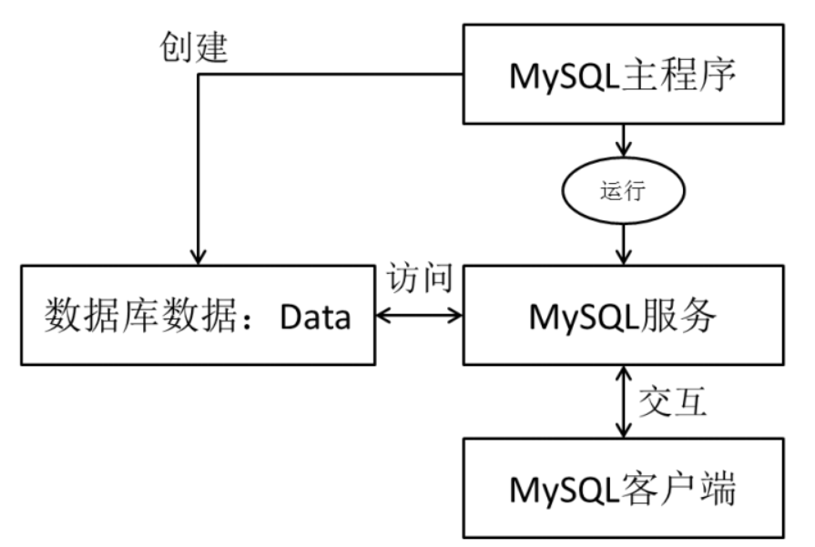

# MySQL 基础


## 基本概念

**DB 数据库（database）**：存储数据的“仓库”。它保存了一系列有组织的数据。

**DBMS 数据库管理系统（Database Management System）**。数据库是通过DBMS创建和操作的容器

**SQL 结构化查询语言（Structure Query Language）**：专门用来与数据库通信的语言


SQL语言共分为四大类：数据查询语言`DQL`，数据操纵语言`DML`，数据定义语言`DDL`，数据控制语言`DCL`。

1、DML（Data Manipulation Language):数据操纵语句，用于添 加、删除、修改、查询数据库记录，并检查数据完整性

2、DDL（Data Definition Language):数据定义语句，用于库和 表的创建、修改、删除。

3、DCL（Data Control Language):数据控制语句，用于定义用 户的访问权限和安全级别。


### 数据操纵语言 DML

DML用于查询与修改数据记录，包括如下SQL语句：

- INSERT：添加数据到数据库中

  - ```sql
    insert into 表名(列名,…) values(值1,…);
    ```

- UPDATE：修改数据库中的数据

  - ```sql
    update 表1 别名
    inner|left|right join 表2 别名
    on 连接条件
    set 列=值,…
    where 筛选条件;
    ```

- DELETE：删除数据库中的数据

  - ```sql
    delete 表1的别名,表2的别名
    from 表1 别名
    inner|left|right join 表2 别名 on 连接条件
    where 筛选条件;
    
    truncate table 表名;
    ```

- SELECT：选择（查询）数据

### 数据定义语言 DDL

DDL用于定义数据库的结构，比如创建、修改或删除

数据库对象，包括如下SQL语句：

- CREATE TABLE：创建数据库表
- ALTER TABLE：更改表结构、添加、删除、修改列长度
- DROP TABLE：删除表
- CREATE INDEX：在表上建立索引
- DROP INDEX：删除索引
- SELECT是SQL语言的基础，最为重要

### 数据控制语言 DCL

DCL用来控制数据库的访问，包括如下SQL语句：

- GRANT：授予访问权限
- REVOKE：撤销访问权限
- COMMIT：提交事务处理
- ROLLBACK：事务处理回退
- SAVEPOINT：设置保存点
- LOCK：对数据库的特定部分进行锁定




# 权限管理

## 用户管理

启动MySQL服务后，可以通过mysql命令来登录MySQL服务器，命令如下：

```sql
mysql –h hostname|hostIP –P port –u username –p DatabaseName –e "SQL语句"
```

举例：

```sql
create user 'zy'@'%' identified by '123456';
```


## 权限管理

查看可使用权限 ： 这里展示一部分

```sql
mysql> show privileges;
+-----------------------------+---------------------------------------+
| Privilege                   | Context                               |
+-----------------------------+---------------------------------------+
| Alter                       | Tables                                |
| Alter routine               | Functions,Procedures                  |
| Create                      | Databases,Tables,Indexes              |
| Create routine              | Databases                             |
| Create role                 | Server Admin                          |
| Create temporary tables     | Databases                             |
| Create view                 | Tables                                |
| Create user                 | Server Admin                          |
| Delete                      | Tables                                |
| Drop                        | Databases,Tables                      |
| Drop role                   | Server Admin                          |
| Event                       | Server Admin                          |
| Execute                     | Functions,Procedures                  |
| File                        | File access on server                 |
| Grant option                | Databases,Tables,Functions,Procedures |
| Index                       | Tables                                |
| Insert                      | Tables                                |
| Lock tables                 | Databases                             |
| Process                     | Server Admin                          |
| Proxy                       | Server Admin                          |
| References                  | Databases,Tables                      |
| Reload                      | Server Admin                          |
| Replication client          | Server Admin                          |
| Replication slave           | Server Admin                          |
| Select                      | Tables                                |
| Show databases              | Server Admin                          |
| Show view                   | Tables                                |
| Shutdown                    | Server Admin                          |
| Super                       | Server Admin                          |
| Trigger                     | Tables                                |
| Create tablespace           | Server Admin                          |
| Update                      | Tables                                |
| Usage                       | Server Admin                          |
+-----------------------------+---------------------------------------+
```


## 角色管理

创建角色

```sql
create role db_classmates;
```

授予角色相应的权限

```sql
mysql> grant select,delete,update,create,Create view,insert,Trigger,index,alter on *.* to db_classmates;
```


```sql
# -- 授权角色
grant db_classmates to zy;

# -- 激活角色
set default role db_classmates to zy;

# -- 曹经纬
grant db_classmates to cjw;
set default role db_classmates to cjw;
# -- 次尔金
grant db_classmates to cej;
set default role db_classmates to cej;
```


# 日志


一、查看日志是否开启：

1、show variables where Variable_name = 'general_log';

2、show variables like 'general_log';

二、开启和关闭的sql:
1、set global general_log=on;

2、set global general_log=off;

三、查看log文件所在位置：

1、show variables where Variable_name='general_log_file';

2、show variables like 'general_log_file';

四、修改log文件所在位置：

1、set global general_log_file='tmp/mysql_log.log';

五、日志输出类型table或file：

1、show variables like 'log_output';

六、修改日志输出类型：

1、set global log_output='table';

2、set global log_output='file';


**贰、慢查询日志（可用可不用）：**

一、查看慢查询设置：

1、show variables like "%slow%";

二、 启用慢查询：

1、set global slow_query_log=ON;

2、set global slow_query_log=OFF;

三、 设置成2秒，加上global,下次进mysql已然生效：

1、set global long_query_time=2;
