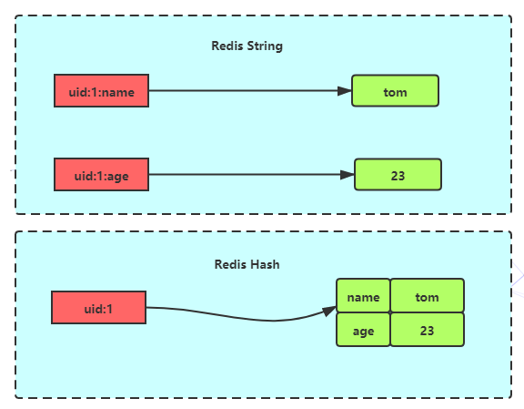
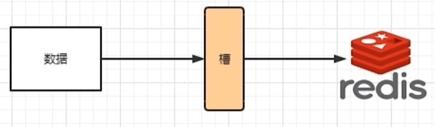

# Redis

# 1. NoSQL 概述

## 1.1. 数据库发展历史

> 时代一：单机MySQL时代


- 90 年代，一个基本的网站访问量一般不会太大，单个数据库完全足够！

- 那个时候更多的使用`Static HTML`！服务器根本没有太大压力。

- 这种情况下，整个网站的瓶颈式什么？
  - 数据量如果太大，一个机气放不下了。
  - MySQL数据库的索引（B+ Tree），一个机器也放不下。
  - 访问量（读写混合），一个服务器承受不了。

只要出现以上的三种情况之一，那么系统的架构就必须要升级了！

> 时代二：Memcached + MySQL + 垂直拆分（读写分离）


​	网站80%的数据都是在读，每次查询都要去数据库查询数据的话数据库性能会大大降低！所以希望减轻数据库的压力，可以使用缓存来保证效率！

发展过程：优化数据结构和索引 ---> 文件缓存（IO）---> Memcached（当时最热门的技术）

> 时代三：分库分表 + 水平拆分 + MySQL 集群


- 本质：数据库（读，写）

- 早些年`MyISAM`：表锁，十分影响效率！高并发下会出现严重的问题！

- 转战`InnoDB`：行锁，比表锁效率要高跟多
- 慢慢的就开始使用分库分表来解决写的压力

> 时代四：现在的时代

- 2010—2020十年之间，计算机互联网行业已经发生了很大的变化，数据变的越来越多元化。
- MySQL等关系型数据库已经不够用了！数据量很多，变化超快。
- MySQL有的使用它来存储一些比较大的文件，博客，图片等，数据库表很大，查询效率非常低！如果有一种数据库专门处理这种数据，MySQL数据库压力就变得非常小了。

## 1.2. 为什么要用 NoSQL

- 用户的社交网络，地理位置，用户自定义的数据，用户日志等数据爆发式的增长，这些数据用关系型数据库就不合适了！
- NoSQL 数据库可以很好处理以上的情况。

## 1.3. 什么是 NoSQL

- `NoSQL(Not Only SQL)`：不仅仅是SQL，泛指非关系型数据库，伴随着 Web2.0 互联网的诞生！
- 关系型数据库：有表格，由行和列组成。
- 传统的关系型数据库很难对付web2.0时代！尤其是超大规模的高并发的社区，暴露出很多难以克服的问题。NoSQL在当今大数据环境下发展的十分迅速，Redis是发展最快的，是当下必须要掌握的一门技术
- 很多的数据类型用户的个人信息，社交网络，地理位置，这些数据类型的存储不需要一个固定的格式！不需要多余的操作就可以横向扩展的！

## 1.4. NoSQL 特点

- 方便扩展（数据之间没有关系，很好扩展）
- 大数据量高性能（Redis一秒可以写8万次，读取11万次，NoSQL的缓存是一种细粒度的缓存）
- 数据类型多样（不需要事先设计数据库！随取随用！如果是数据量十分大的表，很多人就无法设计了！）

## 1.5. 传统的 RDBMS 和 NoSQL

```
传统的 RDBMS
- 结构化组织
- SQL
- 数据和关系都存在单独的表中
- 操作数据，数据定义语言
- 严格的一致性
- 基础的事物
```

```
NoSQL
- 不仅仅是数据
- 没有固定的查询语言
- 键值对存储，列存储，文档存储，图形数据库(社交关系)
- 最终一致性
- CAP 定理 和 BASE 理论
- 高性能，高可用，高可扩展
```

## 1.6. NoSQL的四大分类

- **KV键值对：**
  - 新浪：Redis
  - 美团：Redis + Tair
  - 阿里、百度：Redis + Memecache
- **文档型数据库：**
  - MongoDB (一般必须要掌握)：基于分布式文件存储的数据库，C++ 编写，主要用来处理大量的文档！
  - **MongoDB是一个介于关系型数据库和非关系型数据库的中间产品**
- **列存储数据库：**
  - HBase
  - 分布式文件系统
- **图形关系数据库：**
  - 不是存储图片的，是用来存储社交关系的，广告推荐
  - Neo4j，InfoGrid

# 2. Redis 入门

## 2.1. Redis 概述

​	Redis（Remote Dictionary Server)，即远程字典服务，是一个开源的使用ANSI [C语言](https://baike.baidu.com/item/C语言)编写、支持网络、可基于内存亦可持久化的日志型、Key-Value[数据库](https://baike.baidu.com/item/数据库/103728)，并提供多种语言的API。

- Redis是内存存储、内存中是断电就会消失，所以说持久化很重要 (rdb、aof)
- 效率高，可以用于告诉缓存
- 发布订阅系统
- 地图信息分析
- 计时器、计数器（浏览量）

## 2.2. Redis 安装

```shell
# 1、下载安装包！redis-6.0.1.tar.gz

# 2、上传到Linux服务器并解压，进入到Redis根目录下

# 3、安装gcc套餐
yum install cpp
yum install binutils
yum install glibc
yum install glibc-kernheaders
yum install glibc-common
yum install glibc-devel
yum install gcc
yum install make

# 4、升级gcc
yum -y install centos-release-scl

yum -y install devtoolset-9-gcc devtoolset-9-gcc-c++ devtoolset-9-binutils

scl enable devtoolset-9 bash

# 5、执行make
make

# 6、安装Redis
make install

[root@mingyu redis-6.0.1]# make install
cd src && make install
make[1]: Entering directory `/opt/redis/redis-6.0.1/src'

Hint: It's a good idea to run 'make test' ;)

    INSTALL install
    INSTALL install
    INSTALL install
    INSTALL install
    INSTALL install
make[1]: Leaving directory `/opt/redis/redis-6.0.1/src'

# 7、Redis默认安装路径 这里有redis-server和redis-cli
/usr/local/bin

# 8、Redis默认不是后台启动的，需要修改配置文件！
201 ################################# GENERAL #####################################
202 
203 # By default Redis does not run as a daemon. Use 'yes' if you need it.
204 # Note that Redis will write a pid file in /var/run/redis.pid when daemonized.
205 daemonize yes # 这里默认是no 修改为yes代表后台启动

# 9、启动Redis服务 通过指定的配置文件来运行服务
[root@mingyu bin]# ./redis-server /opt/redis/redis-6.0.1/redis.conf
8995:C 28 Jun 2020 16:32:28.758 # oO0OoO0OoO0Oo Redis is starting oO0OoO0OoO0Oo
8995:C 28 Jun 2020 16:32:28.758 # Redis version=6.0.1, bits=64, commit=00000000, modified=0, pid=8995, just started
8995:C 28 Jun 2020 16:32:28.758 # Configuration loaded

# 10、redis客户端进行连接测试
[root@mingyu bin]# ./redis-cli -p 6379
127.0.0.1:6379> 

# 12、关闭Redis服务
127.0.0.1:6379> shutdown
```

## 2.3. Redis 性能测试

**redis-benchmark 是一个压力测试工具，官方自带的性能测试工具！**

```shell
redis-benchmark -h localhost -p 6379 -c 100 -n 100000

root@b72a84f52d13:~# redis-benchmark -h localhost -p 6379 -c 100 -n 100000
====== PING_INLINE ======
100000 requests completed in 1.63 seconds # 10W个请求在1.63秒执行成功
100 parallel clients	# 100个并发客户端
3 bytes payload	# 每次写入3个字节
keep alive: 1	# 只有一台Redis服务器来处理这些请求
host configuration "save": 900 1 300 10 60 10000
host configuration "appendonly": no
multi-thread: no

99.81% <= 2 milliseconds
99.99% <= 3 milliseconds
100.00% <= 3 milliseconds	# 所有请求在3ms内完成
54884.74 requests per second	# 每秒处理54884.74个请求
```

## 2.4. Redis 基础知识

```shell
# 1、Redis默认有16个数据库 可以用SELECT来切换数据库
127.0.0.1:6379[1]> SELECT 0
OK
127.0.0.1:6379> 

# 2、查看 DB 大小 DBSIZE
127.0.0.1:6379> DBSIZE
(integer) 5

# 3、set get
127.0.0.1:6379> set name ringo
OK
127.0.0.1:6379> get name
"ringo"

# 4、查看数据库所有的 key   keys *
127.0.0.1:6379> KEYS *
1) "k1"
2) "key:{tag}:__rand_int__"
3) "myhash:{tag}:__rand_int__"
4) "mylist:{tag}"
5) "counter:{tag}:__rand_int__"
6) "name"

# 5、清空数据库
# flushdb 清空当前数据库
# flushall 清空所有数据库的数据

# 6、Redis是单线程的！
# Redis是很快的，Redis是基于内存操作的，CPU不是Redis的性能瓶颈，Redis的瓶颈是根据机器的内存和网络带宽，既然可以使用单线程来实现，就使用单线程了！

# 7、为什么单线程还这么快？
# Redis是 C 语言写的，Redis是将所有的数据全部放在内存中的，所以用单线程去操作内存效率是最高的！(多线程会引起CPU的上下文切换)
```

# 3. 五大数据类型

## 3.1. Redis 官网简介

- Redis 是一个开源（BSD许可）的内存数据结构存储，用作数据库、缓存和消息代理。
- 它支持数据结构，如字符串、哈希、列表、集合、带范围查询的排序集合、位图、超日志、带半径查询的地理空间索引和流。
- Redis 具有内置的复制、Lua脚本、LRU逐出、事务和不同级别的磁盘持久性，并通过Redis Sentinel和带有Redis集群的自动分区提供高可用性。

## 3.2. Redis Key

```shell
# 1、KEYS *               查看所有的key
# 2、SET name ringo       设置 key
# 3、EXISTS name          是否存在当前key
# 4、MOVE name 1          将当前 key 移动到指定数据库
# 5、EXPIRE name 10       设置key的过期时间
# 6、TTL name             查看当前key的剩余时间
# 7、TYPE name            查看当前key的数据类型
# 8、DEL name             删除当前key
```

## 3.3. String (字符串)

​	字符串类型是Redis最基础的数据结构，其他几种数据结构都是在字符串类型基础上构建的。字符串类型的值是字符串（简单的字符串、复杂的字符串（例如JSON、XML））、数字（整数、浮点数），甚至是二进制（图片、音频、视频）等。

​	字符串对象的内部编码有3种 ：**int**、**raw** 和 **embstr**，Redis会根据当前值的类型和长度来决定使用哪种编码来实现

- int：如果一个字符串对象保存的是整数值,并且这个整数值可以用`long`类型来表示
- raw：如果字符串对象保存的是一个字符串值,并且这个字符串值的长度大于32字节
- embstr：如果字符串对象保存的是一个字符串值,并且这个字符申值的长度小于等于32字节

​	Reids字符串的使用场景是最为广泛的，甚至有些对redis其它几种对象不太熟悉的人，基本所有场景都会使用字符串(序列化一下直接扔进去),这让本身很单纯的字符串承受了它这个年纪本不该承受的重量。其实Redis的主要使用场景主要有以下几种:

- 作为缓存层,缓存热点数据
- Redis字符串可以自增自减的特性可以用来做计数器、限速器、自增ID生成等
- 分布式系统的Session共享
- 二进制数据的存储

基本操作

```shell
# 1、SET k1 v1              设置k-v
# 2、GET k1                 通过key获得value
# 3、KEYS *                 获得所有的key
# 4、EXISTS k1              判断当前key是否存在
# 5、APPEND k1 "hello"      在v1的基础上追加字符串变成”v1hello“，如果当前key不存在就相当于SET
# 6、STRLEN k1              获得k1对应的值的长度
```

INCR 和 DECR

```shell
# 1、SET views 0            设置views的值为"0"
# 2、INCR views             views的值增加1，"0"变成"1"
# 3、DECR views             views的值减少1，"1"变成"0"
# 4、INCRBY views 10        views的值直接加10，"0"变成"10"
# 5、DECRBY views 10        views的值直接减10，"10"变成"0"
```

GETRANGE 截取字符串

```shell
# 1、SET k1 “hello,ringo!”  设置k1的值
# 2、GETRANGE k1 0 4        获得k1下标[0,4]的值，就是"hello"
# 3、GETRANGE k1 1 -1       获得k1下标[1,maxLen]的值，就是"ello,ringo!"  
```

SETRANGE 替换字符串

```shell
# 1、SET k2 abcdefg        设置k2的值
# 2、SETRANGE k2 2 xxx     从下标为2开始，3个字符替换为"xxx"，结果是"abxxxfg"
```

SETEX 和 SETNX

```shell
# 1、SETEX(set with expire)         设置过期时间
127.0.0.1:6379[1]> SETEX k3 60 v3   # 设置k3的过期时间为60秒
OK
127.0.0.1:6379[1]> TTL k3
(integer) 57
           
# 2、SETNX(set if not exist)        如果不存在就设置k-v(在分布式锁中常常会用到)
127.0.0.1:6379[1]> SETNX k1 v1
(integer) 0
127.0.0.1:6379[1]> GET k1
"hello,Ringo"
```

批量设置

```shell
# 1、MSET k1 v1 k2 v2 ......      可以批量设置多个k-v
127.0.0.1:6379[1]> MSET k1 v1 k2 v2 k3 v3
OK
127.0.0.1:6379[1]> KEYS *
1) "k2"
2) "k1"
3) "k3"

# 2、MSETNX k1 vip1 k2 vip2 k4 vip4  虽然没有设置k4 但是批量设置k4也没有成功
# MSETNX 是一个原子性的操作，要么一起成功，要么一起失败！
127.0.0.1:6379[1]> MSETNX k1 vip1 k2 vip2 k4 vip4
(integer) 0
127.0.0.1:6379[1]> get k4
(nil)

# 3、巧妙设计key来存储对象
127.0.0.1:6379[1]> MSET user:1:name ringo user:1:age 18 user:1:id 968
OK
127.0.0.1:6379[1]> MGET user:1:name user:1:age user:1:id
1) "ringo"
2) "18"
3) "968"
```

组合命令

```shell
# 1、GETSET db redis 先获取db的值，由于没有设置GET的值是null，然后再SET db的值为redis
127.0.0.1:6379[1]> GETSET db redis
(nil)
127.0.0.1:6379[1]> GET db
"redis"
```

## 3.4. List (列表)

列表这种对象支持存储一组有序的，不重复的数据。因为其有序性，它可以获取指定范围的元素列表，可以在O(1)的时间复杂度获取指定索引的下标的元素等。


在Redis3.2版本以前列表类型的内部编码有两种。当满足下面两个条件的时候，Redis 列表对象使用ziplist（压缩列表）来实现。

- 当列表的元素个数小于list-max-ziplist-entries配置（默认512个）
- 当列表中每个元素的值都小于list-max-ziplist-value配置时（默认64字节）

当列表类型无法满足ziplist条件时，Redis会使用linkedList作为列表的内部实现。

而在Redis3.2版本开始怼列表数据结构进行改造，使用quickList代替了zipList和linkedList。

由于列表对象的有序且不可重复的特性，它比较适合用来做文章、商品等列表的存储。

列表类型可以lpush（左侧push），同时又可以使用rpop（右侧弹出）第一个元素，所以列表类型具有先进先出的特性，可以用来实现消息队列，也可以lpush（左侧push）和lpop（左侧弹出），具有后进先出的特性，因此开发中需要使用栈的时候，我们可以使用列表对象来实现。

```shell
# 在Redis里面，可以把List玩成栈、队列、阻塞队列！

# 1、LPUSH list01 one       从左边插入字符串"one"到列表list01
127.0.0.1:6379[1]> LPUSH list01 one
(integer) 1
127.0.0.1:6379[1]> LPUSH list01 two
(integer) 2
127.0.0.1:6379[1]> LPUSH list01 three
(integer) 3

# 2、RPUSH list01 right     从右边插入字符串"right"到列表list01
127.0.0.1:6379[1]> RPUSH list01 right
(integer) 4

# 3、LRANGE list01 0 -1     获取列表指定下标范围的值
127.0.0.1:6379[1]> LRANGE list01 0 -1
1) "three"
2) "two"
3) "one"
4) "right"
127.0.0.1:6379[1]> LRANGE list01 1 2
1) "two"
2) "one"

# 4、LPOP list01      将左边的第一个元素移出列表
127.0.0.1:6379[1]> LPOP list01
"three"
127.0.0.1:6379[1]> LRANGE list01 0 -1
1) "two"
2) "one"
3) "right"

# 5、RPOP list01      将右边的第一个元素移出列表
127.0.0.1:6379[1]> RPOP list01
"right"
127.0.0.1:6379[1]> LRANGE list01 0 -1
1) "two"
2) "one"

# 6、LINDEX list01 0      获取列表list01下标为0的值
127.0.0.1:6379[1]> LINDEX list01 0
"two"
127.0.0.1:6379[1]> LINDEX list01 1
"one"

# 7、LLEN list01     查看列表list01的长度
127.0.0.1:6379[1]> LLEN list01
(integer) 2

# 8、列表中是可以有相同的元素的
127.0.0.1:6379[1]> LPUSH list01 two
(integer) 3
127.0.0.1:6379[1]> LRANGE list01 0 -1
1) "two"
2) "two"
3) "one"

# 9、LREM list01 1 one 移除列表list01中1个元素(指定为"one")
127.0.0.1:6379[1]> LREM list01 1 one
(integer) 1
127.0.0.1:6379[1]> LRANGE list01 0 -1
1) "two"
2) "two"

# LREM list01 2 two  移除列表list01中2个元素(指定为"two")
127.0.0.1:6379[1]> LREM list01 2 two
(integer) 2
127.0.0.1:6379[1]> LRANGE list01 0 -1
(empty array)
```

> LTRIM截取列表中的元素

```shell
127.0.0.1:6379[1]> LPUSH mylist "hello,ringo"
(integer) 1
127.0.0.1:6379[1]> LPUSH mylist "hello,tangs"
(integer) 2
127.0.0.1:6379[1]> LPUSH mylist "hello,liming"
(integer) 3
127.0.0.1:6379[1]> LRANGE mylist 0 -1
1) "hello,liming"
2) "hello,tangs"
3) "hello,ringo"

# LTRIM mylist 1 2    截取列表mylist 下标[1,2]的元素  列表mylist已经被修改了！！
127.0.0.1:6379[1]> LTRIM mylist 1 2
OK
127.0.0.1:6379[1]> LRANGE mylist 0 -1
1) "hello,tangs"
2) "hello,ringo"
```

> RPOPLPUSH

```shell
# 列表src中从左边插入3个元素
127.0.0.1:6379[1]> LPUSH src s1 s2 s3
(integer) 3
127.0.0.1:6379[1]> LRANGE src 0 -1
1) "s3"
2) "s2"
3) "s1"

# 列表dest中从左边插入3个元素
127.0.0.1:6379[1]> LPUSH dest d1 d2 d3
(integer) 3
127.0.0.1:6379[1]> LRANGE dest 0 -1
1) "d3"
2) "d2"
3) "d1"

# RPOPLPUSH src dest  列表src右边弹出一个元素从左边压入到列表dest中
127.0.0.1:6379[1]> RPOPLPUSH src dest
"s1"
127.0.0.1:6379[1]> LRANGE src 0 -1
1) "s3"
2) "s2"
127.0.0.1:6379[1]> LRANGE dest 0 -1
1) "s1"
2) "d3"
3) "d2"
4) "d1"
```

> LSET

```shell
# LSET 修改列表中指定下标的值，前提是列表要存在并且不能下标越界！

# 向列表list02中插入3个元素
127.0.0.1:6379[1]> LPUSH list02 one two three
(integer) 3
127.0.0.1:6379[1]> LRANGE list02 0 -1
1) "three"
2) "two"
3) "one"

# LSET list02 0 "hello,world"  修改列表list02下标为0的值，改为"hello,world"
127.0.0.1:6379[1]> LSET list02 0 "hello,world"  
OK
127.0.0.1:6379[1]> LRANGE list02 0 -1
1) "hello,world"
2) "two"
3) "one"
```

> LINSET

```shell
# LINSET 在列表某个元素之前或者之后插入值

# 向列表list03中从左边压入5个元素
127.0.0.1:6379[1]> LPUSH list03 one two three four five
(integer) 5
127.0.0.1:6379[1]> LRANGE list03 0 -1
1) "five"
2) "four"
3) "three"
4) "two"
5) "one"

# LINSERT list03 before four "hello,world"  列表list03中元素"four"之前插入"hello,world"
127.0.0.1:6379[1]> LINSERT list03 before four "hello,world"
(integer) 6
127.0.0.1:6379[1]> LRANGE list03 0 -1
1) "five"
2) "hello,world"
3) "four"
4) "three"
5) "two"
6) "one"

# LINSERT list03 after one "Best To you!"   列表list03中元素"one"之后插入"Best To you!"
127.0.0.1:6379[1]> LINSERT list03 after one "Best To you!"
(integer) 7
127.0.0.1:6379[1]> LRANGE list03 0 -1
1) "five"
2) "hello,world"
3) "four"
4) "three"
5) "two"
6) "one"
7) "Best To you!"
```

> 小结

- `List`实际上是一个链表，可以在`Node`之前或者之后插入值。
- 如果`key`不存在，创建新的链表。
- 如果`key`存在，新增内容。
- 如果移除了链表中所有的元素，空链表，也代表不存在！
- 在两边插入或者改动值，效率最高！中间元素，相对来说效率会低一点。

## 3.5. Set (集合)

集合对象是一个无序且唯一的键值集合。它的存储顺序不会按照插入的先后顺序进行存储，与列表不同的是它存储的数据是无序且不重复的。


集合对象的内部编码也有两种，intest（整数集合）与hashtable（哈希表），当满足下面两个条件的时候，集合对象使用intset来实现

- 集合中的元素都是整数
- 集合中元素的个数小于 set-maxintset-entries配置（默认512个）

不满足上面两个条件时，集合对象使用hashtable来实现

集合对象的主要两个特性就是：**无序**，**不可重复**，**支持并交差**，因此可以用来做标签系统

而集合中的 SPOP(随机移除并返回集合中一个或多个元素 和 SRANDMEMBER(随机返回集合中一个或多个元素) 命令可以帮助我们实现一个抽奖系统

```shell
# Set 中的值是无序的并且不能重复的！

# 1、SADD set01 one  在集合set01中添加元素"one"
127.0.0.1:6379[1]> SADD set01 one two three four five
(integer) 5

# 2、SMEMBERS set01  查看集合set01的所有元素
127.0.0.1:6379[1]> SMEMBERS set01
1) "four"
2) "three"
3) "one"
4) "two"
5) "five"

# 3、SISMEMBER set01 one   查看元素"one"是否存在于集合set01中
127.0.0.1:6379[1]> SISMEMBER set01 one
(integer) 1
127.0.0.1:6379[1]> SISMEMBER set01 abc
(integer) 0

# 4、SCARD set01   获取集合set01中元素的个数
127.0.0.1:6379[1]> SCARD set01
(integer) 5

# 5、SREM set01 one two       移除集合set01中的元素"one","two"
127.0.0.1:6379[1]> SREM set01 one two
(integer) 2
127.0.0.1:6379[1]> SMEMBERS set01
1) "three"
2) "five"
3) "four"
```

SRANDMEMBER

```shell
# SRANDMEMBER 在set集合中随机抽取n个元素

# 在集合set02中添加6个元素
127.0.0.1:6379[1]> SADD set02 one two three four five six
(integer) 6
127.0.0.1:6379[1]> SMEMBERS set02
1) "two"
2) "six"
3) "three"
4) "five"
5) "one"
6) "four"

# SRANDMEMBER set02 3  在集合set02中随机抽取三个元素 不会对集合set02做出修改
127.0.0.1:6379[1]> SRANDMEMBER set02 3
1) "three"
2) "two"
3) "four"
```

SPOP

```shell
# SPOP 随机删除Set集合中的元素

# 在集合set03中添加5个元素
127.0.0.1:6379[1]> SADD set03 "hello" "hi" "good" "nice" "better"
(integer) 5
127.0.0.1:6379[1]> SMEMBERS set03
1) "nice"
2) "good"
3) "hello"
4) "hi"
5) "better"

# SPOP set03 2     在集合set03中随机删除2个元素
127.0.0.1:6379[1]> SPOP set03 2
1) "good"
2) "better"
127.0.0.1:6379[1]> SMEMBERS set03
1) "hi"
2) "nice"
3) "hello"
```

SMOVE

```shell
# SMOVE     将源集合的元素移动到目标集合中

# 在集合src中添加4个元素
127.0.0.1:6379[1]> SADD src s1 s2 s3 s4
(integer) 4
127.0.0.1:6379[1]> SMEMBERS src
1) "s4"
2) "s3"
3) "s1"
4) "s2"

# 在集合dest中添加4个元素
127.0.0.1:6379[1]> SADD dest d1 d2 d3 d4
(integer) 4
127.0.0.1:6379[1]> SMEMBERS dest
1) "d3"
2) "d4"
3) "d2"
4) "d1"

# 将集合src中的元素"s1"移动到集合dest中
127.0.0.1:6379[1]> SMOVE src dest s1
(integer) 1
127.0.0.1:6379[1]> SMEMBERS src
1) "s4"
2) "s3"
3) "s2"
127.0.0.1:6379[1]> SMEMBERS dest
1) "d3"
2) "d4"
3) "d2"
4) "d1"
5) "s1"
```

SDIFF   SINTER   SUNION

```shell
# 在集合key1插入元素
127.0.0.1:6379[1]> SADD key1 a b c d e f
(integer) 6
127.0.0.1:6379[1]> SMEMBERS key1
1) "d"
2) "c"
3) "a"
4) "e"
5) "b"
6) "f"

# 在集合key2中插入元素
127.0.0.1:6379[1]> SADD key2 a b x y z
(integer) 5
127.0.0.1:6379[1]> SMEMBERS key2
1) "x"
2) "y"
3) "b"
4) "a"
5) "z"

# SDIFF key1 key2   求集合key1和集合key2的差集 key1 - (key1 ∩ key2)
127.0.0.1:6379[1]> SDIFF key1 key2
1) "e"
2) "f"
3) "c"
4) "d"

# SINTER key1 key2   求集合key1和集合key2的交集
127.0.0.1:6379[1]> SINTER key1 key2
1) "a"
2) "b"

# SUNION key1 key2   求集合key1和集合key2的并集
127.0.0.1:6379[1]> SUNION key1 key2
1) "y"
2) "a"
3) "c"
4) "e"
5) "b"
6) "f"
7) "d"
8) "z"
9) "x"
```

应用：微博，A用户将所有关注的人放在一个Set集合中！将A用户的粉丝也放在一个集合中！算出两个用户的共同关注！

## 3.6. Hash (哈希)

哈希对象用来存储一组数据对。每个数据对又包含键值两部分



Hash对象也有两种实现方式：ziplist（压缩列表）和 hashtable（哈希表）

同样，只有当存储的数据量比较小的情况下，Redis才使用压缩列表来实现哈希对象，具体需要满足两个条件

- 字典中保存的键和值的大小都要小于64字节
- 字典中键值对的个数要小于512个

当不能同时满足上面的两个条件时，Redis就使用哈希表来实现Hash对象

当存储的内容是对象的时候，Redis字符串对象很多功能使用 Redis 哈希对象也可以实现，如缓存用户信息的时候，使用Redis哈希对象存储，简单直观，如果使用合理可以减少内存空间的使用。

但是也有其缺点，就是要控制哈希在ziplist和hashtable两种内部编码的转换，hashtable将会消耗更多的内存。

```shell
# Hash就是 Map 集合 表述为 key-map,map 存储的是键值对！
# Redis Hash ---> Map<String, Map<Object, Object>>

# HSET key field value [field value ...]
# 1、HSET user1 id 001 name zhangsan age 18  设置user1的字段id、name、age的值
127.0.0.1:6379[1]> HSET user1 id 001 name zhangsan age 18
(integer) 3

# 2、HGET user1 id   获取user1字段id的值
127.0.0.1:6379[1]> HGET user1 id
"001"
127.0.0.1:6379[1]> HGET user1 name
"zhangsan"
127.0.0.1:6379[1]> HGET user1 age
"18"

# 3、HMGET user1 id name age   批量获取user1的字段的值
127.0.0.1:6379[1]> HMGET user1 id name age
1) "001"
2) "zhangsan"
3) "18"

# 4、HGETALL user1   获取user1所有的字段和对应的值
127.0.0.1:6379[1]> HGETALL user1
1) "id"
2) "001"
3) "name"
4) "zhangsan"
5) "age"
6) "18"

# 5、HKEYS user1    获取user1所有的字段
127.0.0.1:6379[1]> HKEYS user1
1) "id"
2) "name"
3) "age"


# 6、HDEL user1 id age    删除user1指定的字段
127.0.0.1:6379[1]> HDEL user1 id age
(integer) 2
127.0.0.1:6379[1]> HGETALL user1
1) "name"
2) "zhangsan"

# 7、HLEN user1   查看 user1 字段的个数
127.0.0.1:6379[1]> HLEN user1
(integer) 1

# 8、HEXISTS user1 name    查看 user1 的 name 字段是否存在
127.0.0.1:6379[1]> HEXISTS user1 name
(integer) 1

# 9、HVALS user1    获得 user1 所有的值
127.0.0.1:6379[1]> HVALS user1
1) "zhangsan"
```

HINCREBY

```shell
# 设置user2的字段age的值为2
127.0.0.1:6379[1]> HSET user2 age 2
(integer) 1

# 将字段age的值增加3
127.0.0.1:6379[1]> HINCRBY user2 age 3
(integer) 5
127.0.0.1:6379[1]> HGET user2 age
"5"

# 将字段age的值减1
127.0.0.1:6379[1]> HINCRBY user2 age -1
(integer) 4
127.0.0.1:6379[1]> HGET user2 age
"4"
```

HSETNX

```shell
# HSETNX user2 id 001 如果user不存在id字段就设置id的值
127.0.0.1:6379[1]> HSETNX user2 id 001
(integer) 1

```

## 3.7. Zset (有序集合)

​	有序集合类型 (Sorted Set 或 ZSet) 相比于集合类型多了一个排序属性 score（分值），对于有序集合 ZSet 来说，每个存储元素相当于有两个值组成的，一个是有序结合的元素值，一个是排序值。有序集合保留了集合不能有重复成员的特性(分值可以重复)，但不同的是，有序集合中的元素可以排序。


有序集合是由 ziplist (压缩列表) 或 skiplist (跳跃表) 组成的。

当数据比较少时，有序集合使用的是 ziplist 存储的，有序集合使用 ziplist 格式存储必须满足以下两个条件：

- 有序集合保存的元素个数要小于 128 个；
- 有序集合保存的所有元素成员的长度都必须小于 64 字节。

如果不能满足以上两个条件中的任意一个，有序集合将会使用 skiplist 结构进行存储。

有序集合比较典型的使用场景就是排行榜系统例如学生成绩的排名。某视频(博客等)网站的用户点赞、播放排名、电商系统中商品的销量排名等。

```shell
# Zset是在Set的基础上，增加了一个值，set k1 v1; zset k1 score1 v1

# 1、ZADD zset01 3 three 2 two 1 one  在有序集合zset01中添加元素
127.0.0.1:6379[1]> ZADD zset01 3 three 2 two 1 one
(integer) 3

# 2、查看集合zset01中的所有元素
127.0.0.1:6379[1]> ZRANGE zset01 0 -1
1) "one"
2) "two"
3) "three"

# 3、ZREM zset01 two  移除有序集合zset01的元素"two"
127.0.0.1:6379[1]> ZRANGE zset01 0 -1
1) "one"
2) "two"
3) "three"
127.0.0.1:6379[1]> ZREM zset01 two
(integer) 1
127.0.0.1:6379[1]> ZRANGE zset01 0 -1
1) "one"
2) "three"

# 4、ZCARD zset01  获取有序集合zset01元素的个数
127.0.0.1:6379[1]> ZCARD zset01
(integer) 2

# 5、ZCOUNT zset02 2 3  获取有序集合zset02指定区间的成员数量 
127.0.0.1:6379[1]> ZADD zset02 1 hello
(integer) 1
127.0.0.1:6379[1]> ZADD zset02 2 world 3 Ringo
(integer) 2
127.0.0.1:6379[1]> ZCOUNT zset02 2 3
(integer) 2

```

ZRANGEBYSCORE   ZREVRANGEBYSCORE

```shell
127.0.0.1:6379[1]> ZADD salary 2500 XiaoHong
(integer) 1
127.0.0.1:6379[1]> ZADD salary 5000 ZhangSan
(integer) 1
127.0.0.1:6379[1]> ZADD salary 500 Ringo
(integer) 1

# 1、ZRANGEBYSCORE salary -inf +inf 按照score排序 从最小值到最大值
# ZRANGEBYSCORE key min max 必须是从小到大排列
127.0.0.1:6379[1]> ZRANGEBYSCORE salary -inf +inf
1) "Ringo"
2) "XiaoHong"
3) "ZhangSan"

# 2、ZRANGEBYSCORE salary -inf +inf withscores 排序结果带上分数
127.0.0.1:6379[1]> ZRANGEBYSCORE salary -inf +inf withscores
1) "Ringo"
2) "500"
3) "XiaoHong"
4) "2500"
5) "ZhangSan"
6) "5000"

# 3、ZREVRANGEBYSCORE salary +inf -inf 按照score 从大到小进行排序
127.0.0.1:6379[1]> ZREVRANGEBYSCORE salary +inf -inf
1) "ZhangSan"
2) "XiaoHong"
3) "Ringo"
```

# 4. Five 种特殊的数据类型

## 4.1.Geospatial (地理位置)

**GEOADD**

```shell
# 1、GEOADD china:city 116.397128 39.916527 "beijing"  添加城市数据
# 规则：有效的经度从-180度到180度。有效的纬度从-85.05112878度到85.05112878度
127.0.0.1:6379> GEOADD china:city 116.397128 39.916527 "beijing" 
(integer) 1
127.0.0.1:6379> GEOADD china:city 121.48941 31.40527 "shanghai"
(integer) 1
127.0.0.1:6379> GEOADD china:city 117.30983 39.71755 "tianjin"
(integer) 1
127.0.0.1:6379> GEOADD china:city 106.54041 29.40268 "chongqing"
(integer) 1

# 2、GEO本质是Zset 可以使用Zset命令来操作GEO
127.0.0.1:6379> TYPE china:city
zset

# 3、GEOPOS 返回china:city中所有城市的经度维度，返回的是一个数组
127.0.0.1:6379> GEOPOS china:city beijing shanghai tianjin chongqing
1) 1) "116.39712899923324585"
   2) "39.91652647362980844"
2) 1) "121.48941010236740112"
   2) "31.40526993848380499"
3) 1) "117.30983108282089233"
   2) "39.71755086262169954"
4) 1) "106.54040783643722534"
   2) "29.40268053517299762"

```

> GEODIST

```shell
# GEODIST china:city beijing shanghai km  显示beijing和shanghai的距离(单位:km)
127.0.0.1:6379> GEODIST china:city beijing shanghai km
"1052.1056"
```

> GEORADIUS

```shell
# 以石家庄(114.53952,38.03647)为中心在china:city集合中搜索半径为500km的城市
127.0.0.1:6379> GEORADIUS china:city 114.53952 38.03647 500 km
1) "tianjin"
2) "beijing"

# withcoord：返回经纬度
# withdist：返回中心的距离
# count：返回匹配到的N个城市
# asc：升序排列 desc：降序排列
127.0.0.1:6379> GEORADIUS china:city 114.53952 38.03647 500 km withcoord withdist count 2 desc
1) 1) "tianjin"
   2) "304.1166"
   3) 1) "117.30983108282089233"
      2) "39.71755086262169954"
2) 1) "beijing"
   2) "263.6661"
   3) 1) "116.39712899923324585"
      2) "39.91652647362980844"

```

> GEORADIUSBYMEMBER

```shell
# GEORADIUSBYMEMBER可以找出位于指定范围内的元素,但是 GEORADIUSBYMEMBER 的中心点是由给定的位置元素决定的,而不是像 GEORADIUS 那样使用输入的经度和纬度来决定中心点
127.0.0.1:6379> GEORADIUSBYMEMBER china:city beijing 1000 km withcoord withdist asc
1) 1) "beijing"
   2) "0.0000"
   3) 1) "116.39712899923324585"
      2) "39.91652647362980844"
2) 1) "tianjin"
   2) "81.0536"
   3) 1) "117.30983108282089233"
      2) "39.71755086262169954"
```

应用场景：可以找到附近的人！！！

## 4.2. HyperLogLog (基数统计)

基数:  `A{1,3,5,7,8,7}  B{1,3,5,7,8}`

**基数就是不重复的元素个数。集合A基数是5！**

- Redis 2.8.9 更新了`HyperLogLog`数据结构！
- `HyperLogLog`基数统计的算法
- 优点：`HyperLogLog` 在 Redis 中占用内存是固定的，2^64 不同元素的基数，只需要 12KB 内存
- 场景：可以统计网页的访问量，同一个用户访问多次算作一次

```shell
# 创建第一组元素key1
127.0.0.1:6379> PFADD key1 a b c d e f
(integer) 1
127.0.0.1:6379> PFCOUNT key1
(integer) 6

# 创建第二组元素key2
127.0.0.1:6379> PFADD key2 a b i o x y z
(integer) 1
127.0.0.1:6379> PFCOUNT key2
(integer) 7

# 将key1和key2合并到key3
127.0.0.1:6379> PFMERGE key3 key1 key2
OK
127.0.0.1:6379> PFCOUNT key3
(integer) 11
```

## 4.3. Bitmaps (位存储)

统计用户信息，活跃，不活跃！登录、未登录！打卡，365天打卡！两个状态的，都可以使用`Bitmaps`！

`Bitmaps`位图，数据结构！都是操作二进制位来进行记录，就只有0和1两种状态！

```shell
# 1、使用bitmaps可以记录一周的打卡情况
127.0.0.1:6379> SETBIT sign 0 1
(integer) 0
127.0.0.1:6379> SETBIT sign 1 0
(integer) 0
127.0.0.1:6379> SETBIT sign 2 1
(integer) 0
127.0.0.1:6379> SETBIT sign 3 1
(integer) 0
127.0.0.1:6379> SETBIT sign 4 1
(integer) 0
127.0.0.1:6379> SETBIT sign 5 0
(integer) 0
127.0.0.1:6379> SETBIT sign 6 1
(integer) 0

# 2、查看某天是否打卡
127.0.0.1:6379> GETBIT sign 1
(integer) 0

# 3、统计打卡的天数
127.0.0.1:6379> BITCOUNT sign
(integer) 5
```

## 4.4. BitField (位域)

Redis 位域允许您设置、递增和获取任意位长度的整数值。例如，您可以对从无符号 1 位整数到有符号 63 位整数的任何值进行操作。

这些值使用二进制编码的 Redis 字符串存储。位字段支持原子读取、写入和增量操作，使其成为管理计数器和类似数值的理想选择。

```java
# BITFIELD 原子地设置、增加和读取一个或多个值
# BITFIELD_RO 是 的只读变体BITFIELD

import redis.clients.jedis.UnifiedJedis;

UnifiedJedis jedis = new UnifiedJedis("redis://localhost:6379");

List<Long> res1 = jedis.bitfield("bike:1:stats", "SET", "u32", "#0", "1000");
System.out.println(res1);   // >>> [0]
List<Long> res2 = jedis.bitfield("bike:1:stats", "INCRBY", "u32", "#0", "-50", "INCRBY", "u32", "#1", "1");
System.out.println(res2);   // >>> [950, 1]
List<Long> res3 = jedis.bitfield("bike:1:stats", "INCRBY", "u32", "#0", "500", "INCRBY", "u32", "#1", "1");
System.out.println(res3);   // >>> [1450, 2]
List<Long> res4 = jedis.bitfield("bike:1:stats", "GET", "u32", "#0", "GET", "u32", "#1");
System.out.println(res4);   // >>> [1450, 2]

jedis.close();
```

> https://redis.io/docs/latest/develop/data-types/bitfields/

## 4.5. Stream (流)

​	Redis 流是一种数据结构，其作用类似于仅追加日志，但还实现了多种操作来克服典型仅追加日志的一些限制。这些限制包括 O(1) 时间内的随机访问和复杂的消费策略，例如消费者组。您可以使用流来实时记录和同时联合事件。Redis 流用例的示例包括：

- 事件源（例如跟踪用户操作、点击等）
- 传感器监控（例如，现场设备的读数）
- 通知（例如，将每个用户的通知记录存储在单独的流中）

​	Redis 为每个流条目生成一个唯一 ID。可以使用这些 ID 稍后检索其关联条目，或读取和处理流中的所有后续条目。请注意，由于这些 ID 与时间相关，因此此处显示的 ID 可能会有所不同，并且在自己的 Redis 实例中看到的 ID 不同。

​	Redis 流支持多种修剪策略（以防止流无限制增长）和多种消费策略（请参阅[`XREAD`](https://redis.io/docs/latest/commands/xread/)、[`XREADGROUP`](https://redis.io/docs/latest/commands/xreadgroup/)和[`XRANGE`](https://redis.io/docs/latest/commands/xrange/)）。

```bash
# XADD 向流中添加新条目
# XREAD 读取一个或多个条目，从给定位置开始并随时间向前移动
# XRANGE 返回两个提供的条目 ID 之间的条目范围
# XLEN 返回流的长度
# XTRIM 限制 Stream 的长度，如果已经超长会进行截取
# XREVRANGE 和 XRANGE 相比区别在于反向获取，ID 从大到小
# XDEL 删除消息
```

>  https://redis.io/docs/latest/develop/data-types/streams/


# 5. Redis 事务

> https://redis.io/docs/latest/develop/interact/transactions/

- **Redis 单条命令是保证原子性的，但是Redis的事务是不保证原子性的！**
- **Redis 事务没有隔离级别的概念。**
- **Redis 事务：**
  - **开启事务(MULTI)**
  - **命令入队**
  - **执行事务(EXEC)**

## 5.1. Transactions

Redis 事务允许在一个步骤中执行一组命令，它们以命令 [`MULTI`](https://redis.io/docs/latest/commands/multi/)、[`EXEC`](https://redis.io/docs/latest/commands/exec/)和[`DISCARD`](https://redis.io/docs/latest/commands/discard/)为中心[`WATCH`](https://redis.io/docs/latest/commands/watch/)。Redis 事务做出两个重要保证：

- 事务中的所有命令都是序列化的，并按顺序执行。**在 Redis 事务执行过程中，**其他客户端发送的请求永远不会得到处理。这保证了命令作为单个隔离操作执行。
- 该[`EXEC`](https://redis.io/docs/latest/commands/exec/)命令会触发事务中所有命令的执行，因此如果客户端在调用[`EXEC`](https://redis.io/docs/latest/commands/exec/)命令之前在事务上下文中丢失了与服务器的连接，则不会执行任何操作，相反，如果[`EXEC`](https://redis.io/docs/latest/commands/exec/)调用了命令，则会执行所有操作。使用 [仅追加文件](https://redis.io/docs/latest/operate/oss_and_stack/management/persistence/#append-only-file)时，Redis 会确保使用单个 write(2) 系统调用将事务写入磁盘。但是，如果 Redis 服务器崩溃或被系统管理员以某种困难方式杀死，则可能只有部分操作被注册。Redis 将在重新启动时检测到这种情况，并退出并显示错误。使用该`redis-check-aof`工具可以修复仅追加文件，删除部分事务，以便服务器可以重新启动。

从 2.2 版开始，Redis 允许在上述两种情况的基础上提供额外的保证，即以乐观锁定的形式提供，其方式与检查并设置 (CAS) 操作非常相似。

<p style="text-align:center"><b>Redis 事务命令</b></p>

| 序号                 | 命令                                                         |
| -------------------- | ------------------------------------------------------------ |
| DISCARD              | 取消事务，放弃执行事务块内的所有命令                         |
| EXEC                 | 执行所有事务块内的命令                                       |
| MULTI                | 标记一个事务块的开始                                         |
| UNWATCH              | 取消 WATCH 命令对所有 key 的监视                             |
| WATCH key 「key....] | 监视一个(或多个) key，如果在事务执行之前这个(或这些)key 被其他命令所改动，那么事务将被打断 |


```shell
# 1、开启事务
127.0.0.1:6379> MULTI
OK

# 2、命令入队
127.0.0.1:6379> set k1 v1
QUEUED
127.0.0.1:6379> set k2 v2
QUEUED
127.0.0.1:6379> get k2
QUEUED
127.0.0.1:6379> set k3 v3
QUEUED

# 执行事务
127.0.0.1:6379> EXEC
1) OK
2) OK
3) "v2"
4) OK
```

> DISCARD取消事务

```shell
# DISCARD取消事务 入队中的命令都不会执行

127.0.0.1:6379> MULTI 
OK
127.0.0.1:6379> set k1 v1
QUEUED
127.0.0.1:6379> set k2 v2
QUEUED
127.0.0.1:6379> set k4 v4
QUEUED

# 取消事务
127.0.0.1:6379> DISCARD
OK
127.0.0.1:6379> get k4
(nil)
```

> **编译时异常**(代码有问题！命令有错误！)，Redis事务中所有的命令都不会执行

```shell
# 1、开启事务
127.0.0.1:6379> MULTI
OK

# 2、命令入队
127.0.0.1:6379> set k1 v1
QUEUED
127.0.0.1:6379> set k2 v2
QUEUED

# 3、这里set命令出错了！
127.0.0.1:6379> set k3
(error) ERR wrong number of arguments for 'set' command

# 4、结果所有的命令都不会执行
127.0.0.1:6379> exec 
(error) EXECABORT Transaction discarded because of previous errors.
```

> **运行时异常**(1/0)，如果事务队列中存在运行时错误，那么执行命令时，完全正确的命令是可以正常执行的

```shell
# 1、开启事务
127.0.0.1:6379> MULTI
OK

# 2、命令入队
127.0.0.1:6379> LPUSH list01 1 2 3 4 5
QUEUED
127.0.0.1:6379> LRANGE list01 0 -1
QUEUED

# 3、这里数组下标越界了！
127.0.0.1:6379> LSET list01 6 "update"
QUEUED
127.0.0.1:6379> EXEC
1) (integer) 5
2) 1) "5"
   2) "4"
   3) "3"
   4) "2"
   5) "1"
3) (error) ERR index out of range

# 4、虽然事务中有错误，但是并没有影响其他命令的执行
# Redis事务不能保证原子性
127.0.0.1:6379> LRANGE list01 0 -1
1) "5"
2) "4"
3) "3"
4) "2"
5) "1"
```

在交易过程中可能会遇到两种命令错误：

- 命令可能无法排队，因此在[`EXEC`](https://redis.io/docs/latest/commands/exec/)调用之前可能会出现错误。例如，命令可能语法错误（参数数量错误、命令名称错误等），或者可能存在某些严重情况，如内存不足（如果服务器使用指令配置了内存限制`maxmemory`）。
- 命令*在* [`EXEC`](https://redis.io/docs/latest/commands/exec/)调用后可能会失败，例如因为对具有错误值的键执行了操作（如对字符串值调用列表操作）。

从 Redis 2.6.5 开始，服务器将在命令累积期间检测到错误。然后它将拒绝执行事务并在期间返回错误[`EXEC`](https://redis.io/docs/latest/commands/exec/)，从而丢弃该事务。

> **Redis < 2.6.5 版本注意事项：**在 Redis 2.6.5 之前，客户端需要[`EXEC`](https://redis.io/docs/latest/commands/exec/)通过检查排队命令的返回值来检测之前发生的错误：如果命令回复 QUEUED，则表示已正确排队，否则 Redis 将返回错误。如果在排队命令时出现错误，大多数客户端将中止并放弃事务。否则，如果客户端选择继续执行事务，则命令[`EXEC`](https://redis.io/docs/latest/commands/exec/)将成功执行所有排队的命令，而不管之前的错误。

*相反，之后* 发生的错误[`EXEC`](https://redis.io/docs/latest/commands/exec/)不会以特殊方式处理：即使事务期间某些命令失败，所有其他命令仍将被执行。
Redis 不支持事务回滚，因为支持回滚会对 Redis 的简单性和性能产生重大影响。

## 5.2. Redis 乐观锁

WATCH用于为 Redis 事务提供检查并设置（CAS）行为。

WATCH已监视的键会受到监控，以检测针对它们的更改。如果在EXEC命令之前至少有一个被监视的键被修改，则整个事务将中止，并EXEC返回Null 回复以通知事务失败。

仅当只有一个客户端在给定时间内执行操作时，此操作才会可靠地工作。如果多个客户端尝试在大约同一时间增加密钥，则会出现竞争条件。例如，客户端 A 和 B 将读取旧值，例如 10。两个客户端都会将该值增加到 11，并最终[`SET`](https://redis.io/docs/latest/commands/set/)将其作为密钥的值。因此最终值将是 11，而不是 12。

只需重复操作，希望这次不会出现新的竞争。这种锁定形式称为*乐观锁定*。在许多用例中，多个客户端将访问不同的密钥，因此不太可能发生冲突 - 通常不需要重复操作。

**悲观锁和乐观锁**

- **悲观锁**：认为什么时候都会出现问题，无论什么时候都会加锁
- **乐观锁**：认为什么时候都不会出现问题，所以不会上锁！更新数据的时候判断一下，是否有人修改过这个数据！
  - 获取 version
  - 更新的时候比较 version


## 5.3. Redis WATCH

​	条件命令EXEC：要求 Redis 仅在所有已编辑的键均未修改的情况下执行事务。这包括客户端所做的修改（如写入命令）以及 Redis 本身所做的修改（如过期或逐出）。如果在编辑键和收到键WATCH之间修改了键 ，则整个事务将被中止。

​	WATCH可以多次调用。简单地说，所有WATCH调用都会产生效果，以监视从调用开始到调用时刻的变化EXEC。您还可以将任意数量的键发送到单个WATCH调用。

​	EXEC调用时，UNWATCH无论事务是否中止，所有键都将被编辑。此外，当客户端连接关闭时，所有内容都会被UNWATCH编辑。

​	还可以使用UNWATCH命令（不带参数）来刷新所有受监视的键。有时这很有用，因为乐观地锁定了几个键，因为可能需要执行事务来更改这些键，但在读取键的当前内容后不想继续。当发生这种情况时，只需调用， UNWATCH以便连接可以自由用于新事务。

```shell
# 1、设置余额有100元
127.0.0.1:6379> SET money 100
OK
# 2、设置支出0元
127.0.0.1:6379> SET out 0
OK
# 3、监控money
127.0.0.1:6379> WATCH money
OK

# 4、开启事务
127.0.0.1:6379> MULTI
OK

# 5、余额减去20
127.0.0.1:6379> DECRBY money 20
QUEUED
# 6、支出增加20
127.0.0.1:6379> INCRBY out 20
QUEUED

# 7、执行事务，事务正常结束
127.0.0.1:6379> EXEC
1) (integer) 80
2) (integer) 20
```

> 测试多线程修改值，使用watch可以当做Redis乐观锁操作

```shell
# WATCH 标记所有指定的key 被监视起来，在事务中有条件的执行（乐观锁）。
# 刷新一个事务中已被监视的所有key。如果执行EXEC 或者DISCARD， 则不需要手动执行UNWATCH 。

127.0.0.1:6379> WATCH money # 监视 money
OK
127.0.0.1:6379> MULTI
OK
127.0.0.1:6379> DECRBY money 10
QUEUED
127.0.0.1:6379> INCRBY out 10
QUEUED
127.0.0.1:6379> EXEC # 执行事务之前，有另外一个线程修改了的值，这个时候就会导致事务提交失败！！！
(nil)
```

### 使用 WATCH 实现 ZPOP
​	一个很好的例子可以说明如何WATCH使用来创建 Redis 不支持的新原子操作，即实现 ZPOP（ZPOPMIN，ZPOPMAX并且它们的阻塞变体仅在版本 5.0 中添加），这是一个以原子方式从排序集合中弹出得分较低的元素的命令。这是最简单的实现：

```bash
WATCH zset
element = ZRANGE zset 0 0
MULTI
ZREM zset element
EXEC
```

如果EXEC失败（即返回一个空回复）只需重复该操作。

# 6. Redis 管道

​	Redis 流水线是一种通过一次发出多个命令而无需等待每个命令的响应来提高性能的技术。大多数 Redis 客户端都支持流水线。本文档介绍了流水线旨在解决的问题以及流水线在 Redis 中的工作原理。

​	管道(pipeline)可以一次性发送多条命令给服务端，服务端依次处理完完毕后，通过一条响应一次性将结果返回，通过减少客户端与redis的通信次数来实现降低往返延时时间。pipeline实现的原理是队列，先进先出特性就保证数据的顺序性。

Redis 是一个使用客户端-服务器模型和所谓的*请求/响应*协议的 TCP 服务器。

这意味着请求通常通过以下步骤完成：

- 客户端向服务器发送查询，并从套接字读取（通常以阻塞方式），以获得服务器响应
- 服务器处理该命令并将响应发送回客户端

​	客户端和服务器通过网络链路连接。这样的链路可能非常快（环回接口）或非常慢（通过 Internet 建立的连接，两个主机之间有许多跳数）。无论网络延迟是多少，数据包从客户端传输到服务器，再从服务器返回到客户端以传送回复都需要时间。

​	这个时间称为 RTT（往返时间）。当客户端需要连续执行许多请求（例如，向同一列表添加许多元素，或用许多键填充数据库）时，很容易看出这会如何影响性能。例如，如果 RTT 时间为 250 毫秒（在互联网连接速度非常慢的情况下），即使服务器每秒能够处理 10 万个请求，每秒最多也只能处理 4 个请求。

​	如果使用的接口是环回接口，则 RTT 要短得多，通常为亚毫秒级，但如果需要连续执行多次写入，那么即使这样也会加起来很多。

​									`cat cmd.txt | redis-cli-a 111111--pipe` 

​	流水线不仅是一种减少往返时间相关延迟成本的方法，它实际上还大大提高了给定 Redis 服务器每秒可执行的操作数量。这是因为如果不使用流水线，从访问数据结构和生成回复的角度来看，执行每个命令的成本非常低，但从执行套接字 I/O 的角度来看，成本非常高。这涉及调用`read()`和`write()`系统调用，这意味着从用户空间到内核空间。上下文切换会极大地影响速度。

**小结**

- 原生批量命令是原子性 (例如 : mset, mget)， `pipeline` 是非原子性
- 原生批量命令一次只能执行一种命令， `pipeline` 支持批量执行不同命令
- 原生批命令是服务端实现，而 `pipeline` 需要服务端与客户端共同完成


- `pipeline` 缓冲的指令只是会依次执行，不保证原子性，如果执行中指令发生异常，将会继续执行后续的指令
- 使用 `pipeline` 组装的命令个数不能太多，不然数据量过大客户端阻塞的时间可能过久，同时服务端此时也被迫回复一个队列答复，占用很多内存

<hr>

# 7. Jedis 操作 Redis

## 7.1. Jedis 简介

- Jedis是Redis官方推荐的Java连接开发工具！

- Jedis使用Java操作Redis的中间件。如果使用Java来操作Redis，那么一定要对Jedis十分熟悉！

  

```shell
<dependency>
    <groupId>org.apache.commons</groupId>
    <artifactId>commons-pool2</artifactId>
</dependency>
```

## 7.2.Jedis操作

### 7.2.1.测试Jedis连接Redis

> 依赖

```xml
<dependency>
    <groupId>redis.clients</groupId>
    <artifactId>jedis</artifactId>
    <version>2.9.0</version>
    <exclusions>
        <exclusion>
            <groupId>org.apache.commons</groupId>
            <artifactId>commons-pool2</artifactId>
        </exclusion>
    </exclusions>
</dependency>

<dependency>
    <groupId>org.apache.commons</groupId>
    <artifactId>commons-pool2</artifactId>
    <version>2.7.0</version>
</dependency>
```

> 测试连接

```java
import redis.clients.jedis.Jedis;
import com.ymy.jedis.support.RedisSupport;

public class TestPing {
    public static void main(String[] args) {
        // 1、new Jedis 对象即可
        Jedis jedis = new Jedis(RedisSupport.HOST, RedisSupport.PORT);
        // 2、Jedis有Redis所有的指令
        System.out.println(jedis.ping());   // PONG 测试连通
    }
}
```

### 7.2.2.Jedis事务

```java
package com.ymy.jedis;

import com.ymy.jedis.support.RedisSupport;
import redis.clients.jedis.Jedis;
import redis.clients.jedis.Transaction;

import java.util.List;

public class TestTX {
    public static void main(String[] args) {
        // 1、创建Redis的连接
        Jedis jedis = new Jedis(RedisSupport.HOST, RedisSupport.PORT);
        jedis.flushDB();

        // 2、开启事务
        Transaction transaction = jedis.multi();
        try {
            // 3、命令入队
            System.out.println(transaction.lpush("list01", "hello", "world", "ringo", "tangs"));
            System.out.println(transaction.set("money", "100"));
            System.out.println(transaction.sadd("set01", "a", "b", "c"));
            // 4、执行事务
            List<Object> ret = transaction.exec();
            System.out.println(ret);
        } catch (Exception e) {
            // 放弃事务
            transaction.discard();
        } finally {
            // 5、查看结果
            System.out.println("列表list01：" + jedis.lrange("list01", 0, -1));
            System.out.println("key money的值：" + jedis.get("money"));
            System.out.println("集合set01：" + jedis.smembers("set01"));
            jedis.close();
        }
    }
}
```

## 7.3.SpringBoot整合Redis

说明：在SpringBoot2.x之后，原来使用的Jedis被替换成了lettuce。

Jedis：采用的是直连，多个线程操作的话，是不安全的，如果想要避免不安全，使用Jedis pool连接池。

lettuce：采用netty，实例可以在多个线程中进行共享，不存在线程不安全的情况！可以减少线程数据了，更像NIO模式。

### 7.3.1.RedisTemplate基础API

> 依赖

```xml
<!--web-->
<dependency>
<groupId>org.springframework.boot</groupId>
<artifactId>spring-boot-starter-web</artifactId>
</dependency>

<!--redis-->
<dependency>
<groupId>org.springframework.boot</groupId>
<artifactId>spring-boot-starter-data-redis</artifactId>
</dependency>
```

> 源码分析

```java
@Bean
@ConditionalOnMissingBean(
    name = {"redisTemplate"}  // 可以自定义RedisTemplate来替换这个默认的
)
public RedisTemplate<Object, Object> redisTemplate(RedisConnectionFactory redisConnectionFactory) throws UnknownHostException {
    // 默认的RedisTemplate没有过多的设置，Redis对象都需要序列化
    // 两个泛型都是Object类型，以后使用需要强制转换
    RedisTemplate<Object, Object> template = new RedisTemplate();
    template.setConnectionFactory(redisConnectionFactory);
    return template;
}

@Bean
@ConditionalOnMissingBean  // 由于String是Redis最常使用的数据类型 所以说单独提出来 StringRedisTemplate
public StringRedisTemplate stringRedisTemplate(RedisConnectionFactory redisConnectionFactory) throws UnknownHostException {
    StringRedisTemplate template = new StringRedisTemplate();
    template.setConnectionFactory(redisConnectionFactory);
    return template;
}
```

> 配置Redis

```yaml
spring:
  application:
    name: redis-02-spring-boot
# 配置Redis
  redis:
    database: 0 # 默认是0
    host: 39.97.3.60 # 默认是localhost
    port: 6379 # 默认是6379
```

> 测试RedisTemplate的API

```java
package com.ymy.spring.boot.redis;

import org.junit.Test;
import org.junit.runner.RunWith;
import org.springframework.beans.factory.annotation.Autowired;
import org.springframework.boot.test.context.SpringBootTest;
import org.springframework.data.redis.core.RedisTemplate;
import org.springframework.test.context.junit4.SpringRunner;

@RunWith(SpringRunner.class)
@SpringBootTest
public class RedisTest {

    @Autowired
    private RedisTemplate redisTemplate;

    /**
     * redisTemplate.opsForValue()：操作String(字符串)
     * redisTemplate.opsForList()：操作List(列表)
     * redisTemplate.opsForSet()：操作Set(集合)
     * redisTemplate.opsForZSet()：操作ZSet(有序集合)
     * redisTemplate.opsForHash()：操作Hash(哈希)
     * redisTemplate.opsForGeo()：操作GEO(地理位置)
     * redisTemplate.opsForHyperLogLog()：操作HyperLogLog(基数统计)
     * redisTemplate.opsForValue().setBit()：操作BitMap(位图)
     * <p>
     * redisTemplate.getConnectionFactory().getConnection().flushDb(); 清空数据库
     * redisTemplate.getConnectionFactory().getConnection().keys(); 获得所有的key 需要将byte[]数组转成String
     */
    @Test
    public void testRedisTemplate() {
        redisTemplate.opsForValue().set("name", "RingoTangs");
        String name = (String) redisTemplate.opsForValue().get("name");
        System.out.println(name);
    }
}
```

### 7.3.2.自定义RedisTemplate

> RedisTemplate源码

```java
private boolean enableDefaultSerializer = true;
@Nullable
private RedisSerializer keySerializer = null;
@Nullable
private RedisSerializer valueSerializer = null;
@Nullable
private RedisSerializer hashKeySerializer = null;
@Nullable
private RedisSerializer hashValueSerializer = null;

public void afterPropertiesSet() {
    super.afterPropertiesSet();
    boolean defaultUsed = false;
    
    // 1、如果没有指定默认的系列化方式就会使用JDK自带的序列化方式
    if (this.defaultSerializer == null) {
        this.defaultSerializer = new JdkSerializationRedisSerializer(this.classLoader != null ? this.classLoader : this.getClass().getClassLoader());
    }

    // 2、enableDefaultSerializer 默认是开启的！
    if (this.enableDefaultSerializer) {
        
        // 3、如果Redis的key的序列化没有指定，那么就用默认的序列化机制
        if (this.keySerializer == null) {
            this.keySerializer = this.defaultSerializer;
            defaultUsed = true;
        }

        // 4、如果Redis的value的序列化没有指定，那么就用默认的序列化机制
        if (this.valueSerializer == null) {
            this.valueSerializer = this.defaultSerializer;
            defaultUsed = true;
        }

        // 5、如果Redis的Hash数据类型的key的序列化没有指定，那么就用默认的序列化机制
        // 这里的key指的是 Hash中key1-key2-value 中的key2
        if (this.hashKeySerializer == null) {
            this.hashKeySerializer = this.defaultSerializer;
            defaultUsed = true;
        }

        // 6、如果Redis的Hash数据类型的value的序列化没有指定，那么就用默认的序列化机制
        if (this.hashValueSerializer == null) {
            this.hashValueSerializer = this.defaultSerializer;
            defaultUsed = true;
        }
    }

    if (this.enableDefaultSerializer && defaultUsed) {
        Assert.notNull(this.defaultSerializer, "default serializer null and not all serializers initialized");
    }

    if (this.scriptExecutor == null) {
        this.scriptExecutor = new DefaultScriptExecutor(this);
    }

    this.initialized = true;
}
```

> 自定义的RedisTemplate

```java
/**
 * @author Ringo
 * @date 2021/4/22 11:35
 */
@Configuration
public class RedisConfig {
    @Bean
    public RedisTemplate<String, Object> redisTemplate(RedisConnectionFactory redisConnectionFactory) {

        RedisTemplate<String, Object> template = new RedisTemplate<>();

        template.setConnectionFactory(redisConnectionFactory);

        // 1: 字符串序列化
        StringRedisSerializer stringRedisSerializer = new StringRedisSerializer();

        // 2: 对象序列化
        Jackson2JsonRedisSerializer<Object> jackson2JsonRedisSerializer = new Jackson2JsonRedisSerializer<>(Object.class);

        // 解决 Java 8 LocalDateTime 不能反序列化问题
        ObjectMapper om = new ObjectMapper();
        om.setVisibility(PropertyAccessor.ALL, JsonAutoDetect.Visibility.ANY);
        om.disable(SerializationFeature.WRITE_DATES_AS_TIMESTAMPS);
        om.registerModule(new JavaTimeModule());
        jackson2JsonRedisSerializer.setObjectMapper(om);

        // 3: 设置 string key value hashKey hashValue 的序列化器
        template.setStringSerializer(stringRedisSerializer);
        template.setKeySerializer(stringRedisSerializer);
        template.setValueSerializer(jackson2JsonRedisSerializer);
        template.setHashKeySerializer(stringRedisSerializer);
        template.setHashValueSerializer(jackson2JsonRedisSerializer);
        return template;
    }
}
```

# 8.Redis 配置文件

**NETWORK**

```shell
bind 127.0.0.1           # 绑定的端口

protected-mode yes       # 保护模式

port 6379                # 端口
```

GENERAL

```shell
daemonize no            # 以守护进程的方式运行，默认是no

pidfile /var/run/redis_6379.pid    # 如果以后台运行，需要指定pid文件

# 日志
# debug (a lot of information, useful for development/testing)
# verbose (many rarely useful info, but not a mess like the debug level)
# notice (moderately verbose, what you want in production probably)
# warning (only very important / critical messages are logged)
loglevel notice

logfile ""      # 日志文件位置名

databases 16    # 数据库的数量，默认16个

always-show-logo yes    # 是否总是显示log
```

SNAPSHOTTING

```shell
# 900S内，至少有1个key被修改，Redis进行持久化操作
save 900 1

# 300S内，至少有10个key被修改，Redis进行持久化操作
save 300 10

# 60S内，至少有1W个key被修改，Redis进行持久化操作
save 60 10000


stop-writes-on-bgsave-error yes     # 持久化出错，Redis是否还要继续工作，默认是yes

rdbcompression yes                  # 是否压缩rdb文件，需要消耗CPU的资源，默认是yes

rdbchecksum yes                     # 保存rdb文件的时候，进行错误的检查

dir ./                              # rdb文件保存的目录！
```

SECURITY

```shell
# 可以为Redis设置密码，默认没有密码

# 配置文件这里可以设置密码
# IMPORTANT NOTE: starting with Redis 6 "requirepass" is just a compatiblity
# layer on top of the new ACL system. The option effect will be just setting
# the password for the default user. Clients will still authenticate using
# AUTH <password> as usually, or more explicitly with AUTH default <password>
# if they follow the new protocol: both will work.
#
requirepass 123456

# 命令行可以设置密码
127.0.0.1:6379> config set requirepass "123456"
OK
127.0.0.1:6379> config get requirepass
1) "requirepass"
2) "123456"
127.0.0.1:6379> PING
(error) NOAUTH Authentication required.
127.0.0.1:6379> AUTH 1234
OK
```

CLIENTS

```shell
maxclients 10000   # 设置能连上Redis的最大客户端数量
```

MEMORY MANAGEMENT

```shell
maxmemory <bytes>                    # 设置Redis最大的内存容量
maxmemory-policy noeviction          # 内存达到上限时的处理策略

# 内存达到上限时的6种处理策略
# volatile-lru -> Evict using approximated LRU, only keys with an expire set.
# allkeys-lru -> Evict any key using approximated LRU.
# volatile-random -> Remove a random key having an expire set.
# allkeys-random -> Remove a random key, any key.
# volatile-ttl -> Remove the key with the nearest expire time (minor TTL)
# noeviction -> Don't evict anything, just return an error on write operations.
```

APPEND ONLY MODE

```shell
appendonly no            # aof持久化存储，默认不开启aof，使用rdb存储，在大部分情况下rdb已经够用了！
appendfilename "appendonly.aof"   # aof文件的名字

# appendfsync always     # 每次修改都会同步
appendfsync everysec     # 每秒都同步一次
# appendfsync no         # 不同步
```

# 9.Redis 持久化

​	Redis 是内存数据库，如果不将内存中的数据库状态保存到磁盘，那么一旦服务器进程退出，服务器中的数据库状态也会消失。所以Redis提供了持久化功能！

## 9.1. RDB (Redis DataBase)

> RDB基本介绍


- RDB持久化是指在指定的时间间隔内将内存中的数据集快照写入磁盘，实际操作过程是 fork 一个子进程，先将数据集写入临时文件，写入成功后，再替换之前的文件，用二进制压缩存储
- **RDB保存的文件是 dump.rdb**

> RDB触发机制

- 配置文件中`save`规则满足的情况下，会自动触发 `rdb` 规则
- 执行 `save/bgsave` & `flushall/flushdb`命令，也会触发 `rdb` 规则
- 退出 Redis，也会产生 `rdb` 文件
- 主从复制，主节点自动触发

**如何恢复 `rdb` 文件？**

只需要将 `rdb` 文件放在 Redis 启动目录就可以了，Redis 启动的时候会自动检查`dump.rdb`文件，恢复其中的数据。

```shell
# 查看 dump.rdb 需要存放的目录
127.0.0.1:6379> CONFIG GET dir
1) "dir"
2) "/data"

# 手动触发 DUMP
# save  会阻塞 Redis 服务器，直到备份完毕
save
# 异步操作 Fork 子进程
bgsave
# 获取最后一次 备份的时间戳
LASTSAVE
data -d @<timastamp>
```

**RDB 的优缺点**

- 优点：
  - 适合大规模的数据恢复
  - 対数据的完整性要求不高
- 缺点：
  - 需要一定的时间间隔进程操作！如果 Redis 意外宕机了，最后一次修改数据就没有了（不保证备份最新的数据）
  - Fork 进程的时候，会占用一定的内存空间

**RDB 优化配置项**

```bash
# 配置文件 SNAPSHOTTING 模块

stop-writes-on-bgsave-error yes
## 默认 yes
## no：表示你不在乎数据不一致或者有其他的手段发现和控制这种不一致，那么在快照写入失败时，也能确保redis继续接受新的写请求

rdbcompression yes
## 默认 yes
## 对于存储到磁盘中的快照，可以设置是否进行压缩存储。如果是的话,redis会采用LZF算法进行压缩。如果你不想消耗CPU来进行压缩的话，可以设置为关闭此功能

rdbchecksum yes
## 默认yes
## 在存储快照后，还可以让redis使用CRC64算法来进行数据校验，但是这样做会增加大约 10% 的性能消耗，如果希望获取到最大的性能提升，可以关闭此功能

rdb-del-sync-files no
## 在没有持久性的情况下删除复制中使用的 RDB 文件启用。默认情况下no，此选项是禁用的。
```


## 9.2. AOF (Append Only File)


- AOF 将所有的命令都记录下来，恢复的时候就把这个文件全部在执行一遍
- **AOF 只记录写的操作**
- `redis.conf`配置文件中修改`appendonly yes`就开启了 AOF 持久化存储
- 如果 AOF 文件内容出错，Redis 是无法启动的！Redis 给提供了工具`redis-check-aof --fix`


- Client 作为命令的来源，会有多个源头以及源源不断的请求命令。

- 在这些命令到达 Redis Server 以后并不是直接写入AOF文件，会将其这些命令先放入AOF缓存中进行保存。这里的AOF缓冲区实际上是内存中的一片区域，存在的目的是当这些命令达到一定量以后再写入磁盘，避免频繁的磁盘IO操作。

- AOF缓冲会根据AOF缓冲区同步文件的**三种写回策略**将命令写入磁盘上的AOF文件。

  - appendfsync always 同步写回，每个写命令执行完立刻同步地将日志写回磁盘

  - appendfsync everysec 默认，每秒写回，每个写命令执行完，只是先把日志写到AOF文件的内存缓冲区，每隔1秒把缓冲区中的内容写入磁盘

  - appendfsync no 操作系统控制的写回，每个写命令执行完，只是先把日志写到AOF文件的内存缓冲区，由操作系统决定何时将缓冲区内容写回磁盘

    

- 随着写入AOF内容的增加为避免文件膨胀，会根据规则进行命令的合并(又称AOF重写)，从而起到**AOF文件压缩**的目的。

```shell
# redis-check-aof 修复 AOF 文件
./redis-check-aof --fix /root/redis/data/appendonly.aof 

0x              9d: Expected prefix '*', got: 'a'
AOF analyzed: size=173, ok_up_to=157, diff=16
This will shrink the AOF from 173 bytes, with 16 bytes, to 157 bytes
Continue? [y/N]: y
Successfully truncated AOF
```

**文件备份位置**

Redis 6 以及之前 使用 RDB 位置一致，即 `Dir` 参数值

Redis 7 后，备份位置为 `Dir + Appenddirname`

```bash
appendfilename "appendonly.aof"
appenddirname "appendonlydir"

1．基本文件
appendonly.aof.1.base.rdb
2．增量文件
appendonly.aof.1.incr.aof
appendonly.aof.2.incr.aof
3．清单文件
appendonly.aof.manifest
```

**MP-AOF 实现方案概述**
AOF 分为三种类型，分别为：

- **BASE**：表示基础AOF ，它一般由子进程通过重写产生，该文件最多只有一个。
- **INCR**：表示增量AOF，它一般会在AOFRW开始执行时被创建，该文件可能存在多个。
- HISTORY：表示历史AOF，它由 BASE 和 INCR AOF 变化而来，每次 AOFRW 成功完成时，本次AOFRW之前对应的 BASE 和 INCR AOF 都将变为 HISTORY，HISTORY 类型的 AOF 会被 Redis 自动删除。

​	为了管理这些AOF文件，引入了一个 **manifest**（清单）文件来跟踪、管理这些AOF。同时，为了便于AOF备份和拷贝，将所有的AOF文件和manifest文件放入一个单独的文件目录中，目录名由 `appenddirname` 配置 ( Redis 7.0新增配置项 ) 决定。

AOF **优越点**

```shell
appendonly no            # AOF 持久化存储，默认不开启 AOF，使用rdb存储，在大部分情况下rdb已经够用了！
appendfilename "appendonly.aof"   # AOF 文件的名字

# appendfsync always     # 每次修改都会同步
appendfsync everysec     # 每秒都同步一次
# appendfsync no         # 不同步
```

- 优点：
  - 每一次修改都同步，文件的完整性会更好
  - 每秒同步一次，可能会丢失一秒的数据
  - 从不同步，效率最高

- 缺点：
  - 相对于数据文件来说，AOF 远远大于 rdb，修复的速度也比 rdb 慢
  - AOF 运行效率也要比rdb慢，所以 Redis 默认的配置就 rdb 持久化

**AOF 重写规则说明**

```shell
no-appendfsync-on-rewrite nono-appendfsync-on-rewrite nono-appendfsync-on-rewrite nono-appendfsync-on-rewrite nono-appendfsync-on-rewrite nono-appendfsync-on-rewrite nono-appendfsync-on-rewrite no
auto-aof-rewrite-percentage 100
auto-aof-rewrite-min-size 64mb
```

- AOF 默认的就是文件无限追加，文件越来越大！
- 如果 AOF 文件大于64MB，Redis 会 Fork 一个新的进程来将文件进行重写

​	 AOF 文件重写并不是对原文件进行重新整理，而是直接读取服务器现有的键值对，然后用一条命令去代替之前记录这个
键值对的多条命令，生成一个新的文件后去替换原来的 AOF 文件。

​	AOF 文件重写触发机制：通过 `redis.conf` 配置文件中的 `auto-aof-rewrite-percentage` 默认值为100，以及 `auto-aof-rewrite
min-size:64mb`  配置，也就是说默认Redis会记录上次重写时的AOF大小，默认配置是当AOF文件大小是上次 rewrite 后大小的一倍
且文件大于64M时触发。

**重写原理**

1. 在重写开始前，redis 会创建一个“重写子进程”，这个子进程会读取现有的AOF文件，并将其包含的指令进行分析压缩并写入到一个临时文件中。
2. 与此同时，主进程会将新接收到的写指令一边累积到内存缓冲区中，一边继续写入到原有的AOF文件中，这样做是保证原有的AOF文件的可用性，避免在重写过程中出现意外。
3. 当“重写子进程”完成重写工作后，它会给父进程发一个信号，父进程收到信号后就会将内存中缓存的写指令追加到新AOF文件中
4. 当追加结束后，redis 就会用新AOF文件来代替旧AOF文件，之后再有新的写指令，就都会追加到新的AOF文件中
5. 重写 AOF 文件的操作，并没有读取旧的AOF 文件，而是将整个内存中的数据库内容用命令的方式重写了一个新的AOF 文件，这点和快照有点类似

 **RDB-AOF 混合持久化**

优先使用 AOF 


## 9.3. 小结

- RDB持久化方式能够在指定的时间间隔内対数据进行快照存储。。。。。。
- AOF持久化方式记录每次対Redis写的操作，当服务器重启的时候会重新执行这些命令来恢复原始的数据，AOF命令以Redis协议追加保存每次写的操作到文件末尾，Redis还能対AOF文件进行后台重写，使得AOF文件的体积不会太大。
- **Redis只做缓存，可以不用任何持久化方式。**
- 同时开启RDB和AOF两种持久化方式：
  - 在这种情况下，当Redis重启的时候会优先载入AOF文件来恢复原始的数据，因为在通常情况下AOF文件保存的数据集要比RDB文件保存的数据集要完整。
  - RDB的数据不实时，同时使用两者时服务器重启也只会找AOF文件，那要不要只使用AOF文件呢？作者建议不要，因为RDB更适合用于备份数据库。
- 性能建议：
  - 因为RDB文件只用作后备用途，建议只在Slave上持久化RDB文件，而且只要15分支备份一次就够了，只保留`save 900`这条规则。
  - 如果开启AOF持久化存储，好处是在最恶劣的情况下也只会丢失不超过2秒的数据，重启Redis比较简单，只需要加载AOF文件即可。代价一是带来了持续的IO，二是AOF rewrite的最后将rewrite过程中产生的新数据写到新文件造成的阻塞是不可避免的。只要硬盘许可，应该尽量减少AOF rewrite的频率，AOF重写的默认值64M太小了，可以设置到5G以上，默认超过原大小100%大小重写可以改到适当的数值。
  - 如果不开启AOF，紧靠主从复制实现高可用性也可以，能省去一大笔IO，也减少了rewrite时带来的系统波动。代价是如果Master-Slave同时倒掉，会丢失十几分钟的数据，启动Redis也要比较Master-Slave中的rdb文件，载入较新的那个，微博就是这种架构。

- <span style="color:blue">开启混合方式</span>
  <span style="color:red">设置 aof-use-rdb-preamble 的值为 yes</span>
  yes表示开启，设置为no表示禁用
- <span style="color:blue">RDB+AOF 的混合方式 ---------> 结论:RDB镜像做全量持久化，AOF做增量持久化</span>
  先使用RDB进行快照存储，然后使用AOF持久化记录所有的写操作，当重写策略满足或手动触发重写的时候，将最新的数据存储为新的RDB记录


<hr>

# 10. Redis 发布/订阅

​	发送者（发布者）没有被编程为将消息发送给特定接收者（订阅者）。相反，发布的消息被划分为多个频道，而不知道可能有哪些订阅者。**订阅者**对一个或多个频道表示兴趣，并且只接收感兴趣的消息，而不知道有哪些发布者。发布者和订阅者的这种分离允许更大的可扩展性和更动态的网络拓扑。

​	**发布/订阅其实是一个轻量的队列，只不过数据不会被持久化，一般用来处理实时性较高的异步消息**

​	订阅了一个或多个频道的客户端不应发出命令，但它可以向其他频道[`SUBSCRIBE`](https://redis.io/docs/latest/commands/subscribe/)发送[`UNSUBSCRIBE`](https://redis.io/docs/latest/commands/unsubscribe/)命令或从其他频道发送命令。对订阅和取消订阅操作的回复以消息的形式发送，因此客户端只需读取连贯的消息流，其中第一个元素表示消息的类型。在订阅的 RESP2 客户端上下文中允许的命令包括：

- [`PING`](https://redis.io/docs/latest/commands/ping/)
- [`PSUBSCRIBE`](https://redis.io/docs/latest/commands/psubscribe/)
- [`PUNSUBSCRIBE`](https://redis.io/docs/latest/commands/punsubscribe/)
- [`QUIT`](https://redis.io/docs/latest/commands/quit/)
- [`RESET`](https://redis.io/docs/latest/commands/reset/)
- [`SSUBSCRIBE`](https://redis.io/docs/latest/commands/ssubscribe/)
- [`SUBSCRIBE`](https://redis.io/docs/latest/commands/subscribe/)
- [`SUNSUBSCRIBE`](https://redis.io/docs/latest/commands/sunsubscribe/)
- [`UNSUBSCRIBE`](https://redis.io/docs/latest/commands/unsubscribe/)

但是，如果使用 RESP3（参见[`HELLO`](https://redis.io/docs/latest/commands/hello/)），客户端可以在订阅状态下发出任何命令。请注意，使用时，在订阅模式下不能使用`redis-cli`诸如[`UNSUBSCRIBE`](https://redis.io/docs/latest/commands/unsubscribe/)和之类的命令，因为不会接受任何命令，只能使用退出模式。

Redis 的 Pub/Sub 展现了*最多一次*消息传递语义。顾名思义，这意味着一条消息最多只传递一次。一旦 Redis 服务器发送了该消息，就不可能再次发送。如果订阅者无法处理该消息（例如，由于错误或网络断开），该消息将永远丢失。

## 10.1. 推送消息格式

一条消息是一个包含三个元素的[数组回复](https://redis.io/docs/latest/develop/reference/protocol-spec/#array-reply)。

- `subscribe`：表示成功订阅了回复中第二个元素给出的频道。第三个参数表示当前订阅的频道数量。
- `unsubscribe`：表示已成功取消订阅回复中第二个元素给出的频道。第三个参数表示当前订阅的频道数。当最后一个参数为零时，不再订阅任何频道，并且客户端可以发出任何类型的 Redis 命令，因为处于 Pub/Sub 状态之外。
- `message`：它是另一个客户端发出的命令的结果而收到的消息[`PUBLISH`](https://redis.io/docs/latest/commands/publish/)。第二个元素是原始通道的名称，第三个参数是实际的消息负载。

**数据库和范围**

Pub/Sub 与密钥空间无关。它不会在任何层面上干扰密钥空间，包括数据库编号

在数据库 10 上发布的内容将被数据库 1 上的订阅者听到

如果您需要某种类型的范围界定，请在渠道前面加上环境名称  (test, staging, production...)

| SUBSCRIBE channel [channel ...]             | 订阅给定的一个或多个频道的信息<br/>推荐先执行订阅后再发布，订阅成功之前发布的消息是收不到的<br/>订阅的客户端每次可以收到一个3个参数的消息<br/>   消息的种类<br/>   始发频道的名称<br/>   实际的消息内容 |
| ------------------------------------------- | ------------------------------------------------------------ |
| PUBLISH channel message                     | 发布消息到指定的频道                                         |
| PSUBSCRlBE pattern [pattern ...]            | 按照模式批量订阅，订阅一个或多个符合给定模式 (支持 `*` 号 `?` 号) 的频道 |
| PUBSUB subcommand [argument [argument ...]] | 查看订阅与发布系统状态<br/>PUBSUB CHANNELS   由活跃频道组成的列表   <br/>PUBSUB NUMSUB [channel [channel ...]]   某个频道有几个订阅者<br/>PUBSUB NUMPAT   只统计使用PSUBSCRIBE命令执行的，返回客户端订阅的唯一式的数量 |
| UNSUBSCRIBE [channel [channel ...]          |                                                              |
| PUNSUBSCRIBE [pattern [pattern ...]         |                                                              |

- 发布的消息在Redis系统中不能持久化，因此，必须先执行订阅，再等待消息发布。如果先发布了消息，那么该消息由于没有订阅者消息将被直接丢弃
- 消息只管发送对于发布者而言消息是即发即失的，不管接收，也没有ACK机制，无法保证消息的消费成功
- 以上的缺点导致Redis的Pub/Sub模式就像个小玩具，在生产环境中几乎无用武之地，为此Redis5.0版本新增了Stream数据结构，不但支持多播，还支持数据持久化，相比Pub/Sub更加的强大

<hr>

# 11. Redis 主从复制

## 11.1. 主从复制简介

- 主从复制，读写分离！80%的情况下都是在进行读操作，减轻服务器的压力，架构中经常使用
- 最低配置Redis集群至少需要3台Redis

## 11.2. 主从复制作用

- 数据冗余：主从复制实现了数据的热备份，是持久化之外的一种数据冗余方式
- 故障恢复：当主节点出现问题时，可以由从节点提供服务，实现快速的故障恢复；实际上是一种服务的冗余
- 负载均衡：在主从复制的基础上，配合读写分离，可以由主节点提供写服务，从节点提供读服务，分担服务器负载
- 高可用：主从复制是哨兵和集群能够实时的基础，因此主从复制是Redis高可用的基础！

## 11.3. 环境配置

```shell
# 1、Docker 启动 slave1
docker run -p 6380:6379 --name redis-slave1 \
-v /root/redis-slave1/data:/data \
-v /root/redis-slave1/conf/redis.conf:/etc/redis/redis.conf \
-d redis:6.0.5 redis-server /etc/redis/redis.conf

# 2、Docker 启动 slave2
docker run -p 6381:6379 --name redis-slave2 \
-v /root/redis-slave2/data:/data \
-v /root/redis-slave2/conf/redis.conf:/etc/redis/redis.conf \
-d redis:6.0.5 redis-server /etc/redis/redis.conf

# 3、INFO replication  查看 Redis 主机状态
# 默认情况下，每一台Redis服务器都是主节点！！！！
127.0.0.1:6379> INFO replication
role:master       # 角色 master
connected_slaves:0  # 当前没有从机
master_replid:1e3b734fb1636080fa017841303f3d98e33a7d15
master_replid2:0000000000000000000000000000000000000000
master_repl_offset:0
second_repl_offset:-1
repl_backlog_active:0
repl_backlog_size:1048576
repl_backlog_first_byte_offset:0
repl_backlog_histlen:0

# 4、replicaof	<主库 IP> <主库端口>

# 5、slaveof	<主库 IP> <主库端口>
# 每次与 master 断开之后，都需要重新连接，除非配置进 redis.conf 文件
# 在运行期间修改slave节点的信息，如果该数据库已经是某个主数据库的从数据库，那么会停止和原主数据库的同步关系转而和新的主数据库同步，重新拜码头

# 6、slaveof no one
# 使当前数据库停止与其他数据库的同步，转成主数据库，自立为王
```

## 11.4. 主从配置：一主两从

一般情况下，只配置从机就可以了！`6379`端口的 Redis 设为主机；`6380、6381`端口的 Redis 设为从机！

**Redis 客户端命令配置**

1. 开启 `daemonize yes` 
2. 注释掉 `bind 127.0.0.1` 
3. `protected-mode no` 
4. 指定端口
5. 指定当前工作目录，`dir` 
6. PID 文件名字 `pidfile` 
7. Log 文件名字 `logfile` 
8. `requirepass`  <password>
9. `dump.rdb` 名字： `dbfilename` <name>.rdb
10. AOF 文件 `appendfilename` 
11. 从机访问主机的通行密码 `masterauth ` 

```shell
# Redis 命令配置的主从是临时的！
# SLAVEOF host port 在从机 Redis 上设置 Redis 主机的地址和端口
# 端口6379的Redis Docker容器地址为 172.18.0.2

# 1、设置 6380 端口的 Redis 从机
127.0.0.1:6379> SLAVEOF 172.18.0.2 6379
OK
127.0.0.1:6379> INFO replication
# Replication
role:slave
master_host:172.18.0.2
master_port:6379
master_link_status:up
master_last_io_seconds_ago:10
master_sync_in_progress:0
slave_repl_offset:14
slave_priority:100
slave_read_only:1
connected_slaves:0
master_replid:34eb49159fa1dc3613e65019ce3b4ff4d1e54f8f
master_replid2:0000000000000000000000000000000000000000
master_repl_offset:14
second_repl_offset:-1
repl_backlog_active:1
repl_backlog_size:1048576
repl_backlog_first_byte_offset:1
repl_backlog_histlen:14

# 2、设置6381端口的Redis从机
127.0.0.1:6379> SLAVEOF 172.18.0.2 6379
OK
127.0.0.1:6379> INFO replication
# Replication
role:slave
master_host:172.18.0.2
master_port:6379
master_link_status:up
master_last_io_seconds_ago:4
master_sync_in_progress:0
slave_repl_offset:28
slave_priority:100
slave_read_only:1
connected_slaves:0
master_replid:34eb49159fa1dc3613e65019ce3b4ff4d1e54f8f
master_replid2:0000000000000000000000000000000000000000
master_repl_offset:28
second_repl_offset:-1
repl_backlog_active:1
repl_backlog_size:1048576
repl_backlog_first_byte_offset:15
repl_backlog_histlen:14


# 3、查看端口 6379 的主机状态
127.0.0.1:6379> INFO replication
# Replication
role:master
connected_slaves:2
slave0:ip=172.18.0.5,port=6379,state=online,offset=14,lag=0
slave1:ip=172.18.0.6,port=6379,state=online,offset=14,lag=0
master_replid:34eb49159fa1dc3613e65019ce3b4ff4d1e54f8f
master_replid2:0000000000000000000000000000000000000000
master_repl_offset:14
second_repl_offset:-1
repl_backlog_active:1
repl_backlog_size:1048576
repl_backlog_first_byte_offset:1
repl_backlog_histlen:14
```

### Redis.conf 配置

```shell
# 在Redis配置文件中配置主从是永久的！

#   +------------------+      +---------------+
#   |      Master      | ---> |    Replica    |
#   | (receive writes) |      |  (exact copy) |
#   +------------------+      +---------------+
#
# 1) Redis replication is asynchronous, but you can configure a master to
#    stop accepting writes if it appears to be not connected with at least
#    a given number of replicas.
# 2) Redis replicas are able to perform a partial resynchronization with the
#    master if the replication link is lost for a relatively small amount of
#    time. You may want to configure the replication backlog size (see the next
#    sections of this file) with a sensible value depending on your needs.
# 3) Replication is automatic and does not need user intervention. After a
#    network partition replicas automatically try to reconnect to masters
#    and resynchronize with them.
#
replicaof 172.18.0.2 6379

# 从机只能读不能写！主机可以写可以读
# Note: read only replicas are not designed to be exposed to untrusted clients
# on the internet. It's just a protection layer against misuse of the instance.
# Still a read only replica exports by default all the administrative commands
# such as CONFIG, DEBUG, and so forth. To a limited extent you can improve
# security of read only replicas using 'rename-command' to shadow all the
# administrative / dangerous commands.
replica-read-only yes

# slave 配置 masterauth来设置校验密码   否则的话master会拒绝slave的访问请求
masterauth 111111
```

**注意事项**

```shell
# 这里讨论的是配置文件配置的 Redis 主从

# 1、Redis从机只能读不能写！主机可以写可以读！

# 2、一主二从的默认情况下，Master 宕机了，Slave 还是 Slave，需要手动配置主机才可以！
# Redis 主机宕机后 从机的状态 从机还是只能读不能写
127.0.0.1:6379> INFO replication
role:slave
master_host:172.18.0.2
master_port:6379
master_link_status:down
master_last_io_seconds_ago:-1
master_sync_in_progress:0
slave_repl_offset:1550
master_link_down_since_seconds:19
slave_priority:100
slave_read_only:1
connected_slaves:0
master_replid:be766c8e8935f20b49aefb74e3691f189f2434cc
master_replid2:0000000000000000000000000000000000000000
master_repl_offset:1550
second_repl_offset:-1
repl_backlog_active:1
repl_backlog_size:1048576
repl_backlog_first_byte_offset:1
repl_backlog_histlen:1550
127.0.0.1:6379> set k3 v3
(error) READONLY You can't write against a read only replica.

# 3、一主二从的默认情况下，Master又重新启动了，原来的主从模式又恢复了！

# 4、redis-slave1 宕机了！原来的一主二从就变成了一主一从
# 主机状态
127.0.0.1:6379> INFO replication
# Replication
role:master
connected_slaves:1
slave0:ip=172.18.0.6,port=6379,state=online,offset=196,lag=1
master_replid:b6cadea87c25c20297f4615fba2b023a32e2e6c1
master_replid2:0000000000000000000000000000000000000000
master_repl_offset:196
second_repl_offset:-1
repl_backlog_active:1
repl_backlog_size:1048576
repl_backlog_first_byte_offset:1
repl_backlog_histlen:196

# 5、redis-slave1 重新启动，又恢复了连接，redis-slave1 会迅速同步主机的数据！
```

## 11.5. 主从复制原理

- Slave 启动成功连接到 Master 后会发送一个 sync 同步命令
- Master 接到命令后，启动后台的存盘进程，同时收集所有接收到的用于修改数据集命令，在后台进程执行完毕之后，Master 将传送整个数据文件到 Slave，并完成一次完全同步
- 复制的形式：
  - **全量复制**：Slave 第一次连接到 Master 后，当 Slave 服务在接收到主机的数据后，将数据存盘并加载到内存中
  - **增量复制**：Master 继续将新的所有收集到的修改命令依次传给 Slave，完成同步
- **只要 Slave 重新连接到 Master，一次完全同步（全量复制）将自动执行！主机的数据一定可以在从机中读到！**

|                      |                                                              |
| -------------------- | ------------------------------------------------------------ |
| Slave 启动，同步初请 | Slave 启动成功连接到Master 后会发送一个sync命令<br/>Slave 首次全新连接Master ,一次完全同步(全量复制)将被自动执行，Slave 自身原有数据会被Master 数据覆盖清除 |
| 首次连接，全量复制   | Master 节点收到sync命令后会开始在后台保存快照 (即RDB持久化，主从复制时会触发RDB)<br/>同时收集所有接收到的用于修改数据集命令缓存起来，Master 节点执行RDB持久化完后，<br/>Master 将 RDB快照文件和所有缓存的命令发送到所有Slave ，以完成一次完全同步<br/>而Slave 服务在接收到数据库文件数据后，将其存盘并加载到内存中，从而完成复制初始化 |
| 心跳持续，保持通信   | `repl-ping-replica-period 10`                                |
| 进入平稳，增量复制   | Master 继续将新的所有收集到的修改命令自动依次传给Slave ，完成同步 |
| 从机下线，重连续传   | Master 会检查backlog里面的offset，Master 和 Slave 都会保存一个复制的offset还有一个masterId <br/>offset是保存在backlog中的。Master 只会把已经复制的offset后面的数据复制给Slave ，类似断点续传 |


## 11.6. 哨兵模式

https://redis.io/docs/latest/develop/reference/sentinel-clients/

​	主从切换技术的方法是：当主服务器宕机后，需要手动把一台服务器设置为主服务器，这就需要人工干预，费时费力，还会造成一段时间内服务不可用。这不是推荐的方式，更多时候，优先考虑哨兵模式。Redis从2.8开始正式提供了`Sentinel`哨兵架构来解决这个问题！

​	Redis Sentinel 是 Redis 实例的监控解决方案，可处理 Redis 主服务器的自动故障转移和服务发现（给定实例组的当前主服务器是谁？）。由于 Sentinel 既负责在故障转移期间重新配置实例，又负责为连接到 Redis 主服务器或副本的客户端提供配置，因此客户端需要明确支持 Redis Sentinel。

本文档针对的是希望在客户端实现中支持 Sentinel 的 Redis 客户端开发人员，其目标如下：

- 通过 Sentinel 自动配置客户端。
- 提高了 Redis Sentinel 自动故障转移的安全性。

**通过 Sentinel 进行 Redis 服务发现**

Redis Sentinel 使用“stats”或“cache”等名称来标识每个主服务器。每个名称实际上都标识一*组实例*，由一个主服务器和数量可变的副本组成。

网络内部用于特定用途的 Redis 主服务器的地址可能会在自动故障转移、手动触发的故障转移（例如为了升级 Redis 实例）等事件以及其他原因后发生变化。

通常，Redis 客户端具有某种硬编码配置，以 IP 地址和端口号的形式指定网络中 Redis 主实例的地址。但是，如果主实例地址发生变化，则需要在每个客户端中进行手动干预。

支持 Sentinel 的 Redis 客户端可以使用 Redis Sentinel 根据主服务器名称自动发现 Redis 主服务器的地址。因此，支持 Sentinel 的客户端可以选择将以下输入作为输入，而不是硬编码 IP 地址和端口：

- 指向已知 Sentinel 实例的 ip:port 对列表。
- 服务的名称，如“缓存”或“时间线”。

这是客户端应该遵循的程序，以便从 Sentinel 列表和服务名称开始获取主地址。

​	**哨兵模式是一种特殊的模式，首先Redis提供了哨兵的命令，哨兵是一个独立的进程，作为进程，它会独立运行。其原理是哨兵通过发送命令，等待Redis服务器响应，从而监控运行的多个Redis实例。**


**启动哨兵**

```shell
# 哨兵配置文件最主要的配置
# How many replicas we can reconfigure to point to the new replica simultaneously
# during the failover. Use a low number if you use the replicas to serve query
# to avoid that all the replicas will be unreachable at about the same
# time while performing the synchronization with the master.
sentinel monitor mymaster 172.18.0.2 6379 1
# sentinel monitor <master-name> <ip> <redis-port> <quorum>

# 启动哨兵
redis-sentinel sentinel26381.conf --sentinel

# docker 启动哨兵
# 再设置哨兵之前要设置好Redis的主从复制
docker run -p 26379:26379 --name redis-sentinel \
-v /root/redis-sentinel/data:/data \
-v /root/redis-sentinel/conf/sentinel.conf:/etc/redis/sentinel.conf \
-d redis:6.0.5 redis-sentinel /etc/redis/sentinel.conf
```

**哨兵优缺点**

- 优点：
  - 哨兵集群，基于主从复制模式，所有的主从配置优点，它全有
  - 主从可以切换，故障可以转移，系统的可用性就会更好！
  - **哨兵模式就是主从模式的升级，从手动到自动，更加健壮！**

- 缺点：
  - Redis 不好在线扩容，集群容量一旦到达上限，在线扩容就十分麻烦！
  - 实现哨兵模式的配置其实是很麻烦的，里面有很多选择！

**`sentinel.conf`**

```shell
bind 0.0.0.0
daemonize yes
protected-mode no
logfile /log/redis/sentine126379.1og
pidfile /var/run/redis-sentine126379.pid
dir /myredis

# 1、哨兵 sentinel 实例运行的默认端口 26379
port 26379

# 2、哨兵 sentinel 的工作目录
dir "/tmp"

# 3、哨兵 sentinel 监控的redis主节点的ip port
# master-name 可以自己命名主节点名字
# quorm 配置多少个sentinel统一认为master主节点失联 那么这时客观上认为主节点失联了
# sentinel monitor <master-name> <ip> <redis-port> <quorm>
sentinel monitor mymaster 172.18.0.2 6379 1

# 4、当Redis实例中开启了requirepass foobared授权密码 这样所有连接Redis实例的客户端都需要提供密码
# 设置哨兵sentinel 连接主从的密码 注意必须为主从设置一样的密码
# sentinel auth-pass <master-name> <password>
sentinel auth-pass mymaster MySUPER--secret-0123passw0rd

# 5、指定多少毫秒后 主节点没有应答哨兵sentinel 此时 哨兵主观上认为主节点下线 默认30S
# sentinel down-after-milliseconds <master-name> <milliseconds>
sentinel down-after-milliseconds mymaster 30000

# 6、在发生故障转移的时候最多可以有多少个slave同时对新的master进行同步
# 这个数字越小，完成故障转移所需的时间就越长
# 但是如果这个数字越大，就意味着，多的slave因为replication而不可用
# 通常将这个值设置为 1 来保证每次只有一个slave处于不能处理命令请求的状态
# sentinel parallel-syncs <master-name> <numreplicas>
sentinel parallel-syncs mymaster 1

# 7、故障转移的超时时间 failover-timeout 可以用在一下这些方面
# (1) 同一个sentinel 対同一个master两次failover之间的间隔时间。
# (2) 当一个slave从一个错误的master那里同步数据开始计算时间。直到slave被纠正为向正确的master那里同步数据时。
# (3) 当想要取消一个正在进行failover所需要的时间。
# (4) 当进行failover时，配置所有slaves指向新的master所需的最大时间。不过，即使过了这个超时，slaves依然会被正确配置为指向master，但是就不按parallel-syncs所配置的规则来了
# 默认是3分钟
# sentinel failover-timeout <master-name> <milliseconds>
sentinel failover-timeout mymaster 180000


sentinel notification-script <master-name> <script-path>
# 配置当某一事件发生时所需要执行的脚本
sentinel client-reconfig-script <master-name> <script-path>
# 客户端重新配置主节点参数脚本
```

> 文件的内容，在运行期间会被 `sentinel` 动态进行更改
> Master-Slave 切换后，`master_redis.conf`、`slave_redis.conf` 和 `sentinel.conf` 的内容都会发生改变
> 即 `master_redis.conf`中会多一行 `slaveof` 的配置，`sentinel.conf` 的监控目标会随之调换

### **自动选举**

​	当一个主从配置中的  Master 失效之后， Sentinel 可以选举出一个新的  Master 用于自动接替原  Master 的工作，主从配置中的其他 redis 服务器自动指向新的  Master 同步数据。建议  Sentinel 采取奇数台，防止某台 sentinel 无法连接到  Master 导致误切换


1. SDown 主观下线 (Subjectively Down)

   ​	DOWN (主观不可用)是单个  Sentinel 自己主观上检测到的关于master的状态，从 Sentinel 的角度来看，如果发送了 PING 心跳后，在一定时间内没有收到合法的回复，就达到了SDOWN的条件。

   ​	Master 在多长时间内一直没有给 Sentinel 返回有效信息，则认定该 Master 主观下线。也就是说如果多久没联系上 redis-servevr，认为这个 redis-server 进入到失效(SDOWN)状态。

   > **sentinel** 配置文件中的 `down-after-milliseconds` 设置了判断主观下线的时间长度
   >
   > 所谓主观下线 (Subjectively Down，简称 SDOWN) 指的是单个Sentinel实例对服务器做出的下线判断，即单个 Sentinel 认为某个服务下线(有可能是接收不到订阅，之间的网络不通等等原因)。主观下线就是说如果服务器在 `[sentinel down-ater-miiseconds]` 给定的毫秒数之内没有回应 PING 命令或者返回一个错误消息， 那么这个 Sentinel 会主观的(单方面的)认为这个 Master 不可以用了，o(┬__┬)o

2. ODown 客观下线 (Objectively Down)

   ​	ODOWN 需要一定数量的 Sentinel ，多个哨兵达成一致意见才能认为一个 Master 客观上已经宕掉

   ​	`quorum` 这个参数是进行客观下线的一个依据，法定人数/法定票数
   ​	意思是至少有 `quorum` 个 Sentinel 认为这个 Master 有故障才会对这个 Master 进行下线以及故障转移。因为有的时候，某个 Sentinel 节点可能因为自身网络原因导致无法连接 Master ，而此时 Master 并没有出现故障，所以这就需要多个 Sentinel 都一致认为该 Master 有问题，才可以进行下一步操作，这就保证了公平性和高可用。

3. 选举出领导者哨兵 (哨兵中选出兵王)

   ​	当主节点被判断客观下线以后，各个哨兵节点会进行协商先选举出一个领导者哨兵节点(兵王)并由该领导者节点也即被选举出的兵王进行 `failover` (故障迁移)

   <b><span style="color:red">Raft 算法</span></b>

   基本思路是先到先得：即在一轮选举中，哨兵A向B发送成为领导者的申请，如果 B 没有同意过其他哨兵，则会同意A成为领导者

   

4. 由兵王开始推动故障切换流程并选出一个新 Master 

   选举流程（All Slaves 处于健康状态，优先级依次减小）

   - `redis.conf` 文件中，优先级 `slave-priority` 或者 `replica-priority` 最高的从节点(数字越小优先级越高)
   - 复制偏移位置 `offset` 最大的从节点
   - 最小 `Run ID` 的从节点	字典顺序，ASCII 码

   新 Master 处理流程

   - 执行 `slaveof no one` 命令让选出来的从节点成为新的主节点，并通过 `slaveof` 命令让其他节点成为其从节点
   - `Sentinel leader` 会对选举出的新 Master 执行 `slaveof no one` 操作，将其提升为 Master 节点
   - `Sentinel leader` 向其它 Slave 发送命令，让剩余的 Slave 成为新的 Master 节点的 Slave 

<p style="text-align:center;color:red">哨兵集群+主从复制，并不能保证数据零丢失</p>

<hr>

# 12. Redis 集群

https://redis.io/docs/latest/operate/oss_and_stack/reference/cluster-spec/

​	由于数据量过大，单个 Master 复制集难以承担，因此需要对多个复制集进行集群，形成水平扩展每个复制集只负责存储整个数据集
部分这就是 Redis 的集群，其作用是提供在多个 Redis 节点间共享数据的程序集。

**Redis 集群目标**

Redis Cluster 是 Redis 的分布式实现，其设计目标按重要性排序如下：

- 高性能和线性可扩展性，最多可容纳 1000 个节点。没有代理，使用异步复制，并且不对值执行合并操作
- 可接受的写入安全程度：系统会尽力保留来自与大多数主节点连接的客户端的所有写入。通常，已确认的写入可能会丢失，但丢失已确认写入的时间会比较短。当客户端处于少数分区时，丢失已确认写入的时间会比较长
- 可用性：Redis 集群能够承受大多数主节点可访问的分区，并且对于每个不再可访问的主节点，至少有一个可访问的副本。此外，使用*副本迁移*，不再由任何副本复制的主节点将从由多个副本覆盖的主节点接收一个副本


**集群操作**

不在同一个 `slot `槽位下的键值无法使用 `mset、mget` 等多键操作
可以通过 `{}` 来定义同一个组的概念，使key中 `{}` 内相同内容的键值对放到一个 `slot` 槽位去，对照下图类似 `k1k2k3` 都映射为 `x`，和自然槽位一样

`mset kl{x} 11 k2{x} 12 k3{x} 13`

`CLUSTER COUNTKEYSINSLOT 槽位数字编号`：1，该槽位被占用；0，该槽位没占用

`CLUSTER KEYSLOT 键名称` ：获取 键值 对应的槽位


**集群特殊配置**

1.  `cluster-require-full-coverage yes` 

   默认YES，现在集群架构是3主3从的redis cluster由3个master平分16384个slot，每个master的小集群负责1/3的slot，对应一部分数据。
   `cluster-require-full-coverage`：默认值 yes,即需要集群完整性，方可对外提供服务 通常情况，如果这3个小集群中，任何一个(1主1从)挂了，你这个集群对外可提供的数据只有2/3了， 整个集群是不完整的， redis 默认在这种情况下，是不会对外提供服务的。
   如果你的诉求是，<span style="color:red">集群不完整的话也需要对外提供服务</span>，需要将该参数设置为no ，这样的话你挂了的那个小集群是不行了，但是其他的小集群仍然可以对外提供服务。


## 12.1. 集群算法

### 12.1.1 集群分片

​	将存储的数据分散到多台 Redis 机器上，这称为分片。简言之，集群中的每个 Redis 实例都被认为是整个数据的一个分片。
​	为了找到给定 key 的分片，对 key 进行 `CRC16(key)` 算法处理并通过对总分片数量取模。然后，使用**确定性哈希函数**，这
意味着给定的 key 将多次始终映射到同一个分片，可以推断将来读取特定 key 的位置。

### 12.1.2 哈希槽

​	解决均匀分配的问题，在数据和节点之间又加入了一层，把这层称为哈希槽 (slot)，用于管理数据和节点之间的关系，现在就相当于节点上放的是槽，槽里放的是数据。



​	这些槽会分配给集群中的所有主节点，分配策略没有要求。集群会记录节点和槽的对应关系，解决了节点和槽的关系。以槽为单位移动数据，因为糟的数目是固定的，处理起来比较容易，这样数据移动问题就解决了。

​	CRC16 算法产生的 hash 值有 16 bit，该算法可以产生 2^16= <span style="color:red">65536</span> 个值。

 	1. 正常的**心跳数据包**带有节点的完整配置可以用幂等方式用旧的节点替换旧节点，以便更新旧的配置。如果槽位为 65536，发送心跳信息的消息头达 8k，发送的心跳包过于庞大。
 	 在消息头中最占空间的是 `mysIotS[CLUSTER SLOTS/8]` 。 当槽位为 65536 时，这块的大小是：65536 **÷** 8 **÷** 1024 = 8 kb
 	 在消息头中最占空间的是 `myslotS[CLUSTER SLOTS/8]` 。当槽位为 16384 时，这块的大小是：16384 **÷** 8 **÷** 1024 = 2 kb
 	 因为每秒钟，Redis 节点需要发送一定数量的 ping 消息作为心跳包，如果槽位为 65536，这个 ping 消息的消息头太大了，浪费带宽。
 	 这意味着它们包含原始节点的插槽配置，该节点使用 2k 的空间和 16k 的插槽，但是会使用 8k 的空间 (使用 65k 的插槽)
 	
 	2. Redis 的集群主节点数量基本不可能超过1000个。
 	 集群节点越多，心跳包的消息体内携带的数据越多。如果节点过1000个，也会导致网络拥堵。因此 Redis 作者不建议 Redis cluster 节点数量超过 1000 个。 那么，对于节点数在1000 以内的 Redis cluster 集群，16384个槽位够用了。没有必要拓展到65536个。
 	
 	3. 槽位越小，节点少的情况下，压缩比高，容易传输
 	 Redis 主节点的配置信息中它所负责的哈希槽是通过一张 bitmap 的形式来保存的，在传输过程中会对 bitmap 进行压缩，但是如果bitmap的填充率 `slots /N` 很高的话 (N表示节点数)， `bitmap` 的压缩率就很低。 如果节点数很少，而哈希槽数量很多的话，bitmap 的压缩率就很低。

​	同时，由于其他设计折衷，Redis集群不太可能扩展到1000个以上的主节点。因此 16K 处于正确的范围内，以确保每个主机具有足够的插槽，最多可容纳1000个矩阵，但数量足够少，可以轻松地将插槽配置作为原始位图传播。请注意，在小型群集中，位图将难以压缩，因为当N较小时，位图将设置的 `slot/N` 位占设置位的很大百分比。

**密钥分发模型**

​	集群的密钥空间被分成 16384 `([0,2^14-1])` 个槽，有效地为 16384 个主节点的集群大小设置了上限（但是，建议的最大节点大小约为 1000 个节点）。

​	集群中的每个主节点处理 16384 个哈希槽的子集。当没有正在进行的集群重新配置时（即，哈希槽从一个节点移动到另一个节点），集群是**稳定的**。当集群稳定时，单个哈希槽将由单个节点提供服务（但是，服务节点可以有一个或多个副本，在网络分裂或故障的情况下替换它，并且可用于扩展读取操作，其中读取陈旧数据是可以接受的）。

将键映射到**哈希槽**的基本算法：`HASH_SLOT = CRC16(key) mod 16384` 

> CRC16 具体规定如下：
>
> - 名称：XMODEM（也称为 ZMODEM 或 CRC-16/ACORN）
> - 宽度：16 位
> - 多边形：1021（实际上是 x^16 + x^12 + x^5 + 1）
> - 初始化：0000
> - 反映输入字节：False
> - 反映输出 CRC: 错误
> - 异或常数输出 CRC：0000
> - “123456789”的输出：31C3
>
> 16 个 CRC16 输出位中有 14 个被使用（这就是为什么上面的公式中有模 16384 运算）


**哈希标签**

​	为了实现**哈希标签**而使用的哈希槽的计算存在例外。哈希标签是一种确保多个键分配在同一个哈希槽中的方法。这用于在 Redis Cluster 中实现多键操作。在某些条件下，密钥的哈希槽的计算方式略有不同。如果密钥包含“{...}”模式，则仅对 `{`和之间的子字符串`}`进行哈希处理以获取哈希槽。但是，由于可能存在多次出现`{`或，因此`}`算法由以下规则很好地指定：

- 如果键包含一个`{`字符
- `}`AND IF 右边有一个字符`{`
- `{`并且如果在第一次出现的和 第一次出现的之间有一个或多个字符`}`

不对密钥进行散列，而是仅对第一次出现的`{`和接下来的第一次出现的之间的内容`}`进行散列

**优势**

​	这种结构很容易添加或者删除节点，比如想新添加个节点D，需要从节点 `A,B,C` 中得部分槽到 D 上，如果想移除节点A，需要将 A 中的槽移到 B 和 C 节点上，然后将没有任何槽的 A 节点从集群中移除即可，由于从一个节点将哈希槽移动到另一个节点并不会停止服务，所以无论添加删除或者改变某个节点的哈希槽的数量都不会造成集群不可用的状态。


### 12.1.3 一致性哈希算法

​	一致性哈希算法在1997年由麻省理工学院中提出的，设计目标是为了解决分布式缓存数据变动和映射问题

**一致性哈希环**
	一致性哈希算法必然有个 hash 函数并按照算法产生 hash 值，这个算法的所有可能哈希值会构成一个全量集，这个集合可以成为一个 hash 空间 `[0,2^32-1]` ，这个是一个线性空间，但是在算法中，通过适当的逻辑控制将它首尾相连 `(0 = 2^32)` ,这样让它逻辑上形成了一个环形空间。


将所有的存储节点排列在收尾相接的 Hash 环上，每个 ke y在计算 Hash 后会顺时针找到临近的存储节点存放。
而当有节点加入或退出时仅影响该节点在 Hash 环上顺时针相邻的后续节点。

- 一致性哈希算法 容错性
- 一致性哈希算法 扩展性
- 一致性哈希算法的数据倾斜问题：在服务节点太少时，容易因为节点分布不均匀而造成数据倾斜 (被缓存的对象大部分集中缓存在某一台服务器上)


## 12.2. 集群搭建

```configure
bind 0.0.0.0
daemonize yes
protected-mode no
port 6381

logfile "/log/redis/cluster/cluster6381.log"
pidfile "/myredis/cluster6381.pid"
dir /myredis/cluster
dbfilename dump6381.rdb

appendonly yes
appendfilename "appendonly6381.aof"

requirepass 111111
masterauth 111111

cluster-enabled yes
cluster-config-file nodes-6381.conf
cluster-node-timeout 5000
```


```bash
redis-cli-a 111111 -cluster create --cluster-replicas 1 192.168.111.175:6381 192.168.111.175:6382 192.168.111.172:6383 192.168.111.172:6384 192.168.111.174:6385 192.168.111.174:6386
```


```bash
redis-cli-a 111111 -p 6381
info replication
culster nodes

CLUSTER info
```

**Tests**

<p style="text-align:center;color:red">一定注意槽位的范围区间，需要路由到位，路由到位，路由到位，路由到位</p>

```bash
# 防止路由失效加参数 -c 并新增两个 key
redis-cli-a 111111 -p 6381 -c

set k1 v1

# 查看某个 key 该属于对应的槽位值
CLUSTER KEYSLOT k1
```

Redis 集群中 16384 个哈希槽的存在是为了决定键值对应该存储在哪个集群节点上，而不是限制每个槽位可以存储的数据量

## 12.3. 主从容错切换迁移

```bash
# 主 6381 和从机切换，先停止主机 6381
SHUTDOWN

redis-cli -a 111111 -p 6382
CLUSTER nodes

redis-cli -a 111111 -p 6384 -c
info replication
```


```bash
# 重启 6381 
redis-server /myredis/cluster/redisCluster6381.conf
redis-cli -a 111111 -p 6381 -C
info replication # Slave
```

```bash
# 手动故障转移 or 节点从属调整处理
CLUSTER FAILOVER
```

## 12.4. 主从集群扩容

```bash
# 新建 6387、6388 两个服务实例配置文件 + 新建后启动

# 将新增的 6387 节点(空槽号)作为 master 节点加入原集群
# redis-cli -a 密码 --cluster add-node 实际IP地址:6387 实际IP地址:6381
redis-cli -a 111111 --cluster add-node 192.168.111.174:6387 192.168.111.175:6381
# 检查集群情况
redis-cli -a 111111 --cluster check 192.168.111.175:6381

# 重新分派槽号   从旧节点分别分配出部分 Slots 给新实例
# 命令: redis-cli -a 密码 --cluster reshard IP地址:端口号
redis-cli -a 111111 --cluster reshard 192.168.111.175:6381
# 输入接收槽位的 实例ID
# all
# yes

# 为主节点 6387 分配从节点 6388
# 命令: redis-cli -a 密码 --cluster add-node ip:新slave端口 ip:新master端口 --cluster-slave --cluster-master-id 新主机节点ID
redis-cli -a 111111 --cluster add-node 192.168.111.174:6388 192.168.111.174:6387 --cluster-slave --cluster-master-id 4feb6a7ee0ed2b39ff86474cf4189ab2a554a40f -------这个是 6387 的编号，按照自己实际情况

CLUSTER NODES
```


## 12.5. 主从集群缩容

```bash
# 1 获取 下线节点信息 ID
redis-cli -a 111111--cluster check 192.168.111.184:6388

# 2 先清除从节点 6388
# 命令: redis-cli -a 密码 -cluster del-node ip:从机端口 从机节点ID 
redis-cli -a 111111 -cluster del-node 192.168.111.174:6388 <从机节点ID>

# 3 清出来的槽号重新分配给 6381
redis-cli -a 111111 --cluster reshard 192.168.111.175:6381
# 4096 // 需 6381 master 接收的槽位
# <6381 ID>
# <6387 ID>
# done
# yes

# 4 再删除 从机 6387
redis-cli -a 111111 -cluster del-node 192.168.111.184:6387 <从机节点ID>

# 5 恢复成 3 主 3 从
redis-cli -a 111111--cluster check 192.168.111.184:6381

```

<hr>

# 13. Redis 缓存穿透和雪崩

​	Redis缓存的使用，极大的提升了应用程序的性能和效率，特别是数据查询方面。但同时，也带来了一些问题。其中，最要害的问题，就是数据一致性的问题，从严格意义上讲，这个问题无解。如果对数据的一致性要求很高，那么就不能使用缓存。另外的一些典型问题就是，缓存穿透、缓存雪崩和缓存击穿。目前，业界也都有比较流行的解决方案。

## 13.1. 缓存穿透 (查不到)

**缓存穿透**：假设用户想要查询一个数据，发现Redis内存数据库没有，也就是缓存没有命中，于是向关系型数据库查询。发现关系型数据库中也没有，于是本次查询失败。当用户很多的时候，缓存都没有命中，于是请求都到了持久层数据库。这会给持久层数据库造成很大的压力。这时候就相当于出现了缓存穿透。

**布隆过滤器**：布隆过滤器是一种数据结构，対所有可能查询的参数以hash形式存储，在控制层先进行校验，不符合则丢弃，从而避免了対底层存储系统的查询压力。

## 13.2. 缓存击穿 (高并发,缓存过期)

这里注意缓存击穿和缓存穿透的区别，缓存击穿，是指一个key非常热点，在不停的扛着高并发，高并发集中対这一个点进行访问，当这个key在失效瞬间，持续的高并发就穿破缓存，直接请求数据库，就像在屏障上凿开了一个洞。

当某个key在过期的瞬间，有大量的请求并发访问，这数据一般是热点数据，由于缓存过期，会同时访问数据库来查询最新数据，并且写回缓存，会导致数据库瞬间压力增大！

**1.设置热点数据永不过期**

从缓存层来看，没有设置过期时间，所以不会出现热点key过期后产生的问题。

**2.加互斥锁**

分布式锁：使用分布式锁，保证对于每个key同时只有一个线程去查询后端微服务，其他线程没有获得分布式锁的权限，因此只需要等待即可。这种方式将高并发的压力转移到了分布式锁，因此对分布式锁的考验极大。

## 13.3. 缓存雪崩(缓存集体失效)

缓存雪崩，是指在某一个时间段，缓存集体过期失效。

产生雪崩的原因之一，比如马上就要到双十一零点，很快就会迎来一波抢购，这波商品时间比较集中的放入了缓存，假设缓存一个小时。那么到了凌晨一点钟的时候，这批商品的缓存就都过期了。而对这批商品的访问查询，都落到了数据库上，对于数据库而言，就会产生周期性的压力波峰。于是所有请求都会达到存储层，存储层的调用量会暴增，造成存储层会挂掉的情况。

**Redis 高可用**

这个思想的含义是，既然Redis有可能挂掉，那么就多增加几台Redis服务器，这样一台服务器挂掉之后其他的还可以继续工作，其实就是搭建集群(异地多活)。

**限流降级**

SpringCloud的服务降级，SpringCloudAlibaba的服务限流。

**数据预热**

在即将发生高并发访问前手动触发加载缓存不同的 key，设置不同的过期时间，让缓存失效的时间尽量均匀！