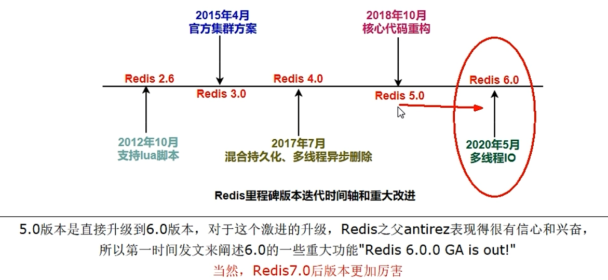
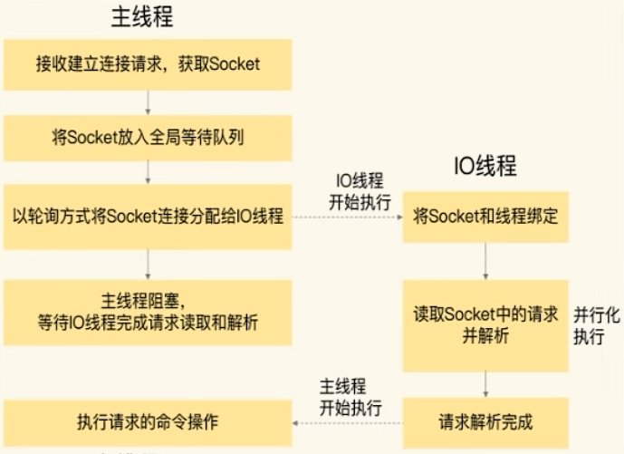
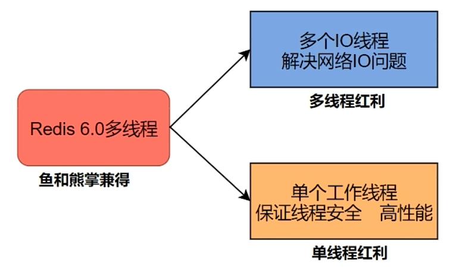
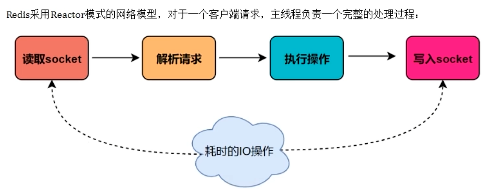
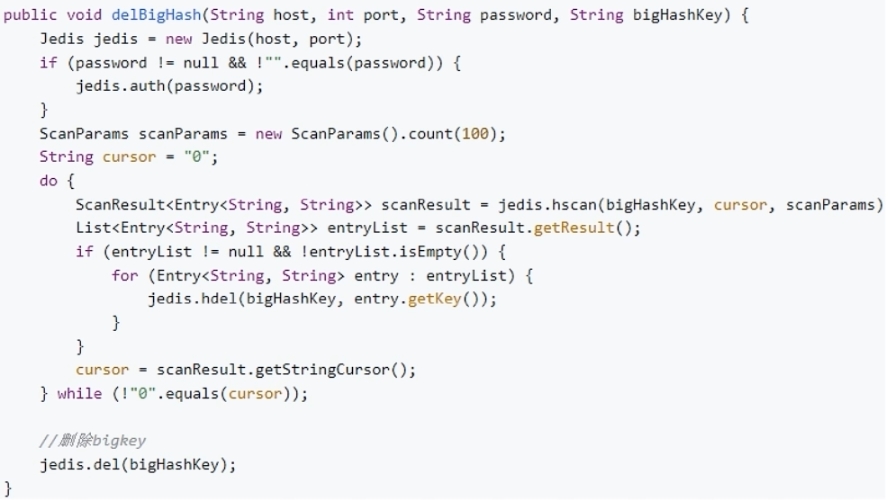
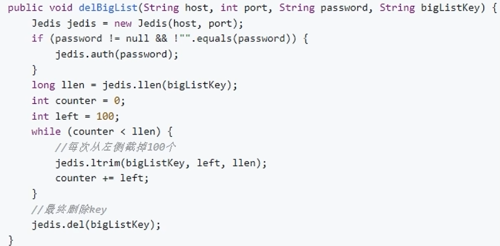
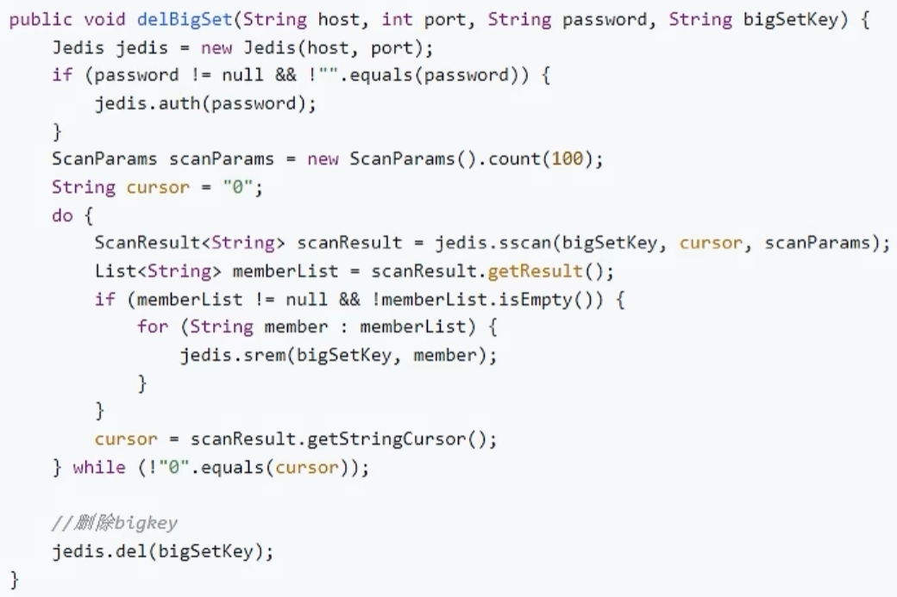
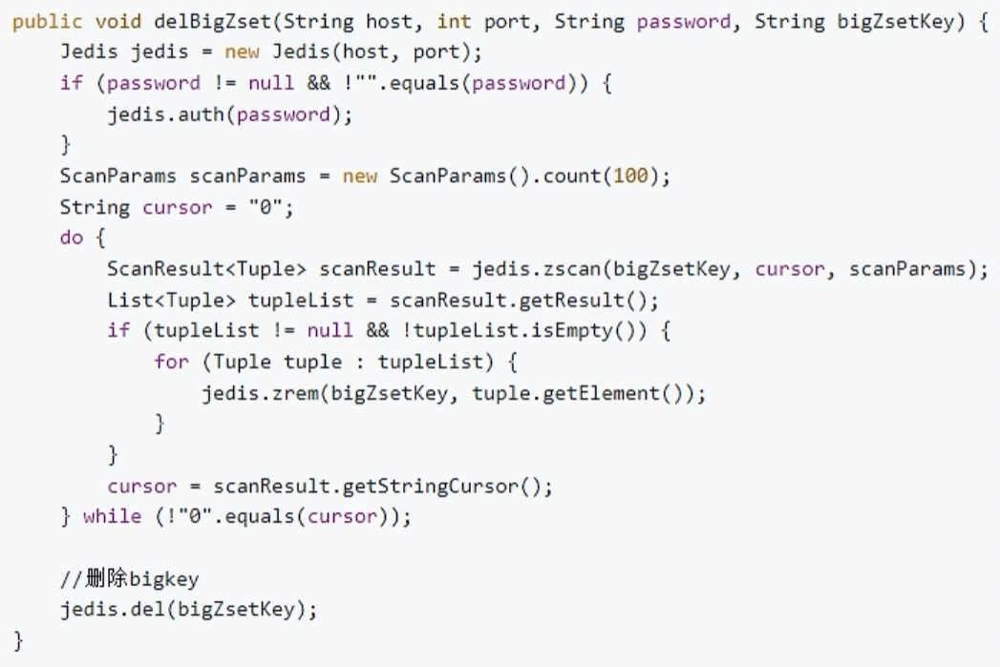
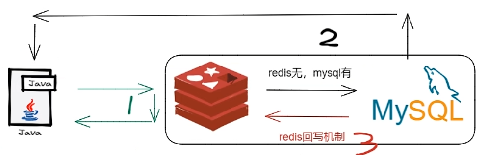

# 多线程



**Redis的多IO线程只是用来处理网络请求**的，对于**读写操作命令Redis仍然使用单线程**来处理。这是因为，Redis处理请求时，网络处
瓶颈，通过多个IO线程并行处理网络操作，可以提升实例的整体处理性能。而继续使用单线程执行命令操作，不管加锁操作处理



​	 IO 的读和写本身是堵塞的，比如当 Socket 中有数据时，Redis 会通过调用先将数据从内核态空间拷贝到用户态空间，再交给 Redis 调用，而这个拷贝的过程就是阻塞的，当数据量越大时拷贝所需要的时间就越多，而这些操作都是基于单线程完成的。

​	从 Redis6 开始，就新增了多线程的功能来提高  IO 的读写性能，他的主要实现思路是将主线程的 IO 读写任务拆分给一组独立的线程去执行，这样就可以使多个 Socket 的读写可以并行化了，采用多路 IO 复用技术可以让单个线程高效的处理多个连接请求(尽量减少网络 IO 的时间消耗)将最耗时的 Socket 的读取、请求解析、写入单独外包出去，剩下的命令执行仍然由主线程串行执行并和内存的数据交互。





在 Redis 6.0 及 7 后，多线程机制默认是关闭的，如果需要使用多线程功能，需要在 `redis.conf` 中完成两个设置

```yml
io-threads 4

io-threads-do-reads no
```


# MoreKey

```bash
for((i=1,i<=100*10000;i++)); do echo "set k$i v$i" >> /tmp/redisTest.txt ;done;

cat /tmp/redisTest.txt | /opt/redis-7.0.0/src/redis-cli -h 127.0.0.1 -p 6379 -a 111111 --pipe

DBSIZE

key *

# config
rename-command keys ""
rename-command flushdb ""
rename-command flushall ""
```

## SCAN

​	SCAN 命令是一个基于游标的迭代器，每次被调用之后， 都会向用户返回一个新的游标， 用户在下次迭代时需要使用这个新游标作为 SCAN 命令的游标参数，以此来延续之前的迭代过程。
​	SCAN 返回一个**包含两个元素的数组**，第一个元素是用于进行下一次迭代的新游标，第二个元素则是一个数组， 这个数组中包含了所有被迭代的元素。如果新游标返回零表示迭代已结束。

SCAN 的遍历顺序
	不是从第一维数组的第零位一直遍历到末尾，而是采用了**高位进位加法**来遍历。考虑到字典的扩容和缩容时避免槽位的遍历重复和遗漏。

`SCAN cursor [MATCH pattern] [COUNT count]`

```bash
# SCAN iterates the set of keys in the currently selected Redis database.
# SSCAN iterates elements of Sets types.
# HSCAN iterates fields of Hash types and their associated values.
# ZSCAN iterates elements of Sorted Set types and their associated scores.

scan 0 MATCH * COUNT 1
scan 2 MATCH * COUNT 1
scan 1 MATCH * COUNT 1
scan 3 MATCH * COUNT 1
```


# BigKey

​	String 类型控制在10KB 以内，hash、list、set、zset元素个数不要超过5000。
​	反例：一个包含 200 万个元素的 list 
​	非字符串的 BigKey，不要使用del删除，使用 hscan、sscan、zscan 方式渐进式删除，同时要注意防止 BigKey 过期时间自动删除问题(例如一个200万的 zset 设置1小时过期，会触发 del 操作，造成阻塞，而且该操作不会出现在慢查询中 (latency可查))，

- String 是 Value，最大 512MB 但是 `>10KB` 就是 BigKey
- list、hash、set 和 zset，个数超过 5000 就是 BigKey


- 内存不均，集群迁移困难
- 超时删除，大 key 删除作梗
- 网络流量阻塞

```bash
# Find BigKeys   给出每种数据结构 Top 1 bigkey，同时给出每种数据类型的键值个数 + 平均大小

# redis-cli --bigkeys
redis-cli -h 127.0.0.1 -p 7001 --bigkeys -i 0.1
redis-cli -h 127.0.0.1 -p 6379 -a 111111 -bigkeys

# MEMORY USAGE 键   计算每个键值的字节数

# 渐进式删除
HSET customer:001 id 11 cname li4 age 23 score 80
hget customer:001 id
hget customer:001 cname

HDEL customer:001 score age
HGETALL customer: 001
DEL customer: 001

# hash：使用hscan每次获取少量 field-value，再使用 hdel 删除每个 field

# list 使用 ltrim 渐进式逐步删除，直到全部删除完成
# 让列表只保留指定区间内的元素，不在指定区间之内的元素都将被删除
RPUSH list 1 2 3 4 5
LRANGE list 0-1
LTRIM list 0 2
LRANGE list 0-1

# set 使用 sscan 每次获取部分元素，再使用 srem 命令删除每个元素
SSCAN set 0
SREM set a b
SMEMBERS set

# zset 使用 zscan 每次获取部分元素，再使用 ZREMRANGEBYRANK 命令删除每个元素
ZADD salary 3000 z3 4000 li4 5000 w5 7000 s7
ZRANGE salary 0-1 withscores
ZSCAN salary 0
ZREMRANGEBYRANK salary 0 1
ZRANGE salary 0-1 withscores
```









## 惰性释放 Lazy free

```bash
# config
lazyfree-lazy-eviction no
lazyfree-lazy-expire no
lazyfree-lazy-server-del Yes
replica-lazy-flush Yes

lazyfree-lazy-user-del Yes

lazyfree-lazy-user-flush no
```


# Redis 实现分布式

# 锁

## 前言

分布式锁的实现有三种方式

- 数据库乐观锁
- 基于Redis的分布式锁
- 基于Zookeeper的分布式锁

## 分布式锁满足的条件

为了确保分布式锁可用，至少要保证锁的实现同时满足以下几个条件

- 互斥性：在任意时刻只有一个客户端能持有锁
- 不会死锁：即使有一个客户端在持有锁的期间发生崩溃而没有主动解锁，也能保证后续其它客户端能加锁
- 容错性：只要大部分的Redis节点正常运行，客户端就可以加锁和解锁
- 解铃还须系铃人：加锁和解锁必须是同一个客户端，客户端自己不能把别人加的锁给解除

## 加锁代码

### 正确示例

Talk is cheap, show me the code。先展示代码，再带大家慢慢解释为什么这样实现：

```java
public class RedisTool {

    private static final String LOCK_SUCCESS = "OK";
    private static final String SET_IF_NOT_EXIST = "NX";
    private static final String SET_WITH_EXPIRE_TIME = "PX";

    /**
     * 尝试获取分布式锁
     * @param jedis Redis客户端
     * @param lockKey 锁
     * @param requestId 请求标识
     * @param expireTime 超期时间
     * @return 是否获取成功
     */
    public static boolean tryGetDistributedLock(Jedis jedis, String lockKey, String requestId, int expireTime) {
        
        String result = jedis.set(lockKey, requestId, SET_IF_NOT_EXIST, SET_WITH_EXPIRE_TIME, expireTime);

        if (LOCK_SUCCESS.equals(result)) {
            return true;
        }
        return false;
    }
}
```

可以看到，加锁就一行代码：`jedis.set(String key, String value, String nxxx, String expx, int time)`，这个set()方法一共有五个形参

- 第一个为key，使用key来当锁，因为key是唯一的。
- 第二个为value，传的是requestId，很多童鞋可能不明白，有key作为锁不就够了吗，为什么还要用到value？原因就是在上面讲到可靠性时，分布式锁要满足第四个条件解铃还须系铃人，通过给value赋值为requestId，就知道这把锁是哪个请求加的了，在解锁的时候就可以有依据。requestId可以使用`UUID.randomUUID().toString()`方法生成。
- 第三个为nxxx，这个参数填的是NX，意思是SET IF NOT EXIST，即当key不存在时，进行set操作；若key已经存在，则不做任何操作；
- 第四个为expx，这个参数传的是PX，意思是要给这个key加一个过期的设置，具体时间由第五个参数决定。
- 第五个为time，与第四个参数相呼应，代表key的过期时间。

总的来说，执行上面的set()方法就只会导致两种结果：1. 当前没有锁（key不存在），那么就进行加锁操作，并对锁设置个有效期，同时value表示加锁的客户端。2. 已有锁存在，不做任何操作

心细的童鞋就会发现了，的加锁代码满足可靠性里描述的三个条件。首先，set()加入了NX参数，可以保证如果已有key存在，则函数不会调用成功，也就是只有一个客户端能持有锁，满足互斥性。其次，由于对锁设置了过期时间，即使锁的持有者后续发生崩溃而没有解锁，锁也会因为到了过期时间而自动解锁（即key被删除），不会发生死锁。最后，因为将value赋值为requestId，代表加锁的客户端请求标识，那么在客户端在解锁的时候就可以进行校验是否是同一个客户端。由于只考虑Redis单机部署的场景，所以容错性暂不考虑。

### 错误示例-1

比较常见的错误示例就是使用`jedis.setnx()`和`jedis.expire()`组合实现加锁，代码如下：

```java
public static void wrongGetLock1(Jedis jedis, String lockKey, String requestId, int expireTime) {

    Long result = jedis.setnx(lockKey, requestId);
    if (result == 1) {
        // 若在这里程序突然崩溃，则无法设置过期时间，将发生死锁
        jedis.expire(lockKey, expireTime);
    }
}
```

setnx()方法作用就是SET IF NOT EXIST，expire()方法就是给锁加一个过期时间。乍一看好像和前面的set()方法结果一样，然而由于这是两条Redis命令，不具有原子性，如果程序在执行完setnx()之后突然崩溃，导致锁没有设置过期时间。那么将会发生死锁。网上之所以有人这样实现，是因为低版本的jedis并不支持多参数的set()方法。

### 错误示例-2

```java
public static boolean wrongGetLock2(Jedis jedis, String lockKey, int expireTime) {

    long expires = System.currentTimeMillis() + expireTime;
    String expiresStr = String.valueOf(expires);

    // 如果当前锁不存在，返回加锁成功
    if (jedis.setnx(lockKey, expiresStr) == 1) {
        return true;
    }

    // 如果锁存在，获取锁的过期时间
    String currentValueStr = jedis.get(lockKey);
    if (currentValueStr != null && Long.parseLong(currentValueStr) < System.currentTimeMillis()) {
        // 锁已过期，获取上一个锁的过期时间，并设置现在锁的过期时间
        String oldValueStr = jedis.getSet(lockKey, expiresStr);
        if (oldValueStr != null && oldValueStr.equals(currentValueStr)) {
            // 考虑多线程并发的情况，只有一个线程的设置值和当前值相同，它才有权利加锁
            return true;
        }
    }
    // 其他情况，一律返回加锁失败
    return false;
}
```

这一种错误示例就比较难以发现问题，而且实现也比较复杂。实现思路：使用`jedis.setnx()`命令实现加锁，其中key是锁，value是锁的过期时间。执行过程：1. 通过setnx()方法尝试加锁，如果当前锁不存在，返回加锁成功。2. 如果锁已经存在则获取锁的过期时间，和当前时间比较，如果锁已经过期，则设置新的过期时间，返回加锁成功。

那么这段代码问题在哪里？1. 由于是客户端自己生成过期时间，所以需要强制要求分布式下每个客户端的时间必须同步。 2. 当锁过期的时候，如果多个客户端同时执行`jedis.getSet()`方法，那么虽然最终只有一个客户端可以加锁，但是这个客户端的锁的过期时间可能被其他客户端覆盖。3. 锁不具备拥有者标识，即任何客户端都可以解锁。

## 解锁代码

### 正确示例

还是先展示代码，再带大家慢慢解释为什么这样实现：

```java
public class RedisTool {

    private static final Long RELEASE_SUCCESS = 1L;

    /**
     * 释放分布式锁
     * @param jedis Redis客户端
     * @param lockKey 锁
     * @param requestId 请求标识
     * @return 是否释放成功
     */
    public static boolean releaseDistributedLock(Jedis jedis, String lockKey, String requestId) {

        String script = "if redis.call('get', KEYS[1]) == ARGV[1] then return redis.call('del', KEYS[1]) else return 0 end";
        Object result = jedis.eval(script, Collections.singletonList(lockKey), Collections.singletonList(requestId));

        if (RELEASE_SUCCESS.equals(result)) {
            return true;
        }
        return false;

    }
}
```

可以看到，解锁只需要两行代码就搞定了！第一行代码，写了一个简单的Lua脚本代码，上一次见到这个编程语言还是在《黑客与画家》里，没想到这次居然用上了。第二行代码，将Lua代码传到`jedis.eval()`方法里，并使参数KEYS[1]赋值为lockKey，ARGV[1]赋值为requestId。eval()方法是将Lua代码交给Redis服务端执行。

那么这段Lua代码的功能是什么呢？其实很简单，首先获取锁对应的value值，检查是否与requestId相等，如果相等则删除锁（解锁）。那么为什么要使用Lua语言来实现呢？因为要确保上述操作是原子性的。关于非原子性会带来什么问题，可以阅读[【解锁代码-错误示例2】](http://wudashan.cn/2017/10/23/Redis-Distributed-Lock-Implement/#releaseLock-wrongDemo2) 。那么为什么执行eval()方法可以确保原子性?

> 简单来说，就是在eval命令执行Lua代码的时候，Lua代码将被当成一个命令去执行，并且直到eval命令执行完成，Redis才会执行其他命令

### 错误示例1

最常见的解锁代码就是直接使用`jedis.del()`方法删除锁，这种不先判断锁的拥有者而直接解锁的方式，会导致任何客户端都可以随时进行解锁，即使这把锁不是它的。

```java
public static void wrongReleaseLock1(Jedis jedis, String lockKey) {
    jedis.del(lockKey);
}
```

### 错误示例2

这种解锁代码乍一看也是没问题，甚至我之前也差点这样实现，与正确姿势差不多，唯一区别的是分成两条命令去执行，代码如下：

```java
public static void wrongReleaseLock2(Jedis jedis, String lockKey, String requestId) {
        
    // 判断加锁与解锁是不是同一个客户端
    if (requestId.equals(jedis.get(lockKey))) {
        // 若在此时，这把锁突然不是这个客户端的，则会误解锁
        // 也就是突然锁过期了，然后把别人的锁给干掉了
        jedis.del(lockKey);
    }
}
```

如代码注释，问题在于如果调用`jedis.del()`方法的时候，这把锁已经不属于当前客户端的时候会解除他人加的锁。那么是否真的有这种场景？答案是肯定的，比如客户端A加锁，一段时间之后客户端A解锁，在执行`jedis.del()`之前，锁突然过期了，此时客户端B尝试加锁成功，然后客户端A再执行del()方法，则将客户端B的锁给解除了。


# 数据双写一致性



**延时双删**


**读写缓存**

- 同步直写缓存：MySQL中查询到后，直接回写到 Redis，保证数据一致性
- 异步缓写缓存：延时后，写回Redis，可能需借助 Kafka、RabbitMQ等消息中间件


