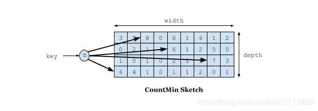

# Caffine/Redis 缓存


## 1. Caffine本地缓存技术
Caffine是一个借鉴了Guava Cache思想优化了算法而来的。

### 1.1 Caffine Cache 在算法上的优点
常见的缓存淘汰策略有：FIFO，LRU，LFU。他们的命中率是按序递增的，同时实现成本也是随着增加，Guava封装实现了这些策略，但并没有改进他们的缺陷：

- FIFO：先进缓存的会被淘汰，最终导致命中率低。
- LRU：最近最少使用，每次访问数据都会将其放到队尾，如果需要淘汰，则淘汰队首元素。带来的问题是，如果有一个高频热点数据近期没有访问，而是新来的数据被访问，最终就会导致该新元素淘汰了热点数据。
- LFU：利用额外的空间记录数据的访问频率，如果数据的概率分布不随时间变化，那么命中率就会很高，可是数据是会“过气”的，正如每天微博都会有热点，如果热点不被淘汰，那么其他话题怎么上去呢？**此外，实时更新每个数据的访问频率也是极大的开销**。

Caffine基于一名前Google工程师发明的W-TinyLfu策略，提供了更好的缓存命中率。它主要缓解的是两个困境：

- 避免维护频率信息变化产生的高开销
- 反应随时间变化的访问模式

​	第一个问题通过使用Sketching技术解决，实现用小得多的空间存放频率信息，允许很低的False Positive Rate。TinyLFU采用了一种基于滑动窗口的时间衰减设计机制，借助于一种简易的reset操作：每次添加一条记录到Sketch的时候，都会给一个计数器加1，当计数器达到一个尺寸W时，把所有的Sketch数值都除以2，该reset操作可以起到衰减作用。
​	W-TinyLFU主要用来解决一些稀疏的突发访问元素。在一些数目很少但突发访问量很大的场景下，TinyLFU将无法保存这类元素，因为它们无法在给定时间内积累到足够高的频率。因此W-TinyLFU就是结合LFU和LRU，前者用来应对大多数场景，而LRU用来处理突发流量。
​	通常会条件反射地想到利用HashMap的结构去存储频率信息，但需要注意，如果数据量巨大的情况下，这个hashmap所占用的空间也是巨大的，由此可以联想到Bloom Filter，用n个byte，每个byte存储一个标志用来判断key是否在集合中。原理就是使用k个hash函数来将key散列成一个整数。

W-TinyLFU使用Count-Min Sketch记录的访问频率，而这个也是布隆过滤器的一个变种，如图：




如果需要记录一个值，需要用多中hash算法对其处理hash，然后将其对应的hash算法的记录+1，最终取访问率时采用访问频次最低的次数，因此得名为Count-Min Sketch。

## 2. 使用
### 2.1  引入 maven 依赖

```xml
<!-- Redis / Caffine 选一 -->
<dependency>
    <groupId>com.github.ben-manes.caffeine</groupId>
    <artifactId>caffeine</artifactId>
    <version>2.6.2</version>
</dependency>

<dependency>
	<groupId>org.springframework.boot</groupId>
	<artifactId>spring-boot-starter-data-redis</artifactId>
</dependency>
```

### 2.2 配置

```java
@EnableCaching
@Component
public class LocalCacheConfig extends CachingConfigurerSupport {
    
    @Value("${spring.cache.maxSize}")
    public Integer maxSize;
    
    public static interface CacheExpires {
        public final String SECOND_1 = "second1";
        public final String MINITE_1 = "minite1";
        public final String MINITE_10 = "minite10";
        public final String HOUR_1 = "hour1";
        public final String HOUR_24 = "hour24";
    }

    public enum Caches{
        SECOND_1(CacheExpires.SECOND_1, 1),
        MINITE_1(CacheExpires.MINITE_1, 60),
        MINITE_10(CacheExpires.MINITE_10, 600),
        HOUR_1(CacheExpires.HOUR_1, 3600),
        HOUR_24(CacheExpires.HOUR_24, 86400);
        
        private String name;
        private int ttl;


        Caches(String name, int ttl) {
            this.name = name;
            this.ttl = ttl;
        }

        public String getName() {
            return name;
        }
        
        public int getTtl() {
            return ttl;
        }
    }

    /**
     * - 创建基于Caffeine的Cache Manager
     * - 如果使用Redis，则将该Manager去掉
     * @return
     */
    @Bean
    @Primary
    public CacheManager caffeineCacheManager() {
        SimpleCacheManager cacheManager = new SimpleCacheManager();

        ArrayList<CaffeineCache> caches = new ArrayList<CaffeineCache>();
        for(Caches c : Caches.values()){
            caches.add(new CaffeineCache(c.getName(),
                CacheProperties.Caffeine.newBuilder().recordStats()
                .expireAfterWrite(c.getTtl(), TimeUnit.SECONDS)
                .maximumSize(maxSize)
                .build())
            );
        }

        cacheManager.setCaches(caches);
        return cacheManager;
    }
    
    public KeyGenerator keyGenerator() {
        return new BiKeyGenerator();
    }
    
    public static class BiKeyGenerator implements KeyGenerator {
        
        private static final String prefix = "myapp-caching";
        private final static int NO_PARAM_KEY = 0;
        
        private boolean isSimpleValueType(Class<?> clazz) {
            return (ClassUtils.isPrimitiveOrWrapper(clazz) || clazz.isEnum() || CharSequence.class.isAssignableFrom(clazz)
                    || Number.class.isAssignableFrom(clazz) || Date.class.isAssignableFrom(clazz) || URI.class == clazz
                    || URL.class == clazz || Locale.class == clazz || Class.class == clazz);
        }

        @Override
        public Object generate(Object target, Method method, Object... params) {
            char sp = ':';
            StringBuilder strBuilder = new StringBuilder(30);
            strBuilder.append(prefix);
            strBuilder.append(sp);
            // 类名
            strBuilder.append(target.getClass().getSimpleName());
            strBuilder.append(sp);
            // 方法名
            strBuilder.append(method.getName());
            strBuilder.append(sp);
            if (params.length > 0) {
                // 参数值
                for (Object object : params) {
                    if(null == object) {
                        continue;
                    }
                    if (isSimpleValueType(object.getClass())) {
                        strBuilder.append(object);
                    } else {
                        strBuilder.append(JSONObject.toJSON(object));
                    }
                }
            } else {
                strBuilder.append(NO_PARAM_KEY);
            }
            return strBuilder.toString();
        }
        
    }
}
```

### 2.3 **Redis配置**

```java
@Slf4j
@Configuration
@EnableCaching
public class RedisConfig {

    @Bean(name = "redisTemplateCustomize")
    public RedisTemplate<String, Object> redisTemplate(RedisConnectionFactory redisConnectionFactory) {
        Jackson2JsonRedisSerializer<Object> jackson2JsonRedisSerializer = new Jackson2JsonRedisSerializer<>(Object.class);
        ObjectMapper om = new ObjectMapper();
        om.setVisibility(PropertyAccessor.ALL, JsonAutoDetect.Visibility.ANY);
        om.activateDefaultTyping(LaissezFaireSubTypeValidator.instance, ObjectMapper.DefaultTyping.NON_FINAL, JsonTypeInfo.As.WRAPPER_ARRAY);
        om.setSerializationInclusion(JsonInclude.Include.NON_NULL);
        om.configure(MapperFeature.ACCEPT_CASE_INSENSITIVE_PROPERTIES, true);
        om.configure(DeserializationFeature.FAIL_ON_UNKNOWN_PROPERTIES, false);

        // 解决jackson2无法反序列化LocalDateTime的问题
        om.disable(SerializationFeature.WRITE_DATES_AS_TIMESTAMPS);
        om.registerModule(new JavaTimeModule());
        jackson2JsonRedisSerializer.setObjectMapper(om);


        RedisTemplate<String, Object> redisTemplate = new RedisTemplate<>();
        redisTemplate.setKeySerializer(new StringRedisSerializer());
        redisTemplate.setHashKeySerializer(new StringRedisSerializer());
        redisTemplate.setValueSerializer(jackson2JsonRedisSerializer);
        redisTemplate.setHashValueSerializer(jackson2JsonRedisSerializer);
        redisTemplate.setConnectionFactory(redisConnectionFactory);
        return redisTemplate;
    }

    @Bean
    public CacheManager cacheManager(RedisTemplate<String, Object> template) {
        RedisCacheConfiguration defaultCacheConfiguration =
                RedisCacheConfiguration
                        .defaultCacheConfig()
                        .serializeKeysWith(RedisSerializationContext.SerializationPair.fromSerializer(template.getStringSerializer()))
                        .serializeValuesWith(RedisSerializationContext.SerializationPair.fromSerializer(template.getValueSerializer()))
                        .disableCachingNullValues()
                        .entryTtl(Duration.ofHours(24));
        return RedisCacheManager.RedisCacheManagerBuilder
                .fromConnectionFactory(Objects.requireNonNull(template.getConnectionFactory()))
                .withCacheConfiguration("appName", defaultCacheConfiguration)
                .cacheDefaults(defaultCacheConfiguration)
                .transactionAware()
                .build();
    }
}
```

### 2.4 RedisTemplate 配置

```java
@Configuration
public class RestTemplateConfig {

    @Bean
    public RestTemplate restTemplate(ClientHttpRequestFactory factory){
        return new RestTemplate(factory);
    }

    @Bean
    public ClientHttpRequestFactory simpleClientHttpRequestFactory(){
        SimpleClientHttpRequestFactory factory = new SimpleClientHttpRequestFactory();
        factory.setConnectTimeout(15000);
        factory.setReadTimeout(50000);
        return factory;
    }
}
```

### 2.5 缓存的使用与释放

使用 @Cacheable 注解需要缓存的方法以使用缓存

```java
@Cacheable(cacheNames = {CacheExpires.HOUR_1}, key = "'appName-' + #id", unless="#result == null") // 缓存
public DataSet load(Long id) {
    if(null == id) {
        return null;
    }
    return businessMapper.selectByPrimaryKeyAndUsername(id);
}
```

使用 @CacheEvict 释放缓存

```java
@CacheEvict(cacheNames = {CacheExpires.HOUR_1}, key = "' appName-dataset-' + #dataSet.id") // 清理缓存
public DataSet saveOrUpdate(DataSet dataSet) {
    if(null == dataSet) {
        return null;
    }

    if(null != dataSet.getId()) {
        dataSetMapper.updateByPrimaryKeySelective(dataSet);
    } else {
        dataSetMapper.insertSelective(dataSet);
    }

    return dataSet;
}
```


> Reference：
>
> https://www.cnblogs.com/rickiyang/p/11074158.html