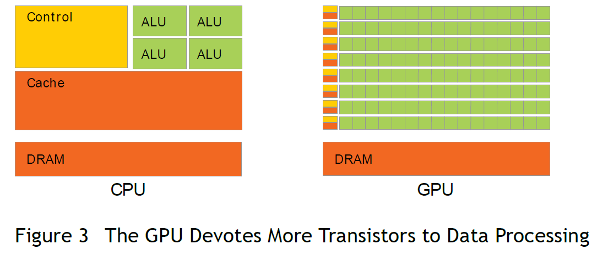
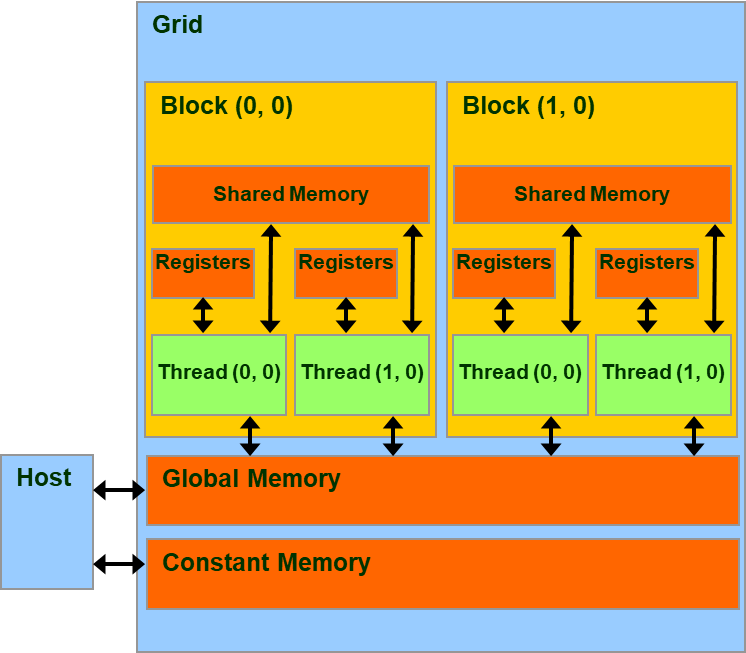

# CUDA

## 简介

> ​		CUDA 是 NVIDIA 推出的用于其发布的 GPU 的并行计算架构，使用 CUDA 可以利用 GPU 的并行计算引擎更加高效的完成复杂的计算难题。
>
> ​		在目前主流使用的**冯·诺依曼体系结构**的计算机中，GPU 属于一个外置设备，因此即便在利用 GPU 进行并行计算的时候也无法脱离 CPU，需要与 CPU 协同工作。因此当我们在说 GPU 并行计算时，其实指的是基于 CPU+GPU 的异构计算架构。在异构计算架构中，CPU 和 GPU 通过 PCI-E 总线连接在一起进行协同工作，所以 CPU 所在位置称为 Host，GPU 所在位置称为 Device，如下图所示:
>
> 
>
> 
>
> > GPU 中有着更多的运算核心，非常适合数据并行的计算密集型任务，比如大型的矩阵计算。

**CUDA 编程模型基础**

​		CUDA 模型时一个异构模型，需要 CPU 和 GPU 协同工作，在 CUDA 中一般用 Host 指代 CPU 及其内存，Device 指代 GPU 及其内存。CUDA 程序中既包含在 Host 上运行的程序，也包含在 Device 上运行的程序，并且 Host 和 Device 之间可以进行通信，如进行数据拷贝等操作。一般的将需要串行执行的程序放在 Host 上执行，需要并行执行的程序放在 Device 上进行。

CUDA 程序一般的执行流程：

1. 分配 Host 内存，并进行数据初始化
2. 分配 Device 内存，并将 Host 上的数据拷贝到 Device 上
3. 调用 CUDA Kernel 在 Device 上进行并行运算
4. 将运算结果从 Device 上拷贝到 Host 上，并释放 Device 上对应的内存
5. 并行运算结束，Host 得到运算结果，释放 Host 上分配的内存，程序结束

> ​		CUDA Kernel 指的是在 Device 线程上并行执行的函数，在程序中利用 `__global__` 符号声明，在调用时需要用 `<<<grid, block>>>` 来指定 Kernel 执行的线程数量，在 CUDA 中每一个线程都要执行 Kernel 函数，并且每个线程会被分配到一个唯一的 Thread ID，这个 ID 值可以通过 Kernel 的内置变量 `threadIdx` 来获得。
>
> 主要的三个函数类型限定词如下：
>
> - `__global__`：在 device 上执行，从 host 中调用（一些特定的 GPU 也可以从 device 上调用），返回类型必须是`void`，不支持可变参数参数，不能成为类成员函数。注意用 `__global__` 定义的 kernel 是异步的，这意味着 host 不会等待 kernel 执行完就执行下一步。
> - `__device__`：在 device 上执行，单仅可以从 device 中调用，不可以和`__global__`同时用。
> - `__host__`：在 host 上执行，仅可以从 host 上调用，一般省略不写，不可以和 `__global__` 同时用，但可和`__device__`，此时函数会在 device 和 host 都编译。
>
> **Kernel 的层次结构**
>
> ​		Kernel 在 Device 执行的时候实际上是启动很多线程，这些线程都执行 Kernel 这个函数。其中，由这个 Kernel 启动的所有线程称为一个**网格**（<span style="color:red"> `grid`</span>），同一个 grid 中的线程共享相同的 `Global memory`，grid 是线程结构的第一个层次。一个 grid 又可以划分为多个 **线程块**（<span style="color:red">block</span>），每一个 block 包含多个线程，其中的所有线程又共享 `Per-block shared memory`，block 是线程结构的第二个层次。最后，每一个线程 (thread) 有着自己的 `Per-thread local memory`。
>
> 

​		线程两层组织结构的示意图，其中 grid 和 block 均为 2-dim 的线程组织。grid 和 block 都是定义为 `dim3` 类型的变量，`dim3` 可以看成是包含三个无符号整数 $(x, y, z)$ 成员的结构体变量，在定义时，缺省值初始化为 $1$。

```c
dim3 grid(3, 2);
dim3 block(5, 3);
kernel<<<grid, block>>>(parameters...);
```


​		从线程的组织结构可以得知，一个线程是由$(blockIdx, threadIdx)$来唯一标识的，`blockIdx` 和 `threadIdx` 都是 `dim3` 类型的变量，其中 `blockIdx` 指定线程所在 block 在 grid 中的位置，`threadIdx` 指定线程在 block 中的位置，如图中的 $Thread(2,1)$ 满足：

```c
threadIdx.x = 2;
threadIdx.y = 1;
blockIdx.x = 1;
blockIdx.y = 1;
```

​		一个 Block 是放在同一个**流式多处理器(SM)**上运行的，但是单个 SM 上的运算核心 **(cuda core)** 有限，这导致线程块中的线程数是有限制的，因此在设置 grid 和 block 的 **shape** 时需要根据所使用的 Device 来设计

​		如果要知道一个线程在 Block 中的全局 ID，就必须要根据 Block 的组织结构来计算，对于一个 $2-dim$ 的 $Block(D_x, D_y)$，线程$(x, y)$的 ID 值为 $x + y ∗ D_x$，如果是 $3-dim$ 的 $Block(D_x, D_y, D_z)$，线程$(x, y, z)$ 的 ID 值为 $x + y ∗ D_x + z ∗ D_x ∗ D_y$ 。

🌰栗子：**CUDA 查看 Device 基本信息**

```C
#include <stdio.h>
#include "cuda_runtime.h"
#include "device_launch_parameters.h"
int main()
{
    cudaDeviceProp deviceProp;
    cudaGetDeviceProperties(&deviceProp, 0);
    printf("Device 0 information:\n");
    printf("设备名称与型号: %s\n", deviceProp.name);
    printf("显存大小: %d MB\n", (int)(deviceProp.totalGlobalMem / 1024 / 1024));
    printf("含有的SM数量: %d\n", deviceProp.multiProcessorCount);
    printf("CUDA CORE数量: %d\n", deviceProp.multiProcessorCount * 64);
    printf("计算能力: %d.%d\n", deviceProp.major, deviceProp.minor);
}
// 以下是本地电脑执行结果：
// Device 0 information:
// 设备名称与型号: NVIDIA GeForce MX250
// 显存大小: 2047 MB
// 含有的SM数量: 3
// CUDA CORE数量: 576
// 计算能力: 6.1
```

> 其中第 12 行乘 64 的原因是我所使用的设备为 MX250，而 MX250 系列均采用 Pascal 架构，该架构下每个 SM 中的 cuda core 的数量为 64
>
> 🌰栗子：**CUDA 实现向量加法**
>
> ```C
> // 实现 Vector Addition
> #include <stdio.h>
> #include <time.h>
> #include <math.h>
> #include "cuda_runtime.h"
> #include "device_launch_parameters.h"
> 
> const int LENGTH = 5e4;
> clock_t start, end;
> void vectorAdditionOnDevice(float*, float*, float*, const int);
> __global__ void additionKernelVersion(float*, float*, float*, const int);
> int main()
> {
>     start = clock();
>     float A[LENGTH], B[LENGTH], C[LENGTH] = {0};
>     for (int i = 0; i < LENGTH; i ++) A[i] = 6, B[i] = 5;
>     vectorAdditionOnDevice(A, B, C, LENGTH);  //calculation on GPU
>     end = clock();
>     printf("Calculation on GPU version1 use %.8f seconds.\n", (float)(end - start) / CLOCKS_PER_SEC);
> }
> void vectorAdditionOnDevice(float* A, float* B, float* C, const int size)
> {
>     float* device_A = NULL;
>     float* device_B = NULL;
>     float* device_C = NULL;
>     cudaMalloc((void**)&device_A, sizeof(float) * size);  // 分配内存
>     cudaMalloc((void**)&device_B, sizeof(float) * size);  // 分配内存
>     cudaMalloc((void**)&device_C, sizeof(float) * size);  // 分配内存
>     const float perBlockThreads = 192.0;
>     cudaMemcpy(device_A, A, sizeof(float) * size, cudaMemcpyHostToDevice);  // 将数据从 Host 拷贝到 Device
>     cudaMemcpy(device_B, B, sizeof(float) * size, cudaMemcpyHostToDevice);  // 将数据从 Host 拷贝到 Device
>     additionKernelVersion<<<ceil(size / perBlockThreads), perBlockThreads>>>(device_A, device_B, device_C, size);  // 调用 Kernel 进行并行计算
>     cudaDeviceSynchronize();
>     cudaMemcpy(device_C, C, sizeof(float) * size, cudaMemcpyDeviceToHost);  // 将数据从 Device 拷贝到 Host
>     cudaFree(device_A);  // 释放内存
>     cudaFree(device_B);  // 释放内存
>     cudaFree(device_C);  // 释放内存
> }
> __global__ void additionKernelVersion(float* A, float* B, float* C, const int size)
> {
>     // 此处定义用于向量加法的 Kernel
>     int i = blockIdx.x * blockDim.x + threadIdx.x;
>     C[i] = A[i] + B[i];
> }
> ```


### 并行线程组织结构

Thread：并行的基本单位

Thread block：互相合作的线程组

- Cooperative Thread Array (CTA)
- 允许彼此同步
- 通过快速共享内存交换数据
- 以1维、2维或3维组织
- 最多包含512个线程

Grid：一组thread block

- 以1维、2维或3维组织
- 共享全局内存

Kernel：在GPU上执行的核心程序



> 


## 编程


### CUDA引入的新变量

- `__device__`
  - 储存于GPU上的global memory空间
  - 和应用程序具有相同的生命期(lifetime)
  - 可被grid中所有线程存取,CPU代码通过`runtime`函数存取
  
- `__constant__`
  - 储存于GPU上的`constant_memory`空间
  - 和应用程序具有相同的生命期(lifetime)
  - 可被grid中所有线程存取,CPU代码通过runtime函数存取
  
- `___shared__`
  - 储存于GPU上`thread block`内的共享存储器
  - 和`thread block`具有相同的生命期(lifetime)
  - 只能被thread block内的线程存取
- `Local变量`
  - 储存于SM内的寄存器和`local memory`
  - 和thread具有相同的生命期(lifetime)
  - Thread私有


### 函数定义

|                                  | Exexuted on the | Only callable from the |
| :------------------------------: | :-------------: | :--------------------: |
| `__device__ ` float DeviceFunc() |     deivce      |         deivce         |
|  `__global__` void KernalFunc()  |     deivce      |          host          |
|   `__host__` float HostFunc()    |      host       |          host          |

> `__global__` 定义 kernal 函数 必须返回 void
>
> `__device__` 和 `__host__` 可以组合使用，都可在 CPU与GPU 上被编译

> ​		**SM是指流多处理器**（Streaming Multiprocessor）的缩写。SM是一种专门为GPU设计的处理器，每个SM都包含多个CUDA核心，能够同时执行多个线程。每个SM都有自己的寄存器、共享内存和高速缓存，可以独立地执行指令，因此可以并行执行多个线程块。线程块是一组线程的集合，可以在一个SM上执行。当线程块被分配到SM上时，SM将为线程块中的每个线程分配寄存器、共享内存和高速缓存，并执行线程块中的指令。通过将线程块分配到不同的SM上执行
>
> 


## FAQ

1. VS 2022  生成依赖项→ 生成自定义→ 没有CUDA 

```shell
# 将以下目录中的 文件拷贝
C:\Program Files\NVIDIA GPU Computing Toolkit\CUDA\v11.8\extras\visual_studio_integration\MSBuildExtensions

# 这个目录中
E:\Visual Studio\MSBuild\Microsoft\VC\v170\BuildCustomizations
```

2. VS 2022  新建项目里没有 CUDA 模板选项

```shell
# 此目录下运行以代码
E:\Visual Studio\Common7\IDE\Extensions

mkdir NVIDIA
cd NVIDIA
mkdir CUDA 11.8 Wizards
cd CUDA 11.8 Wizards
# mkdir 11.8
# cd 11.8

# 将以下目录中的 extension.vsixmanifest 与 Nvda.Vsip.CudaTemplates.pkgdef 创建快捷方式
C:\ProgramData\NVIDIA GPU Computing Toolkit\v11.8\extras\visual_studio_integration\CudaProjectVsWizards\17

# Final 打开 Developer Command Prompt for VS 2022(开发者命令控制台) 并运行
devenv.com /setup /nosetupvstemplates

# 上述方法无效，使用以下方法！
mklink /d "E:\Visual Studio\Common7\IDE\Extensions\NVIDIA\CUDA 11.8 Wizards\11.8" "C:\ProgramData\NVIDIA GPU Computing Toolkit\v11.8\extras\visual_studio_integration\CudaProjectVsWizards\17"

# 管理员身份打开运行 (IDE)
devenv /updateconfiguration
```

3. 测试程序 CUDA 是否安装正确！

```shell
# 测试程序默认在 此目录
C:\Program Files\NVIDIA GPU Computing Toolkit\CUDA\v11.8\extras\demo_suite
```

```shell
[CUDA Bandwidth Test] - Starting...
Running on...

 Device 0: NVIDIA GeForce MX250
 Quick Mode

 Host to Device Bandwidth, 1 Device(s)
 PINNED Memory Transfers
   Transfer Size (Bytes)        Bandwidth(MB/s)
   33554432                     3014.8

 Device to Host Bandwidth, 1 Device(s)
 PINNED Memory Transfers
   Transfer Size (Bytes)        Bandwidth(MB/s)
   33554432                     3090.9

 Device to Device Bandwidth, 1 Device(s)
 PINNED Memory Transfers
   Transfer Size (Bytes)        Bandwidth(MB/s)
   33554432                     47426.0

Result = PASS
```

```shell
deviceQuery.exe Starting...

 CUDA Device Query (Runtime API) version (CUDART static linking)

Detected 1 CUDA Capable device(s)

Device 0: "NVIDIA GeForce MX250"
  CUDA Driver Version / Runtime Version          11.8 / 11.8
  CUDA Capability Major/Minor version number:    6.1
  Total amount of global memory:                 2048 MBytes (2147352576 bytes)
  ( 3) Multiprocessors, (128) CUDA Cores/MP:     384 CUDA Cores
  GPU Max Clock rate:                            1582 MHz (1.58 GHz)
  Memory Clock rate:                             3504 Mhz
  Memory Bus Width:                              64-bit
  L2 Cache Size:                                 524288 bytes
  Maximum Texture Dimension Size (x,y,z)         1D=(131072), 2D=(131072, 65536), 3D=(16384, 16384, 16384)
  Maximum Layered 1D Texture Size, (num) layers  1D=(32768), 2048 layers
  Maximum Layered 2D Texture Size, (num) layers  2D=(32768, 32768), 2048 layers
  Total amount of constant memory:               zu bytes
  Total amount of shared memory per block:       zu bytes
  Total number of registers available per block: 65536
  Warp size:                                     32
  Maximum number of threads per multiprocessor:  2048
  Maximum number of threads per block:           1024
  Max dimension size of a thread block (x,y,z): (1024, 1024, 64)
  Max dimension size of a grid size    (x,y,z): (2147483647, 65535, 65535)
  Maximum memory pitch:                          zu bytes
  Texture alignment:                             zu bytes
  Concurrent copy and kernel execution:          Yes with 5 copy engine(s)
  Run time limit on kernels:                     Yes
  Integrated GPU sharing Host Memory:            No
  Support host page-locked memory mapping:       Yes
  Alignment requirement for Surfaces:            Yes
  Device has ECC support:                        Disabled
  CUDA Device Driver Mode (TCC or WDDM):         WDDM (Windows Display Driver Model)
  Device supports Unified Addressing (UVA):      Yes
  Device supports Compute Preemption:            Yes
  Supports Cooperative Kernel Launch:            Yes
  Supports MultiDevice Co-op Kernel Launch:      No
  Device PCI Domain ID / Bus ID / location ID:   0 / 2 / 0
  Compute Mode:
     < Default (multiple host threads can use ::cudaSetDevice() with device simultaneously) >

deviceQuery, CUDA Driver = CUDART, CUDA Driver Version = 11.8, CUDA Runtime Version = 11.8, NumDevs = 1, Device0 = NVIDIA GeForce MX250
Result = PASS
```

