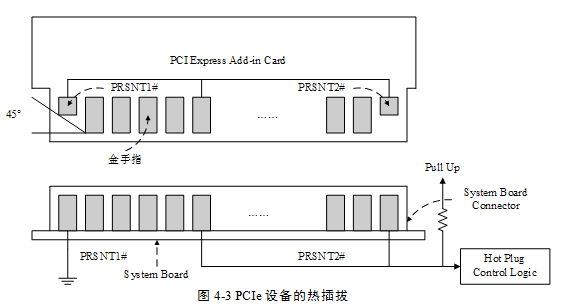
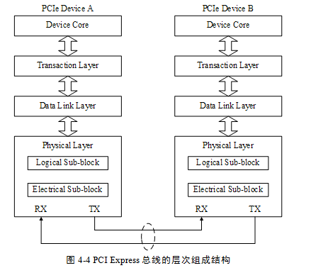
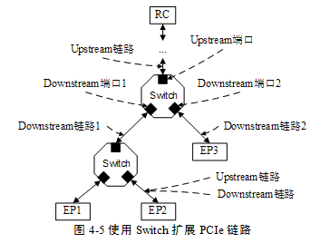
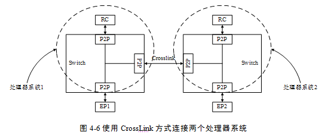

# PCIe

​		随着现代处理器技术的发展，在互连领域中，使用高速差分总线替代并行总线是大势所趋。与单端并行信号相比，高速差分信号可以使用更高的时钟频率，从而使用更少的信号线，完成之前需要许多单端并行数据信号才能达到的总线带宽。

 	  PCI总线使用并行总线结构，在同一条总线上的所有外部设备共享总线带宽，而PCIe总线使用了高速差分总线，并采用端到端的连接方式，因此在每一条PCIe链路中只能连接两个设备。这使得PCIe与PCI总线采用的拓扑结构有所不同。PCIe总线除了在连接方式上与PCI总线不同之外，还使用了一些在网络通信中使用的技术，如支持多种数据路由方式，基于多通路的数据传递方式，和基于报文的数据传送方式，并充分考虑了在数据传送中出现服务质量QoS (Quality of Service)问题。

> 与PCI总线不同，PCIe总线使用端到端的连接方式，在一条PCIe链路的两端只能各连接一个设备，这两个设备互为是数据发送端和数据接收端。PCIe总线除了总线链路外，还具有多个层次，发送端发送数据时将通过这些层次，而接收端接收数据时也使用这些层次。PCIe总线使用的层次结构与网络协议栈较为类似。

### 1.1 端到端的数据传递

   PCIe链路使用“端到端的数据传送方式”，发送端和接收端中都含有TX(发送逻辑)和RX(接收逻辑)，其结构如图41所示。

 

​		由上图所示，在PCIe总线的物理链路的一个数据通路(Lane)中，由两组差分信号，共4根信号线组成。其中发送端的TX部件与接收端的RX部件使用一组差分信号连接，该链路也被称为发送端的发送链路，也是接收端的接收链路；而发送端的RX部件与接收端的TX部件使用另一组差分信号连接，该链路也被称为发送端的接收链路，也是接收端的发送链路。一个PCIe链路可以由多个Lane组成。

​		高速差分信号电气规范要求其发送端串接一个电容，以进行AC耦合。该电容也被称为AC耦合电容。PCIe链路使用差分信号进行数据传送，一个差分信号由D+和D-两根信号组成，信号接收端通过比较这两个信号的差值，判断发送端发送的是逻辑“1”还是逻辑“0”。

​		与单端信号相比，差分信号抗干扰的能力更强，因为差分信号在布线时要求“等长”、“等宽”、“贴近”，而且在同层。因此外部干扰噪声将被“同值”而且“同时”加载到D+和D-两根信号上，其差值在理想情况下为0，对信号的逻辑值产生的影响较小。因此差分信号可以使用更高的总线频率。

​		此外使用差分信号能有效抑制电磁干扰EMI(Electro Magnetic Interference)。由于差分信号D+与D-距离很近而且信号幅值相等、极性相反。这两根线与地线间耦合电磁场的幅值相等，将相互抵消，因此差分信号对外界的电磁干扰较小。当然差分信号的缺点也是显而易见的，一是差分信号使用两根信号传送一位数据；二是差分信号的布线相对严格一些。

​		PCIe链路可以由多条Lane组成，目前PCIe链路可以支持1、2、4、8、12、16和32个Lane，即×1、×2、×4、×8、×12、×16和×32宽度的PCIe链路。每一个Lane上使用的总线频率与PCIe总线使用的版本相关。

​		第1个PCIe总线规范为V1.0，之后依次为V1.0a，V1.1，V2.0和V2.1。目前PCIe总线的最新规范为V2.1，而V3.0正在开发过程中，预计在2010年发布。不同的PCIe总线规范所定义的总线频率和链路编码方式并不相同，如表41所示。 

表  PCIe总线规范与总线频率和编码的关系

| PCIe总线规范 | 总线频率[1] | 单Lane的峰值带宽 | 编码方式     |
| ------------ | ----------- | ---------------- | ------------ |
| 1.x          | 1.25GHz     | 2.5GT/s          | 8/10b编码    |
| 2.x          | 2.5GHz      | 5GT/s            | 8/10b编码    |
| 3.0          | 4GHz        | 8GT/s            | 128/130b编码 |

​    如上表所示，不同的PCIe总线规范使用的总线频率并不相同，其使用的数据编码方式也不相同。PCIe总线V1.x和V2.0规范在物理层中使用8/10b编码，即在PCIe链路上的10 bit中含有8 bit的有效数据；而V3.0规范使用128/130b编码方式，即在PCIe链路上的130 bit中含有128 bit的有效数据。

​    由上表所示，V3.0规范使用的总线频率虽然只有4GHz，但是其有效带宽是V2.x的两倍。下文将以V2.x规范为例，说明不同宽度PCIe链路所能提供的峰值带宽，如表42所示。

 表 PCIe总线的峰值带宽

| PCIe总线的数据位宽 | ×1   | ×2   | ×4   | ×8   | ×12  | ×16  | ×32  |
| ------------------ | ---- | ---- | ---- | ---- | ---- | ---- | ---- |
| 峰值带宽(GT/s)     | 5    | 10   | 20   | 40   | 60   | 80   | 160  |

​		由上表所示，×32的PCIe链路可以提供160GT/s的链路带宽，远高于PCI/PCI-X总线所能提供的峰值带宽。而即将推出的PCIe V3.0规范使用4GHz的总线频率，将进一步提高PCIe链路的峰值带宽。

​		在PCIe总线中，使用GT(Gigatransfer)计算PCIe链路的峰值带宽。GT是在PCIe链路上传递的峰值带宽，其计算公式为总线频率×数据位宽×2。

​		在PCIe总线中，影响有效带宽的因素有很多，因而其有效带宽较难计算。尽管如此，PCIe总线提供的有效带宽还是远高于PCI总线。PCIe总线也有其弱点，其中最突出的问题是传送延时。

​		PCIe链路使用串行方式进行数据传送，然而在芯片内部，数据总线仍然是并行的，因此PCIe链路接口需要进行串并转换，这种串并转换将产生较大的延时。除此之外PCIe总线的数据报文需要经过事务层、数据链路层和物理层，这些数据报文在穿越这些层次时，也将带来延时。 

​		在基于PCIe总线的设备中，×1的PCIe链路最为常见，而×12的PCIe链路极少出现，×4和×8的PCIe设备也不多见。Intel通常在ICH中集成了多个×1的PCIe链路用来连接低速外设，而在MCH中集成了一个×16的PCIe链路用于连接显卡控制器。而PowerPC处理器通常能够支持×8、×4、×2和×1的PCIe链路。

​		PCIe总线物理链路间的数据传送使用基于时钟的同步传送机制，但是在物理链路上并没有时钟线，PCIe总线的接收端含有时钟恢复模块CDR(Clock Data Recovery)，CDR将从接收报文中提取接收时钟，从而进行同步数据传递。

​		值得注意的是，在一个PCIe设备中除了需要从报文中提取时钟外，还使用了REFCLK+和REFCLK-信号对作为本地参考时钟，这个信号对的描述见下文。

### 

### 1.2 PCIe总线使用的信号

​		PCIe设备使用两种电源信号供电，分别是Vcc与Vaux，其额定电压为3.3V。其中Vcc为主电源，PCIe设备使用的主要逻辑模块均使用Vcc供电，而一些与电源管理相关的逻辑使用Vaux供电。在PCIe设备中，一些特殊的寄存器通常使用Vaux供电，如Sticky Register，此时即使PCIe设备的Vcc被移除，这些与电源管理相关的逻辑状态和这些特殊寄存器的内容也不会发生改变。

​		在PCIe总线中，使用Vaux的主要原因是为了降低功耗和缩短系统恢复时间。因为Vaux在多数情况下并不会被移除，因此当PCIe设备的Vcc恢复后，该设备不用重新恢复使用Vaux供电的逻辑，从而设备可以很快地恢复到正常工作状状态。

​		PCIe链路的最大宽度为×32，但是在实际应用中，×32的链路宽度极少使用。在一个处理器系统中，一般提供×16的PCIe插槽，并使用PETp0~15、PETn0~15和PERp0~15、PERn0~15共64根信号线组成32对差分信号，其中16对PETxx信号用于发送链路，另外16对PERxx信号用于接收链路。除此之外PCIe总线还使用了下列辅助信号。

**1 PERST#信号**

​		该信号为全局复位信号，由处理器系统提供，处理器系统需要为PCIe插槽和PCIe设备提供该复位信号。PCIe设备使用该信号复位内部逻辑。当该信号有效时，PCIe设备将进行复位操作。PCIe总线定义了多种复位方式，其中Cold Reset和Warm Reset这两种复位方式的实现与该信号有关，详见第1.5节。

**2 REFCLK+和REFCLK-信号**

​		在一个处理器系统中，可能含有许多PCIe设备，这些设备可以作为Add-In卡与PCIe插槽连接，也可以作为内置模块，与处理器系统提供的PCIe链路直接相连，而不需要经过PCIe插槽。PCIe设备与PCIe插槽都具有REFCLK+和REFCLK-信号，其中PCIe插槽使用这组信号与处理器系统同步。

​		在一个处理器系统中，通常采用专用逻辑向PCIe插槽提供REFCLK+和REFCLK-信号，如图42所示。其中100Mhz的时钟源由晶振提供，并经过一个“一推多”的差分时钟驱动器生成多个同相位的时钟源，与PCIe插槽一一对应连接。

​    PCIe插槽需要使用参考时钟，其频率范围为100MHz±300ppm。处理器系统需要为每一个PCIe插槽、MCH、ICH和Switch提供参考时钟。而且要求在一个处理器系统中，时钟驱动器产生的参考时钟信号到每一个PCIe插槽(MCH、ICH和Swith)的距离差在15英寸之内。通常信号的传播速度接近光速，约为6英寸/ns，由此可见，不同PCIe插槽间REFCLK+和REFCLK-信号的传送延时差约为2.5ns。

​    当PCIe设备作为Add-In卡连接在PCIe插槽时，可以直接使用PCIe插槽提供的REFCLK+和REFCLK-信号，也可以使用独立的参考时钟，只要这个参考时钟在100MHz±300ppm范围内即可。内置的PCIe设备与Add-In卡在处理REFCLK+和REFCLK-信号时使用的方法类似，但是PCIe设备可以使用独立的参考时钟，而不使用REFCLK+和REFCLK-信号。

​    在PCIe设备配置空间的Link Control Register中，含有一个“Common Clock Configuration”位。当该位为1时，表示该设备与PCIe链路的对端设备使用“同相位”的参考时钟；如果为0，表示该设备与PCIe链路的对端设备使用的参考时钟是异步的。    

​    在PCIe设备中，“Common Clock Configuration”位的缺省值为0，此时PCIe设备使用的参考时钟与对端设备没有任何联系，PCIe链路两端设备使用的参考时钟可以异步设置。这个异步时钟设置方法对于使用PCIe链路进行远程连接时尤为重要。

​    在一个处理器系统中，如果使用PCIe链路进行机箱到机箱间的互连，因为参考时钟可以异步设置，机箱到机箱之间进行数据传送时仅需要差分信号线即可，而不需要参考时钟，从而极大降低了连接难度。

**3 WAKE#信号**

​    当PCIe设备进入休眠状态，主电源已经停止供电时，PCIe设备使用该信号向处理器系统提交唤醒请求，使处理器系统重新为该PCIe设备提供主电源Vcc。在PCIe总线中，WAKE#信号是可选的，因此使用WAKE#信号唤醒PCIe设备的机制也是可选的。值得注意的是产生该信号的硬件逻辑必须使用辅助电源Vaux供电。

​    WAKE#是一个Open Drain信号，一个处理器的所有PCIe设备可以将WAKE#信号进行线与后，统一发送给处理器系统的电源控制器。当某个PCIe设备需要被唤醒时，该设备首先置WAKE#信号有效，然后在经过一段延时之后，处理器系统开始为该设备提供主电源Vcc，并使用PERST#信号对该设备进行复位操作。此时WAKE#信号需要始终保持为低，当主电源Vcc上电完成之后，PERST#信号也将置为无效并结束复位，WAKE#信号也将随之置为无效，结束整个唤醒过程。

​    PCIe设备除了可以使用WAKE#信号实现唤醒功能外，还可以使用Beacon信号实现唤醒功能。与WAKE#信号实现唤醒功能不同，Beacon使用In-band信号，即差分信号D+和D-实现唤醒功能。Beacon信号DC平衡，由一组通过D+和D-信号生成的脉冲信号组成。这些脉冲信号宽度的最小值为2ns，最大值为16us。当PCIe设备准备退出L2状态(该状态为PCIe设备使用的一种低功耗状态)时，可以使用Beacon信号，提交唤醒请求。

**4 SMCLK和SMDAT信号**

​    SMCLK和SMDAT信号与x86处理器的SMBus(System Mangement Bus)相关。SMBus于1995年由Intel提出，SMBus由SMCLK和SMDAT信号组成。SMBus源于I2C总线，但是与I2C总线存在一些差异。

   SMBus的最高总线频率为100KHz，而I2C总线可以支持400KHz和2MHz的总线频率。此外SMBus上的从设备具有超时功能，当从设备发现主设备发出的时钟信号保持低电平超过35ms时，将引发从设备的超时复位。在正常情况下，SMBus的主设备使用的总线频率最低为10KHz，以避免从设备在正常使用过程中出现超时。

   在SMbus中，如果主设备需要复位从设备时，可以使用这种超时机制。而I2C总线只能使用硬件信号才能实现这种复位操作，在I2C总线中，如果从设备出现错误时，单纯通过主设备是无法复位从设备的。 

​    SMBus还支持Alert Response机制。当从设备产生一个中断时，并不会立即清除该中断，直到主设备向0b0001100地址发出命令。

​    上文所述的SMBus和I2C总线的区别还是局限于物理层和链路层上，实际上SMBus还含有网络层。SMBus还在网络层上定义了11种总线协议，用来实现报文传递。

​    SMBus在x86处理器系统中得到了大规模普及，其主要作用是管理处理器系统的外部设备，并收集外设的运行信息，特别是一些与智能电源管理相关的信息。PCI和PCIe插槽也为SMBus预留了接口，以便于PCI/PCIe设备与处理器系统进行交互。

​    在Linux系统中，SMBus得到了广泛的应用，ACPI也为SMBus定义了一系列命令，用于智能电池、电池充电器与处理器系统之间的通信。在Windows操作系统中，有关外部设备的描述信息，也是通过SMBus获得的。

**5 JTAG信号**

​    JTAG(Joint Test Action Group)是一种国际标准测试协议，与IEEE 1149.1兼容，主要用于芯片内部测试。目前绝大多数器件都支持JTAG测试标准。JTAG信号由TRST#、TCK、TDI、TDO和TMS信号组成。其中TRST#为复位信号；TCK为时钟信号；TDI和TDO分别与数据输入和数据输出对应；而TMS信号为模式选择。

   JTAG允许多个器件通过JTAG接口串联在一起，并形成一个JTAG链。目前FPGA和EPLD可以借用JTAG接口实现在线编程ISP(In-System Programming)功能。处理器也可以使用JTAG接口进行系统级调试工作，如设置断点、读取内部寄存器和存储器等一系列操作。除此之外JTAG接口也可用作“逆向工程”，分析一个产品的实现细节，因此在正式产品中，一般不保留JTAG接口。

**6 PRSNT1#和PRSNT2#信号**

​    PRSNT1#和PRSNT2#信号与PCIe设备的热插拔相关。在基于PCIe总线的Add-in卡中，PRSNT1#和PRSNT2#信号直接相连，而在处理器主板中，PRSNT1#信号接地，而PRSNT2#信号通过上拉电阻接为高。PCIe设备的热插拔结构如图43所示。

​    如上图所示，当Add-In卡没有插入时，处理器主板的PRSNT2#信号由上拉电阻接为高，而当Add-In卡插入时主板的PRSNT2#信号将与PRSNT1#信号通过Add-In卡连通，此时PRSNT2#信号为低。处理器主板的热插拔控制逻辑将捕获这个“低电平”，得知Add-In卡已经插入，从而触发系统软件进行相应地处理。

​    Add-In卡拔出的工作机制与插入类似。当Add-in卡连接在处理器主板时，处理器主板的PRSNT2#信号为低，当Add-In卡拔出后，处理器主板的PRSNT2#信号为高。处理器主板的热插拔控制逻辑将捕获这个“高电平”，得知Add-In卡已经被拔出，从而触发系统软件进行相应地处理。

​    不同的处理器系统处理PCIe设备热拔插的过程并不相同，在一个实际的处理器系统中，热拔插设备的实现也远比图43中的示例复杂得多。值得注意的是，在实现热拔插功能时，Add-in Card需要使用“长短针”结构。

​    如图43所示，PRSNT1#和PRSNT2#信号使用的金手指长度是其他信号的一半。因此当PCIe设备插入插槽时，PRSNT1#和PRSNT2#信号在其他金手指与PCIe插槽完全接触，并经过一段延时后，才能与插槽完全接触；当PCIe设备从PCIe插槽中拔出时，这两个信号首先与PCIe插槽断连，再经过一段延时后，其他信号才能与插槽断连。系统软件可以使用这段延时，进行一些热拔插处理。

 

**1.3 PCLe总线的层次结构**

​    PCIe总线采用了串行连接方式，并使用数据包(Packet)进行数据传输，采用这种结构有效去除了在PCI总线中存在的一些边带信号，如INTx和PME#等信号。在PCIe总线中，数据报文在接收和发送过程中，需要通过多个层次，包括事务层、数据链路层和物理层。PCIe总线的层次结构如图44所示。

​    PCIe总线的层次组成结构与网络中的层次结构有类似之处，但是PCIe总线的各个层次都是使用硬件逻辑实现的。在PCIe体系结构中，数据报文首先在设备的核心层(Device Core)中产生，然后再经过该设备的事务层(Transaction Layer)、数据链路层(Data Link Layer)和物理层(Physical Layer)，最终发送出去。而接收端的数据也需要通过物理层、数据链路和事务层，并最终到达Device Core。

**1 事务层**

​    事务层定义了PCIe总线使用总线事务，其中多数总线事务与PCI总线兼容。这些总线事务可以通过Switch等设备传送到其他PCIe设备或者RC。RC也可以使用这些总线事务访问PCIe设备。 

​    事务层接收来自PCIe设备核心层的数据，并将其封装为TLP(Transaction Layer Packet)后，发向数据链路层。此外事务层还可以从数据链路层中接收数据报文，然后转发至PCIe设备的核心层。

​    事务层的一个重要工作是处理PCIe总线的“序”。在PCIe总线中，“序”的概念非常重要，也较难理解。在PCIe总线中，事务层传递报文时可以乱序，这为PCIe设备的设计制造了不小的麻烦。事务层还使用流量控制机制保证PCIe链路的使用效率。有关事务层的详细说明见第6章。

**2 数据链路层**

​    数据链路层保证来自发送端事务层的报文可以可靠、完整地发送到接收端的数据链路层。来自事务层的报文在通过数据链路层时，将被添加[Sequence](https://so.csdn.net/so/search?q=Sequence&spm=1001.2101.3001.7020) Number前缀和CRC后缀。数据链路层使用ACK/NAK协议保证报文的可靠传递。

​    PCIe总线的数据链路层还定义了多种DLLP(Data Link Layer Packet)，DLLP产生于数据链路层，终止于数据链路层。值得注意的是，TLP与DLLP并不相同，DLLP并不是由TLP加上Sequence Number前缀和CRC后缀组成的。

**3 物理层**

​    物理层是PCIe总线的最底层，将PCIe设备连接在一起。PCIe总线的物理电气特性决定了PCIe链路只能使用端到端的连接方式。PCIe总线的物理层为PCIe设备间的数据通信提供传送介质，为数据传送提供可靠的物理环境。

​    物理层是PCIe体系结构最重要，也是最难以实现的组成部分。PCIe总线的物理层定义了LTSSM(Link Training and Status State Machine)状态机，PCIe链路使用该状态机管理链路状态，并进行链路训练、链路恢复和电源管理。

​     PCIe总线的物理层还定义了一些专门的“序列”，有的书籍将物理层这些“序列”称为PLP(Phsical Layer Packer)，这些序列用于同步PCIe链路，并进行链路管理。值得注意的是PCIe设备发送PLP与发送TLP的过程有所不同。对于系统软件而言，物理层几乎不可见，但是系统程序员仍有必要较为深入地理解物理层的工作原理。

### 

### 1.4 数据链路的扩展

​    PCIe链路使用端到端的数据传送方式。在一条PCIe链路中，这两个端口是完全对等的，分别连接发送与接收设备，而且一个PCIe链路的一端只能连接一个发送设备或者接收设备。因此PCIe链路必须使用Switch扩展PCIe链路后，才能连接多个设备。使用Switch进行链路扩展的实例如图45所示。

​    在PCIe总线中，Switch[2]是一个特殊的设备，该设备由1个上游端口和2~n个下游端口组成。PCIe总线规定，在一个Switch中可以与RC直接或者间接相连[3]的端口为上游端口，在PCIe总线中，RC的位置一般在上方，这也是上游端口这个称呼的由来。在Switch中除了上游端口外，其他所有端口都被称为下游端口。下游端口一般与EP相连，或者连接下一级Switch继续扩展PCIe链路。其中与上游端口相连的PCIe链路被称为上游链路，与下游端口相连的PCIe链路被称为下游链路。

​    上游链路和下游链路是一个相对的概念。如上图所示，Switch与EP2连接的PCIe链路，对于EP2而言是上游链路，而对Switch而言是下游链路。

​    在上图所示的Switch中含有3个端口，其中一个是上游端口(Upstream Port)，而其他两个为下游端口(Downstream Port)。其中上游端口与RC或者其他Switch的下游端口相连，而下游端口与EP或者其他Switch的上游端口相连。

​    在Switch中，还有两个与端口相关的概念，分别是Egress端口和Ingress端口。这两个端口与通过Switch的数据流向有关。其中Egress端口指发送端口，即数据离开Switch使用的端口；Ingress端口指接收端口即数据进入Switch使用的端口。

​    Egress端口和Ingress端口与上下游端口没有对应关系。在Switch中，上下游端口可以作为Egress端口，也可以作为Ingress端口。如图45所示，RC对EP3的内部寄存器进行写操作时，Switch的上游端口为Ingress端口，而下游端口为Egress端口；当EP3对主存储器进行DMA写操作时，该Switch的上游端口为Egress端口，而下游端口为Ingress端口。

​    PCIe总线还规定了一种特殊的Switch连接方式，即Crosslink连接模式。支持这种模式的Switch，其上游端口可以与其他Switch的上游端口连接，其下游端口可以与其他Switch的下游端口连接。

​    PCIe总线提供CrossLink连接模式的主要目的是为了解决不同处理器系统之间的互连，如图46所示。使用CrossLink连接模式时，虽然从物理结构上看，一个Switch的上/下游端口与另一个Switch的上/下游端口直接相连，但是这个PCIe链路经过训练后，仍然是一个端口作为上游端口，而另一个作为下游端口。

​    处理器系统1与处理器系统2间的数据交换可以通过Crosslink进行。当处理器系统1(2)访问的PCI总线域的地址空间或者Requester ID不在处理器系统1(2)内时，这些数据将被Crosslink端口接收，并传递到对端处理器系统中。Crosslink对端接口的P2P桥将接收来自另一个处理器域的数据请求，并将其转换为本处理器域的数据请求。

​    使用Crosslink方式连接两个拓扑结构完全相同的处理器系统时，仍然有不足之处。假设图46中的处理器系统1和2的RC使用的ID号都为0，而主存储器都是从0x0000-0000开始编址时。当处理器1读取EP2的某段PCI总线空间时，EP2将使用ID路由方式，将完成报文传送给ID号为0的PCI设备，此时是处理器2的RC而不是处理器1的RC收到EP2的数据。因为处理器1和2的RC使用的ID号都为0，EP2不能区分这两个RC。

​    由上所述，使用Crosslink方式并不能完全解决两个处理器系统的互连问题，因此在有些Switch中支持非透明桥结构。这种结构与PCI总线非透明桥的实现机制类似，本章对此不做进一步说明。

​    使用非透明桥仅解决了两个处理器间数据通路问题，但是不便于NUMA结构对外部设备的统一管理。PCIe总线对此问题的最终解决方法是使用MR-IOV技术，该技术要求Switch具有多个上游端口分别与不同的RC互连。目前PLX公司已经可以提供具有多个上游端口的Switch，但是尚未实现MR-IOV技术涉及的一些与虚拟化相关的技术。

​    即便MR-IOV技术可以合理解决多个处理器间的数据访问和对PCIe设备的配置管理，使用PCIe总线进行两个或者多个处理器系统间的数据传递仍然是一个不小问题。因为PCIe总线的传送延时仍然是制约其在大规模处理器系统互连中应用的重要因素。

 

## FAQ

PCIe：https://blog.csdn.net/weixin_40357487/category_11313272.html