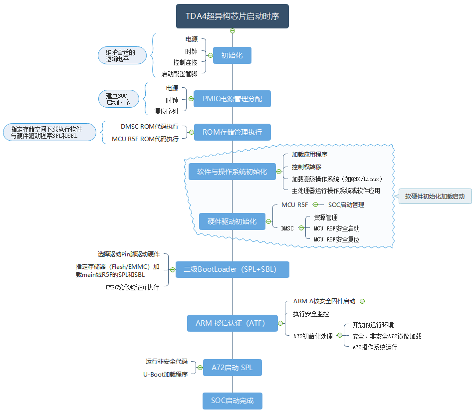

# TDA4

## 简介

​		TDA4是德州仪器（Texas Instruments）推出的一款基于嵌入式系统的处理器芯片，在汽车电子、机器视觉等领域有着广泛的应用。TDA4采用64位`ARM Cortex-R5F`和`Cortex-A72`内核，集成多个硬件加速器，包括图像、视频、雷达和人工智能等应用所需的加速器。它还提供了高速串行接口及低延迟的片上网络，可以支持多个设备之间的高效通信。作为TI旗下最新一代SoC，TDA4在性能、功耗、安全等方面有着显著优势，可以满足现代智能驾驶、智能交通以及其他高计算需求的场景中的要求。

> 项目实施步骤：
>
> 1. 参考芯片数据表，分析硬件架构和功能特点，确定需要抽象的硬件模块和接口
> 2. 基于 C/C++语言，兼容 TIOVX 规范，编写代码
> 3. 利用 TDA4VM 提供的开发工具链和调试环境，进行编译、测试和优化； 在其他 SoC 芯片进行测试
> 4. 编写文档，包括接口说明、使用示例、性能评估等。

### 超异构芯片

​		超异构芯片，其集中特性是将各类不同的芯片内核进行融合，这种集成式芯片设计可以充分整合芯片资源，进一步提升数据计算效率。并且由于芯片在设计之初就打通了相互之间互通兼容性，其内部功能划分和交互统一构建的逻辑优化，相比单芯片功能方案而言，可以显著降低彼此功能和交互的各种掣肘；并且很多设计原理图上可以在芯片之间通过共享某些资源，融合型单芯片可以进一步降低成本。另外，对于自动驾驶系统设计而言，（80%-90%）的轻量级场景+10%左右的挑战场景+10%左右的极端场景需要提供高性能以行业领先的功率/性能比计算传统和深度学习算法，这些完全可以通过超异构的不同芯片核进行覆盖，充分降低复杂度和系统规模。

​		超异构芯片是具有高水平的系统集成，以实现先进汽车的可扩展性和更低成本的支持集中式 ECU。关键核心包括具有标量和矢量内核的下一代 DSP，专用深度学习的NN计算核和传统算法加速器，用于通用计算的最新 ARM 和 GPU 处理器，集成的下一代生成成像子系统 (ISP)，视频编解码器，以太网集线器和隔离的 MCU 功能安全岛，所有受保护汽车级安全和安保硬件加速器等。

一般情况下，除了芯片选型外，设计超异构芯片时需还要满足如下设计规则：

- 片上存储器应设计 ECC 保护并互连
- 内置自检 (BIST) 、故障注入CPU 和片上RAM
- 对于引脚错误设置故障信号模式
- 运行时安全诊断、电压、温度和时钟监控，窗口化看门狗定时器，用于存储器的 CRC 引擎完整性检查
- 可用于应用的功能安全需要满足 ISO26262 要求的ASIL D
- 启用需要大量数据的系统带宽、PCIe 集线器和千兆以太网交换机以及 CSI-2 端口以支持许多传感器输入的吞吐量。

**内核解析**

> https://www.sohu.com/a/609247272_560178

> ​		对于超异构芯片而言，一般是基于异构、可扩展的架构开发，多核异构的优点是各核充分发挥其处理效能的优点，再加上专用硬件加速器也可处理特定任务，从而在性能、功耗和成本上达到最佳平衡。
>
> ​		当前被各厂家广泛使用比较成熟的超异构芯片当属TI的Jacinto™ 7 家族的处理器了，当然这也只是初级超异构芯片。不同厂家对其使用方式不完全一致，有将其完全作为SOC芯片使用的，充分使用了其上的AI算力，有些厂家在不太考虑其安全等级要求的情况下也可能将其当做MCU来使用。

## 资料

> ### SDK:
>
> https://www.ti.com.cn/tool/cn/PROCESSOR-SDK-J721E
>
> **SDK Linux:**
>
> https://www.ti.com.cn/tool/download/PROCESSOR-SDK-LINUX-J721E
>
> **SDK RTOS:**
>
> https://www.ti.com.cn/tool/download/PROCESSOR-SDK-RTOS-J721E
>
> **Datasheet：**
>
> https://www.ti.com.cn/product/cn/TDA4VM
>
> https://www.ti.com.cn/document-viewer/cn/TDA4VM/datasheet
>
> **User Guide:**
>
> **RTOS:**
>
> https://software-dl.ti.com/jacinto7/esd/processor-sdk-rtos-jacinto7/07_03_00_07/exports/docs/psdk_rtos/docs/user_guide/index.html
>
> **Linux:**
>
> https://software-dl.ti.com/jacinto7/esd/processor-sdk-linux-jacinto7/07_03_00_05/exports/docs/devices/J7/linux/index.html
>
> ### SYSCONFIG(pinmux工具):
>
> https://www.ti.com/tool/SYSCONFIG
>
> https://www.ti.com/tool/download/SYSCONFIG
>
> ### E2E论坛：
>
> https://e2e.ti.com/support/processors/f/processors-forum
>
> or
>
> https://e2e.ti.com/support/processors/f/791
>
> **TDA4 问题集锦：**
>
> https://e2e.ti.com/support/processors/f/processors-forum/972530/faq-tda4vm-latest-faqs-on-tda4