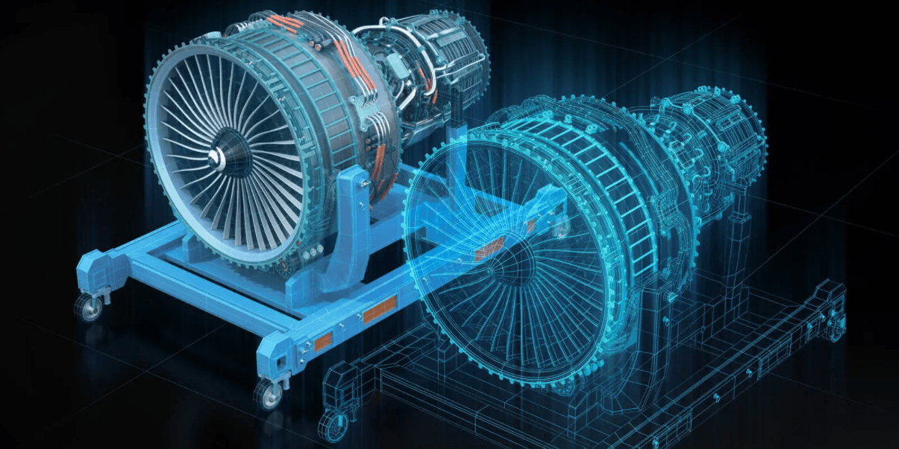
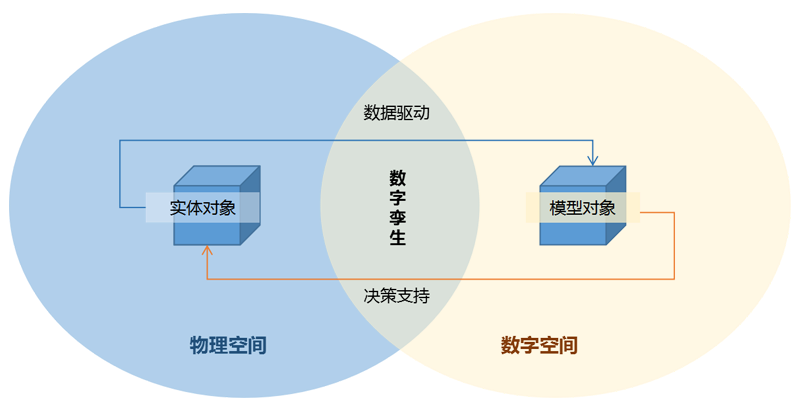
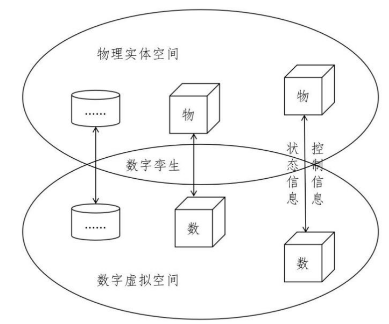
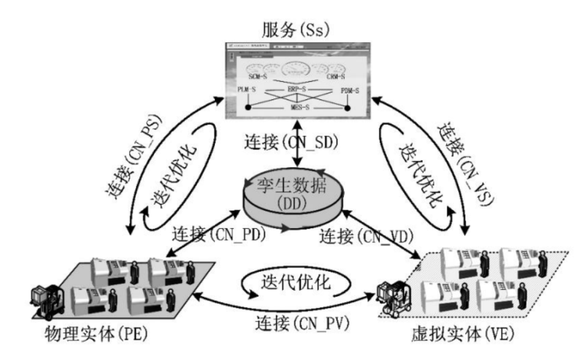

# 数字孪生

​		国际定义：充分利用物理模型、传感器更新、运行历史等数据，集成多学科、多物理量、多尺度、多概率的仿真过程，在虚拟空间中完成映射，从而反映相对应的实体装备的全生命周期过程。

> 简单来说，就是针对现实世界中的实体对象，在数字化世界中构建完全一致的对应模型，通过数字化的手段对实体对象进行动态仿真、监测、分析和控制。
>
> 可以被视为一个或多个重要的、彼此依赖的装备系统的数字映射系统。

> ​		美国国防部最早提出利用Digital Twin技术，用于航空航天飞行器的健康维护与保障。首先在数字空间建立真实飞机的模型，并通过传感器实现与飞机真实状态完全同步，这样每次飞行后，根据结构现有情况和过往载荷，及时分析评估是否需要维修，能否承受下次的任务载荷等。
>
> ​		数字孪生，有时候也用来指代将一个工厂的厂房及产线，在没有建造之前，就完成数字化模型。从而在虚拟的赛博空间中对工厂进行仿真和模拟，并将真实参数传给实际的工厂建设。而工房和产线建成之后，在日常的运维中二者继续进行信息交互。值得注意的是：Digital Twin不是构型管理的工具，不是制成品的3D尺寸模型，不是制成品的MBD定义。

​		`Digital Twin` 是一个物理产品的数字化表达，以便于我们能够在这个数字化产品上看到实际物理产品可能发生的情况，与此相关的技术包括增强现实和虚拟现实。

​		`Digital Thread` 在设计与生产的过程中，仿真分析模型的参数，可以传递到产品定义的全三维几何模型，再传递到数字化生产线加工成真实的物理产品，再通过在线的数字化检测/测量系统反映到产品定义模型中，进而又反馈到仿真分析模型中。

​		依靠`Digital Thread`，所有数据模型都能够双向沟通，因此真实物理产品的状态和参数将通过与智能生产系统集成的赛博物理系统CPS向数字化模型反馈，致使生命周期各个环节的数字化模型保持一致，从而能够实现动态、实时评估系统的当前及未来的功能和性能。而装备在运行的过程中，又通过将不断增加的传感器、机器的联接而收集的数据进行解释利用，可以将后期产品生产制造和运营维护的需求融入到早期的产品设计过程中，形成设计改进的智能闭环。

​		一方面，基于丰富的历史和实时数据和先进的算法模型，可以高效地**在数字世界对物理对象的状态和行为进行反映**；另一方面，通过在数字世界中的模拟试验和分析预测，可**为实体对象的指令下达、流程体系的进一步优化提供决策依据**，大幅提升分析决策效率。

​		然而，并不是建立了全机有限元模型，就有了数字孪生，那只是问题的一个角度；必须在生产中把所有真实制造尺寸反馈回模型，再用PHM（健康预测管理）实时搜集飞机实际受力情况，反馈回模型，才有可能成为Digital Twin

​		Digital Twin 它是物理产品的数字化影子，通过与外界传感器的集成，反映对象从微观到宏观的所有特性，展示产品的生命周期的演进过程。当然，不止产品，生产产品的系统（生产设备、生产线）和使用维护中的系统也要按需建立Digital Twin。

​		Digital twin最为重要的启发意义在于，它实现了现实物理系统向赛博空间数字化模型的反馈。这是一次工业领域中，逆向思维的壮举。人们试图将物理世界发生的一切，塞回到数字空间中。只有带有回路反馈的全生命跟踪，才是真正的全生命周期概念。这样，就可以真正在全生命周期范围内，保证数字与物理世界的协调一致。各种基于数字化模型进行的各类仿真、分析、数据积累、挖掘，甚至人工智能的应用，都能确保它与现实物理系统的适用性。这就是Digital twin对智能制造的意义所在。

​		智能系统的智能首先要感知、建模，然后才是分析推理。如果没有Digital twin对现实生产体系的准确模型化描述，所谓的智能制造系统就是无源之水，无法落实。

数字孪生中常用的技术：

1. 三维建模技术：通过使用计算机辅助设计（CAD）软件，将实体物体建模成三维模型，以便更好地模拟其行为和性能。包括计算机辅助设计（CAD）、计算机辅助制造（CAM）、计算机辅助工程（CAE）等软件和技术。
2. 数据采集和处理技术：数字孪生需要大量的数据来建模和模拟现实世界中的实体和过程。因此，数据采集和处理技术非常重要，包括传感器技术、数据挖掘和机器学习等。包括传感器技术、物联网技术、数据挖掘、机器学习等技术。
3. 虚拟现实技术：虚拟现实技术可以将数字孪生模型以更直观和交互的方式呈现出来，使用户能够更好地理解和控制数字孪生模型。包括虚拟现实头显、手柄、触觉反馈等硬件设备，以及虚拟现实软件和开发工具等。
4. 模拟仿真技术：数字孪生需要能够准确地模拟实体和过程的行为和性能。因此，模拟仿真技术非常重要，包括物理仿真、流体动力学仿真、电路仿真等。包括物理仿真软件（如ANSYS、COMSOL、SolidWorks等）、流体动力学仿真软件（如OpenFOAM、STAR-CCM+等）、电路仿真软件（如SPICE、LTspice等）等。
5. 人工智能技术：数字孪生需要能够自主地学习和优化模型，以更准确地模拟现实世界中的实体和过程。因此，人工智能技术也是数字孪生中不可或缺的技术之一，包括深度学习、强化学习、遗传算法等。包括深度学习框架（如TensorFlow、PyTorch等）、强化学习算法、遗传算法等技术。
6. 云计算技术：数字孪生需要处理大量的数据和运算，因此需要强大的计算和存储能力。云计算技术可以提供高效的计算和存储资源，支持数字孪生的建模、模拟和优化。包括云计算平台（如AWS、Azure、Google Cloud等）、云存储、云计算服务等。
7. 区块链技术：数字孪生需要确保数据的安全性和隐私性，避免数据被篡改或泄露。区块链技术可以提供去中心化的、不可篡改的数据存储和传输，保证数字孪生中数据的安全性和隐私性。包括区块链平台（如Ethereum、Hyperledger Fabric等）、智能合约、去中心化应用等技术。
8. 边缘计算技术：数字孪生需要实时地处理和分析数据，以及进行决策和控制。边缘计算技术可以将计算和存储资源放置在离数字孪生模型更近的位置，提高数字孪生的响应速度和性能。包括边缘计算平台、边缘设备、边缘计算服务等。
9. 自动化技术：数字孪生需要能够自动化地进行建模、模拟和优化，以提高效率和准确性。自动化技术包括自动化建模、自动化仿真、自动化优化等。包括自动化建模软件、自动化仿真软件、自动化优化算法等。

​		数字孪生的首要任务是创建应用对象的数字孪生模型。Grieves教授最初定义了数字孪生三维模型，即物理实体、虚拟实体及二者间的连接。为进一步推动数字孪生理论与技术的研究，促进数字孪生理念在产品全生命周期中落地应用，北航团队结合多年在智能制造服务、制造物联、制造大数据等方面的研究基础和认识，将数字孪生模型由最初的三维结构发展为五维结构模型，其公式为如式（1）所示:

$M_{DT} =(PE,VE,Ss,DD,CN)$                 (1)

其中：

- PE表示物理实体

- VE表示虚拟实体

- Ss表示服务

- DD表示孪生数据

- CN表示各组成部分间的连接。

  根据式 （1），数字孪生五维模型结构如图所示:
  

（1）物理实体（PE）是数字孪生五维模型的基础，主要包括各子系统具备不同的功能，共同支持设备的运行以及传感器采集设备和环境数据。对物理实体的准确分析与有效维护是建立数字孪生模型的前提。

（2）虚拟实体（VE）包括几何模型、物理模型、行为模型和规则模型，从多时间尺度、多空间尺度对物理实习进行描述和刻画，形成对物理实体的完整映射。可使用VR与AR技术实现虚拟实体与物理实体虚实叠加及融合显示, 增强虚拟实体的沉浸性、真实性及交互性。

（3）服务（Ss）对数字孪生应用过程中面向不同领域、不同层次用户、不同业务所需的各类数据、模型、算法、仿真、结果等进行服务化封装，并以应用软件或移动端App的形式提供给用户，实现对服务的便捷与按需使用。

（4）孪生数据（DD）是数字孪生的驱动，集成融合了信息数据与物理数据，满足信息空间与物理空间的一致性与同步性需求，能提供更加准确、全面的全要素/全流程/全业务数据支持。

（5）连接（CN）连接模型包括连接使物理实体、虚拟实体、服务在运行中保持交互、一致与同步以及连接使物理实体、虚拟实体、服务产生的数据实时存入孪生数据，并使孪生数据能够驱动三者运行。