# JUC  并发编程

编写优质的`并发代码`是一件难度极高的事情。Java语言从第一版本开始内置了对多线程的支持，这一点在当年是非常了不起的，但是当我们对并发编程有了更深刻的认识和更多的实践后，实现并发编程就有了更多的方案和更好的选择。

本文是对并发编程的一点总结和思考，同时也分享了Java 5以后的版本中如何编写并发代码的一点点经验。


## 一、J.U.C

JUC 是 Java 的 并发线程 `工具包`


### 1. 基操

#### ① 获取和设置 线程信息

```java
MyThread t_01 = new MyThread();

// void setName(String name)：将此线程的名称更改为参数 name
t_01.setName("飞机");

// String getName( )： 返回此线程的名称
t_01.getName();
//注意：要是类没有继承Thread，不能直接使用getName( ) ；要是没有继承Thread，要通过Thread.currentThread得到当前线程，然后调用getName( )方法

// 返回对当前正在执行的线程对象的引用
static Thread currentThread( )
  
// 通过构造函数设置线程名称
Thread(String name)
Thread(Runnable target ， String name)
```

#### ② 线程优先级(setPriority)

> 线程的两种调度模型 ==[ 了解 ]==
>
> 1. 分时调度模式：所有线程轮流使用CPU的使用权，平均分配每个线程占有CPU的时间片
> 2. 抢占式调度模型：优先让优先级高的线程使用CPU，如果线程的优先级相同，那么会随机选择一个，优先级高的线程获取的CPU时间片相对多一些 [ Java使用的是抢占式调度模型 ]

设置和获取线程优先级的方法

1. public final void setPriority(int newPriority)：更改此线程的优先级

2. public final int getPriority()：返回此线程的优先级

   a. 线程默认优先级是5；线程优先级范围是：1-10； 

   b. 线程优先级高仅仅表示线程获取的CPU时间的几率高，但是要在次数比较多，或者多次运行的时候才能看到你想要的效果


#### ③ 线程控制

- <font color="red"><strong>static void sleep(long millis)</strong></font>：使当前正在执行的线程停留(暂停执行)指定的毫秒数 (休眠线程)
- <font color="red"><strong>void join()</strong></font>：当前线程暂停，等待指定的线程执行结束后，当前线程再继续 (相当于插队加入)
  - `void join(int millis)`：可以等待指定的毫秒之后继续 (相当于插队，有固定的时间)
- <font color="red"><strong>void yield()</strong></font>：让出cpu的执行权(礼让线程)
- <font color="red"><strong>setDaemon(boolean on)</strong></font>：将此线程标记为守护线程，当运行的线程都是守护线程时，Java虚拟机将退出(守护线程)
  (相当于象棋中的帅，要是帅没了，别的棋子都会没用了)

> 1. 守护线程是区别于用户线程哈，用户线程即我们手动创建的线程，而守护线程是程序运行的时候在后台提供一种通用服务的线程。垃圾回收线程就是典型的守护线程
> 2. 守护线程拥有自动结束自己生命周期的特性，非守护线程却没有。如果垃圾回收线程是非守护线程，当JVM 要退出时，由于垃圾回收线程还在运行着，导致程序无法退出，这就很尴尬。这就是为什么垃圾回收线程需要是守护线程
> 3. t1.setDaemon(true)一定要在start( )方法之前使用
>
> ```java
> //守护线程和非守护线程的区别是
> public static void main(String[] args) throws InterruptedException {
>   Thread t1 = new Thread(()-> {
>     while (true) {
>       try {
>         Thread.sleep(1000);
>         System.out.println("我是子线程(用户线程.I am running");
>       } catch (Exception e) {
>       }
>     }
>   });
>   //标记为守护线程，setDaemon要在start()方法之前使用
>   t1.setDaemon(true);
>   //启动线程
>   t1.start();
> 
>   Thread.sleep(3000);
>   System.out.println("主线程执行完毕...");
> }
> ```
>
> 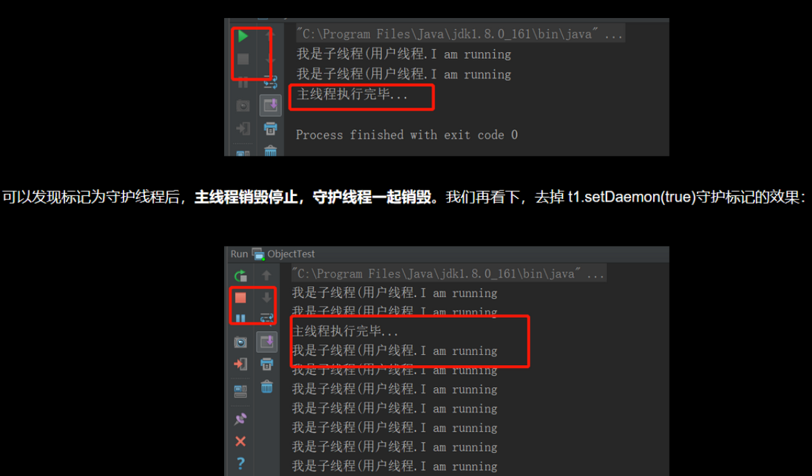

#### ④ 线程的生命周期

- **新建**：就是刚使用new方法，new出来的线程

- 就绪：就是调用的线程的start()方法后，这时候线程处于等待CPU分配资源阶段，谁先抢的CPU资源，谁开始执行

- **运行**：当就绪的线程被调度并获得CPU资源时，便进入运行状态，run方法定义了线程的操作和功能

- **阻塞**：在运行状态的时候，可能因为某些原因导致运行状态的线程变成了阻塞状态
  比如sleep()、wait()之后线程就处于了阻塞状态，这个时候需要其他机制将处于阻塞状态的线程唤醒，比如调用notify或者notifyAll()方法。唤醒的线程不会立刻执行run方法，它们要再次等待CPU分配资源进入运行状态

- **销毁**：如果线程正常执行完毕后或线程被提前强制性的终止或出现异常导致结束，那么线程就要被销毁，释放资源

  

  完整的生命周期图如下：

  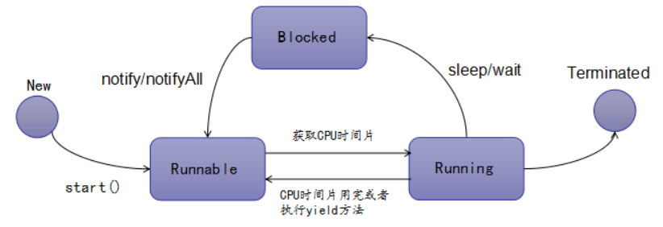

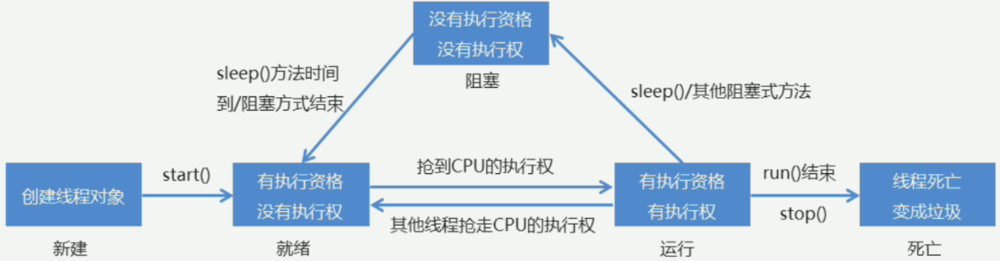

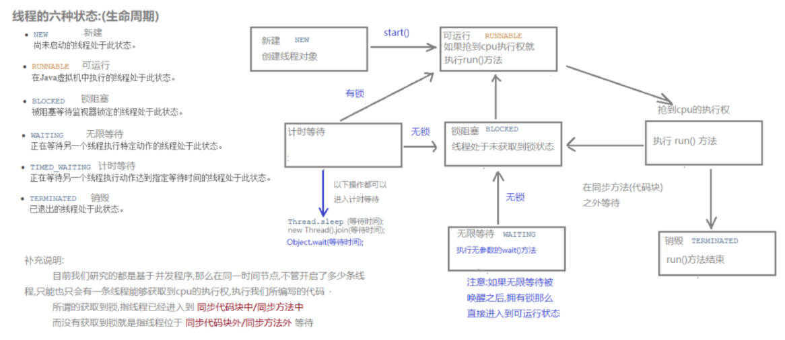

#### ⑤ 线程同步

栗子：买票案例出现的两个问题

①. 相同票数出现多次；②.出现了负票

```java
public class SellTicket implements Runnable {
    //定义一个成员变量表示有100张票
    private int tickets=100;
    public void run(){
     while (true){
         if(tickets>0){
             try {
                 //通过sleep()方法来等待
                 Thread.sleep(100);
             } catch (InterruptedException e) {
                 e.printStackTrace();
             }
             System.out.println(Thread.currentThread().getName()+"正在出售第"+tickets--+"张票");
         }else{
             //System.out.println("");
         }
     }
    }
}
@SuppressWarnings("all")
public class SellTicketDemo {
    public static void main(String[] args) {
        SellTicket st = new SellTicket();

        Thread t1 = new Thread(st， "窗口1");
        Thread t2 = new Thread(st， "窗口2");
        Thread t3 = new Thread(st， "窗口3");

        t1.start();
        t2.start();
        t3.start();
    }
}
```

原因分析：


**同步代码块 `synchronized`**

判断多线程程序是否会有数据安全问题的标准

> 1. 是否有多线程坏境
> 2. 是否有共享数据
> 3. 是否有多条语句操作共享数据

解决多线程安全问题

> 1. 基本思想：让程序没有安全问题的坏境
> 2. 把多条语句操作的共享数据的代码给锁起来，让任意时刻只能有一个线程执行即可

同步的好处和弊端

> 1. 好处：解决了多线程的数据安全问题
> 2. 弊端：当线程很多时，因为每个线程都会判断同步上的锁，这是很浪费资源的，无形中会降低程序的运行效率

```java
public class SellTicket implements Runnable {
    //定义一个成员变量表示有100张票
    private int tickets=100;
    
    private Object obj=new Object();

    public void run(){
     while (true){
       //这里放的锁要是同一把锁才可以
       synchronized(obj){
           if(tickets>0){
               try {
                   //通过sleep()方法来等待
                   Thread.sleep(100);
               } catch (InterruptedException e) {
                   e.printStackTrace();
               }
               System.out.println(Thread.currentThread().getName()+"正在出售第"+tickets--+"张票");
           }else{
               //System.out.println("");
           }
       }
     }
    }
}
```


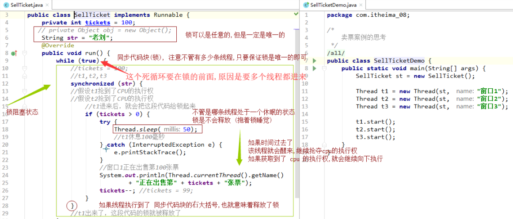

**同步方法**

> 将 `synchronized ` 关键字加到方法上
> 同步方法的锁对象是什么呢? this
> 格式：修饰符 synchronized 返回值类型 方法名(方法参数){ }
>
> 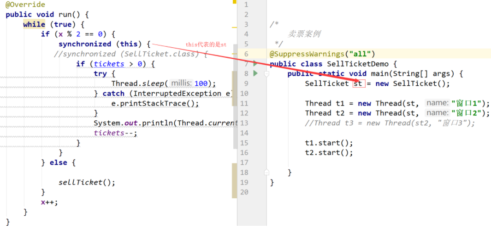
>
> ```java
>     private int tickets = 100;
>     private Object obj = new Object();
>     private int x = 0;
> 
>     @Override
>     public void run() {
>         while (true) {
>             if (x % 2 == 0) {
> //                synchronized (obj) {
>         synchronized (this) {    
>                     if (tickets > 0) {
>                         try {
>                             Thread.sleep(100);
>                         } catch (InterruptedException e) {
>                             e.printStackTrace();
>                         }
>                         System.out.println(Thread.currentThread().getName() + "正在出售第" + tickets + "张票");
>                         tickets--;
>                     }
>                 }
>             } else {
>                 sellTicket();
>             }
>             x++;
>         }
>     }
> 
>   private synchronized void sellTicket() {
>         if (tickets > 0) {
>             try {
>                 Thread.sleep(100);
>             } catch (InterruptedException e) {
>                 e.printStackTrace();
>             }
>             System.out.println(Thread.currentThread().getName() + "正在出售第" + tickets + "张票");
>             tickets--;
>         }
>     }
> }
> ```

**同步静态方法**

>  `synchronized` 关键字加到静态方法上
> 格式：修饰符 static synchronized 返回值类型 方法名(方法参数){ }
> 同步静态方法的锁对象是什么呢?      `类名.class`
>
> ```java
> public class SellTicket implements Runnable {
> 
>     private static int tickets = 100;
>     private Object obj = new Object();
>     private int x = 0;
> 
>     @Override
>     public void run() {
>         while (true) {
>             if (x % 2 == 0) {
> 
>                 synchronized (SellTicket.class) {
>                     if (tickets > 0) {
>                         try {
>                             Thread.sleep(100);
>                         } catch (InterruptedException e) {
>                             e.printStackTrace();
>                         }
>                         System.out.println(Thread.currentThread().getName() + "正在出售第" + tickets + "张票");
>                         tickets--;
>                     }
>                 }
>             } else {
>          
>                 sellTicket();
>             }
>             x++;
>         }
>     }
> 
>     private static synchronized void sellTicket() {
>         if (tickets > 0) {
>             try {
>                 Thread.sleep(100);
>             } catch (InterruptedException e) {
>                 e.printStackTrace();
>             }
>             System.out.println(Thread.currentThread().getName() + "正在出售第" + tickets + "张票");
>             tickets--;
>         }
>     }
> }
> ```

<hr>


## 二、多线程的实现方式

### ①. 继承Thread

```java
//注意：打印出来的结果会交替执行
public class ThreadDemo{
  public static void main(String[] args) {
    //4.创建Thread类的子类对象
    MyThread myThread=new MyThread();
    //5.调用start()方法开启线程
    //[ 会自动调用run方法这是JVM做的事情，源码看不到 ]
    myThread.start();
    for (int i = 0; i < 100; i++) {
      System.out.println("我是主线程"+i);
    }
  }
}
class MyThread extends Thread{
  //2.重写run方法
  public void run(){
    //3.将要执行的代码写在run方法中
    for(int i=0;i<100;i++){
      System.out.println("我是线程"+i);
    }
  }
}
```

### ②. 实现Runnable接口


```java
public class RunnableDemo {
    public static void main(String[] args) {
        //4.创建Runnable的子类对象
        MyRunnale mr=new MyRunnale(); 
        //5.将子类对象当做参数传递给Thread的构造函数，并开启线程
        //MyRunnale taget=mr; 多态
        new Thread(mr).start();
        for (int i = 0; i < 1000; i++) {
            System.out.println("我是主线程"+i);
        }
    }
}

//1.定义一个类实现Runnable
class MyRunnale implements Runnable{
    //2.重写run方法
    @Override
    public void run() {
        //3.将要执行的代码写在run方法中
        for (int i = 0; i < 1000; i++) {
            System.out.println("我是线程"+i);
        }
    }
}
```

两种实现多线程方式的区别

> (1).查看源码
> a.继承Thread：由于子类重写了Thread类的run()，当调用start()时，直接找子类的run()方法
> b.实现Runnable：构造函数中传入了Runnable的引用，成员变量记住了它，start()调用 run()方法时内部判断成员变量Runnable的引用是否为空，不为空编译时看的是Runnable的run()，运行时执行的是子类的run()方法
>
> (2).继承Thread
>     a.好处是：可以直接使用Thread类中的方法，代码简单
>     b.弊端是：如果已经有了父类，就不能用这种方法
>
>  (3).实现Runnable接口
>     a.好处是：即使自己定义的线程类有了父类也没有关系，因为有了父类可以实现接口，而且接口可以多现实的
>     b.弊端是：不能直接使用Thread中的方法需要先获取到线程对象后，才能得到Thread的方法，代码复杂

### ③. Callable接口(创建线程)

> Callable接口中的call方法和Runnable接口中的run方法的区别
>
> 1. 是否有返回值(Runnable接口没有返回值 Callable接口有返回值)
> 2. 是否抛异常(Runnable接口不会抛出异常 Callable接口会抛出异常)
> 3. 落地方法不一样，一个是call() ，一个是run()

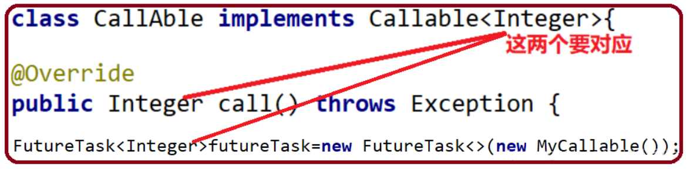

#### Future接口概述

> 1. FutureTask是Future接口的唯一的实现类
> 2. FutureTask同时实现了Runnable、Future接口。它既可以作为Runnable被线程执行，又可以作为Futrue得到Callable的返回值

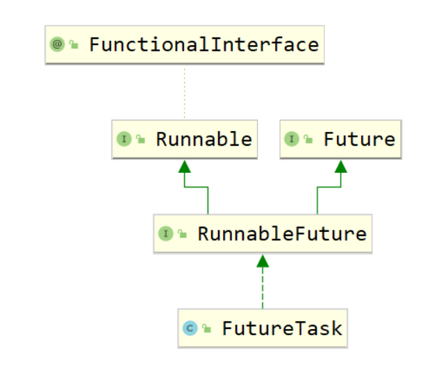

```java
	/*
	创建线程的方式三： 实现callable接口 ---JDK 5.0 新增
	1.创建一个实现Callable接口的实现类
	2.实现call方法，将此线程需要执行的操作声明在call()中
	3.创建callable接口实现类的对象
	4.将此callable的对象作为参数传入到FutureTask构造器中，创建FutureTask的对象
	5.将FutureTask对象作为参数传递到Thread类的构造器中，创建Thread对象，并调用star
	6.获取callable接口中call方法的返回值
	* */
	public class ThreadNew {
	    public static void main(String[] args) {
	        //3.创建callable接口实现类的对象
	        NumThead m=new NumThead();
	        //4.将此callable的对象作为参数传入到FutureTask构造器中，创建FutureTask的对象
	        
	        FutureTask futureTask = new FutureTask(m);
	        //5.将FutureTask对象作为参数传递到Thread类的构造器中，创建Thread对象，并调用start()方法
	        //FutureTask类继承了Runnable接口
	        //new Runnable = futrueTask;
	        new Thread(futureTask).start();
	
	        //6.获取callable接口中call方法的返回值
	        try {
	            //get()方法返回值即为FutureTask构造器参数callable实现类重写的call方法的返回值
	            Object sum = futureTask.get();
	            System.out.println("总和是："+sum);
	        } catch (Exception e) {
	            e.printStackTrace();
	        }
	    }
	
	}
	//1.创建一个实现Callable接口的实现类
	class  NumThead implements Callable{
	   // class  NumThead implements Callable<Integer>{
	    //2.实现call方法，将此线程需要执行的操作声明在call()中
	    @Override
	    public Object call() throws Exception {
	    //public Integer call() throws Exception {
	        int sum=0;
	        for(int i=1;i<=100;i++){
	            System.out.println(i);
	            sum+=i;
	        }
	        return sum;
	    }
	}
```

#### FutureTask原理解析

> 1. 有了Runnable，为什么还要有Callable接口?我们假设一共有四个程序需要执行，第三个程序时间很长 | Runnable接口会按照顺序去执行，会依次从上到下去执行，会等第三个程序执行完毕，才去执行第四个 | Callable接口会把时间长的第三个程序单独开启一个线程去执行，第1、2、4 线程执行不受影响
> 2. 比如主线程让一个子线程去执行任务，子线程可能比较耗时，启动子线程开始执行任务。子线程就去做其他的事情，过一会儿才去获取子任务的执行结果
>
> 
>
> >     例子：
> >     (1). 老师上着课，口渴了，去买水不合适，讲课线程继续，我可以单起个线程找班长帮忙
> >     买水，水买回来了放桌上，我需要的时候再去get。
> >     (2). 4个同学，A算1+20，B算21+30，C算31*到40，D算41+50，是不是C的计算量有点大啊，
> >     FutureTask单起个线程给C计算，我先汇总ABD，最后等C计算完了再汇总C，拿到最终结果
> >     (3). 高考：会做的先做，不会的放在后面做

#### 注意事项

> 1. get( )方法建议放在最后一行，防止线程阻塞  (一旦调用了get( )方法，不管是否计算完成都会阻塞)
> 2. 一个FutureTask，多个线程调用call( )方法只会调用一次
> 3. 如果需要调用call方法多次，则需要多个FutureTask
>
> ```java
> public class CallableDemo  {
>     public static void main(String[] args) throws Exception{
>         CallAble c=new CallAble();
>         FutureTask<Integer> futureTask=new FutureTask<>(c);
> 
>         new Thread(futureTask，"线程A").start();
>         new Thread(futureTask，"线程B").start();
>         Integer integer = futureTask.get();
>         System.out.println("integer = " + integer);
>     }
> }
> class CallAble implements Callable<Integer>{
>     @Override
>     public Integer call() throws Exception {
>         System.out.println("欢迎你调用call方法");
>         return 6;
>     }
> }
> ```

isDone()轮询(后面我们会用CompletableFuture来解决get( )阻塞的问题)

> 1. 轮询的方式会消耗无畏的CPU资源，而且也不见得能及时地得到计算的结果
> 2. 如果想要异步获取结果，通常都会以轮询的方式去获取结果，尽量不要阻塞
>
> ```java
> public class FutureTaskTest {
>     public static void main(String[] args) throws Exception{
>         FutureTask futureTask = new FutureTask(()->{
>             try { TimeUnit.SECONDS.sleep(3);  } catch (InterruptedException e) {e.printStackTrace();}
>             System.out.println(Thread.currentThread().getName()+"\t"+"coming......");
>             return 1024;
>         });
>         new Thread(futureTask).start();
>         //1.果futureTask.get()放到main线程前面，会导致main线程阻塞
>         //Object o = futureTask.get();
> 
>         /*Object o = futureTask.get();//不见不散，只要出现了get()方法就会阻塞
>         System.out.println("不见不散，只要出现了get()方法就会阻塞，获取到的值为："+o);*/
>       
>         //2.过时不候
> //        System.out.println(Thread.currentThread().getName()+"\t"+"线程来了.....");
> //        Object o2 = futureTask.get(2L， TimeUnit.SECONDS);
>       
>         //3.使用轮询
>         while(true){
>             if(futureTask.isDone()){
>                 System.out.println("使用轮询来解决，值为："+futureTask.get());
>                 break;
>             }else{
>                 System.out.println("阻塞中**********");
>             }
>         }
>     }
> }
> ```

### ④. 线程池

> 1. 线程池做的工作主要是控制运行的线程的数量，处理过程中将任务加入队列，然后在线程创建后启动这些任务，如果显示超过了最大数量，超出的数量的线程排队等候，等其他线程执行完毕，再从队列中取出任务来执行.
> 2. 它的主要特点为：**线程复用 | 控制最大并发数 | 管理线程**

Java中的线程池是通过Executor框架实现的，该框架中用到了`Executor，Executors，ExecutorService，ThreadPoolExecutor`这几个类

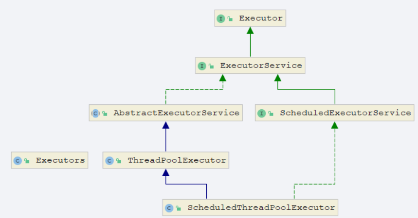

#### ThreadPoolExecutor 

1. Executors.newFixedThreadPool(int) ：  一池定线程

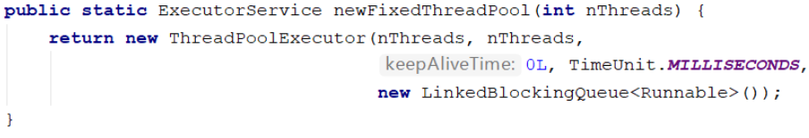

> 主要特点如下：
> 1.创建一个**定长线程池**，可控制线程的最大并发数，超出的线程会在队列中等待.
> 2.`newFixedThreadPool`创建的线程池`corePoolsize`和`MaxmumPoolsize`是相等的，它使用的是`LinkedBlockingQueue`.

2. Executors.newSingleThreadExecutor( ) ：  一池一线程

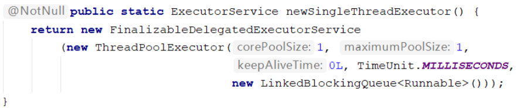

> 主要特点如下：
> 1.创建一个**单线程化的线程池**，它只会用唯一的工作线程来执行任务，保证所有任务都按照指定顺序执行.
> 2.`newBingleThreadExecutor`将`corePoolsize`和`MaxmumPoolSize`都设置为1，它使用的是`LinkedBlockingQueue`

3. Executors.newCachedThreadPool( ) ：  一池N线程

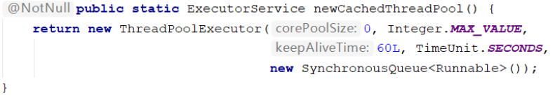

> 主要特点如下：
> 1.创建一个**可缓存线程池**，如果线程池长度超过处理需要，可灵活回收空闲线程，若无可回收，则创建新线程.
> 2.`newCachedThreadPool`将`corePoolSize`设置为 0，`MaxmumPoolSize`设置为 `Integer.MAX_VALUE`，它使用的是`synchronousQueue`，也就是说来了任务就创建线程运行，如果线程空闲超过60秒，就销毁线程。

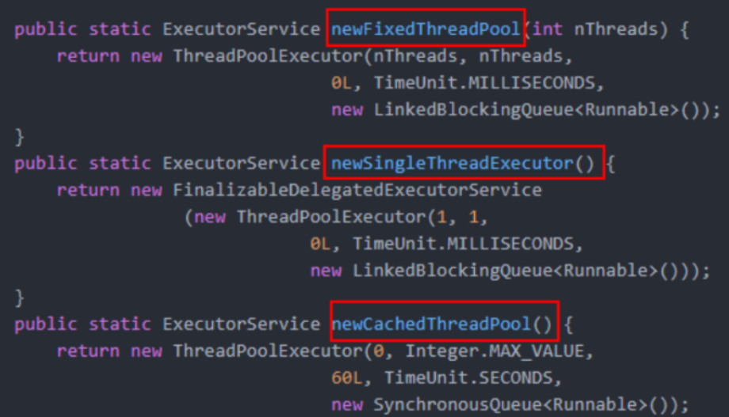

```java
/*
//看cpu的核数
//System.out.println(Runtime.getRuntime().availableProcessors());
* 第四种获取/使用java多线程的方式，线程池
* */
public class ExecutorTest {
    public static void main(String[] args) {

        //ExecutorService threadPool= Executors.newFixedThreadPool(5);//一池5个处理线程
        //ExecutorService threadPool=Executors.newSingleThreadExecutor();//一池一线程
        ExecutorService threadPool=Executors.newCachedThreadPool();//一池N线程

        try {
            for (int i = 1; i <= 10; i++) {
                //使用
                threadPool.execute(() -> {
                    //模拟10个用户来办理业务，每个用户就是一个来自外部的请求线程
                    System.out.println(Thread.currentThread().getName() + "\t 办理业务~！");
                });
                //try { TimeUnit.SECONDS.sleep(3);  } catch (InterruptedException e) {e.printStackTrace();}
            }
        }catch (Exception e){
        }finally {
            //关闭
            threadPool.shutdown();
        }
    }
}
```


#### 线程池的七大参数

①. <font color="red"><strong>corePoolSize</strong></font>  ：线程池中的常驻核心线程数

> 1. 在创建了线程池后，当有请求任务来之后，就会安排池中的线程去执行请求任务，近似理解为今日当值线程
> 2. 当线程池中的线程数目达到`corePoolSize`后，就会把到达的任务放入到缓存队列当中.

②. <font color="red"><strong>maximumPoolSize</strong></font>  ：线程池能够容纳同时执行的最大线程数，此值大于等于1

③. <font color="red"><strong>keepAliveTime</strong></font>  ：多余的空闲线程存活时间，当空间时间达到keepAliveTime值时，多余的线程会被销毁直到只剩下`corePoolSize`个线程为止(非核心线程)

④. <font color="red"><strong>unit</strong></font>  ：`keepAliveTime`的单位

⑤. <font color="red"><strong>workQueue</strong></font>  ：任务队列，被提交但尚未被执行的任务(候客区)

⑥. <font color="red"><strong>threadFactory</strong></font>  ：表示生成线程池中工作线程的线程工厂，用户创建新线程，一般用默认即可

⑦. <font color="red"><strong>handler </strong></font> ：拒绝策略，表示当线程队列满了并且工作线程大于等于线程池的最大显示 数(`maxnumPoolSize`)时如何来拒绝

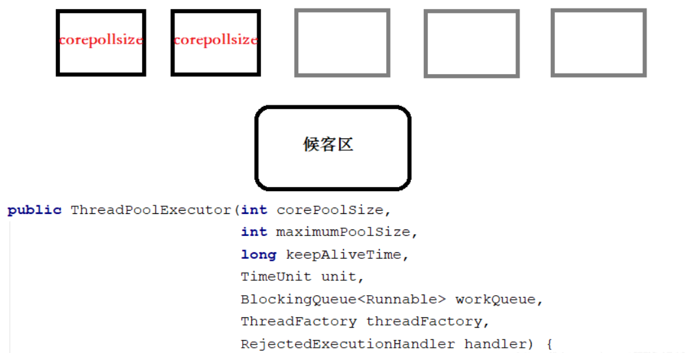


#### 底层工作原理

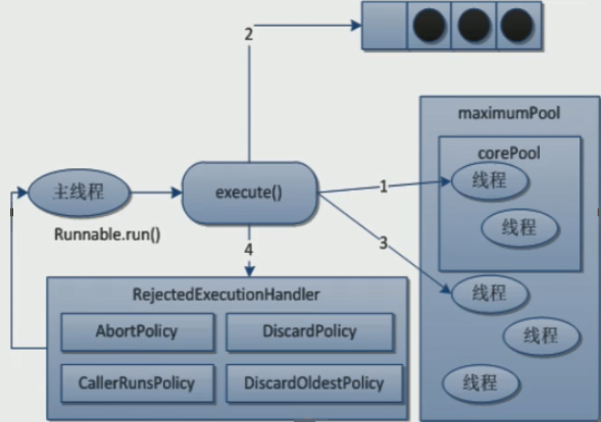

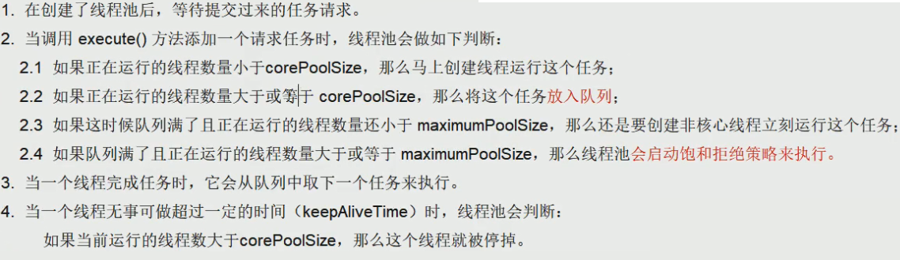


## 三、CompletableFuture

①. CompletableFuture概述
②. CompletableFuture创建方式
③. CompletableFuture API

- 获得结果和触发计算(get、getNow、join、complete)
- 对计算结果进行处理(thenApply、handle)
- 对计算结果进行消费(thenRun、thenAccept、thenApply)
- 对计算速度进行选用(applyToEither、acceptEither、runAfterEither)
- 对计算结果进行合并(thenCombine、thenAcceptBoth、runAfterBoth)
- 多任务组合(allOf、anyOf)

④. 实战：电商比价需求

> Future是`Java5`新加的一个接口，它提供了一种异步并行计算的功能。
> 如果主线程需要执行一个很耗时的计算任务，我们就可以通过future把这个任务放到异步线程中执行。主线程继续处理其他任务或者先行结束，再通过Future获取计算结果。
>
> 目的：异步多线程任务执行且返回有结果，三个特点：**多线程/有返回/异步任务**

### 1. 概述

①. 在Java8中，CompletableFuture提供了非常强大的`Future`的扩展功能，可以帮助我们简化异步编程的复杂性，并且提供了函数式编程的能力，可以通过回调的方式处理计算结果，也提供了转换和组合CompletableFuture的方法

②. 它可能代表一个明确完成的Future，也有可能代表一个完成阶段(CompletionStage)，它支持在计算完成以后触发一些函数或执行某些动作

③. 它实现了Future和CompletionStage接口

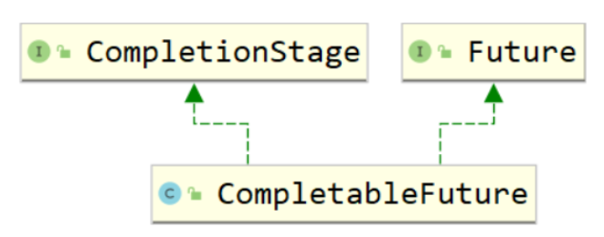

④. CompletionStage接口说明

1. CompletionStage代表异步计算过程中的某一个阶段，一个阶段完成后可能会触发另外一个阶段

2. 一个阶段的计算执行可以是一个Funcation、Consumer、Runnable。

   比如：`stage.thenApply (x->square(x)).thenAccept(x->System.out.println(x)).thenRun(()->{System.out.println()});`

3. 一个阶段的执行可能是被单个阶段的完成触发，也可能是由多个阶段一起触发.有些类似Linux系统的管道分隔符传参数

```java
public class CompletableFutureTest2 {
    public static void main(String[] args)throws Exception {
        /**
         1.当一个线程依赖另一个线程时，可以使用thenApply()方法来把这两个线程串行化(第二个任务依赖第一个任务的结果)
         public <U> CompletableFuture<U> thenApply(Function<? super T，? extends U> fn)
         2.它可以处理正常的计算结果，或者异常情况
         public CompletableFuture<T> whenComplete(BiConsumer<? super T，? super Throwable> action)
         3.异常的处理操作
         public CompletableFuture<T> exceptionally(Function<Throwable，? extends T> fn)
         */
        CompletableFuture<Integer> future = CompletableFuture.supplyAsync(() -> {
            try { TimeUnit.SECONDS.sleep(2);  } catch (InterruptedException e) {e.printStackTrace();}
            return 1;
        }).thenApply(result -> {
            return result+3;
        // whenComplete虽然得到异常信息，但是无法修改返回数据
        }).whenComplete((v，e)->{
            if(e==null){
                System.out.println(Thread.currentThread().getName()+"\t"+"result = " + v);
            }
        })
        // exceptionally： 同时感知异常，同时返回默认值
        .exceptionally(e->{
            e.printStackTrace();
            return null;
        });
        System.out.println(Thread.currentThread().getName()+"\t"+"over...");
        //主线程不要立即结束，否则CompletableFuture默认使用的线程池会立即关闭，暂停几秒
        try { TimeUnit.SECONDS.sleep(3);  } catch (InterruptedException e) {e.printStackTrace();}
    }
}
```

⑤. 业务场景:查询商品详情页的逻辑比较复杂,有些数据还需要远程调用,必然需要花费更多的时间

> 1. 假如商品详情页的每个查询,需要如下标注的时间才能完成,那么,用户需要 5.5s 后才能看到商品详情页的内容。很显然是不能接受的。如果有多个线程同时完成这6步操作,也许只需要 1.5s 即可完成响应。
> 2. 如下的5步操作,1,2,3可以异步进行,4,5需要依赖于1的skuId
>
> //1.获取sku的基本信息
> //2.获取sku的图片信息
> //3.获取sku的促销信息
> //4.获取spu的所有销售属性
> //5.获取规格参数及组下的规格参数

### 2. 创建方式

①. CompletableFuture 提供了四个静态方法来创建一个异步操作

> `runAsync`方法不支持返回值
> `supplyAsync`可以支持返回值,我们一般用`supplyAsync`来创建 
>
> ```java
> 	//runAsync方法不支持返回值
> 	public static CompletableFuture<Void> runAsync(Runnable runnable)
> 	public static CompletableFuture<Void> runAsync(Runnable runnable, Executor executor)
> 	//supplyAsync可以支持返回值
> 	public static <U> CompletableFuture<U> supplyAsync(Supplier<U> supplier)
> 	public static <U> CompletableFuture<U> supplyAsync(Supplier<U> supplier, Executor executor)
> ```
>

②. 没有指定Executor的方法会使用`ForkJoinPool.commonPool() `作为它的线程池执行异步代码。如果指定线程池,则使用指定的线程池运行。以下所有的方法都类同

```java
public class CompletableFutureTest {
    public static void main(String[] args) throws Exception{
        ThreadPoolExecutor executor = new ThreadPoolExecutor(2,
                5,
                2L,
                TimeUnit.SECONDS,
                new LinkedBlockingQueue<>(3));
        //(1). CompletableFuture.runAsync(Runnable runnable);
        CompletableFuture future1=CompletableFuture.runAsync(()->{
            System.out.println(Thread.currentThread().getName()+"*********future1 coming in");
        });
        //这里获取到的值是null
        System.out.println(future1.get());
        //(2). CompletableFuture.runAsync(Runnable runnable,Executor executor);
        CompletableFuture<Void> future2 = CompletableFuture.runAsync(() -> {
            //ForkJoinPool.commonPool-worker-9 
            System.out.println(Thread.currentThread().getName() + "\t" + "*********future2 coming in");
        }, executor);
        //(3).public static <U> CompletableFuture<U> supplyAsync(Supplier<U> supplier)
        CompletableFuture<Integer> future3 = CompletableFuture.supplyAsync(() -> {
            //pool-1-thread-1
            System.out.println(Thread.currentThread().getName() + "\t" + "future3带有返回值");
            return 1024;
        });
        System.out.println(future3.get());
        //(4).public static <U> CompletableFuture<U> supplyAsync(Supplier<U> supplier, Executor executor)
        CompletableFuture<Integer> future4 = CompletableFuture.supplyAsync(() -> {
            System.out.println(Thread.currentThread().getName() + "\t" + "future4带有返回值");
            return 1025;
        }, executor);
        System.out.println(future4.get());
        //关闭线程池
        executor.shutdown();
    }
}
```

### 3. API

#### 3.1 获得结果和触发计算

- ①. public T get( ) 不见不散(会抛出异常) 只要调用了get( )方法,不管是否计算完成都会导致阻塞
- ②. public T get(long timeout, TimeUnit unit) 过时不候
- ③. public T getNow(T valuelfAbsent):没有计算完成的情况下,给我一个替代结果计算完,返回计算完成后的结果、没算完,返回设定的valuelfAbsent
- ④. public T join( ):join方法和get( )方法作用一样,不同的是,join方法不抛出异常

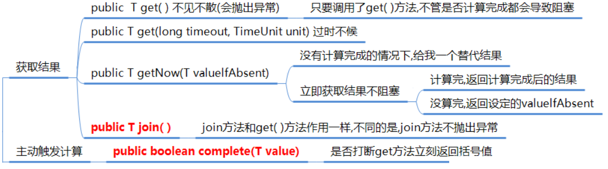

```java
CompletableFuture<Integer> future = CompletableFuture.supplyAsync(() -> {
  try { TimeUnit.SECONDS.sleep(1);  } catch (InterruptedException e) {e.printStackTrace();}
  return 1;
});
//(1).public T get()不见不散(会抛出异常)
//System.out.println(future.get());

//(2).public T get(long timeout, TimeUnit unit) 过时不候2s后如果没有返回结果就报错
//System.out.println(future.get(2,TimeUnit.SECONDS));
//public T getNow(T valuelfAbsent)
try { TimeUnit.SECONDS.sleep(1);  } catch (InterruptedException e) {e.printStackTrace();}
//没有计算完成的情况下,给我一个替代结果
//Integer now = future.getNow(3);
//这里停顿了3s,而我2s后就有结果了,所以可以正常拿到值 false获取到的值是1
//如果这里停顿1s,而我2s后才有结果,那么就不可以正常拿到值,true获取到的值是444
boolean flag = future.complete(444);
System.out.println(flag+"获取到的值是"+future.get());
```

#### 3.2 对计算结果进行处理

- ①. `public <U> CompletableFuture<U> thenApply`
  计算结果存在依赖关系,这两个线程串行化
  由于存在依赖关系(当前步错,不走下一步),当前步骤有异常的话就叫停
- ②. `public <U> CompletableFuture<U> handle(BiFunction<? super T, Throwable, ? extends U> fn)`:
  有异常也可以往下一步走,根据带的异常参数可以进一步处理
- ③. <font color="red"><strong>whenComplete</strong></font>:是执行当前任务的线程执行继续执行whenComplete的任务
- ④. <font color="red"><strong>whenCompleteAsync</strong></font>:是执行把whenCompleteAsync这个任务继续提交给线程池来进行执行


```java
CompletableFuture<Integer> future = CompletableFuture.supplyAsync(() -> {
  try { TimeUnit.SECONDS.sleep(1);  } catch (InterruptedException e) {e.printStackTrace();}
  return 1;
}).thenApply(s->{
  System.out.println("-----1");
  //如果加上int error=1/0; 由于存在依赖关系(当前步错,不走下一步),当前步骤有异常的话就叫停
  //int error=1/0;
  return s+1;
}).thenApply(s->{
  System.out.println("-----2");
  return s+2;
}).whenComplete((v,e)->{
  if(e==null){
    System.out.println("result-----"+v);
  }
}).exceptionally(e->{
  e.printStackTrace();
  return null;
});
System.out.println(Thread.currentThread().getName()+"\t"+"over....");
try { TimeUnit.SECONDS.sleep(3);  } catch (InterruptedException e) {e.printStackTrace();}

ThreadPoolExecutor threadPoolExecutor = new ThreadPoolExecutor(1, 20, 1L, TimeUnit.SECONDS, new LinkedBlockingQueue<>(50), Executors.defaultThreadFactory(), new ThreadPoolExecutor.AbortPolicy());
System.out.println(CompletableFuture.supplyAsync(() -> {
  return 1;
}).handle((f,e) -> {
  System.out.println("-----1");
  return f + 2;
}).handle((f,e) -> {
  System.out.println("-----2");
  //如果这里异常了,handle方法依旧可以继续执行下去
  /*
            -----1
            -----2
            -----3
            null
            java.util.concurrent.CompletionException: java.lang.NullPointerException
                at java.util.concurrent.CompletableFuture.encodeThrowable(CompletableFuture.java:273)
                at java.util.concurrent.CompletableFuture.completeThrowable(CompletableFuture.java:280)
                at java.util.concurrent.CompletableFuture.uniHandle(CompletableFuture.java:824)
                at java.util.concurrent.CompletableFuture.uniHandleStage(CompletableFuture.java:834)
                at java.util.concurrent.CompletableFuture.handle(CompletableFuture.java:2155)
                at com.atguigu.juc.api.CompletableFutureApiDemo.main(CompletableFutureApiDemo.java:19)
            Caused by: java.lang.NullPointerException
                at com.atguigu.juc.api.CompletableFutureApiDemo.lambda$main$3(CompletableFutureApiDemo.java:21)
                at java.util.concurrent.CompletableFuture.uniHandle(CompletableFuture.java:822)
                ... 3 more
            * */
  int error=1/0;
  return f + 3;
}).handle((f,e) -> {
  System.out.println("-----3");
  return f + 4;
}).whenComplete((v, e) -> {
  if (e == null) {
    System.out.println("----result: " + v);
  }
}).exceptionally(e -> {
  e.printStackTrace();
  return null;
}).join());
threadPoolExecutor.shutdown();
```

#### 3.3 对计算结果进行消费

- ①. thenRun(Runnable runnable)
  任务A执行完执行B,并且B不需要A的结果
- ②. `CompletableFuture<Void> thenAccept(Consumer<? super T> action)`
  任务A执行完成执行B,B需要A的结果,但是任务B无返回值
- ③. `public <U> CompletableFuture<U> thenApply(Function<? super T,? extends U> fn)`
  任务A执行完成执行B,B需要A的结果,同时任务B有返回值

```java
 public <U> CompletableFuture<U> thenApply(
   Function<? super T,? extends U> fn) {
   return uniApplyStage(null, fn);
 }
```


```java
CompletableFuture.supplyAsync(() -> {
  return 1;
}).thenApply(f -> {
  return f+2;
}).thenApply(f -> {
  return f+3;
}).thenAccept(r -> System.out.println(r));
// 任务A执行完执行B,并且B不需要A的结果
System.out.println(CompletableFuture.supplyAsync(() -> "resultA").thenRun(() -> {}).join());
// 任务A执行完成执行B,B需要A的结果,但是任务B无返回值
System.out.println(CompletableFuture.supplyAsync(() -> "resultA").thenAccept(resultA -> {}).join());
// 任务A执行完成执行B,B需要A的结果,同时任务B有返回值
System.out.println(CompletableFuture.supplyAsync(() -> "resultA").thenApply(resultA -> resultA + " resultB").join());
```

- ④. 线程串行化方法
  带了Async的方法表示的是:会重新在线程池中启动一个线程来执行任务

```java
public <U> CompletableFuture<U> thenApply(Function<? super T,? extends U> fn)
public <U> CompletableFuture<U> thenApplyAsync(Function<? super T,? extends U> fn)
public <U> CompletableFuture<U> thenApplyAsync
(Function<? super T,? extends U> fn, Executor executor)

public CompletableFuture<Void> thenAccept(Consumer<? super T> action)
public CompletableFuture<Void> thenAcceptAsync(Consumer<? super T> action)
public CompletableFuture<Void> thenAcceptAsync(Consumer<? super T> action,
                                                   Executor executor)

public CompletableFuture<Void> thenRun(Runnable action)
public CompletableFuture<Void> thenRunAsync(Runnable action)
public CompletableFuture<Void> thenRunAsync(Runnable action,Executor executor)         
```

#### 3.4 对计算速度进行选用

①. `public <U> CompletableFuture<U> applyToEither(CompletionStage<? extends T> other, Function<? super T, U> fn)`
这个方法表示的是,谁快就用谁的结果,类似于我们在打跑得快,或者麻将谁赢了就返回给谁


```java
//这个方法表示的是,谁快就用谁的结果,类似于我们在打跑得快,或者麻将谁赢了就返回给谁
//public <U> CompletableFuture<U> applyToEither(CompletionStage<? extends T> other, Function<? super T, U> fn);
//下面这个在第一个中停留1s,在第二种停留2s,返回的结果是1
System.out.println(CompletableFuture.supplyAsync(() -> {
  //暂停几秒钟线程
  try { TimeUnit.SECONDS.sleep(1);  } catch (InterruptedException e) {e.printStackTrace();}
  return 1;
}).applyToEither(CompletableFuture.supplyAsync(() -> {
  try { TimeUnit.SECONDS.sleep(2);  } catch (InterruptedException e) {e.printStackTrace();}
  return 2;
}), r -> {
  return r;
}).join());
//暂停几秒钟线程
try { TimeUnit.SECONDS.sleep(3); } catch (InterruptedException e) { e.printStackTrace(); }
```

- ②. 两任务组合,一个完成

1. applyToEither:两个任务有一个执行完成,获取它的返回值,处理任务并有新的返回值
2. acceptEither:两个任务有一个执行完成,获取它的返回值,处理任务,没有新的返回值
3. runAfterEither:两个任务有一个执行完成,不需要获取 future 的结果,处理任务,也没有返回值

```java
public <U> CompletableFuture<U> applyToEither(
  CompletionStage<? extends T> other, Function<? super T, U> fn)
  public <U> CompletableFuture<U> applyToEitherAsync(
  CompletionStage<? extends T> other, Function<? super T, U> fn)
  public <U> CompletableFuture<U> applyToEitherAsync(
  CompletionStage<? extends T> other, Function<? super T, U> fn,
  Executor executor)

  public CompletableFuture<Void> acceptEither(
  CompletionStage<? extends T> other, Consumer<? super T> action)
  public CompletableFuture<Void> acceptEitherAsync(
  CompletionStage<? extends T> other, Consumer<? super T> action)
  public CompletableFuture<Void> acceptEitherAsync(
  CompletionStage<? extends T> other, Consumer<? super T> action,
  Executor executor)

  public CompletableFuture<Void> runAfterEither(CompletionStage<?> other,Runnable action)

  public CompletableFuture<Void> runAfterEitherAsync(CompletionStage<?> other,Runnable action)   

  public CompletableFuture<Void> runAfterEitherAsync(CompletionStage<?> other,
                                                     Runnable action,
                                                     Executor executor)
```

#### 3.5 对计算结果进行合并

- ①. `public <U,V> CompletableFuture<V> thenCombine(CompletionStage<? extends U> other,BiFunction<? super T,? super U,? extends V> fn)`

  两个CompletionStage任务都完成后,最终把两个任务的结果一起交给thenCombine来处理

  先完成的先等着,等待其他分支任务


```java
//public <U,V> CompletableFuture<V> thenCombine
//(CompletionStage<? extends U> other,BiFunction<? super T,? super U,? extends V> fn)
//两个CompletionStage任务都完成后,最终把两个任务的结果一起交给thenCombine来处理
//先完成的先等着,等待其他分支任务
System.out.println(CompletableFuture.supplyAsync(() -> {
  return 10;
}).thenCombine(CompletableFuture.supplyAsync(() -> {
  return 20;
}), (r1, r2) -> {
  return r1 + r2;
}).thenCombine(CompletableFuture.supplyAsync(() -> {
  return 30;
}), (r3, r4) -> {
  return r3 + r4;
}).join());
System.out.println(CompletableFuture.supplyAsync(() -> {
  return 10;
}).thenCombine(CompletableFuture.supplyAsync(() -> {
  return 20;
}), (r1, r2) -> {
  return r1 + r2;
}).join());
```

- ②. 两任务组合,都要完成

```java
public <U,V> CompletableFuture<V> thenCombine(
  CompletionStage<? extends U> other,
  BiFunction<? super T,? super U,? extends V> fn)
  public <U,V> CompletableFuture<V> thenCombineAsync(
  CompletionStage<? extends U> other,
  BiFunction<? super T,? super U,? extends V> fn)
  public <U,V> CompletableFuture<V> thenCombineAsync(
  CompletionStage<? extends U> other,
  BiFunction<? super T,? super U,? extends V> fn, Executor executor)

  public <U> CompletableFuture<Void> thenAcceptBoth(
  CompletionStage<? extends U> other,
  BiConsumer<? super T, ? super U> action)
  public <U> CompletableFuture<Void> thenAcceptBothAsync(
  CompletionStage<? extends U> other,
  BiConsumer<? super T, ? super U> action) 
  public <U> CompletableFuture<Void> thenAcceptBothAsync(
  CompletionStage<? extends U> other,
  BiConsumer<? super T, ? super U> action, Executor executor)      


  public CompletableFuture<Void> runAfterBoth(CompletionStage<?> other,
                                              Runnable action)
  public CompletableFuture<Void> runAfterBothAsync(CompletionStage<?> other,
                                                   Runnable action)  
  public CompletableFuture<Void> runAfterBothAsync(CompletionStage<?> other,
                                                   Runnable action,
                                                   Executor executor)
  
  
  CompletableFuture.supplyAsync(() -> {
    return 10;
  })
  .thenAcceptBoth(CompletableFuture.supplyAsync(() -> {
    return 20;
  }), (r1, r2) -> {
    System.out.println(r1);//10
    System.out.println(r2);//20
  });
```

#### 3.6 多任务组合

- ①. allOf:等待所有任务完成
  `(public static CompletableFuture<Void> allOf(CompletableFuture<?>... cfs))`
- ②. anyOf:只要有一个任务完成
  `(public static CompletableFuture<Object> anyOf(CompletableFuture<?>... cfs))`

```java
CompletableFuture<String> futureImg = CompletableFuture.supplyAsync(() -> {
  System.out.println("查询商品的图片信息");
  return "hello.jpg";
});

CompletableFuture<String> futureAttr = CompletableFuture.supplyAsync(() -> {
  System.out.println("查询商品的属性");
  return "黑色+256G";
});

CompletableFuture<String> futureDesc = CompletableFuture.supplyAsync(() -> {
  try { TimeUnit.SECONDS.sleep(3);  } catch (InterruptedException e) {e.printStackTrace();}
  System.out.println("查询商品介绍");
  return "华为";
});
//需要全部完成
//        futureImg.get();
//        futureAttr.get();
//        futureDesc.get();
//CompletableFuture<Void> all = CompletableFuture.allOf(futureImg, futureAttr, futureDesc);
//all.get();
CompletableFuture<Object> anyOf = CompletableFuture.anyOf(futureImg, futureAttr, futureDesc);
anyOf.get();
System.out.println(anyOf.get());
System.out.println("main over.....");
```

