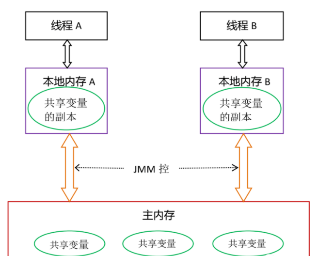
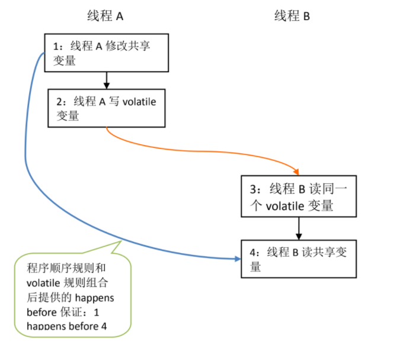
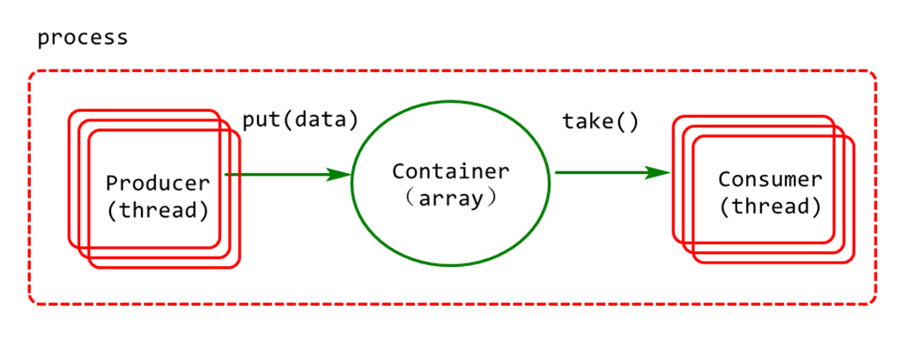
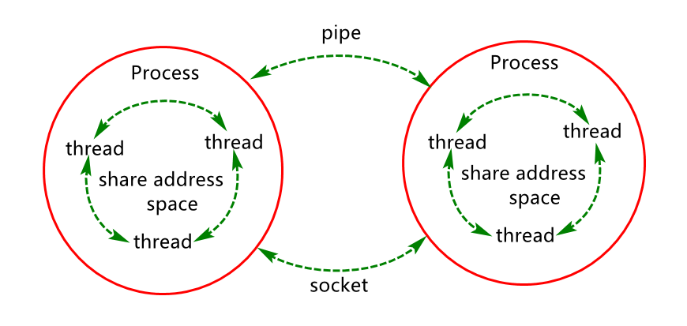

# 基础知识强化


## 原子性

> 一个操作或者多个操作，要么全部执行并且执行的过程不会被任何因素打断，要么就都不执行。

原子性是拒绝多线程操作的，不论是多核还是单核，具有原子性的量，同一时刻只能有一个线程来对它进行操作。简而言之，在整个操作过程中不会被线程调度器中断的操作，都可认为是原子性。例如 a=1是原子性操作，但是a++和a +=1就不是原子性操作。Java中的原子性操作包括：

- 基本类型的读取和赋值操作，且赋值必须是值赋给变量，变量之间的相互赋值不是原子性操作；
- 所有引用reference的赋值操作；
- java.concurrent.Atomic.* 包中所有类的一切操作。

## 可见性

> 指当多个线程访问同一个变量时，一个线程修改了这个变量的值，其他线程能够立即看得到修改的值。

在多线程环境下，一个线程对共享变量的操作对其他线程是不可见的。Java提供了volatile来保证可见性，当一个变量被volatile修饰后，表示着**线程本地内存无效**，当一个线程修改共享变量后他会立即被更新到主内存中，其他线程读取共享变量时，会直接从主内存中读取。当然，synchronize和Lock都可以保证可见性。synchronized和Lock能保证同一时刻只有一个线程获取锁然后执行同步代码，并且在释放锁之前会将对变量的修改刷新到主存当中。因此可以保证可见性。

## 有序性

> 即程序执行的顺序按照代码的先后顺序执行。

Java内存模型中的有序性可以总结为：如果在本线程内观察，所有操作都是有序的；如果在一个线程中观察另一个线程，所有操作都是无序的。前半句是指“线程内表现为串行语义”，后半句是指“指令重排序”现象和“工作内存主主内存同步延迟”现象。

在Java内存模型中，为了效率是允许编译器和处理器对指令进行重排序，当然重排序不会影响单线程的运行结果，但是对多线程会有影响。Java提供volatile来保证一定的有序性。最著名的例子就是单例模式里面的DCL（双重检查锁）。另外，可以通过synchronized和Lock来保证有序性，synchronized和Lock保证每个时刻是有一个线程执行同步代码，相当于是让线程顺序执行同步代码，自然就保证了有序性。


> 为了让大家更好理解可见性和有序性，这个就不得不了解“内存模型”、“重排序”和“内存屏障”，因为这三个概念和他们关系非常密切。


# 内存模型

JMM决定一个线程对共享变量的写入何时对另一个线程可见，JMM定义了线程和主内存之间的抽象关系：共享变量存储在主内存(Main Memory)中，每个线程都有一个私有的本地内存（Local Memory），本地内存保存了被该线程使用到的主内存的副本拷贝，线程对变量的所有操作都必须在工作内存中进行，而不能直接读写主内存中的变量。



对于普通的共享变量来讲，线程A将其修改为某个值发生在线程A的本地内存中，此时还未同步到主内存中去；而线程B已经缓存了该变量的旧值，所以就导致了共享变量值的不一致。解决这种共享变量在多线程模型中的不可见性问题，可以使用`volatile、synchronized、final` 等，此时A、B的通信过程如下：

- 首先，线程A把本地内存A中更新过的共享变量刷新到主内存中去；
- 然后，线程B到主内存中去读取线程A之前已更新过的共享变量。

> JMM通过控制主内存与每个线程的本地内存之间的交互，来为`java`程序员提供内存可见性保证，需要注意的是，**JMM是个抽象的内存模型**，所以所谓的本地内存，主内存都是抽象概念，并不一定就真实的对应cpu缓存和物理内存。

总结一句话，内存模型JMM控制多线程对共享变量的可见性！！！


# 重排序

> 重排序是指**编译器**和处理器为了优化程序性能而对指令序列进行排序的一种手段。

重排序需要遵守一定规则：

- 重排序操作不会对存在数据依赖关系的操作进行重排序。比如：a=1;b=a; 这个指令序列，由于第二个操作依赖于第一个操作，所以在编译时和处理器运行时这两个操作不会被重排序。
- 重排序是为了优化性能，但是不管怎么重排序，单线程下程序的执行结果不能被改变。比如：a=1;b=2;c=a+b这三个操作，第一步（a=1)和第二步(b=2)由于不存在数据依赖关系， 所以可能会发生重排序，但是c=a+b这个操作是不会被重排序的，因为需要保证最终的结果一定是c=a+b=3。

重排序在单线程下一定能保证结果的正确性，但是在多线程环境下，可能发生重排序，影响结果，请看下面的示例代码：

```java
class ReorderExample {
  int a = 0;
  boolean flag = false;
  public void writer() {
      a = 1;                   //1
      flag = true;             //2
  }
  public void reader() {
      if (flag) {                //3
          int i =  a * a;        //4
          System.out.println(i);
      }
  }
}
```

flag变量是个标记，用来标识变量a是否已被写入。这里假设有两个线程A和B，A首先执行writer()方法，随后B线程接着执行reader()方法。线程B在执行操作4时，输出是多少呢？

答案是：可能是0，也可能是1。

由于`操作1`和`操作2`没有数据依赖关系，编译器和处理器可以对这两个操作重排序；同样，操作3和操作4没有数据依赖关系，编译器和处理器也可以对这两个操作重排序。让我们先来看看，当操作1和操作2重排序时，可能会产生什么效果？请看下面的程序执行时序图：


如上图所示，操作1和操作2做了重排序。程序执行时，线程A首先写标记变量flag，随后线程B读这个变量。由于条件判断为真，线程B将读取变量a。此时，变量a还根本没有被线程A写入，在这里多线程程序的语义被重排序破坏了！最后输出`i`的结果是0

> 温馨提示：这里其实理解起来有点绕，比如线程A先执行了writer()，然后线程B执行reader()，对于线程A，怎么会有这个重排序呢？其实这个重排序，是对线程B而言的，不是线程A哈！
>
> 有了线程B这第一视角，我们再理解一下，虽然线程A将writer()执行了，执行顺序是a=1，flag=true，但是对于线程B来说，因为重排序，线程B是根据重排序后的结果去执行的，所以才会出现上述异常情况，这么给大家解释，是不是就清晰很多呢？

下面再让我们看看，当操作3和操作4重排序时会产生什么效果（借助这个重排序，可以顺便说明控制依赖性）。下面是操作3和操作4重排序后，程序的执行时序图：


在程序中，操作3和操作4存在控制依赖关系。当代码中存在控制依赖性时，会影响指令序列执行的并行度。为此，编译器和处理器会采用猜测（Speculation）执行来克服控制相关性对并行度的影响。以处理器的猜测执行为例，执行线程B的处理器可以提前读取并计算`a*a`，此时结果为0，然后把计算结果临时保存到一个名为重排序缓冲（reorder buffer ROB）的硬件缓存中。当接下来操作3的条件判断为真时，就把该计算结果写入变量`i`中。

从图中我们可以看出，猜测执行实质上对操作3和4做了重排序。重排序在这里破坏了多线程程序的语义！因为`temp`的值为0，所以最后输出`i`的结果是0。

那如何避免重排序对多线程的影响呢，答案是“内存屏障”！


# 内存屏障

为了保证内存可见性，可以通过volatile、final等修饰变量，java编译器在生成指令序列的适当位置会插入内存屏障指令来禁止特定类型的处理器重排序。内存屏障主要有3个功能：

- 它确保指令重排序时不会把其后面的指令排到内存屏障之前的位置，也不会把前面的指令排到内存屏障的后面；即在执行到内存屏障这句指令时，在它前面的操作已经全部完成；
- 它会强制将对缓存的修改操作立即写入主存；
- 如果是写操作，它会导致其他CPU中对应的缓存行无效。

假如我对上述示例的falg变量通过volatile修饰：

```
class ReorderExample {
  int a = 0;
  boolean volatile flag = false;
  public void writer() {
      a = 1;                   //1
      flag = true;             //2
  }
  Public void reader() {
      if (flag) {                //3
          int i =  a * a;        //4
          System.out.println(i);
      }
  }
}
```

这个时候，volatile禁止指令重排序也有一些规则，因为篇幅原因，该规则将会在下一章讲解，根据happens before规则，这个过程建立的happens before 关系可以分为两类：

1. 根据程序次序规则，1 happens before 2; 3 happens before 4。
2. 根据volatile规则，2 happens before 3。
3. 根据happens before 的传递性规则，1 happens before 4。

> happens before规则，其实就是重排序规则建立的代码前后依赖关系。
>
> 温馨提示：这里大家可能会有疑问，1、3的规则我理解，但是对于2，为什么“2 happens before 3”，还记得前面讲的“内存模型”么？因为你对变量flag指定了volatile，所以当线程A执行完后，变量flag=true会直接刷到内存中，然后B马上可见，所以说2一定是在3前面，不可能因为重排序，导致3在2前面执行。（然后还要提示一下，这里执行时有个前提条件，就是线程A执行完，才能执行线程B里面的逻辑，因为线程A不执行完，flag一直是false，线程B根本就进不到主流程，所以你也可以直接理解为线程A执行完后，再执行线程B，才有这么个先后关系。）

上述happens before关系的图形化表现形式如下：



在上图中，每一个箭头链接的两个节点，代表了一个happens before 关系。黑色箭头表示程序顺序规则；橙色箭头表示volatile规则；蓝色箭头表示组合这些规则后提供的happens before保证。

这里A线程写一个volatile变量后，B线程读同一个volatile变量。A线程在写volatile变量之前所有可见的共享变量，在B线程读同一个volatile变量后，将立即变得对B线程可见。


## 如何理解进程与线程？

- 进程：操作系统进行资源调度和分配的基本单位（例如浏览器，APP，JVM）
- 线程：进程中的最小执行单位（可以理解为一个顺序的执行流）


说明：同一个进程内的多个线程共享资源。

## 如何理解多线程中的并行与并发？

并发：多线程抢占CPU，可能不同时执行，侧重于多个任务交替执行。


> 现在的操作系统无论是`windows`，`linux`还是`macOS`等其实都是多用户多任务分时操作系统，使用这些操作系统的的用户可以“同时”干多件事情。
>
> 但实际上，对于单机`CPU`的计算机而言，在同一时间只能干一件事，为了看起来像是“同时干多件事”分时操作系统把CPU的时间划分成了长短进本相同的时间区间，即“时间片”，通过操作系统的管理，把时间片依次轮流的分配给各个线程任务使用。
>
> 我们看似的“同时干多件事”，其实是通过CPU时间片技术并发完成的。例如：多个线程并发使用一个CPU资源并发执行任务的线程时序图。


并行：线程可以不共享CPU，可每个线程一个CPU同时执行多个任务。


总之：个人认为并行只出现在多CPU或多核CPU中，而并发可理解为并行中的一个子集。

## 如何理解线程的生命周期及状态变化？

一个线程从创建，运行，到最后销毁的这个过程称之为线程的生命周期，在这个生命周期过程中线程可能会经历如下几个状态：

这些状态可归纳为：状态分别为新建状态，就绪状态，运行状态，阻塞状态，死亡状态。

线程并发安全问题认知强化
如何理解线程安全与不安全？
多个线程并发执行时，仍旧能够保证数据的正确性，这种现象称之为线程安全。
多个线程并发执行时，不能能够保证数据的正确性，这种现象称之为线程不安全。
案例分享：如何保证12306中的订票操作的安全。

第一步：编写售票任务类：

```java
class TicketTask implements Runnable{
  int ticket=10;
  @Override
  public void run() {
    doTicket();
  }
  public void doTicket() {
    while(true) {
      if(ticket <= 0) break;
      System.out.println(ticket--);
    }
  }
}
```

第二步：编写售票测试方法：

```java
public static void main(String[] args) {
  TicketTask task=new TicketTask();
  Thread t1=new Thread(task);
  Thread t2=new Thread(task);
  Thread t3=new Thread(task);

  t1.start();
  t2.start();
  t3.start();  
}
```

## 导致线程不安全的因素有哪些？

1. 多个线程并发执行。
2. 多个线程并发执行时存在共享数据集(临界资源)。
3. 多个线程在共享数据集上的操作不是原子操作。

例如：现有一生产者消费者模型，生产者和消费者并发操作容器对象。



如何保证并发线程的安全性？

- 第一；对共享进行限制访问（例如加锁：syncronized，Lock）
- 第二：基于CAS实现非阻塞同步（基于CPU硬件技术支持）
- 第三：取消共享，每个线程一个对象实例（例如threadlocal）


说明：Java中的线程安全问题的主要关注点有3个：可见性，有序性，原子性；

> Java内存模型（JMM）解决了可见性和有序性问题，而解决了原子性问题。 

<hr>


# 如何理解JAVA中的悲观锁和乐观锁？

JAVA中为了保证多线程并发访问的安全性，提供了基于锁的应用，大体可归纳为两大类，即悲观锁和乐观锁。

悲观锁 & 乐观锁定义说明：

1. 悲观锁：假定会发生并发冲突，屏蔽一切可违反数据完整性的操作，例如java中可以基于syncronized,Lock，ReadWriteLock等实现。

2. 乐观锁实现：假设不会发生冲突，只在提交操作时检查是否违反数据完整性，例如java中可借助CAS（ Compare And Swap）算法实现(此算法依赖硬件CPU)。

悲观锁&乐观锁应用场景说明：
1)悲观锁适合写操作多的场景，先加锁可以保证写操作时数据正确。
2)乐观锁适合读操作多的场景，不加锁的特点能够使其读操作的性能大幅提升

悲观锁&乐观锁应用案例分析

悲观锁实现计数器：
方案1：

```java
class Counter{
		private int count;
		public synchronized int count() {
			count++;
			return count;
		}
}
```

方案2：

```java
class Counter{
  private int count;
  private Lock lock = new ReentrantLock();
  public  int count() {
    lock.lock();
    try {
      count++;
      return count;
    }finally {
      lock.unlock();
    }
  }
}
```

乐观锁实现计数器：

```java
class Counter{
	private AtomicInteger at = new AtomicInteger();
	public  int count() {
		return at.incrementAndGet();
	}
}
```

其中 AtomicInteger 是基于CAS算法实现。

## 如何理解线程的上下文切换？

一个线程得到CPU执行的时间是有限的。当此线程用完为其分配的CPU时间以后，cpu会切换到下一个线程执行。

但是在这之前，线程需要将当前的状态进行保存，以便下次再次获得CPU时间片时可以加载对应的状态以继续执行剩下的任务。

而这个切换过程是需要耗费时间的，会影响多线程程序的执行效率，所以在在使用多线程时要减少线程的频繁切换。

减少多线程上下文切换的方案如下：

- 无锁并发编程：锁的竞争会带来线程上下文的切换
- CAS算法：CAS算法在数据更新方面，可以达到锁的效果
- 使用最少线程：避免不必要的线程等待
- 使用协程：单线程完成多任务的调度和切换，避免多线程


## 如何理解死锁以及避免死锁问题？

多个线程互相等待已经被对方线程正在占用的锁，导致陷入彼此等待对方释放锁的状态，这个过程称之为死锁。
如何避免死锁呢？

- 避免一个线程中同时获取多个锁
- 避免一个线程在一个锁中获取其他的锁资源
- 考虑使用定时锁来替换内部锁机制，如lock.tryLock(timeout)

可能出现死锁的案例

```java
class SyncThread implements Runnable {
  private Object obj1;
  private Object obj2;
  public SyncThread(Object o1, Object o2) {
    this.obj1 = o1;
    this.obj2 = o2;
  }
  @Override
  public void run() {
    synchronized (obj1) {
      work();
      synchronized (obj2) {
        work();
      }
    }
  }
  private void work() {
    try {Thread.sleep(30000);} catch (InterruptedException e) {
      e.printStackTrace();
    }
  }
}
```

死锁测试

```java
public class TestDeadLock01 {
	public static void main(String[] args)throws Exception {
		 Object obj1 = new Object();
		 Object obj2 = new Object();
		 Thread t1 = new Thread(new SyncThread(obj1, obj2), "t1");
		 Thread t2 = new Thread(new SyncThread(obj2, obj1), "t2");
		 t1.start();
		 t2.start();
	}
}
```

# 线程通讯与进程通讯应用增强

## 如何理解进程与线程通讯？

- 线程通讯：java中的多线程通讯主要是共享内存（变量）等方式
- 进程通讯：java中进程通讯（IPC）主要是Socket，MQ等



## 如何实现进程内部线程之间的通讯？

### 基于wait/nofity/notifyall实现

- Wait:阻塞正在使用监视器对象的线程，同时释放监视器对象
- notify: 唤醒在监视器对象上等待的单个线程，但不释放监视器对象，此时调用该方法的代码继续执行，直到执行结束才释放对象锁
- notifyAll: 唤醒在监视器对象上等待的所有线程，但不释放监视器对象，此时调用该方法的代码继续执行，直到执行结束才释放对象锁

> 1） 这些方法必须应用在同步代码块或同步方法中
> 2） 这些方法必须由监视器对象（对象锁）调用

说明：使用wait/notify/notifyAll的作用一般是为了避免轮询带来的性能损失。

手动实现阻塞式队列，并基于wait()/notifyAll()方法实现实现线程在队列上的通讯

```java
/**
 * 有界消息队列：用于存取消息
 * 1)数据结构：数组(线性结构)
 * 2)具体算法：FIFO(先进先出)-First in First out
 */
public class BlockContainer<T> {//类泛型 
	/**用于存储数据的数组*/
	private Object[] array;
	/**记录有效元素个数*/
	private int size;
	public BlockContainer () {
		this(16);//this(参数列表)表示调用本类指定参数的构造函数
	}
    public BlockContainer (int cap) {
		array=new Object[cap];//每个元素默认值为null
	}
}
```

向容器添加put方法，用于放数据。

```java
/**
     * 生产者线程通过put方法向容器放数据
     * 数据永远放在size位置
     * 说明：实例方法内部的this永远指向
     * 调用此方法的当前对象(当前实例)
     * 注意：静态方法中没有this，this只能
     * 应用在实例方法，构造方法，实例代码块中
     */
public synchronized void put(T t){//同步锁：this
  //1.判定容器是否已满，满了则等待
  while(size==array.length)
    try{this.wait();}catch(Exception e){}
  //2.放数据
  array[size]=t;
  //3.有效元素个数加1
  size++;
  //4.通知消费者取数据
  this.notifyAll();
}
```

向容器类添加take方法，用于从容器取数据。

```java
/**
     * 消费者通过此方法取数据
     * 位置：永远取下标为0的位置的数据
     * @return
     */
@SuppressWarnings("unchecked")
public synchronized T take(){
  //1.判定容器是否为空，空则等待
  while(size==0)
    try{this.wait();}catch(Exception e){}
  //2.取数据
  Object obj=array[0];
  //3.移动元素
  System.arraycopy(
    array,//src 原数组
    1, //srcPos 从哪个位置开始拷贝
    array,  //dest 放到哪个数组
    0, //destPost 从哪个位置开始放
    size-1);//拷贝几个
  //4.有效元素个数减1
  size--;
  //5.将size位置为null
  array[size]=null;
  //6.通知生产者放数据
  this.notifyAll();//通知具备相同锁对象正在wait线程
  return (T)obj;
}
```

### 基于Condition实现

Condition 是一个用于多线程间协同的工具类，基于此类可以方便的对持有锁的线程进行阻塞或唤醒阻塞的线程。它的强大之处在于它可以为多个线程间建立不同的Condition，通过signal()/signalall()方法指定要唤醒的不同线程。

1. 基于Lock对象获取Condition对象
2. 基于Condition对象的await()/signal()/signalall()方法实现线程阻塞或唤醒。

手动实现阻塞式队列，并基于wait()/notifyAll()方法实现实现线程在队列上的通讯。

```java
/**
 * 有界消息队列：用于存取消息
 * 1)数据结构：数组(线性结构)
 * 2)具体算法：FIFO(先进先出)-First in First out
 */
public class BlockContainer<T> {//类泛型 

  /**用于存储数据的数组*/
  private Object[] array;
  /**记录有效元素个数*/
  private int size;
  public BlockContainer() {
    this(16);//this(参数列表)表示调用本类指定参数的构造函数
  }
  public BlockContainer(int cap) {
    array=new Object[cap];//每个元素默认值为null
  }
  //JDK1.5以后引入的可重入锁(相对于synchronized灵活性更好)
  private ReentrantLock lock=new ReentrantLock(true);// true表示使用公平锁，默认是非公平锁
  private Condition producerCondition=lock.newCondition();//通讯条件
  private Condition consumerCondition=lock.newCondition();//通讯条件
}
```

向容器中添加put方法，用于向容器放数据

````java
/**
     * 生产者线程通过put方法向容器放数据
     * 数据永远放在size位置
     * 说明：实例方法内部的this永远指向
     * 调用此方法的当前对象(当前实例)
     * 注意：静态方法中没有this，this只能
     * 应用在实例方法，构造方法，实例代码块中
     */
public void put(T t){//同步锁：this
  System.out.println("put");
  lock.lock();
  try{
    //1.判定容器是否已满，满了则等待
    while(size==array.length)
      //等效于Object类中的wait方法
      try{producerCondition.await();}catch(Exception e){e.printStackTrace();}
    //2.放数据
    array[size]=t;
    //3.有效元素个数加1
    size++;
    //4.通知消费者取数据
    consumerCondition.signalAll();//等效于object类中的notifyall()
  }finally{
    lock.unlock();
  }
}
````

在容器类中添加take方法用于从容器取数据

```java
/**
     * 消费者通过此方法取数据
     * 位置：永远取下标为0的位置的数据
     * @return
     */
@SuppressWarnings("unchecked")
public  T take(){
  System.out.println("take");
  lock.lock();
  try{
    //1.判定容器是否为空，空则等待
    while(size==0)
      try{consumerCondition.await();}catch(Exception e){}
    //2.取数据
    Object obj=array[0];
    //3.移动元素
    System.arraycopy(
      array,//src 原数组
      1, //srcPos 从哪个位置开始拷贝
      array,  //dest 放到哪个数组
      0, //destPost 从哪个位置开始放
      size-1);//拷贝几个
    //4.有效元素个数减1
    size--;
    //5.将size位置为null
    array[size]=null;
    //6.通知生产者放数据
    producerCondition.signalAll();//通知具备相同锁对象正在wait线程
    return (T)obj;
  }finally{
    lock.unlock();
  }
}
```

## 如何实现进程之间间通讯（IPC）？

基于BIO实现的简易server服务器

```java
public class BioMainServer01 {
  private Logger log=LoggerFactory.getLogger(BioMainServer01.class);	
  private ServerSocket server;
  private volatile boolean isStop=false;
  private int port;
  public BioMainServer01(int port) {
    this.port=port;
  }
  public void doStart()throws Exception {
    server=new ServerSocket(port);
    while(!isStop) {
      Socket socket=server.accept();
      log.info("client connect");
      doService(socket);
    }
    server.close();
  }
  public void doService(Socket socket) throws Exception{
    InputStream in=socket.getInputStream();
    byte[] buf=new byte[1024];
    int len=-1;
    while((len=in.read(buf))!=-1) {
      String content=new String(buf,0,len);
      log.info("client say {}", content);
    }
    in.close();
    socket.close();
  }
  public void doStop() {
    isStop=false;
  }
  public static void main(String[] args)throws Exception {
    BioMainServer01 server=new BioMainServer01(9999);
    server.doStart();
  }
}
```

启动服务，然后打开浏览器进行访问或者通过如下客户端端访问

```java
public class BioMainClient {
	public static void main(String[] args) throws Exception{
		Socket socket=new Socket();
		socket.connect(new InetSocketAddress("127.0.0.1", 9999));
		OutputStream out=socket.getOutputStream();
		Scanner sc=new Scanner(System.in);
		System.out.println("client input:");
		out.write(sc.nextLine().getBytes());
		out.close();
		sc.close();
		socket.close();
	}
}
```

# 总结（Summary）

本小节主要从线程、进程基本概念着手，逐步进行了线程安全、线程通讯、进程通讯等维度方面的讲解。