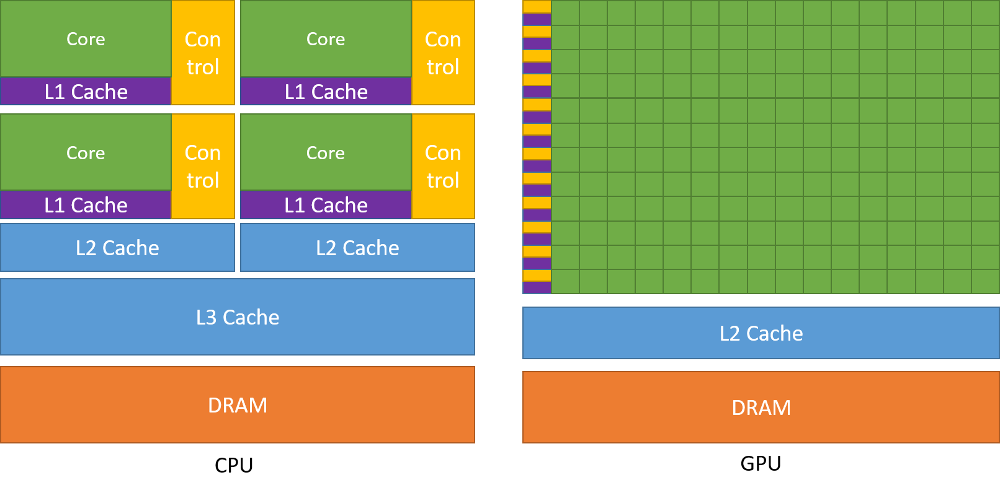
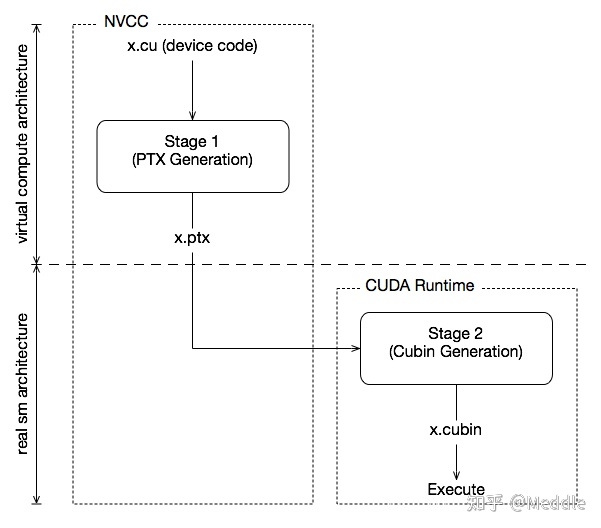
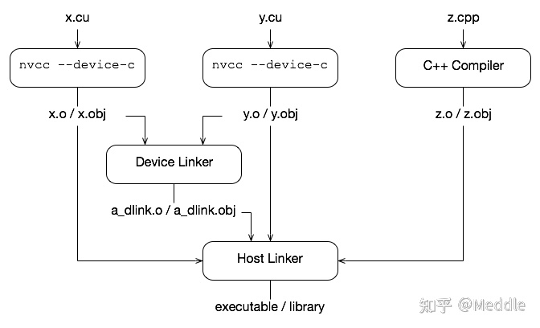

# CUDA 编程


## 一、简介

> CPU：复杂的控制逻辑（优化CPU设计的目的主要是为了提高串行代码的性能），大型缓存（减少访问复杂应用程序的指令和数据时产生的延时并且节约带宽）都不利于提升峰值计算速度，内存带宽远远不如GPU。
>
> GPU：普遍采用多线程来提升运算速度与吞吐量，硬件充分利用因为等待访问内存而产生较长延时的大量线程，简化了控制逻辑；小型缓存满足多线程对带宽的要求。
>
> ​		GeForce 256是英伟达于1999年开发的第一个GPU，最初只用于在显示器上渲染高端图形。现在，GPU在主流计算中也有了更多应用，GPU（通用GPU）技术飞速发展。英伟达开发的了一种与C类似的语言和编程环境，通过克服异构计算及多种并行带来的挑战，从而提高程序员的生产效率。这一系统的名称就是CUDA（Compute Unified Device Architecture）

> ​		CUDA 是 NVIDIA 推出的用于其发布的 GPU 的并行计算架构，使用 CUDA 可以利用 GPU 的并行计算引擎更加高效的完成复杂的计算难题。
>
> ​		在目前主流使用的**冯·诺依曼体系结构**的计算机中，GPU 属于一个外置设备，因此即便在利用 GPU 进行并行计算的时候也无法脱离 CPU，需要与 CPU 协同工作。因此当我们在说 GPU 并行计算时，其实指的是基于 CPU+GPU 的异构计算架构。在异构计算架构中，CPU 和 GPU 通过 PCI-E 总线连接在一起进行协同工作，所以 CPU 所在位置称为 Host，GPU 所在位置称为 Device。基于CPU+GPU的异构计算平台可以优势互补，CPU负责处理逻辑复杂的串行程序，而GPU重点处理数据密集型的并行计算程序，如下图所示：
>
> 
>
> 
>
> > GPU 中有着更多的运算核心，非常适合数据并行的计算密集型任务，比如大型的矩阵计算。

## 二、**CUDA 编程模型基础**

​		CUDA 模型是一个异构模型，需要 CPU 和 GPU 协同工作，在 CUDA 中一般用 Host 指代 CPU 及其内存，Device 指代 GPU 及其内存。CUDA 程序中既包含在 Host 上运行的程序，也包含在 Device 上运行的程序，并且 Host 和 Device 之间可以进行通信，如进行数据拷贝等操作。一般的将需要串行执行的程序放在 Host 上执行，需要并行执行的程序放在 Device 上进行。

CUDA 程序一般的执行流程：

1. 分配 Host 内存，并进行数据初始化
2. 分配 Device 内存，并将 Host 上的数据拷贝到 Device 上
3. 调用 CUDA Kernel 在 Device 上进行并行运算
4. 将运算结果从 Device 上拷贝到 Host 上，并释放 Device 上对应的内存
5. 并行运算结束，Host 得到运算结果，释放 Host 上分配的内存，程序结束

> ​		CUDA Kernel 指的是在 Device 线程上并行执行的函数，在程序中利用 `__global__` 符号声明，在调用时需要用 `<<<grid, block>>>` 来指定 Kernel 执行的线程数量，在 CUDA 中每一个线程都要执行 Kernel 函数，并且每个线程会被分配到一个唯一的 Thread ID，这个 ID 值可以通过 Kernel 的内置变量 `threadIdx` 来获得。
>
> 主要的三个函数类型限定词如下：
>
> - `__global__`：在 device 上执行，从 host 中调用（一些特定的 GPU 也可以从 device 上调用），返回类型必须是`void`，不支持可变参数参数，不能成为类成员函数。注意用 `__global__` 定义的 kernel 是异步的，这意味着 host 不会等待 kernel 执行完就执行下一步。
> - `__device__`：在 device 上执行，单仅可以从 device 中调用，不可以和`__global__`同时用。
> - `__host__`：在 host 上执行，仅可以从 host 上调用，一般省略不写，不可以和 `__global__` 同时用，但可和`__device__`，此时函数会在 device 和 host 都编译。
>
> **Kernel 的层次结构**
>
> ​		Kernel 在 Device 执行的时候实际上是启动很多线程，这些线程都执行 Kernel 这个函数。
>
> ​		其中，由这个 Kernel 启动的所有线程称为一个**网格**（<span style="color:red">`grid`</span>），同一个 grid 中的线程共享相同的 `Global memory`，$grid$ 是线程结构的第一个层次。
>
> ​		一个 $grid$ 又可以划分为多个 **线程块**（<span style="color:red">block</span>），每一个 $block$ 包含多个线程，其中的所有线程又共享 `Per-block shared memory`，$block$ 是线程结构的第二个层次。最后，每一个线程 $ (thread)$  有着自己的 `Per-thread local memory`。同一线程块内的线程协作可以通过同步、共享内存等方式来实现，而不同块内的线程不能协作。
>
> 

​		线程两层组织结构的示意图，其中 $grid$ 和 $block$ 均为 $2-dim$ 的线程组织。$grid$ 和 $block$ 都是定义为 `dim3` 类型的变量，`dim3` 可以看成是包含三个无符号整数 $(x, y, z)$ 成员的结构体变量，在定义时，缺省值初始化为 $1$。

```c
dim3 grid(3, 2);
dim3 block(5, 3);
kernel<<<grid, block>>>(parameters...);
```

  $CUDA$ 可以组织三维的网格和块。线程层次结构如下图所示，其结构是一个包含二维块的二维网格。网格和块的维度由 **$blockDim$**（线程块的维度，用每个线程块中的线程数来表示）、**gridDim**（线程格的维度，用每个线程格中的线程数来表示）两个内置变量指定，它们是**dim3**类型的变量，是基于**uint3**定义的整数型向量，用来表示维度。当定义一个**dim3**类型的变量时，所有未指定的元素都被初始化为1.dim3类型，变量中的每个组件可以通过它的 $x、y、z$ 字段获得。

​		在CUDA程序中有两组不同的网格和块变量：手动定义的**dim3**数据类型和预定义的**uint3**数据类型。在主机端，作为内核调用的一部分，可以使用**dim3**数据类型定义一个网格和块的维度。当执行核函数时， CUDA 运行时会生成相应的内置预初始化的网格、块和线程变量，它们在核函数内均可被访问到且为**uint3**类型。手动定义的**dim3**类型的网格和块变量仅在主机端可见，而**uint3**类型的内置预初始化的网格和块变量仅在设备端可见。


​		从线程的组织结构可以得知，一个线程是由 $(blockIdx, threadIdx)$ 来唯一标识的，`blockIdx` 和 `threadIdx` 都是 `dim3` 类型的变量，其中 `blockIdx` 指定线程所在 $block$ 在 $grid$ 中的位置，`threadIdx` 指定线程在 $block$ 中的位置，如图中的 $Thread(2,1)$ 满足：

```c
threadIdx.x = 2;
threadIdx.y = 1;
blockIdx.x = 1;
blockIdx.y = 1;
```

​		一个 $Block$ 是放在同一个**流式多处理器(SM)**上运行的，但是单个 SM 上的运算核心 **(cuda core)** 有限，这导致线程块中的线程数是有限制的，因此在设置 grid 和 block 的 **shape** 时需要根据所使用的 Device 来设计

​		如果要知道一个线程在 $Block$ 中的全局 $ID$，就必须要根据 Block 的组织结构来计算，对于一个 $2-dim$ 的 $Block(D_x, D_y)$，线程$(x, y)$的 ID 值为 $x + y ∗ D_x$，如果是 $3-dim$ 的 $Block(D_x, D_y, D_z)$，线程$(x, y, z)$ 的 ID 值为 $x + y ∗ D_x + z ∗ D_x ∗ D_y$ 。

🌰栗子：**CUDA 查看 Device 基本信息**

```C
#include <stdio.h>
#include "cuda_runtime.h"
#include "device_launch_parameters.h"

int main()
{
    cudaDeviceProp deviceProp;
    cudaGetDeviceProperties(&deviceProp, 0);
    printf("Device 0 information:\n");
    printf("设备名称与型号: %s\n", deviceProp.name);
    printf("显存大小: %d MB\n", (int)(deviceProp.totalGlobalMem / 1024 / 1024));
    printf("SM 数量: %d\n", deviceProp.multiProcessorCount);
    printf("CUDA CORE数量: %d\n", deviceProp.multiProcessorCount * 64);
    std::cout << "每个线程块的共享内存大小：" << devProp.sharedMemPerBlock / 1024.0 << " KB" << std::endl;
    std::cout << "每个线程块的最大线程数：" << devProp.maxThreadsPerBlock << std::endl;
    std::cout << "每个EM的最大线程数：" << devProp.maxThreadsPerMultiProcessor << std::endl;
    std::cout << "每个SM的最大线程束数：" << devProp.maxThreadsPerMultiProcessor / 32 << std::endl;
    printf("计算能力: %d.%d\n", deviceProp.major, deviceProp.minor);
}
// 以下是本地电脑执行结果：
// Device 0 information:
// 设备名称与型号: NVIDIA GeForce MX250
// 显存大小: 2047 MB
// 含有的SM数量: 3
// CUDA CORE数量: 576
// 计算能力: 6.1
```

> 🌰栗子：**CUDA 矩阵相乘**
>
> ​		`kernel` 的这种线程组织结构天然适合`vector`，`matrix`等运算，利用 $2-dim$ 结构实现两个矩阵的加法，每个线程负责处理每个位置的两个元素相加，代码如下所示：
>
> 线程块大小为 $(16, 16)$，然后将 $N*N$ 大小的矩阵均分为不同的线程块来执行加法运算
>
> ```C
> // Kernel定义
> __global__ void MatAdd(float A[N][N], float B[N][N], float C[N][N]) {
>     int i = blockIdx.x * blockDim.x + threadIdx.x;
>      int j = blockIdx.y * blockDim.y + threadIdx.y;
>      if (i < N && j < N)
>          C[i][j] = A[i][j] + B[i][j];
>    }
> 
> int main(){
>     ...
>         // Kernel 线程配置
>          dim3 threadsPerBlock(16, 16); 
>      dim3 numBlocks(N / threadsPerBlock.x, N / threadsPerBlock.y);
>      // kernel调用
>      MatAdd<<<numBlocks, threadsPerBlock>>>(A, B, C);
>      ...
>  }
>  ```
> 
> 其中第 12 行乘 64 的原因是我所使用的设备为 MX250，而 MX250 系列均采用 Pascal 架构，该架构下每个 SM 中的 cuda core 的数量为 64
>
> 🌰栗子：**CUDA 实现向量加法**
>
> ```C
>// 实现 Vector Addition
> #include <stdio.h>
> #include <time.h>
> #include <math.h>
> #include "cuda_runtime.h"
> #include "device_launch_parameters.h"
> 
> const int LENGTH = 5e4;
> clock_t start, end;
> void vectorAdditionOnDevice(float*, float*, float*, const int);
> __global__ void additionKernelVersion(float*, float*, float*, const int);
> int main()
> {
>     start = clock();
>     float A[LENGTH], B[LENGTH], C[LENGTH] = {0};
>        for (int i = 0; i < LENGTH; i ++) A[i] = 6, B[i] = 5;
>        vectorAdditionOnDevice(A, B, C, LENGTH);  //calculation on GPU
>        end = clock();
>        printf("Calculation on GPU version1 use %.8f seconds.\n", (float)(end - start) / CLOCKS_PER_SEC);
>    }
>    void vectorAdditionOnDevice(float* A, float* B, float* C, const int size)
> {
>     float* device_A = NULL;
>     float* device_B = NULL;
>        float* device_C = NULL;
>        cudaMalloc((void**)&device_A, sizeof(float) * size);  // 分配内存
>        cudaMalloc((void**)&device_B, sizeof(float) * size);  // 分配内存
>        cudaMalloc((void**)&device_C, sizeof(float) * size);  // 分配内存
>        const float perBlockThreads = 192.0;
>        cudaMemcpy(device_A, A, sizeof(float) * size, cudaMemcpyHostToDevice);  // 将数据从 Host 拷贝到 Device
>        cudaMemcpy(device_B, B, sizeof(float) * size, cudaMemcpyHostToDevice);  // 将数据从 Host 拷贝到 Device
>        additionKernelVersion<<<ceil(size / perBlockThreads), perBlockThreads>>>(device_A, device_B, device_C, size);  // 调用 Kernel 进行并行计算
>        cudaDeviceSynchronize();
>        cudaMemcpy(device_C, C, sizeof(float) * size, cudaMemcpyDeviceToHost);  // 将数据从 Device 拷贝到 Host
>        cudaFree(device_A);  // 释放内存
>        cudaFree(device_B);  // 释放内存
>        cudaFree(device_C);  // 释放内存
>    }
>    __global__ void additionKernelVersion(float* A, float* B, float* C, const int size)
> {
>     // 此处定义用于向量加法的 Kernel
>     int i = blockIdx.x * blockDim.x + threadIdx.x;
>        C[i] = A[i] + B[i];
>    }
>    ```

​		每个线程有自己的私有本地内存（Local Memory），而每个线程块有包含共享内存（Shared Memory）,可以被线程块中所有线程共享，其生命周期与线程块一致。
​		此外，所有的线程都可以访问全局内存（Global Memory）。还可以访问一些只读内存块：常量内存（Constant Memory）和纹理内存（Texture Memory）。


> ​		一个 $kernel$ 实际上会启动很多线程，这些线程是逻辑上并行的，但是在物理层却并不一定。
> 多线程如果没有多核支持，在物理层也是无法实现并行的。GPU存在很多CUDA核心，充分利用CUDA核心可以充分发挥GPU的并行计算能力。
> ​		GPU硬件的一个核心组件是SM，SM的核心组件包括CUDA核心，共享内存，寄存器等，SM可以并发地执行数百个线程，并发能力就取决于SM所拥有的资源数。当一个 $kernel$ 被执行时，它的 $gird$ 中的线程块被分配到SM上，一个线程块只能在一个SM上被调度。SM一般可以调度多个线程块，这要看SM本身的能力。
> 那么有可能一个 kernel 的各个线程块被分配多个SM，所以$grid$只是逻辑层，而SM才是执行的物理层。SM采用的是[SIMT](https://link.zhihu.com/?target=http%3A//docs.nvidia.com/cuda/cuda-c-programming-guide/index.html%23simt-architecture) ($Single-Instruction, Multiple-Thread$，单指令多线程)架构，基本的执行单元是线程束（warps)，线程束包含32个线程，这些线程同时执行相同的指令，但是每个线程都包含自己的指令地址计数器和寄存器状态，也有自己独立的执行路径。
> ​		所以尽管线程束中的线程同时从同一程序地址执行，但是可能具有不同的行为，比如遇到了分支结构，一些线程可能进入这个分支，但是另外一些有可能不执行，它们只能死等，因为GPU规定线程束中所有线程在同一周期执行相同的指令，线程束分化会导致性能下降。
> ​		当线程块被划分到某个SM上时，它将进一步划分为多个线程束，因为这才是SM的基本执行单元，但是一个SM同时并发的线程束数是有限的。这是因为资源限制，SM要为每个线程块分配共享内存，而也要为每个线程束中的线程分配独立的寄存器。所以SM的配置会影响其所支持的线程块和线程束并发数量。
> ​		总之，就是网格和线程块只是逻辑划分，一个 $kernel$ 的所有线程其实在物理层是不一定同时并发的。所以 $kernel$ 的 $grid$ 和 $block$ 的配置不同，性能会出现差异，这点是要特别注意的。还有，由于SM的基本执行单元是包含32个线程的线程束，所以 $block$ 大小一般要设置为32的倍数。
>
> 

**并行线程组织结构**

Thread：并行的基本单位

Thread block：互相合作的线程组

- Cooperative Thread Array (CTA)
- 允许彼此同步
- 通过快速共享内存交换数据
- 以1维、2维或3维组织
- 最多包含512个线程

Grid：一组thread block

- 以1维、2维或3维组织
- 共享全局内存

Kernel：在GPU上执行的核心程序


> 

## 三、CUDA 编程

### 环境安装

```bash
vim ~/.bashrc
export PATH="/usr/local/cuda-10.2/bin:$PATH"
export LD_LIBRARY_PATH="/usr/local/cuda-10.2/lib64:$LD_LIBRARY_PATH"

source ~/.bashrc
```

> ​		C语言函数调用语句：`function_name(argument list);` 而CUDA内核调用是对C语言函数调用语句的延申，`kernal_name <<<grid,block>>>(argument list);`其中<<<>>>运算符内是核函数的执行配置。执行配置的第一个值是网络维度，也就是启动块的数目，第二个值是块维度，也就是每个块中线程的数目。通过指定网格和块的维度，可以进行内核中线程的数目以及内核中使用的线程布局的配置。
>   由于数据在全局内存中是线性存储的，可以用变量blockIdx.x和threadIdx.x来进行以下操作：在网格中标识一个唯一的线程、建立线程和数据元素之间的映射关系。不同于C语言的函数调用，所有的CUDA核函数的启动都是异步的。CUDA内核调用完成后，控制权立刻返回给CPU。可以通过调用以下函数来强制主机端程序等待所有的核函数执行结束：`cudaError_t cudaMemcpy(void* dst,const void* src,size_t count,cudaMemcpykind kind);`

### 函数定义

|                                  | Exexuted on the | Only callable from the |
| :------------------------------: | :-------------: | :--------------------: |
| `__device__ ` float DeviceFunc() |     deivce      |         deivce         |
|  `__global__` void KernalFunc()  |     deivce      |          host          |
|   `__host__` float HostFunc()    |      host       |          host          |

> `__global__` 定义 kernal 函数 必须返回 void
>
> `__device__` 和 `__host__` 可以组合使用，都可在 CPU与GPU 上被编译

> ​		**SM是指流多处理器**（Streaming Multiprocessor）的缩写。SM是一种专门为GPU设计的处理器，每个SM都包含多个CUDA核心，能够同时执行多个线程。每个SM都有自己的寄存器、共享内存和高速缓存，可以独立地执行指令，因此可以并行执行多个线程块。线程块是一组线程的集合，可以在一个SM上执行。当线程块被分配到SM上时，SM将为线程块中的每个线程分配寄存器、共享内存和高速缓存，并执行线程块中的指令。通过将线程块分配到不同的SM上执行
>
> 
>
> ```c
> #include<stdio.h>
> 
> __global__ void hello_from_gpu(){
>     printf("hello word from the gpu!\n");
> }
> 
> int main(){
>     hello_from_gpu<<<1,1>>>();
>     cudaDeviceSynchronize();
>     printf("helloword\n");
>     return 0;
> }
> ```
> 
>​		在核函数的调用格式上与普通C++的调用不同，调用核函数的函数名和（）之间有一对三括号，里面有逗号隔开的两个数字。
> 
>​		因为一个GPU中有很多计算核心，可以支持很多个线程。主机在调用一个核函数时，必须指明需要在设备中指派多少个线程，否则设备不知道怎么工作。三括号里面的数就是用来指明核函数中的线程数以及排列情况的。核函数中的线程常组织为若干线程块（thread block）。
> 
>​		三括号中的第一个数是线程块的个数，第二个数可以看作每个线程中的线程数。一个核函数的全部线程块构成一个网格，而线程块的个数记为网格大小，每个线程块中含有同样数目的线程，该数目称为线程块大小。所以核函数中的总的线程就等与网格大小乘以线程块大小，即 <<<网格大小，线程块大小 >>> 核函数中的`printf` 函数的使用方法和 C++ 库中的`printf`函数的使用方法基本上是一样的，而在核函数中使用`printf`函数时也需要包含头文件`<stdio.h>`  ,  核函数中不支持 C++ 的 `iostream` 。
> 
>​		`cudaDeviceSynchronize();` 这条语句调用了CUDA运行时的API函数，去掉这个函数就打印不出字符了。因为 cuda 调用输出函数时，输出流是先放在缓存区的，而这个缓存区不会自动刷新，只有程序遇到某种同步操作时缓存区才会刷新。这个函数的作用就是同步主机与设备，所以能够促进缓存区刷新。

### **核 函 数**

​		核函数是在设备端执行的代码。在核函数中，需要为一个线程规定要进行的计算以及要进行的数据访问。当核函数被调用时，许多不同的CUDA线程并行执行同一个计算任务。核函数必须有一个void返回类型。
  函数类型限定符指定了一个函数在主机上执行还是在设备上执行，以及可被主机调用还是被设备调用，下表总结了CUDA C程序中的函数类型限定符。

| 限定符   | 执行         | 调用                                            | 备注                   |
| -------- | ------------ | ----------------------------------------------- | ---------------------- |
| *global* | 在设备端执行 | 可从主机端调用，也可以从计算能力为3的设备中调用 | 必须有一个void返回类型 |
| *device* | 在设备端执行 | 仅能从设备端调用                                |                        |
| *host*   | 在主机端执行 | 仅能从主机端调用                                | 可以省略               |

> __device __和 __host __限定符可以一齐使用，这样函数可以同时在主机和设备端进行编译。
> CUDA 核函数 Typical：
>
> - 只能访问设备内存、必须具有void返回类型、不支持可变数量的参数、不支持静态变量、显示异步行为。
> - 可以向核函数传递非指针变量，其内容对每个线程可见。
> - 核函数不可成为一个类的成员，通常是用一个包装函数调用核函数，而将包装函数定义为类的成员。
> - 动态并行机制，在核函数内部可以调用其他核函数，甚至可以调用自己（递归）。
> - 无论是从主机调用，还是从设备调用，核函数都是在设备中执行。调用核函数时必须指定执行配置，即三括号和它里面的参数。
>
> CUDA 设备函数 features：
>
> - **只能被核函数或者其他设备函数调用**，在设备中执行。
> - 不能同时用 device 和 global 修饰一个函数，即不能将一个函数同时定义为设备函数和核函数。
> - 也不能同时用host核global修饰一个函数。

**处 理 错 误**

​		由于许多CUDA调用是异步的，所有有时很难确定某个错误是由哪一步程序引起的。定义一个错误处理宏封装所有的CUDA API调用，这简化了错误检查过程：

```C
#define CHECK(call)
{
  const cudaError_t error = call;
  if(error != cudaSuccess)
  {
     printf("Error: %s:%d",__FILE__,__LINE__);
     printf("code:%d, reson:%s\n",error,cudaGetErrorString(error));
     exit(1);
  }
} 
```

> 完成错误检查宏的定义之后，就可以在代码中使用宏。比如：`CHECK(cudaMemcpy(d_C,gpuRef,nBytes,cudaMemcpyHostToDevice));`
>
> 如果内存拷贝或之前的异步操作产生了错误，这个宏会报告错误代码，并且输出一个可读信息，然后停止程序。再比如：`CHECK(cudaDeviceSynchronize())`会阻塞主机端线程的运行直到设备端所有的请求都结束，并确保最后的核函数启动部分不会出错。
>
> `printThreadIndo`函数被用于输出关于每个线程的以下信息：线程索引、块索引、矩阵坐标、线性全局内存偏移、相应元素的值。

> Reference：https://blog.csdn.net/AAAA202012/article/details/121611026
>
> ​					  https://zhuanlan.zhihu.com/p/34587739

- `__device__`
  - 储存于GPU上的global memory空间
  - 和应用程序具有相同的生命期(lifetime)
  - 可被grid中所有线程存取,CPU代码通过`runtime`函数存取
- `__constant__`
  - 储存于GPU上的`constant_memory`空间
  - 和应用程序具有相同的生命期(lifetime)
  - 可被grid中所有线程存取,CPU代码通过runtime函数存取
- `___shared__`
  - 储存于GPU上`thread block`内的共享存储器
  - 和`thread block`具有相同的生命期(lifetime)
  - 只能被thread block内的线程存取
- `Local变量`
  - 储存于SM内的寄存器和`local memory`
  - 和thread具有相同的生命期(lifetime)
  - Thread私有

### 内存管理 API

> ​		为了拥有充分的控制权并使系统达到最佳性能，CUDA运行时负责分配与释放设备内存，并且在主机内存和设备内存之间传输数据。C语言以及相应的针对内存操作的CUDA C函数如下表所示：
>
> | 标准的C函数 | CUDA C函数 | 标准的C函数 | CUDA C函数 |
> | ----------- | ---------- | ----------- | ---------- |
> | malloc      | cudaMalloc | memset      | cudaMemset |
> | memcpy      | cudaMemcpy | free        | cudaFree   |

- 在`device`上分配内存的`cudaMalloc`函数，与标准C语言的 malloc 函数几乎一样。

  ```C
  cudaError_t cudaMalloc(void** devPtr, size_t size);
  ```

  > - 其中第一个参数address是待分配设备内存的指针。**因为内存（地址）本身就是一个指针，所以待分配设备内存的指针就是指针的指针，即双重指针。**
  > - 第二个参数size是待分配内存的字节数。
  > - 返回值是一个错误代码，如果调用成功，返回**cudaSuccess**，否则会返回一个代表错误的代号。

- cudaMemcpy 函数负责主机和设备之间的数据传输，其函数原型为：

  <p style="color:red;text-align:center">cudaError_t cudaMemcpy(void* dst,const void* src,size_t count, cudaMemcpyKind kind);</p>

  此函数从 $src$ 指向的源存储区复制一定数量的字节 $count$  到 $dst$  指向的目标存储区。复制方向由 $kind$ 指定，其中的 $kind$ 有以下几种：

  - **cudaMemcpyHostToHost**
  - **cudaMemcpyHostToDevice**
  - **cudaMemcpyDeviceToHost**
  - **cudaMemcpyDeviceToDevice**

  ​        这个函数以同步方式执行，因为在cudaMemcpy函数返回以及传输操作完成之前主机应用程序是阻塞的。除了内核启动之外的CUDA调用都会返回一个错误的枚举类型`cudaError_t`。如果GPU内存分配成功，函数返回`cudaSuccess`，否则返回`cudaErrorMemoryAllocation`。

- 用 $cudaMalloc()$ 函数分配的设备内存需要用 $cudaFree()$ 函数释放。该函数原型为

  <p style="color:red;text-align:center">cudaError_t cudaFree(void address);</p>

  这里参数address就是待释放的设备内存变量（不是双重指针），返回值是一个错误代号。

<p style="color:red;font-weight:bold">cudaMallocManaged</p>

> CUDA 6.0引入统一内存（[Unified Memory](https://link.zhihu.com/?target=http%3A//docs.nvidia.com/cuda/cuda-c-programming-guide/index.html%23um-unified-memory-programming-hd)）来避免这种麻烦，简单来说就是统一内存使用一个托管内存来共同管理host和device中的内存，并且自动在host和device中进行数据传输。CUDA中使用cudaMallocManaged函数分配托管内存：
>
> ```C
> cudaError_t cudaMallocManaged(void **devPtr, size_t size, unsigned int flag=0);
> 
> // 同步 device 保证结果能正确访问
> cudaDeviceSynchronize();
> ```

### 设备管理

查询和管理GPU设备的两种方法：

- CUDA运行时 API 函数

  - 在CUDA运行时API中由很多函数可以帮助管理这些设备。可以使用以下函数来查询关于GPU设备的所有信息：

    ```C
    cudaError_t cudaGetDeviceProperties(cudaDeviceProp* prop,int device);
    # cudaDeviceProp 结构体返回 GPU 设备的属性
    ```

  - 一些系统支持多GPU。在每个GPU都不同的情况下，选择性能最好的GPU运行核函数是非常重要的。通过比较GPU包含的多处理器的数量选出计算能力最佳的GPU。可以使用以下代码来选择计算能力最优的设备：

    ```C
    int numDevices = 0;
    cudaGetDeviceCount(&numDevices);
    if(numDevices > 1)
    {
        int maxMultiprocessors = 0, maxDevice = 0;
        for(int device=0;device < numDevices; device++)
        {
            cudaDeviceProp props;
            cudaGetDeviceProperties(&props,device);
            if(maxMultiprocessors < props.multiProcessorCount){
                maxMultiprocessors = props.multiProcessorCount;
                maxDevice = device;
            }
        }
    }
    ```

- NVIDIA系统管理界面（nvidia-smi）命令行实用程序

### CUDA APIs

CUDA是由 NVIDIA 推出的通用并行计算架构，通过一些CUDA库提供了一系列API供应用程序调用。

CUDA API体系包括：CUDA函数库（CUDA Libraries），CUDA运行时API（CUDA Runtime API），CUDA驱动API（CUDA Driver API），结构图如下：


```python
torch.cuda.is_available()	CUDA 是否可用
torch.version.cuda	CUDA 版本
torch.utils.cpp_extension.CUDA_HOME	CUDA 路径 CUDA_HOME

python -c "import torch; from torch.utils.cpp_extension import CUDA_HOME; print(torch.cuda.is_available(), torch.version.cuda, CUDA_HOME)"

# 多版本 CUDA & ~/.bashrc
sudo ln -s /usr/local/cuda-9.0 /usr/local/cuda
export PATH=/usr/local/cuda/bin:$PATH
export LD_LIBRARY_PATH=/usr/local/cuda/lib64:$LD_LIBRARY_PATH
```

> Reference：[CUDA 容器化](https://cloud.tencent.com/developer/article/1496697)

<hr>

## 四、**NVCC**

​		NVCC是CUDA的编译器，位于bin/目录中。它建立在NVVM优化器之上，而NVVM优化器本身构建在LLVM编译器基础结构之上。因此开发人员可以使用nvm/目录下的Compiler SDK来直接针对NVVM进行开发。实质上，NVCC是一个编译器的调用**集合**，**它会去调用很多其他的编译工具**，比如gcc、cicc、ptxas、fatbinary等等。

​		CUDA程序是包含主机代码和设备代码的统一源代码。NVCC编译器在编译过程中将两者区分开来，主机代码是用ANSI C编写的简单代码，由主机的标准C编译器进一步编译，编译后以一个普通的CPU进程的方式运行。设备代码用ANSI C扩展语言编写，用关键词来标识数据并行函数Kernel以及与之相关的数据结构来扩展代码。设备代码通常由nvcc进一步编译并在GPU上执行。

**NVCC编译流程**

NVCC的编译过程分为**离线编译**和**即时编译**两部分组成，下面结合一个编译例子以及英伟达的官方流程图来介绍。


​		**离线编译**如绿色虚线框内所示，CUDA源程序（即xxx.cu文件）在编译前的预处理会被分为**主机端代码和设备段代码**（即图中的**左右分支**）

**获取编译中间步骤**

​		NVCC的`dryrun` 选项可以在控制台上列出所有的编译子命令而不进行真实的编译，我们先对sample.cu进行编译查看其中经历了哪些步骤，对于一个简单的`sample.cu`文件，执行

```bash
nvcc -dryrun sample.cu
```

**分析中间步骤**

输出的最开始是一段配置信息，包括头文件和库文件目录等； 核心步骤如下（我精简了一下每一步的配置信息）：

- 用gcc编译器对sample.cu文件进行预处理，生成sample.cpp1.ii文件，对应于图中右分支的第一步。注意后缀名为ii的文件就是预处理后的C++文件。

  ```bash
  gcc "sample.cu" -o "sample.cpp1.ii" 
  ```

- 用cicc将sample.cpp1.ii文件处理为sample.ptx文件，也就是CUDA的Virtual Architecture的汇编文件，对应于图中右分支的第二步。cicc是一个基于LLVM的高层优化器和PTX生成器。

  ```bash
  cicc -arch compute_52 "sample.cpp1.ii" -o "sample.ptx"
  ```

- 用ptxas将sample.ptx文件根据Real Architecture编译为sample.sm_52.cubin文件，对应于图中右分支的第三步。注意对于指定的每一个Virtual Architecture，需要重复进行1~3步。也就是整体编译链接图中的实线绿框部分

  ```bash
  ptxas -arch=sm_52 "sample.ptx" -o "sample.sm_52.cubin" 
  ```

- 用fatbinary将不同的Virtual Architecture生成的.ptx文件和.cubin合并在一起生成.fatbin.c文件，对应于图中右分支的第四步。

  ```bash
  fatbinary "sample.sm_52.cubin" "sample.ptx" --embedded-fatbin="sample.fatbin.c" 
  ```

- 有了fatbin.c文件，设备部分的编译就暂时告一段落。接下来用gcc对sample.cu文件再进行一次预处理，得到sample.cpp4.ii文件，对应图中左分支的第一步。这次预处理主要是为了进行host部分的编译。

  ```bash
  gcc "sample.cu" -o "sample.cpp4.ii"
  ```

- 用cudafe++将sample.cpp4.ii文件中的host和device部分进行分离，得到host部分sample.cudafe1.cpp文件，对应图中左分支的第二步。

  ```bash
  cudafe++ "sample.cudafe1.cpp" "sample.cpp4.ii"
  ```

- 将分离的host部分代码sample.cudafe1.cpp结合刚才1~4步编译的设备端产物sample.fatbin.c编译为sample.o。注意sample.cudafe1.cpp包含了sample.cudafe1.stub.c，而sample.cudafe1.stub.c包含了sample.fatbin.c，这样就保证sample.o既有host部分，又有device部分。

  ```bash
  gcc "sample.cudafe1.cpp" -o "sample.o"
  ```

*整体来说，前面几步其实是将.cu中的device部分交由右边流程处理(CUDA专用Compiler)，将host部分交由左边流程处理(CPP/C专用Compiler)，最终再将它们合并到一个object文件中。*

- 前面几步产生了不同.cu文件对应产物.o文件。此时，进入了重要一环，就是将不同.o文件中的device code重新定位到同一个文件中，即使用nvlink将所有device code编译到a_dlink.sm_52.cubin文件中，对应于绿色框外链接第一步。

  ```bash
  nvlink "sample.o"  -lcudadevrt  -o "/a_dlink.sm_52.cubin"
  ```

- 有了统一之后的.cubin文件，再使用fatbinary将.cubin文件处理为a_dlink.fatbin.c文件，方便C Compiler进行统一编译，对应于绿色框外链接第二步。

  ```bash
  fatbinary -link "a_dlink.sm_52.cubin" --embedded-fatbin="a_dlink.fatbin.c"
  ```

- 将a_dlink.fatbin.c文件结合a_dlink.reg.c还有/usr/local/cuda/bin/crt/link.stub生成device code对应的最终编译产a_dlink.o，对应于绿色框外链接第三步。

  ```bash
  gcc "a_dlink.fatbin.c" "a_dlink.reg.c" "/usr/local/cuda/bin/crt/link.stub" -o "a_dlink.o"
  ```

- 最后使用g++将a_dlink.o和sample.o链接为最终的目标产物a.out。也就是将host object和device object链接在一起，对应于绿色框外链接第四步。

  ```bash
  g++ "a_dlink.o" "sample.o" "a.out"
  ```


## 五、**PTX**

PTX是一个稳定的编程模型和指令集，是Virtual Architecture的汇编产物，这个ISA能够跨越多种GPU，并且能够优化代码的编译等等。而Real Architecture提供的是真实GPU上的指令集，也是最终CUDA程序运行的指令集SASS。详细的介绍可以看官方文档，也有几篇挺不错的阅读笔记。

> https://cloud.tencent.com/developer/article/1016284
>
> NVCC极大的考虑到了应用的向后兼容性，将输入设备端代码根据虚拟GPU结构（virtual architecture）编译成ptx，以及通过当前的真实GPU结构将其编译成cubin文件，到时进行直接执行即可，如下图。
>
> 

由于`ptx`的存在，可以提高其兼容性，通过在运行时对`ptx`进行即时编译成`cubin`文件并执行。



nvcc可以通过命令进行设置相应的virtual compute architecture和real sm architecture，比如之前的两步：

```bash
cicc -arch compute_52 "sample.cpp1.ii" -o "sample.ptx"
ptxas -arch=sm_52 "sample.ptx" -o "sample.sm_52.cubin"
```

其中 -arch=compute_52 是指对虚拟GPU体系结构进行配置，生成相应的ptx；-code=sm_52则是对实际结构进行配置。**注意：-arch 的配置一定要低于-code ，否者是无法进行编译的。**（nvcc编译是支持向后编译的，ptx是由虚拟体系结构进行编译的，而现实版本比虚拟gpu体系结构还要低，这会导致无法运行。）

**Separate Compilation**



第一步是将**relocatable device code**编译到对应host object中，比如x.o和y.o

第二步是使用nvlink将x.o和y.o中的device code链接到一起得到a_dlink.o

这里之所以称第一步编译的device code为relocatable，意思是说这些device code在host object的位置会在第二步重新定位(relocatable)。对比Whole Program Compilation，我们称其device code为executable device code，意思是编译后的device code在host object中已经定位好了，一直到生成可执行文件都是不需要重新定位的(executable)。


**Makefile例子**

> 用cudnn-learning-framework的Makefile作为例子。（写Makefile可以参考cuDNN给的官方example，这里主要讲一讲如何修改）
>
> 修改的第一部分主要是配置CUDA的include path还有library path等，得查找到自己的cuDNN库在哪里。

```makefile
# Common includes and paths for CUDA
INCLUDES := -I$(CUDA_PATH)/include
LIBRARIES := -L$(CUDA_PATH)/lib64

ifeq ($(TARGET_ARCH), ppc64le)
INCLUDES += -I$(CUDA_PATH)/targets/ppc64le-linux/include
LIBRARIES += -L$(CUDA_PATH)/targets/ppc64le-linux/lib
endif

CUDNN_INCLUDE_PATH ?= /usr/include
INCLUDES += -I$(CUDNN_INCLUDE_PATH)

CUBLAS_LIB_PATH ?= $(CUDA_PATH)/lib64
CUDNN_LIB_PATH ?= /usr/lib/x86_64-linux-gnu

LIBRARIES += -L$(CUBLAS_LIB_PATH)
LIBRARIES += -L$(CUDNN_LIB_PATH)

INCLUDES += -I./include

# Target rules
all: build

build: Mnist

check.deps:
ifeq ($(SAMPLE_ENABLED),0)
 @echo "Sample will be waived due to the above missing dependencies"
else
 @echo "Sample is ready - all dependencies have been met"
endif

CUSRCS = $(wildcard ./src/*.cu)
CPPSRCS = $(wildcard ./src/*.cpp)

OBJ = main.o
OBJ += $(CPPSRCS:.cpp=.o)
OBJ += $(CUSRCS:.cu=.o)
INC = $(wildcard *.h)

Mnist: $(OBJ)
 $(EXEC) $(NVCC) $(ALL_LDFLAGS) $(GENCODE_FLAGS) -o $@ $+ $(INCLUDES) $(LIBRARIES)

%.o: %.cpp $(INC)
 $(EXEC) $(HOST_COMPILER) $(INCLUDES) $(CCFLAGS) $(EXTRA_CCFLAGS) -o $@ -c $<

%.o: %.cu $(INC)
 $(EXEC) $(NVCC) $(INCLUDES) $(ALL_CCFLAGS) $(GENCODE_FLAGS) -o $@ -c $<
```


## FAQ

1. VS 2022  生成依赖项→ 生成自定义→ 没有CUDA 

```shell
# 将以下目录中的 文件拷贝
C:\Program Files\NVIDIA GPU Computing Toolkit\CUDA\v11.8\extras\visual_studio_integration\MSBuildExtensions

# 这个目录中
E:\Visual Studio\MSBuild\Microsoft\VC\v170\BuildCustomizations
```

2. VS 2022  新建项目里没有 CUDA 模板选项

```shell
# 此目录下运行以代码
E:\Visual Studio\Common7\IDE\Extensions

mkdir NVIDIA
cd NVIDIA
mkdir CUDA 11.8 Wizards
cd CUDA 11.8 Wizards
# mkdir 11.8
# cd 11.8

# 将以下目录中的 extension.vsixmanifest 与 Nvda.Vsip.CudaTemplates.pkgdef 创建快捷方式
C:\ProgramData\NVIDIA GPU Computing Toolkit\v11.8\extras\visual_studio_integration\CudaProjectVsWizards\17

# Final 打开 Developer Command Prompt for VS 2022(开发者命令控制台) 并运行
devenv.com /setup /nosetupvstemplates

# 上述方法无效，使用以下方法！
mklink /d "E:\Visual Studio\Common7\IDE\Extensions\NVIDIA\CUDA 11.8 Wizards\11.8" "C:\ProgramData\NVIDIA GPU Computing Toolkit\v11.8\extras\visual_studio_integration\CudaProjectVsWizards\17"

# 管理员身份打开运行 (IDE)
devenv /updateconfiguration
```

3. 测试程序 CUDA 是否安装正确！

```shell
# 测试程序默认在 此目录
C:\Program Files\NVIDIA GPU Computing Toolkit\CUDA\v11.8\extras\demo_suite
```

```shell
[CUDA Bandwidth Test] - Starting...
Running on...

 Device 0: NVIDIA GeForce MX250
 Quick Mode

 Host to Device Bandwidth, 1 Device(s)
 PINNED Memory Transfers
   Transfer Size (Bytes)        Bandwidth(MB/s)
   33554432                     3014.8

 Device to Host Bandwidth, 1 Device(s)
 PINNED Memory Transfers
   Transfer Size (Bytes)        Bandwidth(MB/s)
   33554432                     3090.9

 Device to Device Bandwidth, 1 Device(s)
 PINNED Memory Transfers
   Transfer Size (Bytes)        Bandwidth(MB/s)
   33554432                     47426.0

Result = PASS
```

```shell
deviceQuery.exe Starting...

 CUDA Device Query (Runtime API) version (CUDART static linking)

Detected 1 CUDA Capable device(s)

Device 0: "NVIDIA GeForce MX250"
  CUDA Driver Version / Runtime Version          11.8 / 11.8
  CUDA Capability Major/Minor version number:    6.1
  Total amount of global memory:                 2048 MBytes (2147352576 bytes)
  ( 3) Multiprocessors, (128) CUDA Cores/MP:     384 CUDA Cores
  GPU Max Clock rate:                            1582 MHz (1.58 GHz)
  Memory Clock rate:                             3504 Mhz
  Memory Bus Width:                              64-bit
  L2 Cache Size:                                 524288 bytes
  Maximum Texture Dimension Size (x,y,z)         1D=(131072), 2D=(131072, 65536), 3D=(16384, 16384, 16384)
  Maximum Layered 1D Texture Size, (num) layers  1D=(32768), 2048 layers
  Maximum Layered 2D Texture Size, (num) layers  2D=(32768, 32768), 2048 layers
  Total amount of constant memory:               zu bytes
  Total amount of shared memory per block:       zu bytes
  Total number of registers available per block: 65536
  Warp size:                                     32
  Maximum number of threads per multiprocessor:  2048
  Maximum number of threads per block:           1024
  Max dimension size of a thread block (x,y,z): (1024, 1024, 64)
  Max dimension size of a grid size    (x,y,z): (2147483647, 65535, 65535)
  Maximum memory pitch:                          zu bytes
  Texture alignment:                             zu bytes
  Concurrent copy and kernel execution:          Yes with 5 copy engine(s)
  Run time limit on kernels:                     Yes
  Integrated GPU sharing Host Memory:            No
  Support host page-locked memory mapping:       Yes
  Alignment requirement for Surfaces:            Yes
  Device has ECC support:                        Disabled
  CUDA Device Driver Mode (TCC or WDDM):         WDDM (Windows Display Driver Model)
  Device supports Unified Addressing (UVA):      Yes
  Device supports Compute Preemption:            Yes
  Supports Cooperative Kernel Launch:            Yes
  Supports MultiDevice Co-op Kernel Launch:      No
  Device PCI Domain ID / Bus ID / location ID:   0 / 2 / 0
  Compute Mode:
     < Default (multiple host threads can use ::cudaSetDevice() with device simultaneously) >

deviceQuery, CUDA Driver = CUDART, CUDA Driver Version = 11.8, CUDA Runtime Version = 11.8, NumDevs = 1, Device0 = NVIDIA GeForce MX250
Result = PASS
```


### **nvprof**

  自CUDA5.0以来，NVIDIA提供了一个名为nvprof的命令行分析工具，可以帮助从应用程序的CPU和GPU活动情况中获取时间线信息，其包括内核执行、内存传输以及CUDA API的调用。

```bash
nvprof cuda9.exe
```

